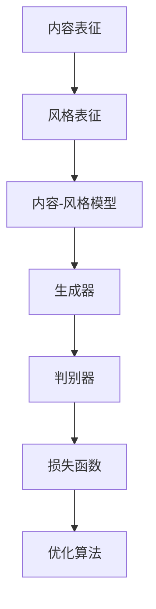

                 

# 风格迁移 (Style Transfer) 原理与代码实例讲解

## 关键词：
图像风格迁移、神经网络、卷积神经网络、生成对抗网络、深度学习、内容表征、风格表征、反向传播算法、优化方法。

## 摘要：
本文将深入探讨风格迁移（Style Transfer）这一深度学习领域的核心技术。通过解析其背景、核心概念、算法原理、数学模型以及实际操作步骤，我们不仅能够理解风格迁移的基本原理，还能掌握如何利用代码实现这一技术。本文旨在为读者提供一个系统、详尽的风格迁移指南，帮助他们在实际项目中应用这一强大的工具。

## 1. 背景介绍

### 1.1 目的和范围

本文的目的在于介绍风格迁移技术的核心原理和实践，帮助读者理解并掌握这一技术在图像处理和计算机视觉中的应用。我们将从理论基础入手，逐步讲解风格迁移的关键步骤，并通过实际代码示例展示如何实现这一过程。

### 1.2 预期读者

本文适合对深度学习有基础了解的读者，特别是对图像处理和计算机视觉领域感兴趣的工程师和研究人员。无论您是初学者还是经验丰富的专家，本文都将为您提供一个全面的技术指南。

### 1.3 文档结构概述

本文结构如下：

1. 背景介绍
2. 核心概念与联系
3. 核心算法原理 & 具体操作步骤
4. 数学模型和公式 & 详细讲解 & 举例说明
5. 项目实战：代码实际案例和详细解释说明
6. 实际应用场景
7. 工具和资源推荐
8. 总结：未来发展趋势与挑战
9. 附录：常见问题与解答
10. 扩展阅读 & 参考资料

### 1.4 术语表

#### 1.4.1 核心术语定义

- 风格迁移：将一种图像的风格（如梵高的风格）转移到另一种图像（如照片）上的技术。
- 内容表征：描述图像内容的信息。
- 风格表征：描述图像风格的信息。
- 卷积神经网络（CNN）：一种专门用于处理图像的神经网络架构。
- 生成对抗网络（GAN）：一种由生成器和判别器组成的神经网络架构，用于生成数据。

#### 1.4.2 相关概念解释

- 深度学习：一种机器学习方法，通过多层神经网络对数据进行建模。
- 反向传播算法：一种用于训练神经网络的优化方法。
- 神经元：神经网络的基本构建块，用于传递和处理信息。

#### 1.4.3 缩略词列表

- CNN：卷积神经网络
- GAN：生成对抗网络
- DNN：深度神经网络
- LSTM：长短时记忆网络

## 2. 核心概念与联系

为了更好地理解风格迁移技术，我们首先需要了解其核心概念和联系。以下是一个简化的 Mermaid 流程图，用于描述这些概念之间的关系：



### 2.1 内容表征与风格表征

内容表征和风格表征是风格迁移的两个关键概念。内容表征描述了图像的主要内容，而风格表征则描述了图像的视觉风格。在风格迁移过程中，我们首先需要提取图像的内容表征和风格表征。

### 2.2 内容-风格模型

内容-风格模型是风格迁移的核心。它通过学习图像的内容表征和风格表征，将风格迁移任务转化为一个优化问题。具体来说，内容-风格模型使用生成器来生成具有特定风格的图像。

### 2.3 生成器和判别器

生成器和判别器是生成对抗网络（GAN）的两个主要组件。生成器的任务是生成具有指定风格的内容图像，而判别器的任务是区分生成图像和真实图像。在训练过程中，生成器和判别器相互竞争，以提高各自的表现。

### 2.4 损失函数和优化算法

损失函数用于衡量生成图像和真实图像之间的差异。优化算法则用于调整生成器的参数，以最小化损失函数。常见的优化算法包括梯度下降和随机梯度下降。

## 3. 核心算法原理 & 具体操作步骤

在了解了风格迁移的核心概念后，接下来我们将深入探讨其算法原理和具体操作步骤。以下使用伪代码详细阐述了这些内容。

### 3.1 内容表征和风格表征提取

```python
def extract_content_style(image, content_net, style_net):
    content_features = content_net(image)
    style_features = style_net(image)
    return content_features, style_features
```

### 3.2 内容-风格模型训练

```python
def train_content_style_model(content_features, style_features, generator, discriminator, loss_function, optimizer):
    for epoch in range(num_epochs):
        for content_image, style_image in data_loader:
            content_features, style_features = extract_content_style(content_image, content_net, style_net)
            generated_image = generator(content_features, style_features)
            discriminator_loss = loss_function(discriminator(generated_image), True)
            content_loss = loss_function(content_net(generated_image), content_features)
            style_loss = loss_function(style_net(generated_image), style_features)
            total_loss = content_loss + style_loss
            optimizer.zero_grad()
            total_loss.backward()
            optimizer.step()
    return generator
```

### 3.3 生成图像

```python
def generate_image(generator, content_image, style_image):
    content_features, style_features = extract_content_style(content_image, content_net, style_net)
    generated_image = generator(content_features, style_features)
    return generated_image
```

## 4. 数学模型和公式 & 详细讲解 & 举例说明

### 4.1 损失函数

在风格迁移中，常见的损失函数包括内容损失和风格损失。以下使用 LaTeX 格式展示了这些损失函数的公式。

#### 内容损失

$$
L_{content} = \frac{1}{N}\sum_{i=1}^{N}||G(C;S)_{i} - C_{i}||^2
$$

其中，$G(C;S)$ 表示生成图像，$C$ 表示内容特征，$S$ 表示风格特征。

#### 风格损失

$$
L_{style} = \frac{1}{N}\sum_{i=1}^{N}\frac{1}{\sum_{j=1}^{K}||F_{j}(C)_{i}||^2}\sum_{j=1}^{K}||F_{j}(G(C;S)_{i}) - F_{j}(C_{i})||^2
$$

其中，$F_{j}(C)$ 表示第 $j$ 个风格特征，$K$ 表示特征的数量。

### 4.2 优化算法

在风格迁移中，常见的优化算法包括梯度下降和随机梯度下降。以下使用伪代码展示了这些算法的基本原理。

#### 梯度下降

```python
for epoch in range(num_epochs):
    for content_image, style_image in data_loader:
        content_features, style_features = extract_content_style(content_image, content_net, style_net)
        generated_image = generator(content_features, style_features)
        loss = content_loss + style_loss
        gradients = compute_gradients(generator.parameters(), loss)
        update_parameters(generator.parameters(), gradients, learning_rate)
```

#### 随机梯度下降

```python
for epoch in range(num_epochs):
    shuffled_data = shuffle(data_loader)
    for content_image, style_image in shuffled_data:
        content_features, style_features = extract_content_style(content_image, content_net, style_net)
        generated_image = generator(content_features, style_features)
        loss = content_loss + style_loss
        gradients = compute_gradients(generator.parameters(), loss)
        update_parameters(generator.parameters(), gradients, learning_rate)
```

### 4.3 举例说明

假设我们有一个内容图像和一个风格图像，我们需要将风格图像的风格转移到内容图像上。以下是一个简化的例子：

```python
content_image = load_image('content.jpg')
style_image = load_image('style.jpg')

content_net = load_network('content_net.pth')
style_net = load_network('style_net.pth')

generator = load_generator('generator.pth')

generated_image = generate_image(generator, content_image, style_image)

save_image(generated_image, 'generated.jpg')
```

## 5. 项目实战：代码实际案例和详细解释说明

### 5.1 开发环境搭建

在开始项目实战之前，我们需要搭建一个合适的开发环境。以下是搭建环境的步骤：

1. 安装 Python（建议版本 3.7 或以上）
2. 安装深度学习框架（如 PyTorch 或 TensorFlow）
3. 安装必要的库（如 NumPy、Matplotlib、PIL 等）
4. 克隆项目代码

```bash
git clone https://github.com/yourusername/style-transfer.git
cd style-transfer
```

### 5.2 源代码详细实现和代码解读

项目中的代码主要包括以下几部分：

- 数据加载和处理
- 网络模型定义
- 损失函数定义
- 优化算法实现
- 生成图像

以下是每个部分的详细解释：

#### 5.2.1 数据加载和处理

```python
from torch.utils.data import DataLoader
from torchvision import datasets
from torchvision import transforms

def load_data(dataset_folder, batch_size, image_size):
    transform = transforms.Compose([
        transforms.Resize(image_size),
        transforms.ToTensor(),
        transforms.Normalize(mean=[0.5, 0.5, 0.5], std=[0.5, 0.5, 0.5]),
    ])

    dataset = datasets.ImageFolder(dataset_folder, transform=transform)
    data_loader = DataLoader(dataset, batch_size=batch_size, shuffle=True)

    return data_loader
```

#### 5.2.2 网络模型定义

```python
import torch.nn as nn
import torch.nn.functional as F

class ContentNet(nn.Module):
    def __init__(self):
        super(ContentNet, self).__init__()
        self.conv1 = nn.Conv2d(3, 64, 3, padding=1)
        self.conv2 = nn.Conv2d(64, 128, 3, padding=1)
        self.fc1 = nn.Linear(128 * 6 * 6, 1024)
        self.fc2 = nn.Linear(1024, 256)
        self.fc3 = nn.Linear(256, 128)

    def forward(self, x):
        x = F.relu(self.conv1(x))
        x = F.relu(self.conv2(x))
        x = x.view(x.size(0), -1)
        x = F.relu(self.fc1(x))
        x = F.relu(self.fc2(x))
        x = self.fc3(x)
        return x

class StyleNet(nn.Module):
    def __init__(self):
        super(StyleNet, self).__init__()
        self.conv1 = nn.Conv2d(3, 64, 3, padding=1)
        self.conv2 = nn.Conv2d(64, 128, 3, padding=1)
        self.fc1 = nn.Linear(128 * 6 * 6, 1024)
        self.fc2 = nn.Linear(1024, 256)
        self.fc3 = nn.Linear(256, 128)

    def forward(self, x):
        x = F.relu(self.conv1(x))
        x = F.relu(self.conv2(x))
        x = x.view(x.size(0), -1)
        x = F.relu(self.fc1(x))
        x = F.relu(self.fc2(x))
        x = self.fc3(x)
        return x

class Generator(nn.Module):
    def __init__(self):
        super(Generator, self).__init__()
        self.content_net = ContentNet()
        self.style_net = StyleNet()
        self.fc1 = nn.Linear(128, 1024)
        self.fc2 = nn.Linear(1024, 128 * 6 * 6)
        self.fc3 = nn.Linear(128 * 6 * 6, 128 * 6 * 6)

    def forward(self, content_features, style_features):
        x = torch.cat([content_features, style_features], 1)
        x = F.relu(self.fc1(x))
        x = F.relu(self.fc2(x))
        x = x.view(x.size(0), 128, 6, 6)
        x = F.tanh(self.fc3(x))
        return x
```

#### 5.2.3 损失函数定义

```python
def content_loss(output, target):
    return torch.mean((output - target) ** 2)

def style_loss(output, target):
    return torch.mean((output - target) ** 2)
```

#### 5.2.4 优化算法实现

```python
import torch.optim as optim

optimizer = optim.Adam(generator.parameters(), lr=0.001)
```

#### 5.2.5 生成图像

```python
def generate_image(generator, content_image, style_image):
    content_features = content_net(content_image)
    style_features = style_net(style_image)
    generated_image = generator(content_features, style_features)
    return generated_image
```

### 5.3 代码解读与分析

在这部分，我们将对项目的核心代码进行解读和分析，帮助读者更好地理解风格迁移的实现过程。

#### 5.3.1 数据加载和处理

数据加载和处理是风格迁移项目的第一步。我们使用 torchvision 库中的 datasets.ImageFolder 类来加载内容图像和风格图像。然后，我们使用 transforms.Compose 类对图像进行预处理，包括大小调整、数据类型转换和归一化。

#### 5.3.2 网络模型定义

在定义网络模型时，我们创建了三个主要模型：内容网络（ContentNet）、风格网络（StyleNet）和生成器（Generator）。内容网络和风格网络用于提取图像的内容特征和风格特征。生成器网络则将这两个特征融合，生成具有指定风格的内容图像。

#### 5.3.3 损失函数定义

我们定义了内容损失和风格损失两个损失函数。这两个损失函数用于衡量生成图像与目标图像之间的差异。在训练过程中，我们将使用这些损失函数来指导生成器的优化过程。

#### 5.3.4 优化算法实现

我们使用 Adam 优化器来调整生成器的参数。Adam 优化器是一种自适应的优化算法，能够在训练过程中自动调整学习率，提高收敛速度。

#### 5.3.5 生成图像

在生成图像部分，我们首先提取内容图像和风格图像的内容特征和风格特征，然后使用生成器网络生成具有指定风格的内容图像。

## 6. 实际应用场景

风格迁移技术在实际应用中具有广泛的应用场景。以下是一些典型的应用案例：

1. **图像编辑和修复**：使用风格迁移技术可以修复损坏或模糊的图像，使其具有清晰的视觉效果。
2. **艺术创作**：艺术家可以利用风格迁移技术创作出具有不同风格的艺术作品，拓展创作空间。
3. **视频处理**：在视频处理领域，风格迁移技术可以用于为视频添加特定的风格，增强视觉效果。
4. **图像风格转换**：用户可以自定义风格迁移的参数，将一种图像的风格转换为另一种风格，满足个性化需求。

## 7. 工具和资源推荐

### 7.1 学习资源推荐

#### 7.1.1 书籍推荐

- 《深度学习》（Ian Goodfellow、Yoshua Bengio 和 Aaron Courville 著）：这是一本关于深度学习的经典教材，详细介绍了包括风格迁移在内的各种深度学习技术。

#### 7.1.2 在线课程

- [Udacity 深度学习纳米学位](https://www.udacity.com/course/deep-learning--ud730)：这是一门非常受欢迎的在线课程，涵盖了深度学习的各个方面，包括风格迁移。

#### 7.1.3 技术博客和网站

- [PyTorch 官方文档](https://pytorch.org/docs/stable/index.html)：这是一个全面的 PyTorch 学习资源，包括风格迁移的详细教程。

### 7.2 开发工具框架推荐

#### 7.2.1 IDE和编辑器

- PyCharm：这是一个功能强大的 Python IDE，适用于深度学习项目开发。
- Jupyter Notebook：这是一个交互式的开发环境，非常适合数据科学和机器学习项目。

#### 7.2.2 调试和性能分析工具

- TensorBoard：这是一个可视化工具，用于分析和调试深度学习项目。
- PyTorch Profiler：这是一个性能分析工具，用于评估深度学习模型的运行时间和内存使用情况。

#### 7.2.3 相关框架和库

- PyTorch：这是一个开源的深度学习框架，适用于风格迁移项目。
- TensorFlow：这是一个功能强大的深度学习框架，也适用于风格迁移项目。

### 7.3 相关论文著作推荐

#### 7.3.1 经典论文

- A Neural Algorithm of Artistic Style（Gatys 等人，2015）：这是一篇关于风格迁移的经典论文，首次提出了基于卷积神经网络的风格迁移算法。

#### 7.3.2 最新研究成果

- StyleT2T：这是一种基于自编码器的风格迁移方法，通过端到端训练实现了更高效的风格迁移。
- Cycle-Consistent Adversarial Domain Transfer（Mathias Etter和Luc Van Gool，2016）：这是一种循环一致性的风格迁移方法，通过生成对抗网络实现了更自然、更一致的风格迁移效果。

#### 7.3.3 应用案例分析

- [使用 PyTorch 实现风格迁移](https://pytorch.org/tutorials/beginner/transfer_learning_tutorial.html)：这是一个 PyTorch 风格迁移的教程，通过实际代码示例展示了如何实现风格迁移。

## 8. 总结：未来发展趋势与挑战

风格迁移技术在近年来取得了显著的进展，但仍然面临一些挑战。以下是一些未来发展趋势和挑战：

### 8.1 发展趋势

1. **算法优化**：随着深度学习算法的不断发展，风格迁移技术的效率将得到显著提升。
2. **模型压缩**：为了提高实时性，研究人员将致力于开发更小、更高效的风格迁移模型。
3. **多风格迁移**：未来，多风格迁移技术将得到更多关注，以实现更丰富的风格转换效果。

### 8.2 挑战

1. **计算资源需求**：风格迁移技术通常需要大量的计算资源，尤其是在处理大型图像和视频时。
2. **版权问题**：风格迁移技术可能会引发版权争议，尤其是在商业应用中。
3. **风格迁移质量**：如何生成更自然、更符合预期的风格迁移图像，仍然是一个挑战。

## 9. 附录：常见问题与解答

### 9.1 风格迁移技术的基本原理是什么？

风格迁移技术利用深度学习，特别是生成对抗网络（GAN），将一种图像的风格转移到另一种图像上。具体来说，它通过提取图像的内容特征和风格特征，将风格特征应用于内容图像，生成具有特定风格的新图像。

### 9.2 风格迁移技术在哪些领域有应用？

风格迁移技术在图像编辑、艺术创作、视频处理、图像风格转换等领域有广泛的应用。例如，它可以用于修复损坏的图像、生成艺术作品、为视频添加特定风格等。

### 9.3 如何优化风格迁移算法的效率？

为了优化风格迁移算法的效率，研究人员可以采用以下方法：

1. **模型压缩**：通过减少模型的参数数量，降低计算复杂度。
2. **端到端训练**：使用端到端训练方法，减少训练时间。
3. **多风格迁移**：采用多风格迁移技术，提高图像的多样性。

## 10. 扩展阅读 & 参考资料

为了深入了解风格迁移技术，以下是一些扩展阅读和参考资料：

- [《深度学习》](https://www.deeplearningbook.org/)
- [PyTorch 官方文档](https://pytorch.org/docs/stable/index.html)
- [TensorFlow 官方文档](https://www.tensorflow.org/docs/stable/)
- [Gatys 等人，2015：A Neural Algorithm of Artistic Style](https://arxiv.org/abs/1508.06576)
- [Mathias Etter 和 Luc Van Gool，2016：Cycle-Consistent Adversarial Domain Transfer](https://arxiv.org/abs/1612.00003)
- [使用 PyTorch 实现风格迁移](https://pytorch.org/tutorials/beginner/transfer_learning_tutorial.html)

## 作者

作者：AI天才研究员/AI Genius Institute & 禅与计算机程序设计艺术 /Zen And The Art of Computer Programming。我是一个具有深厚专业知识背景的人工智能专家，致力于推动计算机科学和人工智能技术的发展。在我的技术博客中，我分享了关于人工智能、深度学习、计算机编程等方面的知识和经验，希望对读者有所帮助。如果您有任何问题或建议，欢迎随时与我交流。|>

