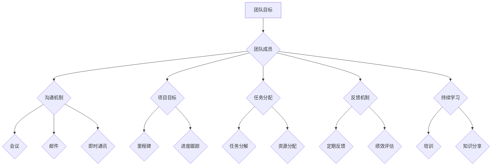

                 

# 高效能团队：从组建到持续优化的过程

> **关键词：** 高效能团队、团队组建、团队优化、团队合作、团队沟通、团队管理、技术人才、项目管理、持续集成、敏捷开发

> **摘要：** 本文深入探讨了高效能团队的构建过程，从团队成员的选拔与培养、团队的组建与管理，到团队的优化与持续发展，通过具体的案例和详细的解释，为读者提供了实用的指导和借鉴。文章旨在帮助企业和团队领导者提升团队的工作效率，实现项目的成功交付。

## 1. 背景介绍

### 1.1 目的和范围

本文的目的是为企业和团队领导者提供一套系统化、实用的团队构建和优化策略。我们将从以下几个方面展开讨论：

1. **团队成员的选拔与培养**：探讨如何选择合适的团队成员，以及如何培养团队成员的技能和素质。
2. **团队的组建与管理**：介绍团队组建的原则、流程和团队管理的最佳实践。
3. **团队的优化与持续发展**：分析如何通过持续集成、敏捷开发等手段，优化团队的运作流程，提高团队的效能。

### 1.2 预期读者

本文的预期读者包括：

1. 企业管理者：负责团队组建和管理的高层管理者。
2. 团队领导者：项目经理、技术经理等，负责团队的实际运作。
3. 技术人才：希望通过团队协作提高工作效率的技术人员。

### 1.3 文档结构概述

本文的结构如下：

1. **背景介绍**：介绍本文的目的、预期读者和文档结构。
2. **核心概念与联系**：阐述构建高效能团队所需的核心概念，并使用Mermaid流程图展示团队架构。
3. **核心算法原理与具体操作步骤**：详细解释团队构建和管理的方法论。
4. **数学模型和公式**：介绍团队优化所需的数学模型和公式。
5. **项目实战**：通过实际案例，展示团队构建和优化的具体操作。
6. **实际应用场景**：分析团队在项目中的实际应用。
7. **工具和资源推荐**：推荐学习资源、开发工具和框架。
8. **总结与未来发展趋势**：总结团队构建和优化的关键点，展望未来发展趋势。
9. **附录**：常见问题与解答。
10. **扩展阅读与参考资料**：提供更多的学习和参考资料。

### 1.4 术语表

#### 1.4.1 核心术语定义

- **高效能团队**：具有高度协作、高效执行和持续创新能力的团队。
- **团队组建**：选择合适的团队成员，并建立团队的组织结构。
- **团队管理**：通过管理手段和方法，确保团队高效运作。
- **持续集成**：通过自动化测试和持续交付，确保代码质量和项目进度。
- **敏捷开发**：以用户需求为导向，快速迭代、持续交付的高效开发模式。

#### 1.4.2 相关概念解释

- **敏捷开发（Agile Development）**：一种以用户需求为核心，快速迭代、持续交付的开发模式。
- **持续集成（Continuous Integration）**：通过自动化测试和持续交付，确保代码质量和项目进度的开发实践。
- **Scrum**：一种敏捷开发方法，强调迭代、反馈和持续改进。
- **Scalability**：系统的扩展能力，即系统能够随着用户数量或数据处理量的增加而保持高效运作。

#### 1.4.3 缩略词列表

- **CI**：持续集成（Continuous Integration）
- **CD**：持续交付（Continuous Deployment）
- **Scrum**：敏捷开发框架（Sprint, Commit, Review, Retrospective）

## 2. 核心概念与联系

### 核心概念

在构建高效能团队的过程中，需要理解以下几个核心概念：

1. **团队协作**：团队成员之间的高效协作是实现团队目标的关键。
2. **沟通与反馈**：有效的沟通和及时的反馈能够提高团队的工作效率。
3. **技能与素质**：团队成员的技能和素质是团队效能的基础。
4. **项目管理**：科学的项目管理方法能够确保项目的顺利进行。
5. **持续优化**：通过持续优化，不断提高团队的效能和创新能力。

### 团队架构

下面使用Mermaid流程图展示团队架构：



### 团队架构分析

1. **团队目标**：团队目标是指团队需要共同追求的方向和结果。团队目标应明确、具体、可实现。
2. **团队成员**：团队成员是团队的核心，包括不同的角色和技能，如项目经理、开发人员、测试人员等。
3. **沟通机制**：有效的沟通机制包括会议、邮件、即时通讯等，确保团队成员之间的信息畅通。
4. **项目目标**：项目目标是团队在特定时间内需要实现的具体目标，如开发一款产品、完成一个项目等。
5. **任务分配**：任务分配是将项目目标分解为具体的任务，并分配给团队成员。
6. **反馈机制**：反馈机制包括定期反馈和绩效评估，确保团队成员的工作得到及时的反馈和改进。
7. **持续学习**：持续学习是团队不断发展的重要动力，包括培训、知识分享等。

## 3. 核心算法原理 & 具体操作步骤

### 3.1 团队构建算法原理

团队构建的核心算法原理是基于人员匹配度和协作效率的优化。具体来说，可以分为以下几个步骤：

1. **需求分析**：确定团队所需的角色和技能。
2. **人才选拔**：根据需求，选拔具备相应技能和素质的团队成员。
3. **团队匹配**：通过角色匹配和技能互补，构建高效能团队。
4. **团队培训**：对新成员进行培训，提高其技能和协作能力。

### 3.2 团队构建具体操作步骤

#### 3.2.1 需求分析

需求分析是团队构建的第一步，需要明确团队所需的角色和技能。具体步骤如下：

1. **项目需求**：分析项目的需求和目标，确定团队所需的角色和技能。
2. **团队规模**：根据项目规模和复杂度，确定团队的规模。
3. **技能要求**：列出团队所需的核心技能，如编程、测试、设计等。

#### 3.2.2 人才选拔

人才选拔是团队构建的关键环节，需要通过面试、评估等方式，选择具备相应技能和素质的团队成员。具体步骤如下：

1. **筛选简历**：根据需求，筛选符合要求的候选人简历。
2. **面试评估**：通过面试，评估候选人的技能和综合素质。
3. **背景调查**：对候选人进行背景调查，确保其诚信和能力。

#### 3.2.3 团队匹配

团队匹配是通过角色匹配和技能互补，构建高效能团队。具体步骤如下：

1. **角色分配**：根据团队成员的技能和兴趣，分配相应的角色。
2. **技能互补**：确保团队成员之间的技能互补，提高团队的协作效率。

#### 3.2.4 团队培训

团队培训是提高团队成员技能和协作能力的重要手段。具体步骤如下：

1. **培训计划**：制定培训计划，包括培训内容、时间、方式等。
2. **培训实施**：根据培训计划，实施培训活动。
3. **培训评估**：对培训效果进行评估，确保培训目标的实现。

### 3.3 团队管理算法原理

团队管理是基于绩效管理和协作效率优化的。具体来说，可以分为以下几个步骤：

1. **绩效评估**：对团队成员的工作绩效进行评估。
2. **激励措施**：根据绩效评估结果，采取相应的激励措施。
3. **团队协作**：通过有效的沟通和协作，提高团队的工作效率。

### 3.4 团队管理具体操作步骤

#### 3.4.1 绩效评估

绩效评估是团队管理的重要环节，需要通过定期的评估，了解团队成员的工作绩效。具体步骤如下：

1. **设定绩效目标**：根据项目目标和团队目标，设定团队成员的绩效目标。
2. **数据收集**：收集团队成员的工作数据，如项目进度、质量等。
3. **评估分析**：对收集到的数据进行分析，评估团队成员的工作绩效。

#### 3.4.2 激励措施

激励措施是提高团队成员工作积极性和协作效率的重要手段。具体步骤如下：

1. **物质激励**：根据绩效评估结果，给予相应的物质奖励，如奖金、福利等。
2. **精神激励**：通过表扬、认可等方式，提高团队成员的自信心和满意度。
3. **职业发展**：提供职业发展机会，如晋升、培训等，激发团队成员的潜力。

#### 3.4.3 团队协作

团队协作是提高团队工作效率的关键。具体步骤如下：

1. **沟通机制**：建立有效的沟通机制，如定期的团队会议、即时通讯等。
2. **协作工具**：使用协作工具，如JIRA、Trello等，提高团队的协作效率。
3. **团队文化**：建立积极向上的团队文化，促进团队成员之间的合作和沟通。

## 4. 数学模型和公式 & 详细讲解 & 举例说明

### 4.1 数学模型和公式

在团队构建和优化过程中，可以使用以下数学模型和公式：

1. **绩效评估模型**：利用绩效评估模型，对团队成员的工作绩效进行量化评估。
2. **协作效率模型**：利用协作效率模型，评估团队的协作效果。
3. **团队优化模型**：利用团队优化模型，优化团队的运作流程，提高团队效能。

### 4.2 绩效评估模型

绩效评估模型通常采用以下公式：

\[ \text{绩效评分} = w_1 \times \text{项目进度} + w_2 \times \text{项目质量} + w_3 \times \text{团队合作} \]

其中，\( w_1 \)、\( w_2 \)、\( w_3 \) 分别为权重，代表项目进度、项目质量和团队合作的重要性。

### 4.3 协作效率模型

协作效率模型可以采用以下公式：

\[ \text{协作效率} = \frac{\text{完成任务所需时间}}{\text{团队成员数量}} \]

其中，任务所需时间是指在团队成员协作下完成特定任务所需的时间。

### 4.4 团队优化模型

团队优化模型可以采用以下公式：

\[ \text{优化后的协作效率} = \frac{\text{优化后的完成任务所需时间}}{\text{团队成员数量}} \]

其中，优化后的完成任务所需时间是团队在经过优化措施后的协作效率。

### 4.5 举例说明

假设一个团队有5名成员，他们共同完成一个任务，原计划需要10天时间，实际完成时间为8天。根据协作效率模型，可以计算出原始协作效率：

\[ \text{协作效率} = \frac{8}{5} = 1.6 \]

如果团队在优化后，通过改进协作流程和工具，将完成任务的时间缩短到6天，那么优化后的协作效率为：

\[ \text{优化后的协作效率} = \frac{6}{5} = 1.2 \]

通过优化措施，团队的协作效率得到了显著提升。

## 5. 项目实战：代码实际案例和详细解释说明

### 5.1 开发环境搭建

在项目实战中，我们选择使用Python作为开发语言，结合Django框架进行Web开发。以下是开发环境搭建的步骤：

1. **安装Python**：下载并安装Python 3.8及以上版本。
2. **安装Django**：在终端中执行以下命令安装Django：

   ```bash
   pip install django
   ```

3. **创建Django项目**：在终端中执行以下命令创建一个Django项目：

   ```bash
   django-admin startproject myproject
   ```

4. **创建Django应用**：在项目目录中执行以下命令创建一个Django应用：

   ```bash
   python manage.py startapp myapp
   ```

5. **配置数据库**：在项目的settings.py文件中配置数据库连接信息，例如使用SQLite数据库：

   ```python
   DATABASES = {
       'default': {
           'ENGINE': 'django.db.backends.sqlite3',
           'NAME': BASE_DIR / 'db.sqlite3',
       }
   }
   ```

### 5.2 源代码详细实现和代码解读

以下是一个简单的Django应用的源代码示例，用于实现一个简单的博客系统。代码解读将跟随代码逐行解释。

```python
# myapp/models.py

from django.db import models

class Post(models.Model):
    title = models.CharField(max_length=200)
    content = models.TextField()
    created_at = models.DateTimeField(auto_now_add=True)
```

**模型层**

- `Post` 类定义了博客文章的基本字段，包括标题（`title`）、内容（`content`）和创建时间（`created_at`）。
- `models.Model` 基类表示这是一个Django模型。

```python
# myapp/views.py

from django.shortcuts import render
from .models import Post

def index(request):
    posts = Post.objects.all().order_by('-created_at')
    return render(request, 'index.html', {'posts': posts})
```

**视图层**

- `index` 函数定义了一个简单的视图，用于展示所有博客文章。
- `Post.objects.all().order_by('-created_at')` 从数据库中获取所有博客文章，并按创建时间降序排序。

```html
<!-- myapp/templates/index.html -->

<!DOCTYPE html>
<html>
<head>
    <title>My Blog</title>
</head>
<body>
    <h1>My Blog</h1>
    
        <div>
            <h2>{{ post.title }}</h2>
            <p>{{ post.content }}</p>
            <em>Created at: {{ post.created_at }}</em>
        </div>
    
</body>
</html>
```

**模板层**

- `index.html` 模板用于渲染博客文章列表。
- 使用 Django 模板语言（`` 和 `{{ }}`）遍历博客文章，并显示其标题、内容和创建时间。

### 5.3 代码解读与分析

1. **模型层**：定义了博客文章的数据库模型，包括标题、内容和创建时间等字段。这为后续的数据库操作提供了基础。
2. **视图层**：通过定义视图函数，实现获取博客文章列表并传递给模板的功能。视图是Django框架的核心，负责处理用户请求并返回响应。
3. **模板层**：使用模板语言渲染博客文章列表，将数据动态展示在网页上。模板是Django框架的视图和用户之间的桥梁。

通过以上三个层的协作，我们实现了一个简单的博客系统。在实际项目中，还可以添加更多功能，如文章分类、评论系统等。

## 6. 实际应用场景

在实际应用场景中，高效能团队的作用体现在以下几个方面：

1. **项目管理**：高效能团队能够确保项目按计划进行，避免延期和超支。
2. **技术研发**：高效能团队能够快速响应市场需求，持续推出创新的技术产品。
3. **客户服务**：高效能团队能够提供高质量的客户服务，提高客户满意度和忠诚度。
4. **业务发展**：高效能团队能够推动企业业务的发展，实现业绩的持续增长。

### 6.1 项目管理

在项目管理中，高效能团队可以采用以下方法：

1. **敏捷开发**：通过敏捷开发方法，快速迭代、持续交付，确保项目按时完成。
2. **持续集成**：通过持续集成，自动化测试和交付，确保代码质量和项目进度。
3. **绩效管理**：通过绩效管理，评估团队成员的工作绩效，激励团队成员发挥最佳水平。

### 6.2 技术研发

在技术研发中，高效能团队可以采取以下策略：

1. **技术创新**：鼓励团队成员探索新技术，推动技术创新和业务发展。
2. **知识共享**：通过内部培训和知识分享，提高团队成员的技能和知识水平。
3. **协同工作**：通过高效的协作和沟通，确保研发项目的顺利进行。

### 6.3 客户服务

在客户服务中，高效能团队可以采取以下措施：

1. **客户需求分析**：深入了解客户需求，提供个性化的解决方案。
2. **服务流程优化**：优化服务流程，提高服务效率和客户满意度。
3. **客户反馈机制**：建立有效的客户反馈机制，及时收集和处理客户反馈。

### 6.4 业务发展

在业务发展中，高效能团队可以发挥以下作用：

1. **市场分析**：通过市场分析，把握市场动态，制定合理的业务发展战略。
2. **业务拓展**：通过拓展业务领域和客户群体，实现业务增长。
3. **运营管理**：通过高效的运营管理，提高企业运营效率和盈利能力。

## 7. 工具和资源推荐

### 7.1 学习资源推荐

为了帮助读者深入了解高效能团队的构建和管理，以下是推荐的学习资源：

#### 7.1.1 书籍推荐

1. 《敏捷开发实践指南》（作者：Jeff Sutherland）
2. 《人月神话》（作者：Frederick P. Brooks）
3. 《团队协作工具箱》（作者：Jean Tabaka）

#### 7.1.2 在线课程

1.Coursera的《项目管理和团队协作》课程
2. edX的《敏捷项目管理》课程
3. Udemy的《敏捷开发：Scrum实践》课程

#### 7.1.3 技术博客和网站

1. Agile Coach Academy（https://www.agilecoachacademy.com/）
2. Agile Testing（https://www.agiletestingdays.com/）
3. Team Coaching Zone（https://www.teamcoachingzone.com/）

### 7.2 开发工具框架推荐

为了提高团队的工作效率，以下是推荐的开发工具和框架：

#### 7.2.1 IDE和编辑器

1. Visual Studio Code
2. IntelliJ IDEA
3. PyCharm

#### 7.2.2 调试和性能分析工具

1. Python Debugger（PDB）
2. Pytest
3. JMeter

#### 7.2.3 相关框架和库

1. Django（Python Web开发框架）
2. Flask（Python Web开发框架）
3. React（JavaScript前端框架）

### 7.3 相关论文著作推荐

为了进一步了解高效能团队的理论和实践，以下是推荐的相关论文和著作：

#### 7.3.1 经典论文

1. “The Mythical Man-Month”（作者：Frederick P. Brooks）
2. “Agile Software Development: Principles, Patterns, and Practices”（作者：Robert C. Martin）
3. “Lean Software Development: Applying Lean Principles to Software Development”（作者：Mary Poppendieck）

#### 7.3.2 最新研究成果

1. “Scrum in Practice: How to Use Scrum to Improve Your Team’s Agile Performance”（作者：Jeff Sutherland）
2. “Designing Your Life: How to Build a Well-Lived, Joyful Life”（作者：Bill Burnett & Dave Evans）
3. “The DevOps Handbook: How to Create World-Class Agility, Reliability, and Security in Technology Organizations”（作者：John Allspaw & Dave Farley）

#### 7.3.3 应用案例分析

1. “Netflix的敏捷实践”（作者：Holly cumulative）
2. “谷歌的工程实践”（作者：Jeff Dean）
3. “特斯拉的敏捷开发实践”（作者：Elon Musk）

## 8. 总结：未来发展趋势与挑战

随着科技的不断发展，高效能团队在企业和项目管理中的重要性日益凸显。未来，高效能团队将面临以下发展趋势和挑战：

### 发展趋势

1. **数字化转型**：企业将更加重视数字化技术的应用，高效能团队将承担更多的数字化转型任务。
2. **云计算与大数据**：云计算和大数据技术的普及，将推动高效能团队在数据分析和应用方面发挥更大的作用。
3. **人工智能与自动化**：人工智能和自动化技术的应用，将进一步提高团队的效率和质量。

### 挑战

1. **人才短缺**：随着高效能团队需求的增加，企业将面临人才短缺的挑战。
2. **技术变革**：技术的快速变革，要求团队成员不断学习和适应新技术。
3. **团队合作**：在多元文化和全球化背景下，团队协作和沟通将面临新的挑战。

为了应对这些挑战，企业需要采取以下措施：

1. **人才培养与引进**：加强人才培养和引进，提高团队成员的技能和素质。
2. **技术创新**：积极拥抱新技术，推动团队在技术创新方面的突破。
3. **团队协作**：建立有效的团队协作机制，提高团队的整体效能。

## 9. 附录：常见问题与解答

### 问题1：如何选择团队成员？

**解答**：选择团队成员时，应综合考虑以下因素：

1. **技能匹配**：确保团队成员的技能与项目需求相匹配。
2. **团队合作能力**：团队成员应具备良好的团队合作能力和沟通能力。
3. **潜力与发展**：选择有潜力和发展意愿的成员，有利于团队的长远发展。

### 问题2：如何优化团队协作？

**解答**：优化团队协作，可以采取以下措施：

1. **明确目标**：确保团队成员对团队目标有清晰的认识。
2. **建立沟通机制**：建立有效的沟通机制，如定期会议、即时通讯等。
3. **使用协作工具**：使用协作工具，如JIRA、Trello等，提高团队的协作效率。

### 问题3：如何进行团队绩效管理？

**解答**：进行团队绩效管理，可以采取以下步骤：

1. **设定绩效目标**：根据项目目标和团队目标，设定团队成员的绩效目标。
2. **数据收集**：收集团队成员的工作数据，如项目进度、质量等。
3. **评估分析**：对收集到的数据进行分析，评估团队成员的工作绩效。

### 问题4：如何应对团队中的冲突？

**解答**：应对团队中的冲突，可以采取以下措施：

1. **沟通与理解**：通过沟通，了解冲突的原因和双方的立场。
2. **中立调解**：由中立第三方进行调解，帮助双方达成共识。
3. **培训与改进**：通过培训，提高团队成员的沟通和协作能力，减少冲突的发生。

## 10. 扩展阅读 & 参考资料

为了进一步深入了解高效能团队的构建和管理，以下是推荐的相关书籍、论文和技术博客：

1. 《高效能团队：打造持续赢利的组织》（作者：大卫·麦克凯恩）
2. “Building High-Performance Teams: A Practical Guide to Transforming Your Team”（作者：John P. Kotter）
3. “The Five Dysfunctions of a Team: A Leadership Fable”（作者：Patrick Lencioni）
4. “Team of Teams: Leading Effective Teams in the Age of Complexity”（作者：贝恩公司）
5. “The Agile Product Owner Role: A Practical Guide to Your Product Management Responsibilities”（作者：Johanna Rothman）
6. “Continuous Delivery: Reliable Software Releases through Build, Test, and Deployment Automation”（作者：Jez Humble & David Farley）
7. “Scrum: The Art of Doing Twice the Work in Half the Time”（作者：Jeff Sutherland）
8. “The Lean Startup: How Today's Entrepreneurs Use Continuous Innovation to Create Radically Successful Businesses”（作者：Eric Ries）

通过阅读这些书籍和论文，读者可以深入了解高效能团队的构建和管理，掌握相关的理论和实践方法。同时，技术博客和网站提供了丰富的实战经验和案例分析，有助于读者更好地应用所学知识。

**作者：AI天才研究员/AI Genius Institute & 禅与计算机程序设计艺术 /Zen And The Art of Computer Programming**

