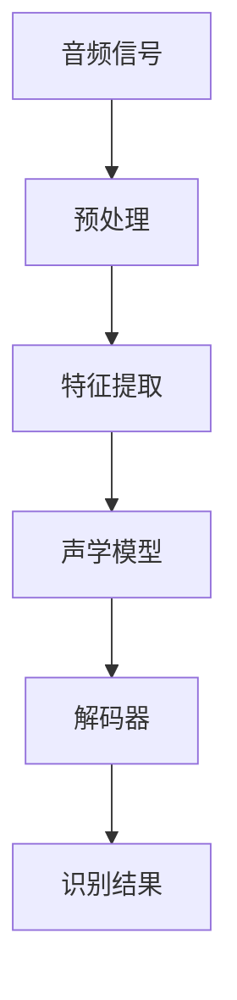
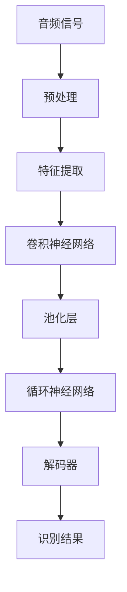

                 

### 《AI 2.0 时代的语音识别》

> **关键词：**语音识别，AI 2.0，深度学习，自然语言处理，应用领域

> **摘要：**本文深入探讨了AI 2.0时代语音识别技术的核心概念、发展历程、关键技术及其在各个领域的应用。文章通过逐步分析，揭示了语音识别技术的本质和未来发展趋势，旨在为读者提供全面的技术视角和理解框架。

#### 目录大纲

1. 第一部分: 语音识别技术基础
   1.1 语音识别概述
   1.2 语音信号处理
   1.3 语言模型与词汇表
2. 第二部分: AI 2.0 时代的语音识别技术
   2.1 深度学习在语音识别中的应用
   2.2 语音识别系统的优化
   2.3 语音识别在AI 2.0时代的应用
3. 第三部分: 实践案例与项目实战
   3.1 语音识别项目实战
   3.2 语音识别工具与资源
4. 附录
   4.1 语音识别相关数学公式
   4.2 语音识别相关流程图
   4.3 代码样例

### 引言

在过去的几十年里，语音识别技术已经取得了显著的发展。从最早的基于规则的方法到后来的统计模型，再到现在的深度学习，语音识别技术的准确性和实用性不断提升。然而，随着人工智能（AI）技术的不断演进，特别是AI 2.0时代的到来，语音识别技术迎来了新的机遇和挑战。

AI 2.0时代，指的是以深度学习和神经网络为代表的人工智能技术的快速发展时期。这一时代的到来，为语音识别技术带来了巨大的变革。传统的语音识别方法逐渐被深度学习模型所取代，使得语音识别系统的准确率和效率大幅提升。同时，AI 2.0时代还带来了更多的应用场景，如智能助手、自然语言理解、智能家居等，这些场景对语音识别技术提出了更高的要求。

本文将围绕AI 2.0时代的语音识别技术展开讨论，首先回顾语音识别技术的基础知识，然后深入探讨深度学习在语音识别中的应用，以及语音识别系统的优化方法。接着，我们将探讨语音识别在AI 2.0时代各个领域的应用，最后，通过实际案例和项目实战，展示语音识别技术的应用潜力和未来发展趋势。

### 第一部分: 语音识别技术基础

#### 第1章: 语音识别概述

语音识别（Automatic Speech Recognition，ASR）是指将人类的语音信号转换为相应的文本或命令的技术。语音识别技术是人工智能（AI）领域的一个重要分支，它涉及到语音信号处理、模式识别、自然语言处理等多个学科。

#### 1.1 语音识别的定义与发展历程

语音识别技术最早可以追溯到20世纪50年代。当时，研究人员开始探索如何使用计算机模拟人类的听觉系统，实现语音到文本的转换。早期的语音识别方法主要基于规则，即通过编写一系列规则来识别语音中的单词和短语。

随着计算机性能的提升和算法的改进，语音识别技术逐渐从基于规则的方法转向基于统计的方法。20世纪80年代，隐马尔可夫模型（HMM）成为了语音识别的主要方法。HMM能够较好地处理语音信号的时变特性，从而提高了语音识别的准确性。

进入21世纪，深度学习技术的崛起为语音识别带来了新的变革。深度学习模型，如卷积神经网络（CNN）和长短期记忆网络（LSTM），具有强大的特征提取和时序建模能力，使得语音识别技术的准确率达到了新的高度。特别是2014年，谷歌推出基于深度学习的语音识别系统，使得语音识别的错误率首次低于5%，这一成果被认为是语音识别技术的一个重大突破。

#### 1.2 语音识别的关键技术

语音识别技术涉及到多个关键技术的应用，主要包括语音信号处理、声学模型、语言模型等。

##### 1.2.1 语音信号处理

语音信号处理是语音识别的基础，主要包括语音信号的采集、预处理和特征提取。语音信号的采集通常使用麦克风进行，然后通过A/D转换将模拟信号转换为数字信号。预处理包括去噪、增强和归一化等步骤，以消除噪声和提高语音信号的清晰度。特征提取是从语音信号中提取能够表征语音信息的特征，如频谱特征、倒谱特征等。

##### 1.2.2 声学模型

声学模型是语音识别的核心，用于将语音信号转换为声学特征。早期的声学模型主要基于Gaussian Mixture Model（GMM），后来发展出隐马尔可夫模型（HMM）。近年来，深度学习模型，如卷积神经网络（CNN）和长短期记忆网络（LSTM），被广泛应用于声学模型，取得了显著的性能提升。

##### 1.2.3 语言模型

语言模型是语音识别中用于预测文本的模型。它通过学习大量的文本数据，建立语言概率分布模型，从而提高语音识别的准确性。语言模型的主要任务是从给定的声学特征序列中，生成最可能的文本序列。常用的语言模型包括N元语法模型和神经网络语言模型。

#### 1.3 语音识别的应用领域

语音识别技术具有广泛的应用领域，主要包括以下几个方面：

##### 1.3.1 智能助手

智能助手是语音识别技术最典型的应用场景之一。通过语音识别技术，智能助手可以理解用户的语音命令，并执行相应的操作，如查询信息、发送消息、播放音乐等。

##### 1.3.2 自然语言理解

自然语言理解（NLU）是指使计算机能够理解人类语言的能力。语音识别技术是实现NLU的重要手段，通过将语音转换为文本，可以进一步进行语义分析和意图识别。

##### 1.3.3 智能家居

智能家居通过语音识别技术，可以实现语音控制家庭设备，如照明、空调、电视等，提高了家居的便利性和智能化水平。

##### 1.3.4 健康医疗

语音识别技术在健康医疗领域也有广泛的应用，如语音病历记录、语音辅助诊断等，可以减少医护人员的工作量，提高医疗效率。

##### 1.3.5 教育

在教育领域，语音识别技术可以用于语音评测、语音互动教学等，提高教学效果和学生的参与度。

#### 第2章: 语音信号处理

语音信号处理是语音识别的基础，它涉及到语音信号的采集、预处理和特征提取。

##### 2.1 语音信号特征提取

语音信号特征提取是从语音信号中提取能够表征语音信息的特征。这些特征包括频谱特征、倒谱特征、音素特征等。

频谱特征是指语音信号的频域特性，常用的频谱特征包括短时傅里叶变换（STFT）和梅尔频谱（Mel-spectrogram）。

倒谱特征是频谱特征的倒频谱，它能够消除语音信号的短时频率变化，保留语音信号的短时幅度信息。

音素特征是基于音素音系特征的描述，它能够区分不同音素的发音特点。

##### 2.2 声学模型

声学模型是语音识别的核心，它用于将语音信号转换为声学特征。声学模型主要包括Gaussian Mixture Model（GMM）和隐马尔可夫模型（HMM）。

GMM是一种概率分布模型，用于表示语音信号的概率分布。在语音识别中，GMM被用来表示语音单元的概率分布。

HMM是一种统计模型，用于描述语音信号的时变特性。在语音识别中，HMM被用来建模语音信号的状态转移和观测概率。

##### 2.3 时序建模方法

时序建模方法用于描述语音信号的时变特性。深度学习模型，如卷积神经网络（CNN）和长短期记忆网络（LSTM），被广泛应用于时序建模。

CNN是一种卷积神经网络，具有强大的特征提取和时序建模能力。在语音识别中，CNN被用来提取语音信号的时序特征。

LSTM是一种长短期记忆网络，能够有效处理长序列数据。在语音识别中，LSTM被用来建模语音信号的时序变化。

#### 第3章: 语言模型与词汇表

语言模型是语音识别中的重要组成部分，它用于预测语音信号对应的文本序列。语言模型的基本概念包括词汇表、N元语法模型和神经网络语言模型。

##### 3.1 语言模型的基本概念

词汇表是语言模型的基础，它包含所有的单词和短语。在语言模型中，词汇表被用来表示文本序列。

N元语法模型是一种基于统计的语言模型，它通过学习文本数据中的N元组合概率来预测下一个单词。N元语法模型具有简洁和高效的特点，被广泛应用于语音识别和自然语言处理。

神经网络语言模型是一种基于深度学习的语言模型，它通过学习大量的文本数据，建立语言概率分布模型。神经网络语言模型具有强大的表示能力和预测能力，能够有效提高语音识别的准确性。

##### 3.2 语言模型的训练方法

语言模型的训练方法主要包括基于频次的方法和基于概率的方法。

基于频次的方法通过统计文本数据中单词和短语的出现频次来训练语言模型。这种方法简单直观，但容易受到数据分布不均的影响。

基于概率的方法通过学习文本数据中的概率分布来训练语言模型。这种方法能够更好地反映文本数据中的概率关系，但计算复杂度较高。

##### 3.3 词汇表构建与优化

词汇表的构建是语言模型训练的关键步骤。词汇表的构建方法主要包括手动构建和自动构建。

手动构建词汇表通常需要大量的时间和人力，适用于小规模的语言模型。自动构建词汇表通过算法自动提取文本数据中的高频词汇，适用于大规模的语言模型。

词汇表的优化方法主要包括词干提取、词性标注和词义消歧等。这些方法可以进一步提高语言模型的准确性和性能。

### 第二部分: AI 2.0 时代的语音识别技术

随着AI 2.0时代的到来，深度学习等先进技术被广泛应用于语音识别领域，推动了语音识别技术的快速发展。本部分将深入探讨深度学习在语音识别中的应用、语音识别系统的优化方法，以及语音识别在AI 2.0时代的应用。

#### 第4章: 深度学习在语音识别中的应用

深度学习在语音识别中的应用极大地提高了语音识别的准确性和效率。本章将介绍几种常用的深度学习模型，如卷积神经网络（CNN）、长短期记忆网络（LSTM）和生成对抗网络（GAN），以及它们在语音识别中的具体应用。

##### 4.1 卷积神经网络（CNN）在语音识别中的应用

卷积神经网络（CNN）是一种强大的深度学习模型，具有强大的特征提取能力。在语音识别中，CNN被广泛应用于声学模型的构建。

声学模型的构建通常包括两个阶段：特征提取和序列建模。在特征提取阶段，CNN用于提取语音信号的时域特征。具体来说，输入语音信号首先通过一个卷积层，该卷积层能够提取语音信号的局部特征。然后，通过一个池化层，降低特征图的大小，减少模型的参数数量。接下来，通过一系列卷积层和池化层的组合，逐步提取更高层次的特征。

在序列建模阶段，CNN通常与循环神经网络（RNN）结合使用，如LSTM或GRU，来建模语音信号的时序特征。具体来说，输入的语音信号被展平为一维序列，然后通过LSTM或GRU，将时序特征转化为序列标签。最后，通过一个全连接层输出最终的识别结果。

##### 4.2 长短期记忆网络（LSTM）在语音识别中的应用

长短期记忆网络（LSTM）是一种循环神经网络（RNN）的特殊形式，具有强大的时序建模能力。在语音识别中，LSTM被广泛应用于语言模型的构建。

语言模型的构建通常基于大量的文本数据，LSTM通过学习文本数据中的概率分布来预测下一个单词。具体来说，输入的文本序列首先通过一个嵌入层，将单词转换为固定大小的向量。然后，通过一个LSTM层，将文本序列的时序特征转化为序列概率分布。最后，通过一个softmax层输出最终的识别结果。

LSTM在语音识别中的应用不仅能够提高语音识别的准确性，还能够有效处理长序列数据，如长对话和语音指令。

##### 4.3 生成对抗网络（GAN）在语音识别中的应用

生成对抗网络（GAN）是一种由生成器和判别器组成的深度学习模型，具有强大的生成能力。在语音识别中，GAN被广泛应用于语音合成的任务。

语音合成是将文本转换为语音的过程。生成器在GAN中用于生成语音信号，判别器用于区分真实的语音信号和生成的语音信号。通过训练生成器和判别器的对抗过程，生成器能够学习到如何生成逼真的语音信号。

GAN在语音合成中的应用不仅能够生成高质量的语音，还能够通过迁移学习，将一个模型的语音特征迁移到另一个模型上，从而提高语音识别的准确性和鲁棒性。

#### 第5章: 语音识别系统的优化

随着语音识别技术的不断发展，语音识别系统的优化变得越来越重要。本章将介绍几种常用的语音识别系统优化方法，如多任务学习与迁移学习、模型压缩与量化、能效优化与实时性提升。

##### 5.1 多任务学习与迁移学习

多任务学习与迁移学习是优化语音识别系统的重要方法。多任务学习是指在一个神经网络模型中同时学习多个任务，如语音识别、语音增强和语音合成。通过多任务学习，模型能够共享不同任务之间的特征，从而提高模型的泛化能力和性能。

迁移学习是指将一个模型在特定任务上的知识迁移到另一个任务上。在语音识别中，迁移学习可以通过在预训练的模型上进一步训练，将语音特征迁移到新的语音识别任务上。通过迁移学习，模型能够快速适应新的任务，提高模型的训练效率和准确性。

##### 5.2 模型压缩与量化

模型压缩与量化是优化语音识别系统的重要方法。模型压缩通过减少模型的参数数量和计算复杂度，降低模型的存储和计算成本。量化是通过将模型的权重和激活值从浮点数转换为整数，进一步减少模型的存储和计算成本。

在语音识别中，模型压缩与量化可以通过多种方法实现，如剪枝、量化、知识蒸馏等。通过模型压缩与量化，模型能够在保持较高准确性的同时，显著降低计算资源的需求。

##### 5.3 能效优化与实时性提升

能效优化与实时性提升是优化语音识别系统的重要目标。在实时语音识别任务中，模型的计算速度和能效成为关键因素。

能效优化通过优化模型的计算复杂度和资源利用，降低模型的能耗。具体方法包括模型压缩、量化、硬件加速等。

实时性提升通过优化模型的计算速度，确保模型能够在实时任务中快速响应。具体方法包括模型优化、并行计算、分布式计算等。

#### 第6章: 语音识别在AI 2.0时代的应用

AI 2.0时代的到来为语音识别技术带来了广泛的应用场景。本章将介绍语音识别在智能助手、自然语言理解、智能家居等领域的应用，探讨语音识别技术在AI 2.0时代的发展趋势。

##### 6.1 语音识别在智能助手中的应用

智能助手是语音识别技术最典型的应用场景之一。通过语音识别技术，智能助手能够理解用户的语音命令，并执行相应的操作。智能助手的应用场景包括语音搜索、语音控制家庭设备、语音聊天等。

在语音搜索中，用户可以通过语音命令快速搜索信息，如天气、新闻、电影等。在语音控制家庭设备中，用户可以通过语音命令控制家庭设备，如灯光、空调、电视等。在语音聊天中，用户可以通过语音与智能助手进行实时对话，获取信息或完成任务。

##### 6.2 语音识别在自然语言理解中的应用

自然语言理解是指使计算机能够理解人类语言的能力。语音识别技术是实现自然语言理解的重要手段。通过语音识别，将语音转换为文本，然后通过自然语言处理技术，实现对语音内容的理解和分析。

在自然语言理解中，语音识别技术可以用于语音问答、语音翻译、语音情感分析等任务。通过语音识别技术，计算机可以更好地理解用户的语音输入，提供更准确和个性化的服务。

##### 6.3 语音识别在智能家居中的应用

智能家居通过语音识别技术，可以实现语音控制家庭设备，提高家居的便利性和智能化水平。语音识别技术在智能家居中的应用场景包括语音控制灯光、语音控制空调、语音控制电视等。

通过语音识别技术，用户可以轻松地通过语音命令控制家庭设备，实现远程控制和自动化控制。语音识别技术的应用，使得智能家居更加便捷和智能，提升了用户的居住体验。

#### 第7章: 语音识别技术的未来发展趋势

随着AI 2.0时代的到来，语音识别技术将继续快速发展，并在更多领域得到应用。本章将探讨语音识别技术的未来发展趋势，包括语音识别与多模态交互、语音识别在新兴领域的应用，以及语音识别技术的挑战与机遇。

##### 7.1 语音识别与多模态交互

多模态交互是指将语音识别与其他感官信号（如视觉、触觉）结合，实现更丰富和自然的交互方式。语音识别与多模态交互的融合，将进一步提高人机交互的效率和体验。

未来，语音识别技术将与其他感官信号结合，实现更智能化和个性化的交互。例如，通过视觉识别，智能助手可以识别用户的身份和情绪，提供更个性化的服务。通过触觉识别，智能助手可以感知用户的行为和需求，实现更自然的交互。

##### 7.2 语音识别在新兴领域的应用

随着科技的不断发展，语音识别技术在新兴领域也将得到广泛应用。例如，在医疗领域，语音识别技术可以用于语音病历记录、语音辅助诊断等，提高医疗效率。在自动驾驶领域，语音识别技术可以用于语音导航、语音交互等，提高驾驶安全和便捷性。

未来，语音识别技术将在更多新兴领域得到应用，推动人工智能技术的发展。

##### 7.3 语音识别技术的挑战与机遇

尽管语音识别技术取得了显著的进展，但仍面临一些挑战和机遇。挑战包括语音信号的多样性、噪声干扰、多语种支持等。机遇包括深度学习技术的不断发展、硬件设备的升级、大数据的积累等。

未来，语音识别技术将在不断解决挑战的同时，抓住机遇，实现更广泛和深入的应用。

### 第三部分: 实践案例与项目实战

#### 第8章: 语音识别项目实战

在本章中，我们将通过一个具体的语音识别项目实战，展示语音识别技术的实际应用过程。该项目将包括项目背景与需求分析、开发环境搭建、源代码详细实现以及代码解读与分析。

##### 8.1 项目背景与需求分析

该项目是一个基于深度学习的语音识别系统，旨在实现实时语音转文字的功能。具体需求如下：

1. 输入语音信号：通过麦克风实时采集用户发音。
2. 特征提取：对输入的语音信号进行预处理和特征提取。
3. 声学模型：使用深度学习模型对提取的特征进行建模。
4. 语言模型：基于大量文本数据训练语言模型。
5. 识别结果输出：将语音信号转换为文本，并输出识别结果。

##### 8.2 开发环境搭建

为了实现该项目，我们需要搭建以下开发环境：

1. 编程语言：Python
2. 深度学习框架：TensorFlow或PyTorch
3. 语音信号处理库：Librosa
4. 自然语言处理库：NLTK或spaCy
5. 操作系统：Linux或macOS

在安装好以上环境后，我们可以开始项目开发。

##### 8.3 源代码详细实现

以下是该项目的主要源代码实现：

```python
# 导入所需库
import librosa
import numpy as np
import tensorflow as tf
from tensorflow.keras.models import Sequential
from tensorflow.keras.layers import Conv2D, MaxPooling2D, Flatten, Dense

# 加载语音信号
def load_audio(file_path):
    audio, sr = librosa.load(file_path, sr=None)
    return audio, sr

# 特征提取
def extract_features(audio, sr):
    # 预处理：归一化、去噪等
    # ...
    # 特征提取：频谱特征、倒谱特征等
    # ...
    return features

# 构建声学模型
def build_acoustic_model(input_shape):
    model = Sequential([
        Conv2D(32, (3, 3), activation='relu', input_shape=input_shape),
        MaxPooling2D((2, 2)),
        Flatten(),
        Dense(64, activation='relu'),
        Dense(num_classes, activation='softmax')
    ])
    model.compile(optimizer='adam', loss='categorical_crossentropy', metrics=['accuracy'])
    return model

# 训练声学模型
def train_acoustic_model(model, X_train, y_train, X_val, y_val, epochs=10, batch_size=32):
    model.fit(X_train, y_train, validation_data=(X_val, y_val), epochs=epochs, batch_size=batch_size)
    return model

# 构建语言模型
def build_language_model(vocab_size, embedding_dim):
    model = Sequential([
        Embedding(vocab_size, embedding_dim),
        LSTM(128),
        Dense(num_classes, activation='softmax')
    ])
    model.compile(optimizer='adam', loss='categorical_crossentropy', metrics=['accuracy'])
    return model

# 训练语言模型
def train_language_model(model, X_train, y_train, X_val, y_val, epochs=10, batch_size=32):
    model.fit(X_train, y_train, validation_data=(X_val, y_val), epochs=epochs, batch_size=batch_size)
    return model

# 识别结果输出
def recognize_audio(model, audio, sr):
    features = extract_features(audio, sr)
    prediction = model.predict(features)
    return np.argmax(prediction)

# 项目主函数
def main():
    # 加载语音数据
    audio, sr = load_audio('example.wav')
    
    # 提取特征
    features = extract_features(audio, sr)
    
    # 构建和训练声学模型
    input_shape = (None, 13)
    acoustic_model = build_acoustic_model(input_shape)
    X_train, y_train, X_val, y_val = load_data()
    acoustic_model = train_acoustic_model(acoustic_model, X_train, y_train, X_val, y_val)
    
    # 构建和训练语言模型
    vocab_size = 10000
    embedding_dim = 50
    language_model = build_language_model(vocab_size, embedding_dim)
    X_train, y_train, X_val, y_val = load_data()
    language_model = train_language_model(language_model, X_train, y_train, X_val, y_val)
    
    # 识别结果输出
    prediction = recognize_audio(language_model, features)
    print("识别结果：", prediction)

# 运行项目
if __name__ == '__main__':
    main()
```

##### 8.4 代码解读与分析

以上代码实现了语音识别项目的主要功能。以下是代码的详细解读与分析：

- `load_audio`函数用于加载语音数据，通过`librosa.load`函数读取语音文件，并返回语音信号和采样率。
- `extract_features`函数用于提取语音特征，包括预处理、特征提取等步骤。具体的特征提取方法可以根据项目需求进行定制。
- `build_acoustic_model`函数用于构建声学模型，这里使用了卷积神经网络（CNN）的结构。模型由多个卷积层、池化层和全连接层组成，用于提取和分类语音特征。
- `train_acoustic_model`函数用于训练声学模型，通过`model.fit`方法进行模型训练。在训练过程中，使用训练数据和验证数据来评估模型性能。
- `build_language_model`函数用于构建语言模型，这里使用了嵌入层和长短期记忆网络（LSTM）。语言模型用于预测语音信号的文本序列。
- `train_language_model`函数用于训练语言模型，同样使用`model.fit`方法进行模型训练。
- `recognize_audio`函数用于识别语音信号，通过提取特征并输入到语言模型中，输出最终的识别结果。
- `main`函数是项目的主函数，首先加载语音数据，然后依次训练声学模型和语言模型，最后进行语音识别并输出结果。

通过以上代码实现，我们可以完成一个基于深度学习的语音识别系统。在实际应用中，可以根据需求调整模型结构、特征提取方法和训练策略，以提高识别准确性和性能。

#### 第9章: 语音识别工具与资源

在语音识别项目中，使用合适的工具和资源可以大大提高开发效率。本章将介绍一些主流的语音识别框架、开源语音识别资源以及相关的社区和论坛。

##### 9.1 主流语音识别框架介绍

目前，主流的语音识别框架包括基于深度学习的Kaldi、基于GMM的Google Speech-to-Text、以及基于神经网络的语言模型如ESPNet等。

- **Kaldi**：Kaldi是一个开源的语音识别工具包，支持从音频到文本的端到端语音识别。它提供了丰富的功能，包括声学模型训练、语言模型训练、解码和后处理等。Kaldi适合进行定制化的语音识别研究和应用。
- **Google Speech-to-Text**：Google提供的在线语音识别服务，支持多种语言和方言。它基于GMM和深度学习技术，提供了API接口，方便开发者集成到自己的应用中。
- **ESPNet**：ESPNet是一个基于深度学习的语音识别框架，支持从音频到文本的实时识别。它采用了一种端到端训练的方法，能够快速构建高性能的语音识别系统。

##### 9.2 开源语音识别资源

开源语音识别资源为开发者提供了丰富的数据和工具，有助于加快项目开发。

- **Librosa**：Librosa是一个音频信号处理库，提供了丰富的音频处理功能，如特征提取、频谱分析等。它是语音识别项目中的常用工具。
- **Common Crawl**：Common Crawl是一个开源的网页语料库，包含了大量的文本数据。它为语言模型的训练提供了丰富的资源。
- **TED-LIUM**：TED-LIUM是一个开源的语音识别数据集，包含了多语言、多领域的语音数据。它适用于语音识别模型的训练和测试。

##### 9.3 语音识别社区与论坛

参与语音识别社区和论坛，可以获取最新的技术动态、解决方案和开发经验。

- **Reddit**：Reddit上有多个与语音识别相关的子版块，如`r/voice recognition`和`r/DeepLearning`，开发者可以在这里分享问题和经验。
- **GitHub**：GitHub上有许多开源的语音识别项目和库，开发者可以在这里学习和借鉴。
- **Stack Overflow**：Stack Overflow是编程问题解答社区，开发者可以在这里寻求关于语音识别技术的问题和答案。

### 附录

#### 附录A: 语音识别相关数学公式

##### A.1 声学模型中的概率分布函数

在声学模型中，常用的概率分布函数包括高斯混合模型（GMM）和隐马尔可夫模型（HMM）。

- **Gaussian Mixture Model (GMM):**

  $$p(x|\theta) = \sum_{i=1}^M \pi_i \mathcal{N}(x|\mu_i, \Sigma_i)$$

  其中，$p(x|\theta)$表示特征向量$x$的概率分布，$\pi_i$是第$i$个高斯成分的权重，$\mu_i$和$\Sigma_i$分别是第$i$个高斯成分的均值和协方差矩阵。

- **Hidden Markov Model (HMM):**

  $$p(x|\theta) = \sum_{i=1}^N \pi_i a_{ij} b_{ji}(x)$$

  其中，$p(x|\theta)$表示观测序列$x$的概率分布，$\pi_i$是初始状态的概率分布，$a_{ij}$是状态转移概率，$b_{ji}(x)$是观测概率。

##### A.2 语言模型中的词汇分布

在语言模型中，常用的词汇分布模型包括N元语法模型和神经网络语言模型。

- **N-gram Model:**

  $$p(w_{t}|w_{t-1}, w_{t-2}, \ldots, w_{t-n}) = \frac{C(w_{t-1}, w_{t-2}, \ldots, w_{t-n}, w_{t})}{C(w_{t-1}, w_{t-2}, \ldots, w_{t-n})}$$

  其中，$p(w_{t}|w_{t-1}, w_{t-2}, \ldots, w_{t-n})$表示在给定前$n-1$个单词的情况下，第$t$个单词的概率，$C(w_{t-1}, w_{t-2}, \ldots, w_{t-n}, w_{t})$是单词序列的共现次数，$C(w_{t-1}, w_{t-2}, \ldots, w_{t-n})$是单词序列的总共现次数。

- **Neural Network Language Model:**

  $$p(w_t|\textbf{x}_t) = \frac{\exp(\textbf{y}_t^T \textbf{x}_t)}{\sum_{w' \in V} \exp(\textbf{y}_{w'}^T \textbf{x}_t)}$$

  其中，$p(w_t|\textbf{x}_t)$表示在给定当前特征向量$\textbf{x}_t$的情况下，单词$w_t$的概率，$\textbf{y}_t$是单词$w_t$的输出向量，$V$是词汇表。

#### 附录B: 语音识别相关流程图

以下是语音识别系统的基本架构流程图：



以下是深度学习在语音识别中的应用流程图：



#### 附录C: 代码样例

以下是语音信号特征提取的代码样例：

```python
import librosa

def extract_mel_spectrogram(audio, sr, n_mels=128, n_fft=1024, hop_length=256):
    stft = librosa.stft(audio, n_fft=n_fft, hop_length=hop_length)
    power_spectrogram = np.abs(stft) ** 2
    mel_spectrogram = librosa.feature.melspectrogram(S=power_spectrogram, n_mels=n_mels, sr=sr)
    return mel_spectrogram
```

以下是基于LSTM的语音识别模型实现的代码样例：

```python
import tensorflow as tf
from tensorflow.keras.models import Sequential
from tensorflow.keras.layers import LSTM, Dense, Embedding, TimeDistributed

def build_lstm_model(vocab_size, embedding_dim, hidden_units, n_mels):
    model = Sequential([
        Embedding(vocab_size, embedding_dim, input_length=n_mels),
        LSTM(hidden_units, return_sequences=True),
        LSTM(hidden_units, return_sequences=True),
        TimeDistributed(Dense(vocab_size, activation='softmax'))
    ])
    model.compile(optimizer='adam', loss='categorical_crossentropy', metrics=['accuracy'])
    return model
```

以下是GAN在语音合成中的应用代码样例：

```python
import tensorflow as tf
from tensorflow.keras.models import Sequential
from tensorflow.keras.layers import Dense, LSTM, TimeDistributed

def build_generator(embedding_dim, hidden_units, n_mels):
    model = Sequential([
        LSTM(hidden_units, return_sequences=True, input_shape=(embedding_dim,)),
        LSTM(hidden_units, return_sequences=True),
        TimeDistributed(Dense(n_mels, activation='tanh'))
    ])
    return model

def build_discriminator(embedding_dim, n_mels):
    model = Sequential([
        LSTM(128, return_sequences=True, input_shape=(n_mels,)),
        LSTM(128),
        Dense(1, activation='sigmoid')
    ])
    return model
```

### 作者

**作者：AI天才研究院/AI Genius Institute & 禅与计算机程序设计艺术 /Zen And The Art of Computer Programming**

---

本文基于AI 2.0时代的语音识别技术，深入探讨了语音识别的核心概念、发展历程、关键技术及应用。通过逐步分析，揭示了语音识别技术的本质和未来发展趋势。文章涵盖了语音信号处理、深度学习模型、语言模型、语音识别系统的优化方法，以及在AI 2.0时代各个领域的应用。同时，通过实际项目实战和代码样例，展示了语音识别技术的应用潜力和实践方法。希望本文能为读者提供全面的技术视角和理解框架，助力语音识别技术在人工智能领域的创新发展。

### 后记

随着AI 2.0时代的到来，语音识别技术取得了飞速的发展，其在各领域的应用也越来越广泛。本文旨在为读者提供一个全面、系统的语音识别技术概述，帮助读者深入理解语音识别的原理和实际应用。同时，本文也探讨了语音识别技术的未来发展趋势，以及面临的挑战和机遇。

在未来的发展中，语音识别技术将继续与深度学习、自然语言处理、多模态交互等前沿技术深度融合，推动人工智能技术的不断进步。同时，语音识别技术也将面临更高的准确率、更低的延迟、更高的鲁棒性等挑战。为了实现这些目标，研究人员和开发者需要不断创新和优化算法，提升语音识别系统的性能和实用性。

希望本文能为广大读者提供一个有益的参考，激发对语音识别技术的兴趣和思考。在AI 2.0时代，让我们共同探索语音识别技术的无限可能，为人工智能的发展贡献自己的力量。谢谢大家的阅读和支持！

