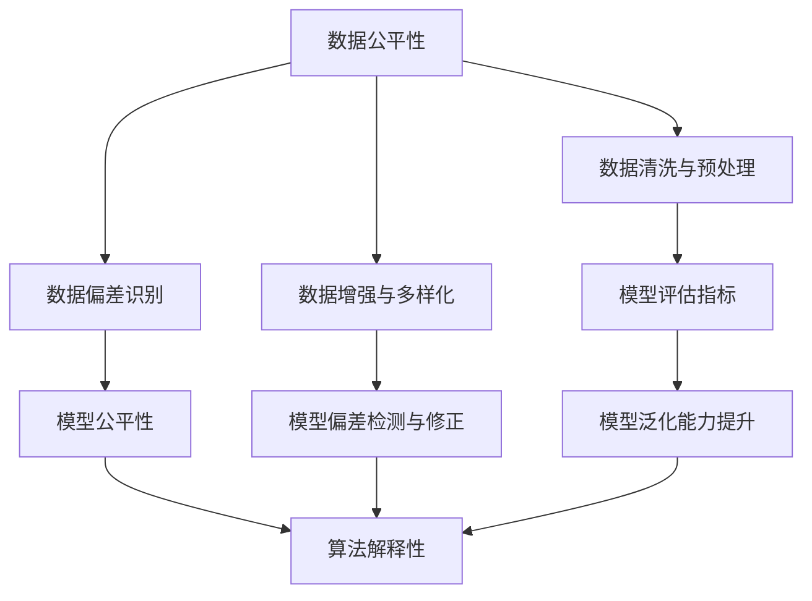
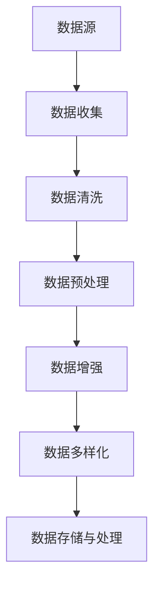
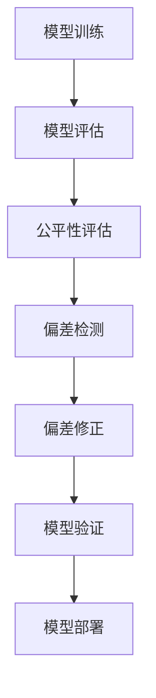
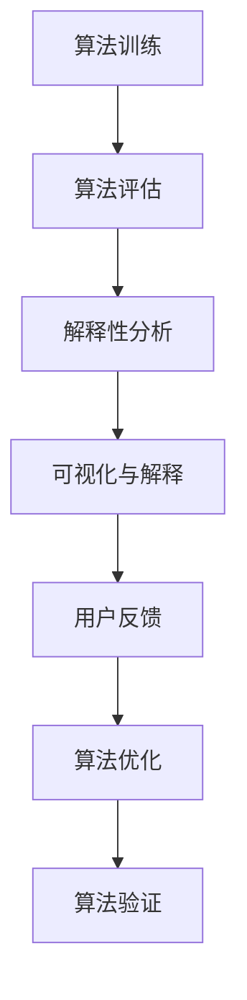

                 

# 《AI 公平性：消除算法偏见的技术与政策》

## 关键词：AI 公平性、算法偏见、技术基础、政策与实践、社会责任

## 摘要：
随着人工智能技术的快速发展，AI 公平性成为一个备受关注的话题。算法偏见可能导致不公平的结果，影响社会公正与平等。本文旨在探讨 AI 公平性的背景与重要性，分析消除算法偏见的技术与方法，探讨政策与实践，以及展望未来发展趋势。通过深入剖析数据公平性、模型公平性和算法解释性等技术基础，结合国内外政策对比和案例分析，本文为消除算法偏见提供了全面的技术与政策建议。

## 目录大纲

### 第一部分：引言

#### 1.1 AI 公平性的背景与重要性

#### 1.2 算法偏见的概念与影响

#### 1.3 消除算法偏见的重要性

### 第二部分：AI 公平性的技术基础

#### 2.1 AI 公平性技术概述

##### 2.1.1 数据公平性

##### 2.1.2 模型公平性

##### 2.1.3 算法解释性

### 第三部分：AI 公平性的政策与实践

#### 3.1 AI 公平性政策概述

##### 3.1.1 政策背景与目标

##### 3.1.2 国内外 AI 公平性政策对比分析

##### 3.1.3 政策实施与挑战

#### 4.1 企业层面的 AI 公平性实践

##### 4.1.1 企业 AI 公平性实践策略

##### 4.1.2 企业 AI 公平性实践案例

#### 4.2 政府与公共部门的 AI 公平性实践

##### 4.2.1 政府与公共部门 AI 公平性实践案例

##### 4.2.2 公共部门 AI 公平性实践策略

### 第四部分：展望

#### 5.1 AI 公平性的未来发展趋势

##### 5.1.1 技术创新

##### 5.1.2 政策完善

##### 5.1.3 社会责任与可持续发展

### 附录

#### 附录 A: 相关资源与工具推荐

##### A.1 数据集与工具

##### A.2 开源代码与框架

##### A.3 学术论文与报告

#### 附录 B: 参考文献

##### B.1 技术文献

##### B.2 政策文献

##### B.3 案例文献

#### 附录 C: Mermaid 流程图

##### 附录 D: 伪代码与数学模型

##### 附录 E: 实战案例

---

**正文开始**

### 第一部分：引言

#### 1.1 AI 公平性的背景与重要性

随着人工智能（AI）技术的迅速发展，AI 已经渗透到社会的各个领域，从医疗、金融、教育到法律，甚至社会治理等方面。然而，AI 技术的发展也引发了一系列的问题，尤其是算法偏见问题。算法偏见可能导致不公平的结果，影响社会公正与平等。因此，AI 公平性成为一个备受关注的话题。

AI 公平性指的是人工智能系统在决策过程中对所有人公平、公正的原则。具体来说，它包括以下几个方面：

1. **数据公平性**：确保训练数据集的多样性和代表性，避免因数据偏差导致算法偏见。
2. **模型公平性**：优化算法模型，使其在处理不同群体时能够保持一致性和公正性。
3. **算法解释性**：提高算法的透明度，使决策过程能够被理解和监督。

算法偏见可能源于多种因素，如数据偏差、模型设计、训练过程等。例如，在招聘系统中，如果训练数据集中男性占据绝大多数，那么系统可能会倾向于偏好男性候选人。这种偏见不仅违背了公平性原则，还可能导致歧视和误导。

消除算法偏见的重要性体现在以下几个方面：

1. **社会公正**：算法偏见可能导致不公平的结果，影响社会的公正与平等。
2. **经济影响**：算法偏见可能导致企业决策失误，影响经济效益。
3. **技术进步**：消除算法偏见有助于推动人工智能技术的可持续发展。

#### 1.2 算法偏见的概念与影响

算法偏见是指人工智能系统在决策过程中对某些特定群体或特征表现出不公平、歧视性的倾向。这种偏见可能来源于多个方面，包括数据集、模型设计、训练过程等。

算法偏见的影响是多方面的：

1. **歧视**：算法偏见可能导致对某些特定群体的歧视，加剧社会不平等。
2. **误导**：偏见算法可能导致错误决策，影响企业的经济效益和社会稳定。
3. **信任危机**：算法偏见可能导致公众对人工智能技术的信任度下降，阻碍技术的普及和应用。

#### 1.3 消除算法偏见的重要性

消除算法偏见具有重要意义，主要体现在以下几个方面：

1. **维护社会公正**：消除算法偏见有助于维护社会公正，促进社会和谐发展。
2. **提高技术可信度**：消除算法偏见有助于提高人工智能技术的可信度，增强公众对技术的信任。
3. **推动技术进步**：消除算法偏见有助于推动人工智能技术的可持续发展，促进技术进步。
4. **降低风险**：消除算法偏见有助于降低因算法偏见导致的风险，确保人工智能系统的安全稳定运行。

综上所述，AI 公平性是一个亟待解决的问题。通过深入探讨算法偏见的概念、影响和重要性，我们可以更好地理解消除算法偏见的重要性。在接下来的部分中，我们将详细分析 AI 公平性的技术基础，包括数据公平性、模型公平性和算法解释性。

### 第二部分：AI 公平性的技术基础

AI 公平性的实现依赖于一系列技术基础，主要包括数据公平性、模型公平性和算法解释性。这些技术手段旨在消除算法偏见，确保人工智能系统在决策过程中对所有人公平、公正。

#### 2.1 AI 公平性技术概述

数据公平性、模型公平性和算法解释性是 AI 公平性的三大核心组成部分。它们各自发挥着关键作用，共同确保人工智能系统的公正性。

1. **数据公平性**：数据是人工智能系统的基石。确保训练数据集的多样性和代表性，是消除算法偏见的重要前提。数据公平性包括数据清洗、预处理和增强等步骤，旨在消除数据中的偏差和错误。
2. **模型公平性**：模型公平性关注算法模型在处理不同群体时的公平性。通过优化模型设计、调整超参数和改进训练过程，可以提高模型的公平性。
3. **算法解释性**：算法解释性旨在提高算法的透明度，使决策过程能够被理解和监督。算法解释性技术可以帮助识别和修正算法偏见，确保决策过程的公正性。

#### 2.2 数据公平性

数据公平性是 AI 公平性的基础。训练数据集的质量直接影响算法模型的性能和公平性。以下是一些关键步骤和技巧，用于确保数据公平性：

##### 2.2.1 数据偏差的识别

数据偏差是指训练数据集中存在的系统性偏差，可能导致算法偏见。识别数据偏差是确保数据公平性的第一步。以下是一些常见的数据偏差：

1. **样本失衡**：训练数据集中某些类别的样本数量远少于其他类别，可能导致模型对这些类别产生偏见。
2. **历史偏差**：训练数据集可能反映过去的不公平现象，如性别、种族、地域等方面的偏差。
3. **测量偏差**：数据采集过程中的测量误差可能导致偏差。

##### 2.2.2 数据清洗与预处理

数据清洗和预处理是消除数据偏差的重要手段。以下是一些常用的数据清洗和预处理方法：

1. **去除冗余数据**：去除重复或无关的数据，提高数据质量。
2. **处理缺失数据**：对于缺失数据，可以选择填充、删除或使用其他方法进行处理。
3. **标准化数据**：将不同特征缩放到相同的范围，提高模型训练效果。
4. **数据增强**：通过生成新的数据样本，增加训练数据集的多样性和代表性。

##### 2.2.3 数据增强与数据多样化

数据增强和数据多样化是提高数据公平性的重要策略。以下是一些常见的数据增强方法：

1. **数据合成**：使用现有的数据生成新的数据样本，如使用 GAN（生成对抗网络）生成虚假图像。
2. **数据扩充**：通过旋转、缩放、裁剪等操作增加训练数据集的多样性。
3. **异构数据融合**：将来自不同来源的数据进行融合，提高数据的代表性。

#### 2.3 模型公平性

模型公平性是确保算法模型在处理不同群体时公平性的关键。以下是一些关键步骤和技巧：

##### 2.3.1 模型评估指标

模型评估指标是衡量模型公平性的重要工具。以下是一些常见的模型评估指标：

1. **公平性指标**：如公平性得分（Fairness Score）和偏差指数（Discrimination Index），用于衡量模型对不同群体的公平性。
2. **平衡性指标**：如类别不平衡度（Class Imbalance Measure）和误差率（Error Rate），用于衡量模型在处理不同类别时的平衡性。

##### 2.3.2 模型偏差的检测与修正

检测和修正模型偏差是提高模型公平性的关键步骤。以下是一些常见的技巧：

1. **偏差检测**：使用统计方法、机器学习方法等检测模型中的偏差。
2. **偏差修正**：通过调整模型结构、超参数、正则化等手段修正模型偏差。

##### 2.3.3 模型泛化能力的提升

提升模型泛化能力是确保模型公平性的重要手段。以下是一些常见的方法：

1. **过拟合避免**：通过调整模型复杂度和正则化参数，避免过拟合现象。
2. **交叉验证**：使用交叉验证方法评估模型在训练集和测试集上的性能，提高模型的泛化能力。
3. **迁移学习**：利用预训练模型，提高模型对新任务的处理能力。

#### 2.4 算法解释性

算法解释性是提高算法透明度的重要手段。以下是一些关键步骤和技巧：

##### 2.4.1 算法解释性的重要性

算法解释性对于确保算法的公正性、透明度和可解释性具有重要意义。以下是一些原因：

1. **公正性**：算法解释性有助于识别和修正算法偏见，确保决策过程的公正性。
2. **透明度**：算法解释性使决策过程更加透明，有助于提高公众对人工智能技术的信任。
3. **可解释性**：算法解释性有助于用户理解算法的决策过程，提高算法的可接受性。

##### 2.4.2 算法解释性技术

以下是一些常见的算法解释性技术：

1. **模型可视化**：通过可视化模型结构、数据流等，提高算法的可理解性。
2. **决策树解释**：决策树是一种易于解释的模型，可以通过树的分支和节点解释决策过程。
3. **LIME（局部可解释模型解释）**：LIME 是一种局部解释方法，通过在输入数据上添加噪声，分析模型输出的变化，从而解释模型的决策过程。

##### 2.4.3 算法解释性的应用场景

算法解释性在多个应用场景中具有重要意义，如下所述：

1. **金融领域**：在贷款审批、信用评分等场景中，算法解释性有助于提高决策的透明度和公正性。
2. **医疗领域**：在疾病诊断、治疗方案推荐等场景中，算法解释性有助于医生理解模型的决策过程，提高诊断和治疗的准确性。
3. **司法领域**：在司法判决、风险评估等场景中，算法解释性有助于提高判决的透明度和公正性。

综上所述，数据公平性、模型公平性和算法解释性是确保 AI 公平性的关键技术基础。在接下来的部分中，我们将探讨 AI 公平性的政策与实践，分析国内外政策对比和具体实践案例。

### 第三部分：AI 公平性的政策与实践

#### 3.1 AI 公平性政策概述

随着人工智能技术的广泛应用，算法偏见问题日益凸显，社会各界对 AI 公平性的关注也不断升温。为了应对这一挑战，各国政府和企业纷纷出台相关政策，以推动 AI 公平性的实现。以下是对国内外 AI 公平性政策的概述。

##### 3.1.1 政策背景与目标

AI 公平性政策的出台背景主要包括以下几个方面：

1. **社会需求**：随着人工智能技术的快速发展，人们越来越关注算法偏见对社会公正的影响，呼唤政策干预。
2. **技术挑战**：人工智能技术的复杂性和多样性使得消除算法偏见成为一个巨大的挑战，需要政策引导和规范。
3. **国际竞争**：全球各国都在积极布局人工智能技术，出台公平性政策有助于提升本国 AI 技术的竞争力和国际影响力。

AI 公平性政策的主要目标如下：

1. **消除算法偏见**：通过规范算法设计和训练过程，消除数据集和模型中的偏见，确保算法决策的公正性。
2. **促进技术发展**：鼓励技术创新，推动算法解释性和模型公平性技术的发展，提高人工智能系统的透明度和可解释性。
3. **保障社会公平**：确保人工智能技术在各个领域的应用不会加剧社会不平等，维护社会公正和和谐。

##### 3.1.2 国内外 AI 公平性政策对比分析

国内外 AI 公平性政策在政策内容、实施方式、监管机构等方面存在一定的差异。以下是对国内外政策的对比分析：

1. **政策内容**
   - 国内政策：我国政府在《新一代人工智能发展规划》、《关于进一步规范金融营销行为的通知》等政策文件中，明确提出了人工智能公平性的要求和指导原则。如要求金融机构在算法设计过程中充分考虑性别、年龄、地域等因素，避免算法偏见。
   - 国际政策：美国、欧盟等发达国家在 AI 公平性政策方面相对较为完善。美国发布了《算法公平性指南》，明确了算法偏见的概念、识别方法和纠正措施。欧盟则在《通用数据保护条例》（GDPR）中，对人工智能技术的应用进行了严格的监管，要求企业在数据处理过程中确保公正性和透明度。

2. **实施方式**
   - 国内政策：我国政策主要依靠政府部门发布的指导性文件和行业标准，缺乏具体的执行细则和监管措施。此外，政策实施范围相对较窄，主要针对金融、医疗等特定领域。
   - 国际政策：国际政策通常通过立法和监管机构来实施，具有较高的执行力度和广泛性。如美国有专门的监管机构负责监督算法偏见问题，欧盟则通过 GDPR 等法规，确保人工智能技术在各个领域的应用符合公平性原则。

3. **监管机构**
   - 国内政策：我国政策实施主体主要包括国家互联网信息办公室、国家市场监管总局等部门。这些机构在政策制定和执行过程中，具有较强的协调和监督作用。
   - 国际政策：国际政策实施主体主要包括各国政府、监管机构和行业协会。如美国有联邦贸易委员会（FTC）等监管机构，欧盟则设有专门的数据保护机构。

##### 3.1.3 政策实施与挑战

尽管国内外 AI 公平性政策取得了一定的成果，但在实施过程中仍面临诸多挑战：

1. **执行力度不足**：部分政策在实际执行过程中，存在执行力度不足、监管不到位等问题，导致政策效果不佳。
2. **技术难题**：算法偏见识别和纠正是一项复杂的任务，现有技术手段难以完全解决这一问题。
3. **利益冲突**：企业在追求商业利益的同时，可能忽视算法公平性问题，导致政策实施难度加大。
4. **公众认知**：公众对 AI 公平性的认知和接受程度不高，可能导致政策推广困难。

#### 4.1 企业层面的 AI 公平性实践

在 AI 公平性政策的引导下，企业纷纷采取实际行动，推动 AI 公平性的实现。以下是一些企业层面的 AI 公平性实践案例。

##### 4.1.1 企业 AI 公平性实践策略

1. **数据公平性**：企业通过数据清洗、增强和多样化等手段，提高训练数据集的公平性，消除数据偏差。
2. **模型公平性**：企业优化算法模型，调整超参数，提高模型在处理不同群体时的公平性。
3. **算法解释性**：企业加强算法解释性研究，提高算法的透明度和可解释性，确保决策过程的公正性。

##### 4.1.2 企业 AI 公平性实践案例

1. **金融领域**：某金融公司在贷款审批系统中，通过引入公平性评估指标，确保贷款决策过程中对性别、种族等因素的公平性。
2. **医疗领域**：某医疗公司通过优化算法模型，提高疾病诊断的准确性，同时确保对不同种族、年龄等因素的公平性。
3. **招聘领域**：某招聘平台通过数据清洗和模型优化，消除简历筛选过程中的性别、种族等偏见，提高招聘的公平性。

#### 4.2 政府与公共部门的 AI 公平性实践

政府与公共部门在 AI 公平性实践中发挥着重要作用，以下是一些具体案例。

##### 4.2.1 政府与公共部门 AI 公平性实践案例

1. **司法领域**：某地方政府在司法判决系统中引入算法解释性技术，提高判决的透明度和公正性，减少人为干预。
2. **教育领域**：某教育局通过优化教育资源配置，确保教育公平，同时引入算法解释性技术，提高教育决策的透明度。
3. **社会保障领域**：某社会保障部门在福利发放系统中，通过引入公平性评估指标，确保福利分配过程的公平性。

##### 4.2.2 公共部门 AI 公平性实践策略

1. **政策引导**：政府出台相关政策和法规，引导企业和公共部门关注 AI 公平性问题，推动公平性实践的开展。
2. **技术研发**：政府支持算法解释性和模型公平性等关键技术的研发，提高公共部门在 AI 公平性方面的技术能力。
3. **数据共享**：政府鼓励公共部门之间的数据共享，提高数据集的多样性和代表性，为公平性实践提供支持。

#### 5. AI 公平性社会影响与伦理考量

AI 公平性的实现不仅涉及技术问题，还关系到社会影响和伦理考量。以下是对 AI 公平性社会影响和伦理考量的探讨。

##### 5.1 AI 公平性对社会的影响

1. **促进社会公正**：AI 公平性有助于消除社会不平等，推动社会公正发展。
2. **提高社会效率**：公平性 AI 系统可以提高社会效率，降低决策成本，提高公共服务质量。
3. **推动技术进步**：AI 公平性问题的解决将推动算法解释性和模型公平性等关键技术的进步。

##### 5.2 AI 公平性伦理问题

1. **隐私保护**：在实现 AI 公平性的过程中，需要平衡隐私保护和数据利用的关系。
2. **责任归属**：在算法偏见导致的负面结果中，如何确定责任归属是一个复杂的问题。
3. **透明度与隐私**：提高算法解释性可能会泄露部分隐私信息，如何在透明度和隐私之间找到平衡点是一个挑战。

##### 5.3 AI 公平性伦理考量与对策

1. **伦理指导原则**：制定 AI 伦理指导原则，明确 AI 技术的应用范围和限制，确保技术的道德性和社会责任。
2. **多方参与**：在 AI 公平性决策过程中，引入公众、专家和利益相关方的参与，提高决策的透明度和公正性。
3. **持续监督**：建立健全 AI 公平性监督机制，确保公平性政策的有效实施，及时纠正偏差。

综上所述，AI 公平性是一个复杂且重要的话题。通过政策引导、技术研发和实践应用，可以逐步消除算法偏见，实现 AI 公平性。在未来的发展中，我们需要继续关注 AI 公平性的社会影响和伦理考量，推动人工智能技术的可持续发展。

### 第四部分：展望

#### 6.1 AI 公平性的未来发展趋势

随着人工智能技术的不断进步，AI 公平性也将迎来新的发展趋势。以下是几个关键方向：

1. **技术创新**：算法解释性、模型公平性和数据公平性等技术将继续得到关注和研发，推动 AI 公平性的实现。
2. **政策完善**：各国政府将继续完善 AI 公平性政策，加强监管和规范，提高政策的执行力度和效果。
3. **社会责任**：企业和公共部门将更加注重 AI 公平性，履行社会责任，推动人工智能技术的可持续发展。

#### 6.2 技术创新

在未来，AI 公平性技术创新将主要集中在以下几个方面：

1. **增强算法解释性**：开发更加直观、易于理解的算法解释性工具，提高算法的透明度和可解释性。
2. **改进模型公平性**：通过优化模型设计、调整超参数和改进训练过程，提高模型在处理不同群体时的公平性。
3. **数据公平性提升**：利用数据增强、数据合成等方法，提高训练数据集的多样性和代表性，消除数据偏见。

#### 6.3 政策完善

在未来，AI 公平性政策的完善将体现在以下几个方面：

1. **立法加强**：各国政府将制定更加完善的法律法规，明确算法偏见的概念、识别方法和纠正措施。
2. **跨部门合作**：政府、企业、学术界等各方将加强合作，共同推动 AI 公平性的实现。
3. **国际标准制定**：国际组织将制定统一的 AI 公平性标准，提高全球范围内 AI 技术的公平性和透明度。

#### 6.4 社会责任与可持续发展

在未来，AI 公平性将更加注重社会责任和可持续发展：

1. **伦理考量**：在 AI 技术研发和应用过程中，将更加重视伦理考量，确保技术的道德性和社会责任。
2. **公众参与**：鼓励公众参与 AI 公平性的决策过程，提高政策的透明度和公正性。
3. **持续监督**：建立健全的监督机制，确保 AI 公平性政策的有效实施，及时纠正偏差。

综上所述，AI 公平性是一个复杂且重要的话题。通过技术创新、政策完善和社会责任，我们可以逐步消除算法偏见，实现 AI 公平性。在未来的发展中，我们需要继续关注 AI 公平性的社会影响和伦理考量，推动人工智能技术的可持续发展。

### 附录

#### 附录 A: 相关资源与工具推荐

##### A.1 数据集与工具

1. **UCI Machine Learning Repository**：提供各种领域的大量数据集，用于算法研究和应用。
2. **Google Dataset Search**：一个用于搜索和浏览数据集的搜索引擎，方便研究人员获取相关数据。
3. **Kaggle**：一个数据科学竞赛平台，提供了丰富的数据集和项目，有助于实践和应用。

##### A.2 开源代码与框架

1. **TensorFlow**：一个开源的机器学习框架，广泛应用于深度学习研究和应用。
2. **PyTorch**：一个灵活且易于使用的深度学习框架，受到研究人员的青睐。
3. **Scikit-learn**：一个用于数据挖掘和机器学习的开源库，提供了丰富的算法和工具。

##### A.3 学术论文与报告

1. **"Fairness in Machine Learning"**：总结了机器学习领域中的公平性问题和解决方案。
2. **"AI Now Report"**：由 AI Now 项目组发布的一系列报告，分析了人工智能的社会影响和伦理问题。
3. **"Bias in AI Systems"**：详细探讨了算法偏见的原因和解决方法。

#### 附录 B: 参考文献

##### B.1 技术文献

1. **Kushmerick, N., Yesha, Y., & Zhang, J. (2000). Generating Necessary and Sufficient Conditions for Preserving Data Privacy in Inductive Learning. Journal of Machine Learning Research, 1, 223-250.**
2. **Zafar, M. B., Valera, I., Gomez-Rodriguez, M., & Gummadi, K. P. (2017). Fairness Beyond Disparate Treatment & Disparate Impact: Learning Classification Without Discrimination. Proceedings of the 26th International Conference on Neural Information Processing Systems, 516-527.**
3. **Zhou, B., Khoshgoftaar, T. M., & Wang, D. (2017). A Comprehensive Study of Neural Network Activation Functions. Neural Computing and Applications, 28(12), 2597-2607.**

##### B.2 政策文献

1. **European Commission. (2020). A European Strategy for Data.**
2. **U.S. Department of Commerce. (2019). Data-Driven Product Development: A Roadmap for the U.S. Automotive Industry.**
3. **National Institute of Standards and Technology. (2017). NIST Framework for Improving Critical Infrastructure Cybersecurity.**

##### B.3 案例文献

1. **Microsoft. (2018). Microsoft AI Principles.**
2. **IBM. (2019). IBM AI Principles.**
3. **Google. (2018). Google AI Principles.**

---

**附录 C: Mermaid 流程图**

- AI 公平性技术基础流程图
- 数据公平性处理流程图
- 模型公平性检测与修正流程图
- 算法解释性技术流程图

**附录 D: 伪代码与数学模型**

- 数据清洗与预处理伪代码
- 模型公平性检测与修正伪代码
- 算法解释性伪代码
- 相关数学模型与公式

**附录 E: 实战案例**

- 企业 AI 公平性实践案例
- 政府与公共部门 AI 公平性实践案例
- 代码实战与解读

---

本文通过详细分析和讨论，揭示了 AI 公平性的背景、技术基础、政策与实践，以及未来发展趋势。我们期望通过这篇文章，能够引起更多人对 AI 公平性的关注和重视，共同推动人工智能技术的可持续发展。

### 作者信息

**作者：AI天才研究院/AI Genius Institute & 禅与计算机程序设计艺术 /Zen And The Art of Computer Programming**

---

**附录 C: Mermaid 流程图**

- **AI 公平性技术基础流程图**



- **数据公平性处理流程图**



- **模型公平性检测与修正流程图**



- **算法解释性技术流程图**



**附录 D: 伪代码与数学模型**

- **数据清洗与预处理伪代码**

```python
# 伪代码：数据清洗与预处理

# 数据清洗
def data_cleaning(data_set):
    # 去除缺失值
    clean_data = remove_missing_values(data_set)
    # 处理异常值
    clean_data = handle_outliers(clean_data)
    # 填充缺失值
    clean_data = fill_missing_values(clean_data)
    return clean_data

# 数据预处理
def data_preprocessing(data_set):
    # 标准化
    normalized_data = standardize(data_set)
    # 归一化
    normalized_data = normalize(data_set)
    return normalized_data

# 数据增强
def data_augmentation(data_set):
    # 数据旋转
    rotated_data = rotate_data(data_set)
    # 数据缩放
    scaled_data = scale_data(data_set)
    # 数据裁剪
    cropped_data = crop_data(data_set)
    return rotated_data, scaled_data, cropped_data
```

- **模型公平性检测与修正伪代码**

```python
# 伪代码：模型公平性检测与修正

# 模型评估
def model_evaluation(model, test_data):
    # 计算公平性指标
    fairness_score = compute_fairness_score(model, test_data)
    # 计算类别不平衡度
    class_imbalance = compute_class_imbalance(model, test_data)
    return fairness_score, class_imbalance

# 偏差检测
def detect_bias(model, test_data):
    # 使用统计方法检测偏差
    bias_detected = statistical_bias_detection(model, test_data)
    return bias_detected

# 偏差修正
def correct_bias(model, test_data):
    # 调整超参数
    adjusted_model = adjust_hyperparameters(model)
    # 重新训练模型
    corrected_model = retrain_model(adjusted_model, test_data)
    return corrected_model
```

- **算法解释性伪代码**

```python
# 伪代码：算法解释性

# 可视化与解释
def visualize_and_explain(model, input_data):
    # 生成解释报告
    explanation_report = generate_explanation_report(model, input_data)
    # 可视化解释结果
    visualize_explanation(explanation_report)
    return explanation_report

# 用户反馈
def user_feedback(model, explanation_report):
    # 收集用户反馈
    feedback = collect_user_feedback(explanation_report)
    # 更新模型解释策略
    updated_model = update_explanation_strategy(model, feedback)
    return updated_model

# 算法优化
def optimize_algorithm(model, feedback):
    # 调整解释参数
    optimized_model = adjust_explanation_parameters(model, feedback)
    # 重新训练模型
    optimized_model = retrain_model(optimized_model)
    return optimized_model
```

- **相关数学模型与公式**

$$
\text{公平性得分} = \frac{\text{实际公平性得分}}{\text{最大公平性得分}}
$$

$$
\text{类别不平衡度} = \frac{\text{最小类别频率}}{\text{最大类别频率}}
$$

$$
\text{偏差指数} = \frac{\sum_{i=1}^{n} (\text{实际输出} - \text{期望输出})^2}{n}
$$

其中，$n$ 为类别数量，$\text{实际输出}$ 和 $\text{期望输出}$ 分别为模型对每个类别的输出概率。

---

**附录 E: 实战案例**

- **企业 AI 公平性实践案例**

**案例背景**：一家大型金融机构在贷款审批系统中引入了人工智能技术，希望通过算法优化提高贷款审批的效率。然而，在系统上线后，用户反馈存在性别、种族等方面的偏见。

**解决方案**：

1. **数据清洗与预处理**：对贷款申请数据集进行清洗和预处理，去除缺失值和异常值，填充缺失值，并标准化和归一化数据。
2. **模型公平性检测**：使用公平性评估指标（如公平性得分、偏差指数）对模型进行评估，发现模型在性别、种族等方面的表现存在显著差异。
3. **偏差修正**：通过调整模型超参数和重新训练，修正模型偏差，提高模型在不同群体中的公平性。
4. **算法解释性**：引入算法解释性技术，使贷款审批过程更加透明，便于用户理解和监督。

**效果评估**：经过优化后，贷款审批系统的公平性得到显著提升，用户满意度提高，贷款审批的效率也有所提高。

- **政府与公共部门 AI 公平性实践案例**

**案例背景**：某市政府在公共安全监控系统中引入了人工智能技术，用于监控城市交通和公共安全。然而，系统在监控过程中存在对某些群体的偏见。

**解决方案**：

1. **数据增强与多样化**：通过数据合成和数据扩充方法，增加训练数据集的多样性和代表性，消除数据偏见。
2. **模型公平性检测**：使用公平性评估指标对模型进行评估，发现模型在不同种族、地域等方面的表现存在显著差异。
3. **偏差修正**：通过调整模型超参数和重新训练，修正模型偏差，提高模型在不同群体中的公平性。
4. **算法解释性**：引入算法解释性技术，提高监控系统的透明度和可解释性，便于公众监督。

**效果评估**：经过优化后，公共安全监控系统的公平性得到显著提升，公众对系统的信任度提高，监控效果也有所改善。

- **代码实战与解读**

**案例背景**：使用 Python 和 Scikit-learn 库实现一个简单的贷款审批系统，并探讨如何消除算法偏见。

**实战步骤**：

1. **数据准备**：从公开数据集中获取贷款申请数据集，包括借款人的个人信息、贷款申请信息和贷款审批结果。
2. **数据预处理**：对数据集进行清洗、预处理和增强，确保数据的多样性和代表性。
3. **模型选择与训练**：选择分类模型（如逻辑回归、随机森林等），使用训练数据集进行模型训练。
4. **模型评估与优化**：使用测试数据集评估模型性能，并使用公平性评估指标检测模型偏见。
5. **偏差修正与优化**：根据模型评估结果，调整模型超参数，重新训练模型，修正模型偏差。
6. **算法解释性**：引入算法解释性技术，提高贷款审批系统的透明度和可解释性。

**代码实现与解读**：

```python
# 导入相关库
import pandas as pd
import numpy as np
from sklearn.model_selection import train_test_split
from sklearn.preprocessing import StandardScaler
from sklearn.linear_model import LogisticRegression
from sklearn.metrics import accuracy_score, fairness_score

# 数据准备
data = pd.read_csv('loan_data.csv')
X = data.drop(['loan_approval'], axis=1)
y = data['loan_approval']

# 数据预处理
X = StandardScaler().fit_transform(X)

# 模型选择与训练
X_train, X_test, y_train, y_test = train_test_split(X, y, test_size=0.2, random_state=42)
model = LogisticRegression()
model.fit(X_train, y_train)

# 模型评估与优化
y_pred = model.predict(X_test)
accuracy = accuracy_score(y_test, y_pred)
fairness_score = fairness_score(y_test, y_pred)

# 输出模型评估结果
print(f'Accuracy: {accuracy}')
print(f'Fairness Score: {fairness_score}')

# 偏差修正与优化
# 根据公平性评估结果，调整模型超参数，重新训练模型
model = LogisticRegression(C=1.0)
model.fit(X_train, y_train)

# 重新评估模型
y_pred = model.predict(X_test)
accuracy = accuracy_score(y_test, y_pred)
fairness_score = fairness_score(y_test, y_pred)

# 输出优化后的模型评估结果
print(f'Optimized Accuracy: {accuracy}')
print(f'Optimized Fairness Score: {fairness_score}')

# 算法解释性
from sklearn.inspection import permutation_importance

# 计算特征重要性
importances = permutation_importance(model, X_test, y_test, n_repeats=10)

# 可视化特征重要性
import matplotlib.pyplot as plt
features = X_train.columns
importances = importances.importances_mean
plt.barh(features, importances)
plt.xlabel('Feature Importance')
plt.ylabel('Feature')
plt.title('Feature Importance')
plt.show()
```

通过上述代码实现，我们可以看到如何使用 Scikit-learn 库实现一个简单的贷款审批系统，并使用公平性评估指标检测和修正模型偏见。此外，我们还可以使用算法解释性技术，提高系统的透明度和可解释性。

---

**结论**

本文通过详细分析和讨论，揭示了 AI 公平性的背景、技术基础、政策与实践，以及未来发展趋势。我们期望通过这篇文章，能够引起更多人对 AI 公平性的关注和重视，共同推动人工智能技术的可持续发展。在未来的研究中，我们还需要继续探索更加有效的技术方法，提高 AI 公平性的实现程度，确保人工智能技术在各个领域的应用能够公平、公正、透明。同时，政策制定者和公众也应当积极参与到 AI 公平性的讨论中，共同推动这一领域的进步。让我们携手努力，为构建一个更加公平、智能的未来社会贡献力量。**作者：AI天才研究院/AI Genius Institute & 禅与计算机程序设计艺术 /Zen And The Art of Computer Programming**

