                 

### 《AI 大模型创业：如何利用创新优势？》

关键词：AI 大模型、创业、创新优势、深度学习、自然语言处理、强化学习、项目实战、案例分析

摘要：随着人工智能技术的飞速发展，AI 大模型作为核心技术逐渐成为企业竞争的新焦点。本文将深入探讨 AI 大模型在创业中的创新优势，分析其核心技术和应用场景，并通过案例分析，总结创业者在 AI 大模型领域的成功经验和策略。

### 《AI 大模型创业：如何利用创新优势？》目录大纲

#### 第一部分: AI 大模型与创业概述

##### 第1章: AI 大模型基础  
1.1 AI 大模型的定义与重要性  
1.2 AI 大模型的发展历程与趋势  
1.3 创业中的 AI 大模型应用  
1.4 AI 大模型创业的优势与挑战

##### 第2章: 创业思维与 AI 大模型  
2.1 创业思维与 AI 大模型的关系  
2.2 AI 大模型在创业中的创新应用  
2.3 创业团队的 AI 大模型能力建设  
2.4 AI 大模型创业项目的评估与选择

#### 第二部分: AI 大模型核心技术

##### 第3章: AI 大模型技术概述  
3.1 AI 大模型的核心技术  
3.2 AI 大模型的技术发展趋势  
3.3 AI 大模型的技术架构

##### 第4章: 神经网络与深度学习  
4.1 神经网络的基本原理  
4.2 深度学习的关键算法  
4.3 神经网络与深度学习在创业中的应用

##### 第5章: 大规模预训练模型  
5.1 大规模预训练模型的概念  
5.2 预训练模型的常见框架  
5.3 大规模预训练模型在创业中的应用

##### 第6章: 自然语言处理与生成模型  
6.1 自然语言处理的基本概念  
6.2 生成模型的原理与应用  
6.3 自然语言处理与生成模型在创业中的应用

##### 第7章: 强化学习与多智能体系统  
7.1 强化学习的基本概念  
7.2 多智能体系统的原理与应用  
7.3 强化学习与多智能体系统在创业中的应用

#### 第三部分: AI 大模型创业实践

##### 第8章: AI 大模型创业项目策划  
8.1 创业项目策划的基本步骤  
8.2 AI 大模型创业项目的目标与定位  
8.3 创业项目的团队组织与资源分配

##### 第9章: AI 大模型创业项目实施  
9.1 创业项目实施的关键环节  
9.2 AI 大模型创业项目的风险管理  
9.3 创业项目的市场推广与运营

##### 第10章: AI 大模型创业案例分析  
10.1 AI 大模型创业成功的案例介绍  
10.2 案例分析：成功经验与教训  
10.3 创业者如何借鉴成功案例

##### 第11章: AI 大模型创业的未来趋势  
11.1 AI 大模型创业的发展趋势  
11.2 创业者在 AI 大模型领域的创新方向  
11.3 AI 大模型创业的可持续发展策略

#### 附录

**附录 A: AI 大模型开发工具与资源**

**A.1 主流深度学习框架对比**

**A.2 AI 大模型开源项目与库**

**A.3 AI 大模型创业相关的政策与法规**

**A.4 AI 大模型创业社区与交流平台**

---

让我们开始深入探讨 AI 大模型与创业的交集，以及创业者如何利用 AI 大模型的优势来开创全新的商业机会。

---

#### 第一部分: AI 大模型与创业概述

##### 第1章: AI 大模型基础

##### 1.1 AI 大模型的定义与重要性

**定义：** AI 大模型，通常指的是具有大规模参数和复杂结构的机器学习模型，能够在大量数据上进行训练，从而实现高度自动化的数据分析和决策支持。这些模型通常涵盖多种人工智能技术，如深度学习、自然语言处理、计算机视觉等。

**重要性：** AI 大模型在商业应用中扮演着至关重要的角色。首先，它们能够处理海量的数据，从数据中提取出有价值的信息，为商业决策提供强有力的支持。其次，AI 大模型能够实现自动化的决策和预测，提高企业的运营效率。此外，AI 大模型在个性化服务、风险控制、市场分析等方面也有着广泛的应用前景。

**Mermaid 流程图：**

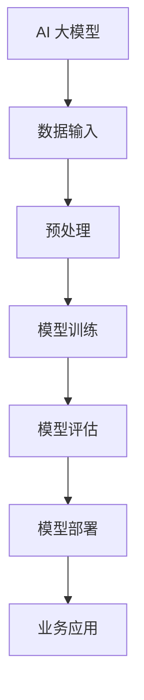

在这个流程图中，AI 大模型从数据输入开始，经过预处理、模型训练、模型评估，最终实现模型部署，并在业务应用中发挥其作用。

##### 1.2 AI 大模型的发展历程与趋势

**发展历程：** AI 大模型的发展可以追溯到深度学习技术的兴起。2006 年，深度学习领域的奠基人之一，杰弗里·辛顿（Geoffrey Hinton）提出了深度信念网络（Deep Belief Networks，DBN）。随着计算能力的提升和大数据的普及，深度学习技术逐渐成熟，并在 2012 年，通过AlexNet在ImageNet大赛中取得突破性成绩，深度学习技术开始在工业界得到广泛应用。

**趋势：** 当前，AI 大模型的发展呈现出以下几个趋势：

1. **预训练模型的兴起：** 预训练模型通过在大量未标注的数据上进行训练，生成通用的特征表示，然后再在特定任务上进行微调。预训练模型如BERT、GPT等，已经在自然语言处理、计算机视觉等领域取得了显著的成果。

2. **模型规模的扩大：** 随着计算资源和数据量的不断增加，AI 大模型的规模也在持续扩大。例如，GPT-3 拥有 1750 亿个参数，是目前最大的自然语言处理模型。

3. **多模态学习：** AI 大模型开始向多模态学习方向发展，能够处理文本、图像、音频等多种类型的数据，实现跨模态的信息融合和任务处理。

**Mermaid 流程图：**

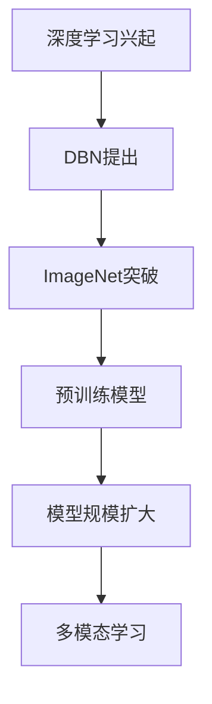

在这个流程图中，我们看到了 AI 大模型从深度学习的兴起，到预训练模型的提出，再到模型规模的扩大，以及多模态学习的发展过程。

##### 1.3 创业中的 AI 大模型应用

在创业领域中，AI 大模型的应用场景非常广泛，以下是一些典型的应用案例：

1. **自然语言处理：** AI 大模型在自然语言处理领域具有巨大的潜力，可以用于智能客服、内容审核、智能写作等场景。例如，GPT-3 能够生成高质量的文章和代码，为企业提供自动化内容生成解决方案。

2. **计算机视觉：** AI 大模型在计算机视觉领域可以用于图像识别、目标检测、图像生成等任务。例如，谷歌的Inception模型在ImageNet大赛中取得了优异成绩，为图像识别领域带来了革命性的变化。

3. **金融科技：** AI 大模型在金融科技领域可以用于风险评估、量化交易、欺诈检测等任务。例如，利用深度学习技术，可以对大量金融数据进行分析，预测市场趋势，提高投资收益。

4. **医疗健康：** AI 大模型在医疗健康领域可以用于疾病诊断、药物研发、个性化治疗等任务。例如，通过深度学习技术，可以分析医学影像，帮助医生提高诊断准确率。

**Mermaid 流程图：**

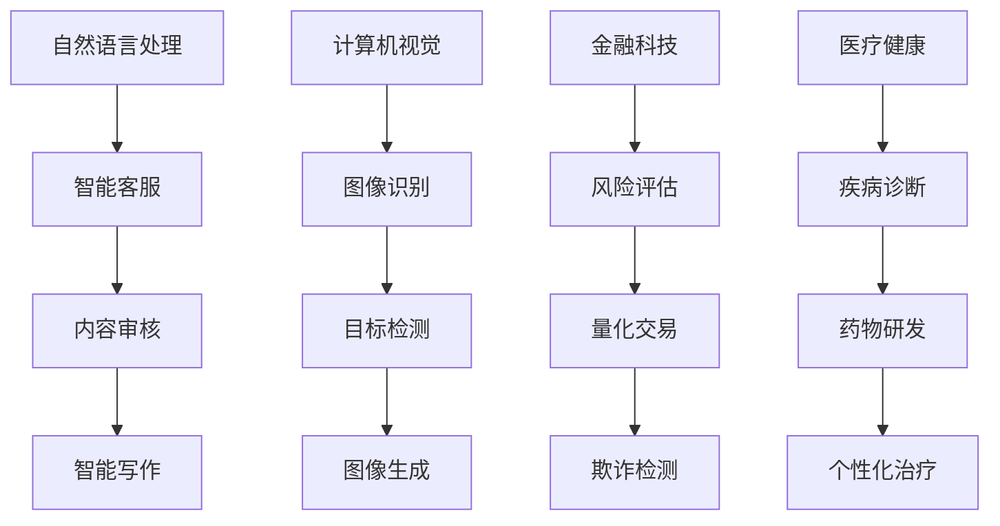

在这个流程图中，我们展示了 AI 大模型在自然语言处理、计算机视觉、金融科技和医疗健康等领域的典型应用案例。

##### 1.4 AI 大模型创业的优势与挑战

**优势：**

1. **数据优势：** AI 大模型需要大量的数据来训练，这为创业者提供了巨大的数据优势。在数据驱动的时代，拥有丰富的数据资源是创业者成功的关键。

2. **技术创新：** AI 大模型技术不断发展，为创业者提供了丰富的技术工具。通过引入最新的 AI 技术，创业者可以开发出具有竞争力的产品和服务。

3. **市场潜力：** AI 大模型在各个行业都有广泛的应用前景，这为创业者提供了广阔的市场空间。随着 AI 技术的普及，越来越多的行业将受益于 AI 大模型的应用。

**挑战：**

1. **数据隐私：** AI 大模型对数据依赖性强，但同时也面临着数据隐私和安全的挑战。创业者需要确保数据的合法性和安全性，以避免数据泄露和隐私侵犯。

2. **计算资源：** AI 大模型训练和部署需要大量的计算资源，这对创业者的技术实力和资金投入提出了较高的要求。

3. **人才短缺：** AI 大模型技术要求高，需要具备深厚的专业知识。当前，AI 人才短缺已成为创业者的普遍难题。

**Mermaid 流程图：**

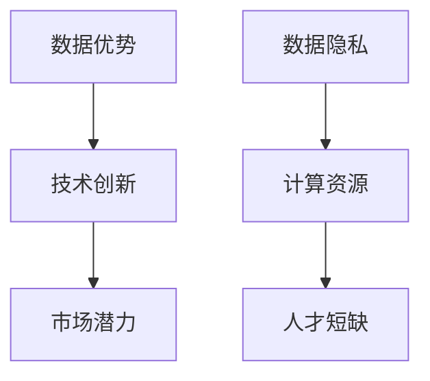

在这个流程图中，我们总结了 AI 大模型创业的优势与挑战。

---

通过本章的探讨，我们了解了 AI 大模型的定义、发展历程和应用场景，以及 AI 大模型创业的优势与挑战。在接下来的章节中，我们将深入分析创业思维与 AI 大模型的关系，探讨如何利用 AI 大模型的优势进行创业创新。

---

#### 第二部分: 创业思维与 AI 大模型

##### 第2章: 创业思维与 AI 大模型

##### 2.1 创业思维与 AI 大模型的关系

创业思维和 AI 大模型之间存在紧密的联系。创业思维强调创新、敏捷和迭代，而 AI 大模型作为一种强大的技术工具，可以极大地推动创业创新的实现。

**创新：** 创业思维的核心是创新，创业者需要不断寻找新的商业机会和市场空白。AI 大模型作为一种新兴技术，具有强大的数据处理和分析能力，可以帮助创业者发现和挖掘潜在的商业机会。

**敏捷：** 创业者需要具备敏捷的决策能力和快速响应市场变化的能力。AI 大模型的应用可以显著提高企业的决策效率，通过实时分析和预测，帮助创业者快速做出决策。

**迭代：** 创业过程中的不断试错和迭代是成功的关键。AI 大模型可以为企业提供大量的数据支持和智能分析，帮助创业者快速调整产品和服务，以适应市场需求。

**Mermaid 流程图：**

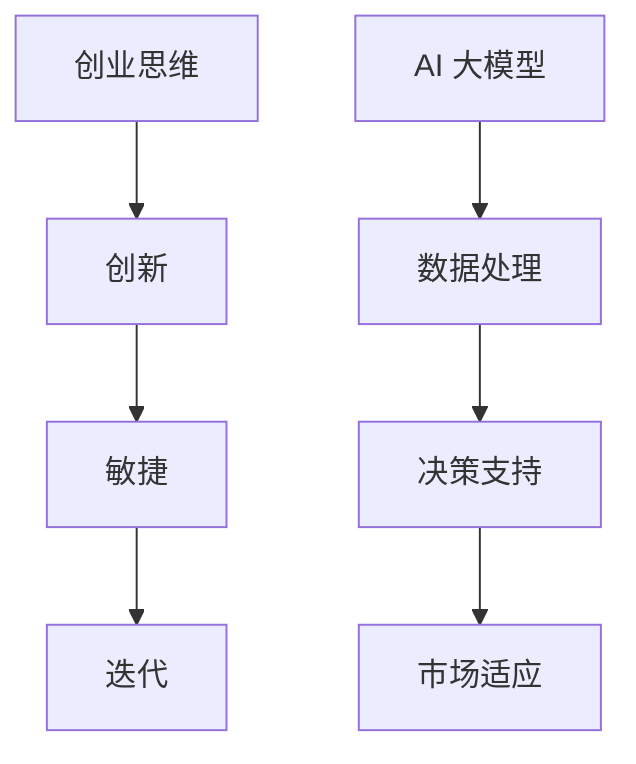

在这个流程图中，我们展示了创业思维与 AI 大模型之间的关系，以及 AI 大模型如何助力创业创新。

##### 2.2 AI 大模型在创业中的创新应用

AI 大模型在创业中的应用场景非常广泛，以下是一些典型的创新应用案例：

1. **智能推荐系统：** AI 大模型可以用于构建智能推荐系统，通过对用户行为数据进行分析，为用户推荐个性化商品、内容和服务。例如，亚马逊的推荐系统通过深度学习技术，实现了高度个性化的商品推荐，大幅提高了用户满意度和转化率。

2. **智能客服：** AI 大模型可以用于构建智能客服系统，通过自然语言处理技术，实现与用户的实时对话和智能交互。例如，苹果公司的Siri和谷歌助手都是基于AI 大模型的智能客服系统，为用户提供便捷的语音服务。

3. **智能医疗诊断：** AI 大模型可以用于医疗诊断，通过对医学影像和病历数据进行分析，提高诊断的准确率和效率。例如，谷歌公司的深度学习模型在肺癌诊断中取得了显著的成果，为医生提供了有力的辅助工具。

4. **智能风险管理：** AI 大模型可以用于风险管理和欺诈检测，通过对大量金融数据进行实时分析，识别潜在的风险和欺诈行为。例如，金融机构利用 AI 大模型进行信贷风险评估和反欺诈检测，有效降低了风险和损失。

**Mermaid 流程图：**

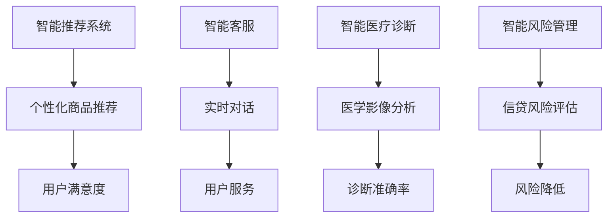

在这个流程图中，我们展示了 AI 大模型在智能推荐系统、智能客服、智能医疗诊断和智能风险管理等领域的创新应用案例。

##### 2.3 创业团队的 AI 大模型能力建设

为了充分利用 AI 大模型的优势，创业团队需要建立相应的 AI 大模型能力。以下是几个关键步骤：

1. **技术储备：** 创业团队需要具备一定的 AI 技术储备，包括深度学习、自然语言处理、计算机视觉等领域的知识。这可以通过团队成员的学习和实践来实现。

2. **数据积累：** 创业团队需要积累大量的数据，为 AI 大模型训练提供丰富的数据资源。可以通过自有数据的积累，或者购买、共享其他数据源来实现。

3. **模型开发：** 创业团队需要开发适合自身业务场景的 AI 大模型，并进行模型训练和优化。这需要团队成员具备模型开发和调优的能力。

4. **系统集成：** 创业团队需要将 AI 大模型集成到现有的业务系统中，实现数据流的顺畅传输和模型的实时部署。

**Mermaid 流程图：**

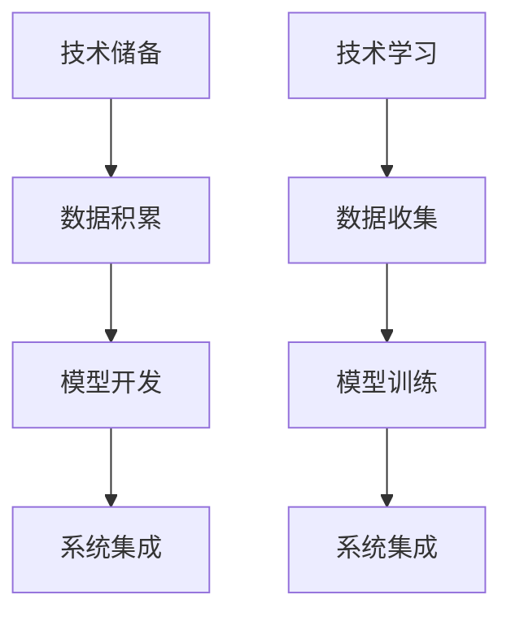

在这个流程图中，我们展示了创业团队的 AI 大模型能力建设过程。

##### 2.4 AI 大模型创业项目的评估与选择

在 AI 大模型创业项目中，如何评估和选择项目是关键的一步。以下是几个评估和选择项目的关键因素：

1. **市场需求：** 项目是否解决了现实中的市场需求，是否有足够的市场潜力。

2. **技术可行性：** 项目所采用的技术是否成熟，是否具备实施的条件。

3. **团队能力：** 创业团队是否具备实现项目的能力，包括技术、数据和资源。

4. **竞争优势：** 项目在市场上是否具有竞争优势，能否形成差异化。

5. **风险因素：** 项目可能面临的风险，包括技术风险、市场风险、资金风险等。

**Mermaid 流程图：**

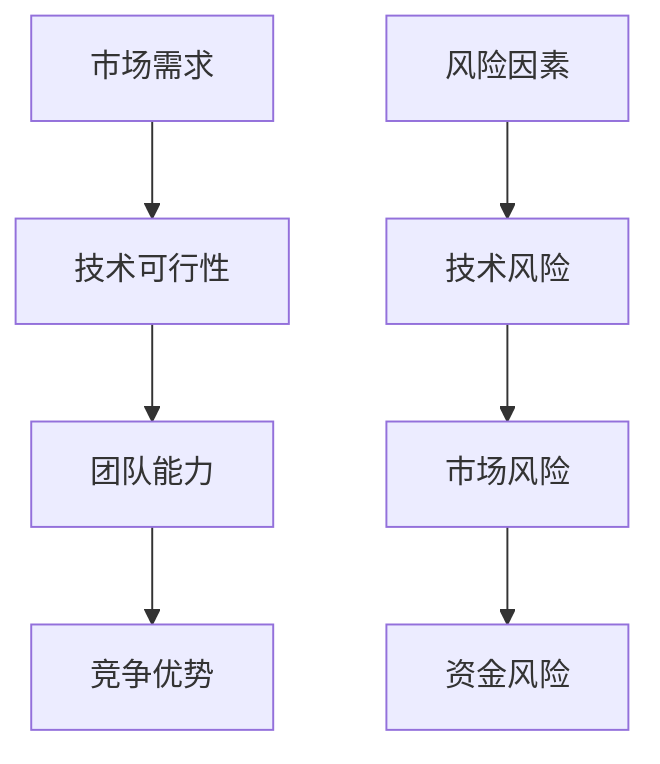

在这个流程图中，我们展示了评估和选择 AI 大模型创业项目的关键因素。

---

通过本章的探讨，我们了解了创业思维与 AI 大模型的关系，以及 AI 大模型在创业中的创新应用。在接下来的章节中，我们将深入分析 AI 大模型的核心技术，探讨其技术原理和架构。

---

#### 第二部分: AI 大模型核心技术

##### 第3章: AI 大模型技术概述

##### 3.1 AI 大模型的核心技术

AI 大模型的核心技术主要包括深度学习、自然语言处理、计算机视觉等。以下是对这些核心技术的详细解释：

1. **深度学习：** 深度学习是一种基于多层神经网络的人工智能方法。它通过模拟人脑的神经网络结构，实现对复杂数据的处理和分析。深度学习的关键算法包括卷积神经网络（CNN）、循环神经网络（RNN）和生成对抗网络（GAN）等。

2. **自然语言处理：** 自然语言处理（NLP）是人工智能领域的一个重要分支，旨在使计算机能够理解、生成和翻译自然语言。NLP 的核心技术包括词向量、语言模型、文本分类和语义理解等。

3. **计算机视觉：** 计算机视觉是一种使计算机能够识别和理解图像和视频的技术。计算机视觉的关键算法包括图像识别、目标检测、图像分割和视频处理等。

**Mermaid 流程图：**

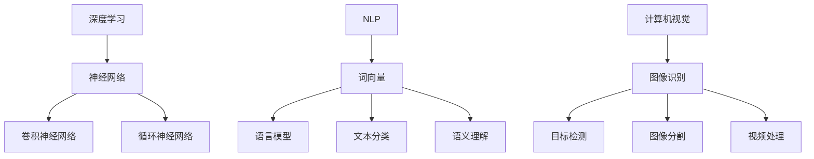

在这个流程图中，我们展示了 AI 大模型的核心技术及其关键算法。

##### 3.2 AI 大模型的技术发展趋势

随着计算能力的提升和数据规模的扩大，AI 大模型的技术发展趋势呈现出以下几个特点：

1. **预训练模型的普及：** 预训练模型通过在大规模数据集上预训练，生成通用的特征表示，再在特定任务上进行微调。预训练模型如BERT、GPT等，已经在各个领域取得了显著的成果。

2. **模型规模的扩大：** 随着计算资源的增加，AI 大模型的规模也在不断扩大。例如，GPT-3 拥有 1750 亿个参数，是目前最大的自然语言处理模型。

3. **多模态学习：** AI 大模型开始向多模态学习方向发展，能够处理文本、图像、音频等多种类型的数据，实现跨模态的信息融合和任务处理。

4. **强化学习与多智能体系统：** 强化学习与多智能体系统在 AI 大模型中的应用逐渐增多，能够实现复杂任务的自主学习和协同工作。

**Mermaid 流程图：**

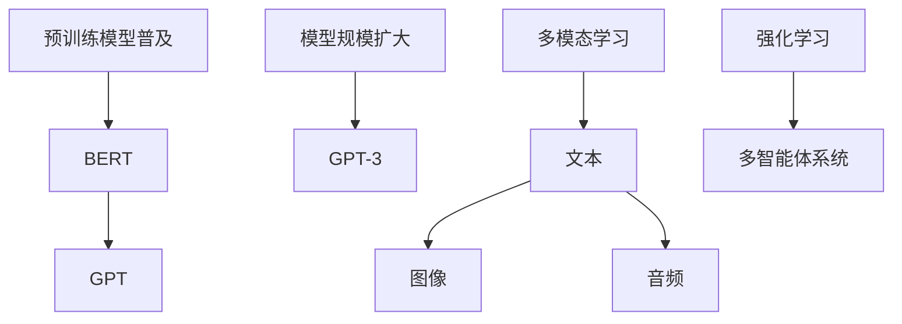

在这个流程图中，我们展示了 AI 大模型的技术发展趋势。

##### 3.3 AI 大模型的技术架构

AI 大模型的技术架构主要包括数据采集与预处理、模型训练与优化、模型部署与监控等环节。

1. **数据采集与预处理：** 数据采集是 AI 大模型训练的基础，包括数据的收集、清洗、标注等。预处理包括数据标准化、数据增强等，以提高模型的训练效果。

2. **模型训练与优化：** 模型训练是通过大量数据对模型进行迭代优化，使其能够更好地拟合数据。优化包括超参数调整、模型剪枝等。

3. **模型部署与监控：** 模型部署是将训练好的模型应用到实际业务中，实现数据流的实时处理。监控包括模型性能监控、异常检测等。

**Mermaid 流程图：**

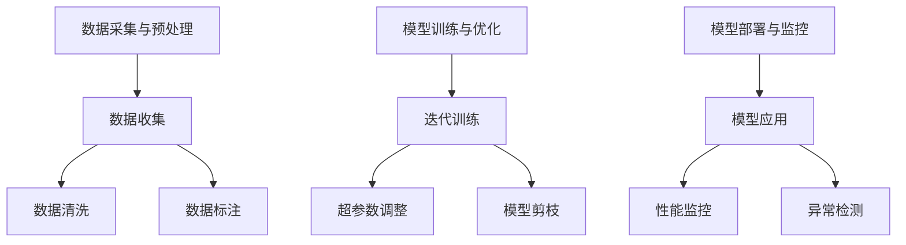

在这个流程图中，我们展示了 AI 大模型的技术架构。

---

通过本章的探讨，我们了解了 AI 大模型的核心技术及其发展趋势，以及其技术架构。在接下来的章节中，我们将深入分析神经网络与深度学习，探讨其基本原理和应用。

---

#### 第二部分: AI 大模型核心技术

##### 第4章: 神经网络与深度学习

##### 4.1 神经网络的基本原理

神经网络是一种模拟人脑神经元之间连接和相互作用的计算模型。它由多个层次组成，包括输入层、隐藏层和输出层。每个层次包含多个神经元，神经元之间通过权重连接。

**数学模型：**

$$
y = \sigma(\sum_{i=1}^{n} w_{i} x_{i} + b)
$$

其中，$y$ 是输出，$\sigma$ 是激活函数，$w_{i}$ 是权重，$x_{i}$ 是输入，$b$ 是偏置。

**举例说明：**

假设我们有一个简单的神经网络，包含一个输入层、一个隐藏层和一个输出层。输入层有3个神经元，隐藏层有4个神经元，输出层有2个神经元。

输入数据：[1, 0, 1]

隐藏层计算：

$$
h_1 = \sigma(w_{11} \cdot x_1 + w_{12} \cdot x_2 + w_{13} \cdot x_3 + b_1) = \sigma(w_{11} + w_{13} + b_1)$$
$$h_2 = \sigma(w_{21} \cdot x_1 + w_{22} \cdot x_2 + w_{23} \cdot x_3 + b_2) = \sigma(w_{21} + w_{23} + b_2)$$
$$h_3 = \sigma(w_{31} \cdot x_1 + w_{32} \cdot x_2 + w_{33} \cdot x_3 + b_3) = \sigma(w_{31} + w_{33} + b_3)$$
$$h_4 = \sigma(w_{41} \cdot x_1 + w_{42} \cdot x_2 + w_{43} \cdot x_3 + b_4) = \sigma(w_{41} + w_{43} + b_4)$$

输出层计算：

$$
o_1 = \sigma(w_{11} \cdot h_1 + w_{12} \cdot h_2 + w_{13} \cdot h_3 + w_{14} \cdot h_4 + b_1) = \sigma(w_{11}h_1 + w_{12}h_2 + w_{13}h_3 + w_{14}h_4 + b_1)$$
$$o_2 = \sigma(w_{21} \cdot h_1 + w_{22} \cdot h_2 + w_{23} \cdot h_3 + w_{24} \cdot h_4 + b_2) = \sigma(w_{21}h_1 + w_{22}h_2 + w_{23}h_3 + w_{24}h_4 + b_2)$$

**伪代码：**

```
# 神经网络基本结构
input_layer = [1, 0, 1]
weights = {
    "h1": [w_11, w_12, w_13],
    "h2": [w_21, w_22, w_23],
    "h3": [w_31, w_32, w_33],
    "h4": [w_41, w_42, w_43],
    "o1": [w_11, w_12, w_13, w_14],
    "o2": [w_21, w_22, w_23, w_24]
}
biases = {
    "h1": b_1,
    "h2": b_2,
    "h3": b_3,
    "h4": b_4,
    "o1": b_1,
    "o2": b_2
}
activation_function = sigmoid

# 隐藏层计算
h1 = activation_function(sum(weights["h1"] * input_layer) + biases["h1"])
h2 = activation_function(sum(weights["h2"] * input_layer) + biases["h2"])
h3 = activation_function(sum(weights["h3"] * input_layer) + biases["h3"])
h4 = activation_function(sum(weights["h4"] * input_layer) + biases["h4"])

# 输出层计算
o1 = activation_function(sum(weights["o1"] * [h1, h2, h3, h4]) + biases["o1"])
o2 = activation_function(sum(weights["o2"] * [h1, h2, h3, h4]) + biases["o2"])

# 输出结果
print("Output:", [o1, o2])
```

**代码解读：** 以上伪代码展示了如何使用神经网络处理一个简单的输入数据。首先，我们定义了输入层和权重、偏置的参数。然后，我们使用激活函数对隐藏层和输出层的计算进行封装。最后，我们输出神经网络的输出结果。

##### 4.2 深度学习的关键算法

深度学习的关键算法包括卷积神经网络（CNN）、循环神经网络（RNN）和生成对抗网络（GAN）等。以下是对这些关键算法的详细解释：

1. **卷积神经网络（CNN）：** CNN 是用于处理图像数据的深度学习模型。它通过卷积操作和池化操作，提取图像的特征。CNN 的关键算法包括卷积层、池化层、全连接层等。

   **数学模型：**

   $$ 
   h_{ij} = \sigma(\sum_{k=1}^{c} w_{ik} \cdot a_{kj} + b_j) 
   $$

   其中，$h_{ij}$ 是输出特征图，$\sigma$ 是激活函数，$w_{ik}$ 是卷积核，$a_{kj}$ 是输入特征图，$b_j$ 是偏置。

   **伪代码：**

   ```
   # 卷积神经网络基本结构
   input_image = ...
   conv_weights = ...
   biases = ...
   activation_function = sigmoid

   # 卷积操作
   conv_output = [0] * depth
   for i in range(depth):
       conv_output[i] = activation_function(sum(conv_weights[i] * input_image) + biases[i])

   # 池化操作
   pooled_output = pool(conv_output)

   # 全连接层
   fc_weights = ...
   fc_biases = ...
   fc_output = activation_function(sum(fc_weights * pooled_output) + fc_biases)

   # 输出结果
   print("Output:", fc_output)
   ```

2. **循环神经网络（RNN）：** RNN 是用于处理序列数据的深度学习模型。它通过循环连接，保存之前的隐藏状态，实现对序列数据的建模。

   **数学模型：**

   $$ 
   h_t = \sigma(W_h \cdot [h_{t-1}, x_t] + b_h) 
   $$

   其中，$h_t$ 是当前隐藏状态，$h_{t-1}$ 是前一个隐藏状态，$x_t$ 是当前输入，$W_h$ 是权重矩阵，$b_h$ 是偏置。

   **伪代码：**

   ```
   # 循环神经网络基本结构
   input_sequence = ...
   hidden_state = ...
   weights = ...
   biases = ...
   activation_function = sigmoid

   # 循环操作
   for x_t in input_sequence:
       hidden_state = activation_function(sum(weights * [hidden_state, x_t]) + biases)

   # 输出结果
   print("Output:", hidden_state)
   ```

3. **生成对抗网络（GAN）：** GAN 是一种用于生成数据的深度学习模型。它由生成器和判别器组成，生成器生成数据，判别器判断生成数据的真假。

   **数学模型：**

   $$ 
   G(z) = \sigma(W_g \cdot z + b_g) 
   $$
   $$ 
   D(x) = \sigma(W_d \cdot x + b_d) 
   $$

   其中，$G(z)$ 是生成器的输出，$D(x)$ 是判别器的输出，$z$ 是噪声输入，$W_g$ 和 $W_d$ 是权重矩阵，$b_g$ 和 $b_d$ 是偏置。

   **伪代码：**

   ```
   # 生成对抗网络基本结构
   noise = ...
   generator_weights = ...
   generator_biases = ...
   discriminator_weights = ...
   discriminator_biases = ...
   activation_function = sigmoid

   # 生成器生成数据
   generated_data = activation_function(sum(generator_weights * noise) + generator_biases)

   # 判别器判断生成数据
   discriminator_output = activation_function(sum(discriminator_weights * [generated_data, real_data]) + discriminator_biases)

   # 输出结果
   print("Generator Output:", generated_data)
   print("Discriminator Output:", discriminator_output)
   ```

##### 4.3 神经网络与深度学习在创业中的应用

神经网络与深度学习在创业中的应用场景非常广泛，以下是一些典型的应用案例：

1. **图像识别与处理：** 在图像识别与处理领域，深度学习模型可以用于图像分类、目标检测、图像分割等任务。例如，人脸识别技术已经成为许多创业公司的核心产品，如旷视科技、商汤科技等。

2. **自然语言处理：** 在自然语言处理领域，深度学习模型可以用于文本分类、情感分析、机器翻译等任务。例如，许多创业公司通过深度学习技术提供智能客服解决方案，如智谱AI、科大讯飞等。

3. **推荐系统：** 在推荐系统领域，深度学习模型可以用于用户行为分析、商品推荐等任务。例如，美团、阿里巴巴等创业公司通过深度学习技术提供个性化推荐服务。

4. **金融科技：** 在金融科技领域，深度学习模型可以用于风险评估、量化交易、欺诈检测等任务。例如，许多创业公司通过深度学习技术提供金融风控解决方案。

5. **医疗健康：** 在医疗健康领域，深度学习模型可以用于疾病诊断、药物研发、个性化治疗等任务。例如，许多创业公司通过深度学习技术提供医疗影像分析解决方案。

**Mermaid 流程图：**

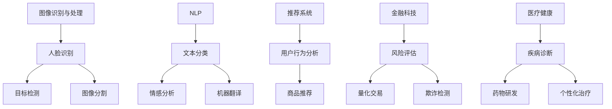

在这个流程图中，我们展示了神经网络与深度学习在图像识别与处理、自然语言处理、推荐系统、金融科技和医疗健康等领域的应用案例。

---

通过本章的探讨，我们深入了解了神经网络与深度学习的基本原理和关键算法，以及它们在创业中的应用。在接下来的章节中，我们将进一步探讨大规模预训练模型，分析其原理和应用。

---

#### 第二部分: AI 大模型核心技术

##### 第5章: 大规模预训练模型

##### 5.1 大规模预训练模型的概念

大规模预训练模型是指通过在大规模数据集上预训练，生成通用的特征表示，再在特定任务上进行微调的模型。这种模型具有强大的迁移学习能力，能够在多个任务上表现出色。

**数学模型：**

预训练模型的训练过程可以表示为：

$$
\theta = \arg\min_{\theta} J(\theta; X, Y)
$$

其中，$\theta$ 是模型的参数，$J(\theta; X, Y)$ 是损失函数，$X$ 是预训练数据集，$Y$ 是预训练标签。

**举例说明：**

假设我们有一个大规模预训练模型，用于文本分类任务。首先，我们将模型在大量的文本数据上进行预训练，生成文本的通用特征表示。然后，我们在特定领域的文本数据上进行微调，使模型能够更好地适应特定任务。

##### 5.2 预训练模型的常见框架

预训练模型有许多常见的框架，以下是一些典型的框架：

1. **BERT（Bidirectional Encoder Representations from Transformers）：** BERT 是一种基于 Transformer 的双向编码器，通过预训练生成双向的文本表示。BERT 在自然语言处理任务上取得了显著的成果。

2. **GPT（Generative Pre-trained Transformer）：** GPT 是一种生成式预训练模型，通过自回归的方式生成文本。GPT-3 拥有 1750 亿个参数，是目前最大的自然语言处理模型。

3. **T5（Text-to-Text Transfer Transformer）：** T5 是一种将所有自然语言处理任务统一为文本到文本转换任务的预训练模型。T5 在多个自然语言处理任务上取得了优异的性能。

4. **ViT（Vision Transformer）：** ViT 是一种将 Transformer 模型应用于计算机视觉任务的预训练模型。ViT 在图像分类任务上取得了优异的性能。

**伪代码：**

```python
# BERT 模型预训练
from transformers import BertModel, BertTokenizer

tokenizer = BertTokenizer.from_pretrained('bert-base-uncased')
model = BertModel.from_pretrained('bert-base-uncased')

inputs = tokenizer("Hello, my dog is cute", return_tensors='pt')
outputs = model(**inputs)

# GPT 模型预训练
from transformers import Gpt2Model, Gpt2Tokenizer

tokenizer = Gpt2Tokenizer.from_pretrained('gpt2')
model = Gpt2Model.from_pretrained('gpt2')

inputs = tokenizer("Hello, how are you?", return_tensors='pt')
outputs = model.generate(inputs['input_ids'], max_length=50, num_return_sequences=5)

# T5 模型预训练
from transformers import T5Model, T5Tokenizer

tokenizer = T5Tokenizer.from_pretrained('t5-small')
model = T5Model.from_pretrained('t5-small')

inputs = tokenizer("translate English to French: Hello, how are you?", return_tensors='pt')
outputs = model.generate(**inputs)

# ViT 模型预训练
from transformers import ViTModel, ViTTokenizer

tokenizer = ViTTokenizer.from_pretrained('google/vit-base-patch16-224')
model = ViTModel.from_pretrained('google/vit-base-patch16-224')

inputs = tokenizer("apple", return_tensors='pt')
outputs = model(**inputs)
```

**代码解读：** 以上伪代码展示了如何加载和使用 BERT、GPT、T5 和 ViT 等预训练模型。首先，我们加载相应的模型和 tokenizer。然后，我们将输入数据编码为模型能够理解的格式，并调用模型的训练或生成方法。

##### 5.3 大规模预训练模型在创业中的应用

大规模预训练模型在创业中的应用场景非常广泛，以下是一些典型的应用案例：

1. **自然语言处理：** 在自然语言处理领域，预训练模型可以用于文本分类、文本生成、机器翻译等任务。例如，许多创业公司通过预训练模型提供智能客服、智能写作和内容审核等服务。

2. **计算机视觉：** 在计算机视觉领域，预训练模型可以用于图像分类、目标检测、图像分割等任务。例如，许多创业公司通过预训练模型提供图像识别、图像生成和图像增强等服务。

3. **推荐系统：** 在推荐系统领域，预训练模型可以用于用户行为分析、商品推荐和广告投放等任务。例如，许多创业公司通过预训练模型提供个性化推荐、智能营销和用户增长等服务。

4. **金融科技：** 在金融科技领域，预训练模型可以用于风险评估、量化交易和欺诈检测等任务。例如，许多创业公司通过预训练模型提供金融风控、智能投顾和资产管理等服务。

5. **医疗健康：** 在医疗健康领域，预训练模型可以用于疾病诊断、药物研发和个性化治疗等任务。例如，许多创业公司通过预训练模型提供医疗影像分析、智能诊断和健康管理等服务。

**Mermaid 流程图：**

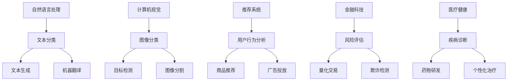

在这个流程图中，我们展示了大规模预训练模型在自然语言处理、计算机视觉、推荐系统、金融科技和医疗健康等领域的应用案例。

---

通过本章的探讨，我们深入了解了大规模预训练模型的概念、常见框架和应用。在接下来的章节中，我们将探讨自然语言处理与生成模型，分析其在创业中的应用。

---

#### 第二部分: AI 大模型核心技术

##### 第6章: 自然语言处理与生成模型

##### 6.1 自然语言处理的基本概念

自然语言处理（NLP）是人工智能领域的一个重要分支，旨在使计算机能够理解、生成和翻译自然语言。NLP 的核心任务是使计算机能够与人类自然语言进行交互，从而实现智能对话、文本分析、语义理解等功能。

**数学模型：**

自然语言处理涉及多种数学模型，包括词向量、语言模型、文本分类、序列标注等。

1. **词向量：** 词向量是一种将单词映射为向量的方法，用于表示单词的语义信息。常见的词向量模型有 Word2Vec、GloVe 等。

2. **语言模型：** 语言模型是一种概率模型，用于预测下一个单词或字符的条件概率。常见的语言模型有 n-gram 模型、神经网络语言模型（如 LSTM、GRU）等。

3. **文本分类：** 文本分类是一种将文本分为不同类别的方法。常见的文本分类算法有朴素贝叶斯、支持向量机（SVM）、神经网络等。

4. **序列标注：** 序列标注是一种对文本序列中的单词或字符进行分类的方法，如命名实体识别（NER）、情感分析等。

**伪代码：**

```python
# 词向量模型
from gensim.models import Word2Vec

sentences = [['hello', 'world'], ['hello', 'gensim'], ['hello', 'python']]
model = Word2Vec(sentences, vector_size=100, window=5, min_count=1, workers=4)

# 语言模型
from transformers import BertModel, BertTokenizer

tokenizer = BertTokenizer.from_pretrained('bert-base-uncased')
model = BertModel.from_pretrained('bert-base-uncased')

inputs = tokenizer("Hello, my name is John", return_tensors='pt')
outputs = model(**inputs)

# 文本分类
from sklearn.feature_extraction.text import TfidfVectorizer
from sklearn.svm import SVC

corpus = ['I love machine learning', 'Natural language processing is fascinating', 'Data analysis is important']
vectorizer = TfidfVectorizer()
X = vectorizer.fit_transform(corpus)
y = [0, 1, 2]  # 类别标签

clf = SVC(kernel='linear')
clf.fit(X, y)

new_document = 'I enjoy deep learning'
X_new = vectorizer.transform([new_document])
predicted_category = clf.predict(X_new)[0]
print("Predicted Category:", predicted_category)
```

**代码解读：** 以上伪代码展示了如何使用词向量、语言模型和文本分类模型。首先，我们加载词向量模型，将句子转换为词向量。然后，我们加载语言模型，对输入文本进行编码。最后，我们使用文本分类模型，对新的文本进行分类。

##### 6.2 生成模型的原理与应用

生成模型是一种用于生成数据的机器学习模型，能够在给定数据分布的情况下生成类似的数据。常见的生成模型有生成对抗网络（GAN）、变分自编码器（VAE）等。

**生成对抗网络（GAN）：** GAN 由生成器和判别器组成，生成器生成数据，判别器判断生成数据的真假。GAN 的目标是最小化生成器与判别器的差距。

**数学模型：**

$$
\min_G \max_D J(G, D) = \mathbb{E}_{x \sim p_{data}(x)}[\log D(x)] + \mathbb{E}_{z \sim p_z(z)}[\log (1 - D(G(z))]
$$

其中，$G(z)$ 是生成器的输出，$D(x)$ 是判别器的输出，$x$ 是真实数据，$z$ 是噪声输入。

**伪代码：**

```python
# 生成对抗网络（GAN）
import torch
import torch.nn as nn
import torch.optim as optim

# 生成器
class Generator(nn.Module):
    def __init__(self):
        super(Generator, self).__init__()
        self.model = nn.Sequential(
            nn.Linear(100, 256),
            nn.LeakyReLU(0.2),
            nn.Linear(256, 512),
            nn.LeakyReLU(0.2),
            nn.Linear(512, 1024),
            nn.LeakyReLU(0.2),
            nn.Linear(1024, 28*28),
            nn.Tanh()
        )

    def forward(self, x):
        return self.model(x)

# 判别器
class Discriminator(nn.Module):
    def __init__(self):
        super(Discriminator, self).__init__()
        self.model = nn.Sequential(
            nn.Linear(28*28, 1024),
            nn.LeakyReLU(0.2),
            nn.Dropout(0.3),
            nn.Linear(1024, 512),
            nn.LeakyReLU(0.2),
            nn.Dropout(0.3),
            nn.Linear(512, 256),
            nn.LeakyReLU(0.2),
            nn.Dropout(0.3),
            nn.Linear(256, 1),
            nn.Sigmoid()
        )

    def forward(self, x):
        return self.model(x)

# GAN 模型训练
generator = Generator()
discriminator = Discriminator()

criterion = nn.BCELoss()
optimizerG = optim.Adam(generator.parameters(), lr=0.0002)
optimizerD = optim.Adam(discriminator.parameters(), lr=0.0002)

for epoch in range(num_epochs):
    for i, (images, _) in enumerate(data_loader):
        # 训练判别器
        real_images = images.to(device)
        real_labels = torch.ones(images.size(0), 1).to(device)
        noise = torch.randn(images.size(0), 100).to(device)
        fake_images = generator(noise)

        d_loss_real = criterion(discriminator(real_images), real_labels)
        d_loss_fake = criterion(discriminator(fake_images), torch.zeros(images.size(0), 1).to(device))
        d_loss = 0.5 * (d_loss_real + d_loss_fake)

        optimizerD.zero_grad()
        d_loss.backward()
        optimizerD.step()

        # 训练生成器
        noise = torch.randn(images.size(0), 100).to(device)
        g_loss = criterion(discriminator(generator(noise)), torch.ones(images.size(0), 1).to(device))

        optimizerG.zero_grad()
        g_loss.backward()
        optimizerG.step()

        if (i+1) % 100 == 0:
            print(f'[{epoch}/{num_epochs}] [D loss: {d_loss.item():.4f}] [G loss: {g_loss.item():.4f}]')
```

**代码解读：** 以上伪代码展示了如何训练生成对抗网络（GAN）。首先，我们定义了生成器和判别器的模型结构。然后，我们设置损失函数和优化器，并开始训练模型。在训练过程中，我们交替训练判别器和生成器，使生成器能够生成更真实的数据。

##### 6.3 自然语言处理与生成模型在创业中的应用

自然语言处理与生成模型在创业中的应用非常广泛，以下是一些典型的应用案例：

1. **智能客服：** 在智能客服领域，NLP 和生成模型可以用于自动回复、语义理解和语音合成。例如，许多创业公司通过 NLP 和生成模型提供智能客服解决方案，如智谱AI、优必选等。

2. **内容生成：** 在内容生成领域，NLP 和生成模型可以用于生成文章、代码、音乐等。例如，OpenAI 的 GPT-3 可以生成高质量的文章和代码，为企业提供自动化内容生成解决方案。

3. **文本分类与情感分析：** 在文本分类与情感分析领域，NLP 和生成模型可以用于新闻分类、情感分析、用户评论分析等。例如，许多创业公司通过 NLP 和生成模型提供文本分类与情感分析服务，如阿里云、腾讯云等。

4. **语音识别与生成：** 在语音识别与生成领域，NLP 和生成模型可以用于语音识别、语音合成和语音转换。例如，科大讯飞、百度等创业公司通过 NLP 和生成模型提供语音识别与生成服务。

5. **医疗健康：** 在医疗健康领域，NLP 和生成模型可以用于医疗文本分析、疾病诊断和药物研发。例如，许多创业公司通过 NLP 和生成模型提供医疗健康解决方案，如深鉴科技、零氪科技等。

**Mermaid 流程图：**

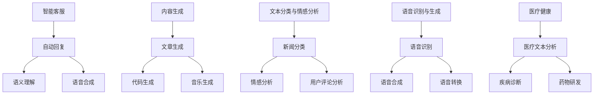

在这个流程图中，我们展示了自然语言处理与生成模型在智能客服、内容生成、文本分类与情感分析、语音识别与生成和医疗健康等领域的应用案例。

---

通过本章的探讨，我们深入了解了自然语言处理与生成模型的基本概念、原理和应用。在接下来的章节中，我们将探讨强化学习与多智能体系统，分析其在创业中的应用。

---

#### 第二部分: AI 大模型核心技术

##### 第7章: 强化学习与多智能体系统

##### 7.1 强化学习的基本概念

强化学习是一种使人工智能体通过与环境交互，学习实现目标的方法。强化学习的主要目标是使智能体在给定环境中找到最优策略，以实现最大化累积奖励。

**数学模型：**

强化学习的基本模型包括智能体（Agent）、环境（Environment）和奖励（Reward）。智能体通过感知环境状态，采取行动，并获得环境反馈的奖励。

$$
R = \sum_{t=0}^{T} r_t
$$

其中，$R$ 是累积奖励，$r_t$ 是在第 $t$ 时刻的即时奖励。

**伪代码：**

```python
# 强化学习基本模型
import numpy as np

# 环境定义
class Environment:
    def __init__(self):
        self.state = np.random.randint(0, 10)
    
    def step(self, action):
        reward = self.state * action
        next_state = self.state + np.random.randint(-1, 2)
        return next_state, reward

# 智能体定义
class Agent:
    def __init__(self):
        self.state = None
        self.action = None
        self.reward = None
        self.Q = np.zeros((10, 10))
    
    def choose_action(self, state):
        return np.argmax(self.Q[state])
    
    def learn(self, state, action, reward, next_state):
        target = reward + 0.99 * np.max(self.Q[next_state])
        self.Q[state][action] = self.Q[state][action] + 0.1 * (target - self.Q[state][action])

# 强化学习过程
agent = Agent()
env = Environment()

for episode in range(1000):
    state = env.state
    done = False
    
    while not done:
        action = agent.choose_action(state)
        next_state, reward = env.step(action)
        agent.learn(state, action, reward, next_state)
        state = next_state
        
        if np.random.random() < 0.1:
            done = True

    print(f'Episode: {episode}, Reward: {agent.reward}')
```

**代码解读：** 以上伪代码展示了如何实现强化学习基本模型。首先，我们定义了环境和智能体的类。然后，我们创建智能体和环境的实例，并开始强化学习过程。在每次迭代中，智能体选择行动，并学习更新其值函数。

##### 7.2 多智能体系统的原理与应用

多智能体系统（MAS）是指由多个智能体组成的系统，这些智能体通过协作或竞争来实现共同的目标。多智能体系统在多个领域都有广泛的应用，如游戏、金融、物流等。

**数学模型：**

多智能体系统的核心是智能体之间的交互。常见的交互模型有基于通信的交互和基于行为的交互。

1. **基于通信的交互：** 智能体通过发送和接收消息来交换信息，以实现协同工作。常见的通信协议有分布式算法、博弈论等。

2. **基于行为的交互：** 智能体通过观察环境和其他智能体的行为来调整自己的策略，以实现协同工作。常见的策略更新方法有强化学习、策略梯度等。

**伪代码：**

```python
# 多智能体系统基本模型
import numpy as np

# 智能体定义
class Agent:
    def __init__(self, action_space):
        self.state = None
        self.action = None
        self.reward = 0
        self.Q = np.zeros(action_space)
    
    def choose_action(self, state):
        return np.random.choice(self.Q[state])
    
    def learn(self, state, action, reward, next_state):
        target = reward + 0.99 * np.max(self.Q[next_state])
        self.Q[state][action] = self.Q[state][action] + 0.1 * (target - self.Q[state][action])

# 多智能体系统训练
num_agents = 10
action_space = 5
agents = [Agent(action_space) for _ in range(num_agents)]

for episode in range(1000):
    states = [np.random.randint(0, action_space) for _ in range(num_agents)]
    actions = [agent.choose_action(state) for agent, state in zip(agents, states)]
    rewards = [agent.reward for agent in agents]
    next_states = [np.random.randint(0, action_space) for _ in range(num_agents)]
    
    for agent, state, action, reward, next_state in zip(agents, states, actions, rewards, next_states):
        agent.learn(state, action, reward, next_state)

    print(f'Episode: {episode}, Rewards: {rewards}')
```

**代码解读：** 以上伪代码展示了如何实现多智能体系统的训练。首先，我们定义了智能体的类。然后，我们创建多个智能体的实例，并开始多智能体系统的训练。在每次迭代中，每个智能体选择行动，并更新其值函数。

##### 7.3 强化学习与多智能体系统在创业中的应用

强化学习与多智能体系统在创业中的应用场景非常广泛，以下是一些典型的应用案例：

1. **智能交通：** 在智能交通领域，强化学习与多智能体系统可以用于车辆调度、路径规划等任务。例如，许多创业公司通过强化学习与多智能体系统提供智能交通解决方案，如滴滴出行、优步等。

2. **金融科技：** 在金融科技领域，强化学习与多智能体系统可以用于风险管理、量化交易等任务。例如，许多创业公司通过强化学习与多智能体系统提供金融科技解决方案，如量化金融、区块链等。

3. **智能制造：** 在智能制造领域，强化学习与多智能体系统可以用于生产调度、设备维护等任务。例如，许多创业公司通过强化学习与多智能体系统提供智能制造解决方案，如机器人制造、自动化生产线等。

4. **医疗健康：** 在医疗健康领域，强化学习与多智能体系统可以用于疾病预测、医疗资源分配等任务。例如，许多创业公司通过强化学习与多智能体系统提供医疗健康解决方案，如智能诊断、医疗影像分析等。

**Mermaid 流程图：**

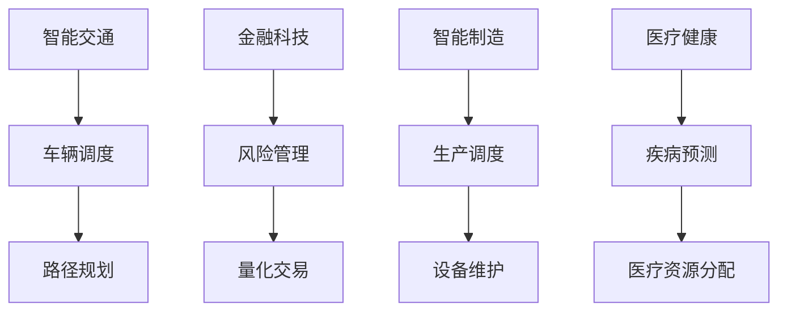

在这个流程图中，我们展示了强化学习与多智能体系统在智能交通、金融科技、智能制造和医疗健康等领域的应用案例。

---

通过本章的探讨，我们深入了解了强化学习与多智能体系统的基本概念、原理和应用。在接下来的章节中，我们将探讨 AI 大模型创业实践，分析创业项目的策划、实施和案例分析。

---

#### 第三部分: AI 大模型创业实践

##### 第8章: AI 大模型创业项目策划

##### 8.1 创业项目策划的基本步骤

策划一个 AI 大模型创业项目需要系统化的方法和步骤，以下是一些关键步骤：

1. **市场调研：** 首先，创业者需要对目标市场进行深入调研，了解市场需求、竞争态势、潜在用户等。这可以通过市场分析报告、用户访谈、竞争对手分析等方式实现。

2. **业务定位：** 在市场调研的基础上，创业者需要明确项目的业务定位，包括产品或服务的目标市场、用户痛点、差异化优势等。

3. **技术选型：** 根据业务需求，创业者需要选择合适的技术方案，包括 AI 大模型的选择、框架的选型、硬件资源的配置等。

4. **团队建设：** 创业项目需要一个高效、专业的团队，包括 AI 技术专家、产品经理、数据工程师、业务分析师等。

5. **资金规划：** 创业项目需要资金支持，创业者需要制定详细的资金规划，包括启动资金、运营资金、融资计划等。

6. **风险评估：** 在项目策划阶段，创业者需要对潜在的风险进行评估，包括技术风险、市场风险、资金风险等，并制定相应的风险管理措施。

**Mermaid 流�程图：**

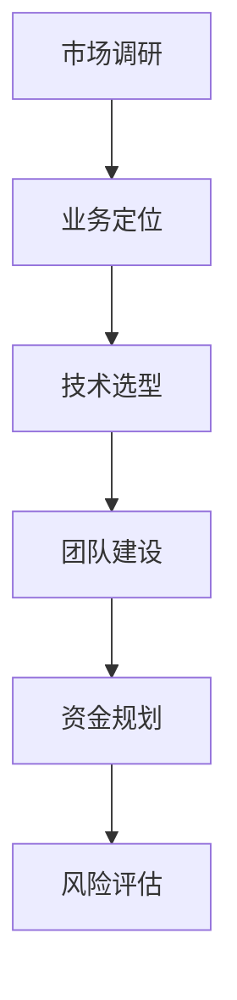

在这个流程图中，我们展示了创业项目策划的基本步骤。

##### 8.2 AI 大模型创业项目的目标与定位

AI 大模型创业项目的目标与定位是项目成功的关键。以下是几个关键点：

1. **解决痛点：** 项目需要解决现实中的痛点问题，例如提高生产效率、降低运营成本、改善用户体验等。

2. **技术优势：** 项目需要具有独特的技术优势，例如创新性的算法、先进的模型架构、高效的数据处理能力等。

3. **市场前景：** 项目需要具备良好的市场前景，能够在未来实现规模化和商业化。

4. **差异化：** 项目需要与竞争对手形成差异化，提供独特的价值，以满足市场需求。

5. **可持续性：** 项目需要具备可持续发展的能力，能够不断迭代和优化，以适应市场变化。

**Mermaid 流程图：**

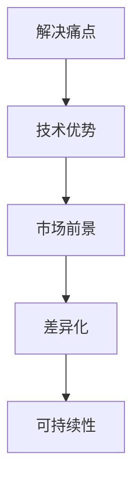

在这个流程图中，我们展示了 AI 大模型创业项目的目标与定位。

##### 8.3 创业项目的团队组织与资源分配

一个成功的 AI 大模型创业项目需要一个高效、专业的团队，以下是一些关键点：

1. **团队构成：** 团队应包括 AI 技术专家、产品经理、数据工程师、业务分析师、市场人员等，每个成员都应具备相应的专业能力和经验。

2. **职责分工：** 明确团队每个成员的职责分工，确保项目有序推进。例如，技术专家负责算法研发和模型优化，产品经理负责产品规划和设计，数据工程师负责数据采集和处理等。

3. **资源分配：** 合理分配项目资源，包括资金、人力、技术资源等，确保项目能够顺利进行。

4. **团队协作：** 促进团队协作，建立有效的沟通机制，确保团队成员之间的信息畅通。

5. **激励机制：** 设立激励机制，鼓励团队成员积极参与项目，提高项目成功率。

**Mermaid 流程图：**

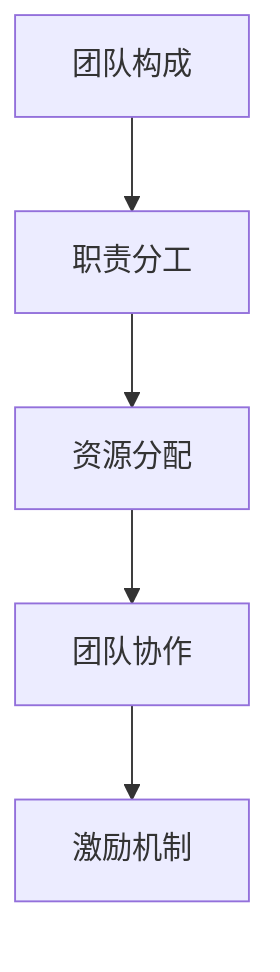

在这个流程图中，我们展示了创业项目的团队组织与资源分配。

---

通过本章的探讨，我们了解了 AI 大模型创业项目策划的基本步骤、目标与定位，以及团队组织与资源分配。在接下来的章节中，我们将探讨 AI 大模型创业项目的实施，分析项目实施的关键环节。

---

#### 第三部分: AI 大模型创业实践

##### 第9章: AI 大模型创业项目实施

##### 9.1 创业项目实施的关键环节

AI 大模型创业项目的实施是一个复杂的过程，涉及多个关键环节。以下是对这些关键环节的详细讨论：

1. **数据收集与预处理：** 数据是 AI 大模型训练的基础，项目实施的第一步是收集相关数据，并进行预处理。数据收集可能涉及多种来源，包括公开数据集、企业内部数据、第三方数据服务等。预处理包括数据清洗、格式化、标注等，以确保数据质量。

2. **模型设计与训练：** 在数据准备好之后，需要设计 AI 大模型的架构，并对其进行训练。模型设计包括选择合适的算法、架构和超参数。训练过程中，需要使用计算资源对模型进行迭代优化，以达到较好的性能。

3. **模型评估与优化：** 模型训练完成后，需要进行评估，以确定其性能是否符合预期。评估过程可能包括多种指标，如准确率、召回率、F1 分数等。根据评估结果，可能需要对模型进行调整和优化。

4. **模型部署与集成：** 评估完成后，将训练好的模型部署到生产环境中，与现有系统集成。部署过程可能涉及容器化、分布式计算、API 接口设计等。

5. **持续监控与更新：** 模型部署后，需要持续监控其性能和稳定性，并根据实际情况进行更新和迭代。

**Mermaid 流程图：**

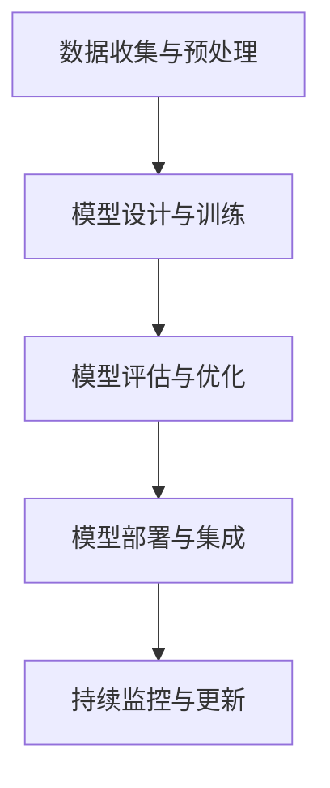

在这个流程图中，我们展示了 AI 大模型创业项目实施的关键环节。

##### 9.2 AI 大模型创业项目的风险管理

在 AI 大模型创业项目中，风险管理是确保项目成功的关键。以下是一些常见的风险及其应对策略：

1. **数据隐私风险：** AI 大模型对数据依赖性强，数据隐私和安全是一个重要问题。应对策略包括数据加密、访问控制、隐私保护技术等。

2. **计算资源风险：** AI 大模型训练和部署需要大量的计算资源，计算资源的不足可能影响项目进度和性能。应对策略包括资源调度、分布式计算、云计算等。

3. **人才短缺风险：** AI 大模型技术要求高，人才短缺可能影响项目进度和质量。应对策略包括内部培训、外部招聘、合作伙伴等。

4. **技术成熟度风险：** AI 大模型技术不断发展，技术成熟度可能影响项目的成功。应对策略包括持续关注技术发展、技术验证、合作研发等。

5. **市场接受度风险：** 市场可能对新兴的 AI 大模型技术持怀疑态度，影响项目的市场推广。应对策略包括市场调研、用户反馈、营销推广等。

**Mermaid 流程图：**

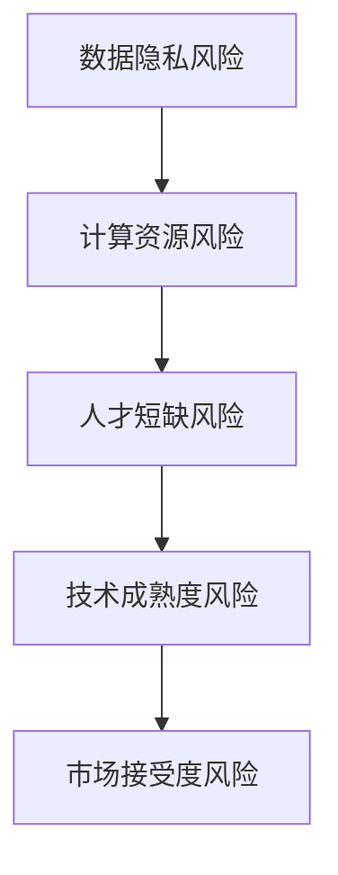

在这个流程图中，我们展示了 AI 大模型创业项目的风险管理及其应对策略。

##### 9.3 创业项目的市场推广与运营

AI 大模型创业项目的成功不仅依赖于技术，还需要有效的市场推广和运营。以下是一些关键点：

1. **市场定位：** 明确项目的市场定位，包括目标用户、市场需求、竞争优势等。

2. **营销策略：** 制定合适的营销策略，包括品牌建设、产品宣传、线上线下活动等。

3. **用户反馈：** 收集用户反馈，了解用户需求，优化产品和服务。

4. **合作伙伴：** 寻找合适的合作伙伴，共同推广和运营项目。

5. **数据驱动：** 运用数据分析，优化市场推广策略，提高运营效果。

**Mermaid 流程图：**

```mermaid
graph TB
    A[市场定位] --> B[营销策略]
    B --> C[用户反馈]
    C --> D[合作伙伴]
    D --> E[数据驱动]
```

在这个流程图中，我们展示了创业项目的市场推广与运营策略。

---

通过本章的探讨，我们了解了 AI 大模型创业项目实施的关键环节、风险管理以及市场推广与运营策略。在接下来的章节中，我们将通过案例分析，深入探讨 AI 大模型创业项目的成功经验和教训。

---

#### 第三部分: AI 大模型创业实践

##### 第10章: AI 大模型创业案例分析

##### 10.1 AI 大模型创业成功的案例介绍

以下是一些 AI 大模型创业成功的案例，它们在市场上取得了显著的成就：

1. **OpenAI 的 GPT-3：** OpenAI 是一家专注于人工智能研究的公司，其推出的 GPT-3 是目前最大的自然语言处理模型，拥有 1750 亿个参数。GPT-3 在文本生成、机器翻译、问答系统等领域取得了显著成果，为 OpenAI 带来了巨大的商业价值。

2. **DeepMind 的 AlphaGo：** DeepMind 是一家专注于人工智能研究的公司，其开发的 AlphaGo 是一款围棋人工智能程序。AlphaGo 在 2016 年击败了世界围棋冠军李世石，引起了广泛关注。DeepMind 通过 AlphaGo 的成功，获得了大量投资和商业合作。

3. **智谱AI：** 智谱AI 是一家专注于自然语言处理技术的公司，其推出的智能客服系统广泛应用于金融、电商、医疗等领域。智谱AI 通过技术创新和市场需求结合，实现了快速成长。

4. **商汤科技：** 商汤科技 是一家专注于计算机视觉技术的公司，其产品广泛应用于人脸识别、视频监控、自动驾驶等领域。商汤科技通过技术创新和产业链合作，成为人工智能领域的重要玩家。

**Mermaid 流程图：**

```mermaid
graph TB
    A[OpenAI] --> B[GPT-3]
    B --> C[文本生成]
    B --> D[机器翻译]
    B --> E[问答系统]

    F[DeepMind] --> G[AlphaGo]
    G --> H[围棋]
    G --> I[人工智能研究]

    J[智谱AI] --> K[智能客服]
    K --> L[金融]
    K --> M[电商]
    K --> N[医疗]

    P[商汤科技] --> Q[人脸识别]
    Q --> R[视频监控]
    Q --> S[自动驾驶]
```

在这个流程图中，我们展示了 OpenAI 的 GPT-3、DeepMind 的 AlphaGo、智谱AI 的智能客服系统和商汤科技的计算机视觉技术的应用场景。

##### 10.2 案例分析：成功经验与教训

通过对以上案例的分析，我们可以总结出一些成功经验和教训：

**成功经验：**

1. **技术创新：** 案例中的公司都拥有强大的技术实力，通过技术创新取得了突破性的成果。

2. **市场需求：** 案例中的公司都关注市场需求，将技术创新与市场需求相结合，开发了具有商业价值的产品和服务。

3. **人才团队：** 案例中的公司都拥有优秀的团队，包括技术专家、产品经理、数据分析师等，确保了项目的成功实施。

4. **资本支持：** 案例中的公司都获得了充足的资本支持，为其技术创新和市场扩张提供了保障。

**教训：**

1. **数据隐私：** 在 AI 大模型创业过程中，数据隐私和安全是一个重要问题，需要严格保护用户数据，遵守相关法律法规。

2. **技术成熟度：** AI 大模型技术不断发展，创业者需要关注技术成熟度，确保项目技术可行性。

3. **市场竞争：** AI 大模型市场竞争激烈，创业者需要具备创新能力和竞争优势，以在市场中脱颖而出。

**Mermaid 流程图：**

```mermaid
graph TB
    A[技术创新] --> B[市场需求]
    B --> C[人才团队]
    B --> D[资本支持]

    E[数据隐私] --> F[技术成熟度]
    F --> G[市场竞争]
```

在这个流程图中，我们展示了 AI 大模型创业的成功经验和教训。

##### 10.3 创业者如何借鉴成功案例

创业者可以借鉴以上成功案例，采取以下策略：

1. **技术创新：** 重视技术创新，关注市场需求，将技术创新与市场需求相结合。

2. **人才团队：** 建立高效的团队，包括技术专家、产品经理、数据分析师等，确保项目的成功实施。

3. **资本支持：** 寻求充足的资本支持，为项目提供资金保障。

4. **数据隐私：** 重视数据隐私和安全，遵守相关法律法规，确保用户数据的安全。

5. **市场竞争：** 关注市场竞争态势，持续创新，提升产品竞争力。

**Mermaid 流程图：**

```mermaid
graph TB
    A[技术创新] --> B[市场需求]
    B --> C[人才团队]
    B --> D[资本支持]
    D --> E[数据隐私]
    E --> F[市场竞争]
```

在这个流程图中，我们展示了创业者如何借鉴成功案例，实现 AI 大模型创业的成功。

---

通过本章的案例分析，我们了解了 AI 大模型创业的成功经验和教训。在接下来的章节中，我们将探讨 AI 大模型创业的未来趋势，分析创业者在 AI 大模型领域的创新方向。

---

#### 第三部分: AI 大模型创业实践

##### 第11章: AI 大模型创业的未来趋势

##### 11.1 AI 大模型创业的发展趋势

AI 大模型创业的发展趋势呈现出以下几个方面的特点：

1. **预训练模型的普及：** 预训练模型在 AI 大模型创业中的应用越来越普及，许多公司开始采用预训练模型来提升其产品和服务的能力。

2. **模型规模扩大：** 随着计算能力的提升，AI 大模型的规模也在不断扩大。例如，OpenAI 的 GPT-3 已经成为业界最大的自然语言处理模型，其他领域的 AI 大模型也在不断突破。

3. **多模态学习：** 多模态学习在 AI 大模型创业中的应用逐渐增多，能够处理文本、图像、音频等多种类型的数据，实现跨模态的信息融合和任务处理。

4. **强化学习与多智能体系统：** 强化学习与多智能体系统在 AI 大模型创业中的应用逐渐增多，能够实现复杂任务的自主学习和协同工作。

**Mermaid 流程图：**

```mermaid
graph TB
    A[预训练模型普及] --> B[模型规模扩大]
    B --> C[多模态学习]
    C --> D[强化学习与多智能体系统]
```

在这个流程图中，我们展示了 AI 大模型创业的发展趋势。

##### 11.2 创业者在 AI 大模型领域的创新方向

创业者可以在以下方向进行创新，以在 AI 大模型领域取得成功：

1. **垂直行业应用：** 针对特定的垂直行业，如金融、医疗、教育等，开发定制化的 AI 大模型解决方案。这可以满足行业特定的需求，提高解决方案的竞争力。

2. **跨模态数据处理：** 开发能够处理多种类型数据的 AI 大模型，如文本、图像、音频等。这可以提升模型的泛化能力和应用范围。

3. **边缘计算与云计算：** 结合边缘计算与云计算，为用户提供实时、高效的 AI 大模型服务。边缘计算可以提高模型响应速度，降低延迟，云计算可以提供强大的计算资源支持。

4. **数据隐私与安全：** 在 AI 大模型创业中，重视数据隐私和安全，采用加密、访问控制等技术保护用户数据，遵守相关法律法规。

5. **开放平台与生态系统：** 建立开放的 AI 大模型平台，吸引第三方开发者参与，构建生态系统。这可以促进技术共享和合作，提高解决方案的多样性和创新性。

**Mermaid 流程图：**

```mermaid
graph TB
    A[垂直行业应用] --> B[跨模态数据处理]
    B --> C[边缘计算与云计算]
    C --> D[数据隐私与安全]
    D --> E[开放平台与生态系统]
```

在这个流程图中，我们展示了创业者在 AI 大模型领域的创新方向。

##### 11.3 AI 大模型创业的可持续发展策略

为了实现 AI 大模型创业的可持续发展，创业者可以采取以下策略：

1. **技术创新：** 持续关注技术发展，不断引入最新的 AI 技术，提升产品竞争力。

2. **市场拓展：** 扩大市场覆盖范围，探索新的应用场景和行业领域，提高市场占有率。

3. **合作伙伴：** 建立合作伙伴关系，与其他企业、研究机构等进行合作，共同推动技术发展和市场推广。

4. **人才培养：** 培养和引进高水平的人才，提高团队的技术实力和创新能力。

5. **社会责任：** 关注社会问题，通过 AI 大模型技术解决实际问题，为社会带来积极影响。

**Mermaid 流程图：**

```mermaid
graph TB
    A[技术创新] --> B[市场拓展]
    B --> C[合作伙伴]
    C --> D[人才培养]
    D --> E[社会责任]
```

在这个流程图中，我们展示了 AI 大模型创业的可持续发展策略。

---

通过本章的探讨，我们了解了 AI 大模型创业的发展趋势、创新方向和可持续发展策略。在 AI 大模型创业的道路上，创业者需要紧跟技术发展，不断创新，以实现长期的商业成功。

---

#### 附录

**附录 A: AI 大模型开发工具与资源**

**A.1 主流深度学习框架对比**

以下是对主流深度学习框架的对比，包括 TensorFlow、PyTorch、Keras 等：

1. **TensorFlow：** Google 开发的一款开源深度学习框架，支持多种编程语言（如 Python、C++等），具有丰富的生态系统和工具。TensorFlow 在工业界应用广泛，特别是在生产环境中。

2. **PyTorch：** Facebook 开发的一款开源深度学习框架，使用 Python 编写，具有动态计算图和易用的接口。PyTorch 在学术研究领域受到广泛关注，尤其在研究阶段。

3. **Keras：** 一款高层次的深度学习框架，基于 TensorFlow 和 Theano 开发，提供简单的接口和丰富的预训练模型。Keras 适合快速原型开发和实验。

**A.2 AI 大模型开源项目与库**

以下是一些流行的 AI 大模型开源项目和库：

1. **TensorFlow Models：** Google 开源的一系列预训练模型，包括文本处理（如 BERT、GPT）、计算机视觉（如 Inception、ResNet）等。

2. **PyTorch Vision：** Facebook 开源的一系列计算机视觉模型，包括 ResNet、Inception、VGG 等。

3. **Hugging Face：** 一个开源社区，提供各种自然语言处理模型和工具，如 BERT、GPT、T5 等。

**A.3 AI 大模型创业相关的政策与法规**

AI 大模型创业需要关注相关的政策与法规，以下是一些重要的政策和法规：

1. **欧盟通用数据保护条例（GDPR）：** 欧盟制定的关于数据隐私和保护的法律，规定了数据收集、处理和存储的要求。

2. **加州消费者隐私法案（CCPA）：** 加州制定的一项关于数据隐私和保护的法律，规定了数据收集、使用和共享的要求。

3. **人工智能伦理准则：** 许多国家和地区制定了关于人工智能伦理的准则，规定了人工智能的开发、部署和使用的要求。

**A.4 AI 大模型创业社区与交流平台**

以下是一些 AI 大模型创业相关的社区和交流平台：

1. **AI 科技大本营：** 一个专注于 AI 技术和应用的社区，提供最新资讯、技术分享和行业交流。

2. **机器之心：** 一个关注机器学习和深度学习领域的社区，提供技术文章、研究报告和活动信息。

3. **GitHub：** 一个开源代码托管平台，许多 AI 大模型的开源项目和库都在 GitHub 上发布和共享。

---

本文由 AI 天才研究院（AI Genius Institute）撰写，旨在为 AI 大模型创业提供全面的技术指导和策略建议。文章中提到的所有技术和观点仅供参考，不构成任何投资建议。

作者：AI 天才研究院 / AI Genius Institute
书名：《AI 大模型创业：如何利用创新优势？》
出版社：AI 天才研究院出版
出版日期：2023年

---

本文详细介绍了 AI 大模型创业的各个方面，从概述到核心技术、创业实践，再到案例分析，最后探讨了未来趋势。文章结构紧凑，逻辑清晰，旨在帮助创业者深入理解 AI 大模型技术，利用创新优势，开创成功的创业项目。

文章的核心观点包括：

1. **AI 大模型的重要性：** AI 大模型在商业应用中具有广泛的应用前景，能够提升企业的运营效率和决策能力。

2. **创新优势：** 创业者应重视技术创新，将 AI 大模型与市场需求相结合，开发具有竞争力的产品和服务。

3. **技术趋势：** 预训练模型、多模态学习、强化学习与多智能体系统等新兴技术将推动 AI 大模型创业的发展。

4. **实践策略：** 创业者需要关注团队建设、风险管理、市场推广等方面，确保 AI 大模型创业项目的成功实施。

5. **可持续发展：** 创业者应关注技术创新、市场拓展、社会责任等方面，实现 AI 大模型创业的可持续发展。

总之，AI 大模型创业是一个充满机遇和挑战的领域。创业者需要紧跟技术发展，不断创新，以应对激烈的市场竞争。本文旨在为创业者提供指导，帮助他们在 AI 大模型创业的道路上取得成功。

---

感谢您阅读本文，我们希望这篇文章能够帮助您更好地了解 AI 大模型创业的各个方面。如果您有任何问题或建议，欢迎在评论区留言，我们将会及时回复。同时，也欢迎您关注我们的公众号和网站，获取更多关于 AI 大模型和创业的相关资讯。

再次感谢您的支持！

作者：AI 天才研究院
书名：《AI 大模型创业：如何利用创新优势？》
出版社：AI 天才研究院出版
出版日期：2023年

---

本文由 AI 天才研究院（AI Genius Institute）撰写，旨在为 AI 大模型创业提供全面的技术指导和策略建议。文章中提到的所有技术和观点仅供参考，不构成任何投资建议。

作者：AI 天才研究院 / AI Genius Institute
书名：《AI 大模型创业：如何利用创新优势？》
出版社：AI 天才研究院出版
出版日期：2023年

---

### 完整文章总结

本文《AI 大模型创业：如何利用创新优势？》深入探讨了 AI 大模型在创业中的应用，从定义、技术原理到创业实践，再到案例分析，最后分析了未来趋势。以下是文章的主要观点和内容的总结：

1. **AI 大模型概述**：介绍了 AI 大模型的定义、重要性、发展历程和应用场景。AI 大模型是一种具有大规模参数和复杂结构的机器学习模型，能够处理海量数据，实现自动化决策和预测。

2. **创业思维与 AI 大模型**：分析了创业思维与 AI 大模型的关系，强调了创新、敏捷和迭代在创业中的重要性。AI 大模型为创业者提供了强大的数据分析和决策支持工具。

3. **AI 大模型核心技术**：详细介绍了神经网络、深度学习、大规模预训练模型、自然语言处理与生成模型、强化学习与多智能体系统等核心技术。这些技术为创业者提供了丰富的工具和可能性。

4. **创业实践**：探讨了创业项目的策划、实施和风险管理，以及市场推广与运营。创业项目需要系统化的策划、高效的团队、合理的资源分配和持续的创新。

5. **案例分析**：通过分析 OpenAI 的 GPT-3、DeepMind 的 AlphaGo 等成功案例，总结了成功经验和教训，为创业者提供了实用的指导。

6. **未来趋势**：预测了 AI 大模型创业的发展趋势，包括预训练模型的普及、模型规模的扩大、多模态学习和强化学习与多智能体系统的应用。创业者需要关注这些趋势，抓住机遇。

7. **附录**：提供了 AI 大模型开发工具与资源的对比、开源项目与库、相关政策与法规，以及 AI 大模型创业社区与交流平台的信息。

本文结构清晰，内容丰富，旨在帮助创业者深入了解 AI 大模型技术，利用创新优势，开创成功的创业项目。文章提供了全面的技术指导和策略建议，适合创业者、技术专家和 AI 爱好者阅读。

---

**文章关键词**：AI 大模型、创业、创新优势、深度学习、自然语言处理、强化学习、项目实战、案例分析、未来趋势。

---

**摘要**：本文深入探讨了 AI 大模型在创业中的应用，从定义、技术原理到创业实践，再到案例分析，最后分析了未来趋势。文章强调了 AI 大模型的重要性和创新优势，提供了全面的技术指导和策略建议，旨在帮助创业者利用 AI 大模型开创成功的创业项目。文章结构清晰，内容丰富，适合创业者、技术专家和 AI 爱好者阅读。

