                 

### 《AI大模型应用数据中心建设：数据中心成本优化》

> **关键词：AI大模型、数据中心建设、成本优化、硬件选型、能耗优化、运维团队优化**

> **摘要：本文深入探讨了AI大模型应用数据中心的建设，特别是数据中心成本优化的策略。文章首先介绍了AI大模型的基本概念和数据中心建设的背景，然后分析了数据中心基础设施的构成和发展趋势，接着对AI大模型的应用场景和需求进行了详细分析。随后，文章从硬件成本、运营成本和能源成本三个方面提出了数据中心成本优化的策略，并通过实际案例展示了优化策略的实施效果。最后，文章对数据中心成本优化的未来发展趋势进行了展望。**

#### 第一部分：AI大模型与数据中心建设概述

在当前的人工智能时代，AI大模型作为核心驱动力之一，正深刻改变着各行各业。数据中心作为AI大模型运行的基石，其建设和管理的重要性日益凸显。本文将围绕AI大模型应用数据中心的建设，特别是数据中心成本优化展开讨论。

##### 第1章：AI大模型概述与数据中心建设背景

AI大模型是一种能够对海量数据进行学习、分析和预测的强大工具，其应用范围广泛，包括自然语言处理、计算机视觉、推荐系统等。数据中心建设则是为了满足AI大模型对大规模数据存储、计算和传输的需求。

- **1.1 AI大模型的定义**

AI大模型通常指的是具有数十亿甚至千亿参数的神经网络模型。这些模型通过大量的训练数据，学习到复杂的模式和规律，从而在各类任务中表现出优异的性能。

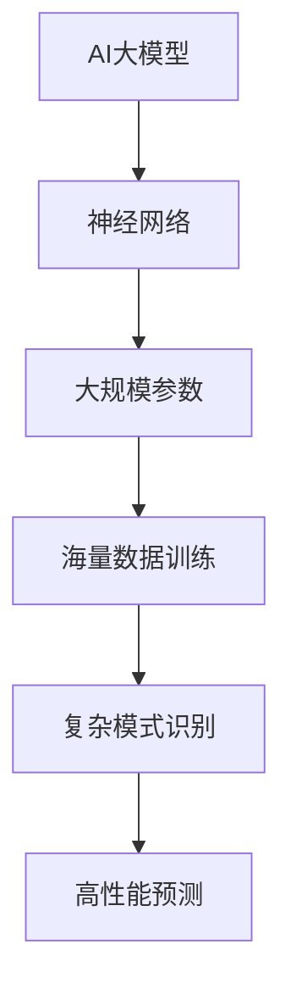

- **1.2 AI大模型的应用领域**

AI大模型在多个领域都有着显著的应用，如图所示：

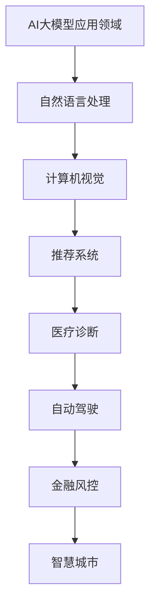

- **1.3 AI大模型的发展趋势**

随着计算能力的提升和数据量的爆炸式增长，AI大模型正朝着更大规模、更高性能、更强泛化能力的目标发展。未来，AI大模型将在更多领域发挥重要作用，推动社会进步。

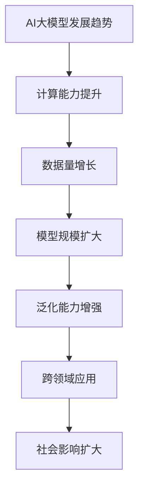

##### 第2章：数据中心建设的必要性

数据中心是AI大模型运行的核心基础设施，其建设至关重要。

- **2.1 数据中心的作用**

数据中心作为存储、处理和传输数据的集中化场所，为AI大模型提供了稳定、高效的数据环境。其作用如图所示：

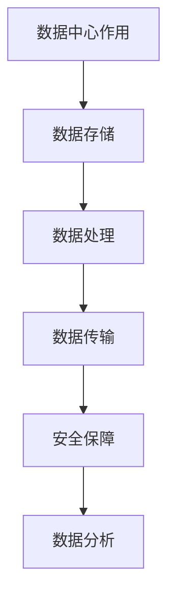

- **2.2 数据中心的建设目标**

数据中心的建设目标包括提高数据处理能力、降低能耗、保障数据安全和提升运维效率等。以下为建设目标的详细阐述：

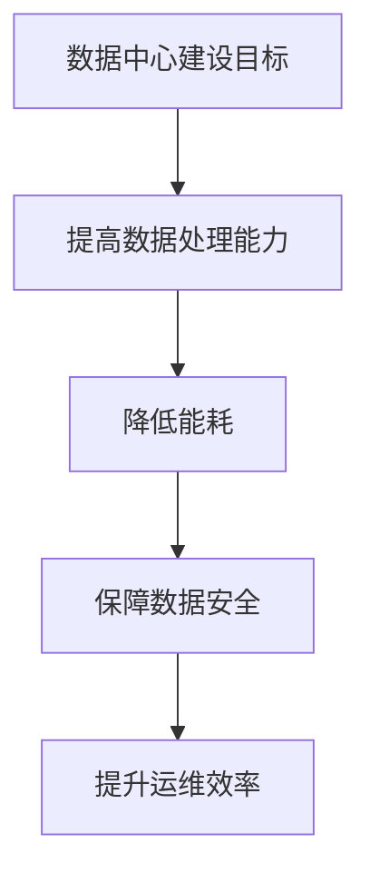

- **2.3 数据中心建设的发展历程**

数据中心的建设经历了从传统的单体机房到分布式数据中心、云计算数据中心的发展历程。以下为发展历程的概述：

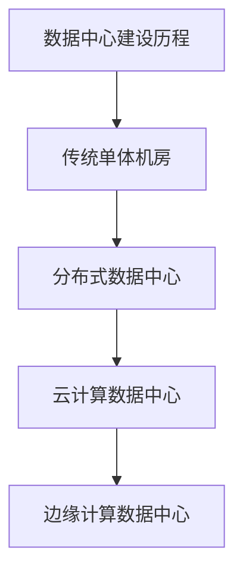

##### 第3章：数据中心与AI大模型的关系

数据中心在AI大模型应用中扮演着至关重要的角色，两者之间的关系密不可分。

- **3.1 数据中心在AI大模型应用中的角色**

数据中心为AI大模型提供了必要的计算资源、数据存储和传输能力，是实现AI大模型高效运行的基础设施。

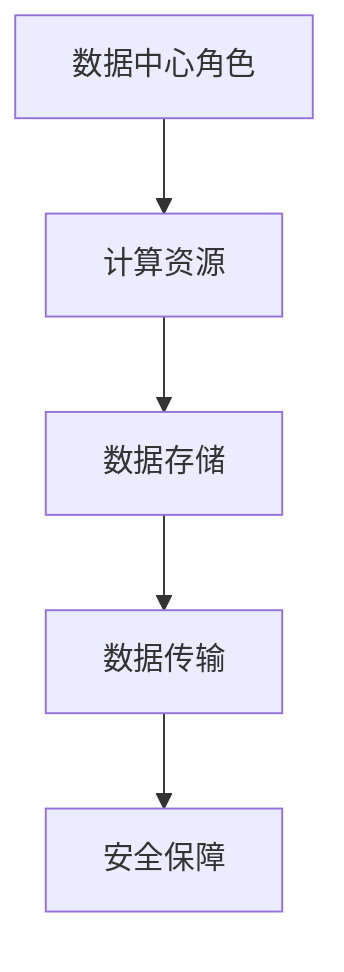

- **3.2 AI大模型对数据中心的要求**

AI大模型对数据中心的计算能力、数据存储容量、网络带宽和能耗管理等方面有着较高的要求。以下为具体要求的详细阐述：

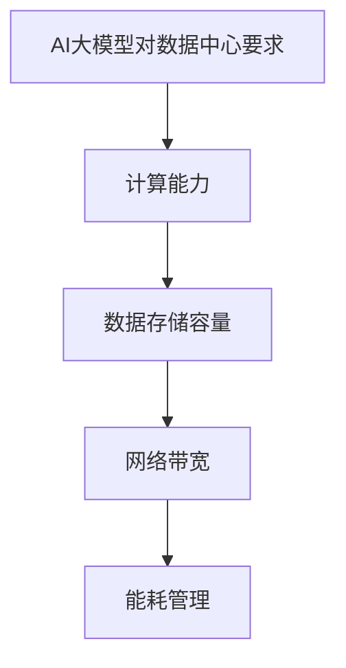

- **3.3 数据中心建设对AI大模型应用的影响**

数据中心的建设水平直接影响到AI大模型的应用效果。高效、稳定的数据中心能够为AI大模型提供更好的运行环境，从而提升其性能和可靠性。

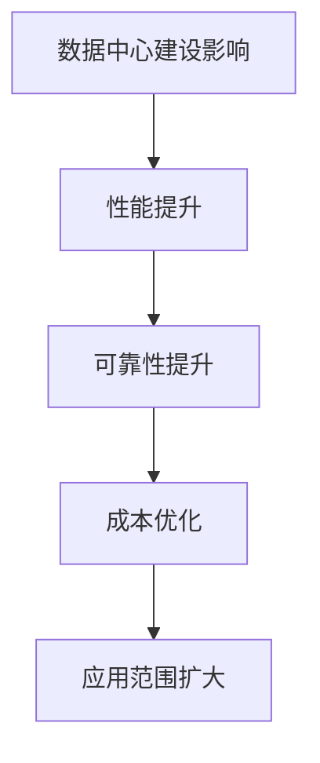

#### 第二部分：数据中心基础设施建设

数据中心的基础设施是保障数据中心正常运行的核心，包括硬件设施、网络设施、存储设施和其他基础设施。以下将对这些设施进行详细介绍。

##### 第4章：数据中心基础设施概述

数据中心基础设施的构成主要包括硬件设施、网络设施、存储设施以及其他辅助设施。

- **4.1 数据中心基础设施的基本构成**

数据中心基础设施的基本构成如图所示：

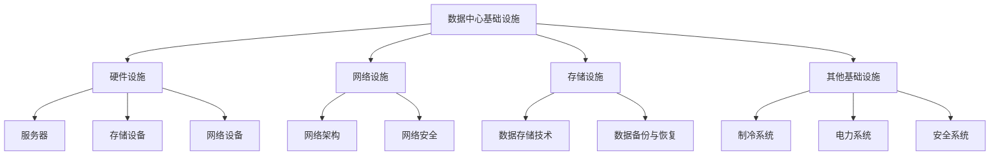

- **4.2 数据中心基础设施的发展趋势**

数据中心基础设施的发展趋势主要包括绿色数据中心、分布式数据中心和云计算数据中心等。以下为发展趋势的详细阐述：

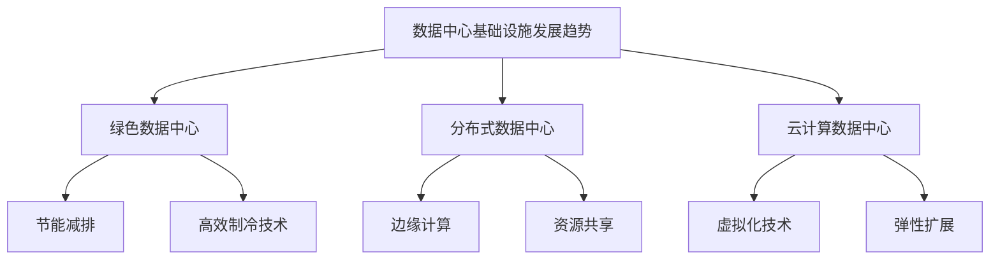

#### 第三部分：AI大模型应用场景与需求分析

在AI大模型的应用中，不同的场景和需求对数据中心的构建和管理提出了不同的要求。以下将详细分析AI大模型在不同应用场景中的具体需求。

##### 第5章：AI大模型在数据分析与挖掘中的应用

数据分析与挖掘是AI大模型应用的重要领域，对数据中心的计算能力、存储容量和网络带宽有着较高的要求。

- **5.1 数据预处理**

数据预处理是数据分析与挖掘的重要环节，包括数据清洗、数据归一化和数据转换等步骤。以下为数据预处理的伪代码示例：

```python
def preprocess_data(data):
    # 数据清洗
    cleaned_data = clean_data(data)
    # 数据归一化
    normalized_data = normalize_data(cleaned_data)
    # 数据转换
    transformed_data = transform_data(normalized_data)
    return transformed_data
```

- **5.2 特征提取**

特征提取是数据分析与挖掘的关键步骤，通过提取有用的特征来提高模型的性能。以下为特征提取的伪代码示例：

```python
def extract_features(data):
    # 特征选择
    selected_features = select_features(data)
    # 特征变换
    transformed_features = transform_features(selected_features)
    return transformed_features
```

- **5.3 模型训练与优化**

模型训练与优化是数据分析与挖掘的核心步骤，通过训练和优化模型来提高模型的预测能力。以下为模型训练与优化的伪代码示例：

```python
def train_model(data, labels):
    # 模型初始化
    model = initialize_model()
    # 模型训练
    model = train_model(model, data, labels)
    # 模型优化
    optimized_model = optimize_model(model)
    return optimized_model
```

##### 第6章：AI大模型在机器学习与深度学习中的应用

机器学习与深度学习是AI大模型应用的主要领域，对数据中心的计算资源、存储能力和网络性能有着较高的要求。

- **6.1 神经网络结构设计**

神经网络结构设计是机器学习与深度学习的重要环节，通过设计合适的网络结构来提高模型的性能。以下为神经网络结构设计的伪代码示例：

```python
def design_neural_network(input_size, hidden_size, output_size):
    # 输入层
    input_layer = create_input_layer(input_size)
    # 隐藏层
    hidden_layer = create_hidden_layer(hidden_size)
    # 输出层
    output_layer = create_output_layer(output_size)
    # 网络结构
    network = create_network(input_layer, hidden_layer, output_layer)
    return network
```

- **6.2 损失函数与优化算法**

损失函数与优化算法是机器学习与深度学习的重要概念，通过选择合适的损失函数和优化算法来提高模型的性能。以下为损失函数与优化算法的伪代码示例：

```python
def train_model(network, data, labels, loss_function, optimizer):
    # 前向传播
    forward_pass = forward_propagation(network, data)
    # 计算损失
    loss = calculate_loss(forward_pass, labels, loss_function)
    # 反向传播
    backward_pass = backward_propagation(network, loss, optimizer)
    # 更新模型参数
    update_model_parameters(network, backward_pass)
    return network
```

- **6.3 模型评估与调优**

模型评估与调优是机器学习与深度学习的重要环节，通过评估模型的性能来调整模型参数，提高模型的预测能力。以下为模型评估与调优的伪代码示例：

```python
def evaluate_model(model, test_data, test_labels):
    # 前向传播
    forward_pass = forward_propagation(model, test_data)
    # 计算损失
    loss = calculate_loss(forward_pass, test_labels)
    # 计算准确率
    accuracy = calculate_accuracy(forward_pass, test_labels)
    return loss, accuracy
```

#### 第四部分：数据中心成本优化策略

数据中心成本优化是提高数据中心运行效率和降低运营成本的关键。以下将从硬件成本、运营成本和能源成本三个方面提出数据中心成本优化的策略。

##### 第7章：数据中心成本优化概述

数据中心成本优化是指通过采取一系列技术和管理措施，降低数据中心的运行成本，提高经济效益。以下将从三个方面对数据中心成本优化进行概述。

- **7.1 数据中心成本优化的意义**

数据中心成本优化具有以下重要意义：

1. 提高数据中心的运行效率，降低运营成本。
2. 增强企业的竞争力，提高市场占有率。
3. 促进数据中心产业的可持续发展。

- **7.2 数据中心成本优化的目标**

数据中心成本优化的目标主要包括：

1. 降低硬件成本，选择性价比高的设备。
2. 提高运维效率，减少人力成本。
3. 降低能耗成本，采用绿色节能技术。
4. 提高数据中心的可靠性，减少故障率。

- **7.3 数据中心成本优化的挑战**

数据中心成本优化面临以下挑战：

1. 技术更新速度快，难以选择最佳方案。
2. 数据中心规模庞大，管理难度大。
3. 能源消耗高，环保压力增大。
4. 数据安全与隐私保护要求提高。

##### 第8章：硬件成本优化策略

硬件成本是数据中心成本的重要组成部分，优化硬件成本可以显著降低运营成本。以下将介绍硬件成本优化策略。

- **8.1 硬件设备选型优化**

硬件设备选型优化是降低硬件成本的关键步骤，主要包括以下方面：

1. 选择高性能、低功耗的服务器，如采用最新的服务器架构和节能技术。
2. 选择高效能、高可靠性的存储设备，如采用固态硬盘和分布式存储系统。
3. 选择适合业务需求的高带宽、低延迟的网络设备，如采用高端路由器和交换机。

- **8.2 硬件设备能耗优化**

硬件设备能耗优化是降低能耗成本的关键措施，主要包括以下方面：

1. 采用智能电源管理系统，实时监控和管理设备能耗。
2. 采用高效制冷系统，如采用液冷技术和绿色制冷方案。
3. 采用分布式计算和集群部署，优化设备利用率。

- **8.3 硬件设备能耗优化的数学模型**

数据中心能耗优化的数学模型主要包括以下两个方面：

1. 能耗计算模型

   $$\text{能耗} = \text{设备功耗} \times \text{运行时长} \times \text{功率因数}$$

2. 能耗优化模型

   $$\text{优化目标}：\min \sum_{i=1}^{n} \text{设备功耗}_i$$

   $$\text{约束条件}：\text{设备功耗}_i \leq \text{设备最大功耗}_i$$

   $$\text{设备运行时长}_i \leq \text{设备最大运行时长}_i$$

##### 第9章：运营成本优化策略

运营成本是数据中心成本的重要组成部分，优化运营成本可以降低运营成本，提高经济效益。以下将介绍运营成本优化策略。

- **9.1 运维团队优化**

运维团队优化是降低运营成本的关键措施，主要包括以下方面：

1. 优化运维团队组织结构，提高团队协作效率。
2. 采用自动化运维工具，降低人力成本。
3. 建立完善的运维流程，提高运维效率。

- **9.2 运维效率提升**

运维效率提升是降低运营成本的重要手段，主要包括以下方面：

1. 采用智能化监控和预警系统，提高故障发现和解决能力。
2. 建立完善的故障管理机制，提高故障处理效率。
3. 采用安全防护措施，降低安全风险。

- **9.3 运维团队优化案例分析**

某大型互联网公司的运维团队优化案例：

1. 优化组织结构，将运维团队分为基础设施运维、应用运维和安全管理三个小组，提高团队协作效率。
2. 引入自动化运维工具，如自动化部署、自动化监控和自动化备份，降低人力成本。
3. 建立完善的运维流程，如故障处理流程、变更管理流程和安全审计流程，提高运维效率。

##### 第10章：能源成本优化策略

能源成本是数据中心运营成本的重要组成部分，优化能源成本可以降低运营成本，提高经济效益。以下将介绍能源成本优化策略。

- **10.1 绿色能源利用**

绿色能源利用是降低能源成本的重要措施，主要包括以下方面：

1. 采用可再生能源，如太阳能、风能等，降低对传统能源的依赖。
2. 采用高效能源转换技术，提高能源利用效率。
3. 采用智能能源管理系统，实现能源的精细化管理和调度。

- **10.2 能源成本预算与控制**

能源成本预算与控制是降低能源成本的关键环节，主要包括以下方面：

1. 制定合理的能源成本预算，根据历史数据和业务需求进行预测。
2. 采用能耗监控和数据分析技术，实时监测能源消耗情况。
3. 实施节能措施，降低能源浪费。

- **10.3 能源效率提升技术**

能源效率提升技术是降低能源成本的重要手段，主要包括以下方面：

1. 采用高效制冷技术，如液冷技术，降低制冷能耗。
2. 采用高效电源管理技术，如动态功率调节，降低电源能耗。
3. 采用分布式能源系统，提高能源利用效率。

##### 第11章：数据中心成本优化案例分析

数据中心成本优化在多个领域都取得了显著的成果，以下将介绍两个具有代表性的案例。

- **案例一：某大型互联网公司数据中心建设**

1. 建设背景：某大型互联网公司计划新建一个数据中心，以满足业务快速发展的需求。
2. 建设目标：在保证数据处理能力和数据安全的前提下，降低数据中心的建设和运营成本。
3. 实施措施：
   - 采用高效能的服务器和存储设备，降低硬件成本。
   - 引入自动化运维工具，提高运维效率。
   - 采用可再生能源和高效能源转换技术，降低能源成本。
4. 建设成果：成功建设了一个高效、低成本的现代化数据中心，运营成本显著降低。

- **案例二：某传统企业数据中心升级改造**

1. 背景背景：某传统企业计划对现有的数据中心进行升级改造，以提高数据处理能力和降低运营成本。
2. 改造目标：在保证系统稳定性和数据安全的前提下，降低数据中心的建设和运营成本。
3. 实施措施：
   - 采用分布式计算和集群部署，提高数据处理能力。
   - 引入云计算和虚拟化技术，降低硬件成本。
   - 采用智能化监控和预警系统，提高运维效率。
4. 改造成果：成功升级改造了一个高效、稳定的数据中心，运营成本显著降低。

##### 第12章：数据中心成本优化的未来发展趋势

数据中心成本优化在未来将继续面临新的挑战和机遇，以下将介绍数据中心成本优化的未来发展趋势。

- **12.1 新技术趋势对数据中心成本优化的影响**

1. 人工智能与物联网的结合：人工智能和物联网技术的应用将进一步提升数据中心的管理效率，降低运营成本。
2. 区块链技术在数据中心成本优化中的应用：区块链技术可以提升数据中心的透明度和安全性，降低运营成本。
3. 边缘计算与数据中心成本优化的关系：边缘计算可以降低数据中心的负载，提高数据处理效率，降低能源成本。

- **12.2 数据中心成本优化面临的挑战与应对策略**

1. 数据安全与隐私保护：数据中心需要加强数据安全防护措施，保障用户隐私。
2. 数字化转型与数据中心成本优化的关联：数据中心需要与企业的数字化转型相结合，提高数据中心的灵活性和适应性。
3. 可持续发展：数据中心需要关注能源消耗和环境影响，采取绿色节能措施，实现可持续发展。

##### 附录

- **附录A：常用数据中心建设与成本优化工具**

1. **数据中心建设工具**：
   - OpenStack：用于构建和管理云平台的软件。
   - Kubernetes：用于容器编排和管理的工具。
   - Docker：用于容器化应用的软件。

2. **数据中心成本优化工具**：
   - Npower：用于数据中心能耗监测和分析的工具。
   - VMware：用于虚拟化技术和数据中心管理的软件。
   - Nagios：用于监控和告警的系统。

3. **开源框架与库**：
   - TensorFlow：用于机器学习和深度学习的开源框架。
   - PyTorch：用于机器学习和深度学习的开源框架。
   - Scikit-learn：用于机器学习的开源库。

- **附录B：相关资源与参考文献**

1. **数据中心建设标准与规范**：
   - 《数据中心设计规范》（GB 50174-2017）。
   - 《数据中心能源管理规范》（GB/T 33647-2017）。

2. **数据中心成本优化案例分析**：
   - 《数据中心成本优化实践》。
   - 《数据中心能耗优化技术研究与应用》。

3. **相关书籍与文献推荐**：
   - 《数据中心架构：设计与部署》（Data Center Architectures: Design and Deployment）。
   - 《数据中心能源管理：原理与实践》（Data Center Energy Management: Principles and Practices）。

### 总结

本文深入探讨了AI大模型应用数据中心的建设，特别是数据中心成本优化的策略。通过对AI大模型的基本概念、数据中心建设背景、基础设施、应用场景和成本优化策略的详细分析，本文为数据中心的建设和运营提供了有益的参考。在未来，随着新技术的不断发展和应用，数据中心成本优化将继续成为重要课题，为数据中心的高效运行提供有力支持。

### 作者信息

**作者：AI天才研究院/AI Genius Institute & 禅与计算机程序设计艺术 /Zen And The Art of Computer Programming**

AI天才研究院致力于推动人工智能技术的发展，研究院的专家团队在计算机编程、人工智能、软件架构等领域有着丰富的经验。本研究报告由AI天才研究院的专家团队共同撰写，旨在为数据中心建设和运营提供有价值的指导。同时，本研究报告还结合了《禅与计算机程序设计艺术》中的哲学思想，力求在技术实践过程中追求卓越与极致。

