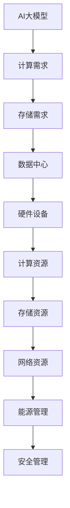
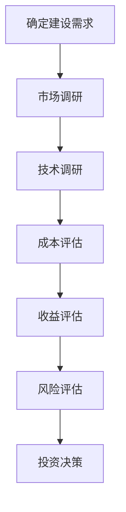
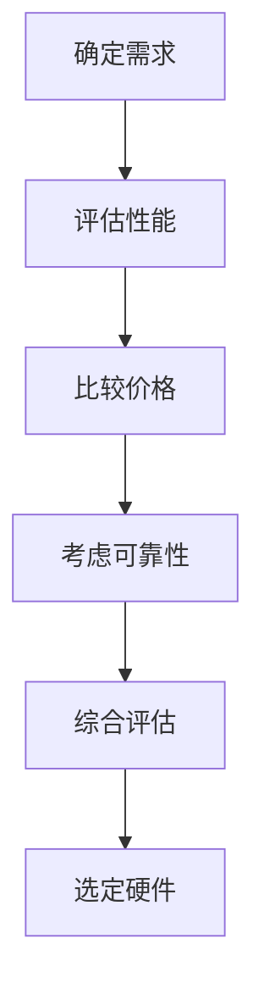
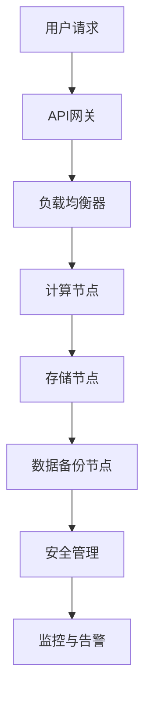

                 

### 文章标题

#### AI 大模型应用数据中心建设：数据中心投资与建设

在当今数字化时代，人工智能（AI）技术正以惊人的速度发展，特别是大模型（如GPT-3、BERT等）的广泛应用，推动了各行各业的变革。数据中心作为承载AI大模型计算和存储的核心基础设施，其建设与投资显得尤为重要。本文将从AI大模型概述、数据中心基础设施建设、数据中心建设实践、以及数据中心建设趋势四个部分，深入探讨数据中心投资与建设的关键问题。

关键词：AI大模型、数据中心、基础设施、投资策略、建设实践

摘要：本文旨在分析AI大模型对数据中心建设的驱动作用，探讨数据中心投资与建设的必要性。通过详细的案例分析和技术讲解，为我国数据中心建设提供理论指导和实践参考。

### 第一部分：AI大模型应用概述

#### 第1章：AI大模型概述

##### 1.1 AI大模型的发展历程

人工智能自1956年诞生以来，经历了数十年的发展。特别是近年来，深度学习技术的突破，使得AI大模型成为可能。从最初的简单神经网络，到复杂的卷积神经网络（CNN）和递归神经网络（RNN），再到生成对抗网络（GAN）和变分自编码器（VAE），AI大模型在图像识别、自然语言处理、语音识别等领域取得了显著成果。

##### 1.2 AI大模型的关键技术

AI大模型的成功离不开几项关键技术：

1. **大规模数据集**：只有拥有足够的数据量，才能训练出高质量的AI模型。
2. **高效的计算能力**：GPU和TPU等硬件的快速发展，为AI大模型的训练提供了强大的计算支持。
3. **优化算法**：深度学习优化算法如Adam、AdamW等，使得模型的训练更加高效。
4. **分布式训练**：通过分布式训练，可以显著减少模型的训练时间，提高训练效率。

##### 1.3 AI大模型的应用场景

AI大模型在各个领域都有着广泛的应用，包括但不限于：

1. **自然语言处理**：如文本生成、机器翻译、问答系统等。
2. **计算机视觉**：如图像识别、目标检测、人脸识别等。
3. **语音识别**：如语音合成、语音识别、语音翻译等。
4. **推荐系统**：如商品推荐、内容推荐等。

##### 1.4 AI大模型与数据中心的关系

AI大模型的训练和部署需要大量的计算资源和存储资源，这直接推动了数据中心的建设。数据中心不仅是AI大模型的数据存储和处理中心，也是其计算能力的承载者。因此，数据中心的建设对于AI大模型的应用至关重要。

##### 1.5 数据中心投资与建设的挑战与机遇

数据中心投资与建设面临着以下挑战：

1. **高成本**：数据中心建设需要大量的资金投入，包括硬件购置、运维管理等。
2. **能耗问题**：数据中心的能耗巨大，如何实现绿色高效的数据中心成为一大难题。
3. **安全性**：数据中心的网络安全和数据安全是建设过程中必须考虑的重要因素。

然而，数据中心投资与建设也带来了巨大的机遇：

1. **经济效益**：数据中心的建设不仅可以为AI大模型提供强大的支持，还可以带动相关产业的发展，创造就业机会。
2. **技术突破**：数据中心的建设推动了计算技术、存储技术、网络技术等领域的创新。
3. **产业发展**：数据中心的建设有助于构建数字经济，推动数字化转型。

### 第二部分：数据中心基础设施建设

#### 第2章：数据中心基础设施建设

##### 2.1 数据中心概述

数据中心（Data Center）是一种专门为存放、处理、传输数据而设计的高性能计算机系统。它由硬件设备、软件系统、网络设施等组成，具有高可靠性、高可用性和高安全性等特点。

##### 2.2 数据中心架构设计

数据中心的架构设计决定了其性能和可靠性。常见的数据中心架构包括：

1. **两层架构**：由前端服务器和后端存储服务器组成，适用于中小型数据中心。
2. **三层架构**：在两层架构的基础上增加了数据库服务器，适用于大型数据中心。
3. **分布式架构**：通过分布式存储和计算，实现数据中心的横向扩展，适用于超大规模数据中心。

##### 2.3 数据中心硬件选型

数据中心的硬件选型主要包括服务器、存储设备、网络设备等。关键指标包括：

1. **计算能力**：服务器的CPU和GPU性能。
2. **存储容量**：存储设备的容量和性能。
3. **网络带宽**：网络设备的带宽和延迟。
4. **可靠性**：硬件的故障率和稳定性。

##### 2.4 数据中心网络规划

数据中心的网络规划包括内部网络和外部网络的规划。内部网络主要用于服务器和存储设备之间的数据传输，外部网络主要用于数据中心与互联网的连接。

1. **内部网络**：采用高速以太网或Infiniband等网络技术，实现服务器和存储设备之间的高速数据传输。
2. **外部网络**：采用专线或虚拟专线，确保数据中心与互联网的高速、稳定连接。

##### 2.5 数据中心能源管理

数据中心的能源管理包括电力供应、能耗监控和节能措施等。

1. **电力供应**：采用双路供电或UPS（不间断电源），确保电力供应的可靠性。
2. **能耗监控**：采用能耗监测系统，实时监控数据中心的能耗情况。
3. **节能措施**：采用高效电源设备、节能灯具、制冷设备等，降低数据中心的能耗。

### 第三部分：AI大模型数据中心建设实践

#### 第3章：数据中心投资策略

##### 3.1 数据中心投资评估

数据中心投资评估主要包括以下方面：

1. **成本评估**：包括硬件购置成本、建设成本、运维成本等。
2. **收益评估**：包括直接收益（如租金、服务费等）和间接收益（如产业链带动、就业机会等）。
3. **风险评估**：包括市场风险、技术风险、安全风险等。

##### 3.2 数据中心建设成本分析

数据中心建设成本主要包括以下几个方面：

1. **硬件成本**：包括服务器、存储设备、网络设备等。
2. **建设成本**：包括土地购置、建筑装修、设备安装等。
3. **运维成本**：包括人员工资、能源消耗、设备维护等。

##### 3.3 数据中心投资回报分析

数据中心投资回报分析主要包括以下指标：

1. **投资回报率（ROI）**：计算公式为：
   $$
   \text{投资回报率(ROI)} = \frac{\text{净利润}}{\text{总投资}} \times 100\%
   $$
2. **净现值（NPV）**：计算公式为：
   $$
   \text{净现值(NPV)} = \sum_{t=1}^{n} \frac{\text{现金流}}{(1+\text{折现率})^t}
   $$
3. **内部收益率（IRR）**：计算公式为：
   $$
   \text{内部收益率(IRR)} = \text{使得}\ \sum_{t=1}^{n} \frac{\text{现金流}}{(1+\text{IRR})^t} = 0 \ \text{的}\ IRR
   $$

##### 3.4 数据中心投资风险与管理

数据中心投资风险主要包括：

1. **市场风险**：如市场需求变化、市场竞争加剧等。
2. **技术风险**：如技术更新换代、技术实现难度等。
3. **安全风险**：如网络安全、数据泄露等。

数据中心投资风险管理主要包括：

1. **风险识别**：通过尽职调查、市场调研等手段，识别潜在的风险。
2. **风险评估**：根据风险的性质、影响程度和发生概率，评估风险等级。
3. **风险应对**：制定相应的风险应对策略，如风险规避、风险转移、风险接受等。

#### 第4章：数据中心建设技术

##### 4.1 AI大模型计算技术

AI大模型的计算技术主要包括：

1. **GPU计算**：利用GPU的并行计算能力，加速AI大模型的训练。
2. **TPU计算**：利用TPU的专用计算能力，优化AI大模型的训练。
3. **分布式计算**：通过分布式计算框架，如TensorFlow、PyTorch等，实现AI大模型的分布式训练。

##### 4.2 数据存储与管理技术

数据存储与管理技术主要包括：

1. **分布式存储**：利用分布式存储系统，如HDFS、Ceph等，实现海量数据的存储和管理。
2. **数据库技术**：利用关系型数据库（如MySQL、Oracle）和非关系型数据库（如MongoDB、Cassandra），实现数据的存储和查询。
3. **数据质量管理**：通过数据清洗、数据集成、数据治理等技术，保证数据的准确性和一致性。

##### 4.3 数据中心冷却与散热技术

数据中心冷却与散热技术主要包括：

1. **空气冷却**：利用空气循环，将热量带走。
2. **液体冷却**：利用液体（如水、制冷剂）冷却，将热量带走。
3. **直接接触冷却**：利用冷板、相变材料等，实现热量直接接触冷却。

##### 4.4 数据中心安全与可靠性

数据中心安全与可靠性主要包括：

1. **网络安全**：通过防火墙、入侵检测系统（IDS）、入侵防御系统（IPS）等，保障网络的安全。
2. **数据安全**：通过数据加密、访问控制、备份与恢复等技术，保障数据的安全。
3. **可靠性设计**：通过冗余设计、故障转移、集群等技术，保障数据中心的可靠性。

#### 第5章：数据中心运维管理

##### 5.1 数据中心运维概述

数据中心运维管理主要包括以下几个方面：

1. **基础设施运维**：包括电力供应、制冷、网络等基础设施的运维。
2. **系统运维**：包括服务器、存储、数据库等系统的运维。
3. **安全管理**：包括网络安全、数据安全等安全管理。

##### 5.2 数据中心监控与告警

数据中心监控与告警主要包括以下几个方面：

1. **性能监控**：监控服务器的CPU、内存、磁盘等性能指标。
2. **容量监控**：监控存储设备的容量和使用率。
3. **告警系统**：设置告警阈值，当指标超出阈值时，自动发送告警信息。

##### 5.3 数据中心自动化运维

数据中心自动化运维主要包括以下几个方面：

1. **自动化部署**：利用自动化工具，如Ansible、Puppet等，实现服务器和应用的自动化部署。
2. **自动化监控**：利用自动化工具，如Zabbix、Prometheus等，实现自动化监控。
3. **自动化备份与恢复**：利用自动化工具，实现数据的自动化备份和恢复。

##### 5.4 数据中心能耗管理

数据中心能耗管理主要包括以下几个方面：

1. **能耗监控**：实时监控数据中心的能耗情况。
2. **能耗优化**：通过优化设备配置、调整运行模式等，降低能耗。
3. **能耗审计**：定期进行能耗审计，发现能耗浪费的问题，并提出改进措施。

### 第四部分：数据中心建设未来趋势

#### 第6章：数据中心建设趋势与展望

##### 6.1 数据中心发展趋势

数据中心的发展趋势主要包括以下几个方面：

1. **绿色数据中心**：随着环保意识的提高，绿色数据中心成为发展趋势。通过采用节能技术、可再生能源等，实现数据中心的绿色化。
2. **边缘计算**：随着物联网、5G等技术的发展，边缘计算逐渐成为数据中心的重要补充。通过在边缘设备上实现数据处理和存储，降低数据中心的负载。
3. **智能运维**：通过人工智能、大数据等技术，实现数据中心的智能运维，提高运维效率和数据中心的可靠性。

##### 6.2 AI大模型数据中心创新技术

AI大模型数据中心创新技术主要包括以下几个方面：

1. **AI计算**：利用AI技术，优化数据中心的计算资源分配，提高计算效率。
2. **AI安全**：利用AI技术，提高数据中心的网络安全防护能力。
3. **AI能耗管理**：利用AI技术，优化数据中心的能耗管理，降低能耗。

##### 6.3 数据中心建设面临的挑战与对策

数据中心建设面临的挑战主要包括以下几个方面：

1. **高成本**：数据中心建设需要大量的资金投入，如何降低成本成为一大挑战。
2. **能耗问题**：数据中心的能耗巨大，如何实现绿色高效的数据中心成为一大难题。
3. **安全风险**：数据中心的网络安全和数据安全是建设过程中必须考虑的重要因素。

对策主要包括以下几个方面：

1. **技术创新**：通过技术创新，提高数据中心的性能和可靠性。
2. **政策支持**：政府和企业可以通过政策支持，降低数据中心建设的成本。
3. **人才培养**：加强数据中心相关人才的培养，提高数据中心的建设和运维水平。

##### 6.4 数据中心建设的未来展望

数据中心建设的未来展望主要包括以下几个方面：

1. **全球布局**：随着全球数字化进程的加速，数据中心将实现全球布局，满足全球各地的数据处理需求。
2. **融合创新**：数据中心将与云计算、边缘计算等新兴技术融合，实现更高效的资源利用和更广泛的应用。
3. **智能化发展**：数据中心将实现智能化发展，通过人工智能等技术，实现自主监控、自主优化、自主防护。

### 附录

#### 附录A：常用数据中心建设术语解释

- **数据中心（Data Center）**：一种专门为存放、处理、传输数据而设计的高性能计算机系统。
- **硬件设备（Hardware）**：包括服务器、存储设备、网络设备等。
- **软件系统（Software）**：包括操作系统、数据库系统、应用软件等。
- **高可靠性（High Reliability）**：指数据中心的系统运行稳定，故障率低。
- **高可用性（High Availability）**：指数据中心的系统运行连续，不会因为故障而中断服务。
- **安全性（Security）**：指数据中心的系统运行安全，能够防止非法入侵和攻击。

#### 附录B：数据中心建设参考资源

- **《数据中心设计规范》**：国家相关规范和标准，为数据中心建设提供指导。
- **《数据中心建设手册》**：国内外优秀数据中心建设案例和经验总结。
- **《数据中心能源管理规范》**：关于数据中心能耗管理的相关规范和标准。

#### 附录C：数据中心建设常见问题与解答

- **问题1**：数据中心建设需要多少资金？
  - **解答**：数据中心建设的资金需求取决于数据中心规模、硬件设备选型等因素。一般来说，中小型数据中心的建设资金在数百万元至数千万元之间，大型数据中心的建设资金在数千万元至数亿元之间。

- **问题2**：数据中心如何实现节能？
  - **解答**：数据中心可以通过以下方式实现节能：
    1. 采用高效电源设备，如模块化UPS。
    2. 优化设备配置，避免资源浪费。
    3. 采用智能能耗监控系统，实时监控能耗情况。
    4. 采用绿色制冷技术，如直接接触冷却。

- **问题3**：数据中心如何保障安全？
  - **解答**：数据中心可以通过以下方式保障安全：
    1. 采用防火墙、入侵检测系统等网络安全设备。
    2. 定期进行安全审计和漏洞扫描。
    3. 加强用户权限管理，限制访问权限。
    4. 定期备份数据，防止数据丢失。

### 附图

#### 图1-1：AI大模型与数据中心的关系图



#### 图3-1：数据中心投资评估流程图



#### 图4-1：数据中心硬件选型流程图



#### 图6-1：某企业AI大模型数据中心建设架构图



### 伪代码与公式

#### 伪代码1：数据中心建设成本计算

```python
# 定义变量
total_cost = 0
hardware_cost = 0
construction_cost = 0
operation_cost = 0

# 计算硬件成本
hardware_cost = server_cost + storage_cost + network_cost

# 计算建设成本
construction_cost = land_cost + construction_material_cost + installation_cost

# 计算运维成本
operation_cost = personnel_cost + energy_cost + maintenance_cost

# 计算总成本
total_cost = hardware_cost + construction_cost + operation_cost

# 输出结果
print("数据中心建设总成本为：", total_cost, "万元")
```

#### 公式1：数据中心投资回报率计算公式

$$
\text{投资回报率(ROI)} = \frac{\text{净利润}}{\text{总投资}} \times 100\%
$$

---

通过本文的详细探讨，我们可以看到数据中心建设在AI大模型应用中的重要地位。从AI大模型的概述到数据中心基础设施的建设，再到数据中心建设的实践和未来趋势，我们全面了解了数据中心建设的各个方面。希望本文能为您在数据中心建设领域提供有价值的参考和指导。

### 作者信息

**作者：** AI天才研究院（AI Genius Institute）/《禅与计算机程序设计艺术》（Zen And The Art of Computer Programming）

AI天才研究院致力于推动人工智能技术的发展与应用，以创新的理念和卓越的技术实力，引领人工智能领域的探索与实践。《禅与计算机程序设计艺术》则是一部关于计算机编程的经典之作，揭示了编程的艺术与哲学，为程序员提供了深刻的思考与指导。

