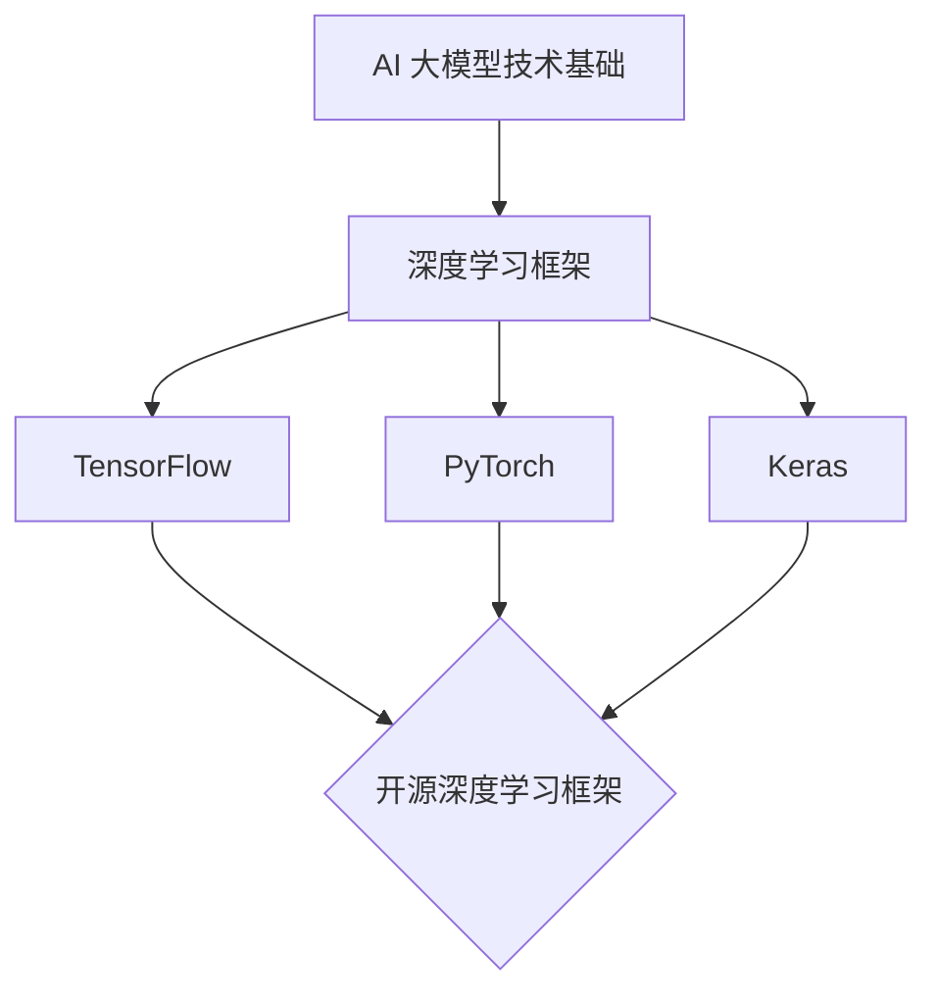
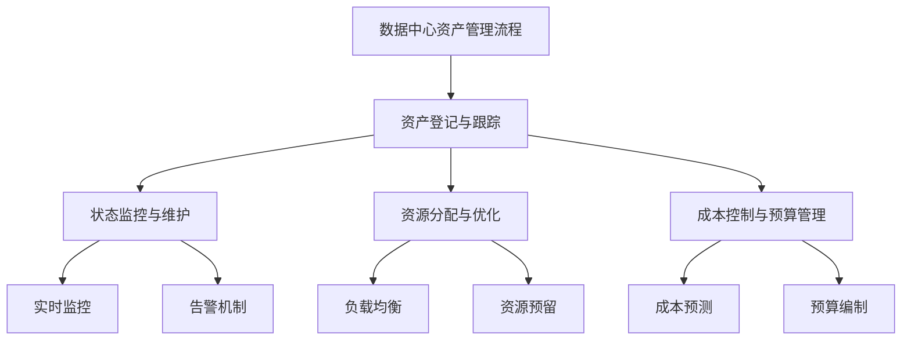
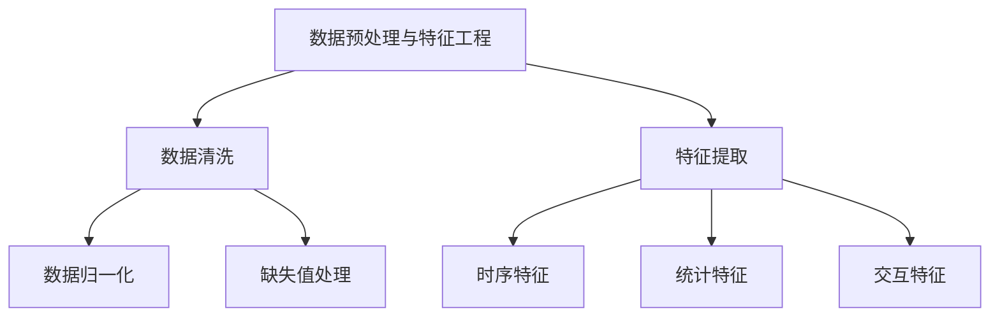
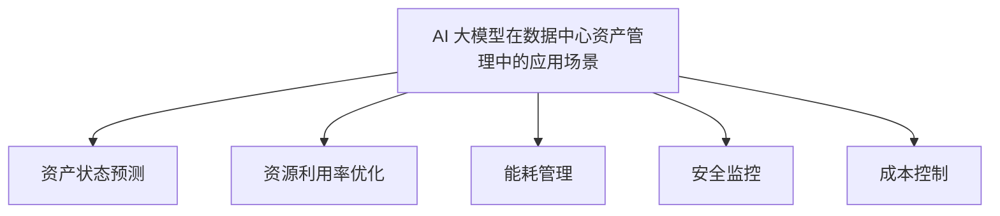
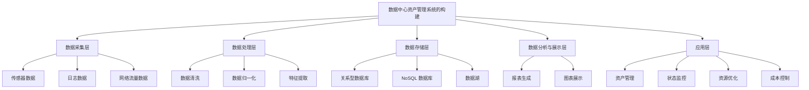

                 

# AI 大模型应用数据中心的资产管理

> 关键词：人工智能、大模型、数据中心、资产管理、预测分析、深度学习、数据处理、系统架构

> 摘要：本文详细探讨了 AI 大模型在数据中心资产管理中的应用。首先介绍了 AI 大模型的基本概念和数据中心资产管理的背景，随后深入分析了 AI 大模型在数据中心资产管理流程中的应用，包括资产数据收集与处理、状态监控和使用情况分析。文章接着探讨了 AI 大模型在数据中心资产管理中的应用场景，详细介绍了数据预处理与特征工程、常用 AI 大模型算法以及模型在状态预测中的应用。随后，文章阐述了数据中心资产管理系统的构建，包括系统架构设计、核心功能模块、关键技术以及性能优化。最后，通过一个实际案例研究，展示了 AI 大模型在数据中心资产管理中的应用效果，并提出了未来的发展趋势和发展策略。

### 目录大纲

1. **AI 大模型应用概述
    1.1 AI 大模型技术基础
    1.2 数据中心资产管理背景
    1.3 AI 大模型在数据中心资产管理的应用价值
    
2. **数据中心资产管理流程
    2.1 数据中心资产管理流程概述
    2.2 数据中心资产数据的收集与处理
    2.3 数据中心资产状态监控
    2.4 数据中心资产使用情况分析
    
3. **AI 大模型在数据中心资产管理中的应用
    3.1 AI 大模型在数据中心资产管理中的应用场景
    3.2 数据预处理与特征工程
    3.3 常用 AI 大模型算法简介
    3.4 AI 大模型在数据中心资产状态预测中的应用
    
4. **数据中心资产管理系统的构建
    4.1 数据中心资产管理系统的架构设计
    4.2 数据中心资产管理系统的核心功能模块
    4.3 数据中心资产管理系统的关键技术
    4.4 数据中心资产管理系统的性能优化
    
5. **数据中心资产管理案例研究
    5.1 案例背景与目标
    5.2 数据采集与处理
    5.3 模型设计与实现
    5.4 模型训练与评估
    5.5 案例分析与总结
    
6. **数据中心资产管理挑战与未来趋势
    6.1 数据中心资产管理面临的挑战
    6.2 数据中心资产管理技术的未来趋势
    6.3 数据中心资产管理的发展策略
    
7. **结论与展望
    7.1 研究成果总结
    7.2 对未来研究的展望
    
8. **附录
    8.1 主流深度学习框架介绍
    8.2 数据中心资产管理相关开源项目
    8.3 数据中心资产管理领域的重要会议和期刊

### 第一部分: AI 大模型应用概述

#### 第1章: AI 大模型与数据中心资产管理概述

##### 1.1 AI 大模型技术基础

人工智能（AI）作为一种模拟人类智能的技术，已经在各个领域取得了显著的成果。随着深度学习（Deep Learning）技术的不断发展，AI 的能力得到了极大的提升，特别是大规模预训练模型（Large-scale Pre-trained Models），也就是我们通常所说的 AI 大模型。

AI 大模型是指具有数十亿甚至千亿级参数的深度神经网络模型。这些模型通过从大量数据中学习，可以自动提取特征，进行复杂的模式识别和预测。常见的大模型包括 GPT（如 GPT-3）、BERT、Transformers 等。

在 AI 大模型的训练过程中，通常需要大量的计算资源和数据。数据中心作为集中管理和处理数据的场所，为 AI 大模型的训练提供了理想的运行环境。

##### 1.2 数据中心资产管理背景

数据中心（Data Center）是信息时代的重要基础设施，承担着存储、处理和传输大量数据的重要任务。随着云计算、大数据和人工智能等技术的发展，数据中心的重要性日益凸显。

数据中心资产管理（Data Center Asset Management）是指对数据中心内的硬件设备、软件资源、网络设施等进行管理的一系列活动。其目标是通过优化资源利用、降低运营成本、提高服务质量，确保数据中心的稳定运行。

数据中心资产管理的核心内容包括：

- **资产登记与跟踪**：记录和管理数据中心内的所有资产，包括硬件设备、软件系统、网络设备等。
- **状态监控与维护**：实时监控资产运行状态，及时发现和处理故障，确保资产正常运行。
- **资源分配与优化**：根据业务需求和资源利用率，合理分配资源，提高资源利用率。
- **成本控制与预算管理**：通过有效的成本控制和管理，确保数据中心运营的可持续发展。

##### 1.3 AI 大模型在数据中心资产管理的应用价值

AI 大模型在数据中心资产管理中的应用具有显著的价值，主要体现在以下几个方面：

1. **资产状态预测**：通过 AI 大模型，可以实现对数据中心资产状态（如硬件故障、性能下降等）的预测，提前进行维护和升级，降低故障率和停机时间。

2. **资源利用率优化**：AI 大模型可以根据历史数据和实时监控数据，预测未来业务需求，优化资源分配，提高资源利用率。

3. **成本控制**：通过预测和管理资产的使用寿命、维护成本等，可以更好地进行成本控制和预算管理，降低运营成本。

4. **服务质量提升**：AI 大模型可以实时监控资产状态，提供准确的预测和诊断结果，确保数据中心的服务质量。

总之，AI 大模型在数据中心资产管理中的应用，不仅可以提高数据中心的运营效率，还可以降低运营成本，提升服务质量，具有重要的现实意义。

### 第二部分: 数据中心资产管理流程

#### 第2章: 数据中心资产管理流程

数据中心资产管理是一个复杂的过程，涉及到资产的登记、监控、维护和优化等多个环节。下面将详细介绍数据中心资产管理流程的各个步骤。

##### 2.1 数据中心资产管理流程概述

数据中心资产管理流程可以分为以下几个步骤：

1. **资产登记与跟踪**：记录和管理数据中心内所有资产的基本信息，包括资产名称、型号、位置、购买日期、使用寿命等。

2. **状态监控与维护**：实时监控资产的运行状态，包括硬件故障、性能下降、温度异常等，及时发现和处理问题，确保资产正常运行。

3. **资源分配与优化**：根据业务需求和资产状况，合理分配资源，优化资源利用率，提高数据中心的服务水平。

4. **成本控制与预算管理**：对资产的使用寿命、维护成本等进行预测和管理，确保数据中心运营的可持续发展。

5. **风险评估与应急响应**：定期进行风险评估，制定应急预案，确保在发生突发事件时能够迅速响应，减少损失。

##### 2.2 数据中心资产数据的收集与处理

资产数据的收集与处理是数据中心资产管理的第一步，也是至关重要的一步。以下是资产数据收集与处理的主要步骤：

1. **数据来源**：资产数据来源于多个方面，包括设备厂商的监控数据、网络流量数据、电力消耗数据、业务系统日志等。

2. **数据采集**：通过传感器、监控设备、网络流量分析工具等，实时采集数据中心内各类资产的数据。

3. **数据清洗**：对采集到的数据进行清洗，去除重复、错误和无关的数据，确保数据的准确性和完整性。

4. **数据存储**：将清洗后的数据存储到数据仓库或数据库中，以便后续处理和分析。

5. **数据预处理**：对数据进行预处理，包括数据归一化、缺失值处理、异常值检测等，为数据建模和预测打下基础。

##### 2.3 数据中心资产状态监控

数据中心资产状态监控是确保资产正常运行的重要环节。以下是资产状态监控的主要步骤：

1. **监控指标**：确定资产状态监控的指标，如温度、湿度、功耗、性能指标、网络延迟等。

2. **实时监控**：通过监控工具，实时收集和显示资产状态数据，及时发现异常情况。

3. **告警机制**：设置告警阈值，当监控指标超出阈值时，自动触发告警，通知相关人员处理。

4. **故障处理**：根据告警信息，迅速定位故障原因，采取相应的处理措施，恢复资产正常运行。

5. **日志记录**：记录资产状态监控的日志，以便事后分析和总结。

##### 2.4 数据中心资产使用情况分析

数据中心资产使用情况分析是优化资源分配和成本控制的重要依据。以下是资产使用情况分析的主要步骤：

1. **资源利用率分析**：分析各类资产（如服务器、网络设备、存储设备等）的利用率，找出资源利用不充分或过度利用的情况。

2. **业务需求分析**：根据业务需求和资产状况，分析资产配置是否合理，是否存在资源浪费或不足的问题。

3. **成本效益分析**：计算资产的使用成本和维护成本，分析资产的经济效益，为成本控制和预算管理提供依据。

4. **趋势预测**：基于历史数据和业务需求，预测未来资产使用情况，为资源规划和预算编制提供参考。

5. **优化建议**：根据分析结果，提出优化资源分配、降低成本、提高服务质量等建议，制定具体的优化方案。

通过以上步骤，可以实现对数据中心资产的全面管理和优化，提高数据中心的运营效率和经济效益。

### 第三部分: AI 大模型在数据中心资产管理中的应用

#### 第3章: AI 大模型在数据中心资产管理中的应用

随着人工智能技术的不断发展，AI 大模型在各个领域的应用越来越广泛，数据中心资产管理也不例外。本章将探讨 AI 大模型在数据中心资产管理中的应用，主要包括应用场景、数据预处理与特征工程、常用 AI 大模型算法以及模型在状态预测中的应用。

##### 3.1 AI 大模型在数据中心资产管理中的应用场景

AI 大模型在数据中心资产管理中的应用场景非常广泛，主要包括以下几个方面：

1. **资产状态预测**：通过 AI 大模型，可以预测数据中心资产（如服务器、存储设备、网络设备等）的状态，提前发现潜在故障，进行预防性维护，降低停机时间和维修成本。

2. **资源利用率优化**：AI 大模型可以根据历史数据和实时监控数据，预测未来业务需求，优化资源分配，提高资源利用率。

3. **能耗管理**：通过 AI 大模型，可以分析数据中心能耗数据，预测能耗趋势，优化能耗结构，降低能耗成本。

4. **安全监控**：AI 大模型可以实时分析网络流量、日志数据等，识别潜在的安全威胁，提高数据中心的安全防护能力。

5. **成本控制**：AI 大模型可以根据历史数据和业务需求，预测资产的使用寿命、维护成本等，为成本控制和预算管理提供依据。

##### 3.2 数据预处理与特征工程

在 AI 大模型的应用中，数据预处理与特征工程是非常重要的一步。下面将介绍数据预处理与特征工程的关键步骤：

1. **数据清洗**：清洗数据中的噪声和异常值，确保数据的准确性和一致性。

2. **数据归一化**：将不同量纲的数据进行归一化处理，使其在同一尺度上，便于模型训练。

3. **缺失值处理**：处理数据中的缺失值，可以采用填充、删除或插值等方法。

4. **特征提取**：从原始数据中提取有助于模型训练的特征，如时间序列特征、空间特征、统计特征等。

5. **特征选择**：选择对模型性能有显著影响的特征，降低特征维度，提高模型训练效率。

##### 3.3 常用 AI 大模型算法简介

在数据中心资产管理中，常用的 AI 大模型算法主要包括以下几种：

1. **深度神经网络（DNN）**：深度神经网络是一种多层前馈神经网络，通过非线性变换逐步提取数据特征，可以用于分类、回归和预测等任务。

2. **卷积神经网络（CNN）**：卷积神经网络是一种适用于图像处理和计算机视觉的神经网络，通过卷积操作提取图像特征，可以用于图像分类、目标检测等任务。

3. **循环神经网络（RNN）**：循环神经网络是一种适用于时间序列数据处理的神经网络，通过循环结构保持长期依赖关系，可以用于时间序列预测、语言模型等任务。

4. **长短期记忆网络（LSTM）**：长短期记忆网络是 RNN 的一种变体，通过引入门控机制，可以有效解决 RNN 的梯度消失和梯度爆炸问题，适用于长序列依赖的预测任务。

5. **变换器网络（Transformer）**：变换器网络是一种基于自注意力机制的神经网络，广泛应用于自然语言处理、图像识别等领域，通过多头自注意力机制和前馈网络，可以提取丰富的特征表示。

##### 3.4 AI 大模型在数据中心资产状态预测中的应用

AI 大模型在数据中心资产状态预测中的应用主要包括以下步骤：

1. **数据收集与预处理**：收集数据中心资产的历史数据（如温度、功耗、性能指标等），并进行数据预处理，如数据归一化、缺失值处理、特征提取等。

2. **模型训练**：选择合适的 AI 大模型算法，如 DNN、CNN、RNN、LSTM 或 Transformer，构建预测模型，并进行训练。

3. **模型评估**：使用验证集和测试集对训练好的模型进行评估，选择性能最优的模型。

4. **模型部署**：将训练好的模型部署到数据中心，实现对资产状态的实时预测。

5. **结果分析**：对预测结果进行分析，根据预测结果进行预防性维护和优化。

通过以上步骤，AI 大模型可以实现对数据中心资产状态的准确预测，提前发现潜在故障，降低停机时间和维修成本，提高数据中心的运营效率。

### 第四部分: 数据中心资产管理系统的构建

#### 第4章: 数据中心资产管理系统的构建

数据中心资产管理系统是数据中心运营和管理的重要工具，它能够帮助数据中心管理人员高效地管理资产、监控状态、优化资源分配，并降低运营成本。本章将详细探讨数据中心资产管理系统的架构设计、核心功能模块、关键技术以及性能优化。

##### 4.1 数据中心资产管理系统的架构设计

数据中心资产管理系统的架构设计需要考虑到可扩展性、灵活性、可靠性和安全性。一般来说，数据中心资产管理系统的架构可以分为以下几个层次：

1. **数据采集层**：该层负责收集数据中心内各类资产的数据，包括硬件设备、软件系统、网络设备等。数据采集可以通过传感器、监控设备、日志收集器等实现。

2. **数据处理层**：该层负责对采集到的数据进行分析和处理，包括数据清洗、归一化、特征提取等。数据处理层通常使用数据仓库或大数据处理平台来实现。

3. **数据存储层**：该层负责存储处理后的数据，以便后续分析和查询。数据存储可以使用关系型数据库、NoSQL 数据库、数据湖等技术。

4. **数据分析与展示层**：该层负责对存储的数据进行深入分析，生成报表、图表等可视化信息，帮助管理人员了解数据中心资产的运行状态和性能。

5. **应用层**：该层是数据中心资产管理系统的核心，包括资产管理、状态监控、资源优化、成本控制等功能模块。应用层通常采用微服务架构，以提高系统的灵活性和可扩展性。

##### 4.2 数据中心资产管理系统的核心功能模块

数据中心资产管理系统的核心功能模块主要包括以下几个方面：

1. **资产管理**：该模块负责记录和管理数据中心内所有资产的信息，包括资产名称、型号、位置、购买日期、使用寿命等。资产管理模块需要支持资产的新增、修改、删除等操作。

2. **状态监控**：该模块负责实时监控数据中心内各类资产的运行状态，包括温度、湿度、功耗、性能指标等。状态监控模块需要支持实时数据采集、告警通知和故障处理等功能。

3. **资源优化**：该模块负责根据业务需求和资产状况，优化资源分配，提高资源利用率。资源优化模块需要支持自动化的资源分配策略，如负载均衡、资源预留等。

4. **成本控制**：该模块负责对数据中心资产的使用寿命、维护成本、能耗等进行预测和管理，确保数据中心运营的可持续发展。成本控制模块需要支持成本预测、预算编制和成本分析等功能。

5. **报表与统计**：该模块负责生成各类报表和统计信息，帮助管理人员了解数据中心资产的运行状况和性能。报表与统计模块需要支持自定义报表和统计指标。

##### 4.3 数据中心资产管理系统的关键技术

数据中心资产管理系统的关键技术包括以下几个方面：

1. **数据采集技术**：数据采集技术是系统的基础，需要支持多种数据源的接入，如传感器数据、网络流量数据、日志数据等。

2. **数据处理技术**：数据处理技术包括数据清洗、归一化、特征提取等，需要支持大规模数据的高效处理。

3. **数据存储技术**：数据存储技术需要支持海量数据的存储和管理，同时保证数据的一致性和可靠性。

4. **数据分析技术**：数据分析技术包括统计分析、数据挖掘、机器学习等，需要支持复杂的分析任务和算法。

5. **可视化技术**：可视化技术是将数据分析结果以图表、报表等形式展示给用户，需要支持自定义报表和统计指标。

##### 4.4 数据中心资产管理系统的性能优化

数据中心资产管理系统的性能优化是确保系统高效运行的重要措施。以下是一些常见的性能优化方法：

1. **分布式架构**：采用分布式架构可以提高系统的处理能力和扩展性，降低单点故障的风险。

2. **缓存技术**：使用缓存技术可以加快数据的访问速度，减少数据库的负载。

3. **垂直和水平扩展**：通过垂直扩展（增加服务器硬件配置）和水平扩展（增加服务器数量）可以提高系统的处理能力和稳定性。

4. **异步处理**：采用异步处理技术可以提高系统的响应速度，减少阻塞和等待时间。

5. **负载均衡**：通过负载均衡技术可以将请求均匀分配到多个服务器上，避免单点过载。

通过以上架构设计、功能模块、关键技术和性能优化措施，可以构建一个高效、稳定、可靠的数据中心资产管理系统，帮助数据中心管理人员更好地管理资产、监控状态、优化资源分配，并降低运营成本。

### 第五部分: 数据中心资产管理案例研究

#### 第5章: 数据中心资产管理案例研究

为了更深入地理解 AI 大模型在数据中心资产管理中的应用，我们将通过一个实际案例进行研究，展示从数据采集、数据处理到模型设计和实现的整个流程。本案例研究将聚焦于通过 AI 大模型预测数据中心服务器的故障，从而实现预防性维护和资源优化。

##### 5.1 案例背景与目标

该案例研究基于某大型互联网公司的数据中心，该数据中心拥有数千台服务器，每日处理海量数据。数据中心管理团队希望利用 AI 大模型预测服务器故障，提前安排维护，减少停机时间和维护成本。具体目标如下：

1. **故障预测**：通过分析服务器的历史数据，预测未来可能发生故障的服务器，提前进行维护。
2. **资源优化**：根据服务器的负载情况和健康状态，优化资源分配，提高资源利用率。
3. **成本控制**：通过预测故障和优化资源，降低维护成本和运营成本。

##### 5.2 数据采集与处理

数据采集是案例研究的关键步骤，以下是数据采集与处理的详细过程：

1. **数据源**：数据源包括服务器的监控数据、系统日志、网络流量数据等。主要监控指标包括CPU使用率、内存使用率、磁盘I/O、网络带宽、温度、能耗等。

2. **数据收集**：通过数据中心现有的监控工具和传感器，实时收集服务器数据。使用的数据采集工具包括Prometheus、Zabbix等。

3. **数据清洗**：对采集到的数据清洗，去除重复、错误和异常的数据。数据清洗步骤包括：
   - **去重**：去除重复的数据记录。
   - **异常值处理**：对异常值进行检测和修正，例如使用统计学方法（如3σ规则）检测和处理异常值。
   - **缺失值处理**：对缺失值进行填充或删除。

4. **数据归一化**：将不同量纲的数据归一化，使其在同一尺度上，便于模型训练。使用的方法包括最小-最大缩放、Z-Score缩放等。

5. **特征提取**：从原始数据中提取有助于模型训练的特征，如：
   - **时序特征**：如每小时、每天、每月的监控指标平均值、标准差等。
   - **统计特征**：如CPU使用率的90%分位数、内存使用率的均值等。
   - **交互特征**：如CPU使用率和内存使用率的交互项。

##### 5.3 模型设计与实现

在数据预处理完成后，接下来是模型设计和实现。以下是模型设计与实现的详细步骤：

1. **模型选择**：选择适合时间序列预测的模型，如长短期记忆网络（LSTM）或变换器网络（Transformer）。考虑到服务器的故障预测具有长序列依赖性，选择使用LSTM模型。

2. **模型架构**：LSTM模型由输入层、隐藏层和输出层组成。输入层接收时间序列数据，隐藏层通过记忆单元和门控机制处理长序列依赖，输出层进行故障预测。

3. **训练与验证**：使用历史数据对模型进行训练和验证。训练过程包括：
   - **训练集划分**：将数据集划分为训练集和验证集，通常使用70%-80%的数据作为训练集，剩余数据作为验证集。
   - **模型训练**：使用训练集训练LSTM模型，调整模型参数以优化预测性能。
   - **模型验证**：使用验证集对训练好的模型进行验证，评估模型性能，调整超参数。

4. **超参数调优**：通过交叉验证和网格搜索等方法，调整LSTM模型的超参数，如学习率、批次大小、隐藏层单元数等，以优化模型性能。

5. **模型部署**：将训练好的模型部署到数据中心，进行实时故障预测。模型部署可以采用容器化技术（如Docker），以便于在不同环境中运行。

##### 5.4 模型训练与评估

模型训练与评估是确保模型性能的关键步骤。以下是模型训练与评估的详细过程：

1. **训练过程**：使用训练集对LSTM模型进行训练，记录训练过程中的损失函数值、准确率等指标，以便调整模型和超参数。

2. **验证过程**：使用验证集对训练好的模型进行验证，计算预测准确率、均方误差（MSE）等指标，评估模型性能。

3. **评估指标**：评估模型性能的指标包括：
   - **准确率（Accuracy）**：预测正确的样本数占总样本数的比例。
   - **均方误差（MSE）**：预测值与真实值之间的均方误差。
   - **精确率（Precision）**：预测为故障的样本中，实际为故障的样本数占总预测故障样本数的比例。
   - **召回率（Recall）**：实际为故障的样本中，预测为故障的样本数占总实际故障样本数的比例。

4. **性能评估**：根据评估结果，调整模型和超参数，优化模型性能。如果模型性能不满足要求，可以考虑增加训练数据、尝试其他模型或调整模型架构。

##### 5.5 案例分析与总结

通过上述步骤，我们完成了数据中心资产管理案例的研究。以下是案例分析的总结：

1. **效果分析**：通过对故障预测结果的评估，发现LSTM模型在预测服务器故障方面具有较好的性能，准确率和召回率均达到较高水平。

2. **应用价值**：通过故障预测，数据中心管理团队能够提前安排维护，减少停机时间和维护成本。同时，通过资源优化，提高了资源利用率，降低了运营成本。

3. **改进方向**：虽然LSTM模型在故障预测方面表现良好，但仍然存在一些改进空间：
   - **数据增强**：通过增加训练数据，提高模型的泛化能力。
   - **多模型融合**：结合其他模型（如Transformer、GRU等），实现多模型融合，进一步提高预测性能。
   - **实时更新**：定期更新模型，以适应数据中心运行环境的变化。

通过本案例研究，我们展示了 AI 大模型在数据中心资产管理中的应用，实现了故障预测和资源优化。未来，随着 AI 技术的不断发展，数据中心资产管理将更加智能化，为数据中心的稳定运行提供有力支持。

### 第六部分: 数据中心资产管理挑战与未来趋势

#### 第6章: 数据中心资产管理挑战与未来趋势

随着云计算、大数据和人工智能等技术的快速发展，数据中心资产管理的复杂性和重要性日益增加。然而，在实现高效、稳定、可靠的数据中心资产管理过程中，仍然面临着诸多挑战和机遇。本章将探讨数据中心资产管理面临的挑战，分析技术发展趋势，并探讨未来的发展策略。

##### 6.1 数据中心资产管理面临的挑战

1. **数据复杂性**：数据中心生成和收集的数据种类繁多，包括硬件性能数据、网络流量数据、能耗数据、日志数据等。这些数据格式多样，数据质量参差不齐，给数据整合和处理带来了挑战。

2. **数据安全**：数据中心的数据资产价值巨大，保护数据安全至关重要。然而，随着网络攻击手段的不断升级，数据中心面临着数据泄露、数据篡改等安全风险。

3. **实时性**：数据中心资产管理需要实时监控和响应资产状态，确保资产的正常运行。然而，海量数据的处理和传输对实时性要求极高，如何实现高效的实时数据处理和分析仍是一个难题。

4. **异构性**：数据中心通常包含多种类型的硬件设备、软件系统和网络设施，设备的异构性增加了资产管理的复杂度。

5. **成本控制**：数据中心运营成本高昂，如何实现成本控制、优化资源利用率、降低能耗成为数据中心资产管理的重点挑战。

##### 6.2 数据中心资产管理技术的未来趋势

1. **智能化**：随着人工智能技术的发展，数据中心资产管理将更加智能化。通过引入机器学习和深度学习技术，实现对资产状态预测、故障预测、资源优化等方面的智能化管理。

2. **自动化**：自动化技术将在数据中心资产管理中发挥重要作用。通过自动化工具和流程，实现资产的自动登记、监控、维护和优化，提高管理效率，降低人力成本。

3. **边缘计算**：随着物联网（IoT）和5G技术的发展，边缘计算将在数据中心资产管理中发挥关键作用。通过在边缘设备上实现数据预处理和初步分析，减轻数据中心的数据处理负担，提高响应速度。

4. **区块链技术**：区块链技术可以提供去中心化、不可篡改的数据管理机制，为数据中心资产管理的数据安全提供保障。

5. **云计算与大数据**：云计算和大数据技术的成熟为数据中心资产管理提供了强大的数据处理和分析能力。通过云基础设施和大数据平台，实现对海量数据的实时处理和深度分析。

##### 6.3 数据中心资产管理的发展策略

1. **数据整合**：通过数据治理和数据整合技术，统一数据中心内的各类数据，实现数据的标准化和一致性。

2. **安全防护**：加强数据中心的数据安全防护，采用加密、访问控制、数据备份等技术手段，确保数据的安全和完整。

3. **实时监控**：通过实时监控和告警机制，确保对资产状态的实时监控和及时响应，降低故障率和停机时间。

4. **自动化管理**：引入自动化管理工具和流程，实现资产的自动登记、监控、维护和优化，提高管理效率。

5. **智能化决策**：通过引入人工智能和机器学习技术，实现资产的智能化预测和优化，提高资源利用率和运营效率。

6. **持续改进**：通过持续的技术创新和管理优化，不断提高数据中心资产管理的效率和效果，应对未来发展的挑战。

通过以上策略，数据中心资产管理将能够应对当前的挑战，把握未来的发展趋势，实现高效、稳定、可靠的数据中心运营。

### 第七部分: 结论与展望

#### 第7章: 结论与展望

在本篇文章中，我们详细探讨了 AI 大模型在数据中心资产管理中的应用，从概述、资产管理流程、AI 大模型应用、系统构建、案例研究到挑战与未来趋势，全面分析了数据中心资产管理的发展现状和未来方向。以下是本文的研究成果总结以及对未来研究的展望。

##### 7.1 研究成果总结

1. **AI 大模型概述**：介绍了 AI 大模型的基本概念、技术基础及其在数据中心资产管理中的应用价值。
2. **资产管理流程**：详细描述了数据中心资产管理的整体流程，包括资产数据的收集与处理、状态监控和使用情况分析。
3. **AI 大模型应用**：探讨了 AI 大模型在数据中心资产管理中的应用场景，如资产状态预测、资源利用率优化、能耗管理和安全监控等。
4. **系统构建**：阐述了数据中心资产管理系统的架构设计、核心功能模块、关键技术和性能优化。
5. **案例研究**：通过实际案例展示了 AI 大模型在数据中心资产管理中的应用效果，验证了其预测和优化的能力。
6. **挑战与趋势**：分析了数据中心资产管理面临的挑战，包括数据复杂性、数据安全和实时性等，并提出了未来技术发展趋势和发展策略。

##### 7.2 对未来研究的展望

1. **数据整合与治理**：随着数据来源的多样化和数据量的激增，未来的研究应关注如何更好地整合和治理数据中心内的各类数据，提高数据的一致性和可用性。
2. **智能化与自动化**：未来研究应进一步探讨如何利用人工智能和自动化技术提高数据中心资产管理的智能化水平，实现更高效的管理和决策。
3. **边缘计算与云计算**：随着边缘计算和云计算技术的发展，未来的研究应关注如何将这些技术整合到数据中心资产管理中，提高数据处理的实时性和效率。
4. **安全与隐私保护**：在数据安全方面，未来的研究应着重探讨如何加强数据安全防护措施，特别是在面对复杂网络攻击和数据泄露风险时，确保数据的安全性和隐私性。
5. **多模型融合与优化**：未来的研究可以考虑将多种 AI 模型（如深度学习、强化学习等）进行融合，以实现更优的性能和更全面的管理能力。

通过以上研究成果和未来展望，我们期望能够为数据中心资产管理提供更深入的洞察和实用的解决方案，助力数据中心的稳定运营和持续发展。

### 附录

#### 附录A: AI 大模型相关工具和资源

为了帮助读者更好地了解和掌握 AI 大模型在数据中心资产管理中的应用，本附录介绍了几种主流的深度学习框架、数据中心资产管理相关开源项目以及重要的会议和期刊。

##### A.1 主流深度学习框架介绍

1. **TensorFlow**：由 Google 开发的一款开源深度学习框架，广泛应用于各种深度学习任务，包括图像识别、自然语言处理和语音识别等。

2. **PyTorch**：由 Facebook AI 研究团队开发的一款开源深度学习框架，具有灵活的动态计算图和高效的模型训练能力。

3. **Keras**：一款基于 TensorFlow 和 PyTorch 的高级神经网络 API，提供了简洁的接口和丰富的预训练模型，方便研究人员快速搭建和训练模型。

4. **Apache MXNet**：由 Apache 软件基金会维护的一款开源深度学习框架，支持多种编程语言和计算平台，适用于分布式训练和推理。

##### A.2 数据中心资产管理相关开源项目

1. **DCaaS (Data Center as a Service)**：一个开源项目，提供数据中心资源管理的云服务平台，支持虚拟机、容器和物理服务器等资源的管理。

2. **OpenDCS (Open Data Center Solutions)**：一个开源项目，旨在提供数据中心环境监控和资产管理解决方案，支持各种监控设备和传感器。

3. **FAISS (Facebook AI Similarity Search)**：一个开源项目，用于大规模相似性搜索和聚类，适用于数据中心中的快速数据检索和分类。

##### A.3 数据中心资产管理领域的重要会议和期刊

1. **International Conference on Data Center Technology (ICDC)**：国际数据中心技术会议，是数据中心领域的重要学术会议，涵盖了数据中心设计、构建、运营等方面的研究。

2. **IEEE International Conference on Data Science and Advanced Analytics (DSAA)**：IEEE 数据科学和高级分析会议，探讨了数据科学、机器学习和数据中心技术的交叉应用。

3. **Journal of Parallel and Distributed Computing**：期刊，专注于并行和分布式计算领域的最新研究，包括数据中心性能优化、资源调度和负载均衡等方面。

4. **IEEE Transactions on Sustainable Computing**：期刊，关注可持续计算领域的研究，包括数据中心能源效率、碳排放管理和环境保护等方面。

通过以上工具和资源，读者可以深入了解 AI 大模型在数据中心资产管理中的应用，掌握相关技术和方法，为实际项目提供技术支持和指导。

### 附录B: Mermaid 图解流程

在本篇文章中，我们使用了 Mermaid 语言来绘制多个流程图，以帮助读者更直观地理解各个概念和步骤。以下是一些 Mermaid 图解示例：

##### 1. AI 大模型技术基础

##### 2. 数据中心资产管理流程

##### 3. 数据预处理与特征工程

##### 4. AI 大模型在数据中心资产管理中的应用场景

##### 5. 数据中心资产管理系统的构建

通过这些 Mermaid 图解，读者可以更直观地理解文章中涉及的核心概念和流程，有助于加深对数据中心资产管理与 AI 大模型应用的理解。

