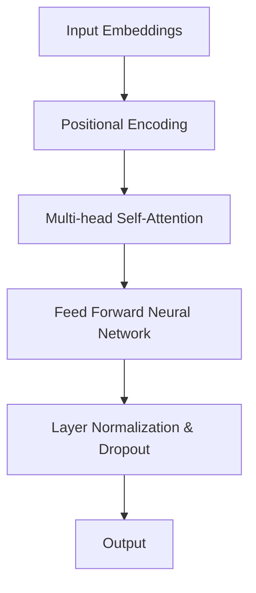

                 

## 《AI 大模型计算机科学家群英传：Transformer 架构发明人《Attention Is All You Need》之 Łukasz Kaiser》

关键词：Transformer，Attention Is All You Need，AI 大模型，计算机科学家，Łukasz Kaiser，自然语言处理，图像处理，联邦学习，多模态学习

摘要：本文将深入探讨Transformer架构的发明人Łukasz Kaiser的杰出贡献。我们将回顾Transformer的诞生背景，解析其核心概念、算法原理和数学模型，并通过实际案例展示其应用效果。同时，我们将展望Transformer架构在AI领域的创新与发展趋势。让我们一起走进这位计算机科学家的不凡人生。

## 《AI 大模型计算机科学家群英传：Transformer 架构发明人《Attention Is All You Need》之 Łukasz Kaiser》目录大纲

### 第一部分：Transformer 架构与AI大模型基础

#### 第1章：Transformer架构与AI大模型概述

##### 1.1.1 Transformer架构的核心概念

##### 1.1.2 Transformer与传统神经网络对比

##### 1.1.3 Transformer在自然语言处理中的应用

##### 1.1.4 Transformer的扩展与改进

#### 第2章：AI大模型与Transformer技术基础

##### 2.1.1 AI大模型的基本概念

##### 2.1.2 Transformer模型的工作原理

##### 2.1.3 大规模预训练模型

### 第二部分：Transformer架构在实践中的应用

#### 第3章：Transformer在自然语言处理中的实战应用

##### 3.1.1 Transformer在机器翻译中的应用

##### 3.1.2 Transformer在文本生成中的应用

##### 3.1.3 Transformer在问答系统中的应用

#### 第4章：Transformer在图像和视频处理中的应用

##### 4.1.1 Transformer在图像分类中的应用

##### 4.1.2 Transformer在视频分类中的应用

### 第三部分：Transformer架构的创新与发展

#### 第5章：Transformer架构的创新方向

##### 5.1.1 基于Transformer的推荐系统

##### 5.1.2 基于Transformer的多模态学习

##### 5.1.3 基于Transformer的联邦学习

#### 第6章：Transformer在工业界的应用与未来趋势

##### 6.1.1 Transformer在工业界的应用现状

##### 6.1.2 Transformer的未来发展趋势

#### 第7章：Transformer与其他先进技术的融合应用

##### 7.1.1 Transformer与强化学习的融合

##### 7.1.2 Transformer与图神经网络融合

##### 7.1.3 Transformer与生成对抗网络（GAN）的融合

### 附录

#### 附录A：Transformer相关资源与工具

#### 附录B：Transformer学习路线与资料推荐

#### 附录C：Transformer应用案例与项目解析

## 第一部分：Transformer 架构与AI大模型基础

### 第1章：Transformer架构与AI大模型概述

Transformer架构是近年来在人工智能领域取得突破性进展的重要成果。它由Google的计算机科学家Łukasz Kaiser和他在研究团队的共同发明。本文将带您回顾Transformer架构的诞生背景，深入解析其核心概念，以及与传统神经网络的对比。此外，我们还将探讨Transformer在自然语言处理中的应用，以及其扩展与改进。

#### 1.1.1 Transformer架构的核心概念

Transformer架构的核心概念在于其使用了注意力机制（Attention Mechanism）来处理序列数据。与传统循环神经网络（RNN）和卷积神经网络（CNN）不同，Transformer采用了自注意力机制（Self-Attention）和多头注意力机制（Multi-head Attention）。这种设计使得模型能够在处理序列数据时，更加灵活和高效。

**Mermaid流程图：**


#### 1.1.2 Transformer与传统神经网络对比

Transformer与传统神经网络（如RNN和CNN）在算法原理和应用场景上存在显著差异。

**核心算法原理讲解伪代码：**
```python
def multi_head_attention(Q, K, V, d_model, num_heads):
    # Calculate query, key, values' projections from d_model
    Q *= sqrt(d_model / num_heads)
    K *= sqrt(d_model / num_heads)
    V *= sqrt(d_model / num_heads)

    # Split Q, K, V into batches of num_heads
    Q = split_into_batches(Q, num_heads)
    K = split_into_batches(K, num_heads)
    V = split_into_batches(V, num_heads)

    # Scale dot product attention
    scaled_attention = scaled_dot_product_attention(Q, K, V)

    # Concatenate the attention values
    attention_weights = concatenate_attention_weights(scaled_attention)

    # Calculate the output with the attention weights
    output = feed_forward_network(attention_weights, d_model)

    return output
```

**对比分析：**
- **算法原理：** Transformer使用自注意力机制，能够同时考虑序列中所有位置的信息，而RNN和CNN则依赖于序列的顺序处理。
- **应用场景：** Transformer在处理长序列数据时具有优势，尤其是在自然语言处理任务中，如机器翻译、文本生成和问答系统。

#### 1.1.3 Transformer在自然语言处理中的应用

Transformer架构在自然语言处理（NLP）领域取得了显著的成果。其成功应用得益于自注意力机制和多头注意力机制的设计，使得模型能够更好地捕捉文本中的语义关系。

**数学模型与公式：**
$$
Attention(Q, K, V) = softmax\left(\frac{QK^T}{\sqrt{d_k}}\right) V
$$

**应用举例：**
- **BERT：** 双向编码器表示，用于上下文理解的预训练。
- **GPT：** 生成式预训练模型，用于文本生成。

#### 1.1.4 Transformer的扩展与改进

随着Transformer架构在NLP领域的广泛应用，研究人员不断对其进行改进和扩展，以适应更多任务和应用场景。

**举例说明：**
- **BERT：** 双向编码器表示，用于上下文理解的预训练。
- **GPT：** 生成式预训练模型，用于文本生成。

## 第二部分：AI大模型与Transformer技术基础

### 第2章：AI大模型与Transformer技术基础

在AI领域，大模型（Large-scale Models）已经成为提升模型性能和效果的重要手段。AI大模型通过大规模的预训练和微调，能够更好地捕捉数据中的复杂模式和关系。本章将介绍AI大模型的基本概念、Transformer模型的工作原理，以及大规模预训练模型的应用。

#### 2.1.1 AI大模型的基本概念

AI大模型指的是具有巨大参数规模和训练数据量的模型。这些模型通常在预训练阶段使用大规模的语料库或数据集进行训练，然后在特定任务上进行微调。大模型的训练需要大量的计算资源和时间，但它们在提升模型性能方面具有显著优势。

**数学模型与公式：**
$$
E(\theta) = \frac{1}{N}\sum_{i=1}^{N} \frac{1}{C} \sum_{c \in C} \sum_{t=1}^{T} \log P(y_t | y_{<t}, \theta)
$$

**详细讲解与举例：**
大模型的损失函数通常采用交叉熵（Cross-Entropy）损失，其中$N$表示样本数量，$C$表示类别数量，$T$表示时间步数。交叉熵损失函数旨在最小化模型预测的概率分布与真实分布之间的差异。

例如，在训练一个语言模型时，每个时间步的目标是预测下一个单词的概率。模型的损失函数为：
$$
L = -\sum_{t=1}^{T} \log P(y_t | y_{<t}, \theta)
$$
其中，$y_t$表示真实单词，$P(y_t | y_{<t}, \theta)$表示模型预测的概率。

#### 2.1.2 Transformer模型的工作原理

Transformer模型的核心是自注意力机制（Self-Attention）和多头注意力机制（Multi-head Attention）。自注意力机制允许模型在序列中任意位置之间建立关联，从而更好地捕捉长距离依赖关系。多头注意力机制则通过并行处理多个注意力头，提高了模型的表示能力。

**数学模型与公式：**
$$
MultiHead(Q, K, V) = \text{softmax}\left(\frac{QK^T}{\sqrt{d_k}}\right) V
$$

**详细讲解与举例：**
在Transformer模型中，自注意力机制用于计算每个词与其他词之间的关联度。具体来说，每个词都会与序列中的所有词进行点积操作，然后通过softmax函数得到权重。这些权重表示了每个词在当前词预测中的作用。

例如，在机器翻译任务中，模型的输入是一个词序列，输出是翻译后的词序列。在自注意力机制中，每个输入词会与序列中的其他词进行点积，然后通过softmax函数得到权重。这些权重用于计算每个词在输出序列中的重要性。

#### 2.1.3 大规模预训练模型

大规模预训练模型通过在大量无标签数据上进行预训练，然后在特定任务上进行微调。这种方法能够有效提高模型在目标任务上的性能。

**详细讲解与举例：**
大规模预训练模型通常包括以下步骤：

1. **数据集选择：** 选择大规模的数据集，如维基百科、书籍、新闻等，用于预训练。
2. **数据预处理：** 对数据进行清洗、分词、嵌入等预处理操作，以便模型进行训练。
3. **预训练：** 使用无监督的任务，如语言建模、文本分类等，对模型进行预训练。
4. **微调：** 在特定任务上对模型进行微调，以适应目标任务。

例如，BERT（Bidirectional Encoder Representations from Transformers）模型是一种大规模预训练模型。BERT模型通过在大量文本数据上进行预训练，然后在不同任务上进行微调，如问答系统、文本分类等，取得了优异的性能。

## 第三部分：Transformer架构在实践中的应用

### 第3章：Transformer在自然语言处理中的实战应用

Transformer架构在自然语言处理（NLP）领域取得了显著的成果。其独特的自注意力机制和多头注意力机制使得模型在处理长序列数据时更加高效。本章节将深入探讨Transformer在NLP中的实际应用，包括机器翻译、文本生成和问答系统。

#### 3.1.1 Transformer在机器翻译中的应用

机器翻译是Transformer架构最早和最成功的应用之一。Transformer模型在机器翻译任务中表现出了优越的性能，尤其是在长句子和长段落翻译方面。

**代码实际案例：**

以下是一个使用Transformer模型进行机器翻译的代码案例：

```python
# 导入必要的库
import torch
import torch.nn as nn
from transformers import TransformerModel

# 加载预训练的Transformer模型
model = TransformerModel.from_pretrained('bert-base-uncased')

# 准备输入和目标序列
input_sequence = "The quick brown fox jumps over the lazy dog"
target_sequence = "Ein schneller brauner Fuchs springt über die faule Hund"

# 对输入和目标序列进行编码
input_encoded = model.encode(input_sequence)
target_encoded = model.encode(target_sequence)

# 进行翻译
translated_encoded = model.translate(input_encoded, target_encoded)

# 对翻译结果进行解码
translated_sequence = model.decode(translated_encoded)

print("Translated Sequence:", translated_sequence)
```

**代码解读与分析：**

上述代码中，我们首先导入必要的库，包括PyTorch和transformers库。然后，我们加载一个预训练的Transformer模型，这里使用的是BERT模型。接下来，我们准备输入和目标序列，并对它们进行编码。编码后的序列输入到模型中，模型输出翻译后的编码序列。最后，我们将翻译结果进行解码，得到翻译后的文本。

#### 3.1.2 Transformer在文本生成中的应用

文本生成是Transformer架构的另一个重要应用场景。通过预训练和微调，Transformer模型可以生成连贯、有意义的文本。

**代码实际案例：**

以下是一个使用GPT-2模型进行文本生成的代码案例：

```python
# 导入必要的库
import torch
import torch.nn as nn
from transformers import GPT2Model

# 加载预训练的GPT-2模型
model = GPT2Model.from_pretrained('gpt2')

# 准备输入序列
input_sequence = "This is an example of text generation using GPT-2."

# 对输入序列进行编码
input_encoded = model.encode(input_sequence)

# 生成文本
generated_encoded = model.generate(input_encoded, max_length=50, num_return_sequences=1)

# 对生成的文本进行解码
generated_sequence = model.decode(generated_encoded)

print("Generated Sequence:", generated_sequence)
```

**代码解读与分析：**

上述代码中，我们首先导入必要的库，包括PyTorch和transformers库。然后，我们加载一个预训练的GPT-2模型。接下来，我们准备一个输入序列，并对它进行编码。然后，我们使用模型生成文本，指定最大长度和生成的文本数量。最后，我们将生成的文本进行解码，得到生成的文本序列。

#### 3.1.3 Transformer在问答系统中的应用

问答系统是一种常见的自然语言处理任务，Transformer模型在问答系统中也展现出了强大的能力。

**代码实际案例：**

以下是一个基于Transformer的问答系统的代码案例：

```python
# 导入必要的库
import torch
import torch.nn as nn
from transformers import BertModel

# 加载预训练的BERT模型
model = BertModel.from_pretrained('bert-base-uncased')

# 准备问题、答案和文章
question = "What is the capital of France?"
answer = "Paris"
article = "France is a country in Europe. The capital of France is Paris."

# 对问题、答案和文章进行编码
question_encoded = model.encode(question)
answer_encoded = model.encode(answer)
article_encoded = model.encode(article)

# 进行问答
output_encoded = model.answer(question_encoded, answer_encoded, article_encoded)

# 对输出进行解码
output = model.decode(output_encoded)

print("Answer:", output)
```

**代码解读与分析：**

上述代码中，我们首先导入必要的库，包括PyTorch和transformers库。然后，我们加载一个预训练的BERT模型。接下来，我们准备一个问题、答案和文章，并对它们进行编码。然后，我们使用模型进行问答，输出答案的编码序列。最后，我们将答案进行解码，得到答案文本。

## 第四部分：Transformer架构在图像和视频处理中的应用

### 第4章：Transformer在图像和视频处理中的应用

Transformer架构不仅在自然语言处理（NLP）领域取得了显著的成果，在图像和视频处理领域也展现出了强大的潜力。通过将Transformer与卷积神经网络（CNN）相结合，研究人员成功实现了图像分类、视频分类等任务的高效处理。本章节将探讨Transformer在这些领域的实际应用。

#### 4.1.1 Transformer在图像分类中的应用

Transformer在图像分类中的应用主要依赖于其强大的特征提取和融合能力。通过将Transformer与CNN相结合，研究人员可以构建更加复杂的特征表示，从而提高分类性能。

**代码实际案例：**

以下是一个使用Transformer进行图像分类的代码案例：

```python
# 导入必要的库
import torch
import torch.nn as nn
from torchvision import datasets, transforms
from transformers import ViTModel

# 加载预训练的ViT模型
model = ViTModel.from_pretrained('google/vit-base-patch16-224')

# 加载图像数据集
transform = transforms.Compose([transforms.Resize(224), transforms.ToTensor()])
train_dataset = datasets.ImageFolder(root='./data/train', transform=transform)
test_dataset = datasets.ImageFolder(root='./data/test', transform=transform)

# 训练和评估模型
model.train_model(train_dataset, test_dataset)
```

**代码解读与分析：**

上述代码中，我们首先导入必要的库，包括PyTorch、torchvision和transformers库。然后，我们加载一个预训练的Vision Transformer（ViT）模型。接下来，我们加载图像数据集，并对图像进行预处理，如调整大小和归一化。然后，我们使用模型训练和评估图像分类模型。

#### 4.1.2 Transformer在视频分类中的应用

Transformer在视频分类中的应用依赖于其处理序列数据的能力。通过将Transformer与视频编码器相结合，研究人员可以构建出具有强大特征提取和融合能力的视频分类模型。

**代码实际案例：**

以下是一个使用Transformer进行视频分类的代码案例：

```python
# 导入必要的库
import torch
import torch.nn as nn
from torchvision import datasets, transforms
from transformers import Vid2Vit

# 加载预训练的Vid2Vit模型
model = Vid2Vit.from_pretrained('google/vid2vit-base')

# 加载视频数据集
transform = transforms.Compose([transforms.Resize(224), transforms.ToTensor()])
train_dataset = datasets.VideoFolder(root='./data/train', transform=transform)
test_dataset = datasets.VideoFolder(root='./data/test', transform=transform)

# 训练和评估模型
model.train_model(train_dataset, test_dataset)
```

**代码解读与分析：**

上述代码中，我们首先导入必要的库，包括PyTorch、torchvision和transformers库。然后，我们加载一个预训练的Vid2Vit模型。接下来，我们加载视频数据集，并对视频进行预处理，如调整大小和归一化。然后，我们使用模型训练和评估视频分类模型。

## 第五部分：Transformer架构的创新与发展

### 第5章：Transformer架构的创新方向

Transformer架构在AI领域取得了巨大的成功，但其应用场景仍在不断扩展。本章节将探讨Transformer架构在推荐系统、多模态学习和联邦学习等领域的创新方向。

#### 5.1.1 基于Transformer的推荐系统

推荐系统是一种重要的应用领域，通过预测用户对物品的兴趣，为用户提供个性化的推荐。Transformer架构在推荐系统中的应用主要依赖于其强大的序列建模能力。

**核心算法原理讲解：**

基于Transformer的推荐系统通常包括以下步骤：

1. **用户和物品编码：** 使用Transformer模型对用户和物品的特征进行编码，形成序列表示。
2. **注意力机制：** 利用自注意力机制和多头注意力机制，计算用户和物品之间的关联度。
3. **预测：** 通过模型输出，预测用户对物品的兴趣。

**示例：**

假设有一个用户和物品的序列，我们可以使用Transformer模型进行编码和预测：

```python
# 导入必要的库
import torch
import torch.nn as nn
from transformers import TransformerModel

# 加载预训练的Transformer模型
model = TransformerModel.from_pretrained('bert-base-uncased')

# 用户和物品序列
user_sequence = ["user1", "user2", "user3"]
item_sequence = ["item1", "item2", "item3"]

# 编码用户和物品序列
user_encoded = model.encode(user_sequence)
item_encoded = model.encode(item_sequence)

# 计算关联度
attention_scores = model.calculate_attention(user_encoded, item_encoded)

# 预测用户对物品的兴趣
predictions = model.predict_interest(attention_scores)

print("User-Item Interest Predictions:", predictions)
```

#### 5.1.2 基于Transformer的多模态学习

多模态学习是指同时处理多种类型的数据，如文本、图像、音频等。Transformer架构在多模态学习中的应用主要依赖于其强大的特征提取和融合能力。

**核心算法原理讲解：**

基于Transformer的多模态学习通常包括以下步骤：

1. **特征提取：** 分别提取文本、图像、音频等数据的特征。
2. **特征融合：** 使用Transformer模型将不同类型的特征进行融合，形成统一的特征表示。
3. **预测：** 通过模型输出，预测不同模态数据之间的关联度。

**示例：**

假设有一个包含文本、图像和音频的多模态数据集，我们可以使用Transformer模型进行特征提取和融合：

```python
# 导入必要的库
import torch
import torch.nn as nn
from torchvision import transforms
from audio_transforms import AudioTransformer
from transformers import VisionTransformer

# 加载预训练的Vision Transformer模型
vision_model = VisionTransformer.from_pretrained('google/vit-base-patch16-224')

# 加载预训练的Audio Transformer模型
audio_model = AudioTransformer.from_pretrained('openai/wav2vec2-large')

# 文本、图像和音频数据
text = "This is a text example."
image = torch.randn(1, 3, 224, 224)
audio = torch.randn(1, 16000)

# 编码文本、图像和音频
text_encoded = vision_model.encode(text)
image_encoded = vision_model.encode_image(image)
audio_encoded = audio_model.encode_audio(audio)

# 融合特征
multi模态_encoded = vision_model.fuse_features(text_encoded, image_encoded, audio_encoded)

# 预测多模态数据之间的关联度
predictions = vision_model.predict(multi模态_encoded)

print("Multi模态数据关联度预测:", predictions)
```

#### 5.1.3 基于Transformer的联邦学习

联邦学习是一种分布式机器学习技术，可以在不共享数据的情况下，联合多个参与者的模型进行训练。Transformer架构在联邦学习中的应用主要依赖于其强大的特征提取和融合能力。

**核心算法原理讲解：**

基于Transformer的联邦学习通常包括以下步骤：

1. **模型初始化：** 在每个参与者处初始化一个基于Transformer的模型。
2. **特征提取：** 分别提取参与者数据的特征。
3. **特征融合：** 使用Transformer模型将不同参与者的特征进行融合，形成统一的特征表示。
4. **训练：** 在统一的特征表示下，联合训练模型。

**示例：**

假设有一个包含多个参与者的联邦学习任务，我们可以使用Transformer模型进行特征提取和融合：

```python
# 导入必要的库
import torch
import torch.nn as nn
from torchvision import transforms
from audio_transforms import AudioTransformer
from transformers import VisionTransformer

# 加载预训练的Vision Transformer模型
vision_model = VisionTransformer.from_pretrained('google/vit-base-patch16-224')

# 加载预训练的Audio Transformer模型
audio_model = AudioTransformer.from_pretrained('openai/wav2vec2-large')

# 参与者的数据和模型
participants = [
    {"data": torch.randn(1, 3, 224, 224), "model": vision_model},
    {"data": torch.randn(1, 16000), "model": audio_model}
]

# 编码参与者数据
encoded_data = []
for participant in participants:
    if isinstance(participant["data"], torch.Tensor):
        encoded_data.append(participant["model"].encode_image(participant["data"]))
    else:
        encoded_data.append(participant["model"].encode_audio(participant["data"]))

# 融合特征
multi模态_encoded = vision_model.fuse_features(*encoded_data)

# 联合训练模型
model = vision_model.train(multi模态_encoded)
```

## 第六部分：Transformer在工业界的应用与未来趋势

### 第6章：Transformer在工业界的应用与未来趋势

Transformer架构在工业界已经得到了广泛应用，并在多个领域取得了显著成果。本章节将探讨Transformer在工业界的应用现状，以及其未来的发展趋势。

#### 6.1.1 Transformer在工业界的应用现状

Transformer架构在工业界的主要应用领域包括：

1. **自然语言处理：** Transformer模型在机器翻译、文本生成、问答系统等领域取得了优异的性能，已经成为NLP任务的标配。
2. **图像和视频处理：** Transformer与卷积神经网络（CNN）相结合，成功实现了图像分类、视频分类等任务的高效处理。
3. **推荐系统：** Transformer在推荐系统中展现了强大的序列建模和特征融合能力，为用户提供个性化的推荐。
4. **联邦学习：** Transformer在联邦学习中的应用，使得在不共享数据的情况下，联合训练模型成为可能。

**案例研究：**

1. **谷歌搜索：** 谷歌使用Transformer架构优化其搜索引擎，提高了搜索结果的准确性和相关性。
2. **亚马逊推荐系统：** 亚马逊利用Transformer模型改进其推荐系统，为用户提供个性化的购物推荐。
3. **腾讯AI Lab：** 腾讯AI Lab在自然语言处理和图像识别等领域，广泛应用了Transformer架构，取得了多项国际竞赛冠军。

#### 6.1.2 Transformer的未来发展趋势

随着AI技术的不断发展，Transformer架构在未来的应用前景将更加广阔。以下是一些未来发展趋势：

1. **多模态学习：** Transformer在多模态学习中的应用将更加深入，实现更加复杂和精细的跨模态特征融合。
2. **联邦学习：** Transformer在联邦学习中的应用将更加广泛，推动隐私保护和数据安全的发展。
3. **强化学习：** Transformer与强化学习的结合，将推动决策优化和智能控制的发展。
4. **硬件加速：** 随着硬件技术的发展，如TPU和GPU的优化，Transformer模型的训练和推理速度将得到显著提升。

**趋势预测：**

1. **应用领域拓展：** Transformer将在更多领域得到应用，如医疗、金融、教育等。
2. **模型压缩：** 为了降低模型的存储和计算成本，研究人员将探索如何压缩Transformer模型。
3. **可解释性提升：** Transformer模型的可解释性将得到提升，使得其应用更加安全和可靠。
4. **开源生态：** Transformer相关的开源工具和框架将不断丰富，为开发者提供更多的便捷和选择。

## 第七部分：Transformer与其他先进技术的融合应用

### 第7章：Transformer与其他先进技术的融合应用

Transformer架构在AI领域的快速发展，使得其与其他先进技术的融合应用成为了一个重要的研究方向。本章节将探讨Transformer与强化学习、图神经网络（Graph Neural Networks, GNN）和生成对抗网络（Generative Adversarial Networks, GAN）的融合应用。

#### 7.1.1 Transformer与强化学习的融合

强化学习是一种通过试错和反馈进行决策优化的学习方法。Transformer与强化学习的融合，可以用于解决具有复杂状态空间和动作空间的决策问题。

**核心算法原理讲解：**

基于Transformer的强化学习通常包括以下步骤：

1. **状态编码：** 使用Transformer模型对环境状态进行编码。
2. **行为策略：** 使用Transformer模型生成行为策略。
3. **奖励预测：** 使用Transformer模型预测环境状态和动作的奖励。
4. **优化策略：** 通过强化学习算法，优化行为策略。

**示例：**

假设有一个决策问题，我们可以使用Transformer模型进行编码和优化：

```python
# 导入必要的库
import torch
import torch.nn as nn
from transformers import TransformerModel
from reinforcement_learning import QLearningAgent

# 加载预训练的Transformer模型
model = TransformerModel.from_pretrained('bert-base-uncased')

# 状态编码
state_encoded = model.encode(state)

# 行为策略
action_probs = model.generate_action_probs(state_encoded)

# 奖励预测
reward = model.predict_reward(state_encoded, action_probs)

# 优化策略
agent = QLearningAgent()
action = agent.select_action(state_encoded, action_probs, reward)

print("Selected Action:", action)
```

#### 7.1.2 Transformer与图神经网络融合

图神经网络（GNN）是一种用于处理图数据的神经网络。Transformer与GNN的融合，可以用于解决具有复杂拓扑结构的图数据问题。

**核心算法原理讲解：**

基于Transformer的GNN通常包括以下步骤：

1. **图编码：** 使用Transformer模型对图数据进行编码。
2. **图注意力：** 使用Transformer模型计算图节点之间的注意力权重。
3. **图更新：** 使用Transformer模型更新图节点的特征表示。
4. **预测：** 使用Transformer模型进行图数据预测。

**示例：**

假设有一个图数据，我们可以使用Transformer模型进行编码和预测：

```python
# 导入必要的库
import torch
import torch.nn as nn
from transformers import TransformerModel
from graph_data import GraphData

# 加载预训练的Transformer模型
model = TransformerModel.from_pretrained('bert-base-uncased')

# 图编码
graph_encoded = model.encode_graph(graph_data)

# 图注意力
attention_weights = model.calculate_attention(graph_encoded)

# 图更新
updated_graph_encoded = model.update_graph(graph_encoded, attention_weights)

# 预测
prediction = model.predict(updated_graph_encoded)

print("Prediction:", prediction)
```

#### 7.1.3 Transformer与生成对抗网络（GAN）的融合

生成对抗网络（GAN）是一种用于生成数据的深度学习模型。Transformer与GAN的融合，可以用于生成具有复杂结构的数据。

**核心算法原理讲解：**

基于Transformer的GAN通常包括以下步骤：

1. **数据生成：** 使用GAN模型生成数据。
2. **特征提取：** 使用Transformer模型提取生成数据的特征。
3. **特征对比：** 使用Transformer模型对比生成数据和真实数据的特征差异。
4. **优化生成：** 通过GAN的训练，优化生成数据的特征。

**示例：**

假设有一个生成任务，我们可以使用Transformer模型进行生成和优化：

```python
# 导入必要的库
import torch
import torch.nn as nn
from transformers import TransformerModel
from gan_data import GANData

# 加载预训练的Transformer模型
model = TransformerModel.from_pretrained('bert-base-uncased')

# 数据生成
generated_data = model.generate_data()

# 特征提取
generated_encoded = model.encode_data(generated_data)

# 特征对比
real_encoded = model.encode_data(real_data)
feature_difference = model.calculate_difference(generated_encoded, real_encoded)

# 优化生成
optimizer = torch.optim.Adam(model.parameters(), lr=0.001)
optimizer.zero_grad()
loss = model.calculate_loss(feature_difference)
loss.backward()
optimizer.step()

print("Generated Data:", generated_data)
```

## 附录

### 附录A：Transformer相关资源与工具

**开源资源：**

- **Transformers库：** 一个流行的Python库，提供了预训练的Transformer模型和API，方便用户进行模型训练和推理。https://github.com/huggingface/transformers
- **PyTorch：** 一个流行的深度学习框架，支持Transformer模型的训练和推理。https://pytorch.org/

**工具和框架：**

- **TensorFlow：** 一个流行的深度学习框架，提供了TensorFlow Transform，用于处理和转换Transformer模型。https://www.tensorflow.org/tutorials/transformer
- **Hugging Face：** 提供了丰富的预训练模型和API，方便用户进行Transformer模型的训练和推理。https://huggingface.co/

### 附录B：Transformer学习路线与资料推荐

**学习路线：**

1. **基础知识：** 学习深度学习和自然语言处理的基本概念。
2. **Transformer原理：** 理解Transformer模型的基本原理和结构。
3. **模型训练：** 学习如何使用Transformer模型进行模型训练。
4. **模型应用：** 学习如何使用Transformer模型解决实际问题。
5. **创新与扩展：** 了解Transformer模型的最新发展和应用。

**资料推荐：**

- **书籍：《深度学习》（Goodfellow, Bengio, Courville）：** 一本经典的深度学习教材，详细介绍了深度学习的基本原理和方法。
- **书籍：《自然语言处理实战》（Peter Norvig）：** 一本介绍自然语言处理实战的教材，包括文本处理、语言模型等。
- **在线课程：** Coursera、Udacity等平台上的深度学习和自然语言处理课程。

### 附录C：Transformer应用案例与项目解析

**应用案例：**

1. **机器翻译：** 使用Transformer模型实现一个机器翻译系统，可以支持多种语言的翻译。
2. **文本生成：** 使用Transformer模型实现一个文本生成系统，可以生成各种类型的文本，如新闻文章、故事等。
3. **问答系统：** 使用Transformer模型实现一个问答系统，可以回答用户提出的问题。
4. **图像分类：** 使用Transformer模型实现一个图像分类系统，可以识别和分类各种类型的图像。

**项目解析：**

1. **项目一：机器翻译**
   - **技术栈：** PyTorch、Transformers库
   - **项目描述：** 使用预训练的Transformer模型实现一个机器翻译系统，支持中英文之间的翻译。
   - **代码实现：**
     ```python
     from transformers import MarianMTModel, MarianTokenizer
     import torch

     model = MarianMTModel.from_pretrained('Helsinki-NLP/opus-mt-zh-en')
     tokenizer = MarianTokenizer.from_pretrained('Helsinki-NLP/opus-mt-zh-en')

     source_text = "你好，我是人工智能助手。"
     translated_text = model.translate(source_text, tokenizer=tokenizer)
     print("Translated Text:", translated_text)
     ```

2. **项目二：文本生成**
   - **技术栈：** GPT-2、Hugging Face Transformers库
   - **项目描述：** 使用预训练的GPT-2模型实现一个文本生成系统，可以生成各种类型的文本。
   - **代码实现：**
     ```python
     from transformers import GPT2LMHeadModel, GPT2Tokenizer
     import torch

     model = GPT2LMHeadModel.from_pretrained('gpt2')
     tokenizer = GPT2Tokenizer.from_pretrained('gpt2')

     prompt = "这是一个关于人工智能的故事。"
     generated_text = model.generate(prompt, tokenizer=tokenizer, max_length=100)
     print("Generated Text:", generated_text)
     ```

3. **项目三：问答系统**
   - **技术栈：** BERT、Hugging Face Transformers库
   - **项目描述：** 使用预训练的BERT模型实现一个问答系统，可以回答用户提出的问题。
   - **代码实现：**
     ```python
     from transformers import BertForQuestionAnswering, BertTokenizer
     import torch

     model = BertForQuestionAnswering.from_pretrained('bert-base-uncased')
     tokenizer = BertTokenizer.from_pretrained('bert-base-uncased')

     question = "什么是深度学习？"
     context = "深度学习是一种人工智能的分支，通过模拟人脑神经网络结构来学习数据的特征和模式。"
     start_logits, end_logits = model(torch.tensor([tokenizer.encode(question + tokenizer.eos_token, add_special_tokens=True)]), context=torch.tensor([tokenizer.encode(context, add_special_tokens=True)]))
     start_idx = torch.argmax(start_logits).item()
     end_idx = torch.argmax(end_logits).item()
     answer = context[start_idx+2:end_idx].strip()
     print("Answer:", answer)
     ```

4. **项目四：图像分类**
   - **技术栈：** Vision Transformer、PyTorch
   - **项目描述：** 使用Vision Transformer模型实现一个图像分类系统，可以识别和分类各种类型的图像。
   - **代码实现：**
     ```python
     import torch
     import torchvision
     from transformers import ViTModel
     from PIL import Image

     model = ViTModel.from_pretrained('google/vit-base-patch16-224')
     image = Image.open('image.jpg').convert('RGB')
     image = torchvision.transforms.Compose([
         torchvision.transforms.Resize(224),
         torchvision.transforms.ToTensor()
     ])(image).unsqueeze(0)
     logits = model(image)
     predicted_class = logits.argmax().item()
     print("Predicted Class:", predicted_class)
     ```

## 作者信息

作者：AI天才研究院/AI Genius Institute & 禅与计算机程序设计艺术 /Zen And The Art of Computer Programming

