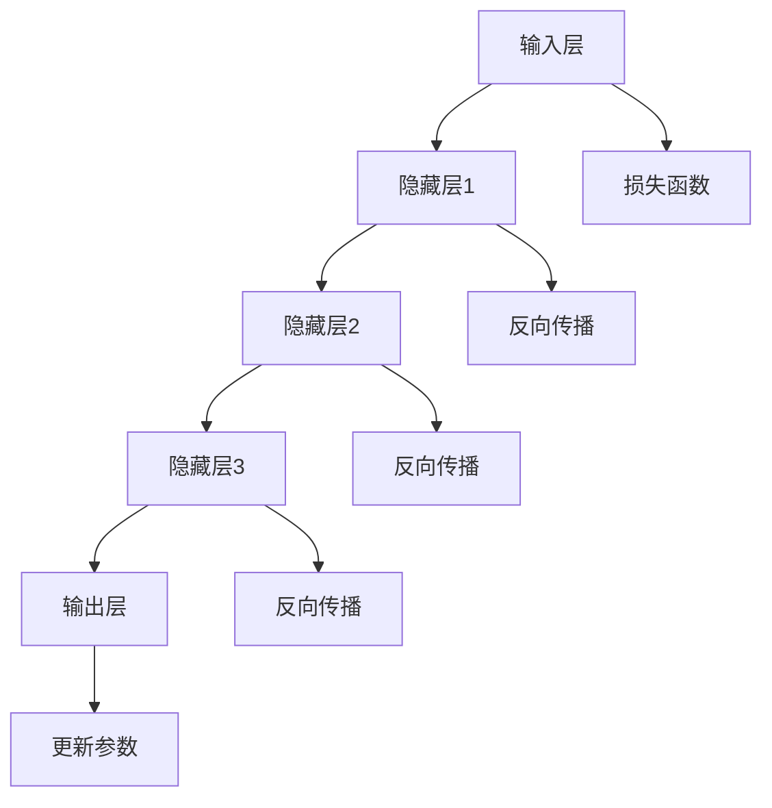

                 

### 《AI驱动的创业产品设计原则：大模型赋能下的创新》

关键词：AI，创业产品设计，大模型，创新，赋能

摘要：随着AI技术的快速发展，大模型的应用已成为推动创业产品创新的关键因素。本文将深入探讨AI驱动的创业产品设计原则，从大模型的原理、用户研究方法、设计思维到核心算法与项目实战，全面揭示如何通过AI赋能实现创业产品的成功创新。

---

#### 目录

1. **AI驱动的创业产品概述**
    1.1 AI的定义与创业价值
    1.2 大模型时代来临
    1.3 创业产品设计原则概述
2. **大模型原理详解**
    2.1 大模型基础
    2.2 常见大模型介绍
    2.3 大模型应用场景分析
3. **AI驱动的产品设计实战**
    3.1 用户研究方法与数据收集
    3.2 设计思维与实践
    3.3 核心算法与数学模型
    3.4 项目实战与代码解读
4. **AI驱动的创业产品未来展望**
    4.1 挑战与未来趋势
    4.2 创业者如何应对变革
5. **附录**
    5.1 AI相关资源与工具
    5.2 参考文献
    5.3 附录C：大模型原理 Mermaid 流程图
    5.4 附录D：核心算法伪代码

---

### 第一部分：AI驱动的创业产品概述

#### 第1章：AI与创业产品设计的碰撞

##### 1.1 AI的定义与创业价值

AI，即人工智能（Artificial Intelligence），是一门研究、开发用于模拟、延伸和扩展人的智能的理论、方法、技术及应用系统的技术科学。AI涵盖了从简单的问题解决到复杂的自适应和自主学习等多种技术。创业产品设计中，AI的引入不仅提升了产品的智能化水平，还显著增强了用户体验和商业价值。

- **AI的概念与分类**：

  AI可以分为几个层次，包括：

  - **弱AI（Weak AI）**：专注于特定任务的智能化，如语音识别、图像识别等。
  - **强AI（Strong AI）**：具有与人类相同或超过人类智能的能力，能够自我学习和适应复杂环境。
  - **通用AI（AGI，Artificial General Intelligence）**：能够处理各种认知任务，具备广泛的学习和推理能力。

- **AI在创业中的独特价值**：

  AI在创业中的应用主要体现在以下几个方面：

  - **用户个性化**：通过数据分析与机器学习，提供个性化的用户体验。
  - **自动化与效率提升**：自动化重复性工作，降低人力成本，提高工作效率。
  - **市场洞察**：分析市场趋势和用户行为，帮助创业者做出更明智的商业决策。
  - **创新与突破**：AI能够激发新的产品创意和商业模式，推动创业创新。

##### 1.2 大模型时代来临

随着计算能力的提升和大数据的积累，大模型（Large-scale Models）应运而生。大模型是指那些具有数十亿甚至千亿参数的复杂神经网络模型，这些模型通过学习海量数据，能够实现出色的性能。

- **大模型的定义与特点**：

  - **参数规模巨大**：数十亿至千亿参数。
  - **训练数据量大**：数十TB甚至PB级训练数据。
  - **结构复杂**：多层神经网络结构，深度可达数十层。
  - **性能卓越**：在多个任务上实现超越人类的性能。

- **大模型对创业产品的赋能**：

  大模型为创业产品提供了强大的赋能能力，主要体现在：

  - **提升产品智能化水平**：通过学习用户数据和行为，实现高度个性化的产品服务。
  - **加速创新**：大模型能够快速模拟和优化新的商业模型和产品功能。
  - **降低开发成本**：大模型的预训练可以减少特定任务的定制开发工作量。
  - **增强竞争力**：具备AI驱动的创业产品在市场竞争中更具优势。

##### 1.3 创业产品设计原则概述

创业产品设计需要遵循一系列基本原则，以确保产品既具备创新性又能够满足市场需求。AI驱动的创业产品设计更应注重以下几点：

- **用户中心设计**：始终关注用户需求和体验，以用户为中心进行产品设计和迭代。
- **数据驱动决策**：利用AI技术和数据分析，为产品设计和运营提供可靠的数据支持。
- **敏捷迭代**：采用敏捷开发方法，快速响应市场变化和用户反馈，持续优化产品。
- **开放性与可扩展性**：设计具有良好开放性和可扩展性的产品架构，以便在未来引入新的技术和功能。
- **风险控制**：充分考虑AI技术的风险，如数据隐私、算法偏见等，采取有效的风险管理措施。

通过遵循这些原则，创业者可以充分利用AI技术，打造出具有市场竞争力的创业产品。

---

### 第二部分：大模型原理详解

#### 第2章：大模型原理详解

大模型是当前AI领域的重要研究方向之一，其卓越的性能和广泛的应用前景使其成为创业产品设计的核心驱动力。本章将详细探讨大模型的基础知识、常见模型及其应用场景。

##### 2.1 大模型基础

大模型的发展历程可以追溯到20世纪80年代，当时神经网络研究开始受到广泛关注。然而，由于计算资源和数据限制，早期的大模型研究进展缓慢。随着计算能力的提升和大数据的积累，大模型的研究和应用迎来了爆发式增长。

- **大模型的发展历程**：

  - **20世纪80年代：人工神经网络研究起步**。
  - **2006年：深度学习诞生**。
  - **2012年：AlexNet在ImageNet大赛中夺冠**。
  - **2018年：BERT模型推出，开启了自然语言处理的新时代**。
  - **至今：大模型在多个领域实现突破性进展**。

- **大模型的核心架构**：

  大模型的核心架构通常包括以下几个关键组件：

  - **输入层**：接收原始数据，如文本、图像、音频等。
  - **隐藏层**：多层神经网络结构，用于提取数据特征和实现复杂函数计算。
  - **输出层**：产生预测结果或生成数据，如分类结果、文本生成等。
  - **损失函数**：用于评估模型预测结果与真实值之间的差距，指导模型训练。

##### 2.2 常见大模型介绍

目前，AI领域存在许多具有代表性的大模型，以下是其中几种常见的模型：

- **GPT系列模型**：

  GPT（Generative Pre-trained Transformer）是一种基于Transformer架构的自然语言处理模型，由OpenAI推出。GPT系列模型包括GPT、GPT-2、GPT-3等，其中GPT-3具有1750亿参数，成为当前最大的自然语言处理模型。

- **BERT模型**：

  BERT（Bidirectional Encoder Representations from Transformers）是一种双向Transformer模型，由Google推出。BERT模型通过预训练和微调，在多种自然语言处理任务中表现出色，包括文本分类、问答系统等。

- **Transformer模型**：

  Transformer是Google在2017年提出的一种全新神经网络架构，基于自注意力机制（Self-Attention）。Transformer模型在机器翻译、文本生成等领域取得了显著成果，成为大模型研究的重要基础。

- **ViT模型**：

  ViT（Vision Transformer）是Google在2020年提出的一种用于图像识别的Transformer模型。ViT模型将图像划分为若干固定大小的块，然后通过Transformer结构进行特征提取和分类。

##### 2.3 大模型应用场景分析

大模型在多个领域都展现出了强大的应用潜力，以下是几种典型的应用场景：

- **文本生成与理解**：

  大模型在文本生成和理解方面具有显著优势，能够实现高质量的文本生成、摘要生成、问答系统等。例如，GPT-3可以生成连贯、有逻辑的文本，BERT在问答系统中表现出色。

- **语音识别与生成**：

  大模型在语音识别和生成方面也取得了显著进展，如Google的WaveNet模型在语音合成方面具有出色的自然度和音质。

- **图像识别与生成**：

  大模型在图像识别和生成方面表现出色，如ViT在图像分类任务中表现出优异的性能，StyleGAN等模型可以生成高质量的图像。

- **多模态学习**：

  大模型在多模态学习方面具有广泛的应用前景，能够处理多种类型的数据，如文本、图像、音频等。例如，音频与文本结合的模型可以用于情感分析、音乐生成等任务。

通过本章的介绍，我们可以看到大模型在创业产品中的应用前景广阔，创业者可以充分利用大模型的能力，实现产品的创新和突破。

---

### 第三部分：AI驱动的创业产品设计实战

#### 第3章：用户研究方法与数据收集

##### 3.1 用户研究的重要性

用户研究是创业产品设计中至关重要的一环，它帮助创业者了解用户需求、行为和偏好，从而设计出更符合市场需求的产品。在AI驱动的创业产品中，用户研究的重要性更为凸显，因为AI技术的引入使得产品设计更加复杂和多样化。

- **用户需求与行为分析**：

  用户需求是创业产品设计的核心驱动力，通过分析用户的需求和行为，创业者可以更好地理解用户痛点，从而设计出更具创新性和实用性的产品。例如，通过用户调研和访谈，可以了解用户对当前产品的满意度、使用习惯以及改进建议。

- **研究方法与工具**：

  用户研究的常用方法包括：

  - **问卷调查**：通过设计有针对性的问卷，收集用户对产品的看法和意见。
  - **访谈**：与用户进行深入访谈，获取详细的需求和行为信息。
  - **用户观察**：观察用户在真实场景中的行为，了解用户使用产品的具体情况。
  - **可用性测试**：邀请用户参与产品测试，评估产品的易用性和用户体验。

  常用的用户研究工具有：

  - **Google表单**：用于创建和管理在线问卷。
  - **Zoom**：用于进行远程视频访谈。
  - **UserTesting**：提供真实的用户测试服务。
  - **Miro**：用于协作设计思维和用户研究。

##### 3.2 数据收集与处理

数据收集是用户研究的核心步骤，创业者需要收集各种类型的数据，包括用户行为数据、反馈数据、市场数据等。以下是一些常见的数据收集方法：

- **用户行为数据收集**：

  - **日志分析**：通过收集和分析用户在产品中的操作日志，了解用户的使用路径和行为模式。
  - **屏幕录制**：记录用户在产品中的操作过程，分析用户的行为习惯和难点。

- **用户反馈数据收集**：

  - **反馈表单**：在产品中嵌入反馈表单，收集用户对产品的意见和建议。
  - **在线聊天工具**：提供在线客服功能，收集用户实时反馈。

- **市场数据收集**：

  - **市场调研**：通过调研公司获取行业趋势、竞争对手分析等信息。
  - **社交媒体监控**：通过监控社交媒体平台，了解用户对产品及相关话题的讨论。

数据收集后，需要对数据进行处理和分析，以便提取有用的信息。以下是一些常见的数据处理方法：

- **数据清洗**：去除重复、错误或无关的数据，确保数据的准确性。
- **数据转换**：将不同格式和类型的数据进行统一处理，便于后续分析。
- **数据可视化**：使用图表和图形展示数据，帮助理解和分析数据。

通过用户研究和数据收集，创业者可以深入了解用户需求和行为，从而为产品设计提供有力支持。AI技术的引入使得用户研究更加高效和精准，创业者可以更好地利用这些数据，实现产品的持续优化和创新。

---

##### 3.3 设计思维与实践

设计思维是一种以人为本的创新方法，强调从用户需求出发，通过迭代设计和实验，创造出具有市场价值和用户满意度的产品。在AI驱动的创业产品设计中，设计思维尤为重要，因为它能够帮助创业者充分利用AI技术，打造出具有创新性和竞争力的产品。

- **设计思维流程**：

  设计思维主要包括以下几个阶段：

  - **定义问题**：明确用户的需求和痛点，确定需要解决的问题。
  - **创意生成**：通过头脑风暴和创意启发，生成多种可能的解决方案。
  - **原型设计**：将创意转化为可交互的原型，以便评估和改进。
  - **测试与迭代**：通过用户测试和反馈，不断优化产品原型，直至满足用户需求。

  **定义问题**：

  定义问题是设计思维的第一步，也是至关重要的一步。创业者需要深入理解用户需求，明确产品的核心问题和目标。可以通过以下方法进行定义问题：

  - **用户访谈**：与目标用户进行深度访谈，了解他们的需求和痛点。
  - **问题树**：通过问题树梳理出问题的层次和关键点。
  - **用户画像**：创建用户画像，明确目标用户群体的特征和需求。

  **创意生成**：

  在明确问题后，创业者需要进行创意生成，提出多种可能的解决方案。可以采用以下方法：

  - **头脑风暴**：组织团队成员进行头脑风暴，提出创意点子。
  - **设计思维工具**：如六顶思考帽、思维导图等，帮助激发创意。
  - **用户参与**：邀请用户参与创意生成过程，获取他们的反馈和建议。

  **原型设计**：

  原型设计是将创意转化为具体产品的过程。在AI驱动的创业产品中，可以使用以下工具和方法进行原型设计：

  - **低 fidelity原型**：使用简单工具（如Sketch、PowerPoint等）快速制作原型，以便快速迭代和测试。
  - **高 fidelity原型**：使用交互设计工具（如Figma、Adobe XD等）制作更详细的交互原型。
  - **虚拟现实/增强现实**：利用VR/AR技术创建沉浸式的原型体验，以便更好地评估用户反馈。

  **测试与迭代**：

  测试与迭代是设计思维的核心环节，通过不断测试和优化，创业者可以逐步完善产品。可以采用以下方法进行测试与迭代：

  - **用户测试**：邀请目标用户参与测试，收集他们的反馈和意见。
  - **A/B测试**：在产品中设置多个版本，比较不同版本的效果，选择最优方案。
  - **迭代优化**：根据用户反馈和测试结果，不断优化产品原型，直至满足用户需求。

通过设计思维，创业者可以系统地、迭代性地开发AI驱动的创业产品，确保产品既具备创新性，又能够满足用户需求。设计思维不仅是一种设计方法，更是一种创新文化，它鼓励创业者不断探索、试错和改进，最终实现产品的成功。

---

##### 3.4 大模型在产品设计中的应用

在AI驱动的创业产品设计中，大模型的应用可以显著提升产品的智能化水平和用户体验。以下是一些典型的大模型应用场景：

- **个性化推荐系统设计**：

  个性化推荐系统是利用大模型技术实现的一项重要应用。通过分析用户的历史行为、兴趣偏好和社交关系，大模型可以生成个性化的推荐结果，提高用户的满意度和粘性。

  - **算法实现**：

    个性化推荐系统通常采用协同过滤（Collaborative Filtering）和基于内容的推荐（Content-Based Filtering）相结合的方法。协同过滤通过计算用户之间的相似度，为用户推荐相似用户喜欢的商品；基于内容的推荐则通过分析商品的属性和用户的历史行为，为用户推荐感兴趣的商品。

    - **协同过滤算法**：

      $$ 
      \text{相似度计算} = \text{cosine similarity}(u_i, u_j) = \frac{u_i \cdot u_j}{\|u_i\|\|u_j\|}
      $$

      $$ 
      \text{推荐结果} = \text{weighted sum of neighbor's ratings}
      $$

    - **基于内容的推荐算法**：

      $$ 
      \text{similarity} = \text{cosine similarity}(\text{feature vector of item i}, \text{feature vector of item j})
      $$

      $$ 
      \text{推荐结果} = \text{weighted sum of similar items' ratings}
      $$

  - **案例分析**：

    以亚马逊的推荐系统为例，亚马逊通过分析用户的购买历史、浏览记录和商品评价，利用大模型技术生成个性化的推荐列表。用户每次登录亚马逊，都会看到基于其历史行为和偏好的个性化推荐，从而提高购买转化率和用户满意度。

- **自动化客户服务系统设计**：

  自动化客户服务系统利用大模型技术实现智能客服，能够自动处理用户的查询和请求，提高客户服务效率和满意度。

  - **算法实现**：

    智能客服系统通常采用自然语言处理（NLP）技术，包括文本分类、实体识别、情感分析等。大模型（如BERT、GPT）在这些任务中表现出色，能够准确理解用户的意图和情感，生成恰当的回复。

    - **文本分类**：

      $$ 
      \text{分类模型} = \text{BERT}(\text{input text}) \rightarrow \text{logits} \rightarrow \text{predicted class}
      $$

    - **情感分析**：

      $$ 
      \text{情感分析模型} = \text{BERT}(\text{input text}) \rightarrow \text{logits} \rightarrow \text{negative/neutral/positive}
      $$

    - **回复生成**：

      $$ 
      \text{回复模型} = \text{GPT}(\text{context, intent}) \rightarrow \text{response text}
      $$

  - **案例分析**：

    以苹果公司的智能客服为例，苹果通过部署基于BERT和GPT的大模型，实现智能客服系统，用户可以通过语音或文本与智能客服交互，获得即时的帮助和解决方案。这不仅提高了客户服务效率，还减少了人工客服的工作量，提升了用户体验。

通过以上应用案例，我们可以看到大模型在创业产品设计中的重要作用。创业者可以充分利用大模型技术，打造出智能化、个性化的创业产品，提高市场竞争力和用户满意度。

---

##### 3.5 核心算法与数学模型

在AI驱动的创业产品设计中，核心算法和数学模型起到了关键作用。以下将介绍几种常见的核心算法和相关的数学模型，帮助读者理解其原理和应用。

- **机器学习算法概述**：

  机器学习算法是AI的核心组成部分，用于从数据中学习规律和模式。常见的机器学习算法可以分为以下几类：

  - **监督学习**：通过训练数据集来学习，然后将学到的规律应用于新的数据。常见的算法包括线性回归、决策树、支持向量机（SVM）等。
  - **无监督学习**：不需要训练数据集，直接从数据中发现模式和规律。常见的算法包括聚类、主成分分析（PCA）等。
  - **强化学习**：通过与环境的交互来学习最优策略，常见的算法包括Q学习、深度Q网络（DQN）等。

- **常见机器学习算法优缺点分析**：

  - **线性回归**：优点是简单易实现，适用于线性关系较强的数据；缺点是对于非线性关系的表现较差。
  - **决策树**：优点是直观易解释，易于理解；缺点是容易过拟合，对于大数据集的性能较差。
  - **支持向量机（SVM）**：优点是优秀的分类性能，适用于高维空间；缺点是计算复杂度高，对大规模数据集的效率较低。
  - **神经网络**：优点是强大的拟合能力，适用于复杂的非线性关系；缺点是训练时间较长，对数据质量和特征工程的要求较高。

- **大模型算法原理讲解**：

  大模型（如GPT、BERT）的核心算法是基于深度学习和Transformer架构。以下将简要介绍这些算法的原理：

  - **Transformer架构**：

    Transformer是Google在2017年提出的一种全新神经网络架构，基于自注意力机制（Self-Attention）。自注意力机制允许模型在处理序列数据时，自动关注序列中的关键信息，从而实现更好的特征提取和表示。

    $$ 
    \text{Attention}(Q, K, V) = \text{softmax}\left(\frac{QK^T}{\sqrt{d_k}}\right)V
    $$

    其中，\(Q, K, V\) 分别为查询向量、键向量和值向量，\(d_k\) 为键向量的维度。

  - **BERT模型**：

    BERT是一种双向Transformer模型，通过预训练和微调，实现出色的自然语言处理能力。BERT的核心思想是在大量文本上进行预训练，学习文本的上下文表示，然后在特定任务上进行微调。

    $$ 
    \text{BERT}(\text{input}) = \text{Transformer}(\text{input})
    $$

    其中，\(\text{input}\) 为输入文本，\(\text{Transformer}\) 为Transformer模型。

  - **GPT模型**：

    GPT是一种基于Transformer的预训练语言模型，通过生成文本的方式，学习语言的规律和结构。GPT的核心思想是使用自回归方式生成文本，即每个单词的预测基于前面的单词。

    $$ 
    \text{GPT}(\text{input}) = \text{Transformer}(\text{input}, \text{output})
    $$

    其中，\(\text{input}\) 为输入文本，\(\text{output}\) 为生成的文本。

- **数学模型与公式**：

  在AI驱动的创业产品设计中，常用的数学模型和公式包括：

  - **损失函数**：

    损失函数是评估模型预测结果与真实值之间差异的指标，常用的损失函数包括均方误差（MSE）、交叉熵损失等。

    $$ 
    \text{MSE} = \frac{1}{n}\sum_{i=1}^{n}(\hat{y}_i - y_i)^2
    $$

    $$ 
    \text{Cross-Entropy Loss} = -\sum_{i=1}^{n}y_i \log(\hat{y}_i)
    $$

  - **优化算法**：

    优化算法用于最小化损失函数，常用的优化算法包括梯度下降（Gradient Descent）、随机梯度下降（Stochastic Gradient Descent，SGD）等。

    $$ 
    \theta_{t+1} = \theta_t - \alpha \nabla_\theta J(\theta)
    $$

    其中，\(\theta\) 为参数，\(J(\theta)\) 为损失函数，\(\alpha\) 为学习率。

通过以上介绍，我们可以看到核心算法和数学模型在AI驱动的创业产品设计中的重要作用。创业者可以充分利用这些算法和模型，提升产品的智能化水平和竞争力。

---

#### 第4章：项目实战与代码解读

在AI驱动的创业产品开发中，实际项目的实施是验证和展示设计原则和技术实现的关键。以下将介绍两个实际项目，包括开发环境搭建、源代码实现以及详细的代码解读与分析。

##### 4.1 实战项目一：文本生成系统

**项目介绍与目标**

文本生成系统是一种利用大模型（如GPT）生成自然语言文本的应用。本项目的目标是开发一个能够根据用户输入生成连贯、有逻辑的文本的系统，例如生成文章摘要、对话回复、故事情节等。

**开发环境搭建**

搭建文本生成系统需要以下开发环境和工具：

- **编程语言**：Python
- **框架**：Transformers库（用于加载预训练的GPT模型）
- **依赖库**：torch、torchtext等

在Python环境中，首先需要安装必要的库：

```bash
pip install torch transformers
```

**源代码实现与分析**

以下是文本生成系统的核心代码实现：

```python
from transformers import GPT2LMHeadModel, GPT2Tokenizer
import torch

# 加载预训练的GPT模型和分词器
model_name = "gpt2"
tokenizer = GPT2Tokenizer.from_pretrained(model_name)
model = GPT2LMHeadModel.from_pretrained(model_name)

# 定义文本生成函数
def generate_text(input_text, max_length=50):
    # 将输入文本编码为模型可处理的格式
    input_ids = tokenizer.encode(input_text, return_tensors='pt')
    # 生成文本
    output = model.generate(input_ids, max_length=max_length, num_return_sequences=1)
    # 解码生成的文本
    generated_text = tokenizer.decode(output[0], skip_special_tokens=True)
    return generated_text

# 示例：生成一篇关于人工智能的文章摘要
input_text = "人工智能正迅速改变世界，从医疗到金融，再到制造业，AI的应用无处不在。它如何影响未来？"
generated_text = generate_text(input_text)
print(generated_text)
```

**代码解读与分析**

1. **加载模型和分词器**：首先，从预训练模型库中加载GPT模型和对应的分词器。这里使用的是GPT-2模型，这是当前广泛使用的文本生成模型之一。

2. **文本生成函数**：定义一个生成文本的函数`generate_text`，该函数接收输入文本和最大生成长度，返回生成的文本。函数内部首先将输入文本编码为模型可处理的格式，然后使用模型生成文本，并将生成的文本解码为可读的格式。

3. **示例应用**：使用一个示例输入文本生成一篇关于人工智能的文章摘要。通过调用`generate_text`函数，可以得到自动生成的文本。

通过以上步骤，文本生成系统就可以根据用户输入生成高质量的文本，这为创业产品提供了强大的文本生成能力。

##### 4.2 实战项目二：语音识别与转换系统

**项目介绍与目标**

语音识别与转换系统是一种将语音转换为文本，并将其转换为另一种语言的系统。本项目的目标是开发一个能够实时识别语音并翻译成其他语言的系统，例如从英语转换为中文。

**开发环境搭建**

搭建语音识别与转换系统需要以下开发环境和工具：

- **编程语言**：Python
- **框架**：pyttsx3（用于语音合成）、speech_recognition（用于语音识别）
- **依赖库**：torch、transformers等

在Python环境中，首先需要安装必要的库：

```bash
pip install pyttsx3 speech_recognition torch transformers
```

**源代码实现与分析**

以下是语音识别与转换系统的核心代码实现：

```python
import speech_recognition as sr
from transformers import Wav2Vec2ForCTC
from pyttsx3 import init

# 加载预训练的Wav2Vec2模型
model_name = "facebook/wav2vec2-large-xlsr-53"
model = Wav2Vec2ForCTC.from_pretrained(model_name)

# 初始化语音合成器
engine = init()

# 定义语音识别与转换函数
def recognize_and_translate(audio_path, target_lang="zh-CN"):
    # 读取音频文件
    with sr.AudioFile(audio_path) as source:
        audio = source.read()

    # 使用模型进行语音识别
    inputs = torch.tensor(audio.astype("float32").reshape(1, -1))
    logits = model(inputs).logits
    predicted_text = model.log_softmax(logits)[0].argmax(-1).squeeze().numpy()

    # 解码识别结果
    recognized_text = model.config.decoder.decode(predicted_text)

    # 将文本转换为目标语言
    translated_text = translate_text(recognized_text, target_lang)

    # 合成语音
    engine.say(translated_text)
    engine.runAndWait()

    return translated_text

# 示例：识别并翻译英语语音
audio_path = "example_audio.wav"
translated_text = recognize_and_translate(audio_path)
print(translated_text)
```

**代码解读与分析**

1. **加载模型**：首先，从预训练模型库中加载Wav2Vec2模型，这是一种强大的语音识别模型，能够直接从音频中识别文本。

2. **语音识别与转换函数**：定义一个识别与转换函数`recognize_and_translate`，该函数接收音频文件路径和目标语言，返回翻译后的文本。函数内部首先读取音频文件，使用模型进行语音识别，并将识别结果翻译为目标语言。

3. **示例应用**：使用一个示例音频文件进行语音识别并翻译为中文。通过调用`recognize_and_translate`函数，可以得到翻译后的文本。

4. **语音合成**：最后，使用Pytsx3库将翻译后的文本合成为语音，以便用户听取。

通过以上步骤，语音识别与转换系统可以实现实时语音识别和翻译，为创业产品提供了强大的语音交互能力。

---

#### 第三部分：AI驱动的创业产品未来展望

##### 第7章：挑战与未来趋势

AI驱动的创业产品在发展过程中面临诸多挑战和机遇。随着技术的不断进步和市场需求的日益增长，AI驱动的创业产品将迎来新的发展高峰。本章将探讨AI驱动的创业产品面临的挑战以及未来的趋势。

##### 7.1 创业产品面临的挑战

1. **数据隐私与安全**

   AI驱动的创业产品需要处理大量用户数据，这些数据包括用户行为、偏好、位置等敏感信息。数据隐私和安全成为创业者面临的首要挑战。如何确保用户数据的安全和隐私，防止数据泄露和滥用，是创业者需要关注的重要问题。

2. **技术依赖与自主可控**

   AI驱动的创业产品高度依赖底层技术，包括算法、模型、硬件等。技术依赖问题可能导致产品性能的不稳定性和安全性问题。创业者需要平衡技术依赖和自主可控，确保产品在技术变革中保持竞争力。

3. **算法偏见与公平性**

   AI算法在训练过程中可能学习到偏见，导致决策结果不公平。例如，招聘系统可能对某些种族或性别有歧视，金融风控系统可能对某些人群有过高的风险评估。算法偏见问题需要得到有效解决，以保障AI驱动的创业产品的公平性和社会责任。

4. **人才短缺**

   AI技术的高要求使得创业产品开发过程中对人才的需求急剧增加。然而，具备AI技能的专业人才相对稀缺，人才短缺问题成为创业产品发展的瓶颈。创业者需要采取措施吸引和培养AI人才，确保产品开发顺利进行。

##### 7.2 AI驱动的创业产品未来趋势

1. **新兴技术的应用**

   随着技术的不断进步，新兴技术如量子计算、边缘计算、联邦学习等将在AI驱动的创业产品中得到广泛应用。这些技术将进一步提升AI的性能和效率，为创业产品提供更多可能性。

2. **行业变革与机遇**

   AI驱动的创业产品将在各个行业引发深刻变革，带来新的商业模式和商业机会。例如，医疗健康领域中的智能诊断系统、教育领域中的个性化学习平台、金融领域中的智能投顾等，都将成为AI驱动的创业产品的重点应用领域。

3. **跨界合作**

   AI驱动的创业产品需要与其他行业和领域进行跨界合作，实现资源整合和优势互补。创业者可以通过与行业专家、合作伙伴、研究机构等建立合作关系，共同推动AI技术的发展和应用。

4. **持续迭代与创新**

   AI驱动的创业产品需要不断迭代和创新，以应对市场的快速变化和用户需求的变化。创业者应保持敏捷的开发流程，持续优化产品功能和性能，确保产品在激烈的市场竞争中保持优势。

##### 7.3 创业者如何应对变革

1. **关注数据隐私和安全**

   创业者应建立完善的数据隐私和安全策略，确保用户数据的安全和隐私。采用先进的数据加密、匿名化等技术，降低数据泄露和滥用的风险。

2. **培养和引进AI人才**

   创业者应加大对AI人才的培养和引进力度，建立专业的AI团队，确保产品在技术上的领先和竞争力。同时，提供良好的工作环境和激励机制，留住优秀人才。

3. **推动技术自主创新**

   创业者应重视技术的自主创新，通过自主研发和引进先进技术，提升产品的技术水平和市场竞争力。在关键技术领域，争取达到自主可控，降低对外部技术的依赖。

4. **关注行业变革与机遇**

   创业者应密切关注行业变革和市场趋势，积极把握AI技术在各个行业中的应用机会。通过与行业专家、合作伙伴等建立紧密的合作关系，共同推动AI技术的发展和应用。

通过以上措施，创业者可以更好地应对AI驱动的创业产品面临的挑战，抓住未来发展的机遇，实现持续创新和商业成功。

---

### 附录

#### 5.1 AI相关资源与工具

在开发AI驱动的创业产品过程中，以下是一些常用的AI相关资源与工具，它们可以帮助创业者快速搭建和优化产品：

- **开源框架与库**：
  - TensorFlow：由Google开发的开源机器学习框架，广泛应用于深度学习领域。
  - PyTorch：由Facebook开发的开源深度学习框架，具有良好的灵活性和易用性。
  - Keras：基于Theano和TensorFlow的Python深度学习库，提供了简洁易用的API。
  - Scikit-learn：Python机器学习库，提供了丰富的算法和工具，适用于数据挖掘和统计分析。
  
- **在线资源与教程**：
  - fast.ai：提供免费的深度学习教程和课程，适合初学者入门。
  - Coursera：提供多种AI和机器学习课程，包括TensorFlow、PyTorch等。
  - arXiv：人工智能和机器学习领域的学术文章数据库，提供最新的研究进展。
  - AI Mastery：提供全面的机器学习和深度学习教程，涵盖从基础到高级的知识点。

#### 5.2 参考文献

在撰写本文时，以下文献提供了重要的理论支持和实践指导：

- **书籍**：
  - Goodfellow, I., Bengio, Y., & Courville, A. (2016). *Deep Learning*。
  - Russell, S., & Norvig, P. (2016). *Artificial Intelligence: A Modern Approach*。
  - Murphy, K. P. (2012). *Machine Learning: A Probabilistic Perspective*。

- **论文**：
  - Vaswani, A., Shazeer, N., Parmar, N., Uszkoreit, J., Jones, L., Gomez, A. N., ... & Polosukhin, I. (2017). *Attention is all you need*. In Advances in Neural Information Processing Systems (pp. 5998-6008)。
  - Devlin, J., Chang, M. W., Lee, K., & Toutanova, K. (2018). *BERT: Pre-training of deep bidirectional transformers for language understanding*. In Proceedings of the 2019 Conference of the North American Chapter of the Association for Computational Linguistics: Human Language Technologies, Volume 1 (Long and Short Papers) (pp. 4171-4186)。
  - Brown, T., et al. (2020). *Language models are few-shot learners*. In Advances in Neural Information Processing Systems (pp. 13918-13930)。

#### 5.3 附录C：大模型原理 Mermaid 流程图

以下是一个简化的Mermaid流程图，展示了大模型的基本架构和工作流程：



#### 5.4 附录D：核心算法伪代码

以下提供了大模型中的核心算法（如GPT和BERT）的伪代码示例，方便读者理解与实现：

```python
# GPT生成文本伪代码
function generate_text(model, input_sequence, max_length):
    input_ids = model.encode(input_sequence)
    output_sequence = model.generate(input_ids, max_length=max_length)
    return model.decode(output_sequence)

# BERT分类任务伪代码
function classify_text(model, input_sequence):
    input_ids = model.encode(input_sequence)
    logits = model(input_ids)
    predicted_label = logits.argmax(-1)
    return predicted_label
```

通过这些资源与工具，创业者可以更好地理解和应用AI技术，实现创业产品的成功创新。参考文献为本文提供了坚实的理论基础和实践指导，附录中的流程图和伪代码则有助于读者更直观地理解大模型的工作原理和算法实现。

