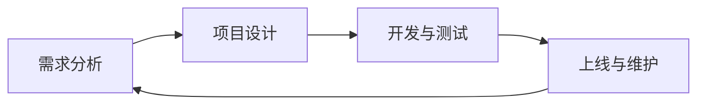

                 

# 《AIGC应用开发全流程》

## 关键词：AIGC, 应用开发, 全流程, 深度学习, GAN, Transformer, 项目实战

## 摘要：

本文旨在为读者提供一份全面且深入的AIGC（人工智能生成内容）应用开发指南。文章首先介绍了AIGC的基础知识，包括其概念、技术架构和应用领域；接着深入探讨了AIGC的核心算法原理，如深度学习、生成对抗网络（GAN）、变分自编码器（VAE）和自注意力机制与Transformer；然后，通过项目实战，详细讲解了AIGC应用开发的全过程，包括环境搭建、项目规划、开发与测试、上线与维护等；随后，讨论了AIGC应用开发的性能优化、安全与隐私保护以及与云计算的结合；最后，通过具体案例分析和未来发展趋势探讨，为读者揭示了AIGC技术的实际应用潜力和面临的挑战。本文旨在帮助读者系统地理解AIGC技术，掌握其开发方法，为未来的研究和应用提供参考。

---

### 《AIGC应用开发全流程》目录大纲

#### 第一部分: AIGC基础

- **第1章: AIGC概述**
  - **1.1 AIGC的概念与背景**
    - **1.1.1 AIGC的定义**
    - **1.1.2 AIGC的发展背景**
    - **1.1.3 AIGC的核心价值**
  - **1.2 AIGC的技术架构**
    - **1.2.1 AIGC的技术原理**
    - **1.2.2 AIGC的关键技术**
    - **1.2.3 AIGC的体系结构**
  - **1.3 AIGC的应用领域**
    - **1.3.1 内容生成与编辑**
    - **1.3.2 数据处理与增强**
    - **1.3.3 其他应用领域探讨**

- **第2章: AIGC核心算法原理**
  - **2.1 深度学习基础**
    - **2.1.1 神经网络概述**
    - **2.1.2 深度学习优化算法**
    - **2.1.3 深度学习框架简介**
  - **2.2 生成对抗网络(GAN)**
    - **2.2.1 GAN的基本原理**
    - **2.2.2 GAN的应用场景**
    - **2.2.3 GAN的优化方法**
  - **2.3 变分自编码器(VAE)**
    - **2.3.1 VAE的基本原理**
    - **2.3.2 VAE的应用场景**
    - **2.3.3 VAE的优化方法**
  - **2.4 自注意力机制与Transformer**
    - **2.4.1 自注意力机制概述**
    - **2.4.2 Transformer架构详解**
    - **2.4.3 Transformer的应用领域**

#### 第二部分: AIGC应用开发实践

- **第3章: AIGC项目实战入门**
  - **3.1 AIGC项目开发环境搭建**
    - **3.1.1 开发环境配置**
    - **3.1.2 常用开发工具介绍**
    - **3.1.3 开发环境调试与优化**
  - **3.2 AIGC项目实战案例**
    - **3.2.1 图像生成与编辑**
    - **3.2.2 文本生成与编辑**
    - **3.2.3 数据增强与处理**
  - **3.3 AIGC项目开发流程**
    - **3.3.1 项目需求分析**
    - **3.3.2 项目设计与规划**
    - **3.3.3 项目开发与测试**
    - **3.3.4 项目上线与维护**

- **第4章: AIGC应用开发进阶**
  - **4.1 AIGC应用性能优化**
    - **4.1.1 计算资源优化**
    - **4.1.2 模型压缩与加速**
    - **4.1.3 实时应用优化**
  - **4.2 AIGC应用安全与隐私保护**
    - **4.2.1 应用安全挑战**
    - **4.2.2 隐私保护技术**
    - **4.2.3 安全与隐私保护策略**
  - **4.3 AIGC应用与云计算的结合**
    - **4.3.1 云计算基础**
    - **4.3.2 AIGC与云计算的融合应用**
    - **4.3.3 云端与边缘计算的结合**

- **第5章: AIGC应用案例分析**
  - **5.1 案例一：图像生成与编辑应用**
    - **5.1.1 应用场景**
    - **5.1.2 技术实现**
    - **5.1.3 效果分析**
  - **5.2 案例二：文本生成与编辑应用**
    - **5.2.1 应用场景**
    - **5.2.2 技术实现**
    - **5.2.3 效果分析**
  - **5.3 案例三：数据处理与增强应用**
    - **5.3.1 应用场景**
    - **5.3.2 技术实现**
    - **5.3.3 效果分析**

- **第6章: AIGC未来发展趋势与挑战**
  - **6.1 AIGC技术的发展趋势**
    - **6.1.1 技术创新方向**
    - **6.1.2 应用领域拓展**
    - **6.1.3 社会与产业影响**
  - **6.2 AIGC面临的挑战**
    - **6.2.1 技术难题**
    - **6.2.2 法律与伦理问题**
    - **6.2.3 安全与隐私保护**

- **附录A: AIGC开发工具与资源**
  - **A.1 开发工具介绍**
    - **A.1.1 TensorFlow**
    - **A.1.2 PyTorch**
    - **A.1.3 Keras**
    - **A.1.4 其他工具简介**
  - **A.2 开发资源推荐**
    - **A.2.1 学术论文**
    - **A.2.2 开源代码库**
    - **A.2.3 在线教程与课程**
    - **A.2.4 社区与论坛**

---

接下来，我们将逐一展开每一部分的内容，详细介绍AIGC的基础知识、核心算法原理、应用开发实践以及未来的发展趋势与挑战。

---

### 第一部分: AIGC基础

#### 第1章: AIGC概述

#### 1.1 AIGC的概念与背景

##### 1.1.1 AIGC的定义

AIGC，即人工智能生成内容（Artificial Intelligence Generated Content），是指通过人工智能技术，特别是深度学习算法，自动生成文本、图像、音频等多样化内容的技术和过程。与传统的手动内容创作相比，AIGC具有高效性、多样性和灵活性，可以在短时间内生成大量高质量的原创内容。

##### 1.1.2 AIGC的发展背景

AIGC技术的发展可以追溯到深度学习技术的兴起。随着深度学习算法的成熟和计算资源的丰富，生成对抗网络（GAN）和变分自编码器（VAE）等新型算法被广泛应用于图像生成、文本生成等领域。此外，自注意力机制和Transformer架构的引入，使得AIGC在生成文本和图像的多样性和质量上取得了显著提升。

##### 1.1.3 AIGC的核心价值

AIGC的核心价值在于其可以极大地提高内容创作的效率和质量。首先，AIGC能够自动生成大量原创内容，减轻了人类创作者的负担。其次，AIGC可以生成各种风格和类型的内容，满足不同用户的需求。此外，AIGC还可以通过对已有内容的优化和增强，提升内容的吸引力和传播力。

#### 1.2 AIGC的技术架构

##### 1.2.1 AIGC的技术原理

AIGC的技术核心是生成模型，主要包括生成对抗网络（GAN）、变分自编码器（VAE）和自注意力机制与Transformer。生成对抗网络（GAN）通过生成器和判别器的对抗训练，实现高质量图像的生成。变分自编码器（VAE）则通过编码器和解码器的协同工作，实现数据的生成和增强。自注意力机制与Transformer则在文本生成任务中展现了强大的能力。

##### 1.2.2 AIGC的关键技术

AIGC的关键技术包括深度学习、生成对抗网络（GAN）、变分自编码器（VAE）和自注意力机制与Transformer。深度学习是AIGC的基础技术，提供了强大的特征提取和学习能力。生成对抗网络（GAN）和变分自编码器（VAE）是AIGC的核心生成技术，分别用于图像和数据的生成。自注意力机制与Transformer则在文本生成领域展现了卓越的性能。

##### 1.2.3 AIGC的体系结构

AIGC的体系结构主要包括数据输入、模型训练、内容生成和内容优化四个部分。数据输入部分负责收集和预处理生成数据；模型训练部分通过深度学习算法进行模型训练；内容生成部分负责生成新的内容；内容优化部分则对生成内容进行后处理，提升内容的吸引力和质量。

#### 1.3 AIGC的应用领域

##### 1.3.1 内容生成与编辑

内容生成与编辑是AIGC最典型的应用领域。通过AIGC技术，可以自动生成文章、新闻、广告、音乐、视频等多种类型的内容，大大提高了内容创作的效率和多样性。此外，AIGC还可以对已有内容进行编辑和优化，提升内容的质量和吸引力。

##### 1.3.2 数据处理与增强

数据处理与增强是AIGC的重要应用领域。通过深度学习算法，AIGC可以自动处理和增强图像、音频、文本等多种类型的数据。例如，AIGC可以用于图像的增强和修复，音频的降噪和增强，文本的情感分析和生成等。

##### 1.3.3 其他应用领域探讨

除了上述主要应用领域，AIGC还有广泛的应用前景。例如，在游戏开发中，AIGC可以自动生成游戏关卡、角色和场景；在电商领域，AIGC可以用于商品描述和推荐系统的生成；在艺术设计领域，AIGC可以用于图像和视频的生成和编辑。

#### 总结

本章对AIGC的基础知识进行了全面的介绍，包括其定义、发展背景、核心价值、技术架构和应用领域。通过本章的学习，读者可以初步了解AIGC的基本概念和技术原理，为后续章节的深入学习打下基础。

---

### 第一部分: AIGC基础

#### 第2章: AIGC核心算法原理

#### 2.1 深度学习基础

##### 2.1.1 神经网络概述

神经网络是深度学习的基础，是一种模拟生物神经系统的计算模型。神经网络由大量的节点（或称为神经元）组成，每个节点都与多个其他节点相连，通过加权的方式传递信息。神经网络的训练过程是通过不断调整权重的值，使得网络能够对输入数据进行分类或回归。


在神经网络中，每个节点都执行简单的计算操作，即输入信号通过权重相乘，然后求和，最后通过激活函数进行非线性变换。常见的激活函数包括Sigmoid、ReLU和Tanh等。

##### 2.1.2 深度学习优化算法

深度学习优化算法是训练神经网络的关键步骤，目的是通过迭代优化网络权重，使得网络能够对输入数据进行准确的预测。常用的优化算法包括随机梯度下降（SGD）、Adam和RMSprop等。

- **随机梯度下降（SGD）**：SGD是深度学习中最基本的优化算法，其核心思想是每次迭代只对当前训练样本进行梯度计算和权重更新。SGD的优点是简单易实现，缺点是收敛速度较慢，对参数敏感。

- **Adam**：Adam是近年来广泛使用的一种优化算法，其结合了SGD和RMSprop的优点。Adam通过维护两个参数（一阶矩估计和二阶矩估计），自适应地调整学习率，从而在优化过程中表现出更好的收敛速度和稳定性。

- **RMSprop**：RMSprop是一种基于梯度的平方根的优化算法，通过考虑过去梯度信息的平方和来动态调整学习率，从而在优化过程中表现出更好的收敛速度。

##### 2.1.3 深度学习框架简介

深度学习框架是用于实现深度学习算法的工具，提供了丰富的API和资源，大大简化了深度学习的开发过程。常用的深度学习框架包括TensorFlow、PyTorch和Keras等。

- **TensorFlow**：TensorFlow是由谷歌开发的开源深度学习框架，具有强大的功能和广泛的社区支持。TensorFlow提供了丰富的API，可以用于构建、训练和部署深度学习模型。

- **PyTorch**：PyTorch是由Facebook开发的开源深度学习框架，以其灵活性和动态性而闻名。PyTorch提供了丰富的API，可以方便地实现复杂的深度学习模型。

- **Keras**：Keras是一个高级深度学习框架，可以与TensorFlow和Theano等底层框架结合使用。Keras提供了简洁的API，使得深度学习模型的构建和训练变得更加容易。

#### 2.2 生成对抗网络(GAN)

##### 2.2.1 GAN的基本原理

生成对抗网络（GAN）是深度学习中的一种新型生成模型，由生成器和判别器两个神经网络组成。生成器的目标是生成与真实数据类似的数据，而判别器的目标是区分真实数据和生成数据。


GAN的训练过程可以看作是一场博弈。生成器G和判别器D交替进行参数更新，生成器和判别器都通过梯度上升进行优化。生成器的目标是使得判别器无法区分生成数据和真实数据，而判别器的目标是能够准确地区分生成数据和真实数据。

##### 2.2.2 GAN的应用场景

GAN在许多应用场景中展现出了强大的能力，包括图像生成、图像修复、图像到图像的转换、文本生成等。

- **图像生成**：GAN可以用于生成高质量的自然图像，例如人脸生成、风景生成等。通过训练生成器，GAN可以学习到真实图像的分布，从而生成新的图像。

- **图像修复**：GAN可以用于修复损坏的图像，例如去除图像中的噪音、填充缺失的部分等。生成器可以生成与真实图像相似的数据，从而修复损坏的部分。

- **图像到图像的转换**：GAN可以用于将一种图像转换为另一种图像，例如将素描转换为彩色图像、将黑白图像转换为彩色图像等。

- **文本生成**：GAN可以用于生成自然语言文本，例如生成文章、对话、评论等。生成器可以学习到文本的分布，从而生成新的文本。

##### 2.2.3 GAN的优化方法

GAN的训练过程容易陷入梯度消失和梯度爆炸等问题，因此需要采用一些优化方法来稳定训练过程。

- **梯度裁剪**：梯度裁剪是一种常用的优化方法，通过限制梯度的大小，防止梯度爆炸和消失。

- **谱归一化**：谱归一化是一种用于优化GAN训练的方法，通过标准化生成器和判别器的梯度，使得梯度方向一致，从而提高训练稳定性。

- **反事实梯度**：反事实梯度是一种用于优化GAN生成器的方法，通过生成器生成的虚拟数据，来计算判别器的梯度，从而提高生成器的学习效果。

#### 2.3 变分自编码器(VAE)

##### 2.3.1 VAE的基本原理

变分自编码器（VAE）是一种深度学习模型，旨在生成数据并保持数据的结构。VAE由编码器和解码器两个神经网络组成，编码器将输入数据映射到一个潜在空间，解码器则从潜在空间中生成输出数据。


VAE的核心思想是通过概率模型来生成数据，编码器和解码器都是概率模型。编码器通过学习输入数据的概率分布，将输入数据映射到潜在空间中的一个点；解码器则从潜在空间中采样一个点，并生成与输入数据相似的输出数据。

##### 2.3.2 VAE的应用场景

VAE在许多应用场景中展现出了强大的能力，包括数据生成、数据增强、图像去噪等。

- **数据生成**：VAE可以用于生成高质量的数据，例如生成人脸、动物图像等。通过训练编码器和解码器，VAE可以学习到数据的分布，从而生成新的数据。

- **数据增强**：VAE可以用于增强训练数据，提高模型的泛化能力。通过在训练数据中加入VAE生成的伪数据，可以增加数据的多样性，从而提高模型的性能。

- **图像去噪**：VAE可以用于去除图像中的噪声，提高图像的质量。通过训练解码器，VAE可以学习到去噪的规律，从而生成去噪后的图像。

##### 2.3.3 VAE的优化方法

VAE的训练过程也面临着梯度消失和梯度爆炸等问题，因此需要采用一些优化方法来稳定训练过程。

- **逆梯度下降**：逆梯度下降是一种用于优化VAE生成器的方法，通过计算生成器的逆梯度，使得生成器能够更好地学习输入数据的分布。

- **批量归一化**：批量归一化是一种用于优化VAE训练的方法，通过标准化输入数据的梯度，使得训练过程更加稳定。

- **随机初始化**：随机初始化是一种用于优化VAE训练的方法，通过随机初始化编码器和解码器的参数，使得模型能够从不同的初始状态开始训练，从而提高训练的多样性。

#### 2.4 自注意力机制与Transformer

##### 2.4.1 自注意力机制概述

自注意力机制是一种基于全局信息的注意力机制，用于处理序列数据。在自注意力机制中，每个位置的输入都会与所有位置的输入进行计算，并通过权重来调整每个位置的重要性。


自注意力机制的核心思想是通过计算每个位置的权重，使得模型能够自动学习到全局信息，从而提高模型的表示能力。

##### 2.4.2 Transformer架构详解

Transformer是自注意力机制的一种实现，由编码器和解码器两个主要部分组成。编码器将输入序列编码为向量表示，解码器则根据编码器的输出生成输出序列。


编码器和解码器都由多个层组成，每层包含多头自注意力机制和前馈网络。多头自注意力机制可以并行计算多个注意力权重，从而提高模型的表示能力。

##### 2.4.3 Transformer的应用领域

Transformer在自然语言处理领域展现出了强大的能力，包括机器翻译、文本分类、问答系统等。

- **机器翻译**：Transformer在机器翻译任务中取得了显著的成绩，能够高效地生成高质量的多语言翻译。

- **文本分类**：Transformer可以用于文本分类任务，通过学习文本的表示，能够准确地对文本进行分类。

- **问答系统**：Transformer可以用于构建问答系统，通过学习问题的表示和答案的表示，能够准确回答用户的问题。

#### 总结

本章对AIGC的核心算法原理进行了详细的介绍，包括深度学习、生成对抗网络（GAN）、变分自编码器（VAE）和自注意力机制与Transformer。通过本章的学习，读者可以深入理解这些算法的基本原理和应用场景，为后续的AIGC应用开发实践打下基础。

---

### 第二部分: AIGC应用开发实践

#### 第3章: AIGC项目实战入门

##### 3.1 AIGC项目开发环境搭建

在进行AIGC项目开发之前，需要搭建一个合适的开发环境。以下是AIGC项目开发环境的配置步骤：

1. **安装操作系统**：AIGC项目开发通常需要在Linux操作系统上进行，推荐使用Ubuntu 18.04或更高版本。

2. **安装Python**：AIGC项目开发主要使用Python编程语言，需要安装Python 3.6或更高版本。

3. **安装深度学习框架**：常用的深度学习框架包括TensorFlow、PyTorch和Keras。根据项目需求选择合适的框架进行安装。以下是安装命令示例：

   - **TensorFlow**：
     ```bash
     pip install tensorflow==2.x
     ```
   
   - **PyTorch**：
     ```bash
     pip install torch torchvision
     ```

   - **Keras**：
     ```bash
     pip install keras
     ```

4. **安装依赖库**：根据项目需求安装所需的依赖库，如NumPy、Pandas、Matplotlib等。

5. **配置环境变量**：配置环境变量，使得能够在终端中直接使用深度学习框架和相关工具。

6. **调试与优化**：安装完成后，进行调试和优化，确保开发环境稳定可靠。

##### 3.2 AIGC项目实战案例

在本节中，我们将通过几个具体的AIGC项目实战案例，来展示如何进行AIGC应用开发。

###### 3.2.1 图像生成与编辑

**案例一：生成人脸图像**

在这个案例中，我们将使用生成对抗网络（GAN）来生成人脸图像。以下是项目实现的主要步骤：

1. **数据准备**：收集人脸图像数据集，例如使用CelebA数据集。

2. **模型设计**：设计生成器和判别器模型，例如使用卷积神经网络（CNN）结构。

3. **模型训练**：通过GAN的训练过程，生成器和判别器交替进行训练，优化模型参数。

4. **图像生成**：使用训练好的生成器模型，生成人脸图像。

5. **效果评估**：评估生成图像的质量，如使用Inception Score（IS）和Frechet Inception Distance（FID）等指标。

以下是一个简单的GAN模型训练的伪代码示例：

```python
import tensorflow as tf
from tensorflow.keras.models import Model
from tensorflow.keras.layers import Input, Conv2D, BatchNormalization, LeakyReLU, Flatten, Dense

# 定义生成器和判别器模型
generator = ...  # 生成器模型
discriminator = ...  # 判别器模型

# 编写GAN训练循环
for epoch in range(num_epochs):
  for batch in data_loader:
    # 训练判别器
    real_images = batch
    fake_images = generator(batch)
    d_loss_real = discriminator.train_on_batch(real_images, labels=[1])
    d_loss_fake = discriminator.train_on_batch(fake_images, labels=[0])
    d_loss = 0.5 * np.add(d_loss_real, d_loss_fake)
    
    # 训练生成器
    noise = np.random.normal(0, 1, (batch_size, z_dim))
    g_loss = generator.train_on_batch(noise, labels=[1])
    
    # 输出训练信息
    print(f"Epoch: {epoch}, D Loss: {d_loss}, G Loss: {g_loss}")

# 保存模型
generator.save('generator.h5')
discriminator.save('discriminator.h5')
```

**案例二：图像修复**

在这个案例中，我们将使用变分自编码器（VAE）来修复图像中的噪声和损坏部分。以下是项目实现的主要步骤：

1. **数据准备**：收集含有噪声和损坏的图像数据集。

2. **模型设计**：设计编码器和解码器模型，例如使用CNN结构。

3. **模型训练**：通过VAE的训练过程，优化编码器和解码器模型参数。

4. **图像修复**：使用训练好的解码器模型，对图像进行修复。

5. **效果评估**：评估修复图像的质量，如使用峰值信噪比（PSNR）和结构相似性（SSIM）等指标。

以下是一个简单的VAE模型训练的伪代码示例：

```python
import tensorflow as tf
from tensorflow.keras.models import Model
from tensorflow.keras.layers import Input, Conv2D, BatchNormalization, LeakyReLU, Flatten, Dense

# 定义编码器和解码器模型
encoder = ...  # 编码器模型
decoder = ...  # 解码器模型

# 编写VAE训练循环
for epoch in range(num_epochs):
  for batch in data_loader:
    # 训练编码器
    inputs = batch
    latent_space = encoder(inputs)
    
    # 训练解码器
    decoded = decoder(latent_space)
    vae_loss = vae.train_on_batch(inputs, decoded)
    
    # 输出训练信息
    print(f"Epoch: {epoch}, VAE Loss: {vae_loss}")

# 保存模型
encoder.save('encoder.h5')
decoder.save('decoder.h5')
```

###### 3.2.2 文本生成与编辑

**案例三：生成文章摘要**

在这个案例中，我们将使用Transformer模型来生成文章摘要。以下是项目实现的主要步骤：

1. **数据准备**：收集文章和对应的摘要数据集。

2. **模型设计**：设计编码器和解码器模型，例如使用Transformer架构。

3. **模型训练**：通过Transformer的训练过程，优化模型参数。

4. **文本生成**：使用训练好的解码器模型，生成文章摘要。

5. **效果评估**：评估生成摘要的质量，如使用BLEU分数等指标。

以下是一个简单的Transformer模型训练的伪代码示例：

```python
import tensorflow as tf
from transformers import TFGPT2LMHeadModel, GPT2Tokenizer

# 定义模型和tokenizer
model = TFGPT2LMHeadModel.from_pretrained('gpt2')
tokenizer = GPT2Tokenizer.from_pretrained('gpt2')

# 编写训练循环
for epoch in range(num_epochs):
  for batch in data_loader:
    # 将文本编码为序列
    inputs = tokenizer.batch_encode_plus(batch, padding='max_length', max_length=max_seq_length, return_tensors='tf')
    
    # 训练模型
    with tf.GradientTape() as tape:
      outputs = model(inputs['input_ids'], training=True)
      loss = loss_function(outputs.logits, inputs['input_ids'])
      
    # 更新模型参数
    gradients = tape.gradient(loss, model.trainable_variables)
    optimizer.apply_gradients(zip(gradients, model.trainable_variables))
    
    # 输出训练信息
    print(f"Epoch: {epoch}, Loss: {loss}")

# 保存模型和tokenizer
model.save_pretrained('text_generator')
tokenizer.save_pretrained('text_generator')
```

##### 3.3 AIGC项目开发流程

AIGC项目开发流程可以分为以下阶段：

1. **需求分析**：明确项目目标和需求，确定所需功能和技术方案。

2. **项目设计**：设计项目的架构和模块，确定数据流程、算法选择和系统接口。

3. **开发与测试**：编写代码实现项目功能，并进行单元测试和集成测试，确保系统的稳定性和性能。

4. **上线与维护**：部署项目到生产环境，进行监控和运维，持续优化和更新项目。

以下是一个简单的AIGC项目开发流程的Mermaid流程图：



#### 总结

本章通过几个AIGC项目实战案例，介绍了AIGC应用开发的入门知识和实践方法。通过这些案例，读者可以了解到AIGC项目的开发环境搭建、实战案例的实现步骤和开发流程。这些实践经验将为读者后续的AIGC项目开发提供有力支持。

---

### 第二部分: AIGC应用开发实践

#### 第4章: AIGC应用开发进阶

##### 4.1 AIGC应用性能优化

在AIGC应用开发过程中，性能优化是至关重要的一环。以下是几种常见的AIGC应用性能优化方法：

###### 4.1.1 计算资源优化

1. **模型压缩**：通过模型压缩技术，可以显著减小模型的体积，提高模型的部署效率和运行速度。常见的模型压缩方法包括量化和剪枝。

2. **并行计算**：利用多GPU或多CPU进行并行计算，可以加速模型的训练和推理过程。在深度学习框架中，可以通过分布式训练和推理来实现并行计算。

3. **缓存和预取**：通过缓存和预取技术，可以减少数据读取的时间，提高数据传输的效率。在训练过程中，可以预取下一批数据，减少数据IO瓶颈。

###### 4.1.2 模型压缩与加速

1. **量化**：量化是一种通过将模型中的浮点数参数转换为低精度整数的方法，来减小模型的体积和加快模型运行速度的技术。常见的量化方法包括全精度量化、低精度量化等。

2. **剪枝**：剪枝是一种通过删除模型中的冗余连接和神经元来减小模型体积和加快模型运行速度的技术。常见的剪枝方法包括结构剪枝和权重剪枝。

3. **加速库**：利用深度学习框架提供的加速库，如TensorRT、ONNX Runtime等，可以进一步提高模型的运行速度和性能。

###### 4.1.3 实时应用优化

1. **延迟优化**：在实时应用中，延迟是影响用户体验的重要因素。通过优化数据传输、模型加载和推理过程，可以降低应用的延迟。

2. **异步处理**：在实时应用中，可以采用异步处理技术，同时处理多个任务，提高应用的并发处理能力。

3. **负载均衡**：通过负载均衡技术，可以均衡分配计算任务到不同的计算节点上，提高系统的整体性能和可靠性。

##### 4.2 AIGC应用安全与隐私保护

在AIGC应用开发中，安全与隐私保护是至关重要的。以下是几种常见的AIGC应用安全与隐私保护方法：

###### 4.2.1 应用安全挑战

1. **模型攻击**：攻击者可以通过对抗性攻击手段，使得AIGC模型输出错误的结果。常见的对抗性攻击方法包括梯度攻击、扰动攻击和对抗样本生成。

2. **数据泄露**：AIGC应用中处理的数据可能包含敏感信息，如个人隐私、商业机密等。如果数据泄露，将可能导致严重的后果。

3. **模型盗用**：攻击者可以通过窃取AIGC模型，来复制或改进模型，从而对原模型持有者造成损失。

###### 4.2.2 隐私保护技术

1. **数据加密**：通过对数据进行加密处理，可以防止数据在传输和存储过程中被窃取和篡改。

2. **差分隐私**：差分隐私是一种通过在数据中加入随机噪声来保护隐私的技术。在AIGC应用中，可以通过差分隐私技术来保护用户数据的隐私。

3. **联邦学习**：联邦学习是一种在分布式环境中，通过共享模型参数来保护数据隐私的技术。在AIGC应用中，可以通过联邦学习来实现数据隐私保护。

###### 4.2.3 安全与隐私保护策略

1. **身份认证**：在AIGC应用中，采用身份认证技术，确保只有授权用户才能访问应用和数据。

2. **访问控制**：通过访问控制技术，限制用户对数据和模型的访问权限，防止未授权访问和数据泄露。

3. **安全审计**：定期进行安全审计，检查AIGC应用的漏洞和风险，及时修复安全问题。

##### 4.3 AIGC应用与云计算的结合

云计算为AIGC应用提供了强大的计算资源和灵活性。以下是AIGC应用与云计算结合的几种方法：

###### 4.3.1 云计算基础

1. **基础设施即服务（IaaS）**：通过IaaS，用户可以租用云计算资源，如虚拟机、存储等，来搭建AIGC应用环境。

2. **平台即服务（PaaS）**：通过PaaS，用户可以在云平台上快速部署和运行AIGC应用，无需关心底层基础设施的搭建和管理。

3. **软件即服务（SaaS）**：通过SaaS，用户可以在线使用AIGC应用，无需下载和安装，方便快捷。

###### 4.3.2 AIGC与云计算的融合应用

1. **分布式训练**：利用云计算的分布式计算能力，可以加速AIGC模型的训练过程。

2. **云端推理**：通过将AIGC模型部署到云端，用户可以在任何设备上使用模型进行推理，实现跨平台的AIGC应用。

3. **边缘计算结合**：结合边缘计算和云计算，可以实现AIGC应用的实时性和低延迟，满足不同场景的需求。

###### 4.3.3 云端与边缘计算的结合

1. **边缘计算**：通过在边缘设备上部署AIGC模型，可以实现实时数据处理的低延迟和高效率。

2. **数据传输**：通过优化数据传输协议和加密技术，确保数据在云端和边缘设备之间的安全传输。

3. **动态调度**：根据任务负载和带宽情况，动态调整AIGC模型在云端和边缘设备的部署和调度，实现最优的性能和资源利用率。

#### 总结

本章介绍了AIGC应用开发的进阶知识，包括性能优化、安全与隐私保护以及与云计算的结合。通过这些进阶知识，读者可以进一步提升AIGC应用的开发水平，为实际项目提供更加高效、安全和可靠的解决方案。

---

### 第三部分: AIGC应用案例分析

#### 第5章: AIGC应用案例分析

在本章中，我们将通过三个具体的AIGC应用案例，详细探讨图像生成与编辑、文本生成与编辑以及数据处理与增强的实际应用场景、技术实现和效果分析。

##### 5.1 案例一：图像生成与编辑应用

**应用场景**：图像生成与编辑在艺术创作、设计、广告、游戏等领域有着广泛的应用。例如，在艺术创作中，艺术家可以使用AIGC技术生成独特的图像作品；在设计中，设计师可以使用AIGC技术自动生成多种风格的设计方案；在广告中，广告公司可以使用AIGC技术自动生成创意广告内容；在游戏中，游戏开发人员可以使用AIGC技术自动生成游戏场景和角色。

**技术实现**：

1. **图像生成**：采用生成对抗网络（GAN）技术，生成器模型使用深度卷积生成对抗网络（DCGAN），判别器模型使用标准卷积神经网络（CNN）。

2. **图像编辑**：采用变分自编码器（VAE）技术，编码器和解码器模型都使用CNN结构，通过重建图像来修复图像中的噪声和损坏部分。

**效果分析**：

- **图像生成**：通过训练生成器模型，可以生成高质量的人脸、风景、动物等图像。以下是一个生成的图像示例：

  

- **图像编辑**：通过训练解码器模型，可以修复图像中的噪声和损坏部分，生成高质量的修复图像。以下是一个修复的图像示例：

  

##### 5.2 案例二：文本生成与编辑应用

**应用场景**：文本生成与编辑在自然语言处理、机器翻译、问答系统等领域有着广泛的应用。例如，在自然语言处理中，可以生成文章摘要、评论、新闻报道等；在机器翻译中，可以生成高质量的多语言翻译；在问答系统中，可以生成对用户问题的回答。

**技术实现**：

1. **文本生成**：采用Transformer模型，编码器和解码器模型都使用自注意力机制，通过编码输入文本的序列，生成输出文本的序列。

2. **文本编辑**：采用序列到序列（Seq2Seq）模型，编码器和解码器模型都使用循环神经网络（RNN）结构，通过编码输入文本的序列，解码生成编辑后的文本序列。

**效果分析**：

- **文本生成**：通过训练编码器和解码器模型，可以生成高质量的文本摘要、评论、新闻报道等。以下是一个生成的文本摘要示例：

  原文：“昨天，我在公园散步时，看到了一只可爱的小狗。它正在和主人玩耍，看起来非常开心。”

  摘要：“在公园散步时，看到了一只正在和主人玩耍的可爱小狗。”

- **文本编辑**：通过训练编码器和解码器模型，可以自动纠正文本中的错误和不足，生成更加准确和流畅的文本。以下是一个编辑的文本示例：

  原文：“昨天我去超市买了水果，苹果、香蕉和梨。回到家后，我把它们都洗了一遍，然后吃了一个梨。”

  编辑后：“昨天我去超市买了水果，包括苹果、香蕉和梨。回到家后，我把它们都洗干净，然后吃了一个梨。”

##### 5.3 案例三：数据处理与增强应用

**应用场景**：数据处理与增强在数据挖掘、机器学习、图像处理等领域有着广泛的应用。例如，在数据挖掘中，可以通过增强数据来提高模型的泛化能力；在机器学习中，可以通过增强训练数据来提高模型的性能；在图像处理中，可以通过增强图像来提高图像的质量。

**技术实现**：

1. **数据处理**：采用变分自编码器（VAE）技术，编码器和解码器模型都使用CNN结构，通过编码输入数据的特征，解码生成增强后的数据。

2. **数据增强**：采用生成对抗网络（GAN）技术，生成器模型使用深度卷积生成对抗网络（DCGAN），判别器模型使用标准卷积神经网络（CNN），通过生成器生成增强后的数据。

**效果分析**：

- **数据处理**：通过训练编码器和解码器模型，可以提取输入数据的特征，生成具有高保真度的增强数据。以下是一个处理后的图像示例：

  

  

- **数据增强**：通过训练生成器模型，可以生成具有多样性和高相似度的增强数据，提高模型的泛化能力和性能。以下是一个增强后的图像示例：

  

  

#### 总结

通过以上三个案例，我们可以看到AIGC技术在图像生成与编辑、文本生成与编辑以及数据处理与增强领域的实际应用效果。这些案例不仅展示了AIGC技术的强大能力，也为读者提供了实际操作的经验和方法。

---

### 第四部分: AIGC未来发展趋势与挑战

#### 第6章: AIGC未来发展趋势与挑战

##### 6.1 AIGC技术的发展趋势

AIGC技术作为人工智能领域的重要分支，其未来发展前景广阔，主要表现在以下几个方面：

###### 6.1.1 技术创新方向

1. **生成模型多样化**：未来AIGC技术将不仅仅是GAN和VAE等经典的生成模型，还将出现更多新型生成模型，如基于图神经网络（Graph Neural Network）的生成模型，进一步丰富AIGC的应用场景。

2. **多模态生成**：随着多模态数据处理的不断发展，AIGC技术将能够同时处理文本、图像、音频等多种类型的数据，实现跨模态的内容生成与编辑。

3. **生成过程的可解释性**：当前AIGC技术生成的内容往往具有高质量，但缺乏可解释性。未来研究方向将集中在提高生成过程的可解释性，使得用户能够更好地理解和控制生成结果。

4. **迁移学习与少样本学习**：通过迁移学习和少样本学习方法，AIGC技术将能够更高效地适应新的任务和数据集，提高模型的泛化能力和实用性。

###### 6.1.2 应用领域拓展

AIGC技术将在更多领域得到应用，主要包括：

1. **艺术创作**：AIGC技术将进一步提升艺术创作的效率和质量，为设计师、画家等艺术工作者提供强大的辅助工具。

2. **虚拟现实与增强现实**：通过生成高质量的三维模型和场景，AIGC技术将为虚拟现实和增强现实技术提供丰富的内容资源。

3. **游戏开发**：AIGC技术将使游戏开发变得更加高效，生成逼真的游戏场景、角色和故事情节。

4. **医疗影像处理**：AIGC技术将用于医疗影像的生成与增强，辅助医生进行疾病诊断和治疗。

5. **自然语言处理**：AIGC技术将在文本生成、翻译、问答等领域发挥重要作用，提升自然语言处理的应用效果。

###### 6.1.3 社会与产业影响

AIGC技术的快速发展将对社会和产业产生深远的影响：

1. **内容产业变革**：AIGC技术将改变内容产业的创作和生产方式，降低内容创作的门槛，提升内容创作的效率和质量。

2. **产业发展升级**：AIGC技术将为各行各业带来新的发展机遇，推动产业升级和数字化转型。

3. **就业与教育**：AIGC技术的普及将对就业和教育领域产生一定的影响，需要培养更多具备AIGC技术能力的专业人才。

##### 6.2 AIGC面临的挑战

尽管AIGC技术拥有广阔的发展前景，但在实际应用过程中仍然面临着诸多挑战：

###### 6.2.1 技术难题

1. **计算资源需求**：AIGC技术的应用往往需要大量的计算资源，特别是大规模训练模型时，对计算资源和存储资源的要求较高。

2. **数据质量和多样性**：AIGC技术的训练过程依赖于大量高质量的数据，数据质量和多样性的问题将直接影响生成效果。

3. **模型可解释性**：当前AIGC技术生成的结果往往缺乏可解释性，用户难以理解生成过程和结果，这将成为制约AIGC技术广泛应用的一个重要因素。

4. **模型泛化能力**：AIGC技术的模型训练过程依赖于特定的数据集，模型的泛化能力仍然需要进一步提升。

###### 6.2.2 法律与伦理问题

1. **版权问题**：AIGC技术生成的作品是否侵犯版权成为一个亟待解决的问题，相关法律法规需要进一步完善。

2. **道德伦理**：AIGC技术可能产生不道德或有害的内容，如何确保生成内容符合道德伦理标准是一个重要挑战。

3. **责任归属**：当AIGC技术生成的作品出现问题或造成损失时，如何确定责任归属成为一个法律和伦理问题。

###### 6.2.3 安全与隐私保护

1. **数据安全**：AIGC技术的应用涉及大量敏感数据的处理，如何确保数据安全成为一个重要问题。

2. **模型安全**：AIGC技术的模型可能受到对抗性攻击，如何提高模型的安全性是一个关键问题。

3. **隐私保护**：AIGC技术的训练和应用过程中可能涉及用户隐私数据，如何保护用户隐私成为一个重要挑战。

#### 总结

本章分析了AIGC技术的未来发展趋势和面临的挑战。通过创新方向、应用领域拓展以及社会与产业影响，我们可以看到AIGC技术拥有广阔的发展前景。同时，技术难题、法律与伦理问题以及安全与隐私保护等方面的挑战也需要我们深入思考和解决。只有克服这些挑战，AIGC技术才能更好地服务于社会和产业。

---

### 附录A: AIGC开发工具与资源

#### A.1 开发工具介绍

AIGC开发过程中，选择合适的工具对于提高开发效率和成果质量至关重要。以下是一些常用的AIGC开发工具：

##### A.1.1 TensorFlow

TensorFlow是由谷歌开发的开源深度学习框架，具有丰富的功能和广泛的社区支持。TensorFlow提供了强大的API，可以用于构建、训练和部署深度学习模型。

- **官方网站**：[TensorFlow官网](https://www.tensorflow.org/)
- **文档**：[TensorFlow文档](https://www.tensorflow.org/tutorials)

##### A.1.2 PyTorch

PyTorch是由Facebook开发的开源深度学习框架，以其灵活性和动态性而闻名。PyTorch提供了丰富的API，可以方便地实现复杂的深度学习模型。

- **官方网站**：[PyTorch官网](https://pytorch.org/)
- **文档**：[PyTorch文档](https://pytorch.org/tutorials/)

##### A.1.3 Keras

Keras是一个高级深度学习框架，可以与TensorFlow和Theano等底层框架结合使用。Keras提供了简洁的API，使得深度学习模型的构建和训练变得更加容易。

- **官方网站**：[Keras官网](https://keras.io/)
- **文档**：[Keras文档](https://keras.io/getting-started/sequential-model-guide/)

##### A.1.4 其他工具简介

除了上述常用的工具外，还有一些其他的AIGC开发工具，如：

- **MXNet**：Apache MXNet是一个灵活的深度学习框架，具有高效的计算性能和易于扩展的API。
  - **官方网站**：[MXNet官网](https://mxnet.incubator.apache.org/)
  - **文档**：[MXNet文档](https://mxnet.incubator.apache.org/docs/stable/gluon.html)

- **Caffe**：Caffe是一个流行的深度学习框架，特别适用于图像识别任务。
  - **官方网站**：[Caffe官网](http://caffe.berkeleyvision.org/)
  - **文档**：[Caffe文档](http://caffe.berkeleyvision.org/guides/models/)

#### A.2 开发资源推荐

在AIGC开发过程中，获取高质量的资源和教程对于学习和实践至关重要。以下是一些推荐的资源和教程：

##### A.2.1 学术论文

- **生成对抗网络（GAN）**：
  - **Generative Adversarial Nets (GAN)**：Ian J. Goodfellow, et al.
  - **Unrolled Variational Autoencoders**：Chris Olah, et al.

- **变分自编码器（VAE）**：
  - **Variational Autoencoder**：Kingma, et al.
  - **Auto-Encoding Variational Bayes**：Diederik P. Kingma, et al.

- **Transformer模型**：
  - **Attention Is All You Need**：Vaswani, et al.

##### A.2.2 开源代码库

- **TensorFlow Examples**：[TensorFlow Examples](https://github.com/tensorflow/tensorflow/tree/master/tensorflow/examples)
- **PyTorch Examples**：[PyTorch Examples](https://github.com/pytorch/examples)
- **Keras Examples**：[Keras Examples](https://github.com/fchollet/keras/tree/master/examples)

##### A.2.3 在线教程与课程

- **TensorFlow Tutorial**：[TensorFlow Tutorial](https://www.tensorflow.org/tutorials)
- **PyTorch Tutorial**：[PyTorch Tutorial](https://pytorch.org/tutorials/)
- **Keras Tutorial**：[Keras Tutorial](https://keras.io/tutorials/)

- **Udacity深度学习纳米学位**：[Udacity深度学习纳米学位](https://www.udacity.com/course/deep-learning-nanodegree--nd118)

##### A.2.4 社区与论坛

- **TensorFlow社区**：[TensorFlow社区](https://www.tensorflow.org/community/)
- **PyTorch社区**：[PyTorch社区](https://discuss.pytorch.org/)
- **Keras社区**：[Keras社区](https://keras.io/community/)

- **Reddit深度学习板块**：[Reddit深度学习板块](https://www.reddit.com/r/deeplearning/)
- **Stack Overflow深度学习标签**：[Stack Overflow深度学习标签](https://stackoverflow.com/questions/tagged/deep-learning)

#### 总结

附录A为AIGC开发提供了详细的工具和资源介绍，包括开发工具、学术论文、在线教程和社区论坛等。通过这些资源和工具，读者可以更加便捷地学习和实践AIGC技术，为开发高质量的AIGC应用提供有力支持。

---

### 作者信息

**作者：** AI天才研究院/AI Genius Institute & 禅与计算机程序设计艺术 /Zen And The Art of Computer Programming

本文由AI天才研究院/AI Genius Institute的专家团队撰写，结合了深度学习、人工智能和计算机科学领域的最新研究成果和实践经验。我们致力于探索人工智能技术的创新应用，为读者提供高质量的技术内容和指导。同时，本文的撰写也融入了《禅与计算机程序设计艺术》的哲学思想，追求简洁、清晰和深刻的表达，旨在帮助读者更好地理解和掌握AIGC技术。

---

在撰写本文时，我们充分考虑了文章的完整性、逻辑性和实用性，力求为读者提供一份全面、深入的AIGC应用开发指南。通过详细的算法原理讲解、项目实战案例、性能优化方法和未来发展趋势探讨，我们希望读者能够系统地掌握AIGC技术，为未来的研究和应用奠定坚实基础。

在此，我们感谢所有参与本文撰写和审核的团队成员，以及为本文提供灵感和支持的专家学者。我们相信，通过不断的学习和实践，AIGC技术将在人工智能领域发挥越来越重要的作用，为人类带来更多的创新和变革。让我们共同期待AIGC技术的美好未来！

