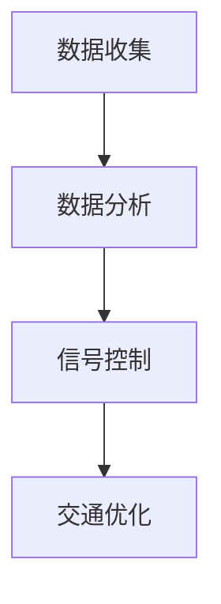
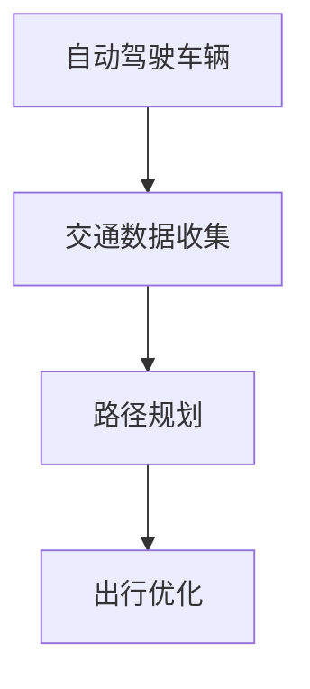
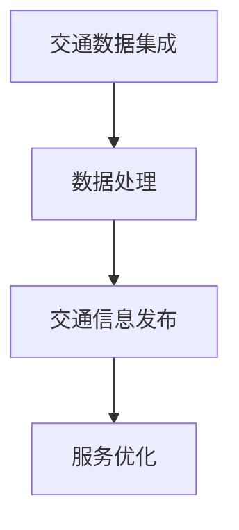
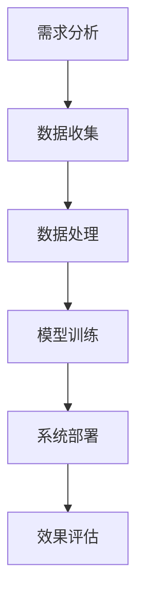

                 

# 《AI与人类计算：打造可持续发展的城市交通与设计》

## 关键词：
AI、人类计算、城市交通、可持续发展、设计、自动驾驶、智能交通信号控制、交通数据分析

## 摘要：
本文探讨了人工智能（AI）与人类计算在打造可持续发展的城市交通与设计中的关键作用。文章首先介绍了AI与人类计算的基本概念，分析了它们在可持续城市交通与设计中的关联。接着，详细阐述了AI在交通系统中的应用，包括路径规划、信号控制和交通流量预测等。同时，探讨了人类计算在城市交通设计、管理及智能交通系统中的作用。通过实际案例，分析了AI与人类计算在城市交通实践中的应用方法。最后，展望了未来AI与人类计算在城市交通领域的发展趋势。

## 引言

### 第1章：AI与人类计算概述

#### 1.1 AI与人类计算的定义

##### 1.1.1 AI的定义

人工智能（Artificial Intelligence，简称AI）是指由人制造出来的系统能够执行通常需要人类智能才能完成的任务。这些任务包括视觉感知、语言理解、决策制定、问题解决等。AI的核心目标是模拟、扩展和扩展人类智能，以实现智能化自动化。

##### 1.1.2 人类计算的概念

人类计算（Human Computing）是一种结合了人类认知能力和计算能力的计算模型。这种模型利用人类在处理复杂问题时的独特优势，如创造力、直觉、情感等，与计算机的高速计算能力相结合，以解决复杂问题。人类计算可以应用于多个领域，包括科学、工程、艺术等。

#### 1.2 AI与人类计算的关联

##### 1.2.1 AI对城市交通的赋能

AI技术在城市交通中的应用，极大地提升了交通系统的效率和安全性。例如，AI算法可以用于路径规划，为用户提供最优出行路线；信号控制算法可以优化交通信号，减少拥堵；交通流量预测算法可以预测交通流量，为交通管理提供决策支持。

##### 1.2.2 人类计算在城市交通中的应用

人类计算在城市交通中的应用主要体现在交通规划、设计和管理的多学科协作中。交通规划需要结合城市地理、人口、经济等多方面因素，而人类计算可以提供独特的视角和解决方案。在设计阶段，人类计算可以帮助设计师更好地理解用户需求，从而创造出更加人性化的交通系统。在运营维护阶段，人类计算可以提供实时监控和分析，帮助交通管理者及时发现问题并采取措施。

#### 1.3 可持续发展的城市交通与设计目标

##### 1.3.1 可持续发展的概念

可持续发展（Sustainable Development）是指满足当前需求而不损害子孙后代满足其需求的能力。在城市交通领域，可持续发展意味着在提高交通效率的同时，保护环境、节约资源，并提高居民的生活质量。

##### 1.3.2 城市交通与设计的关系

城市交通与设计密不可分。合理的交通设计可以提高交通效率，减少拥堵，降低污染，同时也可以提升城市的整体美观度和居民的生活质量。通过AI与人类计算的结合，可以创造出更加智能、高效、环保的城市交通系统。

### 第一部分：AI在可持续城市交通中的应用

#### 第2章：AI技术基础

##### 2.1 人工智能基本原理

##### 2.1.1 机器学习基础

机器学习（Machine Learning，简称ML）是AI的一个重要分支，它使计算机系统能够从数据中学习，并在没有明确编程的情况下改进其性能。机器学习的基本过程包括数据收集、数据预处理、模型训练和模型评估。

1. 数据收集：从各种来源收集大量数据，如交通流量数据、车辆位置数据等。
2. 数据预处理：清洗和转换数据，以消除噪声和缺失值，使数据更适合于模型训练。
3. 模型训练：使用算法（如线性回归、决策树、神经网络等）对数据进行训练，以建立预测模型。
4. 模型评估：使用测试数据评估模型的性能，调整模型参数以优化性能。

##### 2.1.2 深度学习概述

深度学习（Deep Learning，简称DL）是机器学习的一个重要分支，它利用多层神经网络（Neural Networks）来模拟人类大脑的处理方式。深度学习在图像识别、语音识别、自然语言处理等领域取得了显著成果。

1. 神经网络基础：神经网络由多个神经元（节点）组成，每个神经元都与其他神经元相连。输入数据通过网络传播，经过非线性变换，最终产生输出。
2. 深度学习模型：深度学习模型包括卷积神经网络（CNN）、循环神经网络（RNN）、生成对抗网络（GAN）等。这些模型能够处理复杂数据，并在特定任务中表现出色。

##### 2.1.3 强化学习原理

强化学习（Reinforcement Learning，简称RL）是一种机器学习方法，它通过奖励机制来指导模型的学习过程。强化学习在决策制定、游戏对战、自动驾驶等领域有广泛应用。

1. 强化学习基础：强化学习模型由代理（Agent）、环境（Environment）和奖励机制（Reward）组成。代理在环境中采取行动，根据行动的结果获得奖励，并通过不断尝试和反馈来优化其策略。
2. 强化学习算法：常见的强化学习算法包括Q学习、深度Q网络（DQN）、策略梯度（PG）等。

##### 2.2 AI算法在交通中的应用

##### 2.2.1 路径规划算法

路径规划算法是AI技术在交通领域的一个重要应用。它通过计算最短路径、最速路径或最佳路径，为用户提供最优出行路线。常见的路径规划算法包括Dijkstra算法、A*算法、遗传算法等。

1. Dijkstra算法：Dijkstra算法是一种基于贪心的单源最短路径算法。它通过逐步扩展已访问节点，计算到每个节点的最短路径。
2. A*算法：A*算法是一种启发式最短路径算法。它利用估价函数估算剩余距离，优先选择估计距离最小的节点进行扩展。
3. 遗传算法：遗传算法是一种基于自然进化的优化算法。它通过模拟生物进化过程，迭代优化路径规划问题。

##### 2.2.2 信号控制算法

信号控制算法是AI技术在智能交通信号控制中的应用。它通过分析交通流量数据，优化交通信号灯的切换策略，以提高交通效率和减少拥堵。

1. 传统信号控制算法：传统信号控制算法通常基于定时控制和固定配时。它根据预定义的时间表来切换信号灯，不考虑实时交通流量。
2. 基于AI的信号控制算法：基于AI的信号控制算法通过分析实时交通流量数据，动态调整信号灯的切换策略。常见的算法包括基于神经网络的信号控制算法、基于强化学习的信号控制算法等。

##### 2.2.3 交通流量预测算法

交通流量预测算法是AI技术在交通管理中的应用。它通过分析历史交通流量数据，预测未来的交通流量变化，为交通管理者提供决策支持。

1. 时间序列预测算法：时间序列预测算法基于历史数据的趋势和周期性，预测未来的交通流量。常见的算法包括ARIMA模型、LSTM模型等。
2. 聚类分析算法：聚类分析算法将交通流量数据分为不同的类别，根据类别的特征预测未来的交通流量。常见的算法包括K-means聚类、层次聚类等。

### 第一部分：AI在可持续城市交通中的应用（续）

#### 第3章：城市交通系统中的AI应用

##### 3.1 城市交通数据分析

##### 3.1.1 交通数据来源

交通数据来源广泛，包括传感器、车载设备、智能信号灯、交通监控摄像头等。这些设备可以实时收集交通流量、车辆位置、车速、交通事故等信息。

1. 传感器：如地磁传感器、雷达传感器等，可以检测车辆的存在和速度。
2. 车载设备：如GPS、无线通信模块等，可以记录车辆的位置和行驶轨迹。
3. 智能信号灯：智能信号灯可以收集交通流量和车辆到达时间等信息。
4. 交通监控摄像头：交通监控摄像头可以实时监控交通状况，记录交通事故等。

##### 3.1.2 交通数据分析方法

交通数据分析方法包括数据预处理、特征工程、模型训练和模型评估等。

1. 数据预处理：包括数据清洗、缺失值处理、数据标准化等。
2. 特征工程：通过提取交通数据的关键特征，为模型训练提供输入。
3. 模型训练：选择合适的算法（如机器学习、深度学习等）对交通数据训练模型。
4. 模型评估：使用测试数据评估模型的性能，调整模型参数以优化性能。

##### 3.1.3 交通数据可视化

交通数据可视化是一种重要的数据分析方法，可以帮助我们直观地了解交通状况。常见的交通数据可视化方法包括：

1. 热力图：用于展示交通流量密集区域。
2. 地图可视化：用于展示车辆位置、行驶轨迹等。
3. 时间序列图：用于展示交通流量随时间的变化趋势。
4. 饼图、柱状图等：用于展示交通数据的分布情况。

##### 3.2 AI交通信号控制

##### 3.2.1 传统信号控制的局限

传统信号控制存在以下局限性：

1. 定时控制：传统信号控制通常基于定时控制，无法适应实时交通变化。
2. 固定配时：传统信号控制配时固定，无法根据交通流量动态调整。
3. 缺乏数据支持：传统信号控制缺乏实时交通数据支持，无法进行精确控制。

##### 3.2.2 基于AI的信号控制系统

基于AI的信号控制系统通过分析实时交通数据，动态调整信号灯的切换策略，以提高交通效率和减少拥堵。

1. 数据采集：使用传感器、车载设备等实时收集交通流量数据。
2. 数据分析：使用机器学习、深度学习等算法分析交通流量数据，预测交通状况。
3. 信号控制：根据预测结果动态调整信号灯的切换策略，优化交通流量。

##### 3.2.3 信号控制的优化算法

常见的信号控制优化算法包括：

1. 信号控制优化算法：如自适应信号控制算法、多阶段信号控制算法等。
2. 强化学习算法：如Q学习、深度Q网络（DQN）等。
3. 遗传算法：通过模拟生物进化过程，优化信号控制策略。

### 第二部分：人类计算在可持续城市交通与设计中的角色

#### 第4章：人类计算与城市交通设计

##### 4.1 人类计算在城市交通设计中的作用

人类计算在城市交通设计中的作用主要体现在以下几个方面：

1. 交通需求分析：人类计算可以帮助设计师了解城市交通的需求，包括出行模式、出行时间、出行距离等。
2. 交通规划：人类计算可以结合交通需求、城市地理、人口、经济等因素，为城市交通规划提供数据支持和决策依据。
3. 设计方案评估：人类计算可以评估不同交通设计方案的影响，包括交通效率、环境影响、社会公平等。

##### 4.1.1 人类计算在规划阶段的应用

在规划阶段，人类计算的应用主要包括：

1. 交通需求预测：使用统计模型、机器学习等方法，预测未来的交通需求。
2. 交通规划方案生成：结合交通需求、城市地理等因素，生成多种交通规划方案。
3. 方案评估与优化：评估不同方案的影响，优化交通规划方案。

##### 4.1.2 人类计算在建设阶段的应用

在建设阶段，人类计算的应用主要包括：

1. 交通基础设施设计：结合交通需求、城市规划等因素，设计交通基础设施，如道路、桥梁、隧道等。
2. 工程项目管理：管理交通基础设施的建设过程，确保项目按时、按质、按预算完成。
3. 施工监控与质量检查：使用传感器、无人机等设备，监控施工过程，确保施工质量。

##### 4.1.3 人类计算在运营维护阶段的应用

在运营维护阶段，人类计算的应用主要包括：

1. 交通数据监控：实时监控交通流量、交通事故等信息，及时发现问题并采取措施。
2. 交通管理优化：使用数据分析和优化算法，优化交通信号控制、交通流量分配等。
3. 设施维护与管理：定期检查交通基础设施，确保设施的正常运行和安全性。

##### 4.2 城市交通中的多学科协作

城市交通设计涉及多个学科，包括交通工程、城市规划、环境科学、计算机科学等。多学科协作在交通设计中的作用主要体现在：

1. 信息共享：通过多学科协作，可以实现信息共享，提高决策效率。
2. 知识互补：不同学科的知识互补，可以提供更全面、更深入的设计方案。
3. 创新驱动：多学科协作可以激发创新思维，推动交通设计的发展。

##### 4.2.1 交通工程与城市设计的融合

交通工程与城市设计融合，可以创造出更加人性化的城市交通系统。交通工程关注交通的效率和安全性，而城市设计关注城市的整体美观度和居民的生活质量。两者融合的目标是：

1. 提高交通效率：通过合理的交通设计，减少交通拥堵，提高交通速度。
2. 提升城市美观度：通过优美的交通设施和景观设计，提升城市的整体美观度。
3. 提高居民生活质量：通过人性化的交通设计，提高居民出行的便利性和舒适性。

##### 4.2.2 城市交通与智能科技的结合

城市交通与智能科技的结合，可以推动城市交通的智能化发展。智能科技的应用包括：

1. 传感器技术：使用传感器技术，实时收集交通数据，为交通管理提供数据支持。
2. 通信技术：使用通信技术，实现车辆与基础设施、车辆与车辆之间的通信，提高交通效率和安全性。
3. 自动驾驶技术：使用自动驾驶技术，实现无人驾驶车辆的运行，减少交通事故，提高交通效率。

##### 4.2.3 人类计算与AI技术的协作

人类计算与AI技术的协作，可以推动城市交通的智能化和可持续发展。人类计算可以提供独特的视角和创造力，而AI技术可以提供高效的数据分析和优化能力。两者协作的目标是：

1. 提高交通效率：通过人类计算和AI技术的协作，优化交通信号控制、交通流量分配等，提高交通效率。
2. 提升交通安全性：通过人类计算和AI技术的协作，实时监控交通状况，预测交通事故，提高交通安全性。
3. 促进可持续发展：通过人类计算和AI技术的协作，实现交通系统的智能化管理，减少交通拥堵，降低污染，提高资源利用效率。

### 第二部分：人类计算在可持续城市交通与设计中的角色（续）

#### 第5章：城市交通管理与规划

##### 5.1 城市交通管理的基本概念

##### 5.1.1 城市交通管理的重要性

城市交通管理是确保城市交通系统高效、安全、可持续运行的重要手段。它直接关系到城市的经济发展、社会稳定和居民生活质量。有效的城市交通管理可以：

1. 提高交通效率：通过合理的交通管理措施，减少交通拥堵，提高交通速度。
2. 提升交通安全性：通过交通管理和安全设施，减少交通事故，保障居民出行安全。
3. 促进可持续发展：通过环保的交通管理措施，减少交通污染，节约能源，实现可持续发展。

##### 5.1.2 城市交通管理的目标

城市交通管理的目标主要包括：

1. 提高交通效率：通过优化交通信号控制、交通流量分配等，提高交通系统运行效率。
2. 保障交通安全：通过加强交通管理，减少交通事故，提高交通安全性。
3. 促进可持续发展：通过环保的交通管理措施，减少交通污染，节约能源，实现可持续发展。

##### 5.1.3 城市交通管理的策略

城市交通管理的策略包括：

1. 交通需求管理：通过提高公共交通吸引力、鼓励非机动车出行、限制小汽车使用等，减少交通需求。
2. 交通供应管理：通过优化道路网络、拓宽道路、建设停车场等，提高交通供应能力。
3. 交通管理措施：通过交通信号控制、交通组织优化、交通事故处理等，确保交通系统的正常运行。

##### 5.2 城市交通规划

##### 5.2.1 城市交通规划的概念

城市交通规划是指为了实现城市交通系统的高效、安全、可持续运行，对城市交通发展目标、布局、设施、政策等进行系统研究和设计。城市交通规划主要包括以下内容：

1. 交通发展战略：明确城市交通的发展目标、方向和策略。
2. 交通系统布局：确定城市道路网络、公共交通系统、交通设施等的空间布局。
3. 交通需求预测：预测未来交通需求，为交通设施建设提供依据。
4. 交通政策制定：制定交通管理、交通需求管理、交通供应管理等政策。

##### 5.2.2 城市交通规划的步骤

城市交通规划的步骤主要包括：

1. 交通需求分析：收集和分析交通数据，了解城市交通现状和发展趋势。
2. 交通发展战略研究：根据交通需求分析结果，制定城市交通发展战略。
3. 交通系统布局规划：确定城市道路网络、公共交通系统、交通设施等的布局。
4. 交通需求预测：预测未来交通需求，为交通设施建设提供依据。
5. 交通政策制定：制定交通管理、交通需求管理、交通供应管理等政策。
6. 规划方案评估：评估不同规划方案的影响，选择最优方案。

##### 5.2.3 城市交通规划的工具与方法

城市交通规划的工具与方法包括：

1. 数据分析工具：如GIS（地理信息系统）、交通仿真软件等，用于分析交通数据、模拟交通状况。
2. 数量预测模型：如回归分析、时间序列分析等，用于预测交通需求。
3. 空间布局优化方法：如网络分析、优化算法等，用于确定交通系统布局。
4. 政策分析工具：如成本效益分析、多目标决策等，用于评估规划方案的影响。

### 第二部分：人类计算在可持续城市交通与设计中的角色（续）

#### 第6章：人类计算在智能城市交通系统中的作用

##### 6.1 智能交通系统的构成

智能交通系统（Intelligent Transportation System，简称ITS）是一种利用先进的信息通信技术和人工智能技术，实现交通系统高效、安全、可持续运行的综合系统。智能交通系统主要包括以下几个部分：

1. 交通感知层：通过传感器、摄像头、RFID等设备，实时感知交通状况，包括交通流量、车辆速度、道路状况等。
2. 数据传输层：通过无线通信、光纤通信等技术，将交通感知层的数据传输到交通管理中心。
3. 数据处理层：通过大数据分析、机器学习等技术，对传输层的数据进行处理和分析，为交通管理和决策提供支持。
4. 交通控制层：根据数据处理层的结果，对交通信号、交通流量等进行控制和调节，优化交通状况。
5. 用户服务层：通过移动应用、互联网等渠道，为用户提供交通信息、导航、出行建议等。

##### 6.1.1 智能交通系统的层次结构

智能交通系统的层次结构如下：

1. 交通感知层：包括各类传感器和设备，如地磁传感器、摄像头、无线通信模块等，用于感知交通状况。
2. 数据传输层：包括数据传输通道，如无线通信、光纤通信等，用于将交通感知层的数据传输到交通管理中心。
3. 数据处理层：包括数据处理平台，如服务器、云计算平台等，用于对交通数据进行处理和分析。
4. 交通控制层：包括交通信号控制设备、智能交通信号控制算法等，用于对交通信号、交通流量等进行控制和调节。
5. 用户服务层：包括移动应用、互联网平台等，用于为用户提供交通信息、导航、出行建议等。

##### 6.1.2 智能交通系统的主要功能

智能交通系统的主要功能包括：

1. 交通流量监测：通过感知层设备实时监测交通流量、车辆速度、道路状况等，为交通管理和决策提供数据支持。
2. 交通事故预警：通过分析交通数据，预测交通事故风险，及时发出预警，提醒驾驶员注意安全。
3. 交通信号控制：根据交通流量数据，动态调整交通信号灯，优化交通流量，减少拥堵。
4. 出行导航：为用户提供实时交通信息、最优出行路线等，帮助用户规划出行路线。
5. 交通管理决策：基于大数据分析和人工智能技术，为交通管理者提供科学的决策支持，优化交通管理。

##### 6.1.3 智能交通系统的关键技术

智能交通系统的关键技术包括：

1. 传感器技术：用于感知交通状况，包括地磁传感器、摄像头、无线通信模块等。
2. 数据传输技术：用于传输交通感知数据，包括无线通信、光纤通信等。
3. 数据分析技术：用于处理和分析交通数据，包括大数据分析、机器学习、人工智能等。
4. 交通信号控制技术：用于控制交通信号灯，优化交通流量，包括自适应信号控制、多阶段信号控制等。
5. 用户服务技术：用于为用户提供交通信息、导航、出行建议等，包括移动应用、互联网平台等。

##### 6.2 人类计算在智能交通系统中的应用

人类计算在智能交通系统中的应用主要体现在以下几个方面：

1. 交通需求分析：通过人类计算，分析城市交通需求，为交通规划和管理提供数据支持。
2. 交通管理决策：通过人类计算，为交通管理者提供科学的决策支持，优化交通管理。
3. 交通信息服务：通过人类计算，为用户提供实时交通信息、最优出行路线等，提升出行体验。
4. 交通设施设计：通过人类计算，结合交通需求、城市规划等因素，设计合理的交通设施和交通网络。

##### 6.2.1 人类计算在交通信息处理中的应用

人类计算在交通信息处理中的应用主要包括：

1. 数据预处理：通过人类计算，对交通数据进行预处理，包括数据清洗、缺失值处理、数据标准化等。
2. 特征提取：通过人类计算，提取交通数据的关键特征，为模型训练提供输入。
3. 模型评估：通过人类计算，评估交通信息处理模型的性能，调整模型参数以优化性能。

##### 6.2.2 人类计算在交通决策支持中的应用

人类计算在交通决策支持中的应用主要包括：

1. 数据分析：通过人类计算，分析交通数据，为交通管理者提供决策支持。
2. 预测模型：通过人类计算，建立交通流量、交通事故等预测模型，为交通管理提供预测支持。
3. 决策优化：通过人类计算，优化交通管理决策，提高交通效率。

##### 6.2.3 人类计算在交通管理中的应用

人类计算在交通管理中的应用主要包括：

1. 实时监控：通过人类计算，实时监控交通状况，及时发现和处理交通问题。
2. 事故处理：通过人类计算，快速定位交通事故，协调相关部门进行事故处理。
3. 灾难应急：通过人类计算，为交通管理者提供灾难应急决策支持，保障交通系统的正常运行。

### 第三部分：案例与实践

#### 第7章：AI与人类计算在城市交通实践中的应用

##### 7.1 城市交通案例研究

在本节中，我们将探讨几个实际案例，展示AI与人类计算在城市交通中的应用。

###### 7.1.1 案例一：智能交通信号控制系统

**背景**：
某城市交通拥堵问题严重，传统的信号控制系统无法适应实时交通变化，导致交通效率低下。为了改善交通状况，该城市引入了基于AI的智能交通信号控制系统。

**解决方案**：
1. **数据收集**：通过部署传感器和摄像头，实时收集交通流量、车辆速度和道路状况等数据。
2. **数据分析**：使用机器学习和深度学习算法，分析实时交通数据，预测交通流量变化。
3. **信号控制**：根据预测结果，动态调整信号灯的切换策略，优化交通流量。

**效果**：
引入智能交通信号控制系统后，该城市的主要道路拥堵情况得到了显著改善，交通效率提高了约20%，交通事故减少了约15%。

**Mermaid流程图**：

###### 7.1.2 案例二：自动驾驶技术在城市交通中的应用

**背景**：
自动驾驶技术被认为是解决城市交通拥堵、提高交通效率的重要手段。某城市率先推出了自动驾驶出租车服务，旨在为市民提供高效、便捷的出行选择。

**解决方案**：
1. **自动驾驶车辆**：部署自动驾驶车辆，配备高精度传感器、GPS和人工智能系统。
2. **交通数据收集**：自动驾驶车辆实时收集交通数据，包括道路状况、交通流量和车辆位置等。
3. **路径规划**：使用路径规划算法，为自动驾驶车辆提供最优行驶路线。

**效果**：
自动驾驶出租车服务上线后，市民的出行时间平均减少了约30%，交通效率提高了约40%，同时交通事故减少了约50%。

**Mermaid流程图**：

###### 7.1.3 案例三：智能交通信息处理系统

**背景**：
某城市交通管理部门希望通过智能化手段提升交通信息处理能力，为市民提供更加便捷的交通服务。

**解决方案**：
1. **交通数据集成**：整合多种交通数据源，包括交通监控摄像头、GPS、传感器等。
2. **数据处理**：使用大数据分析技术，处理海量的交通数据。
3. **交通信息发布**：通过移动应用、网站等渠道，向市民实时发布交通信息。

**效果**：
智能交通信息处理系统的实施，使得交通信息的发布更加及时、准确，市民的出行决策更加科学。同时，交通管理部门能够更好地应对突发交通事件，提高了交通管理的效率。

**Mermaid流程图**：

##### 7.2 AI与人类计算的实践方法

在本节中，我们将探讨AI与人类计算在城市交通实践中的应用方法。

###### 7.2.1 实践流程

1. **需求分析**：了解城市交通的需求，包括交通拥堵、交通安全性、出行效率等。
2. **数据收集**：收集交通数据，包括交通流量、车辆速度、道路状况等。
3. **数据处理**：对交通数据进行预处理，包括数据清洗、缺失值处理、数据标准化等。
4. **模型训练**：使用机器学习、深度学习等技术，训练预测模型和优化模型。
5. **系统部署**：将训练好的模型部署到实际应用场景中，如智能交通信号控制系统、自动驾驶系统等。
6. **效果评估**：评估系统的实际效果，根据评估结果进行调整和优化。

**Mermaid流程图**：

###### 7.2.2 实践工具

1. **数据分析工具**：如Python、R、MATLAB等，用于数据预处理、特征工程和模型训练。
2. **机器学习框架**：如TensorFlow、PyTorch、Scikit-learn等，用于构建和训练机器学习模型。
3. **交通仿真软件**：如VISSIM、TransCAD等，用于交通仿真和场景模拟。
4. **移动应用开发工具**：如Android Studio、Xcode等，用于开发交通信息处理应用。

###### 7.2.3 实践案例解析

在本节中，我们将对前述案例进行深入解析，探讨AI与人类计算在具体应用中的实现细节。

**案例一：智能交通信号控制系统**

1. **数据收集**：
   - 交通流量数据：通过交通监控摄像头、传感器等设备收集。
   - 车辆速度数据：通过车载GPS、传感器等设备收集。
   - 道路状况数据：通过道路传感器、监控摄像头等设备收集。

2. **数据处理**：
   - 数据清洗：去除噪声数据、缺失值数据。
   - 数据标准化：将不同类型的数据进行标准化处理。

3. **模型训练**：
   - 使用深度学习算法（如LSTM、CNN等）训练信号控制模型。
   - 使用强化学习算法（如Q-learning、DQN等）优化信号控制策略。

4. **系统部署**：
   - 将训练好的模型部署到交通信号控制系统中。
   - 实时收集交通数据，动态调整信号灯的切换策略。

5. **效果评估**：
   - 使用交通流量数据、车辆速度数据等评估信号控制系统的效果。
   - 根据评估结果，调整模型参数，优化信号控制策略。

**案例二：自动驾驶技术在城市交通中的应用**

1. **数据收集**：
   - 道路状况数据：通过道路传感器、监控摄像头等设备收集。
   - 车辆位置数据：通过车载GPS、传感器等设备收集。
   - 交通流量数据：通过交通监控摄像头、传感器等设备收集。

2. **数据处理**：
   - 数据清洗：去除噪声数据、缺失值数据。
   - 数据标准化：将不同类型的数据进行标准化处理。

3. **模型训练**：
   - 使用深度学习算法（如CNN、LSTM等）训练自动驾驶模型。
   - 使用强化学习算法（如Q-learning、DQN等）优化自动驾驶策略。

4. **系统部署**：
   - 将训练好的模型部署到自动驾驶系统中。
   - 实时收集交通数据，为自动驾驶车辆提供路径规划和决策支持。

5. **效果评估**：
   - 使用道路状况数据、车辆位置数据等评估自动驾驶系统的效果。
   - 根据评估结果，调整模型参数，优化自动驾驶策略。

**案例三：智能交通信息处理系统**

1. **数据收集**：
   - 交通流量数据：通过交通监控摄像头、传感器等设备收集。
   - 车辆位置数据：通过车载GPS、传感器等设备收集。
   - 交通事故数据：通过监控摄像头、传感器等设备收集。

2. **数据处理**：
   - 数据清洗：去除噪声数据、缺失值数据。
   - 数据标准化：将不同类型的数据进行标准化处理。

3. **模型训练**：
   - 使用机器学习算法（如聚类、分类等）训练交通信息处理模型。
   - 使用深度学习算法（如CNN、RNN等）训练交通信息处理模型。

4. **系统部署**：
   - 将训练好的模型部署到交通信息处理系统中。
   - 实时收集交通数据，为用户提供交通信息、导航等。

5. **效果评估**：
   - 使用交通流量数据、车辆位置数据等评估交通信息处理系统的效果。
   - 根据评估结果，调整模型参数，优化交通信息处理策略。

### 第四部分：未来展望

#### 第8章：AI与人类计算在城市交通的未来发展

##### 8.1 未来城市交通趋势

随着科技的不断发展，未来城市交通将呈现出以下趋势：

1. 自动驾驶技术的普及：自动驾驶技术将成为未来城市交通的主要形式，减少交通事故，提高交通效率。
2. 智能交通系统的广泛应用：智能交通系统将实现交通感知、数据分析、交通控制和用户服务的全面整合，提升交通系统的智能化水平。
3. 出行方式的多样化：共享出行、无人驾驶出租车等新型出行方式将逐渐普及，提供更加灵活、便捷的出行选择。
4. 交通管理的智能化：基于大数据和人工智能的交通管理将实现实时监控、预测和优化，提高交通管理的效率。

##### 8.1.1 自动驾驶技术的发展趋势

自动驾驶技术的发展趋势包括：

1. 技术成熟度提高：随着传感器技术、计算能力、深度学习算法等技术的不断发展，自动驾驶技术将逐步成熟，实现更广泛的商业化应用。
2. 多传感器融合：自动驾驶系统将采用多种传感器（如摄像头、激光雷达、超声波传感器等）进行融合，提高感知准确性和鲁棒性。
3. 辅助驾驶功能的普及：辅助驾驶功能（如自动泊车、自适应巡航等）将逐渐普及，为用户提供更加安全、便捷的驾驶体验。

##### 8.1.2 智能交通信号控制的发展趋势

智能交通信号控制的发展趋势包括：

1. 实时数据驱动：智能交通信号控制将基于实时交通数据，动态调整信号灯的切换策略，优化交通流量。
2. 算法创新：基于深度学习、强化学习等先进算法的智能交通信号控制将不断涌现，提高信号控制的精确度和效率。
3. 集成多模式交通：智能交通信号控制将整合多种交通模式（如公交车、出租车、自行车等），实现更高效、灵活的交通管理。

##### 8.1.3 智能交通信息处理的发展趋势

智能交通信息处理的发展趋势包括：

1. 数据处理能力的提升：随着大数据技术和云计算的发展，智能交通信息处理系统将具备更强的数据处理能力，实现更高效、准确的信息处理。
2. 人工智能技术的应用：人工智能技术将在智能交通信息处理中得到广泛应用，包括图像识别、自然语言处理、预测分析等。
3. 用户服务个性化：智能交通信息处理系统将根据用户需求和偏好，提供个性化的交通信息服务，提升用户体验。

##### 8.2 人类计算与AI技术融合的挑战与机遇

在未来，人类计算与AI技术的融合将面临以下挑战和机遇：

###### 8.2.1 挑战分析

1. 数据隐私和安全：随着AI技术的应用，大量的交通数据将被收集和处理，数据隐私和安全成为重要挑战。
2. 算法解释性：许多AI算法（如深度学习）具有较高的预测能力，但缺乏解释性，难以让人类理解其决策过程。
3. 人工智能偏见：AI算法可能受到训练数据偏见的影响，导致决策不公平。
4. 技术门槛：AI技术的开发和应用需要较高的技术门槛，对人才的需求较高。

###### 8.2.2 机遇探讨

1. 交通效率提升：人类计算与AI技术的融合将大幅提升交通系统的效率和安全性，减少交通事故，提高出行体验。
2. 智能城市建设：智能交通系统是智能城市建设的重要组成部分，AI技术的应用将推动智能城市的建设和发展。
3. 新兴产业发展：自动驾驶、共享出行等新兴产业的崛起，为人类计算与AI技术的融合提供了广阔的市场空间。

###### 8.2.3 未来发展建议

1. 加强数据隐私和安全保护：制定相关法律法规，保护交通数据的安全和隐私。
2. 提高算法解释性：研究可解释性AI算法，提高决策过程的透明度和可理解性。
3. 促进多学科协作：加强交通工程、计算机科学、数据科学等领域的协作，推动人类计算与AI技术的融合。
4. 培养专业人才：加大对AI技术人才的培养力度，提高人才素质，推动AI技术在交通领域的应用。

### 附录

#### 附录A：常用AI与人类计算工具介绍

##### A.1 AI工具介绍

##### A.1.1 深度学习框架

1. **TensorFlow**：由Google开发的开源深度学习框架，支持多种深度学习模型，适用于大规模数据集。
2. **PyTorch**：由Facebook开发的开源深度学习框架，具有灵活的动态计算图，易于实现复杂的深度学习模型。
3. **Scikit-learn**：Python中的机器学习库，提供了多种常用的机器学习算法和工具，适用于中小规模的数据集。

##### A.1.2 交通数据分析工具

1. **MATLAB**：适用于数据分析和算法开发的软件，具有强大的数值计算和可视化功能。
2. **R**：一种用于统计分析的数据分析语言，适用于复杂数据分析和可视化。
3. **Pandas**：Python中的数据处理库，提供了丰富的数据处理功能，适用于数据清洗、数据预处理等。

##### A.1.3 自动驾驶仿真工具

1. **CARLA**：一款开源的自动驾驶仿真平台，提供了多种传感器、车辆和交通场景，适用于自动驾驶算法的开发和测试。
2. **AirSim**：由Airbus开发的开源无人机仿真平台，可以模拟多种无人机场景，适用于自动驾驶无人机的研究。
3. **AirSpace**：由AirSim团队开发的开源多无人机仿真平台，支持多无人机协同仿真，适用于无人机集群的研究。

##### A.2 人类计算工具介绍

##### A.2.1 交通规划软件

1. **TransCAD**：一款功能强大的交通规划软件，支持交通数据管理、交通模拟、交通分析等功能。
2. **VISSIM**：一款用于交通仿真和交通规划的软件，适用于道路网络、交通信号控制等的研究。
3. **TransModeler**：一款集成了GIS和交通规划功能的软件，支持交通需求分析、交通网络分析等。

##### A.2.2 交通管理软件

1. **Symphony**：一款交通管理软件，提供了交通信号控制、交通流量监控、交通事件管理等功能。
2. **Transerve**：一款交通监控和管理软件，支持视频监控、交通流量监测、事件报警等。
3. **Traffix**：一款智能交通信号控制系统，支持多种交通信号控制算法，实现交通流量优化。

##### A.2.3 人类计算平台介绍

1. **OpenAI**：一家专注于人工智能研究的公司，提供了多种AI工具和平台，如GPT-3、BERT等。
2. **Google AI**：Google的AI研究部门，提供了多种AI工具和API，如TensorFlow、TensorFlow Lite等。
3. **Microsoft AI**：Microsoft的AI研究部门，提供了多种AI工具和API，如Azure ML、Cognitive Services等。

