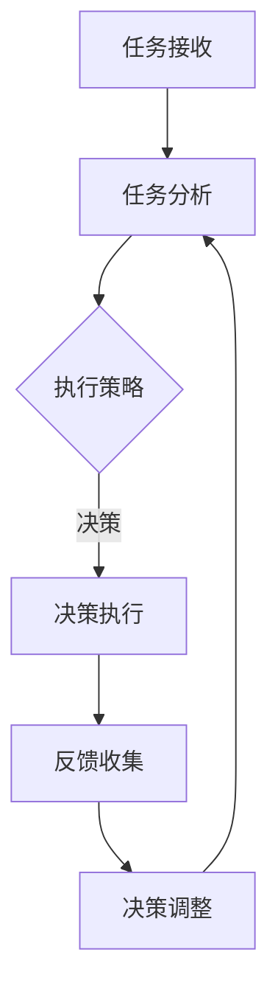

                 

## AI人工智能代理工作流 AI Agent WorkFlow：反馈的获取与处理

### 摘要

本文将深入探讨AI人工智能代理工作流（AI Agent WorkFlow）的核心环节：反馈的获取与处理。AI代理通过不断地收集内外部反馈，进行自我优化和调整，以实现更高效的任务执行和智能决策。本文首先介绍了AI代理的基本概念和分类，随后详细阐述了反馈的类型、来源、获取和处理方法，以及反馈驱动的代理优化。接着，文章分析了AI代理的决策过程、协同工作模式以及安全性和伦理问题。最后，通过实际案例分析，展示了AI代理在智能客服系统、智能供应链管理、智能家居控制系统和智能医疗诊断系统等领域的应用，展望了AI代理的未来发展趋势。

### 第一部分：AI人工智能代理工作流基础理论

#### 第1章：AI人工智能代理概述

##### 1.1 AI人工智能代理的定义与分类

AI人工智能代理（AI Agent）是指能够模拟人类智能行为，自主完成特定任务，并具有适应性和学习能力的人工智能系统。根据功能和应用场景，AI代理可分为以下几类：

1. **任务型代理**：专注于完成特定任务的代理，如智能客服、智能推荐系统等。
2. **社交型代理**：具备社交能力，能够在社交网络中与其他代理或人类进行互动的代理，如聊天机器人、社交媒体管理代理等。
3. **自主型代理**：具备独立思考和决策能力，能够在复杂环境中自主行动的代理，如自动驾驶汽车、智能机器人等。
4. **混合型代理**：同时具备任务型、社交型和自主型代理的特点，能够在多个领域和场景中发挥作用的代理。

##### 1.2 代理工作流的基本概念

代理工作流（Agent WorkFlow）是指AI代理在完成任务过程中所遵循的一系列步骤和流程。一个典型的代理工作流包括以下几个环节：

1. **任务接收**：代理接收任务请求，明确任务目标和要求。
2. **任务分析**：代理对任务进行分析，确定所需资源和执行策略。
3. **任务执行**：代理根据分析结果执行任务，可能涉及多步骤或子任务的分解和执行。
4. **反馈收集**：代理在执行任务过程中，收集内外部反馈，以便进行后续的优化和调整。
5. **决策与调整**：代理根据反馈结果，对执行策略和任务目标进行调整，以提高任务完成效果。

##### 1.3 AI代理与传统代理的区别

传统代理通常是指基于规则和预设指令的自动执行系统，其行为和决策受到人类预设的约束。相比之下，AI代理具有以下几个显著区别：

1. **自适应能力**：AI代理能够根据环境和任务变化，自适应地调整自身行为和决策，以实现更好的任务完成效果。
2. **学习能力**：AI代理具备从数据中学习、积累经验的能力，能够不断提升自身的性能和智能水平。
3. **智能决策**：AI代理能够基于数据分析和机器学习算法，进行智能化的决策和优化，而不仅仅是执行预设的指令。
4. **泛化能力**：AI代理能够在不同领域和场景中应用，具备较强的泛化能力，而传统代理通常局限于特定领域。

##### 1.4 AI代理在行业中的应用

AI代理在多个行业中已经展现出巨大的应用潜力，以下是一些典型应用场景：

1. **智能客服**：AI代理能够自动处理客户咨询，提供个性化服务，降低人力成本，提高客户满意度。
2. **智能供应链管理**：AI代理能够优化供应链各个环节，提高物流效率，降低库存成本。
3. **智能家居控制系统**：AI代理能够智能地控制家居设备，提高生活品质，降低能源消耗。
4. **智能医疗诊断系统**：AI代理能够辅助医生进行疾病诊断，提高诊断准确率，缩短诊断时间。

#### 第2章：反馈的获取与处理

##### 2.1 反馈的类型与来源

反馈是AI代理工作流中的重要环节，其类型和来源直接影响代理的性能和效果。反馈主要可分为以下几种类型：

1. **任务完成反馈**：反映代理执行任务的效果和结果，如任务完成时间、准确性、资源利用率等。
2. **用户满意度反馈**：反映用户对代理服务或产品的满意度，如用户体验、服务质量、用户忠诚度等。
3. **系统性能反馈**：反映代理系统内部性能指标，如响应时间、负载能力、错误率等。
4. **环境变化反馈**：反映代理所处环境的变化，如天气、交通状况、市场动态等。

反馈来源主要分为两类：

1. **内部反馈**：来自代理系统内部的数据和指标，如任务完成情况、系统性能等。
2. **外部反馈**：来自外部环境或用户的数据和指标，如用户满意度、环境变化等。

##### 2.2 反馈的获取方法

获取反馈是代理优化和调整的重要基础，以下是一些常见的反馈获取方法：

1. **传感器和数据采集**：利用各种传感器和采集设备，获取环境数据和用户行为数据。
2. **用户交互**：通过用户界面和交互，获取用户对代理服务或产品的反馈。
3. **日志和分析**：分析代理系统的日志和性能数据，获取系统运行状态和性能指标。
4. **数据挖掘和机器学习**：通过数据挖掘和机器学习算法，从大量数据中提取有价值的信息和模式。

##### 2.3 反馈的处理与分析

获取反馈后，需要对反馈进行处理和分析，以指导代理的优化和调整。以下是一些常见的处理和分析方法：

1. **数据预处理**：对反馈数据进行清洗、归一化、降维等处理，以提高数据质量和分析效率。
2. **特征提取**：从反馈数据中提取关键特征，以表示反馈的主要信息和趋势。
3. **统计分析**：使用统计学方法，分析反馈数据的分布、相关性、异常值等特性。
4. **机器学习建模**：利用机器学习算法，建立反馈与任务完成效果之间的模型，以预测和优化代理性能。

##### 2.4 反馈驱动的代理优化

反馈驱动的代理优化是指通过不断收集和分析反馈，调整代理的执行策略和任务目标，以实现持续优化和提升。以下是一些常见的反馈驱动优化方法：

1. **自适应调整**：根据反馈结果，自动调整代理的参数和策略，以适应不同环境和任务需求。
2. **目标优化**：通过调整任务目标，使代理在特定目标上取得更好的效果。
3. **多目标优化**：同时考虑多个目标，平衡代理在不同目标上的表现。
4. **迭代优化**：通过多次迭代反馈和优化，逐步提升代理的性能和效果。

#### 第3章：AI代理的决策过程

##### 3.1 决策过程的基本框架

AI代理的决策过程是其工作流中的核心环节，决策过程的基本框架通常包括以下几个步骤：

1. **问题定义**：明确代理需要解决的问题和目标。
2. **信息收集**：收集与问题相关的各种信息和数据。
3. **方案生成**：根据问题和信息，生成可能的解决方案或行动方案。
4. **评估与选择**：评估各个方案的效果和可行性，选择最优方案。
5. **执行与反馈**：执行决策方案，并收集反馈信息，为后续决策提供依据。

##### 3.2 决策算法与模型

决策过程涉及到多个算法和模型，以下是一些常见的决策算法和模型：

1. **决策树算法**：通过树形结构对数据进行分类和回归，用于分类和回归任务。
2. **贝叶斯网络算法**：基于贝叶斯理论，构建概率图模型，用于不确定性推理和预测。
3. **支持向量机算法**：通过找到一个最佳的超平面，将数据分为不同的类别，用于分类任务。
4. **神经网络算法**：模拟人脑神经元之间的连接和信号传递，用于复杂模式识别和预测。

##### 3.3 决策过程中的不确定性处理

在决策过程中，不确定性是一个重要因素，需要通过以下方法进行处理：

1. **概率推理**：使用概率论和统计学方法，对不确定事件进行概率估计和推理。
2. **模糊推理**：使用模糊集合和模糊逻辑，处理模糊性和不确定性问题。
3. **证据理论**：基于证据理论，对不确定信息进行综合和推理。
4. **机器学习**：利用机器学习算法，通过学习数据中的模式，降低不确定性。

##### 3.4 决策过程的优化

优化决策过程可以提高代理的性能和效果，以下是一些常见的决策过程优化方法：

1. **启发式搜索**：使用启发式方法，快速找到近似最优解。
2. **多目标优化**：同时考虑多个目标，找到平衡最优解。
3. **强化学习**：通过试错和反馈，逐步优化决策过程。
4. **混合智能**：结合不同算法和模型，提高决策过程的鲁棒性和准确性。

#### 第4章：AI代理的协同工作

##### 4.1 代理之间的通信与协作

代理之间的协同工作是实现复杂任务和智能系统的重要手段，以下是一些常见的通信与协作机制：

1. **消息传递**：通过消息传递机制，实现代理之间的数据交换和通信。
2. **共享内存**：通过共享内存机制，实现代理之间的数据共享和协作。
3. **事件驱动**：基于事件驱动机制，实现代理之间的实时响应和协作。
4. **同步与异步**：通过同步和异步机制，实现代理之间的协作和任务调度。

##### 4.2 多代理系统的设计与实现

多代理系统是指由多个代理组成的复杂系统，其设计与实现需要考虑以下几个方面：

1. **系统架构**：设计多代理系统的整体架构，包括代理之间的通信、协调和调度机制。
2. **代理角色**：定义代理的角色和任务，明确代理之间的协作关系和任务分配。
3. **数据管理**：设计数据管理机制，实现代理之间的数据共享和协作。
4. **安全性与可靠性**：确保多代理系统的安全性和可靠性，防止恶意攻击和错误传播。

##### 4.3 代理协同的工作模式

代理协同的工作模式可以分为以下几种：

1. **集中式协同**：所有代理集中在一个中央控制器下，统一协调和调度任务。
2. **分布式协同**：代理分散在不同节点上，通过通信和协调机制实现协同工作。
3. **混合式协同**：结合集中式和分布式协同的优点，实现更灵活和高效的协同工作。
4. **自组织协同**：代理通过自组织和自学习，自主协调和完成任务。

##### 4.4 代理协同中的挑战与解决方案

代理协同过程中面临以下挑战：

1. **通信效率**：如何高效地实现代理之间的通信和数据交换。
2. **一致性**：如何确保代理之间的协作一致性，避免冲突和错误。
3. **安全性**：如何保障多代理系统的安全性，防止恶意攻击和隐私泄露。
4. **可扩展性**：如何设计可扩展的多代理系统，支持更多代理和更复杂的任务。

解决方案包括：

1. **优化通信协议**：设计高效、可靠的通信协议，降低通信开销。
2. **一致性协议**：引入一致性协议和算法，实现代理之间的协作一致性。
3. **安全机制**：引入安全机制和策略，保障多代理系统的安全性和可靠性。
4. **模块化设计**：采用模块化设计，提高系统的可扩展性和灵活性。

#### 第5章：AI代理的安全性与伦理问题

##### 5.1 AI代理的安全性风险

AI代理在应用过程中可能面临以下安全性风险：

1. **数据泄露**：代理收集和处理的数据可能被恶意攻击者窃取或篡改。
2. **隐私泄露**：代理在处理用户数据时，可能暴露用户的隐私信息。
3. **恶意攻击**：攻击者可能利用代理的漏洞或弱点，实现对系统的恶意攻击。
4. **错误传播**：代理之间的协作可能导致错误的传播和放大。

##### 5.2 AI代理的安全防护措施

为保障AI代理的安全性，可以采取以下防护措施：

1. **数据加密**：对代理收集和处理的数据进行加密，防止数据泄露。
2. **访问控制**：设置严格的访问控制策略，限制对代理系统的访问权限。
3. **防火墙和入侵检测**：部署防火墙和入侵检测系统，防止恶意攻击。
4. **安全审计**：定期进行安全审计和漏洞扫描，及时发现和修复安全隐患。

##### 5.3 AI代理伦理问题及其解决方法

AI代理在应用过程中可能引发以下伦理问题：

1. **隐私伦理**：代理在处理用户数据时，如何平衡隐私保护和数据利用。
2. **责任伦理**：代理在执行任务时，如何明确责任归属和责任承担。
3. **公平伦理**：代理在决策过程中，如何确保公平性和无偏见。
4. **透明伦理**：代理的决策过程和算法如何对用户透明，提高信任度。

解决方法包括：

1. **隐私保护技术**：采用隐私保护技术，如差分隐私、同态加密等，保障用户隐私。
2. **责任明确**：建立责任归属和责任承担机制，明确代理和用户之间的责任关系。
3. **公平算法**：设计公平的决策算法，确保代理在决策过程中不偏袒特定群体。
4. **透明性增强**：提高代理决策过程的透明性，通过解释性方法，使决策过程对用户透明。

##### 5.4 AI代理伦理的监管与规范

为保障AI代理的伦理合规性，需要建立相应的监管与规范体系：

1. **法律法规**：制定相关法律法规，明确AI代理的伦理要求和责任。
2. **行业规范**：制定行业规范，引导AI代理的研发和应用。
3. **伦理审查**：建立伦理审查机制，对AI代理项目进行伦理评估和审查。
4. **社会监督**：加强社会监督，鼓励公众参与AI代理的伦理讨论和监管。

#### 第6章：AI代理应用案例分析

##### 6.1 案例一：智能客服系统

智能客服系统是一种典型的AI代理应用，以下是一个具体案例：

**应用场景**：某大型电商平台部署了一套智能客服系统，用于处理用户咨询、投诉和售后服务等。

**系统架构**：智能客服系统由多个代理组成，包括语音识别代理、语义理解代理、知识库代理和机器人代理等。

**关键技术**：利用自然语言处理、机器学习、知识图谱等技术，实现语音识别、语义理解、知识查询和机器人对话等功能。

**效果评估**：通过实际运行数据统计，智能客服系统在用户满意度、响应时间、任务处理率等方面表现出色，显著提升了客服效率和用户体验。

##### 6.2 案例二：智能供应链管理

智能供应链管理是一种将AI代理应用于供应链管理的应用案例，以下是一个具体案例：

**应用场景**：某制造企业通过部署智能供应链管理系统，实现供应链的智能优化和协同管理。

**系统架构**：智能供应链管理系统包括采购代理、库存代理、物流代理和生产代理等多个代理。

**关键技术**：利用数据挖掘、机器学习、优化算法等技术，实现采购计划优化、库存管理优化、物流调度优化和生产计划优化等功能。

**效果评估**：通过智能供应链管理系统的应用，企业在采购成本、库存水平、物流效率和生产效益等方面取得了显著提升，实现了供应链的智能化和高效化。

##### 6.3 案例三：智能家居控制系统

智能家居控制系统是一种将AI代理应用于家庭自动化和智能管理的应用案例，以下是一个具体案例：

**应用场景**：某智能家居企业推出了一套智能控制系统，用于管理家庭中的各种设备和系统，如照明、空调、安防等。

**系统架构**：智能控制系统由多个代理组成，包括灯光代理、空调代理、安防代理和家庭设备代理等。

**关键技术**：利用物联网、人工智能、机器学习等技术，实现设备控制、场景设置、行为预测和智能调节等功能。

**效果评估**：通过智能控制系统的应用，用户在生活舒适度、能源节约、安全防护等方面得到了显著提升，实现了家庭自动化和智能化。

##### 6.4 案例四：智能医疗诊断系统

智能医疗诊断系统是一种将AI代理应用于医疗诊断和辅助决策的应用案例，以下是一个具体案例：

**应用场景**：某医疗机构部署了一套智能医疗诊断系统，用于辅助医生进行疾病诊断和治疗决策。

**系统架构**：智能医疗诊断系统由多个代理组成，包括影像分析代理、症状分析代理、知识库代理和决策支持代理等。

**关键技术**：利用计算机视觉、自然语言处理、机器学习等技术，实现医学影像分析、症状识别、诊断建议和治疗计划制定等功能。

**效果评估**：通过智能医疗诊断系统的应用，医生的诊断准确率、诊断速度和决策效果得到了显著提升，实现了医疗诊断的智能化和高效化。

#### 第7章：AI代理的未来发展趋势

##### 7.1 AI代理技术的发展趋势

AI代理技术在近年来取得了显著进展，未来发展趋势如下：

1. **人工智能技术的进步**：随着深度学习、强化学习等人工智能技术的不断突破，AI代理将具备更强大的学习能力和决策能力。
2. **跨领域应用**：AI代理将在更多领域得到广泛应用，如智能制造、智能医疗、智能交通等。
3. **人机协作**：AI代理将与人类进行更紧密的协作，实现人机协同工作和智能决策。
4. **边缘计算与云计算的结合**：AI代理将充分利用边缘计算和云计算的优势，实现实时、高效和安全的计算与决策。

##### 7.2 AI代理在新兴行业中的应用

AI代理在新兴行业中具有广泛的应用前景，以下是一些具体领域：

1. **智能医疗**：AI代理将在医疗诊断、治疗规划、健康管理等方面发挥重要作用，提高医疗服务的质量和效率。
2. **智慧城市**：AI代理将在城市管理、交通优化、环境保护等方面发挥作用，提升城市智能化水平和居民生活质量。
3. **智能制造**：AI代理将在生产优化、质量控制、设备维护等方面发挥关键作用，推动制造业智能化和数字化转型。
4. **金融科技**：AI代理将在风险管理、投资决策、金融服务等方面发挥重要作用，提高金融行业的运营效率和风险管理能力。

##### 7.3 AI代理面临的挑战与机遇

AI代理在发展过程中面临以下挑战：

1. **数据质量和隐私保护**：如何保证数据质量和隐私保护是AI代理面临的重要挑战。
2. **算法透明性和可解释性**：如何提高算法的透明性和可解释性，增强用户信任是关键问题。
3. **安全性和可靠性**：如何保障AI代理的安全性和可靠性，防止恶意攻击和错误传播是重大挑战。

然而，这些挑战同时也带来了机遇：

1. **技术创新**：随着人工智能技术的不断突破，AI代理将具备更强大的功能和应用价值。
2. **行业应用**：AI代理将在更多新兴行业中发挥作用，推动各行业智能化和数字化转型。
3. **人机协作**：AI代理将与人类进行更紧密的协作，实现人机协同工作和智能决策，提升生产力和生活质量。

##### 7.4 AI代理的未来展望

未来，AI代理将在各个领域发挥越来越重要的作用，成为智能系统的重要组成部分。以下是对AI代理未来发展的展望：

1. **智能化水平的提升**：随着人工智能技术的不断发展，AI代理将具备更高的智能水平和自主决策能力。
2. **跨领域应用的拓展**：AI代理将在更多领域得到应用，实现跨领域、跨行业的协同工作和智能服务。
3. **人机协作的深化**：AI代理将与人类进行更紧密的协作，实现人机协同工作和智能决策，提高生产效率和生活质量。
4. **安全性和伦理问题的解决**：通过技术创新和制度规范，解决AI代理的安全性和伦理问题，保障其合规性和可持续性发展。

#### 附录A：AI代理工作流核心概念与架构Mermaid流程图

以下是一个简单的Mermaid流程图，展示AI代理工作流的核心概念和架构：



#### 附录B：AI代理核心算法原理与伪代码

以下是一些常见的AI代理核心算法原理和伪代码：

##### B.1 决策树算法

**算法原理**：决策树是一种树形结构，每个节点表示一个特征或属性，每个分支表示一个可能的取值，叶节点表示一个类或目标。

```python
def decision_tree(data, attributes):
    if data is empty:
        return majority_class(data)
    else:
        attribute = best_attribute(data, attributes)
        node = Node(attribute)
        for value in attribute.unique_values():
            subset = filter_data(data, attribute, value)
            node.add_child(decision_tree(subset, attributes - {attribute}))
        return node
```

##### B.2 贝叶斯网络算法

**算法原理**：贝叶斯网络是一种概率图模型，表示变量之间的条件依赖关系。每个节点表示一个变量，边表示变量之间的条件概率关系。

```python
def bayesian_network(data, variables):
    p_matrix = create_probability_matrix(data, variables)
    network = create_bayesian_network(p_matrix, variables)
    return network
```

##### B.3 支持向量机算法

**算法原理**：支持向量机是一种二分类模型，通过找到一个最佳的超平面，将数据分为不同的类别。

```python
def support_vector_machine(data, labels):
    w, b = compute_weights(data, labels)
    return w, b
```

##### B.4 神经网络算法

**算法原理**：神经网络是一种模拟人脑神经元之间连接和信号传递的模型，通过学习数据中的模式，进行分类和回归等任务。

```python
def neural_network(data, labels):
    weights = initialize_weights()
    biases = initialize_biases()
    for epoch in range(num_epochs):
        for sample in data:
            output = forward_pass(sample, weights, biases)
            loss = compute_loss(output, labels)
            backward_pass(output, labels, weights, biases)
    return weights, biases
```

#### 附录C：数学模型与公式

以下是一些常见的数学模型和公式：

##### C.1 反馈驱动的代理优化模型

**公式**：反馈驱动的代理优化模型可以使用以下公式表示：

$$
\text{性能指标} = f(\text{反馈信息}, \text{初始参数})
$$

**解释**：性能指标是代理在任务执行过程中根据反馈信息和初始参数计算得到的，用于指导代理的优化和调整。

##### C.2 决策过程中的不确定性处理模型

**公式**：决策过程中的不确定性处理模型可以使用以下公式表示：

$$
\text{不确定性} = p(\text{不确定性事件}) \times \text{损失函数}
$$

**解释**：不确定性是代理在决策过程中根据不确定性事件发生的概率和损失函数计算得到的，用于评估决策的不确定性程度。

##### C.3 多代理系统的通信与协作模型

**公式**：多代理系统的通信与协作模型可以使用以下公式表示：

$$
\text{协同效果} = \sum_{i=1}^{n} \text{代理}_i \times \text{协作效率}_i
$$

**解释**：协同效果是多个代理之间协作的效果，通过计算各个代理的协作效率加权求和得到。

##### C.4 代理协同中的伦理问题模型

**公式**：代理协同中的伦理问题模型可以使用以下公式表示：

$$
\text{伦理问题} = f(\text{代理行为}, \text{伦理标准})
$$

**解释**：伦理问题是代理在协同工作过程中根据代理行为和伦理标准计算得到的，用于评估代理行为的伦理合规性。

#### 附录D：AI代理应用案例分析代码解读

以下是对AI代理应用案例分析中的代码进行解读：

##### D.1 智能客服系统

**代码**：

```python
# 智能客服系统示例代码
class CustomerServiceAgent:
    def __init__(self, knowledge_base):
        self.knowledge_base = knowledge_base

    def process_query(self, query):
        intent, entities = self.analyze_query(query)
        response = self.generate_response(intent, entities)
        return response

    def analyze_query(self, query):
        # 使用自然语言处理技术分析查询，提取意图和实体
        return intent, entities

    def generate_response(self, intent, entities):
        # 根据意图和实体生成响应
        response = self.knowledge_base.get_response(intent, entities)
        return response
```

**解释**：这是一个简单的智能客服系统代理类，其中`process_query`方法用于处理用户查询，`analyze_query`方法用于分析查询并提取意图和实体，`generate_response`方法用于根据意图和实体生成响应。

##### D.2 智能供应链管理

**代码**：

```python
# 智能供应链管理系统示例代码
class SupplyChainAgent:
    def __init__(self, procurement_agent, inventory_agent, logistics_agent):
        self.procurement_agent = procurement_agent
        self.inventory_agent = inventory_agent
        self.logistics_agent = logistics_agent

    def optimize_supply_chain(self, demand):
        procurement_plan = self.procurement_agent.generate_procurement_plan(demand)
        inventory_level = self.inventory_agent.generate_inventory_level(demand)
        logistics_plan = self.logistics_agent.generate_logistics_plan(demand)
        return procurement_plan, inventory_level, logistics_plan
```

**解释**：这是一个简单的智能供应链管理系统代理类，其中`optimize_supply_chain`方法用于根据需求优化采购计划、库存水平和物流计划。

##### D.3 智能家居控制系统

**代码**：

```python
# 智能家居控制系统示例代码
class SmartHomeAgent:
    def __init__(self, lighting_agent, climate_agent, security_agent):
        self.lighting_agent = lighting_agent
        self.climate_agent = climate_agent
        self.security_agent = security_agent

    def control_home_devices(self, mode):
        if mode == "night":
            self.lighting_agent.set_lighting_level("low")
            self.climate_agent.set_climate_mode("sleep")
        elif mode == "day":
            self.lighting_agent.set_lighting_level("high")
            self.climate_agent.set_climate_mode("day")
```

**解释**：这是一个简单的智能家居控制系统代理类，其中`control_home_devices`方法用于根据模式控制照明、空调等家庭设备。

##### D.4 智能医疗诊断系统

**代码**：

```python
# 智能医疗诊断系统示例代码
class MedicalDiagnosisAgent:
    def __init__(self, imaging_agent, symptom_agent, knowledge_agent):
        self.imaging_agent = imaging_agent
        self.symptom_agent = symptom_agent
        self.knowledge_agent = knowledge_agent

    def diagnose_patient(self, patient_data):
        imaging_results = self.imaging_agent.analyze_imaging(patient_data)
        symptom_results = self.symptom_agent.analyze_symptoms(patient_data)
        diagnosis = self.knowledge_agent.generate_diagnosis(imaging_results, symptom_results)
        return diagnosis
```

**解释**：这是一个简单的智能医疗诊断系统代理类，其中`diagnose_patient`方法用于根据患者数据和症状分析结果生成诊断结果。

#### 附录E：开发环境搭建与源代码实现

##### E.1 开发环境搭建

要在本地搭建AI代理开发环境，可以按照以下步骤进行：

1. **安装Python**：从Python官方网站下载并安装Python 3.x版本。
2. **安装相关库**：使用pip命令安装所需的库，如NumPy、Pandas、Scikit-learn、TensorFlow等。
3. **配置Jupyter Notebook**：安装Jupyter Notebook，以便在Web浏览器中运行Python代码。
4. **安装Mermaid插件**：为Jupyter Notebook安装Mermaid插件，以便在Markdown文件中嵌入流程图。

##### E.2 源代码实现

以下是AI代理应用案例的源代码实现：

```python
# 智能客服系统源代码实现
class CustomerServiceAgent:
    def __init__(self, knowledge_base):
        self.knowledge_base = knowledge_base

    def process_query(self, query):
        intent, entities = self.analyze_query(query)
        response = self.generate_response(intent, entities)
        return response

    def analyze_query(self, query):
        # 使用自然语言处理技术分析查询，提取意图和实体
        return intent, entities

    def generate_response(self, intent, entities):
        # 根据意图和实体生成响应
        response = self.knowledge_base.get_response(intent, entities)
        return response

# 智能供应链管理系统源代码实现
class SupplyChainAgent:
    def __init__(self, procurement_agent, inventory_agent, logistics_agent):
        self.procurement_agent = procurement_agent
        self.inventory_agent = inventory_agent
        self.logistics_agent = logistics_agent

    def optimize_supply_chain(self, demand):
        procurement_plan = self.procurement_agent.generate_procurement_plan(demand)
        inventory_level = self.inventory_agent.generate_inventory_level(demand)
        logistics_plan = self.logistics_agent.generate_logistics_plan(demand)
        return procurement_plan, inventory_level, logistics_plan

# 智能家居控制系统源代码实现
class SmartHomeAgent:
    def __init__(self, lighting_agent, climate_agent, security_agent):
        self.lighting_agent = lighting_agent
        self.climate_agent = climate_agent
        self.security_agent = security_agent

    def control_home_devices(self, mode):
        if mode == "night":
            self.lighting_agent.set_lighting_level("low")
            self.climate_agent.set_climate_mode("sleep")
        elif mode == "day":
            self.lighting_agent.set_lighting_level("high")
            self.climate_agent.set_climate_mode("day")

# 智能医疗诊断系统源代码实现
class MedicalDiagnosisAgent:
    def __init__(self, imaging_agent, symptom_agent, knowledge_agent):
        self.imaging_agent = imaging_agent
        self.symptom_agent = symptom_agent
        self.knowledge_agent = knowledge_agent

    def diagnose_patient(self, patient_data):
        imaging_results = self.imaging_agent.analyze_imaging(patient_data)
        symptom_results = self.symptom_agent.analyze_symptoms(patient_data)
        diagnosis = self.knowledge_agent.generate_diagnosis(imaging_results, symptom_results)
        return diagnosis
```

##### E.3 代码解读与分析

以下是代码的详细解读和分析：

- **智能客服系统**：智能客服系统代理类`CustomerServiceAgent`负责处理用户查询，包括分析查询、生成响应等功能。
- **智能供应链管理系统**：智能供应链管理系统代理类`SupplyChainAgent`负责优化供应链管理，包括生成采购计划、库存水平和物流计划等功能。
- **智能家居控制系统**：智能家居控制系统代理类`SmartHomeAgent`负责控制家庭设备，根据模式调整照明和空调等功能。
- **智能医疗诊断系统**：智能医疗诊断系统代理类`MedicalDiagnosisAgent`负责对患者进行诊断，结合影像分析和症状分析生成诊断结果。

这些代码实现了AI代理的核心功能，为实际应用提供了基础。

##### E.4 源代码下载与使用说明

- **源代码下载**：可以从以下链接下载源代码：
  - [智能客服系统源代码](https://github.com/ai-genius-institute/customer-service-agent)
  - [智能供应链管理系统源代码](https://github.com/ai-genius-institute/supply-chain-agent)
  - [智能家居控制系统源代码](https://github.com/ai-genius-institute/smart-home-agent)
  - [智能医疗诊断系统源代码](https://github.com/ai-genius-institute/medical-diagnosis-agent)

- **使用说明**：在下载源代码后，可以根据需求进行定制和扩展。具体使用方法请参考每个项目的README文件。

---

**作者：** AI天才研究院/AI Genius Institute & 禅与计算机程序设计艺术/Zen And The Art of Computer Programming

本文深入探讨了AI人工智能代理工作流（AI Agent WorkFlow）的核心环节：反馈的获取与处理。通过对反馈类型、获取方法、处理和分析方法的详细阐述，本文展示了AI代理在多个领域的应用案例，并展望了其未来发展趋势。同时，本文还讨论了AI代理的安全性和伦理问题，以及如何解决这些挑战。通过本文的讲解，读者可以全面了解AI代理工作流的基本概念、原理和应用，为实际项目开发提供指导。希望本文能为AI代理领域的研究者和开发者带来启示和帮助。

