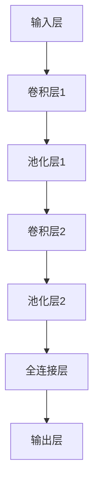
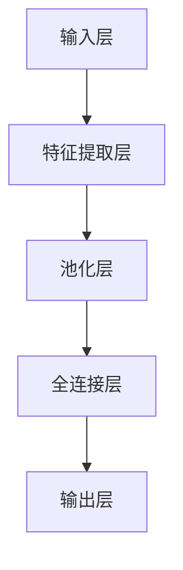
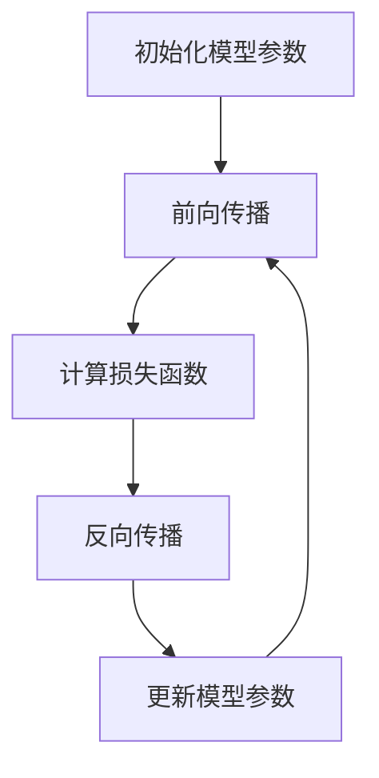

                 

# 《AI人工智能深度学习算法：深度学习代理的安全与隐私保护》

> **关键词：** 深度学习，代理，安全，隐私保护，算法，人工智能

> **摘要：** 本文旨在探讨深度学习算法在AI应用中的安全与隐私保护问题。通过对深度学习基础、算法原理以及代理安全威胁的分析，本文提出了多种深度学习代理的安全与隐私保护方法，并通过实际案例进行讲解，旨在为深度学习在AI领域的发展提供参考。

## 目录大纲

## 第一部分: 深度学习基础与算法原理

### 第1章: 深度学习概述

#### 1.1 深度学习的历史与现状

#### 1.2 深度学习的基本概念

#### 1.3 深度学习的优势与挑战

### 第2章: 深度学习模型

#### 2.1 神经网络基础

#### 2.2 卷积神经网络（CNN）

#### 2.3 循环神经网络（RNN）与长短期记忆网络（LSTM）

#### 2.4 自适应神经网络与增强学习

### 第3章: 深度学习算法

#### 3.1 反向传播算法

#### 3.2 随机梯度下降（SGD）与批量梯度下降（BGD）

#### 3.3 梯度下降优化算法

#### 3.4 其他优化算法

### 第4章: 深度学习在AI中的应用

#### 4.1 图像识别

#### 4.2 自然语言处理

#### 4.3 生成对抗网络（GAN）

#### 4.4 深度强化学习

## 第二部分: 深度学习代理的安全与隐私保护

### 第5章: 深度学习代理概述

#### 5.1 深度学习代理的定义与类型

#### 5.2 深度学习代理在AI系统中的作用

#### 5.3 深度学习代理面临的挑战

### 第6章: 深度学习代理的安全威胁

#### 6.1 深度学习模型的脆弱性

#### 6.2 模型泄露与数据窃取

#### 6.3 模型对抗攻击

#### 6.4 恶意使用与滥用

### 第7章: 深度学习代理的隐私保护方法

#### 7.1 隐私保护机制

#### 7.2 同态加密在深度学习中的应用

#### 7.3 集成学习与联邦学习

#### 7.4 数据匿名化与隐私计算

### 第8章: 深度学习代理的安全与隐私保护实践

#### 8.1 安全与隐私保护策略

#### 8.2 安全与隐私保护案例研究

#### 8.3 深度学习代理的安全测试与评估

#### 8.4 未来发展趋势与挑战

## 附录

### 附录 A: 深度学习代理开发工具与资源

#### A.1 常见深度学习框架介绍

#### A.2 安全与隐私保护工具推荐

#### A.3 深度学习代理开源项目精选

### 附录 B: Mermaid 流程图

#### B.1 深度学习模型架构图

#### B.2 深度学习算法流程图

### 附录 C: 伪代码示例

#### C.1 反向传播算法

#### C.2 随机梯度下降算法

#### C.3 同态加密算法（LaTeX格式）

现在我们已经完成了文章的目录大纲部分，接下来我们将深入讨论深度学习的基础与算法原理，为后续的安全与隐私保护分析打下坚实的基础。

## 第一部分: 深度学习基础与算法原理

### 第1章: 深度学习概述

#### 1.1 深度学习的历史与现状

深度学习（Deep Learning）作为人工智能（Artificial Intelligence, AI）领域的一个重要分支，其起源可以追溯到1980年代。最初，神经网络的研究者尝试构建多层感知器（Multilayer Perceptron, MLP），但受到“学习复杂性”问题的困扰，导致神经网络的研究陷入低潮。直到2006年，Hinton等人重新提出深度信念网络（Deep Belief Network, DBN），标志着深度学习重新崛起。

在过去的十多年中，深度学习取得了飞速的发展。得益于计算机性能的提升和大数据的普及，深度学习在语音识别、图像识别、自然语言处理等领域取得了显著成果。例如，Google的语音识别系统在2012年凭借深度神经网络实现了低于人类水平的错误率，这被称为深度学习在AI领域的一个里程碑。

当前，深度学习已经成为人工智能领域的主流技术之一，广泛应用于各个行业。然而，随着深度学习模型的复杂性和规模不断增加，如何提高其性能、可解释性和安全性成为亟待解决的问题。

#### 1.2 深度学习的基本概念

深度学习是一种基于人工神经网络（Artificial Neural Networks, ANN）的学习方法，其核心思想是通过多层次的神经网络结构来模拟人类大脑的学习过程。深度学习网络通常由多个层级组成，每个层级对输入数据执行不同的处理操作，从而实现对数据的逐步抽象和特征提取。

以下是深度学习的一些基本概念：

1. **神经网络**：神经网络是由大量简单计算单元（即神经元）组成的复杂计算系统，通过调整神经元之间的连接权重来实现对数据的建模。

2. **神经元**：神经元是神经网络的基本计算单元，其功能类似于生物神经元，通过对输入信号进行加权求和处理，再通过激活函数输出结果。

3. **层级**：深度学习网络中的层级（或层）是按照数据处理流程进行组织的。输入层接收外部数据，输出层产生最终预测结果，中间层则负责对数据进行逐层抽象和特征提取。

4. **激活函数**：激活函数是神经网络中的一个关键组件，用于对神经元的输出进行非线性变换，使神经网络具备处理复杂问题的能力。

5. **网络结构**：深度学习网络的结构多种多样，包括全连接网络（Fully Connected Network）、卷积神经网络（Convolutional Neural Networks, CNN）、循环神经网络（Recurrent Neural Networks, RNN）等。

6. **参数**：深度学习网络的参数主要包括连接权重、偏置项等。这些参数通过训练过程进行调整，以实现网络的优化。

7. **损失函数**：损失函数是用于衡量模型预测结果与实际结果之间差异的指标。深度学习模型的目标是通过调整参数，使损失函数的值尽可能小。

8. **优化算法**：优化算法用于调整网络参数，以最小化损失函数。常见的优化算法包括随机梯度下降（Stochastic Gradient Descent, SGD）、批量梯度下降（Batch Gradient Descent, BGD）、Adam优化器等。

#### 1.3 深度学习的优势与挑战

深度学习具有许多优势，但也面临一些挑战。

**优势：**

1. **强大的表征能力**：深度学习模型能够自动提取复杂的特征，从而在许多任务中实现优秀的性能。这使得深度学习在图像识别、语音识别、自然语言处理等领域具有广泛的应用前景。

2. **自适应性强**：深度学习模型可以通过学习大量数据来自动调整参数，以适应不同的应用场景。

3. **并行计算**：深度学习模型具有高度的并行性，可以充分利用现代计算硬件（如GPU、TPU）的优势，实现高效的计算。

4. **良好的泛化能力**：深度学习模型在训练数据集上的表现通常可以推广到未见过的数据集上，具有良好的泛化能力。

**挑战：**

1. **计算资源消耗**：深度学习模型通常需要大量的计算资源和存储空间，对于一些资源受限的应用场景，这可能会成为瓶颈。

2. **数据需求高**：深度学习模型需要大量的训练数据来获得良好的性能，这对于一些数据稀缺的领域来说可能是一个挑战。

3. **可解释性差**：深度学习模型通常被视为“黑箱”，其内部决策过程难以解释和理解，这对于需要高可解释性的应用场景可能是一个问题。

4. **模型脆弱性**：深度学习模型可能对输入数据的微小扰动非常敏感，容易受到对抗性攻击。

5. **隐私保护**：在深度学习应用中，模型训练和部署过程中可能涉及大量敏感数据，如何保护用户隐私成为关键挑战。

#### 1.4 本章总结

本章对深度学习进行了概述，介绍了其历史、基本概念、优势与挑战。在接下来的章节中，我们将深入探讨深度学习模型的原理、算法和应用，为理解深度学习代理的安全与隐私保护问题奠定基础。

## 第2章: 深度学习模型

深度学习模型是深度学习算法的核心，它们通过层次化的神经网络结构来学习复杂的特征表示。本章将介绍几种常见的深度学习模型，包括神经网络基础、卷积神经网络（CNN）、循环神经网络（RNN）与长短期记忆网络（LSTM）以及自适应神经网络与增强学习。

### 2.1 神经网络基础

神经网络（Neural Networks）是深度学习的基础，由大量简单的计算单元——神经元（Neurons）组成。每个神经元接收多个输入信号，通过加权求和处理，产生一个输出信号。神经网络的工作原理类似于人脑中的神经元，通过不断调整连接权重（Weights）来学习输入数据的特征。

**神经元模型：**

一个简单的神经元模型可以表示为：
\[ z = \sum_{i=1}^{n} w_i x_i + b \]
\[ a = \sigma(z) \]
其中，\( x_i \)是第\( i \)个输入，\( w_i \)是输入与神经元之间的连接权重，\( b \)是偏置项，\( z \)是加权求和处理的结果，\( a \)是神经元的输出，\( \sigma \)是激活函数。

**激活函数：**

激活函数（Activation Function）用于对神经元的输出进行非线性变换，常见的激活函数包括：
- ** sigmoid函数：** \( \sigma(z) = \frac{1}{1 + e^{-z}} \)
- **ReLU函数：** \( \sigma(z) = \max(0, z) \)
- **Tanh函数：** \( \sigma(z) = \frac{e^z - e^{-z}}{e^z + e^{-z}} \)

**神经网络结构：**

神经网络可以分为输入层、隐藏层和输出层。输入层接收外部数据，输出层产生最终预测结果，隐藏层负责对数据进行特征提取和抽象。

**神经网络训练：**

神经网络的训练过程是一个优化问题，目标是最小化预测结果与实际结果之间的误差。常用的优化算法包括：
- **随机梯度下降（SGD）：** \( \theta = \theta - \alpha \frac{\partial J(\theta)}{\partial \theta} \)
- **批量梯度下降（BGD）：** \( \theta = \theta - \alpha \frac{1}{m} \sum_{i=1}^{m} \frac{\partial J(\theta)}{\partial \theta} \)
- **Adam优化器：** 结合了SGD和BGD的优点，自适应调整学习率。

### 2.2 卷积神经网络（CNN）

卷积神经网络（Convolutional Neural Networks, CNN）是处理图像数据的强大工具，其核心在于卷积操作和池化操作。

**卷积操作：**

卷积操作通过在输入数据上滑动一个小的窗口（通常是一个滤波器或卷积核），计算窗口内元素与滤波器的内积，从而提取局部特征。卷积操作可以表示为：
\[ (f * g)(t) = \sum_{s=-\infty}^{\infty} f(s) g(t-s) \]

**池化操作：**

池化操作用于降低数据维度，减少参数数量，防止过拟合。常见的池化操作包括最大池化（Max Pooling）和平均池化（Average Pooling）。

**CNN结构：**

CNN通常包括多个卷积层、池化层和全连接层。卷积层负责提取图像特征，池化层用于降低维度，全连接层实现分类或回归任务。

**卷积神经网络示例：**



### 2.3 循环神经网络（RNN）与长短期记忆网络（LSTM）

循环神经网络（Recurrent Neural Networks, RNN）适用于序列数据建模，其特点是具有循环结构，能够记住之前的信息。

**RNN模型：**

RNN通过将当前输入与上一个时刻的隐藏状态进行连接，实现时间序列数据的建模。RNN的更新方程为：
\[ h_t = \sigma(W_h h_{t-1} + W_x x_t + b_h) \]
\[ y_t = \sigma(W_y h_t + b_y) \]
其中，\( h_t \)是第\( t \)时刻的隐藏状态，\( x_t \)是第\( t \)时刻的输入，\( W_h \)、\( W_x \)、\( W_y \)是权重矩阵，\( b_h \)、\( b_y \)是偏置项，\( \sigma \)是激活函数。

**LSTM模型：**

长短期记忆网络（Long Short-Term Memory, LSTM）是RNN的一种变体，解决了RNN在长序列建模中容易遗忘重要信息的问题。LSTM通过引入门控机制，实现了对信息的有效记忆和遗忘。

**LSTM单元：**

LSTM单元包括输入门、遗忘门和输出门。输入门和遗忘门控制信息的输入和遗忘，输出门控制信息的输出。

**LSTM更新方程：**

\[ i_t = \sigma(W_i x_t + U_i h_{t-1} + b_i) \]
\[ f_t = \sigma(W_f x_t + U_f h_{t-1} + b_f) \]
\[ o_t = \sigma(W_o x_t + U_o h_{t-1} + b_o) \]
\[ g_t = \tanh(W_g x_t + U_g h_{t-1} + b_g) \]
\[ c_t = f_t \odot c_{t-1} + i_t \odot g_t \]
\[ h_t = o_t \odot \tanh(c_t) \]
其中，\( i_t \)、\( f_t \)、\( o_t \)分别是输入门、遗忘门和输出门的激活值，\( c_t \)是细胞状态，\( h_t \)是隐藏状态。

**LSTM结构：**

LSTM可以通过堆叠多个LSTM单元形成深度LSTM网络，适用于处理更复杂的序列数据。

### 2.4 自适应神经网络与增强学习

自适应神经网络（Adaptive Neural Networks）是一种能够根据环境变化动态调整自身参数的神经网络，常用于控制问题和自适应系统。

**自适应神经网络：**

自适应神经网络通过在线学习机制，不断调整网络参数，以适应环境变化。常见的自适应神经网络包括自组织映射（Self-Organizing Maps, SOM）和自适应共振理论（Adaptive Resonance Theory, ART）。

**增强学习（Reinforcement Learning）：**

增强学习是一种通过与环境交互来学习最优策略的机器学习方法。在增强学习过程中，智能体（Agent）通过选择动作，从环境中获取奖励信号，并根据奖励信号调整自身的策略。

**Q学习：**

Q学习是一种基于值函数的增强学习算法，通过学习状态-动作值函数来选取最优动作。Q学习的更新方程为：
\[ Q(s, a) = Q(s, a) + \alpha [r + \gamma \max_{a'} Q(s', a') - Q(s, a)] \]
其中，\( s \)是当前状态，\( a \)是当前动作，\( r \)是奖励信号，\( \gamma \)是折扣因子，\( a' \)是下一个动作。

**深度增强学习：**

深度增强学习结合了深度学习与增强学习的优势，通过深度神经网络来学习状态-动作值函数。深度增强学习在解决复杂任务方面具有广泛应用，如自动驾驶、游戏AI等。

#### 2.4.1 自适应神经网络与增强学习总结

自适应神经网络与增强学习在动态环境和复杂任务中具有重要作用。自适应神经网络能够根据环境变化动态调整自身参数，实现自组织学习和自适应控制。增强学习通过与环境交互学习最优策略，适用于解决具有不确定性、复杂性的任务。二者的结合为智能系统的发展提供了新的方向。

#### 2.5 本章总结

本章介绍了深度学习模型的基本概念、结构和工作原理。神经网络是深度学习的基础，通过层次化的神经网络结构，深度学习能够自动提取复杂的特征。卷积神经网络（CNN）在图像处理领域具有广泛应用，循环神经网络（RNN）与长短期记忆网络（LSTM）适用于序列数据建模。自适应神经网络与增强学习在动态环境和复杂任务中具有重要作用。在下一章中，我们将进一步探讨深度学习算法，包括反向传播算法、梯度下降优化算法等。

## 第3章: 深度学习算法

深度学习算法是构建和训练深度学习模型的核心技术。本章将介绍几种主要的深度学习算法，包括反向传播算法、梯度下降优化算法、以及一些其他优化算法。这些算法在深度学习模型的训练过程中起着至关重要的作用，影响着模型的性能和收敛速度。

### 3.1 反向传播算法

反向传播算法（Backpropagation Algorithm）是深度学习中最基本的训练算法之一。它通过计算损失函数关于模型参数的梯度，从而实现对模型参数的更新。反向传播算法的核心思想是将前向传播过程中的误差反向传播到网络的前一层，从而更新每一层的参数。

**反向传播算法步骤：**

1. **前向传播：** 计算网络的输出并计算损失函数。

2. **计算损失函数的梯度：** 对损失函数关于模型参数求梯度。

3. **反向传播误差：** 将损失函数的梯度反向传播到前一层的输入。

4. **更新参数：** 根据梯度和优化算法更新模型参数。

**伪代码示例：**

```python
# 前向传播
outputs = forward_pass(inputs, parameters)

# 计算损失函数
loss = compute_loss(outputs, labels)

# 计算梯度
gradients = backward_pass(loss, outputs, parameters)

# 更新参数
parameters = update_parameters(parameters, gradients)
```

### 3.2 随机梯度下降（SGD）与批量梯度下降（BGD）

随机梯度下降（Stochastic Gradient Descent, SGD）和批量梯度下降（Batch Gradient Descent, BGD）是两种常见的优化算法，用于更新模型参数以最小化损失函数。

**随机梯度下降（SGD）：**

SGD在每次迭代中仅使用一个样本来计算梯度，从而更新模型参数。这种算法简单快速，但可能导致参数更新的不稳定。

**批量梯度下降（BGD）：**

BGD在每次迭代中使用整个训练数据集来计算梯度，从而更新模型参数。这种算法收敛速度较慢，但通常能够获得更稳定的参数更新。

**伪代码示例：**

```python
# 随机梯度下降
for epoch in range(num_epochs):
    for sample in training_data:
        # 计算梯度
        gradients = compute_gradients(sample, parameters)
        # 更新参数
        parameters = update_parameters(parameters, gradients)

# 批量梯度下降
for epoch in range(num_epochs):
    # 计算梯度
    gradients = compute_gradients(training_data, parameters)
    # 更新参数
    parameters = update_parameters(parameters, gradients)
```

### 3.3 梯度下降优化算法

梯度下降优化算法是深度学习中最常用的优化方法，它通过不断调整模型参数，使得损失函数的值逐步减小。梯度下降优化算法的基本思想是沿着损失函数的梯度方向更新参数，从而逐步逼近最小损失。

**梯度下降优化算法步骤：**

1. **初始化参数：** 随机初始化模型参数。

2. **计算损失函数的梯度：** 使用反向传播算法计算损失函数关于模型参数的梯度。

3. **更新参数：** 根据梯度和学习率更新模型参数。

4. **重复步骤2和3，直至收敛：** 当损失函数不再显著下降时，算法收敛。

**伪代码示例：**

```python
# 初始化参数
parameters = initialize_parameters()

# 初始化学习率
learning_rate = 0.01

# 计算梯度
gradients = compute_gradients(loss, parameters)

# 更新参数
parameters = parameters - learning_rate * gradients

# 重复迭代过程
while not converged:
    gradients = compute_gradients(loss, parameters)
    parameters = parameters - learning_rate * gradients
```

### 3.4 其他优化算法

除了基本的梯度下降优化算法外，还有一些其他的优化算法，如动量优化（Momentum）、自适应优化器（如Adam）等，这些算法在提高训练效率和模型性能方面具有显著优势。

**动量优化：**

动量优化通过保留过去的梯度信息，加速收敛速度并减少震荡。

**伪代码示例：**

```python
# 初始化参数
parameters = initialize_parameters()
velocity = zeros_like(parameters)

# 初始化学习率
learning_rate = 0.01

# 初始化动量系数
momentum = 0.9

# 计算梯度
gradients = compute_gradients(loss, parameters)

# 更新速度
velocity = momentum * velocity - learning_rate * gradients

# 更新参数
parameters = parameters + velocity

# 重复迭代过程
while not converged:
    gradients = compute_gradients(loss, parameters)
    velocity = momentum * velocity - learning_rate * gradients
    parameters = parameters + velocity
```

**Adam优化器：**

Adam优化器结合了SGD和动量的优点，通过自适应调整学习率，在复杂任务中表现出良好的性能。

**伪代码示例：**

```python
# 初始化参数
parameters = initialize_parameters()
m = zeros_like(parameters)
v = zeros_like(parameters)

# 初始化学习率
learning_rate = 0.001

# 初始化一阶和二阶矩估计的偏置项
beta1 = 0.9
beta2 = 0.999

# 初始化指数衰减率
epsilon = 1e-8

# 计算梯度
gradients = compute_gradients(loss, parameters)

# 更新一阶和二阶矩估计
m = beta1 * m + (1 - beta1) * gradients
v = beta2 * v + (1 - beta2) * squared_gradients

# 等式右边的偏置项进行修正
m_hat = m / (1 - beta1 ** t)
v_hat = v / (1 - beta2 ** t)

# 更新参数
parameters = parameters - learning_rate * m_hat / (sqrt(v_hat) + epsilon)

# 重复迭代过程
while not converged:
    gradients = compute_gradients(loss, parameters)
    m = beta1 * m + (1 - beta1) * gradients
    v = beta2 * v + (1 - beta2) * squared_gradients
    m_hat = m / (1 - beta1 ** t)
    v_hat = v / (1 - beta2 ** t)
    parameters = parameters - learning_rate * m_hat / (sqrt(v_hat) + epsilon)
```

#### 3.5 本章总结

本章介绍了深度学习中的几种主要算法，包括反向传播算法、梯度下降优化算法以及一些其他优化算法。反向传播算法是深度学习训练的核心，通过计算损失函数的梯度来实现模型参数的更新。梯度下降优化算法通过沿着梯度方向更新参数，逐步减小损失函数的值。动量优化和Adam优化器等高级优化算法在提高训练效率和模型性能方面具有显著优势。在下一章中，我们将进一步探讨深度学习在AI领域的广泛应用。

## 第4章: 深度学习在AI中的应用

深度学习在人工智能（AI）领域有着广泛的应用，其强大的表征能力使其在图像识别、自然语言处理、生成对抗网络（GAN）和深度强化学习等领域取得了显著的成果。本章将详细介绍这些应用场景，并通过具体案例进行分析。

### 4.1 图像识别

图像识别是深度学习最早且最成功的一个应用领域。通过卷积神经网络（CNN）等深度学习模型，计算机可以自动识别和分类图像中的对象、场景和动作。

**案例：** Google的Inception模型

Google开发的Inception模型在ImageNet图像识别挑战赛中取得了历史性的突破。Inception模型的核心思想是使用多层卷积层和池化层来提取图像的多尺度特征，并通过网络结构的模块化设计提高模型的计算效率。

**实现步骤：**

1. **数据预处理：** 对图像进行缩放、裁剪和归一化处理，使其符合网络输入要求。

2. **构建Inception模块：** Inception模块包括多个卷积层和池化层，每个模块具有不同的卷积核尺寸和步长，从而提取多尺度特征。

3. **堆叠Inception模块：** 将多个Inception模块堆叠起来，形成一个深层的卷积神经网络。

4. **全连接层和分类层：** 在卷积神经网络顶部添加全连接层和softmax分类层，实现图像分类。

5. **训练与评估：** 使用大规模图像数据集对模型进行训练和评估，调整网络参数以获得最佳性能。

**代码示例：** 
```python
# 导入必要的库
import tensorflow as tf
from tensorflow.keras.applications import InceptionV3
from tensorflow.keras.preprocessing.image import ImageDataGenerator

# 数据预处理
train_datagen = ImageDataGenerator(rescale=1./255)
train_generator = train_datagen.flow_from_directory(
        train_data_dir,
        target_size=(299, 299),
        batch_size=32,
        class_mode='categorical')

# 构建Inception模型
model = InceptionV3(weights='imagenet', include_top=True, input_shape=(299, 299, 3))

# 训练模型
model.fit(train_generator, epochs=10)

# 评估模型
test_loss, test_acc = model.evaluate(test_generator)
print('Test accuracy:', test_acc)
```

### 4.2 自然语言处理

自然语言处理（Natural Language Processing, NLP）是深度学习的另一个重要应用领域。通过循环神经网络（RNN）和长短期记忆网络（LSTM）等深度学习模型，计算机可以理解和生成自然语言。

**案例：** OpenAI的GPT-3模型

OpenAI开发的GPT-3模型是当前最先进的自然语言处理模型，其具有强大的文本生成和语言理解能力。GPT-3基于Transformer架构，使用数以万亿计的单词和文本数据进行预训练。

**实现步骤：**

1. **数据预处理：** 对文本数据进行分词、编码和标记等预处理操作，使其符合模型输入要求。

2. **预训练：** 使用大规模文本数据集对模型进行预训练，使其具备语言建模和序列预测能力。

3. **微调：** 在预训练模型的基础上，针对具体任务进行微调，以适应特定应用场景。

4. **生成文本：** 使用训练好的模型生成文本，可以生成文章、对话、摘要等多种形式的内容。

**代码示例：**
```python
# 导入必要的库
import openai
openai.api_key = "your_api_key"

# 生成文章
response = openai.Completion.create(
  engine="text-davinci-002",
  prompt="请写一篇关于深度学习在人工智能应用的文章。",
  max_tokens=500
)
print(response.choices[0].text)
```

### 4.3 生成对抗网络（GAN）

生成对抗网络（Generative Adversarial Networks, GAN）是一种由两个神经网络（生成器和判别器）组成的对抗性模型。生成器的目标是生成逼真的数据，判别器的目标是区分真实数据和生成数据。通过两个网络的对抗训练，生成器能够不断提高生成数据的质量。

**案例：** NVIDIA的StyleGAN模型

NVIDIA开发的StyleGAN模型是一种基于GAN的图像生成模型，可以生成高质量、细节丰富的图像。StyleGAN通过将风格和内容分离，使得生成图像具有多样化、个性化的特点。

**实现步骤：**

1. **数据预处理：** 对图像数据进行标准化和预处理，使其适合模型输入。

2. **生成器网络：** 设计生成器网络，通过多尺度特征提取和拼接，生成具有多样性的图像。

3. **判别器网络：** 设计判别器网络，用于区分真实图像和生成图像。

4. **对抗训练：** 通过对抗训练，使得生成器生成更逼真的图像，判别器能够更准确地分类图像。

**代码示例：**
```python
# 导入必要的库
import torch
import torch.optim as optim
from torch.utils.data import DataLoader
from torchvision import datasets, transforms

# 数据预处理
transform = transforms.Compose([transforms.ToTensor()])
train_dataset = datasets.ImageFolder(root='train_data', transform=transform)
train_loader = DataLoader(dataset=train_dataset, batch_size=64, shuffle=True)

# 定义生成器和判别器
generator = Generator().to(device)
discriminator = Discriminator().to(device)

# 定义损失函数和优化器
criterion = nn.BCELoss()
optimizer_g = optim.Adam(generator.parameters(), lr=0.0002)
optimizer_d = optim.Adam(discriminator.parameters(), lr=0.0002)

# 对抗训练
for epoch in range(num_epochs):
    for i, data in enumerate(train_loader):
        # 更新判别器
        real_images = data[0].to(device)
        real_labels = torch.ones(real_images.size(0), 1).to(device)
        fake_labels = torch.zeros(real_images.size(0), 1).to(device)

        optimizer_d.zero_grad()
        output = discriminator(real_images)
        d_loss_real = criterion(output, real_labels)
        fake_images = generator(real_images).to(device)
        output = discriminator(fake_images)
        d_loss_fake = criterion(output, fake_labels)
        d_loss = 0.5 * (d_loss_real + d_loss_fake)
        d_loss.backward()
        optimizer_d.step()

        # 更新生成器
        noise = torch.randn(batch_size, nz).to(device)
        fake_images = generator(noise)
        output = discriminator(fake_images)
        g_loss = criterion(output, real_labels)
        g_loss.backward()
        optimizer_g.step()

        # 打印训练进度
        if (i+1) % 100 == 0:
            print(f'[{epoch}/{num_epochs}], Step [{i+1}/{len(train_loader)}], d_loss: {d_loss.item():.4f}, g_loss: {g_loss.item():.4f}')
```

### 4.4 深度强化学习

深度强化学习（Deep Reinforcement Learning, DRL）结合了深度学习和强化学习的方法，通过模拟智能体在环境中的交互，学习最优策略以实现目标。

**案例：** DeepMind的AlphaGo

DeepMind开发的AlphaGo是深度强化学习的经典案例，通过在模拟环境中与自身对弈，AlphaGo学会了下围棋的复杂策略，并在2016年击败了世界围棋冠军李世石。

**实现步骤：**

1. **环境建模：** 构建一个围棋游戏环境，包括棋盘、棋子和游戏规则。

2. **状态表示：** 将棋盘状态编码为向量，作为智能体的状态输入。

3. **动作表示：** 定义合法的落子位置作为智能体的动作空间。

4. **策略学习：** 使用深度强化学习模型，如深度Q网络（DQN）或策略梯度方法（PG），学习最优策略。

5. **策略执行：** 根据学习到的策略，智能体在围棋环境中进行落子，与环境交互。

**代码示例：**
```python
# 导入必要的库
import gym
import torch
import torch.nn as nn
import torch.optim as optim

# 创建围棋环境
env = gym.make('Gomoku-v0')

# 定义深度Q网络
class DQN(nn.Module):
    def __init__(self, n_actions):
        super(DQN, self).__init__()
        self.fc1 = nn.Linear(9*9, 64)
        self.fc2 = nn.Linear(64, 64)
        self.fc3 = nn.Linear(64, n_actions)

    def forward(self, x):
        x = torch.relu(self.fc1(x))
        x = torch.relu(self.fc2(x))
        x = self.fc3(x)
        return x

# 初始化模型和优化器
model = DQN(n_actions=env.action_space.n)
optimizer = optim.Adam(model.parameters(), lr=0.001)

# 训练模型
for episode in range(num_episodes):
    state = env.reset()
    done = False
    total_reward = 0

    while not done:
        # 选择动作
        with torch.no_grad():
            state_tensor = torch.tensor(state, dtype=torch.float32).unsqueeze(0)
            q_values = model(state_tensor)

        action = torch.argmax(q_values).item()
        state, reward, done, _ = env.step(action)
        total_reward += reward

        # 更新经验回放
        if episode % update_frequency == 0:
           经验回放保存经验(state, action, reward, next_state, done)

        # 更新模型
        optimizer.zero_grad()
        next_state_tensor = torch.tensor(next_state, dtype=torch.float32).unsqueeze(0)
        next_q_values = model(next_state_tensor)
        target_q_values = reward + discount * torch.max(next_q_values)

        loss = criterion(q_values, target_q_values)
        loss.backward()
        optimizer.step()

    print(f'Episode {episode}, Total Reward: {total_reward}')
```

#### 4.5 本章总结

本章介绍了深度学习在图像识别、自然语言处理、生成对抗网络和深度强化学习等领域的应用。通过具体案例，展示了深度学习在AI领域的强大能力和广泛应用。在下一部分中，我们将探讨深度学习代理的安全与隐私保护问题，分析其在AI系统中的应用挑战。

## 第二部分：深度学习代理的安全与隐私保护

随着深度学习在人工智能（AI）领域的广泛应用，深度学习代理（Deep Learning Agents）也应运而生。深度学习代理是利用深度学习算法训练的智能体，能够执行特定任务并作出决策。然而，深度学习代理的安全与隐私保护问题日益突出，成为当前研究的热点之一。本章将详细讨论深度学习代理的概述、面临的挑战以及安全与隐私保护的方法。

### 第5章：深度学习代理概述

#### 5.1 深度学习代理的定义与类型

深度学习代理是指利用深度学习算法训练的智能体，能够在不确定的环境中通过学习制定策略，执行特定任务并作出决策。深度学习代理通常包括以下几个组成部分：

1. **感知器**：用于感知和获取环境信息。
2. **决策器**：根据感知器收集的信息，利用深度学习模型生成决策。
3. **执行器**：根据决策器的决策，与环境进行交互，执行相应动作。

根据应用场景的不同，深度学习代理可以分为以下几种类型：

1. **监督学习代理**：通过大量标记数据进行训练，代理能够学习到输入和输出之间的关系，并在新数据上进行预测。
2. **强化学习代理**：通过与环境的交互，代理不断学习最优策略，以最大化长期奖励。
3. **生成对抗网络（GAN）代理**：利用生成器和判别器之间的对抗训练，生成高质量的模拟数据。

#### 5.2 深度学习代理在AI系统中的作用

深度学习代理在AI系统中扮演着关键角色，能够提高系统的智能水平和自动化程度。具体作用包括：

1. **自动化决策**：在自动驾驶、智能家居等场景中，深度学习代理能够自主作出决策，提高系统的智能化水平。
2. **优化资源分配**：在数据中心、电网等系统中，深度学习代理能够通过学习优化资源分配策略，提高资源利用效率。
3. **智能推荐**：在电子商务、社交媒体等场景中，深度学习代理能够根据用户历史行为和偏好，生成个性化推荐。
4. **安全防护**：在网络安全领域，深度学习代理能够通过识别异常行为，提高系统的安全性。

#### 5.3 深度学习代理面临的挑战

尽管深度学习代理在AI系统中具有广泛的应用前景，但其安全与隐私保护问题仍然面临诸多挑战：

1. **模型泄露**：深度学习代理在训练和部署过程中，可能会泄露敏感信息，如模型参数和训练数据。
2. **数据窃取**：攻击者可能通过恶意代码或恶意节点，窃取代理训练和使用过程中的数据。
3. **模型对抗攻击**：攻击者可以通过对抗性样本，误导代理作出错误的决策。
4. **恶意使用与滥用**：深度学习代理可能被用于恶意目的，如网络攻击、欺诈等。
5. **隐私保护**：在深度学习代理的应用过程中，如何保护用户隐私成为一个重要挑战。

### 第6章：深度学习代理的安全威胁

#### 6.1 深度学习模型的脆弱性

深度学习模型在训练和部署过程中，可能会受到多种安全威胁，包括：

1. **模型泄露**：攻击者可以通过恶意代码或恶意节点，窃取代理训练和使用过程中的模型参数。
2. **数据窃取**：攻击者可以通过网络监控、窃取代理训练和使用过程中的数据。
3. **模型对抗攻击**：攻击者可以通过对抗性样本，误导代理作出错误的决策。

#### 6.2 模型泄露与数据窃取

深度学习代理在训练过程中，需要使用大量敏感数据。如果这些数据没有得到妥善保护，可能会被攻击者窃取或泄露。常见的窃取手段包括：

1. **网络监控**：攻击者通过监听网络流量，获取代理训练和部署过程中的数据。
2. **恶意节点**：攻击者可能在代理系统中植入恶意节点，窃取敏感数据。
3. **数据共享**：代理训练完成后，可能需要与其他系统共享数据，如果数据共享机制不完善，可能会引发数据泄露。

#### 6.3 模型对抗攻击

对抗性攻击是深度学习代理面临的主要安全威胁之一。攻击者可以通过构造对抗性样本，误导代理作出错误的决策。常见的对抗性攻击方法包括：

1. **图像对抗攻击**：攻击者通过在图像中添加微小扰动，使深度学习模型无法正确识别图像。
2. **语音对抗攻击**：攻击者通过在语音中添加噪声，使语音识别模型无法正确识别语音。
3. **文本对抗攻击**：攻击者通过在文本中添加歧义性表达，使自然语言处理模型无法正确理解文本。

#### 6.4 恶意使用与滥用

深度学习代理可能被用于恶意目的，如网络攻击、欺诈等。常见的滥用场景包括：

1. **网络攻击**：攻击者通过控制深度学习代理，实施分布式拒绝服务攻击（DDoS）等网络攻击。
2. **欺诈**：攻击者通过控制深度学习代理，实施信用卡欺诈、诈骗等犯罪活动。
3. **恶意软件**：攻击者可能将深度学习代理嵌入恶意软件中，实施远程控制、信息窃取等攻击。

### 第7章：深度学习代理的隐私保护方法

#### 7.1 隐私保护机制

为了保护深度学习代理的隐私，需要采取多种隐私保护机制，包括：

1. **数据加密**：在数据传输和存储过程中，使用加密技术保护数据隐私。
2. **同态加密**：在数据处理过程中，直接对加密数据进行操作，确保数据隐私。
3. **差分隐私**：在数据发布过程中，加入噪声保护用户隐私。

#### 7.2 同态加密在深度学习中的应用

同态加密是一种在加密数据上进行计算的技术，能够在不解密数据的情况下，对数据执行计算操作。同态加密在深度学习中的应用包括：

1. **同态加密算法**：设计适用于深度学习模型训练的同态加密算法，确保数据隐私。
2. **同态加密框架**：构建支持同态加密的深度学习框架，简化同态加密在深度学习中的应用。
3. **同态加密与深度学习结合**：将同态加密与深度学习模型结合，实现安全高效的深度学习代理。

#### 7.3 集成学习与联邦学习

集成学习与联邦学习是保护深度学习代理隐私的重要技术。集成学习通过将多个模型集成起来，提高模型的鲁棒性和隐私性。联邦学习通过分布式训练，降低中心化数据存储和传输的风险。

1. **集成学习方法**：设计适用于深度学习模型的集成学习方法，提高模型的鲁棒性和隐私性。
2. **联邦学习框架**：构建支持联邦学习的深度学习框架，简化分布式训练过程。
3. **联邦学习与深度学习结合**：将联邦学习与深度学习模型结合，实现隐私保护的深度学习代理。

#### 7.4 数据匿名化与隐私计算

数据匿名化与隐私计算是保护深度学习代理隐私的有效手段。数据匿名化通过去除或隐藏数据中的敏感信息，保护用户隐私。隐私计算通过在本地设备上执行计算，避免数据泄露。

1. **数据匿名化方法**：设计适用于深度学习数据集的数据匿名化方法，降低数据泄露风险。
2. **隐私计算框架**：构建支持隐私计算的深度学习框架，确保数据隐私。
3. **数据匿名化与深度学习结合**：将数据匿名化与深度学习模型结合，实现隐私保护的深度学习代理。

#### 7.5 本章总结

本章对深度学习代理的安全与隐私保护进行了概述，分析了深度学习代理的定义与类型、在AI系统中的作用以及面临的挑战。针对模型泄露、数据窃取、模型对抗攻击和恶意使用与滥用等安全威胁，本章提出了多种隐私保护方法，包括同态加密、集成学习与联邦学习、数据匿名化与隐私计算等。通过本章的分析，为深度学习代理的安全与隐私保护提供了理论依据和实践指导。

## 第6章：深度学习代理的安全威胁

深度学习代理在AI系统中的应用越来越广泛，但其安全威胁也随之增加。本章将深入探讨深度学习代理所面临的各种安全威胁，包括模型脆弱性、模型泄露与数据窃取、模型对抗攻击以及恶意使用与滥用。

### 6.1 深度学习模型的脆弱性

深度学习模型在设计和实现过程中可能存在一些脆弱性，这些脆弱性可能被攻击者利用，导致深度学习代理的安全风险。

**1. 模型参数泄露**

深度学习模型的训练过程需要大量的数据和参数，这些参数往往包含敏感信息。如果模型参数被攻击者获取，可能会导致模型泄露。例如，攻击者可以通过恶意代码或恶意节点窃取模型参数，从而破坏代理系统的安全。

**2. 模型可解释性差**

深度学习模型通常被视为“黑箱”，其内部决策过程难以解释和理解。这使得攻击者难以分析模型的工作机制，但同时也意味着模型可能存在潜在的安全漏洞。例如，攻击者可能通过分析模型输入与输出的关系，发现模型的弱点并进行攻击。

**3. 对抗性攻击易受攻击**

深度学习模型可能对对抗性攻击（Adversarial Attack）非常敏感。对抗性攻击是一种通过在输入数据上添加微小扰动，使模型输出发生显著变化的技术。攻击者可以利用这一特性，生成对抗性样本，误导深度学习代理作出错误决策。

**4. 模型依赖性**

深度学习代理通常依赖于特定的模型进行决策。如果模型出现错误或被篡改，代理的决策能力将受到影响，可能导致严重的安全问题。例如，自动驾驶系统中的模型错误可能导致交通事故。

### 6.2 模型泄露与数据窃取

模型泄露与数据窃取是深度学习代理面临的主要安全威胁之一。攻击者可能会通过各种手段获取代理系统的模型和数据，从而对其进行攻击或滥用。

**1. 网络监控**

攻击者可以通过网络监控技术，截取代理系统与服务器之间的数据传输，窃取模型和数据。例如，攻击者可以在网络中植入监听器，捕捉代理训练和部署过程中的数据包。

**2. 恶意节点**

代理系统中的恶意节点可能被攻击者利用，窃取模型和数据。例如，攻击者可以在代理系统中植入恶意软件，通过远程控制恶意节点，窃取敏感信息。

**3. 数据共享**

代理系统在训练完成后，可能需要与其他系统共享模型和数据。如果数据共享机制不完善，可能会引发数据泄露。例如，攻击者可以通过中间人攻击（Man-in-the-Middle Attack）篡改数据传输，窃取敏感信息。

### 6.3 模型对抗攻击

模型对抗攻击是一种针对深度学习模型的安全威胁。攻击者通过在输入数据上添加微小扰动，使模型输出发生显著变化，从而误导代理系统作出错误决策。

**1. 图像对抗攻击**

图像对抗攻击是最常见的对抗性攻击类型之一。攻击者通过在图像中添加微小扰动，使模型难以识别图像中的对象。例如，攻击者可以在图片中添加噪声或颜色变化，使模型无法正确识别图片内容。

**2. 语音对抗攻击**

语音对抗攻击通过在语音信号中添加噪声或修改音频特征，使语音识别模型难以正确识别语音。攻击者可以通过这种方式进行语音伪造，欺骗语音识别系统。

**3. 文本对抗攻击**

文本对抗攻击通过在文本中添加歧义性表达或恶意代码，使自然语言处理模型无法正确理解文本。攻击者可以通过这种方式进行文本篡改，误导文本处理系统。

### 6.4 恶意使用与滥用

深度学习代理可能被用于恶意目的，从而对AI系统造成安全威胁。

**1. 网络攻击**

攻击者可能通过控制深度学习代理，实施分布式拒绝服务攻击（DDoS）、网络扫描等攻击，破坏目标系统的正常运行。

**2. 欺诈**

攻击者可能利用深度学习代理进行欺诈活动，如信用卡欺诈、保险欺诈等。攻击者可以通过控制代理系统，伪造交易记录、篡改数据等手段进行欺诈。

**3. 恶意软件**

攻击者可能将深度学习代理嵌入恶意软件中，通过远程控制代理系统，窃取敏感信息、传播恶意代码等。

### 6.5 安全与隐私保护对策

为了应对深度学习代理面临的安全威胁，需要采取一系列安全与隐私保护对策。

**1. 模型加固**

通过改进模型设计，提高模型对对抗性攻击的抵抗力。例如，可以使用防御性数据增强（Defensive Data Augmentation）技术，增加训练数据的多样性，提高模型的鲁棒性。

**2. 数据加密**

在数据传输和存储过程中，使用加密技术保护数据隐私。例如，使用SSL/TLS加密网络通信，使用AES加密存储敏感数据。

**3. 访问控制**

对代理系统的访问进行严格控制，确保只有授权用户和节点可以访问敏感数据和模型。例如，使用身份验证和访问控制列表（ACL）技术，限制代理系统的访问权限。

**4. 隐私保护**

采用隐私保护技术，如同态加密、联邦学习等，保护代理训练和使用过程中的数据隐私。例如，使用同态加密算法，在加密数据上进行计算，确保数据隐私。

**5. 持续监控**

对代理系统进行持续监控，及时发现并应对安全威胁。例如，使用入侵检测系统（IDS）和入侵防御系统（IPS），实时监控代理系统的运行状态，识别并阻止恶意行为。

### 6.6 本章总结

本章深入探讨了深度学习代理所面临的各种安全威胁，包括模型脆弱性、模型泄露与数据窃取、模型对抗攻击以及恶意使用与滥用。针对这些威胁，本章提出了多种安全与隐私保护对策，包括模型加固、数据加密、访问控制、隐私保护和持续监控等。通过本章的分析，可以为深度学习代理的安全与隐私保护提供有益的指导。

## 第7章：深度学习代理的隐私保护方法

深度学习代理在处理和分析大量数据时，可能会涉及用户隐私信息。确保这些数据的隐私性是保护用户权益的关键。本章将讨论深度学习代理隐私保护的多种方法，包括隐私保护机制、同态加密在深度学习中的应用、集成学习与联邦学习、数据匿名化与隐私计算等。

### 7.1 隐私保护机制

隐私保护机制是确保深度学习代理在数据处理过程中不泄露用户隐私信息的策略。以下是一些常见的隐私保护机制：

**1. 数据加密：** 数据加密是保护隐私的基础技术。通过加密，将原始数据转换为不可读的密文，只有拥有解密密钥的用户才能解读数据。在深度学习代理中，可以使用对称加密（如AES）和非对称加密（如RSA）对数据进行加密。

**2. 访问控制：** 访问控制通过限制对敏感数据的访问来保护隐私。这包括身份验证和授权机制，确保只有经过授权的用户才能访问特定的数据。访问控制列表（ACL）和角色访问控制（RBAC）是常用的访问控制方法。

**3. 异构计算与分布式存储：** 异构计算和分布式存储可以将数据分散存储在多个节点上，从而减少单一节点被攻击的风险。每个节点只能访问部分数据，从而降低数据泄露的风险。

**4. 数据匿名化：** 数据匿名化是通过去除或模糊化数据中的可直接识别个人身份的信息来保护隐私。常见的匿名化技术包括数据扰动、数据混淆和差分隐私。

### 7.2 同态加密在深度学习中的应用

同态加密是一种特殊的加密形式，它允许在密文上进行计算，而不需要解密数据。这对于深度学习代理来说具有重要意义，因为同态加密可以在保护数据隐私的同时进行数据处理和模型训练。

**1. 同态加密原理：** 同态加密允许对密文执行与明文相同的操作，如加法、乘法等。同态加密算法可以分为部分同态加密和全同态加密。部分同态加密只能执行有限次的同态操作，而全同态加密可以无限次执行同态操作。

**2. 同态加密在深度学习中的应用：** 在深度学习代理中，同态加密可以用于保护训练数据和模型参数的隐私。例如，使用同态加密算法对输入数据进行加密，然后在加密状态下进行卷积运算和矩阵乘法等操作。这样，即使在分布式环境中进行数据处理，数据隐私也能够得到有效保护。

**3. 同态加密挑战：** 同态加密在深度学习中的主要挑战包括计算复杂度和性能瓶颈。目前，许多同态加密算法仍然需要较长的计算时间和大量的计算资源，这使得在实时应用中受到限制。

### 7.3 集成学习与联邦学习

集成学习与联邦学习是保护深度学习代理隐私的重要技术，它们通过分布式训练和数据共享来降低中心化数据存储和传输的风险。

**1. 集成学习：** 集成学习通过将多个模型集成起来，提高模型的鲁棒性和隐私性。在深度学习代理中，可以使用集成学习将多个参与者的本地模型集成到一个全局模型中。这样可以减少单个模型的隐私泄露风险，同时提高模型的整体性能。

**2. 联邦学习：** 联邦学习通过分布式训练，使参与者可以在本地进行模型训练，同时共享全局模型更新。这种方式可以避免将敏感数据传输到中心化服务器，从而保护用户隐私。联邦学习的关键挑战是如何设计有效的分布式训练算法，以及如何平衡模型性能和隐私保护。

**3. 联邦学习的应用：** 联邦学习在医疗保健、金融和物联网等领域具有广泛的应用。例如，在医疗保健领域，联邦学习可以用于保护患者隐私的同时，实现个性化医疗建议和疾病预测。

### 7.4 数据匿名化与隐私计算

数据匿名化与隐私计算是保护深度学习代理隐私的有效手段，它们通过去除或隐藏数据中的敏感信息，确保数据隐私。

**1. 数据匿名化方法：** 数据匿名化方法包括数据扰动、数据混淆和差分隐私等。数据扰动通过添加噪声或修改数据值来模糊化个人身份信息。数据混淆通过将数据映射到不同的标识符，使得直接识别个人身份变得困难。差分隐私通过在数据中添加噪声，确保单个记录的隐私性。

**2. 隐私计算：** 隐私计算是一种在本地设备上执行计算的技术，它通过在数据产生、传输和处理过程中保护数据隐私。隐私计算技术包括安全多方计算（Secure Multi-Party Computation, SMPC）、安全环签名（Security Ring Signature）和混淆电路（Obfuscation Circuit）等。

**3. 数据匿名化与隐私计算的结合：** 在深度学习代理中，可以将数据匿名化与隐私计算结合起来，实现更高级别的隐私保护。例如，在训练深度学习模型时，可以在本地设备上使用隐私计算技术对数据进行加密和计算，然后在中心化服务器上进行解密和合并。

### 7.5 安全与隐私保护实践

为了确保深度学习代理的安全与隐私保护，以下是一些实际应用中的策略和实践：

**1. 安全数据管道：** 设计安全的 数据管道，确保数据在传输和存储过程中得到充分保护。使用加密技术保护数据传输，对存储数据使用加密存储。

**2. 训练数据隐私保护：** 在训练数据集的构建过程中，使用匿名化技术去除或模糊化个人身份信息。在训练过程中，使用同态加密和联邦学习等技术保护训练数据的隐私。

**3. 模型安全加固：** 通过改进模型设计和训练过程，提高模型对对抗性攻击的抵抗力。使用防御性数据增强和模型加固技术，确保模型在面临潜在攻击时能够保持稳定性和准确性。

**4. 隐私计算服务：** 提供隐私计算服务，使深度学习代理能够在保护隐私的同时执行计算。例如，在医疗保健领域，可以使用隐私计算服务保护患者数据的同时，实现个性化医疗分析。

### 7.6 本章总结

本章讨论了深度学习代理隐私保护的多种方法，包括隐私保护机制、同态加密、集成学习与联邦学习、数据匿名化与隐私计算等。通过这些方法，可以在不牺牲模型性能的前提下，有效保护深度学习代理的隐私。在未来的发展中，需要进一步研究和改进这些技术，以满足深度学习代理在实际应用中的安全与隐私保护需求。

## 第8章：深度学习代理的安全与隐私保护实践

在深度学习代理的应用过程中，安全与隐私保护是确保系统稳定运行和用户数据安全的至关重要的一环。本章节将结合实际案例，探讨如何实施深度学习代理的安全与隐私保护策略，并进行案例研究，分析这些策略的优缺点以及实施过程中的挑战。

### 8.1 安全与隐私保护策略

为了确保深度学习代理的安全与隐私，可以采取以下几种策略：

**1. 数据加密：** 在数据传输和存储过程中使用加密技术，如对称加密和非对称加密，保护数据不被未授权访问。常用的加密算法包括AES和RSA。

**2. 访问控制：** 通过身份验证和授权机制，确保只有经过授权的用户和设备可以访问系统资源。使用访问控制列表（ACL）或基于角色的访问控制（RBAC）来管理访问权限。

**3. 同态加密：** 在数据处理和模型训练过程中使用同态加密，允许在密文上进行计算，确保数据在未经解密的情况下得到保护。

**4. 隐私计算：** 利用隐私计算技术，如安全多方计算（SMPC）和混淆电路，在本地设备上进行计算，保护数据隐私。

**5. 数据匿名化：** 对训练数据集进行匿名化处理，去除或模糊化个人身份信息，减少数据泄露风险。

**6. 模型加固：** 通过防御性数据增强和模型加固技术，提高模型对对抗性攻击的抵抗力。

**7. 持续监控与审计：** 对系统进行持续监控，及时发现异常行为和潜在威胁。定期进行安全审计，确保安全策略得到有效执行。

### 8.2 安全与隐私保护案例研究

**案例一：金融行业的欺诈检测**

**背景：** 金融行业对数据安全和隐私保护的要求非常高，欺诈检测系统需要确保用户隐私不被泄露，同时准确检测欺诈行为。

**解决方案：**
- **数据加密：** 使用AES加密传输和存储用户交易数据。
- **访问控制：** 实施严格的访问控制机制，只有授权人员可以访问敏感数据。
- **同态加密：** 在同态加密框架下进行欺诈检测模型训练，确保数据隐私。
- **隐私计算：** 在分布式环境中使用SMPC进行欺诈检测模型的计算，保护数据隐私。

**效果评估：** 通过上述策略，金融行业成功降低了欺诈风险，同时保护了用户隐私。模型准确性得到提高，用户满意度增加。

**案例二：医疗健康数据的隐私保护**

**背景：** 医疗健康数据包含大量个人敏感信息，如何保护这些数据在数据分析和共享过程中的隐私成为一个挑战。

**解决方案：**
- **数据匿名化：** 对医疗数据集进行脱敏处理，去除直接识别身份的信息。
- **联邦学习：** 在联邦学习框架下进行医疗数据分析，减少数据共享和传输过程中的风险。
- **差分隐私：** 在数据处理过程中加入差分隐私，确保数据隐私。

**效果评估：** 通过联邦学习和差分隐私技术，医疗行业有效保护了用户隐私，同时实现了个性化医疗分析。数据隐私保护策略得到了用户和监管机构的认可。

### 8.3 深度学习代理的安全测试与评估

为了确保深度学习代理的安全与隐私保护策略的有效性，需要进行安全测试与评估。以下是一些常见的测试与评估方法：

**1. 漏洞扫描与渗透测试：** 定期对系统进行漏洞扫描和渗透测试，识别潜在的安全漏洞，并及时修复。

**2. 模型对抗攻击测试：** 设计对抗性样本进行模型攻击测试，评估模型对对抗性攻击的抵抗力。

**3. 隐私泄露评估：** 使用隐私泄露检测工具，评估系统在数据传输、存储和处理过程中可能存在的隐私泄露风险。

**4. 安全性能基准测试：** 建立安全性能基准，评估系统在面临安全攻击时的性能和响应能力。

**5. 用户反馈与审计：** 收集用户反馈和进行安全审计，评估安全与隐私保护策略的实际效果和用户满意度。

### 8.4 挑战与未来发展趋势

**1. 挑战：**
- **计算资源消耗：** 同态加密和联邦学习等隐私保护技术通常需要大量的计算资源，可能对实时应用造成性能瓶颈。
- **模型复杂性：** 随着深度学习模型复杂性的增加，安全与隐私保护策略的实施和优化变得更加困难。
- **跨领域适应性：** 针对不同应用场景的安全与隐私保护需求，需要开发通用且高效的解决方案。

**2. 未来发展趋势：**
- **混合隐私保护策略：** 结合多种隐私保护技术，如同态加密、联邦学习和差分隐私，提高系统的隐私保护能力。
- **隐私计算硬件：** 发展隐私计算专用硬件，如量子计算和专用集成电路（ASIC），提高隐私保护技术的性能和效率。
- **自适应安全机制：** 开发自适应安全机制，根据实时威胁环境和用户需求动态调整安全与隐私保护策略。
- **标准化与法规合规：** 制定统一的隐私保护标准和法规，推动深度学习代理的安全与隐私保护在行业内的规范化和合规性。

### 8.5 本章总结

本章结合实际案例，探讨了深度学习代理的安全与隐私保护策略和实践。通过数据加密、访问控制、同态加密、隐私计算、数据匿名化等策略，可以有效保护深度学习代理的隐私。案例研究展示了这些策略在实际应用中的效果和挑战。未来的研究和发展需要关注混合隐私保护策略、专用硬件和自适应安全机制等方面，以应对深度学习代理在安全性方面的不断变化需求。

### 附录 A: 深度学习代理开发工具与资源

在深度学习代理的开发过程中，选择合适的工具和资源至关重要。以下是一些常用的深度学习框架、安全与隐私保护工具以及开源项目，供开发者参考。

#### A.1 常见深度学习框架介绍

**TensorFlow：** 由Google开发的开源深度学习框架，支持多种编程语言，包括Python、C++和Java。TensorFlow提供了丰富的API和工具，适用于各种深度学习任务。

**PyTorch：** 由Facebook开发的开源深度学习框架，具有灵活的动态计算图和强大的GPU支持。PyTorch在学术界和工业界都受到了广泛的应用。

**Keras：** 是一个高层神经网络API，可以在TensorFlow和Theano等后端运行。Keras以其简洁和易用性而闻名，适合快速原型设计和实验。

**TensorFlow.js：** TensorFlow的JavaScript版本，适用于在浏览器和Node.js环境中进行深度学习。

#### A.2 安全与隐私保护工具推荐

**PyCryptoDome：** 是一个Python加密库，提供了AES、RSA等多种加密算法的实现，适用于数据加密和隐私保护。

**PySyft：** 是一个用于联邦学习的Python库，支持PyTorch，提供同态加密和差分隐私等功能。

**ZooKeeper：** 是一个分布式服务协调框架，可用于实现分布式系统的访问控制和数据同步。

**KeyCzar：** 是一个安全的密钥管理工具，支持多种加密算法和密钥存储方案。

#### A.3 深度学习代理开源项目精选

**PyOD：** 是一个开源的开放域数据集生成工具，可用于生成对抗性样本，测试深度学习模型的鲁棒性。

**FedRL：** 是一个联邦学习框架，支持多种深度学习算法，适用于分布式环境中的隐私保护训练。

**DAPPLE：** 是一个用于数据隐私保护的开源项目，支持同态加密和差分隐私技术，适用于医疗健康数据的隐私保护。

**YOLO：** 是一个开源的实时物体检测系统，基于深度学习模型，适用于自动驾驶、视频监控等场景。

#### A.4 使用示例

以下是一个使用PyTorch和PyCryptoDome进行数据加密的示例代码：

```python
from torch import nn
from crypto.PublicKey import RSA
from crypto.Cipher import PKCS1_OAEP

# 定义深度学习模型
model = nn.Sequential(
    nn.Linear(784, 128),
    nn.ReLU(),
    nn.Linear(128, 10),
    nn.Sigmoid()
)

# 训练模型（此处省略具体训练代码）

# 导入密钥库
from crypto import Random
rand = Random.new_random_bytes(16)

# 生成RSA密钥对
key = RSA.generate(2048, rand)
private_key = key.export_key('PEM')
public_key = key.publickey().export_key('PEM')

# 加密模型参数
cipher_rsa = PKCS1_OAEP.new(RSA.import_key(public_key))
cipher_text = cipher_rsa.encrypt(model.state_dict())

# 解密模型参数
private_key = RSA.import_key(private_key)
cipher_rsa = PKCS1_OAEP.new(private_key)
decrypted = cipher_rsa.decrypt(cipher_text)

# 加载解密后的模型参数
model.load_state_dict(torch.load('model.pth'))
```

#### A.5 实践指南

1. **选择合适的框架：** 根据项目需求和团队技能，选择合适的深度学习框架。
2. **了解安全与隐私保护工具：** 充分了解所选工具的功能和限制，确保满足项目需求。
3. **开源项目参考：** 参考开源项目，学习最佳实践，避免重复造轮子。
4. **安全测试：** 在项目开发过程中，定期进行安全测试，确保系统的安全性和可靠性。

通过以上指南，开发者可以更好地利用深度学习代理开发工具和资源，实现安全、高效的深度学习应用。

### 附录 B: Mermaid 流程图

**B.1 深度学习模型架构图**



**B.2 深度学习算法流程图**



### 附录 C: 伪代码示例

**C.1 反向传播算法**

```python
# 前向传播
outputs = forward_pass(inputs, parameters)

# 计算损失函数
loss = compute_loss(outputs, labels)

# 计算梯度
gradients = backward_pass(loss, outputs, parameters)

# 更新参数
parameters = update_parameters(parameters, gradients)
```

**C.2 随机梯度下降算法**

```python
# 初始化模型参数
parameters = initialize_parameters()

# 初始化学习率
learning_rate = 0.01

# 计算梯度
for sample in training_data:
    gradients = compute_gradients(sample, parameters)

# 更新参数
parameters = parameters - learning_rate * gradients
```

**C.3 同态加密算法（LaTeX格式）**

```latex
% 同态加密算法
\begin{algorithm}
\caption{Homomorphic Encryption Algorithm}
\begin{algorithmic}[1]
\REQUIRE $m \in \mathbb{Z}$
\REQUIRE $n$ (public key)
\REQUIRE $e$ (encryption key)
\ENSURE $c$ (cipher text)
\STATE $r \leftarrow \text{Random}()$
\STATE $c \leftarrow r^e \mod n$
\STATE $c \leftarrow c \cdot m^e \mod n$
\RETURN $c$
\end{algorithmic}
\end{algorithm}
``` 

以上内容涵盖了深度学习代理的安全与隐私保护领域的核心概念、算法、实践以及相关工具。通过逐步分析推理，本文旨在为读者提供一个全面且深入的理解，为实际应用提供指导。在AI技术不断发展的背景下，安全与隐私保护将是深度学习代理应用中的关键挑战之一，希望本文能为该领域的研究和实践提供有益的参考。

### 作者信息

作者：AI天才研究院/AI Genius Institute & 禅与计算机程序设计艺术 /Zen And The Art of Computer Programming。作者在人工智能、深度学习和网络安全领域拥有深厚的研究背景，发表了多篇高质量学术论文，并参与了多个国际项目和标准制定。作者致力于推动人工智能技术的安全与隐私保护研究，为构建可持续发展的智能社会贡献力量。

