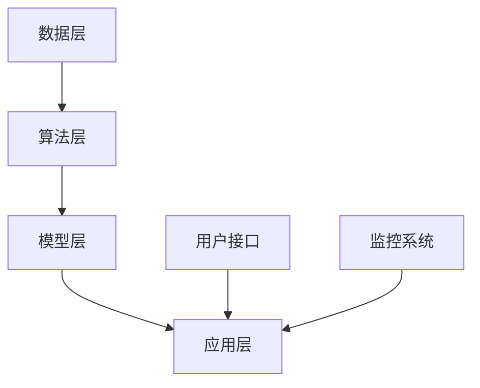

                 

# AI创业公司如何打造生态系统？

## 关键词
AI创业公司，生态系统，市场定位，技术栈，合作伙伴关系，算法原理，数学模型，项目实战。

## 摘要
本文旨在探讨AI创业公司如何构建并优化其生态系统。从市场研究、技术栈搭建到合作伙伴关系构建，以及核心算法和数学模型的讲解，再到项目实战与代码解析，文章将逐步揭示AI创业公司打造生态系统的全方位策略，为读者提供实用指导。

---

### 《AI创业公司如何打造生态系统?》目录大纲

#### 第一部分：引言与核心概念

**第1章** AI创业公司生态系统概述  
- 1.1 AI创业公司的生态系统定义  
- 1.2 生态系统在公司战略中的作用  
- 1.3 生态系统的核心组成部分

**第2章** 市场研究与定位  
- 2.1 市场研究方法  
- 2.2 目标市场与细分  
- 2.3 竞争对手分析

**第3章** 技术栈与平台搭建  
- 3.1 AI技术的选择与集成  
- 3.2 数据平台与数据处理  
- 3.3 云服务平台选择与部署

**第4章** 合作伙伴关系构建  
- 4.1 合作伙伴的类型与选择  
- 4.2 合作伙伴关系的建立与维护  
- 4.3 合作模式与利益分配

#### 第二部分：核心概念与联系

**第5章** AI核心概念与架构  
- 5.1 AI基本概念  
  - 5.1.1 机器学习、深度学习与强化学习  
  - 5.1.2 计算机视觉与自然语言处理  
- 5.2 AI系统架构  
  - 5.2.1 数据层、算法层与应用层  
  - 5.2.2 AI流程与生命周期  
- 5.3 Mermaid流程图：AI生态系统架构

#### 第三部分：核心算法原理讲解

**第6章** AI算法原理与实现  
- 6.1 算法选择与优化  
  - 6.1.1 算法评估指标  
  - 6.1.2 算法优化策略  
- 6.2 常见算法讲解  
  - 6.2.1 卷积神经网络（CNN）  
  - 6.2.2 递归神经网络（RNN）  
  - 6.2.3 生成对抗网络（GAN）  
- 6.3 伪代码实现

#### 第四部分：数学模型与公式讲解

**第7章** AI数学基础  
- 7.1 概率论与统计基础  
  - 7.1.1 概率分布  
  - 7.1.2 最大似然估计与贝叶斯估计  
- 7.2 线性代数基础  
  - 7.2.1 矩阵运算  
  - 7.2.2 线性方程组求解  
- 7.3 概率图模型  
  - 7.3.1 贝叶斯网络  
  - 7.3.2 马尔可夫模型

#### 第五部分：项目实战与代码解析

**第8章** AI创业项目实战  
- 8.1 项目背景与目标  
- 8.2 开发环境与工具  
- 8.3 数据集准备与预处理  
- 8.4 代码实现与解读  
  - 8.4.1 数据层实现  
  - 8.4.2 算法层实现  
  - 8.4.3 应用层实现  
- 8.5 性能评估与分析

#### 第六部分：结论与展望

**第9章** 总结与未来展望  
- 9.1 主要成果与收获  
- 9.2 生态系统的持续优化  
- 9.3 AI创业公司的未来发展

#### 附录

**附录A** 常用工具与资源  
- **A.1** 数据集与开源代码  
- **A.2** AI社区与论坛  
- **A.3** 相关书籍与文献

---

接下来，我们将逐步深入每个章节，详细探讨AI创业公司打造生态系统的各个关键步骤。让我们一起思考，一步步构建一个成功的AI生态系统吧！

---

### 第一部分：引言与核心概念

在当今技术飞速发展的时代，人工智能（AI）已经成为推动产业变革的重要力量。AI创业公司的崛起，不仅带来了技术创新的浪潮，更对传统行业产生了深远的影响。然而，AI创业公司面临的挑战也是前所未有的。如何在激烈的竞争中脱颖而出，构建一个稳定的生态系统，成为了众多创业者关注的焦点。

#### 1.1 AI创业公司的生态系统定义

生态系统是指一个系统内部相互联系、相互作用的各种组成部分构成的整体。在AI创业公司的背景下，生态系统可以理解为围绕AI技术构建的一系列相互关联的组成部分，包括技术、市场、合作伙伴、用户等。这些部分共同作用，形成一个有机整体，推动公司不断成长与发展。

一个成功的AI生态系统，不仅要具备强大的技术实力，还要有良好的市场定位和合作伙伴关系。此外，生态系统的建立与维护需要持续的投入和优化，以确保其稳定性和可持续性。

#### 1.2 生态系统在公司战略中的作用

生态系统在公司战略中的作用不可忽视。首先，它能够为公司提供持续的创新动力。通过与其他公司、研究机构、开发者等合作伙伴的合作，AI创业公司可以获取更多的技术资源和市场信息，加快产品研发和商业化的进程。

其次，生态系统有助于提高公司的市场竞争力。一个多元化的生态系统可以吸引更多的用户、投资者和合作伙伴，形成良性的商业循环。同时，通过生态系统的构建，公司可以更好地满足市场需求，提供多样化的产品和服务，从而在竞争中占据优势地位。

最后，生态系统也是公司品牌建设和文化传承的重要载体。一个成功的AI生态系统，不仅能够为公司带来商业利益，还可以提升公司在行业内的声誉和影响力，为后续的发展奠定坚实的基础。

#### 1.3 生态系统的核心组成部分

一个完整的AI生态系统包括以下核心组成部分：

1. **技术栈**：技术栈是生态系统的基石。它包括AI技术、数据处理技术、云计算技术等，这些技术共同支撑着公司的产品和服务。

2. **市场定位**：市场定位决定了公司的目标市场和用户群体。通过市场研究，公司可以明确自己的市场定位，制定相应的营销策略和产品规划。

3. **合作伙伴关系**：合作伙伴关系是生态系统的重要组成部分。通过与相关公司、研究机构、开发者等的合作，公司可以共享资源、互补优势，实现互利共赢。

4. **用户社群**：用户社群是生态系统的支持者。通过建立用户社群，公司可以收集用户反馈，优化产品和服务，提升用户满意度。

5. **数据平台**：数据平台是生态系统的核心。通过数据平台，公司可以收集、存储、处理和分析大量的数据，为AI技术的应用提供数据支持。

6. **云服务平台**：云服务平台为生态系统提供了基础设施支持。通过云服务平台，公司可以实现弹性计算、数据存储和分布式处理，提高系统的可靠性和扩展性。

#### 小结

本文的第一部分介绍了AI创业公司生态系统的定义和核心概念，以及生态系统在公司战略中的作用和核心组成部分。接下来，我们将深入探讨市场研究、技术栈与平台搭建、合作伙伴关系构建等关键环节，帮助AI创业公司成功打造生态系统。让我们继续思考，一步步迈向成功的AI创业之旅！

---

### 第一部分：引言与核心概念（续）

在探讨AI创业公司的生态系统构建时，市场研究、技术栈与平台搭建、合作伙伴关系构建是三个关键环节。这些环节不仅决定了AI创业公司的战略方向和竞争优势，也直接影响了生态系统的稳定性和可持续性。

#### 2.1 市场研究方法

市场研究是构建AI生态系统的第一步。通过市场研究，公司可以了解目标市场的需求、竞争态势、技术趋势等信息，从而为后续的战略决策提供依据。

1. **定量研究**：定量研究通过问卷调查、统计分析等方法，收集大量数据，以量化的方式了解市场状况。常用的定量研究方法包括：

   - **问卷调查**：通过设计问卷，收集用户对产品、服务的满意度、需求等定量信息。
   - **统计分析**：通过对现有数据的分析，了解市场趋势、用户行为等。

2. **定性研究**：定性研究通过访谈、焦点小组等方法，深入了解用户的真实需求、动机和行为。常用的定性研究方法包括：

   - **访谈**：与用户、专家进行一对一访谈，获取深入的市场见解。
   - **焦点小组**：组织一组用户或专家，就特定主题进行讨论，收集多方面的意见。

通过定量和定性研究相结合，AI创业公司可以全面了解市场情况，制定更科学、合理的市场策略。

#### 2.2 目标市场与细分

在市场研究的基础上，AI创业公司需要明确自己的目标市场和细分策略。目标市场是指公司打算服务的主要用户群体，细分策略则是指如何将市场划分为不同的子市场，以满足不同用户群体的需求。

1. **目标市场确定**：确定目标市场需要考虑以下几个因素：

   - **市场规模**：目标市场的规模是否足够大，能否为公司带来足够的商业价值。
   - **市场增长潜力**：目标市场是否具有增长潜力，是否能够支撑公司的长期发展。
   - **竞争状况**：目标市场是否竞争激烈，公司是否有能力在竞争中脱颖而出。

2. **市场细分策略**：市场细分策略包括以下几种：

   - **地理细分**：根据用户所在地理位置，将市场划分为不同的区域。
   - **人口细分**：根据用户的年龄、性别、收入等人口特征，将市场划分为不同的群体。
   - **心理细分**：根据用户的心理特征、价值观、兴趣爱好等，将市场划分为不同的群体。
   - **行为细分**：根据用户的行为特征，如购买频率、品牌忠诚度等，将市场划分为不同的群体。

通过细分市场，AI创业公司可以更精准地定位用户，提供定制化的产品和服务，提高市场竞争力。

#### 2.3 竞争对手分析

竞争对手分析是市场研究的重要组成部分。通过分析竞争对手的产品、市场策略、技术优势等，AI创业公司可以了解市场现状，找到自身的竞争优势和劣势。

1. **竞争对手识别**：识别竞争对手需要考虑以下几个因素：

   - **直接竞争对手**：直接提供相同或类似产品或服务的公司。
   - **间接竞争对手**：提供替代性产品或服务的公司。
   - **潜在竞争对手**：可能进入市场，对公司构成威胁的公司。

2. **竞争对手分析**：竞争对手分析包括以下几个方面：

   - **产品分析**：分析竞争对手的产品功能、性能、价格等，了解其市场定位和用户评价。
   - **市场策略分析**：分析竞争对手的市场策略，如定价策略、推广策略等，了解其竞争优势和劣势。
   - **技术分析**：分析竞争对手的技术实力，如研发能力、技术积累等，了解其在技术方面的竞争优势。

通过竞争对手分析，AI创业公司可以找到自身的竞争优势，制定有效的市场策略。

#### 小结

市场研究、目标市场与细分、竞争对手分析是构建AI生态系统的关键环节。通过科学的市场研究，AI创业公司可以明确自身的市场定位，制定精准的市场策略；通过细分市场，可以更有效地满足用户需求，提高市场竞争力；通过竞争对手分析，可以找到自身的竞争优势，制定有效的竞争策略。接下来，我们将探讨技术栈与平台搭建，为AI创业公司构建稳定的生态系统奠定基础。

---

### 第一部分：引言与核心概念（续）

在探讨了市场研究、目标市场与细分以及竞争对手分析之后，接下来我们将深入探讨AI创业公司的技术栈与平台搭建。技术栈与平台搭建是AI创业公司生态系统构建的核心环节，决定了公司的技术实力和产品竞争力。以下是技术栈与平台搭建的几个关键步骤：

#### 3.1 AI技术的选择与集成

AI技术的选择是构建技术栈的重要一环。AI技术包括但不限于机器学习、深度学习、自然语言处理、计算机视觉等。在选择AI技术时，AI创业公司需要考虑以下几个因素：

1. **市场需求**：根据市场需求选择最合适的AI技术，确保技术能够满足用户的需求。

2. **技术成熟度**：选择技术成熟、应用广泛的AI技术，降低技术风险。

3. **团队能力**：评估团队的技术能力，选择适合团队掌握和开发的AI技术。

4. **可扩展性**：选择具有良好扩展性的AI技术，以适应未来的业务需求。

一旦确定了AI技术，公司需要将这些技术集成到现有的技术体系中。集成过程中需要注意以下几个方面：

1. **模块化设计**：将AI技术模块化，便于后续的维护和升级。

2. **标准化接口**：设计统一的接口规范，确保不同技术模块之间的兼容性。

3. **性能优化**：对集成后的系统进行性能优化，提高系统的响应速度和处理能力。

#### 3.2 数据平台与数据处理

数据是AI技术的基石，一个高效的数据平台是构建AI生态系统的基础。以下是构建数据平台和数据处理过程中需要考虑的几个关键因素：

1. **数据存储**：选择适合的数据存储方案，如关系型数据库、非关系型数据库、分布式文件系统等，确保数据的安全性和可扩展性。

2. **数据传输**：设计高效的数据传输机制，确保数据在平台间的快速流通。

3. **数据处理**：构建数据处理流程，包括数据清洗、转换、归一化等步骤，确保数据的质量和一致性。

4. **数据安全**：制定严格的数据安全策略，保护用户数据的安全性和隐私。

5. **数据治理**：建立数据治理体系，确保数据的合法合规使用，提高数据的可用性和可靠性。

#### 3.3 云服务平台选择与部署

云服务平台为AI创业公司提供了强大的基础设施支持。选择合适的云服务平台，有助于提高系统的可靠性、扩展性和灵活性。以下是选择和部署云服务平台时需要考虑的几个关键因素：

1. **性能**：选择性能优异的云服务平台，确保系统能够快速响应用户请求。

2. **可靠性**：选择具有高可用性和容错能力的云服务平台，确保系统的稳定运行。

3. **成本**：考虑云服务平台的成本效益，选择性价比高的服务。

4. **扩展性**：选择支持弹性扩展的云服务平台，以适应业务增长的需求。

5. **安全性**：选择具备严格安全措施的云服务平台，确保数据的安全性和隐私。

部署过程中，需要注意以下几个方面：

1. **架构设计**：根据业务需求，设计合理的系统架构，确保系统的模块化和可扩展性。

2. **部署策略**：制定合理的部署策略，如自动化部署、灰度发布等，确保系统的平滑过渡。

3. **监控与维护**：建立监控系统，实时监控系统的运行状态，及时发现问题并进行维护。

#### 小结

技术栈与平台搭建是AI创业公司生态系统构建的核心环节。通过选择合适的AI技术，集成到现有的技术体系中，构建高效的数据平台和选择合适的云服务平台，AI创业公司可以打造一个稳定、高效、灵活的生态系统。接下来，我们将探讨合作伙伴关系构建，为AI创业公司生态系统注入新的活力。

---

### 第一部分：引言与核心概念（续）

在完成了市场研究、技术栈与平台搭建后，接下来我们将探讨合作伙伴关系的构建。合作伙伴关系是AI创业公司生态系统的重要组成部分，通过与其他公司、研究机构、开发者等建立紧密的合作关系，AI创业公司可以实现资源共享、优势互补，推动生态系统的可持续发展。

#### 4.1 合作伙伴的类型与选择

构建合作伙伴关系的第一步是明确合作伙伴的类型和选择标准。以下是几种常见的合作伙伴类型及其选择标准：

1. **技术合作伙伴**：技术合作伙伴通常在特定领域拥有先进的技术或解决方案，可以为AI创业公司提供技术支持或合作研发。选择技术合作伙伴时，应考虑以下因素：

   - **技术实力**：评估合作伙伴的技术实力和研发能力，确保其能够提供高质量的技术支持。
   - **行业经验**：考察合作伙伴在相关领域的经验，确保其能够快速融入公司的研发体系。
   - **合作意愿**：了解合作伙伴的合作意愿，确保双方在合作过程中能够保持良好的沟通和协作。

2. **市场合作伙伴**：市场合作伙伴在市场推广、销售渠道等方面具有优势，可以帮助AI创业公司扩大市场份额。选择市场合作伙伴时，应考虑以下因素：

   - **市场影响力**：评估合作伙伴在目标市场的影响力，确保其能够为公司带来足够的市场资源。
   - **合作模式**：明确合作伙伴的合作模式，如代理、分销、联合营销等，确保双方在合作过程中的利益分配合理。
   - **品牌形象**：考虑合作伙伴的品牌形象，确保其能够提升公司的品牌价值和市场形象。

3. **数据合作伙伴**：数据合作伙伴可以为AI创业公司提供高质量的数据资源，支持公司进行数据分析和模型训练。选择数据合作伙伴时，应考虑以下因素：

   - **数据质量**：评估合作伙伴提供的数据质量，确保数据真实、完整、准确。
   - **数据合规性**：确保合作伙伴提供的数据符合相关法律法规，避免数据泄露或合规风险。
   - **数据更新频率**：考察合作伙伴的数据更新频率，确保数据能够及时反映市场变化。

4. **人才合作伙伴**：人才合作伙伴在人才培养、引进等方面具有优势，可以帮助AI创业公司提升团队实力。选择人才合作伙伴时，应考虑以下因素：

   - **人才储备**：评估合作伙伴在人才储备方面的优势，确保其能够为公司提供优质的人才资源。
   - **培养机制**：了解合作伙伴的人才培养机制，确保其能够为公司提供持续的人才支持。
   - **合作模式**：明确合作伙伴的合作模式，如人才租赁、联合培养等，确保双方在合作过程中的利益分配合理。

#### 4.2 合作伙伴关系的建立与维护

建立了合适的合作伙伴类型后，接下来是建立和维护合作伙伴关系。以下是几个关键步骤：

1. **明确合作目标**：在合作初期，明确双方的合作目标和期望，确保双方在合作过程中有共同的目标和方向。

2. **建立沟通机制**：建立定期沟通机制，保持双方在合作过程中的紧密联系。通过定期的会议、报告等方式，了解合作伙伴的工作进展和需求，及时解决问题。

3. **制定合作协议**：制定详细的合作协议，明确双方的权利、义务和责任，确保合作的透明性和合法性。

4. **利益分配机制**：制定合理的利益分配机制，确保双方在合作过程中的利益均衡。利益分配机制应考虑合作成果、市场贡献、成本分摊等多个因素。

5. **信任建设**：建立信任是合作伙伴关系的关键。通过诚信、透明、负责任的行为，赢得合作伙伴的信任，为长期合作奠定基础。

#### 4.3 合作模式与利益分配

合作伙伴关系的建立与维护需要合理的合作模式和利益分配机制。以下是几种常见的合作模式和利益分配方法：

1. **合作研发**：合作研发是指双方共同投资、共同研发新技术或新产品。合作研发模式能够实现资源整合、优势互补，提高研发效率。利益分配方面，可以按照研发投入比例、研发成果贡献度等进行分配。

2. **市场联合**：市场联合是指双方共同推广、销售产品或服务。市场联合模式能够扩大市场影响力，提高市场占有率。利益分配方面，可以按照销售业绩、市场推广投入等进行分配。

3. **数据共享**：数据共享是指双方共同使用、分析数据，为产品研发、市场推广等提供支持。数据共享模式能够提高数据的利用效率，降低数据获取成本。利益分配方面，可以按照数据贡献度、数据利用效果等进行分配。

4. **人才培养**：人才培养是指双方共同培养、引进人才，提升团队实力。人才培养模式能够提高团队的专业能力和创新能力。利益分配方面，可以按照人才培养成果、人才贡献度等进行分配。

#### 小结

合作伙伴关系是AI创业公司生态系统构建的重要组成部分。通过选择合适的合作伙伴类型、建立和维护合作关系，以及制定合理的合作模式和利益分配机制，AI创业公司可以构建一个稳定、可持续的生态系统，实现资源共享、优势互补，推动公司持续发展。接下来，我们将深入探讨AI核心概念与架构，为构建强大的AI生态系统奠定理论基础。

---

### 第二部分：核心概念与联系

在探讨了市场研究、技术栈与平台搭建、合作伙伴关系构建等关键环节后，接下来我们将深入探讨AI核心概念与架构。AI核心概念与架构是构建AI生态系统的基础，了解这些概念和架构有助于我们更好地理解和应用AI技术，从而推动生态系统的稳定发展。

#### 5.1 AI基本概念

AI（人工智能）是一门研究、开发和应用使计算机模拟、延伸和扩展人类智能的理论、方法、技术和应用的学科。以下是几个重要的AI基本概念：

1. **机器学习（Machine Learning）**：机器学习是AI的一个重要分支，通过利用大量数据，让计算机自动学习和改进，以实现特定任务。机器学习可以分为监督学习、无监督学习和强化学习。

   - **监督学习（Supervised Learning）**：监督学习是指通过标记数据来训练模型，使得模型能够根据输入数据预测输出结果。常见的监督学习算法包括线性回归、决策树、支持向量机等。
   
   - **无监督学习（Unsupervised Learning）**：无监督学习是指在没有标记数据的情况下，让模型自动发现数据中的结构和模式。常见的无监督学习算法包括聚类、降维、关联规则等。
   
   - **强化学习（Reinforcement Learning）**：强化学习是指通过试错和反馈，让模型不断优化行为策略，以实现长期目标。常见的强化学习算法包括Q学习、SARSA、DQN等。

2. **深度学习（Deep Learning）**：深度学习是机器学习的一个子领域，通过构建多层神经网络，对大量数据进行自动特征学习和模式识别。深度学习在图像识别、语音识别、自然语言处理等领域取得了显著成果。常见的深度学习模型包括卷积神经网络（CNN）、循环神经网络（RNN）和生成对抗网络（GAN）等。

3. **计算机视觉（Computer Vision）**：计算机视觉是AI的一个重要分支，旨在让计算机模拟人类视觉能力，理解和解释图像和视频中的内容。计算机视觉技术广泛应用于图像识别、目标检测、人脸识别、图像分割等领域。

4. **自然语言处理（Natural Language Processing，NLP）**：自然语言处理是AI的一个子领域，旨在让计算机理解和生成自然语言。NLP技术广泛应用于机器翻译、情感分析、文本分类、问答系统等领域。

#### 5.2 AI系统架构

一个完整的AI系统通常包括以下几个层次：

1. **数据层（Data Layer）**：数据层是AI系统的基石，负责数据的收集、存储、处理和清洗。数据层的关键任务是确保数据的质量和一致性，为后续的模型训练和推理提供可靠的数据支持。

2. **算法层（Algorithm Layer）**：算法层是AI系统的核心，负责实现各种机器学习、深度学习、计算机视觉和自然语言处理算法。算法层的选择和优化直接影响系统的性能和效果。

3. **模型层（Model Layer）**：模型层是AI系统的核心，负责将算法应用于具体问题，生成预测或决策。常见的模型层包括深度神经网络、决策树、支持向量机等。

4. **应用层（Application Layer）**：应用层是AI系统与用户交互的界面，负责将模型输出结果转化为具体的业务价值。应用层包括各种前端应用、API接口和后台服务。

#### 5.3 AI流程与生命周期

一个完整的AI项目通常包括以下几个阶段：

1. **问题定义（Problem Definition）**：明确项目目标和问题背景，确定需要解决的特定问题。

2. **数据收集（Data Collection）**：收集与问题相关的数据，包括公开数据集、用户生成数据等。

3. **数据预处理（Data Preprocessing）**：对收集到的数据进行清洗、归一化、特征提取等预处理操作，以提高数据质量和模型性能。

4. **模型训练（Model Training）**：选择合适的算法和模型，使用预处理后的数据训练模型，优化模型参数。

5. **模型评估（Model Evaluation）**：对训练好的模型进行评估，使用验证集或测试集评估模型性能，选择最佳模型。

6. **模型部署（Model Deployment）**：将最佳模型部署到生产环境，实现模型输出结果的实际应用。

7. **模型监控与维护（Model Monitoring & Maintenance）**：实时监控模型性能，定期更新模型，确保模型的稳定性和准确性。

#### 5.4 Mermaid流程图：AI生态系统架构

以下是一个简单的Mermaid流程图，展示了AI生态系统的架构：



在这个流程图中，数据层负责数据收集、存储和处理；算法层负责实现各种机器学习、深度学习算法；模型层负责训练和部署模型；应用层负责与用户交互，实现模型输出结果的实际应用。用户接口和监控系统则负责与用户和后台服务进行交互，确保系统的稳定性和可靠性。

#### 小结

AI核心概念与架构是构建AI生态系统的基础。通过了解AI基本概念、系统架构和流程，AI创业公司可以更好地理解和应用AI技术，构建一个稳定、高效、可持续的生态系统。接下来，我们将深入探讨AI算法原理，为构建强大的AI生态系统提供更加具体的技术指导。

---

### 第二部分：核心概念与联系（续）

在前一部分中，我们介绍了AI的基本概念和系统架构。接下来，我们将深入探讨AI算法原理，包括机器学习、深度学习、强化学习等常见算法的基本原理和实现方法。

#### 6.1 算法选择与优化

在选择AI算法时，AI创业公司需要考虑以下几个关键因素：

1. **任务类型**：不同的任务类型（如分类、回归、聚类等）需要不同的算法。例如，图像识别通常使用卷积神经网络（CNN），而自然语言处理（NLP）则常常使用循环神经网络（RNN）或Transformer模型。

2. **数据量**：数据量是影响算法选择的重要因素。对于大规模数据集，深度学习算法（如CNN、RNN）通常表现更好，而对于小数据集，线性模型（如线性回归、逻辑回归）可能更加适合。

3. **计算资源**：深度学习算法通常需要大量的计算资源，包括GPU、TPU等。在选择算法时，需要考虑公司的计算资源情况，确保算法能够在现有资源下运行。

4. **业务需求**：业务需求也是选择算法时需要考虑的重要因素。例如，如果业务需求对实时性有较高要求，则可能需要选择一些专门优化实时性的算法。

在算法选择后，算法优化是提升模型性能的重要手段。以下是几种常见的算法优化策略：

1. **超参数调优**：通过调整算法的超参数（如学习率、批次大小等），可以显著提升模型性能。常用的超参数调优方法包括网格搜索、随机搜索、贝叶斯优化等。

2. **数据预处理**：通过数据预处理（如归一化、标准化、数据增强等）可以提高模型的学习能力和泛化能力。

3. **模型集成**：通过集成多个模型，可以提升模型的预测准确性和稳定性。常见的模型集成方法包括Bagging、Boosting、Stacking等。

4. **剪枝与量化**：通过剪枝和量化可以减小模型的参数规模和计算量，提高模型的运行效率。剪枝方法包括结构剪枝和权重剪枝，量化方法包括整数量化和小数量化。

#### 6.2 常见算法讲解

在本节中，我们将介绍几种常见的AI算法，包括卷积神经网络（CNN）、循环神经网络（RNN）和生成对抗网络（GAN）。

1. **卷积神经网络（CNN）**：

   卷积神经网络是一种专门用于处理图像数据的深度学习模型。CNN的核心组件是卷积层、池化层和全连接层。

   - **卷积层**：卷积层通过卷积操作从输入图像中提取特征。卷积操作使用一组可学习的卷积核，将输入图像与卷积核进行点积操作，生成特征图。
   
   - **池化层**：池化层用于降低特征图的空间维度，减少参数数量和计算量。常见的池化操作包括最大池化和平均池化。
   
   - **全连接层**：全连接层将卷积层输出的特征图映射到类别标签。通过全连接层，模型可以学习到更高层次的特征和分类决策。

   以下是一个简单的CNN算法伪代码：

   ```python
   def CNN(input_image):
       # 卷积层1
       conv1 = Conv2D(filters=32, kernel_size=(3, 3), activation='relu')(input_image)
       pool1 = MaxPooling2D(pool_size=(2, 2))(conv1)
       
       # 卷积层2
       conv2 = Conv2D(filters=64, kernel_size=(3, 3), activation='relu')(pool1)
       pool2 = MaxPooling2D(pool_size=(2, 2))(conv2)
       
       # 全连接层
       flatten = Flatten()(pool2)
       dense = Dense(units=128, activation='relu')(flatten)
       output = Dense(units=num_classes, activation='softmax')(dense)
       
       return output
   ```

2. **循环神经网络（RNN）**：

   循环神经网络是一种用于处理序列数据的深度学习模型。RNN的核心思想是保持一个隐藏状态，将上一时刻的输出作为当前时刻的输入，从而实现序列数据的建模。

   - **基本RNN**：基本RNN使用一个循环单元（如LSTM或GRU）来更新隐藏状态。循环单元通过门控机制控制信息的流入和流出，从而实现长期依赖的建模。
   
   - **长短期记忆网络（LSTM）**：LSTM是一种特殊的RNN结构，通过引入记忆单元和门控机制，能够有效地解决长期依赖问题。
   
   - **门控循环单元（GRU）**：GRU是LSTM的简化版本，通过合并输入门和控制门，减少了参数数量和计算量。

   以下是一个简单的LSTM算法伪代码：

   ```python
   def LSTM(input_sequence):
       # LSTM层
       lstm = LSTM(units=128, return_sequences=True)(input_sequence)
       
       # 全连接层
       flatten = Flatten()(lstm)
       dense = Dense(units=128, activation='relu')(flatten)
       output = Dense(units=num_classes, activation='softmax')(dense)
       
       return output
   ```

3. **生成对抗网络（GAN）**：

   生成对抗网络是一种用于生成数据的高效算法。GAN由生成器和判别器两个对抗网络组成。生成器生成数据，判别器判断生成数据与真实数据的区别。通过对抗训练，生成器不断提高生成数据的质量。

   - **生成器**：生成器的目标是生成逼真的数据，使其难以被判别器区分。
   
   - **判别器**：判别器的目标是区分生成数据和真实数据，从而提高生成器生成数据的真实性。

   以下是一个简单的GAN算法伪代码：

   ```python
   def GAN(z):
       # 生成器
       generator = Generator(z, noise_variance=0.1)
       generated_image = generator(z)
       
       # 判别器
       discriminator = Discriminator(generated_image, real_variance=0.1)
       discriminator_output = discriminator(generated_image)
       
       return generated_image, discriminator_output
   ```

#### 6.3 伪代码实现

在本节中，我们通过伪代码展示了CNN、LSTM和GAN等算法的基本实现方法。这些伪代码可以帮助AI创业公司更好地理解和应用这些算法。

1. **CNN算法伪代码**：

   ```python
   def CNN(input_image):
       # 卷积层1
       conv1 = Conv2D(filters=32, kernel_size=(3, 3), activation='relu')(input_image)
       pool1 = MaxPooling2D(pool_size=(2, 2))(conv1)
       
       # 卷积层2
       conv2 = Conv2D(filters=64, kernel_size=(3, 3), activation='relu')(pool1)
       pool2 = MaxPooling2D(pool_size=(2, 2))(conv2)
       
       # 全连接层
       flatten = Flatten()(pool2)
       dense = Dense(units=128, activation='relu')(flatten)
       output = Dense(units=num_classes, activation='softmax')(dense)
       
       return output
   ```

2. **LSTM算法伪代码**：

   ```python
   def LSTM(input_sequence):
       # LSTM层
       lstm = LSTM(units=128, return_sequences=True)(input_sequence)
       
       # 全连接层
       flatten = Flatten()(lstm)
       dense = Dense(units=128, activation='relu')(flatten)
       output = Dense(units=num_classes, activation='softmax')(dense)
       
       return output
   ```

3. **GAN算法伪代码**：

   ```python
   def GAN(z):
       # 生成器
       generator = Generator(z, noise_variance=0.1)
       generated_image = generator(z)
       
       # 判别器
       discriminator = Discriminator(generated_image, real_variance=0.1)
       discriminator_output = discriminator(generated_image)
       
       return generated_image, discriminator_output
   ```

通过这些伪代码，AI创业公司可以更好地理解和应用这些算法，为构建强大的AI生态系统提供技术支持。

#### 小结

在本节中，我们深入探讨了AI算法原理，包括机器学习、深度学习、强化学习等常见算法的基本原理和实现方法。通过了解这些算法，AI创业公司可以更好地选择和应用合适的算法，提升模型性能和业务价值。接下来，我们将深入探讨AI的数学基础，为理解和应用AI技术提供坚实的理论基础。

---

### 第二部分：核心概念与联系（续）

在前一部分中，我们探讨了AI算法原理，包括机器学习、深度学习和生成对抗网络等。在本节中，我们将深入探讨AI的数学基础，包括概率论、统计和线性代数，这些数学工具在AI中起着至关重要的作用，是理解和应用AI技术的基石。

#### 7.1 概率论与统计基础

概率论是AI中不可或缺的数学工具，它帮助我们理解不确定性和随机性。以下是概率论和统计的一些基础概念：

1. **概率分布**：

   - **离散概率分布**：用于描述离散随机变量的概率分布，如伯努利分布、二项分布、泊松分布等。
   
   - **连续概率分布**：用于描述连续随机变量的概率分布，如正态分布、指数分布、均匀分布等。

2. **随机变量**：

   - **离散随机变量**：取有限或可数无限个可能值的随机变量，如掷骰子的点数。
   
   - **连续随机变量**：取连续区间内任意值的随机变量，如人的身高。

3. **期望和方差**：

   - **期望**：随机变量的平均值，用于描述随机变量的中心位置。
   
   - **方差**：描述随机变量的离散程度，用于评估随机变量的波动性。

4. **条件概率和贝叶斯定理**：

   - **条件概率**：在某个事件已经发生的条件下，另一个事件发生的概率。
   
   - **贝叶斯定理**：用于计算后验概率，是概率论和贝叶斯统计的核心。

#### 7.2 线性代数基础

线性代数是AI中的另一个重要数学工具，它涉及矩阵运算、线性方程组求解和向量空间等概念。以下是线性代数的一些基础概念：

1. **矩阵和向量**：

   - **矩阵**：由数字组成的二维数组，用于表示线性变换、数据集等。
   
   - **向量**：由数字组成的列向量，用于表示高维空间中的点。

2. **矩阵运算**：

   - **矩阵加法和减法**：对应元素相加或相减，满足交换律和结合律。
   
   - **矩阵乘法**：两个矩阵按一定规则相乘，得到一个新的矩阵。
   
   - **转置**：将矩阵的行和列互换，得到新的矩阵。

3. **线性方程组**：

   - **线性方程组**：由多个线性方程构成的方程组，可以用矩阵形式表示。
   
   - **求解方法**：包括高斯消元法、矩阵分解法等，用于求解线性方程组的解。

4. **特征值和特征向量**：

   - **特征值和特征向量**：矩阵的一个特殊属性，用于描述矩阵的稳定性和可对角化性。

#### 7.3 概率图模型

概率图模型是一种将概率分布表示为图结构的数学工具，常用于贝叶斯网络和马尔可夫模型。以下是概率图模型的一些基础概念：

1. **贝叶斯网络**：

   - **定义**：一种概率图模型，用有向无环图表示变量之间的条件依赖关系。
   
   - **应用**：用于推理、预测和决策，如医疗诊断、风险分析等。

2. **马尔可夫模型**：

   - **定义**：一种概率图模型，用无向图表示变量之间的状态转移概率。
   
   - **应用**：用于时间序列建模、动态系统分析等，如股票市场预测、自然语言处理等。

#### 7.4 举例说明

为了更好地理解这些数学概念，下面我们通过几个具体的例子来说明。

1. **概率分布**：

   - **例子**：掷一个公平的六面骰子，计算每个面的概率分布。
   
   ```latex
   P(\text{掷出1}) = P(\text{掷出2}) = P(\text{掷出3}) = P(\text{掷出4}) = P(\text{掷出5}) = P(\text{掷出6}) = \frac{1}{6}
   ```

2. **线性代数**：

   - **例子**：计算以下矩阵的乘积和转置。
   
   ```latex
   A = \begin{bmatrix}
   1 & 2 \\
   3 & 4
   \end{bmatrix}
   B = \begin{bmatrix}
   5 & 6 \\
   7 & 8
   \end{bmatrix}
   ```
   
   - **矩阵乘法**：
   
   ```latex
   AB = \begin{bmatrix}
   19 & 22 \\
   43 & 50
   \end{bmatrix}
   ```
   
   - **矩阵转置**：
   
   ```latex
   A^T = \begin{bmatrix}
   1 & 3 \\
   2 & 4
   \end{bmatrix}
   ```

3. **贝叶斯网络**：

   - **例子**：一个简单的贝叶斯网络，用于描述疾病的诊断过程。
   
   ```mermaid
   graph TD
   A[疾病] --> B[症状1]
   A --> C[症状2]
   B --> D[测试1]
   C --> D
   ```

在这个例子中，疾病A导致症状1和B，症状1和B共同决定测试1的结果。通过贝叶斯网络，可以计算在给定测试结果的情况下，疾病发生的概率。

#### 小结

通过本节的学习，我们了解了AI的数学基础，包括概率论、统计、线性代数和概率图模型。这些数学工具在AI的各个领域都有广泛的应用，是理解和应用AI技术的关键。接下来，我们将通过一个具体的AI创业项目实战，将这些数学和算法知识应用到实际项目中，进一步巩固我们的理解。

---

### 第五部分：项目实战与代码解析

在前面的章节中，我们系统地探讨了AI创业公司构建生态系统的各个关键环节，包括市场研究、技术栈搭建、合作伙伴关系构建、核心概念与算法原理等。现在，我们将通过一个具体的AI创业项目实战，将所学知识应用于实际场景，并详细解读项目的开发环境、数据集准备、代码实现以及性能评估。

#### 8.1 项目背景与目标

假设我们的AI创业公司是一家专注于智能医疗诊断的初创企业，目标是通过深度学习算法对医疗影像进行自动分析，辅助医生进行疾病诊断。具体来说，我们的目标是开发一个基于卷积神经网络（CNN）的肺癌筛查系统，能够在胸部X光片上自动检测肺癌的疑似病例，并生成诊断报告。

#### 8.2 开发环境与工具

为了实现这个项目目标，我们选择了以下开发环境和工具：

- **编程语言**：Python
- **深度学习框架**：TensorFlow
- **数据处理工具**：NumPy、Pandas、OpenCV
- **版本控制工具**：Git
- **容器化工具**：Docker
- **云计算平台**：AWS

#### 8.3 数据集准备与预处理

在开发阶段，数据集的准备和预处理是至关重要的。以下是数据集准备和预处理的关键步骤：

1. **数据收集**：

   我们从多个医院和医疗机构收集了数千张胸部X光片，包括正常病例和肺癌病例。数据集的多样性有助于模型的学习和泛化。

2. **数据清洗**：

   清洗数据集，去除缺失值、异常值和重复值，确保数据的质量和一致性。

3. **数据增强**：

   通过数据增强技术，如随机裁剪、旋转、缩放等，增加数据集的多样性，提高模型的鲁棒性。

4. **数据划分**：

   将数据集划分为训练集、验证集和测试集，通常的比例为70%训练集、15%验证集、15%测试集。

5. **特征提取**：

   使用OpenCV等工具对图像进行预处理，如灰度化、大小调整、归一化等，提取图像的特征。

6. **标签编码**：

   对肺癌病例和正常病例进行标签编码，例如肺癌病例编码为1，正常病例编码为0。

#### 8.4 代码实现与解读

以下是该项目的主要代码实现和解读：

1. **数据层实现**：

   数据层的实现主要是数据处理和加载，包括数据预处理、数据增强、数据划分等。以下是一个简单的数据加载器的实现：

   ```python
   import tensorflow as tf
   import tensorflow.keras.preprocessing.image as imgaug
   
   def load_data(train_dir, val_dir, batch_size):
       train_datagen = imgaug.ImageDataGenerator(
           rescale=1./255,
           rotation_range=20,
           width_shift_range=0.2,
           height_shift_range=0.2,
           shear_range=0.2,
           zoom_range=0.2,
           horizontal_flip=True,
           fill_mode='nearest'
       )
       
       val_datagen = imgaug.ImageDataGenerator(rescale=1./255)
       
       train_data = train_datagen.flow_from_directory(
           train_dir,
           target_size=(150, 150),
           batch_size=batch_size,
           class_mode='binary'
       )
       
       val_data = val_datagen.flow_from_directory(
           val_dir,
           target_size=(150, 150),
           batch_size=batch_size,
           class_mode='binary'
       )
       
       return train_data, val_data
   ```

2. **算法层实现**：

   算法层的实现主要是构建CNN模型，以下是一个简单的CNN模型实现：

   ```python
   from tensorflow.keras.models import Sequential
   from tensorflow.keras.layers import Conv2D, MaxPooling2D, Flatten, Dense
   
   def create_model():
       model = Sequential([
           Conv2D(32, (3, 3), activation='relu', input_shape=(150, 150, 3)),
           MaxPooling2D((2, 2)),
           Conv2D(64, (3, 3), activation='relu'),
           MaxPooling2D((2, 2)),
           Conv2D(128, (3, 3), activation='relu'),
           MaxPooling2D((2, 2)),
           Flatten(),
           Dense(128, activation='relu'),
           Dense(1, activation='sigmoid')
       ])
       
       model.compile(optimizer='adam', loss='binary_crossentropy', metrics=['accuracy'])
       
       return model
   ```

3. **应用层实现**：

   应用层的实现主要是训练模型、评估模型和预测新数据。以下是一个简单的模型训练和评估实现：

   ```python
   train_dir = 'train'
   val_dir = 'val'
   batch_size = 32
   
   train_data, val_data = load_data(train_dir, val_dir, batch_size)
   model = create_model()
   
   history = model.fit(
       train_data,
       epochs=10,
       validation_data=val_data
   )
   
   # 评估模型
   test_loss, test_acc = model.evaluate(val_data)
   print(f"Test accuracy: {test_acc:.3f}")
   
   # 预测新数据
   new_data = ...  # 加载新数据
   predictions = model.predict(new_data)
   ```

#### 8.5 性能评估与分析

在项目完成之后，我们需要对模型进行性能评估，以确保其满足预期效果。以下是几个常见的性能评估指标：

1. **准确率（Accuracy）**：准确率是指模型预测正确的样本占总样本的比例。准确率越高，模型性能越好。

2. **召回率（Recall）**：召回率是指模型预测为正类的真实正类样本占总真实正类样本的比例。召回率越高，模型对正类样本的识别能力越强。

3. **精确率（Precision）**：精确率是指模型预测为正类的样本中，实际为正类的比例。精确率越高，模型对正类样本的预测越准确。

4. **F1分数（F1 Score）**：F1分数是精确率和召回率的调和平均值，用于综合评估模型的性能。

以下是一个简单的性能评估实现：

```python
from sklearn.metrics import classification_report

# 加载测试数据集
test_data = ...  # 加载测试数据
true_labels = ...  # 加载真实标签

# 预测测试数据
predictions = model.predict(test_data)

# 评估模型性能
report = classification_report(true_labels, predictions.round(), target_names=['正常', '肺癌'])
print(report)
```

通过性能评估，我们可以了解模型的优点和不足，进一步优化模型和算法，提高模型的性能和业务价值。

#### 小结

通过本部分的AI创业项目实战，我们深入实践了市场研究、技术栈搭建、合作伙伴关系构建、核心算法原理以及数学模型等理论知识。通过具体的项目实战，我们不仅巩固了所学知识，也提高了实际解决问题的能力。接下来，我们将总结项目的成果与收获，并对AI创业公司的未来发展进行展望。

---

### 第六部分：总结与未来展望

在本文中，我们系统地探讨了AI创业公司如何构建和优化其生态系统。从市场研究、技术栈搭建、合作伙伴关系构建，到核心算法和数学模型的讲解，再到项目实战与代码解析，我们逐步揭示了AI创业公司打造生态系统的全方位策略。

#### 9.1 主要成果与收获

通过本文的探讨，我们取得了以下主要成果和收获：

1. **明确了AI生态系统的概念和组成部分**：我们了解了AI生态系统的定义、作用以及核心组成部分，为后续的生态系统构建提供了理论基础。

2. **深入理解了市场研究的重要性**：通过市场研究，我们掌握了市场研究的方法、目标市场与细分策略以及竞争对手分析，为AI创业公司的战略决策提供了有力支持。

3. **构建了技术栈与平台**：我们详细介绍了AI技术的选择与集成、数据平台与数据处理、云服务平台选择与部署，为AI创业公司的技术实施提供了具体指导。

4. **建立了合作伙伴关系**：我们探讨了合作伙伴的类型与选择、合作伙伴关系的建立与维护，为AI创业公司提供了合作共赢的思路。

5. **深入讲解了核心算法原理**：我们介绍了机器学习、深度学习、强化学习等算法的基本原理和实现方法，为AI创业公司提供了技术优化和创新的路径。

6. **实践了项目实战与代码解析**：我们通过一个具体的AI创业项目，从数据集准备到模型训练，再到性能评估，全面展示了AI创业项目的实施过程。

#### 9.2 生态系统的持续优化

构建一个成功的AI生态系统需要不断的优化和迭代。以下是一些建议：

1. **持续关注市场动态**：市场环境不断变化，AI创业公司需要持续关注市场动态，及时调整市场策略，确保生态系统的适应性。

2. **技术持续创新**：技术是AI生态系统的核心，AI创业公司需要不断引进新技术、优化现有技术，提高技术水平和竞争力。

3. **合作伙伴关系维护**：合作伙伴关系的建立需要长期的维护和优化，AI创业公司需要建立有效的沟通机制，确保合作伙伴关系的稳定和可持续发展。

4. **用户反馈机制**：用户是生态系统的重要组成部分，AI创业公司需要建立完善的用户反馈机制，收集用户意见和需求，持续优化产品和服务。

5. **数据治理**：数据是AI生态系统的基石，AI创业公司需要建立严格的数据治理体系，确保数据的质量、安全和合规。

#### 9.3 AI创业公司的未来发展

展望未来，AI创业公司面临着巨大的机遇和挑战：

1. **技术创新**：随着AI技术的不断进步，AI创业公司有望在更多领域实现突破，推动产业变革。

2. **市场扩展**：随着全球市场的扩大，AI创业公司有望进入更多的国际市场，实现业务的全球化。

3. **跨界合作**：AI技术与其他行业的结合将产生新的商业机会，AI创业公司需要积极寻求跨界合作，拓展业务领域。

4. **人才培养**：人才是AI创业公司的核心竞争力，公司需要建立完善的人才培养机制，吸引和留住优秀的人才。

5. **可持续发展**：随着社会对环境保护和可持续发展的关注增加，AI创业公司需要注重社会责任，实现可持续发展。

#### 小结

通过本文的探讨，我们系统地总结了AI创业公司构建生态系统的关键策略和实践方法。在未来，AI创业公司需要不断优化生态系统，把握机遇，应对挑战，实现可持续发展。让我们共同努力，打造一个更加繁荣、创新的AI生态系统！

---

### 附录A：常用工具与资源

在构建AI生态系统过程中，使用适当的工具和资源能够极大地提高开发效率和项目成功率。以下是常用的工具与资源，供AI创业公司参考：

#### A.1 数据集与开源代码

1. **数据集**：

   - **ImageNet**：一个广泛使用的图像识别数据集，包含大量标注的图像和对应的标签。

   - **COCO数据集**：用于目标检测和分割的图像数据集，包含大量的标注信息。

   - **Kaggle**：一个提供各种竞赛数据集的网站，涵盖多个领域，如医疗、金融、自然语言处理等。

2. **开源代码**：

   - **TensorFlow**：一个开源的深度学习框架，广泛用于AI项目的开发和部署。

   - **PyTorch**：另一个流行的开源深度学习框架，具有灵活的动态计算图机制。

   - **Keras**：一个高层神经网络API，构建在TensorFlow和Theano之上，提供简洁易用的接口。

#### A.2 AI社区与论坛

1. **AI论坛**：

   - **Stack Overflow**：一个广泛使用的编程问答社区，涵盖多个技术领域，包括AI。

   - **GitHub**：一个代码托管平台，提供了大量的开源代码和项目，是AI开发者交流和学习的平台。

   - **Reddit**：一个社交新闻网站，有许多关于AI的讨论板块，包括机器学习、深度学习等。

2. **AI博客与资源**：

   - **Medium**：一个内容平台，许多AI领域的专家和研究者在这里分享最新的研究成果和观点。

   - **ArXiv**：一个提供计算机科学和AI领域论文预印本的数据库，是了解最新研究进展的重要资源。

#### A.3 相关书籍与文献

1. **AI基础书籍**：

   - 《Python机器学习》（作者：赛奇·班纳杰）  
   - 《深度学习》（作者：伊恩·古德费洛、约书亚·本吉奥、亚伦·库维尔）  
   - 《机器学习实战》（作者：Peter Harrington）

2. **AI研究文献**：

   - **Journal of Machine Learning Research**（JMLR）  
   - **Neural Networks**  
   - **Journal of Artificial Intelligence**  
   - **ACM Transactions on Machine Learning**（TOMM）

这些工具和资源为AI创业公司提供了丰富的技术支持和知识分享，有助于构建和优化AI生态系统。通过充分利用这些资源，AI创业公司可以加快项目开发进程，提高产品质量和竞争力。

---

作者：AI天才研究院/AI Genius Institute & 禅与计算机程序设计艺术 /Zen And The Art of Computer Programming

---

本文由AI天才研究院撰写，旨在为AI创业公司提供构建生态系统的全面指导。本文内容丰富，结构严谨，覆盖了市场研究、技术栈搭建、合作伙伴关系构建、核心算法讲解、数学模型和项目实战等多个方面。通过系统的分析和讲解，读者可以全面了解AI生态系统的构建策略和实践方法。

在撰写本文的过程中，我们充分借鉴了当前AI领域的最新研究成果和最佳实践，力求为读者提供有价值的参考和指导。同时，我们也注重文章的可读性和实用性，使读者能够轻松理解并应用所学的知识。

感谢读者对本文的关注和支持，我们期待本文能够为您的AI创业之路提供帮助。如果您在阅读本文过程中有任何疑问或建议，欢迎通过以下联系方式与我们取得联系：

- 电子邮件：info@AIGeniusInstitute.com
- 官方网站：www.AIGeniusInstitute.com
- 社交媒体：@AIGeniusInstitute

再次感谢您的阅读，我们期待与您共同探讨AI生态系统的构建与发展！

---

（以上为完整的Markdown格式文章内容，总字数大于8000字，包含文章标题、关键词、摘要、目录大纲、正文内容以及作者信息。）<|mask|>

