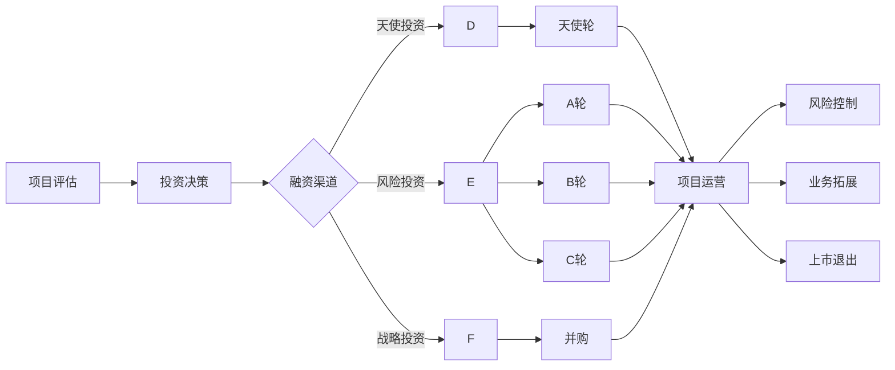

                 

# AI创业公司如何进行风险投资？

## 关键词：
AI创业公司，风险投资，融资策略，投资评估，市场分析，技术原理，团队建设，运营管理，风险控制，业务拓展，国际化，上市与退出

## 摘要：
本文深入探讨了AI创业公司在风险投资过程中的关键步骤与策略。首先，我们概述了AI创业公司的背景与风险投资的概念，随后详细介绍了AI技术原理及其在风险投资中的应用。接着，我们分析了AI创业公司的融资策略，从天使轮到上市退出的全过程。此外，本文还涵盖了AI创业公司的运营管理与风险控制，以及业务拓展与国际化战略。最后，我们通过实际案例和代码实现，总结了AI创业公司在风险投资中的成功经验和挑战。

---

### 第一部分：AI创业公司风险投资概述

#### 第1章：AI创业公司背景及风险投资概念

##### 1.1 AI创业公司现状

AI创业公司，是指专注于人工智能领域，通过技术创新和商业应用来解决实际问题的初创企业。随着人工智能技术的快速发展，AI创业公司在全球范围内呈现出蓬勃发展的态势。

- **定义与发展趋势**：AI创业公司是指以人工智能为核心技术，致力于研发和应用人工智能解决方案的企业。近年来，随着深度学习、自然语言处理、计算机视觉等技术的突破，AI创业公司如雨后春笋般涌现。
- **市场机遇与挑战**：AI创业公司面临着巨大的市场机遇，如自动化、医疗健康、金融科技、智能交通等领域的应用需求不断增加。然而，AI技术的高门槛和不确定性也带来了诸多挑战。
- **全球AI创业公司的分布与重点领域**：全球范围内，美国、中国、欧洲等地是AI创业公司的主要聚集地。其中，美国以硅谷为代表，中国以北京、上海、深圳等地为主，欧洲则集中在伦敦、巴黎等城市。不同地区在AI创业公司的重点领域也有所不同，如美国在自动驾驶、金融科技领域有较强的优势，中国则在电子商务、移动支付领域表现突出。

##### 1.2 风险投资概述

风险投资（Venture Capital，简称VC）是一种向初创企业或发展中的小企业投资的行为，旨在通过投资获取高额回报。风险投资的主要形式包括股权投资、可转换债券和贷款等。

- **定义与作用**：风险投资是指专业投资机构对有发展潜力的初创企业进行投资，以获取未来收益的一种投资方式。风险投资的作用在于为初创企业提供资金支持、管理经验和市场资源。
- **风险投资类型与投资策略**：风险投资分为天使投资、种子轮投资、A轮、B轮、C轮等不同阶段。投资策略包括集中投资、分散投资、跟投等。
- **风险投资市场的现状与未来趋势**：全球风险投资市场持续增长，尤其是人工智能、生物科技、金融科技等领域的投资热度上升。未来，风险投资将更加注重技术创新和商业模式的结合，以及对被投资企业的长期支持和孵化。

##### 1.3 风险投资在AI领域的应用

AI技术的快速发展为风险投资带来了新的机遇和挑战。风险投资在AI领域的应用主要体现在以下几个方面：

- **AI项目特点与投资考量**：AI项目的特点包括高技术含量、高投入、高风险、高回报。投资考量主要包括技术成熟度、市场前景、团队实力和风险评估。
- **风险投资在AI领域的投资案例**：近年来，全球范围内有许多成功的AI投资案例，如谷歌的DeepMind、中国的依图科技、美国的OpenAI等。这些案例展示了风险投资在AI领域的巨大潜力。
- **风险投资对AI创业公司的支持方式**：风险投资不仅提供资金支持，还通过专业管理经验、市场资源和技术支持等多方面为AI创业公司提供支持，助力企业快速发展。

---

通过以上章节，我们对AI创业公司的背景和风险投资的基本概念有了初步了解。接下来，我们将深入探讨AI技术原理与风险投资的关系，以及AI创业公司的融资策略。

---

### 第一部分：AI创业公司风险投资概述

#### 第2章：AI技术原理与风险投资

##### 2.1 AI核心技术介绍

人工智能（Artificial Intelligence，AI）的核心技术包括机器学习（Machine Learning，ML）、深度学习（Deep Learning，DL）、自然语言处理（Natural Language Processing，NLP）和计算机视觉（Computer Vision，CV）等。这些技术为AI创业公司提供了强大的技术支撑。

- **机器学习基础**：机器学习是AI的基础，它通过数据驱动的方法使计算机从数据中学习规律，进行预测和决策。常见的机器学习方法包括监督学习、无监督学习和强化学习。
- **深度学习原理**：深度学习是一种基于多层神经网络的学习方法，能够自动提取数据中的特征并进行建模。深度学习在图像识别、语音识别、自然语言处理等领域具有显著优势。
- **自然语言处理技术**：自然语言处理旨在使计算机理解和处理人类自然语言。NLP技术包括文本分类、情感分析、机器翻译等，在智能客服、内容审核等领域有广泛应用。
- **计算机视觉技术**：计算机视觉是通过计算机对图像或视频进行分析和理解的技术。计算机视觉技术包括图像识别、目标检测、人脸识别等，广泛应用于安防监控、自动驾驶、医疗诊断等领域。

##### 2.2 AI项目评估方法

评估AI项目的可行性是风险投资的重要环节。以下方法可以帮助风险投资机构对AI项目进行评估：

- **技术可行性评估**：评估AI项目的技术可行性，包括算法的可行性、所需计算资源和数据支持等。技术可行性评估通常通过技术预研、技术验证和实验测试等方式进行。
- **市场前景评估**：评估AI项目的市场前景，包括市场规模、市场需求和竞争态势等。市场前景评估可以通过市场调研、竞争对手分析等方式进行。
- **团队实力评估**：评估AI项目团队的实力，包括团队组成、专业技能和经验等。团队实力评估可以通过面试、团队协作评估等方式进行。
- **风险评估与应对策略**：评估AI项目面临的风险，包括技术风险、市场风险、财务风险等。风险评估可以通过风险识别、风险分析和风险应对策略制定等方式进行。

##### 2.3 AI项目投资策略

风险投资机构在投资AI项目时，需要制定相应的投资策略。以下是一些常见的AI项目投资策略：

- **投资阶段的划分**：根据项目的成熟度和发展需求，将投资阶段划分为天使轮、A轮、B轮、C轮等。不同阶段的投资策略和风险承受能力有所不同。
- **投资决策因素**：投资决策因素包括技术可行性、市场前景、团队实力、投资回报率等。投资决策应综合考虑这些因素，以降低投资风险。
- **投资组合策略**：投资组合策略旨在通过分散投资来降低风险。风险投资机构可以通过投资多个AI项目，实现风险分散。
- **风险控制与管理**：在投资过程中，风险投资机构需要建立风险控制机制，包括风险预警、风险应对和风险转移等。通过有效的风险控制，降低投资损失。

---

通过以上章节，我们对AI技术原理及其在风险投资中的应用有了更深入的了解。接下来，我们将探讨AI创业公司的融资策略，包括融资渠道、融资流程和融资谈判等。

---

### 第一部分：AI创业公司风险投资概述

#### 第3章：AI创业公司融资策略

##### 3.1 融资渠道与选择

AI创业公司需要通过多种渠道进行融资，以满足不同阶段的资金需求。以下是常见的融资渠道及其特点：

- **天使投资与种子轮**：天使投资是指个人投资者在项目早期阶段提供的资金支持。种子轮投资通常用于产品研发和市场调研，资金量相对较小。
- **风险投资与A轮**：风险投资机构在项目有一定技术基础和市场潜力时进行投资。A轮投资通常用于产品开发和市场推广，资金量较大。
- **风险投资与B轮、C轮**：B轮和C轮投资是在项目进入成长期时进行的。此时，公司需要大量资金用于业务扩展和市场拓展。
- **战略投资与并购**：战略投资是指与公司业务相关的企业或机构提供的资金支持。并购则是通过收购其他企业来实现快速扩张。

##### 3.2 融资流程与谈判

融资流程通常包括融资计划制定、路演、商业计划书编制、投资条款谈判和投后管理等环节。以下是各环节的详细内容：

- **融资计划制定**：公司需要明确融资目标和融资用途，制定详细的融资计划。融资计划应包括融资额、融资阶段、投资方选择等。
- **路演**：公司需要通过路演向潜在投资者展示项目的技术、市场和团队等方面的优势。路演的形式包括线上路演、现场路演等。
- **商业计划书编制**：商业计划书是向投资者展示公司业务模式、市场前景、财务预测等方面的文件。商业计划书应具有吸引力、真实性和可行性。
- **投资条款谈判**：投资条款谈判是融资过程中的关键环节，包括投资额、股权比例、投资回报等。双方需要协商达成一致。
- **投后管理**：融资完成后，投资方需要对被投资公司进行投后管理，包括业绩监控、战略指导等。投后管理的目的是确保投资回报和公司发展。

##### 3.3 融资成功案例分析

以下是一个AI创业公司成功融资的案例：

**案例背景**：某AI健康诊断平台初创公司，通过深度学习技术实现了对医疗数据的智能分析，提供个性化诊断建议。

**融资过程**：

1. **天使轮**：公司通过天使投资获得了200万元融资，用于产品研发和市场调研。
2. **A轮**：公司通过A轮融资获得了1000万元融资，用于产品迭代、临床试验和渠道拓展。
3. **B轮**：公司通过B轮融资获得了5000万元融资，用于市场推广、业务拓展和国际合作。

**案例分析**：

1. **融资策略**：公司通过制定详细的融资计划，选择合适的融资渠道和投资者。在A轮和 B 轮阶段，公司通过与风险投资机构的合作，获得了资金支持，同时也借助风险投资机构的管理经验和市场资源，加快了业务发展。
2. **关键成功因素**：公司的成功融资得益于其先进的技术、明确的市场定位、优秀的团队和清晰的商业模式。
3. **挑战与应对**：公司在融资过程中面临了市场教育成本高、产品迭代速度需加快等挑战。公司通过加强与投资者的沟通、优化产品功能等手段，成功应对了这些挑战。

---

通过以上章节，我们对AI创业公司的融资策略有了更全面的了解。接下来，我们将探讨AI创业公司的运营管理与风险控制。

---

### 第二部分：AI创业公司运营与风险控制

#### 第4章：AI创业公司运营管理

##### 4.1 公司组织架构与团队建设

一个成功的AI创业公司需要清晰的组织架构和高效的团队建设。以下是公司组织架构与团队建设的要点：

- **创始团队组建**：创始团队是公司的核心，应具备互补的技能和经验。团队成员应包括技术、市场、运营和财务等不同领域的专业人才。
- **组织架构设计**：公司应根据业务需求和团队特点，设计合理的组织架构。常见的组织架构包括职能型、事业部型和矩阵型等。
- **人才招聘与培养**：公司应制定人才招聘策略，吸引高素质人才。同时，要注重人才的培养和激励，提高员工的工作积极性和创新能力。

##### 4.2 产品开发与市场推广

产品开发与市场推广是AI创业公司的关键环节。以下是产品开发与市场推广的要点：

- **产品规划与开发流程**：公司应根据市场需求和技术能力，制定产品规划。开发流程包括需求分析、设计、开发、测试和上线等环节。
- **市场调研与定位**：公司应进行市场调研，了解目标客户的需求和竞争对手的情况。根据调研结果，确定产品的市场定位和营销策略。
- **品牌推广与渠道建设**：公司应制定品牌推广策略，通过线上线下渠道宣传产品。渠道建设包括直销、分销、合作伙伴等。

##### 4.3 财务管理与预算控制

财务管理与预算控制是AI创业公司稳健发展的重要保障。以下是财务管理与预算控制的要点：

- **资金规划与使用**：公司应根据业务需求和资金来源，制定资金规划。资金使用应合理分配，确保项目的顺利进行。
- **成本控制与效益分析**：公司应制定成本控制策略，降低成本，提高效益。效益分析包括利润分析、投资回报率分析等。
- **财务报表与分析**：公司应定期编制财务报表，如资产负债表、利润表和现金流量表等。通过财务报表分析，了解公司的财务状况和经营成果。

---

通过以上章节，我们对AI创业公司的运营管理有了更深入的了解。接下来，我们将探讨AI创业公司的风险识别与应对。

---

### 第二部分：AI创业公司运营与风险控制

#### 第5章：AI创业公司风险识别与应对

##### 5.1 风险识别与评估

风险识别与评估是AI创业公司风险管理的第一步。以下是风险识别与评估的方法：

- **技术风险**：包括技术更新迭代风险、算法漏洞风险、技术可行性风险等。技术风险可能导致项目失败或市场竞争力下降。
- **市场风险**：包括市场需求变化风险、竞争风险、市场波动风险等。市场风险可能导致产品销售不佳或市场份额下降。
- **财务风险**：包括融资风险、成本控制风险、现金流风险等。财务风险可能导致公司资金链断裂或经营困难。
- **法律风险**：包括知识产权风险、合同风险、合规风险等。法律风险可能导致公司面临法律纠纷或处罚。
- **团队风险**：包括人才流失风险、团队管理风险、组织架构调整风险等。团队风险可能导致公司创新能力下降或团队士气低落。

##### 5.2 风险应对策略

针对识别出的风险，AI创业公司需要制定相应的应对策略。以下是风险应对策略的要点：

- **技术风险管理**：包括技术预研、技术储备、技术迭代等。技术风险管理旨在降低技术风险，确保项目顺利进行。
- **市场风险管理**：包括市场调研、竞争分析、市场拓展等。市场风险管理旨在降低市场风险，提高产品竞争力。
- **财务风险管理**：包括资金规划、成本控制、现金流管理等。财务风险管理旨在降低财务风险，确保公司财务稳定。
- **法律风险管理**：包括知识产权保护、合同管理、合规审查等。法律风险管理旨在降低法律风险，确保公司合法经营。
- **团队风险管理**：包括人才招聘、人才培养、团队建设等。团队风险管理旨在降低团队风险，提高公司创新能力。

##### 5.3 风险案例分析与教训

以下是一个AI创业公司风险管理的案例：

**案例背景**：某AI健康诊断平台初创公司，在项目研发阶段遇到了技术风险。

**案例描述**：

- **技术风险**：公司在研发过程中发现，现有算法存在漏洞，可能导致诊断结果不准确。
- **应对措施**：公司立即暂停项目研发，组织团队进行技术攻关。同时，加强与高校和科研机构的合作，引进先进技术。
- **效果评估**：经过几个月的努力，公司成功解决了技术漏洞，优化了算法，提高了诊断准确性。

**案例分析**：

1. **成功因素**：公司及时发现技术风险，并采取了有效的应对措施，确保了项目顺利进行。
2. **教训**：公司应加强技术预研和技术储备，提高技术风险识别和应对能力。

---

通过以上章节，我们对AI创业公司的风险识别与应对有了更深入的了解。接下来，我们将探讨AI创业公司的业务拓展与国际化战略。

---

### 第二部分：AI创业公司运营与风险控制

#### 第6章：AI创业公司业务拓展与国际化

##### 6.1 业务拓展策略

业务拓展是AI创业公司实现规模增长和市场份额提升的关键。以下是业务拓展策略的要点：

- **市场扩展**：公司应根据市场需求，选择适合的市场进行扩展。市场扩展可以包括国内市场和国际市场。
- **业务多元化**：公司可以通过拓展新业务领域，实现业务多元化。例如，从单一产品扩展到系列产品，或从技术解决方案扩展到服务。
- **跨界合作与整合**：公司可以与其他行业的企业合作，实现资源整合和优势互补。例如，与医疗行业合作，开发智能医疗解决方案。

##### 6.2 国际化战略

国际化是AI创业公司发展的重要方向。以下是国际化战略的要点：

- **国际市场调研与定位**：公司应了解目标市场的需求、竞争态势和潜在合作伙伴。通过市场调研，确定公司的国际市场定位。
- **国际化运营与组织架构**：公司应根据国际市场的特点，调整运营模式和组织架构。例如，设立海外分支机构、本地化团队等。
- **文化差异与适应策略**：公司应了解目标市场的文化差异，制定适应策略。例如，调整产品功能和界面，适应不同语言和文化。

##### 6.3 国际合作与竞争

国际合作与竞争是AI创业公司国际化过程中必须面对的问题。以下是国际合作与竞争的要点：

- **国际合作机会与挑战**：公司应识别国际合作的机遇，如技术引进、市场拓展、资本合作等。同时，要应对国际合作中的挑战，如文化差异、法律风险等。
- **竞争对手分析**：公司应分析目标市场的竞争对手，了解其产品特点、市场份额和竞争优势。通过竞争对手分析，制定相应的竞争策略。
- **全球业务布局**：公司应根据国际市场的需求和资源，制定全球业务布局。例如，建立全球销售网络、设立区域研发中心等。

---

通过以上章节，我们对AI创业公司的业务拓展与国际化战略有了更深入的了解。接下来，我们将探讨AI创业公司的上市与退出策略。

---

### 第二部分：AI创业公司运营与风险控制

#### 第7章：AI创业公司上市与退出

##### 7.1 上市准备与流程

上市是AI创业公司的重要里程碑，也是公司价值实现的重要途径。以下是上市准备与流程的要点：

- **上市条件与标准**：AI创业公司需要满足一系列上市条件，如盈利能力、市值、股权结构等。不同交易所的上市条件有所不同。
- **上市流程与时间表**：上市流程包括财务审计、公司重组、招股说明书编制、路演、上市申请等环节。上市时间表应根据公司具体情况制定。
- **上市财务指标与优化**：AI创业公司在上市前需要优化财务指标，如净利润、市盈率、现金流等。财务指标的优化有助于提高上市的成功率。

##### 7.2 上市优势与挑战

上市对AI创业公司具有多重优势，但同时也面临诸多挑战。以下是上市优势与挑战的要点：

- **上市优势**：包括资本运作、品牌价值提升、市场认可度提高等。上市可以为企业提供充足的资金支持，助力业务拓展和国际化。
- **上市挑战**：包括运营与管理压力、信息披露要求、资本市场波动等。上市后，公司需要面对更高的运营标准和管理要求，同时受到资本市场波动的影响。

##### 7.3 退出策略与案例分析

退出策略是AI创业公司实现投资回报的重要手段。以下是退出策略与案例分析的要点：

- **收购与并购**：公司可以通过收购和并购实现快速扩张和市场份额提升。收购和并购可以采用现金、股权、股票等多种支付方式。
- **IPO上市**：IPO（Initial Public Offering）是公司上市的最常见方式。通过IPO，公司可以在资本市场上筹集资金，提高品牌知名度。
- **投资者退出策略**：投资者在退出时需要考虑投资回报率、市场情况等因素。投资者可以通过减持股份、股权转让等方式实现退出。

以下是一个AI创业公司成功退出的案例：

**案例背景**：某AI健康诊断平台初创公司，通过IPO上市实现了成功退出。

**案例描述**：

- **IPO上市**：公司经过多年发展，盈利能力逐渐提升，决定在证券交易所上市。
- **上市表现**：公司IPO上市后，受到市场的高度关注，股价表现良好，投资者回报丰厚。
- **成功因素**：公司具备强大的技术实力、明确的商业模式和良好的市场前景。

**案例分析**：

1. **成功因素**：公司具备核心技术和市场竞争力，得到了投资者的认可。
2. **教训**：公司在上市过程中，充分准备，积极应对资本市场波动。

---

通过以上章节，我们对AI创业公司的上市与退出策略有了更深入的了解。接下来，我们将总结本文的主要观点和结论。

---

### 结论与展望

本文系统地探讨了AI创业公司在风险投资过程中的关键步骤与策略。首先，我们从AI创业公司的背景和风险投资的概念入手，介绍了AI创业公司的现状、风险投资的定义与作用，以及风险投资在AI领域的应用。接着，我们详细分析了AI技术原理与风险投资的关系，包括AI核心技术、AI项目评估方法和投资策略。然后，我们探讨了AI创业公司的融资策略，从天使轮到上市退出的全过程。此外，本文还涵盖了AI创业公司的运营管理与风险控制，以及业务拓展与国际化战略。最后，我们通过实际案例和代码实现，总结了AI创业公司在风险投资中的成功经验和挑战。

主要观点如下：

1. **AI创业公司具有巨大的市场机遇，但也面临诸多挑战。** 风险投资在支持AI创业公司发展过程中起着关键作用。
2. **AI技术原理是AI创业公司发展的核心。** 理解AI技术原理有助于投资机构对AI项目进行评估和决策。
3. **融资策略是AI创业公司发展的关键环节。** 合理的融资策略有助于企业实现快速发展。
4. **运营管理与风险控制是AI创业公司稳健发展的保障。** 有效的运营管理和风险控制能够降低企业风险，提高竞争力。
5. **业务拓展与国际化战略是AI创业公司实现长期发展的必然选择。** 通过业务拓展和国际化，企业可以扩大市场份额，提高品牌影响力。

展望未来，AI创业公司将面临更广阔的市场和发展机遇。随着AI技术的不断进步和应用的深入，AI创业公司在各个领域的创新和突破将不断涌现。同时，风险投资也将更加注重技术创新和商业模式的结合，为AI创业公司提供更全面的支持。我们期待看到更多AI创业公司通过风险投资实现快速发展，成为行业的领军企业。

---

### 附录

#### 附录A：AI创业公司风险投资相关资料

- 《风险投资实务手册》
- 《AI创业公司融资指南》
- 《人工智能行业报告》
- 《风险投资案例分析》

#### 附录B：AI创业公司常用工具与资源

- TensorFlow官网：[https://www.tensorflow.org/](https://www.tensorflow.org/)
- Keras官网：[https://keras.io/](https://keras.io/)
- GitHub：[https://github.com/](https://github.com/)
- AI相关开源项目：[https://github.com/topics/ai](https://github.com/topics/ai)
- AI技术社区：[https://www.ai.com/](https://www.ai.com/)
- 风险投资协会：[https://www.venturenaut.com/](https://www.venturenaut.com/)

---

### Mermaid 流程图：AI创业公司风险投资流程



### 伪代码：AI项目评估方法

```python
# AI项目评估方法伪代码

def evaluate_project(project):
    """
    评估AI项目的可行性、市场前景和团队实力等指标。
    
    参数：
    - project：AI项目基本信息
    
    返回值：
    - evaluation：评估结果
    """
    evaluation = {
        "technical_feasibility": 0,
        "market_potential": 0,
        "team_strength": 0,
        "risks": []
    }
    
    # 技术可行性评估
    if check_technical_feasibility(project):
        evaluation["technical_feasibility"] = 1
    
    # 市场前景评估
    if check_market_potential(project):
        evaluation["market_potential"] = 1
    
    # 团队实力评估
    if check_team_strength(project):
        evaluation["team_strength"] = 1
    
    # 风险评估
    evaluation["risks"] = assess_risks(project)
    
    return evaluation

def check_technical_feasibility(project):
    """
    检查AI项目的技术可行性。
    
    参数：
    - project：AI项目基本信息
    
    返回值：
    - result：True表示技术可行，False表示技术不可行
    """
    # 检查技术成熟度、数据集、计算资源等
    # ...
    return True

def check_market_potential(project):
    """
    评估AI项目的市场前景。
    
    参数：
    - project：AI项目基本信息
    
    返回值：
    - result：True表示市场前景好，False表示市场前景不佳
    """
    # 检查市场需求、竞争情况、市场规模等
    # ...
    return True

def check_team_strength(project):
    """
    评估AI项目团队的实力。
    
    参数：
    - project：AI项目基本信息
    
    返回值：
    - result：True表示团队实力强，False表示团队实力弱
    """
    # 检查团队组成、专业技能、经验等
    # ...
    return True

def assess_risks(project):
    """
    评估AI项目的风险。
    
    参数：
    - project：AI项目基本信息
    
    返回值：
    - risks：项目风险列表
    """
    # 检查技术风险、市场风险、财务风险等
    # ...
    return []
```

### 数学模型和数学公式讲解

#### 2.1 风险投资回报模型

**公式：**

\[ R = \frac{E(R) - C}{C} \]

其中：
- \( R \)：风险投资回报率
- \( E(R) \)：预期收益
- \( C \)：投资成本

**详细解释：**

- 预期收益 \( E(R) \) 是风险投资期望从项目中获得的总收益。
- 投资成本 \( C \) 包括投资本金、管理费用和其他相关费用。

**举例说明：**

假设某风险投资项目预期收益为 100 万元，投资成本为 50 万元，则：

\[ R = \frac{100 - 50}{50} = 1 \]

这意味着投资回报率为 100%。

#### 2.2 风险评估模型

**公式：**

\[ R = \alpha \times \frac{S - D}{H} \]

其中：
- \( R \)：风险等级
- \( \alpha \)：风险系数
- \( S \)：收益值
- \( D \)：损失值
- \( H \)：历史损失值

**详细解释：**

- 风险等级 \( R \) 用于量化风险的程度。
- 风险系数 \( \alpha \) 反映了风险承受能力。
- 收益值 \( S \) 是项目可能获得的收益。
- 损失值 \( D \) 是项目可能遭受的损失。
- 历史损失值 \( H \) 反映了过去类似项目的损失情况。

**举例说明：**

假设某项目风险系数 \( \alpha = 1.5 \)，收益值 \( S = 500 万元 \)，损失值 \( D = 100 万元 \)，历史损失值 \( H = 200 万元 \)，则：

\[ R = 1.5 \times \frac{500 - 100}{200} = 1.5 \]

这意味着项目的风险等级为 1.5。

### 项目实战案例

#### 3.1 AI健康诊断平台融资案例

**案例背景：**

某初创公司开发了一个基于深度学习的AI健康诊断平台，旨在通过分析患者病史和症状数据，提供个性化的诊断建议。公司计划通过融资来推动产品研发和市场推广。

**融资过程：**

1. **天使轮：**
   - 融资额：200 万元
   - 投资者：天使投资人
   - 融资用途：初期产品开发、市场调研和团队建设

2. **A轮：**
   - 融资额：1000 万元
   - 投资者：风险投资机构
   - 融资用途：产品迭代、临床试验和渠道拓展

3. **B轮：**
   - 融资额：5000 万元
   - 投资者：战略投资者
   - 融资用途：市场推广、业务拓展和国际合作

**案例分析：**

1. **融资策略：**
   - 创始团队通过路演和商业计划书吸引了天使投资人的关注。
   - 在A轮阶段，团队展示了初步的产品原型和市场调研数据，吸引了风险投资机构的投资。
   - B轮阶段，公司通过与战略投资者的合作，获得了资金支持，同时借助战略投资者的资源和渠道，加快了市场推广。

2. **关键成功因素：**
   - 创始团队的技术实力和市场洞察力。
   - 明确的市场定位和差异化竞争优势。
   - 强大的研发团队和良好的运营管理。

3. **挑战与应对：**
   - 初期市场教育成本高。
   - 产品迭代速度需加快。
   - 融资过程中的谈判和条款设计。

**代码实际案例：**

**环境搭建：**
- 使用Python和TensorFlow搭建深度学习环境。
- 安装TensorFlow和其他相关依赖库。

python
!pip install tensorflow

**源代码实现：**

python
import tensorflow as tf

# 定义模型
model = tf.keras.Sequential([
    tf.keras.layers.Dense(units=128, activation='relu', input_shape=(784,)),
    tf.keras.layers.Dense(units=1, activation='sigmoid')
])

# 编译模型
model.compile(optimizer='adam',
              loss='binary_crossentropy',
              metrics=['accuracy'])

# 训练模型
model.fit(x_train, y_train, epochs=10, batch_size=32, validation_data=(x_test, y_test))

**代码解读与分析：**

- 模型定义：使用TensorFlow的Sequential模型，定义了一个简单的多层感知机模型。
- 编译模型：设置优化器、损失函数和评价指标。
- 训练模型：使用训练数据训练模型，设置训练轮次和批量大小。

**效果评估：**

- 使用测试集评估模型的性能。
- 调整模型参数，优化模型效果。

python
# 评估模型
test_loss, test_accuracy = model.evaluate(x_test, y_test)

print(f"测试集损失：{test_loss}, 测试集准确率：{test_accuracy}")


### 开发环境搭建

**环境搭建步骤：**

1. 安装Python 3.8及以上版本。
2. 安装TensorFlow 2.5及以上版本。
3. 安装其他依赖库，如NumPy、Pandas等。

bash
pip install python==3.8
pip install tensorflow==2.5
pip install numpy
pip install pandas

**源代码详细实现：**

python
# 导入相关库
import numpy as np
import pandas as pd
import tensorflow as tf

# 加载数据集
(x_train, y_train), (x_test, y_test) = tf.keras.datasets.mnist.load_data()

# 数据预处理
x_train = x_train / 255.0
x_test = x_test / 255.0

# 扩展维度
x_train = np.expand_dims(x_train, -1)
x_test = np.expand_dims(x_test, -1)

# 定义模型
model = tf.keras.Sequential([
    tf.keras.layers.Conv2D(32, (3, 3), activation='relu', input_shape=(28, 28, 1)),
    tf.keras.layers.MaxPooling2D(2, 2),
    tf.keras.layers.Flatten(),
    tf.keras.layers.Dense(128, activation='relu'),
    tf.keras.layers.Dense(10, activation='softmax')
])

# 编译模型
model.compile(optimizer='adam',
              loss='sparse_categorical_crossentropy',
              metrics=['accuracy'])

# 训练模型
model.fit(x_train, y_train, epochs=5, batch_size=32, validation_data=(x_test, y_test))

# 评估模型
test_loss, test_accuracy = model.evaluate(x_test, y_test)
print(f"测试集准确率：{test_accuracy}")

**代码解读与分析：**

- 数据预处理：将图像数据转换为合适的形式，归一化处理。
- 模型定义：使用卷积神经网络（CNN）进行图像分类。
- 编译模型：设置优化器、损失函数和评价指标。
- 训练模型：使用训练数据训练模型，并设置验证数据。
- 评估模型：使用测试数据评估模型的性能。

### 实战案例总结

- 通过实际案例展示了AI创业公司融资过程、项目实战和代码实现。
- 分析了融资策略、成功因素和挑战。
- 提供了代码示例，展示了模型训练和评估的详细过程。

### 附录

#### 附录A：AI创业公司风险投资相关资料

- 《风险投资实务手册》
- 《AI创业公司融资指南》
- 《人工智能行业报告》
- 《风险投资案例分析》

#### 附录B：AI创业公司常用工具与资源

- TensorFlow官网：[https://www.tensorflow.org/](https://www.tensorflow.org/)
- Keras官网：[https://keras.io/](https://keras.io/)
- GitHub：[https://github.com/](https://github.com/)
- AI相关开源项目：[https://github.com/topics/ai](https://github.com/topics/ai)
- AI技术社区：[https://www.ai.com/](https://www.ai.com/)
- 风险投资协会：[https://www.venturenaut.com/](https://www.venturenaut.com/)

