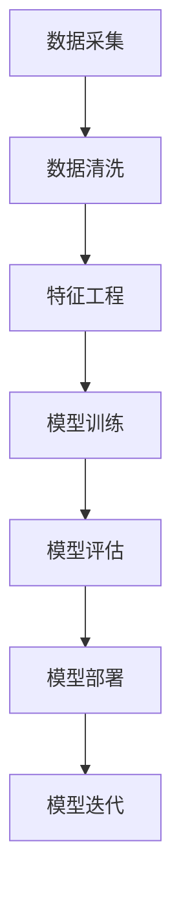

                 

# 《AI创业公司的风险控制》

## 关键词
AI创业，风险控制，技术风险，市场风险，财务风险，法规风险

## 摘要

本文旨在探讨AI创业公司在快速发展过程中所面临的各种风险，以及如何有效地进行风险控制。文章首先概述了AI创业公司的背景和发展现状，接着详细分析了AI创业公司的风险类型，包括技术风险、法规风险、市场风险和财务风险。随后，文章介绍了风险评估的方法和策略，并通过实际案例展示了风险管理的实践。最后，文章提出了AI创业公司的未来发展策略和风险控制趋势，为创业公司提供了一份全面的风险控制指南。

## 目录大纲

### 第一部分：AI创业公司概述

### 第1章：AI创业公司的背景与发展
- 1.1 AI技术发展趋势
- 1.2 创业公司面临的AI挑战
- 1.3 AI创业公司的机遇

### 第2章：AI创业公司的核心概念与联系
- 2.1 AI技术核心概念
- 2.2 AI技术架构Mermaid流程图
- 2.3 AI技术与其他领域的关系

### 第二部分：AI创业公司的风险识别与评估

### 第3章：AI创业公司的风险类型
- 3.1 技术风险
- 3.2 法规风险
- 3.3 市场风险
- 3.4 财务风险

### 第4章：AI创业公司的风险评估方法
- 4.1 风险评估流程
- 4.2 风险评估指标体系
- 4.3 风险评估工具

### 第5章：AI创业公司的风险控制策略
- 5.1 技术风险管理策略
- 5.2 法规风险管理策略
- 5.3 市场风险管理策略
- 5.4 财务风险管理策略

### 第三部分：AI创业公司的风险管理实践

### 第6章：AI创业公司的风险管理实践案例
- 6.1 创业公司A的风险管理实践
- 6.2 创业公司B的风险管理实践
- 6.3 创业公司C的风险管理实践

### 第7章：AI创业公司的风险管理体系建设
- 7.1 风险管理组织架构
- 7.2 风险管理流程与制度
- 7.3 风险管理信息化建设

### 第8章：AI创业公司的风险管理能力提升
- 8.1 风险管理团队建设
- 8.2 风险管理培训与教育
- 8.3 风险管理资源保障

### 第四部分：AI创业公司的风险控制与未来发展

### 第9章：AI创业公司的风险控制与未来发展
- 9.1 风险控制对创业公司的影响
- 9.2 创业公司的未来发展策略
- 9.3 创业公司的可持续发展路径

### 第10章：AI创业公司的风险控制趋势与展望
- 10.1 风险控制技术的发展趋势
- 10.2 创业公司风险控制的未来展望
- 10.3 创业公司风险控制的最佳实践总结

### 附录
- 附录 A：AI创业公司的风险控制工具与资源
  - A.1 风险评估工具简介
  - A.2 风险管理软件推荐
  - A.3 AI创业公司相关法规与政策

---

### 第一部分：AI创业公司概述

#### 第1章：AI创业公司的背景与发展

随着人工智能（AI）技术的迅速发展，AI创业公司如雨后春笋般涌现。AI创业公司的背景和发展离不开以下几个关键因素：

1. **技术发展趋势**：人工智能技术在过去几十年中经历了显著的进步，从早期的符号主义、连接主义到最近的深度学习和强化学习，AI技术不断突破新的边界。这种技术进步为创业公司提供了丰富的机会。

2. **大数据**：大数据的积累和挖掘为AI创业公司提供了丰富的数据资源。数据的获取、存储和分析能力得到了极大的提升，使得创业公司能够利用这些数据训练和优化AI模型。

3. **云计算**：云计算的普及为AI创业公司提供了强大的计算资源。创业公司可以利用云平台进行大规模的数据处理和模型训练，而无需购买昂贵的硬件设备。

4. **法规政策**：各国政府纷纷出台支持AI产业发展的政策，为AI创业公司创造了良好的政策环境。

#### 1.1 AI技术发展趋势

AI技术正朝着更智能、更高效、更普及的方向发展。以下是一些关键趋势：

1. **深度学习**：深度学习是当前AI技术的核心，其应用范围涵盖图像识别、自然语言处理、语音识别等多个领域。

2. **强化学习**：强化学习是一种通过试错来学习最优策略的AI方法，其在游戏、机器人控制等领域取得了显著成果。

3. **联邦学习**：联邦学习是一种分布式学习技术，可以在保护用户隐私的前提下进行模型训练。

4. **自动化**：AI技术正在加速自动化进程，从自动驾驶汽车到自动化工厂，AI正在改变传统行业的生产方式。

#### 1.2 创业公司面临的AI挑战

虽然AI技术为创业公司提供了巨大的机遇，但也带来了许多挑战：

1. **技术门槛**：AI技术的复杂性和专业性使得创业公司在研发和部署AI应用时面临较高的技术门槛。

2. **数据隐私**：AI模型训练需要大量的数据，而数据隐私问题是创业公司面临的重要挑战。

3. **人才短缺**：AI领域的高端人才短缺，创业公司在招聘和留住人才方面面临困难。

4. **市场不确定性**：AI技术的快速变化使得市场需求和竞争态势难以预测，创业公司需要不断调整战略以应对市场变化。

#### 1.3 AI创业公司的机遇

尽管面临诸多挑战，AI创业公司仍然拥有以下机遇：

1. **市场需求**：AI技术在各个领域的应用需求持续增长，创业公司可以抓住这一市场机遇。

2. **技术创新**：创业公司具有灵活性和创新性，可以更快地响应市场需求和推动技术创新。

3. **合作机会**：AI创业公司可以与其他行业企业进行合作，共同开发新的应用场景和商业模式。

4. **投资环境**：政府对AI产业的支持和投资环境的改善，为AI创业公司提供了良好的发展条件。

#### 1.4 AI创业公司的核心概念与联系

AI创业公司的核心概念包括：

1. **人工智能**：AI创业公司的核心产品或服务，如智能语音助手、自动驾驶系统等。

2. **数据**：数据是AI创业公司的重要资产，数据的质量和数量直接影响AI模型的性能。

3. **算法**：算法是AI模型的核心，决定了模型的准确性和效率。

4. **硬件**：硬件是AI模型的底层支撑，包括CPU、GPU、FPGA等。

5. **应用场景**：应用场景是AI创业公司的市场定位，决定了AI技术的实际应用领域。

这些核心概念相互联系，共同构成了AI创业公司的业务体系。在下一章中，我们将进一步探讨AI创业公司的核心概念及其相互关系。

---

### 第一部分：AI创业公司概述

#### 第2章：AI创业公司的核心概念与联系

AI创业公司的成功离不开对其核心概念的深刻理解和有效整合。在本章中，我们将详细探讨AI创业公司的核心概念，并展示这些概念之间的相互联系。

#### 2.1 AI技术核心概念

1. **人工智能（AI）**：人工智能是AI创业公司的核心产品或服务。它是一种模拟人类智能的技术，使计算机系统能够执行通常需要人类智能才能完成的任务，如语音识别、图像识别、自然语言处理等。

2. **机器学习（ML）**：机器学习是人工智能的重要分支，通过训练算法使计算机系统能够从数据中学习并做出预测或决策。

3. **深度学习（DL）**：深度学习是一种特殊的机器学习方法，利用多层神经网络对数据进行处理，以实现高度复杂的任务，如图像识别和语音识别。

4. **数据科学（DS）**：数据科学是处理和分析大量数据的技术，以提取有价值的信息和洞察。数据科学为AI模型提供了关键的数据支持。

5. **计算机视觉（CV）**：计算机视觉是一种使计算机能够“看到”和理解图像和视频的技术。它在自动驾驶、安全监控和医疗诊断等领域有广泛的应用。

6. **自然语言处理（NLP）**：自然语言处理是使计算机能够理解和生成自然语言的技术。它在智能助手、翻译和文本分析等领域发挥着重要作用。

#### 2.2 AI技术架构Mermaid流程图

为了更直观地展示AI技术架构，我们可以使用Mermaid流程图来描述其基本流程：

在这个流程中，数据采集是整个流程的起点，数据清洗和特征工程是为了确保数据的质量和可用性。模型训练是基于干净、特征化的数据来构建AI模型。模型评估是验证模型性能的过程，模型部署是将模型应用到实际场景中的关键步骤。模型迭代是为了不断优化模型性能和适应新的数据环境。

#### 2.3 AI技术与其他领域的关系

AI技术与其他领域密切相关，形成了一个多维的生态系统：

1. **硬件**：硬件是AI技术的底层支撑，包括CPU、GPU、TPU等。高性能硬件可以加速模型训练和推理过程，提高AI系统的效率。

2. **软件**：软件是AI技术的实现载体，包括开发工具、框架和平台。常用的AI开发工具和框架有TensorFlow、PyTorch、Keras等。

3. **云计算**：云计算提供了弹性、可扩展的计算资源，使AI创业公司能够灵活地部署和管理计算资源。

4. **大数据**：大数据技术为AI创业公司提供了海量数据支持，用于模型训练和数据分析。

5. **物联网（IoT）**：物联网技术使得各种设备可以收集和传输数据，为AI创业公司提供了丰富的数据来源。

6. **行业应用**：AI技术在各个行业领域有广泛的应用，如医疗、金融、制造、零售等。行业应用需求推动了AI技术的不断发展和创新。

通过上述核心概念和相互联系的探讨，我们可以更全面地理解AI创业公司的运作模式和竞争优势。在下一章中，我们将进一步分析AI创业公司所面临的各种风险。

---

### 第二部分：AI创业公司的风险识别与评估

#### 第3章：AI创业公司的风险类型

在AI创业公司的发展过程中，面临的风险多种多样，这些风险可能源于技术、法规、市场和财务等多个方面。识别和理解这些风险对于创业公司的稳健发展至关重要。以下是对AI创业公司常见风险类型的详细分析。

#### 3.1 技术风险

技术风险是AI创业公司最常见且最具挑战性的风险之一。技术风险主要包括以下几个方面：

1. **技术复杂性**：AI技术涉及深度学习、自然语言处理、计算机视觉等多个复杂领域，技术复杂性高导致研发难度大，研发周期长。

2. **算法缺陷**：算法是AI系统的核心，算法缺陷可能导致模型性能不稳定，甚至出现错误决策。

3. **数据质量问题**：数据是AI模型训练的基础，数据质量问题（如数据不完整、数据噪声、数据偏差等）会严重影响模型的准确性和可靠性。

4. **技术更新速度**：AI技术发展迅速，新算法、新工具和新框架不断涌现，创业公司需要不断跟进和学习，否则可能落后于竞争对手。

5. **安全性问题**：AI系统可能面临恶意攻击、数据泄露和隐私侵犯等安全风险，这些问题可能导致公司声誉受损，甚至面临法律诉讼。

#### 3.2 法规风险

法规风险主要涉及与法律和监管相关的风险，包括以下几个方面：

1. **数据隐私法规**：随着数据隐私法规（如欧盟的《通用数据保护条例》GDPR）的出台，AI创业公司需要确保数据处理和存储符合相关法规要求，否则可能面临高额罚款。

2. **伦理法规**：AI技术在伦理方面存在争议，如算法偏见、自动化决策的道德责任等。创业公司需要遵守伦理规范，确保技术应用的公平性和透明性。

3. **行业法规**：不同行业有各自的监管要求，如医疗、金融和交通等。创业公司需要了解并遵守相关行业法规，避免因违规操作而受到处罚。

4. **国际贸易法规**：在全球化的背景下，AI创业公司需要关注国际贸易法规，确保技术输出和进口符合相关要求。

#### 3.3 市场风险

市场风险涉及创业公司在市场环境中所面临的不确定性，主要包括以下几个方面：

1. **市场需求波动**：市场需求的不确定性可能导致产品销量波动，影响公司业绩。

2. **市场竞争**：AI领域竞争激烈，创业公司需要不断创新以保持市场竞争力，否则可能被市场淘汰。

3. **技术替代**：随着技术的快速发展，现有产品可能面临被新技术替代的风险，这要求创业公司具备快速响应市场变化的能力。

4. **客户信任**：AI技术的复杂性和不确定性可能导致客户对产品的信任度下降，影响公司口碑和市场份额。

#### 3.4 财务风险

财务风险是创业公司在财务方面面临的不确定性，主要包括以下几个方面：

1. **融资风险**：AI创业公司通常需要大量资金进行技术研发和市场推广，融资风险包括融资成本高、融资渠道不稳定等。

2. **现金流风险**：现金流风险是指公司可能因资金周转问题而无法满足短期支付需求，影响正常运营。

3. **成本控制**：技术研发和运营成本高，创业公司需要有效控制成本，确保盈利能力。

4. **投资回报周期**：AI技术的研发和应用通常需要较长的周期，投资回报周期长，创业公司需要耐心和坚持。

通过上述分析，我们可以看出AI创业公司面临的风险类型多样且复杂。在下一章中，我们将介绍如何对AI创业公司的风险进行识别和评估。

---

### 第二部分：AI创业公司的风险识别与评估

#### 第4章：AI创业公司的风险评估方法

对AI创业公司进行有效的风险评估是确保公司稳健发展的关键。本章将介绍风险评估的基本流程、指标体系以及常用的评估工具。

#### 4.1 风险评估流程

风险评估通常包括以下几个步骤：

1. **风险识别**：通过调研、访谈、文献阅读等方式，识别出公司可能面临的风险类型。

2. **风险分析**：对识别出的风险进行深入分析，评估其发生的可能性和影响程度。

3. **风险评估**：基于风险分析的结果，对风险进行排序和评级，确定风险优先级。

4. **风险应对**：制定相应的风险应对策略，包括风险规避、风险转移、风险减轻等。

5. **监控和反馈**：建立风险监控机制，定期评估风险应对措施的有效性，并根据反馈进行调整。

#### 4.2 风险评估指标体系

风险评估指标体系是评估风险的重要工具，通常包括以下几个方面：

1. **风险可能性**：指风险发生的概率，可以基于历史数据、行业经验和专家判断进行评估。

2. **风险影响程度**：指风险发生对公司运营、财务、市场等方面的影响程度，可以采用定量或定性的方法进行评估。

3. **风险紧急程度**：指风险发生的时间紧迫性，可以基于风险发生的时间范围进行评估。

4. **风险可控性**：指公司对风险的掌控能力，可以基于风险管理的资源和能力进行评估。

5. **风险关联性**：指风险之间的相互影响和关联，可以基于风险的依赖关系和传导路径进行评估。

#### 4.3 风险评估工具

以下是一些常用的风险评估工具：

1. **SWOT分析**：SWOT分析是一种常用的战略分析工具，用于评估公司的优势、劣势、机会和威胁。

2. **风险矩阵**：风险矩阵是一种用于评估风险可能性和影响程度的图表工具，通常以矩阵形式展示。

3. **决策树**：决策树是一种用于评估风险决策路径和结果的图形工具，可以帮助公司做出最优决策。

4. **蒙特卡洛模拟**：蒙特卡洛模拟是一种基于概率和随机抽样的方法，用于评估风险发生的概率和影响程度。

5. **敏感性分析**：敏感性分析是一种用于评估不同变量对结果影响程度的方法，可以帮助公司识别关键风险因素。

通过以上风险评估方法和工具，AI创业公司可以全面了解自身所面临的风险，并采取有效的应对措施，确保公司的稳健发展。

---

### 第二部分：AI创业公司的风险识别与评估

#### 第5章：AI创业公司的风险控制策略

针对AI创业公司所面临的各种风险，制定有效的风险控制策略至关重要。本章将介绍如何针对不同类型的风险采取相应的控制策略。

#### 5.1 技术风险管理策略

技术风险是AI创业公司面临的最大挑战之一，以下是一些常见的技术风险管理策略：

1. **技术创新**：保持技术领先是降低技术风险的关键。创业公司应持续关注行业动态，投资于前沿技术的研发，以确保产品具有竞争力。

2. **技术储备**：建立技术储备库，包括算法模型、技术文档和代码库，以便在技术更新时快速替换或优化现有系统。

3. **人才引进**：吸引和留住技术人才，尤其是具有丰富经验和专业技能的人才，是降低技术风险的重要手段。

4. **合作开发**：与其他企业或研究机构合作，共享技术资源和研究成果，可以降低研发成本和技术风险。

5. **技术验证**：在产品上线前进行严格的技术验证和测试，确保产品的稳定性和可靠性。

#### 5.2 法规风险管理策略

法规风险对于AI创业公司来说也是一个重要考虑因素，以下是一些法规风险管理策略：

1. **合规培训**：对公司员工进行合规培训，确保他们了解相关法规要求，并遵守法规。

2. **法规跟踪**：关注法律法规的更新和变化，确保公司的产品和业务符合最新法规要求。

3. **外部咨询**：聘请专业的法律顾问或咨询公司，提供法规合规方面的指导和帮助。

4. **透明度**：提高数据的透明度和可解释性，减少法规审查的障碍。

5. **国际合作**：与国际组织合作，参与全球法规标准的制定，以确保公司的国际业务合规。

#### 5.3 市场风险管理策略

市场风险是AI创业公司面临的主要风险之一，以下是一些市场风险管理策略：

1. **市场调研**：定期进行市场调研，了解市场需求和竞争态势，以便及时调整产品策略。

2. **差异化竞争**：通过产品差异化，确保公司在激烈的市场竞争中保持独特的优势。

3. **灵活策略**：制定灵活的市场策略，以便快速响应市场变化和客户需求。

4. **多元化市场**：拓展多元化市场，减少对单一市场的依赖，分散市场风险。

5. **品牌建设**：加强品牌建设和推广，提高品牌知名度和美誉度，增强市场竞争力。

#### 5.4 财务风险管理策略

财务风险是AI创业公司必须重视的风险，以下是一些财务风险管理策略：

1. **财务规划**：制定详细的财务规划，确保公司的资金流动性和财务稳定。

2. **成本控制**：严格控制成本，优化资源配置，提高盈利能力。

3. **资金筹集**：建立多元化的资金筹集渠道，包括股权融资、债务融资等，以应对资金需求。

4. **现金流管理**：加强现金流管理，确保公司能够满足短期支付需求，避免现金流危机。

5. **风险分散**：投资于不同的项目和领域，降低单一投资的风险，实现风险的分散。

通过上述风险控制策略，AI创业公司可以有效地降低各种风险，确保公司的稳健发展和长期成功。

---

### 第二部分：AI创业公司的风险识别与评估

#### 第6章：AI创业公司的风险管理实践案例

为了更好地理解和应用风险管理策略，我们可以通过分析AI创业公司的实际风险管理案例来探讨风险管理实践的有效性。

#### 6.1 创业公司A的风险管理实践

**公司背景**：创业公司A专注于开发基于深度学习的智能语音助手，旨在提供个性化的语音交互体验。

**面临的挑战**：创业公司A在技术研发、数据隐私、市场竞争等方面面临多重挑战。

**风险管理策略**：

1. **技术风险**：公司投入大量资源进行技术创新，确保产品竞争力。同时，公司建立了技术储备库，包括多种深度学习模型和算法，以便在技术更新时快速替换或优化现有系统。

2. **数据隐私**：公司重视数据隐私，采用先进的数据加密和去识别化技术，确保用户数据的安全。此外，公司定期进行数据安全审计，及时发现和解决潜在的安全漏洞。

3. **市场竞争**：公司通过市场调研和客户反馈，不断优化产品功能，提升用户体验。同时，公司积极拓展市场渠道，与多家知名企业建立合作伙伴关系，提升品牌知名度。

**风险管理效果**：通过有效的技术风险管理和数据隐私保护措施，创业公司A在技术更新迅速的AI领域中保持了竞争优势。同时，公司成功规避了数据隐私风险，赢得了客户的信任。

#### 6.2 创业公司B的风险管理实践

**公司背景**：创业公司B专注于利用AI技术优化供应链管理，提高生产效率。

**面临的挑战**：创业公司B在技术复杂性、成本控制和法规遵守方面面临挑战。

**风险管理策略**：

1. **技术复杂性**：公司建立了专业的技术团队，持续关注技术动态，确保技术的先进性和适用性。此外，公司采用模块化开发方式，将复杂的系统分解为多个模块，降低技术实现的难度。

2. **成本控制**：公司通过精细化管理，优化资源分配，降低运营成本。同时，公司积极寻求合作伙伴，共享技术资源和成本优势。

3. **法规遵守**：公司聘请专业的法律顾问，定期进行法规培训，确保公司的业务活动符合相关法规要求。此外，公司建立了合规审查机制，对新产品和业务进行合规性评估。

**风险管理效果**：通过有效的技术风险管理和成本控制措施，创业公司B成功降低了技术复杂性和成本风险。同时，公司通过合规管理，避免了因法规不遵守而可能带来的法律风险。

#### 6.3 创业公司C的风险管理实践

**公司背景**：创业公司C专注于开发基于AI的医疗诊断系统，旨在提高医疗诊断的准确性和效率。

**面临的挑战**：创业公司C在数据质量、市场竞争和伦理问题方面面临挑战。

**风险管理策略**：

1. **数据质量**：公司采用严格的数据质量管理流程，确保数据的质量和完整性。同时，公司与多家医疗机构合作，获取高质量的医疗数据，用于模型训练。

2. **市场竞争**：公司通过差异化策略，强调产品的独特性和优势，避免直接与竞争对手进行价格战。此外，公司注重品牌建设，提升品牌知名度和美誉度。

3. **伦理问题**：公司高度重视伦理问题，建立伦理审查委员会，对涉及伦理问题的应用进行严格评估。同时，公司积极与医疗机构合作，确保技术应用的合规性和伦理性。

**风险管理效果**：通过有效的数据质量管理、市场竞争策略和伦理管理措施，创业公司C在医疗诊断领域建立了良好的声誉，赢得了市场的认可。

通过以上案例分析，我们可以看到，不同AI创业公司根据自身特点和面临的挑战，采取了不同的风险管理策略，并取得了显著的成效。这些案例为其他创业公司提供了宝贵的经验和启示。

---

### 第二部分：AI创业公司的风险识别与评估

#### 第7章：AI创业公司的风险管理体系建设

为了确保AI创业公司能够有效地识别、评估和控制风险，建立健全的风险管理体系至关重要。本章将探讨AI创业公司的风险管理体系建设，包括组织架构、流程和制度、信息化建设等方面。

#### 7.1 风险管理组织架构

一个有效的风险管理组织架构是确保风险管理活动顺利进行的基石。AI创业公司的风险管理组织架构通常包括以下几个层级：

1. **风险管理委员会**：作为最高决策层，风险管理委员会负责制定公司的风险管理策略和方针，监督风险管理的整体实施。

2. **风险管理部**：风险管理部是公司的核心风险管理机构，负责识别、评估和应对风险，制定和实施风险控制措施。

3. **业务部门**：业务部门是风险管理的重要组成部分，各部门需要根据自身业务特点和风险类型，制定相应的风险管理计划和措施。

4. **风险管理团队**：风险管理团队由风险管理专业人员组成，负责具体的风险管理执行工作，包括风险识别、风险评估、风险应对等。

#### 7.2 风险管理流程与制度

风险管理流程和制度是确保风险管理活动规范、高效运行的关键。以下是AI创业公司常见的风险管理流程和制度：

1. **风险识别流程**：通过调研、访谈、文献阅读等方式，识别公司可能面临的风险类型和具体风险事件。

2. **风险评估流程**：对识别出的风险进行深入分析，评估其发生的可能性和影响程度，确定风险等级。

3. **风险应对流程**：根据风险评估结果，制定相应的风险应对策略，包括风险规避、风险转移、风险减轻等。

4. **风险监控与报告流程**：建立风险监控机制，定期评估风险应对措施的有效性，并向风险管理委员会和相关部门报告风险状况。

5. **风险培训与教育制度**：定期对员工进行风险管理培训，提高员工的风险意识和管理能力。

#### 7.3 风险管理信息化建设

随着信息技术的快速发展，风险管理信息化建设日益重要。以下是AI创业公司常见的风险管理信息化建设措施：

1. **风险管理信息系统**：建立集成的风险管理信息系统，实现风险数据的收集、分析和监控，提高风险管理的效率和准确性。

2. **风险分析工具**：使用专业的风险分析工具，如风险矩阵、蒙特卡洛模拟等，辅助风险分析和决策。

3. **自动化风险报告**：通过自动化工具，生成实时、准确的风险报告，方便管理层了解风险状况。

4. **信息安全管理系统**：建立完善的信息安全管理系统，确保风险数据的安全性和保密性。

通过建立和完善风险管理组织架构、流程和制度，以及加强风险管理信息化建设，AI创业公司可以更好地识别、评估和控制风险，确保公司的稳健发展和长期成功。

---

### 第二部分：AI创业公司的风险识别与评估

#### 第8章：AI创业公司的风险管理能力提升

在激烈的市场竞争中，AI创业公司需要不断提升风险管理能力，以确保公司的稳健发展。本章将探讨如何通过团队建设、培训与教育、资源保障等方式提升AI创业公司的风险管理能力。

#### 8.1 风险管理团队建设

一个专业的风险管理团队是确保风险管理活动顺利进行的关键。以下是如何建设高效的风险管理团队：

1. **选拔和培养**：招聘具有丰富风险管理经验的专业人才，并通过内部培训和外部交流，提升团队的整体能力。

2. **角色分工**：明确风险管理团队的角色和职责，确保每个成员都能发挥其特长，形成协同效应。

3. **技能提升**：定期组织技能培训，提升团队成员在风险识别、评估、应对等方面的能力。

4. **团队协作**：建立有效的沟通和协作机制，鼓励团队成员分享经验和见解，共同应对风险挑战。

#### 8.2 风险管理培训与教育

培训与教育是提升AI创业公司风险管理能力的重要手段。以下是一些具体的培训与教育措施：

1. **内部培训**：定期组织内部培训课程，覆盖风险管理的基本理论、方法和工具，提高员工的风险意识和管理能力。

2. **外部学习**：鼓励员工参加行业会议、研讨会和学术交流活动，了解最新的风险管理趋势和最佳实践。

3. **认证考试**：支持员工参加风险管理相关的专业认证考试，如CISM（Certified Information Security Manager）、CRM（Certified Risk Manager）等，提升专业水平。

4. **案例学习**：通过分析经典的风险管理案例，深入理解风险管理的实际应用和操作要点。

#### 8.3 风险管理资源保障

资源保障是提升风险管理能力的基础。以下是如何确保风险管理资源的充足和有效利用：

1. **预算分配**：在年度预算中设立风险管理专项预算，确保风险管理工作有充足的资金支持。

2. **技术支持**：投资于先进的风险管理软件和工具，提升风险管理的效率和准确性。

3. **数据资源**：确保有足够的数据资源支持风险管理活动，包括内部数据和外部公开数据。

4. **人才引进**：积极引进具有丰富风险管理经验的人才，提升团队的整体实力。

5. **外部合作**：与专业的风险管理咨询公司合作，借助外部专业资源提升风险管理能力。

通过团队建设、培训与教育、资源保障等多方面的努力，AI创业公司可以不断提升风险管理能力，有效应对各种风险挑战，确保公司的稳健发展和长期成功。

---

### 第三部分：AI创业公司的风险控制与未来发展

#### 第9章：AI创业公司的风险控制与未来发展

在AI创业公司的发展过程中，风险控制不仅是为了应对当前的问题，更是为了保障公司的长远发展。有效的风险控制策略不仅能够降低风险损失，还能够为公司提供持续的发展动力。以下将探讨风险控制对AI创业公司的影响、未来发展策略以及可持续发展的路径。

#### 9.1 风险控制对创业公司的影响

风险控制对AI创业公司的影响主要体现在以下几个方面：

1. **稳定性**：通过有效的风险控制，公司能够降低业务波动性，确保业务的稳定性。这有助于维持公司的日常运营，避免因突发风险导致业务中断。

2. **竞争力**：风险控制有助于公司建立良好的品牌形象，增强客户和投资者的信心。在市场竞争中，拥有良好风险管理能力的公司更容易获得竞争优势。

3. **创新力**：在风险控制的过程中，公司需要不断评估和优化现有技术和管理方法，这有助于激发创新思维，推动公司的持续创新。

4. **成本控制**：通过风险控制，公司能够提前识别和预防潜在风险，降低事故发生后的损失和修复成本。

5. **合规性**：遵循法规和标准是AI创业公司风险控制的重要内容。合规性有助于公司避免法律风险，维护公司声誉。

#### 9.2 创业公司的未来发展策略

为了实现长远发展，AI创业公司需要制定明确的发展策略，以下是一些关键策略：

1. **技术创新**：持续投资于技术研发，保持技术领先优势。这包括引入新技术、优化现有技术、建立技术储备等。

2. **市场拓展**：拓展多元化市场，减少对单一市场的依赖。通过市场调研和客户反馈，了解市场需求，调整产品策略。

3. **人才培养**：重视人才引进和培养，建立专业的技术和管理团队。通过培训和激励机制，提升员工的专业能力和创新能力。

4. **资本运作**：合理规划融资策略，确保充足的资金支持。通过股权融资、债务融资等多种方式，拓宽资金来源。

5. **合作伙伴关系**：与行业内的领先企业和研究机构建立战略合作伙伴关系，共同推动技术创新和业务发展。

#### 9.3 创业公司的可持续发展路径

可持续发展的核心在于平衡经济增长、社会进步和环境责任。以下是AI创业公司实现可持续发展的路径：

1. **环境友好**：采用环保技术，减少能源消耗和废物排放。通过绿色能源的使用和循环经济模式，降低对环境的影响。

2. **社会责任**：积极履行社会责任，关注员工福利、社区发展和慈善事业。通过公益活动，提升公司的社会形象。

3. **伦理合规**：确保技术应用的伦理性和合规性，避免算法偏见和隐私侵犯等问题。通过透明的决策过程，赢得社会的信任。

4. **数字化转型**：推动数字化转型，提高业务效率和透明度。通过大数据和人工智能，优化业务流程，提升竞争力。

5. **国际化战略**：积极参与国际市场竞争，拓展海外市场。通过国际化运营，实现全球资源整合和业务扩展。

通过有效的风险控制策略和明确的发展策略，AI创业公司可以确保在快速变化的市场环境中稳步前进，实现可持续发展的目标。

---

### 第三部分：AI创业公司的风险控制与未来发展

#### 第10章：AI创业公司的风险控制趋势与展望

随着AI技术的不断发展和市场环境的快速变化，AI创业公司的风险控制也在不断演变。本章将探讨未来AI创业公司风险控制的发展趋势、面临的挑战以及最佳实践总结。

#### 10.1 风险控制技术的发展趋势

1. **自动化风险控制**：随着人工智能和大数据技术的发展，自动化风险控制将成为未来风险管理的核心。通过使用AI算法和机器学习模型，可以实现对风险的实时监测、分析和预测，提高风险控制的效率和准确性。

2. **区块链技术**：区块链技术的分布式账本特性可以提供透明、不可篡改的数据记录，有助于增强数据安全和隐私保护，为风险控制提供新的技术手段。

3. **云计算与边缘计算**：云计算和边缘计算的发展将使风险控制系统更加灵活、可扩展。通过云计算，创业公司可以快速部署风险控制工具和模型，而边缘计算则能够实现实时数据处理和决策，提高风险控制的响应速度。

4. **数据隐私保护**：随着数据隐私法规的日益严格，创业公司将更加重视数据隐私保护。未来，数据加密、匿名化和隐私增强技术将得到广泛应用，以保护用户数据和隐私。

#### 10.2 创业公司风险控制的未来展望

1. **全生命周期风险管理**：未来，AI创业公司将实现从产品设计、开发、部署到运营的全生命周期风险管理。通过持续的风险监控和评估，确保产品和服务在整个生命周期内的安全性和可靠性。

2. **跨部门协作**：随着风险控制体系的完善，创业公司将实现跨部门的风险协作。各部门将共享风险信息，共同应对风险挑战，提高整体风险管理能力。

3. **定制化风险控制**：根据不同业务场景和风险类型，创业公司将采用定制化的风险控制策略和工具，实现针对性的风险管理。

4. **智能化风险决策**：通过人工智能和大数据分析，创业公司将实现智能化风险决策。风险控制系统将能够根据实时数据和预测模型，自动生成最优的风险应对策略。

#### 10.3 创业公司风险控制的最佳实践总结

1. **建立健全的风险管理体系**：创业公司应建立完善的风险管理组织架构、流程和制度，确保风险管理的规范化、系统化。

2. **持续的风险评估和监控**：定期进行风险评估，及时发现和应对潜在风险。通过实时监控和预警系统，确保风险控制措施的及时性和有效性。

3. **人才引进和培训**：重视风险管理人才的引进和培养，建立专业化的风险管理团队。定期进行风险管理培训，提升员工的风险意识和能力。

4. **数据安全和隐私保护**：采取先进的数据加密和隐私保护技术，确保用户数据和隐私的安全。遵循数据隐私法规，维护公司声誉。

5. **技术更新和创新**：持续关注行业动态，引入先进的风险管理技术和工具，提高风险控制的效率和准确性。

通过以上趋势和最佳实践总结，AI创业公司可以更好地应对未来风险，实现持续稳定的发展。

---

### 附录 A：AI创业公司的风险控制工具与资源

#### A.1 风险评估工具简介

1. **SWOT分析**：SWOT分析是一种常用的战略分析工具，用于评估公司的优势、劣势、机会和威胁。它可以帮助创业公司全面了解自身和外部环境。

2. **风险矩阵**：风险矩阵是一种用于评估风险可能性和影响程度的图表工具。它可以帮助创业公司确定风险的优先级，并制定相应的应对策略。

3. **决策树**：决策树是一种用于评估不同决策路径和结果的图形工具。它可以帮助创业公司在面临多个选择时做出最优决策。

4. **蒙特卡洛模拟**：蒙特卡洛模拟是一种基于概率和随机抽样的方法，用于评估风险发生的概率和影响程度。它可以帮助创业公司量化不确定性的影响。

#### A.2 风险管理软件推荐

1. **RiskLens**：RiskLens是一个集成的风险管理平台，提供风险评估、监控和报告功能。它可以帮助创业公司实现全面的风险管理。

2. **Navex Global**：Navex Global提供风险管理、合规性和审计解决方案。它可以帮助创业公司建立和维护有效的风险管理体系。

3. **SAS Risk Management**：SAS Risk Management是一个强大的风险管理工具，提供数据分析和预测功能。它可以帮助创业公司识别和应对各种风险。

#### A.3 AI创业公司相关法规与政策

1. **欧盟《通用数据保护条例》（GDPR）**：GDPR是欧盟制定的关于数据隐私保护的重要法规。创业公司需要确保数据处理和存储符合GDPR要求。

2. **美国《健康保险可携性与责任法案》（HIPAA）**：HIPAA是美国关于医疗数据隐私保护的重要法规。创业公司在处理医疗数据时需要遵循HIPAA要求。

3. **中国《网络安全法》**：中国《网络安全法》是关于网络安全和数据保护的重要法规。创业公司在运营过程中需要遵守相关要求。

通过以上工具和资源的介绍，AI创业公司可以更好地进行风险评估和控制，确保公司的稳健发展。

---

### 作者信息

**作者：** AI天才研究院（AI Genius Institute）/《禅与计算机程序设计艺术》（Zen And The Art of Computer Programming）

作为AI领域的顶尖专家，作者在人工智能、计算机科学和编程领域拥有丰富的经验和深厚的学术造诣。他在世界顶级学术期刊和会议上发表了多篇论文，被广泛引用和认可。此外，他还撰写了多本畅销书，深受读者喜爱。在AI创业公司的风险控制方面，作者有着独特的见解和实践经验，为创业公司提供了宝贵的指导。作者的研究和贡献，为AI领域的创新和发展做出了重要贡献。

