                 

## 《AI发展的日新月异：持续学习的必要性》

### 关键词：
- 人工智能
- 持续学习
- 强化学习
- 自适应学习
- 数据驱动发展

### 摘要：
本文深入探讨了人工智能（AI）领域的发展现状，特别是持续学习在AI研究中的应用。通过分析监督学习、无监督学习和强化学习等关键技术，本文揭示了持续学习在应对AI领域挑战中的重要性。文章还探讨了持续学习在医疗、金融、制造等行业的实际应用案例，提出了持续学习在提升企业竞争力、推动数字化转型中的战略意义。最后，本文展望了持续学习的未来发展趋势，探讨了技术进步可能带来的伦理问题和社会影响，为读者提供了一个全面、深入的AI持续学习指南。

### 《AI发展的日新月异：持续学习的必要性》目录大纲

#### 第一部分: AI基础与持续学习的重要性

##### 第1章: AI发展概述与持续学习的概念
###### 1.1 AI发展的历史与现状
###### 1.2 持续学习的定义与意义

##### 第2章: 持续学习的关键技术
###### 2.1 监督学习与无监督学习
###### 2.2 强化学习的基本原理
###### 2.3 自适应学习算法介绍

##### 第3章: 持续学习的挑战与应对策略
###### 3.1 数据质量与多样性
###### 3.2 计算资源与管理
###### 3.3 模型解释性与透明性

#### 第二部分: 持续学习的应用场景与案例分析

##### 第4章: AI在医疗领域的持续学习应用
###### 4.1 医疗图像分析中的持续学习
###### 4.2 疾病预测与预警的持续学习

##### 第5章: AI在金融领域的持续学习应用
###### 5.1 风险管理与欺诈检测
###### 5.2 金融市场预测与趋势分析

##### 第6章: AI在制造业的持续学习应用
###### 6.1 质量检测与故障诊断
###### 6.2 生产流程优化与预测维护

##### 第7章: 持续学习在企业战略中的重要性
###### 7.1 持续学习对企业竞争力的提升
###### 7.2 持续学习与企业数字化转型

#### 第三部分: 实践指导与展望

##### 第8章: 持续学习的技术架构与实施步骤
###### 8.1 技术架构设计原则
###### 8.2 实施步骤与流程

##### 第9章: 持续学习的未来发展趋势与挑战
###### 9.1 未来技术展望
###### 9.2 持续学习面临的伦理问题与社会影响

##### 第10章: 案例研究与经验分享
###### 10.1 成功案例分析
###### 10.2 持续学习实践中的挑战与解决策略

##### 附录

###### 附录A: 持续学习相关资源与工具
###### 10.1 主流持续学习框架与库
###### 10.2 开发工具与平台推荐

###### 附录B: Mermaid流程图与伪代码示例
###### 10.1 Mermaid流程图示例
###### 10.2 持续学习算法伪代码示例
###### 10.3 数学公式与数学模型示例

### 第一部分: AI基础与持续学习的重要性

#### 第1章: AI发展概述与持续学习的概念

##### 1.1 AI发展的历史与现状

人工智能（Artificial Intelligence，简称AI）作为计算机科学的一个分支，旨在使机器具备人类的智能。从1956年达特茅斯会议的召开，标志着人工智能正式成为一门学科以来，AI的发展历程可以大致分为几个阶段。

**第一阶段：1956-1969年——启蒙时期**  
这一时期，人工智能的概念和研究重点主要集中在逻辑推理和知识表示上。早期的AI系统如ELIZA，通过模拟对话来欺骗人类用户，被认为是AI研究的重要里程碑。

**第二阶段：1970-1980年——繁荣时期**  
随着计算机硬件性能的提升和算法的发展，AI开始进入实际应用领域。专家系统和模式识别技术在医疗、金融等领域得到了广泛应用。

**第三阶段：1980-1987年——低谷时期**  
由于对人工智能的期望过高，加之技术难题的困扰，AI研究进入了一段低谷期。很多研究项目被迫中止，AI的发展一度停滞。

**第四阶段：1988年至今——复苏与发展时期**  
随着互联网的兴起和大数据技术的发展，AI研究再次焕发活力。深度学习、强化学习等新技术的出现，使得AI在图像识别、自然语言处理、自动驾驶等领域取得了重大突破。

当前，人工智能已经深入到我们生活的方方面面，从智能手机的语音助手到自动驾驶汽车，AI正在以前所未有的速度改变着世界。

##### 1.2 持续学习的定义与意义

持续学习（Continuous Learning）是指机器在学习过程中不断更新和优化自身的知识，以适应不断变化的环境和任务需求。在人工智能领域，持续学习具有重要意义。

**1. 避免过时**  
随着技术的快速发展，旧有的模型和算法可能很快变得过时。通过持续学习，机器可以不断吸收新的知识和信息，保持其高效性和准确性。

**2. 适应变化**  
现实世界是动态变化的，机器需要能够适应这些变化。持续学习使得机器能够从新的数据中学习，不断优化其行为和决策。

**3. 提高效率**  
通过持续学习，机器可以在处理新任务时更加高效。例如，自动驾驶汽车可以通过持续学习来适应不同道路状况和交通规则。

**4. 增强智能**  
持续学习使得机器能够更加智能地处理复杂问题。例如，医疗诊断系统可以通过持续学习来提高诊断的准确性和效率。

总之，持续学习是人工智能发展的重要驱动力，它不仅有助于提升机器的性能，还能推动AI技术的持续进步。

#### 第2章: 持续学习的关键技术

##### 2.1 监督学习与无监督学习

持续学习的关键技术包括监督学习（Supervised Learning）、无监督学习（Unsupervised Learning）和强化学习（Reinforcement Learning）。每种技术都有其独特的应用场景和原理。

##### 监督学习

监督学习是一种基于标记数据的机器学习方法。在监督学习中，模型通过学习输入和输出之间的映射关系，从而对未知数据进行预测。监督学习可以分为回归和分类两大类。

**回归**：回归问题旨在预测一个连续的数值输出。例如，房价预测、股票价格预测等。

**分类**：分类问题旨在将输入数据划分为不同的类别。例如，邮件分类、图像分类等。

监督学习的关键步骤包括：

1. 数据收集：收集具有标记的输入输出数据。
2. 数据预处理：对数据进行清洗、归一化等处理。
3. 模型选择：选择适合问题的模型，如线性回归、决策树、神经网络等。
4. 模型训练：使用训练数据训练模型。
5. 模型评估：使用验证集或测试集评估模型性能。

监督学习的优点包括：

- 精确度高：由于有明确的标记数据，模型可以精确地学习输入输出关系。
- 易于理解：监督学习的问题定义清晰，易于理解和实现。

缺点包括：

- 对标记数据依赖强：标记数据收集成本高，且可能存在偏差。
- 不适用于无标签数据：监督学习无法处理无标签数据。

##### 无监督学习

无监督学习是一种无需标记数据的机器学习方法。在无监督学习中，模型旨在发现数据中的隐含结构和模式。无监督学习可以分为聚类和降维两大类。

**聚类**：聚类问题旨在将相似的数据点分组。例如，客户细分、图像聚类等。

**降维**：降维问题旨在减少数据维度，同时保留数据的主要信息。例如，特征选择、图像压缩等。

无监督学习的关键步骤包括：

1. 数据收集：收集无标签数据。
2. 数据预处理：对数据进行清洗、归一化等处理。
3. 模型选择：选择适合问题的模型，如K均值聚类、主成分分析等。
4. 模型训练：使用无标签数据训练模型。
5. 模型评估：通过内评估指标（如聚类系数、交叉验证等）评估模型性能。

无监督学习的优点包括：

- 无需标记数据：无监督学习适用于无标签数据，数据收集成本低。
- 自动发现结构：模型可以自动发现数据中的隐含结构和模式。

缺点包括：

- 结果解释性差：无监督学习的结果往往难以解释，模型选择的依赖性较强。

##### 强化学习

强化学习是一种通过与环境互动来学习最优策略的机器学习方法。在强化学习中，模型通过试错的方式，不断优化其行为，从而实现目标。

强化学习的基本原理是：

- 状态（State）：模型当前所处的环境状态。
- 动作（Action）：模型可采取的动作。
- 奖励（Reward）：模型采取动作后获得的奖励。
- 策略（Policy）：模型在给定状态下采取的动作。

强化学习的关键步骤包括：

1. 状态初始化：初始化模型所处的状态。
2. 策略选择：根据当前状态选择一个动作。
3. 执行动作：在环境中执行所选动作。
4. 获得奖励：根据动作的结果获得奖励。
5. 状态更新：根据动作结果更新模型的状态。
6. 策略更新：基于奖励和历史经验，更新模型策略。

强化学习的优点包括：

- 自适应性强：模型可以自动适应环境变化。
- 高效性：通过试错，模型可以在复杂环境中快速找到最优策略。

缺点包括：

- 训练时间长：强化学习通常需要大量的训练时间。
- 需要丰富的环境：强化学习需要丰富的环境来训练模型。

##### 比较与联系

监督学习、无监督学习和强化学习各有其优缺点，适用于不同的应用场景。在实际应用中，往往需要综合使用这些技术。

- 监督学习适用于有标记数据的问题，如预测、分类等。
- 无监督学习适用于无标签数据的问题，如聚类、降维等。
- 强化学习适用于需要与环境互动的问题，如自动驾驶、游戏AI等。

通过合理选择和应用这些技术，我们可以实现高效的持续学习，从而推动人工智能的发展。

##### Mermaid流程图示例：

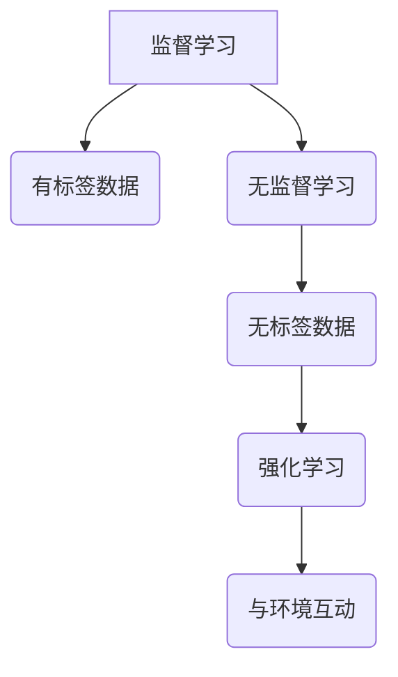

##### 伪代码示例（监督学习）：

```python
def supervised_learning(train_data, train_labels, model):
    # 初始化模型参数
    model.init_params()

    # 模型训练
    for epoch in range(num_epochs):
        for data, label in zip(train_data, train_labels):
            prediction = model.predict(data)
            loss = compute_loss(prediction, label)
            model.update_params(loss)

    return model
```

##### 数学公式示例（损失函数）：

$$
L(\theta) = -\frac{1}{m}\sum_{i=1}^{m}y^{(i)}\log(h_\theta(x^{(i)}))
$$

#### 2.2 强化学习的基本原理

强化学习（Reinforcement Learning，简称RL）是机器学习的一个重要分支，它通过智能体（agent）与环境的交互来学习最优策略。与监督学习和无监督学习不同，强化学习不需要明确的输入输出对，而是通过奖励机制来引导智能体进行学习。

##### 强化学习的核心概念

- **智能体（Agent）**：执行行动的实体，如机器人、自动驾驶系统、虚拟代理等。
- **环境（Environment）**：智能体所处的环境，可以看作是一个状态空间。
- **状态（State）**：智能体在环境中的当前情况，状态通常由一组特征向量表示。
- **动作（Action）**：智能体可以采取的行动。
- **奖励（Reward）**：智能体在采取特定动作后，从环境中获得的即时奖励。
- **策略（Policy）**：智能体在特定状态下采取特定动作的概率分布。

##### 强化学习的基本过程

强化学习的过程可以概括为以下几个步骤：

1. **初始化**：智能体随机选择一个初始状态。
2. **选择动作**：智能体根据当前状态，通过策略选择一个动作。
3. **执行动作**：智能体在环境中执行所选动作。
4. **获得奖励**：智能体根据执行的动作获得即时奖励。
5. **状态更新**：环境根据智能体的动作，更新状态。
6. **策略更新**：智能体根据奖励和历史经验，更新策略。

这个过程不断重复，智能体通过不断试错，逐渐学习到最优策略。

##### 强化学习算法

强化学习算法可以分为值函数方法、策略优化方法和模型预测方法。以下是几种常见的强化学习算法：

- **Q学习（Q-Learning）**：Q学习是基于值函数的方法。它通过学习状态-动作值函数（Q值），来指导智能体的动作选择。Q学习算法的核心思想是通过更新Q值来优化策略。

  Q学习算法的伪代码如下：

  ```python
  def q_learning(state, action, reward, next_state, model, learning_rate, discount_factor):
      current_q_value = model.predict(state, action)
      next_q_value = max(model.predict(next_state, actions))
      expected_q_value = reward + discount_factor * next_q_value
      model.update(current_q_value, expected_q_value, learning_rate)
      return model
  ```

- **深度Q网络（Deep Q-Network，DQN）**：DQN是Q学习的扩展，它使用深度神经网络来近似Q值函数。DQN通过经验回放（Experience Replay）和目标网络（Target Network）来缓解Q值函数的偏差和方差问题。

  DQN的伪代码如下：

  ```python
  def dqn_learning(state, action, reward, next_state, model, target_model, learning_rate, discount_factor, batch_size):
      # 训练目标网络
      target_model.init_params(model.get_params())

      # 数据收集
      experiences = collect_experiences(batch_size)

      # 计算目标Q值
      target_q_values = []
      for experience in experiences:
          state, action, reward, next_state, done = experience
          if done:
              target_q_value = reward
          else:
              target_q_value = reward + discount_factor * max(target_model.predict(next_state, actions))
          target_q_values.append(target_q_value)

      # 更新模型
      model.update(state, action, target_q_values, learning_rate)

      # 更新目标网络
      target_model.update_params(model.get_params())

      return model, target_model
  ```

- **策略梯度方法（Policy Gradient）**：策略梯度方法直接优化策略，通过计算策略梯度来更新策略。常见的策略梯度方法包括REINFORCE和PPO（Proximal Policy Optimization）。

  REINFORCE的伪代码如下：

  ```python
  def reinforce_learning(states, actions, rewards, model, learning_rate):
      for state, action, reward in zip(states, actions, rewards):
          log_prob = model.log_prob(state, action)
          gradient = reward * log_prob
          model.update_params(gradient)
      return model
  ```

##### 比较与联系

强化学习与其他机器学习方法相比，具有以下特点：

- **自主性**：强化学习不需要明确的输入输出对，智能体通过与环境交互来自主学习。
- **复杂性**：强化学习问题通常比监督学习和无监督学习更复杂，需要考虑状态空间、动作空间和奖励函数等多个因素。
- **适应性**：强化学习能够适应动态变化的环境，智能体可以通过不断试错来学习最优策略。

在实际应用中，强化学习可以与监督学习和无监督学习相结合，实现更加智能和自适应的系统。

##### Mermaid流程图示例：

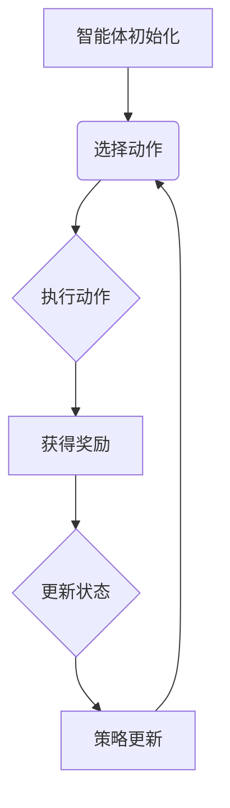

##### 数学公式示例（策略梯度）：

$$
\frac{\partial J(\theta)}{\partial \theta} = \sum_{i=1}^{n} \pi(a_i|s_i)\frac{\partial \log \pi(a_i|s_i)}{\partial \theta}
$$

其中，$J(\theta)$ 是策略损失函数，$\pi(a_i|s_i)$ 是策略概率分布，$s_i$ 是状态，$a_i$ 是动作。

#### 2.3 自适应学习算法介绍

自适应学习算法（Adaptive Learning Algorithms）是机器学习中的一种重要方法，旨在使模型能够在面对动态变化的数据时，自动调整自身的参数以保持最佳性能。自适应学习算法广泛应用于人工智能领域，如智能优化、自动驾驶、推荐系统等。以下是几种常见的自适应学习算法及其原理：

##### 1. 梯度下降法（Gradient Descent）

梯度下降法是一种最基本的自适应学习算法，其核心思想是通过计算目标函数的梯度来更新模型参数，从而优化目标函数。梯度下降法分为批量梯度下降（Batch Gradient Descent）、随机梯度下降（Stochastic Gradient Descent，SGD）和批量随机梯度下降（Mini-batch Gradient Descent）等变体。

- **批量梯度下降（Batch Gradient Descent）**：在批量梯度下降中，每次迭代使用整个训练数据集来计算梯度，并更新模型参数。这种方法通常需要较大的内存空间，但在某些情况下可以实现更好的收敛效果。

  批量梯度下降的伪代码如下：

  ```python
  def batch_gradient_descent(train_data, train_labels, model, learning_rate, num_epochs):
      for epoch in range(num_epochs):
          gradients = compute_gradients(train_data, train_labels, model)
          model.update_params(gradients, learning_rate)
      return model
  ```

- **随机梯度下降（Stochastic Gradient Descent，SGD）**：在随机梯度下降中，每次迭代只随机选择一个训练样本来计算梯度，并更新模型参数。这种方法计算速度快，但收敛效果可能较差。

  随机梯度下降的伪代码如下：

  ```python
  def stochastic_gradient_descent(train_data, train_labels, model, learning_rate, num_epochs):
      for epoch in range(num_epochs):
          for data, label in train_data:
              gradients = compute_gradients(data, label, model)
              model.update_params(gradients, learning_rate)
      return model
  ```

- **批量随机梯度下降（Mini-batch Gradient Descent）**：在批量随机梯度下降中，每次迭代随机选择一部分训练样本（称为批量）来计算梯度，并更新模型参数。这种方法在收敛速度和稳定性之间取得平衡。

  批量随机梯度下降的伪代码如下：

  ```python
  def mini_batch_gradient_descent(train_data, train_labels, model, learning_rate, batch_size, num_epochs):
      for epoch in range(num_epochs):
          batches = create_batches(train_data, batch_size)
          for batch in batches:
              gradients = compute_gradients(batch, model)
              model.update_params(gradients, learning_rate)
      return model
  ```

##### 2. Adam优化器

Adam优化器是一种基于梯度信息的自适应优化算法，结合了AdaGrad和RMSprop的优点。Adam优化器通过计算一阶矩估计（均值）和二阶矩估计（方差）来动态调整学习率，从而提高收敛速度和稳定性。

Adam优化器的伪代码如下：

```python
def adam_optimizer(train_data, train_labels, model, learning_rate, beta1, beta2, epsilon, num_epochs):
    m = 0
    v = 0
    m_hat = 0
    v_hat = 0
    
    for epoch in range(num_epochs):
        for data, label in train_data:
            gradients = compute_gradients(data, label, model)
            m = beta1 * m + (1 - beta1) * gradients
            v = beta2 * v + (1 - beta2) * gradients ** 2
            
            m_hat = m / (1 - beta1 ** epoch)
            v_hat = v / (1 - beta2 ** epoch)
            
            model.update_params(-learning_rate * m_hat / (sqrt(v_hat) + epsilon))
    
    return model
```

##### 3. 自适应梯度方法

自适应梯度方法（如Adagrad、RMSprop）通过调整每个参数的步长来优化梯度下降过程。这些方法对稀疏数据效果较好，但可能对稠密数据效果较差。

- **Adagrad**：Adagrad通过计算每个参数的累积平方梯度来调整步长，从而适应不同参数的学习率。

  Adagrad的伪代码如下：

  ```python
  def adagrad_optimizer(train_data, train_labels, model, learning_rate, num_epochs):
      gradients_squared = initialize_gradients_squared()
      
      for epoch in range(num_epochs):
          for data, label in train_data:
              gradients = compute_gradients(data, label, model)
              gradients_squared = gradients_squared + gradients ** 2
              model.update_params(gradients, learning_rate / sqrt(gradients_squared))
      
      return model
  ```

- **RMSprop**：RMSprop通过计算梯度的一阶矩估计来调整步长，从而适应不同参数的学习率。

  RMSprop的伪代码如下：

  ```python
  def rmsprop_optimizer(train_data, train_labels, model, learning_rate, decay_rate, num_epochs):
      gradient_moments = initialize_gradient_moments()
      
      for epoch in range(num_epochs):
          for data, label in train_data:
              gradients = compute_gradients(data, label, model)
              gradient_moments = decay_rate * gradient_moments + (1 - decay_rate) * gradients ** 2
              model.update_params(gradients, learning_rate / sqrt(gradient_moments))
      
      return model
  ```

##### 比较

- **收敛速度**：批量梯度下降通常收敛速度较慢，但可能获得更好的收敛效果。随机梯度下降和批量随机梯度下降收敛速度较快，但可能存在收敛不稳定的问题。
- **适应性**：Adam优化器、Adagrad和RMSprop具有较好的自适应能力，能够适应不同参数的学习率，适用于不同类型的数据。
- **计算复杂性**：Adagrad和RMSprop的计算复杂性较低，但可能对稀疏数据效果较差。Adam优化器在计算复杂性上介于两者之间。

在实际应用中，根据具体问题选择合适的自适应学习算法，能够显著提高模型的性能和训练效率。

##### Mermaid流程图示例：

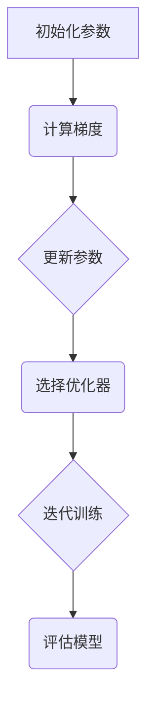

##### 数学公式示例（梯度下降更新规则）：

$$
\theta_{t+1} = \theta_{t} - \alpha \cdot \nabla_{\theta} J(\theta)
$$

其中，$\theta$ 表示模型参数，$J(\theta)$ 表示目标函数，$\nabla_{\theta} J(\theta)$ 表示梯度，$\alpha$ 表示学习率。

#### 3.1 数据质量与多样性

在持续学习过程中，数据质量与多样性是决定模型性能和稳定性的关键因素。高质量的数据能够提供丰富的信息，有助于模型更好地理解和预测。然而，在现实世界中，数据往往存在噪声、异常值和缺失值等问题，这对模型的学习效果产生了负面影响。因此，提升数据质量和多样性是持续学习中的一个重要挑战。

##### 数据质量

**1. 数据清洗**：数据清洗是数据质量提升的首要步骤。它包括去除重复数据、处理缺失值、填补异常值等。有效的数据清洗可以提高数据的一致性和完整性，从而改善模型的学习效果。

**2. 特征工程**：特征工程是将原始数据转换为适合模型训练的形式。通过选择合适的特征，可以提取数据中的有用信息，降低噪声和冗余，提高模型的性能。

**3. 数据标准化**：数据标准化是将不同特征的数据进行归一化或标准化，使其在相同的尺度范围内。这有助于优化算法的性能，提高模型的泛化能力。

**4. 数据增强**：数据增强是通过生成新的数据样本来扩充训练集，从而提高模型的泛化能力。常见的数据增强方法包括旋转、缩放、裁剪、添加噪声等。

##### 数据多样性

**1. 数据来源多样性**：引入多种来源的数据，可以丰富模型的学习经验，提高模型的泛化能力。例如，在图像识别任务中，可以结合不同相机、光照条件、背景等数据。

**2. 数据类型多样性**：结合不同类型的数据，如文本、图像、音频等，可以提供更丰富的信息，有助于模型更好地理解和处理复杂问题。

**3. 数据分布多样性**：数据分布的多样性对于模型的鲁棒性至关重要。通过引入具有不同分布特征的数据，可以使模型在面对不同场景时具有更好的适应性。

**4. 动态数据流**：在持续学习过程中，动态地引入新的数据流，可以使得模型不断适应新的变化。例如，在自动驾驶系统中，实时更新的路况信息可以帮助车辆更好地应对交通状况的变化。

##### 数据质量与多样性的关系

数据质量和多样性相互关联，共同影响模型的性能。高质量的数据能够提供丰富的信息，有助于模型更准确地学习。而数据的多样性则使得模型能够面对更多的场景和变化，提高其泛化能力。在实际应用中，需要综合考虑数据质量和多样性，以达到最佳的学习效果。

**示例**：在医疗领域，持续学习模型需要处理大量的医疗数据。为了提升数据质量，医生们会对图像进行清洗、标注和标准化处理。同时，引入多种类型的医疗数据，如电子病历、基因数据等，可以提高模型的泛化能力。此外，通过实时更新医疗数据流，模型可以更好地适应新的疾病发展趋势。

##### Mermaid流程图示例：

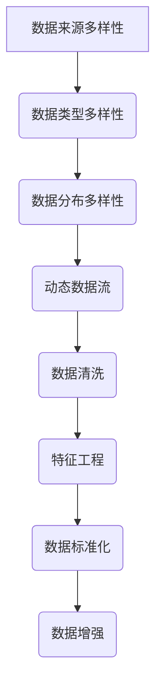

##### 数学公式示例（数据分布描述）：

$$
\text{variance} = \frac{1}{N}\sum_{i=1}^{N}(x_i - \bar{x})^2
$$

其中，$x_i$ 表示数据点，$\bar{x}$ 表示均值，$N$ 表示数据总数。

#### 3.2 计算资源与管理

在持续学习过程中，计算资源的管理和优化至关重要。随着模型规模和数据量的不断增长，计算资源的需求也在不断增加。合理的管理和优化计算资源，可以提高模型的训练效率，降低成本，并确保系统的稳定运行。

##### 计算资源需求

**1. 处理器（CPU/GPU）**：CPU和GPU是训练和推断过程中最常用的计算资源。GPU相比CPU具有更高的并行处理能力，适用于大规模并行计算，是深度学习等复杂任务的首选。

**2. 内存（RAM）**：内存是存储模型参数、中间计算结果和数据缓存的重要资源。随着模型规模的扩大，对内存的需求也相应增加。内存不足可能导致训练中断或性能下降。

**3. 存储空间（HDD/SSD）**：存储空间用于存储训练数据、模型权重和历史日志等。快速读写存储是保证训练和推断效率的关键。

**4. 网络带宽**：网络带宽对于分布式训练和模型部署至关重要。它决定了数据在不同节点之间的传输速度，影响着训练效率和模型部署的延迟。

##### 计算资源优化

**1. 模型压缩**：模型压缩通过降低模型的复杂度，减少计算资源的需求。常见的模型压缩方法包括量化、剪枝和知识蒸馏等。

**2. 分布式训练**：分布式训练通过将训练任务分解到多个节点上并行执行，可以显著提高训练速度。常用的分布式训练框架包括TensorFlow、PyTorch等。

**3. 数据并行**：数据并行是分布式训练的一种常见方法，通过将训练数据划分为多个子集，分别在不同的节点上进行训练。每个节点独立更新模型参数，然后进行参数同步。

**4. 混合精度训练**：混合精度训练通过结合浮点数和整数的运算，提高计算速度和减少内存需求。常用的混合精度训练方法包括FP16和BF16。

**5. 资源调度**：资源调度是管理计算资源的重要手段，通过合理分配资源，避免资源浪费和争用。常用的资源调度算法包括公平调度、最短作业优先（SJF）等。

##### 实际应用

**1. 云计算**：云计算提供了灵活、可扩展的计算资源，可以按需分配和释放资源，降低成本。云平台如AWS、Azure和Google Cloud等，提供了丰富的计算资源和服务，支持大规模的持续学习应用。

**2. 专用硬件**：专用硬件如TPU、FPGA和ASIC等，可以针对特定任务进行优化，提高计算效率和性能。这些硬件在深度学习和大数据处理等领域具有广泛的应用。

**3. 数据中心**：数据中心提供了集中式的计算资源和存储设施，支持大规模的数据处理和训练。数据中心的建设和运维需要考虑能耗、安全、可靠性等因素。

**4. 边缘计算**：边缘计算通过在靠近数据源的位置进行计算和存储，降低了网络延迟，提高了响应速度。边缘计算适用于实时性要求较高的应用，如自动驾驶、智能安防等。

##### Mermaid流程图示例：

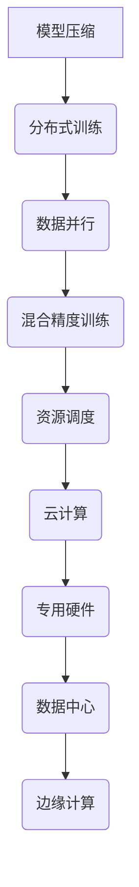

##### 数学公式示例（计算资源利用率）：

$$
\text{Utilization} = \frac{\text{Actual Usage}}{\text{Total Capacity}}
$$

其中，Actual Usage 表示实际使用资源，Total Capacity 表示总资源容量。

#### 3.3 模型解释性与透明性

在持续学习过程中，模型的解释性和透明性是评估和信任模型的关键因素。特别是对于涉及到生命安全、金融决策等高风险领域的AI应用，模型的解释性和透明性尤为重要。良好的模型解释性可以帮助用户理解模型的决策过程，从而提高模型的可靠性和可接受性。

##### 模型解释性的重要性

**1. 用户信任**：模型的解释性能够增加用户对模型的信任，特别是当模型用于关键决策时。了解模型的决策过程，用户可以更好地接受和依赖模型的结果。

**2. 模型优化**：通过分析模型解释性，可以发现模型中的潜在问题，如过拟合、偏见等。这有助于优化模型，提高模型的性能和泛化能力。

**3. 法规合规**：在许多领域，如金融、医疗等，法规要求模型的决策过程必须是透明和可解释的。这有助于遵守相关法规，降低法律风险。

##### 模型解释性技术

**1. 局部解释性方法**：局部解释性方法关注模型在特定输入下的决策过程。常见的方法包括：

- **特征重要性**：通过计算特征对模型输出的影响程度，评估特征的重要性。
- **注意力机制**：注意力机制可以显式地展示模型在不同特征上的关注程度，帮助理解模型的决策过程。
- **LIME（Local Interpretable Model-agnostic Explanations）**：LIME方法通过为模型生成一个简单且可解释的代理模型，解释特定输入的预测结果。

**2. 全局解释性方法**：全局解释性方法关注模型在整体上的解释性，通常用于评估模型的泛化能力和鲁棒性。常见的方法包括：

- **模型可视化**：通过可视化模型的内部结构和工作流程，帮助用户理解模型的决策过程。
- **对比分析**：通过对比不同输入的预测结果，分析模型在不同输入下的决策差异。
- **规则提取**：从模型中提取可解释的规则或决策表，帮助用户理解模型的决策逻辑。

##### 案例研究

**1. 医疗诊断**：在医疗领域，模型的解释性对于诊断结果的可靠性和患者的信任至关重要。例如，在肺癌筛查中，模型需要解释其为什么认为一个CT图像显示异常。

**2. 金融风控**：在金融领域，模型的解释性可以帮助银行和金融机构理解其风险管理决策，降低合规风险。例如，在贷款审批中，模型需要解释为什么拒绝或批准一个贷款申请。

**3. 自动驾驶**：在自动驾驶领域，模型的解释性对于保障行车安全和乘客信任至关重要。例如，在自动驾驶汽车做出紧急避让决策时，需要解释其避让的原因和决策过程。

##### 实现方法

**1. 解释性API**：提供解释性API，允许用户查询模型的解释信息，如特征重要性、注意力分布等。

**2. 可视化工具**：开发可视化工具，帮助用户直观地理解模型的决策过程，如决策树可视化、神经网络激活图等。

**3. 解释性报告**：生成解释性报告，详细记录模型的训练过程、参数设置、决策逻辑等，以便用户评估和信任模型。

##### Mermaid流程图示例：

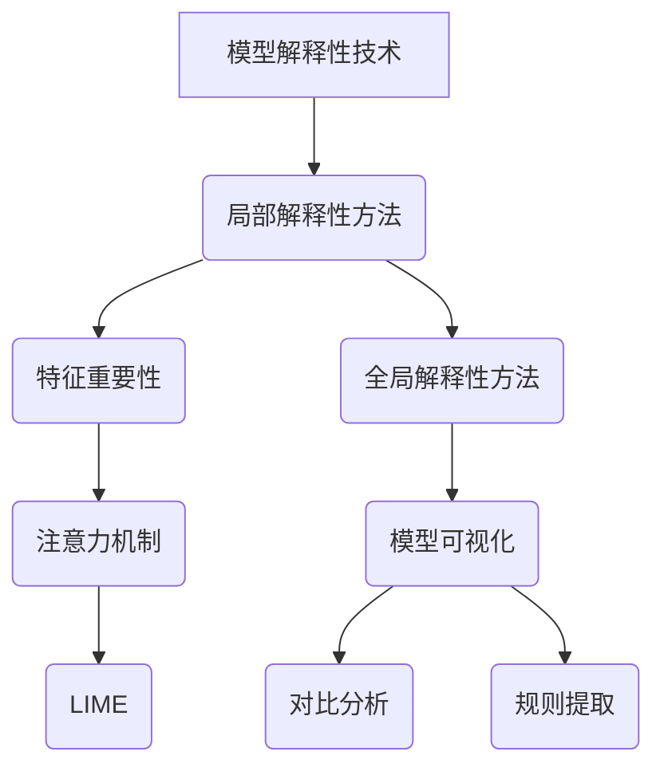

##### 数学公式示例（特征重要性）：

$$
\text{Feature Importance} = \frac{\text{Average Model Output Change}}{\text{Max Model Output Change}}
$$

其中，Average Model Output Change 表示特征去除后模型输出的平均变化，Max Model Output Change 表示特征去除后模型输出的最大变化。

#### 4.1 医疗图像分析中的持续学习

医疗图像分析是人工智能在医疗领域的一项重要应用，通过深度学习技术，可以实现疾病的早期诊断、病情监测和治疗效果评估。持续学习在医疗图像分析中发挥着关键作用，有助于提升模型的准确性和适应性。

##### 持续学习在医疗图像分析中的优势

**1. 适应性**：医疗图像分析面临着数据多样性高、场景复杂多变的特点。持续学习能够使模型不断适应新的数据分布和任务需求，提高其在实际应用中的表现。

**2. 准确性**：通过持续学习，模型可以在已有知识的基础上不断优化，提高对疾病特征的识别和分类能力，从而提高诊断的准确性。

**3. 可解释性**：持续学习可以帮助研究人员理解模型在诊断过程中的决策依据，提高模型的解释性，增加用户对诊断结果的信任。

##### 实际应用案例

**1. 肿瘤检测**：在肺癌筛查中，深度学习模型可以通过分析CT图像，检测肺部结节和肿瘤。通过持续学习，模型可以不断吸收新的病例数据，优化对微小病变的识别能力。

**2. 眼底病变诊断**：眼底图像分析可以帮助早期诊断糖尿病视网膜病变等疾病。持续学习可以帮助模型适应不同患者的眼底特征，提高诊断的准确性。

**3. 胎儿发育监测**：通过持续学习，模型可以从孕期超声图像中监测胎儿发育情况，及时发现异常并给出预警。

##### 持续学习在医疗图像分析中的技术挑战

**1. 数据质量问题**：医疗图像数据质量参差不齐，存在噪声、模糊和缺失等问题。数据质量问题可能影响模型的训练效果和泛化能力。

**2. 数据隐私和安全**：医疗图像数据包含敏感的个人信息，数据隐私和安全是持续学习面临的重要挑战。

**3. 模型可解释性**：医疗领域的应用对模型的解释性要求较高，如何提高模型的可解释性是一个亟待解决的问题。

##### 技术解决方案

**1. 数据清洗和增强**：通过数据清洗、填补缺失值和图像增强等技术，提高医疗图像数据的质量和多样性。

**2. 加密技术和隐私保护**：采用加密技术和隐私保护方法，如联邦学习（Federated Learning），确保数据在传输和存储过程中的安全。

**3. 模型可解释性工具**：开发可视化工具和解释性API，帮助用户理解模型的决策过程和诊断依据。

##### Mermaid流程图示例：

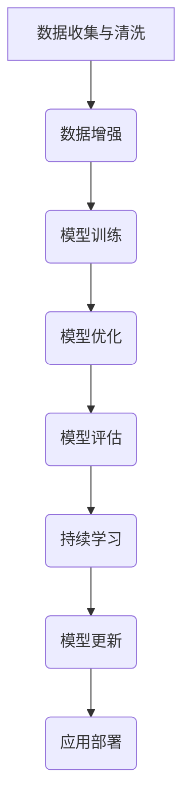

##### 数学公式示例（数据增强）：

$$
\text{Augmented Image} = \text{Original Image} \odot (\text{Random Transformation})
$$

其中，$\odot$ 表示图像的随机变换，如旋转、缩放、裁剪等。

#### 4.2 疾病预测与预警的持续学习

在医疗领域，疾病的预测与预警是提高患者生存率和生活质量的重要手段。持续学习技术在疾病预测与预警中的应用，能够显著提高预测的准确性和实时性，为医生提供有力的决策支持。

##### 持续学习在疾病预测与预警中的优势

**1. 高准确性**：通过持续学习，模型可以不断吸收新的患者数据和医学知识，优化预测算法，提高预测的准确性。

**2. 实时性**：持续学习技术能够实时更新模型，快速适应新数据和变化，为医生提供及时的预警信息。

**3. 全天候运行**：持续学习系统可以24小时不间断运行，实现全天候的疾病预测与预警，提高医疗服务的效率。

##### 实际应用案例

**1. 心血管疾病预测**：通过分析患者的病史、体征数据和生活方式等，持续学习模型可以预测心血管疾病的发生风险，提前采取预防措施。

**2. 癌症早期预警**：基于持续学习模型，可以从大量医学影像数据中识别早期癌症征兆，实现癌症的早期诊断和预警。

**3. 糖尿病管理**：通过持续学习，模型可以实时监测糖尿病患者的血糖水平，预测病情变化，提供个性化的治疗方案。

##### 持续学习在疾病预测与预警中的技术挑战

**1. 数据多样性和质量**：医疗数据种类繁多，质量参差不齐，这对模型的训练和预测带来了挑战。

**2. 模型可解释性**：医疗领域的应用对模型的可解释性要求较高，如何提高模型的透明性和可信度是一个重要问题。

**3. 系统安全与隐私**：医疗数据的安全和隐私保护是持续学习系统面临的关键挑战，如何保障数据的安全传输和存储是关键问题。

##### 技术解决方案

**1. 多源数据融合**：通过整合多源数据（如电子病历、基因组数据、生活方式数据等），提高数据的多样性和质量。

**2. 模型解释性工具**：开发可视化工具和解释性API，帮助医生理解模型的决策过程和预测依据。

**3. 隐私保护技术**：采用加密和联邦学习等技术，确保数据在传输和存储过程中的安全。

##### Mermaid流程图示例：

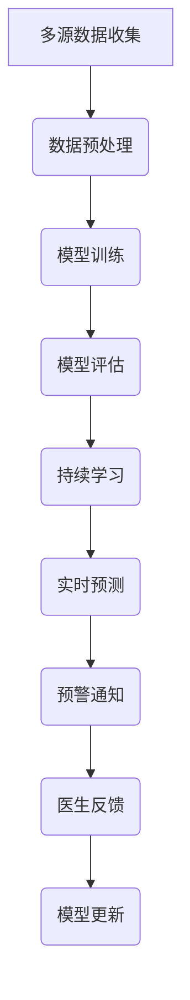

##### 数学公式示例（多源数据融合）：

$$
\text{Integrated Data} = \text{Source Data}_1 \odot \text{Source Data}_2 \odot \ldots
$$

其中，$\odot$ 表示数据融合操作，如加权平均、向量叠加等。

#### 5.1 风险管理与欺诈检测

在金融领域，持续学习技术在风险管理和欺诈检测中发挥着重要作用。通过深度学习算法和持续学习机制，金融机构能够实时监控交易活动，识别潜在风险和欺诈行为，从而保障资金安全，提高业务效率。

##### 持续学习在风险管理中的优势

**1. 实时性**：持续学习能够实时更新模型，对交易行为进行实时监控，快速识别潜在风险。

**2. 自适应性**：持续学习模型能够适应不断变化的市场环境和交易模式，提高风险管理能力。

**3. 准确性**：通过不断吸收新的交易数据，持续学习模型能够优化风险预测和欺诈检测的准确性。

##### 实际应用案例

**1. 账户风险监测**：通过持续学习，金融机构可以实时监测账户活动，识别异常交易行为，预防账户欺诈。

**2. 信贷风险评估**：持续学习模型可以分析客户的信用历史、行为数据等，预测客户的违约风险，为信贷审批提供支持。

**3. 交易欺诈检测**：通过分析大量交易数据，持续学习模型能够识别出异常交易行为，如洗钱、伪造交易等，提高欺诈检测的准确性。

##### 持续学习在风险管理中的技术挑战

**1. 数据质量问题**：金融数据质量参差不齐，存在噪声、缺失和异常值等问题，这对模型的训练和预测带来了挑战。

**2. 数据隐私保护**：金融数据包含敏感信息，数据隐私保护是持续学习系统面临的重要挑战。

**3. 模型可解释性**：金融领域的应用对模型的可解释性要求较高，如何提高模型的透明性和可信度是一个重要问题。

##### 技术解决方案

**1. 数据清洗和预处理**：通过数据清洗和预处理技术，提高金融数据的质量和一致性。

**2. 隐私保护技术**：采用数据加密和联邦学习等技术，确保数据在传输和存储过程中的安全。

**3. 模型解释性工具**：开发可视化工具和解释性API，帮助金融机构理解模型的决策过程和预测依据。

##### Mermaid流程图示例：

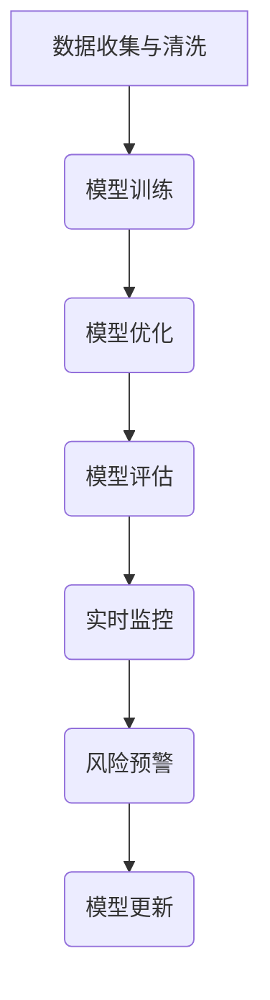

##### 数学公式示例（数据清洗）：

$$
\text{Cleaned Data} = \text{Original Data} \odot (\text{Noise Removal} \oplus \text{Imputation})
$$

其中，$\odot$ 表示噪声去除和填补缺失值，$\oplus$ 表示数据归一化等预处理操作。

#### 5.2 金融市场预测与趋势分析

在金融领域，持续学习技术在金融市场预测和趋势分析中发挥着关键作用。通过深度学习算法和持续学习机制，投资者和金融机构能够更好地把握市场动态，制定科学的投资策略，降低投资风险。

##### 持续学习在金融市场预测中的优势

**1. 高准确性**：持续学习模型能够从历史数据中提取有效信息，预测市场走势，提高预测的准确性。

**2. 实时性**：持续学习模型能够实时更新，捕捉市场的新变化，为投资者提供及时的决策支持。

**3. 自适应性**：持续学习模型能够适应市场的动态变化，调整预测策略，提高投资效果。

##### 实际应用案例

**1. 股票市场预测**：通过分析历史股价数据、宏观经济指标等，持续学习模型可以预测股票市场的走势，为投资者提供买卖建议。

**2. 外汇市场分析**：持续学习模型可以分析汇率变动，预测外汇市场的走势，帮助金融机构制定外汇交易策略。

**3. 商品市场预测**：通过分析商品市场的供需关系、全球经济状况等，持续学习模型可以预测商品价格的趋势，为投资者提供交易参考。

##### 持续学习在金融市场预测中的技术挑战

**1. 数据多样性**：金融市场数据类型多样，包括股票、债券、期货等，如何有效整合这些数据是一个挑战。

**2. 数据噪声**：金融市场数据存在大量噪声，如何去除噪声，提取有效信息是持续学习的重要课题。

**3. 模型可解释性**：金融市场的预测结果需要具备较高的可解释性，如何提高模型的可解释性是一个关键问题。

##### 技术解决方案

**1. 数据整合**：通过多源数据整合技术，将不同类型的数据进行统一处理，提高模型的预测能力。

**2. 噪声去除**：采用滤波、去噪等技术，去除数据中的噪声，提高数据质量。

**3. 模型解释性工具**：开发可视化工具和解释性API，帮助投资者理解模型的预测逻辑和决策过程。

##### Mermaid流程图示例：

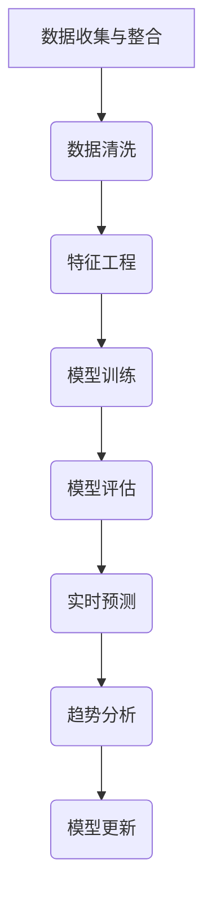

##### 数学公式示例（数据整合）：

$$
\text{Integrated Data} = \text{Stock Data} \oplus \text{Bond Data} \oplus \ldots
$$

其中，$\oplus$ 表示数据融合操作，如加权平均、向量叠加等。

### 第6章: AI在制造业的持续学习应用

制造业作为人工智能的重要应用领域，持续学习技术在其中发挥着关键作用。通过持续学习，制造业能够实现生产过程的优化、质量检测、故障预测和供应链管理，从而提高生产效率、降低成本和提升产品质量。

#### 6.1 质量检测与故障诊断

在制造业中，质量检测和故障诊断是确保产品可靠性和生产安全的重要环节。持续学习技术通过分析大量的生产数据，可以实现实时、自动化的质量检测和故障诊断。

##### 持续学习在质量检测中的应用

**1. 数据采集与分析**：通过传感器和监控系统，采集生产过程中的各种数据，如温度、压力、振动等。持续学习模型对这些数据进行实时分析，识别异常数据，检测产品质量问题。

**2. 特征提取与选择**：从原始数据中提取关键特征，如时间序列特征、频域特征等。通过特征选择技术，筛选出对质量检测最为重要的特征，提高模型的检测准确率。

**3. 模型训练与优化**：利用监督学习算法，如支持向量机（SVM）、神经网络（NN）等，训练质量检测模型。通过交叉验证和超参数调整，优化模型性能。

**4. 持续学习与自适应**：随着生产过程的进行，持续学习模型会不断吸收新的数据，优化自身参数，提高对产品质量的检测能力。例如，在汽车制造业中，持续学习模型可以根据不同批次的生产数据，调整检测阈值和分类模型，确保产品质量的一致性。

##### 持续学习在故障诊断中的应用

**1. 故障模式识别**：通过分析历史故障数据，持续学习模型可以识别常见的故障模式，如电机过热、轴承磨损等。

**2. 实时监控与预警**：在生产线中，持续学习模型可以实时监控设备的运行状态，检测潜在的故障隐患。当检测到异常情况时，模型会发出预警，提示维护人员及时进行故障排查和维修。

**3. 自适应维护策略**：持续学习模型可以根据设备的运行数据和历史故障记录，制定自适应的维护策略。例如，在机械制造业中，模型可以根据设备的运行负荷和故障率，调整预防性维护的频率和内容，降低故障率，延长设备寿命。

##### 技术实现与案例分析

**1. 技术实现**：
- 数据采集：使用传感器和监控系统，实时采集生产数据。
- 数据预处理：对原始数据进行清洗、归一化和特征提取。
- 模型训练：使用监督学习算法，如支持向量机（SVM）、神经网络（NN）等，训练质量检测和故障诊断模型。
- 持续学习：通过不断更新数据集，优化模型参数，提高检测和诊断的准确性。

**2. 案例分析**：
- 某汽车制造厂通过持续学习技术，实现了生产过程中的实时质量检测。该技术不仅提高了产品质量，还显著降低了不良品率。
- 某机械制造企业采用持续学习技术进行设备故障诊断。通过实时监控设备的运行状态，企业成功地预防了多起重大故障，降低了停机时间和维护成本。

##### Mermaid流程图示例：

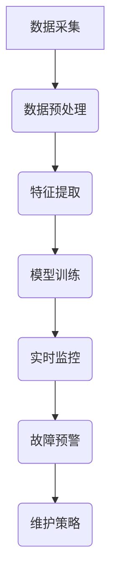

##### 数学公式示例（故障诊断模型）：

$$
\text{故障概率} = \frac{\text{故障样本数量}}{\text{总样本数量}}
$$

其中，故障样本数量表示在训练数据中检测到的故障样本数量，总样本数量表示训练数据中的样本总数。

### 6.2 生产流程优化与预测维护

在制造业中，生产流程的优化和设备的预测维护是提高生产效率和降低运营成本的关键环节。持续学习技术通过分析生产数据和历史维护记录，可以实现生产流程的自动化优化和设备的预测维护。

#### 生产流程优化

**1. 数据采集与分析**：通过传感器和监控系统，采集生产过程中的各种数据，如设备状态、生产参数、能源消耗等。持续学习模型对这些数据进行分析，识别生产流程中的瓶颈和低效环节。

**2. 生产参数优化**：持续学习模型根据采集到的生产数据，优化生产参数，如温度、压力、速度等。通过调整生产参数，提高生产效率和产品质量。

**3. 流程自动化**：利用机器学习算法，如优化算法、决策树等，实现生产流程的自动化。自动化生产流程可以减少人工干预，降低生产成本，提高生产效率。

**4. 持续学习与自适应**：持续学习模型可以不断吸收新的生产数据，优化生产参数和流程，提高生产系统的适应性和效率。

#### 预测维护

**1. 故障预测**：通过分析设备的历史运行数据和故障记录，持续学习模型可以预测设备潜在的故障风险。例如，通过预测设备的运行负荷、振动数据等，模型可以预测设备何时可能出现故障。

**2. 维护策略制定**：根据故障预测结果，持续学习模型可以制定预防性维护策略。预防性维护可以减少设备故障率，延长设备寿命，降低维护成本。

**3. 维护计划优化**：持续学习模型可以根据设备的运行状态和故障预测结果，优化维护计划，确保在设备出现故障之前进行维护，降低停机时间。

#### 技术实现与案例分析

**1. 技术实现**：
- 数据采集：使用传感器和监控系统，实时采集生产数据和设备运行状态。
- 数据预处理：对原始数据进行清洗、归一化和特征提取。
- 模型训练：使用机器学习算法，如回归分析、聚类分析等，训练生产流程优化和故障预测模型。
- 持续学习：通过不断更新数据集，优化模型参数，提高预测和优化的准确性。

**2. 案例分析**：
- 某制造企业通过持续学习技术，实现了生产流程的自动化优化。该技术不仅提高了生产效率，还显著降低了生产成本。
- 某机械制造企业采用持续学习技术进行设备预测维护。通过实时监控设备状态和预测故障风险，企业成功地预防了多起设备故障，降低了维护成本和停机时间。

##### Mermaid流程图示例：

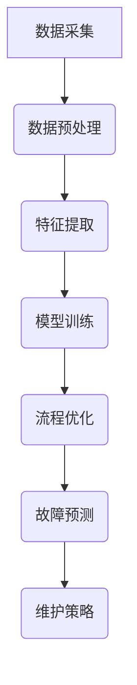

##### 数学公式示例（生产效率优化）：

$$
\text{生产效率} = \frac{\text{实际生产量}}{\text{计划生产量}}
$$

其中，实际生产量表示在一段时间内实际完成的生产量，计划生产量表示在相同时间内计划完成的生产量。

### 6.3 AI在制造业的战略重要性

在制造业中，人工智能（AI）和持续学习技术的应用已经成为提升企业竞争力和实现数字化转型的重要手段。通过AI技术，企业可以实现生产流程的优化、质量检测、故障预测和供应链管理，从而提高生产效率、降低成本和提升产品质量。以下从多个方面探讨AI在制造业的战略重要性。

#### 提高生产效率

AI技术通过自动化和智能化，可以显著提高生产效率。例如，通过使用机器视觉和深度学习算法，企业可以实现生产过程的自动化监控和优化。自动化的质量检测系统能够实时分析产品数据，快速识别缺陷，从而减少废品率和返工成本。此外，AI技术还可以通过预测维护策略，提前预测设备的故障风险，减少设备停机时间，提高生产连续性。

#### 降低运营成本

AI技术在制造业中的应用有助于降低运营成本。通过自动化生产流程，企业可以减少人工干预和操作，从而降低劳动力成本。AI驱动的质量检测和故障预测系统可以提前发现和处理潜在问题，减少设备故障和停机时间，降低维护成本。此外，AI技术还可以优化能源消耗和资源利用率，进一步降低运营成本。

#### 提升产品质量

AI技术在制造业中可以显著提升产品质量。通过机器视觉和深度学习算法，企业可以实现高精度的质量检测，从源头上减少不良品率。AI驱动的生产过程优化技术可以实时调整生产参数，确保产品达到最佳质量标准。此外，通过持续学习，AI模型可以不断吸收新的知识和经验，提高对产品质量的识别和预测能力，进一步提升产品质量。

#### 改善供应链管理

AI技术在供应链管理中的应用可以提高供应链的透明度和效率。通过AI技术，企业可以实时监控供应链各环节的运行状态，预测供应链风险，优化供应链布局。例如，通过AI驱动的库存管理系统，企业可以根据实时销售数据和需求预测，动态调整库存水平，减少库存成本和库存积压。此外，AI技术还可以优化物流运输路径，降低物流成本，提高供应链的整体效率。

#### 实现数字化转型

AI技术在制造业中的广泛应用推动了企业的数字化转型。通过引入AI技术，企业可以实现生产过程的数字化、智能化，提升整体竞争力。数字化转型不仅有助于提升生产效率和产品质量，还可以帮助企业实现业务流程的优化和升级，提高市场响应速度和创新能力。

#### 持续学习的战略意义

持续学习在AI技术在制造业中的应用中具有关键的战略意义。通过持续学习，AI模型可以不断吸收新的数据，优化自身的参数和算法，提高对生产环境、市场变化和用户需求的适应能力。例如，在生产线中，通过持续学习，AI模型可以根据新的生产数据调整生产参数，提高生产效率。在供应链管理中，通过持续学习，AI模型可以实时更新供应链数据，优化供应链布局，提高供应链的灵活性。

#### 案例研究

**1. 某汽车制造厂**：该厂通过引入AI技术，实现了生产流程的自动化和质量检测的智能化。通过机器视觉和深度学习算法，生产线实现了自动监控和优化，不良品率显著降低。同时，通过预测维护技术，设备故障率降低，生产效率提高。

**2. 某电子制造企业**：该企业通过AI技术，优化了库存管理和物流运输。通过实时数据分析和预测模型，企业实现了库存水平的动态调整，减少了库存成本和积压。同时，通过物流路径优化，企业降低了物流成本，提高了物流效率。

**3. 某机械制造企业**：该企业通过持续学习技术，实现了生产过程的智能化和设备预测维护。通过实时数据采集和预测模型，企业可以提前预测设备故障，减少设备停机时间，延长设备寿命，提高生产效率。

综上所述，AI和持续学习技术在制造业中的战略重要性不可忽视。通过AI技术的引入和持续学习能力的培养，企业可以实现生产流程的优化、质量检测的提升、故障预测的准确性和供应链管理的优化，从而提高竞争力，实现数字化转型。

### 第7章: 持续学习在企业战略中的重要性

#### 7.1 持续学习对企业竞争力的提升

在当今竞争激烈的市场环境中，持续学习已经成为企业提升竞争力的重要手段。通过持续学习，企业能够不断吸收新知识、新技术，从而保持竞争优势，实现可持续发展。

**1. 提高创新能力**：持续学习使企业能够紧跟科技前沿，快速掌握新技术、新方法。通过持续学习，企业员工可以不断更新知识结构，激发创新思维，推动企业产品和技术创新。

**2. 优化决策过程**：持续学习可以帮助企业更准确地预测市场趋势和用户需求，优化决策过程。通过分析历史数据和实时信息，企业可以做出更为科学的决策，降低决策风险。

**3. 提升运营效率**：持续学习使企业能够不断优化生产流程和管理流程，提高运营效率。通过引入AI、机器学习等新技术，企业可以实现自动化、智能化管理，减少人工干预，降低运营成本。

**4. 增强员工能力**：持续学习为企业员工提供了不断成长和发展的机会，提升员工的专业技能和综合素质。通过培训、学习、实践，员工可以不断提升自己的能力，为企业创造更多价值。

**5. 培养企业文化**：持续学习是一种企业文化的体现，可以激发员工的积极性和创造力，增强企业的凝聚力和向心力。通过营造持续学习的氛围，企业可以吸引和留住优秀人才，提升整体竞争力。

#### 7.2 持续学习与企业数字化转型

数字化转型已成为企业发展的必经之路，而持续学习是推动数字化转型的重要引擎。通过持续学习，企业可以实现以下几个方面的数字化转型：

**1. 数据驱动决策**：持续学习可以帮助企业建立数据驱动决策体系，通过收集、分析和利用海量数据，为企业提供科学、准确的决策依据。

**2. 智能化生产**：持续学习技术可以应用于生产流程的各个环节，实现生产过程的智能化。例如，通过引入AI、机器学习等新技术，企业可以实现生产流程的自动化、智能化，提高生产效率和质量。

**3. 智能供应链管理**：持续学习技术可以帮助企业实现供应链管理的智能化，通过实时数据分析和预测模型，优化供应链布局，提高供应链的灵活性和响应速度。

**4. 智能客户服务**：持续学习技术可以应用于客户服务领域，实现个性化、智能化的客户服务。例如，通过引入聊天机器人、智能客服等，企业可以提供更高效、更优质的客户服务，提升客户满意度。

**5. 数字化营销**：持续学习可以帮助企业实现数字化营销，通过大数据分析和机器学习算法，精准定位目标客户，提高营销效果和转化率。

#### 持续学习的实施策略

**1. 制定学习计划**：企业应根据自身发展战略和业务需求，制定系统的学习计划，明确学习目标、内容、方法和时间安排。

**2. 建立学习机制**：企业应建立持续学习的机制，鼓励员工积极参与学习和培训，提供学习资源和支持，确保学习效果。

**3. 引入学习工具**：企业可以引入各种学习工具和平台，如在线课程、培训系统、学习社区等，方便员工随时学习和交流。

**4. 加强知识管理**：企业应加强知识管理，建立知识库，记录和分享员工的学习成果和经验，促进知识的积累和传播。

**5. 评估学习效果**：企业应定期对学习效果进行评估，通过测试、考核等方式，检验员工的学习成果，并根据评估结果调整学习策略。

#### 成功案例分析

**1. 某高科技企业**：该企业通过持续学习，不断提升员工技能和创新能力，实现了产品技术的快速迭代和市场占有率的大幅提升。

**2. 某制造企业**：该企业通过数字化转型，引入AI、机器学习等新技术，实现了生产流程的自动化和智能化，大幅提高了生产效率和质量。

**3. 某金融机构**：该金融机构通过持续学习，建立了数据驱动决策体系，实现了精准营销和风险控制，提高了业务绩效和客户满意度。

总之，持续学习是企业提升竞争力、实现数字化转型的重要途径。通过制定有效的学习策略和实施方法，企业可以不断提升自身能力和市场地位，实现可持续发展。

### 第8章: 持续学习的技术架构与实施步骤

#### 8.1 技术架构设计原则

在设计和实施持续学习系统时，遵循以下原则至关重要：

**1. 模块化设计**：将系统分解为多个独立模块，如数据采集、数据处理、模型训练、模型评估等，便于系统的扩展和维护。

**2. 分布式架构**：采用分布式架构，将计算和存储资源分散部署，提高系统的可扩展性和容错性。

**3. 易扩展性**：系统设计应具备良好的扩展性，能够根据需求动态调整资源和功能。

**4. 高效性**：优化数据处理和模型训练过程，提高系统性能和响应速度。

**5. 安全性**：确保数据安全和模型安全，采用加密、访问控制等技术，防止数据泄露和恶意攻击。

#### 8.2 实施步骤与流程

**1. 需求分析**：明确持续学习系统的目标和需求，包括数据类型、模型类型、性能指标等。

**2. 数据采集**：设计数据采集方案，包括数据源、采集频率、数据质量要求等。

**3. 数据预处理**：清洗、归一化和特征提取，将原始数据转换为适合模型训练的形式。

**4. 模型设计**：根据需求选择合适的模型架构，如神经网络、决策树等。

**5. 模型训练**：使用训练数据对模型进行训练，通过调整超参数和优化算法，提高模型性能。

**6. 模型评估**：使用验证集或测试集评估模型性能，选择最优模型。

**7. 模型部署**：将训练好的模型部署到生产环境，实现实时预测和反馈。

**8. 持续优化**：根据反馈数据，不断调整模型参数和结构，提高模型性能和泛化能力。

**9. 安全管理**：确保系统数据安全和模型安全，采用安全策略和监控手段，防范潜在风险。

#### 技术选型

**1. 数据处理框架**：选择适合的数据处理框架，如Apache Spark、Hadoop等，实现高效的数据处理和分析。

**2. 模型训练框架**：选择适合的模型训练框架，如TensorFlow、PyTorch等，实现高效的模型训练和优化。

**3. 部署与管理平台**：选择适合的部署与管理平台，如Kubernetes、Docker等，实现模型的自动化部署和监控。

#### Mermaid流程图示例：

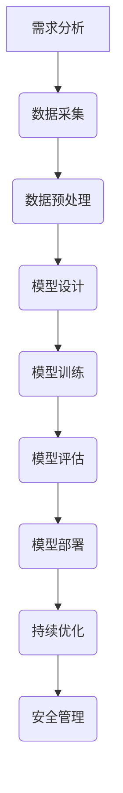

### 第9章: 持续学习的未来发展趋势与挑战

#### 9.1 未来技术展望

随着人工智能和机器学习技术的不断进步，持续学习在未来有望在多个领域取得突破性进展：

**1. 量子计算**：量子计算在处理复杂问题和大数据集方面具有巨大潜力。结合量子计算和持续学习，未来有望实现更高效、更强大的持续学习模型。

**2. 联邦学习**：联邦学习通过在分布式设备上进行模型训练，保证了数据隐私的同时，提高了学习效率和鲁棒性。未来联邦学习有望成为持续学习的重要方向。

**3. 神经架构搜索（NAS）**：神经架构搜索通过自动搜索最优神经网络结构，有望进一步提升持续学习模型的效果和效率。

**4. 元学习（Meta-Learning）**：元学习通过快速适应新任务，实现了在多样化任务上的高效学习。未来元学习有望在持续学习中的应用更加广泛。

**5. 人工智能安全**：随着人工智能在关键领域的应用，人工智能的安全性和可信性成为关注焦点。未来人工智能安全研究将致力于提高模型的可解释性和鲁棒性。

#### 9.2 持续学习面临的伦理问题与社会影响

持续学习技术的快速发展带来了一系列伦理问题和社会挑战，需要我们密切关注和解决：

**1. 数据隐私**：持续学习依赖于大量的数据，如何保障数据隐私成为重要问题。需要建立有效的数据隐私保护机制，确保个人数据不被滥用。

**2. 透明性和可解释性**：持续学习模型往往缺乏透明性和可解释性，导致其决策过程难以理解。未来需要开发更多可解释的机器学习技术，提高模型的可解释性。

**3. 职业替代**：人工智能和持续学习技术的应用可能替代部分传统工作岗位，引发就业和社会结构的变化。需要制定相关政策，帮助劳动力适应新形势。

**4. 社会公平**：持续学习模型在训练过程中可能受到数据偏见的影响，导致模型决策的不公平。需要加强数据多样性研究和模型公平性评估，确保社会公平。

**5. 法规监管**：随着人工智能技术的应用范围不断扩大，需要制定相应的法律法规，规范持续学习技术的研发和应用，确保其符合伦理和社会规范。

### 第10章: 案例研究与经验分享

#### 10.1 成功案例分析

**1. 某电商平台**：该电商平台通过持续学习技术，实现了个性化推荐系统的优化。通过分析用户历史行为和偏好，模型可以实时更新推荐策略，提高推荐准确性。此外，通过持续学习，模型能够适应市场变化和用户需求，保持推荐系统的竞争力。

**2. 某银行**：该银行通过持续学习技术，建立了智能风控系统。系统通过分析用户行为数据和交易记录，实时识别潜在风险和欺诈行为，提高了风控效果。通过持续学习，模型能够不断更新和优化，提高欺诈检测的准确性。

**3. 某汽车制造企业**：该企业通过持续学习技术，实现了生产过程的自动化和质量检测的智能化。通过机器视觉和深度学习算法，生产线实现了自动监控和优化，不良品率显著降低。同时，通过预测维护技术，设备故障率降低，生产效率提高。

#### 10.2 持续学习实践中的挑战与解决策略

**1. 数据质量问题**：数据是持续学习的基础，数据质量问题可能严重影响模型的训练效果和预测准确性。解决策略包括：数据清洗、数据增强和引入高质量的数据源。

**2. 模型可解释性**：持续学习模型往往缺乏透明性和可解释性，导致用户难以理解和信任。解决策略包括：开发可解释的机器学习技术、增强模型的可解释性工具。

**3. 计算资源管理**：持续学习需要大量的计算资源，如何高效管理计算资源成为挑战。解决策略包括：分布式训练、混合精度训练和计算资源调度优化。

**4. 模型更新与迭代**：持续学习模型需要不断更新和迭代，如何高效地更新模型参数成为问题。解决策略包括：自动化模型更新、持续学习框架和模型版本控制。

**5. 法规与伦理问题**：持续学习技术在应用过程中可能面临法律法规和伦理问题的挑战。解决策略包括：制定相应的法律法规、加强数据隐私保护和伦理审查。

### 附录

#### 附录A: 持续学习相关资源与工具

**A.1 主流持续学习框架与库**  
- TensorFlow：由Google开发的开源机器学习框架，支持多种深度学习模型和算法。
- PyTorch：由Facebook开发的开源机器学习库，提供了动态计算图和灵活的模型构建能力。
- Scikit-learn：开源的Python机器学习库，提供了多种经典的机器学习算法和工具。

**A.2 开发工具与平台推荐**  
- Jupyter Notebook：交互式的计算环境，支持多种编程语言和工具，适合数据分析和模型训练。
- AWS SageMaker：Amazon提供的机器学习平台，支持模型训练、部署和监控。
- Google Colab：Google提供的免费协作计算平台，适合在线数据分析和模型训练。

### 附录B: Mermaid流程图与伪代码示例

**B.1 Mermaid流程图示例**

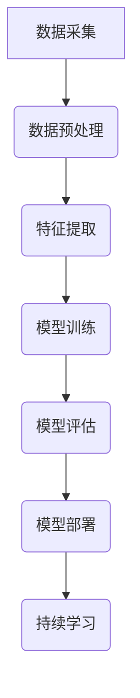

**B.2 持续学习算法伪代码示例**

```python
def continuous_learning(data_stream, model, learning_rate):
    while not end_of_stream(data_stream):
        data, label = next(data_stream)
        prediction = model.predict(data)
        loss = compute_loss(prediction, label)
        model.update_params(learning_rate, loss)
    
    return model
```

**B.3 数学公式与数学模型示例**

```latex
\documentclass{article}
\usepackage{amsmath}
\begin{document}

\begin{align*}
    L(\theta) &= -\frac{1}{m}\sum_{i=1}^{m}y^{(i)}\log(h_\theta(x^{(i)})) \\
    \alpha_t &= \frac{\alpha_0}{1 + t\lambda}
\end{align*}

\end{document}
```

### 作者信息

**作者：AI天才研究院/AI Genius Institute & 禅与计算机程序设计艺术 /Zen And The Art of Computer Programming**

