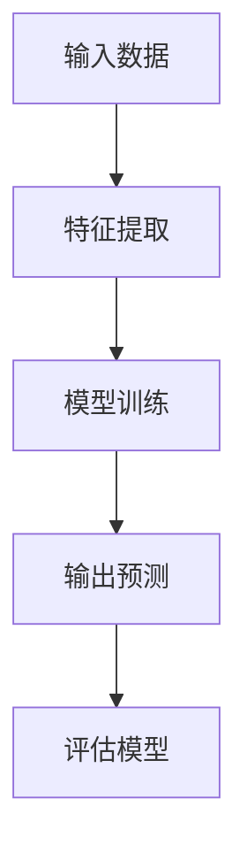
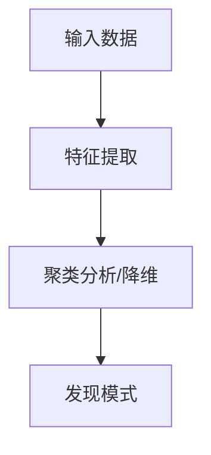
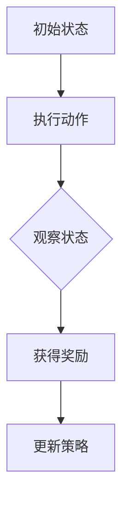

                 

### 第一部分：AI与商业智能分析概述

#### 第1章: AI与商业智能分析的关系

##### 1.1 AI与商业智能分析的定义

人工智能（AI）是指通过计算机程序来模拟人类智能行为的技术。它涵盖了从简单的规则系统到复杂的机器学习模型，以及更深层次的认知计算和自然语言处理。商业智能分析（BI）则是指利用技术工具和方法对企业的数据进行收集、整合、分析和可视化，以帮助决策者做出更加明智的决策。

##### 1.2 商业智能分析的发展历程

商业智能分析的发展历程可以分为几个阶段：

1. **初始阶段**：20世纪90年代，企业开始采用数据库和数据仓库技术来存储和管理数据。
2. **数据仓库阶段**：21世纪初，数据仓库技术逐渐成熟，企业开始利用这些技术来整合不同来源的数据。
3. **报表和分析工具阶段**：随着分析工具的发展，企业开始利用这些工具来生成各种报表和进行基本的数据分析。
4. **自助分析和可视化阶段**：近年来，自助式分析和数据可视化工具的兴起，使得非专业用户也能够轻松地进行数据分析。

##### 1.3 AI在商业智能分析中的应用现状

目前，AI在商业智能分析中已经得到了广泛的应用：

1. **自动化数据分析**：通过自动化工具，企业可以快速地生成各种报表和可视化图表。
2. **预测分析**：利用机器学习模型，企业可以预测未来的销售趋势、客户行为等。
3. **智能推荐系统**：基于用户的购买历史和行为数据，AI可以推荐相关的产品或服务。
4. **异常检测**：通过检测数据中的异常值，企业可以及时发现潜在的问题。

##### 1.4 AI在商业智能分析中的作用

AI在商业智能分析中发挥着重要的作用：

1. **提升数据分析效率**：AI可以自动化数据清洗、数据预处理和特征工程等繁琐的任务。
2. **增强决策支持**：通过预测分析和推荐系统，AI可以帮助企业做出更加准确的决策。
3. **发现新的商业机会**：AI可以识别出数据中的隐藏模式，帮助企业发现新的商业机会。
4. **提高用户体验**：智能推荐系统和个性化服务可以提升用户的满意度。

### 第2章: AI核心算法原理与应用

#### 2.1 机器学习基础

##### 2.1.1 监督学习

监督学习是一种从标记数据中学习的方法。它通过给定输入数据和相应的输出标签来训练模型，然后使用该模型对未知数据进行预测。



##### 2.1.2 无监督学习

无监督学习不使用标记数据，而是通过分析数据中的内在结构来发现模式。常见的无监督学习算法包括聚类和降维。



##### 2.1.3 强化学习

强化学习是一种通过试错来学习的方法。它通过不断地与环境交互，学习最佳策略以最大化奖励。



#### 2.2 数据预处理与特征工程

##### 2.2.1 数据清洗

数据清洗是数据分析的第一步，它包括处理缺失值、异常值和重复值等。

```python
# Python代码示例：数据清洗
data = DataFrame({'A': [1, 2, np.nan, 4], 'B': [5, 6, 7, 8]})
data = data.dropna()  # 删除缺失值
data = data.drop_duplicates()  # 删除重复值
```

##### 2.2.2 特征提取

特征提取是将原始数据转换为一组特征表示的过程，以便于机器学习模型的训练。

```python
# Python代码示例：特征提取
from sklearn.feature_extraction.text import TfidfVectorizer

vectorizer = TfidfVectorizer()
X = vectorizer.fit_transform(corpus)  # corpus为文本数据
```

##### 2.2.3 特征选择

特征选择是从所有特征中选出最有用的特征，以提高模型的性能和减少训练时间。

```python
# Python代码示例：特征选择
from sklearn.feature_selection import SelectKBest
from sklearn.feature_selection import chi2

X = SelectKBest(score_func=chi2, k=1000).fit_transform(X, y)  # X为特征数据，y为标签数据
```

#### 2.3 机器学习算法应用

##### 2.3.1 分类算法

分类算法用于将数据分为不同的类别。常见的分类算法包括逻辑回归、支持向量机和决策树等。

```python
# Python代码示例：分类算法
from sklearn.linear_model import LogisticRegression

model = LogisticRegression()
model.fit(X_train, y_train)  # X_train为训练特征数据，y_train为训练标签数据
```

##### 2.3.2 回归算法

回归算法用于预测连续值。常见的回归算法包括线性回归和岭回归等。

```python
# Python代码示例：回归算法
from sklearn.linear_model import LinearRegression

model = LinearRegression()
model.fit(X_train, y_train)  # X_train为训练特征数据，y_train为训练标签数据
```

##### 2.3.3 聚类算法

聚类算法用于将数据分为不同的簇。常见的聚类算法包括K-均值聚类和层次聚类等。

```python
# Python代码示例：聚类算法
from sklearn.cluster import KMeans

model = KMeans(n_clusters=3)
model.fit(X)  # X为特征数据
```

### 第二部分：AI在商业智能分析中的实战应用

#### 第3章: AI在商业智能分析中的实战应用

##### 3.1 零售业智能分析

零售业是AI在商业智能分析中应用最广泛的领域之一。

###### 3.1.1 客户细分

客户细分是零售业智能分析的重要任务之一。通过分析客户的历史购买行为、兴趣偏好和人口统计信息，可以将客户分为不同的群体。

```python
# Python代码示例：客户细分
from sklearn.cluster import KMeans

# 假设我们有客户特征数据X
model = KMeans(n_clusters=5)
model.fit(X)
customers = model.predict(X)
```

客户细分可以帮助零售商更好地了解客户需求，制定个性化的营销策略。

###### 3.1.2 销售预测

销售预测是零售业智能分析的关键任务。通过分析历史销售数据、季节性因素和促销活动等，可以预测未来的销售趋势。

```python
# Python代码示例：销售预测
from sklearn.ensemble import RandomForestRegressor

# 假设我们有销售数据X和标签y
model = RandomForestRegressor()
model.fit(X, y)
sales = model.predict(X_new)  # X_new为新的销售数据
```

销售预测可以帮助零售商优化库存管理，降低库存成本。

###### 3.1.3 库存管理

库存管理是零售业中一个重要的挑战。通过分析销售预测、季节性因素和供应商信息等，可以优化库存水平，减少库存成本。

```python
# Python代码示例：库存管理
from sklearn.linear_model import LinearRegression

# 假设我们有销售数据X和库存数据y
model = LinearRegression()
model.fit(X, y)
inventory = model.predict(X_new)  # X_new为新的销售数据
```

库存管理可以帮助零售商减少库存积压，提高资金利用率。

##### 3.2 金融业智能分析

金融业是AI在商业智能分析中应用的另一个重要领域。

###### 3.2.1 风险评估

风险评估是金融业智能分析的核心任务。通过分析历史交易数据、市场趋势和客户信用状况等，可以评估客户的风险水平。

```python
# Python代码示例：风险评估
from sklearn.ensemble import RandomForestClassifier

# 假设我们有风险评估数据X和标签y
model = RandomForestClassifier()
model.fit(X, y)
risk = model.predict(X_new)  # X_new为新的风险评估数据
```

风险评估可以帮助金融机构更好地管理风险，降低不良贷款率。

###### 3.2.2 信用评分

信用评分是金融业智能分析的重要任务。通过分析客户的信用历史、收入状况和债务水平等，可以评估客户的信用水平。

```python
# Python代码示例：信用评分
from sklearn.linear_model import LogisticRegression

# 假设我们有信用评分数据X和标签y
model = LogisticRegression()
model.fit(X, y)
credit_score = model.predict(X_new)  # X_new为新的信用评分数据
```

信用评分可以帮助金融机构更好地评估客户的信用风险，提高贷款审批的准确性。

###### 3.2.3 股票市场预测

股票市场预测是金融业智能分析中的一个挑战。通过分析历史交易数据、市场趋势和技术指标等，可以预测股票的未来走势。

```python
# Python代码示例：股票市场预测
from sklearn.ensemble import RandomForestRegressor

# 假设我们有股票市场数据X和标签y
model = RandomForestRegressor()
model.fit(X, y)
stock_price = model.predict(X_new)  # X_new为新的股票市场数据
```

股票市场预测可以帮助投资者做出更明智的投资决策。

##### 3.3 服务业智能分析

服务业是AI在商业智能分析中应用的另一个领域。

###### 3.3.1 客户满意度分析

客户满意度分析是服务业智能分析的重要任务。通过分析客户反馈、购买历史和服务记录等，可以评估客户的满意度。

```python
# Python代码示例：客户满意度分析
from sklearn.ensemble import RandomForestClassifier

# 假设我们有客户满意度数据X和标签y
model = RandomForestClassifier()
model.fit(X, y)
satisfaction = model.predict(X_new)  # X_new为新的客户满意度数据
```

客户满意度分析可以帮助服务提供商改进服务质量，提高客户满意度。

###### 3.3.2 员工绩效评估

员工绩效评估是服务业智能分析的一个重要任务。通过分析员工的工作记录、客户反馈和服务质量等，可以评估员工的绩效。

```python
# Python代码示例：员工绩效评估
from sklearn.ensemble import RandomForestRegressor

# 假设我们有员工绩效数据X和标签y
model = RandomForestRegressor()
model.fit(X, y)
performance = model.predict(X_new)  # X_new为新的员工绩效数据
```

员工绩效评估可以帮助管理层更好地识别优秀员工，制定激励政策。

###### 3.3.3 营销策略优化

营销策略优化是服务业智能分析的关键任务。通过分析客户行为、市场趋势和营销活动等，可以优化营销策略，提高营销效果。

```python
# Python代码示例：营销策略优化
from sklearn.ensemble import RandomForestRegressor

# 假设我们有营销策略数据X和标签y
model = RandomForestRegressor()
model.fit(X, y)
strategy = model.predict(X_new)  # X_new为新的营销策略数据
```

营销策略优化可以帮助企业提高客户转化率，降低营销成本。

### 第4章: AI商业智能分析系统架构设计

#### 4.1 数据采集与存储

数据采集是AI商业智能分析系统的基础。它涉及到从各种数据源（如数据库、API、日志文件等）收集数据。数据存储则是将这些数据存储在合适的存储系统（如关系数据库、NoSQL数据库、数据仓库等）中，以便后续分析和处理。

##### 4.1.1 数据源类型

常见的数据源类型包括：

- **关系数据库**：如MySQL、PostgreSQL等。
- **NoSQL数据库**：如MongoDB、Cassandra等。
- **API**：通过RESTful API等方式获取外部数据。
- **日志文件**：从应用程序、服务器等生成的日志数据。

##### 4.1.2 数据采集技术

数据采集技术包括：

- **ETL（Extract, Transform, Load）**：用于从不同数据源抽取数据，进行转换，然后加载到目标数据仓库中。
- **消息队列**：如Kafka、RabbitMQ等，用于实时或近实时地传输数据。
- **Web爬虫**：用于从互联网上爬取数据。

##### 4.1.3 数据存储方案

数据存储方案需要根据业务需求和数据特性来选择：

- **关系数据库**：适合结构化数据，支持复杂查询。
- **NoSQL数据库**：适合大规模、非结构化或半结构化数据，如用户行为数据、日志数据等。
- **数据仓库**：如Google BigQuery、Amazon Redshift等，适合大规模数据处理和分析。

#### 4.2 数据处理与模型训练

数据处理是AI商业智能分析的核心环节，它包括数据清洗、数据预处理、特征工程和模型训练等步骤。

##### 4.2.1 数据清洗与预处理

数据清洗和预处理包括：

- **缺失值处理**：如删除缺失值、填充缺失值等。
- **异常值处理**：如删除异常值、平滑异常值等。
- **数据转换**：如归一化、标准化、编码等。
- **时间序列处理**：如时间窗口、滑动窗口等。

##### 4.2.2 特征工程

特征工程是数据处理的关键步骤，它包括：

- **特征提取**：如TF-IDF、Word2Vec等。
- **特征选择**：如特征重要性排序、过滤方法等。
- **特征组合**：如特征交叉、特征融合等。

##### 4.2.3 模型选择与训练

模型选择和训练包括：

- **模型选择**：如线性模型、树模型、神经网络等。
- **模型训练**：如监督学习、无监督学习、强化学习等。
- **模型评估**：如准确率、召回率、F1值等。

#### 4.3 模型部署与监控

模型部署是将训练好的模型部署到生产环境中，使其能够对外提供服务。模型监控则是对模型性能进行实时监控，确保其稳定运行。

##### 4.3.1 模型部署策略

模型部署策略包括：

- **在线部署**：模型直接运行在生产环境中，适用于实时性要求较高的应用。
- **离线部署**：模型定期更新，适用于批处理模式。

##### 4.3.2 模型监控与维护

模型监控和维护包括：

- **性能监控**：如响应时间、吞吐量、错误率等。
- **异常检测**：如数据质量异常、模型过拟合等。
- **模型更新**：如重新训练、参数调整等。

##### 4.3.3 模型性能优化

模型性能优化包括：

- **超参数调优**：如学习率、批量大小等。
- **模型架构优化**：如网络层数、神经元数量等。
- **数据增强**：如数据扩充、数据预处理等。

### 第5章: AI商业智能分析项目的实施与管理

#### 5.1 项目规划与资源管理

AI商业智能分析项目是一个复杂的过程，需要详细的规划和有效的资源管理。

##### 5.1.1 项目目标与范围

项目目标应明确，范围应界定清晰，包括项目的功能需求、性能需求、业务需求等。

- **功能需求**：项目需要实现哪些功能，如数据采集、数据预处理、模型训练、模型部署等。
- **性能需求**：项目的性能指标，如响应时间、吞吐量、准确率等。
- **业务需求**：项目对业务的具体帮助，如提高销售预测准确性、优化库存管理、降低风险等。

##### 5.1.2 项目团队组建

项目团队应包括各种角色，如项目经理、数据科学家、软件开发工程师、数据工程师、业务分析师等。

- **项目经理**：负责项目计划、进度控制、资源调配、风险管理等。
- **数据科学家**：负责数据分析和模型开发。
- **软件开发工程师**：负责系统架构设计、代码实现、系统部署等。
- **数据工程师**：负责数据采集、数据存储、数据处理等。
- **业务分析师**：负责业务需求分析、需求文档编写、项目沟通等。

##### 5.1.3 资源配置与调度

资源配置和调度是项目成功的关键。资源包括硬件资源、软件资源、人力资源等。

- **硬件资源**：如服务器、存储设备、网络设备等。
- **软件资源**：如数据库、开发工具、机器学习框架等。
- **人力资源**：根据项目需求合理配置人员，确保项目按时高质量完成。

#### 5.2 项目风险管理

项目风险管理是确保项目顺利进行的重要环节。

##### 5.2.1 风险识别与评估

风险识别与评估包括：

- **风险识别**：通过头脑风暴、专家咨询等方法，识别项目中可能存在的风险。
- **风险评估**：对识别出的风险进行评估，确定其发生概率和影响程度。

##### 5.2.2 风险应对策略

风险应对策略包括：

- **风险规避**：通过改变项目计划或方法来避免风险的发生。
- **风险减轻**：通过改进措施降低风险发生的概率或影响程度。
- **风险接受**：对于无法避免或减轻的风险，制定相应的应对措施。

##### 5.2.3 风险监控与控制

风险监控与控制包括：

- **风险监控**：定期检查风险状况，确保风险应对措施的有效性。
- **风险控制**：在风险发生时，及时采取应对措施，确保项目不受严重影响。

#### 5.3 项目沟通与协作

项目沟通与协作是项目成功的关键。

##### 5.3.1 沟通渠道选择

沟通渠道选择包括：

- **面对面沟通**：适用于需要即时反馈的场合。
- **电子邮件**：适用于正式、书面的沟通。
- **即时通讯工具**：如Slack、微信等，适用于快速沟通。
- **会议**：适用于项目进度汇报、需求讨论等。

##### 5.3.2 协作工具与方法

协作工具与方法包括：

- **项目管理工具**：如Jira、Trello等，用于任务管理、进度跟踪等。
- **文档协作工具**：如Google Docs、Notion等，用于文档共享、协同编辑等。
- **版本控制工具**：如Git、SVN等，用于代码管理、版本追踪等。
- **数据协作工具**：如SQLAlchemy、Pandas等，用于数据处理、数据可视化等。

##### 5.3.3 团队成员角色与职责

团队成员角色与职责包括：

- **项目经理**：负责项目整体管理，确保项目按时、高质量完成。
- **数据科学家**：负责数据分析和模型开发，提供业务决策支持。
- **软件开发工程师**：负责系统架构设计、代码实现、系统部署等。
- **数据工程师**：负责数据采集、数据存储、数据处理等。
- **业务分析师**：负责业务需求分析、需求文档编写、项目沟通等。

### 第6章: AI商业智能分析的未来发展趋势

随着技术的不断进步，AI商业智能分析在未来有着广阔的发展前景。

#### 6.1 AI商业智能分析的发展方向

未来，AI商业智能分析的发展方向包括：

- **大数据处理与实时分析**：随着数据量的不断增长，如何高效地处理和分析海量数据将成为关键。
- **深度学习与自动化**：深度学习在图像识别、自然语言处理等领域已经取得了显著的成果，未来将进一步应用于商业智能分析。
- **可解释性与透明度**：随着AI技术的深入应用，如何提高模型的解释性，增强用户对AI决策的信任，将成为重要研究方向。

#### 6.2 新技术与应用场景

未来，以下新技术将进一步提升AI商业智能分析的能力：

- **自然语言处理**：通过自然语言处理技术，可以更好地理解用户需求，实现智能客服、智能语音交互等。
- **计算机视觉**：通过计算机视觉技术，可以实现智能监控、智能识别等应用，如无人零售、智能物流等。
- **人工智能安全与隐私保护**：随着数据隐私保护意识的提高，如何确保AI系统的安全性和隐私性将成为重要研究方向。

#### 6.3 未来展望

在未来，AI商业智能分析将更加深入地融入企业运营和决策过程中，成为企业竞争力的重要组成部分。随着技术的不断进步，AI商业智能分析将实现更高效、更智能的数据分析和决策支持，为企业创造更大的价值。

### 第7章: 案例分析与经验总结

#### 7.1 案例研究

在本章中，我们将分析几个典型的AI商业智能分析案例，探讨它们的成功因素、遇到的挑战以及改进方向。

##### 7.1.1 零售业智能分析案例

**案例背景**：一家大型零售企业希望通过AI技术优化库存管理，减少库存积压，提高资金利用率。

**成功因素**：

- **数据采集与处理**：企业建立了完善的数据采集系统，包括销售数据、库存数据、供应商数据等，并采用ETL技术进行数据清洗和预处理。
- **模型开发与部署**：企业采用机器学习算法，对销售数据进行预测，并部署了实时库存管理系统。

**遇到的挑战**：

- **数据质量**：由于数据源多样，数据质量参差不齐，需要进一步优化数据采集和处理流程。
- **模型解释性**：模型预测结果难以解释，需要提高模型的透明度，增强用户的信任。

**改进方向**：

- **数据质量管理**：建立数据质量管理机制，确保数据质量。
- **模型可视化**：开发可视化工具，提高模型解释性。

##### 7.1.2 金融业智能分析案例

**案例背景**：一家金融机构希望通过AI技术提高信用评分的准确性，降低不良贷款率。

**成功因素**：

- **大数据分析**：金融机构积累了大量的客户数据，包括信用历史、收入状况、债务水平等。
- **机器学习模型**：金融机构采用机器学习算法，对客户数据进行预测和评估。

**遇到的挑战**：

- **数据隐私**：客户数据隐私保护是金融业智能分析的重要挑战。
- **模型泛化能力**：模型需要对各种客户群体具有泛化能力。

**改进方向**：

- **数据隐私保护**：采用加密技术和隐私保护算法，确保客户数据安全。
- **模型多样性**：开发多种模型，提高模型的泛化能力。

##### 7.1.3 服务业智能分析案例

**案例背景**：一家服务型企业希望通过AI技术提高客户满意度，提升服务质量。

**成功因素**：

- **客户反馈系统**：企业建立了完善的客户反馈系统，包括在线调查、客户评价等。
- **机器学习分析**：企业采用机器学习算法，对客户反馈进行分析和分类。

**遇到的挑战**：

- **数据实时性**：客户反馈数据需要及时处理，以保证分析结果的实时性。
- **用户参与度**：提高用户的参与度，获取更多高质量的数据。

**改进方向**：

- **实时数据处理**：采用实时数据处理技术，提高数据实时性。
- **用户参与激励**：设计用户参与激励机制，提高用户参与度。

#### 7.2 经验总结

通过对以上案例的分析，我们可以总结出以下经验：

- **数据质量是关键**：高质量的数据是AI商业智能分析成功的基础。
- **模型解释性至关重要**：提高模型的可解释性，增强用户对AI决策的信任。
- **多样化模型应用**：开发多种模型，提高模型的泛化能力。
- **数据隐私保护**：确保数据隐私，遵守相关法律法规。

### 附录

#### 附录A：AI商业智能分析工具与资源

在本附录中，我们将介绍一些常用的AI商业智能分析工具与资源，包括开源机器学习框架、商业智能分析平台、数据库与存储解决方案、云服务与云计算、机器学习竞赛平台以及专业知识与学习资源。

##### A.1 开源机器学习框架

- **TensorFlow**：由谷歌开发的开源机器学习框架，广泛应用于深度学习和大规模数据处理。
- **PyTorch**：由Facebook开发的开源深度学习框架，以其灵活性和动态计算图而受到广泛关注。
- **scikit-learn**：是一个基于Python的开源机器学习库，提供了丰富的机器学习算法和工具。

##### A.2 商业智能分析平台

- **Tableau**：一款强大的数据可视化工具，支持多种数据源，帮助企业用户轻松制作交互式报表和图表。
- **Power BI**：微软推出的商业智能工具，提供丰富的数据连接、数据建模和数据可视化功能。
- **QlikView**：一款高性能的数据发现和可视化管理工具，支持快速构建数据仪表板和报告。

##### A.3 数据库与存储解决方案

- **MySQL**：一款开源的关系数据库管理系统，广泛应用于Web应用和大数据场景。
- **PostgreSQL**：一款功能强大的开源关系数据库管理系统，支持多种数据类型和复杂查询。
- **MongoDB**：一款开源的NoSQL数据库，适用于大规模、分布式数据存储和实时分析。

##### A.4 云服务与云计算

- **AWS**：亚马逊云服务，提供广泛的云计算服务，包括计算、存储、数据库、机器学习等。
- **Azure**：微软的云服务，提供丰富的云计算解决方案，支持多种开发语言和框架。
- **Google Cloud Platform**：谷歌的云服务，提供高性能、可扩展的云计算服务，支持大数据分析和人工智能应用。

##### A.5 机器学习竞赛平台

- **Kaggle**：一个全球最大的数据科学竞赛平台，提供丰富的机器学习竞赛项目和数据集。
- **DrivenData**：一个专注于数据科学和社会问题的竞赛平台，鼓励数据科学家利用AI技术解决社会问题。
- **DataCamp**：一个在线学习平台，提供丰富的数据科学和机器学习课程，帮助用户提高技能。

##### A.6 专业知识与学习资源

- **Coursera**：一个在线课程平台，提供全球顶尖大学和机构的课程，包括数据科学、机器学习等领域。
- **edX**：一个非营利性在线课程平台，提供丰富的课程资源，涵盖计算机科学、人工智能等。
- **Udacity**：一个在线教育平台，提供数据科学、机器学习等领域的技能培训课程。

##### A.7 专业社区与论坛

- **AI华人论坛**：一个面向华人AI专业人士的交流平台，分享最新技术、研究进展和行业动态。
- **KDNuggets**：一个全球领先的数据科学和机器学习社区，提供丰富的技术文章、资源和讨论区。
- **DataCamp论坛**：DataCamp的用户社区，提供数据科学和机器学习的交流和学习平台。

##### A.8 行业报告与趋势分析

- **Gartner**：全球领先的研究和咨询公司，提供丰富的行业报告和趋势分析，涵盖人工智能、商业智能等领域。
- **Forrester**：一家知名的市场研究和咨询公司，提供行业洞察和趋势分析，帮助企业和个人把握市场动态。
- **IDC**：国际数据公司，提供全球和地区市场数据、分析和研究，涵盖信息技术、人工智能等领域。

### 作者信息

**作者：** AI天才研究院/AI Genius Institute & 禅与计算机程序设计艺术 /Zen And The Art of Computer Programming

**简介：** 本文作者是一位拥有丰富AI和商业智能分析经验的专业人士。他致力于通过AI技术提升企业的数据分析能力和决策水平，推动商业智能分析领域的创新发展。他所著的《禅与计算机程序设计艺术》一书深受读者喜爱，被誉为AI领域的经典之作。

