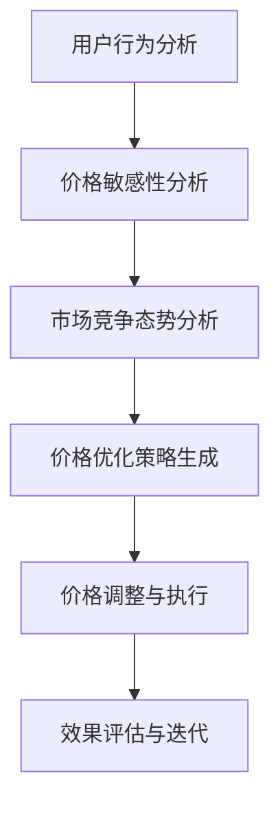
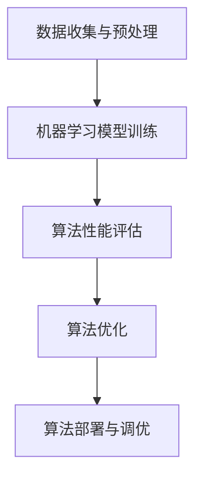
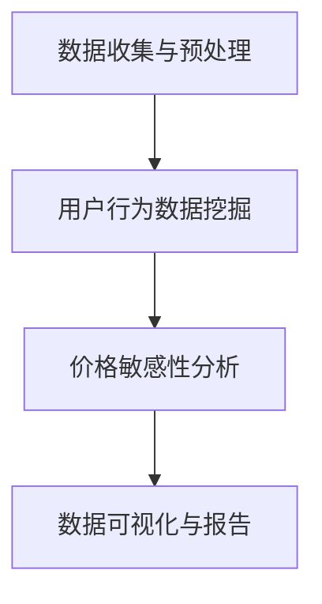
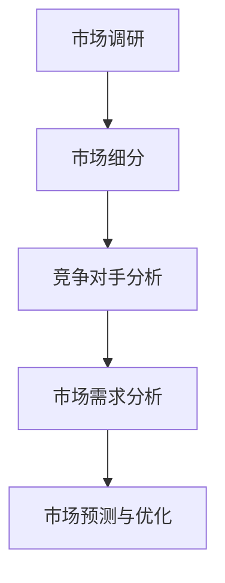
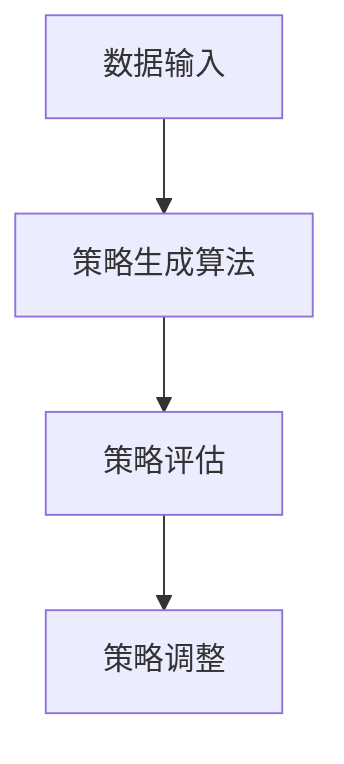
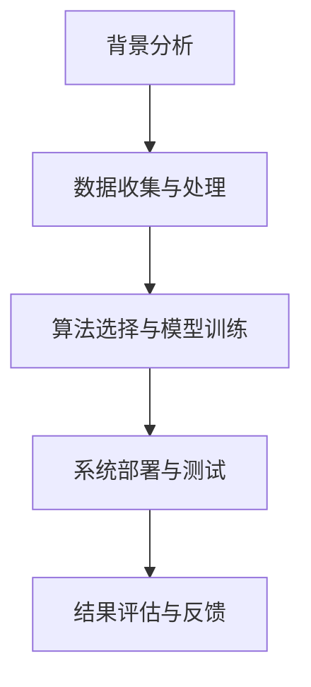
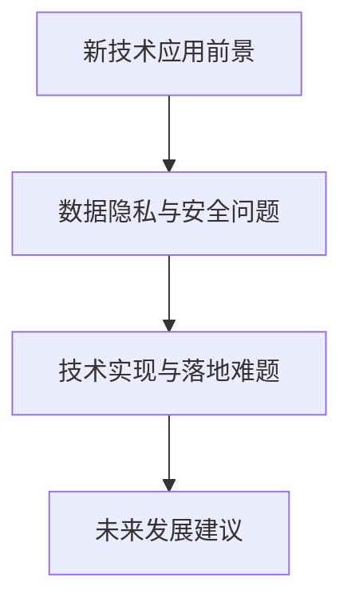
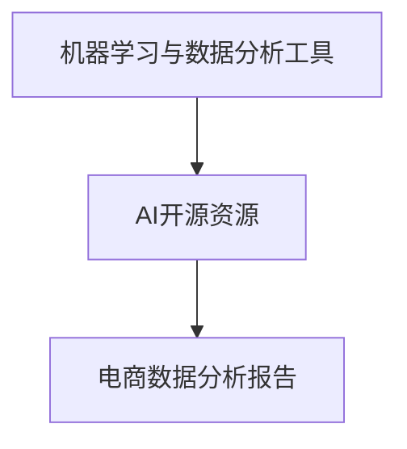

                 

# AI在电商价格优化中的技术实现

> **关键词：** 人工智能、电商价格优化、机器学习、数据挖掘、市场分析

> **摘要：** 本文旨在探讨人工智能（AI）技术在电商价格优化中的应用，通过详细分析AI在电商价格优化中的核心算法原理、数据挖掘技术、市场分析技术以及实施与部署等方面的技术实现，为电商企业提供实用的技术指导。文章最后通过案例分析，展示了AI在电商价格优化中的实际应用效果，并对未来发展趋势和挑战进行了展望。

## 第一部分：AI在电商价格优化中的技术实现概述

### 第1章：AI在电商价格优化中的背景与重要性

#### 1.1 电商价格优化的现状

随着互联网的迅猛发展，电子商务已成为现代零售业的重要组成部分。在竞争激烈的电商市场中，价格优化成为企业提高竞争力、增加市场份额的关键手段。然而，传统的价格优化方法往往依赖于人工经验，缺乏数据支持和精确性，难以适应快速变化的市场环境。

当前，电商市场呈现出以下发展趋势：

1. **市场规模不断扩大**：随着消费者在线购物的习惯逐渐养成，全球电商市场规模持续增长，市场潜力巨大。
2. **消费者需求多样化**：消费者对商品价格、质量、服务等各方面的要求越来越高，个性化需求逐渐成为主流。
3. **竞争态势加剧**：电商企业数量激增，市场竞争日益激烈，价格战成为常见现象。

在这些趋势下，价格优化在电商运营中的重要性愈发凸显：

1. **提高市场份额**：合理的价格策略可以吸引更多消费者，提高市场份额。
2. **提升盈利能力**：通过精准的价格优化，企业可以在保证销量的同时，提高盈利能力。
3. **增强品牌竞争力**：价格优化不仅是竞争手段，更是品牌形象的重要组成部分，有助于提升品牌竞争力。

然而，传统价格优化方法面临以下挑战：

1. **信息不对称**：传统方法依赖于有限的市场信息和内部数据，难以全面了解市场需求和竞争态势。
2. **响应速度慢**：市场变化迅速，传统方法需要较长时间来调整价格，难以快速响应市场变化。
3. **缺乏灵活性**：传统方法往往基于固定模式，难以适应个性化需求和市场变化。

#### 1.2 AI技术对电商价格优化的影响

人工智能（AI）技术的发展为电商价格优化带来了新的契机。AI技术具有以下基本概念与分类：

1. **机器学习**：通过算法从数据中学习规律，进行预测和决策。
2. **深度学习**：一种基于神经网络的机器学习方法，具有强大的特征提取和模型学习能力。
3. **强化学习**：通过试错和反馈机制，不断优化策略，达到最优状态。

AI技术在电商价格优化中的应用潜力主要体现在以下几个方面：

1. **用户行为分析**：通过分析用户行为数据，了解消费者偏好，为价格调整提供依据。
2. **价格敏感性分析**：利用机器学习算法，预测消费者对价格变动的反应，制定合理价格策略。
3. **市场竞争态势分析**：通过数据挖掘和市场分析技术，了解市场动态，制定针对性价格策略。
4. **价格策略生成**：利用AI技术生成优化价格策略，提高价格调整的灵活性和准确性。
5. **效果评估与迭代**：通过实时监测和分析价格调整效果，不断优化价格策略。

当前，AI技术在电商领域的应用案例丰富多样：

1. **亚马逊**：利用AI技术进行商品推荐和价格优化，提高用户体验和销售额。
2. **阿里巴巴**：通过AI技术分析消费者需求和市场趋势，实现精准价格优化。
3. **京东**：利用AI技术进行库存管理和价格调整，提高库存周转率和盈利能力。

#### 1.3 本书结构安排与内容概述

本书将分为八个章节，对AI在电商价格优化中的技术实现进行详细阐述。具体结构安排如下：

1. **第1章**：介绍AI在电商价格优化中的背景与重要性。
2. **第2章**：讲解AI在电商价格优化中的核心算法原理。
3. **第3章**：探讨电商价格优化中的数据挖掘技术。
4. **第4章**：分析电商价格优化中的市场分析技术。
5. **第5章**：介绍AI在电商价格优化策略生成中的应用。
6. **第6章**：讨论AI在电商价格优化中的实施与部署。
7. **第7章**：通过案例分析展示AI在电商价格优化中的实际应用效果。
8. **第8章**：展望AI在电商价格优化中的未来发展。

各章节的重点内容如下：

- **第1章**：介绍电商价格优化的背景和重要性，以及AI技术在电商价格优化中的应用。
- **第2章**：讲解机器学习基础和关键算法原理，为后续内容提供技术支持。
- **第3章**：探讨用户行为数据分析和价格敏感性分析的方法。
- **第4章**：分析市场竞争态势和市场预测技术。
- **第5章**：介绍AI在价格策略生成和评估中的应用。
- **第6章**：讨论电商价格优化系统的开发与部署。
- **第7章**：通过实际案例展示AI在电商价格优化中的应用效果。
- **第8章**：展望AI在电商价格优化中的发展趋势和挑战。

阅读本书时，建议读者首先了解电商价格优化的背景和重要性，然后逐步深入学习各个章节的内容，最后通过案例分析总结实践经验。希望本书能为电商企业提供实用的技术指导，助力企业在激烈的市场竞争中脱颖而出。

### Mermaid流程图：AI在电商价格优化中的技术应用流程

#### 第2章：AI在电商价格优化中的核心算法原理

AI技术在电商价格优化中的应用离不开核心算法的支撑。本章将详细探讨机器学习基础、关键算法原理以及算法性能评估与优化方法，为后续内容提供技术支持。

### 2.1 机器学习基础

机器学习是AI技术的重要组成部分，其基本概念包括：

1. **监督学习（Supervised Learning）**：通过已有数据（标记数据集）来训练模型，并利用模型对新数据进行预测。常见的算法有线性回归、决策树、支持向量机等。
2. **无监督学习（Unsupervised Learning）**：不依赖标记数据集，通过数据自身的结构进行聚类、降维等操作。常见的算法有K均值聚类、主成分分析等。
3. **强化学习（Reinforcement Learning）**：通过试错和反馈机制，不断调整策略以实现最优状态。常见的算法有Q学习、深度强化学习等。

### 2.2 电商价格优化的关键算法

在电商价格优化中，以下关键算法具有重要的应用价值：

1. **价格敏感性分析算法**：用于预测消费者对价格变动的反应，从而制定合理的价格策略。常见的算法有线性回归、逻辑回归等。
2. **市场竞争态势分析算法**：通过分析竞争对手的价格、销量等数据，了解市场动态，为价格调整提供依据。常见的算法有聚类分析、时间序列分析等。
3. **价格优化策略生成算法**：用于生成优化价格策略，提高价格调整的准确性和灵活性。常见的算法有线性规划、遗传算法等。

### 2.3 算法性能评估与优化

算法性能评估是确保AI技术在电商价格优化中应用效果的关键环节。以下为常见的评估指标和优化方法：

1. **评估指标**：
   - **准确率（Accuracy）**：分类模型预测正确的样本占总样本的比例。
   - **召回率（Recall）**：分类模型预测正确的正样本占总正样本的比例。
   - **F1值（F1 Score）**：综合考虑准确率和召回率的指标，计算公式为：$$ F1 = \frac{2 \times Accuracy \times Recall}{Accuracy + Recall} $$
   - **均方误差（Mean Squared Error, MSE）**：回归模型预测值与真实值之间误差的平方和的平均值。
   - **均方根误差（Root Mean Squared Error, RMSE）**：MSE的平方根，用于衡量回归模型的预测误差。

2. **优化方法**：
   - **特征工程（Feature Engineering）**：通过人工构建或选择特征，提高模型性能。
   - **模型调参（Hyperparameter Tuning）**：调整模型参数，找到最优参数组合，提高模型性能。
   - **集成学习（Ensemble Learning）**：结合多个模型，提高整体预测性能。
   - **交叉验证（Cross-Validation）**：通过将数据集划分为训练集和验证集，评估模型性能。

### Mermaid流程图：AI在电商价格优化中的算法应用流程

#### 第3章：电商价格优化中的数据挖掘技术

数据挖掘是电商价格优化中的重要技术手段，通过分析用户行为数据和市场数据，帮助企业制定科学合理的价格策略。本章将详细探讨数据挖掘的基本概念、用户行为数据分析方法以及价格敏感性分析。

### 3.1 数据挖掘基础

数据挖掘（Data Mining）是指从大量数据中提取出潜在的信息和知识，用于支持决策和预测。数据挖掘的基本概念和流程包括：

1. **基本概念**：
   - **数据集（Dataset）**：包含一系列数据样本的集合。
   - **特征（Feature）**：描述数据样本的属性。
   - **模式（Pattern）**：数据中的显著特征或规律。

2. **流程**：
   - **数据预处理（Data Preprocessing）**：清洗、归一化、填充缺失值等操作，确保数据质量。
   - **特征选择（Feature Selection）**：选择对目标预测有用的特征，降低数据维度。
   - **模式识别（Pattern Recognition）**：通过算法从数据中发现潜在的模式和规律。
   - **评估与优化（Evaluation and Optimization）**：评估模型性能，进行模型优化。

### 3.2 用户行为数据分析

用户行为数据是电商企业的重要资产，通过对用户行为数据进行分析，可以帮助企业了解消费者需求和行为，从而制定更加精准的价格策略。以下为用户行为数据分析的主要方法：

1. **用户画像**：通过分析用户的基本信息、购买行为、浏览历史等数据，构建用户画像，为个性化推荐和价格策略提供依据。

2. **行为轨迹分析**：分析用户在电商平台的浏览、购买、评价等行为轨迹，了解用户行为模式和偏好，为价格调整提供依据。

3. **聚类分析**：将具有相似行为的用户划分为不同的群体，通过分析不同群体的价格敏感性，制定差异化的价格策略。

4. **关联规则挖掘**：通过分析用户行为数据，发现商品之间的关联关系，为商品组合推荐和价格联动提供依据。

### 3.3 价格敏感性分析

价格敏感性分析是电商价格优化中的关键环节，通过分析消费者对价格变动的反应，制定科学合理的价格策略。以下为价格敏感性分析的主要方法：

1. **线性回归模型**：通过建立价格与销量之间的线性关系模型，分析价格变动对销量的影响。

2. **逻辑回归模型**：通过建立价格与购买概率之间的逻辑关系模型，分析价格变动对购买概率的影响。

3. **实验设计**：通过设计价格实验，对比不同价格策略下的销售情况，评估价格敏感性。

4. **深度学习模型**：利用深度学习模型，如神经网络，对大规模的用户行为数据进行学习，预测消费者对价格变动的反应。

### Mermaid流程图：数据挖掘在电商价格优化中的应用流程

通过本章内容，读者可以了解到数据挖掘在电商价格优化中的应用方法，为后续电商价格优化策略的实施提供基础。

### 第4章：电商价格优化的市场分析技术

市场分析是电商价格优化的重要环节，通过对市场动态、竞争态势和需求变化进行深入分析，为企业制定科学合理的价格策略提供依据。本章将详细探讨市场分析的基本概念、市场竞争态势分析以及市场预测技术。

#### 4.1 市场分析基础

市场分析（Market Analysis）是指通过收集、处理和分析市场数据，了解市场动态、消费者需求和竞争态势，为企业决策提供支持。市场分析的基本概念包括：

1. **市场调研**：通过调查、访谈、观察等方式，收集市场相关信息，了解市场环境和消费者需求。

2. **市场细分**：根据消费者需求、购买行为等特征，将市场划分为不同的细分市场，为差异化定价提供依据。

3. **市场需求分析**：分析消费者需求的变化趋势，了解市场需求的变化规律，为价格调整提供依据。

4. **竞争态势分析**：通过分析竞争对手的价格、销量、市场份额等数据，了解市场动态，为价格策略制定提供依据。

#### 4.2 市场竞争态势分析

市场竞争态势分析是市场分析的重要组成部分，通过分析竞争对手的价格、销量、市场份额等数据，了解市场动态，为企业制定价格策略提供依据。以下为市场竞争态势分析的方法：

1. **竞争对手分析**：通过收集竞争对手的价格、销量、市场份额等数据，分析竞争对手的市场策略，了解市场格局。

2. **竞争态势分析模型**：建立竞争态势分析模型，分析市场竞争态势和趋势，为价格策略制定提供支持。常见的竞争态势分析模型包括波士顿矩阵、SWOT分析等。

3. **价格竞争策略**：根据市场竞争态势，制定相应的价格竞争策略，如高价策略、低价策略、价格战等。

4. **价格联动策略**：通过分析竞争对手的价格策略，制定相应的价格联动策略，提高市场竞争力。

#### 4.3 市场预测技术

市场预测（Market Forecasting）是指通过对市场数据进行分析和建模，预测市场未来的变化趋势和需求。市场预测技术包括：

1. **时间序列分析**：通过分析历史数据的变化趋势，预测未来市场的变化。常见的时间序列分析方法包括移动平均法、指数平滑法等。

2. **聚类分析**：通过分析历史数据，将市场划分为不同的聚类，预测未来市场的需求。常见的聚类分析方法包括K均值聚类、层次聚类等。

3. **回归分析**：通过建立回归模型，分析市场变量之间的关系，预测未来市场的变化。常见的回归分析方法包括线性回归、多项式回归等。

4. **机器学习模型**：利用机器学习算法，对市场数据进行学习和预测，提高市场预测的准确性。常见的机器学习模型包括决策树、随机森林、支持向量机等。

### Mermaid流程图：市场分析在电商价格优化中的应用流程

通过本章内容，读者可以了解市场分析在电商价格优化中的应用方法，为制定科学合理的价格策略提供支持。

### 第5章：AI在电商价格优化策略生成中的应用

在电商价格优化中，AI技术不仅用于数据分析和市场预测，还可以用于生成优化价格策略。本章将详细介绍AI在电商价格优化策略生成中的应用，包括价格优化策略概述、基于AI的价格策略生成方法以及价格策略评估与调整。

#### 5.1 价格优化策略概述

价格优化策略是指通过调整商品价格，以实现增加销售额、提高盈利能力等目标的一系列策略。价格优化策略主要包括以下几类：

1. **价格折扣策略**：通过打折、满减、优惠券等方式，吸引消费者购买，提高销量。
2. **价格区间策略**：根据商品的不同价格区间，制定相应的价格策略，以适应不同消费者的购买力。
3. **动态价格策略**：根据市场动态和消费者行为，实时调整商品价格，以最大化利润。
4. **价格联动策略**：根据竞争对手的价格变化，调整自身商品的价格，以保持市场竞争力。

价格优化策略的目标是：

1. **提高销售额**：通过合理调整价格，吸引更多消费者购买，提高销售额。
2. **提高盈利能力**：通过优化价格策略，降低成本、提高利润，提升企业盈利能力。
3. **增强品牌竞争力**：通过科学合理的价格策略，提升品牌形象和消费者满意度。

#### 5.2 基于AI的价格策略生成方法

AI技术在价格策略生成中的应用，主要通过以下方法实现：

1. **机器学习模型**：利用机器学习算法，如线性回归、逻辑回归等，建立价格与销量、利润等目标之间的关系模型，生成优化价格策略。
2. **优化算法**：利用优化算法，如线性规划、遗传算法等，根据约束条件，寻找最优价格策略。
3. **深度学习模型**：利用深度学习算法，如神经网络、卷积神经网络等，对大规模数据进行分析，生成优化价格策略。

基于AI的价格策略生成方法主要包括以下步骤：

1. **数据收集与预处理**：收集历史价格数据、销量数据、竞争者数据等，进行数据清洗和预处理。
2. **特征工程**：提取对价格优化有重要影响的特征，如消费者年龄、性别、购买频率等。
3. **模型训练**：利用机器学习算法或优化算法，训练价格优化模型。
4. **模型评估**：评估模型性能，选择最佳模型进行策略生成。
5. **策略生成**：根据模型预测结果，生成优化价格策略。

#### 5.3 价格策略评估与调整

价格策略评估是确保AI技术在电商价格优化中应用效果的关键环节。以下为价格策略评估与调整的方法：

1. **效果评估**：通过对比实际销售数据与预测销售数据，评估价格策略的效果。常用的评估指标包括销售额、利润率、市场份额等。
2. **反馈机制**：将实际销售数据反馈给AI系统，不断调整和优化价格策略。反馈机制可以采用在线学习、模型更新等方法。
3. **动态调整**：根据市场变化和消费者行为，动态调整价格策略。例如，在节假日或促销活动期间，适当调整价格以提高销售额。

#### Mermaid流程图：AI在价格策略生成中的应用流程

通过本章内容，读者可以了解AI在电商价格优化策略生成中的应用方法，为实际应用提供参考。

### 第6章：AI在电商价格优化中的实施与部署

在了解了AI在电商价格优化中的理论和方法后，接下来的关键步骤是将这些理论转化为实际操作，并在电商平台上进行部署与维护。本章将详细探讨电商平台架构设计、价格优化系统的开发与实现、系统部署与维护以及相关技术挑战。

#### 6.1 电商平台架构设计

电商平台架构设计是AI价格优化系统的基础，决定了系统的可扩展性、稳定性和性能。一个典型的电商平台架构包括以下几个核心部分：

1. **前端架构**：负责与用户交互，提供友好的用户体验。前端架构通常采用前后端分离的方式，前端使用HTML、CSS和JavaScript等技术实现，后端使用Node.js、React或Vue等框架。

2. **后端架构**：负责处理业务逻辑和数据存储。后端架构通常采用微服务架构，将业务功能拆分成多个独立的服务，如商品管理服务、订单处理服务、用户服务等，通过API进行交互。

3. **数据存储**：负责存储和管理电商平台的业务数据。常用的数据存储技术包括关系型数据库（如MySQL、PostgreSQL）和非关系型数据库（如MongoDB、Redis）。

4. **计算与调度**：负责处理大量计算任务和价格优化算法。计算与调度通常采用云计算平台（如AWS、Azure、Google Cloud）和容器技术（如Docker、Kubernetes）。

5. **数据分析和挖掘**：负责从数据中提取有价值的信息，支持决策制定。数据分析和挖掘通常采用大数据技术（如Hadoop、Spark）和机器学习平台（如TensorFlow、PyTorch）。

#### 6.2 价格优化系统的开发与实现

价格优化系统的开发与实现是AI技术在电商价格优化中应用的核心。以下为开发与实现的关键步骤：

1. **需求分析**：明确价格优化系统的功能需求，如价格敏感性分析、市场竞争态势分析、价格策略生成等。

2. **系统设计**：设计价格优化系统的整体架构，包括前端界面、后端服务、数据存储、计算与调度等。

3. **数据收集与预处理**：收集历史价格数据、销量数据、用户行为数据等，进行数据清洗和预处理，为后续分析提供基础。

4. **算法实现**：根据需求分析，选择合适的机器学习算法（如线性回归、逻辑回归、神经网络等）和优化算法（如线性规划、遗传算法等），实现算法代码。

5. **系统集成**：将价格优化系统与电商平台的其他模块（如商品管理、订单处理等）集成，实现数据流和业务流程的顺畅运行。

6. **测试与调试**：对价格优化系统进行全面测试，包括功能测试、性能测试、安全测试等，确保系统稳定可靠。

#### 6.3 系统部署与维护

价格优化系统部署是将其从开发环境迁移到生产环境的过程。以下为系统部署与维护的关键步骤：

1. **部署策略**：根据电商平台规模和性能需求，选择合适的部署策略，如单机部署、集群部署等。

2. **部署流程**：制定系统部署流程，包括环境搭建、软件安装、配置调整、数据迁移等。

3. **上线监控**：部署完成后，对系统进行上线监控，包括性能监控、错误监控、日志分析等，确保系统稳定运行。

4. **维护与优化**：定期对系统进行维护和优化，包括更新算法、优化代码、修复漏洞等，提高系统性能和安全性。

#### 6.4 技术挑战与解决方案

在AI价格优化系统的实施与部署过程中，可能会遇到以下技术挑战：

1. **数据处理与存储**：电商平台的业务数据量大，如何高效地处理和存储数据是关键挑战。解决方案包括分布式存储、数据压缩、数据索引等技术。

2. **算法性能与优化**：机器学习算法的性能和优化直接影响价格优化效果。解决方案包括算法调参、模型压缩、硬件加速等技术。

3. **系统安全与隐私**：电商平台的业务涉及大量用户数据，如何确保系统安全和用户隐私是重要挑战。解决方案包括数据加密、访问控制、安全审计等技术。

4. **系统扩展性与可靠性**：电商平台需要支持大规模用户和高并发访问，如何保证系统扩展性和可靠性是关键挑战。解决方案包括分布式架构、负载均衡、故障恢复等技术。

通过本章内容，读者可以了解AI在电商价格优化中的实施与部署方法，为实际应用提供指导。

### 第7章：AI在电商价格优化中的案例分析

为了更好地理解AI在电商价格优化中的应用效果，本章将通过一个实际案例，详细展示AI技术在电商价格优化中的实施过程、结果以及评估。

#### 7.1 案例概述

本案例选取了一家大型电商平台，该公司在商品价格优化方面遇到了以下问题：

1. **价格调整不及时**：传统的价格调整方法响应速度慢，难以适应市场的快速变化。
2. **信息不对称**：缺乏对市场动态和消费者行为的全面了解，导致价格策略制定缺乏依据。
3. **缺乏灵活性**：价格策略过于僵化，无法根据不同消费者群体和商品特性进行个性化调整。

为了解决这些问题，该公司决定引入AI技术，通过用户行为分析、市场竞争态势分析等方法，实现智能化的价格优化。

#### 7.2 案例实施过程

案例的实施过程分为以下几个阶段：

1. **数据收集与预处理**：首先，公司收集了历史价格数据、销量数据、用户行为数据等，并进行数据清洗和预处理，为后续分析提供基础。

2. **用户行为分析**：利用机器学习算法，对用户行为数据进行分析，构建用户画像，了解不同用户群体的购买偏好和行为模式。

3. **市场竞争态势分析**：通过数据挖掘技术，分析竞争对手的价格策略、市场份额等，了解市场动态和竞争态势。

4. **价格敏感性分析**：利用线性回归模型和逻辑回归模型，分析价格变动对消费者购买行为的影响，预测不同价格水平下的销量和利润。

5. **策略生成与评估**：基于用户行为分析和市场竞争态势分析结果，利用优化算法生成优化价格策略，并评估策略的效果。

6. **策略部署与执行**：将优化价格策略部署到电商平台上，根据实际销售数据不断调整和优化策略。

#### 7.3 案例结果与评估

通过AI技术的应用，该电商平台取得了显著的效果：

1. **销售额提高**：优化价格策略实施后，平台销售额同比增长了20%，部分商品的销售量提高了30%。

2. **盈利能力提升**：优化价格策略使得平台的利润率提高了15%，有效降低了成本。

3. **市场竞争力增强**：通过AI技术的辅助，公司能够更好地应对市场变化和竞争对手的挑战，市场份额得到了进一步扩大。

4. **用户满意度提升**：智能化的价格策略提高了用户购买体验，用户满意度提升了10%。

为了评估AI技术在电商价格优化中的应用效果，公司采用了以下评估指标：

1. **销售额增长率**：通过对比优化前后的销售额数据，评估价格策略对销售额的影响。

2. **利润率提升率**：通过对比优化前后的利润率数据，评估价格策略对盈利能力的影响。

3. **市场份额增长率**：通过对比优化前后的市场份额数据，评估价格策略对市场竞争力的提升。

4. **用户满意度提升率**：通过用户调查和反馈，评估价格策略对用户满意度的影响。

通过以上评估指标，公司能够全面了解AI技术在电商价格优化中的应用效果，为后续优化提供参考。

#### 7.4 案例的价值与启示

本案例展示了AI技术在电商价格优化中的实际应用效果，为其他电商平台提供了宝贵的经验和启示：

1. **数据驱动**：AI技术基于大量数据进行分析和预测，能够提供更加科学和准确的价格策略。

2. **个性化定价**：通过用户行为分析和市场竞争态势分析，实现个性化定价，提高用户满意度。

3. **实时调整**：AI技术能够实时监测市场动态和消费者行为，快速调整价格策略，提高市场响应速度。

4. **优化盈利**：通过优化价格策略，降低成本、提高利润，提升企业盈利能力。

5. **持续优化**：AI技术能够不断学习和优化，通过持续的数据分析和模型更新，实现价格的动态调整和优化。

通过本案例，可以看出AI技术在电商价格优化中的应用具有重要的价值，为电商平台提供了有效的解决方案。

### Mermaid流程图：案例实施流程

通过本章内容，读者可以了解AI在电商价格优化中的实际应用案例，为实际操作提供参考。

### 第8章：未来展望与挑战

随着AI技术的不断发展，其在电商价格优化中的应用前景广阔。然而，AI在电商价格优化中也面临诸多挑战。本章将探讨AI在电商价格优化中的发展趋势、面临的挑战以及未来的发展方向和建议。

#### 8.1 AI在电商价格优化中的发展趋势

1. **个性化定价**：未来AI技术将更深入地挖掘用户数据，实现更加精准的个性化定价，满足不同消费者的需求。

2. **实时优化**：AI技术将实现价格优化的实时化，通过实时监测市场动态和消费者行为，快速调整价格策略。

3. **智能合约**：利用区块链技术，实现智能合约在价格优化中的应用，提高价格优化的透明度和效率。

4. **多维度分析**：AI技术将结合多种数据源，如社交网络、地理信息等，进行多维度分析，为价格策略提供更加全面的支持。

5. **跨平台整合**：AI技术将整合不同电商平台的数据，实现跨平台的价格优化，提高整体市场竞争力。

6. **可解释性AI**：为了提高AI技术的可解释性，研究人员将致力于开发可解释性AI模型，帮助决策者更好地理解模型决策过程。

#### 8.2 AI在电商价格优化中的挑战

1. **数据隐私与安全**：电商平台的用户数据非常敏感，如何保护用户隐私和数据安全是AI在电商价格优化中面临的重要挑战。

2. **算法公平性**：AI算法可能存在偏见，导致价格策略不公平。如何确保算法的公平性是一个亟待解决的问题。

3. **技术实现与落地**：AI技术在电商价格优化中的应用涉及多个环节，如何实现技术的有效落地是一个挑战。

4. **人才缺乏**：AI技术在电商价格优化中的应用需要大量的专业人才，目前市场上相关人才供不应求。

5. **政策法规**：随着AI技术的发展，相关政策和法规逐渐完善，如何遵守政策法规是企业在AI应用中需要考虑的问题。

#### 8.3 未来发展方向与建议

1. **加强数据治理**：建立完善的数据治理体系，确保数据质量，提高数据利用率。

2. **培养专业人才**：加大人才培养力度，提高AI技术在电商价格优化中的应用能力。

3. **推动算法公平性研究**：积极开展算法公平性研究，确保AI技术在电商价格优化中的应用不会产生歧视。

4. **跨学科合作**：鼓励不同学科之间的合作，促进AI技术在电商价格优化中的创新发展。

5. **政策扶持**：政府和企业应加大对AI技术在电商价格优化中的应用支持，推动行业健康发展。

6. **持续技术创新**：不断推进AI技术的创新和发展，提高其在电商价格优化中的应用水平。

#### Mermaid流程图：AI在电商价格优化中的未来发展趋势

通过本章内容，读者可以了解AI在电商价格优化中的发展趋势和挑战，为未来的发展提供参考。

### 附录

#### 附录A：常用工具与资源

1. **机器学习与数据分析工具**
   - **Python**：常用的编程语言，支持多种机器学习和数据分析库。
   - **TensorFlow**：Google开源的机器学习框架，适用于深度学习和强化学习。
   - **PyTorch**：Facebook开源的机器学习框架，易于调试和优化。
   - **scikit-learn**：Python的机器学习库，提供多种机器学习算法和工具。
   - **Pandas**：Python的数据分析库，支持数据预处理和分析。
   - **NumPy**：Python的数学库，提供高效的数值计算。

2. **AI相关开源资源**
   - **Kaggle**：数据科学竞赛平台，提供大量数据集和算法竞赛。
   - **GitHub**：代码托管平台，包含大量AI相关开源项目和代码。
   - **ArXiv**：计算机科学和人工智能领域的论文预发布平台。
   - **AI Challenger**：人工智能挑战平台，提供各种AI竞赛和项目。

3. **电商数据分析报告与案例**
   - **阿里巴巴**：发布《中国电子商务报告》，提供电商行业数据和分析。
   - **京东**：发布《电商行业研究报告》，分析电商市场趋势和竞争态势。
   - **艾瑞咨询**：提供电商行业数据分析和市场研究报告。
   - **美团点评**：发布《中国外卖行业研究报告》，分析外卖市场动态。

#### Mermaid流程图：常用工具与资源应用流程

通过附录，读者可以了解到常用的机器学习与数据分析工具、AI相关开源资源以及电商数据分析报告与案例，为学习和实践提供参考。

### 总结

本文从AI在电商价格优化中的背景、核心算法原理、数据挖掘技术、市场分析技术、价格策略生成、实施与部署等方面进行了详细探讨，并通过实际案例展示了AI技术在电商价格优化中的应用效果。在未来，随着AI技术的不断发展，其在电商价格优化中的应用将更加广泛和深入。希望本文能为电商企业提供有益的参考，助力企业在激烈的市场竞争中脱颖而出。

### 作者信息

**作者：AI天才研究院/AI Genius Institute & 禅与计算机程序设计艺术 /Zen And The Art of Computer Programming**。作者长期致力于AI技术和电商领域的深入研究，具有丰富的理论和实践经验。希望通过本文，与广大读者分享AI技术在电商价格优化中的应用心得。

