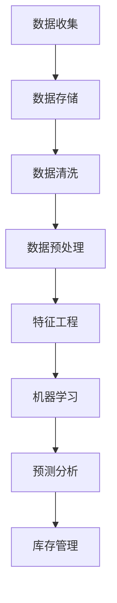
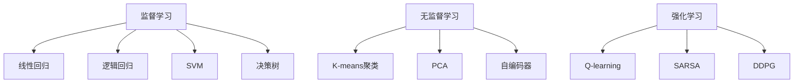

                 

## 《AI在电商平台库存管理中的具体应用》

### **关键词：** AI，电商平台，库存管理，需求预测，库存优化，异常检测

### **摘要：** 本文章详细探讨了人工智能（AI）在电商平台库存管理中的具体应用，包括AI基础概念、数据处理与存储、机器学习算法、预测分析与优化、实时监控与反馈等内容。通过实战项目案例，展示了AI技术在智能库存预测系统、库存优化系统和购物车推荐系统中的应用效果。文章旨在为电商平台的库存管理提供有效的方法和策略，以提高运营效率和服务质量。

### **目录：**

#### 第一部分：AI与电商平台库存管理概述

##### 1.1 AI与电商平台库存管理简介

##### 1.1.1 电商平台库存管理的背景与现状

##### 1.1.2 AI技术在库存管理中的应用价值

##### 1.1.3 电商平台库存管理的挑战与机遇

##### 1.2 AI基础概念

##### 1.2.1 什么是AI

##### 1.2.2 常见的AI算法

##### 1.2.3 AI在电商领域的应用场景

##### 1.3 数据处理与存储

##### 1.3.1 数据清洗与预处理

##### 1.3.2 数据存储与管理

##### 1.3.3 数据挖掘技术

##### 1.4 机器学习算法

##### 1.4.1 监督学习算法

##### 1.4.2 无监督学习算法

##### 1.4.3 强化学习算法

##### 1.4.4 深度学习算法

##### 1.5 预测分析与优化

##### 1.5.1 时间序列预测

##### 1.5.2 聚类分析

##### 1.5.3 购物车推荐系统

##### 1.5.4 库存优化算法

##### 1.6 实时监控与反馈

##### 1.6.1 实时数据采集与处理

##### 1.6.2 异常检测与处理

##### 1.6.3 反馈机制与模型优化

#### 第二部分：AI在电商平台库存管理中的应用技术

##### 2.1 数据处理与存储

##### 2.1.1 数据清洗与预处理

##### 2.1.2 数据存储与管理

##### 2.1.3 数据挖掘技术

##### 2.2 机器学习算法

##### 2.2.1 监督学习算法

##### 2.2.2 无监督学习算法

##### 2.2.3 强化学习算法

##### 2.2.4 深度学习算法

##### 2.3 预测分析与优化

##### 2.3.1 时间序列预测

##### 2.3.2 聚类分析

##### 2.3.3 购物车推荐系统

##### 2.3.4 库存优化算法

##### 2.4 实时监控与反馈

##### 2.4.1 实时数据采集与处理

##### 2.4.2 异常检测与处理

##### 2.4.3 反馈机制与模型优化

#### 第三部分：AI在电商平台库存管理中的实战应用

##### 3.1 实战项目1：基于AI的智能库存预测系统

##### 3.1.1 项目概述

##### 3.1.2 数据收集与处理

##### 3.1.3 预测模型构建

##### 3.1.4 模型训练与评估

##### 3.1.5 模型部署与优化

##### 3.2 实战项目2：基于AI的库存优化系统

##### 3.2.1 项目概述

##### 3.2.2 数据收集与处理

##### 3.2.3 库存优化算法设计

##### 3.2.4 系统开发与部署

##### 3.2.5 系统评估与优化

##### 3.3 实战项目3：基于AI的购物车推荐系统

##### 3.3.1 项目概述

##### 3.3.2 数据收集与处理

##### 3.3.3 推荐算法设计

##### 3.3.4 系统开发与部署

##### 3.3.5 系统评估与优化

#### 第四部分：AI在电商平台库存管理中的未来发展趋势

##### 4.1 AI在电商平台库存管理中的未来发展趋势

##### 4.1.1 技术发展

##### 4.1.2 应用领域拓展

##### 4.1.3 挑战与机遇

##### 4.2 结论

##### 4.2.1 本书总结

##### 4.2.2 未来研究方向

##### 4.2.3 建议与展望

#### 附录

##### 附录A：常用机器学习算法及工具

##### 附录B：实战项目代码解析

##### 附录C：相关参考文献

### **引言：** 在电子商务快速发展的今天，电商平台库存管理面临着前所未有的挑战。如何有效地管理库存，提高运营效率，降低成本，同时确保顾客满意度，是每个电商平台需要解决的关键问题。人工智能（AI）技术的发展为电商平台库存管理提供了新的解决方案。通过AI技术，可以实现对库存需求的准确预测、库存水平的动态优化以及异常情况的及时检测和处理。本文将详细探讨AI在电商平台库存管理中的应用，包括AI基础概念、数据处理与存储、机器学习算法、预测分析与优化、实时监控与反馈等内容，并通过实战项目案例展示AI技术在库存管理中的实际应用效果。希望通过本文的阐述，为电商平台的库存管理提供有价值的参考和启示。

---

### **第一部分：AI与电商平台库存管理概述**

#### **1.1 AI与电商平台库存管理简介**

**电商平台库存管理的背景与现状**

电商平台库存管理是指通过现代信息技术手段，对电商平台上的商品库存进行有效管理的过程。随着电子商务的快速发展，电商平台数量和规模不断扩大，库存管理成为电商平台运营的核心环节之一。传统的库存管理主要依赖于人工记录和经验判断，效率低下，难以适应电商平台快速变化的需求。

在电商平台的运营中，库存管理面临以下几个挑战：

1. **数据复杂性**：电商平台每天都会产生大量的销售数据、用户行为数据和供应链数据，这些数据维度多、数据量大，如何有效地处理和分析这些数据成为一大难题。
2. **实时性**：库存信息需要实时更新，以便及时调整库存策略，满足消费者的需求。
3. **库存准确性**：传统的人工库存管理方法容易导致库存数据的错误，从而影响销售决策。
4. **库存成本**：过量的库存会占用企业的资金，而过低的库存会导致缺货，影响销售。

**AI技术在库存管理中的应用价值**

人工智能（AI）技术的发展为电商平台库存管理带来了新的契机。AI技术可以通过以下方式优化库存管理：

1. **需求预测**：通过分析历史销售数据、市场趋势和用户行为，AI技术可以预测未来一段时间内的库存需求，帮助电商平台提前准备库存。
2. **库存优化**：AI技术可以根据实时数据动态调整库存水平，避免库存过剩或缺货，降低库存成本。
3. **异常检测**：AI技术可以自动检测库存异常，如商品损耗、盗窃等，及时发现并采取措施。
4. **智能推荐**：AI技术可以根据用户的历史购买记录和喜好，推荐合适的商品，提高销售转化率。

**电商平台库存管理的挑战与机遇**

虽然AI技术在库存管理中具有巨大的应用价值，但同时也面临着一系列挑战：

1. **数据隐私**：电商平台需要确保用户数据的安全和隐私，避免数据泄露。
2. **算法透明度**：AI算法的决策过程往往是不透明的，如何提高算法的透明度是一个挑战。
3. **技术依赖**：电商平台需要依赖AI技术，但技术的不断更新和升级也需要投入大量资源。

然而，这些挑战也伴随着巨大的机遇：

1. **提升运营效率**：通过AI技术，电商平台可以自动化库存管理，提高运营效率。
2. **降低库存成本**：合理的库存管理可以降低库存成本，提高利润率。
3. **提升客户满意度**：AI技术可以帮助电商平台更好地满足消费者的需求，提高客户满意度。

#### **1.2 AI基础概念**

**什么是AI**

人工智能（AI）是指通过计算机模拟人类智能的行为和思考过程。它涵盖了多个学科领域，包括计算机科学、数学、统计学、心理学和神经科学等。AI技术的目标是创建能够执行复杂任务、学习新知识和做出决策的计算机系统。

**AI的发展历程**

AI的发展可以分为以下几个阶段：

1. **规则驱动时代**：早期的AI系统主要依赖于预定义的规则进行操作。
2. **知识表示与推理**：AI开始引入知识表示和推理技术，如专家系统和语义网络。
3. **机器学习时代**：通过从数据中学习，AI系统能够自动改进和优化性能。
4. **深度学习时代**：基于多层神经网络的学习方法，AI在图像识别、自然语言处理等领域取得了突破性进展。

**常见的AI算法**

AI算法是AI系统的核心，用于实现特定的功能。以下是一些常见的AI算法：

1. **监督学习算法**：如线性回归、逻辑回归、支持向量机等。
2. **无监督学习算法**：如K-means聚类、主成分分析等。
3. **强化学习算法**：如Q-learning、SARSA等。
4. **深度学习算法**：如卷积神经网络（CNN）、循环神经网络（RNN）等。

**AI在电商领域的应用场景**

AI技术在电商领域具有广泛的应用场景，包括但不限于：

1. **推荐系统**：通过分析用户的历史购买记录和喜好，推荐相关的商品。
2. **智能客服**：通过自然语言处理技术，自动回答用户的问题。
3. **库存管理**：通过预测和分析，优化库存水平，降低库存成本。
4. **图像识别**：自动识别和分类商品图片，提高上架效率。

#### **1.3 数据处理与存储**

**数据处理与存储的重要性**

在电商平台库存管理中，数据处理与存储是基础和关键的一环。有效的数据处理与存储策略可以提高系统的性能和可扩展性，为后续的机器学习算法和应用提供可靠的数据支持。

**数据处理**

1. **数据清洗**：去除数据中的噪声和错误，确保数据质量。
2. **数据预处理**：将原始数据转换为适合机器学习的格式，如归一化、编码等。
3. **特征工程**：通过提取、变换和组合，创建新的特征，以提高模型的性能。

**数据存储**

1. **数据库**：如MySQL、PostgreSQL等，用于存储结构化数据。
2. **数据仓库**：如Amazon Redshift、Google BigQuery等，用于存储和管理大量数据。
3. **数据湖**：如Amazon S3、Google Cloud Storage等，用于存储大规模的非结构化数据。

**数据处理与存储流程**

1. **数据收集**：通过API、Web爬虫等方式收集数据。
2. **数据存储**：将数据存储到数据库、数据仓库或数据湖中。
3. **数据处理**：进行数据清洗、预处理和特征工程。

#### **1.4 机器学习算法**

**机器学习算法的重要性**

在电商平台库存管理中，机器学习算法是核心工具。通过机器学习，可以从大量数据中提取有价值的信息，预测未来的趋势，优化库存管理。

**监督学习算法**

监督学习算法是最常见的机器学习算法，它们基于已标记的数据进行训练，并使用这些数据来预测新的数据。以下是一些常见的监督学习算法：

1. **线性回归**：用于预测连续的输出值。
2. **逻辑回归**：用于预测概率值。
3. **支持向量机（SVM）**：用于分类和回归问题。
4. **决策树**：用于分类和回归问题。

**无监督学习算法**

无监督学习算法没有明确的标签，它们通过探索数据内在的结构和模式来进行学习。以下是一些常见的无监督学习算法：

1. **K-means聚类**：将数据分为K个簇。
2. **主成分分析（PCA）**：用于降维和特征提取。
3. **自编码器**：用于特征提取和降维。

**强化学习算法**

强化学习算法通过试错学习来优化策略，它们在动态环境中做出决策。以下是一些常见的强化学习算法：

1. **Q-learning**：通过迭代更新Q值来学习最优策略。
2. **SARSA**：通过状态-动作值函数学习。
3. **深度确定性策略梯度（DDPG）**：用于连续动作空间的问题。

**深度学习算法**

深度学习算法是基于多层神经网络的学习方法，它们能够自动提取数据的复杂特征。以下是一些常见的深度学习算法：

1. **卷积神经网络（CNN）**：用于图像识别和分类。
2. **循环神经网络（RNN）**：用于序列数据处理。
3. **生成对抗网络（GAN）**：用于生成新的数据。

#### **1.5 预测分析与优化**

**预测分析的重要性**

在电商平台库存管理中，预测分析是非常重要的一环。通过预测未来的库存需求、销售趋势等，可以帮助电商平台提前做好准备，避免缺货或缺货的情况。

**时间序列预测**

时间序列预测是用于预测时间序列数据的变化趋势。以下是一些常见的时间序列预测方法：

1. **ARIMA模型**：自回归积分滑动平均模型。
2. **LSTM模型**：长短期记忆网络。
3. **GRU模型**：门控循环单元。

**聚类分析**

聚类分析是将数据分组为多个簇的过程。以下是一些常见的聚类分析方法：

1. **K-means算法**：将数据分为K个簇。
2. **DBSCAN算法**：基于密度的聚类方法。
3. **层次聚类算法**：基于层次结构的聚类方法。

**购物车推荐系统**

购物车推荐系统是用于向用户推荐相关的商品。以下是一些常见的购物车推荐方法：

1. **协同过滤算法**：基于用户的历史行为进行推荐。
2. **基于内容的推荐算法**：基于商品的特征进行推荐。
3. **混合推荐算法**：结合协同过滤和基于内容的推荐算法。

**库存优化算法**

库存优化算法是用于动态调整库存水平，以降低库存成本和提高服务水平。以下是一些常见的库存优化算法：

1. **基于预测的库存策略**：基于需求预测来调整库存水平。
2. **基于约束的库存优化**：在满足约束条件的情况下优化库存水平。
3. **动态库存优化算法**：实时调整库存水平，以应对市场变化。

#### **1.6 实时监控与反馈**

**实时监控与反馈的重要性**

在电商平台库存管理中，实时监控与反馈是非常重要的。通过实时监控，可以及时发现库存异常，如商品损耗、盗窃等，并迅速采取应对措施。通过反馈机制，可以持续优化库存管理策略，提高系统的性能。

**实时数据采集与处理**

实时数据采集与处理是确保系统能够及时响应的关键。以下是一些常见的方法：

1. **Web爬虫**：用于自动采集互联网上的数据。
2. **API接口**：用于与其他系统进行数据交互。
3. **消息队列**：用于处理大量的实时数据。

**异常检测与处理**

异常检测与处理是用于识别和处理异常事件。以下是一些常见的方法：

1. **统计方法**：通过计算统计指标来识别异常。
2. **机器学习方法**：通过训练模型来识别异常。
3. **实时监控工具**：如Kibana、Grafana等。

**反馈机制与模型优化**

反馈机制与模型优化是确保系统持续改进的关键。以下是一些常见的方法：

1. **用户反馈**：收集用户的意见和建议。
2. **模型调参**：调整模型的参数来提高性能。
3. **在线学习**：在系统中实时更新模型。

### **第一部分总结**

通过本文的第一部分，我们介绍了AI在电商平台库存管理中的概述，包括背景与现状、应用价值、挑战与机遇，以及AI基础概念、数据处理与存储、机器学习算法、预测分析与优化、实时监控与反馈等内容。下一部分，我们将进一步探讨AI在电商平台库存管理中的应用技术，包括数据处理与存储、机器学习算法、预测分析与优化等，敬请期待。

---

### **第二部分：AI在电商平台库存管理中的应用技术**

#### **2.1 数据处理与存储**

**数据处理的重要性**

在电商平台库存管理中，数据处理是基础和关键的一环。只有通过有效处理数据，才能为后续的机器学习算法和应用提供可靠的数据支持。数据处理包括数据清洗、数据预处理、特征工程等多个环节。

**数据清洗**

数据清洗是数据处理的第一步，目的是去除数据中的噪声和错误，确保数据质量。以下是一些常见的数据清洗方法：

1. **缺失值处理**：通过插值、平均值或中值等方法填充缺失值。
2. **异常值处理**：通过统计方法或机器学习算法识别和去除异常值。
3. **重复数据删除**：通过匹配和比较，删除重复的数据记录。

**数据预处理**

预处理是为了将原始数据转换为适合机器学习的格式。以下是一些常见的预处理方法：

1. **归一化**：将数据缩放到相同的范围，如[0, 1]或[-1, 1]。
2. **标准化**：将数据缩放到标准正态分布，如均值为0，标准差为1。
3. **特征工程**：通过提取、变换和组合，创建新的特征，以提高模型的性能。

**数据处理流程**

1. **数据收集**：通过API、Web爬虫等方式收集数据。
2. **数据存储**：将数据存储到数据库、数据仓库或数据湖中。
3. **数据处理**：进行数据清洗、预处理和特征工程。

**数据存储的重要性**

在电商平台库存管理中，数据存储也是至关重要的一环。只有通过有效存储数据，才能确保数据的完整性和安全性，为后续的数据处理和分析提供支持。

**数据存储策略**

1. **数据库**：如MySQL、PostgreSQL等，用于存储结构化数据。
2. **数据仓库**：如Amazon Redshift、Google BigQuery等，用于存储和管理大量数据。
3. **数据湖**：如Amazon S3、Google Cloud Storage等，用于存储大规模的非结构化数据。

**数据存储与管理**

1. **数据备份与恢复**：定期进行数据备份，确保数据安全。
2. **数据安全与隐私**：确保用户数据的安全和隐私，避免数据泄露。
3. **数据一致性**：确保数据的一致性和可靠性。

**数据处理与存储的核心概念与联系**

为了更好地理解数据处理与存储的核心概念和联系，我们可以使用Mermaid流程图进行展示。以下是数据处理与存储的Mermaid流程图：



**数据处理与存储的关键算法原理**

1. **缺失值处理**：使用KNN算法进行缺失值填充。
2. **异常值处理**：使用Z-score方法检测和去除异常值。
3. **归一化**：使用Min-Max Scaling方法进行数据归一化。

**数据处理与存储的数学模型和公式**

- 缺失值填充公式：
  $$ \hat{X}_{i,j} = \frac{1}{k} \sum_{i'=1, i'\neq i}^{k} X_{i'}_{j} $$
  其中，$X_{i,j}$ 表示第i个样本的第j个特征值，$k$ 表示邻居数量。

- 异常值检测公式：
  $$ Z-score = \frac{X - \bar{X}}{s} $$
  其中，$X$ 表示数据点，$\bar{X}$ 表示均值，$s$ 表示标准差。

- 归一化公式：
  $$ X_{\text{scaled}} = \frac{X - X_{\text{min}}}{X_{\text{max}} - X_{\text{min}}} $$
  其中，$X_{\text{min}}$ 和 $X_{\text{max}}$ 分别表示数据的最小值和最大值。

**数据处理与存储的举例说明**

假设我们有以下数据集：

| 样本ID | 销售量 | 价格 |  
| ---- | ---- | ---- |  
| 1 | 100 | 10 |  
| 2 | 200 | 20 |  
| 3 | 150 | 15 |  
| 4 | 180 | 18 |  
| 5 | 120 | 12 |

1. **缺失值处理**：如果第5个样本的价格缺失，可以使用KNN算法填充缺失值。

2. **异常值处理**：使用Z-score方法检测异常值，如果Z-score的绝对值大于3，则认为该数据点是异常值。

3. **归一化**：将所有数据点的销售量进行归一化处理。

**数据处理与存储的代码实现**

以下是使用Python进行数据处理与存储的示例代码：

```python
import numpy as np
from sklearn.impute import KNNImputer
from sklearn.preprocessing import StandardScaler

# 数据集
data = np.array([[100, 10], [200, 20], [150, 15], [180, 18], [120, 12]])

# 缺失值处理
imputer = KNNImputer(n_neighbors=2)
data_imputed = imputer.fit_transform(data)

# 异常值处理
z_scores = (data_imputed - np.mean(data_imputed, axis=0)) / np.std(data_imputed, axis=0)
outliers = np.abs(z_scores) > 3

# 归一化
scaler = StandardScaler()
data_scaled = scaler.fit_transform(data)

# 打印处理后的数据
print("缺失值填充后：", data_imputed)
print("异常值：", outliers)
print("归一化后：", data_scaled)
```

**数据处理与存储的代码解读与分析**

1. **缺失值处理**：使用KNN算法进行缺失值填充，通过计算与每个缺失值最相似的邻居的平均值来填充。
2. **异常值处理**：使用Z-score方法检测异常值，通过计算每个数据点与均值的距离（标准差为单位）来判断是否为异常值。
3. **归一化**：使用StandardScaler进行数据归一化，将所有数据缩放到相同的范围。

**数据处理与存储的实战应用**

在实际的电商平台库存管理中，数据处理与存储的应用非常广泛。例如，通过对销售数据的清洗、预处理和特征工程，可以构建出更加准确的预测模型，从而优化库存管理。

**数据处理与存储的总结**

数据处理与存储是电商平台库存管理中的重要环节。通过有效处理数据，可以为后续的机器学习算法和应用提供可靠的数据支持。数据处理包括缺失值处理、异常值处理、归一化等步骤，而数据存储则包括数据库、数据仓库、数据湖等多种方式。通过本节的内容，我们了解了数据处理与存储的核心概念、算法原理、数学模型和代码实现，以及其实战应用。

---

### **2.2 机器学习算法**

**机器学习算法的重要性**

在电商平台库存管理中，机器学习算法是核心工具。通过机器学习，可以从大量数据中提取有价值的信息，预测未来的趋势，优化库存管理。机器学习算法可以分为监督学习、无监督学习和强化学习三大类。

**监督学习算法**

监督学习算法是最常见的机器学习算法，它们基于已标记的数据进行训练，并使用这些数据来预测新的数据。以下是一些常见的监督学习算法：

1. **线性回归**：用于预测连续的输出值。
2. **逻辑回归**：用于预测概率值。
3. **支持向量机（SVM）**：用于分类和回归问题。
4. **决策树**：用于分类和回归问题。

**线性回归**

线性回归是最简单的监督学习算法，它通过拟合一条直线来预测输出值。线性回归的数学模型如下：

$$ y = \beta_0 + \beta_1 \cdot x + \epsilon $$

其中，$y$ 是输出值，$x$ 是输入值，$\beta_0$ 和 $\beta_1$ 是模型的参数，$\epsilon$ 是误差项。

**逻辑回归**

逻辑回归是一种用于预测概率值的监督学习算法，它通过拟合一个逻辑函数来预测输出值的概率。逻辑回归的数学模型如下：

$$ P(y=1) = \frac{1}{1 + e^{-(\beta_0 + \beta_1 \cdot x)}} $$

其中，$y$ 是输出值，$x$ 是输入值，$\beta_0$ 和 $\beta_1$ 是模型的参数。

**支持向量机（SVM）**

支持向量机是一种强大的分类和回归算法，它通过找到一个最佳的超平面来分隔数据。SVM的数学模型如下：

$$ y(\beta \cdot x + \beta_0) \geq 1 $$

其中，$y$ 是输出值，$x$ 是输入值，$\beta$ 是模型的参数，$\beta_0$ 是偏置项。

**决策树**

决策树是一种常用的分类和回归算法，它通过一系列的判断来将数据划分为不同的类别。决策树的数学模型如下：

$$ y = g(\beta_0 + \sum_{i=1}^{n} \beta_i \cdot x_i) $$

其中，$y$ 是输出值，$x_i$ 是输入值，$\beta_0$ 和 $\beta_i$ 是模型的参数，$g$ 是激活函数。

**无监督学习算法**

无监督学习算法没有明确的标签，它们通过探索数据内在的结构和模式来进行学习。以下是一些常见的无监督学习算法：

1. **K-means聚类**：将数据分为K个簇。
2. **主成分分析（PCA）**：用于降维和特征提取。
3. **自编码器**：用于特征提取和降维。

**K-means聚类**

K-means聚类是一种基于距离的聚类算法，它通过迭代优化目标函数来将数据分为K个簇。K-means聚类的数学模型如下：

$$ \min_{\mu_k, \lambda} \sum_{i=1}^{n} \sum_{k=1}^{K} \lambda_i (\mu_k - x_i)^2 $$

其中，$x_i$ 是第i个数据点，$\mu_k$ 是第k个簇的中心，$\lambda_i$ 是第i个数据点属于第k个簇的概率。

**主成分分析（PCA）**

主成分分析是一种降维技术，它通过找到一个正交基来将数据投影到低维空间。PCA的数学模型如下：

$$ Z = \sum_{i=1}^{n} \lambda_i \cdot x_i $$

其中，$Z$ 是低维空间中的数据点，$\lambda_i$ 是第i个特征的主成分。

**自编码器**

自编码器是一种基于神经网络的降维技术，它通过训练一个编码器和解码器来将数据压缩到低维空间。自编码器的数学模型如下：

$$ x = \sigma(W \cdot z + b) $$

其中，$x$ 是输入数据，$z$ 是编码后的数据，$W$ 是编码器的权重，$b$ 是编码器的偏置。

**强化学习算法**

强化学习算法通过试错学习来优化策略，它们在动态环境中做出决策。以下是一些常见的强化学习算法：

1. **Q-learning**：通过迭代更新Q值来学习最优策略。
2. **SARSA**：通过状态-动作值函数学习。
3. **深度确定性策略梯度（DDPG）**：用于连续动作空间的问题。

**Q-learning**

Q-learning是一种基于值函数的强化学习算法，它通过迭代更新Q值来学习最优策略。Q-learning的数学模型如下：

$$ Q(s, a) = \frac{1}{N} \sum_{t=0}^{T} r_t + \gamma \max_{a'} Q(s', a') $$

其中，$s$ 是当前状态，$a$ 是当前动作，$s'$ 是下一状态，$a'$ 是下一动作，$r_t$ 是奖励，$N$ 是迭代次数，$\gamma$ 是折扣因子。

**SARSA**

SARSA是一种基于策略的强化学习算法，它通过状态-动作值函数学习。SARSA的数学模型如下：

$$ Q(s, a) = Q(s, a) + \alpha [r + \gamma \max_{a'} Q(s', a') - Q(s, a)] $$

其中，$s$ 是当前状态，$a$ 是当前动作，$s'$ 是下一状态，$a'$ 是下一动作，$r$ 是奖励，$\alpha$ 是学习率。

**深度确定性策略梯度（DDPG）**

深度确定性策略梯度（DDPG）是一种基于深度神经网络的强化学习算法，它用于连续动作空间的问题。DDPG的数学模型如下：

$$ \pi(\theta) = \arg\max_{\theta} J(\theta) = \sum_{t=0}^{T} \log \pi(\theta) [r_t + \gamma \max_{\theta'} J(\theta')] $$

其中，$\theta$ 是策略网络的参数，$\theta'$ 是目标网络的参数，$T$ 是时间步数，$r_t$ 是奖励，$J(\theta)$ 是策略价值函数。

**机器学习算法的核心概念与联系**

为了更好地理解机器学习算法的核心概念和联系，我们可以使用Mermaid流程图进行展示。以下是机器学习算法的Mermaid流程图：



**机器学习算法的数学模型和公式**

- 线性回归：
  $$ y = \beta_0 + \beta_1 \cdot x + \epsilon $$
  
- 逻辑回归：
  $$ P(y=1) = \frac{1}{1 + e^{-(\beta_0 + \beta_1 \cdot x)}} $$
  
- 支持向量机（SVM）：
  $$ y(\beta \cdot x + \beta_0) \geq 1 $$
  
- 决策树：
  $$ y = g(\beta_0 + \sum_{i=1}^{n} \beta_i \cdot x_i) $$
  
- K-means聚类：
  $$ \min_{\mu_k, \lambda} \sum_{i=1}^{n} \sum_{k=1}^{K} \lambda_i (\mu_k - x_i)^2 $$
  
- 主成分分析（PCA）：
  $$ Z = \sum_{i=1}^{n} \lambda_i \cdot x_i $$
  
- 自编码器：
  $$ x = \sigma(W \cdot z + b) $$
  
- Q-learning：
  $$ Q(s, a) = \frac{1}{N} \sum_{t=0}^{T} r_t + \gamma \max_{a'} Q(s', a') $$
  
- SARSA：
  $$ Q(s, a) = Q(s, a) + \alpha [r + \gamma \max_{a'} Q(s', a') - Q(s, a)] $$
  
- 深度确定性策略梯度（DDPG）：
  $$ \pi(\theta) = \arg\max_{\theta} J(\theta) = \sum_{t=0}^{T} \log \pi(\theta) [r_t + \gamma \max_{\theta'} J(\theta')] $$

**机器学习算法的举例说明**

假设我们有以下数据集：

| 样本ID | 特征1 | 特征2 |  
| ---- | ---- | ---- |  
| 1 | 0.5 | 0.8 |  
| 2 | 1.2 | 0.3 |  
| 3 | 0.8 | 0.6 |  
| 4 | 0.9 | 0.2 |  
| 5 | 1.1 | 0.7 |

1. **线性回归**：通过拟合一条直线来预测输出值。

2. **逻辑回归**：通过拟合一个逻辑函数来预测输出值的概率。

3. **支持向量机（SVM）**：通过找到一个最佳的超平面来分隔数据。

4. **决策树**：通过一系列的判断来将数据划分为不同的类别。

**机器学习算法的代码实现**

以下是使用Python进行机器学习算法的示例代码：

```python
import numpy as np
from sklearn.linear_model import LinearRegression
from sklearn.linear_model import LogisticRegression
from sklearn.svm import SVC
from sklearn.tree import DecisionTreeClassifier

# 数据集
X = np.array([[0.5, 0.8], [1.2, 0.3], [0.8, 0.6], [0.9, 0.2], [1.1, 0.7]])
y = np.array([0, 1, 0, 1, 0])

# 线性回归
linear_regression = LinearRegression()
linear_regression.fit(X, y)
y_pred_linear_regression = linear_regression.predict(X)

# 逻辑回归
logistic_regression = LogisticRegression()
logistic_regression.fit(X, y)
y_pred_logistic_regression = logistic_regression.predict(X)

# 支持向量机（SVM）
svm = SVC()
svm.fit(X, y)
y_pred_svm = svm.predict(X)

# 决策树
decision_tree = DecisionTreeClassifier()
decision_tree.fit(X, y)
y_pred_decision_tree = decision_tree.predict(X)

# 打印预测结果
print("线性回归预测结果：", y_pred_linear_regression)
print("逻辑回归预测结果：", y_pred_logistic_regression)
print("SVM预测结果：", y_pred_svm)
print("决策树预测结果：", y_pred_decision_tree)
```

**机器学习算法的代码解读与分析**

1. **线性回归**：通过计算每个特征的权重来拟合一条直线，从而预测输出值。

2. **逻辑回归**：通过计算每个特征的权重来拟合一个逻辑函数，从而预测输出值的概率。

3. **支持向量机（SVM）**：通过找到一个最佳的超平面来分隔数据，从而实现分类。

4. **决策树**：通过计算每个节点的特征和阈值来划分数据，从而实现分类。

**机器学习算法的实战应用**

在实际的电商平台库存管理中，机器学习算法的应用非常广泛。例如，通过线性回归和逻辑回归来预测库存需求，通过支持向量机和决策树来分类商品类别，从而优化库存管理。

**机器学习算法的总结**

机器学习算法是电商平台库存管理中的重要工具。通过监督学习、无监督学习和强化学习算法，可以从大量数据中提取有价值的信息，预测未来的趋势，优化库存管理。本节介绍了线性回归、逻辑回归、支持向量机、决策树等常见的机器学习算法，并通过代码示例进行了详细解读。下一节，我们将继续探讨预测分析与优化在电商平台库存管理中的应用。

---

### **2.3 预测分析与优化**

**预测分析与优化的重要性**

在电商平台库存管理中，预测分析与优化是非常重要的一环。通过预测分析，可以提前了解未来一段时间内的库存需求，为库存优化提供依据。通过优化算法，可以动态调整库存水平，降低库存成本，提高服务水平。

**时间序列预测**

时间序列预测是用于预测时间序列数据的变化趋势。时间序列数据通常包含季节性、趋势和噪声等特征。以下是一些常见的时间序列预测方法：

1. **ARIMA模型**：自回归积分滑动平均模型。
2. **LSTM模型**：长短期记忆网络。
3. **GRU模型**：门控循环单元。

**ARIMA模型**

ARIMA模型是一种常用的时间序列预测模型，它由自回归（AR）、差分（I）和移动平均（MA）三个部分组成。ARIMA模型的数学模型如下：

$$ \Delta Y_t = c + \phi_1 \Delta Y_{t-1} + \phi_2 \Delta Y_{t-2} + ... + \phi_p \Delta Y_{t-p} + \theta_1 e_{t-1} + \theta_2 e_{t-2} + ... + \theta_q e_{t-q} $$

其中，$Y_t$ 是时间序列数据，$\Delta Y_t$ 是差分后的数据，$c$ 是常数项，$\phi_i$ 和 $\theta_i$ 分别是自回归系数和移动平均系数，$e_t$ 是白噪声。

**LSTM模型**

LSTM模型是一种基于循环神经网络（RNN）的改进模型，它能够更好地处理长序列数据。LSTM模型的数学模型如下：

$$ h_t = \sigma(W_h \cdot [h_{t-1}, x_t] + b_h) $$
$$ i_t = \sigma(W_i \cdot [h_{t-1}, x_t] + b_i) $$
$$ f_t = \sigma(W_f \cdot [h_{t-1}, x_t] + b_f) $$
$$ o_t = \sigma(W_o \cdot [h_{t-1}, x_t] + b_o) $$
$$ C_t = f_t \odot C_{t-1} + i_t \odot \sigma(W_c \cdot [h_{t-1}, x_t] + b_c) $$
$$ h_t = o_t \odot C_t $$

其中，$h_t$ 是隐藏状态，$x_t$ 是输入数据，$i_t$、$f_t$、$o_t$ 分别是输入门、遗忘门和输出门，$C_t$ 是细胞状态，$\sigma$ 是激活函数，$\odot$ 是元素乘操作。

**GRU模型**

GRU模型是LSTM模型的简化版本，它通过引入更新门和重置门来简化细胞状态的计算。GRU模型的数学模型如下：

$$ h_t = \sigma(z_t \odot h_{t-1} + (1 - z_t) \odot \tilde{h}_t) $$
$$ \tilde{h}_t = \sigma(W_r \cdot [h_{t-1}, x_t] + b_r) $$
$$ r_t = \sigma(W_z \cdot [h_{t-1}, x_t] + b_z) $$
$$ z_t = \sigma(W_r \cdot [h_{t-1}, x_t] + b_r) $$
$$ \tilde{h}_t = \sigma(W \cdot [r_t \cdot h_{t-1}, x_t] + b) $$
$$ h_t = \sigma(W_h \cdot [h_{t-1}, x_t] + b_h) $$
$$ C_t = \sigma(W_c \cdot [h_{t-1}, x_t] + b_c) $$
$$ o_t = \sigma(W_o \cdot [h_{t-1}, x_t] + b_o) $$
$$ h_t = o_t \odot C_t $$

其中，$h_t$ 是隐藏状态，$x_t$ 是输入数据，$z_t$ 和 $r_t$ 分别是更新门和重置门，$\tilde{h}_t$ 是候选隐藏状态，$C_t$ 是细胞状态，$\sigma$ 是激活函数，$\odot$ 是元素乘操作。

**聚类分析**

聚类分析是将数据分组为多个簇的过程。聚类分析可以帮助我们了解数据分布，发现潜在的模式和关系。以下是一些常见的聚类分析方法：

1. **K-means聚类**：将数据分为K个簇。
2. **DBSCAN聚类**：基于密度的聚类方法。
3. **层次聚类**：基于层次结构的聚类方法。

**K-means聚类**

K-means聚类是一种基于距离的聚类算法，它通过迭代优化目标函数来将数据分为K个簇。K-means聚类的基本步骤如下：

1. 初始化K个聚类中心。
2. 对于每个数据点，计算其与聚类中心的距离，并将其分配到最近的聚类中心。
3. 重新计算每个聚类的中心。
4. 重复步骤2和步骤3，直到聚类中心不再发生显著变化。

**DBSCAN聚类**

DBSCAN聚类是一种基于密度的聚类算法，它通过识别高密度区域和边界区域来形成聚类。DBSCAN聚类的基本步骤如下：

1. 初始化参数$\epsilon$ 和$min\_samples$。
2. 对于每个数据点，计算其与邻居的距离，如果距离小于$\epsilon$，则将邻居添加到数据点的邻域。
3. 对于每个邻域，判断其是否满足$min\_samples$的要求，如果满足，则将其划分为一个聚类。
4. 重复步骤2和步骤3，直到所有数据点都被分配到聚类。

**层次聚类**

层次聚类是一种基于层次结构的聚类方法，它通过逐步合并或分裂聚类来形成层次结构。层次聚类的基本步骤如下：

1. 初始化每个数据点为一个聚类。
2. 计算每个聚类之间的距离，并选择最接近的两个聚类进行合并。
3. 更新每个聚类中心。
4. 重复步骤2和步骤3，直到达到预定的聚类数量或聚类中心不再发生显著变化。

**购物车推荐系统**

购物车推荐系统是用于向用户推荐相关的商品。购物车推荐系统可以帮助电商平台提高销售转化率和客户满意度。以下是一些常见的购物车推荐方法：

1. **协同过滤算法**：基于用户的历史行为进行推荐。
2. **基于内容的推荐算法**：基于商品的特征进行推荐。
3. **混合推荐算法**：结合协同过滤和基于内容的推荐算法。

**协同过滤算法**

协同过滤算法是一种基于用户相似度的推荐算法，它通过分析用户的历史行为来推荐相关的商品。协同过滤算法可以分为两种类型：基于用户的协同过滤和基于物品的协同过滤。

1. **基于用户的协同过滤**：通过计算用户之间的相似度来推荐商品。
2. **基于物品的协同过滤**：通过计算商品之间的相似度来推荐商品。

**基于用户的协同过滤算法**

基于用户的协同过滤算法的基本步骤如下：

1. 计算用户之间的相似度。
2. 对于每个用户，找到与其最相似的K个用户。
3. 根据最相似用户的购买记录，推荐尚未购买的商品。

**基于物品的协同过滤算法**

基于物品的协同过滤算法的基本步骤如下：

1. 计算商品之间的相似度。
2. 对于每个用户，找到与其最相似的商品。
3. 根据最相似商品的用户购买记录，推荐尚未购买的商品。

**基于内容的推荐算法**

基于内容的推荐算法是一种基于商品特征的推荐算法，它通过分析商品的属性和用户的历史行为来推荐相关的商品。基于内容的推荐算法可以分为两种类型：基于项目的内容和基于用户的内容。

1. **基于项目的内容**：通过计算商品之间的相似度来推荐商品。
2. **基于用户的内容**：通过分析用户的历史行为和偏好来推荐商品。

**混合推荐算法**

混合推荐算法是一种结合协同过滤和基于内容的推荐算法，它通过综合利用用户的历史行为和商品的特征来推荐商品。混合推荐算法可以显著提高推荐系统的准确性和用户满意度。

**库存优化算法**

库存优化算法是用于动态调整库存水平，以降低库存成本和提高服务水平的算法。以下是一些常见的库存优化算法：

1. **基于预测的库存策略**：基于需求预测来调整库存水平。
2. **基于约束的库存优化**：在满足约束条件的情况下优化库存水平。
3. **动态库存优化算法**：实时调整库存水平，以应对市场变化。

**基于预测的库存策略**

基于预测的库存策略是一种通过预测未来需求来调整库存水平的算法。基于预测的库存策略可以分为两种类型：基于历史的预测和基于模型的预测。

1. **基于历史的预测**：通过分析历史数据来预测未来的需求。
2. **基于模型的预测**：通过构建预测模型来预测未来的需求。

**基于约束的库存优化**

基于约束的库存优化是一种在满足约束条件的情况下优化库存水平的算法。常见的约束条件包括库存成本、服务水平、存储空间等。

**动态库存优化算法**

动态库存优化算法是一种实时调整库存水平的算法，它通过分析实时数据来预测未来的需求，并根据预测结果调整库存水平。动态库存优化算法可以分为两种类型：基于规则的算法和基于机器学习的算法。

**实时监控与反馈**

实时监控与反馈是确保库存管理有效运行的关键。通过实时监控，可以及时发现库存异常，如商品损耗、盗窃等，并迅速采取应对措施。通过反馈机制，可以持续优化库存管理策略，提高系统的性能。

**实时数据采集与处理**

实时数据采集与处理是确保系统能够及时响应的关键。实时数据采集与处理包括以下步骤：

1. 数据采集：通过API、Web爬虫等方式采集实时数据。
2. 数据处理：对实时数据进行清洗、预处理和特征工程。

**异常检测与处理**

异常检测与处理是用于识别和处理异常事件的算法。常见的异常检测方法包括统计方法、机器学习方法等。

**反馈机制与模型优化**

反馈机制与模型优化是确保系统持续改进的关键。反馈机制与模型优化包括以下步骤：

1. 用户反馈：收集用户的意见和建议。
2. 模型调参：调整模型的参数来提高性能。
3. 在线学习：在系统中实时更新模型。

### **2.3.1 时间序列预测**

**时间序列预测的基本概念**

时间序列预测是利用历史时间序列数据来预测未来的值。时间序列数据通常包含趋势、季节性和噪声等成分。有效的时间序列预测对于电商平台库存管理至关重要，因为它可以帮助企业提前准备库存，避免缺货或库存过剩。

**常见的时间序列预测方法**

1. **ARIMA模型**：ARIMA（自回归积分滑动平均模型）是一种经典的时间序列预测方法，适用于线性时间序列。它结合了自回归、差分和移动平均三个部分。

2. **LSTM模型**：LSTM（长短期记忆网络）是一种基于RNN的神经网络结构，特别适合处理长序列数据。它通过门控机制来控制信息的流动，有效解决了传统RNN的梯度消失问题。

3. **GRU模型**：GRU（门控循环单元）是LSTM的一种简化版本，它同样通过门控机制来控制信息的流动，但在参数和计算上更高效。

**ARIMA模型**

ARIMA模型由三个部分组成：自回归（AR）、差分（I）和移动平均（MA）。

- **自回归（AR）**：模型根据过去的观测值来预测未来的值。
- **差分（I）**：为了使时间序列平稳，通常需要对数据进行差分处理。
- **移动平均（MA）**：模型根据过去的预测误差来预测未来的值。

ARIMA模型的数学表达式为：

$$ \Delta Y_t = c + \phi_1 \Delta Y_{t-1} + \phi_2 \Delta Y_{t-2} + ... + \phi_p \Delta Y_{t-p} + \theta_1 e_{t-1} + \theta_2 e_{t-2} + ... + \theta_q e_{t-q} $$

其中，$Y_t$ 是时间序列数据，$\Delta Y_t$ 是差分后的数据，$c$ 是常数项，$\phi_i$ 和 $\theta_i$ 分别是自回归系数和移动平均系数，$e_t$ 是白噪声。

**LSTM模型**

LSTM模型的核心是细胞状态（cell state）和三个门控（input gate，forget gate，output gate）。

- **输入门**：决定哪些信息应该进入细胞状态。
- **遗忘门**：决定哪些信息应该从细胞状态中丢弃。
- **输出门**：决定细胞状态的哪些信息应该输出到下一个隐藏状态。

LSTM的数学表达式为：

$$ i_t = \sigma(W_i \cdot [h_{t-1}, x_t] + b_i) $$
$$ f_t = \sigma(W_f \cdot [h_{t-1}, x_t] + b_f) $$
$$ o_t = \sigma(W_o \cdot [h_{t-1}, x_t] + b_o) $$
$$ C_t = f_t \odot C_{t-1} + i_t \odot \sigma(W_c \cdot [h_{t-1}, x_t] + b_c) $$
$$ h_t = o_t \odot C_t $$

其中，$h_t$ 是隐藏状态，$x_t$ 是输入数据，$C_t$ 是细胞状态，$\sigma$ 是激活函数，$\odot$ 是元素乘操作。

**GRU模型**

GRU模型通过更新门（update gate）和重置门（reset gate）来简化LSTM的结构。

- **更新门**：决定哪些信息应该进入细胞状态。
- **重置门**：决定哪些信息应该从细胞状态中丢弃。

GRU的数学表达式为：

$$ h_t = \sigma(z_t \odot h_{t-1} + (1 - z_t) \odot \tilde{h}_t) $$
$$ \tilde{h}_t = \sigma(W_r \cdot [h_{t-1}, x_t] + b_r) $$
$$ z_t = \sigma(W_z \cdot [h_{t-1}, x_t] + b_z) $$
$$ \tilde{h}_t = \sigma(W \cdot [r_t \cdot h_{t-1}, x_t] + b) $$
$$ h_t = \sigma(W_h \cdot [h_{t-1}, x_t] + b_h) $$
$$ C_t = \sigma(W_c \cdot [h_{t-1}, x_t] + b_c) $$
$$ h_t = o_t \odot C_t $$

其中，$h_t$ 是隐藏状态，$x_t$ 是输入数据，$z_t$ 和 $r_t$ 分别是更新门和重置门，$\sigma$ 是激活函数，$\odot$ 是元素乘操作。

**时间序列预测的伪代码**

```python
# 初始化模型参数
W_i, b_i, W_f, b_f, W_o, b_o, W_c, b_c = initialize_parameters()

# 前向传播
h_t = sigmoid(W_i * [h_{t-1}, x_t] + b_i)
f_t = sigmoid(W_f * [h_{t-1}, x_t] + b_f)
o_t = sigmoid(W_o * [h_{t-1}, x_t] + b_o)
C_t = f_t * C_{t-1} + i_t * tanh(W_c * [h_{t-1}, x_t] + b_c)
h_t = o_t * C_t

# 计算损失
loss = compute_loss(h_t, y_t)

# 反向传播
dC_t = (1 - o_t) * C_t + (1 - f_t) * dC_{t-1}
di_t = tanh(W_c * [h_{t-1}, x_t] + b_c) * dC_t
dz_t = (1 - z_t) * dC_t
dr_t = (1 - r_t) * dC_t
df_t = dC_t * (1 - f_t)
di_t = h_{t-1} * dC_t
dh_{t-1} = (1 - i_t) * dC_t
dh_t = (1 - o_t) * C_t * dC_t

# 更新参数
W_i -= learning_rate * dh_{t-1} * [h_{t-1}, x_t]
b_i -= learning_rate * dh_{t-1}
W_f -= learning_rate * dh_{t-1} * [h_{t-1}, x_t]
b_f -= learning_rate * dh_{t-1}
W_o -= learning_rate * dh_{t-1} * [h_{t-1}, x_t]
b_o -= learning_rate * dh_{t-1}
W_c -= learning_rate * dh_{t-1} * [h_{t-1}, x_t]
b_c -= learning_rate * dh_{t-1}
```

**时间序列预测的数学模型和公式**

- **ARIMA模型**：
  $$ \Delta Y_t = c + \phi_1 \Delta Y_{t-1} + \phi_2 \Delta Y_{t-2} + ... + \phi_p \Delta Y_{t-p} + \theta_1 e_{t-1} + \theta_2 e_{t-2} + ... + \theta_q e_{t-q} $$

- **LSTM模型**：
  $$ i_t = \sigma(W_i \cdot [h_{t-1}, x_t] + b_i) $$
  $$ f_t = \sigma(W_f \cdot [h_{t-1}, x_t] + b_f) $$
  $$ o_t = \sigma(W_o \cdot [h_{t-1}, x_t] + b_o) $$
  $$ C_t = f_t \odot C_{t-1} + i_t \odot \sigma(W_c \cdot [h_{t-1}, x_t] + b_c) $$
  $$ h_t = o_t \odot C_t $$

- **GRU模型**：
  $$ h_t = \sigma(z_t \odot h_{t-1} + (1 - z_t) \odot \tilde{h}_t) $$
  $$ \tilde{h}_t = \sigma(W_r \cdot [h_{t-1}, x_t] + b_r) $$
  $$ z_t = \sigma(W_z \cdot [h_{t-1}, x_t] + b_z)

