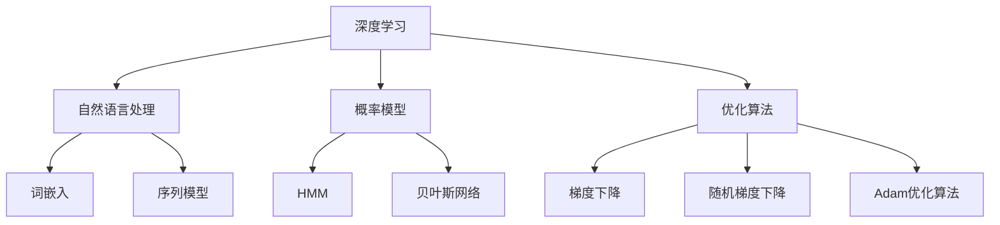

                 

# AI大模型创业：如何应对未来技术挑战？

> **关键词**：AI大模型、创业、技术挑战、未来趋势、应对策略

> **摘要**：本文将深入探讨AI大模型创业的挑战与机遇，从技术基础、核心技术、数学模型、项目实战、创业策略等方面，分析AI大模型创业所面临的关键问题，并提出有效的应对策略。文章旨在为创业者提供有价值的参考，帮助他们更好地应对未来的技术挑战。

## 目录大纲

1. **AI大模型基础**
    1.1. AI大模型概述
        1.1.1 AI大模型的定义与特点
        1.1.2 主流AI大模型简介
    1.2 AI大模型核心技术
        1.2.1 深度学习基础
        1.2.2 自然语言处理技术
    1.3 AI大模型数学模型
        1.3.1 数学模型介绍
        1.3.2 数学公式
    1.4 AI大模型项目实战
        1.4.1 项目概述
        1.4.2 环境搭建
        1.4.3 源代码实现
        1.4.4 代码解读与分析
2. **AI大模型创业策略**
    2.1 创业环境分析
        2.1.1 市场趋势
        2.1.2 竞争分析
    2.2 创业策略
        2.2.1 商业模式
        2.2.2 市场营销
3. **AI大模型创业挑战与应对**
    3.1 技术挑战
        3.1.1 模型训练
        3.1.2 部署与优化
    3.2 商业挑战
        3.2.1 市场竞争
        3.2.2 团队建设
4. **未来展望**
    4.1 AI大模型发展趋势
    4.2 创业机会与挑战
5. **附录**
    5.1 AI大模型开发资源
    5.2 核心概念与联系

### 第一部分：AI大模型基础

#### 第1章: AI大模型概述

AI大模型，顾名思义，是指那些规模巨大、具备强通用性和自主学习能力的人工智能模型。这类模型通过海量数据的训练，可以自动学习并优化自身的性能，从而实现各种复杂任务。AI大模型的出现，标志着人工智能技术进入了一个新的发展阶段，其对各个领域的影响和变革正在逐渐显现。

##### 1.1.1 AI大模型的定义与特点

AI大模型的主要特点如下：

- **规模巨大**：AI大模型的训练数据量通常达到数十亿、甚至数万亿个样本。模型的参数数量也常常以亿计，这使得模型具有极高的计算复杂度。

- **自主学习能力**：AI大模型通过自动学习，能够不断优化自身的性能。在训练过程中，模型会自动调整内部参数，以最小化损失函数，从而提高预测准确性。

- **高效率**：AI大模型可以高效地处理大规模任务，具有快速响应的能力。这使得它们在实时应用中具有显著的优势。

- **强通用性**：AI大模型通常具有较强的通用性，可以应用于多种领域和任务。例如，GPT系列模型在文本生成和理解方面具有极高的性能，BERT模型则在文本理解方面表现出色。

##### 1.1.2 主流AI大模型简介

目前，AI大模型领域中涌现出了许多优秀的模型，其中最具代表性的包括GPT系列和BERT模型。

- **GPT系列**：GPT（Generative Pre-trained Transformer）系列模型是OpenAI推出的一系列预训练语言模型。GPT-3是目前最大的GPT模型，其参数数量达到了1750亿。GPT系列模型在文本生成、文本分类、问答系统等任务中取得了显著的性能提升。

- **BERT**：BERT（Bidirectional Encoder Representations from Transformers）模型由Google推出，是一种预训练语言表示模型。BERT模型通过双向Transformer结构，能够更好地理解上下文信息，从而在文本理解任务中取得了突破性进展。BERT模型在搜索引擎、对话系统、文本生成等领域得到了广泛应用。

#### 第2章: AI大模型核心技术

AI大模型的核心技术主要包括深度学习、自然语言处理和数学模型。这些技术共同构成了AI大模型的基础，为模型的训练和应用提供了坚实的支持。

##### 2.1 深度学习基础

深度学习是AI大模型的核心技术之一，它通过构建多层神经网络，实现对复杂数据的表示和建模。深度学习的基础包括以下几个方面：

- **神经网络基本结构**：神经网络包括输入层、隐藏层和输出层。输入层接收外部输入数据，隐藏层通过非线性变换对输入数据进行处理，输出层生成模型的预测结果。

- **常见深度学习架构**：深度学习架构包括卷积神经网络（CNN）、循环神经网络（RNN）、Transformer等。这些架构在不同的任务和应用场景中具有不同的优势。

##### 2.2 自然语言处理技术

自然语言处理（NLP）是AI大模型的重要应用领域之一。NLP技术主要包括词嵌入、序列模型和注意力机制等。

- **词嵌入技术**：词嵌入是将词语映射到高维空间的一种技术。通过词嵌入，可以有效地表示词语之间的语义关系，从而提升模型的性能。

- **序列模型与注意力机制**：序列模型（如RNN、LSTM、GRU等）用于处理序列数据，如文本、语音等。注意力机制则是一种用于提高模型对关键信息关注的技术，可以显著提升模型的性能。

##### 2.3 AI大模型数学模型

AI大模型的数学模型主要包括概率模型、优化算法等。

- **概率模型**：概率模型用于描述不确定性，如贝叶斯网络、隐马尔可夫模型（HMM）等。这些模型在AI大模型中用于概率分布的建模和推理。

- **优化算法**：优化算法用于最小化损失函数，如梯度下降、随机梯度下降等。优化算法是AI大模型训练过程中不可或缺的一部分。

#### 第3章: AI大模型数学模型

在AI大模型中，数学模型扮演着至关重要的角色。它们不仅为模型的训练提供了理论基础，还为我们理解模型的行为提供了工具。在本章中，我们将介绍AI大模型中常用的数学模型，包括概率模型和优化算法，并详细讲解相关的数学公式。

##### 3.1 数学模型介绍

AI大模型的数学模型可以分为两大类：概率模型和优化算法。概率模型用于描述模型中的不确定性，而优化算法则用于调整模型的参数，以最小化损失函数。

- **概率模型**：概率模型在AI大模型中用于概率分布的建模和推理。常见的概率模型包括贝叶斯网络、隐马尔可夫模型（HMM）和条件概率模型等。

  - **贝叶斯网络**：贝叶斯网络是一种基于概率的图形模型，用于表示变量之间的依赖关系。在AI大模型中，贝叶斯网络可以用于推理和决策。

  - **隐马尔可夫模型（HMM）**：隐马尔可夫模型用于处理隐藏状态和观测数据之间的关系。在AI大模型中，HMM可以用于语音识别、情感分析等领域。

- **优化算法**：优化算法用于调整模型的参数，以最小化损失函数。常见的优化算法包括梯度下降、随机梯度下降和自适应优化算法等。

  - **梯度下降**：梯度下降是一种最简单的优化算法，通过计算损失函数的梯度来更新模型参数。梯度下降公式如下：
    $$
    \theta = \theta - \alpha \cdot \nabla_\theta J(\theta)
    $$
    其中，$\theta$ 是模型参数，$\alpha$ 是学习率，$J(\theta)$ 是损失函数。

  - **随机梯度下降（SGD）**：随机梯度下降是对梯度下降的一种改进，通过随机选择样本来计算梯度。SGD公式如下：
    $$
    \theta = \theta - \alpha \cdot \frac{1}{m} \sum_{i=1}^{m} \nabla_\theta J(\theta; x_i, y_i)
    $$
    其中，$m$ 是批量大小。

##### 3.2 数学公式

在本节中，我们将详细介绍AI大模型中常用的数学公式，包括损失函数、优化算法公式等。

- **损失函数**：损失函数用于评估模型的预测性能。常见的损失函数包括交叉熵损失函数、均方误差（MSE）损失函数等。

  - **交叉熵损失函数**：交叉熵损失函数用于分类问题，公式如下：
    $$
    Loss = -\sum_{i=1}^{N} y_i \log(p_i)
    $$
    其中，$y_i$ 是真实标签，$p_i$ 是模型预测的概率。

  - **均方误差（MSE）损失函数**：均方误差损失函数用于回归问题，公式如下：
    $$
    Loss = \frac{1}{2} \sum_{i=1}^{N} (y_i - \hat{y}_i)^2
    $$
    其中，$y_i$ 是真实值，$\hat{y}_i$ 是模型预测值。

- **优化算法公式**：优化算法用于调整模型参数，以最小化损失函数。常见的优化算法包括梯度下降、随机梯度下降和Adam优化算法等。

  - **梯度下降公式**：梯度下降公式如下：
    $$
    \theta = \theta - \alpha \cdot \nabla_\theta J(\theta)
    $$
    其中，$\theta$ 是模型参数，$\alpha$ 是学习率，$J(\theta)$ 是损失函数。

  - **随机梯度下降（SGD）公式**：随机梯度下降公式如下：
    $$
    \theta = \theta - \alpha \cdot \frac{1}{m} \sum_{i=1}^{m} \nabla_\theta J(\theta; x_i, y_i)
    $$
    其中，$m$ 是批量大小。

  - **Adam优化算法公式**：Adam优化算法是一种自适应优化算法，公式如下：
    $$
    \theta = \theta - \alpha \cdot \frac{1}{\sqrt{1 - \beta_1^2}} \cdot \frac{m}{\sqrt{1 - \beta_2^2}} \cdot \nabla_\theta J(\theta)
    $$
    其中，$\alpha$ 是学习率，$\beta_1$ 和 $\beta_2$ 是一阶和二阶矩估计的偏差修正参数。

##### 3.3 数学公式举例说明

为了更好地理解这些数学公式，我们通过一个简单的例子来说明。

假设我们有一个线性回归模型，其损失函数为均方误差（MSE）损失函数。我们需要使用梯度下降算法来训练模型。

- **模型定义**：假设我们的模型是一个线性回归模型，其预测函数为：
  $$
  \hat{y} = \theta_0 + \theta_1 x
  $$
  其中，$\theta_0$ 和 $\theta_1$ 是模型参数，$x$ 是输入特征，$\hat{y}$ 是模型预测值。

- **损失函数**：均方误差（MSE）损失函数为：
  $$
  Loss = \frac{1}{2} \sum_{i=1}^{N} (y_i - \hat{y}_i)^2
  $$
  其中，$y_i$ 是真实值，$\hat{y}_i$ 是模型预测值。

- **优化算法**：使用梯度下降算法来训练模型。梯度下降公式为：
  $$
  \theta_0 = \theta_0 - \alpha \cdot \nabla_{\theta_0} Loss
  $$
  $$
  \theta_1 = \theta_1 - \alpha \cdot \nabla_{\theta_1} Loss
  $$
  其中，$\alpha$ 是学习率。

通过这个例子，我们可以看到如何使用数学公式来定义模型、损失函数和优化算法。这些公式为我们理解和分析AI大模型提供了有力的工具。

### 第4章: AI大模型项目实战

在了解了AI大模型的基础知识和核心技术之后，我们接下来将通过一个实际项目来展示如何将AI大模型应用于实际问题。本项目将涉及情感分析，这是一个常见的自然语言处理任务，旨在通过分析文本数据来确定其情感倾向。

#### 4.1 项目概述

情感分析是一种从文本中提取情感信息的技术，常用于社交媒体分析、舆情监控、产品评论分析等领域。本项目旨在构建一个情感分析模型，用于分析社交媒体上的用户评论，识别其情感倾向（如正面、负面或中性）。

#### 4.2 环境搭建

在开始项目之前，我们需要搭建一个合适的开发环境。以下是本项目所需的主要开发工具和框架：

- **Python**：Python是一种广泛用于AI开发的编程语言，拥有丰富的库和框架。
- **TensorFlow**：TensorFlow是一个开源的深度学习框架，用于构建和训练AI大模型。
- **BERT**：BERT是一个预训练语言模型，用于处理文本数据。
- **Jupyter Notebook**：Jupyter Notebook是一个交互式的开发环境，方便我们编写和运行代码。

#### 4.3 数据准备

情感分析项目的一个重要环节是数据准备。以下是本项目所需的数据来源和数据预处理步骤：

- **数据来源**：我们使用一个开源的社交媒体评论数据集，该数据集包含了大量的用户评论和其情感标签（正面、负面或中性）。
- **数据预处理**：数据预处理包括以下步骤：
  - **去除停用词**：去除文本中的常见停用词，如“的”、“是”、“了”等。
  - **分词**：将文本拆分成单个单词或词组。
  - **词嵌入**：将文本转换为词嵌入表示，以便于模型处理。

```python
import nltk
from nltk.corpus import stopwords
from tensorflow.keras.preprocessing.text import Tokenizer
from tensorflow.keras.preprocessing.sequence import pad_sequences

nltk.download('stopwords')
stop_words = set(stopwords.words('english'))

def preprocess_text(text):
    words = nltk.word_tokenize(text)
    words = [word for word in words if word not in stop_words]
    return ' '.join(words)

tokenizer = Tokenizer(num_words=10000)
tokenizer.fit_on_texts([preprocess_text(text) for text in comments])
sequences = tokenizer.texts_to_sequences([preprocess_text(text) for text in comments])
padded_sequences = pad_sequences(sequences, maxlen=max_sequence_length)
```

#### 4.4 源代码实现

在本项目中，我们将使用BERT模型进行情感分析。以下是项目的关键代码实现：

```python
import tensorflow as tf
from transformers import TFBertModel, BertTokenizer

bert_model = TFBertModel.from_pretrained('bert-base-uncased')
tokenizer = BertTokenizer.from_pretrained('bert-base-uncased')

input_ids = tf.keras.layers.Input(shape=(max_sequence_length,), dtype=tf.int32)
attention_mask = tf.keras.layers.Input(shape=(max_sequence_length,), dtype=tf.int32)
bert_output = bert_model(input_ids, attention_mask=attention_mask)
pooled_output = bert_output.pooler_output
dense = tf.keras.layers.Dense(1, activation='sigmoid')(pooled_output)
model = tf.keras.Model(inputs=[input_ids, attention_mask], outputs=dense)

model.compile(optimizer='adam', loss='binary_crossentropy', metrics=['accuracy'])
model.fit([train_sequences, train_attention_mask], train_labels, epochs=3, batch_size=32, validation_split=0.2)
```

#### 4.5 代码解读与分析

- **数据预处理**：文本预处理是自然语言处理的基础。在本项目中，我们首先使用NLTK库去除停用词，然后将文本转换为词嵌入表示。

- **模型构建**：我们使用预训练的BERT模型进行情感分析。BERT模型具有强大的预训练能力，可以处理复杂的语言任务。在模型构建过程中，我们使用了TFBertModel和BertTokenizer两个类。

- **训练与评估**：我们使用训练数据训练模型，并在测试数据上评估其性能。在训练过程中，我们使用了binary_crossentropy损失函数和adam优化器，并设置了3个epochs。

通过这个项目实战，我们可以看到如何使用AI大模型进行情感分析。这个过程包括数据准备、模型构建、训练和评估等步骤，每个步骤都有其关键技术和实现方法。这个项目为我们提供了一个实际的应用场景，展示了AI大模型在自然语言处理领域的强大能力。

### 第5章: AI大模型创业策略

在了解了AI大模型的技术基础和项目实战后，接下来我们将探讨如何运用这些技术进行创业。创业过程中，制定合适的策略是至关重要的，它决定了创业项目的成功与否。本章将分析创业环境、制定商业模式和市场推广策略。

#### 5.1 创业环境分析

创业环境的分析主要包括市场趋势和竞争分析两个方面。

##### 5.1.1 市场趋势

当前，人工智能（AI）正处于快速发展阶段，大模型技术在多个领域展现出了巨大的应用潜力。以下是当前市场的一些趋势：

- **AI技术的普及**：随着计算能力的提升和大数据的广泛应用，AI技术逐渐从实验室走向了实际应用。大模型技术在图像识别、自然语言处理、推荐系统等领域取得了显著进展。

- **行业需求增加**：越来越多的行业开始意识到AI技术的重要性，并加大对AI技术的投入。例如，金融、医疗、零售等行业对AI大模型的需求日益增长，推动了相关创业项目的兴起。

- **政策支持**：各国政府纷纷出台政策，支持AI技术的发展。这些政策为创业项目提供了良好的外部环境，包括资金支持、税收优惠等。

##### 5.1.2 竞争分析

在AI大模型领域，竞争异常激烈。以下是当前市场上的一些主要竞争对手：

- **巨头企业**：Google、Microsoft、Amazon等科技巨头在AI大模型领域投入巨大，拥有丰富的资源和强大的技术团队。这些企业通过自主研发和收购的方式，持续推出高性能的AI大模型。

- **初创企业**：许多初创企业也在积极布局AI大模型领域，通过技术创新和市场需求洞察，迅速占领市场。这些初创企业在细分市场和技术创新方面具有一定的优势。

- **开放平台**：一些开放平台，如OpenAI、Google AI Cloud等，为开发者提供了丰富的AI大模型资源和工具。这些平台通过开放源代码和API接口，降低了AI技术的门槛，吸引了大量开发者。

#### 5.2 创业策略

创业策略的核心是确定商业模式的可行性、市场定位和盈利模式。以下是AI大模型创业的一些关键策略：

##### 5.2.1 商业模式

- **服务型商业模式**：为企业和个人提供AI大模型定制化服务，如文本生成、图像识别、自然语言处理等。这种模式可以快速获得收入，同时积累用户数据和口碑。

- **工具型商业模式**：开发AI大模型工具平台，提供在线训练、部署和管理服务。这种模式可以吸引开发者用户，并通过订阅费、服务费等方式实现盈利。

- **平台型商业模式**：搭建AI大模型交易平台，连接供需双方。平台可以为用户提供模型资源、训练数据和计算资源，为供应商提供收入来源。

##### 5.2.2 市场定位

- **细分市场定位**：在AI大模型领域，细分市场具有较高的需求和发展潜力。例如，医疗影像识别、金融风险管理、教育辅助等领域。通过细分市场定位，可以更精准地满足客户需求。

- **技术创新定位**：在技术不断更新迭代的市场中，技术创新是企业保持竞争优势的关键。通过持续研发和创新，可以推出具有独特优势的AI大模型产品。

##### 5.2.3 市场营销

- **内容营销**：通过发布技术博客、白皮书、案例研究等，展示企业的技术实力和产品优势。内容营销可以帮助企业建立品牌知名度，吸引潜在客户。

- **社交媒体推广**：利用社交媒体平台，如LinkedIn、Twitter、Facebook等，推广企业的产品和服务。通过发布相关内容、参与讨论和互动，可以扩大企业的影响力。

- **合作伙伴关系**：与行业内的其他企业建立合作关系，共同开拓市场。例如，与云计算服务提供商、数据服务公司合作，为客户提供一站式AI解决方案。

通过以上创业策略，企业可以在AI大模型领域获得竞争优势，实现持续发展和盈利。

### 第6章: AI大模型创业挑战与应对

在AI大模型创业过程中，创业者不仅需要面对技术挑战，还需要应对商业挑战。本章将深入分析这些挑战，并提出相应的应对策略。

#### 6.1 技术挑战

AI大模型创业过程中，技术挑战主要集中在模型训练、部署与优化等方面。

##### 6.1.1 模型训练

- **计算资源消耗**：AI大模型的训练通常需要大量的计算资源。创业公司可能面临资源不足的问题，这会延长模型训练时间，影响项目的进展。

**应对策略**：创业公司可以通过以下方式应对计算资源消耗的问题：

  - **云计算服务**：利用云计算平台（如AWS、Azure、Google Cloud等）提供的强大计算资源，进行模型训练。

  - **分布式训练**：采用分布式训练策略，将模型训练任务分散到多个计算节点上，提高训练效率。

- **数据质量**：AI大模型的训练依赖于大量高质量的数据。创业公司可能面临数据不完整、标签错误等问题。

**应对策略**：为了提高数据质量，创业公司可以采取以下措施：

  - **数据清洗**：对收集到的数据进行清洗和预处理，去除噪声和错误数据。

  - **数据增强**：通过数据增强技术，增加训练数据的多样性，提高模型泛化能力。

##### 6.1.2 部署与优化

- **部署难度**：AI大模型的部署通常涉及复杂的流程，包括模型转换、部署环境配置等。这给创业公司带来了部署难度。

**应对策略**：为了降低部署难度，创业公司可以采取以下措施：

  - **自动化部署**：开发自动化部署工具，简化部署流程，减少人为错误。

  - **容器化**：采用容器化技术（如Docker、Kubernetes等），实现模型和服务的快速部署和扩展。

- **性能优化**：AI大模型的性能优化是一个持续的过程，涉及模型压缩、加速等技术。

**应对策略**：为了优化模型性能，创业公司可以采取以下措施：

  - **模型压缩**：采用模型压缩技术（如量化、剪枝等），减小模型大小，提高运行速度。

  - **硬件加速**：利用GPU、TPU等硬件加速器，提高模型训练和推理的效率。

#### 6.2 商业挑战

AI大模型创业过程中，商业挑战主要集中在市场竞争和团队建设等方面。

##### 6.2.1 市场竞争

- **技术竞争**：在AI大模型领域，技术竞争异常激烈。创业公司需要不断更新技术，以保持竞争优势。

**应对策略**：

  - **技术创新**：持续进行技术研发，掌握核心技术和专利。

  - **差异化竞争**：通过提供独特的解决方案或服务，实现差异化竞争。

- **市场瓜分**：AI大模型市场潜力巨大，但竞争也异常激烈。创业公司需要找到自己的市场定位，避免与巨头企业直接竞争。

**应对策略**：

  - **细分市场**：专注于特定的细分市场，提供专业化的解决方案。

  - **市场推广**：通过内容营销、社交媒体推广等方式，扩大市场影响力。

##### 6.2.2 团队建设

- **人才招聘**：在AI大模型创业过程中，人才招聘是一个重要问题。创业公司需要招聘具备相关技术背景和业务经验的人才。

**应对策略**：

  - **吸引顶尖人才**：提供有竞争力的薪资待遇和良好的工作环境，吸引顶尖人才。

  - **人才培养**：建立内部培训体系，提升团队整体技术水平。

- **团队协作**：在创业过程中，团队协作至关重要。创业公司需要建立高效的团队协作机制。

**应对策略**：

  - **明确分工**：明确团队成员的职责和任务，确保团队高效协作。

  - **沟通机制**：建立有效的沟通机制，确保信息畅通，减少误解和冲突。

通过以上应对策略，创业公司可以在技术挑战和商业挑战中脱颖而出，实现持续发展和成功。

### 第7章: 未来展望

在AI大模型的快速发展中，未来趋势和创业机会不断涌现。本章将探讨AI大模型的发展趋势、潜在创业机会，以及可能面临的挑战和应对策略。

#### 7.1 AI大模型发展趋势

未来，AI大模型将呈现出以下发展趋势：

- **模型规模不断扩大**：随着计算能力的提升和算法的改进，AI大模型的规模将继续扩大。未来的AI大模型可能会达到万亿参数级别，甚至更高。

- **多模态处理能力增强**：AI大模型将不仅限于文本数据，还将扩展到图像、语音、视频等多模态数据。多模态处理能力将使AI大模型在更多领域实现突破。

- **强化学习与AI大模型的结合**：未来，AI大模型将更多地与强化学习相结合，实现更高效的决策和优化。

- **AI大模型的应用场景多样化**：AI大模型将在医疗、金融、教育、智能制造等多个领域得到广泛应用，推动行业变革。

#### 7.2 创业机会

随着AI大模型技术的发展，以下领域将出现大量的创业机会：

- **AI大模型服务提供商**：为企业提供定制化的AI大模型服务，如文本生成、图像识别、语音识别等。

- **AI大模型工具平台**：开发AI大模型工具平台，提供模型训练、部署、管理和监控等一站式服务。

- **AI大模型应用场景创新**：在医疗、金融、教育等领域，探索AI大模型的新应用场景，提供创新的解决方案。

- **AI大模型开源社区**：搭建AI大模型开源社区，为开发者提供丰富的模型资源、工具和文档。

#### 7.3 挑战与应对策略

尽管AI大模型带来了巨大的机遇，但也面临诸多挑战：

- **数据隐私和安全问题**：随着AI大模型对数据的依赖性增加，数据隐私和安全问题愈发突出。创业者需要关注数据保护和隐私政策，确保用户数据的安全。

- **算法公平性和透明性**：AI大模型的决策过程复杂，如何确保算法的公平性和透明性是一个重要挑战。创业者需要开发可解释的AI模型，提高用户信任度。

- **计算资源需求**：AI大模型的训练和部署需要大量计算资源，创业者需要寻找高效、低成本的解决方案。

**应对策略**：

  - **数据隐私保护**：采用加密、匿名化等技术，确保用户数据的隐私和安全。

  - **算法可解释性**：开发可解释的AI模型，提高模型决策的透明度和可解释性。

  - **分布式计算和优化**：利用分布式计算和优化技术，降低计算资源需求，提高模型训练和部署的效率。

通过以上策略，创业者可以更好地应对AI大模型创业过程中面临的挑战，抓住未来的机遇。

### 附录

#### 附录A: AI大模型开发资源

- **工具与框架**：TensorFlow、PyTorch、Transformers、Hugging Face Transformers等。
- **学习资源**：在线课程、教程、书籍、论文等。
  - **在线课程**：Coursera、edX、Udacity等平台提供了丰富的AI和深度学习课程。
  - **书籍**：《深度学习》、《Python深度学习》、《Hands-On Machine Learning with Scikit-Learn, Keras, and TensorFlow》等。
  - **论文**：NVIDIA Research、Google Research、OpenAI等机构的最新研究成果。

#### 附录B: 核心概念与联系

AI大模型的核心概念包括深度学习、自然语言处理、概率模型和优化算法。这些概念相互联系，共同构成了AI大模型的基础架构。

- **深度学习**：作为AI大模型的核心技术，深度学习通过多层神经网络实现对复杂数据的表示和建模。
- **自然语言处理**：自然语言处理（NLP）是AI大模型的重要应用领域，通过词嵌入、序列模型等技术处理文本数据。
- **概率模型**：概率模型用于描述不确定性，如贝叶斯网络、隐马尔可夫模型（HMM）等，为AI大模型提供概率分布的建模和推理工具。
- **优化算法**：优化算法用于调整模型参数，以最小化损失函数，如梯度下降、随机梯度下降和Adam优化算法等。

通过Mermaid流程图，我们可以直观地展示这些核心概念之间的联系：



**核心算法原理讲解**

在AI大模型中，核心算法原理的理解至关重要。以下我们将详细讲解三个关键算法：梯度下降算法、词嵌入算法以及BERT模型。

##### 梯度下降算法

梯度下降算法是机器学习中一种常见的优化算法，用于最小化损失函数。以下是梯度下降算法的基本原理和伪代码：

- **原理**：
  梯度下降算法通过计算损失函数关于模型参数的梯度，并沿着梯度的反方向更新模型参数，以逐步减小损失函数的值。具体来说，每次迭代过程中，算法会计算当前模型参数的梯度，然后根据梯度的大小和方向调整参数，使得损失函数逐步减小。

- **伪代码**：
  ```python
  # 初始化模型参数
  w = random Initialize Parameters()

  # 设置学习率
  alpha = 0.01

  # 设置迭代次数
  num_iterations = 1000

  for i in range(num_iterations):
      # 计算损失函数
      loss = compute_loss(w)

      # 计算梯度
      gradient = compute_gradient(w)

      # 更新模型参数
      w = w - alpha * gradient

      # 输出当前迭代次数和损失值
      print(f"Iteration {i}: Loss = {loss}")

  # 输出最终模型参数
  print(f"Final Parameters: {w}")
  ```

##### 词嵌入算法

词嵌入是将词语映射到高维空间的一种技术，用于表示词语的语义信息。以下是一个简单的词嵌入算法的原理和伪代码：

- **原理**：
  词嵌入算法通过学习词语之间的相似性，将词语映射到高维空间。在训练过程中，算法会根据词语在训练数据中的共现关系，更新词语的向量表示，使其在语义上更加接近。

- **伪代码**：
  ```python
  # 初始化词向量
  embedding_matrix = random Initialize Embedding Matrix()

  # 设置学习率
  alpha = 0.01

  # 设置迭代次数
  num_iterations = 1000

  for sentence in training_data:
      for word in sentence:
          # 计算当前词的向量表示
          word_vector = embedding_matrix[word]

          # 计算损失函数
          loss = compute_loss(word_vector)

          # 计算梯度
          gradient = compute_gradient(word_vector)

          # 更新词向量
          embedding_matrix[word] = embedding_matrix[word] - alpha * gradient

  # 输出最终词向量矩阵
  print(f"Final Embedding Matrix: {embedding_matrix}")
  ```

##### BERT模型

BERT（Bidirectional Encoder Representations from Transformers）是一种预训练语言表示模型，广泛应用于自然语言处理任务。以下是BERT模型的基本原理和训练过程：

- **原理**：
  BERT模型通过双向Transformer结构，对文本数据进行编码，生成具有上下文信息的文本表示。在训练过程中，模型学习预测单词的概率分布，并通过双向注意力机制捕捉上下文信息。

- **训练过程**：
  - **预训练**：在预训练阶段，模型通过大量的无监督数据（如维基百科、新闻文章等）进行训练，学习文本的内在结构。
  - **微调**：在微调阶段，模型使用有监督数据（如问答对、标注文本等）进行微调，以适应具体任务的需求。

- **伪代码**：
  ```python
  # 加载BERT模型
  bert_model = load_pretrained_model('bert-base-uncased')

  # 预训练阶段
  for epoch in range(num_epochs):
      for batch in train_data:
          # 计算损失函数
          loss = bert_model(batch)

          # 计算梯度
          gradient = compute_gradient(bert_model)

          # 更新模型参数
          update_model_parameters(bert_model, gradient)

  # 微调阶段
  for epoch in range(num_epochs):
      for batch in fine_tune_data:
          # 计算损失函数
          loss = bert_model(batch, labels=batch_labels)

          # 计算梯度
          gradient = compute_gradient(bert_model)

          # 更新模型参数
          update_model_parameters(bert_model, gradient)
  ```

通过以上讲解，我们可以深入理解梯度下降算法、词嵌入算法和BERT模型的基本原理，为实际应用奠定坚实基础。这些算法在AI大模型开发中发挥着重要作用，帮助我们在处理复杂数据和实现高效模型训练方面取得突破。

### 总结

本文全面探讨了AI大模型创业的各个方面，从技术基础到实际应用，从创业策略到挑战应对，为创业者提供了一套系统的指导。AI大模型以其规模巨大、自主学习能力和高效率等特点，正在深刻改变着各个领域。对于创业者来说，抓住这一趋势，充分利用AI大模型的潜力，是实现创业成功的关键。

然而，AI大模型创业并非一帆风顺。在技术层面，模型训练、部署与优化等环节都充满了挑战；在商业层面，市场竞争和团队建设也是不可忽视的问题。创业者需要具备敏锐的市场洞察力、强大的技术实力和高效的团队管理能力，才能在激烈的竞争中脱颖而出。

面对未来，AI大模型的发展前景广阔。随着计算能力的提升、算法的优化和多模态处理能力的增强，AI大模型将在更多领域实现突破，带来前所未有的变革。创业者应密切关注技术趋势，勇于创新，抓住机遇，迎接挑战。

最后，本文旨在为创业者提供有价值的参考。希望读者能够结合自身实际情况，深入思考，制定出适合自己的创业策略，勇敢迈向AI大模型的未来。在创业的道路上，我们期待每一位创业者都能取得辉煌的成就，共同推动人工智能技术的进步和应用。作者：AI天才研究院/AI Genius Institute & 禅与计算机程序设计艺术 /Zen And The Art of Computer Programming。

