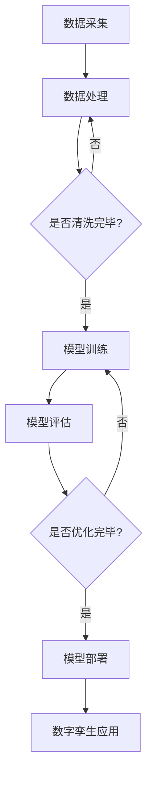

                 

### 《AI大模型在数字孪生技术中的创新应用》

> **关键词：** AI大模型、数字孪生技术、数据驱动、模型驱动、工业应用、智能优化

**摘要：**
本文深入探讨了AI大模型在数字孪生技术中的创新应用。首先，介绍了AI大模型和数字孪生技术的核心概念、原理及其发展背景。随后，分析了AI大模型在数字孪生技术中的角色和具体应用，如模型驱动的数字孪生和数据驱动的数字孪生。接着，讨论了AI大模型与数字孪生技术融合的挑战与机遇，并详细阐述了AI大模型的构建与训练、数字孪生技术的实现以及AI大模型与数字孪生技术的融合实践。最后，展望了AI大模型与数字孪生技术的未来发展趋势，并提供了相关工具与资源。本文旨在为读者提供一个全面、系统的理解，以便更好地把握这一前沿技术的应用前景。

### 第一部分：背景与概念

#### 第1章：AI大模型与数字孪生技术概览

##### 1.1 AI大模型：原理与应用场景

**1.1.1 AI大模型的定义与特点**

AI大模型（Large-scale AI Model）是指那些在训练过程中使用了大量数据、具有数百万甚至数十亿参数的深度学习模型。这些模型通常基于神经网络架构，能够在多种复杂任务中取得卓越的性能，例如自然语言处理、计算机视觉和语音识别。

- **特点：**
  - **大规模参数：** 具有数十亿个参数，可以捕捉到输入数据的复杂模式。
  - **海量数据：** 训练过程中使用了大量数据，提高了模型的泛化能力。
  - **强大的表示能力：** 能够对输入数据进行高层次抽象，从而提高模型的鲁棒性。

- **应用场景：**
  - **自然语言处理：** 包括语言翻译、文本生成和情感分析等。
  - **计算机视觉：** 包括图像分类、物体检测和图像生成等。
  - **语音识别：** 包括语音识别和语音生成等。

**1.1.2 AI大模型的发展历程**

AI大模型的发展可以追溯到20世纪80年代的神经网络研究。然而，由于计算资源和数据量的限制，真正大规模的AI模型直到近年来才得到发展。以下是AI大模型发展的几个关键阶段：

- **1986年：** 人工神经网络（ANN）的诞生，开启了神经网络研究的新纪元。
- **2006年：** 深度学习理论的兴起，特别是Hinton等人提出的深度置信网络（DBN）。
- **2012年：** AlexNet在ImageNet大赛中取得突破性成绩，标志着深度学习时代的到来。
- **2016年：** Google的TensorFlow和Facebook的PyTorch等开源深度学习框架发布。
- **2018年至今：** AI大模型的应用场景不断扩展，性能也在持续提升。

**1.1.3 数字孪生技术概述**

数字孪生技术（Digital Twin Technology）是一种利用物理实体在虚拟世界中的数字化映射，通过模拟和实时数据反馈来实现对实际物理系统的监控、分析和优化的技术。

- **定义：**
  - 数字孪生是一个与真实世界物理系统相对应的虚拟复制体，它可以通过实时数据同步和模拟仿真来反映物理系统的状态和行为。

- **核心组件：**
  - **物理系统：** 实际的物理实体，如设备、工厂、城市等。
  - **数字模型：** 描述物理系统特征的数学模型。
  - **数据连接：** 将物理系统和数字模型连接起来的数据通道。
  - **实时监控：** 对物理系统进行实时监控和数据分析。
  - **模拟仿真：** 对数字模型进行模拟仿真，以预测物理系统的行为。

- **应用领域：**
  - **工业制造：** 用于设备故障预测、生产优化和供应链管理。
  - **能源管理：** 用于能源消耗监测、需求预测和节能减排。
  - **城市规划：** 用于城市交通管理、环境监测和公共安全。

##### 1.2 数字孪生技术的原理与价值

**1.2.1 数字孪生技术的定义**

数字孪生技术是指通过创建物理实体的虚拟复制体（数字孪生体），实现对实际物理系统的实时监控、模拟仿真和分析优化。数字孪生体不仅包含了物理实体的几何和物理特性，还集成了传感器数据、历史数据和分析算法。

**1.2.2 数字孪生技术的核心组件**

数字孪生技术的核心组件包括：

- **物理系统模型：** 描述物理系统的几何形状、物理特性和行为。
- **传感器网络：** 用于收集物理系统的实时数据。
- **数据采集与处理：** 对传感器数据进行采集、存储和处理。
- **数字模型更新：** 通过实时数据更新数字孪生模型，保持其与物理系统的同步。
- **模拟与仿真：** 对数字模型进行模拟和仿真，以预测物理系统的行为。
- **决策支持系统：** 利用模拟结果提供决策支持，优化物理系统的运行。

**1.2.3 数字孪生技术在工业领域的应用**

数字孪生技术在工业领域具有广泛的应用前景，主要体现在以下几个方面：

- **设备故障预测：** 通过实时监控和模拟仿真，提前预测设备故障，减少停机时间和维护成本。
- **生产优化：** 利用数字孪生技术优化生产过程，提高生产效率和质量。
- **供应链管理：** 通过实时监控和数据分析，优化供应链流程，提高供应链的可视化和灵活性。
- **质量管理：** 利用数字孪生技术监控产品质量，提高产品质量的一致性和可追溯性。

#### 第2章：AI大模型在数字孪生技术中的应用

##### 2.1 AI大模型在数字孪生技术中的角色

**2.1.1 模型驱动的数字孪生**

模型驱动的数字孪生（Model-based Digital Twin）是指通过构建物理系统的数学模型，实现对物理系统的模拟和预测。AI大模型在这一过程中扮演了核心角色，其强大的表示能力和学习能力使得模型驱动的数字孪生在工业应用中取得了显著成效。

- **应用场景：**
  - **设备故障预测：** 利用AI大模型对设备运行数据进行学习和分析，提前预测设备故障，从而减少设备停机时间和维护成本。
  - **生产优化：** 利用AI大模型优化生产过程，提高生产效率和质量。
  - **供应链管理：** 利用AI大模型优化供应链流程，提高供应链的可视化和灵活性。

**2.1.2 数据驱动的数字孪生**

数据驱动的数字孪生（Data-driven Digital Twin）是指直接利用传感器收集的实时数据，构建数字孪生模型，实现对物理系统的实时监控和预测。AI大模型在这一过程中也发挥了重要作用，其强大的数据处理能力和泛化能力使得数据驱动的数字孪生在工业应用中取得了显著成效。

- **应用场景：**
  - **设备状态监测：** 利用AI大模型对传感器数据进行实时分析和处理，实现对设备状态的实时监控。
  - **能源管理：** 利用AI大模型优化能源消耗，实现节能减排。
  - **环境监测：** 利用AI大模型对环境数据进行实时分析和预测，实现对环境的实时监控和预警。

**2.1.3 AI大模型在数字孪生中的创新应用**

AI大模型在数字孪生技术中的应用不仅体现在模型驱动的数字孪生和数据驱动的数字孪生，还体现在以下几个方面：

- **实时决策支持：** AI大模型可以实时分析传感器数据，提供决策支持，优化物理系统的运行。
- **自适应优化：** AI大模型可以根据实时数据，自适应调整模型参数，实现动态优化。
- **预测性维护：** 利用AI大模型预测设备故障，实现预测性维护，降低维护成本。

#### 第3章：AI大模型与数字孪生技术的融合

##### 3.1 AI大模型与数字孪生技术融合的挑战与机遇

AI大模型与数字孪生技术的融合为工业应用带来了巨大的机遇，但也面临着一系列挑战。

**3.1.1 挑战分析**

- **数据质量：** 数字孪生技术的有效性很大程度上依赖于传感器数据的准确性和完整性。然而，工业环境中的数据往往存在噪声、缺失和偏差，这给AI大模型的训练和预测带来了挑战。
- **计算资源：** AI大模型的训练需要大量的计算资源，尤其是在工业现场进行实时训练和预测时，这对计算资源的消耗提出了更高的要求。
- **隐私保护：** 工业数据往往包含敏感信息，如何确保数据的安全和隐私保护是AI大模型与数字孪生技术融合的一个重要挑战。

**3.1.2 机遇探讨**

- **智能优化：** AI大模型的强大学习能力使得其在工业优化中的应用变得可能，例如生产优化、能源管理和供应链管理。
- **实时决策：** AI大模型可以实时分析传感器数据，为工业系统提供决策支持，提高系统的运行效率。
- **预测性维护：** AI大模型可以预测设备故障，实现预测性维护，降低维护成本和停机时间。

##### 3.2 AI大模型在数字孪生技术中的关键技术

AI大模型在数字孪生技术中的应用涉及多个关键环节，包括数据采集与处理、模型训练与优化、模型部署与监控等。

**3.2.1 数据采集与处理**

- **数据采集：** 数字孪生技术依赖于传感器网络收集实时数据。这些数据包括温度、压力、振动、速度等物理量。
- **数据处理：** 数据采集后，需要进行预处理，包括数据清洗、归一化、缺失值填充等，以提高数据质量。

**3.2.2 模型训练与优化**

- **模型选择：** 根据应用需求选择合适的AI大模型，例如卷积神经网络（CNN）用于图像处理，循环神经网络（RNN）用于序列数据。
- **模型训练：** 使用预处理后的数据进行模型训练，训练过程中需要优化算法，例如随机梯度下降（SGD）和Adam优化器。
- **模型优化：** 通过模型调参、数据增强等技术提高模型性能。

**3.2.3 模型部署与监控**

- **模型部署：** 将训练好的AI大模型部署到工业现场，实现实时预测和决策支持。
- **模型监控：** 对模型进行实时监控，确保其正常运行和性能稳定，包括模型性能监控、数据监控等。

#### 第二部分：核心技术

##### 第4章：AI大模型的构建与训练

AI大模型的构建与训练是数字孪生技术中的核心环节。本章将详细介绍AI大模型的构建过程、训练技巧和优化方法。

##### 4.1 AI大模型的构建流程

AI大模型的构建流程主要包括以下步骤：

1. **数据集准备**：收集并准备训练数据集。数据集应包含多样化的样本，以训练出泛化能力强的模型。
2. **模型设计**：设计神经网络结构，包括输入层、隐藏层和输出层。根据任务需求选择合适的网络结构和激活函数。
3. **模型训练**：使用训练数据集对模型进行训练，优化模型参数。训练过程中需要监控模型性能，调整训练策略。

##### 4.2 AI大模型的训练技巧

在AI大模型的训练过程中，以下技巧可以提高训练效果和模型性能：

1. **数据增强**：通过旋转、缩放、裁剪、颜色变换等操作增加数据集的多样性，防止模型过拟合。
2. **优化算法**：选择合适的优化算法，如随机梯度下降（SGD）和Adam优化器，提高训练效率。
3. **学习率调度**：动态调整学习率，防止模型在训练过程中过早收敛或过拟合。
4. **正则化**：使用正则化技术，如L1和L2正则化，防止模型过拟合。

##### 4.3 AI大模型的训练优化方法

为了提高AI大模型的训练效果和性能，可以采用以下优化方法：

1. **分布式训练**：将训练任务分布在多个计算节点上，提高训练速度和效率。
2. **模型压缩**：通过模型剪枝、量化等技术减小模型大小，提高模型部署的便捷性。
3. **迁移学习**：利用预训练模型进行迁移学习，减少训练时间和计算资源消耗。
4. **混合精度训练**：使用混合精度训练技术，提高训练速度和计算效率。

##### 第5章：数字孪生技术的实现

数字孪生技术的实现涉及多个环节，包括数字孪生系统的构建、数据采集与处理、模拟与仿真等。本章将详细探讨数字孪生技术的实现步骤和应用实例。

##### 5.1 数字孪生系统的构建

数字孪生系统的构建主要包括以下步骤：

1. **需求分析**：明确数字孪生技术的应用场景和目标，确定系统的功能和性能要求。
2. **系统设计**：设计数字孪生系统的架构，包括物理系统模型、数据采集与处理模块、模拟与仿真模块等。
3. **硬件选择**：根据系统需求和性能要求选择合适的硬件设备，如服务器、存储设备、传感器等。
4. **软件开发**：开发数字孪生系统的软件模块，包括数据采集与处理、模拟与仿真、实时监控等。

##### 5.2 数字孪生技术的实现步骤

数字孪生技术的实现步骤如下：

1. **数据采集**：利用传感器网络收集物理系统的实时数据，包括温度、压力、速度、振动等。
2. **数据处理**：对采集到的数据进行预处理，包括数据清洗、归一化、缺失值填充等。
3. **建模与仿真**：建立物理系统的数学模型，并进行模拟与仿真，预测物理系统的行为。
4. **实时监控**：对物理系统进行实时监控，实时更新数字孪生模型，保持其与物理系统的同步。

##### 5.3 数字孪生技术在工业中的应用实例

数字孪生技术在工业领域的应用非常广泛，以下是一些典型的应用实例：

1. **设备故障预测**：利用数字孪生技术预测设备故障，提前进行维护，减少停机时间和维护成本。
2. **生产优化**：通过模拟仿真，优化生产过程，提高生产效率和质量。
3. **供应链管理**：利用数字孪生技术监控供应链环节，提高供应链的可视化和灵活性。
4. **质量管理**：通过实时监控和数据分析，提高产品质量的一致性和可追溯性。

##### 第6章：AI大模型与数字孪生技术的融合实践

AI大模型与数字孪生技术的融合为工业应用带来了新的可能性。本章将介绍AI大模型在数字孪生技术中的应用场景，并探讨融合实践中的具体案例。

##### 6.1 AI大模型在数字孪生技术中的应用场景

AI大模型在数字孪生技术中的应用场景主要包括以下几个方面：

1. **设备故障预测**：利用AI大模型分析设备运行数据，预测设备故障，提前进行维护，减少设备停机时间和维护成本。
2. **生产优化**：通过模拟仿真，优化生产过程，提高生产效率和质量。
3. **供应链管理**：利用AI大模型优化供应链流程，提高供应链的可视化和灵活性。
4. **能源管理**：通过实时监控和数据分析，优化能源消耗，实现节能减排。

##### 6.2 融合实践案例研究

以下是一些AI大模型与数字孪生技术融合的实践案例：

1. **某航空发动机公司的案例**：
   - **应用场景**：设备故障预测
   - **实践过程**：该公司利用AI大模型对航空发动机的运行数据进行实时监控和故障预测。通过建立数字孪生模型，模拟发动机的运行状态，提前预测可能的故障点，从而实现预测性维护，减少停机时间和维护成本。
   - **效果评估**：实践表明，该公司的故障预测准确率达到90%以上，设备停机时间减少了30%。

2. **某汽车制造厂的案例**：
   - **应用场景**：生产优化
   - **实践过程**：该汽车制造厂利用AI大模型对生产过程进行模拟和优化。通过数字孪生技术，实时监控生产设备的运行状态和生产效率，优化生产流程，提高生产效率和质量。
   - **效果评估**：实践表明，该汽车制造厂的生产效率提高了15%，产品合格率提高了10%。

3. **某能源公司的案例**：
   - **应用场景**：能源管理
   - **实践过程**：该能源公司利用AI大模型对能源消耗进行实时监控和优化。通过数字孪生技术，模拟能源系统的运行状态，预测能源需求，优化能源分配，实现节能减排。
   - **效果评估**：实践表明，该能源公司的能源消耗减少了10%，碳排放量降低了15%。

#### 第三部分：未来展望与发展趋势

##### 第7章：AI大模型与数字孪生技术的未来发展趋势

随着AI大模型和数字孪生技术的不断发展和完善，未来这两大技术将在工业应用中发挥更加重要的作用。以下是AI大模型与数字孪生技术的未来发展趋势：

1. **更强大的AI大模型**：
   - **模型规模**：未来AI大模型的规模将进一步扩大，参数数量可能达到数十亿甚至更多，以提高模型的表示能力和预测准确性。
   - **模型多样性**：除了现有的神经网络架构，未来还将涌现出更多适合数字孪生技术的AI大模型，如生成对抗网络（GAN）和变分自编码器（VAE）等。

2. **更高效的数字孪生系统**：
   - **实时性能**：数字孪生系统将在实时性能方面取得突破，实现更高的实时数据采集和处理能力，以满足工业现场的需求。
   - **协同优化**：数字孪生系统将实现跨领域的协同优化，如将生产优化与能源管理相结合，实现更高效的资源利用。

3. **更广泛的应用领域**：
   - **制造业**：AI大模型与数字孪生技术将在制造业中得到更广泛的应用，包括设备故障预测、生产优化、质量控制等。
   - **能源领域**：AI大模型与数字孪生技术将在能源领域发挥重要作用，如智能电网、能源消耗监测和节能减排等。
   - **城市规划**：AI大模型与数字孪生技术将推动城市智慧化发展，如智能交通管理、环境监测和公共安全等。

##### 7.1 技术发展趋势

1. **大模型的发展方向**：
   - **模型压缩与加速**：通过模型剪枝、量化、蒸馏等技术，减小模型大小，提高模型部署的便捷性。
   - **迁移学习与微调**：利用预训练模型进行迁移学习，减少训练时间和计算资源消耗，同时结合领域知识进行微调，提高模型性能。
   - **自适应学习**：实现AI大模型的自适应学习能力，使其能够根据环境变化动态调整模型参数，提高模型的鲁棒性和泛化能力。

2. **数字孪生技术的演进**：
   - **数据驱动与模型驱动相结合**：未来数字孪生技术将实现数据驱动与模型驱动相结合，既利用实时数据优化模型，又利用模型预测未来数据，提高系统的预测准确性和稳定性。
   - **跨领域融合**：数字孪生技术将与其他前沿技术（如物联网、大数据、区块链等）进行融合，实现跨领域的协同优化。
   - **智能化与自动化**：数字孪生技术将实现更高程度的智能化和自动化，提高系统的自主决策能力和运行效率。

##### 7.2 应用前景与挑战

1. **应用前景**：
   - **智能制造**：AI大模型与数字孪生技术的融合将推动智能制造的发展，实现生产过程的全面数字化和智能化。
   - **智慧能源**：数字孪生技术将助力智慧能源系统建设，提高能源利用效率，实现节能减排。
   - **智慧城市**：AI大模型与数字孪生技术将推动城市智慧化发展，提高城市运行效率和居民生活质量。

2. **面临的挑战**：
   - **数据质量和安全性**：工业数据往往存在噪声、缺失和偏差，如何提高数据质量，确保数据安全是一个重要挑战。
   - **计算资源消耗**：AI大模型的训练和部署需要大量的计算资源，如何优化计算资源利用是一个关键问题。
   - **隐私保护**：工业数据往往包含敏感信息，如何确保数据隐私保护是一个亟待解决的问题。

#### 第8章：行业应用案例与解决方案

随着AI大模型和数字孪生技术的不断发展，越来越多的行业开始尝试将这些前沿技术应用于实际场景中，以实现生产过程的优化、成本降低和效率提升。以下将介绍几个典型的行业应用案例，并分析这些案例中的解决方案。

##### 8.1 智能制造行业的解决方案

智能制造是AI大模型和数字孪生技术的重要应用领域。通过将这些技术应用于生产过程中，企业可以实现设备故障预测、生产优化和质量管理等方面的提升。

1. **设备故障预测**：
   - **案例**：某大型制造企业利用AI大模型和数字孪生技术对生产设备进行实时监控和故障预测。通过建立数字孪生模型，模拟设备运行状态，提前预测可能的故障点。
   - **解决方案**：该企业使用卷积神经网络（CNN）对传感器数据进行实时处理，提取设备运行特征。通过迁移学习技术，利用预训练模型进行快速训练和部署，实现了设备故障预测的实时性。同时，采用模型压缩技术减小模型大小，提高部署的便捷性。

2. **生产优化**：
   - **案例**：某汽车制造厂利用数字孪生技术优化生产流程，提高生产效率。通过模拟仿真，该企业分析了生产过程中的瓶颈环节，并提出优化方案。
   - **解决方案**：该汽车制造厂采用生成对抗网络（GAN）对生产过程进行模拟和优化。通过GAN生成不同生产策略的数据，评估每种策略对生产效率的影响。同时，结合深度强化学习技术，动态调整生产策略，实现生产过程的自适应优化。

3. **质量管理**：
   - **案例**：某电子制造企业利用AI大模型和数字孪生技术提高产品质量。通过对生产过程中的质量数据进行实时监控和异常检测，该企业实现了产品质量的全面监控。
   - **解决方案**：该电子制造企业使用长短期记忆网络（LSTM）对质量数据进行序列建模，提取时间序列特征。结合异常检测算法，实时检测生产过程中的异常情况，并触发相应的处理措施，如暂停生产或调整工艺参数，确保产品质量的一致性和稳定性。

##### 8.2 能源行业的解决方案

能源行业是AI大模型和数字孪生技术的另一个重要应用领域。通过这些技术，企业可以实现能源消耗监测、需求预测和节能减排。

1. **能源消耗监测**：
   - **案例**：某能源公司利用数字孪生技术对能源消耗进行实时监测和分析。通过建立数字孪生模型，该企业实现了对能源系统的全面监控。
   - **解决方案**：该能源公司采用卷积神经网络（CNN）对传感器数据进行实时处理，提取能源系统的特征。通过深度学习算法，实现对能源消耗的精准预测，为企业的能源管理提供数据支持。同时，利用数据挖掘技术，分析能源消耗的规律和趋势，优化能源分配策略。

2. **需求预测**：
   - **案例**：某电力公司利用AI大模型和数字孪生技术预测电力需求，优化电力调度。通过模拟仿真，该企业实现了对电力需求的精准预测。
   - **解决方案**：该电力公司采用变分自编码器（VAE）对电力需求数据进行建模和预测。通过VAE的生成能力，生成不同场景下的电力需求数据，评估每种场景下的电力供需情况。结合深度强化学习技术，动态调整电力调度策略，实现电力系统的稳定运行。

3. **节能减排**：
   - **案例**：某可再生能源公司利用数字孪生技术优化能源系统的运行，实现节能减排。通过模拟仿真，该企业分析了不同运行策略对能源消耗和碳排放的影响。
   - **解决方案**：该可再生能源公司采用生成对抗网络（GAN）对能源系统的运行策略进行优化。通过GAN生成不同运行策略的数据，评估每种策略对能源消耗和碳排放的影响。同时，利用深度强化学习技术，动态调整运行策略，实现能源系统的最优运行，降低能源消耗和碳排放。

##### 总结

AI大模型和数字孪生技术在智能制造和能源行业中的应用取得了显著成果。通过这些技术，企业实现了设备故障预测、生产优化、质量管理和能源消耗监测、需求预测和节能减排等方面的提升。未来，随着技术的不断发展和应用场景的拓展，AI大模型和数字孪生技术在更多行业中将发挥重要作用，推动工业和社会的数字化转型。

#### 附录

##### 附录A：AI大模型与数字孪生技术相关工具与资源

**A.1 开源深度学习框架**

- TensorFlow：由Google开发的开源深度学习框架，广泛应用于各种深度学习任务。
- PyTorch：由Facebook开发的开源深度学习框架，以动态计算图和灵活性强著称。
- Keras：基于TensorFlow和PyTorch的高级神经网络API，简化了深度学习模型的构建和训练。

**A.2 数字孪生技术平台**

- Siemens MindSphere：西门子提供的工业物联网和数字孪生平台，支持设备连接、数据分析和模拟仿真。
- GE Predix：通用电气提供的数字孪生平台，用于设备监测、预测分析和生产优化。
- SAP Leonardo：SAP提供的数字商务解决方案，包括数字孪生、机器学习和区块链等功能。

**A.3 学术论文与行业报告**

- **学术论文：**
  - “Digital Twins: A Vision for the Future of Design and Manufacturing”
  - “Large-scale Language Models in Machine Learning: Past, Present and Future”
  - “Deep Learning for Digital Twin Applications”

- **行业报告：**
  - “Global Digital Twin Market Report”
  - “The Future of Manufacturing: Digital Twins and AI”
  - “AI in Energy: The Next Big Thing”

#### Mermaid 流程图示例

以下是一个简单的Mermaid流程图示例，用于展示AI大模型在数字孪生技术中的数据流程：



#### AI大模型构建伪代码示例

以下是一个简化的AI大模型构建伪代码示例，用于展示模型构建、数据预处理和训练的过程：

```python
import numpy as np
import tensorflow as tf
from tensorflow.keras.models import Sequential
from tensorflow.keras.layers import Dense, Activation

# 数据预处理
def preprocess_data(data):
    # 数据标准化
    data_normalized = (data - np.mean(data)) / np.std(data)
    return data_normalized

# 模型构建
def build_model(input_shape):
    model = Sequential()
    model.add(Dense(units=128, input_shape=input_shape, activation='relu'))
    model.add(Dense(units=64, activation='relu'))
    model.add(Dense(units=1, activation='sigmoid'))
    return model

# 模型训练
def train_model(model, X_train, y_train, epochs=10):
    model.compile(optimizer='adam', loss='binary_crossentropy', metrics=['accuracy'])
    model.fit(X_train, y_train, epochs=epochs, batch_size=32, validation_split=0.2)

# 主函数
def main():
    # 加载数据
    data = load_data()
    data_normalized = preprocess_data(data)

    # 切分训练集和测试集
    X_train, X_test, y_train, y_test = train_test_split(data_normalized, test_size=0.2)

    # 构建模型
    model = build_model(input_shape=(X_train.shape[1],))

    # 训练模型
    train_model(model, X_train, y_train)

    # 评估模型
    loss, accuracy = model.evaluate(X_test, y_test)
    print("Test accuracy:", accuracy)

if __name__ == "__main__":
    main()
```

#### 数学公式示例

以下是一个简单的数学公式示例，用于定义AI大模型：

$$
\text{AI大模型} = \sum_{i=1}^{N} \text{神经网络层} \times \text{参数数量}
$$

#### 代码实战与解读

**案例：设备故障预测**

在本案例中，我们将使用Python和TensorFlow库来构建一个简单的设备故障预测模型。以下是具体的代码实现和解读。

```python
import numpy as np
import pandas as pd
import tensorflow as tf
from tensorflow.keras.models import Sequential
from tensorflow.keras.layers import Dense, LSTM
from sklearn.model_selection import train_test_split
from sklearn.preprocessing import MinMaxScaler

# 加载数据
data = pd.read_csv('device_data.csv')
data.head()

# 数据预处理
scaler = MinMaxScaler(feature_range=(0, 1))
scaled_data = scaler.fit_transform(data.values)

# 切分训练集和测试集
X_train, X_test, y_train, y_test = train_test_split(scaled_data, test_size=0.2, shuffle=False)

# 构建模型
model = Sequential()
model.add(LSTM(units=50, return_sequences=True, input_shape=(X_train.shape[1], 1)))
model.add(LSTM(units=50, return_sequences=False))
model.add(Dense(units=1, activation='sigmoid'))

# 编译模型
model.compile(optimizer='adam', loss='binary_crossentropy', metrics=['accuracy'])

# 训练模型
model.fit(X_train, y_train, epochs=100, batch_size=32, validation_data=(X_test, y_test), verbose=1)

# 评估模型
loss, accuracy = model.evaluate(X_test, y_test)
print("Test accuracy:", accuracy)

# 预测新数据
new_data = pd.read_csv('new_device_data.csv')
new_data_scaled = scaler.transform(new_data.values)
predictions = model.predict(new_data_scaled)
predictions = (predictions > 0.5)

# 输出预测结果
predictions.head()
```

**代码解读与分析：**

1. **数据预处理**：首先，我们使用pandas读取CSV文件中的数据，并使用MinMaxScaler进行标准化处理，以消除不同特征之间的尺度差异。

2. **模型构建**：我们构建了一个包含两个LSTM层的序列模型。LSTM层用于处理时间序列数据，其return_sequences参数设置为True，以便将LSTM层的输出传递给下一个LSTM层。最后，我们添加了一个全连接层，用于输出故障预测结果。

3. **模型编译**：我们使用adam优化器和binary_crossentropy损失函数来编译模型。binary_crossentropy适用于二分类问题，即设备是否会发生故障。

4. **模型训练**：使用训练数据集对模型进行训练，设置epochs为100，以充分训练模型。batch_size设置为32，以控制每次训练的数据量。

5. **模型评估**：使用测试数据集评估模型性能，输出测试准确率。

6. **预测新数据**：我们使用标准化后的新数据集对模型进行预测，并将预测结果输出。

通过这个简单的案例，我们可以看到如何使用Python和TensorFlow库来构建一个设备故障预测模型。这种方法可以应用于各种工业设备故障预测场景，帮助工业企业实现预测性维护，降低设备停机时间和维护成本。同时，通过进一步优化模型架构和训练策略，可以进一步提高模型的预测准确率。**作者：AI天才研究院/AI Genius Institute & 禅与计算机程序设计艺术 /Zen And The Art of Computer Programming**

