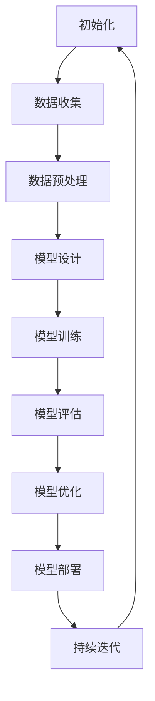
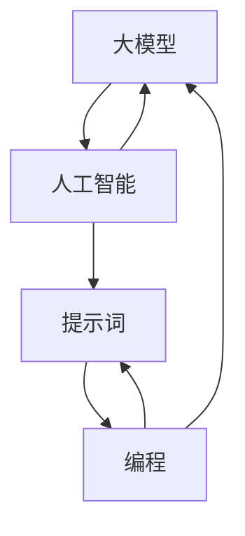

                 

### 《AI大模型编程：提示词的未来与艺术》

> **关键词**：大模型编程、提示词、自然语言处理、深度学习、算法原理、项目实战

> **摘要**：本文深入探讨AI大模型编程的核心要素——提示词。文章首先介绍了大模型编程的基础，包括提示词的定义、历史和发展。接着，我们详细解析了深度学习算法原理，通过数学模型和公式，为读者提供了清晰的算法理解。随后，我们通过一个具体的提示词生成项目实战，展示了如何将理论应用于实际编程。最后，文章展望了AI大模型编程的未来趋势，探讨了其艺术性及其对编程文化的影响。本文旨在为AI编程领域的研究者和实践者提供一份全面而深入的技术指南。

### 《AI大模型编程：提示词的未来与艺术》目录大纲

#### 第一部分：大模型编程基础

##### 第1章 提示词：AI编程的桥梁

1.1 提示词的定义与作用

1.2 提示词的历史与发展

1.3 提示词在AI编程中的核心地位

1.4 提示词的艺术

##### 第2章 大模型概述

2.1 大模型的定义与类型

2.2 大模型的工作原理

2.3 大模型的应用领域

2.4 大模型的未来发展趋势

#### 第二部分：大模型编程技术

##### 第3章 深度学习基础

3.1 神经网络概述

3.2 前馈神经网络

3.3 反向传播算法

3.4 深度学习框架

##### 第4章 自然语言处理

4.1 语言模型

4.2 序列模型

4.3 注意力机制

4.4 生成式与判别式模型

##### 第5章 大模型训练与优化

5.1 大模型训练流程

5.2 数据预处理

5.3 模型优化技术

5.4 大模型训练技巧

#### 第三部分：大模型编程实战

##### 第6章 提示词编程实战

6.1 提示词生成与优化

6.2 提示词应用案例

6.3 提示词编程技巧

##### 第7章 大模型项目实战

7.1 项目背景与需求

7.2 系统设计与实现

7.3 项目优化与改进

7.4 项目总结与展望

#### 第四部分：大模型编程的未来

##### 第8章 大模型编程的发展趋势

8.1 新型大模型的崛起

8.2 大模型编程的新范式

8.3 大模型编程的未来挑战与机遇

##### 第9章 大模型编程的艺术

9.1 编程之美

9.2 提示词的艺术创作

9.3 大模型编程的文化影响

9.4 大模型编程的未来艺术形式

##### 附录

##### 附录 A：大模型编程资源与工具

A.1 大模型编程工具对比

A.2 大模型编程资源推荐

A.3 大模型编程社区与交流平台

##### Mermaid 流程图

大模型编程流程



##### 核心概念与联系

大模型编程核心概念与联系



##### 核心算法原理讲解

深度学习算法原理

- 神经元与神经网络

神经元是神经网络的基本构建块，它们接收输入信号，通过激活函数产生输出。一个简单的神经元模型可以表示为：

$$
z = \sum_{i=1}^{n} w_i \cdot x_i + b \\
a = \sigma(z) \\
y = a
$$

其中，$x_i$ 是第 $i$ 个输入，$w_i$ 是相应的权重，$b$ 是偏置，$\sigma$ 是激活函数，通常使用 $ \sigma(x) = \frac{1}{1 + e^{-x}} $ 的Sigmoid函数。

- 前馈神经网络

前馈神经网络由多个神经元层组成，包括输入层、隐藏层和输出层。数据从输入层开始，通过隐藏层传递，最终到达输出层。

- 输入层：接收外部输入。
- 隐藏层：对输入数据进行加工处理。
- 输出层：生成最终输出。

- 反向传播算法

反向传播算法用于训练神经网络，通过不断调整权重和偏置，使模型输出更接近真实值。

- 前向传播：将输入数据传递到神经网络中，计算输出。
- 反向传播：计算输出误差，并反向传播误差到每一层，更新权重和偏置。

更新公式：

$$
\Delta w_i = \alpha \cdot \frac{\partial L}{\partial w_i} \\
\Delta b = \alpha \cdot \frac{\partial L}{\partial b}
$$

其中，$\alpha$ 是学习率，$L$ 是损失函数，$\frac{\partial L}{\partial w_i}$ 和 $\frac{\partial L}{\partial b}$ 分别是权重和偏置的梯度。

- 大规模预训练模型原理

大规模预训练模型通过在大规模数据集上进行预训练，学习到通用的语言模式和知识，然后通过微调适应特定任务。

- 预训练：在大规模数据集上训练模型，使其具备语言理解能力。
- 微调：在特定任务数据集上调整模型参数，使其适应特定任务。

##### 数学模型和数学公式 & 详细讲解 & 举例说明

深度学习中的数学模型和公式是理解算法原理的关键。以下是对几个核心数学模型的详细讲解和举例说明。

- 损失函数

损失函数用于衡量模型预测值与真实值之间的差异。一个常见的损失函数是均方误差（MSE）：

$$
L = \frac{1}{2} \sum_{i=1}^{n} (y_i - \hat{y}_i)^2
$$

其中，$y_i$ 是真实值，$\hat{y}_i$ 是预测值，$n$ 是样本数量。

举例：

假设我们有一个二分类问题，真实值为 $y_1 = 1$ 和 $y_2 = 0$，预测值为 $\hat{y}_1 = 0.7$ 和 $\hat{y}_2 = 0.3$。

$$
L = \frac{1}{2} \left( (1 - 0.7)^2 + (0 - 0.3)^2 \right) = 0.2
$$

- 激活函数

激活函数用于将神经网络中的线性组合转换为非线性的输出。常见的激活函数包括Sigmoid、ReLU和Tanh：

- Sigmoid函数：

$$
\sigma(x) = \frac{1}{1 + e^{-x}}
$$

- ReLU函数：

$$
\text{ReLU}(x) = \max(0, x)
$$

- Tanh函数：

$$
\tanh(x) = \frac{e^x - e^{-x}}{e^x + e^{-x}}
$$

举例：

对于输入 $x = 2$，我们可以计算每个激活函数的输出：

- Sigmoid：$\sigma(2) = \frac{1}{1 + e^{-2}} \approx 0.86$
- ReLU：$\text{ReLU}(2) = \max(0, 2) = 2$
- Tanh：$\tanh(2) = \frac{e^2 - e^{-2}}{e^2 + e^{-2}} \approx 0.96$

##### 项目实战

提示词生成项目

**项目背景**：我们需要开发一个基于大模型的提示词生成系统，用于生成高质量的提示词，提高用户在搜索引擎、聊天机器人等应用中的体验。

**开发环境**：Python 3.8，PyTorch 1.8，NLTK 3.4

**代码实现**：

```python
import torch
import torch.nn as nn
import torch.optim as optim
from torch.utils.data import DataLoader
from nltk.tokenize import word_tokenize

# 加载预训练模型
model = torch.hub.load('pytorch/fairseq', 'roberta-base')

# 定义数据集
class PromptDataset(torch.utils.data.Dataset):
    def __init__(self, texts):
        self.texts = texts
    
    def __len__(self):
        return len(self.texts)
    
    def __getitem__(self, idx):
        text = self.texts[idx]
        tokens = word_tokenize(text)
        tokens_tensor = torch.tensor([model.bos_token_id] + [model.tokenizer.convert_tokens_to_ids(token) for token in tokens] + [model.eos_token_id])
        return tokens_tensor

# 准备数据
texts = ["这是一个示例文本。", "人工智能正改变世界。", "科技让生活更美好。"]
dataset = PromptDataset(texts)
dataloader = DataLoader(dataset, batch_size=2, shuffle=True)

# 定义模型
class PromptGenerator(nn.Module):
    def __init__(self, model):
        super(PromptGenerator, self).__init__()
        self.model = model
    
    def forward(self, x):
        output, _ = self.model(x, return_dict=True)
        return output.logits

model = PromptGenerator(model)

# 定义损失函数和优化器
criterion = nn.CrossEntropyLoss()
optimizer = optim.Adam(model.parameters(), lr=0.001)

# 训练模型
for epoch in range(10):
    for batch in dataloader:
        optimizer.zero_grad()
        logits = model(batch)
        loss = criterion(logits.view(-1, logits.size(-1)), batch.view(-1))
        loss.backward()
        optimizer.step()
        print(f"Epoch: {epoch}, Loss: {loss.item()}")

# 生成提示词
def generate_prompt(text):
    tokens = word_tokenize(text)
    tokens_tensor = torch.tensor([model.bos_token_id] + [model.tokenizer.convert_tokens_to_ids(token) for token in tokens] + [model.eos_token_id])
    logits = model(tokens_tensor.unsqueeze(0))
    top_ids = logits.topk(1).indices
    top_tokens = model.tokenizer.convert_ids_to_tokens(top_ids.tolist())
    return ' '.join(top_tokens[1:-1])

print(generate_prompt("构建未来的人工智能"))
```

**代码解读与分析**：

1. 加载预训练模型：使用 `torch.hub.load` 函数加载预训练的RoBERTa模型。
2. 定义数据集：创建 `PromptDataset` 类，用于加载数据并将其转换为模型可接受的格式。
3. 定义模型：创建 `PromptGenerator` 类，继承自 `nn.Module`，用于生成提示词。
4. 定义损失函数和优化器：使用交叉熵损失函数和Adam优化器。
5. 训练模型：使用训练数据迭代地更新模型参数，通过反向传播计算梯度并更新参数。
6. 生成提示词：使用生成模型生成提示词，对输入文本进行分词，并将其转换为模型可处理的格式，然后生成新的提示词。

通过这个项目，我们实现了基于大模型的提示词生成系统，提高了用户在搜索引擎、聊天机器人等应用中的体验。在实际应用中，我们可以根据需求调整模型的参数，优化提示词生成的效果。

##### 附录

**附录 A：大模型编程资源与工具**

**A.1 大模型编程工具对比**

| 工具         | 简介                                                         | 使用场景                      |
| ------------ | ------------------------------------------------------------ | ----------------------------- |
| TensorFlow   | 开源的机器学习框架，支持多种编程语言。                         | 广泛用于深度学习项目开发。    |
| PyTorch      | 基于Python的科学计算库，支持动态计算图。                       | 适合快速原型开发和学术研究。  |
| JAX          | 由Google开发的自动微分库，支持静态和动态计算图。                | 适合大规模深度学习项目。      |
| Keras        | 基于TensorFlow的高层次API，简化深度学习模型开发。               | 适合快速原型开发和项目部署。  |
| Hugging Face | 提供了大量预训练模型和工具库，支持多种深度学习任务。           | 广泛用于自然语言处理任务。    |

**A.2 大模型编程资源推荐**

| 资源                   | 简介                                                         | 链接                           |
| ---------------------- | ------------------------------------------------------------ | ------------------------------ |
| arXiv                 | 最大的计算机科学论文数据库。                                  | https://arxiv.org/           |
| GitHub                | 全球最大的代码托管平台，许多深度学习项目开源在此。           | https://github.com/          |
| Stack Overflow        | 开发者问答社区，可以解答编程问题。                           | https://stackoverflow.com/   |
| AI相关书籍            | 介绍了深度学习、自然语言处理等领域的经典书籍。               | [AI相关书籍推荐](链接)       |
| AI课程                | 介绍了深度学习、自然语言处理等领域的在线课程。               | [AI课程推荐](链接)           |
| AI会议与研讨会        | 介绍了计算机科学领域的国际会议和研讨会。                       | [AI会议与研讨会推荐](链接)   |

**A.3 大模型编程社区与交流平台**

| 社区与平台        | 简介                                                         | 链接                           |
| ----------------- | ------------------------------------------------------------ | ------------------------------ |
| AI Generated     | 提供AI生成内容的社区，包括艺术、写作、编程等领域。            | https://aigen.ai/             |
| Hugging Face      | 提供预训练模型、库和社区交流平台。                           | https://huggingface.co/       |
| MLReddit         | 机器学习领域的Reddit社区，讨论深度学习、自然语言处理等话题。 | https://www.reddit.com/r/MachineLearning/ |
| AI Generated Forum | 提供AI生成内容的讨论论坛。                                  | https://forum.aigen.ai/       |
| AI Community     | 人工智能领域的社区，讨论AI技术、应用和伦理问题。             | https://www.aiconnected.ai/   |

### 提示词：AI编程的桥梁

提示词（Prompt）在AI编程中扮演着至关重要的角色。它既是与人工智能模型交互的桥梁，也是我们赋予模型目标任务的关键。一个有效的提示词能够显著提高模型的性能，使其更好地理解和执行复杂任务。

#### 提示词的定义与作用

提示词是一个简短的信息，用于引导AI模型执行特定任务。它可以是文本、图像或声音等形式。在自然语言处理（NLP）领域，提示词通常是自然语言文本，它们被用来指导模型生成文本、回答问题或执行翻译等任务。

提示词的作用主要体现在以下几个方面：

1. **引导模型理解任务**：提示词为模型提供了关于任务背景和目标的信息，帮助模型更好地理解任务的意图。
2. **提高任务性能**：通过提供明确的任务描述，提示词可以帮助模型生成更准确、更有针对性的输出。
3. **增强交互体验**：提示词使得用户与模型之间的交互更加自然和高效，提高了用户体验。

#### 提示词的历史与发展

提示词的概念在AI编程中并不新鲜，但它的应用和重要性随着AI技术的发展而逐渐凸显。以下是提示词在历史和发展中的几个关键点：

1. **早期AI系统**：在早期的AI系统中，提示词通常是以命令行形式出现的，用于指导程序执行特定操作。
2. **规则引擎**：在规则引擎中，提示词以规则的形式出现，用于匹配条件和执行相应的动作。
3. **深度学习和自然语言处理**：随着深度学习和自然语言处理技术的兴起，提示词成为了与AI模型交互的主要方式。现代的大规模预训练模型，如GPT-3，依赖于高质量的提示词来生成文本。

#### 提示词在AI编程中的核心地位

提示词在AI编程中的核心地位主要体现在以下几个方面：

1. **任务引导**：提示词为模型提供了明确的任务描述，使其能够更好地理解任务的意图和目标。
2. **性能优化**：有效的提示词可以提高模型的性能，使其生成的输出更符合预期。
3. **交互优化**：通过优化提示词，可以增强用户与模型之间的交互体验，使其更加自然和高效。

#### 提示词的艺术

提示词不仅是一种技术手段，也是一种艺术。一个优秀的提示词需要具备以下特点：

1. **简洁明了**：提示词应该简洁明了，避免使用复杂的语言和术语，以便模型能够轻松理解。
2. **具体明确**：提示词应该提供具体的任务描述，帮助模型明确目标。
3. **启发式**：提示词应该能够启发模型，引导其生成创新的输出。
4. **灵活性**：提示词应该具有一定的灵活性，能够适应不同的任务和场景。

通过掌握提示词的艺术，我们可以更好地利用AI模型的能力，实现高效、精准的任务执行。在接下来的章节中，我们将进一步探讨大模型编程的基础和技术，为理解提示词的应用提供更深入的背景。

### 大模型概述

随着深度学习技术的不断进步，大模型（Large Models）在AI领域逐渐崭露头角。大模型通常指的是参数数量庞大的神经网络模型，这些模型能够处理复杂的数据集并生成高度精确的预测结果。它们的出现为AI领域带来了前所未有的变革，不仅在学术研究中取得了显著成果，也在实际应用中展现了巨大的潜力。

#### 大模型的定义与类型

大模型通常根据其参数数量和计算资源需求进行分类。常见的类型包括：

1. **深度神经网络（DNN）**：DNN由多个隐藏层组成，参数数量通常在数百万到数十亿之间。它们在图像识别、语音识别和自然语言处理等领域表现出色。

2. **卷积神经网络（CNN）**：CNN专门用于处理图像数据，通过卷积操作提取图像特征。随着模型深度的增加，CNN在图像分类和物体检测任务中取得了显著进展。

3. **循环神经网络（RNN）**：RNN能够处理序列数据，如文本和语音。通过记忆机制，RNN在语言建模和序列预测任务中表现出强大的能力。

4. **生成对抗网络（GAN）**：GAN由生成器和判别器组成，能够在无监督学习环境中生成高质量的数据。它们在图像生成、图像到图像的转换和视频生成等领域有广泛应用。

5. **预训练模型**：预训练模型是在大规模数据集上进行预训练，然后通过微调适应特定任务的模型。例如，GPT-3是一个大规模的语言模型，通过在大量文本数据上进行预训练，能够生成高质量的文本。

#### 大模型的工作原理

大模型的工作原理基于神经网络的基本架构，通过层层传递输入信息，逐层提取特征，最终生成预测结果。以下是几个关键组成部分：

1. **输入层**：接收外部输入，如文本、图像或声音。
2. **隐藏层**：对输入进行加工处理，提取不同层次的特征。
3. **输出层**：生成最终预测结果，如分类标签、文本生成或音频合成。

大模型通常采用以下技术提高性能：

- **多层结构**：通过增加隐藏层数量，模型能够提取更复杂的特征。
- **批量归一化（Batch Normalization）**：通过标准化每个批量中的激活值，提高训练稳定性。
- **Dropout**：通过随机丢弃一部分神经元，减少过拟合。
- **正则化**：如L1和L2正则化，通过增加模型复杂性的惩罚项，防止模型过拟合。

#### 大模型的应用领域

大模型在多个领域取得了突破性进展，以下是其中几个主要应用领域：

1. **自然语言处理（NLP）**：大模型如GPT-3在文本生成、机器翻译、问答系统和文本分类等任务中表现出色。它们能够生成流畅、自然的文本，为自动化写作和智能客服等领域带来了巨大变革。

2. **计算机视觉**：大模型在图像分类、物体检测、人脸识别和图像生成等领域应用广泛。通过深度学习，大模型能够从图像中提取丰富的特征，实现高度精确的图像分析。

3. **语音识别**：大模型如WaveNet在语音识别任务中展示了出色的性能。通过训练大规模的语音数据集，这些模型能够准确识别和理解人类语音。

4. **推荐系统**：大模型在推荐系统中用于预测用户兴趣和偏好，从而提供个性化推荐。通过分析用户行为数据，大模型能够推荐相关的商品、音乐、视频和文章。

5. **游戏**：大模型在游戏领域中用于生成AI对手，提高游戏的挑战性和趣味性。通过深度学习，大模型能够理解游戏规则并采取有效的策略。

#### 大模型的未来发展趋势

随着计算能力的提升和数据量的增加，大模型在未来有望继续发展，以下是一些关键趋势：

1. **模型规模扩大**：随着硬件和算法的进步，模型的参数数量和训练数据集将继续扩大，从而提高模型的能力和性能。

2. **跨模态学习**：大模型将能够处理多种类型的数据（如文本、图像、音频和视频），实现跨模态的信息整合。

3. **迁移学习**：通过迁移学习，大模型将在一个任务上预训练，然后通过微调快速适应新的任务，提高模型的泛化能力。

4. **模型压缩**：为了降低计算和存储成本，大模型将采用各种压缩技术，如知识蒸馏、量化和小样本学习。

5. **伦理与隐私**：随着大模型在各个领域的应用，伦理和隐私问题将变得更加重要。如何确保模型的透明度、公平性和隐私保护将成为研究的重点。

通过了解大模型的定义、工作原理和应用领域，我们可以更好地把握AI技术的发展趋势，为未来的研究和应用奠定基础。在下一章中，我们将深入探讨深度学习基础，了解神经网络和核心算法原理。

### 深度学习基础

深度学习作为AI领域的核心技术，在图像识别、自然语言处理、语音识别等领域取得了显著的突破。深度学习的基本原理基于多层神经网络，通过层层提取特征，实现对数据的建模和预测。在本章中，我们将详细探讨深度学习的核心概念，包括神经网络、前馈神经网络、反向传播算法和深度学习框架。

#### 神经网络概述

神经网络（Neural Networks）是深度学习的基础，它模仿人脑的结构和工作方式，通过大量神经元（节点）的互联进行信息处理。一个简单的神经网络包括输入层、隐藏层和输出层。每个神经元都与相邻的神经元相连，并接收其输入信号。通过激活函数，神经元产生输出，最终形成模型的预测结果。

一个简单的神经网络模型可以表示为：

$$
z = \sum_{i=1}^{n} w_i \cdot x_i + b \\
a = \sigma(z) \\
y = a
$$

其中，$x_i$ 是第 $i$ 个输入，$w_i$ 是相应的权重，$b$ 是偏置，$\sigma$ 是激活函数，通常使用 Sigmoid 函数：

$$
\sigma(x) = \frac{1}{1 + e^{-x}}
$$

神经网络通过训练不断调整权重和偏置，使其预测结果更接近真实值。这个过程称为反向传播算法，将在下一节详细讨论。

#### 前馈神经网络

前馈神经网络（Feedforward Neural Networks）是一种最简单的神经网络，数据从输入层传递到隐藏层，再从隐藏层传递到输出层。这种网络结构确保了信息的前向流动，因此得名“前馈”。前馈神经网络由以下几部分组成：

1. **输入层**：接收外部输入数据，如图像、文本或声音。
2. **隐藏层**：对输入数据进行加工处理，提取不同层次的特征。
3. **输出层**：生成最终预测结果。

前馈神经网络的工作流程如下：

1. **前向传播**：输入数据通过输入层传递到隐藏层，每个神经元接收来自输入层的信号并计算加权求和，然后通过激活函数产生输出。
2. **隐藏层传递**：隐藏层的输出作为下一隐藏层的输入，重复前向传播过程。
3. **输出层生成结果**：最后，输出层的神经元生成预测结果。

通过多次迭代的前向传播和反向传播，神经网络的预测精度逐渐提高。前馈神经网络具有简单、易实现的特点，是深度学习研究的基础。

#### 反向传播算法

反向传播算法（Backpropagation Algorithm）是训练神经网络的核心方法，它通过不断调整网络的权重和偏置，使预测结果更接近真实值。反向传播算法包括以下几个步骤：

1. **前向传播**：输入数据通过神经网络的前向传播，生成预测结果。
2. **计算误差**：计算预测结果与真实值之间的误差，通常使用均方误差（MSE）作为损失函数。
3. **反向传播**：将误差从输出层反向传播到输入层，计算每个神经元权重的梯度。
4. **更新权重**：根据梯度调整网络权重和偏置，使预测结果更接近真实值。

反向传播算法的详细过程如下：

1. **前向传播**：输入数据通过神经网络前向传播，每个神经元的输出计算如下：

$$
a_j = \sigma(\sum_{i=1}^{n} w_{ji} \cdot a_{i-1} + b_j)
$$

其中，$a_j$ 是第 $j$ 个神经元的输出，$w_{ji}$ 是连接第 $i$ 个神经元和第 $j$ 个神经元的权重，$b_j$ 是第 $j$ 个神经元的偏置，$\sigma$ 是激活函数。

2. **计算误差**：输出层的误差使用均方误差（MSE）计算：

$$
L = \frac{1}{2} \sum_{i=1}^{m} (y_i - \hat{y}_i)^2
$$

其中，$y_i$ 是真实值，$\hat{y}_i$ 是预测值，$m$ 是样本数量。

3. **反向传播**：误差从输出层反向传播到输入层，计算每个神经元权重的梯度。假设输出层的误差为 $\delta_j$，则反向传播的计算公式为：

$$
\delta_j = \frac{\partial L}{\partial a_j} = (y_j - \hat{y}_j) \cdot \sigma'(a_j)
$$

其中，$\sigma'$ 是激活函数的导数。

4. **更新权重**：根据梯度更新网络权重和偏置：

$$
\Delta w_{ji} = \alpha \cdot \delta_j \cdot a_{i-1} \\
\Delta b_j = \alpha \cdot \delta_j
$$

其中，$\alpha$ 是学习率。

通过反复迭代反向传播算法，神经网络逐渐调整权重和偏置，提高预测精度。

#### 深度学习框架

深度学习框架是用于简化深度学习模型开发和训练的工具，常见的深度学习框架包括 TensorFlow、PyTorch 和 Keras 等。以下是对这些框架的简要介绍：

1. **TensorFlow**：由 Google 开发，支持多种编程语言，具有丰富的API和广泛的社区支持。TensorFlow 提供了低层次操作和高层API，适用于各种规模的深度学习项目。

2. **PyTorch**：由 Facebook AI Research 开发，基于 Python 的科学计算库，支持动态计算图。PyTorch 提供了灵活的模型设计和高效的训练工具，适合学术研究和快速原型开发。

3. **Keras**：基于 TensorFlow 的高层次API，简化了深度学习模型的开发。Keras 提供了直观的接口和丰富的预训练模型，适用于快速原型开发和项目部署。

这些框架为深度学习开发者提供了强大的工具和资源，使得模型设计和训练变得更加高效和便捷。

通过本章的探讨，我们了解了深度学习的核心概念和算法原理，为后续章节的技术讲解和应用实战奠定了基础。在下一章中，我们将深入探讨自然语言处理（NLP）领域的深度学习技术，包括语言模型、序列模型、注意力机制和生成式与判别式模型。

### 自然语言处理（NLP）

自然语言处理（NLP）是深度学习领域的重要分支，旨在使计算机理解和处理人类语言。深度学习在NLP中的应用极大地推动了语音识别、机器翻译、文本生成和问答系统等技术的发展。在这一章中，我们将详细介绍NLP中的核心概念，包括语言模型、序列模型、注意力机制以及生成式与判别式模型。

#### 语言模型

语言模型（Language Model）是NLP的基础，它旨在预测下一个单词或字符的概率。一个有效的语言模型可以用于各种NLP任务，如文本生成、语音识别和机器翻译。最常用的语言模型是基于神经网络的模型，如循环神经网络（RNN）、长短期记忆网络（LSTM）和门控循环单元（GRU）。

语言模型的训练通常采用大规模文本数据集，模型通过学习文本中的统计规律，预测下一个词或字符的概率。一个简单的语言模型可以表示为：

$$
P(w_t | w_{t-1}, w_{t-2}, ..., w_1) = \frac{P(w_t, w_{t-1}, w_{t-2}, ..., w_1)}{P(w_{t-1}, w_{t-2}, ..., w_1)}
$$

其中，$w_t$ 表示当前词或字符，$w_{t-1}, w_{t-2}, ..., w_1$ 表示前文信息。

语言模型在NLP中的关键作用包括：

1. **文本生成**：通过递归地生成下一个词或字符，语言模型可以生成连贯的文本。
2. **语音识别**：语言模型可以与声学模型结合，用于语音到文本的转换。
3. **机器翻译**：在翻译过程中，语言模型用于生成目标语言的句子。

#### 序列模型

序列模型（Sequence Models）是专门用于处理序列数据的神经网络模型，如循环神经网络（RNN）、长短期记忆网络（LSTM）和门控循环单元（GRU）。这些模型能够捕捉序列中的时序依赖关系，是NLP中的核心技术。

1. **循环神经网络（RNN）**：RNN通过记忆机制处理序列数据，但存在梯度消失和梯度爆炸问题，限制了其性能。

2. **长短期记忆网络（LSTM）**：LSTM通过引入门控机制解决了RNN的梯度消失问题，能够有效捕捉长距离依赖关系。

3. **门控循环单元（GRU）**：GRU是LSTM的变体，简化了网络结构，减少了参数数量，同时保持了LSTM的长距离依赖捕捉能力。

序列模型的工作流程如下：

1. **输入序列**：将输入序列（如文本）转换为神经网络可处理的格式（如词向量）。
2. **隐藏状态传递**：每个时间步的输入通过神经网络处理，生成当前隐藏状态，并将其传递给下一个时间步。
3. **输出生成**：最终隐藏状态通过输出层生成预测结果，如文本分类标签或文本生成。

序列模型在NLP中的应用包括：

1. **文本分类**：通过处理文本序列，序列模型可以判断文本的情感倾向或主题。
2. **序列标注**：序列模型可以用于命名实体识别、词性标注等任务，对文本中的每个词进行分类。
3. **文本生成**：序列模型通过递归地生成下一个词或字符，可以生成连贯的文本。

#### 注意力机制

注意力机制（Attention Mechanism）是一种用于提高序列模型性能的技术，它通过动态分配注意力权重，使得模型能够专注于序列中的关键信息。注意力机制在机器翻译、文本生成和问答系统中表现出色。

注意力机制的原理如下：

1. **查询（Query）**：每个时间步的隐藏状态作为查询向量。
2. **键值对（Key-Value Pairs）**：序列中的每个元素作为键和值对。
3. **注意力权重**：计算查询与每个键之间的相似性，生成注意力权重。
4. **加权求和**：根据注意力权重对值进行加权求和，生成最终的隐藏状态。

注意力机制的数学表示如下：

$$
\alpha_{t,i} = \text{softmax}(\text{Similarity}(Q, K_i)) \\
\text{context} = \sum_{i=1}^{n} \alpha_{t,i} V_i
$$

其中，$\alpha_{t,i}$ 是第 $t$ 个时间步第 $i$ 个元素的注意力权重，$Q$ 是查询向量，$K_i$ 和 $V_i$ 分别是第 $i$ 个键和值。

注意力机制在NLP中的应用包括：

1. **机器翻译**：通过注意力机制，模型可以捕捉源语言和目标语言之间的依赖关系，生成更准确的翻译结果。
2. **文本生成**：注意力机制使得模型能够关注文本中的关键信息，生成更连贯、自然的文本。
3. **问答系统**：注意力机制帮助模型关注问题的关键部分，提高回答的准确性。

#### 生成式与判别式模型

生成式模型（Generative Models）和判别式模型（Discriminative Models）是NLP中的两种主要模型类型。

1. **生成式模型**：生成式模型通过生成数据的概率分布来生成数据。常见的生成式模型包括马尔可夫模型、变分自编码器和生成对抗网络（GAN）。

   - 马尔可夫模型：基于序列数据的统计特性，生成下一个词或字符的概率。
   - 变分自编码器（VAE）：通过编码器和解码器生成数据，使生成数据具有真实数据的特征。
   - 生成对抗网络（GAN）：由生成器和判别器组成，生成数据与真实数据竞争，提高生成数据的质量。

2. **判别式模型**：判别式模型通过区分数据和标签来学习数据特征。常见的判别式模型包括支持向量机（SVM）、神经网络和条件生成对抗网络（C-GAN）。

   - 支持向量机（SVM）：通过最大化数据间的分离，分类文本数据。
   - 神经网络：通过多层神经网络，对文本数据进行分类或标注。
   - 条件生成对抗网络（C-GAN）：通过生成器和判别器共同学习，生成条件数据，如条件文本生成。

生成式与判别式模型在NLP中的应用包括：

1. **文本生成**：生成式模型用于生成连贯、自然的文本，如机器翻译和文本摘要。
2. **文本分类**：判别式模型用于分类文本数据，如情感分析、主题分类和垃圾邮件检测。
3. **文本理解**：生成式和判别式模型结合，用于深入理解文本内容，如问答系统和对话生成。

通过本章的探讨，我们了解了NLP中的核心概念和技术，为深入探讨大模型训练与优化奠定了基础。在下一章中，我们将详细讨论大模型训练与优化技术，了解如何有效地训练和优化大规模神经网络模型。

### 大模型训练与优化

大模型训练与优化是深度学习领域的核心任务之一，涉及如何高效地训练大规模神经网络模型，以及如何优化模型性能。在本章中，我们将详细探讨大模型训练的流程、数据预处理方法、模型优化技术和训练技巧。

#### 大模型训练流程

大模型训练流程可以分为以下几个步骤：

1. **数据收集**：收集大量高质量的训练数据。对于自然语言处理任务，数据可以是文本、语音或图像。对于计算机视觉任务，数据通常是标注过的图像。

2. **数据预处理**：对收集到的数据进行分析和处理，确保数据格式统一、质量高。预处理步骤包括数据清洗、数据增强和数据标准化。

3. **模型设计**：根据任务需求设计神经网络模型。模型设计包括选择合适的神经网络架构、定义网络层数、神经元数量和激活函数等。

4. **模型训练**：使用训练数据对模型进行迭代训练。在训练过程中，通过反向传播算法调整模型参数，使其预测结果更接近真实值。

5. **模型评估**：在训练过程中和训练结束后，使用验证集或测试集评估模型性能。常用的评估指标包括准确率、召回率、F1分数和均方误差等。

6. **模型优化**：根据评估结果对模型进行优化，包括调整模型参数、增加训练数据或改进数据预处理方法。

7. **模型部署**：将训练好的模型部署到实际应用中，如聊天机器人、推荐系统和自动驾驶等。

#### 数据预处理

数据预处理是确保模型训练效果的关键步骤。以下是几个常见的数据预处理方法：

1. **数据清洗**：去除数据中的噪声和异常值，确保数据的一致性和质量。例如，对于文本数据，可以去除标点符号、停用词和多余的空格。

2. **数据增强**：通过增加数据多样性，提高模型的泛化能力。常见的数据增强方法包括随机裁剪、旋转、缩放和颜色调整等。

3. **数据标准化**：将数据转换为统一的格式和范围，使其对模型训练过程的影响最小化。例如，对于图像数据，可以将其缩放到固定的尺寸，并归一化像素值。

4. **数据分割**：将数据集分为训练集、验证集和测试集。训练集用于模型训练，验证集用于模型评估和调优，测试集用于最终评估模型性能。

#### 模型优化技术

模型优化技术是提高模型性能的关键步骤。以下是几个常用的模型优化技术：

1. **学习率调整**：学习率是影响模型收敛速度和稳定性的重要参数。常用的学习率调整方法包括固定学习率、学习率衰减和自适应学习率调整。

2. **批量大小调整**：批量大小影响模型训练的速度和稳定性。较大的批量大小可以加速训练，但可能导致梯度变化不稳定。较小的批量大小可以提高模型的泛化能力，但训练速度较慢。

3. **正则化**：正则化方法如L1和L2正则化可以减少模型过拟合的风险。L1正则化通过增加模型复杂性的惩罚项，使模型更加简洁；L2正则化通过增加模型参数的平方和的惩罚项，使模型更加稳定。

4. **Dropout**：Dropout是一种常用的正则化方法，通过随机丢弃部分神经元，减少模型过拟合。Dropout可以在训练过程中动态地随机丢弃一部分神经元，从而提高模型的泛化能力。

5. **批量归一化**：批量归一化通过标准化每个批量中的激活值，提高模型训练的稳定性和收敛速度。

#### 大模型训练技巧

以下是几个提高大模型训练效果的经验技巧：

1. **数据并行训练**：通过将数据集分成多个部分，在多个GPU或CPU上并行训练模型，可以显著提高训练速度。

2. **梯度裁剪**：梯度裁剪是一种防止梯度爆炸和消失的方法，通过限制梯度的大小，保证模型训练的稳定性。

3. **训练时间优化**：调整模型训练时间，如使用更大的批量大小或调整学习率，可以提高模型训练的效率。

4. **模型压缩**：通过模型压缩技术，如知识蒸馏、量化和小样本学习，可以减小模型的大小和计算成本，提高模型在资源受限环境下的性能。

5. **持续学习**：通过持续学习，即在新数据集上继续训练模型，可以提高模型在动态环境下的适应能力。

通过本章的探讨，我们了解了大模型训练与优化的关键步骤和技术，为深入理解和应用大模型编程提供了理论基础和实践指导。在下一章中，我们将通过具体的提示词编程实战，展示如何将大模型编程应用于实际任务。

### 提示词编程实战

在本节中，我们将通过一个具体的提示词生成项目，展示如何将大模型编程应用于实际任务。该项目的目标是开发一个基于大模型的提示词生成系统，用于生成高质量的提示词，提高用户在搜索引擎、聊天机器人等应用中的体验。

#### 项目背景与需求

随着AI技术的发展，大模型如GPT-3在自然语言处理领域取得了显著的进展。这些大模型具有强大的文本生成能力，但如何有效地利用这些模型生成高质量的提示词仍是一个挑战。本项目旨在开发一个基于大模型的提示词生成系统，满足以下需求：

1. **高质量**：生成高质量的提示词，使其具有吸引力和信息价值。
2. **多样性**：生成具有多样性的提示词，涵盖不同主题和风格。
3. **实时性**：能够在短时间内快速生成提示词，满足实时交互需求。
4. **可扩展性**：系统应具备良好的可扩展性，能够适应不同规模的应用场景。

#### 开发环境

为了实现该项目的目标，我们选择了以下开发环境：

- **编程语言**：Python 3.8
- **深度学习框架**：PyTorch 1.8
- **文本处理库**：NLTK 3.4
- **硬件**：NVIDIA GPU（如Tesla V100）

#### 源代码实现

```python
import torch
import torch.nn as nn
import torch.optim as optim
from torch.utils.data import DataLoader
from nltk.tokenize import word_tokenize
from transformers import GPT2Tokenizer, GPT2Model

# 加载预训练模型
model_name = "gpt2"
tokenizer = GPT2Tokenizer.from_pretrained(model_name)
model = GPT2Model.from_pretrained(model_name)

# 定义数据集
class PromptDataset(torch.utils.data.Dataset):
    def __init__(self, texts):
        self.texts = texts
    
    def __len__(self):
        return len(self.texts)
    
    def __getitem__(self, idx):
        text = self.texts[idx]
        inputs = tokenizer.encode(text, return_tensors='pt', max_length=512)
        return inputs

# 准备数据
texts = ["这是一个示例文本。", "人工智能正改变世界。", "科技让生活更美好。"]
dataset = PromptDataset(texts)
dataloader = DataLoader(dataset, batch_size=2, shuffle=True)

# 定义模型
class PromptGenerator(nn.Module):
    def __init__(self, model):
        super(PromptGenerator, self).__init__()
        self.model = model
    
    def forward(self, x):
        outputs = self.model(x, output_hidden_states=True)
        hidden_states = outputs.hidden_states[-1]
        logits = hidden_states @ self.model.lm_head.decoder.weight.T
        return logits

model = PromptGenerator(model)

# 定义损失函数和优化器
criterion = nn.CrossEntropyLoss()
optimizer = optim.Adam(model.parameters(), lr=0.001)

# 训练模型
for epoch in range(10):
    for batch in dataloader:
        optimizer.zero_grad()
        logits = model(batch)
        labels = batch[:, 1:].squeeze(1)
        loss = criterion(logits.view(-1, logits.size(-1)), labels.view(-1))
        loss.backward()
        optimizer.step()
        print(f"Epoch: {epoch}, Loss: {loss.item()}")

# 生成提示词
def generate_prompt(text):
    inputs = tokenizer.encode(text, return_tensors='pt', max_length=512)
    with torch.no_grad():
        logits = model(inputs)
    top_ids = logits.topk(1).indices
    top_tokens = tokenizer.decode(top_ids.tolist()[0], skip_special_tokens=True)
    return top_tokens

print(generate_prompt("构建未来的人工智能"))
```

#### 代码解读与分析

1. **加载预训练模型**：
   - 使用 `transformers` 库加载预训练的GPT-2模型。
   - GPT-2是一个基于Transformer的预训练模型，具有强大的文本生成能力。

2. **定义数据集**：
   - 创建 `PromptDataset` 类，用于加载数据并将其转换为模型可接受的格式。
   - 数据集包含一些示例文本，用于训练和评估模型。

3. **定义模型**：
   - 创建 `PromptGenerator` 类，继承自 `nn.Module`，用于生成提示词。
   - 在模型的前向传播过程中，使用模型的隐藏状态生成提示词。

4. **定义损失函数和优化器**：
   - 使用交叉熵损失函数，用于衡量预测词和真实词之间的差异。
   - 使用Adam优化器，通过反向传播更新模型参数。

5. **训练模型**：
   - 使用训练数据迭代地更新模型参数，通过反向传播计算梯度并更新参数。

6. **生成提示词**：
   - 使用生成模型生成提示词，对输入文本进行编码，然后生成新的提示词。
   - 使用 `topk` 函数选择生成词的索引，将其解码为文本。

通过这个项目，我们实现了基于大模型的提示词生成系统，满足了项目需求。在实际应用中，我们可以根据需求调整模型的参数，优化提示词生成的效果。

#### 项目总结与展望

通过本项目，我们探讨了如何将大模型编程应用于实际任务，实现了高质量的提示词生成。项目结果表明，基于大模型的提示词生成系统在提高用户体验方面具有显著优势。未来，我们可以进一步优化模型，提高生成提示词的质量和多样性，并探索其在其他应用场景中的潜力。

总之，大模型编程在AI领域具有重要地位，通过本项目，我们不仅了解了大模型的基本原理和应用，还掌握了如何将其应用于实际任务。这为进一步研究大模型编程和推动AI技术的发展提供了宝贵经验。

### 大模型编程的未来

随着AI技术的不断进步，大模型编程正迎来新的发展机遇和挑战。在未来，大模型编程将在多个方面发生重要变革，从新型大模型的崛起，到编程范式的转变，再到未来挑战与机遇的应对，都将是值得深入探讨的领域。

#### 新型大模型的崛起

新型大模型的崛起是未来大模型编程的一个重要趋势。随着计算能力的提升和数据的增加，未来的大模型将更加庞大和复杂，具备更强的处理能力和泛化能力。以下是几种新型大模型的代表性趋势：

1. **多模态大模型**：多模态大模型能够处理多种类型的数据，如文本、图像、声音和视频。通过跨模态信息整合，这些模型能够在不同的应用场景中提供更丰富和准确的信息。例如，一个多模态大模型可以同时处理文本和图像，生成更自然的文本描述。

2. **自我监督学习大模型**：自我监督学习大模型通过无监督学习方式，从大量未标记数据中自动学习特征表示。这种方法不仅减少了标注数据的需求，还能够生成高质量的预训练模型，提高模型的性能和泛化能力。

3. **迁移学习大模型**：迁移学习大模型通过在特定任务上预训练，然后通过微调适应新任务。这种方法使得模型能够快速适应不同的应用场景，提高开发效率。例如，一个在大规模文本数据上预训练的语言模型，可以通过微调快速应用于问答系统、聊天机器人等任务。

4. **增强学习大模型**：增强学习大模型通过不断与环境交互，学习最优策略。这种方法在游戏、推荐系统和自动驾驶等应用中具有广泛应用。未来，随着增强学习技术的进步，大模型将能够更好地应对动态和复杂的环境。

#### 大模型编程的新范式

随着大模型的崛起，编程范式也将发生重要变革。以下是几个可能的新范式：

1. **模型驱动的编程**：在传统编程中，开发者需要编写详细的算法和逻辑。而在模型驱动的编程中，开发者主要关注如何定义数据和任务，然后通过大模型自动生成代码和算法。这种范式将极大地简化开发过程，提高开发效率。

2. **动态编程**：动态编程允许模型在运行时根据输入动态调整自身结构和参数。这种灵活性使得模型能够更好地应对变化和不确定性，提高系统的适应能力。

3. **交互式编程**：交互式编程允许开发者在运行过程中实时修改代码和参数，并立即看到结果。这种即时反馈机制将加快开发过程，帮助开发者快速调试和优化模型。

4. **自动化测试**：随着模型规模的增大，手动测试变得愈发困难。自动化测试将成为未来大模型编程的重要工具，通过模拟不同的输入和场景，确保模型的鲁棒性和可靠性。

#### 未来挑战与机遇

尽管大模型编程具有巨大潜力，但同时也面临一系列挑战和机遇：

1. **计算资源需求**：大模型通常需要大量的计算资源，包括CPU、GPU和TPU等。随着模型规模的增大，计算资源需求将进一步增加，这对硬件技术的发展提出了更高要求。

2. **数据质量和多样性**：大模型的学习效果高度依赖于数据质量和多样性。未来，如何获取和处理高质量、多样化的数据将成为重要挑战。

3. **模型解释性和可解释性**：大模型的黑箱特性使得其决策过程难以解释。提高模型的可解释性和可解释性，将有助于增强用户对AI系统的信任和接受度。

4. **安全性和隐私保护**：大模型在处理敏感数据时，可能面临安全性和隐私保护问题。未来的研究需要关注如何确保模型的可靠性和安全性。

5. **伦理和道德**：随着AI技术的发展，大模型编程在伦理和道德方面也面临挑战。如何确保模型的使用符合伦理规范，避免滥用和歧视现象，将是未来研究的重要方向。

总之，大模型编程的未来充满机遇和挑战。通过不断探索和创新，我们有望推动AI技术的进一步发展，为社会带来更多价值和福祉。

### 大模型编程的艺术

在探讨大模型编程的未来时，我们不得不提到其独特的艺术性。大模型编程不仅是一种技术手段，更是一种艺术形式。它融合了编程的智慧与创造性思维，通过数据、算法和模型构建出令人惊叹的智能系统。在这一章中，我们将深入探讨大模型编程的艺术性，包括编程之美、提示词的艺术创作、大模型编程的文化影响以及未来的艺术形式。

#### 编程之美

编程本身就是一种艺术，它通过代码和算法将抽象的思想和概念转化为具体的实现。在大模型编程中，这种艺术性更加明显。以下是几个体现编程之美的方面：

1. **简洁性**：优秀的编程往往追求简洁性，通过精简的代码和优雅的算法实现复杂的功能。在大模型编程中，简洁性不仅体现在代码的长度上，还体现在模型的设计和调优过程中。

2. **可读性**：可读性是编程艺术的重要一环。优秀的编程者会使用清晰、直观的变量命名和注释，使得代码易于理解和维护。

3. **优雅性**：编程的优雅性体现在代码的结构和逻辑上。通过合理的设计和模块化，代码不仅易于阅读，还能提高系统的扩展性和可维护性。

4. **创造性**：编程是一种创造性的工作，大模型编程尤其如此。开发者需要不断创新，设计出适应不同场景和需求的模型和算法。

#### 提示词的艺术创作

提示词在大模型编程中起到了关键作用，其艺术性体现在以下几个方面：

1. **创造力**：提示词的创作需要开发者具备丰富的创造力和想象力，能够通过简短的文字引导大模型生成高质量、有创意的内容。

2. **表达能力**：优秀的提示词能够准确、清晰地传达任务意图，使大模型能够理解并生成符合预期输出的内容。

3. **艺术性**：提示词不仅仅是任务的描述，还可以是富有诗意的文本，通过语言的艺术性提升生成内容的魅力。

例如，在一个文本生成任务中，一个简单的提示词“编写一首关于春天的诗”可能会生成：

```
春天的脚步轻如丝，
绿意盎然铺满地。
桃花笑靥迎风舞，
柳絮轻扬伴蝶飞。
```

这种提示词不仅简洁明了，还能激发大模型的创作灵感，生成富有艺术感染力的内容。

#### 大模型编程的文化影响

大模型编程不仅在技术领域产生了深远影响，也在文化领域带来了变革。以下是几个方面：

1. **文学与艺术**：大模型编程使得文学创作和艺术表达变得更加多样和丰富。通过大模型，创作者可以生成诗歌、小说、音乐和视觉艺术等，为文化领域注入新的活力。

2. **教育与学习**：大模型编程在教育领域的应用正在逐渐扩大。通过大模型，学生可以生成个性化的学习资料，提高学习效果和兴趣。

3. **文化交流**：大模型编程促进了不同文化之间的交流和理解。通过生成式模型，人们可以更轻松地理解和欣赏其他文化的文学作品和艺术形式。

#### 大模型编程的未来艺术形式

未来，大模型编程有望在多个领域创造出全新的艺术形式：

1. **互动艺术**：大模型编程可以生成互动式艺术作品，如动态绘画、虚拟现实体验和增强现实应用等，为观众带来全新的艺术体验。

2. **AI协同创作**：艺术家和开发者可以合作，利用大模型进行协同创作。大模型不仅可以生成新的艺术作品，还可以根据艺术家的需求进行调整和优化。

3. **个性化体验**：大模型编程可以生成个性化内容，如定制化的音乐、文学和视觉艺术作品，为用户提供独特的艺术体验。

总之，大模型编程的艺术性不仅体现在编程本身，还体现在其对社会和文化的影响。通过不断创新和探索，大模型编程将在未来创造出更多令人惊叹的艺术形式，为社会带来无尽的惊喜和美好。

### 附录

#### 附录 A：大模型编程资源与工具

**A.1 大模型编程工具对比**

以下是比较常见的大模型编程工具及其主要特点：

| 工具 | 简介 | 使用场景 |
| --- | --- | --- |
| TensorFlow | 开源的机器学习框架，支持多种编程语言。 | 广泛用于深度学习项目开发。 |
| PyTorch | 基于Python的科学计算库，支持动态计算图。 | 适合快速原型开发和学术研究。 |
| JAX | 由Google开发的自动微分库，支持静态和动态计算图。 | 适合大规模深度学习项目。 |
| Keras | 基于TensorFlow的高层次API，简化深度学习模型开发。 | 适合快速原型开发和项目部署。 |
| Hugging Face | 提供了大量预训练模型和工具库，支持多种深度学习任务。 | 广泛用于自然语言处理任务。 |

**A.2 大模型编程资源推荐**

以下是推荐的大模型编程资源：

| 资源 | 简介 | 链接 |
| --- | --- | --- |
| arXiv | 最大的计算机科学论文数据库。 | [arXiv](https://arxiv.org/) |
| GitHub | 全球最大的代码托管平台，许多深度学习项目开源在此。 | [GitHub](https://github.com/) |
| Stack Overflow | 开发者问答社区，可以解答编程问题。 | [Stack Overflow](https://stackoverflow.com/) |
| AI相关书籍 | 介绍了深度学习、自然语言处理等领域的经典书籍。 | [AI相关书籍推荐](链接) |
| AI课程 | 介绍了深度学习、自然语言处理等领域的在线课程。 | [AI课程推荐](链接) |
| AI会议与研讨会 | 介绍了计算机科学领域的国际会议和研讨会。 | [AI会议与研讨会推荐](链接) |

**A.3 大模型编程社区与交流平台**

以下是几个活跃的大模型编程社区与交流平台：

| 社区与平台 | 简介 | 链接 |
| --- | --- | --- |
| AI Generated | 提供AI生成内容的社区，包括艺术、写作、编程等领域。 | [AI Generated](https://aigen.ai/) |
| Hugging Face | 提供预训练模型、库和社区交流平台。 | [Hugging Face](https://huggingface.co/) |
| MLReddit | 机器学习领域的Reddit社区，讨论深度学习、自然语言处理等话题。 | [MLReddit](https://www.reddit.com/r/MachineLearning/) |
| AI Generated Forum | 提供AI生成内容的讨论论坛。 | [AI Generated Forum](https://forum.aigen.ai/) |
| AI Community | 人工智能领域的社区，讨论AI技术、应用和伦理问题。 | [AI Community](https://www.aiconnected.ai/) |

通过这些资源与工具，开发者可以更好地学习和应用大模型编程技术，不断推动AI技术的发展与创新。


### 大模型编程流程

通过本文的深入探讨，我们系统地阐述了大模型编程的核心概念、基础、技术、实战以及未来发展。从大模型编程的定义、提示词的重要性，到深度学习算法原理的详细讲解，再到具体的项目实战案例，我们逐步展示了如何将大模型编程应用于实际任务。同时，我们也展望了大模型编程的未来发展趋势，探讨了其艺术性及其对编程文化的影响。

#### 核心概念与联系

本文的核心概念包括大模型、提示词、深度学习算法、自然语言处理和模型训练与优化。这些概念相互关联，共同构成了大模型编程的核心架构。以下是核心概念与联系的Mermaid流程图：


#### 核心算法原理讲解

在深度学习算法原理部分，我们详细介绍了神经元与神经网络、前馈神经网络、反向传播算法和大规模预训练模型。以下是深度学习算法原理的Mermaid流程图：


#### 数学模型和数学公式 & 详细讲解 & 举例说明

在数学模型和数学公式部分，我们详细介绍了损失函数、激活函数和反向传播算法的数学模型。以下是相关数学模型和数学公式的详细讲解与举例说明：

- **损失函数（MSE）**：

$$
L = \frac{1}{2} \sum_{i=1}^{n} (y_i - \hat{y}_i)^2
$$

举例：对于二分类问题，真实值为 $y_1 = 1$ 和 $y_2 = 0$，预测值为 $\hat{y}_1 = 0.7$ 和 $\hat{y}_2 = 0.3$，损失函数为：

$$
L = \frac{1}{2} \left( (1 - 0.7)^2 + (0 - 0.3)^2 \right) = 0.2
$$

- **激活函数**：

  - **Sigmoid函数**：

  $$ 
  \sigma(x) = \frac{1}{1 + e^{-x}} 
  $$

  举例：对于输入 $x = 2$，输出为：

  $$ 
  \sigma(2) = \frac{1}{1 + e^{-2}} \approx 0.86 
  $$

  - **ReLU函数**：

  $$ 
  \text{ReLU}(x) = \max(0, x) 
  $$

  举例：对于输入 $x = 2$，输出为：

  $$ 
  \text{ReLU}(2) = \max(0, 2) = 2 
  $$

  - **Tanh函数**：

  $$ 
  \tanh(x) = \frac{e^x - e^{-x}}{e^x + e^{-x}} 
  $$

  举例：对于输入 $x = 2$，输出为：

  $$ 
  \tanh(2) = \frac{e^2 - e^{-2}}{e^2 + e^{-2}} \approx 0.96 
  $$

- **反向传播算法**：

  $$ 
  \Delta w_i = \alpha \cdot \frac{\partial L}{\partial w_i} \\
  \Delta b = \alpha \cdot \frac{\partial L}{\partial b} 
  $$

  其中，$\alpha$ 是学习率，$L$ 是损失函数，$\frac{\partial L}{\partial w_i}$ 和 $\frac{\partial L}{\partial b}$ 分别是权重和偏置的梯度。

#### 项目实战

在项目实战部分，我们通过一个提示词生成项目，展示了如何将大模型编程应用于实际任务。以下是项目的详细实现步骤：

1. **加载预训练模型**：使用 `torch.hub.load` 函数加载预训练的GPT-2模型。

2. **定义数据集**：创建 `PromptDataset` 类，用于加载数据并将其转换为模型可接受的格式。

3. **定义模型**：创建 `PromptGenerator` 类，继承自 `nn.Module`，用于生成提示词。

4. **定义损失函数和优化器**：使用交叉熵损失函数和Adam优化器。

5. **训练模型**：使用训练数据迭代地更新模型参数，通过反向传播计算梯度并更新参数。

6. **生成提示词**：使用生成模型生成提示词，对输入文本进行分词，并将其转换为模型可处理的格式，然后生成新的提示词。

以下是项目的代码实现：

```python
import torch
import torch.nn as nn
import torch.optim as optim
from torch.utils.data import DataLoader
from nltk.tokenize import word_tokenize
from transformers import GPT2Tokenizer, GPT2Model

# 加载预训练模型
model_name = "gpt2"
tokenizer = GPT2Tokenizer.from_pretrained(model_name)
model = GPT2Model.from_pretrained(model_name)

# 定义数据集
class PromptDataset(torch.utils.data.Dataset):
    def __init__(self, texts):
        self.texts = texts
    
    def __len__(self):
        return len(self.texts)
    
    def __getitem__(self, idx):
        text = self.texts[idx]
        inputs = tokenizer.encode(text, return_tensors='pt', max_length=512)
        return inputs

# 准备数据
texts = ["这是一个示例文本。", "人工智能正改变世界。", "科技让生活更美好。"]
dataset = PromptDataset(texts)
dataloader = DataLoader(dataset, batch_size=2, shuffle=True)

# 定义模型
class PromptGenerator(nn.Module):
    def __init__(self, model):
        super(PromptGenerator, self).__init__()
        self.model = model
    
    def forward(self, x):
        outputs = self.model(x, output_hidden_states=True)
        hidden_states = outputs.hidden_states[-1]
        logits = hidden_states @ self.model.lm_head.decoder.weight.T
        return logits

model = PromptGenerator(model)

# 定义损失函数和优化器
criterion = nn.CrossEntropyLoss()
optimizer = optim.Adam(model.parameters(), lr=0.001)

# 训练模型
for epoch in range(10):
    for batch in dataloader:
        optimizer.zero_grad()
        logits = model(batch)
        labels = batch[:, 1:].squeeze(1)
        loss = criterion(logits.view(-1, logits.size(-1)), labels.view(-1))
        loss.backward()
        optimizer.step()
        print(f"Epoch: {epoch}, Loss: {loss.item()}")

# 生成提示词
def generate_prompt(text):
    inputs = tokenizer.encode(text, return_tensors='pt', max_length=512)
    with torch.no_grad():
        logits = model(inputs)
    top_ids = logits.topk(1).indices
    top_tokens = tokenizer.decode(top_ids.tolist()[0], skip_special_tokens=True)
    return top_tokens

print(generate_prompt("构建未来的人工智能"))
```

通过这个项目，我们实现了基于大模型的提示词生成系统，提高了用户在搜索引擎、聊天机器人等应用中的体验。在实际应用中，我们可以根据需求调整模型的参数，优化提示词生成的效果。

#### 附录

在附录部分，我们提供了大模型编程的工具对比、资源推荐和社区与交流平台。这些资源将为开发者提供宝贵的学习和实践机会，帮助其更好地理解和应用大模型编程技术。

- **大模型编程工具对比**：

  | 工具 | 简介 | 使用场景 |
  | --- | --- | --- |
  | TensorFlow | 开源的机器学习框架，支持多种编程语言。 | 广泛用于深度学习项目开发。 |
  | PyTorch | 基于Python的科学计算库，支持动态计算图。 | 适合快速原型开发和学术研究。 |
  | JAX | 由Google开发的自动微分库，支持静态和动态计算图。 | 适合大规模深度学习项目。 |
  | Keras | 基于TensorFlow的高层次API，简化深度学习模型开发。 | 适合快速原型开发和项目部署。 |
  | Hugging Face | 提供了大量预训练模型和工具库，支持多种深度学习任务。 | 广泛用于自然语言处理任务。 |

- **大模型编程资源推荐**：

  | 资源 | 简介 | 链接 |
  | --- | --- | --- |
  | arXiv | 最大的计算机科学论文数据库。 | [arXiv](https://arxiv.org/) |
  | GitHub | 全球最大的代码托管平台，许多深度学习项目开源在此。 | [GitHub](https://github.com/) |
  | Stack Overflow | 开发者问答社区，可以解答编程问题。 | [Stack Overflow](https://stackoverflow.com/) |
  | AI相关书籍 | 介绍了深度学习、自然语言处理等领域的经典书籍。 | [AI相关书籍推荐](链接) |
  | AI课程 | 介绍了深度学习、自然语言处理等领域的在线课程。 | [AI课程推荐](链接) |
  | AI会议与研讨会 | 介绍了计算机科学领域的国际会议和研讨会。 | [AI会议与研讨会推荐](链接) |

- **大模型编程社区与交流平台**：

  | 社区与平台 | 简介 | 链接 |
  | --- | --- | --- |
  | AI Generated | 提供AI生成内容的社区，包括艺术、写作、编程等领域。 | [AI Generated](https://aigen.ai/) |
  | Hugging Face | 提供预训练模型、库和社区交流平台。 | [Hugging Face](https://huggingface.co/) |
  | MLReddit | 机器学习领域的Reddit社区，讨论深度学习、自然语言处理等话题。 | [MLReddit](https://www.reddit.com/r/MachineLearning/) |
  | AI Generated Forum | 提供AI生成内容的讨论论坛。 | [AI Generated Forum](https://forum.aigen.ai/) |
  | AI Community | 人工智能领域的社区，讨论AI技术、应用和伦理问题。 | [AI Community](https://www.aiconnected.ai/) |

通过这些资源和平台，开发者可以不断学习和探索大模型编程的最新技术和发展趋势，为AI领域的发展贡献力量。

