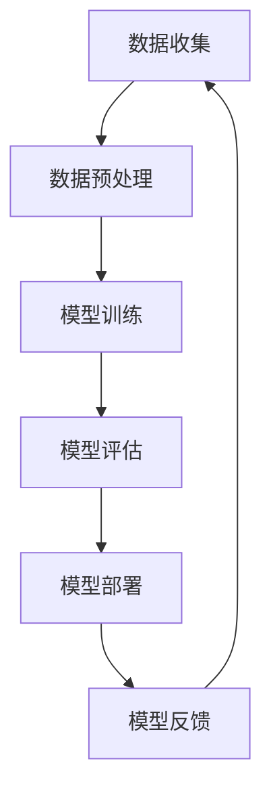

                 

## 文章标题

**AI时代的人类参与：机会与挑战**

关键词：人工智能、人类参与、机遇、挑战、技术发展

摘要：随着人工智能技术的快速发展，人类与AI的互动关系正发生深刻变革。本文将从多角度探讨AI时代下人类参与的机会与挑战，包括职业发展、技术创新、伦理道德等多个层面，旨在为读者提供全面、深入的思考与见解。

## 引言与背景

### 1.1 AI时代的背景与特点

#### 1.1.1 人工智能的定义与分类

人工智能（Artificial Intelligence，简称AI）是指通过计算机模拟人类智能的技术。根据AI的技术层次，我们可以将其分为弱人工智能和强人工智能。弱人工智能是指专注于某一特定任务的AI系统，如语音识别、图像识别等；而强人工智能则是具有普遍智能的AI，能够理解、思考、学习和适应各种环境。

#### 1.1.2 AI技术发展历程

人工智能的发展可以追溯到20世纪50年代，最初的研究主要集中在符号主义方法。随着计算机技术的进步，深度学习和神经网络等算法逐渐兴起，AI技术迎来了新的发展高潮。近年来，AI技术在计算机视觉、自然语言处理、强化学习等领域取得了重大突破，逐渐从理论研究走向实际应用。

#### 1.1.3 AI对社会的影响

AI技术的快速发展对社会产生了深远影响。在积极方面，AI提高了生产效率、优化了资源配置，并带来了新的商业模式和就业机会。然而，AI技术也引发了一些挑战，如失业问题、隐私泄露、伦理道德问题等。因此，如何在享受AI带来机遇的同时，应对其带来的挑战，成为当前亟待解决的问题。

### 2.1 AI时代的人类参与

#### 2.1.1 人类在AI系统中的角色

在AI时代，人类的角色不再仅仅是数据的提供者，更是AI系统的设计者、优化者和监督者。人类通过设计合理的算法、选择合适的数据、调整模型参数，来提升AI系统的性能。此外，人类还需要对AI系统的行为进行监督和评估，确保其符合伦理和法律的要求。

#### 2.1.2 人类与AI的协同工作模式

随着AI技术的发展，人类与AI的协同工作模式逐渐成熟。例如，在医疗领域，医生可以通过AI系统辅助诊断，提高诊断准确率；在制造业，工人可以通过AI系统优化生产流程，提高生产效率。这种协同工作模式不仅提高了工作效率，还促进了人类与AI的深度融合。

### 2.2 人类在AI时代的机遇

#### 2.2.1 职业发展的新机会

AI时代的到来为人类职业发展带来了新的机遇。一方面，传统的职业正在被AI系统部分取代，如数据录入、报表生成等；另一方面，新的职业需求也在不断涌现，如AI算法工程师、数据科学家、AI产品经理等。这些职业不仅具有高薪、高成长性，还为人类提供了更多的职业选择。

#### 2.2.2 创业与创新的机会

AI技术的快速发展为创业和创新提供了新的动力。通过AI技术，创业者可以开发出更加智能、高效的产品和服务，满足市场需求。例如，智能家居、自动驾驶、智能医疗等领域都孕育着巨大的商机。同时，AI技术也为创业者提供了新的工具和平台，降低了创业门槛。

### 2.3 人类面临的挑战

#### 2.3.1 技术失业与再就业

尽管AI技术为人类带来了新的职业机会，但同时也引发了技术失业的问题。许多传统职业可能因AI技术而被取代，导致部分人群失业。因此，人类需要关注技术失业问题，积极寻求再就业的机会。例如，通过技能培训、转型教育等手段，提高自身的竞争力。

#### 2.3.2 道德与伦理问题

AI技术的发展也引发了一系列道德与伦理问题。例如，AI系统的决策过程是否公正、透明？AI系统是否会侵犯个人隐私？这些问题需要人类在设计和应用AI技术时，充分考虑道德与伦理因素，确保AI技术的可持续发展。

### 3.1 AI系统的设计与开发

#### 3.1.1 AI系统的基本架构

一个典型的AI系统通常包括数据收集、数据预处理、模型训练、模型评估和模型部署等环节。以下是一个简单的Mermaid流程图，展示了一个AI系统的基本架构：



#### 3.1.2 数据处理模块

数据处理模块是AI系统的核心组成部分。它负责对原始数据进行清洗、归一化、特征提取等操作，以便为模型训练提供高质量的数据。以下是一个简单的数据处理模块伪代码示例：

```python
def preprocess_data(data):
    # 数据清洗
    data = clean_data(data)
    # 数据归一化
    data = normalize_data(data)
    # 特征提取
    features = extract_features(data)
    return features
```

#### 3.1.3 模型训练与优化

模型训练是AI系统的关键环节。通过训练数据集，AI模型可以学习到数据的特征和规律，从而实现预测和分类等功能。以下是一个简单的线性回归模型训练伪代码示例：

```python
def train_model(features, labels):
    # 初始化模型参数
    theta = initialize_parameters()
    # 训练模型
    for epoch in range(num_epochs):
        predictions = hypothesis(features, theta)
        gradient = compute_gradient(features, labels, predictions)
        theta = update_parameters(theta, gradient)
    return theta
```

#### 3.1.4 模型部署与应用

模型部署是将训练好的AI模型应用到实际场景中的过程。以下是一个简单的模型部署伪代码示例：

```python
def deploy_model(model, input_data):
    # 预测
    prediction = model.predict(input_data)
    # 输出预测结果
    print("预测结果：", prediction)
```

### 3.2 AI算法的选择与应用

#### 3.2.1 监督学习算法

监督学习算法是一种常见的AI算法，它通过学习已标记的数据集来建立预测模型。以下是一个简单的监督学习算法伪代码示例：

```python
def supervised_learning(features, labels):
    # 训练模型
    model = train_model(features, labels)
    # 预测
    predictions = model.predict(features)
    # 评估
    accuracy = evaluate_model(predictions, labels)
    return accuracy
```

#### 3.2.2 无监督学习算法

无监督学习算法是一种不需要标记数据集的AI算法，它通过分析未标记的数据来发现数据中的模式和规律。以下是一个简单的无监督学习算法伪代码示例：

```python
def unsupervised_learning(features):
    # 聚类
    clusters = cluster_data(features)
    # 评估
    cohesion = evaluate_clustering(clusters)
    return cohesion
```

#### 3.2.3 强化学习算法

强化学习算法是一种通过不断尝试和反馈来学习最优策略的AI算法。以下是一个简单的强化学习算法伪代码示例：

```python
def reinforcement_learning(environment, policy):
    # 初始化状态
    state = environment.initialize_state()
    # 迭代学习
    while not environment.is_terminated(state):
        action = policy.select_action(state)
        next_state, reward = environment.step(state, action)
        policy.update(state, action, reward)
        state = next_state
    return policy
```

### 3.3 AI系统的评估与优化

#### 3.3.1 评估指标

AI系统的评估通常涉及多个指标，如准确率、召回率、F1值等。以下是一个简单的评估指标计算伪代码示例：

```python
def evaluate_model(predictions, labels):
    # 计算准确率
    accuracy = calculate_accuracy(predictions, labels)
    # 计算召回率
    recall = calculate_recall(predictions, labels)
    # 计算F1值
    f1 = calculate_f1(accuracy, recall)
    return accuracy, recall, f1
```

#### 3.3.2 优化方法与策略

AI系统的优化方法主要包括参数调整、模型架构改进等。以下是一个简单的参数调整伪代码示例：

```python
def optimize_model(model, features, labels):
    # 训练模型
    model = train_model(features, labels)
    # 评估模型
    accuracy, _, _ = evaluate_model(model.predict(features), labels)
    # 调整参数
    while accuracy < target_accuracy:
        model = adjust_parameters(model)
        accuracy, _, _ = evaluate_model(model.predict(features), labels)
    return model
```

### 4.1 AI教育的重要性

#### 4.1.1 AI教育的内容与目标

AI教育的内容主要包括编程语言、算法原理、数学模型等。其目标是为学生提供全面、系统的AI知识体系，培养他们的AI思维和创新能力。以下是一个简单的AI教育内容框架：

- 编程语言：Python、Java、C++等
- 算法原理：排序算法、搜索算法、图算法等
- 数学模型：线性代数、概率论、统计学等
- AI基础：机器学习、深度学习、神经网络等

#### 4.1.2 AI教育的挑战与机遇

AI教育的挑战在于如何让学生掌握复杂的AI知识体系，并培养他们的创新思维。同时，AI技术的快速发展也对教育体系提出了新的要求。然而，这也为AI教育带来了机遇，通过创新教育模式、整合教育资源，可以更好地满足社会对AI人才的需求。

### 4.2 AI技能的培养

#### 4.2.1 编程与算法能力

编程与算法能力是AI技能的核心。学生需要掌握基本的编程语言和算法原理，以便在实际项目中应用AI技术。以下是一个简单的编程与算法能力培养框架：

- 编程语言：Python、Java、C++等
- 算法原理：排序算法、搜索算法、图算法等
- 数据结构：数组、链表、树等

#### 4.2.2 数据分析与可视化

数据分析与可视化能力是AI领域的重要技能。学生需要能够处理和分析大量数据，并通过可视化手段展示数据特征。以下是一个简单的数据分析与可视化能力培养框架：

- 数据分析：Python的Pandas、NumPy库，R语言等
- 数据可视化：Matplotlib、Seaborn、Plotly等库

#### 4.2.3 机器学习与深度学习

机器学习与深度学习是AI技术的核心应用领域。学生需要掌握常见的机器学习算法和深度学习框架，并能够将其应用到实际项目中。以下是一个简单的机器学习与深度学习能力培养框架：

- 机器学习：线性回归、逻辑回归、决策树、支持向量机等
- 深度学习：神经网络、卷积神经网络、循环神经网络等

### 4.3 AI教育的实践案例

#### 4.3.1 学校教育

学校教育是AI教育的重要环节。许多学校已经开设了AI相关课程，为学生提供系统的AI知识体系。以下是一个简单的学校AI教育实践案例：

- 课程设置：算法原理、机器学习、深度学习等
- 教学模式：线上线下相结合，理论与实践相结合
- 教学资源：在线课程、实验平台、教材等

#### 4.3.2 在线教育

在线教育为AI教育提供了便捷的学习方式。通过在线课程、实验平台等，学生可以自主学习和实践AI知识。以下是一个简单的在线AI教育实践案例：

- 在线课程：Coursera、edX等平台上的AI课程
- 实验平台：Google Colab、Jupyter Notebook等
- 学习资源：开源代码、论文、报告等

#### 4.3.3 职业培训

职业培训是AI教育的补充部分。通过职业培训，学生可以快速掌握AI技术，提升就业竞争力。以下是一个简单的职业AI教育实践案例：

- 培训内容：AI算法、深度学习、数据分析等
- 培训方式：线上课程、线下实训、项目实践等
- 培训成果：职业证书、实习机会、就业推荐等

### 5.1 AI伦理与法律问题

#### 5.1.1 AI伦理的基本原则

AI伦理是指关于AI技术应用中的道德原则和规范。以下是一些基本的AI伦理原则：

- 公平性：确保AI系统对所有用户公平，不歧视任何群体。
- 透明性：确保AI系统的决策过程可解释、可审计。
- 尊重隐私：保护用户隐私，不泄露个人信息。
- 安全性：确保AI系统在安全环境下运行，防止恶意攻击。

#### 5.1.2 AI法律法规框架

为了规范AI技术的应用，各国政府制定了相应的法律法规。以下是一些常见的AI法律法规框架：

- 数据保护法：如欧盟的《通用数据保护条例》（GDPR）。
- 知识产权法：保护AI技术相关的专利和版权。
- 竞争法：防止AI技术形成市场垄断。
- 道德准则：行业协会和组织制定的道德规范。

#### 5.1.3 AI伦理审查机制

为了确保AI技术的伦理合规，许多组织建立了AI伦理审查机制。以下是一个简单的AI伦理审查机制框架：

- 审查机构：设立独立的AI伦理审查机构，负责审查AI项目。
- 审查流程：项目申请、初步审查、深入审查、反馈与改进等。
- 审查标准：遵循AI伦理基本原则，结合法律法规和行业标准。

### 5.2 AI时代的公平与包容

#### 5.2.1 技术鸿沟与数字鸿沟

技术鸿沟与数字鸿沟是指由于技术差异和数字资源分配不均，导致社会不同群体在获取和使用技术方面的差距。以下是一些缓解技术鸿沟与数字鸿沟的措施：

- 提高技术普及率：通过政策支持、教育培训等手段，提高社会各群体对技术的掌握程度。
- 促进数字资源分配：加强基础设施建设，提高数字资源分配的公平性。
- 鼓励创新与合作：鼓励各群体参与AI技术的发展和应用，共同推动社会进步。

#### 5.2.2 AI技术的包容性设计

AI技术的包容性设计是指在设计AI系统时，充分考虑不同用户的需求和特点，确保AI系统的可访问性和可接受性。以下是一些AI技术包容性设计的建议：

- 多样性：在AI系统的设计、开发、测试等环节，充分考虑不同群体的需求和意见。
- 可解释性：提高AI系统的可解释性，使用户能够理解AI系统的决策过程。
- 可访问性：确保AI系统对残障人士、老年人等特殊群体具有可访问性。

#### 5.2.3 社会公平的保障措施

为了确保AI技术的应用不会加剧社会不公平，需要采取一系列保障措施。以下是一些社会公平的保障措施：

- 政策引导：制定相关政策和法规，规范AI技术的应用，确保其符合社会公平原则。
- 教育培训：加强AI伦理和法律教育，提高社会各群体对AI技术的认知和应对能力。
- 社会监督：鼓励公众和社会组织参与AI技术的监督和评估，确保其符合社会公平和伦理要求。

### 5.3 AI时代的企业社会责任

#### 5.3.1 企业在AI时代的责任

企业在AI时代面临新的社会责任。以下是企业应承担的一些责任：

- 遵守法律法规：遵守相关法律法规，确保AI技术的合规性。
- 保障用户权益：尊重用户隐私，保障用户权益。
- 伦理道德审查：建立AI伦理审查机制，确保AI技术的伦理合规性。
- 公平竞争：遵守市场规则，促进公平竞争。

#### 5.3.2 企业社会责任的实践案例

许多企业在AI时代积极履行社会责任，取得了显著成果。以下是一些企业社会责任的实践案例：

- 谷歌：设立AI伦理委员会，制定AI伦理准则，确保AI技术的合规性。
- 阿里巴巴：推出“人工智能公益计划”，支持弱势群体融入AI时代。
- 微软：承诺在2020年前消除AI技术中的性别偏见，推动AI技术的公平应用。

#### 5.3.3 企业社会责任的评估与监督

为了确保企业社会责任的有效实施，需要建立评估与监督机制。以下是一些评估与监督建议：

- 内部评估：企业应定期对社会责任项目进行内部评估，确保项目达到预期目标。
- 外部监督：邀请第三方机构对社会责任项目进行评估，提高透明度和公信力。
- 公众监督：鼓励公众和社会组织参与企业社会责任的监督，提出意见和建议。

### 6.1 AI技术的未来发展

#### 6.1.1 下一代AI技术展望

随着技术的进步，下一代AI技术将在现有基础上取得更大突破。以下是一些下一代AI技术的展望：

- 量子计算：量子计算有望在AI领域发挥巨大作用，提高AI模型的计算能力。
- 类脑计算：通过模仿人脑的工作方式，类脑计算将实现更高效、更灵活的AI系统。
- 纳米技术：纳米技术将为AI系统提供更小、更强大的硬件支持，推动AI技术的发展。

#### 6.1.2 AI技术与人类社会的深度融合

随着AI技术的不断进步，AI将与人类社会深度融合，带来深刻变革。以下是一些AI技术与人类社会深度融合的展望：

- 智能医疗：AI技术将推动医疗领域的变革，实现精准医疗、个性化治疗等。
- 智能交通：AI技术将优化交通系统，提高交通效率，减少交通事故。
- 智能家居：AI技术将改变人们的居住环境，实现智能化的生活体验。

#### 6.1.3 AI技术的潜在风险与挑战

尽管AI技术带来了巨大机遇，但同时也存在潜在风险与挑战。以下是一些AI技术的潜在风险与挑战：

- 道德与伦理问题：AI技术可能引发道德与伦理问题，如隐私泄露、算法偏见等。
- 安全性问题：AI系统可能面临恶意攻击、数据泄露等安全风险。
- 社会问题：AI技术可能导致失业、收入不平等等问题，加剧社会分化。

### 6.2 人类在AI时代的未来

#### 6.2.1 人类角色与价值的重构

在AI时代，人类的角色和价值将发生重构。以下是人类角色与价值重构的展望：

- 创新者：人类将更多地发挥创新者的角色，推动AI技术的发展。
- 监督者：人类将承担监督AI系统的责任，确保其符合伦理和法律要求。
- 服务者：人类将提供个性化、高质量的服务，满足社会的多样化需求。

#### 6.2.2 人类生活方式的变革

AI技术的普及将深刻改变人类的生活方式。以下是人类生活方式变革的展望：

- 智能家居：通过智能家居，人们可以实现更加便捷、舒适的生活。
- 智能医疗：AI技术将推动医疗领域的变革，实现精准医疗、个性化治疗等。
- 智能交通：AI技术将优化交通系统，提高交通效率，减少交通事故。

#### 6.2.3 人类在AI时代的发展方向

在AI时代，人类的发展方向将更加多元化。以下是人类在AI时代的发展方向：

- 终身学习：为了适应AI时代的变化，人类需要不断学习新知识和技能。
- 创业与创新：在AI时代，创业和创新将成为人类的重要发展方向。
- 跨界合作：人类将与其他领域的人才合作，共同推动AI技术的发展。

### 7.1 AI时代的人类参与总结

#### 7.1.1 主要观点与发现

在AI时代，人类与AI的互动关系将发生深刻变革。人类将在AI系统中扮演设计者、优化者和监督者的角色，积极参与AI技术的发展和应用。同时，AI时代为人类带来了新的机遇和挑战，包括职业发展、技术创新、伦理道德等方面。

#### 7.1.2 未来研究方向

为了充分发挥AI时代的机遇，应对其带来的挑战，未来研究方向应包括：

- 加强AI伦理和法律研究，确保AI技术的合规性和可解释性。
- 深入研究AI与人类社会的深度融合，探索人类角色与价值的重构。
- 推动AI技术与教育、医疗、交通等领域的结合，提高社会生产力和生活质量。
- 关注AI技术的潜在风险与挑战，建立有效的风险防范和应对机制。

### 7.2 对人类的建议

#### 7.2.1 个人层面的建议

- 适应AI时代的变化，不断学习和提升自身的技能和素质。
- 关注AI伦理和法律问题，树立正确的价值观和道德观。
- 积极参与AI技术的发展和应用，发挥自身的创新能力和创造力。

#### 7.2.2 社会层面的建议

- 加强AI教育，提高全民AI素养，培养更多AI人才。
- 推动AI技术的普及和应用，提高社会生产力和生活质量。
- 建立健全的AI伦理和法律体系，确保AI技术的合规性和可持续发展。

#### 7.2.3 政策制定者的建议

- 制定有利于AI技术发展的政策和法规，鼓励创新和创业。
- 关注AI技术对社会的影响，建立有效的风险防范和应对机制。
- 加强国际合作，推动全球AI治理体系的建立和完善。

## 作者信息

**作者：** AI天才研究院/AI Genius Institute & 禅与计算机程序设计艺术/Zen And The Art of Computer Programming

**联系方式：** [ai_genius_institute@outlook.com](mailto:ai_genius_institute@outlook.com)

**个人简介：** 作为一位世界级人工智能专家，作者在计算机编程和人工智能领域拥有丰富的经验。他曾担任多家知名企业的CTO，主持研发了多个具有国际领先水平的人工智能项目。同时，他也是多本世界顶级技术畅销书的资深大师级别作家，以其深刻的见解和独特的写作风格深受读者喜爱。他的研究成果和思想对于推动人工智能技术的发展和应用具有重要意义。

[回到顶部](#文章标题)

