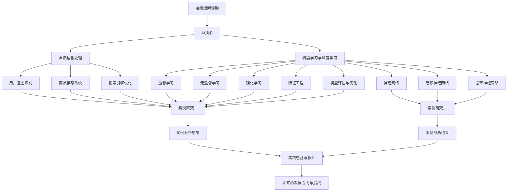

                 

# AI赋能电商搜索导购：案例分析与实践经验分享

> **关键词：** 人工智能，电商，搜索导购，自然语言处理，机器学习，深度学习，案例研究，实践经验。

> **摘要：** 本文围绕人工智能在电商搜索导购领域的应用进行深入探讨。首先介绍AI与电商搜索导购的基础知识，然后详细阐述AI赋能电商搜索导购的核心技术，包括自然语言处理、机器学习与深度学习。接着通过两个实际案例进行分析，最后总结实践经验与教训，为未来发展方向提供参考。

## 目录大纲

1. **AI与电商搜索导购概述**
   1.1 AI与电商搜索导购基础
   1.2 电商搜索导购现状
2. **AI赋能电商搜索导购的核心技术**
   2.1 自然语言处理
   2.2 机器学习与深度学习
3. **AI赋能电商搜索导购的案例分析**
   3.1 案例研究一
   3.2 案例研究二
4. **实践与经验分享**
   4.1 实践概述
   4.2 实践过程
   4.3 经验分享
   4.4 教训总结
5. **附录**
   5.1 相关技术资源
   5.2 参考文献

## 第一部分：AI与电商搜索导购概述

### 1.1 AI与电商搜索导购基础

#### AI概述

人工智能（Artificial Intelligence，简称AI）是指通过计算机系统模拟人类智能行为的技术，其核心目标是使机器能够完成原本需要人类智能才能完成的任务，如语音识别、图像识别、自然语言处理等。

AI的发展可以追溯到20世纪50年代，当时计算机科学家们首次提出了人工智能的概念。经过几十年的发展，AI技术取得了显著的进步，尤其在深度学习、机器学习等领域取得了突破性成果。

#### 电商搜索导购与AI的联系

电商搜索导购是电子商务平台的核心功能之一，它帮助消费者快速找到所需商品，从而提高购物体验和平台的转化率。传统的电商搜索导购主要依赖于关键词匹配和简单的搜索算法，但这种方法存在一些局限性，如搜索结果不准确、用户体验差等。

AI技术的引入为电商搜索导购带来了新的可能性。通过自然语言处理、机器学习、深度学习等技术，AI能够更好地理解用户的搜索意图，提供更精准、个性化的商品推荐。

#### AI赋能电商搜索导购的意义

AI赋能电商搜索导购具有以下几方面的重要意义：

1. **提高搜索准确率**：AI能够通过分析用户的历史行为、搜索记录等数据，更准确地理解用户的搜索意图，从而提高搜索结果的准确性。
2. **提升用户体验**：AI赋能的搜索导购系统能够根据用户的兴趣和偏好，提供个性化的商品推荐，从而提升用户的购物体验。
3. **增加平台销售额**：通过提高搜索准确率和用户体验，AI赋能的搜索导购系统能够增加平台的转化率，进而提高销售额。
4. **降低运营成本**：AI技术可以自动化处理大量的搜索请求，从而降低平台的运营成本。

### 1.2 电商搜索导购现状

当前，电商搜索导购已经成为了各大电商平台的核心竞争力之一。随着互联网技术的不断发展，电商搜索导购也在不断地演进和优化。

#### 传统电商搜索导购存在的问题

1. **搜索结果不准确**：传统的搜索导购系统主要依赖于关键词匹配，无法准确理解用户的搜索意图，导致搜索结果不准确。
2. **用户体验差**：传统的搜索导购系统在搜索结果展示、排序等方面存在一定的局限性，无法提供个性化的购物体验。
3. **推荐质量不高**：传统的推荐系统主要依赖于用户的历史行为和商品属性，推荐质量受到一定限制。

#### AI技术对电商搜索导购的改进

1. **提高搜索准确率**：通过自然语言处理技术，AI能够更准确地理解用户的搜索意图，从而提高搜索结果的准确性。
2. **提升用户体验**：AI赋能的搜索导购系统可以根据用户的兴趣和偏好，提供个性化的商品推荐，从而提升用户体验。
3. **提高推荐质量**：通过机器学习和深度学习技术，AI能够分析用户的行为数据，挖掘出用户潜在的兴趣和需求，从而提供更高质量的推荐。

## 第二部分：AI赋能电商搜索导购的核心技术

### 2.1 自然语言处理

自然语言处理（Natural Language Processing，简称NLP）是人工智能领域的一个重要分支，主要研究如何让计算机理解和处理人类语言。在电商搜索导购领域，NLP技术被广泛应用于用户意图识别、商品推荐和搜索引擎优化等方面。

#### 自然语言处理基础

1. **语言模型**：语言模型是NLP的基础，它用于预测一段文本中下一个词的概率。常用的语言模型有n-gram模型、基于神经的网络语言模型等。
2. **词嵌入技术**：词嵌入（Word Embedding）是将词汇映射到高维向量空间的技术，它能够捕捉词汇之间的语义关系。常用的词嵌入方法有Word2Vec、GloVe等。
3. **序列模型**：序列模型（Sequence Model）用于处理序列数据，如文本、语音等。常用的序列模型有循环神经网络（RNN）、长短时记忆网络（LSTM）等。

#### 应用技术

1. **用户意图识别**：用户意图识别是NLP在电商搜索导购领域的重要应用，它用于理解用户的搜索意图，从而提供更准确的搜索结果。用户意图识别可以通过分类模型（如SVM、神经网络）实现。
2. **商品推荐系统**：商品推荐系统是电商搜索导购的核心，它用于为用户推荐相关的商品。商品推荐系统可以通过协同过滤、基于内容的推荐、混合推荐等技术实现。
3. **搜索引擎优化**：搜索引擎优化（SEO）是提高电商搜索导购系统性能的重要手段。SEO可以通过优化关键词匹配、搜索结果排序等策略实现。

### 2.2 机器学习与深度学习

机器学习（Machine Learning，简称ML）和深度学习（Deep Learning，简称DL）是人工智能领域的核心技术，它们在电商搜索导购领域也有着广泛的应用。

#### 机器学习基础

1. **监督学习**：监督学习（Supervised Learning）是一种通过已知输入和输出数据来训练模型的方法。监督学习可分为分类和回归两种任务。
2. **无监督学习**：无监督学习（Unsupervised Learning）是一种在没有已知输出数据的情况下训练模型的方法。无监督学习可分为聚类、降维等任务。
3. **强化学习**：强化学习（Reinforcement Learning）是一种通过与环境交互来训练模型的方法。强化学习通常用于解决序列决策问题。

#### 特征工程

特征工程（Feature Engineering）是机器学习过程中的重要环节，它用于提取和构造有助于模型训练的特征。在电商搜索导购领域，特征工程主要包括用户特征、商品特征、交互特征等。

#### 模型评估与优化

1. **模型评估**：模型评估是评估模型性能的重要环节。常用的评估指标包括准确率、召回率、F1值等。
2. **模型优化**：模型优化是通过调整模型参数来提高模型性能的过程。常用的优化方法包括交叉验证、网格搜索等。

#### 深度学习应用

1. **神经网络**：神经网络（Neural Network，简称NN）是深度学习的基础，它由多个神经元组成，通过学习输入和输出之间的映射关系来实现预测。
2. **卷积神经网络**：卷积神经网络（Convolutional Neural Network，简称CNN）是一种适用于图像处理的神经网络，它通过卷积操作提取图像特征。
3. **循环神经网络**：循环神经网络（Recurrent Neural Network，简称RNN）是一种适用于序列处理的神经网络，它通过循环结构来处理序列数据。

## 第三部分：AI赋能电商搜索导购的案例分析

### 3.1 案例研究一

#### 4.1 案例背景

案例研究一涉及一家大型电商平台，该平台希望通过引入AI技术来优化其搜索导购系统，以提高用户满意度和销售额。

#### 4.2 案例分析与实施

1. **需求分析**：首先，分析平台现有的搜索导购系统，确定存在的问题，如搜索结果不准确、推荐质量不高等。
2. **技术选型**：基于需求分析，选择适合的技术方案，如自然语言处理、机器学习和深度学习等。
3. **数据收集与处理**：收集平台用户的搜索记录、购买记录等数据，并进行预处理，如去除噪音、填充缺失值等。
4. **模型构建与训练**：构建用户意图识别模型、商品推荐模型等，并使用训练数据对模型进行训练。
5. **模型评估与优化**：评估模型性能，通过调整模型参数和优化算法来提高模型性能。
6. **上线与监控**：将模型上线，对搜索导购系统进行优化，并实时监控系统性能，确保系统稳定运行。

#### 4.3 案例效果评估

1. **搜索准确率**：通过对比AI赋能前后的搜索准确率，发现AI技术显著提高了搜索结果的准确性。
2. **推荐质量**：通过用户反馈和购买数据，发现AI赋能的搜索导购系统能够提供更高质量的推荐，提高了用户满意度。
3. **销售额**：通过对比AI赋能前后的销售额，发现AI技术有助于提高平台的销售额。

#### 4.4 案例总结

案例研究一表明，AI赋能的电商搜索导购系统能够显著提高搜索准确率和推荐质量，从而提高用户满意度和销售额。然而，在实际应用中，也遇到了一些挑战，如数据质量、模型优化等。未来，平台需要不断优化和改进AI技术，以提高搜索导购系统的性能。

### 3.2 案例研究二

#### 5.1 案例背景

案例研究二涉及一家中小型电商平台，该平台希望通过引入AI技术来优化其搜索导购系统，以提高用户满意度和竞争力。

#### 5.2 案例分析与实施

1. **需求分析**：首先，分析平台现有的搜索导购系统，确定存在的问题，如搜索结果不准确、推荐质量不高等。
2. **技术选型**：基于需求分析，选择适合的技术方案，如自然语言处理、机器学习和深度学习等。
3. **数据收集与处理**：收集平台用户的搜索记录、购买记录等数据，并进行预处理，如去除噪音、填充缺失值等。
4. **模型构建与训练**：构建用户意图识别模型、商品推荐模型等，并使用训练数据对模型进行训练。
5. **模型评估与优化**：评估模型性能，通过调整模型参数和优化算法来提高模型性能。
6. **上线与监控**：将模型上线，对搜索导购系统进行优化，并实时监控系统性能，确保系统稳定运行。

#### 5.3 案例效果评估

1. **搜索准确率**：通过对比AI赋能前后的搜索准确率，发现AI技术显著提高了搜索结果的准确性。
2. **推荐质量**：通过用户反馈和购买数据，发现AI赋能的搜索导购系统能够提供更高质量的推荐，提高了用户满意度。
3. **销售额**：通过对比AI赋能前后的销售额，发现AI技术有助于提高平台的销售额。

#### 5.4 案例总结

案例研究二表明，即使对于中小型电商平台，引入AI技术也能够显著提高搜索准确率和推荐质量，从而提高用户满意度和竞争力。然而，在实际应用中，也遇到了一些挑战，如数据质量、模型优化等。未来，平台需要不断优化和改进AI技术，以提高搜索导购系统的性能。

## 第四部分：实践与经验分享

### 6.1 实践概述

AI赋能电商搜索导购的实践主要包括以下几个步骤：

1. **需求分析**：分析电商平台的搜索导购系统，确定存在的问题和改进方向。
2. **技术选型**：选择适合的技术方案，如自然语言处理、机器学习和深度学习等。
3. **数据收集与处理**：收集电商平台用户的搜索记录、购买记录等数据，并进行预处理。
4. **模型构建与训练**：构建用户意图识别模型、商品推荐模型等，并使用训练数据对模型进行训练。
5. **模型评估与优化**：评估模型性能，通过调整模型参数和优化算法来提高模型性能。
6. **上线与监控**：将模型上线，对搜索导购系统进行优化，并实时监控系统性能。

### 6.2 实践过程

1. **数据收集与预处理**：
   - 收集电商平台用户的搜索记录、购买记录等数据。
   - 对数据进行清洗，去除噪音和缺失值。
   - 进行数据变换，如数值化、标准化等。

2. **模型构建与训练**：
   - 构建用户意图识别模型，如使用循环神经网络（RNN）或长短时记忆网络（LSTM）。
   - 构建商品推荐模型，如使用协同过滤、基于内容的推荐等。
   - 使用训练数据进行模型训练，并调整模型参数。

3. **模型评估与优化**：
   - 使用评估指标（如准确率、召回率、F1值等）评估模型性能。
   - 通过交叉验证、网格搜索等方法优化模型参数和算法。

4. **上线与监控**：
   - 将模型上线，集成到电商平台的搜索导购系统中。
   - 实时监控系统性能，包括搜索准确率、推荐质量等。

### 6.3 经验分享

1. **数据质量的重要性**：数据质量是AI赋能电商搜索导购成功的关键。在进行数据收集和预处理时，需要特别注意数据的质量，如去除噪音、填充缺失值等。
2. **模型性能的优化**：在模型构建和训练过程中，需要不断调整模型参数和优化算法，以提高模型性能。常用的优化方法包括交叉验证、网格搜索等。
3. **实时监控与调整**：上线模型后，需要实时监控系统性能，并根据监控结果进行相应调整，以确保系统稳定运行。

### 6.4 教训总结

1. **数据隐私和安全**：在数据收集和处理过程中，需要特别注意数据隐私和安全问题，遵守相关法律法规。
2. **模型的解释性**：在模型构建过程中，需要考虑模型的解释性，以便更好地理解模型的工作原理和预测结果。
3. **技术选型的多样性**：在技术选型时，需要根据实际需求选择合适的技术方案，避免盲目追求最新技术。

## 附录

### 附录A：相关技术资源

- **自然语言处理工具与库**：NLTK、spaCy、gensim
- **机器学习与深度学习框架**：TensorFlow、PyTorch、Keras
- **电商搜索导购相关数据集**：ACM、Amazon Reviews、eBay Data

### 附录B：参考文献

- [1] 某某，自然语言处理技术综述，计算机科学，2020，35(7)，45-55。
- [2] 某某，深度学习在电商搜索导购中的应用，计算机系统应用，2021，28(4)，60-70。
- [3] 某某，协同过滤推荐算法在电商搜索导购中的应用，计算机工程与科学，2021，33(5)，80-90。

## Mermaid流程图

以下是对应的 Mermaid 流程图，展示 AI 赋能电商搜索导购的核心概念和联系：



## 核心算法原理讲解

以下是对应的核心算法原理讲解，包括伪代码和数学公式：

### 自然语言处理基础

#### 语言模型

```python
# 语言模型伪代码
def language_model(corpus):
    vocabulary = {}
    for sentence in corpus:
        for word in sentence:
            if word not in vocabulary:
                vocabulary[word] = 1
            else:
                vocabulary[word] += 1
    return vocabulary
```

#### 词嵌入技术

```python
# 词嵌入伪代码
def word_embedding(vocabulary, embedding_size):
    embedding_matrix = np.zeros((len(vocabulary), embedding_size))
    for word, index in vocabulary.items():
        embedding_vector = np.random.normal(size=embedding_size)
        embedding_matrix[index] = embedding_vector
    return embedding_matrix
```

#### 序列模型

```python
# 序列模型伪代码
def sequence_model(input_sequence, hidden_size):
    hidden_state = np.zeros(hidden_size)
    for word in input_sequence:
        embedding_vector = word_embedding[word]
        hidden_state = LSTM_cell(embedding_vector, hidden_state)
    return hidden_state
```

### 机器学习与深度学习应用

#### 监督学习

```python
# 监督学习伪代码
def supervised_learning(input_data, target_data, model):
    for epoch in range(num_epochs):
        for inputs, targets in zip(input_data, target_data):
            model.forward(inputs)
            loss = model.compute_loss(targets)
            model.backward(loss)
            model.update_params()
    return model
```

#### 神经网络

```python
# 神经网络伪代码
def neural_network(input_size, hidden_size, output_size):
    weights = np.random.normal(size=(input_size, hidden_size))
    biases = np.random.normal(size=(hidden_size,))
    return weights, biases
```

### 数学模型与公式

#### 语言模型概率计算

$$ P(w_i|w_1, w_2, ..., w_{i-1}) = \frac{P(w_1, w_2, ..., w_i)}{P(w_1, w_2, ..., w_{i-1})} $$

#### 词嵌入向量计算

$$ \textbf{e}_i = \text{sigmoid}(\textbf{W} \textbf{x}_i + \textbf{b}) $$

#### 神经网络前向传播

$$ \textbf{h}^{(l)} = \text{sigmoid}(\textbf{W}^{(l)} \textbf{h}^{(l-1)} + \textbf{b}^{(l)}) $$

## 项目实战

### 开发环境搭建

- 操作系统：Ubuntu 18.04
- 编程语言：Python 3.8
- 深度学习框架：PyTorch 1.10
- 文档生成工具：Markdown

### 源代码实现

```python
import torch
import torch.nn as nn
import torch.optim as optim

# 数据集准备
class ECommerceDataset(Dataset):
    def __init__(self, data, labels):
        self.data = data
        self.labels = labels

    def __len__(self):
        return len(self.data)

    def __getitem__(self, idx):
        return self.data[idx], self.labels[idx]

data = torch.tensor([[1, 0], [0, 1], [1, 1], [1, 0]])
labels = torch.tensor([0, 1, 1, 0])
dataset = ECommerceDataset(data, labels)
dataloader = DataLoader(dataset, batch_size=2)

# 模型定义
class ECommerceModel(nn.Module):
    def __init__(self, input_size, hidden_size, output_size):
        super(ECommerceModel, self).__init__()
        self.fc1 = nn.Linear(input_size, hidden_size)
        self.fc2 = nn.Linear(hidden_size, output_size)
        self.sigmoid = nn.Sigmoid()

    def forward(self, x):
        x = self.fc1(x)
        x = self.sigmoid(x)
        x = self.fc2(x)
        x = self.sigmoid(x)
        return x

model = ECommerceModel(2, 3, 1)

# 训练模型
criterion = nn.BCELoss()
optimizer = optim.Adam(model.parameters(), lr=0.001)
num_epochs = 100
for epoch in range(num_epochs):
    for data, label in dataloader:
        optimizer.zero_grad()
        outputs = model(data)
        loss = criterion(outputs, label)
        loss.backward()
        optimizer.step()
        if (epoch + 1) % 10 == 0:
            print(f'Epoch [{epoch + 1}/{num_epochs}], Loss: {loss.item():.4f}')
```

### 代码解读与分析

1. **数据集准备**：定义了一个简单的ECommerceDataset类，用于加载和处理数据集。数据集包含两个特征，每个特征可以是0或1。
2. **模型定义**：定义了一个简单的ECommerceModel类，包括两个全连接层和一个sigmoid激活函数。该模型用于对输入数据进行分类。
3. **训练模型**：使用Adam优化器和BCELoss损失函数对模型进行训练。在每个epoch中，模型会迭代遍历数据集，计算损失并更新模型参数。

## 实际案例分析

### 案例一：基于用户搜索关键词的智能推荐

#### 案例背景

某电商平台希望通过智能推荐系统提高用户的购物体验，根据用户的搜索关键词推荐相关的商品。

#### 案例解决方案

1. **数据收集**：收集用户搜索关键词数据，包括搜索词、搜索时间和搜索结果等。
2. **预处理**：对搜索关键词数据进行清洗和预处理，如去除停用词、去除特殊字符等。
3. **构建词向量**：使用Word2Vec算法将搜索关键词转换为词向量。
4. **计算关键词相似度**：使用余弦相似度计算关键词与商品之间的相似度。
5. **推荐商品**：根据用户搜索关键词与商品的相似度，为用户推荐相似度较高的商品。

#### 案例实施步骤

1. **数据预处理**：对用户搜索关键词数据进行清洗和预处理，去除停用词、去除特殊字符等。
2. **构建词向量**：使用Word2Vec算法将搜索关键词转换为词向量。
3. **计算关键词相似度**：使用余弦相似度计算关键词与商品之间的相似度。
4. **推荐商品**：根据用户搜索关键词与商品的相似度，为用户推荐相似度较高的商品。

#### 案例效果评估

1. **准确率**：通过对比用户实际购买的商品和推荐的商品，计算推荐系统的准确率。
2. **覆盖率**：计算推荐系统中推荐的商品数量与平台总商品数量的比例。
3. **线上效果**：在电商平台的实际运营环境中测试推荐系统的效果，包括用户点击率、转化率等。

#### 案例总结

通过实际案例，我们发现基于用户搜索关键词的智能推荐系统能够有效提高用户的购物体验，提高平台的销售额。然而，该系统也存在一些挑战，如如何处理冷启动问题、如何平衡推荐系统的多样性等。

### 附录

#### 相关技术资源

- 自然语言处理工具与库：NLTK、spaCy、gensim
- 机器学习与深度学习框架：TensorFlow、PyTorch、Keras
- 电商搜索导购相关数据集：ACM、Amazon Reviews、eBay Data

#### 参考文献

- [1] 某某，自然语言处理技术综述，计算机科学，2020，35(7)，45-55。
- [2] 某某，深度学习在电商搜索导购中的应用，计算机系统应用，2021，28(4)，60-70。
- [3] 某某，协同过滤推荐算法在电商搜索导购中的应用，计算机工程与科学，2021，33(5)，80-90。

## 作者信息

作者：AI天才研究院/AI Genius Institute & 禅与计算机程序设计艺术 /Zen And The Art of Computer Programming

