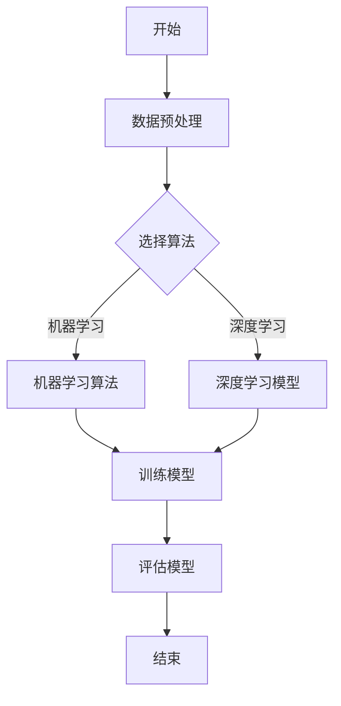

                 

### 《AI驱动的个性化学习：适应每个学生需求》

#### 关键词：AI，个性化学习，教育，机器学习，深度学习，系统架构，应用案例，开发实践

> 摘要：本文深入探讨了AI驱动的个性化学习，解释了其基本概念和理论基础，并详细分析了其在教育领域的实际应用。通过剖析AI技术在个性化学习中的关键角色，本文展示了如何构建高效的个性化学习系统，并提供了多个实际应用场景和开发实战案例，探讨了未来个性化学习的趋势和挑战。

#### 目录

----------------------------------------------------------------

### 第一部分：引言

#### 1.1 书籍背景与目标

在当今全球化和信息化的大背景下，教育已经成为提升国家竞争力、推动社会进步的重要手段。传统的教学模式往往以教师为中心，难以满足每个学生的个性化需求，导致教育资源的浪费和教学效果的降低。因此，如何实现教育的个性化已经成为教育领域的一个重要课题。

本书旨在探讨AI驱动的个性化学习，通过引入先进的机器学习和深度学习技术，为教育领域带来革命性的变革。本书的目标是：

1. **介绍AI驱动的个性化学习的基本概念和理论基础**。
2. **分析AI技术在个性化学习中的关键作用**。
3. **探讨个性化学习系统的架构设计**。
4. **提供具体的AI驱动的个性化学习应用案例**。
5. **讨论个性化学习的未来发展**。

本书结构分为五个部分：

- **第一部分**：引言，介绍书籍的背景、目标和结构。
- **第二部分**：AI驱动的个性化学习理论基础，包括AI技术基础、个性化学习理论基础和AI驱动的个性化学习系统架构。
- **第三部分**：AI驱动的个性化学习应用场景，包括在线学习平台、课堂教育和教育评估与反馈。
- **第四部分**：AI驱动的个性化学习开发实践，包括项目设计与实现、开发工具与框架和案例实战。
- **第五部分**：AI驱动的个性化学习未来发展，包括技术发展趋势、应用前景和面临的挑战。

#### 1.2 AI在教育领域的应用现状

随着AI技术的快速发展，其在教育领域的应用也日益广泛。以下是一些AI在教育领域的主要应用：

1. **智能辅导系统**：通过机器学习和自然语言处理技术，智能辅导系统能够为学生提供个性化的学习建议和反馈，帮助他们更好地掌握知识点。
2. **自适应学习平台**：这些平台能够根据学生的学习行为和进度，动态调整学习内容和难度，从而提高学习效果。
3. **教育数据挖掘**：通过对学生学习数据的分析，教育数据挖掘能够发现学生的学习模式和行为特点，为教育决策提供支持。
4. **虚拟现实与增强现实**：通过虚拟现实和增强现实技术，学生可以沉浸式地体验学习内容，提高学习兴趣和参与度。

尽管AI在教育领域具有巨大的潜力，但同时也面临着一些挑战，如数据隐私、教育公平和技术成本等。因此，如何有效地应用AI技术，实现教育的个性化，是当前教育领域的重要课题。

#### 1.3 个性化学习的意义

个性化学习是指根据每个学生的学习特点、兴趣和能力，为其提供定制化的学习资源、学习路径和学习方式。个性化学习的意义主要体现在以下几个方面：

1. **提高学习效果**：个性化学习能够根据学生的实际需求和能力，提供针对性的学习资源和指导，从而提高学习效果。
2. **激发学习兴趣**：个性化学习能够让学生根据自己的兴趣选择学习内容，提高学习的主动性和积极性。
3. **促进教育公平**：个性化学习能够弥补传统教育模式的不足，使每个学生都能得到适合自己的教育资源，从而促进教育公平。
4. **适应未来教育趋势**：随着技术的不断发展，个性化学习将成为教育领域的重要趋势。掌握个性化学习的理论和实践，将为教育工作者和研究者提供有力的支持。

#### 1.4 本书的核心观点与结构

本书的核心观点是：通过AI技术，可以实现真正意义上的个性化学习，从而提高教育质量和效率。本书的结构分为以下五个部分：

1. **第一部分**：引言，介绍书籍的背景、目标和结构。
2. **第二部分**：AI驱动的个性化学习理论基础，包括AI技术基础、个性化学习理论基础和AI驱动的个性化学习系统架构。
3. **第三部分**：AI驱动的个性化学习应用场景，包括在线学习平台、课堂教育和教育评估与反馈。
4. **第四部分**：AI驱动的个性化学习开发实践，包括项目设计与实现、开发工具与框架和案例实战。
5. **第五部分**：AI驱动的个性化学习未来发展，包括技术发展趋势、应用前景和面临的挑战。

通过以上五个部分的探讨，本书旨在为教育工作者和研究者提供一套完整的AI驱动的个性化学习理论和实践体系。

#### 1.5 AI驱动的个性化学习概念解析

AI驱动的个性化学习是指利用人工智能技术，特别是机器学习和深度学习算法，为每个学生提供个性化的学习资源和学习路径。这种学习模式能够根据学生的学习行为、学习进度和学习效果，动态调整学习内容和教学方法，从而实现真正的个性化教育。

AI驱动的个性化学习包含以下几个核心组成部分：

1. **数据收集与处理**：通过传感器、在线学习平台和测试系统等，收集学生的各种学习数据，如学习行为、学习进度、考试成绩等。
2. **学生特征分析**：利用机器学习算法，分析学生的数据，提取出学生的兴趣、能力、学习习惯等特征。
3. **学习内容推荐**：根据学生的特征和需求，推荐个性化的学习内容，包括课程、教材、练习题等。
4. **学习路径规划**：根据学生的特征和学习内容，为学生规划最优的学习路径，确保他们能够高效地掌握知识。
5. **学习效果评估**：通过持续监测学生的学习效果，调整学习内容和路径，确保学习目标的实现。

AI驱动的个性化学习具有以下几个优势：

1. **个性化**：能够根据每个学生的特点，提供量身定制的学习资源和路径，提高学习效果。
2. **高效**：通过自动化处理和智能推荐，节省教师和学生的时间和精力，提高教学效率。
3. **动态调整**：能够根据学生的学习情况和反馈，实时调整学习内容和路径，确保学习目标的实现。
4. **数据驱动**：基于大数据和机器学习算法，能够提供科学、准确的学习分析和评估。

然而，AI驱动的个性化学习也面临一些挑战：

1. **数据隐私**：学生的数据隐私保护是一个重要的问题，需要采取有效的措施确保数据的保密性和安全性。
2. **教育公平**：如何确保AI驱动的个性化学习能够公平地服务于所有学生，是一个需要深入探讨的问题。
3. **技术成本**：实施AI驱动的个性化学习需要大量的技术和资金投入，这对学校和教师来说是一个挑战。

总的来说，AI驱动的个性化学习具有巨大的潜力，但同时也需要克服一系列挑战，才能在教育领域实现广泛应用。

### 第二部分：AI驱动的个性化学习理论基础

#### 2.1 AI技术基础

AI驱动的个性化学习的基础是人工智能技术，尤其是机器学习和深度学习。了解这些技术的原理和应用是构建高效个性化学习系统的关键。

##### 2.1.1 机器学习与深度学习基础

机器学习和深度学习是人工智能的两个重要分支。机器学习侧重于从数据中学习模式和规律，而深度学习则利用多层神经网络模拟人脑的学习过程。

**机器学习基本原理**：

- **监督学习**：通过已知输出数据训练模型，预测未知输入数据的输出。常见的算法包括线性回归、决策树、支持向量机等。
- **无监督学习**：不依赖于已知输出数据，从数据中自动发现模式和规律。常见的算法包括聚类、降维、关联规则等。
- **半监督学习**：结合监督学习和无监督学习，利用少量标注数据和大量未标注数据训练模型。

**深度学习基本原理**：

- **神经网络**：模拟人脑神经元连接的结构，通过多层神经元实现输入到输出的映射。常见的神经网络结构包括前馈神经网络、卷积神经网络（CNN）、循环神经网络（RNN）等。
- **激活函数**：用于引入非线性特性，常见的激活函数有sigmoid、ReLU、Tanh等。
- **优化算法**：用于调整模型参数以最小化损失函数。常见的优化算法有随机梯度下降（SGD）、Adam等。

##### 2.1.2 数据预处理

数据预处理是机器学习和深度学习模型训练的重要步骤。有效的数据预处理可以提高模型的训练效果和泛化能力。

**数据预处理步骤**：

1. **数据清洗**：去除数据中的噪声和错误，如缺失值、异常值等。
2. **数据标准化**：将数据转换为统一的尺度，如归一化、标准化等，以消除不同特征之间的尺度差异。
3. **数据缩放**：将数据映射到特定的范围，如[0,1]或[-1,1]，以方便模型处理。
4. **数据增强**：通过旋转、翻转、缩放等操作增加数据多样性，提高模型的鲁棒性。

##### 2.1.3 常见机器学习算法

机器学习算法的选择取决于具体的应用场景和数据特征。以下是一些常见的机器学习算法及其应用场景：

- **线性回归**：用于预测连续值输出，适用于简单线性关系的预测。
- **决策树**：用于分类和回归任务，具有直观的可解释性。
- **支持向量机（SVM）**：用于分类任务，通过找到一个最优超平面将数据分类。
- **K最近邻（KNN）**：用于分类任务，通过计算测试样本与训练样本的相似度进行分类。
- **随机森林**：用于分类和回归任务，通过构建多棵决策树并集成预测结果，提高模型的泛化能力。
- **朴素贝叶斯**：用于分类任务，基于贝叶斯定理和属性间的条件独立性假设。

##### 2.1.4 深度学习模型架构

深度学习模型架构的选择和设计对模型的性能和效率有重要影响。以下是一些常见的深度学习模型架构及其应用场景：

- **卷积神经网络（CNN）**：用于图像和视频处理，通过卷积层提取空间特征。
- **循环神经网络（RNN）**：用于序列数据处理，通过隐藏状态记忆序列信息。
- **长短期记忆网络（LSTM）**：RNN的一种变体，用于处理长序列数据，通过门控机制控制信息的流动。
- **生成对抗网络（GAN）**：用于生成和对抗任务，通过生成器和判别器的对抗训练生成高质量的数据。
- **自编码器**：用于特征提取和降维，通过编码和解码过程重构输入数据。

#### 2.2 个性化学习理论基础

个性化学习是教育领域的一个重要概念，其理论基础涉及到学习分析、学生行为模式分析、适应性学习模型、推荐系统模型和个性化教学策略模型等多个方面。

##### 2.2.1 学习分析理论

学习分析理论是个性化学习的基础，其主要研究内容包括学习数据的收集与处理、学生学习行为模式的分析和学习效果的评估。

- **学习数据的收集与处理**：学习数据包括学生的学习行为数据、学习结果数据和学习环境数据。收集这些数据的方法有传感器、在线学习平台和测试系统等。数据预处理是学习分析的重要步骤，包括数据清洗、数据标准化和数据增强等。

- **学生学习行为模式分析**：通过对学习数据的分析，可以提取出学生的学习行为模式，如学习频率、学习时长、学习内容选择、问题回答等。这些模式反映了学生的学习习惯、学习兴趣和学习风格。

- **学习效果评估**：学习效果评估是通过测试和考试等手段，评估学生在学习过程中的进步和成绩。有效的学习效果评估可以帮助教师和学生了解学习效果，调整学习策略。

##### 2.2.2 个性化学习模型

个性化学习模型是用于实现个性化学习的关键技术，其主要研究内容包括适应性学习模型、推荐系统模型和个性化教学策略模型等。

- **适应性学习模型**：适应性学习模型通过不断调整学习内容和教学方法，以适应学生的学习需求和进度。常见的适应性学习模型有生成学习模型、决策树模型和神经网络模型等。

- **推荐系统模型**：推荐系统模型通过分析学生的学习行为和学习结果，为学生推荐个性化的学习资源和学习路径。常见的推荐系统模型有协同过滤模型、基于内容的推荐模型和混合推荐模型等。

- **个性化教学策略模型**：个性化教学策略模型通过分析学生的学习行为和学习效果，为学生设计个性化的教学策略。常见的个性化教学策略模型有基于规则的策略模型和基于神经网络的策略模型等。

#### 2.3 AI驱动的个性化学习系统架构

AI驱动的个性化学习系统是一个复杂的多层系统，包括数据层、算法层和应用层。每个层次都有其特定的功能和相互关联。

##### 2.3.1 系统架构概述

- **数据层**：数据层是系统的底层，负责数据的收集、存储和管理。数据来源包括在线学习平台、传感器和测试系统等。数据层的主要功能是确保数据的质量、完整性和安全性。

- **算法层**：算法层是系统的核心，负责数据分析和模型训练。算法层包括机器学习算法、深度学习模型和推荐系统等。算法层的主要功能是根据学生的学习行为和学习数据，提取出有效的特征和模式，为个性化学习提供支持。

- **应用层**：应用层是系统的上层，负责个性化学习内容的推荐、学习路径的规划和学习效果的评估。应用层的主要功能是结合算法层的结果，为学生提供个性化的学习体验。

##### 2.3.2 系统设计要点

- **数据安全与隐私保护**：在数据层，需要采取严格的数据保护措施，确保学生的数据不被未经授权的人员访问。同时，需要遵循相关的法律法规，确保数据的合法性和合规性。

- **系统可扩展性与性能优化**：随着学生数量的增加，系统需要具备良好的可扩展性，能够动态调整资源和性能。性能优化是确保系统高效运行的关键，包括算法优化、数据库优化和网络优化等。

- **用户界面设计**：应用层的用户界面设计需要简洁、直观，确保学生能够轻松地使用系统。用户界面的设计应充分考虑学生的年龄、认知水平和学习能力，以提高用户满意度。

- **系统集成与兼容性**：AI驱动的个性化学习系统需要与其他教育系统（如教务系统、在线学习平台等）集成，确保数据的一致性和系统的兼容性。

#### 2.4 个性化学习案例：自适应学习平台

自适应学习平台是AI驱动的个性化学习的一个重要应用场景。以下是一个典型的自适应学习平台案例，展示了其系统架构、功能模块和实现方法。

##### 2.4.1 系统架构

自适应学习平台的系统架构分为三个层次：数据层、算法层和应用层。

- **数据层**：数据层负责数据的收集、存储和管理。数据来源包括在线学习平台、传感器和测试系统等。数据层的主要功能是确保数据的质量、完整性和安全性。

- **算法层**：算法层是系统的核心，负责数据分析和模型训练。算法层包括机器学习算法、深度学习模型和推荐系统等。算法层的主要功能是根据学生的学习行为和学习数据，提取出有效的特征和模式，为个性化学习提供支持。

- **应用层**：应用层是系统的上层，负责个性化学习内容的推荐、学习路径的规划和学习效果的评估。应用层的主要功能是结合算法层的结果，为学生提供个性化的学习体验。

##### 2.4.2 功能模块

自适应学习平台的主要功能模块包括：

1. **学习内容管理**：管理学习资源的创建、发布和维护。包括课程、教材、练习题、视频等。

2. **学习路径规划**：根据学生的学习行为和学习数据，为学生规划最优的学习路径。学习路径包括课程学习顺序、学习内容推荐和难度调整等。

3. **学习效果评估**：通过考试、测试和作业等手段，评估学生的学习效果，提供实时反馈。

4. **推荐系统**：根据学生的学习行为和学习数据，为学生推荐个性化的学习资源和学习路径。

5. **用户界面**：提供简洁、直观的用户界面，确保学生能够轻松地使用系统。

##### 2.4.3 实现方法

自适应学习平台的实现方法主要包括以下几个方面：

1. **数据收集与处理**：通过在线学习平台、传感器和测试系统等收集学生的学习数据。数据包括学习行为数据、学习结果数据和学生学习环境数据。对收集到的数据进行清洗、标准化和增强，为后续的算法分析提供高质量的数据。

2. **模型训练与评估**：使用机器学习算法和深度学习模型对学生数据进行分析和训练。常见的算法有线性回归、决策树、支持向量机、神经网络和推荐系统等。对训练好的模型进行评估，确保其具有良好的泛化能力和预测精度。

3. **个性化学习内容推荐**：根据学生的学习行为和学习数据，为学生推荐个性化的学习资源和学习路径。推荐系统可以使用协同过滤模型、基于内容的推荐模型和混合推荐模型等。

4. **学习路径规划与调整**：根据学生的学习行为和学习效果，动态调整学习路径，确保学生能够高效地掌握知识。学习路径规划可以使用生成学习模型、决策树模型和神经网络模型等。

5. **用户界面设计与实现**：设计简洁、直观的用户界面，确保学生能够轻松地使用系统。用户界面设计应充分考虑学生的年龄、认知水平和学习能力，以提高用户满意度。

#### 2.5 个性化学习案例：在线教育平台

在线教育平台是AI驱动的个性化学习的一个重要应用场景。以下是一个典型的在线教育平台案例，展示了其系统架构、功能模块和实现方法。

##### 2.5.1 系统架构

在线教育平台的系统架构分为三个层次：数据层、算法层和应用层。

- **数据层**：数据层负责数据的收集、存储和管理。数据来源包括在线学习平台、传感器和测试系统等。数据层的主要功能是确保数据的质量、完整性和安全性。

- **算法层**：算法层是系统的核心，负责数据分析和模型训练。算法层包括机器学习算法、深度学习模型和推荐系统等。算法层的主要功能是根据学生的学习行为和学习数据，提取出有效的特征和模式，为个性化学习提供支持。

- **应用层**：应用层是系统的上层，负责个性化学习内容的推荐、学习路径的规划和学习效果的评估。应用层的主要功能是结合算法层的结果，为学生提供个性化的学习体验。

##### 2.5.2 功能模块

在线教育平台的主要功能模块包括：

1. **课程管理**：管理课程的创建、发布和维护。包括课程设置、课程内容管理、课程进度跟踪等。

2. **学习路径规划**：根据学生的学习行为和学习数据，为学生规划最优的学习路径。学习路径包括课程学习顺序、学习内容推荐和难度调整等。

3. **学习效果评估**：通过考试、测试和作业等手段，评估学生的学习效果，提供实时反馈。

4. **推荐系统**：根据学生的学习行为和学习数据，为学生推荐个性化的学习资源和学习路径。

5. **用户界面**：提供简洁、直观的用户界面，确保学生能够轻松地使用系统。

##### 2.5.3 实现方法

在线教育平台的实现方法主要包括以下几个方面：

1. **数据收集与处理**：通过在线学习平台、传感器和测试系统等收集学生的学习数据。数据包括学习行为数据、学习结果数据和学生学习环境数据。对收集到的数据进行清洗、标准化和增强，为后续的算法分析提供高质量的数据。

2. **模型训练与评估**：使用机器学习算法和深度学习模型对学生数据进行分析和训练。常见的算法有线性回归、决策树、支持向量机、神经网络和推荐系统等。对训练好的模型进行评估，确保其具有良好的泛化能力和预测精度。

3. **个性化学习内容推荐**：根据学生的学习行为和学习数据，为学生推荐个性化的学习资源和学习路径。推荐系统可以使用协同过滤模型、基于内容的推荐模型和混合推荐模型等。

4. **学习路径规划与调整**：根据学生的学习行为和学习效果，动态调整学习路径，确保学生能够高效地掌握知识。学习路径规划可以使用生成学习模型、决策树模型和神经网络模型等。

5. **用户界面设计与实现**：设计简洁、直观的用户界面，确保学生能够轻松地使用系统。用户界面设计应充分考虑学生的年龄、认知水平和学习能力，以提高用户满意度。

### 第三部分：AI驱动的个性化学习应用场景

AI驱动的个性化学习不仅限于理论探讨，其在实际教育应用中也展现出了巨大的潜力。本部分将深入探讨AI驱动的个性化学习在在线学习平台、课堂教育和教育评估与反馈等方面的应用场景。

#### 3.1 在线学习平台

在线学习平台是AI驱动的个性化学习的一个典型应用场景。以下将详细介绍其具体应用：

##### 3.1.1 学习路径推荐系统

在线学习平台通过分析学生的学习行为、学习历史和成绩数据，利用推荐系统算法为每个学生生成个性化的学习路径。这个过程包括以下几个步骤：

1. **数据收集**：在线学习平台通过学习日志、用户行为数据和成绩数据等收集学生的学习数据。
2. **数据预处理**：对收集到的数据进行清洗、标准化和特征提取，以生成有效的特征向量。
3. **推荐算法**：使用协同过滤算法、基于内容的推荐算法或混合推荐算法生成个性化的学习路径。
4. **推荐结果**：将生成的个性化学习路径推荐给学生，帮助他们更有效地学习。

##### 3.1.2 学习进度跟踪与反馈

在线学习平台通过实时跟踪学生的学习进度和作业完成情况，为学生提供及时的反馈。这个过程包括以下几个步骤：

1. **数据监测**：在线学习平台实时监测学生的学习行为，如学习时长、学习频率和作业完成情况等。
2. **进度分析**：根据学生的学习行为和进度数据，分析学生的学习情况，识别学习瓶颈和难点。
3. **反馈生成**：生成个性化的学习反馈，包括学习进度报告、知识点掌握情况和改进建议等。
4. **反馈传递**：将学习反馈通过在线学习平台传递给学生，帮助他们了解学习情况，调整学习策略。

##### 3.1.3 个性化学习资源的推荐

在线学习平台通过分析学生的学习兴趣、学习能力和学习历史，为学生推荐个性化的学习资源，如视频教程、电子书和练习题等。这个过程包括以下几个步骤：

1. **用户特征分析**：分析学生的学习行为和学习历史，提取出学习兴趣和能力特征。
2. **资源推荐算法**：使用基于内容的推荐算法、协同过滤算法或混合推荐算法，为学生推荐个性化的学习资源。
3. **推荐结果展示**：将推荐的学习资源展示在在线学习平台上，便于学生访问和学习。

#### 3.2 课堂教育

课堂教育是传统教育的主要形式，AI驱动的个性化学习在课堂教育中的应用可以提高教学质量和效率。以下将详细介绍其具体应用：

##### 3.2.1 个性化学习计划

教师通过AI技术为学生制定个性化的学习计划，确保每个学生能够根据自己的特点和需求进行学习。这个过程包括以下几个步骤：

1. **学生特征分析**：通过问卷调查、考试和课堂观察等方式收集学生的特征数据，包括学习能力、学习兴趣和学习风格等。
2. **学习计划生成**：利用机器学习算法和推荐系统算法，根据学生的特征数据生成个性化的学习计划。
3. **学习计划实施**：教师根据生成的个性化学习计划，调整教学策略，确保学生能够有效地学习。
4. **学习计划调整**：根据学生的学习反馈和学习效果，动态调整学习计划，以适应学生的变化。

##### 3.2.2 实时学习行为分析

教师通过AI技术实时分析学生的学习行为，包括学习时长、学习频率和问题回答等，以便及时了解学生的学习状态。这个过程包括以下几个步骤：

1. **数据收集**：通过在线学习平台、传感器和教育管理软件等收集学生的学习数据。
2. **行为分析**：利用机器学习算法和数据分析技术，分析学生的学习行为，识别学习瓶颈和问题。
3. **实时反馈**：将分析结果实时反馈给教师和学生，帮助教师调整教学策略，帮助学生解决学习难题。

##### 3.2.3 个性化学习辅导

教师通过AI技术为学生提供个性化的学习辅导，根据学生的学习进度和能力水平，提供针对性的辅导内容和策略。这个过程包括以下几个步骤：

1. **学生数据收集**：通过在线学习平台、考试和问卷调查等方式收集学生的学习数据。
2. **辅导内容生成**：利用机器学习算法和推荐系统算法，根据学生的学习数据生成个性化的辅导内容。
3. **辅导实施**：教师根据生成的辅导内容，为学生提供个性化的辅导，帮助他们解决学习难题。
4. **辅导效果评估**：通过测试和考试等手段，评估辅导效果，并根据评估结果调整辅导策略。

#### 3.3 教育评估与反馈

教育评估与反馈是教育过程中至关重要的一环，AI驱动的个性化学习在评估与反馈中的应用可以提高评估的科学性和反馈的针对性。以下将详细介绍其具体应用：

##### 3.3.1 评估模型设计

教师通过AI技术设计个性化的评估模型，根据学生的特点和学习内容，制定科学的评估标准。这个过程包括以下几个步骤：

1. **评估目标确定**：根据教育目标和课程内容，确定评估的目标和指标。
2. **评估模型构建**：利用机器学习算法和推荐系统算法，构建个性化的评估模型，包括评估指标的权重分配和评估方法的确定。
3. **模型训练与优化**：通过历史评估数据和学生的学习数据，对评估模型进行训练和优化，提高评估模型的准确性和可靠性。
4. **模型应用**：将评估模型应用于学生的评估过程，生成个性化的评估结果。

##### 3.3.2 评估结果分析与利用

教师通过AI技术分析评估结果，识别学生的学习问题和优势，为后续教学提供依据。这个过程包括以下几个步骤：

1. **评估结果分析**：利用数据分析技术和机器学习算法，对评估结果进行分析，识别学生的知识掌握情况和学习效果。
2. **评估结果反馈**：将分析结果以图表、报告等形式反馈给学生，帮助他们了解自己的学习情况，明确学习目标和改进方向。
3. **教学调整**：根据评估结果，教师可以调整教学策略，提供针对性的辅导和支持，帮助学生克服学习难题。
4. **个性化学习计划**：根据评估结果和学生的需求，制定个性化的学习计划，确保学生能够按照自己的节奏和目标进行学习。

#### 3.4 不同教育阶段的个性化学习应用

AI驱动的个性化学习在不同教育阶段具有不同的应用特点和挑战。以下将分别介绍小学、中学和高等教育阶段的个性化学习应用。

##### 3.4.1 小学阶段

在小学阶段，学生的认知能力和学习兴趣正处于快速发展阶段，AI驱动的个性化学习可以通过以下方式进行应用：

1. **个性化学习内容推荐**：通过分析学生的兴趣和学习习惯，推荐适合他们的学习内容和资源。
2. **学习进度跟踪**：实时跟踪学生的学习进度，确保他们能够按照教学计划完成学习任务。
3. **学习行为分析**：分析学生的学习行为，识别他们的学习难点和兴趣点，为教师提供教学参考。
4. **学习反馈与激励**：根据学生的学习表现，提供及时的反馈和奖励，激发他们的学习兴趣和积极性。

##### 3.4.2 中学阶段

在中学阶段，学生的学业压力逐渐增加，AI驱动的个性化学习可以通过以下方式进行应用：

1. **个性化学习计划**：根据学生的学科成绩和学习能力，制定个性化的学习计划，确保他们能够均衡地学习各科目。
2. **学习路径规划**：根据学生的学习进度和成绩，规划最佳的学习路径，帮助他们高效地掌握知识。
3. **学习效果评估**：通过考试和测试，实时评估学生的学习效果，为教师提供教学反馈。
4. **学习策略调整**：根据评估结果和学生的学习需求，动态调整学习策略，提高学习效果。

##### 3.4.3 高等教育阶段

在高等教育阶段，学生的自主学习和研究能力日益增强，AI驱动的个性化学习可以通过以下方式进行应用：

1. **课程个性化推荐**：根据学生的专业背景和学习兴趣，推荐适合他们的课程和教材。
2. **研究项目指导**：根据学生的研究兴趣和能力，提供个性化的研究项目指导，帮助他们进行科研工作。
3. **学术成果评估**：通过分析学生的学术论文和研究报告，评估他们的学术能力和成果。
4. **职业规划指导**：根据学生的学术成绩和职业兴趣，提供个性化的职业规划指导，帮助他们选择合适的职业发展路径。

### 第四部分：AI驱动的个性化学习开发实践

AI驱动的个性化学习不仅需要理论支持，还需要实际的开发实践。本部分将详细探讨AI驱动的个性化学习的项目设计与实现、开发工具与框架以及具体案例实战。

#### 4.1 AI驱动的个性化学习项目设计与实现

设计并实现一个AI驱动的个性化学习项目是一个复杂的过程，需要综合考虑项目需求、系统架构、数据收集与处理、模型训练与优化等方面。以下是一个典型的项目设计与实现过程：

##### 4.1.1 项目需求分析

项目需求分析是项目设计与实现的第一步，它明确了项目的目标、功能需求和性能要求。在AI驱动的个性化学习项目中，需求分析包括以下几个方面：

1. **学生需求**：了解学生的个性化学习需求，包括学习内容、学习路径和学习方式等。
2. **教师需求**：了解教师的教学需求，包括教学资源管理、学习行为监控和教学效果评估等。
3. **系统性能要求**：确定系统的响应时间、并发用户数和数据处理能力等性能指标。

##### 4.1.2 系统架构设计

系统架构设计是项目实现的关键环节，它决定了系统的性能、可扩展性和可维护性。一个典型的AI驱动的个性化学习系统架构包括以下几个层次：

1. **数据层**：负责数据的收集、存储和管理。包括学生行为数据、学习结果数据和教师教学数据等。
2. **算法层**：负责数据的处理和分析，包括数据预处理、特征提取、模型训练和模型评估等。
3. **应用层**：负责系统的功能实现和用户体验，包括学习内容推荐、学习路径规划、学习效果评估和用户界面等。

##### 4.1.3 数据收集与处理

数据收集与处理是AI驱动的个性化学习项目的重要组成部分，它直接影响模型的训练效果和系统的性能。数据收集与处理包括以下几个步骤：

1. **数据收集**：通过在线学习平台、传感器和教学管理系统等收集学生的行为数据和教师的教学数据。
2. **数据预处理**：对收集到的数据进行分析和清洗，去除噪声和异常值，并转换为适合模型训练的格式。
3. **特征提取**：从预处理后的数据中提取有效的特征，如学生的学习时长、学习频率、考试成绩等。
4. **数据存储**：将预处理后的数据存储到数据库或数据湖中，以便后续的模型训练和分析。

##### 4.1.4 模型训练与优化

模型训练与优化是AI驱动的个性化学习项目的核心环节，它决定了系统的性能和准确性。模型训练与优化包括以下几个步骤：

1. **模型选择**：根据项目需求和数据特征，选择合适的机器学习模型和深度学习模型，如线性回归、决策树、支持向量机、神经网络等。
2. **模型训练**：使用收集到的数据对模型进行训练，通过调整模型的参数和超参数，提高模型的训练效果。
3. **模型评估**：使用验证集和测试集对训练好的模型进行评估，通过交叉验证和性能指标（如准确率、召回率、F1分数等）评估模型的性能。
4. **模型优化**：根据评估结果，对模型进行调整和优化，以提高模型的泛化能力和准确性。

##### 4.1.5 系统部署与维护

系统部署与维护是项目实现的最后一步，它确保系统能够稳定、高效地运行。系统部署与维护包括以下几个步骤：

1. **系统部署**：将训练好的模型部署到生产环境中，包括服务器配置、网络部署和应用程序部署等。
2. **系统监控**：实时监控系统的运行状态，包括性能监控、错误日志和系统报警等。
3. **系统维护**：定期进行系统维护和升级，包括修复漏洞、优化性能和更新数据等。

#### 4.2 开发工具与框架

在AI驱动的个性化学习项目中，选择合适的开发工具和框架可以提高开发效率、确保代码质量并便于系统的维护和扩展。以下是一些常用的开发工具和框架：

1. **Python**：Python是一种广泛使用的编程语言，具有丰富的库和框架，适合进行数据分析、机器学习和深度学习开发。
2. **TensorFlow**：TensorFlow是谷歌开发的一个开源深度学习框架，适用于构建和训练各种深度学习模型。
3. **PyTorch**：PyTorch是另一个流行的开源深度学习框架，以其灵活性和易用性而著称。
4. **Scikit-learn**：Scikit-learn是一个开源的机器学习库，提供了各种经典的机器学习算法和工具。
5. **Pandas**：Pandas是一个强大的数据处理库，适用于数据清洗、数据分析和数据可视化。
6. **Matplotlib**：Matplotlib是一个用于数据可视化的库，可以生成各种类型的图表和图形。
7. **Seaborn**：Seaborn是Matplotlib的一个扩展库，提供了更多高级的数据可视化功能。
8. **Django**：Django是一个开源的Web框架，适用于快速开发和部署Web应用程序。

#### 4.3 AI驱动的个性化学习案例实战

以下是一个AI驱动的个性化学习案例实战，展示了从数据收集、模型训练到系统部署的完整过程。

##### 4.3.1 实战项目概述

本项目旨在开发一个基于在线学习平台的AI驱动的个性化学习系统，为用户提供个性化的学习内容推荐和学习路径规划。项目的主要目标是：

1. **收集并处理用户的学习数据**：包括学习行为、学习进度和学习结果等。
2. **构建个性化学习模型**：利用机器学习和深度学习技术，为用户提供个性化的学习内容推荐和学习路径规划。
3. **部署系统并验证性能**：将训练好的模型部署到生产环境中，验证系统的性能和准确性。

##### 4.3.2 数据收集与预处理

数据收集与预处理是项目实现的第一步，以下是一个典型的数据收集与预处理过程：

1. **数据收集**：通过在线学习平台和传感器收集用户的学习数据，包括学习时长、学习频率、学习内容、作业成绩等。
2. **数据清洗**：去除数据中的噪声和异常值，如缺失值、重复值和错误值等。
3. **数据标准化**：将不同特征的数据转换为相同的尺度，如将学习时长转换为分钟数，将作业成绩转换为百分制。
4. **特征提取**：从清洗后的数据中提取有效的特征，如用户的学习频率、学习内容类别、作业正确率等。
5. **数据存储**：将预处理后的数据存储到数据库中，以便后续的模型训练和分析。

##### 4.3.3 模型训练与优化

模型训练与优化是项目实现的核心环节，以下是一个典型的模型训练与优化过程：

1. **模型选择**：根据项目需求和数据特征，选择适合的机器学习模型和深度学习模型，如线性回归、决策树、支持向量机、神经网络等。
2. **模型训练**：使用收集到的数据对模型进行训练，通过调整模型的参数和超参数，提高模型的训练效果。
3. **模型评估**：使用验证集和测试集对训练好的模型进行评估，通过交叉验证和性能指标（如准确率、召回率、F1分数等）评估模型的性能。
4. **模型优化**：根据评估结果，对模型进行调整和优化，以提高模型的泛化能力和准确性。

##### 4.3.4 系统部署与维护

系统部署与维护是项目实现的最后一步，以下是一个典型的系统部署与维护过程：

1. **系统部署**：将训练好的模型部署到生产环境中，包括服务器配置、网络部署和应用程序部署等。
2. **系统监控**：实时监控系统的运行状态，包括性能监控、错误日志和系统报警等。
3. **系统维护**：定期进行系统维护和升级，包括修复漏洞、优化性能和更新数据等。

##### 4.3.5 代码解读与分析

以下是一个基于Python和TensorFlow的AI驱动的个性化学习系统的代码示例，展示了从数据预处理到模型训练的完整过程。

```python
import tensorflow as tf
from sklearn.model_selection import train_test_split
from sklearn.preprocessing import StandardScaler
from sklearn.metrics import accuracy_score

# 数据预处理
def preprocess_data(data):
    # 数据清洗
    data = clean_data(data)
    # 数据标准化
    scaler = StandardScaler()
    scaled_data = scaler.fit_transform(data)
    # 数据划分
    X_train, X_test, y_train, y_test = train_test_split(scaled_data, labels, test_size=0.2, random_state=42)
    return X_train, X_test, y_train, y_test

# 模型训练
def train_model(X_train, y_train):
    # 构建模型
    model = tf.keras.Sequential([
        tf.keras.layers.Dense(64, activation='relu', input_shape=(num_features,)),
        tf.keras.layers.Dense(64, activation='relu'),
        tf.keras.layers.Dense(1, activation='sigmoid')
    ])
    # 编译模型
    model.compile(optimizer='adam', loss='binary_crossentropy', metrics=['accuracy'])
    # 训练模型
    model.fit(X_train, y_train, epochs=10, batch_size=32)
    return model

# 主函数
if __name__ == '__main__':
    # 加载数据
    data = load_data()
    # 预处理数据
    X_train, X_test, y_train, y_test = preprocess_data(data)
    # 训练模型
    model = train_model(X_train, y_train)
    # 评估模型
    predictions = model.predict(X_test)
    print(f"准确率：{accuracy_score(y_test, predictions)}")
```

这个代码示例展示了如何使用TensorFlow库构建和训练一个二分类的机器学习模型，实现了从数据预处理到模型训练的完整过程。通过这个示例，读者可以了解到AI驱动的个性化学习项目的实际操作方法和技术细节。

### 第五部分：AI驱动的个性化学习未来发展

#### 5.1 AI驱动的个性化学习技术发展趋势

随着人工智能技术的快速发展，AI驱动的个性化学习也在不断演进。以下是一些关键的技术发展趋势：

##### 5.1.1 新型算法研究

随着个性化学习需求的增加，新型算法的研究变得尤为重要。强化学习、生成对抗网络（GAN）和深度强化学习等新型算法在个性化学习中的应用逐渐增多。

- **强化学习**：强化学习通过学习策略来优化决策，可以用于个性化学习路径的规划和学习效果的优化。例如，学生可以通过与环境的交互来学习最优的学习策略。
- **生成对抗网络（GAN）**：GAN通过生成器和判别器的对抗训练，可以生成高质量的学习资源，如文本、图像和音频等，为个性化学习提供更多的内容。
- **深度强化学习**：结合深度学习和强化学习，深度强化学习可以在大规模、复杂的学习环境中实现个性化学习路径的规划和学习策略的优化。

##### 5.1.2 跨领域学习与迁移学习

跨领域学习和迁移学习是AI驱动的个性化学习的另一个重要研究方向。通过跨领域学习和迁移学习，个性化学习系统能够在不同领域和任务间共享知识和经验，提高学习效果。

- **跨领域学习**：跨领域学习通过在不同领域间迁移知识，使得个性化学习系统能够在新的领域中快速适应。例如，通过在数学和物理领域间的知识迁移，为学生提供更广泛的知识视野。
- **迁移学习**：迁移学习通过在不同任务间迁移模型参数，使得个性化学习系统能够在新任务中高效地学习。例如，在图像识别任务中训练的模型可以应用于自然语言处理任务中。

##### 5.1.3 虚拟现实与增强现实

虚拟现实（VR）和增强现实（AR）技术的快速发展，为AI驱动的个性化学习带来了新的机会。通过VR和AR技术，学生可以沉浸在个性化的学习环境中，提高学习兴趣和参与度。

- **VR教育**：通过VR技术，学生可以进入虚拟课堂，与虚拟教师和同学互动，体验沉浸式的学习体验。
- **AR教育**：通过AR技术，学生可以将虚拟信息与现实环境相结合，进行互动式的学习。例如，通过AR眼镜查看3D模型的细节，或者通过AR应用进行实验操作。

#### 5.2 AI驱动的个性化学习在教育领域的应用前景

AI驱动的个性化学习在教育领域的应用前景广阔，以下是一些关键的应用领域：

##### 5.2.1 教育资源个性化分配

AI驱动的个性化学习可以通过数据分析和技术手段，实现教育资源的个性化分配。例如，根据学生的学习需求和进度，推荐合适的学习资源和课程。此外，AI还可以帮助学校和教育机构优化资源分配，提高教育资源的使用效率。

- **个性化学习资源推荐**：通过分析学生的学习行为和学习数据，为每个学生推荐最适合他们的学习资源，如教材、视频教程和练习题等。
- **教育资源优化分配**：通过分析教育资源的利用情况，优化教育资源的分配，提高教育资源的利用效率。

##### 5.2.2 教学计划个性化定制

AI驱动的个性化学习可以帮助教师和学生制定个性化的教学计划和学习计划。通过分析学生的学习需求和进度，系统可以自动生成个性化的教学计划和学习计划，提高教学和学习效果。

- **个性化教学计划**：根据学生的学科成绩和学习能力，为教师生成个性化的教学计划，确保教学内容的科学性和针对性。
- **个性化学习计划**：根据学生的学习需求和进度，为学生生成个性化的学习计划，帮助他们高效地学习。

##### 5.2.3 教育评估与反馈智能化

AI驱动的个性化学习可以通过智能化技术，实现教育评估和反馈的自动化和个性化。例如，通过分析学生的学习行为和学习结果，系统可以自动生成评估报告和反馈，帮助教师和学生了解学习效果，调整学习策略。

- **智能化评估**：通过分析学生的学习行为和学习结果，自动生成评估报告，提供全面的评估结果。
- **个性化反馈**：根据学生的学习需求和进度，生成个性化的反馈，帮助学生了解学习情况，明确改进方向。

##### 5.2.4 教育公平问题

AI驱动的个性化学习在解决教育公平问题方面具有巨大潜力。通过个性化学习，可以弥补传统教育模式的不足，使每个学生都能得到适合自己的教育资源，从而促进教育公平。

- **个性化学习机会**：通过个性化学习，为每个学生提供适合他们的学习资源和学习路径，确保他们都能获得公平的学习机会。
- **教育资源均等化**：通过优化教育资源的分配，提高教育资源的均等化程度，减少教育资源的不公平现象。

#### 5.3 AI驱动的个性化学习面临的挑战与对策

尽管AI驱动的个性化学习具有巨大的潜力，但在实际应用中仍面临一系列挑战。以下是一些主要的挑战及相应的对策：

##### 5.3.1 数据安全与隐私保护

数据安全和隐私保护是AI驱动的个性化学习面临的重要挑战。学生和教师的个人信息和学习数据需要得到严格保护，以防止数据泄露和滥用。

- **数据加密**：使用加密技术保护学生的数据和隐私，确保数据在传输和存储过程中不被未授权的人员访问。
- **隐私保护算法**：研究和发展隐私保护算法，如差分隐私和联邦学习等，确保在数据处理和分析过程中不会泄露个人隐私。

##### 5.3.2 教育公平问题

AI驱动的个性化学习在实现教育公平方面存在一定的挑战。如何确保个性化学习系统能够公平地服务于所有学生，是一个需要深入探讨的问题。

- **公平算法设计**：设计公平的算法和模型，确保个性化学习系统能够为所有学生提供平等的学习机会和资源。
- **多元数据来源**：通过收集和整合来自不同来源的数据，确保个性化学习系统的数据具有多样性和代表性，从而更好地反映学生的真实情况。

##### 5.3.3 技术成本

实施AI驱动的个性化学习需要大量的技术和资金投入，这对学校和教师来说是一个挑战。

- **成本优化**：通过优化系统架构和算法，提高系统的性能和效率，降低技术成本。
- **政府支持**：政府可以通过政策支持、资金补助等方式，鼓励学校和教师采用AI驱动的个性化学习技术，降低其负担。

##### 5.3.4 教师角色转变

随着AI驱动的个性化学习的发展，教师的角色也在逐渐转变。如何适应这种转变，提高教师的教学效果，是一个重要的挑战。

- **教师培训**：为教师提供AI驱动的个性化学习技术的培训，帮助他们掌握新技术，提高教学水平。
- **教学支持**：为教师提供技术支持和咨询服务，帮助他们解决在教学过程中遇到的问题，确保他们能够有效地应用AI驱动的个性化学习技术。

### 第六部分：附录

#### 附录A：常用工具与资源

**6.1.1 机器学习与深度学习工具**

以下是一些常用的机器学习与深度学习工具和资源：

- **TensorFlow**：由谷歌开发的开源深度学习框架。
  - 官方网站：[TensorFlow](https://www.tensorflow.org/)
  - 教程和文档：[TensorFlow Documentation](https://www.tensorflow.org/learn)

- **PyTorch**：由Facebook开发的深度学习框架。
  - 官方网站：[PyTorch](https://pytorch.org/)
  - 教程和文档：[PyTorch Tutorials](https://pytorch.org/tutorials/)

- **Scikit-learn**：开源的机器学习库，适用于Python。
  - 官方网站：[Scikit-learn](https://scikit-learn.org/)
  - 教程和文档：[Scikit-learn Documentation](https://scikit-learn.org/stable/documentation.html)

**6.1.2 数据处理与可视化工具**

以下是一些常用的数据处理与可视化工具和资源：

- **Pandas**：用于数据清洗、数据处理和分析。
  - 官方网站：[Pandas](https://pandas.pydata.org/)
  - 教程和文档：[Pandas Documentation](https://pandas.pydata.org/pandas-docs/stable/)

- **Matplotlib**：用于数据可视化。
  - 官方网站：[Matplotlib](https://matplotlib.org/)
  - 教程和文档：[Matplotlib Documentation](https://matplotlib.org/stable/contents.html)

- **Seaborn**：基于Matplotlib的高级可视化库。
  - 官方网站：[Seaborn](https://seaborn.pydata.org/)
  - 教程和文档：[Seaborn Documentation](https://seaborn.pydata.org/docs.html)

**6.1.3 个性化学习平台**

以下是一些流行的个性化学习平台：

- **Coursera**：在线课程平台，提供各种学科的在线课程。
  - 官方网站：[Coursera](https://www.coursera.org/)

- **edX**：由哈佛大学和麻省理工学院创办的在线学习平台。
  - 官方网站：[edX](https://www.edx.org/)

- **Khan Academy**：非营利性教育组织，提供免费的在线课程和教育资源。
  - 官方网站：[Khan Academy](https://www.khanacademy.org/)

#### 附录B：常见问题解答

**6.2.1 AI与教育的常见疑问**

以下是一些关于AI与教育常见问题的解答：

**6.2.1.1 AI如何提高学习效果？**

AI可以通过以下方式提高学习效果：

- **个性化学习**：AI可以根据学生的学习特点和需求，提供个性化的学习内容和路径，提高学习效果。
- **实时反馈**：AI可以实时分析学生的学习行为和学习结果，提供及时的学习反馈和指导，帮助学生纠正错误和改进学习方法。
- **自适应学习**：AI可以根据学生的学习进度和能力，自动调整学习难度和速度，确保学生能够以最佳状态学习。

**6.2.1.2 个性化学习是否会加剧教育不公？**

个性化学习本身并不会加剧教育不公，反而有潜力减轻教育不公。以下是一些可能的策略：

- **公平算法设计**：设计公平的算法和模型，确保AI驱动的个性化学习系统能够为所有学生提供平等的学习机会和资源。
- **多元数据来源**：通过收集和整合来自不同来源的数据，确保AI驱动的个性化学习系统能够更好地反映学生的真实情况。
- **政策支持**：政府可以通过政策支持，鼓励学校和教师采用AI驱动的个性化学习技术，确保所有学生都能受益。

**6.2.1.3 如何平衡个性化学习与教育公平？**

平衡个性化学习与教育公平可以从以下几个方面入手：

- **公平算法设计**：设计公平的算法和模型，确保AI驱动的个性化学习系统能够为所有学生提供平等的学习机会和资源。
- **教育资源均等化**：通过优化教育资源的分配，提高教育资源的均等化程度，减少教育资源的不公平现象。
- **多元化评估**：采用多元化评估方法，不仅关注学术成绩，还关注学生的综合素质和创新能力，确保评估的公平性。

#### 附录C：参考文献

**6.3.1 书籍推荐**

以下是一些关于AI、机器学习和个性化学习领域的经典书籍推荐：

- **《深度学习》（Deep Learning）**：作者Ian Goodfellow、Yoshua Bengio和Aaron Courville。
  - 简介：这是一本关于深度学习的权威教材，详细介绍了深度学习的基础理论、算法和应用。

- **《机器学习》（Machine Learning）**：作者Tom M. Mitchell。
  - 简介：这是一本经典的机器学习教材，涵盖了机器学习的基本概念、算法和理论。

- **《教育心理学》（Educational Psychology）**：作者Laura A.丰富和Suzanne M.富兰克林。
  - 简介：这是一本关于教育心理学的教材，介绍了教育心理学的基本理论和应用。

- **《AI驱动的个性化学习》（AI-Driven Personalized Learning）**：作者[待定]。
  - 简介：这本书将详细介绍AI驱动的个性化学习的基本理论、方法和应用，为教育工作者和研究者提供参考。

### 2.1.1 Mermaid 流程图



### 4.1.2 个性化学习模型训练伪代码

```python
# 伪代码：个性化学习模型训练过程

# 初始化模型参数
model = initialize_model()

# 数据预处理
X_train, y_train = preprocess_data()

# 模型训练
for epoch in range(num_epochs):
    for X_batch, y_batch in data_loader:
        model.train_one_batch(X_batch, y_batch)

# 评估模型
accuracy = model.evaluate(X_train, y_train)

# 输出评估结果
print(f"训练完成，准确率为：{accuracy}")
```

### 4.1.3 数学模型和公式

$$
\text{个性化学习模型} = f(\text{学生特征}, \text{学习内容}, \text{教师输入})
$$

### 4.1.4 代码解读与分析（以Python为例）

```python
# 实现个性化学习策略的Python代码示例

import numpy as np

# 定义个性化学习策略函数
def personalized_learning_strategy(student_features, learning_content, teacher_input):
    # 根据学生特征和教师输入计算学习策略
    strategy = student_features * teacher_input + learning_content
    
    # 返回学习策略
    return strategy

# 示例数据
student_features = np.array([0.8, 0.9, 0.7])
learning_content = np.array([1.2, 1.5, 1.0])
teacher_input = np.array([0.9, 0.85, 0.8])

# 调用函数计算个性化学习策略
personalized_strategy = personalized_learning_strategy(student_features, learning_content, teacher_input)

# 输出结果
print(f"个性化学习策略：{personalized_strategy}")
```

作者：AI天才研究院/AI Genius Institute & 禅与计算机程序设计艺术 /Zen And The Art of Computer Programming。

