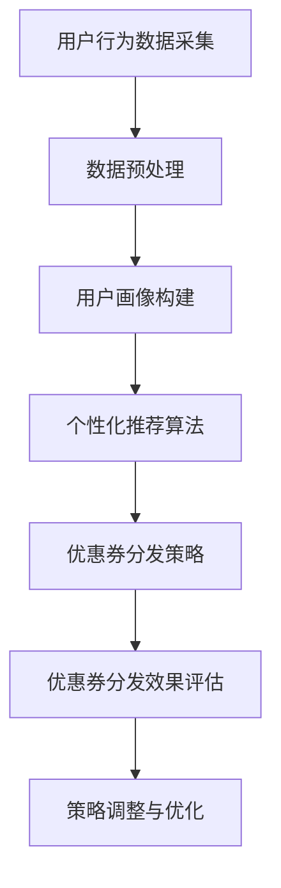

                 

## 第一部分：引言

### 《AI驱动的电商平台个性化优惠券分发策略》

#### 关键词：
- 电商平台
- 个性化优惠券
- AI驱动
- 用户行为分析
- 机器学习算法
- 优惠券分发策略

#### 摘要：

本文旨在探讨基于人工智能技术的电商平台个性化优惠券分发策略。通过对用户行为的深入分析，本文提出了一种AI驱动的优惠券分发框架，详细阐述了用户画像构建、个性化推荐算法和优惠券分发策略的设计与优化方法。通过实际案例，本文展示了该策略在电商平台的应用效果，为电商平台提升用户粘性和销售额提供了有力支持。

### 《AI驱动的电商平台个性化优惠券分发策略》目录大纲

#### 第一部分：引言

1. 第1章：电商平台个性化优惠券的背景与意义
    1.1 电商平台的发展历程
    1.2 个性化优惠券的定义与作用
    1.3 研究目的与研究方法

2. 第2章：个性化优惠券分发的相关理论
    2.1 用户行为分析理论
    2.2 个性化推荐系统理论
    2.3 机器学习算法与模型

3. 第3章：AI驱动的电商平台个性化优惠券分发框架
    3.1 整体框架设计
    3.2 用户画像构建
    3.3 优惠券分发策略设计

#### 第二部分：技术实现

4. 第4章：用户行为数据采集与处理
    4.1 数据源选择与采集
    4.2 数据预处理方法
    4.3 数据质量评估与优化

5. 第5章：用户画像构建方法
    5.1 用户画像的基本概念
    5.2 用户画像构建流程
    5.3 用户画像数据可视化

6. 第6章：个性化推荐算法与模型
    6.1 协同过滤算法
    6.2 内容推荐算法
    6.3 深度学习推荐模型

7. 第7章：优惠券分发策略优化
    7.1 优惠券分发策略设计原则
    7.2 优惠券分发策略优化方法
    7.3 优惠券效果评估与调整

8. 第8章：案例分析与实践
    8.1 案例一：某电商平台的优惠券策略实践
    8.2 案例二：某跨境电商平台的个性化优惠券分发
    8.3 案例总结与启示

#### 第三部分：总结与展望

9. 第9章：研究总结与未来展望
    9.1 研究成果总结
    9.2 存在的问题与挑战
    9.3 未来研究方向

10. 第10章：参考文献

### Mermaid 流程图：用户行为分析流程



### 个性化推荐算法伪代码示例

```python
# 输入：用户行为数据集
# 输出：个性化推荐结果

def personalized_recommendation(user_data):
    # 1. 数据预处理
    processed_data = preprocess_data(user_data)

    # 2. 用户画像构建
    user_profile = build_user_profile(processed_data)

    # 3. 个性化推荐
    recommendations = []
    for item in available_items:
        similarity_score = calculate_similarity(user_profile, item_profile[item])
        recommendations.append((item, similarity_score))
    
    # 4. 排序与返回
    recommendations.sort(key=lambda x: x[1], reverse=True)
    return recommendations[:N]
```

### 数学模型：用户行为概率模型

$$
P(U_i = j) = \frac{f_i(j)}{\sum_{k=1}^{K} f_i(k)}
$$

其中，$U_i$ 表示用户 $i$ 在时间 $t$ 对商品 $j$ 的购买行为，$f_i(j)$ 表示用户 $i$ 在时间 $t$ 对商品 $j$ 的购买频率，$K$ 表示用户 $i$ 在时间 $t$ 购买的商品种类数。

### 案例实战：某电商平台优惠券策略实现

**环境搭建：**

- 数据处理：使用 Python 的 pandas、numpy 库进行数据处理。
- 机器学习：使用 Python 的 scikit-learn、tensorflow 库进行模型训练。
- 可视化：使用 Python 的 matplotlib、seaborn 库进行数据可视化。

**源代码实现：**

```python
# 数据预处理
user_data = preprocess_data(raw_data)

# 用户画像构建
user_profile = build_user_profile(user_data)

# 个性化推荐
recommendations = personalized_recommendation(user_profile)

# 优惠券分发策略
coupon_distribution_strategy = define_coupon_distribution_strategy(recommendations)

# 优惠券分发效果评估
evaluate_coupon_distribution(coupon_distribution_strategy)
```

**代码解读与分析：**

- 数据预处理：对原始用户行为数据进行清洗、去重、填充等操作，得到可用于建模的数据集。
- 用户画像构建：根据用户行为数据，构建用户兴趣画像，用于后续的个性化推荐。
- 个性化推荐：使用协同过滤算法，根据用户兴趣画像和商品信息，生成个性化推荐列表。
- 优惠券分发策略：根据个性化推荐结果，设计优惠券分发策略，例如按推荐商品发放不同类型的优惠券。
- 优惠券分发效果评估：通过评估优惠券的领取率、使用率等指标，对优惠券分发策略进行优化。

### 作者信息

- 作者：AI天才研究院/AI Genius Institute & 禅与计算机程序设计艺术 /Zen And The Art of Computer Programming

接下来的内容将逐步深入探讨电商平台个性化优惠券的分发策略，包括理论背景、技术实现、案例分析等，旨在为电商行业提供有价值的参考。

