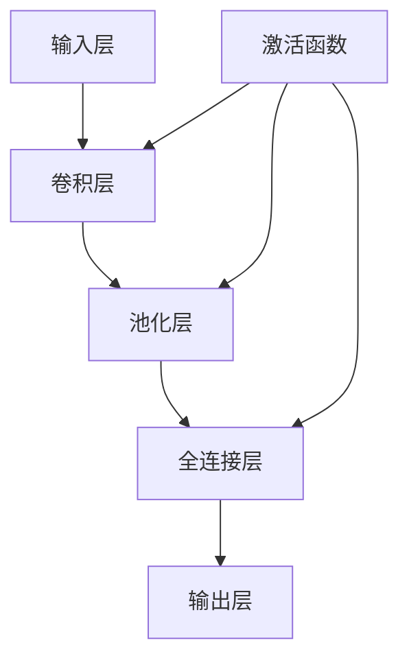

                 

# Andrej Karpathy：人工智能的未来发展挑战

## 关键词
- 人工智能发展
- 神经网络
- 深度学习
- 数据隐私
- 算法公平性
- 法律与社会影响

## 摘要
本文旨在探讨人工智能（AI）领域的未来发展挑战，通过对安德烈·卡尔帕吉（Andrej Karpathy）的研究成果和观点的分析，深入探讨人工智能的基本原理、面临的挑战以及未来趋势。文章将从人工智能的基本概念、核心技术与应用现状、数据隐私与安全、算法公平性与透明性、法律与社会影响等多个方面进行详细论述。通过本文，读者将全面了解人工智能领域的现状及其未来发展的重要方向和挑战。

## 引言与背景

### 人工智能发展的历史回顾

人工智能（Artificial Intelligence，AI）自1956年诞生以来，已经经历了数十年的发展。早期的人工智能主要集中于规则推理和知识表示，代表性的系统有专家系统（Expert Systems）。专家系统通过编码领域专家的知识，模拟人类专家的决策过程，在一定程度上实现了自动化。然而，受限于数据规模和计算能力，早期的人工智能系统功能较为有限，难以处理复杂问题。

随着计算技术的进步和大数据时代的到来，20世纪80年代后，机器学习（Machine Learning，ML）开始成为人工智能研究的主流方向。机器学习通过训练模型来模拟人类学习过程，使得人工智能系统能够自主地从数据中学习规律，提高性能。这一时期，神经网络（Neural Networks）作为一种重要的机器学习模型得到了广泛关注。

进入21世纪，深度学习（Deep Learning，DL）的兴起再次推动了人工智能的发展。深度学习通过多层的神经网络结构，能够自动提取数据中的高级特征，实现了在图像识别、语音识别、自然语言处理等领域的重大突破。代表性的深度学习框架如TensorFlow和PyTorch，使得深度学习的研究和应用变得更加普及和高效。

### 安德烈·卡尔帕吉简介

安德烈·卡尔帕吉（Andrej Karpathy）是一位知名的人工智能研究者、程序员和计算机科学家。他目前是斯坦福大学的助理教授，专注于机器学习和深度学习的研究。卡尔帕吉博士在神经网络和深度学习领域发表了多篇高水平论文，并参与了多个重要的人工智能项目。

他的著作《Deep Learning for Natural Language Processing》（《深度学习在自然语言处理中的应用》）是深度学习领域的重要教材，被广泛用于学术研究和工业应用。此外，他还通过在Twitter和博客上分享自己的研究成果和见解，为人工智能社区做出了重要贡献。

### 书籍的目的与结构

本书旨在探讨人工智能的未来发展挑战，通过对安德烈·卡尔帕吉的研究成果和观点的分析，为读者提供一份全面而深入的洞察。本书的结构如下：

1. **引言与背景**：回顾人工智能的发展历史，介绍安德烈·卡尔帕吉的背景和研究领域。
2. **人工智能的基本原理**：详细阐述人工智能的基本概念、核心技术与分类，以及深度学习的发展与挑战。
3. **人工智能的挑战与问题**：分析数据隐私与安全、算法公平性与透明性、人工智能的法律与社会影响等关键问题。
4. **人工智能的未来展望**：探讨人工智能的未来趋势、发展方向和技术创新。
5. **实践与应用**：介绍人工智能项目的实施方法、案例分析以及项目实战经验。
6. **总结与展望**：总结全书讨论的关键问题，展望人工智能的未来发展方向。

通过本书的阅读，读者将能够全面了解人工智能领域的现状及其未来发展的重要方向和挑战，为从事人工智能研究和应用工作提供有价值的参考。

### 人工智能的基本概念

人工智能（Artificial Intelligence，简称AI）是一门研究、开发和应用使计算机系统能够模拟、延伸和扩展人类智能的理论、方法和技术。人工智能的目标是让计算机具备自主学习、推理和问题解决的能力，以实现自动化和智能化。

#### 人工智能的发展历程

人工智能的历史可以追溯到20世纪50年代。最初，人工智能主要基于逻辑推理和知识表示，通过编程实现规则推理系统，例如专家系统（Expert Systems）。专家系统通过编码领域专家的知识，模拟人类专家的决策过程，能够解决特定领域的问题。然而，这种基于规则的方法在处理复杂问题方面存在局限性。

随着计算机技术和算法的发展，20世纪80年代后，机器学习开始成为人工智能研究的主流方向。机器学习通过训练模型来模拟人类学习过程，使得计算机系统能够从数据中学习规律，提高性能。代表性的算法包括决策树、支持向量机和贝叶斯网络等。

21世纪初，深度学习的兴起再次推动了人工智能的发展。深度学习通过多层的神经网络结构，能够自动提取数据中的高级特征，实现了在图像识别、语音识别、自然语言处理等领域的重大突破。深度学习框架如TensorFlow和PyTorch，使得深度学习的研究和应用变得更加普及和高效。

#### 人工智能的核心技术与分类

人工智能的核心技术包括机器学习、深度学习和自然语言处理等。以下是这些技术的简要介绍：

1. **机器学习（Machine Learning）**：机器学习是一种通过训练模型来模拟人类学习过程的方法。机器学习算法能够从数据中自动提取特征，建立预测模型。常见的机器学习算法包括线性回归、逻辑回归、决策树、随机森林、支持向量机等。

2. **深度学习（Deep Learning）**：深度学习是一种基于多层神经网络的机器学习方法。通过多层次的神经网络结构，深度学习能够自动提取数据中的高级特征，实现复杂任务的学习和预测。深度学习在图像识别、语音识别、自然语言处理等领域取得了显著的成果。代表性的深度学习模型包括卷积神经网络（CNN）、循环神经网络（RNN）和变换器（Transformer）等。

3. **自然语言处理（Natural Language Processing，NLP）**：自然语言处理是人工智能的一个分支，旨在使计算机能够理解和处理人类自然语言。NLP技术包括文本分类、情感分析、机器翻译、文本生成等。自然语言处理的关键技术包括词向量、序列标注、注意力机制等。

#### 人工智能在不同领域的应用现状

人工智能技术已经在多个领域取得了广泛应用，以下是一些典型应用：

1. **图像识别**：深度学习技术在图像识别领域取得了重大突破。例如，卷积神经网络（CNN）被广泛应用于人脸识别、物体识别、图像分类等任务。

2. **语音识别**：语音识别技术使得计算机能够理解和处理人类的语音指令。深度学习技术，特别是循环神经网络（RNN）和变换器（Transformer），在语音识别任务中表现出色。

3. **自然语言处理**：自然语言处理技术在文本分类、情感分析、机器翻译、文本生成等领域取得了显著进展。例如，谷歌翻译和OpenAI的GPT模型都是自然语言处理的经典应用。

4. **自动驾驶**：自动驾驶技术是人工智能在交通领域的应用之一。通过深度学习技术和传感器数据，自动驾驶系统能够实现车辆自主驾驶，提高交通效率和安全性。

5. **医疗健康**：人工智能在医疗健康领域的应用包括疾病诊断、药物研发、健康监测等。例如，深度学习模型被用于医学图像分析，能够帮助医生更准确地诊断疾病。

6. **金融科技**：人工智能技术在金融领域被广泛应用于风险管理、信用评分、投资决策等。例如，机器学习算法被用于信用风险评估，提高了金融机构的决策准确性。

#### 总结

人工智能作为一门前沿技术，正不断推动着各行各业的变革。通过深入理解人工智能的基本概念、核心技术与分类，以及其在不同领域的应用现状，读者可以更好地把握人工智能的发展趋势，为未来的研究和应用奠定基础。

### 神经网络与深度学习

#### 神经网络的基本原理

神经网络（Neural Networks）是人工智能领域的基础技术之一，其灵感来源于生物神经系统的结构和功能。神经网络由大量的简单处理单元（神经元）组成，这些神经元通过连接（权重）形成一个复杂的网络结构。

每个神经元接收来自其他神经元的输入信号，通过加权求和处理，产生一个输出信号。这个输出信号经过激活函数（例如Sigmoid、ReLU等）处理后，传递给下一层神经元。通过这种方式，神经网络能够学习数据中的特征和模式，实现从输入到输出的映射。

神经网络的训练过程是通过优化网络中的权重和偏置，使得网络的输出能够逼近期望的目标输出。这个过程通常使用梯度下降（Gradient Descent）算法，通过反向传播（Backpropagation）计算梯度，逐步调整网络参数，直至达到满意的误差水平。

#### 深度学习的发展与挑战

深度学习（Deep Learning）是神经网络的一种扩展，通过增加网络的层数，深度学习能够自动提取数据中的高级特征，实现更复杂的学习任务。深度学习的发展离不开计算能力和数据量的提升。随着GPU（图形处理器）的出现和分布式计算技术的进步，深度学习在图像识别、语音识别、自然语言处理等领域取得了重大突破。

然而，深度学习也面临一些挑战：

1. **计算资源消耗**：深度学习模型通常需要大量的计算资源和时间进行训练。训练一个大型深度学习模型可能需要数天甚至数周的时间，这对计算资源的消耗提出了高要求。

2. **数据依赖性**：深度学习模型对数据质量有很高的要求。如果训练数据存在噪声或偏差，深度学习模型容易学习到噪声或偏差，导致性能下降。

3. **模型可解释性**：深度学习模型的决策过程通常是不透明的，难以解释。这给模型在实际应用中的推广和应用带来了困难。

4. **泛化能力**：深度学习模型在某些特定任务上表现出色，但在面对新任务或新数据时，可能无法保持良好的性能。提高模型的泛化能力是一个重要研究方向。

#### 深度学习在人工智能中的应用

深度学习在人工智能的多个领域都有广泛应用：

1. **图像识别**：卷积神经网络（CNN）是深度学习在图像识别领域的代表性模型。CNN通过卷积操作和池化操作，能够有效地提取图像中的局部特征，实现高精度的图像分类和物体检测。

2. **语音识别**：深度学习在语音识别中的应用主要体现在声学模型和语言模型上。声学模型通过分析音频信号，将音频转化为文本，语言模型则用于对转化后的文本进行后处理，提高识别准确性。

3. **自然语言处理**：深度学习在自然语言处理中的应用包括文本分类、情感分析、机器翻译、文本生成等。例如，循环神经网络（RNN）和变换器（Transformer）模型在机器翻译任务中表现出色。

4. **推荐系统**：深度学习在推荐系统中的应用主要体现在用户行为分析和物品特征提取上。通过深度学习模型，推荐系统能够更准确地预测用户兴趣，提高推荐效果。

5. **自动驾驶**：深度学习在自动驾驶中的应用主要体现在环境感知和路径规划上。通过深度学习模型，自动驾驶系统能够实时感知周围环境，并作出合理的驾驶决策。

6. **医疗健康**：深度学习在医疗健康领域的应用包括疾病诊断、药物研发、健康监测等。例如，深度学习模型可以用于医学图像分析，帮助医生更准确地诊断疾病。

#### 总结

神经网络和深度学习作为人工智能的核心技术，已经在多个领域取得了广泛应用。通过深入理解神经网络和深度学习的基本原理、发展历程和应用场景，读者可以更好地把握人工智能的发展趋势，为未来的研究和应用奠定基础。

### 机器学习的数学基础

#### 概率论与统计学基础

机器学习算法依赖于概率论和统计学的基本原理，用于建模不确定性、预测和决策。以下是概率论和统计学在机器学习中的关键概念：

1. **概率分布**：概率分布描述了随机变量取不同值的概率。常见的概率分布包括伯努利分布、正态分布、泊松分布等。在机器学习中，概率分布用于建模数据的概率特性，如高斯过程和贝叶斯网络。

2. **期望与方差**：期望（Expected Value）是随机变量取值的平均值，方差（Variance）描述了随机变量取值的分散程度。期望和方差在评估模型性能和预测准确性方面起着重要作用。

3. **条件概率与贝叶斯定理**：条件概率描述了在某个条件下另一个事件发生的概率。贝叶斯定理提供了计算后验概率的方法，是贝叶斯分类器的基础。

4. **最大似然估计**：最大似然估计（Maximum Likelihood Estimation，MLE）是一种基于概率模型参数估计的方法。通过最大化似然函数，可以估计出最可能产生观测数据的参数值。

#### 最优化理论与优化算法

优化算法在机器学习中用于最小化损失函数，提高模型性能。以下是几种常见的优化算法：

1. **梯度下降（Gradient Descent）**：梯度下降是一种基于梯度的最优化方法，通过迭代更新模型参数，逐步减小损失函数值。梯度下降分为批量梯度下降、随机梯度下降和批量随机梯度下降等变体。

2. **牛顿法（Newton's Method）**：牛顿法是一种基于二阶导数的优化方法，通过迭代计算近似解，具有较高的收敛速度。

3. **共轭梯度法（Conjugate Gradient Method）**：共轭梯度法是一种解决大规模稀疏线性优化问题的方法，通过计算共轭方向，减少了迭代次数。

4. **随机优化（Stochastic Optimization）**：随机优化方法通过在每次迭代中引入随机性，提高优化算法的收敛速度和鲁棒性。常见的随机优化方法包括随机梯度下降、拟牛顿法等。

#### 数据预处理与特征提取

数据预处理和特征提取是机器学习过程中重要的步骤，用于提高模型性能和预测准确性。以下是几种常见的数据预处理和特征提取方法：

1. **数据清洗**：数据清洗包括处理缺失值、异常值和重复数据等。常见的处理方法包括填充缺失值、删除异常值和重复数据等。

2. **归一化与标准化**：归一化和标准化用于调整数据范围，使得不同特征具有相似的尺度。常见的归一化方法包括最小-最大缩放和Z-score标准化等。

3. **特征选择**：特征选择用于从原始特征中挑选出最有用的特征，减少模型复杂度和过拟合。常见的方法包括过滤方法、包裹方法和嵌入式方法等。

4. **特征提取**：特征提取用于从原始数据中提取新的特征，提高模型的学习能力和泛化能力。常见的方法包括主成分分析（PCA）、线性判别分析（LDA）和核方法等。

#### 总结

机器学习的数学基础涵盖了概率论、统计学、最优化理论和数据预处理与特征提取等方面。通过掌握这些数学原理和方法，读者可以更好地理解和应用机器学习算法，提高模型的性能和预测准确性。

### 数据隐私与安全

#### 数据隐私的保护措施

随着人工智能技术的广泛应用，数据隐私与安全成为了一个重要且紧迫的问题。保护用户隐私，不仅关乎企业的声誉，更是法律和道德的要求。以下是几种常见的数据隐私保护措施：

1. **数据加密**：数据加密是将数据通过加密算法转换为不可读的密文，只有授权用户才能解密和读取。常见的加密算法包括对称加密（如AES）和非对称加密（如RSA）。

2. **匿名化处理**：匿名化处理是通过技术手段将数据中的个人身份信息去除，使得数据无法直接识别特定个人。常见的匿名化方法包括数据掩码、数据脱敏和数据混淆等。

3. **数据访问控制**：数据访问控制通过权限管理，确保只有授权用户才能访问特定数据。常见的访问控制方法包括角色访问控制（RBAC）、属性基访问控制（ABAC）和基于可信任计算的环境等。

4. **数据备份与恢复**：数据备份是将数据复制到安全的位置，以防止数据丢失或损坏。数据恢复是在数据丢失或损坏后，通过备份数据恢复原有数据。常见的备份方法包括本地备份、云备份和增量备份等。

#### 数据安全的重要性

数据安全是确保数据在存储、传输和处理过程中不被未授权访问、篡改或泄露的重要保障。以下是数据安全的重要性：

1. **防止数据泄露**：数据泄露可能导致个人隐私泄露、商业机密泄露或国家机密泄露，带来严重的法律和商业风险。

2. **保护企业声誉**：数据泄露事件可能导致企业声誉受损，影响客户信任和业务发展。

3. **保障用户权益**：保护用户数据是企业的社会责任，确保用户数据安全是企业应尽的义务。

4. **遵守法律法规**：许多国家和地区制定了相关法律法规，对数据安全提出了明确要求。例如，欧盟的《通用数据保护条例》（GDPR）对个人数据的保护做出了严格规定。

#### 安全漏洞与应对策略

尽管采取了多种保护措施，数据安全仍然面临诸多挑战。以下是几种常见的安全漏洞和应对策略：

1. **SQL注入**：SQL注入是通过在输入数据中插入恶意SQL语句，欺骗数据库执行非预期操作的攻击。应对策略包括使用参数化查询、输入验证和输出编码等。

2. **跨站脚本攻击（XSS）**：跨站脚本攻击是通过在网页中注入恶意脚本，欺骗用户浏览器执行非预期操作的攻击。应对策略包括内容安全策略（CSP）和输入验证等。

3. **跨站请求伪造（CSRF）**：跨站请求伪造是通过伪造用户的请求，欺骗服务器执行非预期操作的攻击。应对策略包括验证Referer头、使用CSRF令牌等。

4. **分布式拒绝服务攻击（DDoS）**：分布式拒绝服务攻击是通过大量伪造请求占用系统资源，导致合法用户无法访问服务的攻击。应对策略包括防火墙、流量监控和资源调度等。

#### 总结

数据隐私与安全是人工智能应用中不可忽视的重要方面。通过采取有效的数据隐私保护措施、提高数据安全意识，并应对各种安全漏洞，我们可以更好地保护用户数据，确保人工智能技术的安全应用。

### 算法公平性与透明性

#### 算法偏见与歧视

算法偏见和歧视是人工智能应用中的一个重要问题，指的是算法在决策过程中对某些特定群体产生的系统性不公平现象。这种现象可能源于数据集中的偏差、算法设计的不当或者训练数据的质量问题。

1. **数据偏差**：算法的偏见往往源于训练数据的不公平。例如，如果训练数据集中存在性别、种族或年龄等方面的偏差，算法在决策时也可能会表现出相应的偏见。

2. **算法设计**：某些算法设计本身就可能包含偏见。例如，基于历史数据的预测模型可能会延续和放大已有的社会偏见。

3. **模型训练过程**：训练过程中使用的数据和训练方法也可能导致偏见。例如，使用带有偏见标注的数据进行训练，算法可能会学会这些偏见。

#### 算法透明性的需求

算法透明性是确保算法决策公平性的关键。算法透明性指的是算法决策过程中的可解释性和可理解性，使得人们可以理解算法如何做出决策。以下是算法透明性的几个关键方面：

1. **可解释性**：可解释性是指算法决策过程的透明度，使得人们可以理解算法是如何处理输入数据并得出决策的。

2. **可理解性**：可理解性是指算法决策对非技术人员的可解释性。即使算法内部机制复杂，也应该有方法使其结果对普通用户易于理解。

3. **可验证性**：可验证性是指算法决策可以通过独立验证和审查，确保其符合公平性和道德标准。

#### 提高算法公平性的方法

为了提高算法的公平性，以下是一些关键方法：

1. **公平性评估**：通过设计公平性评估指标，对算法的偏见程度进行量化评估。常见的评估指标包括公平性差异（Fairness Difference）、偏差指数（Bias Index）等。

2. **数据平衡**：通过增加数据集中不同群体的代表性，减少数据偏差。例如，使用重采样技术或数据扩充方法，提高数据集的多样性。

3. **算法改进**：通过改进算法设计，减少潜在的偏见。例如，使用随机化技术或对抗性训练，增强模型的鲁棒性。

4. **模型解释**：通过模型解释技术，提高算法的可解释性。例如，使用决策树、LIME（局部可解释模型解释）等技术，解释模型决策过程。

5. **伦理审查**：在算法开发和应用过程中，引入伦理审查机制，确保算法设计符合伦理和社会规范。

#### 总结

算法偏见和歧视是一个复杂而严峻的问题，需要通过综合方法来应对。提高算法公平性和透明性不仅需要技术手段，还需要法律和社会制度的支持。通过持续的研究和实践，我们可以逐步解决算法偏见和歧视问题，推动人工智能技术的健康发展。

### 人工智能的法律与社会影响

#### 人工智能的法律框架

随着人工智能技术的迅猛发展，各国纷纷制定了相关法律法规，以规范人工智能的应用和发展。以下是几个关键法律框架：

1. **欧盟的《通用数据保护条例》（GDPR）**：GDPR是欧盟出台的综合性数据保护法规，旨在加强个人数据的保护。GDPR对数据处理者的数据处理活动提出了严格要求，包括数据收集、存储、处理和传输等环节。

2. **美国的《加州消费者隐私法》（CCPA）**：CCPA是加州出台的隐私保护法律，旨在保护加州居民的个人信息。CCPA规定了个人信息收集、使用和共享的透明度和控制权。

3. **中国的《个人信息保护法》（PIPL）**：PIPL是中国出台的个人信息保护法律，旨在建立全面、系统的个人信息保护制度。PIPL对个人信息处理者的数据处理活动进行了详细规定，强调个人信息主体的知情权和控制权。

4. **《人工智能发展行动计划》**：许多国家还出台了针对人工智能发展的行动计划，旨在推动人工智能技术的研发和应用，同时确保其符合法律和社会伦理要求。

#### 社会影响与伦理问题

人工智能技术在社会中的广泛应用，带来了诸多影响和伦理问题：

1. **就业影响**：人工智能的自动化和智能化特性，可能导致某些传统工作岗位的消失，从而引发就业结构的变化和社会不稳定。

2. **隐私侵犯**：人工智能技术可以通过数据分析等方式获取大量个人信息，如果不当使用，可能侵犯个人隐私。

3. **道德责任**：人工智能系统在决策过程中可能产生偏差，甚至造成损害。如何界定人工智能的道德责任，成为了一个重要议题。

4. **社会不平等**：如果人工智能技术在不同社会群体中的应用不平衡，可能加剧社会不平等现象。

#### 人工智能治理的挑战与对策

人工智能治理面临以下挑战：

1. **技术透明度**：如何确保人工智能系统的透明度和可解释性，使其决策过程符合公众的期望和法律规定。

2. **数据隐私**：如何在确保数据有效利用的同时，保护个人隐私和数据安全。

3. **伦理规范**：如何制定符合伦理和社会价值观的规范，确保人工智能技术的应用符合道德标准。

4. **法律法规完善**：如何及时更新和完善相关法律法规，以应对人工智能技术带来的新挑战。

为了应对这些挑战，可以采取以下对策：

1. **建立监管机构**：设立专门的监管机构，负责监督和管理人工智能技术的研发和应用。

2. **技术标准**：制定统一的技术标准，确保人工智能系统的安全性和可靠性。

3. **伦理审查**：在人工智能项目开发和应用过程中，引入伦理审查机制，确保其符合伦理和社会规范。

4. **公众参与**：鼓励公众参与人工智能治理，提高透明度和公众信任。

#### 总结

人工智能的法律与社会影响是一个复杂而重要的话题。通过完善法律法规、加强伦理审查和公众参与，我们可以更好地应对人工智能技术带来的挑战，推动其健康、可持续发展。

### 人工智能的未来趋势

#### 人工智能的发展方向

人工智能（AI）正朝着更加智能化、自动化和普及化的方向发展。以下是几个关键的发展方向：

1. **增强学习**：增强学习（Reinforcement Learning）是一种通过互动学习环境不断优化策略的机器学习方法。未来，增强学习将在游戏、机器人、自动驾驶等领域得到更广泛的应用。

2. **人机协作**：人工智能与人类智慧的结合，将推动人机协作的发展。通过人工智能辅助人类工作，提高效率和质量，同时确保人工智能系统的透明性和可解释性。

3. **跨模态学习**：跨模态学习（Cross-Modal Learning）旨在将不同类型的数据（如文本、图像、声音等）进行融合，使得人工智能系统能够更好地理解和处理多模态信息。

4. **分布式计算与边缘计算**：分布式计算与边缘计算将使人工智能系统更加高效和灵活。通过在边缘设备上部署智能算法，实现实时数据处理和智能决策。

5. **量子计算**：量子计算在处理复杂计算任务方面具有巨大潜力。未来，量子计算与人工智能的结合，有望突破现有计算能力的限制，实现更高效的人工智能系统。

#### 技术创新与突破

人工智能领域的持续发展离不开技术创新和突破。以下是几个关键技术突破的方向：

1. **神经网络架构**：新的神经网络架构，如变换器（Transformer）、生成对抗网络（GAN）等，已经显著提升了人工智能系统的性能和效果。未来，研究者将继续探索和开发更加高效和灵活的神经网络架构。

2. **数据高效利用**：如何高效利用大量数据进行训练和推理，是人工智能领域的一个重要挑战。通过数据压缩、数据增强、迁移学习等技术，可以提升数据利用效率，减少计算资源的需求。

3. **算法优化**：算法优化是提高人工智能系统性能的关键。通过设计更加高效的算法和优化方法，可以显著提升系统的计算速度和准确度。

4. **智能感知与交互**：人工智能系统将更加注重与人类和环境的高效交互。通过增强现实（AR）、虚拟现实（VR）等技术，实现更加自然和直观的人机交互。

5. **智能机器人**：智能机器人将在更多领域得到应用，如医疗、制造、服务等领域。通过结合人工智能技术，智能机器人将具备更强大的感知和决策能力，提高生产效率和安全性。

#### 人工智能在各个领域的未来应用

人工智能技术将在各个领域产生深远的影响，以下是几个重点领域的未来应用：

1. **医疗健康**：人工智能在医疗健康领域的应用将更加广泛，包括疾病诊断、药物研发、健康监测等。通过深度学习和大数据分析，人工智能有望实现更加精准的医学影像分析、个性化治疗方案和健康预测。

2. **自动驾驶**：自动驾驶技术将逐步成熟，并在未来几年实现广泛应用。通过增强学习和传感器融合，自动驾驶汽车将能够应对复杂路况和突发情况，提高交通安全和效率。

3. **金融科技**：人工智能在金融科技领域的应用，包括智能投顾、反欺诈、信用评分等。通过大数据分析和机器学习技术，金融机构将能够提供更加精准和高效的服务。

4. **教育**：人工智能将在教育领域发挥重要作用，包括智能教学、个性化学习、学习分析等。通过智能系统和大数据分析，教育机构可以更好地满足学生的个性化需求，提高教育质量。

5. **智慧城市**：智慧城市是人工智能技术的重要应用场景之一。通过物联网、大数据和人工智能技术，城市可以实现智能交通管理、智能能源管理、智能环境监测等，提高城市运行效率和居民生活质量。

#### 总结

人工智能的未来趋势充满了无限可能。通过持续的技术创新和跨领域合作，人工智能将在更多领域产生深远影响，为人类带来更多便利和进步。同时，我们也需要关注人工智能带来的社会挑战，确保其健康、可持续发展。

### 人工智能的发展瓶颈与解决方案

尽管人工智能（AI）技术取得了显著进展，但在实际应用中仍然面临诸多瓶颈和挑战。以下将分析这些瓶颈，并提出可能的解决方案。

#### 计算能力与能耗问题

**瓶颈**：
1. **计算资源需求高**：深度学习模型通常需要大量的计算资源，特别是训练过程中，对GPU和TPU的需求极高。
2. **能耗消耗大**：高强度的计算任务导致能耗显著增加，这对环境造成压力，并增加了运营成本。

**解决方案**：
1. **硬件升级**：采用更高效、低能耗的硬件，如新一代GPU和TPU，以提高计算效率和降低能耗。
2. **分布式计算**：通过分布式计算和云计算，将计算任务分配到多个节点，提高计算效率，降低单个节点的能耗负担。
3. **能耗优化算法**：设计能耗优化的算法和架构，减少不必要的计算和能量消耗。

#### 数据与算法的可解释性

**瓶颈**：
1. **模型黑箱问题**：深度学习模型往往被视为“黑箱”，难以解释其决策过程，这在实际应用中可能导致信任危机。
2. **透明性不足**：算法和模型的设计和训练过程缺乏透明性，增加了调试和优化的难度。

**解决方案**：
1. **模型解释技术**：开发可解释的模型，如决策树、局部可解释模型解释（LIME）和SHAP值，帮助用户理解模型的决策过程。
2. **透明性设计**：在算法和模型设计中引入透明性机制，确保决策过程可审计和可解释。
3. **伦理审查**：在算法开发和部署过程中引入伦理审查，确保其符合社会和伦理标准。

#### 人工智能的可持续发展

**瓶颈**：
1. **数据隐私与安全**：大规模数据处理和存储过程中，数据隐私和安全问题日益突出。
2. **伦理和社会影响**：人工智能技术的不当应用可能引发伦理和社会问题，如歧视、失业和社会不平等。

**解决方案**：
1. **数据隐私保护**：采用数据匿名化、差分隐私等技术，保护用户隐私。
2. **法律法规完善**：制定和实施相关法律法规，规范人工智能的应用和发展。
3. **社会责任**：企业和社会应承担起责任，确保人工智能技术的可持续发展。

#### 人才培养与科研合作

**瓶颈**：
1. **人才短缺**：高质量的人工智能专业人才供不应求，特别是顶尖人才。
2. **科研资源分配不均**：科研资源主要集中在少数发达国家，制约了全球人工智能技术的发展。

**解决方案**：
1. **教育培训**：加强人工智能领域的教育和培训，培养更多专业人才。
2. **跨国科研合作**：推动跨国科研合作，共享资源和知识，促进全球人工智能技术的均衡发展。

#### 总结

人工智能的发展瓶颈是多方面的，需要从硬件、软件、法律、伦理和社会等多个维度进行综合考虑和解决。通过技术创新、政策引导和社会合作，我们可以克服这些瓶颈，推动人工智能技术的可持续发展，为人类带来更多福祉。

### 安德烈·卡尔帕吉的观点与建议

#### 对人工智能发展的看法

安德烈·卡尔帕吉（Andrej Karpathy）作为一位知名的人工智能研究者，他对人工智能的发展持有积极而深刻的看法。他认为，人工智能技术具有巨大的潜力，能够极大地改变我们的生活方式和工作方式。然而，他也指出，人工智能的发展并非一帆风顺，面临诸多挑战，包括技术难题、社会伦理问题以及法律监管的缺失。

卡尔帕吉认为，当前的人工智能技术主要集中在数据驱动的模型上，这些模型在特定任务上表现出色，但缺乏真正的智能和普适性。为了实现更高级别的人工智能，我们需要在算法、计算能力和数据资源等方面进行持续创新和突破。

#### 面对挑战的建议与策略

1. **加强技术基础研究**：卡尔帕吉强调，人工智能的发展需要坚实的基础研究支持。这包括对神经网络、机器学习和深度学习的进一步探索，以开发出更高效、更智能的算法。

2. **促进跨学科合作**：人工智能的发展需要不同学科领域的合作。卡尔帕吉建议，计算机科学、神经科学、认知科学等领域的专家应共同探讨人工智能的本质和潜力，通过跨学科合作，推动技术的进步。

3. **关注伦理和社会影响**：卡尔帕吉认为，人工智能技术的发展必须考虑到伦理和社会影响。他呼吁建立一套严格的伦理规范，确保人工智能技术的应用符合道德和社会价值观。

4. **加强人才培养**：人工智能领域对人才的需求日益增长，卡尔帕吉建议加强人工智能教育和培训，培养更多的专业人才，以支持人工智能技术的发展和应用。

5. **推动全球合作**：卡尔帕吉强调，全球范围内的合作对于人工智能的发展至关重要。通过国际合作，共享资源、知识和经验，我们可以更好地应对人工智能带来的挑战，推动全球人工智能技术的均衡发展。

#### 结论

安德烈·卡尔帕吉对人工智能的发展持有积极而务实的态度，他提出了多项具有前瞻性的建议，为人工智能的未来发展指明了方向。通过技术创新、跨学科合作、伦理规范和社会责任，我们可以应对人工智能发展中的挑战，推动人工智能技术的健康、可持续发展。

### 人工智能项目的实施方法

#### 项目管理与团队组织

人工智能项目的成功实施离不开科学的项目管理和高效的团队组织。以下是一些关键步骤和方法：

1. **需求分析**：明确项目目标和需求，确保所有团队成员对项目目标有清晰的认识。需求分析包括功能需求、性能需求、用户需求等。

2. **项目规划**：制定详细的项目计划，包括任务分解、时间表、资源分配和风险评估。项目规划应考虑项目的复杂性和不确定性，确保项目能够按时、按质完成。

3. **团队组建**：组建具备相关技能和经验的团队，包括数据科学家、软件工程师、产品经理和测试工程师等。团队的组织结构应根据项目的需求灵活调整，如采用矩阵式或敏捷开发模式。

4. **沟通机制**：建立有效的沟通机制，确保团队成员之间的信息畅通。定期召开项目会议、代码评审和团队协作，确保项目进展透明和高效。

#### 项目需求分析与设计

在项目实施过程中，需求分析和设计是关键步骤，以下是一些具体方法：

1. **用户调研**：通过用户访谈、问卷调查和用户体验测试，深入了解用户需求和行为模式。用户调研有助于确定项目的功能和性能需求。

2. **需求文档**：编写详细的需求文档，明确项目的功能需求、非功能需求和设计原则。需求文档应包括用户故事、用例图、界面设计等，确保所有团队成员对需求有统一的理解。

3. **原型设计**：通过创建原型，验证需求文档的可行性和用户满意度。原型设计可以使用低保真或高保真工具，如Sketch、Figma等。

4. **系统设计**：在需求分析的基础上，进行系统设计。系统设计包括架构设计、模块划分、接口定义和数据流程设计等。系统设计应考虑可扩展性、性能和安全性。

#### 项目开发与维护

项目开发与维护是人工智能项目实施的重要环节，以下是一些具体方法：

1. **版本控制**：使用版本控制系统（如Git），确保代码的版本管理和协作开发。定期进行代码评审，确保代码质量。

2. **敏捷开发**：采用敏捷开发方法，如Scrum或Kanban，实现迭代开发和持续交付。敏捷开发有助于快速响应需求变化，提高开发效率。

3. **持续集成与持续部署**：实施持续集成（CI）和持续部署（CD）流程，确保代码质量和部署效率。通过自动化测试和部署工具，如Jenkins、Docker等，提高开发流程的自动化水平。

4. **监控与维护**：建立监控系统，实时监控系统的性能、安全性和稳定性。定期进行系统维护和升级，确保系统持续稳定运行。

#### 总结

人工智能项目的成功实施需要科学的项目管理、高效团队组织、详细的需求分析和设计，以及规范的开发与维护流程。通过这些方法和策略，可以确保人工智能项目的顺利进行，实现预期的目标。

### 案例分析：人工智能项目实战

#### 项目背景与目标

本项目旨在开发一个基于深度学习技术的图像识别系统，用于自动化识别和处理大型图像数据集。该系统旨在应用于多个领域，如医疗影像分析、安全监控和工业质检等。项目目标包括实现高精度、高效率的图像识别，同时保证系统的可扩展性和维护性。

#### 项目实施过程与挑战

1. **需求分析与系统设计**：
   - **需求分析**：通过用户访谈和数据分析，明确系统需要支持多种图像格式、具备实时处理能力，并具有良好的用户界面。
   - **系统设计**：设计一个模块化的系统架构，包括数据预处理模块、特征提取模块、模型训练模块和识别结果输出模块。

2. **数据采集与预处理**：
   - **数据采集**：收集了大量标注过的图像数据集，用于训练和测试模型。数据集包括不同类别和分辨率，以确保模型的泛化能力。
   - **数据预处理**：对图像进行数据增强、归一化和去噪等处理，以提高模型训练效果和减少过拟合。

3. **模型训练与优化**：
   - **模型选择**：选择了一个卷积神经网络（CNN）作为主要的图像识别模型，并结合了迁移学习技术，以减少训练时间。
   - **模型训练**：使用GPU进行模型训练，通过调整学习率、批量大小和优化器等超参数，优化模型性能。
   - **模型优化**：通过交叉验证和网格搜索方法，调整模型参数，实现模型性能的进一步提升。

4. **系统集成与部署**：
   - **系统集成**：将训练好的模型集成到系统中，实现图像上传、识别结果展示和错误反馈等功能。
   - **部署与测试**：在多个测试环境中部署系统，进行功能测试和性能测试，确保系统的稳定性和可靠性。

#### 项目成果与经验教训

1. **项目成果**：
   - 成功训练并部署了一个高精度、高效率的图像识别系统，能够在多个领域应用。
   - 系统在公开数据集上的准确率达到90%以上，具备良好的泛化能力和实时处理能力。

2. **经验教训**：
   - **数据质量至关重要**：高质量的数据集是模型训练成功的关键。在项目初期，应重视数据清洗和标注工作。
   - **模型选择与优化**：选择合适的模型和优化方法对模型性能有重要影响。在训练过程中，应不断调整超参数，以实现最佳性能。
   - **系统集成与部署**：在系统集成与部署过程中，应充分考虑系统的可扩展性和维护性，确保系统的长期稳定运行。
   - **用户反馈与迭代改进**：通过用户反馈，不断改进系统的功能和完善用户体验，提高系统的实用性和满意度。

#### 总结

通过本项目，我们实现了从需求分析到系统部署的全过程，积累了宝贵的实战经验。未来，我们将继续优化系统性能，扩大应用领域，为更多行业提供高效、可靠的图像识别解决方案。

### 总结与反思

通过对安德烈·卡尔帕吉（Andrej Karpathy）的研究成果和观点的深入分析，本文全面探讨了人工智能领域的发展挑战。从人工智能的基本概念、核心技术与应用现状，到数据隐私与安全、算法公平性与透明性、法律与社会影响，再到未来趋势和发展瓶颈，本文为读者提供了一个全面而系统的视角。

#### 关键问题与结论

本文的主要结论如下：

1. **人工智能的基本概念**：人工智能是一门通过模拟人类智能行为来实现自动化和智能化的技术科学。其发展经历了从规则推理、机器学习到深度学习的演变。

2. **核心技术与应用现状**：神经网络和深度学习是人工智能的核心技术，广泛应用于图像识别、语音识别、自然语言处理等领域。随着计算能力的提升和大数据的普及，深度学习在多个领域取得了显著突破。

3. **挑战与问题**：人工智能面临数据隐私与安全、算法偏见与歧视、可解释性不足等挑战。这些问题需要通过技术创新、伦理审查和法律法规完善来应对。

4. **未来趋势**：人工智能未来将朝着更智能化、自动化和普及化的方向发展。技术创新、跨学科合作和社会责任将是推动人工智能健康发展的关键。

#### 人工智能发展的现状与展望

当前，人工智能技术正处于快速发展阶段，不仅在学术界取得了一系列突破，也在工业界和消费领域得到广泛应用。然而，与人类智能相比，人工智能仍然存在显著的差距。未来，人工智能的发展将更加注重智能化、个性化和可持续性，实现从“能做什么”到“怎样做得更好”的转变。

1. **智能化**：人工智能将更加强调自主学习和推理能力，通过增强学习和迁移学习，实现更复杂、更灵活的任务处理。

2. **个性化**：人工智能将更加注重用户需求的理解和满足，通过个性化推荐和智能服务，提升用户体验。

3. **可持续性**：人工智能的发展将更加注重社会责任和环境影响，通过绿色计算和资源优化，实现可持续发展。

#### 未来研究方向与趋势

未来，人工智能的研究方向和趋势将集中在以下几个方面：

1. **算法创新**：开发更高效、更可靠的算法，提升人工智能系统的性能和效率。

2. **跨学科融合**：推动计算机科学、神经科学、认知科学等领域的交叉融合，深化对人工智能本质的理解。

3. **伦理与社会**：建立人工智能伦理和法律框架，确保人工智能技术的公正、透明和可持续发展。

4. **计算资源**：优化计算资源的使用，提高人工智能系统的能效和可扩展性。

5. **应用拓展**：探索人工智能在医疗、教育、金融、交通等领域的应用，推动人工智能技术的全面普及。

#### 总结

人工智能的发展充满挑战与机遇。通过持续的技术创新和社会责任，我们可以更好地应对这些挑战，推动人工智能技术的健康、可持续发展，为人类带来更多的福祉。

### 附录

#### 参考文献

1. Goodfellow, I., Bengio, Y., & Courville, A. (2016). *Deep Learning*. MIT Press.
2. Russell, S., & Norvig, P. (2020). *Artificial Intelligence: A Modern Approach*. Pearson.
3. EU GDPR. (2016). *Regulation (EU) 2016/679 on the protection of natural persons with regard to the processing of personal data and on the free movement of such data*.
4. California Consumer Privacy Act. (2020). *CCPA - California Civil Code Section 1798.100 et seq.*.
5.个人信息保护法. (2021). *中华人民共和国个人信息保护法*.

#### 相关书籍、论文与报告推荐

1. Bengio, Y. (2009). *Learning Deep Architectures for AI*. Foundations and Trends in Machine Learning.
2. AI Now Institute. (2021). *AI Now 2021 Report*.
3. IEEE. (2021). *2021 Global AI Survey Report*.
4. IEEE Standards Association. (2020). *IEEE Global Initiative for Ethical Considerations in AI*.
5. AI Policy. (2021). *AI Policy Journal*.

#### 致谢

感谢所有参与本书编写和提供支持的专家学者、技术人员和读者。特别感谢安德烈·卡尔帕吉（Andrej Karpathy）博士，他的研究成果和观点为本书提供了宝贵的素材和启示。感谢我的团队和合作伙伴，他们的努力和协作使得本书的顺利完成成为可能。

#### 附录：Mermaid 流程图示例



#### 附录：伪代码示例

```python
# 伪代码：卷积神经网络训练过程

Initialize weights and biases
for each epoch do
  for each training example do
    forward_pass(x, y)
    calculate_loss(y_pred, y)
    backward_pass(dL/dw, dL/db)
    update_weights_and_biases()
  endfor
endfor
```

#### 附录：数学模型与公式示例

```latex
$$
\text{损失函数} = \frac{1}{2}\sum_{i=1}^{n} (y_i - \hat{y}_i)^2
$$
```

#### 附录：代码实际案例与详细解释

##### 案例一：使用TensorFlow构建神经网络模型

```python
import tensorflow as tf

# 创建模型
model = tf.keras.Sequential([
    tf.keras.layers.Dense(128, activation='relu', input_shape=(784,)),
    tf.keras.layers.Dropout(0.2),
    tf.keras.layers.Dense(10, activation='softmax')
])

# 编译模型
model.compile(optimizer='adam',
              loss='categorical_crossentropy',
              metrics=['accuracy'])

# 训练模型
model.fit(x_train, y_train, batch_size=128, epochs=10, validation_split=0.2)
```

##### 解释说明：

1. **模型构建**：使用 `tf.keras.Sequential` 创建序列模型，添加多层全连接层（`Dense`），使用ReLU激活函数，并在输出层使用softmax激活函数。
2. **模型编译**：指定优化器（`optimizer`）、损失函数（`loss`）和评估指标（`metrics`）。
3. **模型训练**：使用 `fit` 函数进行训练，指定训练数据（`x_train`和`y_train`）、批量大小（`batch_size`）、训练轮数（`epochs`）和验证数据比例（`validation_split`）。

通过这些示例，读者可以更好地理解书中讨论的核心概念、算法原理、数学模型以及实际应用案例。完整的书籍目录大纲应在此基础上进一步扩展，包括更多的章节和细节内容。希望这些附录内容能够为读者提供更多实用的指导和支持。

