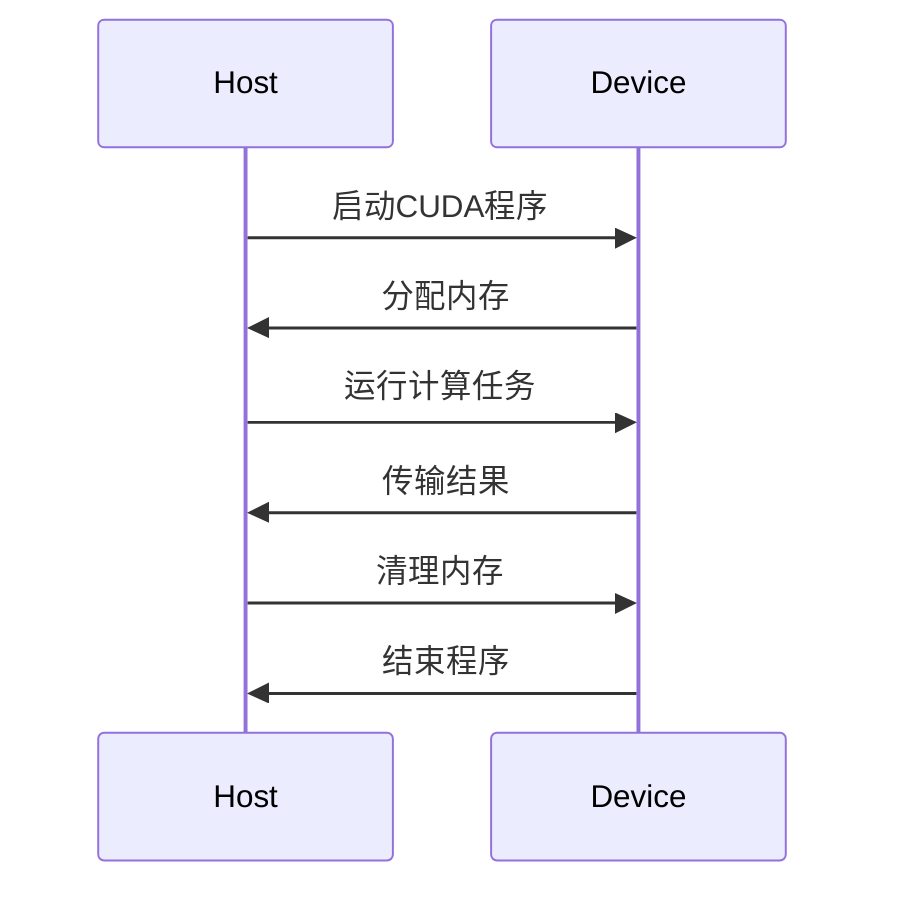

                 

### 《CUDA编程：释放GPU的AI计算潜力》

> **关键词**：CUDA编程、GPU计算、AI计算、深度学习、并行算法

> **摘要**：本文旨在深入探讨CUDA编程及其在AI计算领域的潜力。通过详细介绍CUDA基础、编程环境搭建、内存管理、并行算法设计以及GPU在AI计算中的应用，本文将为读者提供一份全面的CUDA编程指南，帮助开发者在AI领域释放GPU的强大计算能力。

---

### 第一部分：CUDA编程基础

#### 1. CUDA概述

##### 1.1 CUDA简介

CUDA（Compute Unified Device Architecture）是由NVIDIA推出的一种并行计算平台和编程模型，专为利用图形处理单元（GPU）的强大计算能力而设计。CUDA通过引入统一的虚拟内存、线程组织和内存访问模式，使得开发者能够轻松地将通用计算任务迁移到GPU上执行。

##### 1.2 CUDA架构与执行模型

CUDA架构包括两个主要部分：主机（Host）和设备（Device）。主机运行在CPU上，负责管理设备和执行驱动程序。设备则运行在GPU上，负责执行具体的计算任务。CUDA的执行模型基于线程组织，包括线程块（Block）和网格（Grid）的概念。每个线程块包含一组并发执行的线程，而多个线程块组成一个网格。

##### 1.3 CUDA核心特性

CUDA的核心特性包括：

- **多线程并行**：CUDA通过多线程并行执行，使得开发者能够充分利用GPU的并行计算能力。
- **统一内存访问**：CUDA引入了统一内存模型，简化了主机与设备之间的内存访问和管理。
- **硬件加速**：CUDA支持多种硬件加速功能，如SIMD（单指令多数据）操作、共享内存和纹理缓存等。
- **API丰富**：CUDA提供了一套丰富的API，包括内存管理、数据传输和并行运算等，方便开发者进行编程。

#### 2. CUDA编程环境搭建

##### 2.1 安装CUDA Toolkit

要开始CUDA编程，首先需要安装CUDA Toolkit。NVIDIA官方网站提供了详细的安装指南。一般来说，安装过程包括下载安装程序、安装驱动程序和配置开发环境。

##### 2.2 配置开发环境

安装CUDA Toolkit后，需要配置开发环境。常见的开发环境包括Visual Studio、Eclipse和IntelliJ IDEA等。配置过程通常涉及安装相应的CUDA插件和设置CUDA环境变量。

##### 2.3 CUDA版本与兼容性

CUDA Toolkit支持多个版本，不同版本的CUDA具有不同的特性和兼容性。在选择CUDA版本时，需要考虑所使用的GPU型号和开发需求。同时，确保开发环境与CUDA版本兼容，以避免潜在的问题。

#### 3. CUDA编程基础

##### 3.1 CUDA线程组织

CUDA线程组织是CUDA编程的基础。CUDA线程分为线程块和网格。线程块是线程的集合，每个线程块包含多个线程。网格由多个线程块组成，可以看作是一个二维或三维的数组。线程的组织方式对性能有重要影响，合理的线程组织可以提高计算效率。

##### 3.2 内存管理

内存管理是CUDA编程中的重要环节。CUDA内存分为主机内存和设备内存。主机内存用于存储程序代码和数据，设备内存用于存储线程执行时的数据和中间结果。CUDA提供了一套内存分配、释放和拷贝的API，方便开发者进行内存管理。

##### 3.3 数据传输

数据传输是主机与设备之间的重要交互。CUDA提供了多种数据传输方式，包括内存拷贝、内存映射和异步传输等。合理选择数据传输方式可以优化程序性能。

##### 3.4 基本运算与内存访问

CUDA编程涉及大量的基本运算和内存访问。CUDA支持多种基本运算，如加法、乘法和逻辑运算等。内存访问包括主机到设备、设备到主机以及设备内部的数据传输。了解CUDA内存访问模式和优化策略对于编写高效CUDA程序至关重要。

#### 4. CUDA内存层次结构

##### 4.1 CUDA内存类型

CUDA内存类型包括全局内存、共享内存、纹理内存和常量内存等。每种内存类型具有不同的特性，适用于不同的场景。合理选择内存类型可以优化程序性能。

##### 4.2 显存与主机内存交互

显存与主机内存的交互是CUDA编程中的关键环节。CUDA提供了内存拷贝和内存映射等API，方便开发者进行显存与主机内存之间的数据传输。同时，CUDA还支持异步传输，可以提高程序效率。

##### 4.3 显存池管理

显存池管理是CUDA编程中的重要策略。显存池是一块预先分配的显存区域，用于存储程序运行时的数据。合理管理显存池可以优化内存使用，提高程序性能。

#### 5. CUDA核心算法

##### 5.1 并行算法设计

并行算法设计是CUDA编程的核心。CUDA提供了丰富的并行算法设计模式，如分治算法、并行前向传播和反向传播等。合理设计并行算法可以充分发挥GPU的并行计算能力。

##### 5.2 向量与矩阵运算

向量与矩阵运算是计算机科学和人工智能领域的基本运算。CUDA支持向量与矩阵运算的并行化，通过优化内存访问和运算顺序，可以提高运算效率。

##### 5.3 线性代数算法

线性代数算法在AI计算中广泛应用，如矩阵乘法、求逆和特征值计算等。CUDA提供了高效的线性代数算法库，方便开发者进行线性代数运算的并行化。

### 第二部分：GPU加速的AI计算

#### 6. AI与GPU

##### 6.1 AI计算需求与GPU优势

AI计算具有高并行性和大数据量的特点，适合在GPU上进行加速。GPU相比CPU具有更高的并行计算能力和更大的内存带宽，能够满足AI计算的需求。

##### 6.2 GPU加速计算原理

GPU加速计算原理基于并行计算和内存层次结构。GPU通过将计算任务分解为多个线程，并利用线程之间的并发执行，实现计算的高效并行化。同时，GPU的内存层次结构能够优化数据访问，提高计算效率。

##### 6.3 GPU架构对AI计算的影响

GPU架构对AI计算具有重要影响。GPU的并行计算能力、内存带宽和显存容量等特性决定了AI计算的效率和性能。合理利用GPU架构特性，可以充分发挥GPU的加速潜力。

#### 7. 使用CUDA实现深度学习

##### 7.1 CUDA与深度学习框架

CUDA与深度学习框架相结合，可以实现深度学习模型的高效训练和推理。常见的深度学习框架，如TensorFlow、PyTorch和MXNet等，都提供了CUDA支持，方便开发者利用GPU进行深度学习计算。

##### 7.2 CUDA中的卷积神经网络

卷积神经网络（CNN）是深度学习中常用的模型，适合在GPU上进行加速。CUDA提供了高效的CNN实现，通过优化内存访问和运算顺序，可以提高CNN的计算效率。

##### 7.3 深度学习优化算法

深度学习优化算法是提高模型训练效率和性能的重要手段。CUDA提供了多种优化算法，如随机梯度下降（SGD）、Adam和Adadelta等，方便开发者选择合适的优化算法，实现深度学习模型的高效训练。

#### 8. 使用CUDA加速自然语言处理

##### 8.1 NLP与GPU加速

自然语言处理（NLP）是人工智能领域的重要分支，具有高并行性的特点。GPU加速NLP可以显著提高计算效率，加快模型训练和推理速度。

##### 8.2 词嵌入与序列模型

词嵌入和序列模型是NLP中的基本组件，适合在GPU上进行加速。CUDA提供了高效的词嵌入和序列模型实现，通过优化内存访问和运算顺序，可以提高NLP计算效率。

##### 8.3 注意力机制与变换器架构

注意力机制和变换器架构是NLP中的重要技术，适合在GPU上进行加速。CUDA提供了高效的注意力机制和变换器架构实现，通过优化内存访问和运算顺序，可以提高NLP计算效率。

#### 9. CUDA在计算机视觉中的应用

##### 9.1 计算机视觉与GPU

计算机视觉是人工智能领域的核心技术之一，具有高并行性的特点。GPU加速计算机视觉可以显著提高计算效率和性能。

##### 9.2 图像处理与滤波

图像处理和滤波是计算机视觉中的基本操作，适合在GPU上进行加速。CUDA提供了高效的图像处理和滤波实现，通过优化内存访问和运算顺序，可以提高计算机视觉计算效率。

##### 9.3 目标检测与识别

目标检测和识别是计算机视觉中的关键任务，适合在GPU上进行加速。CUDA提供了高效的目标检测和识别实现，通过优化内存访问和运算顺序，可以提高计算机视觉计算效率。

### 第三部分：CUDA编程实战

#### 10. CUDA编程实战案例

##### 10.1 矩阵乘法实现

矩阵乘法是计算机科学和人工智能领域的基本运算，适合在GPU上进行加速。本案例将介绍如何使用CUDA实现矩阵乘法，并分析优化策略。

##### 10.2 卷积神经网络实现

卷积神经网络（CNN）是深度学习中常用的模型，适合在GPU上进行加速。本案例将介绍如何使用CUDA实现CNN，并分析优化策略。

##### 10.3 自然语言处理应用

自然语言处理（NLP）是人工智能领域的重要分支，适合在GPU上进行加速。本案例将介绍如何使用CUDA实现NLP任务，并分析优化策略。

##### 10.4 计算机视觉应用

计算机视觉是人工智能领域的核心技术之一，适合在GPU上进行加速。本案例将介绍如何使用CUDA实现计算机视觉任务，并分析优化策略。

#### 11. CUDA编程性能优化

##### 11.1 性能分析工具

性能分析工具是优化CUDA程序的重要手段。本节将介绍常用的CUDA性能分析工具，如NVIDIA Nsight和Visual Profiler，并介绍如何使用这些工具进行性能分析。

##### 11.2 内存优化策略

内存优化是提高CUDA程序性能的关键。本节将介绍内存优化策略，如共享内存、纹理缓存和内存池管理等，并分析这些策略对性能的影响。

##### 11.3 并行优化技巧

并行优化技巧是提高CUDA程序性能的重要手段。本节将介绍并行优化技巧，如线程组织、内存访问模式和运算顺序等，并分析这些技巧对性能的影响。

##### 11.4 CUDA程序调优案例

本节将通过实际案例，介绍如何对CUDA程序进行调优，并分析调优前后性能的变化。

#### 12. CUDA编程安全与调试

##### 12.1 CUDA编程安全指南

CUDA编程安全是确保程序正确运行的重要保障。本节将介绍CUDA编程安全指南，包括内存安全、线程同步和错误处理等。

##### 12.2 调试工具与方法

调试工具是发现和解决CUDA程序错误的重要手段。本节将介绍常用的CUDA调试工具，如Nsight和CUDA Visual Profiler，并介绍如何使用这些工具进行调试。

##### 12.3 常见错误与解决方案

CUDA编程中常见错误包括内存访问错误、线程同步错误和性能瓶颈等。本节将介绍这些错误的原因和解决方案，并提供实际案例。

### 附录

#### 附录A：CUDA编程资源

##### A.1 CUDA官方文档与资料

NVIDIA官方网站提供了丰富的CUDA官方文档和资料，包括安装指南、编程手册和技术博客等。

##### A.2 CUDA开源项目与社区

CUDA开源项目为开发者提供了丰富的资源，包括CUDA代码示例、框架和工具等。CUDA社区也是开发者交流和学习的平台。

##### A.3 学习与参考书籍

以下是一些关于CUDA编程的学习与参考书籍，适合不同层次的读者：

1. 《CUDA编程精粹》
2. 《深度学习与GPU计算》
3. 《GPU编程艺术》

#### 附录B：Mermaid流程图示例

##### B.1 CUDA程序执行流程



##### B.2 卷积神经网络架构


#### 附录C：数学公式与伪代码

##### C.1 向量与矩阵运算

$$
C = A \times B
$$

```python
# 伪代码：矩阵乘法
for i in range(rows(A)):
    for j in range(columns(B)):
        for k in range(columns(A)):
            C[i][j] += A[i][k] * B[k][j]
```

##### C.2 深度学习优化算法伪代码

```python
# 伪代码：随机梯度下降（SGD）
while not converged:
    for each sample in training_data:
        gradient = compute_gradient(sample)
        update_model_parameters(gradient)
```

##### C.3 自然语言处理数学模型

$$
E_{word} = \sum_{word \in vocabulary} P_{word} \cdot log(P_{word})
$$

```python
# 伪代码：词嵌入
for word in vocabulary:
    embedding = compute_embedding(word)
    loss += log(P[word] * embedding)
```

### 作者信息

**作者：** AI天才研究院 / AI Genius Institute & 禅与计算机程序设计艺术 / Zen And The Art of Computer Programming

---

本文全面介绍了CUDA编程及其在AI计算领域的应用。通过深入探讨CUDA基础、编程环境搭建、内存管理、并行算法设计和GPU在AI计算中的应用，本文为读者提供了一份全面的CUDA编程指南。同时，通过实战案例和性能优化策略，读者可以掌握如何充分利用GPU的强大计算能力，加速AI计算任务。希望本文能够帮助读者在CUDA编程和AI计算领域取得更大的成就。

