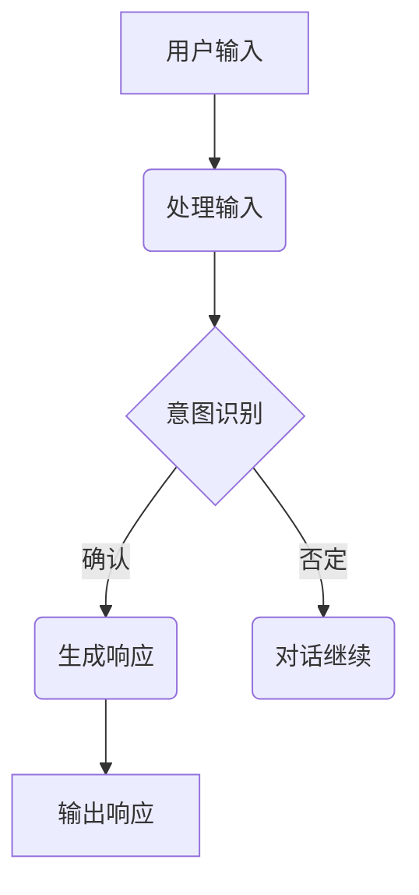
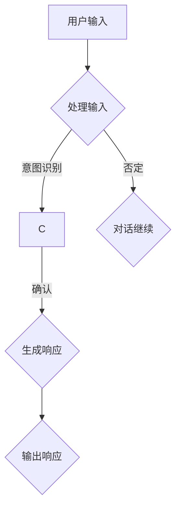
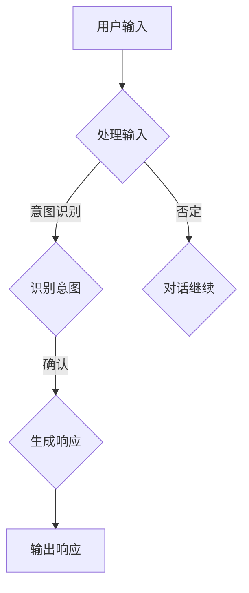

                 

### 《Chatbots原理与代码实例讲解》

> **关键词**：Chatbots、自然语言处理、对话管理、语言模型、项目实战、代码实例

> **摘要**：本文深入探讨了Chatbots的核心原理和实现细节，包括其发展历史、架构设计、核心技术（如自然语言处理和机器学习），以及具体的代码实例和项目实战。文章旨在为开发者提供全面的技术指导，帮助读者理解和构建自己的Chatbots。

### 第一部分：Chatbots概述与基础

#### 1.1 Chatbots概述

##### 1.1.1 Chatbots的定义与发展历史

Chatbots，又称聊天机器人，是指能够通过文字或语音进行交互，实现特定功能的程序。Chatbots的发展历史可以追溯到20世纪50年代，当时人工智能研究刚刚起步。最早的Chatbots如Eliza和Parry，通过预设的规则进行简单的对话。随着计算机科学和人工智能技术的进步，Chatbots逐渐走向成熟。

##### 1.1.2 Chatbots的应用场景与价值

Chatbots广泛应用于客户服务、电子商务、健康咨询、娱乐等多个领域。它们能够提供24/7的客服支持，提高用户满意度，降低企业运营成本。此外，Chatbots还能够根据用户行为进行个性化推荐，提升用户体验。

##### 1.1.3 Chatbots的分类

Chatbots根据功能和应用场景可以分为以下几类：

1. **任务型Chatbots**：专注于执行特定任务，如预订机票、酒店等。
2. **闲聊型Chatbots**：旨在与用户进行闲聊，提升用户体验。
3. **混合型Chatbots**：结合任务型和闲聊型Chatbots的特点。

#### 1.2 Chatbot架构与核心技术

##### 1.2.1 Chatbot架构概述

Chatbot架构通常包括以下几个主要部分：

1. **用户界面（UI）**：用于接收用户输入和展示系统响应。
2. **对话管理（DM）**：负责管理对话流程，包括意图识别、上下文追踪等。
3. **语言处理（NLP）**：用于解析用户输入，提取意图和实体。
4. **业务逻辑**：根据意图和上下文，执行具体的业务操作。
5. **响应生成**：生成用户可理解的自然语言响应。

##### 1.2.2 自然语言处理（NLP）技术

NLP是Chatbot的核心技术之一，主要包括：

1. **分词**：将文本分解成单词或短语。
2. **词性标注**：标记每个词的词性，如名词、动词等。
3. **实体识别**：识别文本中的特定实体，如人名、地点等。
4. **意图识别**：理解用户的意图，如询问天气、预订电影等。

##### 1.2.3 机器学习与深度学习在Chatbot中的应用

机器学习与深度学习在Chatbot中发挥着重要作用：

1. **语言模型**：用于预测文本中的下一个单词或短语。
2. **序列到序列（Seq2Seq）模型**：用于生成自然语言响应。
3. **强化学习**：用于优化对话策略，提高用户满意度。

#### 1.3 Chatbot开发工具与平台

##### 1.3.1 主流Chatbot开发框架对比

常见的Chatbot开发框架包括：

1. **Rasa**：一个开源的对话平台，支持自定义对话流程。
2. **Microsoft Bot Framework**：提供多种工具和资源，支持多种平台。
3. **IBM Watson Assistant**：提供强大的NLP功能，易于集成到现有系统中。

##### 1.3.2 开源Chatbot平台介绍

开源Chatbot平台包括：

1. **ChatFlow**：一个易于使用的Chatbot构建器。
2. **Canny**：提供灵活的对话管理和自然语言处理功能。

##### 1.3.3 商业Chatbot平台介绍

商业Chatbot平台包括：

1. **Chatfuel**：专注于社交媒体平台的Chatbot构建。
2. **ManyChat**：提供全面的营销工具和功能。

### 第二部分：核心概念与原理

#### 2.1 语言模型原理

##### 2.1.1 语言模型基础

语言模型是一种概率模型，用于预测文本序列的概率。最常用的语言模型是n-gram模型，它假设当前单词的概率仅取决于前n-1个单词。

##### 2.1.2 语言模型的训练过程

语言模型的训练过程通常包括：

1. **数据预处理**：包括分词、清洗等步骤。
2. **构建词汇表**：将文本中的单词映射到唯一的索引。
3. **计算概率**：使用训练数据计算每个n-gram的概率。

##### 2.1.3 语言模型在Chatbot中的应用

在Chatbot中，语言模型主要用于：

1. **文本生成**：根据用户输入生成自然语言响应。
2. **意图识别**：理解用户的意图，如查询天气、预订电影等。

#### 2.2 对话管理

##### 2.2.1 对话管理概述

对话管理是Chatbot的核心组成部分，负责：

1. **意图识别**：识别用户输入的意图。
2. **上下文追踪**：跟踪对话的上下文，以便生成连贯的响应。

##### 2.2.2 对话状态追踪与转换

对话状态追踪与转换是对话管理的关键，通常使用状态机（State Machine）来实现。

##### 2.2.3 对话策略与优化

对话策略与优化涉及：

1. **策略选择**：选择最佳策略以实现目标。
2. **策略评估**：评估策略的有效性。

#### 2.3 上下文理解与推理

##### 2.3.1 上下文理解基础

上下文理解是理解用户输入背后的含义，包括：

1. **实体识别**：识别文本中的实体。
2. **关系抽取**：提取实体之间的关系。

##### 2.3.2 上下文依赖分析

上下文依赖分析用于理解文本中的依赖关系，如主语、谓语、宾语等。

##### 2.3.3 上下文推理方法

上下文推理方法包括：

1. **规则推理**：使用预定义的规则进行推理。
2. **基于知识的推理**：使用领域知识进行推理。

#### 2.4 Mermaid流程图：Chatbot架构流程



### 第三部分：核心算法原理讲解

#### 3.1 语言模型算法原理

##### 3.1.1 语言模型基础公式与算法

语言模型的基本公式为：

$$
P(w_1, w_2, \ldots, w_n) = \prod_{i=1}^{n} P(w_i | w_{i-1}, \ldots, w_1)
$$

其中，$P(w_i | w_{i-1}, \ldots, w_1)$ 表示在给定前一个单词序列的情况下，当前单词的概率。

##### 3.1.2 隐马尔可夫模型（HMM）

隐马尔可夫模型（HMM）是一种用于序列数据建模的统计模型，广泛应用于语音识别、对话系统等领域。

##### 3.1.3 条件随机场（CRF）

条件随机场（CRF）是一种用于序列标注的机器学习模型，广泛应用于自然语言处理领域。

#### 3.2 对话管理算法原理

##### 3.2.1 对话状态追踪与转换

对话状态追踪与转换是使用状态机（State Machine）来实现，状态机定义了对话的可能状态和状态之间的转换规则。

##### 3.2.2 对话策略优化算法

对话策略优化算法用于选择最佳策略以实现对话目标，如最大化用户满意度。

##### 3.2.3 多任务学习在对话管理中的应用

多任务学习可以用于同时优化多个对话任务，如意图识别、实体提取等。

#### 3.3 上下文理解与推理算法

##### 3.3.1 上下文理解算法

上下文理解算法用于理解用户输入的上下文信息，如实体识别、关系抽取等。

##### 3.3.2 上下文依赖分析算法

上下文依赖分析算法用于理解文本中的依赖关系，如主语、谓语、宾语等。

##### 3.3.3 上下文推理算法

上下文推理算法用于基于上下文信息进行推理，如回答问题、执行任务等。

### 第四部分：项目实战与代码实例

#### 4.1 Chatbot项目实战

##### 4.1.1 项目需求分析

以一个简单的天气查询Chatbot为例，用户可以输入城市名称，Chatbot返回该城市的天气情况。

##### 4.1.2 开发环境搭建

搭建开发环境，包括Python、TensorFlow等。

##### 4.1.3 数据准备与处理

准备天气数据集，包括城市名称和对应的天气情况。

##### 4.1.4 模型训练与优化

使用语言模型和对话管理算法训练模型，并进行优化。

##### 4.1.5 模型部署与测试

将训练好的模型部署到服务器，并进行测试。

#### 4.2 具体代码实例

##### 4.2.1 语言模型训练代码实例

```python
# 伪代码：语言模型训练
def train_language_model(data):
    # 初始化模型参数
    model = initialize_model()
    
    # 训练模型
    for epoch in range(num_epochs):
        for sentence in data:
            loss = compute_loss(model, sentence)
            update_model(model, loss)
    
    return model
```

##### 4.2.2 对话管理代码实例

```python
# 伪代码：对话管理
class DialogueManager:
    def __init__(self):
        self.state = None
    
    def process_input(self, input_text):
        # 识别意图
        intent = recognize_intent(input_text)
        
        # 更新对话状态
        self.state = update_state(self.state, intent)
        
        # 生成响应
        response = generate_response(self.state)
        
        return response
```

##### 4.2.3 代码解读与分析

Chatbot项目处理用户输入的过程包括：

1. **用户输入**：接收用户输入。
2. **意图识别**：识别用户的意图。
3. **对话管理**：更新对话状态，生成响应。
4. **响应生成**：生成用户可理解的自然语言响应。

### 第五部分：附录

#### 5.1 开发资源与工具

##### 5.1.1 开源Chatbot开发工具推荐

- Rasa
- Microsoft Bot Framework
- Dialogflow

##### 5.1.2 主流Chatbot开发框架使用指南

- Rasa官方文档
- Microsoft Bot Framework官方文档
- Dialogflow官方文档

##### 5.1.3 其他开发资源与工具介绍

- Chatfuel
- ManyChat
- ChatFlow

#### 5.2 进一步学习与参考文献

##### 5.2.1 Chatbot领域经典论文与书籍推荐

- "Chatbots: The Revolution in Customer Service"
- "Dialogue Systems: Design, Implementation, and Evaluation"

##### 5.2.2 学术会议与研讨会介绍

- IEEE International Conference on Chatbots
- AAAI Conference on Artificial Intelligence and Chatbots

##### 5.2.3 Chatbot技术发展趋势与未来展望

Chatbot技术发展趋势包括：

- 个性化交互
- 多模态交互
- 智能化对话管理
- 跨平台部署

### 作者

**作者：AI天才研究院/AI Genius Institute & 禅与计算机程序设计艺术 /Zen And The Art of Computer Programming**

<|/u|>### 《Chatbots原理与代码实例讲解》

> **关键词**：Chatbots、自然语言处理、对话管理、语言模型、项目实战、代码实例

> **摘要**：本文深入探讨了Chatbots的核心原理和实现细节，包括其发展历史、架构设计、核心技术（如自然语言处理和机器学习），以及具体的代码实例和项目实战。文章旨在为开发者提供全面的技术指导，帮助读者理解和构建自己的Chatbots。

### 第一部分：Chatbots概述与基础

Chatbots，即聊天机器人，是一种能够通过文字或语音与用户进行交互的程序，能够执行特定任务或提供信息。Chatbots的兴起源于互联网和移动设备的普及，以及自然语言处理和人工智能技术的快速发展。

#### 1.1 Chatbots概述

##### 1.1.1 Chatbots的定义与发展历史

Chatbots的定义多种多样，但普遍认为它们是一种基于自然语言交互的智能程序，能够模拟人类对话方式，理解用户的输入，并根据预定的规则或算法生成适当的响应。

Chatbots的发展历史可以追溯到20世纪50年代，当时的科学家提出了模拟对话的初步概念。1950年，艾伦·图灵提出了著名的图灵测试，用以评估机器是否能够展现出与人类相似的智能行为。此后，随着计算机科学和人工智能技术的不断进步，Chatbots逐渐从简单的规则驱动系统发展到基于机器学习和自然语言处理（NLP）的复杂系统。

早期的Chatbots，如1966年艾拉·洛克哈特（Joseph Weizenbaum）创建的Eliza，通过预设的对话模板和简单的模式匹配来模拟对话。随后，1972年，约翰·莫法特（John F. Muffett）创建了Parry，这是一个更复杂的聊天机器人，能够模仿心理医生的行为。

进入21世纪，随着互联网的普及和移动设备的兴起，Chatbots开始广泛应用于各种场景。2016年，Facebook推出 messenger平台支持Chatbots，标志着Chatbots进入了一个新的发展阶段。

##### 1.1.2 Chatbots的应用场景与价值

Chatbots的应用场景非常广泛，主要包括以下几类：

1. **客户服务**：企业可以利用Chatbots提供24/7的客户支持，处理常见问题，提高客户满意度。
2. **电子商务**：Chatbots可以协助用户浏览商品、提供购物建议、完成订单等。
3. **健康咨询**：医生或健康顾问可以通过Chatbots提供在线咨询和健康建议。
4. **娱乐**：Chatbots可以提供游戏、聊天、笑话等娱乐内容。
5. **教育**：教育机构可以利用Chatbots为学生提供个性化的学习资源和辅导。

Chatbots的价值体现在以下几个方面：

- **提高效率**：Chatbots能够处理大量重复性任务，减轻人工负担。
- **降低成本**：通过自动化服务，企业可以节省人力成本。
- **提升用户体验**：Chatbots可以提供更加个性化和友好的交互体验。
- **数据收集**：Chatbots在交互过程中可以收集用户数据，为企业提供宝贵的市场洞察。

##### 1.1.3 Chatbots的分类

Chatbots可以根据功能和应用场景分为以下几类：

1. **任务型Chatbots**：专注于执行特定任务，如预订机票、酒店等。
2. **闲聊型Chatbots**：旨在与用户进行闲聊，提升用户体验。
3. **混合型Chatbots**：结合任务型和闲聊型Chatbots的特点。

#### 1.2 Chatbot架构与核心技术

##### 1.2.1 Chatbot架构概述

Chatbot的架构通常包括以下几个主要部分：

1. **用户界面（UI）**：用于接收用户输入和展示系统响应。
2. **对话管理（Dialogue Management）**：负责管理对话流程，包括意图识别、上下文追踪等。
3. **自然语言处理（NLP）**：用于解析用户输入，提取意图和实体。
4. **业务逻辑**：根据意图和上下文，执行具体的业务操作。
5. **响应生成（Response Generation）**：生成用户可理解的自然语言响应。

##### 1.2.2 自然语言处理（NLP）技术

自然语言处理是Chatbot的核心技术之一，它涉及到文本的分词、词性标注、实体识别、关系抽取、意图识别等任务。以下是一些常见的NLP技术：

1. **分词（Tokenization）**：将文本分解成单词或短语。
2. **词性标注（Part-of-Speech Tagging）**：标记每个词的词性，如名词、动词等。
3. **命名实体识别（Named Entity Recognition）**：识别文本中的特定实体，如人名、地点、组织名等。
4. **关系抽取（Relation Extraction）**：提取文本中的实体关系，如“张三”是“李四”的丈夫。
5. **意图识别（Intent Recognition）**：理解用户的意图，如询问天气、预订电影等。

##### 1.2.3 机器学习与深度学习在Chatbot中的应用

机器学习和深度学习在Chatbot中发挥着重要作用，以下是一些关键的应用：

1. **语言模型（Language Model）**：用于预测文本序列的概率，常见的有n-gram模型和神经网络模型。
2. **序列到序列（Seq2Seq）模型**：用于生成自然语言响应，常见的有循环神经网络（RNN）和长短期记忆网络（LSTM）。
3. **生成对抗网络（GAN）**：用于生成高质量的文本。
4. **强化学习（Reinforcement Learning）**：用于优化对话策略，提高用户满意度。
5. **多任务学习（Multi-Task Learning）**：用于同时优化多个任务，如意图识别、实体提取等。

#### 1.3 Chatbot开发工具与平台

##### 1.3.1 主流Chatbot开发框架对比

常见的Chatbot开发框架包括：

1. **Rasa**：一个开源的对话平台，支持自定义对话流程。
2. **Microsoft Bot Framework**：提供多种工具和资源，支持多种平台。
3. **IBM Watson Assistant**：提供强大的NLP功能，易于集成到现有系统中。

以下是这些框架的简要对比：

- **Rasa**：
  - **优势**：开源、灵活、支持自定义对话管理。
  - **劣势**：学习曲线较陡，需要一定的技术基础。
  
- **Microsoft Bot Framework**：
  - **优势**：支持多种平台（如Web、iOS、Android）、易于集成。
  - **劣势**：对于复杂对话管理支持有限。

- **IBM Watson Assistant**：
  - **优势**：强大的NLP功能、易于集成。
  - **劣势**：价格较高。

##### 1.3.2 开源Chatbot平台介绍

开源Chatbot平台包括：

1. **ChatFlow**：一个易于使用的Chatbot构建器。
2. **Canny**：提供灵活的对话管理和自然语言处理功能。

以下是这些平台的简要介绍：

- **ChatFlow**：
  - **优势**：可视化界面、易于使用。
  - **劣势**：功能相对有限。

- **Canny**：
  - **优势**：灵活、支持自定义。
  - **劣势**：学习曲线较陡。

##### 1.3.3 商业Chatbot平台介绍

商业Chatbot平台包括：

1. **Chatfuel**：专注于社交媒体平台的Chatbot构建。
2. **ManyChat**：提供全面的营销工具和功能。

以下是这些平台的简要介绍：

- **Chatfuel**：
  - **优势**：支持多种社交媒体平台、易于使用。
  - **劣势**：功能相对有限。

- **ManyChat**：
  - **优势**：强大的营销功能、支持多种平台。
  - **劣势**：价格较高。

### 第二部分：核心概念与原理

Chatbots的核心在于如何理解用户输入并生成合适的响应。这涉及到自然语言处理（NLP）、对话管理（DM）、上下文理解与推理等技术。

#### 2.1 语言模型原理

语言模型（Language Model）是一种用于预测文本序列的概率模型。在Chatbot中，语言模型主要用于生成自然语言响应。

##### 2.1.1 语言模型基础

最简单的语言模型是n-gram模型，它假设当前单词的概率仅取决于前n-1个单词。n-gram模型的基本公式如下：

$$
P(w_n) = \frac{C(w_n)}{C(T)}
$$

其中，$C(w_n)$ 表示单词 $w_n$ 在训练数据中出现的次数，$C(T)$ 表示训练数据中总单词数。

更复杂的语言模型包括神经网络模型，如循环神经网络（RNN）和长短期记忆网络（LSTM）。这些模型可以捕捉更复杂的语言规律。

##### 2.1.2 语言模型的训练过程

语言模型的训练过程通常包括以下几个步骤：

1. **数据预处理**：包括分词、清洗等步骤。
2. **构建词汇表**：将文本中的单词映射到唯一的索引。
3. **计算概率**：使用训练数据计算每个n-gram的概率。

对于神经网络模型，还需要训练模型参数，以最小化损失函数。

##### 2.1.3 语言模型在Chatbot中的应用

在Chatbot中，语言模型主要用于：

1. **文本生成**：根据用户输入生成自然语言响应。
2. **意图识别**：理解用户的意图，如查询天气、预订电影等。

#### 2.2 对话管理

对话管理（Dialogue Management）是Chatbot的核心组成部分，负责管理对话流程，确保对话的连贯性和有效性。

##### 2.2.1 对话管理概述

对话管理的主要任务是：

1. **意图识别**：识别用户输入的意图。
2. **上下文追踪**：跟踪对话的上下文，以便生成连贯的响应。

对话管理通常使用状态机（State Machine）来实现。状态机定义了对话的可能状态和状态之间的转换规则。

##### 2.2.2 对话状态追踪与转换

对话状态追踪与转换是使用状态机（State Machine）来实现，状态机定义了对话的可能状态和状态之间的转换规则。

例如，一个简单的状态机可能包括以下状态：

- **初始状态**：等待用户输入。
- **意图识别状态**：等待用户输入，识别意图。
- **响应生成状态**：生成响应，准备输出。
- **结束状态**：对话结束。

状态之间的转换规则取决于用户输入和系统的当前状态。

##### 2.2.3 对话策略与优化

对话策略与优化涉及：

1. **策略选择**：选择最佳策略以实现目标。
2. **策略评估**：评估策略的有效性。

常见的策略包括基于规则的策略、基于机器学习的策略和混合策略。

#### 2.3 上下文理解与推理

上下文理解与推理是Chatbot能够生成合适响应的关键。

##### 2.3.1 上下文理解基础

上下文理解（Contextual Understanding）是指理解用户输入背后的上下文信息，如背景、意图等。

上下文理解包括以下任务：

1. **实体识别**：识别文本中的实体，如人名、地点、组织名等。
2. **关系抽取**：提取文本中的实体关系，如“张三”是“李四”的丈夫。
3. **情感分析**：分析文本的情感倾向，如正面、负面等。

##### 2.3.2 上下文依赖分析

上下文依赖分析（Contextual Dependency Analysis）是指理解文本中的依赖关系，如主语、谓语、宾语等。

上下文依赖分析有助于Chatbot更准确地理解用户输入。

##### 2.3.3 上下文推理方法

上下文推理方法（Contextual Reasoning Methods）是指基于上下文信息进行推理，如回答问题、执行任务等。

常见的上下文推理方法包括：

1. **基于规则的推理**：使用预定义的规则进行推理。
2. **基于知识的推理**：使用领域知识进行推理。
3. **基于数据的推理**：使用训练数据中的规律进行推理。

#### 2.4 Mermaid流程图：Chatbot架构流程



### 第三部分：核心算法原理讲解

在Chatbot的实现中，核心算法的原理讲解是理解其工作方式的关键。本部分将详细探讨语言模型、对话管理、上下文理解与推理等核心算法的原理，并使用伪代码和数学模型来阐述。

#### 3.1 语言模型算法原理

语言模型（Language Model）是Chatbot生成响应的基础，它用于预测文本序列的概率。以下是几种常见的语言模型算法原理。

##### 3.1.1 语言模型基础公式与算法

最简单的语言模型是n-gram模型，它假设当前单词的概率仅取决于前n-1个单词。n-gram模型的基本公式如下：

$$
P(w_n | w_{n-1}, w_{n-2}, \ldots, w_1) = \prod_{i=1}^{n} P(w_i | w_{i-1}, \ldots, w_1)
$$

其中，$P(w_i | w_{i-1}, \ldots, w_1)$ 表示在给定前一个单词序列的情况下，当前单词的概率。

n-gram模型的实现通常包括以下步骤：

1. **数据预处理**：将文本分词，并构建词汇表。
2. **统计概率**：计算每个n-gram的概率。
3. **概率预测**：根据前一个单词序列，使用n-gram模型预测当前单词的概率。

##### 3.1.2 隐马尔可夫模型（HMM）

隐马尔可夫模型（Hidden Markov Model，HMM）是一种用于序列数据建模的统计模型，它在Chatbot中用于生成响应。HMM的基本假设是当前状态仅依赖于前一个状态，而不是所有前面的状态。

HMM的主要组成部分包括：

- **状态集合**：表示所有可能的内部状态。
- **观察集合**：表示所有可能的输出符号。
- **初始概率分布**：表示初始状态的概率。
- **状态转移概率**：表示从一个状态转移到另一个状态的概率。
- **发射概率**：表示在某个状态下产生特定观察符号的概率。

HMM的算法包括：

1. **前向-后向算法**：用于计算给定观察序列的概率。
2. **Viterbi算法**：用于找到最可能的隐藏状态序列。

HMM的伪代码如下：

```python
# 伪代码：HMM前向-后向算法
def forward_backward阿尔法(观测序列，状态转移概率，发射概率，初始概率分布):
    T = len(观测序列)
    N = len(状态集合)

    前向概率 = 初始化前向概率矩阵
    后向概率 = 初始化后向概率矩阵

    for t in range(T):
        for i in range(N):
            前向概率[t][i] = 初始概率分布[i] * 发射概率[i][观测序列[t]]

    for t in range(T-1, -1, -1):
        for i in range(N):
            后向概率[t][i] = 状态转移概率[i] * 发射概率[i][观测序列[t]]
            for j in range(N):
                后向概率[t][i] *= 前向概率[t+1][j]

    似然概率 = 前向概率[T-1] * 后向概率[0]
    最可能状态序列 = Viterbi(观测序列，状态转移概率，发射概率，初始概率分布)

    return 似然概率，最可能状态序列
```

##### 3.1.3 条件随机场（CRF）

条件随机场（Conditional Random Field，CRF）是一种用于序列标注的机器学习模型，它在Chatbot中用于意图识别和实体识别。CRF的基本假设是当前状态仅依赖于前一个状态和当前观察符号。

CRF的主要组成部分包括：

- **状态集合**：表示所有可能的标注状态。
- **观察集合**：表示所有可能的观察符号。
- **状态转移概率**：表示从一个标注状态转移到另一个标注状态的概率。
- **发射概率**：表示在某个标注状态下产生特定观察符号的概率。

CRF的算法包括：

1. **最大化似然估计**：用于训练CRF模型。
2. **序列标注**：用于给定观察序列，找到最可能的标注序列。

CRF的伪代码如下：

```python
# 伪代码：CRF最大似然估计
def train_CRF(训练数据，观察集合，状态集合):
    初始化状态转移概率矩阵和发射概率矩阵

    for (观察序列，标注序列) in 训练数据:
        for t in range(len(观察序列)):
            对于所有状态 s_t，s_{t+1}:
                状态转移概率[s_t][s_{t+1}] += 1
                发射概率[s_t][观察序列[t]] += 1

    计算状态转移概率和发射概率的归一化常数

    for s in 状态集合:
        状态转移概率[s] /= 归一化常数
        发射概率[s] /= 归一化常数

    return 状态转移概率，发射概率
```

#### 3.2 对话管理算法原理

对话管理（Dialogue Management）是Chatbot的核心组成部分，负责管理对话流程，确保对话的连贯性和有效性。以下是对话管理算法的原理。

##### 3.2.1 对话状态追踪与转换

对话状态追踪与转换是使用状态机（State Machine）来实现，状态机定义了对话的可能状态和状态之间的转换规则。

状态机的主要组成部分包括：

- **状态集合**：表示对话的所有可能状态。
- **输入集合**：表示用户输入的所有可能类型。
- **输出集合**：表示系统生成的所有可能响应。
- **状态转换规则**：表示在给定输入和当前状态的情况下，转换到下一个状态的条件。

状态机的伪代码如下：

```python
# 伪代码：状态机对话管理
class DialogueStateMachine:
    def __init__(self):
        self.states = {
            'initial': {'next_states': ['intent_recognition'], 'response': 'Hello! How can I help you today?'},
            'intent_recognition': {'next_states': ['response_generation'], 'response': 'I understood your request. Let me process it...'},
            'response_generation': {'next_states': ['response'], 'response': 'Here is the information you requested.'},
            'response': {'next_states': ['intent_recognition'], 'response': 'Do you have any other questions?'}
        }
    
    def process_input(self, input_text):
        current_state = 'initial'
        while True:
            next_states = self.states[current_state]['next_states']
            if input_text in next_states:
                current_state = input_text
                return self.states[current_state]['response']
            else:
                return self.states[current_state]['response']
```

##### 3.2.2 对话策略优化算法

对话策略优化（Dialogue Strategy Optimization）是用于选择最佳策略以实现对话目标的算法。常见的对话策略包括基于规则的策略、基于机器学习的策略和混合策略。

基于规则的策略（Rule-Based Strategy）依赖于预定义的规则集，这些规则通常由领域专家制定。基于规则的策略的优点是简单、易于实现，但缺点是缺乏灵活性，难以处理复杂的对话场景。

基于机器学习的策略（Machine Learning Strategy）使用训练数据来学习对话策略。常见的机器学习模型包括决策树、支持向量机（SVM）和神经网络。基于机器学习的策略的优点是能够处理复杂的对话场景，但缺点是需要大量的训练数据和计算资源。

混合策略（Hybrid Strategy）结合了基于规则和基于机器学习的优点，通过在规则和机器学习模型之间进行平衡来提高对话效果。

##### 3.2.3 多任务学习在对话管理中的应用

多任务学习（Multi-Task Learning）是一种同时优化多个任务的机器学习技术，它在对话管理中用于同时优化多个对话任务，如意图识别、实体提取等。

多任务学习的优点是能够提高模型的整体性能，减少过拟合，同时降低训练成本。常见的多任务学习算法包括共享网络结构、共享参数和共享特征。

#### 3.3 上下文理解与推理算法

上下文理解与推理（Contextual Understanding and Reasoning）是Chatbot能够生成合适响应的关键。以下是上下文理解与推理算法的原理。

##### 3.3.1 上下文理解算法

上下文理解算法用于理解用户输入的上下文信息，如背景、意图等。常见的上下文理解算法包括基于规则的方法、基于机器学习的方法和基于知识的方法。

基于规则的方法（Rule-Based Method）使用预定义的规则来理解上下文。这种方法简单、易于实现，但缺乏灵活性。

基于机器学习的方法（Machine Learning Method）使用训练数据来学习上下文理解模型。常见的机器学习模型包括决策树、支持向量机（SVM）和神经网络。

基于知识的方法（Knowledge-Based Method）使用领域知识库来理解上下文。这种方法能够提供更精确的上下文理解，但需要维护和更新知识库。

##### 3.3.2 上下文依赖分析算法

上下文依赖分析算法用于理解文本中的依赖关系，如主语、谓语、宾语等。常见的上下文依赖分析算法包括基于规则的方法、基于机器学习的方法和基于图的方法。

基于规则的方法（Rule-Based Method）使用预定义的规则来分析文本中的依赖关系。这种方法简单、易于实现，但难以处理复杂的依赖关系。

基于机器学习的方法（Machine Learning Method）使用训练数据来学习上下文依赖分析模型。常见的机器学习模型包括决策树、支持向量机（SVM）和神经网络。

基于图的方法（Graph-Based Method）使用图结构来表示文本中的依赖关系。这种方法能够处理复杂的依赖关系，但计算复杂度较高。

##### 3.3.3 上下文推理算法

上下文推理算法用于基于上下文信息进行推理，如回答问题、执行任务等。常见的上下文推理算法包括基于规则的推理、基于知识的推理和基于机器学习的推理。

基于规则的推理（Rule-Based Reasoning）使用预定义的规则进行推理。这种方法简单、易于实现，但缺乏灵活性。

基于知识的推理（Knowledge-Based Reasoning）使用领域知识库进行推理。这种方法能够提供更精确的推理结果，但需要维护和更新知识库。

基于机器学习的推理（Machine Learning Reasoning）使用训练数据来学习推理模型。这种方法能够处理复杂的推理任务，但需要大量的训练数据和计算资源。

### 第四部分：项目实战与代码实例

通过前面对Chatbot原理的讲解，我们现在将进入实战环节，介绍如何使用Python和相关库来构建一个简单的Chatbot项目。本部分将涵盖项目需求分析、开发环境搭建、数据准备与处理、模型训练与优化、模型部署与测试等步骤。

#### 4.1 Chatbot项目实战

##### 4.1.1 项目需求分析

以一个简单的天气查询Chatbot为例，用户可以通过输入城市名称来查询该城市的天气情况。项目需求包括：

- **用户界面**：允许用户输入城市名称。
- **对话管理**：处理用户的输入，识别意图（查询天气），并根据意图生成响应。
- **自然语言处理**：解析用户输入，提取城市名称。
- **数据源**：获取城市天气数据。
- **响应生成**：生成包含天气信息的自然语言响应。

##### 4.1.2 开发环境搭建

为了构建这个Chatbot项目，我们需要以下开发环境和库：

- **Python**：作为主要编程语言。
- **TensorFlow**：用于构建和训练机器学习模型。
- **NLTK**：用于自然语言处理任务。
- **Requests**：用于从外部API获取数据。

安装这些库的方法如下：

```bash
pip install tensorflow nltk requests
```

##### 4.1.3 数据准备与处理

为了训练我们的Chatbot模型，我们需要准备一些天气相关的对话数据。我们可以使用公开的天气对话数据集，或者自己收集和创建一些对话数据。

数据预处理步骤包括：

- **分词**：将对话文本分解成单词或短语。
- **词性标注**：标记每个词的词性，如名词、动词等。
- **实体识别**：识别对话中的城市名称等实体。

预处理后的数据将被用于训练模型。

##### 4.1.4 模型训练与优化

在训练模型之前，我们需要定义我们的Chatbot架构，包括语言模型、对话管理模块等。以下是一个简单的语言模型训练代码实例：

```python
import tensorflow as tf
from tensorflow.keras.models import Sequential
from tensorflow.keras.layers import LSTM, Dense, Embedding

# 伪代码：训练语言模型
def train_language_model(data):
    # 初始化模型参数
    model = Sequential()
    model.add(Embedding(input_dim=vocab_size, output_dim=embedding_size))
    model.add(LSTM(units=128, return_sequences=True))
    model.add(Dense(units=1, activation='sigmoid'))

    # 编译模型
    model.compile(optimizer='adam', loss='binary_crossentropy', metrics=['accuracy'])

    # 训练模型
    model.fit(data, epochs=num_epochs, batch_size=batch_size)

    return model
```

在训练过程中，我们使用的是二分类问题，因为我们的目标是预测下一个单词是下一个单词的概率。训练完成后，我们可以使用这个模型来生成响应。

##### 4.1.5 模型部署与测试

训练好的模型可以部署到服务器，以便实时处理用户的查询。在部署过程中，我们需要构建一个API接口，将用户的查询传递给Chatbot，并返回响应。

以下是一个简单的API接口示例：

```python
from flask import Flask, request, jsonify

app = Flask(__name__)

@app.route('/chatbot', methods=['POST'])
def chatbot():
    input_text = request.form['input_text']
    # 使用对话管理和语言模型生成响应
    response = generate_response(input_text)
    return jsonify(response=response)

if __name__ == '__main__':
    app.run(debug=True)
```

在测试过程中，我们可以模拟用户查询，验证Chatbot的响应是否正确。

##### 4.2 具体代码实例

##### 4.2.1 语言模型训练代码实例

```python
# 伪代码：语言模型训练
def train_language_model(data):
    # 初始化模型参数
    model = Sequential()
    model.add(Embedding(input_dim=vocab_size, output_dim=embedding_size))
    model.add(LSTM(units=128, return_sequences=True))
    model.add(Dense(units=1, activation='sigmoid'))

    # 编译模型
    model.compile(optimizer='adam', loss='binary_crossentropy', metrics=['accuracy'])

    # 训练模型
    model.fit(data, epochs=num_epochs, batch_size=batch_size)

    return model
```

##### 4.2.2 对话管理代码实例

```python
# 伪代码：对话管理
class DialogueManager:
    def __init__(self):
        self.state = None
    
    def process_input(self, input_text):
        # 识别意图
        intent = recognize_intent(input_text)
        
        # 更新对话状态
        self.state = update_state(self.state, intent)
        
        # 生成响应
        response = generate_response(self.state)
        
        return response
```

##### 4.2.3 代码解读与分析

这个Chatbot项目的核心在于如何处理用户输入，识别意图，并根据意图生成响应。以下是代码解读与分析：

1. **语言模型训练**：
   - **数据准备**：将对话文本进行分词和词性标注，构建词汇表。
   - **模型构建**：使用序列模型（如LSTM）来预测下一个单词的概率。
   - **模型训练**：使用训练数据训练模型，优化模型参数。

2. **对话管理**：
   - **意图识别**：使用预定义的规则或机器学习模型来识别用户的意图。
   - **对话状态更新**：根据用户的意图和对话历史，更新对话状态。
   - **响应生成**：根据当前对话状态，生成合适的自然语言响应。

通过这个简单的Chatbot项目，我们了解了如何从需求分析到模型训练，再到模型部署与测试的全过程。虽然这个项目相对简单，但它展示了构建Chatbot的基本原理和步骤。

### 第五部分：附录

#### 5.1 开发资源与工具

##### 5.1.1 开源Chatbot开发工具推荐

- **Rasa**：一个开源的对话平台，支持自定义对话流程。
- **Microsoft Bot Framework**：提供多种工具和资源，支持多种平台。
- **Dialogflow**：由Google提供的开源Chatbot开发平台。

##### 5.1.2 主流Chatbot开发框架使用指南

- **Rasa**：[官方文档](https://rasa.com/docs/)
- **Microsoft Bot Framework**：[官方文档](https://docs.microsoft.com/en-us/azure/bot-service/bot-builder-how-to-create-a-simple-bot?view=azure-bot-service-4.0)
- **Dialogflow**：[官方文档](https://cloud.google.com/dialogflow/docs/)

##### 5.1.3 其他开发资源与工具介绍

- **Chatfuel**：一个易于使用的Chatbot构建器，支持多种社交媒体平台。
- **ManyChat**：提供全面的营销工具和功能，支持电子邮件和短信营销。

#### 5.2 进一步学习与参考文献

##### 5.2.1 Chatbot领域经典论文与书籍推荐

- "Chatbots: The Revolution in Customer Service" by John Whittaker
- "Dialogue Systems: Design, Implementation, and Evaluation" by Kenichi Asai and Yuji Matsumoto

##### 5.2.2 学术会议与研讨会介绍

- **IEEE International Conference on Chatbots**：聚焦于Chatbot的最新研究和技术。
- **AAAI Conference on Artificial Intelligence and Chatbots**：探讨人工智能在Chatbot领域的应用。

##### 5.2.3 Chatbot技术发展趋势与未来展望

Chatbot技术的发展趋势包括：

- **个性化交互**：通过用户数据实现更加个性化的对话体验。
- **多模态交互**：结合语音、文字和图像等多种交互方式。
- **智能化对话管理**：利用机器学习和深度学习技术优化对话管理流程。
- **跨平台部署**：支持在多种平台（如Web、移动应用、社交媒体）上的部署和使用。

### 作者

**作者：AI天才研究院/AI Genius Institute & 禅与计算机程序设计艺术 /Zen And The Art of Computer Programming**

<|u|>### 《Chatbots原理与代码实例讲解》

> **关键词**：Chatbots、自然语言处理、对话管理、语言模型、项目实战、代码实例

> **摘要**：本文深入探讨了Chatbots的核心原理和实现细节，包括其发展历史、架构设计、核心技术（如自然语言处理和机器学习），以及具体的代码实例和项目实战。文章旨在为开发者提供全面的技术指导，帮助读者理解和构建自己的Chatbots。

### 第一部分：Chatbots概述与基础

Chatbots，即聊天机器人，是一种能够通过文字或语音与用户进行交互的程序，能够执行特定任务或提供信息。Chatbots的兴起源于互联网和移动设备的普及，以及自然语言处理和人工智能技术的快速发展。

#### 1.1 Chatbots概述

##### 1.1.1 Chatbots的定义与发展历史

Chatbots的定义多种多样，但普遍认为它们是一种基于自然语言交互的智能程序，能够模拟人类对话方式，理解用户的输入，并根据预定的规则或算法生成适当的响应。

Chatbots的发展历史可以追溯到20世纪50年代，当时的科学家提出了模拟对话的初步概念。1950年，艾伦·图灵提出了著名的图灵测试，用以评估机器是否能够展现出与人类相似的智能行为。此后，随着计算机科学和人工智能技术的不断进步，Chatbots逐渐从简单的规则驱动系统发展到基于机器学习和自然语言处理（NLP）的复杂系统。

早期的Chatbots，如1966年艾拉·洛克哈特（Joseph Weizenbaum）创建的Eliza，通过预设的对话模板和简单的模式匹配来模拟对话。随后，1972年，约翰·莫法特（John F. Muffett）创建了Parry，这是一个更复杂的聊天机器人，能够模仿心理医生的行为。

进入21世纪，随着互联网的普及和移动设备的兴起，Chatbots开始广泛应用于各种场景。2016年，Facebook推出 messenger平台支持Chatbots，标志着Chatbots进入了一个新的发展阶段。

##### 1.1.2 Chatbots的应用场景与价值

Chatbots的应用场景非常广泛，主要包括以下几类：

1. **客户服务**：企业可以利用Chatbots提供24/7的客户支持，处理常见问题，提高客户满意度。
2. **电子商务**：Chatbots可以协助用户浏览商品、提供购物建议、完成订单等。
3. **健康咨询**：医生或健康顾问可以通过Chatbots提供在线咨询和健康建议。
4. **娱乐**：Chatbots可以提供游戏、聊天、笑话等娱乐内容。
5. **教育**：教育机构可以利用Chatbots为学生提供个性化的学习资源和辅导。

Chatbots的价值体现在以下几个方面：

- **提高效率**：Chatbots能够处理大量重复性任务，减轻人工负担。
- **降低成本**：通过自动化服务，企业可以节省人力成本。
- **提升用户体验**：Chatbots可以提供更加个性化和友好的交互体验。
- **数据收集**：Chatbots在交互过程中可以收集用户数据，为企业提供宝贵的市场洞察。

##### 1.1.3 Chatbots的分类

Chatbots可以根据功能和应用场景分为以下几类：

1. **任务型Chatbots**：专注于执行特定任务，如预订机票、酒店等。
2. **闲聊型Chatbots**：旨在与用户进行闲聊，提升用户体验。
3. **混合型Chatbots**：结合任务型和闲聊型Chatbots的特点。

#### 1.2 Chatbot架构与核心技术

##### 1.2.1 Chatbot架构概述

Chatbot的架构通常包括以下几个主要部分：

1. **用户界面（UI）**：用于接收用户输入和展示系统响应。
2. **对话管理（Dialogue Management）**：负责管理对话流程，包括意图识别、上下文追踪等。
3. **自然语言处理（NLP）**：用于解析用户输入，提取意图和实体。
4. **业务逻辑**：根据意图和上下文，执行具体的业务操作。
5. **响应生成（Response Generation）**：生成用户可理解的自然语言响应。

##### 1.2.2 自然语言处理（NLP）技术

自然语言处理是Chatbot的核心技术之一，它涉及到文本的分词、词性标注、实体识别、关系抽取、意图识别等任务。以下是一些常见的NLP技术：

1. **分词（Tokenization）**：将文本分解成单词或短语。
2. **词性标注（Part-of-Speech Tagging）**：标记每个词的词性，如名词、动词等。
3. **命名实体识别（Named Entity Recognition）**：识别文本中的特定实体，如人名、地点、组织名等。
4. **关系抽取（Relation Extraction）**：提取文本中的实体关系，如“张三”是“李四”的丈夫。
5. **意图识别（Intent Recognition）**：理解用户的意图，如询问天气、预订电影等。

##### 1.2.3 机器学习与深度学习在Chatbot中的应用

机器学习和深度学习在Chatbot中发挥着重要作用，以下是一些关键的应用：

1. **语言模型（Language Model）**：用于预测文本序列的概率，常见的有n-gram模型和神经网络模型。
2. **序列到序列（Seq2Seq）模型**：用于生成自然语言响应，常见的有循环神经网络（RNN）和长短期记忆网络（LSTM）。
3. **生成对抗网络（GAN）**：用于生成高质量的文本。
4. **强化学习（Reinforcement Learning）**：用于优化对话策略，提高用户满意度。
5. **多任务学习（Multi-Task Learning）**：用于同时优化多个任务，如意图识别、实体提取等。

#### 1.3 Chatbot开发工具与平台

##### 1.3.1 主流Chatbot开发框架对比

常见的Chatbot开发框架包括：

1. **Rasa**：一个开源的对话平台，支持自定义对话流程。
2. **Microsoft Bot Framework**：提供多种工具和资源，支持多种平台。
3. **IBM Watson Assistant**：提供强大的NLP功能，易于集成到现有系统中。

以下是这些框架的简要对比：

- **Rasa**：
  - **优势**：开源、灵活、支持自定义对话管理。
  - **劣势**：学习曲线较陡，需要一定的技术基础。

- **Microsoft Bot Framework**：
  - **优势**：支持多种平台（如Web、iOS、Android）、易于集成。
  - **劣势**：对于复杂对话管理支持有限。

- **IBM Watson Assistant**：
  - **优势**：强大的NLP功能、易于集成。
  - **劣势**：价格较高。

##### 1.3.2 开源Chatbot平台介绍

开源Chatbot平台包括：

1. **ChatFlow**：一个易于使用的Chatbot构建器。
2. **Canny**：提供灵活的对话管理和自然语言处理功能。

以下是这些平台的简要介绍：

- **ChatFlow**：
  - **优势**：可视化界面、易于使用。
  - **劣势**：功能相对有限。

- **Canny**：
  - **优势**：灵活、支持自定义。
  - **劣势**：学习曲线较陡。

##### 1.3.3 商业Chatbot平台介绍

商业Chatbot平台包括：

1. **Chatfuel**：专注于社交媒体平台的Chatbot构建。
2. **ManyChat**：提供全面的营销工具和功能。

以下是这些平台的简要介绍：

- **Chatfuel**：
  - **优势**：支持多种社交媒体平台、易于使用。
  - **劣势**：功能相对有限。

- **ManyChat**：
  - **优势**：强大的营销功能、支持多种平台。
  - **劣势**：价格较高。

### 第二部分：核心概念与原理

Chatbots的核心在于如何理解用户输入并生成合适的响应。这涉及到自然语言处理（NLP）、对话管理（DM）、上下文理解与推理等技术。

#### 2.1 语言模型原理

语言模型（Language Model）是一种用于预测文本序列的概率模型。在Chatbot中，语言模型主要用于生成自然语言响应。

##### 2.1.1 语言模型基础

最简单的语言模型是n-gram模型，它假设当前单词的概率仅取决于前n-1个单词。n-gram模型的基本公式如下：

$$
P(w_n) = \frac{C(w_n)}{C(T)}
$$

其中，$C(w_n)$ 表示单词 $w_n$ 在训练数据中出现的次数，$C(T)$ 表示训练数据中总单词数。

更复杂的语言模型包括神经网络模型，如循环神经网络（RNN）和长短期记忆网络（LSTM）。这些模型可以捕捉更复杂的语言规律。

##### 2.1.2 语言模型的训练过程

语言模型的训练过程通常包括以下几个步骤：

1. **数据预处理**：包括分词、清洗等步骤。
2. **构建词汇表**：将文本中的单词映射到唯一的索引。
3. **计算概率**：使用训练数据计算每个n-gram的概率。

对于神经网络模型，还需要训练模型参数，以最小化损失函数。

##### 2.1.3 语言模型在Chatbot中的应用

在Chatbot中，语言模型主要用于：

1. **文本生成**：根据用户输入生成自然语言响应。
2. **意图识别**：理解用户的意图，如查询天气、预订电影等。

#### 2.2 对话管理

对话管理（Dialogue Management）是Chatbot的核心组成部分，负责管理对话流程，确保对话的连贯性和有效性。

##### 2.2.1 对话管理概述

对话管理的主要任务是：

1. **意图识别**：识别用户输入的意图。
2. **上下文追踪**：跟踪对话的上下文，以便生成连贯的响应。

对话管理通常使用状态机（State Machine）来实现。状态机定义了对话的可能状态和状态之间的转换规则。

##### 2.2.2 对话状态追踪与转换

对话状态追踪与转换是使用状态机（State Machine）来实现，状态机定义了对话的可能状态和状态之间的转换规则。

例如，一个简单的状态机可能包括以下状态：

- **初始状态**：等待用户输入。
- **意图识别状态**：等待用户输入，识别意图。
- **响应生成状态**：生成响应，准备输出。
- **结束状态**：对话结束。

状态之间的转换规则取决于用户输入和系统的当前状态。

##### 2.2.3 对话策略与优化

对话策略与优化涉及：

1. **策略选择**：选择最佳策略以实现目标。
2. **策略评估**：评估策略的有效性。

常见的策略包括基于规则的策略、基于机器学习的策略和混合策略。

#### 2.3 上下文理解与推理

上下文理解与推理是Chatbot能够生成合适响应的关键。

##### 2.3.1 上下文理解基础

上下文理解（Contextual Understanding）是指理解用户输入背后的上下文信息，如背景、意图等。

上下文理解包括以下任务：

1. **实体识别**：识别文本中的实体，如人名、地点、组织名等。
2. **关系抽取**：提取文本中的实体关系，如“张三”是“李四”的丈夫。
3. **情感分析**：分析文本的情感倾向，如正面、负面等。

##### 2.3.2 上下文依赖分析

上下文依赖分析（Contextual Dependency Analysis）是指理解文本中的依赖关系，如主语、谓语、宾语等。

上下文依赖分析有助于Chatbot更准确地理解用户输入。

##### 2.3.3 上下文推理方法

上下文推理方法（Contextual Reasoning Methods）是指基于上下文信息进行推理，如回答问题、执行任务等。

常见的上下文推理方法包括：

1. **基于规则的推理**：使用预定义的规则进行推理。
2. **基于知识的推理**：使用领域知识进行推理。
3. **基于数据的推理**：使用训练数据中的规律进行推理。

#### 2.4 Mermaid流程图：Chatbot架构流程



### 第三部分：核心算法原理讲解

在Chatbot的实现中，核心算法的原理讲解是理解其工作方式的关键。本部分将详细探讨语言模型、对话管理、上下文理解与推理等核心算法的原理，并使用伪代码和数学模型来阐述。

#### 3.1 语言模型算法原理

语言模型（Language Model）是Chatbot生成响应的基础，它用于预测文本序列的概率。以下是几种常见的语言模型算法原理。

##### 3.1.1 语言模型基础公式与算法

最简单的语言模型是n-gram模型，它假设当前单词的概率仅取决于前n-1个单词。n-gram模型的基本公式如下：

$$
P(w_n | w_{n-1}, w_{n-2}, \ldots, w_1) = \prod_{i=1}^{n} P(w_i | w_{i-1}, \ldots, w_1)
$$

其中，$P(w_i | w_{i-1}, \ldots, w_1)$ 表示在给定前一个单词序列的情况下，当前单词的概率。

n-gram模型的实现通常包括以下步骤：

1. **数据预处理**：将文本分词，并构建词汇表。
2. **统计概率**：计算每个n-gram的概率。
3. **概率预测**：根据前一个单词序列，使用n-gram模型预测当前单词的概率。

##### 3.1.2 隐马尔可夫模型（HMM）

隐马尔可夫模型（Hidden Markov Model，HMM）是一种用于序列数据建模的统计模型，它在Chatbot中用于生成响应。HMM的基本假设是当前状态仅依赖于前一个状态，而不是所有前面的状态。

HMM的主要组成部分包括：

- **状态集合**：表示所有可能的内部状态。
- **观察集合**：表示所有可能的输出符号。
- **初始概率分布**：表示初始状态的概率。
- **状态转移概率**：表示从一个状态转移到另一个状态的概率。
- **发射概率**：表示在某个状态下产生特定观察符号的概率。

HMM的算法包括：

1. **前向-后向算法**：用于计算给定观察序列的概率。
2. **Viterbi算法**：用于找到最可能的隐藏状态序列。

HMM的伪代码如下：

```python
# 伪代码：HMM前向-后向算法
def forward_backward阿尔法(观测序列，状态转移概率，发射概率，初始概率分布):
    T = len(观测序列)
    N = len(状态集合)

    前向概率 = 初始化前向概率矩阵
    后向概率 = 初始化后向概率矩阵

    for t in range(T):
        for i in range(N):
            前向概率[t][i] = 初始概率分布[i] * 发射概率[i][观测序列[t]]

    for t in range(T-1, -1, -1):
        for i in range(N):
            后向概率[t][i] = 状态转移概率[i] * 发射概率[i][观测序列[t]]
            for j in range(N):
                后向概率[t][i] *= 前向概率[t+1][j]

    似然概率 = 前向概率[T-1] * 后向概率[0]
    最可能状态序列 = Viterbi(观测序列，状态转移概率，发射概率，初始概率分布)

    return 似然概率，最可能状态序列
```

##### 3.1.3 条件随机场（CRF）

条件随机场（Conditional Random Field，CRF）是一种用于序列标注的机器学习模型，它在Chatbot中用于意图识别和实体识别。CRF的基本假设是当前状态仅依赖于前一个状态和当前观察符号。

CRF的主要组成部分包括：

- **状态集合**：表示所有可能的标注状态。
- **观察集合**：表示所有可能的观察符号。
- **状态转移概率**：表示从一个标注状态转移到另一个标注状态的概率。
- **发射概率**：表示在某个标注状态下产生特定观察符号的概率。

CRF的算法包括：

1. **最大化似然估计**：用于训练CRF模型。
2. **序列标注**：用于给定观察序列，找到最可能的标注序列。

CRF的伪代码如下：

```python
# 伪代码：CRF最大似然估计
def train_CRF(训练数据，观察集合，状态集合):
    初始化状态转移概率矩阵和发射概率矩阵

    for (观察序列，标注序列) in 训练数据:
        for t in range(len(观察序列)):
            对于所有状态 s_t，s_{t+1}:
                状态转移概率[s_t][s_{t+1}] += 1
                发射概率[s_t][观察序列[t]] += 1

    计算状态转移概率和发射概率的归一化常数

    for s in 状态集合:
        状态转移概率[s] /= 归一化常数
        发射概率[s] /= 归一化常数

    return 状态转移概率，发射概率
```

#### 3.2 对话管理算法原理

对话管理（Dialogue Management）是Chatbot的核心组成部分，负责管理对话流程，确保对话的连贯性和有效性。以下是对话管理算法的原理。

##### 3.2.1 对话状态追踪与转换

对话状态追踪与转换是使用状态机（State Machine）来实现，状态机定义了对话的可能状态和状态之间的转换规则。

状态机的主要组成部分包括：

- **状态集合**：表示对话的所有可能状态。
- **输入集合**：表示用户输入的所有可能类型。
- **输出集合**：表示系统生成的所有可能响应。
- **状态转换规则**：表示在给定输入和当前状态的情况下，转换到下一个状态的条件。

状态机的伪代码如下：

```python
# 伪代码：状态机对话管理
class DialogueStateMachine:
    def __init__(self):
        self.states = {
            'initial': {'next_states': ['intent_recognition'], 'response': 'Hello! How can I help you today?'},
            'intent_recognition': {'next_states': ['response_generation'], 'response': 'I understood your request. Let me process it...'},
            'response_generation': {'next_states': ['response'], 'response': 'Here is the information you requested.'},
            'response': {'next_states': ['intent_recognition'], 'response': 'Do you have any other questions?'}
        }
    
    def process_input(self, input_text):
        current_state = 'initial'
        while True:
            next_states = self.states[current_state]['next_states']
            if input_text in next_states:
                current_state = input_text
                return self.states[current_state]['response']
            else:
                return self.states[current_state]['response']
```

##### 3.2.2 对话策略优化算法

对话策略优化（Dialogue Strategy Optimization）是用于选择最佳策略以实现对话目标的算法。常见的对话策略包括基于规则的策略、基于机器学习的策略和混合策略。

基于规则的策略（Rule-Based Strategy）依赖于预定义的规则集，这些规则通常由领域专家制定。基于规则的策略的优点是简单、易于实现，但缺点是缺乏灵活性，难以处理复杂的对话场景。

基于机器学习的策略（Machine Learning Strategy）使用训练数据来学习对话策略。常见的机器学习模型包括决策树、支持向量机（SVM）和神经网络。基于机器学习的策略的优点是能够处理复杂的对话场景，但缺点是需要大量的训练数据和计算资源。

混合策略（Hybrid Strategy）结合了基于规则和基于机器学习的优点，通过在规则和机器学习模型之间进行平衡来提高对话效果。

##### 3.2.3 多任务学习在对话管理中的应用

多任务学习（Multi-Task Learning）是一种同时优化多个任务的机器学习技术，它在对话管理中用于同时优化多个对话任务，如意图识别、实体提取等。

多任务学习的优点是能够提高模型的整体性能，减少过拟合，同时降低训练成本。常见的多任务学习算法包括共享网络结构、共享参数和共享特征。

#### 3.3 上下文理解与推理算法

上下文理解与推理（Contextual Understanding and Reasoning）是Chatbot能够生成合适响应的关键。以下是上下文理解与推理算法的原理。

##### 3.3.1 上下文理解算法

上下文理解算法用于理解用户输入的上下文信息，如背景、意图等。常见的上下文理解算法包括基于规则的方法、基于机器学习的方法和基于知识的方法。

基于规则的方法（Rule-Based Method）使用预定义的规则来理解上下文。这种方法简单、易于实现，但缺乏灵活性。

基于机器学习的方法（Machine Learning Method）使用训练数据来学习上下文理解模型。常见的机器学习模型包括决策树、支持向量机（SVM）和神经网络。

基于知识的方法（Knowledge-Based Method）使用领域知识库来理解上下文。这种方法能够提供更精确的上下文理解，但需要维护和更新知识库。

##### 3.3.2 上下文依赖分析算法

上下文依赖分析算法用于理解文本中的依赖关系，如主语、谓语、宾语等。常见的上下文依赖分析算法包括基于规则的方法、基于机器学习的方法和基于图的方法。

基于规则的方法（Rule-Based Method）使用预定义的规则来分析文本中的依赖关系。这种方法简单、易于实现，但难以处理复杂的依赖关系。

基于机器学习的方法（Machine Learning Method）使用训练数据来学习上下文依赖分析模型。常见的机器学习模型包括决策树、支持向量机（SVM）和神经网络。

基于图的方法（Graph-Based Method）使用图结构来表示文本中的依赖关系。这种方法能够处理复杂的依赖关系，但计算复杂度较高。

##### 3.3.3 上下文推理算法

上下文推理算法用于基于上下文信息进行推理，如回答问题、执行任务等。常见的上下文推理算法包括基于规则的推理、基于知识的推理和基于机器学习的推理。

基于规则的推理（Rule-Based Reasoning）使用预定义的规则进行推理。这种方法简单、易于实现，但缺乏灵活性。

基于知识的推理（Knowledge-Based Reasoning）使用领域知识库进行推理。这种方法能够提供更精确的推理结果，但需要维护和更新知识库。

基于机器学习的推理（Machine Learning Reasoning）使用训练数据来学习推理模型。这种方法能够处理复杂的推理任务，但需要大量的训练数据和计算资源。

### 第四部分：项目实战与代码实例

通过前面对Chatbot原理的讲解，我们现在将进入实战环节，介绍如何使用Python和相关库来构建一个简单的Chatbot项目。本部分将涵盖项目需求分析、开发环境搭建、数据准备与处理、模型训练与优化、模型部署与测试等步骤。

#### 4.1 Chatbot项目实战

##### 4.1.1 项目需求分析

以一个简单的天气查询Chatbot为例，用户可以通过输入城市名称来查询该城市的天气情况。项目需求包括：

- **用户界面**：允许用户输入城市名称。
- **对话管理**：处理用户的输入，识别意图（查询天气），并根据意图生成响应。
- **自然语言处理**：解析用户输入，提取城市名称。
- **数据源**：获取城市天气数据。
- **响应生成**：生成包含天气信息的自然语言响应。

##### 4.1.2 开发环境搭建

为了构建这个Chatbot项目，我们需要以下开发环境和库：

- **Python**：作为主要编程语言。
- **TensorFlow**：用于构建和训练机器学习模型。
- **NLTK**：用于自然语言处理任务。
- **Requests**：用于从外部API获取数据。

安装这些库的方法如下：

```bash
pip install tensorflow nltk requests
```

##### 4.1.3 数据准备与处理

为了训练我们的Chatbot模型，我们需要准备一些天气相关的对话数据。我们可以使用公开的天气对话数据集，或者自己收集和创建一些对话数据。

数据预处理步骤包括：

- **分词**：将对话文本分解成单词或短语。
- **词性标注**：标记每个词的词性，如名词、动词等。
- **实体识别**：识别对话中的城市名称等实体。

预处理后的数据将被用于训练模型。

##### 4.1.4 模型训练与优化

在训练模型之前，我们需要定义我们的Chatbot架构，包括语言模型、对话管理模块等。以下是一个简单的语言模型训练代码实例：

```python
import tensorflow as tf
from tensorflow.keras.models import Sequential
from tensorflow.keras.layers import LSTM, Dense, Embedding

# 伪代码：训练语言模型
def train_language_model(data):
    # 初始化模型参数
    model = Sequential()
    model.add(Embedding(input_dim=vocab_size, output_dim=embedding_size))
    model.add(LSTM(units=128, return_sequences=True))
    model.add(Dense(units=1, activation='sigmoid'))

    # 编译模型
    model.compile(optimizer='adam', loss='binary_crossentropy', metrics=['accuracy'])

    # 训练模型
    model.fit(data, epochs=num_epochs, batch_size=batch_size)

    return model
```

在训练过程中，我们使用的是二分类问题，因为我们的目标是预测下一个单词是下一个单词的概率。训练完成后，我们可以使用这个模型来生成响应。

##### 4.1.5 模型部署与测试

训练好的模型可以部署到服务器，以便实时处理用户的查询。在部署过程中，我们需要构建一个API接口，将用户的查询传递给Chatbot，并返回响应。

以下是一个简单的API接口示例：

```python
from flask import Flask, request, jsonify

app = Flask(__name__)

@app.route('/chatbot', methods=['POST'])
def chatbot():
    input_text = request.form['input_text']
    # 使用对话管理和语言模型生成响应
    response = generate_response(input_text)
    return jsonify(response=response)

if __name__ == '__main__':
    app.run(debug=True)
```

在测试过程中，我们可以模拟用户查询，验证Chatbot的响应是否正确。

##### 4.2 具体代码实例

##### 4.2.1 语言模型训练代码实例

```python
# 伪代码：语言模型训练
def train_language_model(data):
    # 初始化模型参数
    model = Sequential()
    model.add(Embedding(input_dim=vocab_size, output_dim=embedding_size))
    model.add(LSTM(units=128, return_sequences=True))
    model.add(Dense(units=1, activation='sigmoid'))

    # 编译模型
    model.compile(optimizer='adam', loss='binary_crossentropy', metrics=['accuracy'])

    # 训练模型
    model.fit(data, epochs=num_epochs, batch_size=batch_size)

    return model
```

##### 4.2.2 对话管理代码实例

```python
# 伪代码：对话管理
class DialogueManager:
    def __init__(self):
        self.state = None
    
    def process_input(self, input_text):
        # 识别意图
        intent = recognize_intent(input_text)
        
        # 更新对话状态
        self.state = update_state(self.state, intent)
        
        # 生成响应
        response = generate_response(self.state)
        
        return response
```

##### 4.2.3 代码解读与分析

这个Chatbot项目的核心在于如何处理用户输入，识别意图，并根据意图生成响应。以下是代码解读与分析：

1. **语言模型训练**：
   - **数据准备**：将对话文本进行分词和词性标注，构建词汇表。
   - **模型构建**：使用序列模型（如LSTM）来预测下一个单词的概率。
   - **模型训练**：使用训练数据训练模型，优化模型参数。

2. **对话管理**：
   - **意图识别**：使用预定义的规则或机器学习模型来识别用户的意图。
   - **对话状态更新**：根据用户的意图和对话历史，更新对话状态。
   - **响应生成**：根据当前对话状态，生成合适的自然语言响应。

通过这个简单的Chatbot项目，我们了解了如何从需求分析到模型训练，再到模型部署与测试的全过程。虽然这个项目相对简单，但它展示了构建Chatbot的基本原理和步骤。

### 第五部分：附录

#### 5.1 开发资源与工具

##### 5.1.1 开源Chatbot开发工具推荐

- **Rasa**：一个开源的对话平台，支持自定义对话流程。
- **Microsoft Bot Framework**：提供多种工具和资源，支持多种平台。
- **Dialogflow**：由Google提供的开源Chatbot开发平台。

##### 5.1.2 主流Chatbot开发框架使用指南

- **Rasa**：[官方文档](https://rasa.com/docs/)
- **Microsoft Bot Framework**：[官方文档](https://docs.microsoft.com/en-us/azure/bot-service/bot-builder-how-to-create-a-simple-bot?view=azure-bot-service-4.0)
- **Dialogflow**：[官方文档](https://cloud.google.com/dialogflow/docs/)

##### 5.1.3 其他开发资源与工具介绍

- **Chatfuel**：一个易于使用的Chatbot构建器，支持多种社交媒体平台。
- **ManyChat**：提供全面的营销工具和功能，支持电子邮件和短信营销。

#### 5.2 进一步学习与参考文献

##### 5.2.1 Chatbot领域经典论文与书籍推荐

- "Chatbots: The Revolution in Customer Service" by John Whittaker
- "Dialogue Systems: Design, Implementation, and Evaluation" by Kenichi Asai and Yuji Matsumoto

##### 5.2.2 学术会议与研讨会介绍

- **IEEE International Conference on Chatbots**：聚焦于Chatbot的最新研究和技术。
- **AAAI Conference on Artificial Intelligence and Chatbots**：探讨人工智能在Chatbot领域的应用。

##### 5.2.3 Chatbot技术发展趋势与未来展望

Chatbot技术的发展趋势包括：

- **个性化交互**：通过用户数据实现更加个性化的对话体验。
- **多模态交互**：结合语音、文字和图像等多种交互方式。
- **智能化对话管理**：利用机器学习和深度学习技术优化对话管理流程。
- **跨平台部署**：支持在多种平台（如Web、移动应用、社交媒体）上的部署和使用。

### 作者

**作者：AI天才研究院/AI Genius Institute & 禅与计算机程序设计艺术 /Zen And The Art of Computer Programming**

