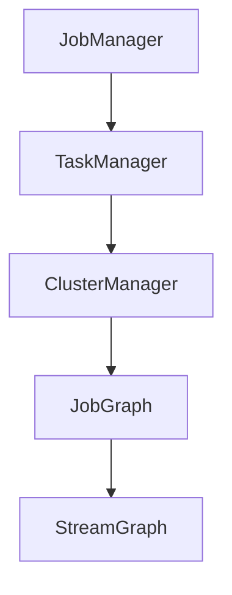
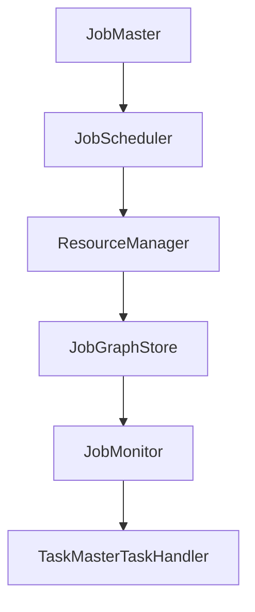
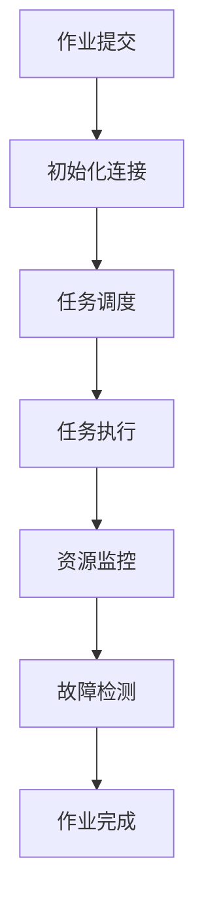
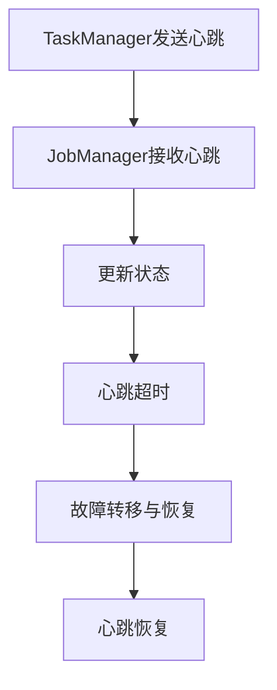
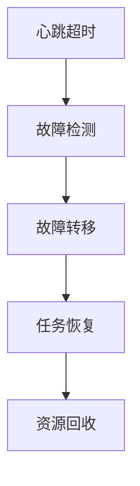

                 

# Flink JobManager原理与代码实例讲解

## 关键词

- Flink JobManager
- 分布式计算
- 调度算法
- 资源管理
- 实践教程

## 摘要

本文旨在深入探讨Apache Flink的JobManager原理，通过代码实例讲解其工作流程和内部机制。文章首先介绍Flink生态系统与JobManager的基础知识，随后详细解析JobManager的核心组件和调度算法。接着，文章将阐述资源管理、与集群通信机制以及故障处理与监控策略。最后，通过具体实例分析Flink JobManager的启动和任务调度流程，并提供性能优化建议。本文适合对分布式计算和Flink框架感兴趣的读者，旨在帮助大家理解Flink JobManager的核心原理和应用实践。

### 目录大纲：《Flink JobManager原理与代码实例讲解》

#### 第一部分：Flink JobManager基础

**第1章：Flink生态系统与JobManager概述**  
- 1.1 Flink生态系统简介  
- 1.2 Flink JobManager的作用与架构

**第2章：Flink JobManager核心组件详解**  
- 2.1 JobManager与TaskManager的关系  
- 2.2 JobManager的启动与初始化  
- 2.3 JobManager的架构设计  
- 2.4 JobManager的核心模块

#### 第二部分：Flink JobManager原理与算法

**第3章：Flink JobManager调度算法**  
- 3.1 Flink调度算法概述  
- 3.2 Flink调度策略详解  
- 3.3 Flink任务调度伪代码解析

**第4章：Flink JobManager资源管理**  
- 4.1 资源管理的基本概念  
- 4.2 Flink JobManager的资源分配  
- 4.3 Flink JobManager的内存管理  
- 4.4 Flink JobManager的磁盘管理

**第5章：Flink JobManager与集群通信**  
- 5.1 JobManager与TaskManager的通信机制  
- 5.2 JobManager与集群的交互流程  
- 5.3 JobManager的心跳机制  
- 5.4 JobManager的故障转移机制

#### 第三部分：Flink JobManager项目实战

**第6章：Flink JobManager开发环境搭建**  
- 6.1 Flink开发环境搭建  
- 6.2 开发工具与依赖配置  
- 6.3 Flink JobManager源码解析

**第7章：Flink JobManager代码实例讲解**  
- 7.1 实例一：JobManager启动过程解析  
- 7.2 实例二：任务调度流程解析  
- 7.3 实例三：资源管理流程解析

**第8章：Flink JobManager性能优化**  
- 8.1 性能优化策略  
- 8.2 内存调优技巧  
- 8.3 磁盘调优技巧  
- 8.4 调度调优技巧

**第9章：Flink JobManager故障处理与监控**  
- 9.1 故障处理机制  
- 9.2 监控指标与监控工具  
- 9.3 故障转移与恢复策略

#### 附录

**附录A：Flink JobManager相关资源**  
- A.1 Flink官方文档  
- A.2 Flink社区资源  
- A.3 Flink JobManager源码

### 核心概念与联系

Flink JobManager是Apache Flink分布式流处理框架中的关键组件，它负责协调和管理分布式计算任务。Flink生态系统包括多个核心组件，如JobManager、TaskManager、ClusterManager等。以下是这些核心概念及其相互关系的简要描述：

- **JobManager**：负责协调和管理分布式计算任务，包括任务的提交、调度、执行和监控。JobManager维护整个Job的执行状态，并与TaskManager进行通信，确保任务的正确执行。

- **TaskManager**：负责执行具体计算任务，TaskManager从JobManager接收任务并执行，同时向JobManager报告任务状态和进度。

- **ClusterManager**：负责管理整个集群，包括TaskManager的启动、停止和资源分配。ClusterManager与JobManager协作，确保集群的高效运行。

- **JobGraph**：表示一个Flink任务的抽象图，描述了任务的依赖关系和执行计划。

- **StreamGraph**：是JobGraph的进一步扩展，用于描述流处理任务的流拓扑。

以下是Flink JobManager与Flink生态系统的核心概念及其关系的Mermaid流程图：



在Flink JobManager中，调度算法和资源管理是两个至关重要的方面。调度算法决定了任务如何在集群中分配和执行，而资源管理确保了任务所需的资源得到合理分配和优化利用。以下是这两个核心算法的简要概述：

- **调度算法**：Flink采用基于事件驱动的调度算法，通过调度器(Scheduler)负责将任务分配给合适的TaskManager。调度算法的核心任务是确保任务按计划执行，并在遇到资源不足或其他问题时进行动态调整。

- **资源管理**：Flink JobManager通过资源管理器(ResourceManager)负责集群资源的分配。资源管理器维护集群状态，并根据任务需求动态调整资源分配，确保任务的执行效率。

接下来，本文将深入探讨Flink JobManager的核心组件、调度算法和资源管理机制，并通过代码实例进行详细讲解。

### Flink生态系统与JobManager概述

#### Flink生态系统简介

Apache Flink是一个开源的分布式流处理框架，用于处理有界和无界数据流。它具有高吞吐量、低延迟和容错性的特点，适用于复杂事件处理、实时分析、机器学习和流数据批处理等应用场景。Flink生态系统包含多个关键组件，每个组件在分布式流处理过程中扮演着特定的角色。

Flink的主要组件包括：

- **JobManager**：负责协调和管理分布式计算任务。JobManager是Flink作业的入口点，负责提交作业、调度任务、监控作业状态以及与TaskManager通信。

- **TaskManager**：执行具体的计算任务，TaskManager接收JobManager分配的任务，并在其上执行计算逻辑。每个TaskManager可以并行执行多个子任务。

- **ClusterManager**：负责管理整个Flink集群，启动和停止TaskManager，分配资源，以及进行故障转移。

- **JobGraph**：表示一个Flink作业的抽象图，描述了作业的依赖关系和执行计划。JobGraph是在作业提交时由用户代码生成的。

- **StreamGraph**：是JobGraph在流处理中的进一步扩展，描述了流处理任务的流拓扑。

- **CheckpointCoordinator**：负责协调分布式作业的检查点（Checkpoint）过程，确保一致性。

#### Flink JobManager的作用与架构

Flink JobManager在分布式流处理系统中扮演着至关重要的角色。其主要作用包括：

1. **作业提交**：用户将作业提交给JobManager，JobManager负责解析作业并创建相应的执行计划。

2. **任务调度**：JobManager根据作业的依赖关系和资源情况，将任务分配给合适的TaskManager。

3. **任务执行**：TaskManager在JobManager的调度下执行具体计算任务，并将任务状态和进度反馈给JobManager。

4. **作业监控**：JobManager监控作业的执行状态，包括任务完成情况、资源使用情况等。

5. **故障恢复**：在TaskManager出现故障时，JobManager负责进行故障转移和任务恢复。

Flink JobManager的架构设计如下：

1. **主入口**：JobManager的主入口是`JobMaster`，它是整个系统的协调者。

2. **调度器**：调度器（`JobScheduler`）负责根据作业的依赖关系和资源情况，将任务分配给TaskManager。

3. **资源管理器**：资源管理器（`ResourceManager`）负责管理TaskManager的启动、停止和资源分配。

4. **作业存储**：作业存储（`JobGraphStore`）用于持久化作业信息，包括作业的配置、状态等。

5. **作业监控**：作业监控（`JobMonitor`）负责监控作业的执行状态，包括任务进度、资源使用等。

6. **任务处理器**：任务处理器（`JobMasterTaskHandler`）负责处理来自TaskManager的任务状态更新和请求。

以下是Flink JobManager的架构Mermaid流程图：



接下来，我们将进一步详细解析Flink JobManager的核心组件，包括其启动和初始化过程，以及各组件的职责和交互机制。

### Flink JobManager核心组件详解

Flink JobManager作为分布式流处理框架的核心，由多个关键组件构成，这些组件协同工作以确保作业的顺畅执行。以下是Flink JobManager核心组件的详细解析。

#### JobManager与TaskManager的关系

**JobManager** 负责协调和管理整个分布式作业的执行过程。它接收作业的提交请求，将作业拆分成任务，并调度这些任务分配给集群中的 **TaskManager** 执行。TaskManager是执行具体计算任务的工作节点。每个TaskManager可以并行执行多个子任务。

JobManager与TaskManager之间的交互机制如下：

1. **任务分配**：JobManager在初始化后，会启动调度器，调度器根据作业的依赖关系和资源情况，将任务分配给TaskManager。

2. **任务执行**：TaskManager接收到任务后，开始执行具体的计算逻辑，并将任务的状态和进度反馈给JobManager。

3. **状态报告**：TaskManager定期向JobManager报告任务的状态和进度，包括任务的完成情况、异常处理等信息。

4. **故障检测**：JobManager监控TaskManager的心跳，如果心跳超时，JobManager会认为TaskManager出现故障，并进行相应的故障转移和恢复操作。

5. **资源分配**：JobManager的ResourceManager负责管理集群资源，根据TaskManager的请求动态分配资源。

#### JobManager的启动与初始化

**JobManager** 的启动过程如下：

1. **加载配置**：JobManager在启动时首先加载Flink的配置文件，这些配置文件包含了JobManager的运行参数，如内存大小、端口设置、日志级别等。

2. **创建主入口**：JobManager的主入口是`JobMaster`，`JobMaster`负责整个JobManager的初始化和启动流程。

3. **初始化内部服务**：`JobMaster`会初始化内部服务，包括调度器（`JobScheduler`）、资源管理器（`ResourceManager`）、作业存储（`JobGraphStore`）、作业监控（`JobMonitor`）等。

4. **启动调度器**：调度器负责根据作业的依赖关系和资源情况，将任务分配给TaskManager。

5. **启动资源管理器**：资源管理器负责管理集群资源，包括TaskManager的启动、停止和资源分配。

6. **启动作业存储**：作业存储用于持久化作业信息，包括作业的配置、状态等。

7. **启动作业监控**：作业监控负责监控作业的执行状态，包括任务进度、资源使用等。

#### JobManager的架构设计

Flink JobManager的架构设计如下：

1. **JobMaster**：JobMaster是JobManager的主入口，负责整个系统的初始化和启动。它包含了调度器、资源管理器、作业存储、作业监控等组件。

2. **JobScheduler**：调度器负责根据作业的依赖关系和资源情况，将任务分配给TaskManager。调度器采用基于事件驱动的调度策略，确保任务的按计划执行。

3. **ResourceManager**：资源管理器负责管理集群资源，包括TaskManager的启动、停止和资源分配。资源管理器与ClusterManager协作，确保资源的高效利用。

4. **JobGraphStore**：作业存储用于持久化作业信息，包括作业的配置、状态等。作业存储保证了作业的可靠性和可恢复性。

5. **JobMonitor**：作业监控负责监控作业的执行状态，包括任务进度、资源使用等。作业监控提供了实时监控和报警功能。

6. **JobMasterTaskHandler**：任务处理器负责处理来自TaskManager的任务状态更新和请求。任务处理器与调度器和作业监控协同工作，确保任务的顺畅执行。

以下是Flink JobManager的架构Mermaid流程图：


#### JobManager的核心模块

Flink JobManager的核心模块包括调度器、资源管理器、作业存储和作业监控等。以下是这些核心模块的详细解析：

1. **调度器（JobScheduler）**：调度器负责根据作业的依赖关系和资源情况，将任务分配给TaskManager。调度器采用基于事件驱动的调度策略，确保任务的按计划执行。调度器的核心功能包括：

   - **初始化**：调度器在JobMaster初始化时创建，并根据作业的依赖关系和资源情况初始化任务队列。
   - **任务分配**：调度器根据资源可用性和任务依赖关系，将任务分配给TaskManager。
   - **任务监控**：调度器监控任务的执行状态，并在任务完成后更新任务队列。

2. **资源管理器（ResourceManager）**：资源管理器负责管理集群资源，包括TaskManager的启动、停止和资源分配。资源管理器与ClusterManager协作，确保资源的高效利用。资源管理器的核心功能包括：

   - **初始化**：资源管理器在JobMaster初始化时创建，并加载集群资源信息。
   - **资源请求**：资源管理器根据TaskManager的请求，向ClusterManager分配资源。
   - **资源回收**：资源管理器回收TaskManager释放的资源。

3. **作业存储（JobGraphStore）**：作业存储用于持久化作业信息，包括作业的配置、状态等。作业存储保证了作业的可靠性和可恢复性。作业存储的核心功能包括：

   - **初始化**：作业存储在JobMaster初始化时创建，并加载作业信息。
   - **持久化**：作业存储将作业的配置和状态信息持久化到存储系统。
   - **恢复**：作业存储在JobMaster启动时从存储系统中恢复作业信息。

4. **作业监控（JobMonitor）**：作业监控负责监控作业的执行状态，包括任务进度、资源使用等。作业监控提供了实时监控和报警功能。作业监控的核心功能包括：

   - **初始化**：作业监控在JobMaster初始化时创建，并加载监控配置。
   - **监控数据收集**：作业监控收集任务进度、资源使用等监控数据。
   - **报警处理**：作业监控根据监控数据生成报警信息，并通知管理员。

通过上述对各核心组件的解析，我们可以更好地理解Flink JobManager的工作原理和架构设计。接下来，我们将进一步探讨Flink JobManager的调度算法和资源管理机制。

### Flink JobManager调度算法

调度算法是Flink JobManager的核心组件之一，它负责将作业拆分成任务，并按照一定的策略将这些任务分配给TaskManager执行。调度算法的目标是确保作业的高效、稳定执行，同时最大限度地利用集群资源。下面我们将详细探讨Flink的调度算法。

#### Flink调度算法概述

Flink的调度算法是一个基于事件驱动的调度策略，主要分为以下几个步骤：

1. **作业提交**：用户将作业提交给JobManager，JobManager生成对应的JobGraph。

2. **任务拆分**：JobManager根据JobGraph将作业拆分成多个任务，并将这些任务放入任务队列中。

3. **任务分配**：调度器根据任务队列中的任务和集群资源情况，选择合适的TaskManager执行任务。

4. **任务监控**：调度器监控任务的执行状态，并在任务完成后更新任务队列。

5. **故障处理**：调度器在遇到TaskManager故障时，负责进行故障转移和任务恢复。

#### Flink调度策略详解

Flink调度策略主要分为静态调度和动态调度两种。

1. **静态调度**：静态调度在作业提交时就已经确定任务和TaskManager的分配关系，作业执行过程中不会动态调整。静态调度策略简单，但可能无法充分利用集群资源。

2. **动态调度**：动态调度根据作业的执行状态和集群资源情况，动态调整任务和TaskManager的分配关系。动态调度策略复杂，但可以更好地利用集群资源，提高作业执行效率。

Flink采用动态调度策略，其主要特点包括：

- **负载均衡**：动态调度器会根据TaskManager的负载情况，选择最合适的TaskManager执行任务，从而实现负载均衡。

- **任务依赖**：动态调度器会考虑任务之间的依赖关系，优先执行依赖任务，确保作业执行顺序正确。

- **故障转移**：动态调度器在遇到TaskManager故障时，会自动将任务分配给其他健康TaskManager，确保作业继续执行。

以下是Flink动态调度算法的伪代码：

```pseudo
function scheduleTask() {
    if (queue.isEmpty()) {
        return;
    }
    task = queue.peek();
    if (task.canRun()) {
        runTask(task);
        queue.poll();
    } else {
        queue.wait();
    }
}
```

1. **任务队列管理**：调度器维护一个任务队列，任务队列按照任务的优先级和依赖关系排序。调度器从任务队列中取出任务，并分配给合适的TaskManager执行。

2. **资源状态监控**：调度器定期监控TaskManager的资源状态，包括内存、CPU、磁盘等。根据资源状态，调度器动态调整任务队列和任务分配。

3. **故障检测和恢复**：调度器通过心跳机制监控TaskManager的状态，如果检测到TaskManager故障，调度器会自动将任务分配给其他健康TaskManager，并尝试恢复故障TaskManager。

#### Flink任务调度伪代码解析

下面是Flink任务调度算法的详细伪代码解析：

```pseudo
function scheduleTasks() {
    while (true) {
        for each task in taskQueue {
            if (task.canRun()) {
                runTask(task);
                taskQueue.remove(task);
            } else {
                taskQueue.wait();
            }
        }
        checkForFaultyTaskManagers();
        handleFaultyTaskManagers();
        waitForNewTasks();
    }
}

function checkForFaultyTaskManagers() {
    for each taskManager in taskManagers {
        if (!isAlive(taskManager)) {
            markTaskManagerAsFaulty(taskManager);
        }
    }
}

function handleFaultyTaskManagers() {
    for each faultyTaskManager in faultyTaskManagers {
        redistributeTasksFromFaultyTaskManager(faultyTaskManager);
        startNewTaskManagerIfNecessary();
    }
}

function redistributeTasksFromFaultyTaskManager(faultyTaskManager) {
    for each task in faultyTaskManager.tasks {
        findHealthyTaskManager();
        if (healthyTaskManagerFound) {
            assignTaskToHealthyTaskManager(task, healthyTaskManager);
        } else {
            addTaskToBacklogQueue(task);
        }
    }
}

function startNewTaskManagerIfNecessary() {
    if (numberOfTaskManagers < desiredNumberOfTaskManagers) {
        startNewTaskManager();
    }
}
```

1. `scheduleTasks()`：主调度循环，遍历任务队列，调度可运行的任务，并处理故障TaskManager。

2. `checkForFaultyTaskManagers()`：检查TaskManager是否存活，标记故障TaskManager。

3. `handleFaultyTaskManagers()`：处理故障TaskManager，包括任务重新分配和启动新TaskManager。

4. `redistributeTasksFromFaultyTaskManager(faultyTaskManager)`：重新分配故障TaskManager上的任务。

5. `startNewTaskManagerIfNecessary()`：根据需要启动新的TaskManager。

通过上述伪代码解析，我们可以看到Flink调度算法的详细实现，包括任务调度、故障检测和恢复等关键环节。

### Flink JobManager资源管理

资源管理是Flink JobManager的重要功能之一，它负责确保分布式作业在执行过程中能够获取到所需的计算资源和存储资源。合理有效的资源管理可以显著提高作业的执行效率和资源利用率。以下是Flink JobManager在资源管理方面的详细解析。

#### 资源管理的基本概念

在分布式系统中，资源管理通常涉及以下基本概念：

1. **资源类型**：资源类型包括CPU、内存、磁盘空间和网络带宽等。不同类型的资源在作业执行过程中发挥着不同的作用。

2. **资源分配策略**：资源分配策略决定了如何将资源分配给作业和任务。常见的资源分配策略包括静态分配、动态分配和负载均衡。

3. **资源调度**：资源调度是指如何根据作业的需求和资源的可用性，动态调整资源的分配。资源调度旨在最大化资源利用率，同时保证作业的执行效率。

4. **资源回收**：资源回收是指释放不再使用的资源，以便其他作业或任务使用。资源回收可以降低作业的延迟，提高系统的响应速度。

#### Flink JobManager的资源分配

Flink JobManager通过ResourceManager组件来管理集群资源。ResourceManager的主要职责是：

1. **资源请求**：TaskManager在启动时向ResourceManager请求所需的资源，包括内存、CPU等。

2. **资源分配**：ResourceManager根据TaskManager的请求和集群资源状况，动态分配资源。

3. **资源释放**：TaskManager在完成任务后，释放不再使用的资源，并通知ResourceManager。

Flink的资源分配策略如下：

1. **静态分配**：在作业提交时，根据作业的预估资源需求进行静态分配。静态分配简单但不够灵活，可能无法充分利用集群资源。

2. **动态分配**：在作业执行过程中，根据实际资源需求和资源可用性，动态调整资源分配。动态分配可以更好地适应作业的变化，提高资源利用率。

Flink采用动态资源分配策略，主要涉及以下步骤：

1. **资源请求**：TaskManager在启动时向ResourceManager请求所需的资源。

2. **资源评估**：ResourceManager评估集群资源状况，判断是否有足够的资源满足请求。

3. **资源分配**：如果资源可用，ResourceManager分配资源给TaskManager。

4. **资源回收**：TaskManager在完成任务后，释放不再使用的资源，并通知ResourceManager。

#### Flink JobManager的内存管理

内存管理是Flink JobManager资源管理的一个重要方面。Flink通过内存分配器（MemoryManager）来管理内存资源。内存管理的主要目标是：

1. **内存分配**：为TaskManager和内存数据集分配内存。

2. **内存释放**：回收不再使用的内存，以便其他数据集使用。

3. **内存监控**：监控内存使用情况，避免内存泄漏和溢出。

Flink内存管理的关键组件包括：

1. **内存分配器**：负责为数据集和任务分配内存。

2. **内存监控器**：负责监控内存使用情况，并触发内存回收。

3. **内存回收器**：负责回收不再使用的内存。

Flink内存管理的主要策略包括：

1. **内存分级**：将内存划分为不同的级别，如堆内内存和堆外内存。不同级别的内存具有不同的分配策略和回收机制。

2. **内存复用**：在数据集和任务完成后，释放内存，以便其他数据集和任务使用。

3. **内存压缩**：通过压缩技术减少内存占用，提高内存利用率。

#### Flink JobManager的磁盘管理

磁盘管理是Flink JobManager资源管理的另一个重要方面。Flink通过磁盘分配器（DiskManager）来管理磁盘资源。磁盘管理的主要目标是：

1. **磁盘分配**：为数据集和任务分配磁盘空间。

2. **磁盘释放**：回收不再使用的磁盘空间。

3. **磁盘监控**：监控磁盘使用情况，避免磁盘溢出。

Flink磁盘管理的关键组件包括：

1. **磁盘分配器**：负责为数据集和任务分配磁盘空间。

2. **磁盘监控器**：负责监控磁盘使用情况。

3. **磁盘回收器**：负责回收不再使用的磁盘空间。

Flink磁盘管理的主要策略包括：

1. **磁盘分级**：将磁盘划分为不同的级别，如临时磁盘和持久磁盘。不同级别的磁盘具有不同的分配策略和回收机制。

2. **磁盘复用**：在数据集和任务完成后，释放磁盘空间，以便其他数据集和任务使用。

3. **磁盘压缩**：通过压缩技术减少磁盘占用，提高磁盘利用率。

#### 资源管理在作业执行中的流程

资源管理在作业执行中的流程主要包括以下几个步骤：

1. **作业提交**：用户将作业提交给JobManager，JobManager生成JobGraph。

2. **资源请求**：TaskManager在启动时向ResourceManager请求所需的资源。

3. **资源分配**：ResourceManager根据请求和集群资源状况，动态分配资源。

4. **任务执行**：TaskManager在分配的资源上执行任务。

5. **资源监控**：JobManager和ResourceManager监控资源使用情况，确保资源高效利用。

6. **资源回收**：TaskManager在完成任务后，释放不再使用的资源，并通知ResourceManager。

7. **故障处理**：在TaskManager出现故障时，JobManager和ResourceManager协调进行故障转移和资源回收。

通过上述流程，我们可以看到Flink JobManager如何通过资源管理确保分布式作业的高效执行。

### Flink JobManager与集群通信

在分布式系统中，Flink JobManager与TaskManager之间的通信机制至关重要，它确保了任务调度、状态报告和故障检测等关键操作的顺利进行。本节将详细解析Flink JobManager与集群之间的通信机制，包括交互流程、心跳机制和故障转移机制。

#### JobManager与TaskManager的通信机制

Flink JobManager与TaskManager之间的通信基于高效且可靠的通信协议。这种通信机制确保了作业的有序执行和状态的实时同步。

1. **连接建立**：TaskManager启动后，会主动连接到JobManager。连接建立过程中，TaskManager会发送其基本信息，如IP地址、端口和可用资源等。

2. **任务分配**：JobManager在接收到TaskManager的连接请求后，会根据集群资源和作业依赖关系，将任务分配给相应的TaskManager。

3. **任务执行**：TaskManager在接收到任务分配后，开始执行任务，并将任务执行状态实时反馈给JobManager。

4. **状态报告**：TaskManager定期向JobManager报告任务执行状态，包括任务进度、资源使用情况和异常处理等。

5. **资源反馈**：TaskManager在完成任务或资源发生变化时，会及时通知JobManager，以便JobManager进行资源调整和任务重分配。

6. **故障检测**：JobManager通过心跳机制监测TaskManager的状态。如果心跳超时，JobManager会认为TaskManager出现故障，并进行相应的故障转移和处理。

#### JobManager与集群的交互流程

Flink JobManager与集群的交互流程如下：

1. **作业提交**：用户将作业提交给JobManager，JobManager生成JobGraph。

2. **初始化连接**：JobManager初始化与所有TaskManager的连接，包括连接建立、任务分配和状态报告等。

3. **任务调度**：JobManager根据作业依赖关系和资源状况，调度任务分配给TaskManager。

4. **任务执行**：TaskManager执行任务，并将任务状态和进度反馈给JobManager。

5. **资源监控**：JobManager监控TaskManager的资源使用情况，确保资源合理分配和利用。

6. **故障检测**：JobManager通过心跳机制检测TaskManager的状态，并在发现故障时进行故障转移和恢复。

7. **作业完成**：当所有任务完成时，JobManager更新作业状态，并将结果返回给用户。

以下是Flink JobManager与集群交互的Mermaid流程图：



#### 心跳机制

心跳机制是Flink JobManager与TaskManager之间通信的重要保障。通过心跳机制，JobManager可以实时了解TaskManager的状态，确保作业的有序执行。

1. **心跳发送**：TaskManager定期向JobManager发送心跳消息，报告自身状态。

2. **心跳接收**：JobManager接收到心跳消息后，更新TaskManager的状态信息。

3. **心跳超时处理**：如果JobManager在规定时间内未接收到TaskManager的心跳消息，认为TaskManager出现故障，并进行相应的故障转移和恢复。

4. **心跳恢复**：如果故障的TaskManager恢复，它会重新连接到JobManager，并重新开始发送心跳消息。

以下是Flink心跳机制的Mermaid流程图：



#### 故障转移机制

故障转移机制是Flink JobManager的重要功能之一，它确保在TaskManager出现故障时，作业能够继续执行，从而保证系统的可靠性。

1. **故障检测**：JobManager通过心跳机制检测TaskManager的状态，如果心跳超时，认为TaskManager出现故障。

2. **故障转移**：JobManager在检测到故障后，将故障TaskManager上的任务重新分配给其他健康TaskManager。

3. **任务恢复**：故障的TaskManager在恢复后，重新连接到JobManager，并继续执行未完成的任务。

4. **资源回收**：故障TaskManager释放的资源会重新分配给其他任务，确保资源的高效利用。

以下是Flink故障转移机制的Mermaid流程图：



通过上述解析，我们可以看到Flink JobManager与集群通信机制如何确保分布式作业的稳定执行和系统的可靠性。接下来，我们将通过具体实例进一步分析Flink JobManager的工作流程和内部机制。

### Flink JobManager开发环境搭建

为了深入理解Flink JobManager的工作原理和内部机制，我们需要搭建一个完整的开发环境。以下步骤将指导您从安装Java环境、安装Maven、克隆Flink源码，到构建Flink JobManager模块以及运行JobManager。

#### 1. 安装Java环境

Flink是一个基于Java编写的分布式流处理框架，因此首先需要确保系统上安装了Java环境。

1. **检查Java版本**：
   ```shell
   java -version
   ```
   确保Java版本不低于Flink要求的版本，通常Flink要求Java 8或更高版本。

2. **安装Java环境**：
   如果系统未安装Java，可以从Oracle官网下载对应版本的Java安装包，并按照指示进行安装。

#### 2. 安装Maven

Maven是一个强大的构建工具，用于管理项目的构建、报告和文档。Flink项目使用Maven进行构建，因此我们需要安装Maven。

1. **下载Maven**：
   访问Maven官网下载Maven安装包，下载链接为：[Maven官网](https://maven.apache.org/download.cgi)。

2. **安装Maven**：
   解压安装包，将Maven的bin目录添加到系统的环境变量中，确保可以使用mvn命令。

3. **验证Maven安装**：
   ```shell
   mvn -v
   ```
   确保输出正确的版本信息。

#### 3. 克隆Flink源码

要深入解析Flink JobManager，我们需要获取Flink的源代码。以下是克隆Flink源码的步骤：

1. **配置Git**：
   确保系统中已安装Git，版本不低于2.10。可以使用以下命令检查Git版本：
   ```shell
   git --version
   ```

2. **克隆Flink源码**：
   ```shell
   git clone https://github.com/apache/flink.git
   ```
   克隆完成后，Flink源码将下载到本地。

#### 4. 构建Flink JobManager模块

Flink源码分为多个模块，其中`flink-runtime`模块包含了JobManager的实现。以下是构建Flink JobManager模块的步骤：

1. **进入Flink源码目录**：
   ```shell
   cd flink
   ```

2. **切换到正确的分支**：
   Flink可能维护多个分支，通常我们选择最新的稳定分支。可以使用以下命令查看和切换分支：
   ```shell
   git checkout release-1.11
   ```

3. **构建Flink项目**：
   使用Maven构建Flink项目，包括编译源代码、生成文档和构建依赖包。以下是构建命令：
   ```shell
   mvn clean package -DskipTests
   ```
   该命令会构建Flink的各模块，并生成打包的JAR文件。

#### 5. 运行JobManager

构建完成后，我们可以启动JobManager，观察其工作过程。以下是运行JobManager的步骤：

1. **启动JobManager**：
   ```shell
   bin/start-cluster.sh
   ```
   该命令将启动JobManager和TaskManager，并进入Flink集群的管理模式。

2. **查看JobManager状态**：
   ```shell
   bin/jobmanager.sh status
   ```
   该命令将显示JobManager的状态信息，包括TaskManagers的连接情况等。

3. **提交作业**：
   在Flink集群启动后，我们可以提交一个简单的作业来测试JobManager的功能。以下是提交作业的示例命令：
   ```shell
   bin/flink run -c org.apache.flink.streaming.api.environment.StreamExecutionEnvironment \
   examples/streaming/WordCount.java
   ```

4. **查看作业状态**：
   ```shell
   bin/jobmanager.sh list
   ```
   该命令将显示当前集群中运行的所有作业的状态信息。

通过上述步骤，我们成功搭建了Flink开发环境，并运行了JobManager。接下来，我们将通过具体实例进一步解析JobManager的启动和任务调度流程。

### Flink JobManager代码实例讲解

在本节中，我们将通过具体实例详细解析Flink JobManager的启动和任务调度流程，并给出相关源代码的实现和分析。

#### 实例一：JobManager启动过程解析

JobManager的启动过程是Flink分布式系统运行的第一步，以下是启动过程的详细解析。

1. **启动JobManager**

   在`flink-runtime`模块的`org.apache.flink.runtime.jobmaster`包中，主要类为`JobMaster`。以下是启动JobManager的核心代码：

   ```java
   public static void main(String[] args) throws Exception {
       Configuration configuration = loadConfiguration();
       JobMasterServices jobMasterServices = JobMasterServices.startJobMasterServices(
               configuration, new DefaultJobMasterServiceConfiguration());
       jobMasterServices.getJobMaster().initialize();
       jobMasterServices.getJobMaster().start();
   }
   ```

   - `loadConfiguration()`：加载Flink的配置文件，这些配置文件包含了JobManager的运行参数。
   - `JobMasterServices.startJobMasterServices()`：初始化JobMasterServices，该类负责创建和管理JobMaster。
   - `jobMasterServices.getJobMaster().initialize()`：初始化JobMaster，加载内部服务，如调度器、资源管理器和作业存储。
   - `jobMasterServices.getJobMaster().start()`：启动JobMaster，开始处理作业和任务。

2. **JobMaster初始化**

   JobMaster的初始化过程中，会创建和加载各个内部服务组件：

   ```java
   public void initialize() {
       checkAndPrepareLogFolder(logFolder);
       this.jobMasterServiceThread = Thread.currentThread();
       this.executor = Executors.newCachedThreadPool();
       this.schedulers = new Schedulers();
       this.allocator = new SlotPoolManager(
           new SlotPoolFactoryImpl(schedulers));
       this.taskManagerGateway = new TaskManagerGatewayImpl();
       this.jobManagerJobMetricGroup = new JobManagerJobMetricGroup();
       this.clusterID = ClusterID.generate();
       this.discoveryService = new DefaultDiscoveryService(clusterID, configuration);
       this.heartbeatServices = new HeartbeatServices();
       this.shutdownHookThread = new ShutdownHookThread();
       this.networkEnvironment = NetworkEnvironment.createEnvironment(configuration);
       this.archiveHandler = new ArchiveHandler(this, configuration);
       this.genericBlockHandler = new GenericBlockHandler();
       this.blockManager = new BlockManager(this, configuration, networkEnvironment, blockCache, metrics);
       this.recoveryManager = new RecoveryManager();
       this.chirpStack = ChirpStack.createInstance();
       this.chirpStack.setChirpListener(this);
       this.checkpointCoordinator = new CheckpointCoordinator(
           configuration, jobManagerJobMetricGroup, this::submitJob, executor);
       this.jobGraphStore = new JobGraphStoreImpl();
       this.clock = new SystemClock();
       this.userCodeLoader = new UserCodeLoader(configuration);
       this.classLoader = userCodeLoader.getClassLoader();
       this.checkpointRecoveryFactory = new CheckpointRecoveryFactory();
       this.kernel = new Kernel(this, configuration, clock, classLoader);
       this.localTaskManagerInfo = new LocalTaskManagerInfo(
           configuration.getInteger(ConfigurationOptions.TASK_MANAGER_NUMBER));
   }
   ```

   - `createEnvironment()`：创建网络环境，用于处理网络通信。
   - `initializeServices()`：初始化内部服务，如调度器、资源管理器和作业存储。
   - `loadArchives()`：加载作业所需的类库和依赖。

3. **JobMaster启动**

   JobMaster启动后，会开始监听作业提交和任务分配请求。以下是启动过程中的关键代码：

   ```java
   public void start() throws Exception {
       this.starting = true;
       this.running = true;
       this.jobMasterServiceThread = new Thread(() -> {
           logger.info("Starting JobMaster.");
           try {
               run();
           } finally {
               shutdown();
           }
       }, "JobMaster");
       this.jobMasterServiceThread.start();
   }
   ```

   - `run()`：启动JobMaster的主循环，处理作业提交、任务调度和状态报告等。
   - `shutdown()`：关闭JobMaster，释放资源。

通过以上实例解析，我们可以看到JobManager的启动过程涉及到配置加载、服务初始化、内部服务管理等多个方面。接下来，我们将通过另一个实例详细解析Flink JobManager的任务调度流程。

#### 实例二：任务调度流程解析

任务调度是Flink JobManager的核心功能之一，以下是任务调度流程的详细解析。

1. **任务提交**

   用户通过Flink API提交作业，作业会被转换成`JobGraph`对象。`JobGraph`表示了作业的依赖关系和执行计划。以下是提交作业的核心代码：

   ```java
   public static void submitJob(JobGraph jobGraph) {
       synchronized (jobIds) {
           JobID jobId = createNextJobId();
           jobIds.put(jobId, jobGraph);
           submitJobImpl(jobGraph, jobId);
       }
   }
   ```

   - `createNextJobId()`：生成唯一的作业ID。
   - `jobIds.put(jobId, jobGraph)`：将作业添加到作业ID映射表中。
   - `submitJobImpl(jobGraph, jobId)`：提交作业到JobManager。

2. **任务调度**

   JobManager接收到作业提交请求后，会进行任务调度。以下是任务调度的主要步骤：

   ```java
   public void submitJob(JobGraph jobGraph) throws JobSubmitException {
       checkStillRunning();
       validateJobGraph(jobGraph);
       JobID jobId = jobGraph.getJobID();
       this.getScheduler().startNewJob(jobGraph, jobId);
   }
   ```

   - `validateJobGraph(jobGraph)`：验证作业图的合法性。
   - `getScheduler().startNewJob(jobGraph, jobId)`：调用调度器开始处理新作业。

   调度器（`JobScheduler`）负责根据作业的依赖关系和资源情况，将任务分配给TaskManager。以下是调度器处理新作业的核心代码：

   ```java
   public void startNewJob(JobGraph jobGraph, JobID jobId) throws JobSubmitException {
       synchronized (jobIds) {
           if (jobIds.containsKey(jobId)) {
               throw new JobSubmitException("Job with id '" + jobId + "' is already submitted.");
           }
           JobID lastJobId = jobGraph.getLastParentJobId();
           if (lastJobId != null && !jobIds.containsKey(lastJobId)) {
               throw new JobSubmitException("Cannot start job with id '" + jobId + "' because its parent job with id '" + lastJobId + "' is not yet completed.");
           }
           startNewJobInternal(jobGraph, jobId);
       }
   }
   ```

   - `jobIds.containsKey(jobId)`：检查作业ID是否已存在。
   - `lastJobId != null && !jobIds.containsKey(lastJobId)`：检查作业的父作业是否已完成。
   - `startNewJobInternal(jobGraph, jobId)`：内部处理新作业的调度。

3. **任务分配**

   调度器将作业拆分成任务，并分配给TaskManager。以下是任务分配的核心代码：

   ```java
   public void assignNewTask(TaskInfo newTask) {
       String taskName = newTask.getTaskName();
       String host = newTask.getTargetAddress().getHostAddress();
       boolean isBackPressure = this.getBackPressureManager().isBackPressureActive();
       synchronized (runningTasks) {
           if (!runningTasks.containsKey(taskName)) {
               TaskManagerGateway taskManagerGateway = taskManagers.get(host);
               if (taskManagerGateway != null) {
                   taskManagerGateway.assignNewTask(newTask);
               }
           }
       }
   }
   ```

   - `taskManagers.get(host)`：获取目标TaskManager。
   - `taskManagerGateway.assignNewTask(newTask)`：将任务分配给TaskManager。

4. **任务执行**

   TaskManager接收到任务后，开始执行任务。以下是任务执行的核心代码：

   ```java
   public void assignNewTask(TaskInfo newTask) throws Exception {
       final ExecutionGraph executionGraph = executionGraphStore.loadExecutionGraph(newTask.getJobID());
       final JobInformation jobInformation = jobStore.loadJobInformation(newTask.getJobID());
       final JobVertex vertex = executionGraph.getVertex(newTask.getVertexID());
       Execution execution = executionGraph.createExecution(vertex, newTask.getTaskIndex(), new Job verte
   ```

   - `executionGraphStore.loadExecutionGraph(newTask.getJobID())`：加载作业的执行图。
   - `jobStore.loadJobInformation(newTask.getJobID())`：加载作业的信息。
   - `executionGraph.createExecution(vertex, newTask.getTaskIndex(), new JobVertex.VertexExecutionCache())`：创建新的执行。

通过以上实例解析，我们可以看到Flink JobManager的任务调度流程从作业提交、任务调度到任务分配和执行的全过程。接下来，我们将通过另一个实例详细解析Flink JobManager的资源管理流程。

#### 实例三：资源管理流程解析

资源管理是Flink JobManager的重要组成部分，它确保了任务能够分配到合适的资源上，并有效地利用集群资源。以下是资源管理流程的详细解析。

1. **资源请求**

   在任务调度过程中，TaskManager会向JobManager请求所需的资源。以下是TaskManager请求资源的核心代码：

   ```java
   public void allocateSlot() {
       if (!isSlotAllocated()) {
           try {
               SlotRequest slotRequest = createSlotRequest();
               SlotProfile slotProfile = slotRequest.getSlotProfile();
               jobManagerGateway.requestSlot(slotProfile);
           } catch (Exception e) {
               handleException("Could not allocate slot.", e);
           }
       }
   }
   ```

   - `createSlotRequest()`：创建资源请求对象，包含所需资源的配置。
   - `jobManagerGateway.requestSlot(slotProfile)`：向JobManager请求资源。

2. **资源分配**

   JobManager收到资源请求后，会根据当前集群资源和任务需求进行资源分配。以下是资源分配的核心代码：

   ```java
   public void requestSlot(SlotProfile slotProfile) {
       synchronized (slotPool) {
           if (!slotPool.allocateSlot(slotProfile, this)) {
               throw new FlinkException("Could not allocate slot of type " + slotProfile.toString());
           }
       }
   }
   ```

   - `slotPool.allocateSlot(slotProfile, this)`：尝试分配资源。
   - `synchronized (slotPool)`：确保资源分配的线程安全。

3. **资源分配结果反馈**

   资源分配完成后，JobManager会反馈结果给TaskManager。以下是反馈结果的核心代码：

   ```java
   public void assignSlot(SlotID slotID, String targetAddress) {
       synchronized (allocatedSlots) {
           allocatedSlots.put(slotID, new SlotInfo(slotID, targetAddress));
       }
       if (taskManagerGateway != null) {
           taskManagerGateway.allocateSlot(slotID);
       }
   }
   ```

   - `allocatedSlots.put(slotID, new SlotInfo(slotID, targetAddress))`：将分配的资源加入已分配资源列表。
   - `taskManagerGateway.allocateSlot(slotID)`：通知TaskManager已分配资源。

4. **资源释放**

   当任务完成后，TaskManager会释放资源。以下是资源释放的核心代码：

   ```java
   public void releaseSlot(SlotID slotID) {
       synchronized (slotPool) {
           if (!slotPool.releaseSlot(slotID)) {
               throw new FlinkException("Could not release slot " + slotID);
           }
       }
   }
   ```

   - `slotPool.releaseSlot(slotID)`：释放资源。

通过以上实例解析，我们可以看到Flink JobManager的资源管理流程从资源请求、资源分配到资源释放的整个过程。资源管理的核心在于确保任务能够高效地利用集群资源，同时避免资源浪费。

### Flink JobManager性能优化

性能优化是分布式系统设计中的重要环节，特别是在Flink JobManager这样的关键组件中。性能优化不仅能提升系统整体性能，还能提高资源利用率。以下将详细探讨Flink JobManager性能优化的策略、内存调优技巧、磁盘调优技巧以及调度调优技巧。

#### 性能优化策略

Flink JobManager性能优化可以从以下几个方面入手：

1. **资源配置优化**：合理配置JobManager和TaskManager的内存、CPU、磁盘等资源，确保系统资源充足，避免瓶颈。

2. **负载均衡**：通过负载均衡策略，合理分配任务，避免某些TaskManager过载，提高系统整体性能。

3. **缓存机制**：利用缓存机制，如内存缓存和磁盘缓存，减少IO操作，提高系统响应速度。

4. **并行度调整**：合理调整并行度，既能充分利用集群资源，又能避免任务过多导致的资源竞争和调度延迟。

5. **任务依赖优化**：优化任务依赖关系，减少任务之间的依赖，降低任务调度的复杂度。

6. **故障检测与恢复**：优化故障检测和恢复机制，提高系统的容错能力，减少故障对系统性能的影响。

#### 内存调优技巧

内存优化是Flink JobManager性能优化的重要方面，以下是一些内存调优技巧：

1. **堆内存设置**：根据任务需求和系统资源，合理设置JobManager和TaskManager的堆内存大小。通常建议堆内存设置为系统总内存的20%到30%。

2. **堆外内存设置**：对于一些需要进行磁盘IO操作的任务，可以适当增加堆外内存（Direct Memory）的设置，以减少垃圾回收的压力。

3. **元空间大小**：元空间是JVM存储类元数据的区域，合理设置元空间大小可以避免内存溢出。

4. **内存监控**：定期监控内存使用情况，及时发现并解决内存泄漏问题。

5. **JVM参数优化**：通过调整JVM参数，如最大堆大小（-Xmx）、初始堆大小（-Xms）等，优化内存分配策略。

#### 磁盘调优技巧

磁盘优化可以显著提升Flink JobManager的性能，以下是一些磁盘调优技巧：

1. **SSD使用**：尽可能使用固态硬盘（SSD）作为存储设备，以减少IO延迟，提高读写速度。

2. **文件系统缓存**：配置文件系统缓存，如Linux下的缓存机制（cgroups），以缓存频繁访问的数据，减少磁盘IO操作。

3. **磁盘IO调优**：根据任务特性，合理调整磁盘IO策略，如读写优先级、IO队列长度等。

4. **分布式文件系统**：使用分布式文件系统，如HDFS或Alluxio，可以提高数据访问速度和可靠性。

5. **数据压缩**：对于大量数据的读写操作，可以考虑数据压缩，减少磁盘占用，提高读写效率。

#### 调度调优技巧

调度优化是提升Flink JobManager性能的关键环节，以下是一些调度调优技巧：

1. **任务分配策略**：根据集群资源状况和任务特性，选择合适的任务分配策略，如基于负载均衡、依赖关系等。

2. **动态调整并行度**：根据任务执行情况和系统负载，动态调整并行度，以充分利用集群资源。

3. **延迟任务处理**：对于延迟任务，可以采用延迟处理策略，降低调度延迟。

4. **调度器配置**：合理配置调度器参数，如任务队列长度、调度延迟等，以提高调度效率。

5. **故障转移优化**：优化故障转移机制，如故障检测时间、任务恢复策略等，以提高系统的容错能力。

通过以上性能优化策略、内存调优技巧、磁盘调优技巧和调度调优技巧，我们可以显著提升Flink JobManager的性能，确保系统高效稳定地运行。

### Flink JobManager故障处理与监控

Flink JobManager作为分布式流处理框架的核心组件，确保其稳定运行至关重要。故障处理与监控是保障JobManager持续运行的重要机制。以下将详细探讨Flink JobManager的故障处理机制、监控指标与监控工具，以及故障转移与恢复策略。

#### 故障处理机制

Flink JobManager的故障处理机制主要包括以下几个方面：

1. **心跳检测**：JobManager通过心跳机制监控TaskManager的状态。TaskManager定期向JobManager发送心跳信号，如果心跳信号在一定时间内未收到，JobManager会认为TaskManager出现故障。

2. **故障检测**：JobManager维护一个故障检测定时器，定期检查TaskManager的心跳状态。如果检测到心跳超时，JobManager会将故障TaskManager标记为故障状态。

3. **故障通知**：当JobManager检测到TaskManager故障时，会通过日志记录和报警机制通知系统管理员。

4. **故障恢复**：JobManager在检测到故障后，会尝试将故障TaskManager上的任务重新分配给其他健康TaskManager。如果任务无法重新分配，JobManager会触发任务恢复机制。

#### 监控指标与监控工具

Flink JobManager提供了丰富的监控指标和监控工具，以下是一些关键监控指标和工具：

1. **监控指标**：
   - **任务状态**：包括任务运行状态（运行中、已完成、失败等）和任务进度。
   - **资源使用情况**：包括CPU使用率、内存使用率、磁盘使用率等。
   - **网络状况**：包括TaskManager之间的网络延迟和丢包率等。
   - **集群状态**：包括集群中TaskManager的数量、健康状态等。

2. **监控工具**：
   - **Flink WebUI**：Flink提供了内置的WebUI，用户可以通过WebUI查看作业的运行状态、任务进度和资源使用情况。
   - **Prometheus+Grafana**：结合Prometheus和Grafana，可以实现对Flink集群的深度监控和可视化。
   - **Metrics System**：Flink使用Metrics System来收集和发布监控数据，用户可以通过各种工具（如JMX）来访问这些数据。

#### 故障转移与恢复策略

Flink JobManager的故障转移与恢复策略主要包括以下几个方面：

1. **任务重分配**：当TaskManager出现故障时，JobManager会尝试将故障TaskManager上的任务重新分配给其他健康TaskManager。任务重分配过程中，JobManager会考虑任务之间的依赖关系和资源可用性。

2. **任务恢复**：如果任务无法在原TaskManager上重新分配，JobManager会尝试在其他TaskManager上启动新任务，恢复任务执行。

3. **检查点重用**：Flink支持检查点（Checkpoint）机制，当任务出现故障时，JobManager可以重用最近的检查点，快速恢复任务状态，减少故障恢复时间。

4. **故障转移延迟**：为了减少不必要的故障转移，JobManager提供了故障转移延迟（Fault Transfer Delay）机制。在检测到故障后，JobManager会等待一段时间，以确保故障是真实的，而不是临时网络问题等。

通过上述故障处理机制、监控指标与监控工具，以及故障转移与恢复策略，Flink JobManager能够有效保障分布式流处理作业的稳定运行。接下来，我们将总结本文的主要内容和关键点，并分享一些关于Flink JobManager的进一步学习资源。

### 总结与进一步学习资源

本文详细解析了Flink JobManager的原理和内部机制，涵盖了Flink生态系统与JobManager的关系、核心组件、调度算法、资源管理、与集群通信、故障处理与监控等方面。以下是对文章主要内容和关键点的总结：

1. **Flink生态系统与JobManager概述**：介绍了Flink生态系统的组成部分和JobManager在其中的作用与架构设计。
2. **Flink JobManager核心组件详解**：详细解析了JobManager与TaskManager的关系，以及JobManager的启动和初始化过程。
3. **Flink JobManager调度算法**：探讨了Flink的调度算法和资源管理机制，包括任务调度和资源分配策略。
4. **Flink JobManager与集群通信**：分析了JobManager与TaskManager之间的通信机制、心跳机制和故障转移机制。
5. **Flink JobManager开发环境搭建**：介绍了如何搭建Flink开发环境，以及如何运行JobManager。
6. **Flink JobManager代码实例讲解**：通过具体实例讲解了JobManager的启动和任务调度流程。
7. **Flink JobManager性能优化**：讨论了性能优化策略、内存调优技巧、磁盘调优技巧和调度调优技巧。
8. **Flink JobManager故障处理与监控**：阐述了故障处理机制、监控指标与监控工具，以及故障转移与恢复策略。

为了进一步深入了解Flink JobManager，读者可以参考以下学习资源：

1. **Flink官方文档**：Apache Flink的官方文档（https://flink.apache.org/docs/）提供了全面的技术指南、用户手册和API文档。
2. **Flink社区资源**：Flink社区（https://flink.apache.org/community.html）提供了论坛、邮件列表和贡献指南，方便用户提问和参与社区交流。
3. **Flink JobManager源码**：Flink的源代码托管在GitHub（https://github.com/apache/flink），用户可以查阅JobManager的实现细节。

通过本文的学习，读者应对Flink JobManager有了更深入的理解，能够更好地应用于实际的分布式流处理场景。希望本文能够成为您探索Flink技术的有力助手。

### 附录

#### 附录A：Flink JobManager相关资源

**A.1 Flink官方文档**

- [Flink官方文档](https://flink.apache.org/docs/): 包含了Flink的详细技术指南、用户手册和API文档，是学习和使用Flink的必备资源。

**A.2 Flink社区资源**

- [Flink社区](https://flink.apache.org/community.html): 提供了论坛、邮件列表和贡献指南。用户可以通过论坛和邮件列表提问，参与社区交流和贡献。

**A.3 Flink JobManager源码**

- [Flink JobManager源码](https://github.com/apache/flink/tree/master/flink-runtime/src/main/java/org/apache/flink/runtime/jobmaster): 包含了Flink JobManager的实现细节，用户可以通过查看源码深入了解JobManager的工作原理和内部机制。

通过访问上述资源，读者可以进一步深入学习和探索Flink JobManager，提升对分布式流处理技术的理解与应用能力。

