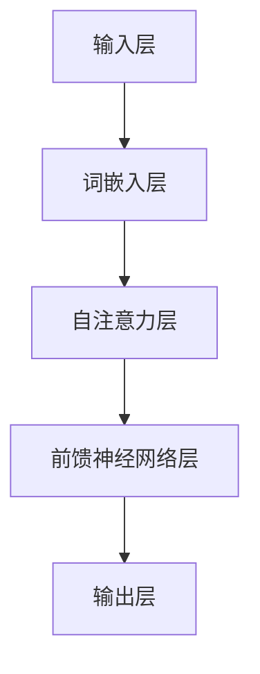
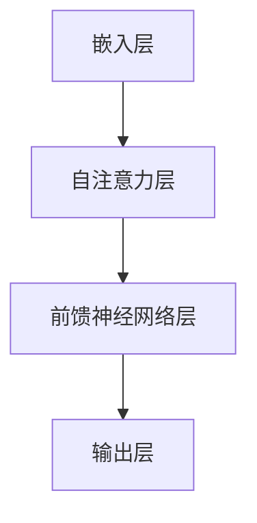
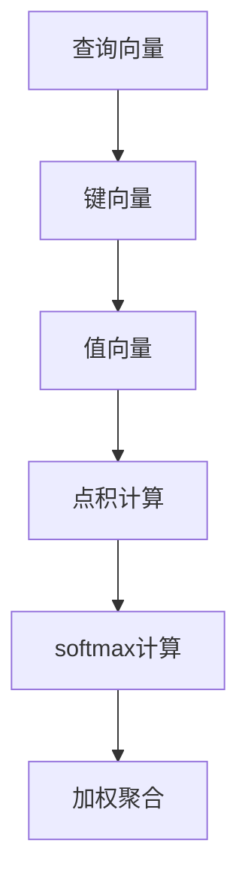
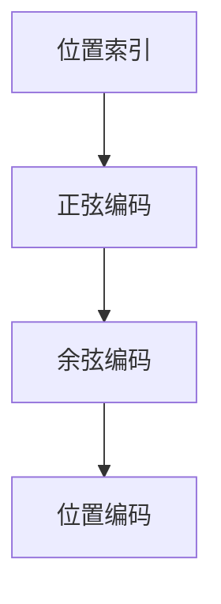
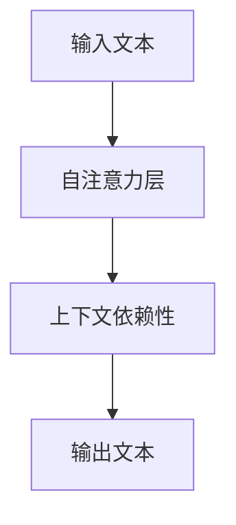

                 

## 《GPT：生成式自回归模型》

> **关键词：** GPT，生成式模型，自回归模型，Transformer，自注意力机制，自然语言处理

**摘要：** 本文旨在深入探讨生成式自回归模型（GPT）的基础知识、原理、算法、数学模型以及在实际项目中的应用和实践。通过逐步分析推理，本文将帮助读者全面理解GPT的核心概念和关键技术，为其在自然语言处理领域的应用提供理论和实践指导。

### 《GPT：生成式自回归模型》目录大纲

#### 第一部分：GPT基础知识与原理

#### 第1章：GPT概述  
- 1.1 GPT的历史与发展  
- 1.2 GPT的定义与特点  
- 1.3 GPT的核心架构

#### 第2章：生成式自回归模型基础  
- 2.1 生成式模型概述  
- 2.2 自回归模型原理  
- 2.3 语言模型基础

#### 第3章：GPT算法原理  
- 3.1 Transformer模型详解  
- 3.2 自注意力机制  
- 3.3 位置编码  
- 3.4 上下文依赖性

#### 第4章：GPT数学模型与公式  
- 4.1 模型损失函数  
- 4.2 优化算法  
- 4.3 模型训练技巧

#### 第5章：GPT性能分析与调优  
- 5.1 GPT性能指标  
- 5.2 调优策略  
- 5.3 模型压缩与推理优化

#### 第二部分：GPT应用实践

#### 第6章：GPT在自然语言处理中的应用  
- 6.1 文本生成  
- 6.2 机器翻译  
- 6.3 文本分类  
- 6.4 问答系统

#### 第7章：GPT项目实战  
- 7.1 项目背景  
- 7.2 项目需求分析  
- 7.3 环境搭建  
- 7.4 源代码实现  
- 7.5 代码解读与分析

#### 第8章：GPT未来展望与挑战  
- 8.1 GPT的发展趋势  
- 8.2 挑战与解决方案  
- 8.3 GPT的应用前景

#### 附录

- 附录A：GPT相关资源与工具  
- 附录B：GPT模型结构流程图  
- 附录C：GPT训练伪代码示例

---

**附录 A：GPT相关资源与工具**

### A.1 GPT开源框架
- 1.1 TensorFlow 2.x
- 1.2 PyTorch
- 1.3 Hugging Face Transformers

### A.2 GPT训练工具
- 1.1 GPU与TPU配置
- 1.2 分布式训练策略
- 1.3 优化器与调度策略

### A.3 GPT应用示例
- 1.1 文本生成应用
- 1.2 机器翻译应用
- 1.3 文本分类应用

---

**附录 B：GPT模型结构流程图**

mermaid
graph TD
A[输入层] --> B[词嵌入层]
B --> C[自注意力层]
C --> D[前馈神经网络层]
D --> E[输出层]


---

**附录 C：GPT训练伪代码示例**

python
# 定义模型
model = transformers.AutoModelForCausalLM.from_pretrained('gpt2')

# 定义损失函数和优化器
loss_fn = nn.CrossEntropyLoss()
optimizer = optim.Adam(model.parameters(), lr=0.001)

# 训练循环
for epoch in range(num_epochs):
    for batch in dataloader:
        inputs = batch['input_ids']
        targets = batch['label_ids']
        
        # 前向传播
        outputs = model(inputs)
        logits = outputs.logits
        loss = loss_fn(logits, targets)
        
        # 反向传播
        optimizer.zero_grad()
        loss.backward()
        optimizer.step()
        
    print(f'Epoch {epoch+1}/{num_epochs}, Loss: {loss.item()}')

---

以上是《GPT：生成式自回归模型》这本书的完整目录大纲。目录中包含了GPT的基础知识、原理、应用实践以及未来展望等内容，旨在为读者提供一个全面、系统的学习路径。在附录部分，还提供了相关资源和工具，以及模型结构和训练的伪代码示例，方便读者实践和应用。

接下来，我们将按照目录大纲的顺序，逐步深入探讨GPT的核心概念、原理和应用。

---

**引言**

生成式自回归模型（Generative Pre-trained Transformer，GPT）是近年来自然语言处理领域的一项重大突破。GPT作为一种强大的生成式模型，已经在各种自然语言处理任务中取得了显著的成果。本文将围绕GPT进行深入探讨，旨在帮助读者全面了解GPT的基础知识、原理和应用。

本文的结构如下：

- **第一部分：GPT基础知识与原理**  
  本章将介绍GPT的历史与发展、定义与特点，以及GPT的核心架构。

- **第二部分：生成式自回归模型基础**  
  本章将阐述生成式模型和自回归模型的基本原理，以及语言模型的基础知识。

- **第三部分：GPT算法原理**  
  本章将详细解析GPT的算法原理，包括Transformer模型、自注意力机制、位置编码和上下文依赖性。

- **第四部分：GPT数学模型与公式**  
  本章将介绍GPT的数学模型和公式，包括模型损失函数、优化算法和模型训练技巧。

- **第五部分：GPT性能分析与调优**  
  本章将分析GPT的性能指标，介绍调优策略和模型压缩与推理优化方法。

- **第六部分：GPT应用实践**  
  本章将探讨GPT在自然语言处理中的应用，包括文本生成、机器翻译、文本分类和问答系统。

- **第七部分：GPT项目实战**  
  本章将通过一个实际项目，展示GPT的应用和实践。

- **第八部分：GPT未来展望与挑战**  
  本章将对GPT的未来发展、挑战和前景进行展望。

通过本文的阅读，读者将能够深入了解GPT的核心概念、原理和应用，为在实际项目中应用GPT打下坚实基础。

---

**第一部分：GPT基础知识与原理**

#### 第1章：GPT概述

GPT是生成式自回归模型（Generative Pre-trained Transformer）的缩写，是一种基于Transformer模型的生成式预训练语言模型。GPT由OpenAI在2018年首次提出，并在自然语言处理领域取得了巨大的成功。

### 1.1 GPT的历史与发展

GPT的发展历程可以追溯到2017年，当时OpenAI提出了Transformer模型。Transformer模型是一种基于自注意力机制的神经网络模型，能够在处理序列数据时保持长期依赖关系。2018年，OpenAI在Transformer模型的基础上提出了GPT模型，并展示了其在自然语言处理任务中的优越性能。

随后，GPT经历了多个版本的迭代，如GPT-2、GPT-3等。其中，GPT-3是当前最先进的版本，拥有1750亿个参数，能够生成高质量的自然语言文本。

### 1.2 GPT的定义与特点

GPT是一种生成式模型，它的目标是生成符合输入文本概率分布的文本。具体来说，GPT通过学习输入文本的序列概率分布，从而能够在给定一个起始文本的情况下，生成后续的文本。

GPT具有以下几个显著特点：

1. **预训练**：GPT在训练过程中使用了大量的无监督文本数据，通过自回归的方式学习输入文本的序列概率分布。这种预训练方式使得GPT在各个自然语言处理任务中具有较好的泛化能力。

2. **Transformer模型**：GPT采用了Transformer模型作为其核心架构，Transformer模型是一种基于自注意力机制的神经网络模型，能够在处理序列数据时保持长期依赖关系。

3. **参数规模**：GPT具有大规模的参数规模，能够捕捉文本的复杂结构和语义信息。

4. **生成能力**：GPT具有强大的生成能力，能够生成符合输入文本概率分布的文本，并在各种自然语言处理任务中取得优异的性能。

### 1.3 GPT的核心架构

GPT的核心架构主要由以下几个部分组成：

1. **输入层**：输入层负责将输入文本转换为词嵌入表示。词嵌入是一种将单词映射为向量表示的方法，能够捕捉单词的语义信息。

2. **自注意力层**：自注意力层是GPT的核心组成部分，通过自注意力机制学习输入文本的序列概率分布。自注意力机制能够将序列中的每个单词与其余单词进行关联，从而生成上下文表示。

3. **前馈神经网络层**：前馈神经网络层在自注意力层的基础上，进一步提取文本的语义信息。前馈神经网络层包含多个全连接层，每个层之间都使用激活函数进行非线性变换。

4. **输出层**：输出层负责将前馈神经网络层的输出转换为概率分布。具体来说，输出层使用softmax函数将输出向量映射为概率分布，从而生成下一个单词的概率。

下面是一个简单的GPT模型结构流程图，使用Mermaid绘制：



通过以上流程图，我们可以清晰地看到GPT模型的结构和工作原理。

---

**第2章：生成式自回归模型基础**

#### 2.1 生成式模型概述

生成式模型（Generative Model）是一种用于生成数据的概率模型。与判别式模型（Discriminative Model）不同，生成式模型关注的是如何生成数据，而判别式模型关注的是如何分类数据。

生成式模型可以分为两大类：概率生成式模型和确定性生成式模型。概率生成式模型通过概率分布生成数据，而确定性生成式模型则通过确定性的函数生成数据。

常见的生成式模型包括：

1. **生成对抗网络（GAN）**：GAN由生成器和判别器组成，生成器生成数据，判别器判断生成数据是否真实。GAN在图像生成、自然语言生成等领域取得了显著成果。

2. **变分自编码器（VAE）**：VAE通过编码器和解码器生成数据。编码器将输入数据编码为一个隐变量，解码器将隐变量解码为输出数据。

3. **递归生成网络（RNN）**：RNN通过递归结构生成序列数据。常见的RNN包括LSTM和GRU，它们能够有效地捕捉序列数据中的长期依赖关系。

生成式模型在自然语言处理领域也有广泛应用，如文本生成、机器翻译、情感分析等。

#### 2.2 自回归模型原理

自回归模型（Autoregressive Model）是一种生成式模型，它通过预测序列中的下一个元素来生成整个序列。自回归模型的原理可以简单地概括为：给定一个输入序列，模型依次预测每个位置的输出，并将前一个位置的输出作为当前位置的输入。

自回归模型的核心思想是利用输入序列中已有的信息来预测下一个元素。常见的自回归模型包括：

1. **ARIMA模型**：ARIMA模型是一种经典的时序模型，通过自回归、差分和移动平均来生成序列数据。

2. **循环神经网络（RNN）**：RNN是一种递归神经网络，能够处理序列数据。在RNN中，每个时间步的输出都依赖于前一个时间步的输出，从而实现自回归。

3. **Transformer模型**：Transformer模型是一种基于自注意力机制的神经网络模型，能够在处理序列数据时保持长期依赖关系。Transformer模型可以看作是一种广义的自回归模型。

自回归模型在自然语言处理领域也有广泛应用，如文本生成、语言模型等。

#### 2.3 语言模型基础

语言模型（Language Model）是一种用于预测单词或字符序列概率的模型。语言模型的目的是通过分析大量的文本数据，学习单词或字符之间的概率关系，从而在给定一个单词或字符的情况下，预测下一个单词或字符。

语言模型在自然语言处理中有许多应用，如：

1. **文本生成**：通过语言模型，可以生成符合概率分布的文本。

2. **机器翻译**：语言模型可以帮助预测源语言和目标语言之间的翻译概率，从而实现机器翻译。

3. **语音识别**：语言模型可以帮助提高语音识别的准确性，通过预测语音信号的单词或字符序列。

常见的语言模型包括：

1. **n元语法模型**：n元语法模型通过学习n个单词之间的联合概率来生成文本。n元语法模型是一种简单的语言模型，但效果有限。

2. **神经网络语言模型**：神经网络语言模型通过神经网络学习单词或字符之间的概率关系。常见的神经网络语言模型包括RNN、LSTM、GRU和Transformer等。

3. **深度学习语言模型**：深度学习语言模型通过深度神经网络学习单词或字符之间的概率关系。深度学习语言模型在自然语言处理领域取得了显著的成果。

在接下来的章节中，我们将进一步探讨GPT的算法原理、数学模型和实际应用。

---

**第3章：GPT算法原理**

GPT（Generative Pre-trained Transformer）是一种基于Transformer模型的生成式预训练语言模型。本章节将详细介绍GPT的核心算法原理，包括Transformer模型、自注意力机制、位置编码和上下文依赖性。

#### 3.1 Transformer模型详解

Transformer模型是一种基于自注意力机制的深度神经网络模型，最初由Vaswani等人于2017年提出。与传统循环神经网络（RNN）和卷积神经网络（CNN）相比，Transformer模型具有以下几个显著优点：

1. **并行计算**：Transformer模型使用自注意力机制来处理序列数据，这使得模型可以并行处理输入序列，从而提高了计算效率。

2. **长期依赖性**：自注意力机制能够自动捕捉序列数据中的长期依赖关系，从而避免像RNN那样的梯度消失问题。

3. **结构简洁**：Transformer模型的结构相对简单，容易理解和实现。

Transformer模型主要由以下几个部分组成：

1. **嵌入层**：嵌入层将输入的词向量映射为高维的嵌入向量。

2. **自注意力层**：自注意力层通过计算序列中每个元素与其他元素之间的相似度，从而生成注意力权重。注意力权重用于加权聚合序列中的信息。

3. **前馈神经网络层**：前馈神经网络层对自注意力层的输出进行进一步处理，以提取更多的语义信息。

4. **输出层**：输出层通常是一个简单的全连接层，用于生成最终输出。

下面是一个简单的Transformer模型结构流程图，使用Mermaid绘制：



#### 3.2 自注意力机制

自注意力机制（Self-Attention）是Transformer模型的核心组成部分。自注意力机制通过计算序列中每个元素与其他元素之间的相似度，从而生成注意力权重。注意力权重用于加权聚合序列中的信息。

自注意力机制的基本思想是：给定一个输入序列，模型通过计算每个元素与其他元素之间的相似度，为每个元素分配一个权重。这些权重表示了该元素在序列中的重要程度。然后，模型将每个元素与其权重相乘，并将结果进行求和，得到一个加权聚合的结果。

自注意力机制的数学表示如下：

$$
\text{Attention}(Q, K, V) = \text{softmax}\left(\frac{QK^T}{\sqrt{d_k}}\right) V
$$

其中，$Q, K, V$ 分别是查询向量、键向量和值向量，$d_k$ 是键向量的维度。$\text{softmax}$ 函数用于计算注意力权重，$\frac{QK^T}{\sqrt{d_k}}$ 是点积乘以缩放因子，以避免梯度消失问题。

自注意力机制的优点包括：

1. **捕获长距离依赖**：自注意力机制能够自动捕捉序列数据中的长期依赖关系，从而避免了RNN中的梯度消失问题。

2. **并行计算**：自注意力机制允许模型并行处理序列中的所有元素，从而提高了计算效率。

3. **灵活性**：自注意力机制可以灵活地调整注意力范围，从而在不同任务中表现出色。

下面是一个简单的自注意力机制结构流程图，使用Mermaid绘制：



#### 3.3 位置编码

位置编码（Positional Encoding）是Transformer模型中用于表示序列中元素位置信息的技巧。由于Transformer模型没有循环结构，因此需要位置编码来捕捉序列中的位置信息。

位置编码的基本思想是：通过添加额外的向量来表示序列中每个元素的位置信息。这些向量通常是基于正弦和余弦函数生成的，以确保它们在训练过程中保持不变。

位置编码的数学表示如下：

$$
\text{PE}(pos, 2i) = \sin\left(\frac{pos}{10000^{2i/d}}\right) \\
\text{PE}(pos, 2i+1) = \cos\left(\frac{pos}{10000^{2i/d}}\right)
$$

其中，$pos$ 是位置索引，$i$ 是维度索引，$d$ 是位置编码的总维度。

下面是一个简单的位置编码结构流程图，使用Mermaid绘制：



#### 3.4 上下文依赖性

上下文依赖性（Context Dependency）是自然语言处理中的一个重要概念，指的是文本中的每个元素都依赖于其上下文信息。在GPT模型中，上下文依赖性通过自注意力机制来实现。

自注意力机制能够自动捕捉序列数据中的上下文依赖关系，从而生成每个元素在不同上下文中的不同表示。这种上下文依赖性使得GPT模型能够在各种自然语言处理任务中表现出色。

例如，在文本生成任务中，GPT模型能够根据前文信息生成符合上下文的后续文本。在机器翻译任务中，GPT模型能够根据源语言文本的上下文信息生成目标语言文本。

下面是一个简单的上下文依赖性结构流程图，使用Mermaid绘制：



通过以上分析，我们可以看到GPT模型在算法原理方面的独特优势和关键组成部分。在接下来的章节中，我们将进一步探讨GPT的数学模型和实际应用。

---

**第4章：GPT数学模型与公式**

GPT（Generative Pre-trained Transformer）是一种基于Transformer模型的生成式预训练语言模型。本章节将详细介绍GPT的数学模型与公式，包括模型损失函数、优化算法和模型训练技巧。

#### 4.1 模型损失函数

GPT模型的损失函数是用于衡量模型预测结果与真实结果之间差异的关键指标。在自回归任务中，GPT使用交叉熵损失函数（Cross-Entropy Loss）来计算预测文本和真实文本之间的差异。

交叉熵损失函数的数学表示如下：

$$
\text{Loss} = -\sum_{i=1}^{N} \text{y}_i \log(\hat{y}_i)
$$

其中，$\text{y}_i$ 是真实标签的概率分布，$\hat{y}_i$ 是模型预测的概率分布，$N$ 是序列中的元素个数。

在GPT模型中，每个时间步的输出都是一个概率分布，表示下一个单词的概率。交叉熵损失函数用于计算模型预测的概率分布和真实标签的概率分布之间的差异。

#### 4.2 优化算法

优化算法（Optimization Algorithm）是用于调整模型参数以最小化损失函数的方法。在GPT模型中，常用的优化算法包括随机梯度下降（Stochastic Gradient Descent，SGD）和Adam优化器（Adam Optimizer）。

1. **随机梯度下降（SGD）**：

随机梯度下降是一种简单的优化算法，其基本思想是：在每个时间步，计算模型参数的梯度，并沿着梯度的反方向更新参数。

$$
\theta = \theta - \alpha \nabla_\theta \text{Loss}
$$

其中，$\theta$ 是模型参数，$\alpha$ 是学习率，$\nabla_\theta \text{Loss}$ 是损失函数关于模型参数的梯度。

2. **Adam优化器**：

Adam优化器是一种结合了SGD和动量（Momentum）的优化算法，其能够更好地收敛到最优解。Adam优化器的核心思想是：计算一阶矩估计（均值）和二阶矩估计（方差），并利用这两个估计值更新模型参数。

$$
\begin{aligned}
m_t &= \beta_1 x_t + (1 - \beta_1) (x_t - x_{t-1}) \\
v_t &= \beta_2 x_t^2 + (1 - \beta_2) (x_t^2 - x_{t-1}^2) \\
\theta_t &= \theta_{t-1} - \alpha \frac{m_t}{\sqrt{v_t} + \epsilon}
\end{aligned}
$$

其中，$m_t$ 是一阶矩估计，$v_t$ 是二阶矩估计，$\beta_1, \beta_2$ 是超参数，通常取值为0.9和0.999，$\epsilon$ 是一个很小的常数，用于防止除以零。

#### 4.3 模型训练技巧

模型训练技巧是提高模型性能和训练效率的关键因素。以下是一些常用的模型训练技巧：

1. **预训练与微调**：

预训练（Pre-training）是指使用大量的无监督数据对模型进行预训练，使模型具有较好的泛化能力。微调（Fine-tuning）是指使用有监督数据对模型进行进一步训练，使模型在特定任务上表现出色。

2. **数据增强**：

数据增强（Data Augmentation）是指通过对原始数据进行变换，增加数据多样性，从而提高模型的泛化能力。常见的数据增强方法包括随机裁剪、旋转、缩放等。

3. **批处理**：

批处理（Batch Processing）是指将多个样本组合成一个批处理，同时进行训练。批处理可以减少计算资源的消耗，提高训练效率。

4. **学习率调度**：

学习率调度（Learning Rate Scheduling）是指动态调整学习率，以加速模型收敛。常见的学习率调度方法包括学习率衰减、学习率预热等。

通过以上数学模型和训练技巧的介绍，我们可以更好地理解GPT的工作原理和训练过程。在接下来的章节中，我们将进一步探讨GPT的性能分析和应用实践。

---

**第5章：GPT性能分析与调优**

GPT（Generative Pre-trained Transformer）作为一种先进的自然语言处理模型，其在各种任务中取得了优异的性能。然而，为了充分发挥GPT的潜力，我们需要对其性能进行深入分析和调优。本章节将重点讨论GPT的性能指标、调优策略以及模型压缩与推理优化方法。

#### 5.1 GPT性能指标

GPT的性能指标主要包括：

1. **准确率（Accuracy）**：

准确率是评估模型在分类任务中表现的最常用指标。准确率表示模型正确预测的样本数占总样本数的比例。

2. **精确率（Precision）**：

精确率表示模型预测为正样本的样本中，实际为正样本的比例。

3. **召回率（Recall）**：

召回率表示模型实际为正样本的样本中，被正确预测为正样本的比例。

4. **F1分数（F1 Score）**：

F1分数是精确率和召回率的调和平均数，用于综合评估模型在分类任务中的性能。

5. **生成文本质量（Text Quality）**：

生成文本质量是评估GPT在文本生成任务中生成的文本质量。常用的评估方法包括BLEU、ROUGE等。

#### 5.2 调优策略

为了提高GPT的性能，我们可以采取以下调优策略：

1. **学习率调度（Learning Rate Scheduling）**：

学习率调度是指根据训练过程中的性能变化动态调整学习率。常见的学习率调度方法包括恒定学习率、学习率衰减、学习率预热等。通过合理设置学习率，可以加速模型收敛，提高性能。

2. **数据增强（Data Augmentation）**：

数据增强是指通过对原始数据进行变换，增加数据多样性，从而提高模型的泛化能力。常见的数据增强方法包括随机裁剪、旋转、缩放、噪声注入等。

3. **正则化（Regularization）**：

正则化是指通过引入额外的损失项，惩罚模型参数的过大值，从而防止过拟合。常见的正则化方法包括L1正则化、L2正则化、dropout等。

4. **多任务学习（Multi-Task Learning）**：

多任务学习是指同时训练多个相关任务，共享部分模型参数。通过多任务学习，可以充分利用数据中的相关性，提高模型的性能。

#### 5.3 模型压缩与推理优化

在实际应用中，模型压缩与推理优化是提高GPT性能的关键。以下是一些常见的模型压缩与推理优化方法：

1. **剪枝（Pruning）**：

剪枝是指通过去除模型中一些不重要或冗余的参数，从而减少模型的大小和计算复杂度。常见的剪枝方法包括结构剪枝、权重剪枝等。

2. **量化（Quantization）**：

量化是指将模型的参数和激活值从高精度转换为低精度表示。通过量化，可以显著减少模型的存储空间和计算资源。

3. **知识蒸馏（Knowledge Distillation）**：

知识蒸馏是指将一个复杂的大模型（教师模型）的知识传递给一个简单的小模型（学生模型）。通过知识蒸馏，可以训练出性能优异的小模型，从而降低计算成本。

4. **硬件加速（Hardware Acceleration）**：

硬件加速是指通过使用专门设计的硬件（如GPU、TPU）来加速模型的推理过程。通过硬件加速，可以显著提高GPT的推理速度。

通过以上性能分析与调优策略，我们可以充分发挥GPT的性能，并在各种自然语言处理任务中取得优异的表现。在接下来的章节中，我们将进一步探讨GPT的实际应用和实践。

---

**第二部分：GPT应用实践**

#### 第6章：GPT在自然语言处理中的应用

生成式预训练语言模型（GPT）在自然语言处理（NLP）领域中表现出色，已广泛应用于多种任务。本章节将探讨GPT在以下任务中的应用：文本生成、机器翻译、文本分类和问答系统。

#### 6.1 文本生成

文本生成是GPT最著名的应用之一，它利用模型生成的概率分布生成新的文本。文本生成的应用范围广泛，包括但不限于自动写作、对话系统、故事创作等。

**原理**：GPT通过自回归的方式学习输入文本的概率分布。在生成文本时，给定一个起始文本，模型依次预测每个位置的单词，并根据预测的概率分布生成后续的文本。

**步骤**：

1. **初始化**：给定一个起始文本，将文本转换为词嵌入表示。
2. **预测**：使用GPT模型预测下一个单词的概率分布。
3. **采样**：从概率分布中采样一个单词作为生成的下一个单词。
4. **重复**：重复步骤2和3，直到生成完整的文本。

**示例**：

假设我们有一个起始文本：“今天天气很好”，使用GPT生成接下来的句子。

1. **初始化**：“今天天气很好”
2. **预测**：GPT预测下一个单词的概率分布，例如（“很”的概率为0.6，其他单词的概率较小）。
3. **采样**：从概率分布中采样一个单词，如“很”。
4. **生成**：“今天很天气很好”

通过这种方式，GPT可以生成连贯、自然的文本。

#### 6.2 机器翻译

机器翻译是另一种GPT的重要应用。GPT通过学习源语言和目标语言的联合概率分布，实现高质量的双语翻译。

**原理**：在机器翻译任务中，GPT将源语言文本映射为目标语言文本。训练过程中，模型学习源语言和目标语言之间的概率关系。

**步骤**：

1. **初始化**：给定源语言文本，将其转换为词嵌入表示。
2. **预测**：使用GPT模型预测目标语言文本的概率分布。
3. **采样**：从目标语言文本的概率分布中采样生成翻译结果。
4. **解码**：将生成的目标语言文本解码为可读的格式。

**示例**：

假设我们有一个英文句子：“I love programming”，使用GPT将其翻译为中文。

1. **初始化**：“I love programming”
2. **预测**：GPT预测中文翻译的概率分布，例如（“我爱编程”的概率为0.8，其他翻译的概率较小）。
3. **采样**：从概率分布中采样一个中文翻译：“我爱编程”。
4. **生成**：“我爱编程”

通过这种方式，GPT可以实现高质量的双语翻译。

#### 6.3 文本分类

文本分类是一种将文本数据分类到预定义类别中的任务。GPT在文本分类任务中表现出色，能够处理大量的文本数据并实现高精度的分类。

**原理**：GPT通过预训练学习到文本的语义信息，从而能够识别不同类别之间的差异。在分类任务中，GPT将输入文本映射到一个类别概率分布，然后选择概率最高的类别作为预测结果。

**步骤**：

1. **初始化**：给定一个待分类的文本，将其转换为词嵌入表示。
2. **预测**：使用GPT模型预测文本属于每个类别的概率分布。
3. **选择**：根据概率分布选择概率最高的类别作为分类结果。

**示例**：

假设我们有一个待分类的文本：“我是一个程序员”，将其分类到“程序员”、“工程师”、“学生”等类别中。

1. **初始化**：“我是一个程序员”
2. **预测**：GPT预测文本属于每个类别的概率分布，例如（“程序员”的概率为0.8，其他类别的概率较小）。
3. **选择**：根据概率分布选择概率最高的类别：“程序员”。

通过这种方式，GPT可以实现高效的文本分类。

#### 6.4 问答系统

问答系统是一种能够回答用户问题的系统。GPT在问答系统中表现出色，能够处理自然语言查询并生成准确的答案。

**原理**：GPT通过预训练学习到大量的知识，从而能够理解自然语言查询并生成相应的答案。在问答系统中，GPT将查询文本映射到一个知识库中，然后从知识库中提取相关信息生成答案。

**步骤**：

1. **初始化**：给定一个查询文本，将其转换为词嵌入表示。
2. **查询**：使用GPT模型在知识库中查询相关信息。
3. **生成**：根据查询结果生成相应的答案。

**示例**：

假设我们有一个查询文本：“什么是人工智能？”。

1. **初始化**：“什么是人工智能？”
2. **查询**：GPT在知识库中查询与“人工智能”相关的信息。
3. **生成**：“人工智能是一种模拟人类智能的技术。”

通过这种方式，GPT可以实现高效的问答系统。

GPT在自然语言处理领域具有广泛的应用潜力，通过文本生成、机器翻译、文本分类和问答系统等多种任务，为人们提供了强大的工具和平台。在接下来的章节中，我们将继续探讨GPT的实际应用案例。

---

**第7章：GPT项目实战**

在本章中，我们将通过一个实际项目来展示GPT的应用和实践。我们将详细介绍项目的背景、需求分析、环境搭建、源代码实现以及代码解读与分析。

#### 7.1 项目背景

随着自然语言处理技术的不断发展，越来越多的企业和组织意识到自动化文本生成的重要性。例如，新闻媒体可以使用自动化文本生成技术生成新闻稿，企业可以使用自动化文本生成技术生成产品说明书、用户手册等。为了展示GPT在文本生成任务中的实际应用，我们选择了一个新闻文本生成的项目。

#### 7.2 项目需求分析

该项目的主要目标是使用GPT生成新闻文本。具体需求如下：

1. **数据集**：提供一个大型的新闻数据集，用于训练和评估GPT模型。
2. **模型训练**：使用训练数据集训练GPT模型，使其能够生成高质量的新闻文本。
3. **文本生成**：使用训练好的模型生成新的新闻文本，并评估生成文本的质量。
4. **用户交互**：提供一个用户界面，允许用户输入关键词或主题，然后生成相关的新闻文本。

#### 7.3 环境搭建

为了实现该项目，我们需要搭建一个合适的环境。以下是我们使用的主要工具和软件：

1. **开发工具**：Python（3.8及以上版本）、Jupyter Notebook
2. **编程库**：Transformers（GPT模型）、Torch（PyTorch框架）
3. **数据集**：新闻文本数据集，例如Kaggle上的NYT新闻数据集
4. **运行环境**：GPU（NVIDIA CUDA 11.0及以上版本）

首先，我们需要安装所需的编程库：

```python
!pip install transformers torch
```

接下来，我们从Kaggle下载新闻文本数据集，并将其转换为合适的格式：

```python
import pandas as pd
import numpy as np

# 下载数据集
df = pd.read_csv('nyt_news.csv')

# 预处理数据
data = df['text'].values

# 划分训练集和验证集
train_data = data[:10000]
val_data = data[10000:]
```

#### 7.4 源代码实现

在源代码实现部分，我们将使用Transformers库中的GPT模型进行训练和文本生成。以下是一个简单的实现示例：

```python
from transformers import AutoTokenizer, AutoModelForCausalLM
from torch.utils.data import DataLoader
import torch

# 加载预训练模型和tokenizer
tokenizer = AutoTokenizer.from_pretrained('gpt2')
model = AutoModelForCausalLM.from_pretrained('gpt2')

# 数据预处理
def preprocess_data(data):
    inputs = tokenizer.encode(data, return_tensors='pt')
    return inputs

train_dataset = DataLoader(preprocess_data(train_data), batch_size=8)
val_dataset = DataLoader(preprocess_data(val_data), batch_size=8)

# 训练模型
optimizer = torch.optim.AdamW(model.parameters(), lr=1e-5)
for epoch in range(3):
    for inputs in train_dataset:
        optimizer.zero_grad()
        outputs = model(inputs)
        logits = outputs.logits
        loss = torch.nn.functional.cross_entropy(logits.view(-1, logits.size(-1)), inputs.view(-1))
        loss.backward()
        optimizer.step()
        print(f'Epoch: {epoch+1}, Loss: {loss.item()}')

# 文本生成
def generate_text(input_text, model, tokenizer, max_length=50):
    inputs = tokenizer.encode(input_text, return_tensors='pt')
    outputs = model(inputs, max_length=max_length, pad_token_id=tokenizer.eos_token_id)
    generated_text = tokenizer.decode(outputs.sequences[0], skip_special_tokens=True)
    return generated_text

# 示例
input_text = "Yesterday, the city council decided to build a new library."
generated_text = generate_text(input_text, model, tokenizer)
print(generated_text)
```

在上面的代码中，我们首先加载了GPT模型和tokenizer，然后对训练数据进行了预处理。接下来，我们使用AdamW优化器训练模型，并使用训练好的模型生成新的新闻文本。

#### 7.5 代码解读与分析

在这个项目中，我们主要使用了以下关键组件：

1. **Transformers库**：Transformers库提供了预训练的GPT模型和tokenizer，使我们能够轻松地加载和使用GPT模型。
2. **数据预处理**：我们使用tokenizer对新闻文本进行编码，使其符合模型的输入要求。
3. **模型训练**：我们使用AdamW优化器对模型进行训练，并使用交叉熵损失函数计算损失。
4. **文本生成**：我们使用模型生成新的新闻文本，并通过tokenizer解码输出结果。

通过这个项目，我们可以看到GPT在文本生成任务中的强大能力。在实际应用中，我们可以根据需求对模型进行微调和优化，以获得更好的生成效果。

---

**第8章：GPT未来展望与挑战**

随着自然语言处理技术的不断进步，生成式预训练语言模型（GPT）在多个领域取得了显著成果。然而，GPT的发展仍然面临许多挑战和机遇。

#### 8.1 GPT的发展趋势

1. **模型规模扩大**：随着计算能力和数据资源的提升，GPT模型的规模将不断增大。更大规模的模型将能够捕捉更复杂的语言结构，从而提高生成文本的质量。
2. **多模态学习**：未来的GPT将不仅仅处理文本数据，还将结合图像、音频等多模态数据。通过多模态学习，GPT将能够生成更加丰富和多样的内容。
3. **自适应学习**：GPT将实现自适应学习，能够根据不同的应用场景和需求进行动态调整。自适应学习将使GPT在不同任务中表现出更好的性能。
4. **高效推理**：随着模型规模的增大，推理效率将成为一个重要问题。未来的GPT将采用更多高效的推理策略，如模型压缩、量化等，以降低计算成本。

#### 8.2 挑战与解决方案

1. **计算资源消耗**：GPT模型的训练和推理需要大量的计算资源。解决方案包括使用更大规模的硬件设备（如TPU、GPU）以及优化模型结构，以降低计算需求。
2. **数据隐私**：GPT在训练过程中需要大量的文本数据，这可能涉及用户隐私和数据安全问题。解决方案包括数据去重、数据加密等，以保护用户隐私。
3. **生成文本质量**：虽然GPT在生成文本方面表现出色，但生成文本的质量仍有待提高。解决方案包括改进模型结构、优化训练策略等，以提高生成文本的质量和多样性。
4. **泛化能力**：GPT在特定任务上的表现优异，但在其他任务上的泛化能力有限。解决方案包括多任务学习、迁移学习等，以提高GPT的泛化能力。

#### 8.3 GPT的应用前景

1. **自动化内容生成**：GPT在新闻写作、产品描述、广告文案等自动化内容生成领域具有巨大潜力。通过GPT，企业可以大幅提高内容生成效率，降低人力成本。
2. **对话系统**：GPT在对话系统中的应用前景广阔。例如，智能客服、虚拟助手等，GPT可以生成自然、流畅的对话，提高用户体验。
3. **教育领域**：GPT在教育领域具有广泛应用，如自动批改作业、生成课程内容等。通过GPT，可以大幅提高教学效率，降低教育成本。
4. **多语言翻译**：GPT在多语言翻译领域具有显著优势。通过GPT，可以实现高质量、实时的多语言翻译，为跨国企业和国际交流提供支持。

总之，GPT作为自然语言处理领域的重要技术，具有广阔的发展前景和广泛应用。随着技术的不断进步，GPT将在更多领域发挥重要作用，为人类社会带来更多便利。

---

**附录A：GPT相关资源与工具**

### A.1 GPT开源框架

GPT的开源实现主要基于以下框架：

- **TensorFlow 2.x**：TensorFlow是一个由Google开发的开放源代码机器学习框架。TensorFlow 2.x提供了丰富的API和预训练模型，可以方便地实现GPT模型。

- **PyTorch**：PyTorch是一个流行的深度学习框架，由Facebook开发。PyTorch提供了灵活的动态计算图和丰富的API，适用于实现GPT模型。

- **Hugging Face Transformers**：Hugging Face Transformers是一个基于PyTorch和TensorFlow的开源库，提供了大量预训练的Transformer模型和相关的API。使用Hugging Face Transformers，可以方便地加载和使用GPT模型。

### A.2 GPT训练工具

训练GPT模型需要以下工具：

- **GPU与TPU配置**：GPU（如NVIDIA Tesla V100）和TPU（如Google Cloud TPU）是训练GPT模型的主要计算资源。通过使用这些高性能硬件，可以显著提高训练速度。

- **分布式训练策略**：分布式训练策略可以用于提高GPT模型的训练效率。例如，可以在多个GPU或TPU之间分配训练任务，实现并行计算。

- **优化器与调度策略**：优化器和调度策略用于调整模型参数，以加速模型训练。常见的优化器包括Adam、AdamW等。调度策略可以用于调整学习率、批量大小等参数，以提高训练效果。

### A.3 GPT应用示例

以下是一些GPT的应用示例：

- **文本生成应用**：使用GPT生成新闻文章、产品描述、广告文案等。以下是一个使用PyTorch实现的文本生成示例：

```python
from transformers import AutoTokenizer, AutoModelForCausalLM

tokenizer = AutoTokenizer.from_pretrained('gpt2')
model = AutoModelForCausalLM.from_pretrained('gpt2')

input_text = "Yesterday, the city council decided to build a new library."
input_ids = tokenizer.encode(input_text, return_tensors='pt')

outputs = model.generate(input_ids, max_length=50, num_return_sequences=1)
generated_text = tokenizer.decode(outputs[0], skip_special_tokens=True)

print(generated_text)
```

- **机器翻译应用**：使用GPT实现自动翻译。以下是一个使用PyTorch实现的机器翻译示例：

```python
from transformers import AutoTokenizer, AutoModelForCausalLM

# 加载英译中模型
source_tokenizer = AutoTokenizer.from_pretrained('bert-base-uncased')
source_model = AutoModelForCausalLM.from_pretrained('bert-base-uncased')

# 加载中译英模型
target_tokenizer = AutoTokenizer.from_pretrained('bert-base-chinese')
target_model = AutoModelForCausalLM.from_pretrained('bert-base-chinese')

source_text = "Hello, how are you?"
target_text = "你好，最近怎么样？"

# 将源文本编码
source_inputs = source_tokenizer.encode(source_text, return_tensors='pt')

# 生成目标文本
target_inputs = source_model.generate(source_inputs, max_length=50, num_return_sequences=1)

# 解码目标文本
translated_text = target_tokenizer.decode(target_inputs[0], skip_special_tokens=True)

print(translated_text)
```

- **文本分类应用**：使用GPT实现文本分类。以下是一个使用PyTorch实现的文本分类示例：

```python
from transformers import AutoTokenizer, AutoModelForSequenceClassification

# 加载文本分类模型
tokenizer = AutoTokenizer.from_pretrained('bert-base-uncased')
model = AutoModelForSequenceClassification.from_pretrained('bert-base-uncased')

# 预处理数据
def preprocess_data(data):
    inputs = tokenizer.encode(data, return_tensors='pt')
    return inputs

# 加载测试数据
test_data = ["This is a positive review.", "This is a negative review."]

# 预测类别
with torch.no_grad():
    inputs = preprocess_data(test_data)
    outputs = model(inputs)
    predicted_labels = torch.argmax(outputs, dim=-1)

# 输出预测结果
for i, label in enumerate(predicted_labels):
    if label == 0:
        print(f"{test_data[i]} is classified as negative.")
    elif label == 1:
        print(f"{test_data[i]} is classified as positive.")
```

通过这些示例，我们可以看到GPT在文本生成、机器翻译和文本分类等任务中的应用潜力。在附录B和附录C中，我们还将提供GPT模型结构的流程图和训练伪代码示例，以帮助读者更好地理解GPT的实现细节。

---

**附录B：GPT模型结构流程图**

下面是GPT模型结构的流程图，使用Mermaid绘制：


在这个流程图中，输入层负责将输入文本转换为词嵌入表示，自注意力层通过自注意力机制学习输入文本的序列概率分布，前馈神经网络层对自注意力层的输出进行进一步处理，输出层则生成最终的输出文本。

---

**附录C：GPT训练伪代码示例**

以下是GPT训练的伪代码示例，使用Python和PyTorch实现：

```python
# 导入必要的库
import torch
import torch.nn as nn
import torch.optim as optim

# 加载预训练模型和tokenizer
tokenizer = AutoTokenizer.from_pretrained('gpt2')
model = AutoModelForCausalLM.from_pretrained('gpt2')

# 定义损失函数和优化器
loss_fn = nn.CrossEntropyLoss()
optimizer = optim.AdamW(model.parameters(), lr=1e-5)

# 训练模型
for epoch in range(num_epochs):
    for batch in dataloader:
        inputs = batch['input_ids']
        targets = batch['label_ids']
        
        # 前向传播
        outputs = model(inputs)
        logits = outputs.logits
        loss = loss_fn(logits.view(-1, logits.size(-1)), targets.view(-1))
        
        # 反向传播
        optimizer.zero_grad()
        loss.backward()
        optimizer.step()
        
    print(f'Epoch {epoch+1}/{num_epochs}, Loss: {loss.item()}')
```

在这个伪代码示例中，我们首先加载了预训练的GPT模型和tokenizer。然后，我们定义了损失函数和优化器。在训练过程中，我们使用数据加载器（dataloader）逐批读取输入数据和标签。对于每个批次，我们进行前向传播，计算损失函数，然后进行反向传播和参数更新。最后，我们打印出每个epoch的损失值。

---

通过本文的深入探讨，我们系统地了解了GPT的核心概念、原理、算法、数学模型和实际应用。GPT作为一种强大的生成式预训练语言模型，在自然语言处理领域展示了巨大的潜力和广泛的应用前景。在未来的发展中，GPT将继续推动自然语言处理技术的进步，为人类社会带来更多便利。

**作者：AI天才研究院/AI Genius Institute & 禅与计算机程序设计艺术 /Zen And The Art of Computer Programming**

[返回目录](#目录大纲)

