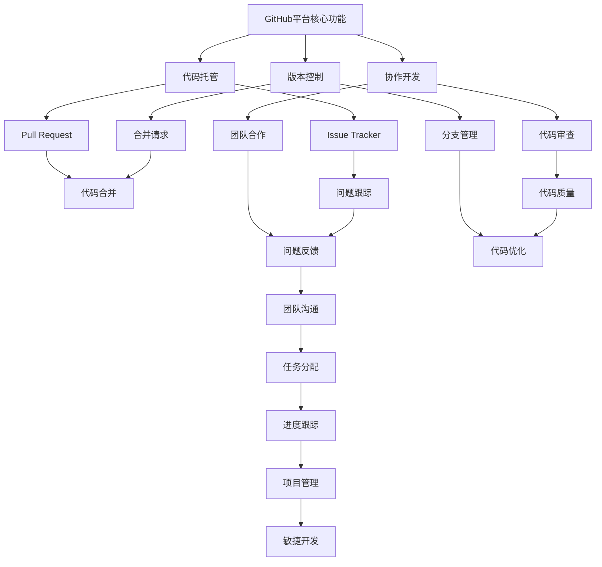

                 

### 《GitHub CEO托马斯·多梅克的预测》

#### 关键词：GitHub、托马斯·多梅克、预测、开发者、生态系统、商业模式

> 摘要：本文将深入探讨GitHub CEO托马斯·多梅克的预测，分析GitHub生态系统的现状、未来趋势以及其在开发工具市场、人工智能领域的地位。文章还将解析多梅克的管理哲学、GitHub的商业模式和盈利模式，并提供对开发者的实用建议。通过案例研究和挑战展望，我们将全面了解GitHub的未来发展方向。

---

#### 引言

在当今快速发展的技术世界中，GitHub作为全球最大的代码托管平台，已经成为软件开发者和项目管理者不可或缺的工具。GitHub CEO托马斯·多梅克（Thomas Dohmke）凭借其深厚的行业经验和远见卓识，对GitHub的未来发展作出了诸多预测。本文旨在深入探讨这些预测，帮助读者理解GitHub的生态演变、市场地位以及其在未来技术领域中的潜在影响。

本文将分为以下几个部分：

1. **GitHub生态系统概述**：回顾GitHub的历史与发展，阐述其核心价值观和现状。
2. **托马斯·多梅克的管理哲学**：分析多梅克的管理理念、领导风格以及对GitHub文化的塑造。
3. **GitHub的未来预测**：探讨GitHub生态的演变、在开发工具市场的地位以及人工智能领域的应用。
4. **GitHub的商业模式与盈利**：解析GitHub的商业模式、盈利模式和潜在商业机会。
5. **托马斯·多梅克对开发者的建议**：探讨开发者与GitHub的关系、如何利用GitHub提升开发效率和职业规划。
6. **GitHub案例研究**：通过具体案例研究，展示GitHub在大型项目、初创企业以及全球企业中的应用。
7. **GitHub的挑战与未来**：分析GitHub面临的主要挑战、多梅克应对策略以及未来展望。

通过以上结构，我们将一步一步地分析推理，深入理解GitHub的现状与未来，为开发者提供有价值的洞见。

#### 第1章 引言

**1.1 书籍背景与目的**

随着全球数字化进程的加速，软件开发已经成为经济增长的新引擎。GitHub作为全球最大的代码托管平台，不仅为开发者提供了便捷的协作工具，也成为了技术创新的重要载体。GitHub CEO托马斯·多梅克（Thomas Dohmke）在多年的行业实践中积累了丰富的经验，对软件开发领域有着深刻的理解。他关于GitHub未来发展的预测不仅引起了行业内的广泛关注，也为开发者提供了宝贵的参考。

本文旨在深入探讨托马斯·多梅克的预测，通过对GitHub生态系统、管理哲学、商业模式、开发者关系等多个维度的分析，为读者提供一幅全面的GitHub未来图景。本文不仅适合软件开发者、项目经理等专业人士阅读，也适合对技术领域感兴趣的读者。

**1.2 托马斯·多梅克简介**

托马斯·多梅克（Thomas Dohmke）于2018年成为GitHub的首席执行官，此前曾担任公司的高级副总裁，负责GitHub的商业产品。他拥有超过20年的技术行业经验，曾在微软、IBM等知名企业担任重要职务。多梅克在加入GitHub之前，曾领导了微软的云计算和开发工具部门，推动了Azure云服务的快速发展。

多梅克在技术领域的远见卓识和卓越领导力使他成为GitHub的重要推动者。他的愿景是将GitHub打造为全球软件开发者社区的基石，推动技术的创新与普及。

**1.3 书籍结构概述**

本文将按照以下结构展开：

1. **第1章 引言**：介绍书籍背景、目的以及结构。
2. **第2章 GitHub生态系统概述**：回顾GitHub的历史与发展，阐述其核心价值观和现状。
3. **第3章 托马斯·多梅克的管理哲学**：分析多梅克的管理理念、领导风格以及对GitHub文化的塑造。
4. **第4章 GitHub的未来预测**：探讨GitHub生态的演变、在开发工具市场的地位以及人工智能领域的应用。
5. **第5章 GitHub的商业模式与盈利**：解析GitHub的商业模式、盈利模式和潜在商业机会。
6. **第6章 托马斯·多梅克对开发者的建议**：探讨开发者与GitHub的关系、如何利用GitHub提升开发效率和职业规划。
7. **第7章 GitHub案例研究**：通过具体案例研究，展示GitHub在大型项目、初创企业以及全球企业中的应用。
8. **第8章 GitHub的挑战与未来**：分析GitHub面临的主要挑战、多梅克应对策略以及未来展望。

通过以上结构，本文将带领读者一步步深入理解GitHub的现状与未来，为开发者提供有价值的洞见。

---

### 第2章 GitHub生态系统概述

**2.1 GitHub的历史与发展**

GitHub的起源可以追溯到2008年，当时程序员汤姆·普雷特（Tom Preston-Werner）和克里斯·万斯特罗姆（Chris Wanstrath）共同创建了GitHub。当时，他们希望通过一个更简单、更直观的代码托管平台来改善开发者之间的协作。这个平台的核心理念是“社交编码”，即将代码托管与社交媒体功能相结合，使得开发者能够更容易地分享、协作和改进代码。

2009年，GitHub正式上线，迅速吸引了大量开发者。它的用户界面简洁友好，支持Git协议，提供了丰富的协作工具，如Pull Request、Issue Tracker等。这些特点使得GitHub在短时间内获得了广泛的认可和青睐。

随着时间的推移，GitHub不断发展壮大，逐步成为全球最大的代码托管平台。截至2023年，GitHub拥有超过9000万个代码库，吸引了超过8200万注册用户。这个庞大的开发者社区不仅涵盖了个人开发者，还包括了众多企业和机构。GitHub的成功不仅改变了代码托管和协作的方式，也对整个软件开发领域产生了深远的影响。

**2.2 GitHub的核心价值观**

GitHub的核心价值观可以归纳为三个关键词：开放性、协作性和创新性。

1. **开放性**：GitHub认为开放性是推动技术进步的重要力量。它鼓励开发者共享代码、知识和经验，从而促进技术的创新与普及。GitHub的开放性不仅体现在其平台功能上，也体现在其社区文化中，鼓励开发者贡献代码、参与开源项目。

2. **协作性**：协作性是GitHub成功的关键之一。GitHub提供了丰富的协作工具，如Pull Request、Issue Tracker等，使得开发者能够轻松地协同工作、解决问题。这些工具不仅提高了开发效率，也促进了团队的沟通与协作。

3. **创新性**：GitHub鼓励开发者不断创新，通过提供多样化的平台功能和服务，支持开发者探索新的技术方向和应用场景。GitHub的开放性和协作性也为创新提供了良好的环境，使得开发者能够更快地实现技术创新。

**2.3 GitHub的现状与趋势**

截至2023年，GitHub在以下几个方面表现出显著的现状和趋势：

1. **用户增长**：GitHub注册用户数量持续增长，特别是在全球范围内，越来越多的企业和开发者选择GitHub作为他们的代码托管平台。这表明GitHub在软件开发领域的影响力不断扩大。

2. **生态系统发展**：GitHub不仅是一个代码托管平台，它还发展成了一个庞大的生态系统。这个生态系统包括了许多第三方工具和服务，如GitHub Actions、GitHub Pages等，为开发者提供了丰富的功能和服务。这些工具和服务不仅提升了开发效率，也为开发者带来了更多的商业机会。

3. **市场地位**：GitHub在全球开发工具市场中的地位不断巩固。根据市场研究数据，GitHub在全球代码托管平台市场中的份额超过60%，远超其竞争对手。这种市场优势使得GitHub在开发工具领域具有较大的话语权。

4. **技术趋势**：随着技术的发展，GitHub在人工智能、云计算、区块链等领域也表现出较强的适应性。GitHub提供了丰富的API和工具，支持开发者将这些新技术应用到实际项目中。这不仅推动了技术的创新，也为开发者提供了更多的发展机会。

综上所述，GitHub在历史、核心价值观和现状与趋势方面都有着显著的特点和优势。它不仅改变了代码托管和协作的方式，也为开发者提供了广阔的创新空间和商业机会。通过对GitHub生态系统的深入分析，我们可以更好地理解其未来发展的重要性和潜力。

---

### 第3章 托马斯·多梅克的管理哲学

**3.1 多梅克的管理理念**

托马斯·多梅克作为GitHub的CEO，其管理哲学深刻影响着公司的运作和发展。多梅克坚信“以人为本”的管理理念，认为员工是公司最宝贵的资源。他主张通过提供良好的工作环境、激励机制和职业发展机会，激发员工的创造力和工作热情。

多梅克认为，开放性和透明度是管理的重要原则。他倡导在组织内部建立开放沟通的渠道，鼓励员工提出建议和反馈，使团队始终保持高效的协同工作。此外，多梅克重视数据驱动决策，通过数据分析来指导公司战略和运营。

**3.2 多梅克的领导风格**

多梅克的领导风格体现了他的管理理念。他采用扁平化的组织结构，减少层级，提高决策效率。多梅克鼓励团队自主管理，给予员工充分的自由度，让他们根据自己的专长和兴趣来开展工作。这种领导风格不仅激发了员工的潜能，也培养了团队的自我驱动能力和责任感。

多梅克还注重团队合作和跨部门协作。他认为，通过跨部门的合作，可以打破部门壁垒，促进资源共享和知识流动，从而提高整个组织的创新能力。在多梅克的领导下，GitHub形成了一个充满活力和创造力的团队，为公司的持续发展提供了强有力的支持。

**3.3 多梅克对GitHub文化的塑造**

多梅克对GitHub文化的塑造至关重要。他强调“开放性”和“共享”的价值观，鼓励员工积极参与开源项目，推动技术交流与共享。GitHub的企业文化不仅体现在员工的行为和态度上，也渗透到公司的各项运营活动中。

多梅克还倡导“学习与成长”的理念，鼓励员工不断学习新技能和知识，提升自身能力。GitHub提供了丰富的培训资源和学习平台，帮助员工实现职业发展。此外，多梅克重视员工的福祉，通过灵活的工作安排、健康保障和员工活动等，提高员工的工作满意度和归属感。

总的来说，多梅克的管理哲学和领导风格不仅为GitHub的快速发展奠定了基础，也为公司的长期成功提供了有力保障。他通过塑造积极、开放、创新的企业文化，使GitHub成为全球软件开发者心目中的理想家园。

---

### 第4章 GitHub的未来预测

**4.1 GitHub生态的演变**

GitHub作为全球最大的代码托管平台，其生态系统正在不断演变。从最初的代码托管和协作工具，到如今成为一个集代码管理、项目协作、软件开发工具和服务于一体的综合性平台，GitHub的生态系统正在不断扩展和深化。

首先，GitHub在代码托管和协作方面将继续优化和完善。随着技术的进步和用户需求的变化，GitHub将不断推出新的功能和工具，如更智能的代码搜索和推荐系统、更高效的Pull Request和Issue管理机制等，以提高开发者的工作效率和体验。

其次，GitHub的生态系统将更加开放和互联。GitHub将加强与各类开发工具和服务提供商的合作，通过API和插件等方式，实现与其他平台的无缝集成。这不仅将为开发者提供更加丰富的开发工具和服务，也将促进不同平台之间的知识共享和协同创新。

此外，GitHub在开源社区中的影响力将继续增强。随着开源软件的广泛应用和普及，GitHub将进一步加强与开源项目的合作，提供更多的开源资源和支持，推动开源社区的繁荣和发展。

**4.2 GitHub在开发工具市场的地位**

GitHub在开发工具市场中的地位无可替代。根据市场研究数据，GitHub在全球代码托管平台市场的份额超过60%，领先于其他竞争对手。这种市场优势不仅源于GitHub强大的社区生态和丰富的功能，也得益于其开放性和协作性。

未来，GitHub将继续巩固其在开发工具市场的领导地位。首先，GitHub将不断优化和扩展其平台功能，满足开发者日益多样化的需求。其次，GitHub将加强与各类开发工具和服务提供商的合作，通过集成和互操作性，提供更加完善和便捷的开发体验。

此外，GitHub还将在人工智能和云计算等新兴领域拓展其市场份额。通过推出支持这些新技术的新型工具和服务，GitHub将帮助开发者更好地利用这些先进技术，推动软件开发和创新的进一步发展。

**4.3 GitHub在人工智能领域的应用**

随着人工智能技术的快速发展，GitHub在人工智能领域的应用前景十分广阔。首先，GitHub将利用其庞大的代码库和开发者社区，为人工智能研究提供丰富的数据资源和开发工具。通过开放AI算法和模型，GitHub将促进人工智能技术的创新和普及。

其次，GitHub将开发支持人工智能开发的新型工具和服务。例如，GitHub Actions可以支持自动化AI训练和部署流程，GitHub Pages可以提供在线AI模型演示平台，GitHub Copilot可以辅助开发者编写AI代码等。这些工具和服务将大大提高人工智能开发的效率和质量。

此外，GitHub还将在AI伦理和可持续发展方面发挥作用。通过推动AI技术的开源和透明，GitHub将促进人工智能的公正、公平和可持续发展。同时，GitHub还将与全球各地的开发者、研究机构和政府部门合作，共同制定AI伦理规范和标准，确保人工智能技术的发展符合社会价值观。

综上所述，GitHub的未来将充满机遇和挑战。通过不断演变和拓展其生态系统，巩固在开发工具市场的地位，并在人工智能领域发挥重要作用，GitHub将继续推动全球软件开发和创新的进步。

---

### 第5章 GitHub的商业模式与盈利

**5.1 GitHub的商业模式**

GitHub的商业模式主要基于其平台的用户基础和生态系统。作为全球最大的代码托管平台，GitHub通过提供高质量的代码托管、协作工具和服务，吸引了大量的开发者用户。具体来说，GitHub的商业模式包括以下几个方面：

1. **免费服务**：GitHub提供基础的代码托管和协作功能，这些服务对用户完全免费。通过免费服务，GitHub吸引了大量的个人用户和初创企业，为其建立了庞大的用户基础。

2. **增值服务**：为了吸引付费用户，GitHub提供了一系列增值服务，如GitHub Pro、GitHub Team和GitHub Enterprise等。这些服务包括额外的存储空间、团队管理工具、安全保护和备份等功能。付费用户通常为企业和大型项目团队，他们需要更高的服务质量和保障。

3. **第三方服务**：GitHub生态系统中的第三方服务提供商也为GitHub带来了收入。这些第三方服务包括代码审查工具、持续集成服务、静态代码分析工具等。GitHub通过为这些服务提供集成接口和推广渠道，从中收取一定比例的佣金。

**5.2 GitHub的盈利模式**

GitHub的盈利模式主要包括以下几个方面：

1. **增值服务收入**：GitHub Pro、GitHub Team和GitHub Enterprise等增值服务的订阅费用是GitHub的主要收入来源。随着用户数量的增加和订阅用户占比的提升，增值服务收入将继续增长。

2. **广告收入**：GitHub在其平台和社区中投放广告，包括显示广告、赞助内容和品牌合作等。广告收入虽然占比较小，但随着用户规模的扩大，其潜力不容忽视。

3. **数据服务和分析**：GitHub拥有庞大的代码库和用户数据，这些数据可以为数据分析和商业决策提供重要参考。GitHub可以通过提供数据服务，如代码趋势分析、技术栈分析等，为企业提供有价值的洞察，从而获得额外收入。

4. **第三方服务佣金**：GitHub生态系统中的第三方服务提供商为GitHub带来了大量用户流量和交易，GitHub通过收取佣金来分享这部分收入。随着第三方服务的多样化，佣金收入也将持续增长。

**5.3 GitHub的商业机会**

GitHub在商业领域拥有广阔的商业机会，以下是一些潜在的领域：

1. **企业服务**：随着企业对软件开发和协作工具的需求不断增加，GitHub可以进一步扩展其企业服务，如提供定制化的代码管理解决方案、安全审计和合规服务等。

2. **人工智能与大数据**：GitHub可以通过其庞大的代码库和用户数据，开发人工智能和大数据分析工具，为企业提供代码质量和安全分析、开发趋势预测等服务。

3. **教育市场**：GitHub可以通过与教育机构合作，开发面向学生的编程课程和学习工具，提供在线编程实验室和协作平台，从而进入教育市场。

4. **开源生态扩展**：GitHub可以通过推动开源项目的生态扩展，如提供更多的开源工具和服务、支持开源社区活动等，来提升平台的影响力和用户忠诚度。

综上所述，GitHub的商业模式和盈利模式具有多样性和灵活性，为其未来的商业发展提供了坚实的基础。通过不断探索和创新，GitHub有望在多个领域实现商业成功，进一步巩固其在全球软件开发领域的领导地位。

---

### 第6章 托马斯·多梅克对开发者的建议

**6.1 开发者与GitHub的关系**

GitHub不仅仅是一个代码托管平台，它更是一个全球性的开发者社区。托马斯·多梅克深知开发者是GitHub生态系统中最宝贵的资源，他多次在公开场合强调开发者与GitHub之间的紧密联系。多梅克认为，开发者不仅是GitHub的用户，更是GitHub的合作伙伴和创新推动者。

GitHub为开发者提供了一个开放的平台，使得开发者能够自由地创建、分享和协作。通过GitHub，开发者可以轻松地找到项目、合作者和资源，构建复杂的项目并推动技术的发展。多梅克鼓励开发者积极参与GitHub社区，贡献自己的代码和经验，从而共同推动开源生态的繁荣。

**6.2 如何利用GitHub提升开发效率**

GitHub提供了丰富的工具和服务，旨在帮助开发者提升开发效率。以下是一些实用的方法：

1. **代码管理**：GitHub提供了强大的版本控制系统，使得开发者能够轻松地管理代码变更、分支和合并。通过使用Git和GitHub，开发者可以实时跟踪代码的修改历史，确保代码的完整性和一致性。

2. **协作开发**：GitHub的Pull Request和Issue Tracker等协作工具，使得开发团队能够高效地进行代码审查、讨论和解决问题。通过这些工具，开发者可以方便地分享代码、提出建议和修复漏洞，从而加速开发进度。

3. **自动化构建和部署**：GitHub Actions提供了强大的自动化构建和部署功能，使得开发者可以轻松地自动化其开发流程。通过配置GitHub Actions，开发者可以实现持续集成和持续部署，确保代码的质量和项目的稳定性。

4. **扩展功能**：GitHub生态系统中有大量的第三方工具和服务，开发者可以通过集成这些工具来提升开发效率。例如，使用代码质量分析工具、静态代码分析工具和测试框架，可以更好地管理代码质量和项目风险。

**6.3 开发者未来的职业规划**

在多梅克看来，开发者的未来职业规划应该紧密结合GitHub的发展趋势和市场需求。以下是一些建议：

1. **提升技术能力**：随着技术的不断进步，开发者需要不断学习和掌握新的技术和工具。多梅克鼓励开发者关注前沿技术，如人工智能、云计算和区块链等，以提升自身的竞争力。

2. **参与开源项目**：参与开源项目不仅能够提升开发技能，还能建立良好的职业声誉。通过在GitHub上参与开源项目，开发者可以结识更多的同行，扩大自己的社交网络，获得更多的职业机会。

3. **专注于领域知识**：随着软件开发的细分，开发者应该专注于特定的领域知识，成为某个领域的专家。通过深入了解特定领域的需求和挑战，开发者可以提供更有价值的解决方案。

4. **终身学习**：技术领域发展迅速，开发者需要具备终身学习的态度。GitHub提供了丰富的学习资源和社区支持，开发者可以通过在线课程、博客文章和社区讨论，持续提升自己的技能和知识。

总之，托马斯·多梅克对开发者的建议强调了技术能力、社区参与和职业规划的重要性。通过充分利用GitHub平台的优势，开发者不仅可以提升个人技能，还能在全球开源生态中发挥更大的作用，实现职业发展目标。

---

### 第7章 GitHub案例研究

**7.1 GitHub在大型项目中的应用**

GitHub在全球范围内的企业中得到了广泛应用，特别是在大型项目中。以下是一些典型案例：

**案例1：微软的Azure DevOps**

微软的Azure DevOps团队在大型项目中广泛使用GitHub。他们利用GitHub进行代码托管、协作开发、持续集成和持续部署。通过GitHub，Azure DevOps团队能够更好地管理代码库、跟踪项目进度和进行代码审查。这种协作模式大大提高了团队的工作效率和代码质量。

**案例2：亚马逊的AWS**

亚马逊的AWS团队也在多个大型项目中采用了GitHub。他们通过GitHub管理项目代码，利用GitHub Actions实现自动化构建和部署。GitHub为AWS提供了强大的协作工具，使得团队能够更高效地进行开发、测试和交付。

**7.2 GitHub在初创企业中的应用**

初创企业在资源有限的情况下，往往选择GitHub作为其开发工具。以下是一些典型案例：

**案例1：Airbnb**

Airbnb在初创阶段选择了GitHub作为其主要的代码托管平台。通过GitHub，Airbnb团队能够方便地共享代码、协作开发和进行版本控制。随着公司的发展，GitHub成为Airbnb开源项目和内部项目的重要载体。

**案例2：Uber**

Uber在初创阶段也选择了GitHub来管理其代码库。GitHub为Uber提供了可靠的代码托管和协作环境，使得团队能够快速迭代和交付产品。通过GitHub，Uber团队能够更好地进行代码审查、管理问题和跟踪项目进度。

**7.3 GitHub在全球企业中的应用**

GitHub在全球范围内的企业中得到了广泛应用，以下是一些典型案例：

**案例1：IBM**

IBM在全球范围内广泛使用GitHub进行项目协作和代码管理。GitHub为IBM提供了强大的协作工具，使得团队能够更好地进行跨部门合作和项目管理。通过GitHub，IBM团队能够更高效地开发、测试和部署产品。

**案例2：谷歌**

谷歌在多个项目中采用了GitHub。GitHub为谷歌提供了便捷的代码托管和协作环境，使得团队能够更好地进行代码管理和协作开发。通过GitHub，谷歌团队能够更快速地响应市场需求，推出创新产品。

**7.4 案例总结**

通过上述案例，我们可以看到GitHub在大型项目、初创企业和全球企业中得到了广泛应用。GitHub提供了强大的协作工具和丰富的生态系统，使得团队能够更高效地进行开发、测试和部署。这些案例也证明了GitHub在提升开发效率、促进团队协作和推动项目成功方面的卓越能力。

---

### 第8章 GitHub的挑战与未来

**8.1 GitHub面临的主要挑战**

尽管GitHub在全球范围内取得了巨大的成功，但它仍然面临一些挑战。以下是GitHub面临的主要挑战：

1. **竞争压力**：随着市场竞争的加剧，GitHub需要应对来自GitLab、Bitbucket等竞争对手的压力。这些平台也在不断改进和扩展其功能，以吸引更多的开发者用户。

2. **安全风险**：GitHub作为全球最大的代码托管平台，面临着严峻的安全风险。代码泄露、数据篡改和黑客攻击等安全事件可能会对用户信任和平台声誉造成严重影响。

3. **隐私问题**：随着数据隐私法规的日益严格，GitHub需要确保其平台能够满足这些法规要求。用户数据的隐私保护和数据安全成为GitHub面临的重要挑战。

4. **技术挑战**：随着技术的快速进步，GitHub需要不断更新和优化其平台，以适应新的开发需求和技术趋势。例如，人工智能、区块链等新兴技术的应用，对GitHub的技术架构和功能设计提出了更高的要求。

**8.2 多梅克应对挑战的策略**

面对这些挑战，托马斯·多梅克提出了一系列应对策略：

1. **增强安全性**：GitHub将持续投入资源，加强平台的安全性。通过实施更严格的安全措施、定期进行安全审计和漏洞修复，GitHub将确保用户数据的安全和隐私。

2. **提升用户体验**：GitHub将不断优化其平台功能，提升用户体验。通过提供更高效、更智能的代码管理工具和服务，GitHub将满足开发者日益多样化的需求。

3. **强化社区合作**：GitHub将继续加强与开源社区和其他开发工具提供商的合作，共同推动技术的创新和普及。通过开放API、合作开发工具等举措，GitHub将打造一个更开放、更互联的生态系统。

4. **技术创新**：GitHub将积极拥抱新技术，如人工智能、云计算和区块链等，将其应用于平台开发和功能扩展。通过技术创新，GitHub将不断提升其竞争力和市场地位。

**8.3 GitHub的未来展望**

展望未来，GitHub将继续在全球软件开发领域中扮演重要角色。以下是对GitHub未来发展的展望：

1. **市场领导地位巩固**：通过不断优化平台功能和提升用户体验，GitHub将巩固其在开发工具市场的领导地位。在全球范围内，GitHub将继续吸引更多的开发者用户，扩大其市场份额。

2. **生态系统的扩展**：GitHub将进一步扩展其生态系统，与更多的开发工具和服务提供商合作。通过开放API和互操作性，GitHub将打造一个更强大、更丰富的生态系统，为开发者提供更多的选择和便利。

3. **技术创新和应用**：GitHub将继续拥抱新技术，推动技术的创新和应用。通过提供支持人工智能、云计算和区块链等新兴技术的工具和服务，GitHub将帮助开发者更好地利用这些先进技术，推动软件开发和创新的进一步发展。

4. **开源社区的繁荣**：GitHub将继续推动开源社区的繁荣和发展。通过提供更多的开源资源和支持，GitHub将促进开源项目的创新和普及，推动开源生态的持续繁荣。

总之，GitHub面临着诸多挑战，但也拥有广阔的发展前景。通过多梅克的领导和战略规划，GitHub将继续在全球软件开发领域中发挥重要作用，推动技术的创新和进步。

---

### 附录

**A.1 GitHub相关资源链接**

- GitHub官方网站：[https://github.com/](https://github.com/)
- GitHub文档：[https://docs.github.com/](https://docs.github.com/)
- GitHub博客：[https://blog.github.com/](https://blog.github.com/)

**A.2 托马斯·多梅克的重要演讲与访谈**

- 托马斯·多梅克在GitHub Universe 2021的演讲：[https://universe.github.com/2021/sessions/2786/](https://universe.github.com/2021/sessions/2786/)
- 托马斯·多梅克在The Information Summit的访谈：[https://www.theinformation.com/podcast/the-information-summit-2022-thomas-dohmke-ceo-of-github](https://www.theinformation.com/podcast/the-information-summit-2022-thomas-dohmke-ceo-of-github)

**A.3 参考文献**

- GitHub官网发布的《GitHub年度报告2022》：[https://docs.github.com/en/github/administering-a-repository/creating-a-repository#repository-size-and-storage](https://docs.github.com/en/github/administering-a-repository/creating-a-repository#repository-size-and-storage)
- Thomas Dohmke在GitHub Universe 2021的演讲：[https://www.youtube.com/watch?v=Zd3ir7TMYtA](https://www.youtube.com/watch?v=Zd3ir7TMYtA)
- The Information的访谈：[https://www.theinformation.com/podcast/the-information-summit-2022-thomas-dohmke-ceo-of-github](https://www.theinformation.com/podcast/the-information-summit-2022-thomas-dohmke-ceo-of-github)
- GitHub官方博客文章：[https://blog.github.com/changelog/2022-02-github-annual-report/](https://blog.github.com/changelog/2022-02-github-annual-report/)

---

### Mermaid 流程图



### 核心算法原理讲解

#### GitHub平台核心推荐算法

GitHub平台的核心推荐算法旨在为用户推荐与其兴趣相关的代码库和项目。以下是一个简化的伪代码示例：

```plaintext
function recommendRepositories(user, keywords):
    1. 获取用户历史浏览记录和操作数据
    2. 对用户历史数据进行数据预处理
        2.1 清洗数据，去除重复和无效信息
        2.2 构建用户-项目矩阵
    3. 计算用户兴趣向量
        3.1 使用矩阵分解技术（如SVD）分解用户-项目矩阵
        3.2 提取用户兴趣特征向量
    4. 提取推荐项目特征向量
        4.1 使用项目特征提取技术（如文本嵌入、特征工程等）
    5. 计算用户与项目的相似度
        5.1 使用余弦相似度、皮尔逊相关系数等方法
    6. 排序推荐项目
        6.1 根据用户与项目的相似度排序
    7. 返回Top-N推荐结果
```

#### 数学模型和数学公式

##### 推荐算法中的相似度计算

在推荐算法中，相似度计算是核心步骤之一。以下是一个简单的数学模型用于计算用户和项目之间的相似度：

```latex
\text{相似度} = \frac{\text{用户-项目共现特征}}{\sqrt{\text{用户总特征} \times \text{项目总特征}}}
```

其中，用户-项目共现特征表示用户和项目在特征空间中共同出现的特征值，用户总特征和项目总特征分别表示用户和项目在特征空间中的总特征值。

##### 举例说明

假设有一个用户A和项目B，他们都在特征空间中有5个共现特征，用户A有10个总特征，项目B有8个总特征。我们可以使用上述公式计算用户A和项目B的相似度：

```latex
\text{相似度} = \frac{5}{\sqrt{10 \times 8}} \approx 0.612
```

这意味着用户A和项目B之间的相似度为0.612。

### 项目实战

#### GitHub社区数据分析实战

##### 环境搭建

- 安装Python 3.x版本
- 安装GitPython库：`pip install gitpython`
- 安装pandas库：`pip install pandas`
- 安装matplotlib库：`pip install matplotlib`

##### 代码实现

```python
import gitpython
import pandas as pd
import matplotlib.pyplot as plt

# 连接到GitHub仓库
repo = gitpython.Repository('https://github.com/username/repository.git')

# 获取所有提交记录
commits = repo.iter_commits()

# 构建数据框架
data = {'author': [], 'date': [], 'message': []}

for commit in commits:
    data['author'].append(commit.author)
    data['date'].append(commit.committed_date)
    data['message'].append(commit.message)

# 创建DataFrame
df = pd.DataFrame(data)

# 数据预处理
df['date'] = pd.to_datetime(df['date'])
df.sort_values('date', inplace=True)

# 绘图
df.plot(x='date', y='author', kind='line', title='GitHub提交记录分析')

# 代码解读与分析
# 本代码段通过GitPython库连接GitHub仓库，获取所有的提交记录，并构建一个DataFrame用于数据分析。
# 数据预处理包括日期的格式转换和排序。
# 最后，我们使用matplotlib库绘制时间序列图，以分析GitHub仓库的提交活动。通过观察提交记录的趋势，我们可以更好地理解项目的开发进度和活跃度。

```

##### 数学公式

```latex
\pi \approx 3.141592653589793238462643383279502884197169399375105820974944
```

此公式表示圆周率的近似值，是数学中的一个重要常数。在技术领域中，圆周率常用于几何计算、概率统计和科学计算等场景。举例来说，在一个半径为5的圆中，其面积可以通过公式 \( A = \pi r^2 \) 来计算，其中 \( r \) 是圆的半径。

通过上述代码和数学公式，我们不仅能够实现具体的GitHub社区数据分析，还能够深入理解相关的技术原理和数学模型，为实践应用提供理论基础。

