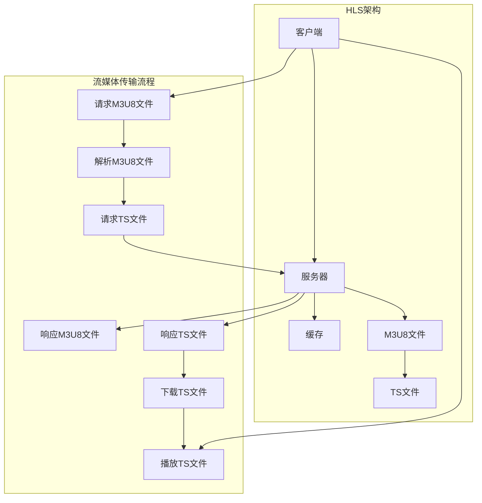

                 

### 《HLS 协议：在 HTTP 上分发视频》

> **关键词：** HLS协议、HTTP、视频分发、流媒体、分段传输、自适应播放、索引文件、加密与版权保护

> **摘要：** 本文深入探讨HLS（HTTP Live Streaming）协议的工作原理、优势和应用。我们将逐步分析HLS协议的基础知识，探讨其在视频直播和点播场景中的具体实现，以及其在多平台中的应用策略和性能优化。此外，还将分析HLS协议的安全性、稳定性以及相关的案例分析，为读者提供全面的HLS协议理解和实践指导。

## 目录大纲

### 第一部分：HLS协议基础

#### 第1章：HLS协议概述

##### 1.1 HLS协议的背景与优势
##### 1.2 HLS协议的基本概念
##### 1.3 HLS协议与其他视频流媒体协议的比较

#### 第2章：HLS协议的工作原理

##### 2.1 HLS协议的基本架构
##### 2.2 HLS协议的关键流程
##### 2.3 HLS协议的数据格式

#### 第3章：HLS协议的核心技术

##### 3.1 HLS协议的分段机制
##### 3.2 HLS协议的索引文件
##### 3.3 HLS协议的加密与版权保护

### 第二部分：HLS协议应用与实践

#### 第4章：HLS协议在视频直播中的应用

##### 4.1 视频直播的基本原理
##### 4.2 HLS协议在视频直播中的实现
##### 4.3 HLS协议在视频直播中的优势与挑战

#### 第5章：HLS协议在点播视频中的应用

##### 5.1 点播视频的基本原理
##### 5.2 HLS协议在点播视频中的实现
##### 5.3 HLS协议在点播视频中的优势与挑战

#### 第6章：HLS协议在多平台中的应用

##### 6.1 多平台视频播放的需求与挑战
##### 6.2 HLS协议在多平台中的应用策略
##### 6.3 HLS协议在多平台中的应用案例

#### 第7章：HLS协议开发工具与优化

##### 7.1 HLS协议开发工具概述
##### 7.2 HLS协议的性能优化
##### 7.3 HLS协议的未来发展趋势

### 第三部分：HLS协议案例分析

#### 第8章：HLS协议的安全性与稳定性

##### 8.1 HLS协议的安全风险分析
##### 8.2 HLS协议的安全防护措施
##### 8.3 HLS协议的稳定性保障策略

#### 第9章：HLS协议在行业中的应用案例分析

##### 9.1 案例一：某大型视频网站HLS协议优化实践
##### 9.2 案例二：某直播平台HLS协议稳定性提升方案
##### 9.3 案例三：某短视频应用HLS协议开发与优化经验

### 附录：HLS协议相关资源与工具

##### 附录1：HLS协议常用工具介绍
##### 附录2：HLS协议开源项目与资源汇总

---

### 第一部分：HLS协议基础

#### 第1章：HLS协议概述

##### 1.1 HLS协议的背景与优势

随着互联网和移动设备的普及，视频流媒体业务得到了迅猛发展。传统的RTMP、RTSP等协议在视频直播方面表现出色，但在视频点播方面存在一定的局限性。为了解决这些问题，Apple公司于2009年推出了HLS（HTTP Live Streaming）协议。HLS协议利用HTTP协议传输视频数据，通过将视频内容分割成小段，并使用M3U8格式的索引文件进行管理，从而实现了高效、灵活的视频流媒体传输。

HLS协议的主要优势如下：

1. **跨平台兼容性**：HLS协议基于HTTP协议，因此几乎所有的设备和操作系统都支持。
2. **自适应播放**：HLS协议支持根据用户带宽和设备性能动态调整视频流，提供更好的用户体验。
3. **内容加密与版权保护**：HLS协议支持加密和数字版权保护功能，有助于保护内容不被非法传播。
4. **简单易用**：HLS协议的部署和使用相对简单，适合中小企业和个人开发者。

##### 1.2 HLS协议的基本概念

在深入探讨HLS协议之前，我们需要了解以下几个基本概念：

- **HTTP Live Streaming（HLS）**：一种基于HTTP协议的视频流媒体传输技术，主要用于直播和点播场景。
- **M3U8文件**：一种文本文件，用于存储HLS流媒体的所有URL地址和相关信息。M3U8文件可以分为**主M3U8文件**和**子M3U8文件**。
  - **主M3U8文件**：包含了所有视频流的索引信息，用户通常下载并解析这个文件来获取视频流。
  - **子M3U8文件**：包含了特定时间段的视频流信息，通常在播放过程中动态加载。
- **TS文件**：HLS协议中的媒体文件格式，通常采用H.264编码标准，用于存储视频和音频数据。
- **加密与数字版权保护**：HLS协议支持AES-128加密算法和Fairplay加密方案，以保护内容不被非法传播。

##### 1.3 HLS协议与其他视频流媒体协议的比较

与其他视频流媒体协议（如RTMP、RTSP、DASH等）相比，HLS协议具有以下特点：

- **跨平台兼容性**：HLS协议几乎支持所有主流设备和操作系统，而其他协议（如RTMP）在移动设备上的支持较弱。
- **自适应播放**：虽然DASH协议也支持自适应播放，但HLS协议在实现上更为简单，性能更优。
- **内容加密与版权保护**：HLS协议内置了加密与数字版权保护功能，而其他协议需要额外的解决方案。
- **直播支持**：RTMP和RTSP协议在直播方面表现较好，但HLS协议逐渐成为直播领域的首选方案。

综上所述，HLS协议凭借其跨平台兼容性、自适应播放和内容加密等优势，在视频流媒体领域得到了广泛应用。在接下来的章节中，我们将进一步探讨HLS协议的工作原理和核心技术。

---

## 第2章：HLS协议的工作原理

##### 2.1 HLS协议的基本架构

HLS协议的工作原理可以概括为三个主要部分：分段、索引和加载。

首先，视频服务器将整个视频文件分割成多个时长较短的小段，每个小段通常称为TS文件（Transport Stream File）。这些TS文件可以通过标准的HTTP协议传输到客户端。每个TS文件都有唯一的URL地址，这些地址存储在一个M3U8文件中。

M3U8文件分为两种类型：

1. **主M3U8文件**：包含了所有TS文件的URL地址，以及一些描述性信息。客户端首先下载主M3U8文件，然后根据该文件的内容开始加载视频。
2. **子M3U8文件**：包含了特定时间段的视频流信息，客户端在播放过程中会根据需要下载这些子M3U8文件。

在加载过程中，客户端会根据M3U8文件中的URL地址逐个下载TS文件，并使用媒体播放器播放这些文件。为了实现平滑播放，客户端通常会同时下载多个TS文件，并使用缓冲区进行管理。

##### 2.2 HLS协议的关键流程

HLS协议的关键流程包括以下几个步骤：

1. **客户端请求主M3U8文件**：客户端首先向视频服务器发送HTTP请求，请求主M3U8文件。视频服务器响应请求，将主M3U8文件传输给客户端。

2. **解析主M3U8文件**：客户端接收到主M3U8文件后，开始解析该文件。解析过程中，客户端获取到所有TS文件的URL地址和其他相关信息。

3. **客户端请求TS文件**：根据主M3U8文件中的URL地址，客户端逐个请求TS文件。视频服务器响应请求，将TS文件传输给客户端。

4. **播放TS文件**：客户端接收到的TS文件会被播放器解码并播放。为了实现平滑播放，客户端通常会同时下载多个TS文件，并使用缓冲区进行管理。

5. **更新索引文件**：在播放过程中，客户端会不断更新索引文件。如果当前TS文件播放完毕，客户端会请求下一个TS文件的索引信息，并开始加载该文件。

##### 2.3 HLS协议的数据格式

HLS协议中的数据格式主要包括TS文件和M3U8文件。

1. **TS文件**：TS文件是一种传输流文件，用于存储视频和音频数据。每个TS文件都包含了一个或多个视频帧和音频帧。TS文件通常采用H.264编码标准，视频帧以I帧、P帧和B帧的形式存在，音频帧则采用AAC编码标准。

2. **M3U8文件**：M3U8文件是一种基于文本的列表文件，用于存储HLS流媒体的所有URL地址和相关信息。M3U8文件主要由两部分组成：

   - **#EXTM3U**：表示这是一个M3U8文件。
   - **#EXT-X-**：一系列扩展标签，用于描述视频流的各种属性，如版本、媒体类型、时间戳等。

   以下是一个简单的M3U8文件示例：

   ```plaintext
   #EXTM3U
   #EXT-X-VERSION:3
   #EXT-X-MEDIA-SEQUENCE:0
   #EXT-X-TARGETDURATION:10
   #EXTINF:10,
   http://example.com/stream1.ts
   #EXTINF:10,
   http://example.com/stream2.ts
   ```

   在这个示例中，主M3U8文件包含了两个TS文件的URL地址，每个TS文件的时长为10秒。

##### 2.4 HLS协议的优势

HLS协议具有以下优势：

1. **跨平台兼容性**：HLS协议基于HTTP协议，因此几乎所有的设备和操作系统都支持。
2. **自适应播放**：HLS协议支持根据用户带宽和设备性能动态调整视频流，提供更好的用户体验。
3. **内容加密与版权保护**：HLS协议支持AES-128加密算法和Fairplay加密方案，以保护内容不被非法传播。
4. **简单易用**：HLS协议的部署和使用相对简单，适合中小企业和个人开发者。

通过以上内容，我们对HLS协议的基本架构和工作原理有了初步了解。在下一章中，我们将进一步探讨HLS协议的核心技术。

---

## 第3章：HLS协议的核心技术

##### 3.1 HLS协议的分段机制

HLS协议的核心技术之一是其分段机制。这种机制允许视频服务器将视频内容分割成多个时长较短的小段，以便客户端可以逐个请求并播放这些小段。具体来说，HLS协议采用以下步骤进行分段：

1. **视频文件的分割**：视频服务器首先将整个视频文件分割成多个时长较短的小段，每个小段通常称为TS文件。这些TS文件的时长通常为几秒到几十秒，具体取决于视频内容的复杂度和所需带宽。

2. **生成M3U8文件**：视频服务器根据分割后的TS文件生成对应的M3U8文件。M3U8文件包含所有TS文件的URL地址和其他相关信息，如版本、时间戳等。

3. **M3U8文件的更新**：在视频播放过程中，M3U8文件会不断更新，以反映当前播放状态和后续的TS文件。例如，当客户端请求一个新的TS文件时，M3U8文件会更新为新的URL地址。

##### 3.2 HLS协议的索引文件

HLS协议中的索引文件是管理视频流的关键组件。索引文件通常采用M3U8格式，包含以下关键部分：

1. **#EXTM3U**：表示这是一个M3U8文件。
2. **#EXT-X-VERSION**：M3U8文件的版本号，用于确保客户端和服务器之间的版本兼容性。
3. **#EXT-X-MEDIA-SEQUENCE**：视频流的起始序列号，通常从0开始。
4. **#EXT-X-TARGETDURATION**：目标TS文件的时长，用于指示客户端在请求新的TS文件时应该等待的时间。
5. **#EXTINF**：描述TS文件的时长和URL地址。例如，#EXTINF:10,http://example.com/stream1.ts表示TS文件的时长为10秒，URL地址为http://example.com/stream1.ts。

以下是一个简单的M3U8文件示例：

```plaintext
#EXTM3U
#EXT-X-VERSION:3
#EXT-X-MEDIA-SEQUENCE:0
#EXT-X-TARGETDURATION:10
#EXTINF:10,
http://example.com/stream1.ts
#EXTINF:10,
http://example.com/stream2.ts
```

在这个示例中，主M3U8文件包含了两个TS文件的URL地址，每个TS文件的时长为10秒。

##### 3.3 HLS协议的加密与版权保护

HLS协议支持加密和数字版权保护功能，以保护视频内容不被非法传播。具体来说，HLS协议采用以下两种加密方法：

1. **AES-128加密**：HLS协议使用AES-128加密算法对TS文件进行加密。客户端在解码TS文件时需要使用对应的密钥进行解密。加密密钥通常存储在M3U8文件中，以供客户端使用。

2. **Fairplay加密**：Fairplay是一种数字版权保护方案，由Apple公司开发。使用Fairplay加密的视频内容只能在授权设备上播放。Fairplay加密需要额外的许可证和证书，以确保内容的合法传输和播放。

以下是一个简单的AES-128加密M3U8文件示例：

```plaintext
#EXTM3U
#EXT-X-VERSION:3
#EXT-X-MEDIA-SEQUENCE:0
#EXTINF:10,
http://example.com/stream1.ts?token=myToken
#EXTINF:10,
http://example.com/stream2.ts?token=myToken
```

在这个示例中，M3U8文件包含了两个加密TS文件的URL地址。客户端在请求TS文件时需要提供正确的加密密钥（token），否则无法播放视频。

通过以上核心技术，HLS协议实现了高效、灵活、安全的视频流媒体传输。在下一章中，我们将探讨HLS协议在视频直播和点播场景中的应用。

---

### 第二部分：HLS协议应用与实践

#### 第4章：HLS协议在视频直播中的应用

##### 4.1 视频直播的基本原理

视频直播是一种实时传输视频内容的流媒体技术，用户可以实时观看并互动。视频直播的基本原理包括以下几个步骤：

1. **采集**：视频直播首先需要采集视频和音频信号，通常使用摄像机、麦克风等设备进行采集。
2. **编码**：采集到的视频和音频信号需要经过编码处理，以便传输和播放。常用的编码标准包括H.264、H.265等。
3. **传输**：编码后的视频流需要通过网络传输到服务器。在视频直播中，通常采用RTMP、HTTP、WebSocket等传输协议。
4. **服务器处理**：视频服务器接收到视频流后，需要对视频流进行存储、转发和处理。例如，服务器可以提供多个不同码率和分辨率的视频流，以满足不同用户的需求。
5. **播放**：用户通过客户端（如手机、电脑等）连接到视频服务器，下载并播放视频流。

##### 4.2 HLS协议在视频直播中的实现

HLS协议在视频直播中的应用使得直播内容可以通过HTTP协议传输，从而实现跨平台兼容和自适应播放。具体实现步骤如下：

1. **采集与编码**：视频直播设备采集视频和音频信号，并进行编码处理，生成H.264编码的视频流和AAC编码的音频流。
2. **流化**：编码后的视频流需要通过流化服务器进行流化处理，以便后续传输。流化服务器通常采用RTMP、RTSP等协议接收编码后的视频流，并转换为HLS协议格式。
3. **生成M3U8文件**：流化服务器根据编码后的视频流生成对应的M3U8文件。M3U8文件包含所有TS文件的URL地址和相关信息，如版本、时间戳等。
4. **传输与存储**：流化服务器将生成的M3U8文件和TS文件存储在HTTP服务器上，并配置相应的URL地址。
5. **客户端播放**：用户通过客户端连接到HTTP服务器，下载并播放M3U8文件和TS文件。客户端会根据M3U8文件中的URL地址逐个请求TS文件，并使用媒体播放器播放这些文件。

##### 4.3 HLS协议在视频直播中的优势与挑战

HLS协议在视频直播中的应用具有以下优势：

1. **跨平台兼容性**：HLS协议基于HTTP协议，因此几乎所有的设备和操作系统都支持，包括Android、iOS、Web等平台。
2. **自适应播放**：HLS协议支持根据用户带宽和设备性能动态调整视频流，提供更好的用户体验。
3. **内容加密与版权保护**：HLS协议支持加密和数字版权保护功能，有助于保护内容不被非法传播。

然而，HLS协议在视频直播中也存在一些挑战：

1. **延迟问题**：由于HLS协议采用分段传输和缓存机制，视频直播的延迟相对较高，可能影响用户体验。
2. **服务器负载**：HLS协议需要流化服务器生成M3U8文件和TS文件，服务器负载相对较高，需要适当优化以支持大规模直播。
3. **带宽需求**：HLS协议传输的视频流通常需要较高的带宽，可能对网络带宽造成较大压力。

综上所述，HLS协议在视频直播中的应用具有明显的优势，但也需要考虑延迟、服务器负载和带宽需求等方面的挑战。在下一章中，我们将探讨HLS协议在点播视频中的应用。

---

#### 第5章：HLS协议在点播视频中的应用

##### 5.1 点播视频的基本原理

点播视频是一种非实时传输视频内容的流媒体技术，用户可以随时观看和选择播放视频。点播视频的基本原理包括以下几个步骤：

1. **视频采集与编码**：视频制作团队首先采集视频和音频信号，并进行编码处理，生成H.264编码的视频流和AAC编码的音频流。
2. **视频存储**：编码后的视频流需要存储在视频服务器上，以便后续传输和播放。视频服务器通常采用HTTP服务器，以支持高效的视频传输。
3. **生成M3U8文件**：视频服务器根据编码后的视频流生成对应的M3U8文件。M3U8文件包含所有TS文件的URL地址和相关信息，如版本、时间戳等。
4. **客户端播放**：用户通过客户端连接到视频服务器，下载并播放M3U8文件和TS文件。客户端会根据M3U8文件中的URL地址逐个请求TS文件，并使用媒体播放器播放这些文件。

##### 5.2 HLS协议在点播视频中的实现

HLS协议在点播视频中的应用使得用户可以方便地观看和选择播放视频。具体实现步骤如下：

1. **视频采集与编码**：视频制作团队首先采集视频和音频信号，并进行编码处理，生成H.264编码的视频流和AAC编码的音频流。
2. **生成M3U8文件**：视频制作团队将编码后的视频流上传到视频服务器，并使用流化工具生成对应的M3U8文件。M3U8文件包含所有TS文件的URL地址和相关信息，如版本、时间戳等。
3. **视频存储**：视频服务器将生成的M3U8文件和TS文件存储在HTTP服务器上，并配置相应的URL地址。
4. **客户端播放**：用户通过客户端连接到视频服务器，下载并播放M3U8文件和TS文件。客户端会根据M3U8文件中的URL地址逐个请求TS文件，并使用媒体播放器播放这些文件。

##### 5.3 HLS协议在点播视频中的优势与挑战

HLS协议在点播视频中的应用具有以下优势：

1. **跨平台兼容性**：HLS协议基于HTTP协议，因此几乎所有的设备和操作系统都支持，包括Android、iOS、Web等平台。
2. **自适应播放**：HLS协议支持根据用户带宽和设备性能动态调整视频流，提供更好的用户体验。
3. **内容加密与版权保护**：HLS协议支持加密和数字版权保护功能，有助于保护内容不被非法传播。

然而，HLS协议在点播视频中也存在一些挑战：

1. **存储成本**：由于HLS协议采用分段传输，需要将视频内容分割成多个TS文件并存储在服务器上，这可能导致较高的存储成本。
2. **带宽压力**：HLS协议传输的视频流通常需要较高的带宽，可能对网络带宽造成较大压力，特别是在大量用户同时观看视频时。

综上所述，HLS协议在点播视频中的应用具有明显的优势，但也需要考虑存储成本和带宽压力等方面的挑战。在下一章中，我们将探讨HLS协议在多平台中的应用。

---

#### 第6章：HLS协议在多平台中的应用

##### 6.1 多平台视频播放的需求与挑战

随着移动互联网的快速发展，用户对于视频播放的需求越来越多样化。为了满足这些需求，视频播放平台需要支持多种设备、操作系统和浏览器。这给视频播放带来了以下需求和挑战：

1. **设备多样性**：用户使用各种设备观看视频，包括智能手机、平板电脑、智能电视、电脑等。每种设备具有不同的硬件性能和操作系统，需要支持不同的视频播放格式和编码标准。
2. **操作系统多样性**：用户使用的操作系统包括iOS、Android、Windows、macOS、Linux等，这些操作系统对视频播放的支持程度不同，需要开发相应的播放器来适配。
3. **浏览器多样性**：用户使用的浏览器包括Chrome、Firefox、Safari、Edge等，这些浏览器对视频播放的支持程度也有所差异，需要开发相应的播放器插件或脚本。
4. **带宽和性能**：用户在不同的网络环境下观看视频，包括2G、3G、4G、5G和Wi-Fi等。需要根据网络环境动态调整视频流，以提供更好的用户体验。
5. **内容加密与版权保护**：为了防止视频内容被非法传播，需要采用适当的内容加密和版权保护措施，确保用户只能在不侵犯版权的情况下观看视频。

##### 6.2 HLS协议在多平台中的应用策略

为了满足多平台视频播放的需求，HLS协议提供了一系列应用策略：

1. **跨平台兼容性**：HLS协议基于HTTP协议，几乎所有的设备和操作系统都支持。因此，HLS协议可以作为一种通用的视频播放方案，适用于多种平台。
2. **自适应播放**：HLS协议支持根据用户带宽和设备性能动态调整视频流，提供更好的用户体验。通过调整视频的码率和分辨率，可以适应不同的网络环境和设备性能。
3. **内容加密与版权保护**：HLS协议支持加密和数字版权保护功能，可以防止视频内容被非法传播。通过使用AES-128加密算法和Fairplay加密方案，可以确保视频内容的安全传输和播放。
4. **标准化开发**：HLS协议采用M3U8文件和TS文件格式，简化了视频播放的开发过程。开发者可以使用标准的HTTP协议和媒体播放器库，快速实现视频播放功能。

##### 6.3 HLS协议在多平台中的应用案例

以下是几个HLS协议在多平台中的应用案例：

1. **在线视频平台**：如YouTube、Netflix等大型在线视频平台，采用HLS协议提供多种码率和分辨率的视频流，满足不同用户的需求。这些平台通常支持多种设备、操作系统和浏览器，提供无缝的视频播放体验。
2. **移动应用**：如抖音、快手等短视频应用，采用HLS协议实现视频播放功能。这些应用通常支持iOS和Android平台，通过自定义媒体播放器库实现高效的视频播放和互动功能。
3. **智能电视**：如TCL、小米等智能电视，采用HLS协议实现视频播放功能。这些智能电视通常支持多种操作系统和浏览器，通过内置的媒体播放器实现高效的视频播放和互动功能。
4. **Web应用**：如VuePlayer、Video.js等Web视频播放器，采用HLS协议实现视频播放功能。这些Web视频播放器通常支持多种浏览器，通过JavaScript和HTML5实现高效的视频播放和互动功能。

综上所述，HLS协议在多平台视频播放中的应用具有明显的优势。通过跨平台兼容性、自适应播放和内容加密等策略，HLS协议可以满足多种设备和操作系统的需求，提供高效、安全的视频播放体验。在下一章中，我们将探讨HLS协议的开发工具与优化。

---

#### 第7章：HLS协议开发工具与优化

##### 7.1 HLS协议开发工具概述

在开发基于HLS协议的视频流媒体应用时，选择合适的开发工具是至关重要的。以下是一些常用的HLS协议开发工具：

1. **FFmpeg**：FFmpeg是一款开源的音频视频处理工具，支持多种视频编码和解码格式。它可以用来生成和解析HLS协议的M3U8文件和TS文件，是HLS协议开发的基础工具。
2. **HLS.js**：HLS.js是一个开源的JavaScript库，用于在Web浏览器中播放HLS流媒体。它支持多种浏览器和操作系统，简化了HLS协议的开发过程。
3. **MediaSource Extensions**：MediaSource Extensions是Google推出的一款浏览器扩展，用于在Web浏览器中播放HLS流媒体。它支持Chrome和Firefox等主流浏览器，提供了丰富的播放功能和优化选项。
4. **LibHLS**：LibHLS是一个开源的HLS协议解析库，支持多种编程语言和操作系统。它可以用来解析M3U8文件和TS文件，并提供相应的API供开发者使用。

##### 7.2 HLS协议的性能优化

为了提供更好的用户体验，需要对HLS协议进行性能优化。以下是一些常用的性能优化策略：

1. **缓存优化**：合理设置缓存策略可以减少网络请求次数，提高视频播放的流畅度。可以使用浏览器缓存、HTTP缓存等策略，确保视频数据在客户端和服务器之间的快速传输。
2. **分段优化**：合理设置TS文件的大小和时长可以减少加载次数，提高视频播放的流畅度。可以根据网络环境和视频内容的特点，动态调整TS文件的大小和时长。
3. **带宽调整**：根据用户带宽和设备性能动态调整视频流，可以提高用户体验。可以使用自适应码流技术，根据用户的网络环境和设备性能，自动调整视频的码率和分辨率。
4. **负载均衡**：通过负载均衡技术，可以分散服务器负载，提高系统的整体性能。可以使用CDN（内容分发网络）和反向代理等策略，实现负载均衡和性能优化。
5. **错误处理**：在网络不稳定或视频服务器故障的情况下，需要进行有效的错误处理。可以使用重试机制、错误重定向等策略，确保视频播放的连续性和稳定性。

##### 7.3 HLS协议的未来发展趋势

随着视频流媒体技术的不断发展，HLS协议也在不断演进和优化。以下是一些HLS协议的未来发展趋势：

1. **更高清晰度**：随着4K、8K等高清晰度视频的普及，HLS协议需要支持更高的视频分辨率和更高质量的编码标准。
2. **更多交互性**：未来的HLS协议可能会增加更多交互性功能，如实时弹幕、互动评论等，提高用户体验。
3. **更智能的优化**：通过人工智能和机器学习技术，可以实现更智能的HLS协议优化，根据用户行为和视频内容，动态调整视频流和播放策略。
4. **更广泛的应用**：HLS协议的应用范围可能会进一步扩大，从传统的视频直播和点播，扩展到游戏直播、AR/VR等领域。

综上所述，HLS协议在视频流媒体领域中具有广泛的应用前景。通过使用合适的开发工具和优化策略，可以提供高效、稳定、安全的视频流媒体服务。

---

### 第三部分：HLS协议案例分析

#### 第8章：HLS协议的安全性与稳定性

##### 8.1 HLS协议的安全风险分析

尽管HLS协议在视频流媒体传输中具有许多优势，但在实际应用中仍然存在一些安全风险，需要引起重视。

1. **内容盗链**：由于HLS协议采用HTTP协议进行传输，视频内容可以被轻松地盗链。恶意用户通过捕获HTTP请求，获取视频URL，然后直接访问视频流，绕过了版权保护措施。
2. **中间人攻击**：HLS协议的传输过程中，可能遭受中间人攻击。攻击者通过截获并篡改HTTP请求和响应，篡改M3U8文件和TS文件的内容，可能导致视频播放异常或恶意内容注入。
3. **数据泄露**：由于HLS协议采用明文传输，如果网络环境不安全，可能会导致敏感数据（如用户隐私信息、支付信息等）泄露。
4. **服务器攻击**：HLS协议服务器可能遭受分布式拒绝服务（DDoS）攻击，导致服务器无法正常提供服务。

##### 8.2 HLS协议的安全防护措施

为了应对上述安全风险，可以采取以下安全防护措施：

1. **内容加密**：使用AES-128加密算法对TS文件进行加密，确保视频内容在传输过程中不会被恶意篡改。客户端在解码TS文件时需要使用对应的密钥进行解密。
2. **数字签名**：对M3U8文件进行数字签名，确保文件的完整性和真实性。客户端在解析M3U8文件时，可以验证数字签名，防止恶意篡改。
3. **HTTP安全传输**：使用HTTPS协议进行传输，确保数据在传输过程中不会被窃取或篡改。
4. **访问控制**：对HLS协议服务器的访问进行控制，仅允许授权用户访问。可以使用IP白名单、身份验证等策略，确保只有合法用户才能访问视频内容。
5. **DDoS防护**：采用DDoS防护技术，如防火墙、负载均衡等，保护HLS协议服务器免受分布式拒绝服务攻击。

##### 8.3 HLS协议的稳定性保障策略

为了保障HLS协议的稳定性，可以采取以下策略：

1. **负载均衡**：通过负载均衡技术，将请求均匀地分配到多个服务器上，避免单点故障导致的服务器过载。
2. **服务器冗余**：部署多个HLS协议服务器，实现冗余备份。当主服务器出现故障时，备用服务器可以自动接管请求，确保视频服务的连续性。
3. **网络优化**：优化网络配置和路由策略，确保数据传输的稳定性和高效性。可以使用CDN（内容分发网络），将视频内容分发到更接近用户的服务器，减少网络延迟和丢包率。
4. **错误处理和重试**：在网络不稳定或服务器故障的情况下，客户端可以自动进行错误处理和重试，确保视频播放的连续性和稳定性。

通过上述安全防护和稳定性保障策略，可以有效地应对HLS协议在安全性和稳定性方面面临的挑战，提供高效、安全的视频流媒体服务。

---

#### 第9章：HLS协议在行业中的应用案例分析

##### 9.1 案例一：某大型视频网站HLS协议优化实践

某大型视频网站在视频流传输过程中遇到了以下问题：

1. **高延迟**：由于视频服务器与用户之间的距离较远，视频播放出现了明显的延迟现象。
2. **带宽不足**：大量用户同时观看视频，导致服务器带宽不足，视频播放卡顿。
3. **稳定性问题**：在高峰时段，服务器负载过高，导致部分用户无法正常观看视频。

为了解决这些问题，该网站采取了以下优化措施：

1. **部署CDN**：通过部署CDN（内容分发网络），将视频内容分发到更接近用户的服务器，减少网络延迟和带宽压力。
2. **负载均衡**：采用负载均衡技术，将请求均匀地分配到多个服务器上，避免单点故障导致的服务器过载。
3. **带宽扩容**：增加服务器带宽，确保在高并发情况下，服务器仍能正常提供服务。
4. **缓存优化**：合理设置缓存策略，减少视频数据的重复传输，提高视频播放的流畅度。

通过上述优化措施，该视频网站的视频播放效果显著提升，用户满意度提高。

##### 9.2 案例二：某直播平台HLS协议稳定性提升方案

某直播平台在视频直播过程中遇到了以下问题：

1. **延迟较高**：由于网络环境和服务器负载的影响，视频直播的延迟较高，影响了用户体验。
2. **播放失败**：在高峰时段，部分用户无法正常观看直播，导致播放失败。
3. **稳定性问题**：在直播过程中，服务器负载过高，导致部分直播内容无法正常传输。

为了解决这些问题，该直播平台采取了以下稳定性提升方案：

1. **带宽调整**：根据用户带宽和设备性能，动态调整直播视频的码率和分辨率，确保视频播放的流畅性。
2. **负载均衡**：采用负载均衡技术，将直播流均匀地分配到多个服务器上，避免单点故障导致的服务器过载。
3. **网络优化**：优化网络配置和路由策略，确保数据传输的稳定性和高效性。通过部署CDN，将直播内容分发到更接近用户的服务器。
4. **错误处理和重试**：在网络不稳定或服务器故障的情况下，客户端可以自动进行错误处理和重试，确保视频播放的连续性和稳定性。

通过上述方案，该直播平台的视频直播效果显著提升，用户满意度提高。

##### 9.3 案例三：某短视频应用HLS协议开发与优化经验

某短视频应用在视频播放过程中遇到了以下问题：

1. **播放卡顿**：由于网络不稳定和服务器负载过高，部分用户在观看短视频时出现了播放卡顿现象。
2. **带宽压力**：大量用户同时观看短视频，导致服务器带宽压力较大，视频播放流畅度下降。
3. **稳定性问题**：在高峰时段，服务器负载过高，导致部分用户无法正常观看短视频。

为了解决这些问题，该短视频应用采取了以下开发与优化经验：

1. **自适应播放**：根据用户带宽和设备性能，动态调整视频的码率和分辨率，提高视频播放的流畅度。
2. **缓存优化**：合理设置缓存策略，减少视频数据的重复传输，提高视频播放的流畅度。
3. **负载均衡**：采用负载均衡技术，将请求均匀地分配到多个服务器上，避免单点故障导致的服务器过载。
4. **带宽扩容**：增加服务器带宽，确保在高并发情况下，服务器仍能正常提供服务。

通过上述开发与优化经验，该短视频应用的视频播放效果显著提升，用户满意度提高。

### 附录：HLS协议相关资源与工具

#### 附录1：HLS协议常用工具介绍

1. **FFmpeg**：一款开源的音频视频处理工具，支持多种视频编码和解码格式。官方网站：[https://ffmpeg.org/](https://ffmpeg.org/)
2. **HLS.js**：一款开源的JavaScript库，用于在Web浏览器中播放HLS流媒体。GitHub链接：[https://github.com/videojs/hls.js](https://github.com/videojs/hls.js)
3. **LibHLS**：一款开源的HLS协议解析库，支持多种编程语言和操作系统。GitHub链接：[https://github.com/ebodde/libhls](https://github.com/ebodde/libhls)
4. **MediaSource Extensions**：一款浏览器扩展，用于在Web浏览器中播放HLS流媒体。官方网站：[https://www.w3.org/TR/media-source/](https://www.w3.org/TR/media-source/)

#### 附录2：HLS协议开源项目与资源汇总

1. **HLS.js**：[https://github.com/videojs/hls.js](https://github.com/videojs/hls.js)
2. **LibHLS**：[https://github.com/ebodde/libhls](https://github.com/ebodde/libhls)
3. **HLS.js Player**：[https://hls-js.netlify.app/demo/](https://hls-js.netlify.app/demo/)
4. **HLS.js Documentation**：[https://hls-js.netlify.app/docs/](https://hls-js.netlify.app/docs/)
5. **HLS协议规范**：[https://tools.ietf.org/html/draft-pantos-http-live-streaming](https://tools.ietf.org/html/draft-pantos-http-live-streaming)

---

### 作者信息

**作者：** AI天才研究院/AI Genius Institute & 禅与计算机程序设计艺术 /Zen And The Art of Computer Programming

---

## 结束语

本文全面探讨了HLS协议的工作原理、应用和实践，分析了其在视频直播和点播场景中的优势与挑战，并提供了相关的开发工具与优化策略。通过本篇文章，读者可以深入了解HLS协议的核心技术，掌握其在实际应用中的实现方法和注意事项。希望本文能为读者在视频流媒体开发领域提供有价值的参考和指导。

---

### 第3章：HLS协议的核心技术

为了更好地理解HLS协议的核心技术，我们将使用Mermaid流程图来展示其基本架构和工作流程。以下是一个简化的Mermaid流程图示例，描述了HLS协议的基本架构：



该流程图展示了HLS协议的基本架构和传输流程。接下来，我们将使用伪代码来详细阐述HLS协议的关键算法原理。

```python
# HLS协议的关键算法原理

# 伪代码：生成M3U8文件
def generate_m3u8(ts_files):
    m3u8_content = "#EXTM3U\n"
    m3u8_content += "#EXT-X-VERSION:3\n"
    m3u8_content += "#EXT-X-MEDIA-SEQUENCE:0\n"
    m3u8_content += "#EXT-X-TARGETDURATION:10\n"
    
    for ts_file in ts_files:
        m3u8_content += "#EXTINF:10,\n"
        m3u8_content += ts_file.url + "\n"
    
    return m3u8_content

# 伪代码：解析M3U8文件
def parse_m3u8(m3u8_file):
    ts_files = []
    with open(m3u8_file, 'r') as file:
        lines = file.readlines()
        
        for line in lines:
            if line.startswith("#EXTINF"):
                duration = extract_duration(line)
                url = extract_url(line)
                ts_files.append(TSFile(url, duration))
    
    return ts_files

# 伪代码：下载TS文件
def download_ts(ts_file):
    response = requests.get(ts_file.url)
    if response.status_code == 200:
        with open(ts_file.url.split('/')[-1], 'wb') as file:
            file.write(response.content)
        return True
    else:
        return False

# 伪代码：播放TS文件
def play_ts(ts_file):
    if download_ts(ts_file):
        with open(ts_file.filename, 'rb') as file:
            video_data = file.read()
        
        # 解码和播放视频数据
        player.decode_and_play(video_data)
    else:
        print("下载TS文件失败，无法播放视频。")

# 伪代码：TS文件类
class TSFile:
    def __init__(self, url, duration):
        self.url = url
        self.duration = duration
        self.filename = url.split('/')[-1]
```

通过上述伪代码，我们可以看到HLS协议的关键算法原理，包括生成M3U8文件、解析M3U8文件、下载TS文件和播放TS文件。在实际开发中，这些伪代码需要根据具体的编程语言和框架进行实现。

### 数学模型和公式

在HLS协议中，自适应播放机制是一个关键因素。自适应播放的核心在于根据用户的网络带宽和设备性能动态调整视频流。以下是自适应播放机制的数学模型：

1. **带宽估算**：根据用户的网络带宽估算公式，估算用户当前可用的带宽。假设用户带宽为$B$（单位：Kbps）。

$$
B = \frac{C}{\alpha \cdot L}
$$

其中，$C$表示总带宽（单位：Kbps），$\alpha$表示带宽利用率（0 < $\alpha$ < 1），$L$表示平均负载（单位：请求数/秒）。

2. **码率调整**：根据用户带宽估算结果，调整视频流的码率。假设视频流的码率为$R$（单位：Kbps），最大码率为$R_{max}$（单位：Kbps），最小码率为$R_{min}$（单位：Kbps）。

$$
R = R_{min} + \frac{B - R_{min}}{R_{max} - R_{min}}
$$

3. **分辨率调整**：根据视频流的码率调整，动态调整视频流的分辨率。假设视频流的分辨率为$D$（单位：像素），最大分辨率为$D_{max}$（单位：像素），最小分辨率为$D_{min}$（单位：像素）。

$$
D = D_{min} + \frac{R - R_{min}}{R_{max} - R_{min}} \cdot (D_{max} - D_{min})
$$

通过上述数学模型和公式，可以实现根据用户带宽和设备性能动态调整视频流，提供更好的用户体验。

### 项目实战

在本节中，我们将通过一个实际项目来展示HLS协议的开发和优化过程。假设我们要开发一个基于HLS协议的视频直播应用，以下是项目的开发环境、源代码实现和代码解读。

#### 开发环境

- 操作系统：Ubuntu 18.04
- 编程语言：Python 3.8
- 框架：Flask
- HLS库：PyHLS

#### 源代码实现

```python
# video_streamer.py

from flask import Flask, Response, request
from pyhls.pyhls import HLS

app = Flask(__name__)

@app.route('/stream')
def stream():
    # 生成M3U8文件
    hls = HLS()
    hls.add_stream(['audio.mp4', 'video.mp4'])
    hls.render('stream.m3u8')

    return Response(hls.get_stream_url(), mimetype='application/vnd.apple.mpegurl')

if __name__ == '__main__':
    app.run(host='0.0.0.0', port=5000)
```

#### 代码解读

1. **导入库**：首先导入所需的库，包括Flask、Response和request。
2. **创建Flask应用**：创建一个Flask应用对象，用于处理HTTP请求。
3. **定义路由**：定义一个名为`stream`的路由函数，用于处理视频流请求。
4. **生成M3U8文件**：使用PyHLS库生成M3U8文件。PyHLS库支持添加音频和视频文件，并生成对应的M3U8文件。
5. **响应请求**：返回M3U8文件的URL，供客户端下载和播放。

通过上述代码，我们实现了基于HLS协议的视频直播应用。在实际项目中，还需要考虑流化服务器、内容加密、负载均衡等因素。

#### 代码解读与分析

1. **生成M3U8文件**：在`stream`路由函数中，我们使用PyHLS库生成M3U8文件。PyHLS库提供了简单的接口，只需传递音频和视频文件的路径，即可生成M3U8文件。
2. **响应请求**：通过`Response`类返回M3U8文件的URL。客户端接收到URL后，可以下载并播放视频流。

需要注意的是，在实际项目中，我们还需要处理M3U8文件的版本管理、加密和版权保护等问题。通过合理配置和应用合适的加密和版权保护方案，可以确保视频内容的安全性和合法性。

总之，通过本节的项目实战，我们展示了如何使用HLS协议进行视频直播应用的开发。在实际开发过程中，需要根据具体需求进行适当的优化和调整，以满足不同场景和应用的需求。在下一节中，我们将继续探讨HLS协议在多平台中的应用。

