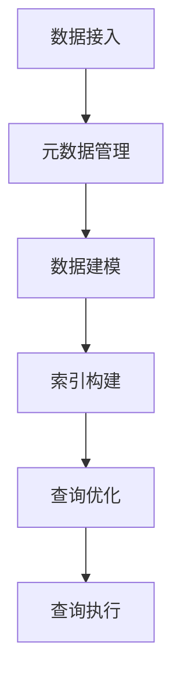
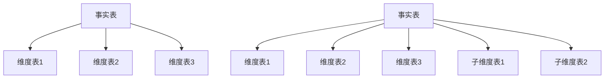

                 

# 《Kylin原理与代码实例讲解》

> **关键词**：Kylin，大数据，数据建模，索引管理，查询优化，代码实例

> **摘要**：本文详细介绍了Kylin的原理、架构及其在数据建模、索引管理和查询优化中的应用。通过实际代码实例，展示了如何在开发环境中搭建Kylin系统，并如何使用Kylin进行高效的数据分析和查询。文章旨在为开发者提供全面的技术指导和实战经验。

## 目录

### 第一部分：Kylin基础与架构介绍

- **第1章：Kylin简介**
  - **1.1 Kylin概述**
  - **1.2 Kylin的架构**
  - **1.3 Kylin与传统大数据技术的区别**

- **第2章：Kylin原理与设计**
  - **2.1 数据建模**
  - **2.2 索引管理**
  - **2.3 查询优化**

### 第二部分：Kylin项目实战

- **第3章：Kylin环境搭建与配置**
  - **3.1 Kylin环境搭建**
  - **3.2 配置文件详解**
  - **3.3 常见问题排查**

- **第4章：Kylin应用实战**
  - **4.1 实战项目背景**
  - **4.2 数据模型设计与实现**
  - **4.3 查询性能优化**

### 第三部分：Kylin高级功能与扩展

- **第5章：Kylin高级功能与扩展**
  - **5.1 Kylin高级功能**
  - **5.2 Kylin扩展开发**

### 附录

- **附录A：Kylin参考资料与工具**

### 引言

Kylin是一个开源的大数据实时查询引擎，主要用于解决大数据环境下的实时数据分析问题。它能够将海量数据预先计算并存储为多维索引，使得查询操作能够快速执行。Kylin适用于需要低延迟、高并发查询的场景，如电商平台、互联网金融和在线广告等。

本文将首先介绍Kylin的基本概念和架构，然后深入讲解Kylin的数据建模、索引管理和查询优化原理。随后，通过一个实际的项目案例，展示如何在开发环境中搭建Kylin系统，并进行高效的数据分析和查询。最后，我们将探讨Kylin的高级功能和扩展开发，为开发者提供全面的技术指导和实战经验。

### 第一部分：Kylin基础与架构介绍

#### 第1章：Kylin简介

### 1.1 Kylin概述

Kylin是一个开源的分布式大数据实时查询引擎，由eBay公司开发，并捐赠给Apache基金会。它旨在解决大规模数据集上的实时分析查询问题，特别是对于多维度、高并发查询的优化。Kylin的设计理念是通过对数据进行预聚合和索引，使得查询操作能够高效、快速地执行。

Kylin的核心概念包括以下几个方面：

- **多维数据模型（Cube）**：Kylin将数据建模为多维数据模型，即Cube。每个Cube由事实表和维度表组成，事实表包含业务指标，维度表则包含业务实体属性。

- **预聚合（Pre-aggregation）**：Kylin通过预聚合技术，将原始数据进行聚合，存储在Cube中。预聚合可以减少查询时的计算量，提高查询效率。

- **索引管理（Index Management）**：Kylin对数据进行索引管理，使得查询能够快速定位到所需数据。

- **查询优化（Query Optimization）**：Kylin通过查询优化技术，如查询缓存、查询重写等，进一步减少查询延迟。

Kylin的目标是提供低延迟、高并发的查询性能，使得大数据分析更加高效和便捷。其主要应用场景包括电商平台、互联网金融、在线广告等领域。

#### 1.2 Kylin的架构

Kylin的架构主要包括以下几个组件：

- **元数据管理（Metadata Management）**：元数据管理负责存储和管理Kylin的元数据，如Cube配置、数据源信息等。元数据存储在Hive的MetaStore中。

- **数据建模（Data Modeling）**：数据建模组件负责将原始数据转化为Kylin的数据模型。数据建模主要包括事实表和维度表的识别、度量字段和维度字段的定义等。

- **索引管理（Index Management）**：索引管理组件负责创建和维护索引，使得查询能够快速执行。

- **查询引擎（Query Engine）**：查询引擎是Kylin的核心组件，负责处理查询请求，并返回查询结果。查询引擎使用预聚合的数据和索引，实现快速查询。

- **REST API**：REST API提供与Kylin交互的接口，支持通过HTTP请求进行数据建模、索引管理和查询操作。

- **Web UI**：Web UI提供图形化界面，用于管理和监控Kylin的运行状态。

下面是Kylin的架构Mermaid流程图：



#### 1.3 Kylin与传统大数据技术的区别

与传统大数据技术（如Hive、Spark等）相比，Kylin有以下几个显著区别：

- **实时性**：Kylin注重实时查询性能，通过预聚合和索引技术，实现低延迟的查询。而Hive和Spark等传统大数据技术主要面向批量处理，查询响应时间较长。

- **多维度查询**：Kylin支持多维度查询，特别是针对多维数据集的高并发查询优化。而Hive和Spark等传统大数据技术则更适用于单维度或简单多维度查询。

- **预聚合**：Kylin在构建Cube时，会进行预聚合操作，将原始数据聚合到多维数据模型中。这样可以减少查询时的计算量，提高查询效率。而Hive和Spark等传统大数据技术通常需要在查询时进行实时聚合。

- **查询优化**：Kylin通过查询缓存、查询重写等技术，进一步优化查询性能。而Hive和Spark等传统大数据技术则主要依赖于计算资源的优化和调度。

总的来说，Kylin在实时查询性能和多维度查询优化方面具有明显优势，适用于需要低延迟、高并发查询的场景。而Hive和Spark等传统大数据技术则更适用于批量数据处理和复杂计算任务。

#### 第2章：Kylin原理与设计

### 2.1 数据建模

数据建模是Kylin的核心功能之一，其目的是将原始数据转化为高效的可查询数据模型。Kylin的数据建模主要包括事实表、维度表、度量字段和维度字段的识别和定义。

#### 2.1.1 数据建模概述

数据建模流程通常包括以下步骤：

1. **数据源配置**：确定数据源类型（如Hive表、JDBC数据源等），并配置相应连接信息。

2. **事实表与维度表的识别**：根据业务需求，从数据源中识别事实表和维度表。事实表包含业务交易数据，如销售额；维度表则包含业务实体属性，如产品信息、时间维度。

3. **数据建模**：将事实表和维度表关联，并定义事实表的度量字段（如SUM、COUNT）和维度表的维度字段（如产品名称、时间戳）。

4. **预聚合计算**：根据查询模式，对事实表进行预聚合，以减少查询时的计算量。

数据建模的原则包括：

- **一致性**：数据模型需要确保数据的一致性，避免数据冗余和冲突。

- **可扩展性**：数据模型应该具有可扩展性，能够适应业务变化和数据增长。

- **性能优化**：数据模型需要考虑查询性能，通过预聚合和索引技术，提高查询效率。

#### 2.1.2 模型类型与构建

Kylin支持两种模型类型：星型模型（Star Schema）和雪花模型（Snowflake Schema）。

- **星型模型**：星型模型是最简单的一种数据模型，其中事实表直接与维度表关联。这种模型结构简单，易于理解和维护，但可能存在数据冗余。

  星型模型的构建步骤如下：

  1. 确定事实表和维度表。
  2. 定义度量字段和维度字段。
  3. 在事实表中添加维度表的外键字段。

- **雪花模型**：雪花模型是对星型模型的扩展，通过引入子维度表，进一步细分维度信息。雪花模型可以减少数据冗余，提高查询效率，但结构更复杂。

  雪花模型的构建步骤如下：

  1. 确定事实表和维度表。
  2. 定义度量字段和维度字段。
  3. 在维度表中添加外键字段。
  4. 识别并创建子维度表。

以下是一个星型模型和雪花模型的Mermaid流程图：



#### 2.1.3 数据建模案例解析

以下是一个简单的数据建模案例，用于分析电商平台的销售数据。

- **事实表**：sales（包含订单ID、产品ID、订单量、销售额、订单日期等字段）。

- **维度表**：products（包含产品ID、产品名称、分类等字段）；time（包含日期、月份、季度等字段）。

1. **数据源配置**：配置Hive数据源。

2. **事实表与维度表的识别**：从数据源中识别事实表（sales）和维度表（products和time）。

3. **数据建模**：

   - 定义度量字段：销售额（SUM(sales_amount)）和订单量（SUM(order_quantity））。
   - 定义维度字段：产品名称（products.name）和日期（time.date）。

4. **预聚合计算**：根据查询模式，对销售额和订单量进行预聚合。

以下是数据建模的伪代码：

```python
def build_model(data_source, fact_table, dimension_tables):
    # 配置数据源
    connect_to_data_source(data_source)
    
    # 识别事实表和维度表
    facts = extract_facts(fact_table)
    dimensions = extract_dimensions(dimension_tables)
    
    # 定义度量字段和维度字段
    measures = define_measures(facts)
    dimensions = define_dimensions(dimensions)
    
    # 预聚合计算
    pre_aggregate_data(facts, dimensions, measures)
    
    # 存储数据模型
    save_model(measures, dimensions)
```

通过以上步骤，我们可以将原始数据建模为星型模型或雪花模型，为后续的查询优化提供基础。

### 2.2 索引管理

索引管理是Kylin数据建模中至关重要的一环。索引用于加速数据查询，通过建立索引，查询引擎可以更快地定位到所需数据，从而提高查询效率。Kylin支持多种索引类型，包括索引构建、优化策略和常见问题排查。

#### 2.2.1 索引管理概述

索引是数据库中的一种特殊结构，用于快速查询和访问数据。在Kylin中，索引主要用于加速多维数据模型（Cube）的查询。Kylin支持以下几种索引类型：

- **初级索引（Primary Index）**：初级索引是Kylin中最基本的索引类型，通常用于唯一标识一个Cube。每个Cube都必须有一个初级索引。

- **二级索引（Secondary Index）**：二级索引用于加速基于维度字段的查询。例如，对于一个包含日期维度的Cube，可以创建一个基于日期的二级索引，以便快速查询特定日期的数据。

- **组合索引（Composite Index）**：组合索引是多个索引字段的组合，用于加速更复杂的查询。例如，可以创建一个包含日期和产品名称的组合索引，以加速基于这两个维度的查询。

索引管理的主要任务包括索引的创建、优化和删除。索引的构建和优化策略直接影响查询性能，需要根据查询模式和业务需求进行合理配置。

#### 2.2.2 索引优化策略

索引优化策略包括以下方面：

- **索引选择**：根据查询模式，选择合适的索引类型。例如，对于基于日期的查询，可以创建基于日期的二级索引。

- **索引顺序**：合理设置索引顺序，可以提高查询效率。例如，在组合索引中，通常将频繁使用的字段放在前面。

- **索引重建**：定期重建索引，可以修复索引损坏和碎片问题，提高查询性能。

- **索引压缩**：通过索引压缩，可以减少索引存储空间，提高I/O性能。

以下是一个简单的索引优化策略伪代码：

```python
def optimize_index(cube_name, index_type, index_columns):
    # 选择索引类型
    selected_index = select_index_type(index_type)
    
    # 设置索引顺序
    index_order = set_index_order(index_columns)
    
    # 创建索引
    create_index(cube_name, selected_index, index_order)
    
    # 优化索引
    optimize_index(cube_name, selected_index)
    
    # 压缩索引
    compress_index(cube_name, selected_index)
```

#### 2.2.3 索引管理实践

以下是一个简单的索引管理实践案例：

1. **索引创建**：为sales Cube创建一个基于日期的二级索引。

   ```sql
   CREATE INDEX ON SALES(COL_DATE);
   ```

2. **索引优化**：定期优化sales Cube的索引。

   ```sql
   OPTIMIZE INDEX ON SALES;
   ```

3. **索引删除**：删除不再需要的索引。

   ```sql
   DROP INDEX ON SALES(COL_DATE);
   ```

通过以上步骤，我们可以有效地管理和优化Kylin中的索引，提高查询性能。

### 2.3 查询优化

查询优化是Kylin的核心功能之一，其目的是通过优化查询计划、缓存和重写等技术，提高查询效率。查询优化策略包括查询优化原理、高级查询优化技巧和查询优化实践。

#### 2.3.1 查询优化原理

Kylin的查询优化主要依赖于以下技术：

- **物理查询计划**：物理查询计划是查询优化的核心，它决定了查询执行的具体步骤和资源消耗。Kylin通过分析查询语句和Cube结构，生成最优的查询执行计划。

- **查询缓存**：查询缓存用于缓存热点查询结果，减少查询响应时间。Kylin支持缓存查询结果和缓存策略配置。

- **查询重写**：查询重写是优化查询语句的重要手段，通过重写查询语句，使其更符合Kylin的数据模型和索引结构，从而提高查询效率。

以下是一个简单的查询优化原理伪代码：

```python
def optimize_query(query):
    # 物理查询计划
    query_plan = generate_query_plan(query)
    
    # 查询缓存
    if cache_hit(query_plan):
        return cache_result(query_plan)
    
    # 查询重写
    rewritten_query = rewrite_query(query, query_plan)
    
    # 执行查询
    result = execute_query(rewritten_query)
    
    # 更新缓存
    cache_result(rewritten_query, result)
    
    return result
```

#### 2.3.2 高级查询优化技巧

高级查询优化技巧包括以下方面：

- **联合索引**：联合索引可以同时加速多个字段的查询。例如，可以创建一个包含日期和产品名称的组合索引，以加速基于这两个维度的查询。

- **动态索引**：动态索引可以根据查询模式和负载动态调整索引结构。例如，在查询高峰期，可以增加索引以加速查询。

- **透视表**：透视表是一种特殊的数据结构，用于加速复杂的多维查询。透视表可以根据业务需求动态构建和更新。

以下是一个高级查询优化技巧伪代码：

```python
def optimize_query_advanced(query):
    # 物理查询计划
    query_plan = generate_query_plan(query)
    
    # 联合索引优化
    if is_combination_query(query_plan):
        create_composite_index(query_plan)
    
    # 动态索引优化
    if is_high_load_query(query_plan):
        create_dynamic_index(query_plan)
    
    # 透视表优化
    if is_complex_query(query_plan):
        create_pivot_table(query_plan)
    
    # 执行查询
    result = execute_query(query_plan)
    
    return result
```

#### 2.3.3 查询优化实践

以下是一个简单的查询优化实践案例：

1. **创建联合索引**：为sales Cube创建一个包含日期和产品名称的组合索引。

   ```sql
   CREATE COMPOSITE INDEX ON SALES(COL_DATE, COL_PRODUCT_NAME);
   ```

2. **动态索引优化**：在查询高峰期，动态增加索引以加速查询。

   ```python
   def optimize_query_high_load(query):
       if is_high_load_query(query):
           create_dynamic_index(query)
       return execute_query(query)
   ```

3. **透视表优化**：为复杂的多维查询创建透视表。

   ```sql
   CREATE PIVOT TABLE ON SALES(COL_DATE, COL_PRODUCT_NAME);
   ```

通过以上实践，我们可以有效地优化Kylin中的查询性能。

### 第三部分：Kylin项目实战

#### 第3章：Kylin环境搭建与配置

##### 3.1 Kylin环境搭建

搭建Kylin环境是使用Kylin进行数据分析和查询的第一步。以下是在常见操作系统上搭建Kylin环境的步骤。

##### Linux环境搭建

1. **安装Java**：Kylin运行在Java环境中，首先需要安装Java。可以使用以下命令安装OpenJDK：

   ```bash
   sudo apt-get update
   sudo apt-get install openjdk-8-jdk
   ```

2. **安装Hadoop**：Kylin依赖于Hadoop生态系统，需要安装Hadoop。可以从Apache官网下载Hadoop，并按照官方文档进行安装。

3. **安装Hive**：Kylin需要与Hive集成，因此需要安装Hive。可以使用以下命令安装Hive：

   ```bash
   sudo apt-get install hive
   ```

4. **安装Kylin**：可以从Kylin官网下载最新版本，并按照官方文档进行安装。

   ```bash
   sudo apt-get install kylin
   ```

5. **启动Kylin服务**：安装完成后，启动Kylin服务：

   ```bash
   bin/start-kylin.sh
   ```

##### Windows环境搭建

1. **安装Java**：在Windows上安装Java（OpenJDK或Oracle JDK）。

2. **安装Hadoop**：可以从Apache官网下载Windows版本Hadoop，并按照官方文档进行安装。

3. **安装Hive**：在Windows上安装Hive。

4. **安装Kylin**：下载Kylin的Windows版本，并按照官方文档进行安装。

5. **启动Kylin服务**：启动Kylin服务：

   ```bash
   bin\start-kylin.bat
   ```

##### 搭建步骤

1. **准备环境**：确保Java、Hadoop和Hive已安装并运行。

2. **下载Kylin**：从Kylin官网下载最新版本的Kylin。

3. **解压安装包**：将下载的Kylin安装包解压到一个合适的目录。

4. **配置环境变量**：在环境变量中添加Kylin的bin目录。

5. **启动Kylin**：运行`start-kylin.sh`或`start-kylin.bat`脚本启动Kylin服务。

##### 常见问题排查

1. **Java内存不足**：如果Kylin启动失败，出现Java内存不足的错误，可以增加Java的内存配置。在启动Kylin之前，编辑`conf/kylin-env.sh`或`conf/kylin-env.bat`文件，增加以下配置：

   ```bash
   export KYLIN_JAVA_OPTS="-Xms4g -Xmx4g"
   ```

2. **Hadoop或Hive服务未启动**：如果Kylin无法连接到Hadoop或Hive，需要检查Hadoop和Hive的服务状态。可以使用以下命令检查Hadoop和Hive的服务状态：

   ```bash
   hadoop version
   hive --service hiveserver2 status
   ```

3. **配置错误**：如果Kylin启动失败，可能是配置文件错误。检查`conf/metamodel.xml`、`conf/core-site.xml`和`conf/hive-site.xml`等配置文件，确保配置正确。

4. **权限问题**：Kylin需要具备相应的文件和目录权限。确保Kylin运行用户有足够的权限访问Kylin安装目录和相关文件。

通过以上步骤，可以成功搭建Kylin环境。接下来，将介绍如何配置Kylin，确保Kylin能够正常运行。

### 第4章：Kylin应用实战

#### 4.1 实战项目背景

在本文的实战项目中，我们将使用Kylin对电商平台的销售数据进行分析。电商平台每天都会产生大量的订单数据，包括订单ID、产品ID、订单量、销售额、订单日期等信息。为了快速获取销售数据的相关指标，如总销售额、平均订单量、销售额排名等，我们需要利用Kylin进行实时数据分析。

#### 4.2 数据模型设计与实现

在本项目中，我们将设计一个Kylin Cube，用于存储和查询销售数据。以下是数据模型的设计和实现步骤：

1. **确定事实表和维度表**：

   - 事实表：orders，包含订单ID、产品ID、订单量、销售额、订单日期等字段。
   - 维度表：products，包含产品ID、产品名称、分类等字段；time，包含日期、月份、季度等字段。

2. **定义度量字段和维度字段**：

   - 度量字段：销售额（SUM(sales_amount)）和订单量（SUM(order_quantity)）。
   - 维度字段：产品名称（products.name）和日期（time.date）。

3. **预聚合计算**：

   - 根据业务需求，选择合适的聚合维度和度量指标。例如，我们可以按产品名称和日期进行预聚合，计算各产品的总销售额和平均订单量。

以下是数据模型设计的伪代码：

```python
def build_model(data_source, fact_table, dimension_tables):
    # 配置数据源
    connect_to_data_source(data_source)
    
    # 识别事实表和维度表
    facts = extract_facts(fact_table)
    dimensions = extract_dimensions(dimension_tables)
    
    # 定义度量字段和维度字段
    measures = define_measures(facts)
    dimensions = define_dimensions(dimensions)
    
    # 预聚合计算
    pre_aggregate_data(facts, dimensions, measures)
    
    # 存储数据模型
    save_model(measures, dimensions)
```

4. **创建Cube**：

   - 使用Kylin的REST API或命令行工具创建Cube。以下是创建Cube的示例命令：

     ```bash
     kylin cubes create -m <model_name> -f <fact_table> -d <dimension_tables> -s <measures> -D <dimensions>
     ```

   - 其中，`<model_name>` 是Cube的名称，`<fact_table>` 是事实表，`<dimension_tables>` 是维度表，`<measures>` 是度量字段，`<dimensions>` 是维度字段。

#### 4.3 查询性能优化

在查询性能优化方面，我们可以采取以下策略：

1. **索引优化**：

   - 为Cube创建适当的索引。例如，可以创建一个包含日期和产品名称的组合索引，以加速基于这两个维度的查询。

     ```sql
     CREATE COMPOSITE INDEX ON <cube_name>(COL_DATE, COL_PRODUCT_NAME);
     ```

2. **缓存优化**：

   - 启用Kylin的查询缓存功能，将热点查询结果缓存起来，减少查询延迟。可以使用以下命令启用缓存：

     ```bash
     kylin cache enable -m <model_name>
     ```

3. **查询重写**：

   - 优化查询语句，使其更符合Kylin的数据模型和索引结构。例如，可以使用Kylin的查询重写功能，将复杂的查询重写为更简单的形式，以提高查询效率。

4. **资源调整**：

   - 根据业务需求和资源情况，合理调整Kylin的配置参数，如内存、线程等。例如，可以增加Kylin的内存配置，以提高查询性能。

以下是查询性能优化策略的伪代码：

```python
def optimize_query_performance(model_name):
    # 创建索引
    create_composite_index(model_name, ['COL_DATE', 'COL_PRODUCT_NAME'])
    
    # 启用缓存
    enable_query_cache(model_name)
    
    # 查询重写
    rewrite_query(model_name, query)
    
    # 调整资源
    adjust_resources(model_name, memory=4g, threads=8)
```

通过以上步骤，我们可以设计并实现一个高效的Kylin Cube，满足电商平台对实时销售数据查询的需求。

### 第5章：Kylin高级功能与扩展

#### 5.1 Kylin高级功能

Kylin提供了一系列高级功能，以增强其在大数据查询中的性能和灵活性。以下是一些关键的高级功能：

1. **动态分区**：动态分区允许根据查询需求动态调整Cube的分区。这有助于在查询高峰期间提高查询性能，同时减少存储开销。

   - **配置动态分区**：在创建Cube时，可以指定动态分区规则。例如，根据时间戳或订单日期创建动态分区。

   - **管理动态分区**：可以通过Kylin UI或命令行工具管理动态分区。例如，可以手动调整分区或设置自动分区策略。

2. **数据同步**：Kylin支持与外部数据源进行同步，确保Cube中的数据与原始数据保持一致。数据同步功能可以定期或实时执行。

   - **配置同步**：在Kylin中配置数据同步任务，指定同步的源数据表和目标Cube。

   - **同步管理**：监控和调整同步任务的执行，确保数据同步的准确性和效率。

3. **存储类型转换**：Kylin支持将数据从一种存储类型转换为另一种存储类型，例如从HDFS转换为Amazon S3。这有助于在不同的存储环境中灵活部署Kylin。

   - **配置存储转换**：在Kylin配置文件中设置存储类型转换规则。

   - **转换管理**：监控和调整存储类型转换过程，确保数据转换的准确性和效率。

#### 5.2 Kylin扩展开发

Kylin的扩展开发功能允许开发者根据特定需求自定义和扩展Kylin的功能。以下是一些扩展开发的关键点：

1. **自定义插件**：开发者可以创建自定义插件，以扩展Kylin的功能。自定义插件可以包括新的数据源、查询优化器、数据转换器等。

   - **插件开发**：使用Kylin提供的SDK和API开发自定义插件。

   - **插件集成**：将自定义插件集成到Kylin中，并通过Kylin UI或命令行工具进行配置和管理。

2. **自定义指标与函数**：开发者可以自定义指标和函数，以支持特定的业务需求。自定义指标和函数可以用于数据建模、查询优化和数据转换等场景。

   - **指标与函数开发**：使用Kylin提供的API和工具开发自定义指标和函数。

   - **集成与测试**：将自定义指标和函数集成到Kylin中，并进行测试和验证。

3. **与其他大数据平台的集成**：Kylin支持与其他大数据平台（如Hadoop、Spark、Kafka等）进行集成，以实现更广泛的数据处理和分析。

   - **集成开发**：根据特定需求开发集成接口和适配器。

   - **集成测试**：确保Kylin与其他大数据平台的集成稳定、高效。

通过利用Kylin的高级功能和扩展开发，开发者可以构建更加灵活、高效的大数据查询和分析系统，满足多样化的业务需求。

### 附录

#### 附录A：Kylin参考资料与工具

为了更好地了解和使用Kylin，以下是一些Kylin的参考资料与工具：

1. **Kylin官方文档**：Kylin的官方文档提供了详细的安装、配置和使用指南。访问Kylin官网，可以找到最新的文档。

   - 官方网站：[Apache Kylin](https://kylin.apache.org/)

2. **Kylin社区与支持**：Kylin社区是一个活跃的开发者社区，提供技术支持和资源。可以在社区中提问、分享经验和获取最新动态。

   - 社区论坛：[Kylin Community](https://cwiki.apache.org/confluence/display/KYLIN/Kylin+Community+Forums)

3. **Kylin开发工具与资源**：

   - **Kylin CLI**：Kylin的命令行工具，用于执行数据建模、索引管理和查询操作。

   - **Kylin SDK**：Kylin的软件开发工具包，用于在Java应用程序中集成Kylin功能。

   - **Kylin SQL**：Kylin的查询语言，支持SQL-like语法，用于执行数据查询。

   - **Kylin示例代码**：Apache Kylin提供的示例代码，展示了如何使用Kylin进行数据建模和查询。

   - **在线教程与博客**：在GitHub、博客等技术平台上，有许多关于Kylin的教程和博客，提供了实用的指导和技巧。

通过以上参考资料与工具，开发者可以更好地掌握Kylin的使用方法和最佳实践，从而充分发挥Kylin在大数据查询和分析中的优势。

