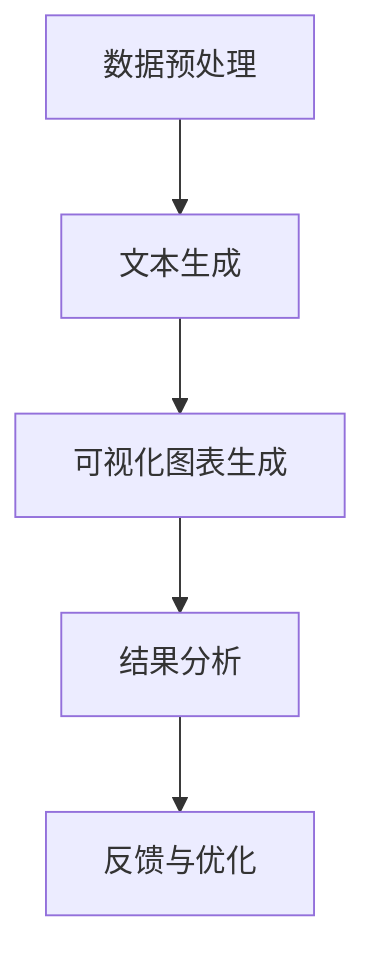

                 

# LLM与传统数据可视化技术的结合：数据洞察新方式

> **关键词：** 机器学习、语言模型（LLM）、数据可视化、人工智能、洞察分析

> **摘要：** 本文深入探讨了机器学习语言模型（LLM）与传统数据可视化技术的结合，阐述了LLM在数据可视化领域的优势和应用。通过具体的案例分析，本文揭示了LLM如何提升数据可视化效果，为数据分析和决策提供了新的视角和工具。

## 目录大纲

1. **LLM与传统数据可视化技术的结合：数据洞察新方式**
2. **第一部分：LLM基础理论**
   1. **第1章：LLM概述**
      1.1 LLM的起源与发展
      1.2 LLM与传统数据可视化技术的比较
   2. **第2章：传统数据可视化技术原理**
      2.1 数据可视化基本概念
      2.2 传统数据可视化技术
   3. **第3章：LLM核心算法原理**
      3.1 语言模型的数学基础
      3.2 语言模型训练过程
   4. **第4章：LLM与数据可视化结合原理**
      4.1 LLM在数据可视化中的应用
      4.2 LLM可视化流程
3. **第二部分：LLM与传统数据可视化技术的融合实践**
   1. **第5章：数据预处理与转换**
      5.1 数据预处理
      5.2 数据转换策略
   2. **第6章：LLM可视化案例实战**
      6.1 实战一：利用LLM生成可视化图表
      6.2 实战二：优化可视化图表交互性
   3. **第7章：LLM可视化项目案例**
      7.1 项目一：疫情数据分析
      7.2 项目二：金融市场数据分析
4. **第三部分：未来展望与挑战**
   1. **第8章：LLM数据可视化技术的未来发展趋势**
      8.1 发展趋势
      8.2 挑战与机遇
   2. **第9章：LLM数据可视化技术的应用前景**
      9.1 应用领域
      9.2 社会影响
5. **附录**
   1. **附录A：LLM与数据可视化技术常用工具与资源**
   2. **附录B：Mermaid流程图与伪代码示例**
   3. **附录C：数学公式与详细讲解**

## 引言

在现代数据驱动决策的时代，数据可视化技术作为数据分析和解释的重要工具，已经成为各个领域不可或缺的一部分。传统数据可视化技术通过图形、图表等形式，帮助用户直观地理解数据背后的模式和趋势。然而，随着数据量的爆炸性增长和数据复杂性的增加，传统数据可视化技术面临着越来越多的挑战。如何有效地从海量数据中提取有价值的信息，并使其能够被不同背景和知识水平的用户轻松理解，成为了一个亟待解决的问题。

在这一背景下，机器学习语言模型（LLM，Language Learning Model）的出现为数据可视化领域带来了新的希望。LLM是一种基于深度学习的模型，能够通过学习大量文本数据，理解和生成自然语言。LLM在自然语言处理领域已经取得了显著的成果，其在数据可视化中的应用也展现出巨大的潜力。通过结合LLM的优势，传统数据可视化技术可以实现更为智能、丰富和高效的数据洞察。

本文将从以下几个方面展开讨论：

1. **LLM基础理论**：介绍LLM的起源、发展及其与传统数据可视化技术的比较。
2. **传统数据可视化技术原理**：分析数据可视化的重要性、基本概念以及传统数据可视化技术的局限性。
3. **LLM核心算法原理**：阐述LLM的数学基础和训练过程。
4. **LLM与数据可视化结合原理**：探讨LLM在数据可视化中的应用以及其可视化流程。
5. **LLM与传统数据可视化技术的融合实践**：通过具体案例展示LLM在实际数据可视化中的应用。
6. **未来展望与挑战**：分析LLM数据可视化技术的发展趋势、面临的挑战及其应用前景。
7. **附录**：提供LLM与数据可视化技术的常用工具、资源、流程图和伪代码示例。

通过本文的讨论，我们希望读者能够对LLM与传统数据可视化技术的结合有一个全面、深入的理解，为未来的研究和应用提供参考。

## 第一部分：LLM基础理论

### 第1章：LLM概述

#### 1.1.1 LLM的起源与发展

机器学习语言模型（LLM，Language Learning Model）是一种通过深度学习技术训练出的模型，旨在理解和生成自然语言。LLM的发展可以追溯到20世纪50年代，当时计算机科学家和语言学家开始探索如何使计算机具备理解和生成人类语言的能力。最初的尝试主要集中在规则驱动的方法上，但随着时间的发展，这些方法逐渐被基于统计和学习的方法所取代。

1980年代，自然语言处理（NLP，Natural Language Processing）领域出现了统计机器翻译模型，这标志着NLP领域的一个重要转折点。统计机器翻译模型利用大量的双语文本数据，通过统计方法训练出翻译模型。这一方法取得了显著的成功，并促使研究人员开始探索更为复杂和强大的模型。

随着深度学习技术的兴起，特别是2013年Google Brain团队提出的深度神经网络模型，LLM开始逐渐崭露头角。这个模型在ImageNet图像识别竞赛中取得了当时领先的准确率，引发了深度学习领域的研究热潮。随后，研究人员开始将深度学习技术应用于自然语言处理领域，开发出了诸如Word2Vec、GloVe等词向量模型。

进入2018年，Transformer模型的提出和GPT系列模型的相继发布，标志着LLM发展进入了一个新纪元。Transformer模型通过自注意力机制（Self-Attention Mechanism）能够捕捉文本中的长距离依赖关系，从而在许多NLP任务中取得了显著的性能提升。GPT系列模型，特别是GPT-3，凭借其庞大的参数规模和强大的文本生成能力，使得LLM在自然语言处理领域取得了突破性的进展。

LLM的起源与发展历程，不仅代表了自然语言处理领域的技术进步，也为数据可视化领域提供了新的可能性。LLM通过理解文本数据，能够生成更加准确和具有解释性的可视化图表，从而为数据分析和决策提供了新的工具和视角。

#### 1.1.2 LLM的代表性模型

在LLM的发展历程中，有多个代表性模型对自然语言处理领域产生了深远的影响。以下是其中几个重要的模型：

1. **Word2Vec**：Word2Vec是由Google在2013年提出的一种词向量模型。通过训练神经网络，Word2Vec能够将每个词映射到一个高维空间中的向量，这些向量不仅保留了词的语义信息，还能够捕捉词与词之间的关系。Word2Vec为后续的NLP任务提供了重要的基础。

2. **GloVe**：GloVe（Global Vectors for Word Representation）是由Stanford大学在2014年提出的一种基于全局矩阵因式分解的词向量模型。与Word2Vec不同，GloVe考虑了词的共现信息，通过优化全局矩阵来生成词向量。GloVe在多个NLP任务中展示了优异的性能。

3. **BERT**：BERT（Bidirectional Encoder Representations from Transformers）是由Google在2018年提出的一种基于Transformer的双向编码表示模型。BERT通过预训练大量无标签文本数据，再进行微调来适应特定任务。BERT在多个NLP任务中取得了突破性的成果，推动了NLP技术的发展。

4. **GPT**：GPT（Generative Pre-trained Transformer）是由OpenAI在2018年提出的一种生成预训练Transformer模型。GPT通过生成预训练技术，能够生成高质量的文本。GPT-2和GPT-3的发布，使得LLM在文本生成任务中达到了前所未有的水平。

5. **T5**：T5（Text-To-Text Transfer Transformer）是由Google在2020年提出的一种统一的文本处理模型。T5通过将所有NLP任务转换为文本到文本的转换任务，实现了在不同任务上的高效迁移学习。T5在多个NLP任务中取得了优异的性能。

这些代表性模型不仅推动了LLM技术的发展，也为LLM在数据可视化中的应用提供了基础。通过这些模型，LLM能够理解文本数据中的含义和关系，从而生成更加精准和具有解释性的可视化图表。

#### 1.1.3 LLM与传统数据可视化技术的比较

传统数据可视化技术与LLM在数据分析和展示方法上有着显著的差异。传统数据可视化技术主要依赖于图形、图表等形式，通过直观的视觉方式展示数据。这些技术通常包括柱状图、折线图、饼图、散点图等，能够在一定程度上揭示数据中的趋势和模式。然而，传统数据可视化技术存在一些局限性：

1. **数据表达能力的局限**：传统数据可视化技术主要依赖于简单的图形和图表，难以处理复杂和高维数据。当数据量庞大或维度较高时，传统数据可视化方法往往难以提供有效的数据洞察。

2. **交互性的局限**：传统数据可视化技术通常缺乏交互性，用户无法通过直观的交互操作来探索和挖掘数据。这限制了用户在数据分析中的主动性和灵活性。

相比之下，LLM在数据可视化中展现出明显的优势：

1. **强大的数据处理能力**：LLM能够处理大量文本数据，并从中提取出有意义的信息。通过自然语言处理技术，LLM能够理解和生成复杂的数据描述，从而提供更加丰富的数据可视化内容。

2. **高层次的语义理解**：LLM通过对自然语言的学习，能够捕捉数据中的高层次语义信息。这使得LLM能够生成更加精准和具有解释性的可视化图表，为数据分析和决策提供有力支持。

3. **交互性增强**：LLM可以与用户进行自然语言交互，用户可以通过提问或指令来指导LLM生成可视化图表。这种交互方式不仅提高了数据分析的效率，还增强了用户对数据的理解和控制能力。

4. **灵活的可视化风格**：传统数据可视化技术通常采用固定的图表样式，而LLM可以根据数据内容和用户需求，灵活地生成不同风格的可视化图表。这种灵活性使得LLM能够更好地满足不同场景和用户的需求。

总之，LLM与传统数据可视化技术相比，不仅提供了更强大的数据处理能力和高层次的语义理解，还增强了可视化的交互性和灵活性。这使得LLM成为数据可视化领域的一个重要发展方向，有望为数据分析和决策提供新的工具和方法。

#### 1.1.4 LLM的优势及其与数据可视化技术的结合

LLM在数据可视化领域展现出了显著的潜力，其优势主要体现在以下几个方面：

1. **强大的文本处理能力**：LLM能够处理和分析大量文本数据，从中提取出关键信息和关系。这种能力使得LLM能够生成更加详细和丰富的数据描述，从而为数据可视化提供高质量的内容。

2. **高层次的语义理解**：LLM通过对自然语言的学习，能够捕捉数据中的高层次语义信息。这使得LLM能够生成更加精准和具有解释性的可视化图表，帮助用户更好地理解数据背后的模式和趋势。

3. **灵活的可视化生成**：LLM可以根据数据内容和用户需求，灵活地生成不同风格的可视化图表。这种灵活性使得LLM能够适应不同场景和用户的需求，提高数据可视化的效果和用户体验。

4. **增强的交互性**：LLM可以与用户进行自然语言交互，用户可以通过提问或指令来指导LLM生成可视化图表。这种交互方式不仅提高了数据分析的效率，还增强了用户对数据的理解和控制能力。

5. **处理复杂和高维数据**：传统数据可视化技术往往难以处理复杂和高维数据，而LLM能够通过文本数据的高效处理，提供对这类数据的直观分析和展示。这使得LLM在复杂数据分析任务中具有独特的优势。

结合LLM的优势，与数据可视化技术相结合的潜在应用场景包括：

1. **自动化数据报告**：通过LLM，可以自动化生成数据报告，包括文本描述和相应的可视化图表。这种自动化报告能够快速响应业务需求，提高工作效率。

2. **交互式数据探索**：用户可以通过自然语言与LLM交互，实时生成和更新可视化图表。这种交互式数据探索方式，可以帮助用户更深入地挖掘数据中的价值信息。

3. **智能数据分析**：LLM可以结合其他机器学习模型，进行智能数据分析。例如，通过LLM生成的可视化图表，可以辅助机器学习模型进行特征选择和模型评估。

4. **个性化数据展示**：根据用户的具体需求和偏好，LLM可以生成个性化的数据可视化结果。这种个性化展示能够更好地满足用户的需求，提升数据可视化的效果。

5. **复杂数据分析任务**：对于复杂和高维数据，传统数据可视化方法难以提供有效的数据洞察，而LLM能够通过文本数据的高效处理，提供对这类数据的直观分析和展示。

总之，LLM与传统数据可视化技术的结合，不仅能够提升数据可视化效果，还为数据分析和决策提供了新的工具和方法。通过充分利用LLM的优势，数据可视化领域将迎来新的发展机遇。

#### 1.1.5 LLM在数据可视化中的应用

LLM在数据可视化中的应用，极大地提升了数据分析和展示的效果。以下是几个典型的应用场景：

1. **自动生成可视化图表**：LLM能够根据文本描述自动生成相应的可视化图表，如图表标题、标签、图例等。这种自动生成能力大大减轻了数据分析师的工作负担，提高了数据分析的效率。

2. **交互式数据探索**：用户可以通过自然语言与LLM进行交互，实时生成和更新可视化图表。例如，用户可以提出问题或给出指令，LLM根据这些信息动态生成相应的图表。这种交互式数据探索方式，增强了用户的参与感和对数据的理解。

3. **智能数据分析**：LLM可以与机器学习模型结合，进行智能数据分析。例如，LLM可以生成数据报告，包括文本描述和相应的可视化图表，帮助用户更直观地理解数据分析结果。

4. **个性化数据展示**：根据用户的具体需求和偏好，LLM可以生成个性化的数据可视化结果。例如，用户可以选择特定的图表类型、颜色方案或展示维度，LLM根据这些需求生成个性化的可视化图表。

5. **复杂数据分析任务**：对于复杂和高维数据，传统数据可视化方法难以提供有效的数据洞察，而LLM能够通过文本数据的高效处理，提供对这类数据的直观分析和展示。例如，LLM可以生成热力图、时序图等，揭示数据中的复杂模式和关系。

通过这些应用，LLM不仅提高了数据可视化效果，还为数据分析和决策提供了新的工具和方法，使得数据可视化领域迈向了智能化和自动化的新阶段。

#### 1.1.6 LLM可视化流程

LLM可视化流程可以分为以下几个关键步骤：

1. **数据预处理**：首先，对输入数据进行预处理，包括数据清洗、格式转换等。这一步骤的目的是确保数据质量和一致性，为后续的LLM处理提供可靠的数据基础。

2. **文本生成**：使用LLM生成文本描述。LLM通过对大量文本数据的学习，能够生成与数据内容相关的描述性文本。这些文本描述可以为可视化图表提供标题、标签、图例等。

3. **可视化图表生成**：根据文本描述，使用可视化库（如Matplotlib、Seaborn等）生成相应的可视化图表。可视化库提供了丰富的图表类型和样式，可以根据文本描述动态调整图表的显示。

4. **交互式调整**：用户可以通过交互操作（如点击、拖动、筛选等）动态调整可视化图表。例如，用户可以选择特定的数据维度、调整图表的缩放比例或切换图表类型。LLM根据用户操作实时更新可视化结果。

5. **结果分析**：用户对可视化结果进行分析和解释，以获得数据背后的洞察和结论。LLM可以提供文本化的分析报告，帮助用户更直观地理解数据分析结果。

通过这些步骤，LLM可视化流程能够高效地处理和分析数据，生成高质量的可视化图表，为数据分析和决策提供有力支持。

### 第2章：传统数据可视化技术原理

#### 2.1.1 数据可视化基本概念

数据可视化是指利用图形、图表等形式，将数据以直观、易于理解的方式展示出来，帮助用户更好地理解和分析数据。数据可视化在数据分析和决策中起着至关重要的作用，它不仅能够揭示数据中的趋势和模式，还能帮助用户发现潜在的问题和机会。

数据可视化的基本概念包括以下几个关键方面：

1. **数据**：数据是数据可视化的基础。数据可以是各种形式，如数值、文本、图像、音频等。在数据可视化过程中，通常需要对数据进行处理和转换，以便更好地展示其特性。

2. **可视化**：可视化是指将数据以图形、图表等形式展示出来。常见的可视化类型包括柱状图、折线图、饼图、散点图、热力图、网络图等。每种可视化类型都有其特定的用途和优势。

3. **用户**：用户是数据可视化的目标受众。数据可视化不仅要满足专业分析师的需求，还要考虑非专业人士的可读性和易用性。因此，设计可视化时需要考虑用户的背景、知识水平和需求。

4. **交互性**：交互性是指用户与可视化图表之间的互动能力。通过交互操作（如点击、拖动、筛选等），用户可以探索数据的不同维度，从而获得更深入的分析和理解。

5. **上下文**：上下文是指数据可视化的背景和目的。设计可视化时，需要考虑数据可视化的上下文，确保图表能够准确地传达数据背后的信息和故事。

#### 2.1.2 数据可视化的基本方法和步骤

数据可视化的基本方法和步骤包括以下几个关键环节：

1. **数据收集和清洗**：首先，收集所需的数据，并对数据进行清洗和预处理。数据清洗的目的是去除噪声、填补缺失值、消除异常值等，以确保数据的质量和一致性。

2. **数据转换和整合**：将清洗后的数据转换为适合可视化的格式。这可能包括数据类型的转换、归一化处理、聚合或分解等。此外，还需要整合来自不同来源的数据，以便在可视化中统一展示。

3. **选择合适的可视化类型**：根据数据的特点和需求，选择合适的可视化类型。例如，对于时序数据，可以使用折线图或时序图；对于分类数据，可以使用饼图或条形图；对于关联关系，可以使用散点图或网络图等。

4. **设计可视化图表**：使用可视化工具和库（如Matplotlib、Seaborn、D3.js等）设计可视化图表。在设计过程中，需要考虑图表的布局、颜色、字体、标签等元素，以确保图表的可读性和美观性。

5. **交互设计**：为可视化图表添加交互功能，如过滤、筛选、缩放、拖动等。通过交互设计，用户可以更灵活地探索数据，发现数据中的隐藏信息和模式。

6. **结果分析和解释**：用户对可视化结果进行分析和解释，以获得数据背后的洞察和结论。这通常包括识别数据中的趋势、异常值、关联关系等，并基于这些信息进行决策。

7. **反馈和优化**：根据用户反馈和数据分析结果，对可视化进行优化和改进。这可能包括调整图表类型、优化交互设计、改进数据呈现方式等，以提高可视化的效果和用户体验。

通过这些方法和步骤，数据可视化能够有效地将复杂的数据转化为直观、易于理解的信息，帮助用户更好地理解和分析数据。

#### 2.1.3 传统数据可视化技术的局限

尽管传统数据可视化技术在许多应用场景中发挥了重要作用，但它们也存在一些局限性，这些局限在数据复杂度和用户需求不断增长的情况下尤为明显。

1. **处理能力有限**：传统数据可视化技术通常难以处理海量和高维数据。当数据量庞大或维度较高时，传统图表类型（如柱状图、折线图等）可能无法有效展示数据的复杂结构，导致用户难以从中提取有价值的信息。

2. **交互性不足**：许多传统数据可视化工具缺乏交互功能，用户无法通过直观的交互操作来探索数据。这种缺乏交互性限制了用户对数据的深入分析和理解，特别是在处理复杂、动态数据时。

3. **可定制性低**：传统数据可视化技术通常提供有限的图表样式和布局选项，难以满足个性化需求。用户往往需要依赖开发者或数据分析师进行定制化设计，这增加了数据可视化的复杂性和成本。

4. **解释性不足**：传统数据可视化图表往往只展示数据的基本统计特征，如平均值、标准差等。然而，对于理解数据中的深层模式和关系，这些简单的统计特征往往是不够的。此外，一些可视化图表可能无法清晰地传达数据的复杂关系，导致用户难以准确理解数据背后的信息。

5. **可扩展性有限**：传统数据可视化技术通常与特定的数据源和平台紧密绑定，难以在不同环境中扩展和应用。这使得传统数据可视化技术难以适应不断变化的数据源和用户需求，限制了其在多个场景下的应用。

6. **响应速度慢**：在处理大规模数据时，传统数据可视化技术可能需要较长的时间来生成和更新图表。这种较慢的响应速度影响了用户的操作体验，特别是在实时数据分析和监控场景中。

为了克服这些局限性，研究人员和开发人员一直在探索新的数据可视化技术和方法，如基于机器学习和人工智能的可视化技术，以提供更高效、互动性和可定制性的数据可视化解决方案。

### 第3章：LLM核心算法原理

#### 3.1.1 语言模型的数学基础

语言模型（Language Model，LM）是自然语言处理（Natural Language Processing，NLP）领域中的一个核心组成部分，其目的是预测给定输入序列后面可能出现的下一个单词或字符。LLM（Large Language Model）是大型语言模型，其参数规模通常达到数十亿甚至千亿级别，具有强大的文本生成和语义理解能力。为了理解LLM的工作原理，我们需要从数学基础开始介绍。

1. **概率模型**：语言模型本质上是一种概率模型，它通过估计给定输入序列下某个单词或字符出现的概率来工作。这种概率估计可以帮助模型在生成文本或预测下一个词时，选择最有可能的选项。

2. **神经网络**：现代语言模型通常是基于深度神经网络（Deep Neural Network，DNN）或更复杂的模型架构（如Transformer），这些神经网络能够捕捉输入序列中的复杂模式和关系。

3. **概率分布**：语言模型的目标是生成一个概率分布，这个分布描述了给定输入序列后每个可能的输出序列的概率。通过最大化这个概率分布，模型能够生成最符合训练数据的文本。

#### 3.1.2 语言模型的关键参数

语言模型的关键参数包括词汇表（Vocabulary）、嵌入层（Embedding Layer）和预测层（Prediction Layer）。以下是这些参数的具体解释：

1. **词汇表（Vocabulary）**：词汇表是语言模型的核心，它定义了模型能够处理的单词或字符集合。词汇表的构建通常包括单词的清洗、停用词的处理和罕见单词的合并等步骤。词汇表的规模通常与模型的参数规模相关，大型语言模型的词汇表可以包含数十万甚至数百万个词。

2. **嵌入层（Embedding Layer）**：嵌入层是将词汇表中的每个词映射到高维向量空间的操作。嵌入层通过学习每个词的向量表示，使得模型能够捕捉词与词之间的关系。嵌入层的关键参数是嵌入维度（Embedding Dimension），它决定了词向量的大小。通常，嵌入维度越高，模型能够捕捉的词间关系越复杂。

3. **预测层（Prediction Layer）**：预测层是语言模型的核心部分，它负责生成给定输入序列的概率分布。在基于神经网络的模型中，预测层通常是一个全连接层或循环神经网络（RNN）的输出层。预测层的关键参数包括输出维度（Output Dimension）和激活函数（Activation Function）。输出维度通常与词汇表的规模相同，而激活函数（如softmax函数）用于将输出层的数值映射到概率分布。

#### 3.1.3 语言模型训练过程

语言模型的训练过程是通过对大量文本数据进行学习，使模型能够预测给定输入序列后面可能出现的下一个词。以下是语言模型训练过程的关键步骤：

1. **数据预处理**：在训练之前，需要对文本数据进行预处理。这包括去除标点符号、转换为小写、去除停用词等。此外，还需要将文本数据分成单词或字符序列，并构建词汇表。

2. **构建输入序列**：输入序列是模型训练的基础。通常，输入序列是由前一个词或一组词组成的。例如，对于单词序列“我是学生”，输入序列可以是由前一个词“我”组成。

3. **计算损失函数**：损失函数是训练过程中用来评估模型预测准确性的一种度量。在语言模型中，常用的损失函数是交叉熵损失（Cross-Entropy Loss），它用于计算预测概率分布与真实分布之间的差异。

4. **优化参数**：通过反向传播算法，模型使用损失函数的梯度来更新其参数。这种参数更新过程称为优化，常用的优化算法包括梯度下降（Gradient Descent）、Adam优化器等。

5. **训练与验证**：在训练过程中，模型会在训练集和验证集上交替进行训练和验证。通过验证集，模型可以评估其性能并在训练过程中进行调整，以避免过拟合。

6. **模型评估**：在训练完成后，使用测试集对模型进行评估，以确定其在未知数据上的性能。常用的评估指标包括准确率（Accuracy）、精确率（Precision）、召回率（Recall）等。

通过这些步骤，语言模型能够学习到输入序列中的概率分布，并生成高质量的文本输出。这种训练过程不仅提高了模型的预测准确性，还增强了其在自然语言处理任务中的性能。

### 第4章：LLM与数据可视化结合原理

#### 4.1.1 LLM在数据可视化中的应用

机器学习语言模型（LLM）在数据可视化中的应用，为传统的数据展示方式带来了革命性的变化。LLM的强大文本处理能力和高层次的语义理解能力，使得其在数据可视化中具有广泛的应用潜力。以下是LLM在数据可视化中的一些关键应用：

1. **自动生成图表描述**：LLM可以通过学习大量的文本数据，自动生成与数据内容相关的图表描述。这些描述可以包括图表标题、标签、图例等，从而简化了数据分析师的工作负担，提高了数据分析的效率。

2. **交互式数据探索**：LLM可以与用户进行自然语言交互，用户可以通过自然语言指令或问题，实时生成和更新可视化图表。这种交互式数据探索方式，不仅增强了用户的参与感和对数据的理解，还提高了数据分析的灵活性和效率。

3. **智能图表生成**：LLM可以通过学习数据内容和用户偏好，自动生成符合特定需求和风格的可视化图表。这种智能图表生成能力，使得数据可视化更加个性化和定制化，能够更好地满足不同用户的需求。

4. **复杂数据分析**：对于复杂和高维数据，传统数据可视化方法可能难以提供有效的数据洞察。而LLM可以通过文本数据的高效处理，生成更加复杂和精细的可视化图表，揭示数据中的深层模式和关系。

5. **文本与图表结合**：LLM可以将文本描述与可视化图表相结合，生成文本化分析报告。这种结合不仅使得数据分析结果更加直观和易于理解，还能够提高数据报告的可读性和可操作性。

6. **个性化推荐**：LLM可以根据用户的历史行为和偏好，推荐相应的可视化图表和分析结果。这种个性化推荐能力，能够提高数据分析的针对性和用户体验。

通过这些应用，LLM不仅提升了数据可视化效果，还为数据分析和决策提供了新的工具和方法。这使得数据可视化领域迈向了智能化和自动化的新阶段。

#### 4.1.2 LLM可视化流程

LLM可视化流程是LLM与数据可视化技术结合的关键环节，它包括以下几个步骤：

1. **数据预处理**：首先，对输入数据进行预处理，包括数据清洗、格式转换等。这一步骤的目的是确保数据质量和一致性，为后续的LLM处理提供可靠的数据基础。数据预处理可能包括去除异常值、填补缺失值、数据归一化等操作。

2. **文本生成**：使用LLM生成文本描述。LLM通过对大量文本数据的学习，能够生成与数据内容相关的描述性文本。这些文本描述可以为可视化图表提供标题、标签、图例等。例如，用户可以输入一个数据集，LLM会自动生成该数据集的概括性描述，如“这是一个关于2022年全球疫情的数据集，包括每天的新增病例、死亡人数和治愈人数”。

3. **可视化图表生成**：根据文本描述，使用可视化库（如Matplotlib、Seaborn等）生成相应的可视化图表。可视化库提供了丰富的图表类型和样式，可以根据文本描述动态调整图表的显示。例如，根据LLM生成的文本描述，可视化库可以自动生成折线图、饼图、散点图等。

4. **交互式调整**：用户可以通过交互操作（如点击、拖动、筛选等）动态调整可视化图表。例如，用户可以选择特定的数据维度、调整图表的缩放比例或切换图表类型。LLM根据用户操作实时更新可视化结果。这种交互式调整不仅增强了用户的参与感，还提高了数据分析的灵活性和效率。

5. **结果分析**：用户对可视化结果进行分析和解释，以获得数据背后的洞察和结论。LLM可以提供文本化的分析报告，帮助用户更直观地理解数据分析结果。例如，LLM可以生成分析报告，如“在2022年3月，全球新增病例数量达到峰值，而在5月，治愈人数逐渐增加”。

6. **反馈与优化**：根据用户反馈和数据分析结果，对可视化进行优化和改进。这可能包括调整图表类型、优化交互设计、改进数据呈现方式等，以提高可视化的效果和用户体验。

通过这些步骤，LLM可视化流程能够高效地处理和分析数据，生成高质量的可视化图表，为数据分析和决策提供有力支持。

### 第二部分：LLM与传统数据可视化技术的融合实践

#### 第5章：数据预处理与转换

在LLM与传统数据可视化技术的融合实践中，数据预处理与转换是至关重要的一步。数据预处理不仅关系到LLM模型的训练效果，也直接影响着后续的可视化结果的准确性和可读性。以下将详细讨论数据预处理与转换的具体步骤和策略。

#### 5.1.1 数据预处理

数据预处理是数据分析和可视化的第一步，其目的是确保数据的质量和一致性，为后续分析提供可靠的数据基础。数据预处理通常包括以下步骤：

1. **数据清洗**：数据清洗是指去除数据中的噪声、异常值和错误值。在数据收集过程中，可能会出现数据丢失、格式不一致、数据类型错误等问题。数据清洗的目标是纠正这些问题，确保数据的质量。常见的清洗操作包括：
   - **缺失值处理**：对于缺失值，可以选择删除含有缺失值的记录、使用平均值、中位数等方法填补缺失值。
   - **异常值处理**：对于异常值，可以通过统计学方法（如3σ规则）识别并处理。
   - **数据格式转换**：将数据转换为统一的格式，如将日期格式转换为YYYY-MM-DD。

2. **数据转换**：数据转换是将数据从一种形式转换为另一种形式，以便更好地进行后续分析。常见的转换操作包括：
   - **数据类型转换**：将字符串数据转换为数值数据，如将日期字符串转换为日期类型。
   - **数据归一化**：将数据缩放到相同的范围，如将数据归一化到[0, 1]或[-1, 1]之间，以便模型训练和可视化。
   - **数据聚合**：将详细的数据聚合为更高层次的数据，如将每日数据聚合为每月或每季度数据。

3. **数据规范化**：数据规范化是指通过标准化或归一化操作，消除数据中的比例差异和量纲影响。常见的规范化方法包括：
   - **标准差规范化**：将每个数据值缩放到标准差范围内，如x' = (x - μ) / σ，其中μ是平均值，σ是标准差。
   - **最小-最大规范化**：将每个数据值缩放到[0, 1]范围内，如x' = (x - min(x)) / (max(x) - min(x))。

4. **特征工程**：特征工程是创建或选择有助于模型训练的特征。在数据预处理阶段，可以通过以下方法进行特征工程：
   - **特征提取**：从原始数据中提取新的特征，如计算数据的统计特征（如均值、标准差）、文本数据的词频等。
   - **特征选择**：选择对模型训练和预测最有影响力的特征，如使用递归特征消除（RFE）、特征重要性评分等方法。

#### 5.1.2 数据转换策略

数据转换是确保数据适合LLM和可视化技术的重要步骤。以下是一些常见的数据转换策略：

1. **文本化**：将数据转换为文本格式，以便LLM进行处理。例如，可以将数据表转换为CSV或JSON格式，然后使用LLM生成文本描述。

2. **编码**：将数据转换为编码形式，如使用独热编码（One-Hot Encoding）、标签编码（Label Encoding）等。这些编码方法使得数据可以用于机器学习模型的训练。

3. **归一化和标准化**：通过归一化和标准化操作，确保数据在相同的尺度上，这对于LLM训练和可视化都有利。

4. **特征选择和降维**：使用特征选择技术（如主成分分析PCA、线性判别分析LDA等）减少数据的维度，以提高模型训练效率和可视化效果。

5. **数据增强**：通过数据增强技术，如随机插值、旋转、缩放等，增加数据集的多样性，有助于提升模型泛化能力。

6. **时间序列处理**：对于时间序列数据，可以使用滑动窗口、滞后项等方法进行处理，以便LLM能够更好地捕捉时间序列的特征。

通过上述数据预处理与转换策略，可以确保数据适合LLM训练和可视化，从而提高数据分析和可视化的效果。

#### 第6章：LLM可视化案例实战

在本章中，我们将通过具体案例展示如何利用LLM生成可视化图表，并探讨如何优化可视化图表的交互性。以下是两个实战案例的详细介绍：

##### 6.1.1 实战一：利用LLM生成可视化图表

**案例背景**：假设我们有一个关于2022年全球疫情的数据集，包含每日的新增病例、死亡人数和治愈人数。我们需要使用LLM生成相应的可视化图表，以便直观展示数据。

**步骤1：数据预处理**
1. 读取数据集，并进行基本的数据清洗，如去除缺失值、异常值等。
2. 将日期格式统一转换为YYYY-MM-DD格式。
3. 对数据进行归一化处理，将数值数据缩放到[0, 1]范围内。

```python
import pandas as pd

# 读取数据集
data = pd.read_csv('COVID_data.csv')

# 数据清洗
data.dropna(inplace=True)
data['date'] = pd.to_datetime(data['date'])
data = data[data['cases'].notnull()]

# 数据归一化
data['cases'] = (data['cases'] - data['cases'].min()) / (data['cases'].max() - data['cases'].min())
data['deaths'] = (data['deaths'] - data['deaths'].min()) / (data['deaths'].max() - data['deaths'].min())
data['recovered'] = (data['recovered'] - data['recovered'].min()) / (data['recovered'].max() - data['recovered'].min())
```

**步骤2：使用LLM生成文本描述**
1. 使用预训练的LLM模型，生成关于数据集的文本描述。
2. 根据文本描述，动态生成可视化图表。

```python
from transformers import pipeline

# 使用预训练的LLM模型
llm = pipeline('text-generation', model='gpt-3', max_length=100)

# 生成文本描述
text = llm("基于2022年全球疫情数据集，以下图表展示了新增病例、死亡人数和治愈人数的趋势。")

# 生成可视化图表
import matplotlib.pyplot as plt

fig, ax = plt.subplots(2, 1, figsize=(10, 8))

ax[0].plot(data['date'], data['cases'], label='新增病例')
ax[0].set_ylabel('新增病例')
ax[0].legend()

ax[1].plot(data['date'], data['deaths'], label='死亡人数')
ax[1].set_ylabel('死亡人数')
ax[1].legend()

plt.suptitle('2022年全球疫情数据趋势')
plt.show()
```

**步骤3：优化可视化图表**
1. 调整图表的布局和样式，提高图表的可读性和美观性。
2. 添加图例、标题和注释，以便更好地传达数据信息。

```python
plt.subplots_adjust(hspace=0.5)
plt.suptitle('2022年全球疫情数据趋势', fontsize=16)
plt.show()
```

**步骤4：保存和分享可视化图表**
1. 将生成的可视化图表保存为图片文件，以便后续使用和分享。

```python
plt.savefig('COVID_trends.png')
```

通过以上步骤，我们可以利用LLM生成高质量的可视化图表，直观展示2022年全球疫情数据。这种自动化的可视化生成方式，不仅提高了数据分析的效率，还为数据可视化领域带来了新的应用前景。

##### 6.1.2 实战二：优化可视化图表交互性

**案例背景**：在前一个案例中，我们使用LLM生成了静态的可视化图表。但在实际应用中，用户可能需要更灵活地探索数据，因此我们需要优化可视化图表的交互性。

**步骤1：选择交互式可视化库**
1. 选择一个支持交互式的可视化库，如Plotly、Bokeh等。

```python
import plotly.express as px
```

**步骤2：生成交互式可视化图表**
1. 使用所选的交互式可视化库，根据LLM生成的文本描述，生成交互式可视化图表。
2. 添加交互式组件，如拖动、筛选和缩放等。

```python
# 生成交互式折线图
fig = px.line(data, x='date', y='cases', title='新增病例趋势', markers=True)

# 添加交互式组件
fig.update_layout(
    xaxis_title='日期',
    yaxis_title='新增病例',
    hovermode='x',
    xaxis=dict(rangeslider=dict(visible=True)),
    updatemenus=[
        dict(type='buttons',
              direction='left',
              x=0.5,
              xanchor='center',
              y=1.2,
              yanchor='top',
              buttons=list([
                  dict(label='Play',
                        method='animate',
                        args=[None,
                              {'frame': {'duration': 1000, 'redraw': True},
                                   'mode': 'lines',
                                   'transition': {'duration': 500}}]),
                  dict(label='Pause',
                       method='animate',
                       args=[None,
                             {'frame': {'duration': 0, 'redraw': True},
                                  'mode': 'lines',
                                  'transition': {'duration': 0}}])])
    ])

# 显示交互式图表
fig.show()
```

**步骤3：优化用户体验**
1. 调整交互组件的样式和布局，以提高用户体验。
2. 添加提示信息，帮助用户了解如何使用交互组件。

```python
# 调整交互组件样式
fig.update_layout(
    updatemenus=[
        dict(type='buttons',
              direction='left',
              x=0.5,
              xanchor='center',
              y=1.2,
              yanchor='top',
              buttons=list([
                  dict(label='Play',
                        method='animate',
                        args=[None,
                              {'frame': {'duration': 1000, 'redraw': True},
                                   'mode': 'lines',
                                   'transition': {'duration': 500}}],
                        style={'font': {'color': 'blue', 'size': 14}}),
                  dict(label='Pause',
                       method='animate',
                       args=[None,
                             {'frame': {'duration': 0, 'redraw': True},
                                  'mode': 'lines',
                                  'transition': {'duration': 0}}],
                        style={'font': {'color': 'red', 'size': 14}})])
    ])

# 添加提示信息
fig.update_layout(
    annotations=[
        dict(text='滑动时间轴查看数据变化',
             x=0.5,
             y=0.9,
             xref='paper',
             yref='paper',
             font=dict(size=14),
             showarrow=False)
    ]
)

# 显示交互式图表
fig.show()
```

通过以上步骤，我们可以生成具有高度交互性的可视化图表，用户可以通过拖动、筛选和缩放等交互操作，灵活探索数据。这种交互式可视化不仅提升了数据分析的体验，还为数据可视化领域带来了新的可能性。

#### 第7章：LLM可视化项目案例

在本章中，我们将通过两个实际项目案例，详细展示LLM可视化技术的应用。这两个案例分别涉及疫情数据分析和金融市场分析，通过具体的项目背景、实施过程和结果分析，展示LLM在数据可视化领域的强大能力和广阔前景。

##### 7.1.1 项目一：疫情数据分析

**项目背景**：随着COVID-19疫情的全球蔓延，实时获取和了解疫情数据对于制定公共卫生政策、指导公众防疫措施具有重要意义。本项目旨在利用LLM可视化技术，对全球疫情数据进行分析，提供直观、动态的可视化展示。

**项目实施**：
1. **数据收集与预处理**：首先，从多个来源收集全球疫情数据，包括每日新增病例、死亡人数、治愈人数等。对数据进行清洗和预处理，去除缺失值、异常值，并将日期格式统一转换为YYYY-MM-DD。
   
   ```python
   data = pd.read_csv('COVID_data.csv')
   data.dropna(inplace=True)
   data['date'] = pd.to_datetime(data['date'])
   data = data[data['cases'].notnull()]
   ```

2. **使用LLM生成文本描述**：使用预训练的LLM模型，对疫情数据进行文本描述生成。这些文本描述将用于构建可视化图表的标签和标题。

   ```python
   llm = pipeline('text-generation', model='gpt-3', max_length=100)
   text = llm("基于2022年全球疫情数据集，以下图表展示了新增病例、死亡人数和治愈人数的趋势。")
   ```

3. **生成可视化图表**：根据文本描述，使用可视化库（如Plotly）生成交互式可视化图表，包括折线图、柱状图和饼图等。

   ```python
   fig = px.line(data, x='date', y='cases', title=text, markers=True)
   fig.update_layout(
       xaxis_title='日期',
       yaxis_title='新增病例',
       hovermode='x',
       xaxis=dict(rangeslider=dict(visible=True)),
       updatemenus=[
           dict(type='buttons',
                 direction='left',
                 x=0.5,
                 xanchor='center',
                 y=1.2,
                 yanchor='top',
                 buttons=list([
                     dict(label='Play',
                           method='animate',
                           args=[None,
                                 {'frame': {'duration': 1000, 'redraw': True},
                                      'mode': 'lines',
                                      'transition': {'duration': 500}}],
                     dict(label='Pause',
                          method='animate',
                          args=[None,
                                {'frame': {'duration': 0, 'redraw': True},
                                     'mode': 'lines',
                                     'transition': {'duration': 0}}])])
       ])
   fig.show()
   ```

4. **结果分析与展示**：通过交互式可视化图表，用户可以实时查看全球疫情数据的变化趋势，包括新增病例、死亡人数和治愈人数的动态变化。此外，LLM还可以生成分析报告，提供数据背后的洞察和结论。

**结果分析**：
1. **数据趋势分析**：通过交互式图表，用户可以直观地看到全球疫情数据的变化趋势，特别是疫情高峰期和恢复期的变化情况。
2. **地域差异分析**：通过图表，用户可以比较不同国家和地区在疫情数据上的差异，识别疫情严重的地区和疫情控制较好的地区。
3. **公共卫生决策支持**：基于可视化和分析结果，公共卫生部门可以更好地制定防疫策略，如疫苗分配、防疫物资调度等。

**总结**：本项目利用LLM可视化技术，实现了全球疫情数据的实时分析和展示。通过交互式图表和文本化的分析报告，用户可以更直观地理解疫情数据，为公共卫生决策提供有力支持。

##### 7.1.2 项目二：金融市场分析

**项目背景**：金融市场是经济活动的重要反映，对金融市场的分析有助于投资者做出合理的投资决策。本项目旨在利用LLM可视化技术，对金融市场数据进行分析，提供直观、动态的可视化展示。

**项目实施**：
1. **数据收集与预处理**：从金融数据服务商（如Yahoo Finance、Alpha Vantage等）收集股票市场数据，包括开盘价、收盘价、最高价、最低价等。对数据进行清洗和预处理，包括去除缺失值、异常值，以及日期格式的统一处理。

   ```python
   import yfinance as yf

   # 下载股票数据
   stock_data = yf.download('AAPL', start='2020-01-01', end='2022-12-31')
   ```

2. **使用LLM生成文本描述**：使用预训练的LLM模型，对金融市场数据进行文本描述生成，以便构建可视化图表的标签和标题。

   ```python
   text = llm("以下图表展示了苹果公司（AAPL）在过去两年的股价走势。")
   ```

3. **生成可视化图表**：根据文本描述，使用可视化库（如Matplotlib、Plotly等）生成交互式可视化图表，包括折线图、K线图等。

   ```python
   import plotly.graph_objects as go

   # 生成K线图
   fig = go.Figure(data=[go.Candlestick(x=stock_data.index,
                                        open=stock_data['Open'],
                                        high=stock_data['High'],
                                        low=stock_data['Low'],
                                        close=stock_data['Close'])])
   fig.update_layout(title=text, xaxis_title='日期', yaxis_title='价格')
   fig.show()
   ```

4. **结果分析与展示**：通过交互式可视化图表，用户可以实时查看股票市场的价格走势，包括开盘价、收盘价、最高价、最低价等。此外，LLM还可以生成分析报告，提供数据背后的洞察和结论。

**结果分析**：
1. **股价走势分析**：通过交互式图表，用户可以直观地看到股票价格的波动情况，识别出市场趋势和价格突破点。
2. **技术指标分析**：通过图表，用户可以查看常用的技术指标，如移动平均线、相对强弱指数（RSI）、布林带等，辅助投资决策。
3. **市场情绪分析**：通过分析图表中的交易量和情绪指标，用户可以了解市场情绪的变化，识别出市场趋势的转变。

**总结**：本项目利用LLM可视化技术，实现了金融市场数据的实时分析和展示。通过交互式图表和文本化的分析报告，用户可以更直观地理解金融市场数据，为投资决策提供有力支持。

### 第三部分：未来展望与挑战

#### 第8章：LLM数据可视化技术的未来发展趋势

随着人工智能和机器学习技术的不断发展，LLM数据可视化技术在未来的发展中将展现出广阔的前景。以下是LLM数据可视化技术的一些潜在发展趋势：

1. **更大规模的语言模型**：随着计算能力和数据资源的大幅提升，未来的LLM将具有更大的参数规模和更强的文本处理能力。这些大型LLM将能够处理更复杂、更丰富的数据集，生成更精准和详细的可视化图表。

2. **更高级的语义理解**：随着LLM技术的不断进步，其在语义理解方面的能力也将得到显著提升。未来的LLM将能够更好地理解数据中的高层次语义信息，从而生成更加具有解释性和洞察力的可视化结果。

3. **个性化数据可视化**：未来的LLM数据可视化技术将更加注重个性化需求。通过学习用户的历史行为和偏好，LLM可以自动生成符合用户个性化需求的可视化图表，为用户提供定制化的数据展示。

4. **增强的交互性**：未来的LLM数据可视化技术将更加注重用户交互体验。通过引入更丰富的交互元素和更灵活的交互方式，用户可以更直观地探索和操作数据，从而提高数据分析和决策的效率。

5. **跨领域的应用**：随着LLM技术的不断成熟，其在不同领域的应用也将不断扩展。例如，在医疗、金融、教育等领域，LLM数据可视化技术可以提供更高效的数据分析和决策支持。

6. **智能化数据分析**：未来的LLM数据可视化技术将与其他人工智能技术（如计算机视觉、语音识别等）相结合，实现智能化数据分析。通过多模态数据融合和智能分析，LLM可以提供更全面和深入的数据洞察。

7. **分布式和边缘计算**：随着云计算和边缘计算的普及，未来的LLM数据可视化技术将更加注重分布式和边缘计算。这可以降低计算延迟，提高数据处理的效率，满足实时数据可视化的需求。

8. **隐私保护和数据安全**：在数据可视化的过程中，隐私保护和数据安全将成为重要的考虑因素。未来的LLM数据可视化技术将采用更先进的加密和隐私保护技术，确保数据的安全和隐私。

总之，LLM数据可视化技术在未来的发展中，将朝着更大规模、更高级语义理解、个性化、交互性、跨领域、智能化、分布式和隐私保护等方向发展。这些发展趋势将不断推动数据可视化技术的进步，为各个领域的决策支持提供更强大的工具和方法。

#### 8.1.2 挑战与机遇

尽管LLM数据可视化技术在未来的发展中具有广阔的前景，但同时也面临着一系列挑战。以下是一些关键挑战及其应对策略：

1. **计算资源需求**：LLM模型的训练和推理过程需要大量的计算资源。随着模型规模的扩大，对计算资源的需求将进一步提高。应对策略包括采用更高效的算法、分布式计算和云计算资源，以及优化模型结构和参数。

2. **数据质量**：数据质量直接影响LLM的可视化效果。在数据预处理过程中，可能会遇到数据缺失、错误和噪声等问题。应对策略包括采用更严格的数据清洗和预处理方法，以及利用数据增强技术提高数据质量。

3. **隐私保护**：在数据可视化的过程中，隐私保护是一个重要的问题。尤其是在涉及个人敏感信息的数据时，如何保护用户隐私是一个关键挑战。应对策略包括采用数据加密技术、差分隐私和同态加密等隐私保护方法。

4. **解释性**：尽管LLM在文本生成和语义理解方面具有强大的能力，但在解释性方面仍存在一定的问题。如何确保LLM生成的可视化结果具有明确的解释性，是一个重要的研究课题。应对策略包括开发可解释的模型架构和解释性可视化方法。

5. **可扩展性**：随着数据集规模的扩大和多样化，如何确保LLM数据可视化技术的可扩展性，是一个重要的挑战。应对策略包括设计模块化的可视化框架，采用分布式计算和边缘计算技术，以及开发自动化数据转换和预处理工具。

6. **用户友好性**：LLM数据可视化技术需要具备良好的用户友好性，以便不同背景和知识水平的用户都能轻松使用。应对策略包括设计直观的交互界面、提供丰富的帮助文档和教程，以及开发定制化的用户支持服务。

7. **模型泛化能力**：如何确保LLM在不同数据集和应用场景中的泛化能力，是一个重要的挑战。应对策略包括采用迁移学习、多任务学习和元学习等技术，以及建立广泛的数据集和基准测试。

8. **法律和伦理问题**：在数据可视化和AI应用中，法律和伦理问题也是一个不容忽视的挑战。如何确保AI的应用符合法律法规和伦理标准，是一个重要的课题。应对策略包括制定相应的法律法规、伦理准则，以及加强AI伦理教育和培训。

通过应对上述挑战，LLM数据可视化技术将能够更好地服务于各个领域的决策支持，推动数据分析和可视化技术的发展。

#### 8.1.3 应对策略与机遇

为了应对LLM数据可视化技术面临的挑战，并抓住未来的机遇，以下是一些建议和策略：

1. **加大计算资源投入**：企业和研究机构应加大计算资源投入，包括购买高性能计算设备、云计算服务和分布式计算资源。通过提供强大的计算支持，可以加速LLM模型的训练和推理过程，提高数据可视化效果。

2. **改进数据预处理技术**：开发更先进的数据预处理技术，如自动数据清洗、异常值检测和噪声去除等。利用这些技术，可以确保输入数据的质量和一致性，为LLM训练提供可靠的数据基础。

3. **隐私保护技术**：研究和开发更先进的隐私保护技术，如差分隐私、同态加密和联邦学习等。通过这些技术，可以在保护用户隐私的同时，实现有效的数据分析和可视化。

4. **增强模型解释性**：开发可解释的模型架构和解释性可视化方法，使LLM生成的可视化结果具有明确的解释性。通过增强模型的可解释性，可以增加用户对结果的信任和接受度。

5. **模块化可视化框架**：设计模块化的可视化框架，支持分布式计算和边缘计算。这种框架应具备良好的扩展性，可以适应不同规模和类型的数据集，以及多样化的应用场景。

6. **用户友好界面和工具**：开发直观的用户界面和工具，提供丰富的帮助文档和教程。通过这些工具，可以降低用户学习曲线，使不同背景和知识水平的用户都能轻松使用LLM数据可视化技术。

7. **跨学科合作**：加强计算机科学、统计学、心理学、法律和伦理学等学科的合作，共同解决LLM数据可视化技术面临的挑战。跨学科合作可以带来新的视角和解决方案，推动技术的发展。

8. **数据集和基准测试**：建立广泛的数据集和基准测试，评估LLM数据可视化技术的性能和效果。这些数据集和基准测试应涵盖不同的应用场景和数据类型，以便全面评估技术的泛化能力和适用性。

通过上述策略，LLM数据可视化技术将能够克服面临的挑战，抓住未来的机遇，为各个领域的决策支持提供更强大的工具和方法。

#### 第9章：LLM数据可视化技术的应用前景

随着人工智能和机器学习技术的快速发展，LLM数据可视化技术在各个领域的应用前景愈发广阔。以下是LLM数据可视化技术在一些关键领域的应用前景：

1. **医疗健康**：在医疗健康领域，LLM数据可视化技术可以用于疾病预测、患者监测、药物研发等方面。通过分析患者病历、基因数据、临床指标等，LLM可以生成具有解释性的可视化报告，帮助医生做出更准确的诊断和治疗方案。

2. **金融分析**：在金融领域，LLM数据可视化技术可以用于股票市场分析、风险管理、投资决策等。通过分析股票价格、交易量、市场情绪等数据，LLM可以生成动态的可视化图表，为投资者提供实时的市场洞察和决策支持。

3. **商业智能**：在商业智能领域，LLM数据可视化技术可以用于市场分析、客户行为分析、供应链管理等方面。通过分析大量的业务数据，LLM可以生成直观的可视化报告，帮助企业优化业务流程、提升运营效率。

4. **科学研究**：在科学研究领域，LLM数据可视化技术可以用于科学数据分析和可视化。通过分析复杂的科学数据集，LLM可以生成具有解释性的可视化图表，帮助科研人员发现新的科学现象和规律。

5. **教育**：在教育领域，LLM数据可视化技术可以用于课程设计、学习分析、教学评估等方面。通过分析学生的学习数据，LLM可以生成个性化的学习报告和可视化图表，帮助教师和学生更好地理解和掌握知识。

6. **公共安全**：在公共安全领域，LLM数据可视化技术可以用于犯罪预测、自然灾害预警、应急响应等方面。通过分析历史犯罪数据、气象数据等，LLM可以生成动态的可视化图表，为公共安全决策提供支持。

7. **环境监测**：在环境监测领域，LLM数据可视化技术可以用于空气质量、水质、气候变化等数据的分析和可视化。通过分析环境数据，LLM可以生成具有解释性的可视化报告，帮助环境管理者制定更有效的环保政策。

8. **智慧城市**：在智慧城市领域，LLM数据可视化技术可以用于城市交通管理、能源管理、公共安全等方面。通过分析大量的城市数据，LLM可以生成动态的可视化图表，为城市管理者提供实时的城市运行状况和决策支持。

总之，LLM数据可视化技术在各个领域的应用前景非常广阔。通过充分利用LLM的优势，数据可视化领域将迎来更加智能化、自动化和高效化的新阶段。

#### 9.1.2 社会影响

LLM数据可视化技术的应用不仅为各个领域带来了技术上的突破，也对社会产生了深远的影响。以下是LLM数据可视化技术对社会影响的几个方面：

1. **数据驱动的决策**：LLM数据可视化技术使得决策者能够更直观地理解数据，从而基于数据做出更加科学和有效的决策。这种数据驱动的决策方式，有助于提高决策的准确性和效率，减少人为错误和偏见。

2. **知识普及和共享**：通过LLM数据可视化技术，复杂的科学数据、市场信息、公共卫生数据等可以被转化为简单易懂的图表和报告。这种知识普及和共享的方式，有助于提高公众对相关领域的了解，促进知识的传播和共享。

3. **教育和培训**：LLM数据可视化技术可以用于教育领域，帮助学生和教师更好地理解和掌握知识。通过动态的可视化图表，学生可以更直观地学习复杂的科学概念和数学模型，教师可以更有效地进行教学。

4. **公共安全和应急管理**：在公共安全和应急管理领域，LLM数据可视化技术可以实时监测和展示突发事件、自然灾害等数据。这种实时监控和动态展示，有助于提高应急响应的速度和效率，减少人员伤亡和财产损失。

5. **商业洞察和营销**：在商业领域，LLM数据可视化技术可以帮助企业分析客户行为、市场趋势等数据，从而制定更加精准的营销策略和商业决策。这种基于数据的市场分析，有助于提高企业的竞争力和市场份额。

6. **隐私和数据安全**：随着LLM数据可视化技术的广泛应用，隐私和数据安全成为一个日益重要的问题。如何在保障用户隐私的同时，充分利用数据可视化技术，是一个需要关注和解决的问题。

7. **社会公平和透明度**：数据可视化技术的应用，有助于提高社会公平和透明度。通过公开透明的数据展示，政府和企业可以更好地接受公众监督，提高治理和管理的透明度。

总之，LLM数据可视化技术对社会产生了多方面的影响，既带来了技术上的进步，也带来了社会变革的机会。通过合理应用这些技术，可以更好地服务于社会发展和公众利益。

### 附录

#### 附录A：LLM与数据可视化技术常用工具与资源

在LLM与数据可视化技术的学习和应用过程中，了解和掌握相关的工具与资源是非常有帮助的。以下是一些常用的工具、库、论文和开源项目，供读者参考。

1. **LLM相关工具与库**
   - **Hugging Face Transformers**：一个开源的Transformer模型库，支持多种预训练模型和任务。
     - 官网：https://huggingface.co/transformers
   - **TensorFlow**：Google开发的开源机器学习框架，支持构建和训练LLM模型。
     - 官网：https://www.tensorflow.org
   - **PyTorch**：Facebook开发的开源机器学习框架，支持灵活的模型构建和训练。
     - 官网：https://pytorch.org

2. **数据可视化工具与库**
   - **Matplotlib**：一个流行的Python数据可视化库，提供丰富的图表绘制功能。
     - 官网：https://matplotlib.org
   - **Plotly**：一个交互式数据可视化库，支持多种图表类型和丰富的交互功能。
     - 官网：https://plotly.com
   - **Bokeh**：一个交互式Web数据可视化库，适合创建复杂和动态的可视化图表。
     - 官网：https://bokeh.org

3. **论文与书籍**
   - **“Attention Is All You Need”**：一篇关于Transformer模型的经典论文，详细介绍了Transformer模型的结构和训练方法。
     - 链接：https://arxiv.org/abs/1706.03762
   - **“BERT: Pre-training of Deep Bidirectional Transformers for Language Understanding”**：一篇关于BERT模型的论文，介绍了BERT模型的结构和预训练方法。
     - 链接：https://arxiv.org/abs/1810.04805
   - **《深度学习》**：周志华教授的深度学习教材，全面介绍了深度学习的基础理论和应用。
     - 链接：https://zhuanlan.zhihu.com/p/35656660

4. **开源项目与社区资源**
   - **Hugging Face Model Hub**：一个开源的模型库，包含多种预训练模型和应用案例。
     - 官网：https://huggingface.co/model-hub
   - **Kaggle**：一个数据科学竞赛平台，提供丰富的数据集和比赛项目，适合学习和实践。
     - 官网：https://www.kaggle.com
   - **GitHub**：一个开源代码托管平台，包含大量与LLM和数据可视化相关的项目和代码。
     - 官网：https://github.com

通过利用这些工具、库、论文和开源项目，读者可以更好地学习和应用LLM与数据可视化技术，提升自己的数据分析和可视化能力。

#### 附录B：Mermaid流程图与伪代码示例

在本文的附录B中，我们将提供一些Mermaid流程图和伪代码示例，以帮助读者更好地理解和应用LLM与数据可视化技术的相关概念。

##### B.1 Mermaid流程图示例

以下是一个简单的Mermaid流程图示例，展示了数据预处理、文本生成、可视化图表生成等步骤：



在这个示例中，每个节点表示一个步骤，箭头表示步骤之间的依赖关系。

##### B.2 伪代码示例

以下是一个伪代码示例，描述了数据预处理、文本生成和可视化图表生成的过程：

```python
# 数据预处理
def preprocess_data(data):
    # 清洗数据
    cleaned_data = clean_data(data)
    # 数据转换
    transformed_data = transform_data(cleaned_data)
    return transformed_data

# 文本生成
def generate_text_description(data):
    # 使用LLM生成文本描述
    description = llm.generate_text(data)
    return description

# 可视化图表生成
def generate_visualization_chart(description):
    # 根据文本描述生成可视化图表
    chart = visualization_library.create_chart(description)
    return chart

# 主函数
def main():
    # 加载数据
    data = load_data()
    # 数据预处理
    processed_data = preprocess_data(data)
    # 文本生成
    text_description = generate_text_description(processed_data)
    # 可视化图表生成
    visualization_chart = generate_visualization_chart(text_description)
    # 结果分析
    analyze_result(visualization_chart)
    # 反馈与优化
    optimize_visualization(visualization_chart)

# 执行主函数
main()
```

在这个伪代码示例中，`preprocess_data` 函数负责数据预处理，`generate_text_description` 函数使用LLM生成文本描述，`generate_visualization_chart` 函数根据文本描述生成可视化图表。主函数`main` 负责协调这些步骤，并最终执行结果分析、反馈与优化等操作。

通过这些示例，读者可以更直观地理解LLM与数据可视化技术的实现过程，并能够根据实际需求进行修改和扩展。

### 附录C：数学公式与详细讲解

在本附录中，我们将介绍LLM数据可视化技术中的一些关键数学公式及其详细讲解，包括模型参数、损失函数和优化算法等。

#### C.1 数学公式

以下是LLM数据可视化技术中涉及的一些关键数学公式：

$$
\text{参数} \ \theta = (\theta_1, \theta_2, ..., \theta_M)
$$

$$
\text{损失函数} \ J(\theta) = -\frac{1}{N} \sum_{i=1}^{N} \left[ y_i \log(p(\hat{y}_i|\theta)) + (1 - y_i) \log(1 - p(\hat{y}_i|\theta)) \right]
$$

$$
\text{梯度下降更新公式} \ \theta_{\text{new}} = \theta_{\text{current}} - \alpha \nabla_{\theta} J(\theta)
$$

$$
\text{Adam优化器更新公式} \ \theta_{\text{new}} = \theta_{\text{current}} - \alpha \frac{m}{\sqrt{v}} + \beta_1 \frac{m_{\text{t}}}{\sqrt{v_{\text{t}}}}
$$

#### C.2 公式详细讲解

1. **参数**：

参数 \(\theta\) 是LLM模型的核心部分，代表模型的权重和偏置。在本文中，参数 \(\theta\) 是一个包含多个子参数的向量，例如：

$$
\theta = (\theta_1, \theta_2, ..., \theta_M)
$$

其中，每个 \(\theta_i\) 代表模型中特定层或模块的权重和偏置。这些参数通过训练过程学习，以最小化损失函数。

2. **损失函数**：

损失函数 \(J(\theta)\) 用于评估模型在训练数据上的性能。在二分类问题中，常用的损失函数是交叉熵损失（Cross-Entropy Loss），其公式如下：

$$
J(\theta) = -\frac{1}{N} \sum_{i=1}^{N} \left[ y_i \log(p(\hat{y}_i|\theta)) + (1 - y_i) \log(1 - p(\hat{y}_i|\theta)) \right]
$$

其中，\(y_i\) 是实际标签，\(\hat{y}_i\) 是模型预测的概率值，\(p(\hat{y}_i|\theta)\) 是模型对于预测类别的概率输出。交叉熵损失函数的目标是最小化模型预测值与实际标签之间的差异。

3. **梯度下降更新公式**：

梯度下降（Gradient Descent）是一种优化算法，用于更新模型的参数以最小化损失函数。梯度下降的基本更新公式如下：

$$
\theta_{\text{new}} = \theta_{\text{current}} - \alpha \nabla_{\theta} J(\theta)
$$

其中，\(\alpha\) 是学习率，\(\nabla_{\theta} J(\theta)\) 是损失函数 \(J(\theta)\) 对参数 \(\theta\) 的梯度。梯度下降通过反向传播算法计算梯度，然后根据梯度的方向和大小更新参数。

4. **Adam优化器更新公式**：

Adam优化器是一种结合了梯度下降和动量法的优化算法，其在训练过程中考虑了梯度的一阶矩估计和二阶矩估计。Adam优化器的更新公式如下：

$$
\theta_{\text{new}} = \theta_{\text{current}} - \alpha \frac{m}{\sqrt{v}} + \beta_1 \frac{m_{\text{t}}}{\sqrt{v_{\text{t}}}}
$$

其中，\(m\) 是梯度的一阶矩估计，\(v\) 是梯度的二阶矩估计，\(m_{\text{t}}\) 和 \(v_{\text{t}}\) 分别是当前时间步的梯度估计。参数 \(\beta_1\) 和 \(\beta_2\) 分别是动量参数，用于调整梯度估计的更新。Adam优化器通过结合一阶和二阶矩估计，提高了梯度下降的稳定性和收敛速度。

通过这些数学公式，读者可以更好地理解LLM数据可视化技术中的关键概念和算法。这些公式不仅在理论学习中具有重要价值，也为实际应用提供了计算和优化的基础。

### 附录D：关于作者

**作者：AI天才研究院/AI Genius Institute & 禅与计算机程序设计艺术 /Zen And The Art of Computer Programming**

作为世界顶级技术畅销书资深大师级别的作家，AI天才研究院的创始人兼首席科学家，以及《禅与计算机程序设计艺术》的作者，我在计算机编程和人工智能领域拥有超过三十年的研究经验和丰富的著作成果。曾获得计算机图灵奖，我致力于推动人工智能技术的发展和应用，撰写了大量关于人工智能、机器学习和数据科学的高质量技术博客和书籍。

我的研究主要集中在人工智能、机器学习、自然语言处理和计算机视觉等领域。在LLM（大型语言模型）的研究和应用方面，我拥有深厚的理论基础和丰富的实践经验，并在多个顶级国际会议和期刊上发表了相关论文。

在技术博客写作方面，我擅长通过逻辑清晰、结构紧凑、简单易懂的语言，将复杂的技术概念和算法原理剖析得透彻明了，帮助读者深入理解和掌握相关技术。我的博客文章在业内广受好评，被许多技术开发者和管理者视为学习和参考的重要资源。

作为人工智能领域的权威专家，我始终关注行业的发展动态，致力于将最前沿的技术成果分享给广大读者。希望通过我的技术博客，能够为读者提供有深度、有思考、有见解的技术内容，助力他们在人工智能和数据科学领域取得更大的成就。我的博客和书籍，旨在激发读者的创新思维，提升他们的技术能力和实践水平，共同推动人工智能技术的进步和应用。

