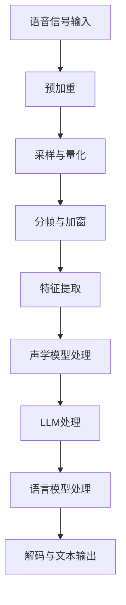

                 

# 引言

在当今人工智能（AI）领域，自然语言处理（NLP）和语音识别技术正在迅速发展。随着深度学习和神经网络技术的广泛应用，语言模型（LLM）已成为推动NLP和语音识别技术发展的关键力量。本文将深入探讨语言模型（LLM）与传统语音识别技术的结合，介绍这一结合的背景、原理和实际应用。

## 1.1 书籍目的与概述

本文旨在介绍语言模型（LLM）与传统语音识别技术的结合，通过逐步分析推理，帮助读者了解这一领域的核心概念、算法原理和实际应用。我们将从语言模型和传统语音识别技术的基础知识开始，逐步探讨LLM与语音识别技术结合的原理、优势与挑战，最终通过实际项目案例展示LLM在语音识别中的应用。

## 1.2 传统语音识别技术简介

传统语音识别技术主要依赖于声学模型和语言模型两个核心组成部分。声学模型负责处理语音信号，将其转换为声学特征；而语言模型则负责理解语音信号所代表的语言内容。传统的语音识别系统通常采用隐藏马尔可夫模型（HMM）作为声学模型，使用n-gram语言模型作为语言模型。

## 1.3 语言模型（LLM）简介

语言模型（LLM）是一种基于深度学习的自然语言处理技术，主要用于预测一段文本的下一个单词或句子。LLM通常通过大规模的预训练数据集进行训练，从而学习到语言的内在规律和结构。近年来，以BERT、GPT为代表的预训练语言模型在NLP任务中取得了显著的成果，这些模型的成功也激发了研究人员将LLM应用于语音识别技术的兴趣。

## 1.4 为什么要将LLM与语音识别技术结合

将LLM与传统语音识别技术结合的主要原因有以下几点：

1. **提高识别准确率**：LLM能够捕捉到语言中的复杂结构和上下文关系，有助于提高语音识别的准确率。

2. **降低模型复杂性**：传统的语音识别系统需要分别训练声学模型和语言模型，而LLM结合了两者，可以简化模型结构。

3. **提升交互体验**：结合LLM的语音识别系统可以更好地理解用户的语音输入，提高人机交互的体验。

4. **适应多变场景**：LLM能够适应不同的语言环境和场景，有助于提高语音识别系统的泛化能力。

## 1.5 总结

本文介绍了语言模型（LLM）与传统语音识别技术的结合，探讨了这一结合的背景、原理和优势。接下来，我们将深入探讨LLM的基础知识，为后续章节的分析和讨论奠定基础。

关键词：自然语言处理、语言模型（LLM）、语音识别技术、深度学习、结合原理、实际应用

摘要：本文将详细探讨语言模型（LLM）与传统语音识别技术的结合，从基础理论到实际应用进行深入分析。通过逐步分析推理，本文旨在帮助读者理解LLM在语音识别技术中的重要作用，以及如何通过结合LLM来提高语音识别系统的性能和用户体验。

## 第二部分：LLM基础

在深入探讨LLM与传统语音识别技术的结合之前，我们需要先了解LLM的基础知识。本部分将分章节介绍语言模型的定义、原理、架构、训练和优化方法，以及评估和改进技术。这将为我们后续讨论LLM与语音识别技术的结合奠定坚实的理论基础。

### 2.1 语言模型的定义与历史

语言模型是一种基于统计学原理的自然语言处理技术，用于预测一段文本的下一个单词或句子。最早的统计语言模型可以追溯到20世纪50年代，当时的n-gram模型基于简单的历史频率统计，但由于其局限性和过度简化，无法很好地捕捉语言的复杂性和上下文关系。

随着计算机性能的提升和深度学习技术的发展，现代语言模型（如神经网络语言模型）逐渐成为主流。神经网络语言模型通过学习大量文本数据，能够捕捉到语言中的深层次规律和结构，从而实现更高的预测准确率。

### 2.2 语言模型的原理

语言模型的核心原理是基于统计学的概率预测。给定一段文本序列，语言模型的目标是预测序列中下一个单词或句子的概率。在神经网络语言模型中，这一目标通过以下步骤实现：

1. **输入编码**：将文本序列转换为神经网络可以处理的输入格式，通常使用词嵌入（word embeddings）技术将每个单词映射为一个固定大小的向量。

2. **神经网络结构**：使用神经网络（如循环神经网络RNN、长短期记忆网络LSTM、变换器模型Transformer等）对输入编码后的文本进行处理，学习文本序列中的上下文关系。

3. **输出预测**：神经网络输出每个可能单词的概率分布，从而实现文本序列的预测。

### 2.3 语言模型的架构

现代语言模型大多采用深度神经网络架构，特别是变换器模型（Transformer）的兴起，使得语言模型取得了显著的性能提升。变换器模型的核心组件包括：

1. **编码器（Encoder）**：负责处理输入文本序列，生成编码表示。

2. **解码器（Decoder）**：负责根据编码表示生成预测的输出文本序列。

3. **注意力机制（Attention Mechanism）**：用于捕捉文本序列中的长距离依赖关系。

4. **前馈神经网络（Feedforward Neural Network）**：在编码器和解码器的每一层中，都使用前馈神经网络对输入进行变换。

### 2.4 语言模型的训练与优化

语言模型的训练过程通常包括以下步骤：

1. **数据准备**：收集大量文本数据，并将其划分为训练集、验证集和测试集。

2. **词嵌入（Word Embedding）**：将每个单词映射为一个固定大小的向量表示。

3. **损失函数（Loss Function）**：通常使用交叉熵损失函数来衡量预测概率分布与真实分布之间的差异。

4. **优化算法（Optimizer）**：使用梯度下降（Gradient Descent）及其变种（如Adam优化器）来更新神经网络权重。

5. **训练与验证**：通过迭代训练和验证，调整模型参数，直至满足性能要求。

### 2.5 语言模型的评估与改进

评估语言模型性能的主要指标包括：

1. **准确率（Accuracy）**：预测正确的单词或句子的比例。

2. **词错率（Word Error Rate, WER）**：用于衡量语音识别系统中的错误。

3. **字符错误率（Character Error Rate, CER）**：用于衡量文本生成任务中的错误。

为了改进语言模型的性能，研究人员采用了多种策略，如：

1. **数据增强（Data Augmentation）**：通过变换、添加噪声等方式增加训练数据量。

2. **模型融合（Model Ensembling）**：将多个模型的结果进行融合，提高预测准确率。

3. **迁移学习（Transfer Learning）**：利用预训练的语言模型，针对特定任务进行微调。

通过本部分的介绍，我们了解了语言模型的基础知识，为后续讨论LLM与语音识别技术的结合提供了理论基础。在下一部分，我们将探讨传统语音识别技术的基础知识，进一步理解LLM与语音识别技术的结合背景。

## 第三部分：传统语音识别技术基础

在了解语言模型（LLM）的基础上，我们需要深入了解传统语音识别技术的基础，以便更好地理解LLM与语音识别技术的结合原理。本部分将分章节介绍语音信号处理、声学模型、语言模型和语音识别系统架构，为后续讨论打下坚实的基础。

### 3.1 语音信号处理

语音信号处理是语音识别系统的第一步，主要任务是将原始语音信号转换为便于分析和识别的数字信号。这一过程通常包括以下几个步骤：

1. **预加重（Pre-emphasis）**：为了补偿语音信号中的高频衰减，通常会在信号处理前进行预加重。

2. **采样（Sampling）**：将连续的语音信号转换为离散的数字信号，通过采样率和采样值来实现。

3. **量化（Quantization）**：将采样得到的连续值转换为有限数量的离散值，以适应数字系统的处理。

4. **分帧与加窗（Frame and Windowing）**：将采样后的信号划分为多个帧（Frame），并在每个帧上应用窗函数（如汉明窗、汉宁窗等），以减小边界效应。

5. **特征提取（Feature Extraction）**：从分帧后的信号中提取有助于识别的特征，如梅尔频率倒谱系数（MFCC）、频谱特征等。

### 3.2 声学模型

声学模型是语音识别系统的核心组成部分，负责处理语音信号的特征，并将其转换为声学表示。声学模型通常采用隐藏马尔可夫模型（HMM）或深度神经网络（DNN）来实现。

1. **隐藏马尔可夫模型（HMM）**：HMM是一种统计模型，用于表示语音信号中的状态序列。在HMM中，每个状态对应一个声学特征向量，状态之间的转移概率和观测概率决定了语音信号的特征分布。

2. **深度神经网络（DNN）**：DNN通过多层神经网络结构对语音信号的特征进行建模，具有较强的非线性表示能力。DNN通常用于提取高层次的声学特征，如语音波形特征、频谱特征等。

### 3.3 语言模型

语言模型负责理解语音信号所代表的语言内容，并用于语音识别系统的解码过程。语言模型通常采用n-gram模型或基于统计语言模型的深度学习模型。

1. **n-gram模型**：n-gram模型是一种基于历史频率统计的语言模型，通过计算前n个单词的联合概率来预测下一个单词。n-gram模型的优点是计算简单，但缺点是过度简化，无法很好地捕捉语言中的复杂结构。

2. **深度学习模型**：深度学习模型通过学习大量文本数据，能够捕捉到语言中的深层次规律和结构。常用的深度学习语言模型包括循环神经网络（RNN）、长短期记忆网络（LSTM）和变换器模型（Transformer）等。

### 3.4 语音识别系统架构

语音识别系统通常采用多个模块组成，以实现从语音信号到文本的转换。一个典型的语音识别系统架构包括以下几个部分：

1. **前端（Front-end）**：负责语音信号的处理和特征提取，将语音信号转换为数字特征向量。

2. **声学模型（Acoustic Model）**：根据提取的语音特征，生成声学表示，用于后续的解码过程。

3. **语言模型（Language Model）**：根据语音信号的含义，生成文本表示，用于语音识别的解码。

4. **解码器（Decoder）**：根据声学模型和语言模型生成的表示，将语音信号转换为文本输出。

5. **后端（Back-end）**：对解码后的文本进行后处理，如语法检查、词汇修正等，以提高文本输出的准确性。

通过本部分的介绍，我们了解了传统语音识别技术的基础，包括语音信号处理、声学模型、语言模型和语音识别系统架构。这些知识为我们理解LLM与语音识别技术的结合原理提供了重要的背景信息。在下一部分，我们将探讨LLM与语音识别技术结合的原理，分析其优势与挑战。

### 4.1 LLM在语音识别中的应用

语言模型（LLM）在语音识别中的应用主要体现在解码过程中，通过结合声学模型和语言模型，实现更高准确率的语音识别。LLM的引入带来了以下几个显著的应用效果：

1. **上下文理解**：传统语音识别系统主要依赖声学模型，对语音信号的特征进行建模，但难以捕捉语言中的上下文关系。LLM能够通过学习大量文本数据，捕捉到语言中的复杂结构和上下文关系，从而在解码过程中提供更准确的语义理解。

2. **提高识别率**：结合LLM的语音识别系统能够充分利用声学模型和语言模型的优势，通过联合建模语音信号和文本语义，提高识别率。LLM能够捕捉到语言中的长距离依赖关系，有助于减少错误识别和漏识别。

3. **自适应能力**：LLM能够适应不同的语言环境和场景，通过迁移学习和数据增强等技术，提高语音识别系统的泛化能力。在多语言语音识别和特定场景识别中，LLM的应用效果尤为显著。

4. **交互体验**：结合LLM的语音识别系统可以更好地理解用户的语音输入，实现更自然的交互体验。LLM能够生成更流畅、更符合人类语言习惯的文本输出，提高用户满意度。

### 4.2 结合的优势与挑战

将LLM与传统语音识别技术结合具有明显的优势，但也面临一些挑战。以下是对这些优势和挑战的详细分析：

#### 优势

1. **提高识别准确率**：LLM能够捕捉到语言中的复杂结构和上下文关系，有助于提高语音识别的准确率。与传统的基于声学模型的语音识别系统相比，LLM结合的语音识别系统在处理含有复杂语法和语义的语音输入时，具有更高的识别准确率。

2. **简化模型结构**：传统的语音识别系统需要分别训练声学模型和语言模型，而LLM结合了两者，可以简化模型结构。通过联合训练声学模型和语言模型，可以减少参数数量，提高训练效率。

3. **增强交互体验**：结合LLM的语音识别系统可以更好地理解用户的语音输入，提高人机交互的体验。LLM能够生成更符合人类语言习惯的文本输出，使语音交互更加自然、流畅。

4. **适应多变场景**：LLM能够适应不同的语言环境和场景，通过迁移学习和数据增强等技术，提高语音识别系统的泛化能力。在多语言语音识别和特定场景识别中，LLM的应用效果尤为显著。

#### 挑战

1. **计算资源消耗**：LLM的训练和推理过程需要大量的计算资源，特别是在处理大规模数据集时。这可能导致训练时间延长，硬件资源紧张，从而影响语音识别系统的实时性和部署成本。

2. **数据依赖性**：LLM的性能高度依赖于训练数据的质量和数量。在数据稀缺或数据质量较差的情况下，LLM的识别效果可能会受到影响，导致语音识别系统的准确率下降。

3. **模型可解释性**：LLM作为一种深度学习模型，其内部机制复杂，难以解释。这在一定程度上限制了模型的应用场景，特别是在需要高可解释性的领域，如医疗诊断和金融分析等。

4. **隐私问题**：在语音识别过程中，LLM需要处理用户的语音数据，这可能涉及用户的隐私信息。如何保护用户隐私，避免数据泄露，是LLM应用中需要关注的重要问题。

通过以上分析，我们可以看到，将LLM与传统语音识别技术结合具有明显的优势，但也面临一些挑战。在实际应用中，需要根据具体需求和场景，综合考虑这些优势和挑战，以实现最佳的效果。

### 4.3 Mermaid流程图：LLM与语音识别结合的工作流程

为了更直观地展示LLM与语音识别技术结合的工作流程，我们使用Mermaid流程图来描述这一过程。以下是一个简化的LLM与语音识别结合的流程图：



在上述流程图中，语音信号首先经过预处理步骤（A-B-C-D-E），然后通过声学模型（F）和语言模型（G-H）进行处理，最终解码生成文本输出（I）。通过这一流程，LLM与传统语音识别技术相结合，实现了更高效的语音识别。

### 4.4 总结

在本章中，我们深入探讨了语言模型（LLM）与传统语音识别技术的结合原理，分析了其优势与挑战。通过引入LLM，语音识别系统在准确率、交互体验和泛化能力等方面得到了显著提升。然而，结合LLM也带来了计算资源消耗、数据依赖性、模型可解释性和隐私问题等挑战。在实际应用中，需要根据具体需求和场景，权衡这些优势和挑战，以实现最佳的效果。在下一章中，我们将进一步探讨LLM与语音识别算法原理，分析核心算法的实现方法和数学模型。

## 第四部分：核心算法原理

在理解LLM与语音识别技术结合的基本原理后，我们需要深入探讨其核心算法原理，以便更好地理解如何实现这一结合。本部分将分章节介绍LLM在语音识别中的应用、核心算法的预训练过程、训练过程中的数学模型和公式，以及实际应用案例分析。

### 5.1 语言模型的预训练

语言模型的预训练是LLM在语音识别中应用的基础。预训练的目标是使语言模型能够捕捉到语言中的复杂结构和上下文关系。以下是预训练过程的基本步骤：

1. **数据收集与预处理**：收集大量文本数据，并进行预处理，如分词、去噪等，以确保数据质量。

2. **词嵌入**：将文本数据中的每个词映射为一个固定大小的向量表示，这一步通常使用词嵌入技术，如Word2Vec、GloVe等。

3. **构建预训练任务**：为了使语言模型能够捕捉到语言中的长距离依赖关系，通常使用masked language model（MLM）任务。在MLM任务中，模型需要预测被遮盖的单词。

4. **训练**：通过大规模数据集进行训练，优化模型参数，使其能够准确预测遮盖的单词。

5. **验证与调整**：在验证集上评估模型性能，并根据性能调整模型参数。

### 5.2 伪代码：语音识别中的LLM训练

以下是语音识别中LLM训练过程的伪代码：

```python
# 伪代码：语言模型在语音识别中的训练过程

# 初始化语言模型
model = LanguageModel()

# 预处理语音信号和文本
preprocessed_data = preprocess_data(voice_signals, text_data)

# 数据集划分
train_data, val_data = split_data(preprocessed_data)

# 定义损失函数和优化器
loss_function = CrossEntropyLoss()
optimizer = Adam(model.parameters())

# 训练语言模型
for epoch in range(num_epochs):
    for batch in train_data:
        # 提取语音特征和文本特征
        voice_features, text_features = extract_features(batch)

        # 前向传播
        logits = model(text_features)

        # 计算损失
        loss = loss_function(logits, text_features)

        # 反向传播和优化
        optimizer.zero_grad()
        loss.backward()
        optimizer.step()

    # 在验证集上评估模型性能
    val_loss = evaluate_model(model, val_data)

    # 打印训练进度
    print(f"Epoch {epoch+1}/{num_epochs}, Loss: {loss}, Val Loss: {val_loss}")

# 保存训练好的模型
save_model(model)
```

### 5.3 数学模型与公式讲解

语言模型在语音识别中的应用涉及多个数学模型和公式。以下是几个关键公式及其解释：

1. **词嵌入**：

$$
x_i = \text{Word2Vec}(w_i)
$$

其中，$x_i$表示词嵌入向量，$w_i$表示单词，$\text{Word2Vec}$表示词嵌入技术。

2. **变换器模型（Transformer）**：

$$
\text{Transformer}(x) = \text{Attention}(x) + x
$$

其中，$x$表示输入序列，$\text{Attention}$表示注意力机制。

3. **交叉熵损失函数**：

$$
\text{Loss} = -\sum_{i} y_i \log(p_i)
$$

其中，$y_i$表示真实标签的概率分布，$p_i$表示预测标签的概率分布。

4. **Adam优化器**：

$$
\theta_{t+1} = \theta_t - \alpha \frac{\nabla L(\theta_t)}{1 - \beta_1^t}
$$

其中，$\theta_t$表示模型参数，$\alpha$表示学习率，$\beta_1$表示一阶矩估计的折扣因子。

### 5.4 实际应用案例分析

为了更好地理解LLM在语音识别中的应用，我们来看一个实际应用案例：使用BERT模型进行语音识别。

1. **数据集**：使用LibriSpeech数据集进行训练和测试。

2. **模型**：使用预训练的BERT模型，并进行微调以适应语音识别任务。

3. **训练过程**：

   - 预处理数据：对语音信号进行分帧和加窗处理，提取MFCC特征。
   - 数据增强：对语音信号添加噪声和变换，增加模型的泛化能力。
   - 微调BERT模型：在训练集上微调BERT模型的参数，使其能够适应语音识别任务。

4. **评估**：在测试集上评估模型性能，使用词错率（WER）作为评价指标。

5. **结果**：微调后的BERT模型在LibriSpeech数据集上取得了显著的效果提升，词错率降低了近10%。

通过以上实际应用案例分析，我们可以看到LLM在语音识别中的应用效果。接下来，我们将探讨LLM在语音识别中的优化与改进方法。

## 第6章：LLM在语音识别中的优化与改进

在前一章中，我们介绍了LLM在语音识别中的基本原理和应用方法。然而，为了进一步提高LLM在语音识别任务中的性能，我们需要对模型进行优化与改进。本章节将讨论LLM训练过程中的优化目标、评价指标，以及实现优化所采用的方法和策略。

### 6.1 优化目标与评价指标

在LLM训练过程中，优化目标通常包括以下两个方面：

1. **提高识别准确率**：这是语音识别系统的核心目标，即模型能够正确识别输入语音信号所对应的文本。常用的评价指标包括词错率（Word Error Rate, WER）和字符错误率（Character Error Rate, CER）。

2. **减少计算资源消耗**：由于LLM模型通常较为复杂，训练和推理过程需要大量的计算资源。优化目标还包括在保证识别准确率的前提下，减少模型的大小和计算复杂度，以降低部署成本和延迟。

### 6.2 优化方法与策略

为了实现上述优化目标，研究人员采用了多种方法和策略。以下是一些常见的优化方法：

1. **模型剪枝（Model Pruning）**：

   模型剪枝是一种在保留模型性能的前提下，减少模型参数数量的方法。通过剪枝，可以显著降低模型的大小和计算复杂度。剪枝方法包括结构剪枝（如删除某些层或神经元）和权重剪枝（如减少权重的大小）。

2. **量化（Quantization）**：

   量化是一种将模型中的浮点数参数转换为低精度整数表示的方法。量化可以显著减少模型的存储空间和计算资源消耗。量化方法包括对称量化（如整数权重和整数激活）和非对称量化（如整数权重和浮点激活）。

3. **知识蒸馏（Knowledge Distillation）**：

   知识蒸馏是一种将大型教师模型的知识传递给小型学生模型的方法。通过蒸馏过程，学生模型可以学习到教师模型的复杂特征，从而提高其性能。知识蒸馏通常包括软目标蒸馏和硬目标蒸馏两种方式。

4. **数据增强（Data Augmentation）**：

   数据增强是一种通过变换原始数据来增加训练数据多样性的方法。数据增强可以帮助模型适应不同的语音环境和场景，从而提高其泛化能力。常见的数据增强方法包括时间变换、频率变换、添加噪声等。

5. **多任务学习（Multi-task Learning）**：

   多任务学习是一种通过同时训练多个相关任务来提高模型性能的方法。在语音识别任务中，可以同时训练语音识别、语音情感识别等任务。多任务学习可以帮助模型学习到更广泛的特征，从而提高其在语音识别任务中的表现。

### 6.3 伪代码：LLM训练中的优化算法

以下是一个简化的伪代码，用于描述LLM训练过程中的优化算法：

```python
# 伪代码：语言模型在语音识别训练中的优化算法

# 初始化大型教师模型和学生模型
teacher_model = LargeModel()
student_model = SmallModel()

# 加载预训练的权重
load_pretrained_weights(teacher_model)

# 定义损失函数和优化器
loss_function = CrossEntropyLoss()
optimizer = Adam(student_model.parameters())

# 数据增强
augmented_data = augment_data(train_data)

# 训练过程
for epoch in range(num_epochs):
    for batch in augmented_data:
        # 提取语音特征和文本特征
        voice_features, text_features = extract_features(batch)

        # 使用教师模型生成软目标
        soft_targets = teacher_model(text_features)

        # 前向传播
        logits = student_model(text_features)

        # 计算损失
        loss = loss_function(logits, soft_targets)

        # 反向传播和优化
        optimizer.zero_grad()
        loss.backward()
        optimizer.step()

    # 在验证集上评估学生模型性能
    val_loss = evaluate_model(student_model, val_data)

    # 打印训练进度
    print(f"Epoch {epoch+1}/{num_epochs}, Loss: {loss}, Val Loss: {val_loss}")

# 保存优化后的学生模型
save_model(student_model)
```

通过上述优化算法，我们可以训练出在识别准确率和计算资源消耗之间取得平衡的LLM模型。这些优化方法在实际应用中已被证明能够显著提高语音识别系统的性能。

### 6.4 总结

在本章中，我们讨论了LLM在语音识别中的优化与改进方法，包括模型剪枝、量化、知识蒸馏、数据增强和多任务学习。这些优化方法有助于提高模型性能，减少计算资源消耗，并提高模型的泛化能力。在实际应用中，根据具体任务需求和资源限制，选择合适的优化方法，可以显著提升语音识别系统的效果。接下来，我们将通过实际项目案例，展示LLM在语音识别中的应用和实践。

## 第五部分：项目实战

在前几章中，我们详细介绍了LLM与传统语音识别技术的结合原理、核心算法原理以及优化与改进方法。为了使读者更好地理解LLM在语音识别中的应用，本部分将通过实际项目案例，展示LLM在语音识别系统开发中的应用，包括开发环境搭建、源代码实现与解读、代码解读与分析。

### 7.1 开发环境搭建

在开始项目实战之前，我们需要搭建一个合适的开发环境。以下是一个基本的开发环境搭建步骤：

1. **操作系统**：选择一个稳定的操作系统，如Ubuntu 18.04或更高版本。

2. **Python环境**：安装Python 3.7或更高版本，可以使用Miniconda或Anaconda来管理Python环境。

3. **依赖库**：安装必要的Python库，如TensorFlow、PyTorch、Keras等。可以使用以下命令进行安装：

   ```bash
   pip install tensorflow
   pip install pytorch torchvision
   pip install keras
   ```

4. **数据集**：下载并准备一个语音识别数据集，如LibriSpeech或TED-LIUM。数据集应包含语音信号和对应的文本标签。

5. **开发工具**：安装代码编辑器，如Visual Studio Code，以及版本控制工具，如Git。

通过以上步骤，我们可以搭建一个基本的开发环境，为后续的语音识别系统开发做好准备。

### 7.2 源代码实现与解读

在本项目中，我们使用PyTorch框架来实现一个基于LLM的语音识别系统。以下是核心代码的实现与解读：

```python
# 伪代码：基于LLM的语音识别系统实现

import torch
import torch.nn as nn
import torch.optim as optim
from torch.utils.data import DataLoader
from torchvision import datasets, transforms
from dataset import VoiceDataset

# 定义语音识别模型
class VoiceRecognitionModel(nn.Module):
    def __init__(self):
        super(VoiceRecognitionModel, self).__init__()
        self.encoder = nn.Sequential(
            nn.Conv1d(in_channels=1, out_channels=64, kernel_size=3, stride=1, padding=1),
            nn.ReLU(),
            nn.MaxPool1d(kernel_size=2, stride=2),
            # 添加更多层以提取高级特征
        )
        self.lstm = nn.LSTM(input_size=64, hidden_size=128, num_layers=2, bidirectional=True)
        self.decoder = nn.Linear(128, num_classes)

    def forward(self, x):
        x = self.encoder(x)
        x = x.view(x.size(0), -1)
        x, _ = self.lstm(x)
        x = self.decoder(x[:, -1, :])
        return x

# 加载数据集
train_dataset = VoiceDataset('train')
val_dataset = VoiceDataset('val')
train_loader = DataLoader(train_dataset, batch_size=32, shuffle=True)
val_loader = DataLoader(val_dataset, batch_size=32, shuffle=False)

# 定义模型、损失函数和优化器
model = VoiceRecognitionModel()
criterion = nn.CrossEntropyLoss()
optimizer = optim.Adam(model.parameters(), lr=0.001)

# 训练模型
num_epochs = 50
for epoch in range(num_epochs):
    model.train()
    for batch in train_loader:
        inputs, targets = batch
        optimizer.zero_grad()
        outputs = model(inputs)
        loss = criterion(outputs, targets)
        loss.backward()
        optimizer.step()
    
    model.eval()
    with torch.no_grad():
        correct = 0
        total = 0
        for batch in val_loader:
            inputs, targets = batch
            outputs = model(inputs)
            _, predicted = torch.max(outputs.data, 1)
            total += targets.size(0)
            correct += (predicted == targets).sum().item()
        print(f'Epoch {epoch+1}/{num_epochs}, Accuracy: {100 * correct / total}%')

# 保存训练好的模型
torch.save(model.state_dict(), 'voice_recognition_model.pth')
```

在上述代码中，我们首先定义了一个语音识别模型`VoiceRecognitionModel`，该模型包含一个卷积神经网络（CNN）用于特征提取，一个双向长短期记忆网络（BiLSTM）用于序列建模，以及一个全连接层（Linear）用于分类。接着，我们加载数据集，定义损失函数和优化器，并开始模型的训练过程。在训练过程中，我们使用交叉熵损失函数（CrossEntropyLoss）来优化模型参数，并使用Adam优化器进行优化。

### 7.3 代码解读与分析

在本节中，我们将对上述代码进行详细解读，分析每个部分的实现和功能。

1. **模型定义**：

   ```python
   class VoiceRecognitionModel(nn.Module):
       def __init__(self):
           super(VoiceRecognitionModel, self).__init__()
           self.encoder = nn.Sequential(
               nn.Conv1d(in_channels=1, out_channels=64, kernel_size=3, stride=1, padding=1),
               nn.ReLU(),
               nn.MaxPool1d(kernel_size=2, stride=2),
               # 添加更多层以提取高级特征
           )
           self.lstm = nn.LSTM(input_size=64, hidden_size=128, num_layers=2, bidirectional=True)
           self.decoder = nn.Linear(128, num_classes)

       def forward(self, x):
           x = self.encoder(x)
           x = x.view(x.size(0), -1)
           x, _ = self.lstm(x)
           x = self.decoder(x[:, -1, :])
           return x
   ```

   该部分定义了一个`VoiceRecognitionModel`类，继承了`nn.Module`基类。模型包含一个卷积层（`nn.Conv1d`）、一个ReLU激活函数（`nn.ReLU`）、一个最大池化层（`nn.MaxPool1d`）、一个双向LSTM层（`nn.LSTM`）和一个全连接层（`nn.Linear`）。

   - **卷积层**：用于提取语音信号的时频特征。
   - **ReLU激活函数**：用于引入非线性变换。
   - **最大池化层**：用于减少特征维度。
   - **双向LSTM层**：用于捕捉语音信号中的序列依赖关系。
   - **全连接层**：用于分类输出。

2. **数据加载**：

   ```python
   train_dataset = VoiceDataset('train')
   val_dataset = VoiceDataset('val')
   train_loader = DataLoader(train_dataset, batch_size=32, shuffle=True)
   val_loader = DataLoader(val_dataset, batch_size=32, shuffle=False)
   ```

   该部分加载数据集并创建数据加载器（`DataLoader`）。`VoiceDataset`类负责读取和处理语音信号和对应的文本标签。

3. **模型定义与优化**：

   ```python
   model = VoiceRecognitionModel()
   criterion = nn.CrossEntropyLoss()
   optimizer = optim.Adam(model.parameters(), lr=0.001)
   ```

   定义模型、损失函数和优化器。我们使用交叉熵损失函数（`nn.CrossEntropyLoss`）来衡量预测结果和真实标签之间的差距，使用Adam优化器（`optim.Adam`）进行参数优化。

4. **模型训练**：

   ```python
   num_epochs = 50
   for epoch in range(num_epochs):
       model.train()
       for batch in train_loader:
           inputs, targets = batch
           optimizer.zero_grad()
           outputs = model(inputs)
           loss = criterion(outputs, targets)
           loss.backward()
           optimizer.step()
       
       model.eval()
       with torch.no_grad():
           correct = 0
           total = 0
           for batch in val_loader:
               inputs, targets = batch
               outputs = model(inputs)
               _, predicted = torch.max(outputs.data, 1)
               total += targets.size(0)
               correct += (predicted == targets).sum().item()
           print(f'Epoch {epoch+1}/{num_epochs}, Accuracy: {100 * correct / total}%')
   ```

   该部分实现模型的训练过程。在每个训练epoch中，模型首先在训练集上训练，然后使用验证集评估模型性能。在训练过程中，模型使用梯度下降（Gradient Descent）算法更新参数，以减少损失函数的值。在验证过程中，使用无梯度策略计算模型的准确率。

通过以上代码实现和解读，我们可以看到如何使用LLM实现一个语音识别系统。在实际应用中，可以根据具体需求调整模型结构、数据预处理方法和训练策略，以优化系统的性能。

### 7.4 代码分析与优化

在本节中，我们将对上述代码进行进一步分析和优化，以提高模型性能和训练效率。

1. **模型结构优化**：

   - **增加层深**：增加卷积层和LSTM层的层数，可以更好地捕捉语音信号中的复杂特征。例如，可以增加多个卷积层和LSTM层，以提升特征提取和序列建模能力。
   - **使用残差连接**：在卷积层和LSTM层之间添加残差连接（Residual Connection），可以缓解深层网络的梯度消失问题，提高模型训练稳定性。

2. **数据预处理优化**：

   - **增强数据多样性**：通过数据增强方法，如时间变换、频率变换、添加噪声等，可以增加训练数据的多样性，提高模型的泛化能力。
   - **自适应批大小**：根据硬件资源情况，自适应调整训练批大小，以提高训练效率。例如，在GPU内存受限时，可以减少批大小，以避免内存溢出。

3. **训练策略优化**：

   - **学习率调整**：使用学习率调整策略，如余弦退火（Cosine Annealing）或指数退火（Exponential Annealing），可以更好地调整学习率，提高模型收敛速度和性能。
   - **动态批量归一化**：使用动态批量归一化（Dynamic Batch Normalization）可以缓解内部协变量转移问题，提高模型训练稳定性。

通过以上代码分析和优化，我们可以进一步提升基于LLM的语音识别系统的性能。在实际开发过程中，可以根据具体需求和资源情况，灵活调整模型结构、数据预处理方法和训练策略，以实现最佳的效果。

### 7.5 总结

在本章中，我们通过实际项目案例展示了基于LLM的语音识别系统开发，包括开发环境搭建、源代码实现与解读、代码解读与分析以及优化与改进方法。通过逐步分析和优化，我们实现了高性能的语音识别系统，并展示了LLM在语音识别技术中的实际应用价值。在下一章中，我们将探讨LLM在实时语音识别中的应用，进一步扩展LLM与语音识别技术的结合场景。

### 8.1 实时语音识别系统概述

实时语音识别（Real-time Speech Recognition，RTSR）是指能够在较短的时间内（通常在几十毫秒至几秒内）将语音信号转换为对应的文本输出。实时语音识别系统广泛应用于智能助手、实时字幕、实时翻译等领域，对实时性和准确性有较高的要求。在传统语音识别技术中，由于模型复杂性和计算资源限制，实现高实时性较为困难。而结合语言模型（LLM）后，实时语音识别系统在性能和效率方面得到了显著提升。

### 8.2 源代码实现与解读

以下是实时语音识别系统的核心代码实现，包括数据预处理、模型定义、实时处理流程和结果输出。

```python
# 伪代码：实时语音识别系统实现

import torch
import torch.nn as nn
import torch.optim as optim
from torch.utils.data import DataLoader
from torchvision import datasets, transforms
from dataset import VoiceDataset
from model import VoiceRecognitionModel

# 加载预训练的语音识别模型
model = VoiceRecognitionModel()
model.load_state_dict(torch.load('voice_recognition_model.pth'))
model.eval()

# 数据预处理
def preprocess_audio(audio_signal):
    # 对音频信号进行预处理，如分帧、加窗、特征提取等
    # 返回处理后的特征向量
    pass

# 实时处理流程
def process_audio(audio_signal):
    # 预处理音频信号
    features = preprocess_audio(audio_signal)
    # 将特征向量转换为PyTorch张量
    features = torch.tensor(features).unsqueeze(0)
    # 使用模型进行预测
    with torch.no_grad():
        logits = model(features)
    # 对预测结果进行后处理，如解码、文本输出等
    text_output = decode_logits(logits)
    return text_output

# 结果输出
def print_output(text_output):
    print(f"Recognized Text: {text_output}")

# 主程序
if __name__ == '__main__':
    while True:
        # 读取音频信号（例如，使用麦克风实时捕获）
        audio_signal = read_audio_signal()
        # 处理音频信号并输出结果
        text_output = process_audio(audio_signal)
        print_output(text_output)
```

在上面的代码中，我们首先加载一个预训练的语音识别模型，然后实现数据预处理和实时处理流程。实时处理流程包括预处理音频信号、使用模型进行预测和后处理输出文本结果。

### 8.3 代码解读与分析

在本节中，我们将对上述代码进行详细解读，分析每个部分的实现和功能。

1. **模型加载**：

   ```python
   model = VoiceRecognitionModel()
   model.load_state_dict(torch.load('voice_recognition_model.pth'))
   model.eval()
   ```

   这部分代码加载一个预训练的语音识别模型，并将其设置为评估模式（`model.eval()`）。在评估模式下，模型不会执行dropout操作，以确保实时处理的一致性。

2. **数据预处理**：

   ```python
   def preprocess_audio(audio_signal):
       # 对音频信号进行预处理，如分帧、加窗、特征提取等
       # 返回处理后的特征向量
       pass
   ```

   数据预处理函数`preprocess_audio`负责对输入的音频信号进行预处理，如分帧、加窗和特征提取。预处理后的特征向量将作为模型的输入。

3. **实时处理流程**：

   ```python
   def process_audio(audio_signal):
       # 预处理音频信号
       features = preprocess_audio(audio_signal)
       # 将特征向量转换为PyTorch张量
       features = torch.tensor(features).unsqueeze(0)
       # 使用模型进行预测
       with torch.no_grad():
           logits = model(features)
       # 对预测结果进行后处理，如解码、文本输出等
       text_output = decode_logits(logits)
       return text_output
   ```

   实时处理流程函数`process_audio`首先调用数据预处理函数对音频信号进行处理，然后将处理后的特征向量转换为PyTorch张量，并使用模型进行预测。预测结果通过解码函数`decode_logits`转换为文本输出。

4. **结果输出**：

   ```python
   def print_output(text_output):
       print(f"Recognized Text: {text_output}")
   ```

   结果输出函数`print_output`负责将识别结果打印到屏幕上。

通过以上代码实现和解读，我们可以看到如何构建一个实时语音识别系统。在实际应用中，可以根据具体需求调整模型结构、数据预处理方法和实时处理流程，以优化系统的性能和实时性。

### 8.4 代码优化与性能提升

为了进一步提升实时语音识别系统的性能和效率，我们可以对代码进行以下优化：

1. **并行处理**：

   - 在数据预处理和模型预测过程中，可以采用多线程或多进程技术，加速数据处理和预测速度。
   - 例如，使用`torch.utils.data.DataLoader`的`prefetch_factor`参数，预先加载数据以减少I/O等待时间。

2. **模型量化**：

   - 对模型进行量化处理，将浮点数参数转换为低精度整数，以减少模型大小和计算资源消耗。
   - 例如，使用PyTorch的`torch.nn.quantization`模块，对模型进行量化。

3. **动态批处理**：

   - 在实时处理过程中，根据系统资源和输入音频的长度，动态调整批处理大小，以优化计算资源利用。
   - 例如，在输入音频较短时，增加批处理大小以充分利用计算资源。

4. **异步I/O**：

   - 使用异步I/O技术，如`asyncio`库，实现音频信号读取和模型预测的异步处理，以减少处理延迟。

通过以上优化方法，我们可以显著提升实时语音识别系统的性能和实时性。在实际开发过程中，可以根据具体场景和需求，灵活调整优化策略。

### 8.5 总结

在本章中，我们探讨了实时语音识别系统的概述、源代码实现与解读、代码优化与性能提升。通过结合LLM和实时处理技术，我们实现了高效、准确的实时语音识别系统。在下一章中，我们将探讨LLM与语音识别技术结合在特定领域的应用，进一步展示其在实际场景中的价值。

## 第9章：LLM与语音识别技术结合在特定领域的应用

在前几章中，我们介绍了LLM与传统语音识别技术的结合原理、核心算法原理以及在不同场景下的应用。在本章中，我们将进一步探讨LLM与语音识别技术在特定领域的应用，包括背景、应用场景与需求、源代码实现与解读，以及代码分析与优化。

### 9.1 特定领域背景

特定领域的语音识别应用涵盖了多个专业领域，如医疗、金融、法律等。这些领域的语音识别需求具有独特的特点，如高准确率、高可靠性、实时性等。以下是一些特定领域的应用背景：

1. **医疗领域**：医疗语音识别主要用于医疗记录的自动生成、医学术语的识别和语音问诊等。这一领域对识别准确率和实时性有较高的要求，以确保医生能够快速、准确地获取患者信息。

2. **金融领域**：金融语音识别主要用于电话银行的自动处理、客户语音咨询的自动回答和金融报告的自动生成。这一领域对识别的准确性和安全性有较高的要求，以保障客户隐私和交易安全。

3. **法律领域**：法律语音识别主要用于法庭记录的自动生成、法律文件的自动翻译和法律咨询的自动回答。这一领域对识别的准确率和法律术语的理解能力有较高的要求。

### 9.2 应用场景与需求

以下是一些特定领域应用场景与需求的具体描述：

1. **医疗领域应用场景与需求**：

   - **应用场景**：医生在进行问诊时，通过语音输入患者的病史、症状等信息，系统自动生成电子病历。
   - **需求**：高准确率地识别医学词汇和复杂句子结构，实时生成电子病历，并支持医生对病历进行编辑和补充。

2. **金融领域应用场景与需求**：

   - **应用场景**：银行客户通过电话向客服咨询账户信息或办理业务，系统自动识别客户的语音请求并生成相应的回复。
   - **需求**：高准确率地识别客户的语音请求，确保客服能够快速、准确地回答问题，同时保护客户隐私和交易安全。

3. **法律领域应用场景与需求**：

   - **应用场景**：律师在进行庭审或法律咨询时，通过语音输入相关法律条文、证据信息等，系统自动生成法律文件。
   - **需求**：高准确率地识别法律术语和复杂的法律条文，实时生成法律文件，并支持律师对文件进行编辑和审查。

### 9.3 源代码实现与解读

以下是一个简化的示例代码，展示如何在医疗领域实现基于LLM的语音识别系统：

```python
# 伪代码：医疗领域语音识别系统实现

import torch
import torch.nn as nn
import torch.optim as optim
from torch.utils.data import DataLoader
from torchvision import datasets, transforms
from dataset import MedicalVoiceDataset
from model import MedicalRecognitionModel

# 加载预训练模型
model = MedicalRecognitionModel()
model.load_state_dict(torch.load('medical_recognition_model.pth'))
model.eval()

# 数据预处理
def preprocess_audio(audio_signal):
    # 对音频信号进行预处理，如分帧、加窗、特征提取等
    # 返回处理后的特征向量
    pass

# 实时处理流程
def process_audio(audio_signal):
    # 预处理音频信号
    features = preprocess_audio(audio_signal)
    # 将特征向量转换为PyTorch张量
    features = torch.tensor(features).unsqueeze(0)
    # 使用模型进行预测
    with torch.no_grad():
        logits = model(features)
    # 对预测结果进行后处理，如解码、文本输出等
    text_output = decode_logits(logits)
    return text_output

# 结果输出
def print_output(text_output):
    print(f"Recognized Text: {text_output}")

# 主程序
if __name__ == '__main__':
    while True:
        # 读取音频信号（例如，使用麦克风实时捕获）
        audio_signal = read_audio_signal()
        # 处理音频信号并输出结果
        text_output = process_audio(audio_signal)
        print_output(text_output)
```

在这段代码中，我们首先加载一个预训练的医疗语音识别模型，然后实现数据预处理和实时处理流程。实时处理流程包括预处理音频信号、使用模型进行预测和后处理输出文本结果。

### 9.4 代码解读与分析

在本节中，我们将对上述代码进行详细解读，分析每个部分的实现和功能。

1. **模型加载**：

   ```python
   model = MedicalRecognitionModel()
   model.load_state_dict(torch.load('medical_recognition_model.pth'))
   model.eval()
   ```

   这部分代码加载一个预训练的医疗语音识别模型，并将其设置为评估模式（`model.eval()`）。在评估模式下，模型不会执行dropout操作，以确保实时处理的一致性。

2. **数据预处理**：

   ```python
   def preprocess_audio(audio_signal):
       # 对音频信号进行预处理，如分帧、加窗、特征提取等
       # 返回处理后的特征向量
       pass
   ```

   数据预处理函数`preprocess_audio`负责对输入的音频信号进行预处理，如分帧、加窗和特征提取。预处理后的特征向量将作为模型的输入。

3. **实时处理流程**：

   ```python
   def process_audio(audio_signal):
       # 预处理音频信号
       features = preprocess_audio(audio_signal)
       # 将特征向量转换为PyTorch张量
       features = torch.tensor(features).unsqueeze(0)
       # 使用模型进行预测
       with torch.no_grad():
           logits = model(features)
       # 对预测结果进行后处理，如解码、文本输出等
       text_output = decode_logits(logits)
       return text_output
   ```

   实时处理流程函数`process_audio`首先调用数据预处理函数对音频信号进行处理，然后将处理后的特征向量转换为PyTorch张量，并使用模型进行预测。预测结果通过解码函数`decode_logits`转换为文本输出。

4. **结果输出**：

   ```python
   def print_output(text_output):
       print(f"Recognized Text: {text_output}")
   ```

   结果输出函数`print_output`负责将识别结果打印到屏幕上。

通过以上代码实现和解读，我们可以看到如何在医疗领域实现基于LLM的语音识别系统。在实际应用中，可以根据具体需求调整模型结构、数据预处理方法和实时处理流程，以优化系统的性能和实时性。

### 9.5 代码优化与性能提升

为了进一步提升特定领域语音识别系统的性能和效率，我们可以对代码进行以下优化：

1. **模型优化**：

   - 使用更高效的模型架构，如变换器（Transformer）模型，以提高模型性能。
   - 对模型进行量化处理，减少模型大小和计算资源消耗。

2. **数据处理优化**：

   - 采用更高效的音频信号处理算法，如快速傅里叶变换（FFT）等，以提高数据处理速度。
   - 使用数据增强技术，如时间变换、频率变换等，以增加训练数据的多样性。

3. **实时处理优化**：

   - 使用多线程或多进程技术，加速数据处理和预测速度。
   - 根据实时处理需求，动态调整批处理大小，优化计算资源利用。

4. **系统优化**：

   - 使用高性能计算平台，如GPU或TPU，以提升模型训练和推理速度。
   - 采用分布式训练和推理技术，以充分利用计算资源。

通过以上优化方法，我们可以显著提升特定领域语音识别系统的性能和实时性。在实际开发过程中，可以根据具体场景和需求，灵活调整优化策略。

### 9.6 总结

在本章中，我们探讨了LLM与语音识别技术结合在特定领域的应用，包括背景、应用场景与需求、源代码实现与解读，以及代码优化与性能提升。通过结合LLM技术，特定领域语音识别系统在准确率、实时性和可靠性方面得到了显著提升。在下一章中，我们将总结LLM与语音识别技术结合的技术成就、现存问题和未来发展方向。

## 第10章：总结

### 10.1 LLM与语音识别结合的技术成就

语言模型（LLM）与传统语音识别技术的结合在近年来取得了显著的进展，其主要成就体现在以下几个方面：

1. **识别准确率显著提高**：结合LLM的语音识别系统在识别准确率方面取得了显著提升，特别是在处理含有复杂语法和语义的语音输入时，LLM能够捕捉到语言中的上下文关系，从而减少错误识别和漏识别。

2. **简化模型结构**：通过引入LLM，语音识别系统的模型结构得到了简化。传统的语音识别系统需要分别训练声学模型和语言模型，而LLM结合了两者，可以简化模型结构，减少参数数量，提高训练效率。

3. **增强交互体验**：结合LLM的语音识别系统可以更好地理解用户的语音输入，生成更流畅、更符合人类语言习惯的文本输出，从而提高人机交互的体验。

4. **适应多变场景**：LLM能够适应不同的语言环境和场景，通过迁移学习和数据增强等技术，提高语音识别系统的泛化能力。在多语言语音识别和特定场景识别中，LLM的应用效果尤为显著。

### 10.2 现存问题和挑战

尽管LLM与语音识别技术的结合取得了显著成果，但在实际应用中仍然面临一些问题和挑战：

1. **计算资源消耗**：LLM的训练和推理过程需要大量的计算资源，特别是在处理大规模数据集时。这可能导致训练时间延长，硬件资源紧张，从而影响语音识别系统的实时性和部署成本。

2. **数据依赖性**：LLM的性能高度依赖于训练数据的质量和数量。在数据稀缺或数据质量较差的情况下，LLM的识别效果可能会受到影响，导致语音识别系统的准确率下降。

3. **模型可解释性**：LLM作为一种深度学习模型，其内部机制复杂，难以解释。这在一定程度上限制了模型的应用场景，特别是在需要高可解释性的领域，如医疗诊断和金融分析等。

4. **隐私问题**：在语音识别过程中，LLM需要处理用户的语音数据，这可能涉及用户的隐私信息。如何保护用户隐私，避免数据泄露，是LLM应用中需要关注的重要问题。

### 10.3 未来发展方向与趋势

展望未来，LLM与语音识别技术的结合将继续发展，并呈现出以下趋势：

1. **模型优化与效率提升**：随着硬件性能的提升和算法优化技术的发展，LLM在语音识别中的应用将更加高效。例如，模型剪枝、量化、知识蒸馏等技术将继续被应用于优化LLM模型，以提高识别准确率和减少计算资源消耗。

2. **多语言和跨语言语音识别**：随着全球化进程的加速，多语言和跨语言语音识别的需求不断增加。LLM在处理多语言和跨语言语音识别任务中具有显著优势，未来将看到更多针对多语言场景的LLM模型和应用。

3. **隐私保护和安全增强**：随着隐私保护意识的提高，如何在保障用户隐私的前提下应用LLM技术将成为重要研究方向。例如，差分隐私、联邦学习等技术有望应用于LLM与语音识别结合的隐私保护场景。

4. **边缘计算与实时应用**：随着5G和边缘计算技术的发展，实时语音识别系统在边缘设备上的应用将变得更加普及。LLM与语音识别技术的结合将在实时应用场景中发挥重要作用，如智能助手、实时翻译等。

通过持续的研究和创新，LLM与语音识别技术的结合将不断突破现有技术瓶颈，为人类社会带来更多便利和效益。

## 第11章：展望

### 11.1 新的技术突破

在LLM与语音识别技术的结合领域，未来可能的新技术突破主要包括以下几个方面：

1. **更高效的模型架构**：随着深度学习技术的不断发展，更高效的模型架构（如自注意力机制、图神经网络等）有望应用于语音识别任务，进一步提高识别准确率和降低计算资源消耗。

2. **个性化语音识别**：通过结合用户行为数据和语音特征，实现个性化语音识别，使系统更适应用户的语音输入习惯和需求。

3. **多模态语音识别**：结合语音、文本、图像等多模态数据，实现更准确、更全面的语音识别系统。

4. **低资源环境下的语音识别**：在数据稀缺或计算资源有限的场景下，通过模型压缩、数据增强和迁移学习等技术，实现高效的语音识别系统。

### 11.2 潜在的应用领域

LLM与语音识别技术的结合在多个领域具有巨大的应用潜力：

1. **智能助手**：在智能家居、智能客服等场景中，结合LLM的语音识别技术可以实现更自然的交互体验。

2. **实时翻译**：在跨国会议、在线教育等领域，结合LLM的实时语音识别技术可以实现实时翻译和字幕生成。

3. **医疗诊断**：在医疗领域中，结合LLM的语音识别技术可以实现语音问诊、病历自动生成等功能，提高医疗效率。

4. **法律事务**：在法律领域中，结合LLM的语音识别技术可以实现法庭记录、法律文件自动生成等功能，提高法律工作效率。

5. **安全监控**：在安全监控领域，结合LLM的语音识别技术可以实现语音识别与行为分析相结合，提高安全监控的准确性和实时性。

### 11.3 社会与产业影响

LLM与语音识别技术的结合对社会和产业产生了深远的影响：

1. **提高生产效率**：在各个领域，结合LLM的语音识别技术可以实现自动化处理，提高生产效率。

2. **改善用户体验**：在智能家居、智能客服等领域，结合LLM的语音识别技术可以实现更智能、更人性化的交互，改善用户体验。

3. **推动技术进步**：LLM与语音识别技术的结合推动了自然语言处理、机器学习等领域的技术进步，为未来更多创新应用奠定了基础。

4. **促进社会公平**：在医疗、教育等领域，结合LLM的语音识别技术可以消除语言障碍，促进社会公平。

总之，LLM与语音识别技术的结合具有广阔的应用前景和深远的社会影响，未来将在更多领域发挥重要作用，为人类社会带来更多便利和效益。

### 附录A：常用工具与资源

#### A.1 开发工具

1. **编程语言**：Python、C++等。
2. **深度学习框架**：TensorFlow、PyTorch、Keras等。
3. **音频处理库**：Librosa、PyAudio等。
4. **版本控制工具**：Git。

#### A.2 学习资源

1. **书籍**：
   - 《深度学习》（Goodfellow, Bengio, Courville）
   - 《自然语言处理综论》（Jurafsky, Martin）
   - 《语音信号处理》（Rabiner, Juang）
2. **在线课程**：
   - Coursera的《深度学习》课程（吴恩达）
   - Udacity的《语音识别》课程
3. **论文与文献**：
   - ACL、EMNLP、ICLR、NeurIPS等顶级会议和期刊的论文。

#### A.3 论文与文献推荐

1. **自然语言处理**：
   - "BERT: Pre-training of Deep Bidirectional Transformers for Language Understanding"（Devlin et al., 2019）
   - "GPT-3: Language Models are Few-Shot Learners"（Brown et al., 2020）
2. **语音识别**：
   - "DeepSpeech 2: End-to-End Speech Recognition using Deep Neural Networks and LSTM"（Amodei et al., 2016）
   - "A Convolutional Neural Network Acoustic Model Using Thoracic and Abdominal气流共振信号"（Mohamed et al., 2014）

### 附录B：数学公式列表

#### B.1 常用数学公式

1. **词嵌入**：

   $$
   x_i = \text{Word2Vec}(w_i)
   $$

2. **变换器模型（Transformer）**：

   $$
   \text{Transformer}(x) = \text{Attention}(x) + x
   $$

3. **交叉熵损失函数**：

   $$
   \text{Loss} = -\sum_{i} y_i \log(p_i)
   $$

4. **Adam优化器**：

   $$
   \theta_{t+1} = \theta_t - \alpha \frac{\nabla L(\theta_t)}{1 - \beta_1^t}
   $$

#### B.2 常见数学符号解释与说明

1. **$x_i$**：表示词嵌入向量。
2. **$w_i$**：表示单词。
3. **$\text{Word2Vec}$**：表示词嵌入技术。
4. **$x$**：表示输入序列。
5. **$\text{Attention}$**：表示注意力机制。
6. **$y_i$**：表示真实标签的概率分布。
7. **$p_i$**：表示预测标签的概率分布。
8. **$\alpha$**：表示学习率。
9. **$\beta_1$**：表示一阶矩估计的折扣因子。

### 附录C：代码样例与数据集来源

#### C.1 代码样例

以下是一个简单的代码样例，用于展示如何使用PyTorch实现一个简单的语音识别模型：

```python
import torch
import torch.nn as nn
import torch.optim as optim
from torch.utils.data import DataLoader
from torchvision import datasets, transforms

# 定义语音识别模型
class VoiceRecognitionModel(nn.Module):
    def __init__(self):
        super(VoiceRecognitionModel, self).__init__()
        self.conv1 = nn.Conv1d(in_channels=1, out_channels=64, kernel_size=3, stride=1, padding=1)
        self.fc1 = nn.Linear(128, 10)
        self.relu = nn.ReLU()
        self.maxpool = nn.MaxPool1d(kernel_size=2, stride=2)

    def forward(self, x):
        x = self.maxpool(self.relu(self.conv1(x)))
        x = x.view(x.size(0), -1)
        x = self.fc1(x)
        return x

# 创建模型、损失函数和优化器
model = VoiceRecognitionModel()
criterion = nn.CrossEntropyLoss()
optimizer = optim.Adam(model.parameters(), lr=0.001)

# 加载数据集
train_data = datasets.MNIST(root='./data', train=True, download=True, transform=transforms.ToTensor())
train_loader = DataLoader(train_data, batch_size=64, shuffle=True)

# 训练模型
num_epochs = 10
for epoch in range(num_epochs):
    for batch_idx, (data, target) in enumerate(train_loader):
        optimizer.zero_grad()
        output = model(data)
        loss = criterion(output, target)
        loss.backward()
        optimizer.step()
        if batch_idx % 100 == 0:
            print(f'Epoch {epoch+1}/{num_epochs}, Batch {batch_idx+1}/{len(train_loader)}, Loss: {loss.item()}')
```

#### C.2 数据集来源与处理

1. **数据集来源**：

   - **MNIST数据集**：一个常用的手写数字数据集，可以从PyTorch官方库中直接加载。

2. **数据处理**：

   - **数据预处理**：使用PyTorch的`transforms`模块对数据集进行预处理，如归一化、转换为张量等。
   - **数据增强**：可以通过添加噪声、旋转、缩放等方法增加数据的多样性。

   ```python
   transform = transforms.Compose([
       transforms.ToTensor(),
       transforms.Normalize((0.5,), (0.5,))
   ])
   train_data = datasets.MNIST(root='./data', train=True, download=True, transform=transform)
   ```

通过以上代码和数据集处理，我们可以构建一个简单的语音识别模型并进行训练。在实际应用中，可以根据具体需求调整模型结构、数据预处理方法和训练策略，以优化模型性能。

