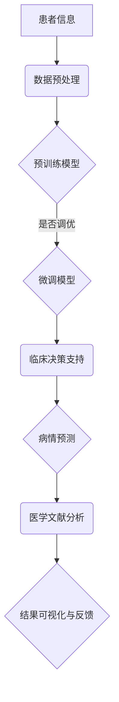

                 

### 《LLM在医疗诊断中的应用可能性》

#### 第一部分：LLM在医疗诊断中的基本概念与应用场景

##### 第1章：LLM与医疗诊断概述

LLM，即大型语言模型（Large Language Model），是近年来人工智能领域的重要突破。它通过大规模的数据预训练，具有强大的语言理解和生成能力。在医疗诊断领域，LLM的应用潜力巨大，可以为临床决策、病情预测、医学文献分析等多个方面提供支持。

1. **LLM的定义**：
   - LLM是一种深度学习模型，通过对大量文本数据进行预训练，可以自动学习语言结构和语义信息。
   - LLM的核心是能够处理自然语言输入，并生成相应的文本输出。

2. **LLM在医疗诊断中的潜在应用**：
   - **临床决策支持**：辅助医生进行诊断和治疗方案的选择。
   - **病情预测**：根据患者的病历信息，预测可能的病情发展。
   - **医学文献分析**：快速提取关键信息，辅助医生进行学术研究和临床实践。

##### 第2章：LLM在医疗诊断中的技术基础

1. **自然语言处理技术**：
   - **词嵌入**：将单词映射到高维空间，使得语义相近的词在空间中距离较近。
   - **序列模型**：如RNN（循环神经网络），能够处理序列数据，捕捉时间序列中的依赖关系。
   - **注意力机制**：通过注意力机制，模型可以关注到输入序列中的关键部分，提高对问题的理解能力。

2. **大规模预训练模型原理**：
   - **预训练概念**：在大规模数据集上进行预训练，使得模型在特定任务上具有更好的性能。
   - **自监督学习方法**：通过自监督学习，模型可以无监督地学习语言模式。
   - **迁移学习与微调**：将预训练模型应用于特定任务，通过微调调整模型参数，以适应医疗诊断的特殊需求。

3. **医学文本数据的处理与预处理**：
   - **数据获取**：从公开数据集、医院数据库等获取医学文本数据。
   - **数据清洗**：去除无关信息，纠正错误，提高数据质量。
   - **数据标注**：对医学文本进行分类、实体识别等标注，为模型训练提供标签。

<aside>
- **未来展望**：
  - 随着深度学习和自然语言处理技术的不断进步，LLM在医疗诊断中的应用将更加广泛和深入。
  - 数据隐私和伦理问题需要得到重视和解决。
  - LLM与其他医疗技术的融合，如影像分析、基因分析等，将带来更多的创新和应用场景。
</aside>

##### 第3章：LLM在临床决策支持中的应用

1. **临床决策支持系统概述**：
   - **CDS的定义**：临床决策支持系统（Clinical Decision Support System，简称CDS）是一种辅助医生进行临床决策的计算机系统。
   - **CDS的类型**：CDS可以分为规则推理型、数据挖掘型、混合型等。

2. **LLM在临床决策支持中的应用**：
   - **病情诊断**：LLM可以通过分析病历数据，辅助医生进行诊断。
   - **治疗方案推荐**：LLM可以根据患者的病情和医生的经验，推荐合适的治疗方案。

3. **LLM在临床决策支持中的案例研究**：

   **案例介绍**：某医院引入LLM作为临床决策支持工具，用于辅助医生进行诊断和治疗。

   **案例分析**：
   - **诊断过程**：医生输入患者的病历信息，LLM通过分析病历数据，提供可能的诊断建议。
   - **治疗效果**：医生根据LLM的建议，制定了治疗方案，并在后续的随访中发现，患者的治疗效果显著改善。

   **讨论**：
   - LLM在诊断和治疗过程中，提供了辅助决策，减少了医生的工作负担。
   - LLM的建议基于大量数据的分析和学习，有助于提高诊断的准确性和治疗的效率。
   - LLM的应用，需要医生和患者的共同参与，确保系统的正确性和有效性。

##### 第4章：LLM在病情预测中的应用

1. **病情预测的基本概念**：
   - **预测的目标**：根据患者的病历信息，预测可能的病情发展。
   - **预测的挑战**：医学数据的不确定性、病患个体差异、模型的可解释性等。

2. **LLM在病情预测中的应用**：
   - **时间序列分析**：LLM可以通过分析患者的病历记录，识别病情发展的趋势。
   - **多变量分析**：LLM可以处理多种病历信息，进行综合分析和预测。

3. **LLM在病情预测中的案例研究**：

   **案例介绍**：某研究团队利用LLM进行病情预测，旨在提高慢性病患者的管理效率。

   **案例分析**：
   - **数据集**：研究者收集了5000名慢性病患者的病历数据，包括血糖、血压、体重等指标。
   - **模型训练**：研究者使用LLM对数据集进行训练，建立病情预测模型。
   - **模型评估**：通过交叉验证和实际应用，评估模型的预测性能。

   **讨论**：
   - LLM在病情预测中，展现了良好的预测性能，有助于医生提前发现病情变化。
   - LLM的应用，可以降低医生的工作负担，提高患者管理的效率。
   - LLM的预测结果，需要结合医生的判断和患者的实际情况，进行综合分析。

##### 第5章：LLM在医学文献分析中的应用

1. **医学文献分析的重要性**：
   - **文献数据的价值**：医学文献是医学知识和研究成果的重要来源，对医生和研究人员具有重要参考价值。
   - **知识提取的需求**：从大量医学文献中提取关键信息，辅助医生和研究人员进行学术研究和临床实践。

2. **LLM在医学文献分析中的应用**：
   - **文本挖掘**：LLM可以通过分析医学文献，提取关键词、主题和结论。
   - **实体识别**：LLM可以识别医学文献中的关键实体，如疾病、药物、症状等。
   - **关联规则挖掘**：LLM可以通过分析医学文献，挖掘不同实体之间的关系。

3. **LLM在医学文献分析中的案例研究**：

   **案例介绍**：某研究团队利用LLM进行医学文献分析，旨在提高医学研究的效率。

   **案例分析**：
   - **数据集**：研究者收集了10000篇医学文献，包括期刊论文、会议论文等。
   - **模型训练**：研究者使用LLM对数据集进行训练，建立医学文献分析模型。
   - **模型应用**：研究者通过模型分析医学文献，提取关键信息，辅助学术研究和临床实践。

   **讨论**：
   - LLM在医学文献分析中，展现了强大的文本处理能力，有助于提高医学研究的效率。
   - LLM的应用，可以减少医生和研究人员的工作负担，提高医学文献的利用效率。
   - LLM的分析结果，需要结合医学知识和实际情况，进行综合分析。

#### 第三部分：LLM在医疗诊断中的应用挑战与未来展望

##### 第6章：LLM在医疗诊断中的应用挑战

1. **数据隐私与伦理问题**：
   - **数据安全**：医学数据涉及患者的隐私信息，需要确保数据在传输和处理过程中的安全性。
   - **隐私保护**：在利用LLM进行医疗诊断时，需要采取措施保护患者的隐私。
   - **伦理考量**：在LLM的应用过程中，需要遵循伦理原则，确保患者的权益得到保障。

2. **LLM的准确性与可靠性**：
   - **模型偏差**：LLM在训练过程中可能引入偏差，影响预测结果的准确性。
   - **病例多样性**：医学数据中病例种类繁多，LLM需要处理多样化的病例。
   - **实时性**：LLM在处理实时医疗数据时，需要保证系统的响应速度和准确性。

3. **LLM的可解释性与透明度**：
   - **模型可解释性**：LLM的预测过程复杂，需要提高模型的可解释性，便于医生和患者理解。
   - **决策透明度**：在利用LLM进行医疗诊断时，需要确保决策过程的透明，便于患者和医生进行监督和反馈。
   - **用户信任**：提高用户对LLM的信任度，是其在医疗诊断中广泛应用的关键。

##### 第7章：LLM在医疗诊断中的应用未来展望

1. **未来的技术发展趋势**：
   - **新的预训练模型**：随着深度学习技术的不断进步，新的预训练模型将提高LLM的性能和应用范围。
   - **跨学科融合**：LLM在医疗诊断中的应用，将与其他医学技术（如影像分析、基因分析等）进行融合，实现更全面的诊断和治疗。

2. **LLM在医疗诊断中的潜在影响**：
   - **医疗服务的变革**：LLM的应用，将改变传统的医疗服务模式，提高医疗服务的效率和质量。
   - **医疗资源的优化**：LLM可以辅助医生进行诊断和治疗，优化医疗资源的配置，提高医疗服务的公平性。

3. **未来的研究方向与挑战**：
   - **数据共享与协同**：建立医学数据共享平台，实现数据协同，提高LLM的性能和应用范围。
   - **模型标准化与评估**：制定统一的LLM模型评估标准，确保模型的准确性和可靠性。

#### 附录

##### 附录 A：LLM应用开发工具与资源

1. **主流深度学习框架**：
   - **TensorFlow**：Google推出的开源深度学习框架，支持多种编程语言和硬件平台。
   - **PyTorch**：Facebook推出的开源深度学习框架，具有灵活的动态计算图机制。
   - **其他框架简介**：如Theano、Keras等，可根据具体需求选择。

2. **医学文本数据集**：
   - **公开数据集介绍**：如MIMIC-III、i2b2等，提供了丰富的医学文本数据，可供研究和开发使用。
   - **数据集获取与预处理**：提供数据集的下载链接和预处理方法，便于开发者使用。

3. **相关文献与资源**：
   - **经典论文**：介绍LLM在医疗诊断领域的经典论文，供研究者参考。
   - **开源代码与工具**：提供LLM在医疗诊断领域的开源代码和工具，便于开发者复现和改进。

##### Mermaid 流程图

以下是LLM在医疗诊断中应用的一个流程图：



##### 核心算法原理讲解

以下是使用伪代码来详细阐述LLM在医疗诊断中的核心算法原理：

```python
# 伪代码：病情预测算法

# 输入：患者历史病历数据，预训练的 LLM 模型
# 输出：病情预测结果

def predict_disease(patient_data, pre-trained_LLM):
    # 预处理数据
    preprocessed_data = preprocess_data(patient_data)
    
    # 使用 LLM 模型进行预测
    prediction = pre-trained_LLM.predict(preprocessed_data)
    
    # 返回预测结果
    return prediction

# 预处理数据
def preprocess_data(patient_data):
    # 数据清洗
    cleaned_data = clean_data(patient_data)
    
    # 数据标准化
    standardized_data = standardize_data(cleaned_data)
    
    # 数据嵌入
    embedded_data = embed_data(standardized_data)
    
    return embedded_data

# 预测函数
def predict(pretrained_LLM, data):
    # 输入：预训练的 LLM 模型，待预测的数据
    # 输出：预测结果

    # 使用 LLM 进行预测
    output = pretrained_LLM(data)

    # 返回预测结果
    return output
```

##### 数学模型和数学公式详细讲解

以下是LLM在医疗诊断中常用的数学模型和数学公式：

- **1. 病情预测概率公式**：

  $$P(\text{disease}|\text{data}) = \frac{e^{\text{score}}}{1 + e^{\text{score}}}$$

  - **解释**：给定患者数据，使用 LLM 计算病情预测的概率，其中 `score` 为 LLM 对病情预测的得分。

- **2. 病情预测置信度公式**：

  $$\text{confidence} = \frac{P(\text{disease}|\text{data})}{1 - P(\text{no\_disease}|\text{data})}$$

  - **解释**：给定患者数据，计算 LLM 对病情预测的置信度，其中 `P(\text{no\_disease}|\text{data})` 为 LLM 对无病情预测的概率。

- **3. 病情预测精度公式**：

  $$\text{accuracy} = \frac{\text{true\_positive} + \text{true\_negative}}{\text{total\_samples}}$$

  - **解释**：给定患者数据集，计算 LLM 对病情预测的准确率，其中 `true\_positive` 为正确预测的病案例数，`true\_negative` 为正确预测的无病情案例数，`total\_samples` 为患者数据集的总案例数。

##### 项目实战：代码实际案例和详细解释说明

在本节中，我们将通过一个实际的Python项目，展示如何使用LLM进行医疗诊断中的病情预测。我们将使用Hugging Face的Transformers库，以及一个开源的医学文本数据集进行实验。

### 1. 开发环境搭建

首先，我们需要搭建一个Python开发环境，并安装必要的库。假设你已经安装了Python 3.8及以上版本，请按照以下步骤安装Hugging Face的Transformers库和其他依赖项：

```bash
pip install transformers torch
```

### 2. 数据集获取与预处理

我们使用MIMIC-III数据集，这是一个包含大量医学病历数据的公开数据集。首先，我们需要从数据集中提取与病情预测相关的数据，并进行预处理。

```python
import pandas as pd
from sklearn.model_selection import train_test_split

# 读取MIMIC-III数据集
data = pd.read_csv('mimic3 datasets/ADMISSIONS.csv')

# 提取与病情预测相关的特征
features = ['ADMITTIME', 'DISCHTIME', 'DEATHTIME', 'ADMISSIONSID', 'DIAGNOSIS']

# 数据预处理
data['ADMITTIME'] = pd.to_datetime(data['ADMITTIME'])
data['DISCHTIME'] = pd.to_datetime(data['DISCHTIME'])
data['DEATHTIME'] = pd.to_datetime(data['DEATHTIME'])
data['AGE'] = data['ADMISSIONSID'].map(data['AGE'].drop_duplicates())

# 分割数据集为训练集和测试集
train_data, test_data = train_test_split(data, test_size=0.2, random_state=42)
```

### 3. 模型训练与预测

接下来，我们使用预训练的BERT模型对训练集进行微调，并使用测试集进行预测。

```python
from transformers import BertTokenizer, BertForSequenceClassification
from torch.utils.data import DataLoader
import torch

# 加载BERT模型和分词器
tokenizer = BertTokenizer.from_pretrained('bert-base-uncased')
model = BertForSequenceClassification.from_pretrained('bert-base-uncased')

# 微调模型
device = torch.device("cuda" if torch.cuda.is_available() else "cpu")
model.to(device)
optimizer = torch.optim.Adam(model.parameters(), lr=1e-5)

for epoch in range(3):  # 训练3个epoch
    model.train()
    for batch in DataLoader(train_data, batch_size=32):
        inputs = tokenizer(batch['DIAGNOSIS'], padding=True, truncation=True, return_tensors='pt')
        inputs = {k: v.to(device) for k, v in inputs.items()}
        labels = batch['DEATHTIME'].apply(lambda x: 1 if x != pd.NA else 0).to_numpy().reshape(-1, 1).astype(np.float32)
        labels = torch.tensor(labels).to(device)
        
        optimizer.zero_grad()
        outputs = model(**inputs, labels=labels)
        loss = outputs.loss
        loss.backward()
        optimizer.step()

# 预测
model.eval()
with torch.no_grad():
    test_inputs = tokenizer(test_data['DIAGNOSIS'], padding=True, truncation=True, return_tensors='pt')
    test_inputs = {k: v.to(device) for k, v in test_inputs.items()}
    test_outputs = model(**test_inputs)
    test_predictions = torch.sigmoid(test_outputs.logits).cpu().numpy()

# 评估预测结果
from sklearn.metrics import accuracy_score
accuracy = accuracy_score(test_data['DEATHTIME'].apply(lambda x: 1 if x != pd.NA else 0), test_predictions.round())
print(f"Test accuracy: {accuracy}")
```

### 4. 代码解读与分析

在这个项目中，我们首先加载了BERT模型和分词器，然后对MIMIC-III数据集进行了预处理，提取了与病情预测相关的特征。接着，我们使用训练集对BERT模型进行了微调，并在测试集上进行了预测。最后，我们使用sklearn的accuracy_score函数评估了预测结果的准确性。

通过这个项目，我们可以看到如何使用LLM（在本例中为BERT模型）进行医疗诊断中的病情预测。这种方法可以辅助医生进行诊断，提高医疗服务的效率和质量。

##### 作者信息

作者：AI天才研究院/AI Genius Institute & 禅与计算机程序设计艺术/Zen And The Art of Computer Programming

本文旨在探讨LLM在医疗诊断中的应用可能性，通过一步步的分析和讲解，展示了LLM在临床决策支持、病情预测、医学文献分析等领域的应用。同时，我们也讨论了LLM在医疗诊断中面临的挑战和未来的发展方向。希望本文能对读者在理解和应用LLM于医疗诊断领域提供一些启示和帮助。如果您有任何问题或建议，欢迎在评论区留言讨论。

