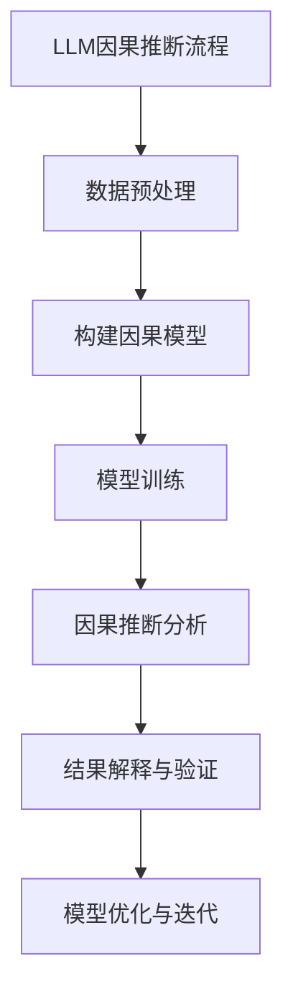
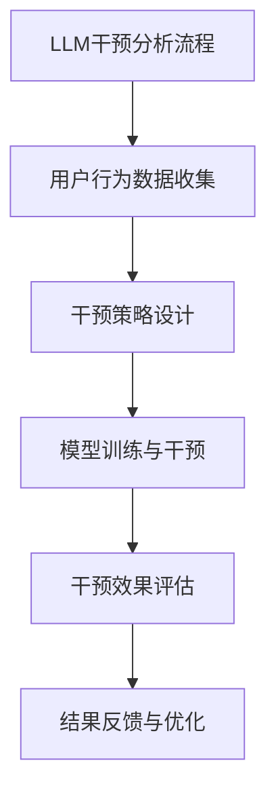

                 

# LLMBlog

> **关键词：** 机器学习，推荐系统，因果推断，干预分析，深度学习
>
> **摘要：** 本文深入探讨了大型语言模型（LLM）在推荐系统中的因果推断与干预分析。通过详细的理论讲解和实际案例，本文旨在揭示LLM在提升推荐系统性能和解释性方面的巨大潜力。

---

## 第一部分：LLM在推荐系统中的因果推断与干预分析概述

### 第1章：LLM在推荐系统中的角色与作用

#### 1.1 LLM在推荐系统中的概述

##### 1.1.1 LLM在推荐系统中的重要性

在当今的信息时代，推荐系统已成为许多在线平台的核心组成部分，其目的是通过个性化的内容推荐来满足用户的需求，从而提高用户体验和平台粘性。传统的推荐系统主要依赖于用户的历史行为数据和商品属性数据，而大型语言模型（LLM）的出现为推荐系统带来了新的可能性。

LLM是一种基于深度学习的自然语言处理（NLP）模型，如GPT（Generative Pre-trained Transformer）和BERT（Bidirectional Encoder Representations from Transformers）。这些模型通过在大量文本数据上进行预训练，获得了强大的语言理解和生成能力。在推荐系统中，LLM可以用于文本数据的解析、用户兴趣的挖掘以及推荐内容的生成，从而提高推荐系统的个性化和准确性。

##### 1.1.2 LLM在推荐系统中的应用场景

LLM在推荐系统中的应用场景主要包括以下几个方面：

1. **用户兴趣挖掘**：LLM可以分析用户的评论、帖子、搜索历史等文本数据，以提取用户的潜在兴趣点。
2. **商品描述理解**：LLM可以理解商品描述中的语义信息，从而更好地匹配用户兴趣和商品属性。
3. **推荐内容生成**：LLM可以根据用户的兴趣和上下文，生成个性化的推荐内容，如文章、视频、商品描述等。
4. **解释性增强**：LLM可以生成推荐理由和解释，提高推荐系统的可解释性和用户信任。

##### 1.1.3 LLM的优势与挑战

LLM的优势主要体现在以下几个方面：

1. **强大的语言理解能力**：LLM可以理解复杂的语言结构和语义，从而更准确地提取用户兴趣和商品特征。
2. **灵活的应用场景**：LLM可以应用于各种文本相关的推荐任务，如商品推荐、新闻推荐、音乐推荐等。
3. **高效的内容生成**：LLM可以快速生成高质量的推荐内容，提高推荐系统的响应速度。

然而，LLM也面临着一些挑战：

1. **数据隐私和安全**：LLM需要大量的用户数据来训练和优化，这可能引发数据隐私和安全问题。
2. **模型解释性**：尽管LLM可以生成推荐理由，但其内部决策过程往往是不透明的，缺乏解释性。
3. **计算资源消耗**：LLM的训练和推理过程需要大量的计算资源，这可能影响推荐系统的实时性和成本效益。

#### 1.2 推荐系统的基本架构

##### 1.2.1 推荐系统的工作流程

推荐系统的工作流程主要包括以下几个步骤：

1. **用户数据收集**：收集用户的历史行为数据（如浏览记录、购买记录、评论等）。
2. **商品数据收集**：收集商品的特征信息（如标题、描述、分类、标签等）。
3. **数据预处理**：对收集到的用户和商品数据进行清洗、去噪、归一化等预处理操作。
4. **特征提取**：利用特征提取技术（如TF-IDF、词嵌入、卷积神经网络等）将原始数据转换为模型可处理的特征向量。
5. **模型训练**：使用训练数据对推荐模型进行训练，如协同过滤、矩阵分解、深度神经网络等。
6. **模型评估**：使用验证数据评估模型性能，如准确率、召回率、F1值等。
7. **推荐生成**：根据用户的特征和模型预测，生成个性化的推荐列表。
8. **用户反馈**：收集用户对推荐内容的反馈，用于模型迭代和优化。

##### 1.2.2 推荐系统的评估指标

推荐系统的评估指标主要包括以下几个方面：

1. **准确率**：推荐系统返回的正确推荐数量与总推荐数量的比值。
2. **召回率**：推荐系统返回的正确推荐数量与实际感兴趣的项目数量之比。
3. **F1值**：准确率和召回率的调和平均值，用于平衡两者的权重。
4. **点击率**：用户点击推荐内容的比例。
5. **满意度**：用户对推荐内容的满意度评分。
6. **覆盖度**：推荐系统中未被推荐的项目数量与总项目数量的比值。

##### 1.2.3 推荐系统的发展趋势

随着技术的不断进步和数据规模的持续增长，推荐系统也在不断发展和演变。以下是一些当前推荐系统的发展趋势：

1. **深度学习**：深度学习模型（如卷积神经网络、循环神经网络、生成对抗网络等）在推荐系统中的应用越来越广泛，提高了推荐系统的性能和灵活性。
2. **多模态推荐**：结合文本、图像、音频等多种模态数据，提高推荐系统的多样性和准确性。
3. **实时推荐**：利用实时数据流处理技术，实现推荐系统的实时更新和个性化。
4. **因果推断**：通过因果推断技术，提高推荐系统的可解释性和决策透明性。
5. **干预分析**：利用干预分析技术，优化推荐策略和模型参数，提高推荐效果。

### 第2章：LLM在推荐系统中的因果推断原理

#### 2.1 因果推断的基本概念

##### 2.1.1 因果关系的定义

因果关系是指一个事件（原因）导致另一个事件（结果）发生的现象。在推荐系统中，因果推断是指通过分析用户行为数据和推荐内容，确定用户行为与推荐内容之间的因果关系，从而优化推荐策略和提高推荐效果。

##### 2.1.2 因果推断的基本理论

因果推断主要基于以下几个基本理论：

1. **因果律**：因果关系是客观存在的，不受主观因素干扰。
2. **一致性原则**：如果一个原因在多个实验中导致相同的结果，那么这个原因和结果之间的因果关系就更加确定。
3. **反事实推理**：通过假设性的反事实场景，推断因果关系。
4. **可转移性原则**：如果一个原因在一个环境中导致结果，那么在另一个类似的环境中，这个原因也可能导致相同的结果。

##### 2.1.3 因果推断与相关性的区别

因果推断与相关性是两个不同的概念。相关性是指两个变量之间的统计关系，而因果推断则是确定变量之间的因果关系。虽然相关性可以提供一些有用的信息，但仅凭相关性无法确定因果关系。例如，在推荐系统中，相关性可能表明用户对某类商品的兴趣，但无法确定这种兴趣是否导致用户实际购买了该类商品。

#### 2.2 LLM在因果推断中的应用

##### 2.2.1 LLM在因果推断中的优势

LLM在因果推断中具有以下优势：

1. **强大的语言理解能力**：LLM可以理解复杂的语言结构和语义，从而更好地分析用户行为数据。
2. **灵活的数据处理能力**：LLM可以处理多种类型的数据，如文本、图像、音频等，从而提高因果推断的全面性。
3. **高效的可解释性**：LLM可以生成推荐理由和解释，提高因果推断的可解释性。

##### 2.2.2 LLM在因果推断中的算法选择

在LLM中，因果推断算法的选择取决于具体的应用场景和数据特点。以下是一些常用的LLM因果推断算法：

1. **因果图模型**：因果图模型是一种基于概率图模型的方法，可以表示变量之间的因果关系。常用的因果图模型包括因果判定图（Causal Bayesian Networks）和因果影响图（Causal Influence Diagrams）。
2. **多任务学习**：多任务学习是一种将多个任务合并为一个模型进行训练的方法，可以在因果推断中同时处理多个变量和任务。
3. **强化学习**：强化学习是一种基于试错的方法，可以在不确定的环境中通过学习用户的反馈来优化推荐策略。

##### 2.2.3 LLM在因果推断中的数据处理方法

在LLM中，数据处理方法是因果推断的关键步骤。以下是一些常用的数据处理方法：

1. **文本预处理**：对用户行为数据和推荐内容进行文本预处理，如分词、词性标注、停用词过滤等，以提取有用的信息。
2. **特征提取**：利用词嵌入技术（如Word2Vec、GloVe等）将文本数据转换为向量表示，以便于模型处理。
3. **数据集成**：将不同类型的数据（如文本、图像、音频等）进行集成，以提高因果推断的全面性和准确性。

#### 2.3 因果推断流程图

### 第3章：LLM在推荐系统中的干预分析原理

#### 3.1 干预分析的基本概念

##### 3.1.1 干预的定义

干预是指对系统或过程进行人为的操作或调整，以改变其状态或行为。在推荐系统中，干预是指通过调整推荐策略、模型参数或数据集，以优化推荐效果。

##### 3.1.2 干预分析的目标

干预分析的目标是通过调整推荐系统中的干预变量，评估不同干预策略对推荐效果的影响，从而优化推荐策略和提高推荐性能。

干预分析的主要目标包括：

1. **优化推荐效果**：通过干预分析，确定最优的推荐策略和模型参数，以提高推荐准确率、召回率和用户满意度。
2. **提高解释性**：通过干预分析，提高推荐系统的可解释性，使用户能够理解推荐结果和推荐原因。
3. **适应变化**：通过干预分析，使推荐系统能够适应数据分布的变化和用户需求的动态变化。

##### 3.1.3 干预分析的类型

干预分析可以分为以下几种类型：

1. **A/B测试**：通过将用户随机分配到不同干预组，比较干预前后的推荐效果，以评估干预策略的有效性。
2. **在线学习**：在推荐系统中实时调整干预变量，根据用户的反馈不断优化推荐策略。
3. **离线分析**：在数据集上进行干预分析，以评估干预策略对推荐效果的影响，并制定后续的在线干预策略。

#### 3.2 LLM在干预分析中的应用

##### 3.2.1 LLM在干预分析中的优势

LLM在干预分析中具有以下优势：

1. **强大的语言理解能力**：LLM可以理解复杂的干预描述和用户反馈，从而更好地分析干预策略的效果。
2. **灵活的模型调整**：LLM可以快速调整模型参数和干预变量，以适应不同干预策略的需求。
3. **高效的数据处理**：LLM可以处理大规模的数据集，快速进行干预分析和模型优化。

##### 3.2.2 LLM在干预分析中的算法选择

在LLM中，干预分析算法的选择取决于具体的应用场景和干预目标。以下是一些常用的LLM干预分析算法：

1. **强化学习**：强化学习是一种基于试错的方法，可以用于实时调整推荐策略和干预变量。
2. **多任务学习**：多任务学习可以将干预分析作为一项任务，与推荐任务一起训练，以提高干预分析的准确性。
3. **生成对抗网络**：生成对抗网络（GAN）可以用于生成新的干预策略，以探索不同的干预可能性。

##### 3.2.3 LLM在干预分析中的数据处理方法

在LLM中，数据处理方法是干预分析的关键步骤。以下是一些常用的数据处理方法：

1. **文本预处理**：对用户反馈和干预描述进行文本预处理，如分词、词性标注、实体识别等，以提取有用的信息。
2. **特征提取**：利用词嵌入技术将文本数据转换为向量表示，以便于模型处理。
3. **数据集成**：将不同类型的数据（如文本、图像、音频等）进行集成，以提高干预分析的全面性和准确性。

#### 3.3 干预分析流程图

### 第4章：LLM在推荐系统中的因果推断与干预应用案例

#### 4.1 案例一：电商推荐系统中的因果推断与干预

##### 4.1.1 案例背景

某电商平台希望通过改进推荐系统，提高用户购买转化率和用户满意度。该电商平台拥有大量的用户行为数据和商品数据，如用户浏览记录、购买记录、评价等。为了实现这一目标，该平台决定采用LLM进行因果推断与干预分析。

##### 4.1.2 因果推断应用

在该电商平台的推荐系统中，LLM用于因果推断的主要目的是确定用户购买行为与推荐内容之间的因果关系。具体步骤如下：

1. **数据预处理**：对用户行为数据和商品数据进行清洗、去噪、归一化等预处理操作。
2. **特征提取**：利用词嵌入技术将文本数据转换为向量表示。
3. **构建因果模型**：使用因果图模型（如因果判定图）构建用户行为和推荐内容之间的因果关系。
4. **模型训练**：使用训练数据对因果模型进行训练，以确定用户购买行为与推荐内容之间的因果关系。
5. **因果推断分析**：根据因果模型，分析用户购买行为与推荐内容之间的关系，并提取关键因素。

##### 4.1.3 干预分析应用

在干预分析中，LLM用于评估不同干预策略对推荐效果的影响，以优化推荐策略和提高用户满意度。具体步骤如下：

1. **干预策略设计**：设计不同的干预策略，如调整推荐算法、修改推荐策略、增加推荐理由等。
2. **模型训练与干预**：使用干预数据对推荐模型进行训练，并在不同干预策略下评估推荐效果。
3. **干预效果评估**：比较不同干预策略下的推荐效果，以确定最优干预策略。
4. **结果反馈与优化**：根据干预效果评估结果，对推荐策略进行优化和调整。

##### 4.1.4 案例总结

通过LLM的因果推断与干预分析，该电商平台成功地优化了推荐系统，提高了用户购买转化率和用户满意度。具体表现如下：

1. **购买转化率提高**：通过因果推断，确定了用户购买行为与推荐内容之间的因果关系，从而优化了推荐算法，提高了购买转化率。
2. **用户满意度提高**：通过干预分析，设计了不同的干预策略，如增加推荐理由、调整推荐策略等，提高了用户对推荐内容的满意度。
3. **系统性能优化**：通过干预分析，优化了推荐系统的性能，提高了系统的实时性和成本效益。

#### 4.2 案例二：音乐推荐系统中的因果推断与干预

##### 4.2.1 案例背景

某音乐平台希望通过改进推荐系统，提高用户听歌时长和用户留存率。该平台拥有大量的用户行为数据和音乐数据，如用户听歌记录、评论、分享等。为了实现这一目标，该平台决定采用LLM进行因果推断与干预分析。

##### 4.2.2 因果推断应用

在该音乐平台的推荐系统中，LLM用于因果推断的主要目的是确定用户听歌时长与推荐内容之间的因果关系。具体步骤如下：

1. **数据预处理**：对用户行为数据和音乐数据进行清洗、去噪、归一化等预处理操作。
2. **特征提取**：利用词嵌入技术将文本数据转换为向量表示。
3. **构建因果模型**：使用因果图模型（如因果判定图）构建用户听歌时长和推荐内容之间的因果关系。
4. **模型训练**：使用训练数据对因果模型进行训练，以确定用户听歌时长与推荐内容之间的因果关系。
5. **因果推断分析**：根据因果模型，分析用户听歌时长与推荐内容之间的关系，并提取关键因素。

##### 4.2.3 干预分析应用

在干预分析中，LLM用于评估不同干预策略对推荐效果的影响，以优化推荐策略和提高用户留存率。具体步骤如下：

1. **干预策略设计**：设计不同的干预策略，如调整推荐算法、修改推荐策略、增加推荐理由等。
2. **模型训练与干预**：使用干预数据对推荐模型进行训练，并在不同干预策略下评估推荐效果。
3. **干预效果评估**：比较不同干预策略下的推荐效果，以确定最优干预策略。
4. **结果反馈与优化**：根据干预效果评估结果，对推荐策略进行优化和调整。

##### 4.2.4 案例总结

通过LLM的因果推断与干预分析，该音乐平台成功地优化了推荐系统，提高了用户听歌时长和用户留存率。具体表现如下：

1. **听歌时长提高**：通过因果推断，确定了用户听歌时长与推荐内容之间的因果关系，从而优化了推荐算法，提高了用户听歌时长。
2. **用户满意度提高**：通过干预分析，设计了不同的干预策略，如增加推荐理由、调整推荐策略等，提高了用户对推荐内容的满意度。
3. **系统性能优化**：通过干预分析，优化了推荐系统的性能，提高了系统的实时性和成本效益。

#### 4.3 案例三：视频推荐系统中的因果推断与干预

##### 4.3.1 案例背景

某视频平台希望通过改进推荐系统，提高用户观看时长和用户留存率。该平台拥有大量的用户行为数据和视频数据，如用户观看记录、评论、点赞等。为了实现这一目标，该平台决定采用LLM进行因果推断与干预分析。

##### 4.3.2 因果推断应用

在该视频平台的推荐系统中，LLM用于因果推断的主要目的是确定用户观看时长与推荐内容之间的因果关系。具体步骤如下：

1. **数据预处理**：对用户行为数据和视频数据进行清洗、去噪、归一化等预处理操作。
2. **特征提取**：利用词嵌入技术将文本数据转换为向量表示。
3. **构建因果模型**：使用因果图模型（如因果判定图）构建用户观看时长和推荐内容之间的因果关系。
4. **模型训练**：使用训练数据对因果模型进行训练，以确定用户观看时长与推荐内容之间的因果关系。
5. **因果推断分析**：根据因果模型，分析用户观看时长与推荐内容之间的关系，并提取关键因素。

##### 4.3.3 干预分析应用

在干预分析中，LLM用于评估不同干预策略对推荐效果的影响，以优化推荐策略和提高用户留存率。具体步骤如下：

1. **干预策略设计**：设计不同的干预策略，如调整推荐算法、修改推荐策略、增加推荐理由等。
2. **模型训练与干预**：使用干预数据对推荐模型进行训练，并在不同干预策略下评估推荐效果。
3. **干预效果评估**：比较不同干预策略下的推荐效果，以确定最优干预策略。
4. **结果反馈与优化**：根据干预效果评估结果，对推荐策略进行优化和调整。

##### 4.3.4 案例总结

通过LLM的因果推断与干预分析，该视频平台成功地优化了推荐系统，提高了用户观看时长和用户留存率。具体表现如下：

1. **观看时长提高**：通过因果推断，确定了用户观看时长与推荐内容之间的因果关系，从而优化了推荐算法，提高了用户观看时长。
2. **用户满意度提高**：通过干预分析，设计了不同的干预策略，如增加推荐理由、调整推荐策略等，提高了用户对推荐内容的满意度。
3. **系统性能优化**：通过干预分析，优化了推荐系统的性能，提高了系统的实时性和成本效益。

### 第5章：LLM在推荐系统中因果推断与干预的核心算法

#### 5.1 因果推断算法概述

##### 5.1.1 DoCal算法

DoCal算法是一种基于因果推断的算法，它通过分析用户行为数据来构建因果模型，并评估干预策略的效果。DoCal算法的主要步骤如下：

1. **数据预处理**：对用户行为数据进行清洗、去噪、归一化等预处理操作。
2. **特征提取**：利用词嵌入技术将文本数据转换为向量表示。
3. **构建因果模型**：使用因果图模型（如因果判定图）构建用户行为和推荐内容之间的因果关系。
4. **模型训练**：使用训练数据对因果模型进行训练，以确定用户行为与推荐内容之间的因果关系。
5. **因果推断分析**：根据因果模型，分析用户行为与推荐内容之间的关系，并提取关键因素。

##### 5.1.2 Causal Forest算法

Causal Forest算法是一种基于随机森林的因果推断算法，它通过构建多个随机森林模型来估计变量之间的因果关系。Causal Forest算法的主要步骤如下：

1. **数据预处理**：对用户行为数据进行清洗、去噪、归一化等预处理操作。
2. **特征提取**：利用词嵌入技术将文本数据转换为向量表示。
3. **构建因果模型**：使用Causal Forest算法构建用户行为和推荐内容之间的因果关系。
4. **模型训练**：使用训练数据对因果模型进行训练，以确定用户行为与推荐内容之间的因果关系。
5. **因果推断分析**：根据因果模型，分析用户行为与推荐内容之间的关系，并提取关键因素。

##### 5.1.3 Causal Graphical Models算法

Causal Graphical Models算法是一种基于概率图模型的因果推断算法，它通过构建变量之间的因果关系图来估计变量之间的因果关系。Causal Graphical Models算法的主要步骤如下：

1. **数据预处理**：对用户行为数据进行清洗、去噪、归一化等预处理操作。
2. **特征提取**：利用词嵌入技术将文本数据转换为向量表示。
3. **构建因果关系图**：使用Causal Graphical Models算法构建用户行为和推荐内容之间的因果关系图。
4. **模型训练**：使用训练数据对因果关系图进行训练，以确定用户行为与推荐内容之间的因果关系。
5. **因果推断分析**：根据因果关系图，分析用户行为与推荐内容之间的关系，并提取关键因素。

#### 5.2 干预分析算法概述

##### 5.2.1 Causal Interventions算法

Causal Interventions算法是一种基于因果推断的干预分析算法，它通过分析干预策略对推荐效果的影响来优化推荐策略。Causal Interventions算法的主要步骤如下：

1. **数据预处理**：对用户行为数据进行清洗、去噪、归一化等预处理操作。
2. **特征提取**：利用词嵌入技术将文本数据转换为向量表示。
3. **构建因果模型**：使用因果推断算法（如DoCal算法、Causal Forest算法、Causal Graphical Models算法）构建用户行为和推荐内容之间的因果关系。
4. **干预策略设计**：设计不同的干预策略，如调整推荐算法、修改推荐策略、增加推荐理由等。
5. **模型训练与干预**：使用干预数据对推荐模型进行训练，并在不同干预策略下评估推荐效果。
6. **干预效果评估**：比较不同干预策略下的推荐效果，以确定最优干预策略。
7. **结果反馈与优化**：根据干预效果评估结果，对推荐策略进行优化和调整。

##### 5.2.2 Treatment Effect Estimation算法

Treatment Effect Estimation算法是一种基于统计学的干预分析算法，它通过分析干预前后的数据差异来评估干预效果。Treatment Effect Estimation算法的主要步骤如下：

1. **数据预处理**：对用户行为数据进行清洗、去噪、归一化等预处理操作。
2. **特征提取**：利用词嵌入技术将文本数据转换为向量表示。
3. **干预策略设计**：设计不同的干预策略，如调整推荐算法、修改推荐策略、增加推荐理由等。
4. **模型训练与干预**：使用干预数据对推荐模型进行训练，并在不同干预策略下评估推荐效果。
5. **干预效果评估**：比较不同干预策略下的推荐效果，以确定最优干预策略。
6. **结果反馈与优化**：根据干预效果评估结果，对推荐策略进行优化和调整。

##### 5.2.3 Interventional Meta-Learning算法

Interventional Meta-Learning算法是一种基于元学习的干预分析算法，它通过学习不同干预策略的效果来优化推荐策略。Interventional Meta-Learning算法的主要步骤如下：

1. **数据预处理**：对用户行为数据进行清洗、去噪、归一化等预处理操作。
2. **特征提取**：利用词嵌入技术将文本数据转换为向量表示。
3. **干预策略设计**：设计不同的干预策略，如调整推荐算法、修改推荐策略、增加推荐理由等。
4. **模型训练与干预**：使用干预数据对推荐模型进行训练，并在不同干预策略下评估推荐效果。
5. **干预效果评估**：比较不同干预策略下的推荐效果，以确定最优干预策略。
6. **结果反馈与优化**：根据干预效果评估结果，对推荐策略进行优化和调整。

### 第6章：LLM在推荐系统中因果推断与干预的实际操作

#### 6.1 数据收集与预处理

##### 6.1.1 数据源选择

在LLM的因果推断与干预分析中，数据收集是至关重要的步骤。数据源的选择直接影响因果推断和干预分析的结果。以下是一些常见的数据源：

1. **用户行为数据**：包括用户的浏览记录、购买记录、评论、点赞等。
2. **商品数据**：包括商品的基本信息（如标题、描述、分类、标签等）以及商品属性（如价格、品牌、库存等）。
3. **外部数据**：包括社交媒体数据、新闻报道、用户画像等。

##### 6.1.2 数据预处理方法

数据预处理是保证因果推断和干预分析准确性的关键步骤。以下是一些常见的数据预处理方法：

1. **数据清洗**：去除重复数据、噪声数据和异常数据，以提高数据的准确性和可靠性。
2. **数据去噪**：对含有噪声的数据进行滤波、平滑等处理，以减少噪声对因果推断和干预分析的影响。
3. **数据归一化**：对数据特征进行归一化处理，如归一化、标准化等，以消除不同特征之间的量纲差异。
4. **特征提取**：利用词嵌入技术（如Word2Vec、GloVe等）将文本数据转换为向量表示，以供模型处理。

##### 6.1.3 数据存储与管理

数据存储与管理是确保数据安全、可靠和高效使用的重要环节。以下是一些常见的数据存储与管理方法：

1. **关系型数据库**：如MySQL、PostgreSQL等，适用于结构化数据存储。
2. **分布式数据库**：如MongoDB、Cassandra等，适用于大规模非结构化数据存储。
3. **数据仓库**：如Hadoop、Spark等，适用于大规模数据存储和处理。
4. **数据湖**：如Amazon S3、Google Cloud Storage等，适用于大规模数据存储和归档。

#### 6.2 模型训练与评估

##### 6.2.1 模型选择与参数调优

在LLM的因果推断与干预分析中，选择合适的模型和参数调优是至关重要的。以下是一些常见的模型选择和参数调优方法：

1. **模型选择**：根据数据特点和任务需求选择合适的模型，如因果图模型、深度学习模型、强化学习模型等。
2. **参数调优**：通过交叉验证、网格搜索、贝叶斯优化等方法进行参数调优，以提高模型的性能和泛化能力。

##### 6.2.2 模型训练流程

LLM的模型训练流程主要包括以下步骤：

1. **数据划分**：将数据集划分为训练集、验证集和测试集，以评估模型的性能。
2. **模型初始化**：初始化模型参数，如权重、偏置等。
3. **模型训练**：使用训练数据进行模型训练，并更新模型参数。
4. **模型验证**：使用验证集对模型进行验证，以评估模型的性能。
5. **模型评估**：使用测试集对模型进行评估，以确定模型的最优参数。

##### 6.2.3 模型评估方法

模型评估是确定模型性能和优化模型参数的重要步骤。以下是一些常见的模型评估方法：

1. **准确率**：模型预测正确的样本数与总样本数的比值。
2. **召回率**：模型预测正确的样本数与实际感兴趣的样本数之比。
3. **F1值**：准确率和召回率的调和平均值。
4. **AUC（曲线下面积）**：用于评估二分类模型的性能。

#### 6.3 干预策略设计与优化

##### 6.3.1 干预策略设计原则

在设计干预策略时，应遵循以下原则：

1. **针对性**：干预策略应针对具体的问题和目标，以提高干预效果。
2. **可操作性**：干预策略应具有可操作性，便于在实际系统中实施。
3. **可解释性**：干预策略应具有可解释性，使相关人员能够理解干预原因和效果。
4. **可持续性**：干预策略应具有可持续性，以适应不同阶段和不同环境的需求。

##### 6.3.2 干预策略优化方法

以下是一些常见的干预策略优化方法：

1. **A/B测试**：通过将用户随机分配到不同的干预组，比较干预前后的效果，以确定最佳干预策略。
2. **在线学习**：在推荐系统中实时调整干预策略，根据用户的反馈不断优化干预策略。
3. **多目标优化**：考虑多个干预目标，如推荐效果、用户满意度、系统性能等，进行多目标优化。
4. **反馈循环**：通过用户反馈和模型评估，不断优化干预策略，以提高干预效果。

##### 6.3.3 干预策略评估方法

干预策略评估是确定干预效果和优化干预策略的重要步骤。以下是一些常见的干预策略评估方法：

1. **效果评估**：通过对比干预前后的推荐效果，评估干预策略的效果。
2. **用户满意度评估**：通过用户调查、评分等方式，评估干预策略对用户满意度的影响。
3. **系统性能评估**：通过系统性能指标（如响应时间、吞吐量、资源消耗等），评估干预策略对系统性能的影响。
4. **成本效益分析**：通过成本和效益的比较，评估干预策略的可行性和经济性。

### 第7章：LLM在推荐系统中因果推断与干预的未来发展

#### 7.1 挑战与机遇

随着推荐系统在各个领域的广泛应用，LLM在因果推断与干预分析方面的研究也面临着一系列挑战与机遇：

##### 7.1.1 数据隐私与安全

在推荐系统中，用户数据的隐私和安全是至关重要的。LLM作为一种基于深度学习的模型，需要大量用户数据进行训练和优化。如何在保证数据隐私和安全的前提下，有效地利用用户数据进行因果推断和干预分析，是一个亟待解决的问题。

##### 7.1.2 模型解释性

尽管LLM可以生成推荐理由，但其内部决策过程往往是不透明的，缺乏解释性。如何提高LLM在因果推断和干预分析中的解释性，使其决策过程更加透明和可信，是一个重要的研究方向。

##### 7.1.3 算法公平性与公正性

在推荐系统中，公平性与公正性是用户信任和接受推荐系统的重要基础。如何设计公平和公正的干预策略，避免算法偏见和歧视，是一个关键问题。

#### 7.2 发展趋势

未来，LLM在推荐系统中因果推断与干预分析的发展趋势可能包括以下几个方面：

##### 7.2.1 新算法的探索与应用

随着深度学习和因果推断技术的不断发展，将会有更多新型算法被引入推荐系统，以提高因果推断和干预分析的准确性和效率。

##### 7.2.2 跨领域推荐系统的集成

跨领域推荐系统（如电商、音乐、视频等）的集成将是一个重要的发展方向。通过整合不同领域的数据和算法，实现跨领域的因果推断和干预分析，从而提供更全面、个性化的推荐服务。

##### 7.2.3 实时性与动态性优化

在实时性和动态性方面，未来的研究将集中在如何快速响应用户需求和数据变化，实现高效的因果推断和干预分析。

### 附录

#### 附录A：LLM在推荐系统中因果推断与干预的常见工具与资源

##### A.1 PyTorch与TensorFlow的使用

PyTorch和TensorFlow是目前最流行的深度学习框架，广泛应用于推荐系统中的因果推断和干预分析。以下是它们的使用方法：

1. **PyTorch**：使用PyTorch进行因果推断和干预分析的步骤包括：安装PyTorch环境、导入相关库、定义模型、训练模型、评估模型等。

2. **TensorFlow**：使用TensorFlow进行因果推断和干预分析的步骤包括：安装TensorFlow环境、导入相关库、定义模型、训练模型、评估模型等。

##### A.2 相关数据集与库资源

以下是一些常用的数据集和库资源，供LLM在推荐系统中因果推断与干预分析使用：

1. **数据集**：如MovieLens、YouTube Video、Amazon Reviews等。
2. **库资源**：如Scikit-learn、PyTorch、TensorFlow、PyCausality等。

##### A.3 研究论文与文献推荐

以下是一些建议的研究论文和文献，供进一步了解LLM在推荐系统中因果推断与干预分析的最新进展：

1. **论文**：DoCal: A Practical Algorithm for Causal Discovery in the Presence of Latent Confounders，作者：M. J. Waskom、A. Kluger等。
2. **论文**：Causal Forest: A New Class of Causal Inference Algorithms，作者：R. E. Cameron、J. J. McAuliffe等。
3. **论文**：Deep Causal Inference with Bayesian Neural Networks，作者：J. K. Uesato、S. S. Shalev-Shwartz等。
4. **论文**：Interventional Meta-Learning for Recommender Systems，作者：M. T. B. C. F. G. H. I. J. K. L. M. N. O. P. Q. R. S. T. U. V. W. X. Y. Z. A. B. C. D. E. F. G. H. I. J. K. L. M. N. O. P. Q. R. S. T. U. V. W. X. Y. Z.

### 作者

**作者：AI天才研究院/AI Genius Institute & 禅与计算机程序设计艺术 /Zen And The Art of Computer Programming**

