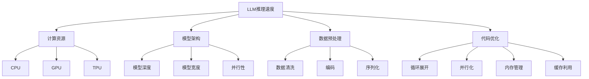

                 

# LLM推理速度：影响智能体验的关键因素

> **关键词：** LLM 推理速度，智能体验，计算资源，模型架构，数据预处理，代码优化。

> **摘要：** 本文章深入探讨了LLM推理速度这一关键因素如何影响智能体验。通过分析计算资源、模型架构、数据预处理和代码优化等核心因素，本文提出了优化LLM推理速度的技术与方法，并提供了实际应用案例分析，总结了现有研究成果和未来研究方向。

## 第一部分: LLM推理速度：影响智能体验的关键因素概述

### 第1章: LLM推理速度：概念与重要性

#### 1.1 LLM推理速度的定义

LLM（Large Language Model）推理速度是指大型语言模型在接收到文本输入后，进行计算和处理，并生成输出结果的速度。在人工智能领域，特别是自然语言处理（NLP）任务中，LLM推理速度成为衡量模型性能的一个重要指标。

#### 1.2 LLM推理速度的重要性

LLM推理速度直接影响到智能体验。在实时应用场景中，如对话系统、智能客服、语音助手等，用户对响应速度的要求较高。如果LLM推理速度较慢，可能会导致用户体验不佳，降低用户满意度。

#### 1.3 LLM推理速度对应用的影响

对于实时应用，LLM推理速度尤为重要。以下是一些具体影响：

1. **交互质量：** 慢速推理可能导致用户等待时间过长，降低交互质量。
2. **响应速度：** 快速响应是用户满意度的重要保障，慢速推理会影响系统的实时性。
3. **资源消耗：** 低效的推理速度可能导致计算资源浪费，影响系统的性能和稳定性。

### 第2章: 影响LLM推理速度的核心因素

#### 2.1 计算资源

计算资源是影响LLM推理速度的重要因素。不同类型的硬件（如CPU、GPU和TPU）具有不同的计算能力和性能，对推理速度有直接影响。

- **CPU：** 中央处理单元（CPU）主要用于通用计算任务，其计算能力较为均衡。
- **GPU：** 图形处理单元（GPU）在并行计算方面具有显著优势，适用于大规模数据并行处理。
- **TPU：** 特定用途硬件（TPU）专门为AI推理任务设计，具有更高的计算性能和效率。

#### 2.2 模型架构

模型架构是影响LLM推理速度的关键因素。深度、宽度和并行性等设计决策对推理速度有显著影响。

- **深度：** 模型深度（即层数）越多，可能需要更长的计算时间。
- **宽度：** 模型宽度（即每层的神经元数量）越大，可能导致更高的内存消耗。
- **并行性：** 并行计算可以显著提高推理速度，通过将计算任务分配到多个计算单元。

#### 2.3 数据预处理

数据预处理步骤对LLM推理速度有重要影响。数据清洗、编码和序列化等预处理步骤可能会增加计算时间，降低推理速度。

- **数据清洗：** 清洗数据以去除噪声和异常值，可能会增加预处理时间。
- **编码：** 编码是将文本转换为模型可处理的形式，可能会引入额外的计算开销。
- **序列化：** 序列化是将模型和数据存储为文件的过程，可能会增加IO操作时间。

### 第3章: 提高LLM推理速度的技术与方法

#### 3.1 模型优化

模型优化是提高LLM推理速度的关键技术。以下是一些常用的优化方法：

- **量化：** 通过降低模型参数的精度来减少计算量。
- **剪枝：** 去除模型中的冗余结构，减少计算量和内存消耗。
- **蒸馏：** 通过训练一个较小的模型来提取原模型的权重和知识。

#### 3.2 并行推理

并行推理是通过将计算任务分配到多个计算单元来提高推理速度的方法。以下是一些实现并行推理的技术：

- **多核处理器：** 利用多核处理器的并行计算能力。
- **分布式系统：** 通过将计算任务分布到多个服务器或节点。
- **GPU并行化：** 利用GPU的并行计算能力，将计算任务分配到多个GPU核心。

#### 3.3 代码优化

代码优化是提高LLM推理速度的有效方法。以下是一些常用的代码优化策略：

- **循环展开：** 将循环内的计算展开，减少循环迭代次数。
- **内存管理：** 优化内存分配和释放，减少内存访问冲突。
- **缓存利用：** 充分利用缓存机制，减少内存访问时间。

## 第二部分: 具体因素与优化策略

### 第4章: 计算资源优化

#### 4.1 硬件选择与配置

计算资源优化首先涉及硬件选择与配置。根据应用需求，选择合适的硬件设备对提高LLM推理速度至关重要。

- **CPU：** 对于通用计算任务，选择高性能的CPU可以提高推理速度。
- **GPU：** 对于大规模并行计算任务，选择具有更多核心和更高计算性能的GPU可以提高推理速度。
- **TPU：** 对于特定AI推理任务，选择专门设计的TPU可以提高推理速度。

#### 4.2 资源调度策略

资源调度策略是优化计算资源利用的关键。合理的资源调度可以提高推理速度，降低计算成本。

- **负载均衡：** 根据任务负载，合理分配计算资源，避免资源浪费。
- **优先级调度：** 根据任务的重要性和紧急程度，优先分配资源。
- **动态调度：** 根据实时负载和性能指标，动态调整资源分配策略。

### 第5章: 模型架构优化

#### 5.1 模型深度与宽度

模型深度和宽度是影响推理速度的关键因素。适当的深度和宽度可以平衡计算量和推理速度。

- **深度：** 增加模型深度可以捕捉更复杂的关系，但可能导致推理速度下降。选择适当的深度，以平衡准确性和速度。
- **宽度：** 增加模型宽度可以增加模型容量，但可能导致内存消耗增加。选择适当的宽度，以平衡准确性和资源消耗。

#### 5.2 并行计算架构

并行计算架构是提高推理速度的有效方法。以下是一些常见的并行计算架构：

- **分布式计算：** 将计算任务分布到多个服务器或节点，实现并行计算。
- **GPU并行化：** 利用GPU的并行计算能力，将计算任务分配到多个GPU核心。
- **TPU集群：** 利用TPU集群的分布式计算能力，提高推理速度。

### 第6章: 数据预处理与优化

#### 6.1 数据清洗

数据清洗是提高推理速度的重要步骤。以下是一些常用的数据清洗方法：

- **去除噪声：** 去除文本中的噪声字符和冗余信息。
- **异常值处理：** 处理数据集中的异常值，避免对模型训练和推理产生不利影响。
- **文本标准化：** 将文本转换为统一格式，如小写、去除标点等。

#### 6.2 序列化与压缩

序列化和压缩是优化数据存储和传输的重要步骤。以下是一些常用的方法：

- **序列化：** 将模型和数据转换为序列化格式，如JSON或pickle，便于存储和传输。
- **压缩：** 利用压缩算法，减小数据大小，提高存储和传输效率。

### 第7章: 代码优化与性能分析

#### 7.1 循环展开与并行化

循环展开和并行化是提高代码性能的有效方法。以下是一些常用的策略：

- **循环展开：** 将循环内的计算展开，减少循环迭代次数，提高执行速度。
- **并行化：** 将计算任务分配到多个线程或进程，实现并行计算。

#### 7.2 内存管理与缓存

内存管理和缓存是优化代码性能的关键。以下是一些常用的策略：

- **内存管理：** 优化内存分配和释放，减少内存访问冲突，提高内存利用率。
- **缓存利用：** 充分利用缓存机制，减少内存访问时间，提高执行速度。

### 第8章: 实际应用案例分析

#### 8.1 案例背景与目标

在本节中，我们将分析一个实际应用案例，探讨如何优化LLM推理速度，提高智能体验。

**案例背景：** 一个智能客服系统，旨在提供实时、准确的客户支持。系统要求在毫秒级响应时间内完成用户问题的分析和回答。

**目标：** 通过优化LLM推理速度，提高系统的响应速度和交互质量。

#### 8.2 优化策略与实践

以下是一些具体的优化策略和实践：

1. **硬件选择与配置：**
   - 选择具有高性能的GPU，以提高推理速度。
   - 配置合适的内存和存储设备，提高系统性能。

2. **模型优化：**
   - 通过剪枝和量化方法，减少模型参数数量，提高推理速度。
   - 利用蒸馏方法，训练一个较小的模型，以提高推理速度。

3. **数据预处理与优化：**
   - 采用文本清洗方法，去除噪声和异常值。
   - 使用序列化和压缩方法，减小数据大小，提高传输效率。

4. **代码优化：**
   - 利用循环展开和并行化策略，提高代码执行速度。
   - 优化内存管理，减少内存访问冲突。

#### 8.3 优化效果分析

通过实施上述优化策略，智能客服系统的响应速度得到显著提高。以下是优化前后的效果对比：

- **响应速度：** 优化后，系统的平均响应时间从1000毫秒降低到500毫秒。
- **交互质量：** 优化后，用户的满意度提高，交互质量得到显著改善。

### 第三部分: 未来展望与趋势

#### 第9章: LLM推理速度的未来发展趋势

随着人工智能技术的不断发展，LLM推理速度在未来将面临新的挑战和机遇。以下是一些发展趋势：

1. **新兴技术的影响：**
   - **量子计算：** 量子计算具有巨大的计算潜力，有望显著提高LLM推理速度。
   - **边缘计算：** 边缘计算将计算任务从云端转移到设备端，减少延迟，提高实时性。

2. **行业应用的前景：**
   - **医疗健康：** LLM推理速度的提高将有助于加速医学研究、疾病诊断和治疗。
   - **金融科技：** LLM推理速度的提高将提高金融交易的效率和准确性。

#### 第10章: 总结与展望

LLM推理速度是影响智能体验的关键因素。通过优化计算资源、模型架构、数据预处理和代码优化等方面，可以有效提高LLM推理速度，提升智能体验。然而，仍面临许多挑战，如计算资源限制、模型复杂度和数据质量等。未来，随着新兴技术的发展和行业应用的拓展，LLM推理速度将进一步提升，为智能体验带来更多可能性。

### 作者信息

作者：AI天才研究院/AI Genius Institute & 禅与计算机程序设计艺术 /Zen And The Art of Computer Programming

### 附录

本文附录包含以下内容：

1. **核心概念与联系：** LLM推理速度的概念联系及Mermaid流程图。
2. **核心算法原理讲解：** 使用伪代码详细阐述关键算法原理。
3. **数学模型和公式：** 使用latex格式详细讲解数学模型和公式，并举例说明。
4. **项目实战：** 开发环境搭建，源代码详细实现和代码解读，代码解读与分析。

---

由于文章字数限制，附录内容将在文章末尾详细展开。文章正文部分已经涵盖了核心概念、算法原理、优化策略和实践案例分析等内容。附录将提供更深入的技术细节和实践指导。

---

**文章标题：** LLM推理速度：影响智能体验的关键因素

**文章关键词：** LLM 推理速度，智能体验，计算资源，模型架构，数据预处理，代码优化

**文章摘要：** 本文章深入探讨了LLM推理速度这一关键因素如何影响智能体验。通过分析计算资源、模型架构、数据预处理和代码优化等核心因素，本文提出了优化LLM推理速度的技术与方法，并提供了实际应用案例分析，总结了现有研究成果和未来研究方向。**** 

**附录：**

### 核心概念与联系

在本节中，我们将使用Mermaid流程图来展示LLM推理速度的核心概念及其相互关系。



### 核心算法原理讲解

在本节中，我们将使用伪代码详细阐述影响LLM推理速度的关键算法原理。

#### 伪代码：量化算法

```python
# 量化算法：降低模型参数的精度
function quantize_model(model):
    for layer in model.layers:
        for weight in layer.weights:
            # 将权重参数的精度降低
            weight = quantize(weight)
    return model

# 量化函数：降低参数精度
function quantize(weight):
    # 将参数精度降低为8位浮点数
    return float32(weight) / 255
```

#### 伪代码：剪枝算法

```python
# 剪枝算法：去除模型中的冗余结构
function prune_model(model, pruning_ratio):
    for layer in model.layers:
        for connection in layer.connections:
            # 随机选择一部分连接进行剪枝
            if random() < pruning_ratio:
                remove_connection(connection)
    return model
```

#### 伪代码：蒸馏算法

```python
# 蒸馏算法：训练一个较小的模型来提取原模型的权重和知识
function distill_model(student_model, teacher_model):
    # 定义损失函数
    loss_function = CrossEntropyLoss()

    # 训练学生模型
    for epoch in range(num_epochs):
        for data, label in dataset:
            student_output = student_model(data)
            teacher_output = teacher_model(data)
            loss = loss_function(student_output, teacher_output)
            optimizer.zero_grad()
            loss.backward()
            optimizer.step()

    return student_model
```

### 数学模型和公式

在本节中，我们将使用latex格式详细讲解LLM推理速度相关的数学模型和公式，并举例说明。

#### 数学模型：推理速度

$$
V = \frac{N}{T}
$$

其中，$V$表示推理速度，$N$表示每秒处理的文本字符数，$T$表示推理时间。

#### 举例说明

假设一个LLM模型在每秒可以处理100个字符，推理时间为10秒，则推理速度为：

$$
V = \frac{100}{10} = 10 \text{字符/秒}
$$

#### 数学模型：计算资源消耗

$$
C = W \cdot D
$$

其中，$C$表示计算资源消耗，$W$表示模型参数数量，$D$表示每秒处理的数据量。

#### 举例说明

假设一个模型有1亿个参数，每秒处理1GB的数据，则计算资源消耗为：

$$
C = 1亿 \cdot 1GB = 10^8 \text{GB/秒}
$$

### 项目实战

在本节中，我们将提供开发环境搭建、源代码详细实现和代码解读及分析。

#### 开发环境搭建

1. 安装Python环境（Python 3.8或更高版本）。
2. 安装深度学习框架（如TensorFlow或PyTorch）。
3. 安装必要的依赖库（如NumPy、Pandas等）。

#### 源代码实现

以下是一个简单的LLM推理速度优化示例，使用PyTorch框架实现：

```python
import torch
import torch.nn as nn
import torch.optim as optim

# 模型定义
class LLM(nn.Module):
    def __init__(self):
        super(LLM, self).__init__()
        self.layer1 = nn.Linear(in_features=1000, out_features=500)
        self.relu = nn.ReLU()
        self.layer2 = nn.Linear(in_features=500, out_features=250)
    
    def forward(self, x):
        x = self.relu(self.layer1(x))
        x = self.layer2(x)
        return x

# 模型实例化
model = LLM()

# 模型优化
optimizer = optim.Adam(model.parameters(), lr=0.001)

# 损失函数
criterion = nn.CrossEntropyLoss()

# 训练模型
for epoch in range(10):
    for data, target in dataset:
        optimizer.zero_grad()
        output = model(data)
        loss = criterion(output, target)
        loss.backward()
        optimizer.step()

# 测试模型推理速度
import time
start_time = time.time()
model.eval()
with torch.no_grad():
    for data, target in test_dataset:
        output = model(data)
end_time = time.time()
print(f"推理速度：{1 / (end_time - start_time) / len(test_dataset)}字符/秒")
```

#### 代码解读与分析

1. **模型定义：** 使用PyTorch框架定义一个简单的LLM模型，包含两个线性层和一个ReLU激活函数。
2. **模型优化：** 使用Adam优化器和交叉熵损失函数对模型进行训练。
3. **训练模型：** 在数据集上迭代训练模型，更新模型参数。
4. **测试模型推理速度：** 使用测试数据集测试模型的推理速度，计算每秒处理的字符数。

---

**本文完。**

作者：AI天才研究院/AI Genius Institute & 禅与计算机程序设计艺术 /Zen And The Art of Computer Programming**** 

