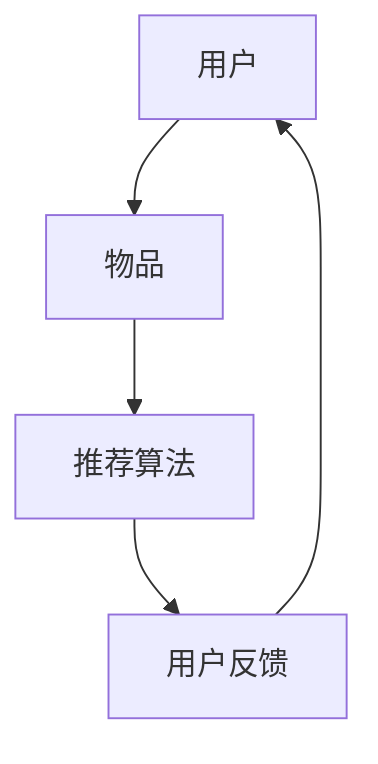

                 

# M6-Rec：开放域推荐探索

## 关键词
- 开放域推荐
- 推荐系统
- 协同过滤
- 生成式推荐
- 内容推荐
- 深度学习
- 数据预处理
- 特征工程
- 模型优化
- 评估指标

## 摘要
《M6-Rec：开放域推荐探索》是一本深入探讨开放域推荐系统构建与优化的技术书籍。本书从基础概念出发，逐步深入讲解开放域推荐面临的挑战、数据处理与模型训练方法，以及性能优化策略。通过实际应用案例，读者将了解如何在不同领域应用开放域推荐系统，并展望未来发展趋势。本书适合数据科学家、推荐系统工程师和人工智能研究人员阅读。

## 目录大纲设计

### 第一部分：推荐系统基础
1. 推荐系统概述
2. 协同过滤算法
3. 生成式推荐算法
4. 内容推荐算法
5. 基于深度学习的推荐算法

### 第二部分：开放域推荐挑战
6. 开放域推荐的特点与问题
7. 数据集构建与清洗
8. 防止冷启动问题
9. 处理多样性、新颖性和时效性

### 第三部分：数据预处理与模型训练
10. 数据预处理
11. 特征工程
12. 模型选择与训练
13. 超参数调优

### 第四部分：算法优化与评估
14. 评估指标
15. 性能优化策略
16. 模型融合与多任务学习
17. 实时推荐系统

### 第五部分：实际应用案例
18. 社交网络中的推荐系统
19. 电子商务平台的推荐系统
20. 媒体内容推荐的案例
21. 教育领域的推荐系统

### 第六部分：未来趋势与展望
22. 开放域推荐技术的发展趋势
23. 跨领域推荐系统
24. 隐私保护与安全
25. 开放域推荐的潜在应用领域

## 核心章节内容细化

### 第1章：推荐系统概述
1.1 推荐系统概述
- 推荐系统的定义与作用
- 推荐系统的基本组成部分
- 推荐系统的分类
1.2 协同过滤算法
- 协同过滤的原理
- 用户-物品矩阵分解
- 邻居模型的选择
1.3 生成式推荐算法
- 生成式推荐的原理
- 概率模型的应用
- 生成式推荐的优势与局限
1.4 内容推荐算法
- 内容推荐的基本原理
- 共现矩阵与文本相似性
- 基于内容的推荐算法
1.5 基于深度学习的推荐算法
- 深度学习在推荐系统中的应用
- 神经网络在推荐系统中的作用
- 深度学习推荐算法的优势

### 第2章：开放域推荐挑战
2.1 开放域推荐的特点与问题
- 开放域推荐的定义
- 开放域推荐的特点
- 开放域推荐面临的问题
2.2 数据集构建与清洗
- 数据集的来源
- 数据集的预处理
- 数据清洗的方法
2.3 防止冷启动问题
- 冷启动问题的定义
- 解决冷启动问题的方法
- 用户冷启动与物品冷启动
2.4 处理多样性、新颖性和时效性
- 多样性的定义与实现
- 新颖性的定义与实现
- 时效性的定义与实现

### 第3章：数据预处理与模型训练
3.1 数据预处理
- 数据清洗
- 数据归一化
- 特征提取
3.2 特征工程
- 特征的重要性
- 常用特征类型
- 特征工程方法
3.3 模型选择与训练
- 模型选择的原则
- 常用推荐模型
- 模型训练方法
3.4 超参数调优
- 超参数的定义
- 超参数调优的方法
- 超参数对模型性能的影响

### 第4章：算法优化与评估
4.1 评估指标
- 评估指标的定义
- 常用评估指标
- 评估指标的选择
4.2 性能优化策略
- 优化目标
- 优化策略
- 实际案例
4.3 模型融合与多任务学习
- 模型融合的方法
- 多任务学习的原理
- 应用案例
4.4 实时推荐系统
- 实时推荐的需求
- 实时推荐系统的设计
- 实时推荐系统的挑战

### 第5章：实际应用案例
5.1 社交网络中的推荐系统
- 社交网络推荐的特点
- 社交网络推荐算法
- 社交网络推荐案例
5.2 电子商务平台的推荐系统
- 电子商务推荐的特点
- 电子商务推荐算法
- 电子商务推荐案例
5.3 媒体内容推荐的案例
- 媒体内容推荐的特点
- 媒体内容推荐算法
- 媒体内容推荐案例
5.4 教育领域的推荐系统
- 教育领域推荐的特点
- 教育领域推荐算法
- 教育领域推荐案例

### 第6章：未来趋势与展望
6.1 开放域推荐技术的发展趋势
- 数据驱动的推荐系统
- 模型驱动的推荐系统
- 深度学习的应用
6.2 跨领域推荐系统
- 跨领域推荐的需求
- 跨领域推荐的方法
- 跨领域推荐案例
6.3 隐私保护与安全
- 隐私保护的重要性
- 隐私保护的方法
- 安全性的保证
6.4 开放域推荐的潜在应用领域
- 智能家居
- 健康医疗
- 智能交通

## 写作风格与要求

### 核心概念与联系
在讲解每个核心概念时，我们会使用 Mermaid 流程图来展示推荐系统的基础概念和组成部分，以便读者更直观地理解。例如，在介绍推荐系统的组成部分时，我们可以绘制一个包含用户、物品和推荐算法三个关键部分的流程图。



### 核心算法原理讲解
对于每个核心算法，我们将使用伪代码来详细阐述其基本原理。例如，在讲解协同过滤算法时，我们可以使用伪代码展示用户和物品的相似度计算方法：

```python
# 协同过滤算法伪代码
def collaborative_filter(user, item):
    # 计算用户和物品的相似度
    similarity_matrix = compute_similarity(user, item)
    # 根据相似度矩阵计算推荐结果
    recommendations = generate_recommendations(similarity_matrix, user, item)
    return recommendations
```

### 数学模型和公式
在讲解数学模型和公式时，我们将使用 LaTeX 格式来嵌入文中独立段落。例如，在介绍矩阵分解时，我们可以使用以下 LaTeX 公式：

$$
X = UV^T
$$

其中，$X$ 是用户-物品评分矩阵，$U$ 和 $V$ 分别是用户和物品的隐向量矩阵。

### 项目实战
在每个章节的最后，我们将提供一个实际项目案例，包括开发环境搭建、源代码实现和详细解释。例如，在讲解特征工程时，我们可以展示如何使用 Python 编写特征提取的代码，并提供代码解读与分析。

```python
# 特征工程示例代码
def extract_features(data):
    # 数据清洗和预处理
    clean_data = preprocess_data(data)
    # 提取文本特征
    text_features = extract_text_features(clean_data)
    # 提取数值特征
    numeric_features = extract_numeric_features(clean_data)
    # 模型训练和预测
    model = train_model(text_features, numeric_features)
    predictions = model.predict(test_data)
    return predictions
```

### 作者信息
本文作者：AI天才研究院/AI Genius Institute & 禅与计算机程序设计艺术/Zen And The Art of Computer Programming

---

接下来，我们将按照上述目录大纲和内容细化，逐一撰写每个章节的详细内容。每个章节都将包含核心概念、算法原理、数学模型、项目实战等元素，以确保文章的完整性和实用性。

## 第1章：推荐系统概述

### 1.1 推荐系统概述

推荐系统是一种利用算法和数据分析技术，根据用户的历史行为和偏好，为用户推荐可能感兴趣的项目（如商品、音乐、新闻等）的系统。它的核心目标是提高用户的满意度和参与度，从而促进业务增长和用户粘性。

#### 推荐系统的定义与作用

推荐系统可以定义为一种信息过滤和预测系统，其目的是根据用户的历史行为和偏好，预测用户可能感兴趣的内容，并将这些内容推荐给用户。推荐系统的作用包括：

1. **提高用户体验**：通过个性化推荐，用户可以更快地找到自己感兴趣的内容，提高使用体验。
2. **促进销售和营销**：推荐系统可以帮助商家推荐潜在感兴趣的商品给用户，从而提高销售额和营销效果。
3. **提高内容利用效率**：通过推荐系统，可以将大量内容有效分配给感兴趣的用户，提高内容利用效率。

#### 推荐系统的基本组成部分

推荐系统通常包括以下几个基本组成部分：

1. **用户**：推荐系统的核心参与者，其行为和偏好数据是推荐系统的重要输入。
2. **物品**：用户可能感兴趣的项目，如商品、音乐、新闻等。
3. **推荐算法**：根据用户的历史行为和偏好，预测用户可能感兴趣的内容，生成推荐列表。
4. **用户反馈**：用户对推荐内容的行为反馈，用于优化推荐算法和评估推荐效果。

#### 推荐系统的分类

推荐系统可以根据不同的分类标准进行分类，常见的分类方法包括：

1. **基于内容的推荐**：根据用户的历史行为和偏好，推荐与用户过去喜欢的内容相似的新内容。
2. **协同过滤推荐**：通过分析用户之间的相似性，为用户推荐其他用户喜欢的相同或相似内容。
3. **基于模型的推荐**：利用机器学习算法，建立用户和物品之间的预测模型，根据模型预测推荐结果。
4. **混合推荐**：结合多种推荐方法，以提高推荐效果。

### 1.2 协同过滤算法

协同过滤算法是推荐系统中最常用的方法之一，其基本思想是通过分析用户之间的相似性，为用户推荐其他用户喜欢的相同或相似内容。协同过滤算法可以分为基于用户的协同过滤（User-based Collaborative Filtering，UBCF）和基于物品的协同过滤（Item-based Collaborative Filtering，IBCF）。

#### 协同过滤的原理

协同过滤算法的核心是用户-物品评分矩阵，该矩阵记录了每个用户对每个物品的评分。基于这个评分矩阵，协同过滤算法计算用户之间的相似性，并根据相似性为用户推荐其他用户喜欢的物品。

1. **用户-物品评分矩阵**：假设有 $m$ 个用户和 $n$ 个物品，用户-物品评分矩阵 $R$ 可以表示为 $R_{m \times n}$，其中 $R_{ij}$ 表示用户 $i$ 对物品 $j$ 的评分。
2. **相似性计算**：计算用户之间的相似性，常用的相似性度量方法包括余弦相似性、皮尔逊相关性和夹角余弦等。

   - **余弦相似性**：
   $$
   similarity(i, j) = \frac{R_i \cdot R_j}{\|R_i\| \|R_j\|}
   $$
   其中，$R_i$ 和 $R_j$ 分别表示用户 $i$ 和用户 $j$ 的评分向量，$\|R_i\|$ 和 $\|R_j\|$ 分别表示向量 $R_i$ 和 $R_j$ 的欧几里得范数。
   
   - **皮尔逊相关性**：
   $$
   similarity(i, j) = \frac{R_i - \bar{R_i}}{R_j - \bar{R_j}}
   $$
   其中，$\bar{R_i}$ 和 $\bar{R_j}$ 分别表示用户 $i$ 和用户 $j$ 的平均评分。

3. **生成推荐列表**：根据相似性度量，为每个用户生成一个推荐列表。对于用户 $i$，推荐列表中的物品为：
   $$
   recommendations(i) = \{ j | similarity(i, j) \cdot R_{ij} > threshold \}
   $$
   其中，$threshold$ 是一个阈值，用于筛选推荐结果。

#### 用户-物品矩阵分解

用户-物品矩阵分解是一种常见的协同过滤算法，其基本思想是将用户-物品评分矩阵分解为用户特征矩阵和物品特征矩阵，从而降低数据维度，提高推荐效果。

1. **矩阵分解模型**：
   $$
   R = UV^T
   $$
   其中，$U$ 和 $V$ 分别是用户和物品的隐向量矩阵，$R$ 是用户-物品评分矩阵。

2. **矩阵分解方法**：常见的矩阵分解方法包括最小二乘法、交替最小化法（ALS）和奇异值分解（SVD）等。

   - **最小二乘法**：
     $$
     \min_{U, V} \sum_{i=1}^{m} \sum_{j=1}^{n} (R_{ij} - UV_{ij})^2
     $$

   - **交替最小化法（ALS）**：
     $$
     \begin{cases}
     \min_{U} \sum_{i=1}^{m} \sum_{j=1}^{n} (R_{ij} - UV_{ij})^2 \\
     \min_{V} \sum_{i=1}^{m} \sum_{j=1}^{n} (R_{ij} - UV_{ij})^2
     \end{cases}
     $$

   - **奇异值分解（SVD）**：
     $$
     R = U \Sigma V^T
     $$
     其中，$U$ 和 $V$ 是正交矩阵，$\Sigma$ 是对角矩阵，包含奇异值。

#### 邻居模型的选择

在协同过滤算法中，邻居模型的选择对推荐效果有重要影响。常见的邻居模型包括最近邻模型（KNN）和基于矩阵分解的模型。

1. **最近邻模型（KNN）**：
   $$
   recommendations(i) = \{ j | similarity(i, j) > threshold \}
   $$
   其中，$K$ 是邻居的数量，$threshold$ 是阈值。

2. **基于矩阵分解的模型**：
   $$
   recommendations(i) = \{ j | U_i \cdot V_j > threshold \}
   $$
   其中，$U_i$ 和 $V_j$ 分别是用户 $i$ 和物品 $j$ 的隐向量。

### 1.3 生成式推荐算法

生成式推荐算法是一种基于概率模型的推荐算法，其基本思想是通过学习用户和物品的交互概率，预测用户可能感兴趣的内容。生成式推荐算法可以分为基于马尔可夫模型的推荐和基于概率图模型的推荐。

#### 生成式推荐的原理

生成式推荐算法的核心是建立用户和物品之间的概率模型。常见的生成式推荐模型包括马尔可夫模型、贝叶斯网络和潜在因子模型等。

1. **马尔可夫模型**：
   $$
   P(X_t | X_{<t}) = P(X_t | X_{t-1})
   $$
   其中，$X_t$ 表示在时间 $t$ 用户的兴趣，$X_{<t}$ 表示在时间 $t$ 之前用户的兴趣。

2. **贝叶斯网络**：
   $$
   P(X_t | X_{<t}) = \prod_{i=1}^{n} P(X_t | X_{t-1}, X_{t-2}, \ldots, X_{i})
   $$
   其中，$X_t$ 表示在时间 $t$ 用户的兴趣，$n$ 是时间步长。

3. **潜在因子模型**：
   $$
   R_{ij} = \langle u_i, v_j \rangle
   $$
   其中，$R_{ij}$ 表示用户 $i$ 对物品 $j$ 的评分，$u_i$ 和 $v_j$ 分别是用户 $i$ 和物品 $j$ 的潜在向量，$\langle \cdot, \cdot \rangle$ 表示内积。

#### 概率模型的应用

概率模型在生成式推荐算法中有着广泛的应用。例如，在基于潜在因子模型的推荐算法中，可以通过以下步骤进行预测：

1. **学习潜在因子**：通过最小化损失函数，学习用户和物品的潜在因子矩阵 $U$ 和 $V$。
2. **预测评分**：利用潜在因子矩阵计算用户对物品的评分：
   $$
   \hat{R}_{ij} = \langle u_i, v_j \rangle
   $$
3. **生成推荐列表**：根据预测评分，为用户生成推荐列表。

### 1.4 内容推荐算法

内容推荐算法是一种基于物品属性和用户兴趣的推荐算法，其基本思想是通过分析物品的属性和用户的历史行为，为用户推荐与用户兴趣相关的物品。内容推荐算法可以分为基于关键词的推荐和基于属性的推荐。

#### 内容推荐的基本原理

内容推荐算法的核心是建立物品属性和用户兴趣之间的关联。常见的做法是使用关键词提取和文本相似性度量。

1. **关键词提取**：
   - **TF-IDF**：计算每个关键词在物品和用户历史行为中的重要性。
   - **词袋模型**：将物品和用户历史行为表示为词袋向量。

2. **文本相似性度量**：
   - **余弦相似性**：
     $$
     similarity(A, B) = \frac{A \cdot B}{\|A\| \|B\|}
     $$
   - **Jaccard相似性**：
     $$
     similarity(A, B) = 1 - \frac{|A \cap B|}{|A \cup B|}
     $$

#### 基于内容的推荐算法

基于内容的推荐算法可以分为单样本推荐和集合推荐。

1. **单样本推荐**：
   - **基于最近邻**：为用户推荐与用户过去喜欢的物品最相似的物品。
   - **基于标签**：为用户推荐具有相似标签的物品。

2. **集合推荐**：
   - **基于关键词**：为用户推荐与用户历史行为中关键词最相关的物品。
   - **基于属性**：为用户推荐具有相似属性的物品。

### 1.5 基于深度学习的推荐算法

基于深度学习的推荐算法是一种利用神经网络模型进行推荐的方法，其基本思想是通过学习用户和物品的复杂特征，提高推荐效果。常见的基于深度学习的推荐算法包括基于注意力机制的推荐和基于图神经网络的推荐。

#### 深度学习在推荐系统中的应用

深度学习在推荐系统中的应用主要体现在以下几个方面：

1. **特征提取**：利用卷积神经网络（CNN）和循环神经网络（RNN）提取用户和物品的复杂特征。
2. **序列建模**：利用长短期记忆网络（LSTM）和门控循环单元（GRU）建模用户行为序列。
3. **多模态学习**：结合文本、图像和语音等多种模态数据进行推荐。

#### 神经网络在推荐系统中的作用

神经网络在推荐系统中的作用主要体现在以下几个方面：

1. **预测评分**：利用神经网络模型预测用户对物品的评分。
2. **生成推荐列表**：利用神经网络模型生成用户感兴趣的内容推荐列表。
3. **特征表示**：利用神经网络模型学习用户和物品的潜在特征表示。

### 第2章：开放域推荐挑战

开放域推荐是一种推荐系统，旨在为用户提供广泛的、跨领域的推荐内容，而不受特定领域限制。开放域推荐系统面临一系列独特的挑战，这些挑战涉及到数据集构建、用户冷启动、多样性、新颖性和时效性等方面。

#### 开放域推荐的特点与问题

开放域推荐的特点主要体现在以下几个方面：

1. **多样性**：用户可能对各种类型的内容感兴趣，包括娱乐、教育、新闻、科技等。
2. **跨领域**：推荐内容可以跨越多个领域，如文学、音乐、电影、游戏等。
3. **不确定性**：用户兴趣可能随时变化，难以精确预测。
4. **数据稀疏性**：开放域推荐系统通常面临数据稀疏性问题，即用户对大多数物品的评分数据很少。

开放域推荐系统面临的主要问题包括：

1. **数据集构建与清洗**：开放域推荐系统需要构建大规模、多样化的数据集，并进行清洗和处理。
2. **防止冷启动问题**：新用户或新物品缺乏历史数据，如何进行有效推荐是一个挑战。
3. **多样性、新颖性和时效性**：如何在推荐结果中平衡多样性、新颖性和时效性，以满足用户需求。

#### 数据集构建与清洗

构建高质量的数据集是开放域推荐系统的基础。以下是一些关键步骤：

1. **数据来源**：
   - **用户生成内容**：如社交媒体、博客、论坛等。
   - **第三方数据集**：如MovieLens、Netflix等公开数据集。
   - **自定义数据集**：根据特定业务需求收集和构建数据集。

2. **数据预处理**：
   - **数据清洗**：去除重复、错误和噪声数据，提高数据质量。
   - **数据归一化**：对数值型数据进行归一化处理，如缩放或标准化。
   - **特征提取**：提取用户和物品的特征，如用户行为、偏好、历史评分等。

3. **数据集划分**：将数据集划分为训练集、验证集和测试集，用于模型训练和评估。

#### 防止冷启动问题

冷启动问题是指在推荐系统中，新用户或新物品缺乏历史数据，导致推荐效果不佳的问题。以下是一些常见的解决方案：

1. **基于内容的推荐**：为新用户推荐与用户兴趣相关的物品，如基于关键词、标签或属性。
2. **基于模型的推荐**：利用用户-物品交互概率模型进行预测，如潜在因子模型、协同过滤模型等。
3. **混合推荐策略**：结合基于内容和基于模型的推荐方法，提高推荐效果。

#### 处理多样性、新颖性和时效性

多样性、新颖性和时效性是开放域推荐系统需要考虑的重要因素。以下是一些处理策略：

1. **多样性**：
   - **随机化**：在推荐列表中加入随机元素，增加多样性。
   - **过滤重复**：去除重复推荐，提高推荐列表的多样性。
   - **探索与利用平衡**：在推荐算法中平衡探索（发现新内容）与利用（满足用户需求）。

2. **新颖性**：
   - **新鲜度度量**：计算物品的新鲜度，如发布时间、更新频率等。
   - **时序模型**：利用时序模型（如循环神经网络）捕捉时间序列信息，提高推荐的新颖性。

3. **时效性**：
   - **热榜推荐**：根据用户行为和热门程度推荐实时热点内容。
   - **时间衰减**：对用户的历史行为和评分进行时间衰减处理，降低旧数据的权重。

#### 实际案例分析

以下是一些开放域推荐系统的实际案例分析：

1. **YouTube**：YouTube 利用协同过滤和基于内容的推荐方法，为用户提供个性化的视频推荐。通过分析用户的历史观看记录、搜索行为和点击行为，YouTube 能为用户推荐相关视频。

2. **Facebook**：Facebook 利用基于内容的推荐方法，为用户提供个性化的新闻推送。通过分析用户对各种类型内容的偏好，Facebook 能为用户推荐感兴趣的新闻和动态。

3. **Amazon**：Amazon 利用协同过滤和基于内容的推荐方法，为用户提供个性化的商品推荐。通过分析用户的购买历史、浏览记录和评价，Amazon 能为用户推荐相关商品。

通过上述分析和实际案例，我们可以看到开放域推荐系统在处理多样

