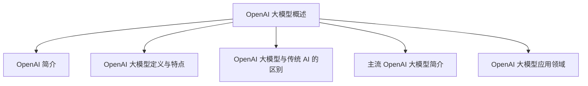

                 

### 《OpenAI 大模型应用实践》

关键词：OpenAI、大模型、GPT-3、深度学习、应用实践

摘要：本文将深入探讨 OpenAI 的大模型技术及其应用实践。首先，我们将介绍 OpenAI 的基本概念和发展历程，并详细介绍 GPT-3 等主流大模型的特点和应用领域。接着，我们将探讨 OpenAI 大模型的技术基础，包括深度学习与神经网络、自然语言处理技术以及大规模预训练模型的原理。然后，我们将通过开发环境搭建、数据预处理与模型训练、项目实战等步骤，详细讲解如何使用 OpenAI 大模型进行实际开发。此外，我们还将探讨 OpenAI 大模型的部署与优化，以及安全与伦理问题。最后，我们将精选一些 OpenAI 大模型的应用案例，并展望其未来发展趋势。

---

### 第一部分：OpenAI 大模型基础

#### 第1章：OpenAI 大模型概述

#### 1.1 OpenAI 简介

##### 1.1.1 OpenAI 的成立与发展历程

OpenAI 是一家总部位于美国的人工智能研究公司，成立于 2015 年。其宗旨是“实现安全的通用人工智能（AGI）并让其造福人类”。OpenAI 的创始人包括山姆·艾略特（Sam Altman）、伊尔亚·苏茨克维（Ilya Sutskever）和雷·库兹韦尔（Ray Kurzweil）等人工智能领域的顶尖专家。

自成立以来，OpenAI 取得了许多重要的成果，其中包括开发出了多款高性能的人工智能模型，如 GPT-3、GPT-2、BERT 等。这些模型在自然语言处理、计算机视觉、推荐系统等领域都取得了显著的成果。

##### 1.1.2 OpenAI 的重要贡献

OpenAI 的重要贡献主要体现在以下几个方面：

1. **推动人工智能技术的发展**：OpenAI 一直致力于探索人工智能的新技术，如深度学习、生成对抗网络（GAN）等，并在这些领域取得了突破性成果。

2. **开放共享研究成果**：OpenAI 强调科学研究的透明性和开放性，其研究成果大多通过论文、开源代码等形式公开共享，为全球人工智能研究做出了巨大贡献。

3. **倡导安全与伦理**：OpenAI 非常重视人工智能的安全与伦理问题，积极参与相关讨论和研究，为制定人工智能发展的规范和标准提供了有益的参考。

#### 1.2 OpenAI 大模型的定义与特点

##### 1.2.1 大模型的定义

大模型通常指的是参数规模超过数十亿的高参数量神经网络。这些模型具有强大的表示能力和灵活性，可以在多种任务上取得优异的性能。

##### 1.2.2 大模型的特点

1. **强大的表示能力**：大模型能够从大量数据中学习到丰富的知识，具备强大的特征表示能力。

2. **灵活性**：大模型可以应用于多种不同的任务，如文本生成、图像分类、语音识别等。

3. **高性能**：大模型在多项基准测试中取得了领先的性能，为人工智能应用提供了新的可能性。

##### 1.2.3 OpenAI 大模型与传统 AI 的区别

传统 AI 主要依赖于手工设计的特征和算法，而 OpenAI 大模型则基于深度学习和大规模预训练。具体区别如下：

1. **数据量**：传统 AI 通常使用较小的数据集，而大模型则依赖于大规模数据集。

2. **算法**：传统 AI 采用手工设计的特征和算法，而大模型则基于深度学习和大规模预训练。

3. **性能**：大模型在多项任务上取得了显著的性能提升，而传统 AI 则在某些特定任务上表现良好。

#### 1.3 主流 OpenAI 大模型简介

##### 1.3.1 GPT 系列模型

GPT（Generative Pre-trained Transformer）系列模型是 OpenAI 推出的一系列基于 Transformer 架构的预训练语言模型。其中，GPT-3 是目前参数量最大的语言模型，拥有 1750 亿个参数。

GPT-3 具有以下特点：

1. **强大的文本生成能力**：GPT-3 能够根据给定的文本输入生成高质量的文本输出。

2. **灵活的应用场景**：GPT-3 可以应用于多种自然语言处理任务，如文本分类、问答系统、机器翻译等。

3. **高性能**：GPT-3 在多项自然语言处理基准测试中取得了优异的成绩。

##### 1.3.2 GPT-3 的特点与架构

GPT-3 具有以下特点：

1. **大规模参数量**：GPT-3 拥有 1750 亿个参数，是当前参数量最大的语言模型。

2. **灵活的指令遵循能力**：GPT-3 能够根据给定的指令生成符合要求的文本输出。

3. **强大的上下文理解能力**：GPT-3 能够从大量文本数据中学习到丰富的知识，具备强大的上下文理解能力。

GPT-3 的架构采用 Transformer 架构，主要包括以下组件：

1. **嵌入层**：将输入文本转换为向量表示。

2. **自注意力机制**：通过自注意力机制对输入文本进行加权处理。

3. **前馈神经网络**：对自注意力机制的结果进行进一步处理。

4. **输出层**：生成文本输出。

##### 1.3.3 其他知名 OpenAI 大模型介绍

除了 GPT 系列模型，OpenAI 还推出了其他一些知名的大模型，如下：

1. **BERT**：BERT（Bidirectional Encoder Representations from Transformers）是 Google 推出的一种基于 Transformer 架构的预训练语言模型。BERT 在自然语言处理任务中取得了优异的性能。

2. **ViT**：ViT（Vision Transformer）是 OpenAI 推出的一种基于 Transformer 架构的计算机视觉模型。ViT 在图像分类任务中取得了优异的成绩。

3. **GAT**：GAT（Graph Attention Network）是 OpenAI 推出的一种基于图神经网络的大模型。GAT 可以用于处理复杂的关系数据。

#### 1.4 OpenAI 大模型的应用领域

##### 1.4.1 自然语言处理

自然语言处理（NLP）是 OpenAI 大模型的主要应用领域之一。OpenAI 大模型在文本生成、文本分类、问答系统、机器翻译等方面取得了显著的成绩。例如，GPT-3 可以根据给定的文本输入生成高质量的文本输出，广泛应用于自动化写作、智能客服、内容生成等领域。

##### 1.4.2 计算机视觉

计算机视觉是另一个 OpenAI 大模型的重要应用领域。OpenAI 大模型在图像分类、目标检测、图像生成等方面取得了显著的成果。例如，ViT 模型在图像分类任务中取得了优异的成绩，GAT 模型可以用于处理复杂的关系数据。

##### 1.4.3 推荐系统

推荐系统是 OpenAI 大模型的另一个重要应用领域。OpenAI 大模型可以用于处理用户行为数据，生成个性化的推荐结果。例如，GPT-3 可以根据用户的浏览历史和偏好，生成个性化的文章推荐。

##### 1.4.4 强化学习

强化学习是 OpenAI 大模型的另一个重要应用领域。OpenAI 大模型可以用于解决复杂的强化学习问题，如游戏控制、自动驾驶等。例如，GPT-3 可以用于训练自动驾驶模型，实现高效的路径规划和决策。

##### 1.4.5 其他领域应用

除了上述领域，OpenAI 大模型还可以应用于教育、医疗、金融等领域。例如，GPT-3 可以用于智能教育辅导、医疗诊断、金融风控等任务。

---

在接下来的章节中，我们将深入探讨 OpenAI 大模型的技术基础、开发实践、部署与优化以及安全与伦理问题，帮助读者更好地理解和应用这些强大的人工智能技术。让我们开始这一段激动人心的探索之旅！【Mermaid 流程图】



---

#### 第2章：OpenAI 大模型技术基础

#### 2.1 深度学习与神经网络基础

##### 2.1.1 神经网络的基本结构

神经网络（Neural Networks）是深度学习（Deep Learning）的基础，其基本结构由多个神经元（或节点）组成。一个简单的神经网络通常包括输入层、隐藏层和输出层。

1. **输入层**：输入层接收外部输入数据，并将其传递给隐藏层。

2. **隐藏层**：隐藏层对输入数据进行处理，通过一系列的加权求和和激活函数计算输出。

3. **输出层**：输出层生成最终的输出结果。

##### 2.1.2 常见的深度学习架构

深度学习架构多种多样，常见的包括卷积神经网络（CNN）、循环神经网络（RNN）、长短期记忆网络（LSTM）、门控循环单元（GRU）等。

1. **卷积神经网络（CNN）**：CNN 适用于处理图像数据，其主要特点是采用卷积层进行特征提取，能够自动学习图像中的局部特征。

2. **循环神经网络（RNN）**：RNN 适用于处理序列数据，其主要特点是具有记忆功能，能够处理长距离依赖问题。

3. **长短期记忆网络（LSTM）**：LSTM 是 RNN 的一个变种，能够更好地解决长距离依赖问题。

4. **门控循环单元（GRU）**：GRU 是 LSTM 的简化版，具有更少的参数和计算量。

##### 2.1.3 深度学习优化算法

深度学习优化算法用于训练神经网络，常见的包括梯度下降（Gradient Descent）、随机梯度下降（SGD）、Adam 等算法。

1. **梯度下降**：梯度下降是一种最简单的优化算法，通过计算损失函数关于模型参数的梯度，并沿着梯度方向更新参数。

2. **随机梯度下降（SGD）**：SGD 是梯度下降的一个变种，每次迭代使用随机抽取的一小部分数据计算梯度。

3. **Adam**：Adam 是一种自适应梯度优化算法，能够在不同迭代阶段自适应调整学习率。

#### 2.2 自然语言处理技术概览

##### 2.2.1 词嵌入技术

词嵌入（Word Embedding）是一种将词汇映射到高维向量空间的技术，能够有效地表示词汇的语义信息。常见的词嵌入技术包括 Word2Vec、GloVe 等。

1. **Word2Vec**：Word2Vec 是基于神经网络的词嵌入技术，通过训练神经网络预测相邻词的分布来学习词汇的向量表示。

2. **GloVe**：GloVe 是基于全局共现信息的词嵌入技术，通过计算词汇的词向量和词频之间的关系来学习词汇的向量表示。

##### 2.2.2 序列模型与注意力机制

序列模型（Sequence Model）用于处理序列数据，如文本、语音等。常见的序列模型包括循环神经网络（RNN）、长短期记忆网络（LSTM）、门控循环单元（GRU）等。

注意力机制（Attention Mechanism）是一种用于捕捉序列中重要信息的方法，能够提高模型的性能。注意力机制广泛应用于文本生成、机器翻译等领域。

##### 2.2.3 转换器架构详解

转换器架构（Transformer）是自然语言处理领域的一种新型架构，其核心思想是使用自注意力机制（Self-Attention）和多头注意力（Multi-Head Attention）来处理序列数据。

转换器架构主要包括以下组件：

1. **嵌入层**：将输入文本转换为向量表示。

2. **多头自注意力机制**：通过自注意力机制对输入文本进行加权处理。

3. **前馈神经网络**：对自注意力机制的结果进行进一步处理。

4. **输出层**：生成文本输出。

#### 2.3 大规模预训练模型原理

##### 2.3.1 预训练的概念与意义

预训练（Pre-training）是指在大规模数据集上对神经网络进行初步训练，然后在此基础上进行特定任务的微调（Fine-tuning）。预训练能够提高模型的泛化能力和性能。

预训练的意义在于：

1. **提高模型性能**：预训练使得模型能够学习到丰富的知识和特征，从而在特定任务上取得更好的性能。

2. **减少数据需求**：预训练使得模型在少量数据上即可取得较好的性能，降低了数据需求。

3. **通用性**：预训练模型可以应用于多种不同的任务，提高模型的通用性。

##### 2.3.2 自监督学习方法

自监督学习（Self-Supervised Learning）是一种无需标注数据即可进行训练的方法，其核心思想是从大量无标签数据中学习到有用的特征表示。常见的自监督学习方法包括：

1. **掩码语言模型（MLM）**：通过随机掩码部分文本，然后训练模型预测被掩码的词。

2. **掩码图像建模（MIM）**：通过随机掩码部分图像，然后训练模型预测被掩码的部分。

##### 2.3.3 迁移学习与微调技术

迁移学习（Transfer Learning）是指将已在大规模数据集上预训练的模型应用于新的任务，通过微调（Fine-tuning）适应新的数据集。微调的主要步骤包括：

1. **加载预训练模型**：加载已在大规模数据集上预训练的模型。

2. **微调参数**：对预训练模型的参数进行微调，使其适应新的任务。

3. **评估性能**：在新的数据集上评估模型的性能，并根据需要对模型进行进一步调整。

##### 2.3.4 大模型训练策略

大模型训练策略是指在大规模数据集上训练大模型的策略，主要包括以下几个方面：

1. **数据增强**：通过数据增强技术增加训练数据的多样性，提高模型的泛化能力。

2. **分阶段训练**：将训练过程分为多个阶段，逐步增加模型的复杂度和参数规模。

3. **学习率调整**：根据训练过程调整学习率，以避免模型过拟合。

4. **模型压缩与量化**：通过模型压缩和量化技术降低模型的计算量和存储需求。

##### 2.3.5 大模型推理优化

大模型推理优化是指在大规模数据集上进行模型推理时的优化策略，主要包括以下几个方面：

1. **模型并行化**：通过模型并行化技术提高模型推理的速度。

2. **计算图优化**：通过计算图优化技术降低模型的计算复杂度。

3. **硬件加速**：通过使用 GPU、TPU 等硬件加速器提高模型推理的速度。

4. **缓存与预取**：通过缓存和预取技术减少模型推理的延迟。

##### 2.3.6 模型压缩与量化技术

模型压缩与量化技术是指通过压缩和量化模型参数来降低模型的计算量和存储需求，主要包括以下几个方面：

1. **模型剪枝**：通过剪枝技术移除模型中不重要的参数，减少模型的计算量。

2. **量化**：将模型参数的浮点数表示转换为整数表示，降低模型的存储需求。

3. **知识蒸馏**：通过知识蒸馏技术将大模型的表示能力转移到小模型中，减少模型的计算量。

---

在接下来的章节中，我们将继续探讨 OpenAI 大模型的开发实践、部署与优化以及安全与伦理问题。通过这些内容的讲解，我们将帮助读者更好地掌握 OpenAI 大模型的技术和应用，为人工智能领域的实际应用提供有力支持。

---

#### 第3章：OpenAI 大模型开发实践

#### 3.1 开发环境搭建

在进行 OpenAI 大模型的开发之前，我们需要搭建一个合适的开发环境。下面将详细介绍开发环境的搭建过程，包括硬件配置、软件环境安装和开发工具的介绍。

##### 3.1.1 硬件配置

为了能够高效地训练和推理 OpenAI 大模型，我们需要具备一定的硬件配置。以下是一些建议的硬件配置：

1. **CPU**：至少需要 Intel Xeon 或 AMD Ryzen 系列的 CPU，推荐使用 64 位处理器，以保证系统稳定性。

2. **GPU**：GPU 对于深度学习模型训练和推理至关重要，建议使用 NVIDIA Tesla V100 或 newer 的 GPU，以确保有足够的计算能力。

3. **内存**：至少需要 64GB 的内存，以保证模型训练过程中的数据传输和缓存需求。

4. **硬盘**：建议使用 SSD 硬盘，以提供更高的读写速度，加快训练和推理过程。

5. **网络**：如果需要远程访问模型训练和推理资源，建议使用高速网络，以保证数据传输速度。

##### 3.1.2 软件环境安装

接下来，我们需要在硬件上安装必要的软件环境。以下是在 Linux 系统上安装软件环境的步骤：

1. **安装 CUDA**：CUDA 是 NVIDIA 提供的 GPU 加速计算库，用于深度学习模型的训练和推理。请访问 NVIDIA 官网下载并安装 CUDA。

2. **安装 cuDNN**：cuDNN 是 NVIDIA 提供的深度神经网络库，用于优化深度学习模型的性能。请访问 NVIDIA 官网下载并安装 cuDNN。

3. **安装 Python**：Python 是深度学习的主要编程语言，我们需要安装 Python。请访问 Python 官网下载并安装 Python。

4. **安装 pip**：pip 是 Python 的包管理器，用于安装和管理 Python 包。在终端中运行以下命令安装 pip：
   ```bash
   sudo apt-get install python-pip
   ```

5. **安装 TensorFlow**：TensorFlow 是 Google 开发的一款开源深度学习框架，用于构建和训练深度学习模型。在终端中运行以下命令安装 TensorFlow：
   ```bash
   pip install tensorflow
   ```

##### 3.1.3 开发工具介绍

在开发 OpenAI 大模型时，我们还需要使用一些常用的开发工具。以下是一些常用的开发工具及其简介：

1. **Jupyter Notebook**：Jupyter Notebook 是一款流行的交互式开发工具，用于编写和运行 Python 代码。它支持多种编程语言，并提供了丰富的可视化功能。

2. **PyCharm**：PyCharm 是一款功能强大的 Python 集成开发环境（IDE），提供了代码编辑、调试、项目管理等功能。

3. **Google Colab**：Google Colab 是 Google 提供的免费云端 Jupyter Notebook 环境，可用于远程训练和推理深度学习模型。

4. **CUDA SDK**：CUDA SDK 是 NVIDIA 提供的 CUDA 开发套件，用于开发和使用 CUDA 程序。

5. **cuDNN SDK**：cuDNN SDK 是 NVIDIA 提供的 cuDNN 库的开发套件，用于优化深度学习模型的性能。

---

在完成开发环境的搭建后，我们就可以开始进行 OpenAI 大模型的训练和推理工作了。接下来，我们将详细介绍数据预处理、模型训练、模型评估等开发实践步骤。

---

#### 3.2 数据预处理与模型训练

##### 3.2.1 数据预处理

在进行 OpenAI 大模型的训练之前，我们需要对数据进行预处理。数据预处理包括数据清洗、数据转换和数据归一化等步骤。

1. **数据清洗**：数据清洗是指去除数据中的噪声和错误，保证数据的准确性和一致性。对于文本数据，我们需要去除标点符号、停用词等，对文本进行分词和词嵌入处理。

2. **数据转换**：数据转换是指将原始数据转换为适合模型训练的格式。对于图像数据，我们需要进行缩放、裁剪等处理，将图像尺寸统一为模型的输入尺寸。

3. **数据归一化**：数据归一化是指将数据转换为相似的尺度，以避免模型在训练过程中出现梯度消失或梯度爆炸等问题。对于文本数据，我们可以使用词嵌入技术进行归一化处理。

##### 3.2.2 模型选择与超参数调优

在数据预处理完成后，我们需要选择一个合适的模型并进行超参数调优。以下是一些常用的模型和超参数调优方法：

1. **模型选择**：
   - **GPT-3**：GPT-3 是 OpenAI 推出的一款大型预训练语言模型，适用于文本生成、文本分类等任务。
   - **BERT**：BERT 是 Google 推出的一款双向编码表示预训练模型，适用于文本分类、问答系统等任务。
   - **ViT**：ViT 是 OpenAI 推出的一款视觉变压器模型，适用于图像分类、目标检测等任务。

2. **超参数调优**：
   - **学习率**：学习率是模型训练过程中用于更新参数的关键参数，通常使用自适应学习率算法，如 Adam。
   - **批量大小**：批量大小是指每次训练使用的样本数量，通常根据硬件配置和数据规模进行调整。
   - **训练轮次**：训练轮次是指模型在训练数据上进行的迭代次数，通常根据任务复杂度和数据规模进行调整。

##### 3.2.3 模型训练过程监控

在模型训练过程中，我们需要监控模型的表现，以便调整训练策略。以下是一些常用的监控指标：

1. **损失函数**：损失函数用于衡量模型预测结果与真实结果之间的差距，常用的损失函数包括交叉熵损失函数、均方误差损失函数等。

2. **准确率**：准确率用于衡量模型在训练数据上的表现，通常使用分类任务的准确率作为评价指标。

3. **召回率**：召回率用于衡量模型在训练数据上的表现，通常使用分类任务的召回率作为评价指标。

4. **F1 分数**：F1 分数是准确率和召回率的调和平均值，用于综合评价模型在训练数据上的表现。

5. **验证集表现**：在模型训练过程中，我们需要定期在验证集上评估模型的表现，以便调整训练策略。

##### 3.2.4 模型评估与调整

在模型训练完成后，我们需要对模型进行评估和调整，以确保模型在任务上取得最佳表现。以下是一些评估和调整方法：

1. **交叉验证**：交叉验证是一种常用的模型评估方法，通过将数据集划分为多个子集，在每个子集上训练和评估模型，以评估模型在整体数据集上的表现。

2. **超参数调整**：通过调整学习率、批量大小、训练轮次等超参数，寻找最佳超参数组合，以优化模型表现。

3. **模型融合**：将多个模型的结果进行融合，以提高模型的整体性能。常用的模型融合方法包括投票法、加权平均法等。

4. **模型压缩与量化**：通过模型压缩和量化技术，降低模型的计算量和存储需求，以提高模型在硬件设备上的运行效率。

---

在完成模型训练和评估后，我们可以将训练好的模型应用到实际任务中。接下来，我们将详细介绍 OpenAI 大模型在不同应用场景中的实际应用案例。

---

#### 3.3 OpenAI 大模型应用案例

##### 3.3.1 文本生成与应用

文本生成是 OpenAI 大模型的一个重要应用场景，可以应用于自动化写作、智能客服、内容生成等领域。以下是一个基于 GPT-3 的文本生成案例：

**案例背景**：一家媒体公司希望使用人工智能技术自动化生成新闻报道。

**技术方案**：使用 GPT-3 模型进行文本生成，通过输入相关新闻素材，生成符合要求的新闻报道。

**实现步骤**：

1. **数据收集**：收集大量新闻报道数据，作为 GPT-3 模型的训练数据。

2. **数据预处理**：对新闻报道数据进行清洗、分词和词嵌入处理。

3. **模型训练**：使用预处理后的数据训练 GPT-3 模型。

4. **模型部署**：将训练好的模型部署到服务器上，以便实时生成新闻报道。

5. **应用**：将生成的新闻报道用于媒体公司的新闻报道发布平台。

**结果分析**：通过实际应用，该模型能够生成符合要求的新闻报道，提高了媒体公司的新闻报道生产效率。

##### 3.3.2 自然语言理解与应用

自然语言理解是 OpenAI 大模型的另一个重要应用场景，可以应用于智能问答、文本分类、情感分析等领域。以下是一个基于 GPT-3 的自然语言理解案例：

**案例背景**：一家电商平台希望使用人工智能技术实现智能问答功能，以提升用户体验。

**技术方案**：使用 GPT-3 模型进行自然语言理解，通过输入用户提问，生成符合要求的回答。

**实现步骤**：

1. **数据收集**：收集大量用户提问和回答数据，作为 GPT-3 模型的训练数据。

2. **数据预处理**：对用户提问和回答数据进行清洗、分词和词嵌入处理。

3. **模型训练**：使用预处理后的数据训练 GPT-3 模型。

4. **模型部署**：将训练好的模型部署到服务器上，以便实时响应用户提问。

5. **应用**：将生成的回答用于电商平台的智能问答系统。

**结果分析**：通过实际应用，该模型能够准确理解用户提问，并生成符合要求的回答，提升了电商平台的用户体验。

##### 3.3.3 计算机视觉应用

计算机视觉是 OpenAI 大模型的另一个重要应用场景，可以应用于图像分类、目标检测、图像生成等领域。以下是一个基于 ViT 的计算机视觉案例：

**案例背景**：一家科技公司希望使用人工智能技术实现图像分类功能。

**技术方案**：使用 ViT 模型进行图像分类，通过输入图像数据，生成分类结果。

**实现步骤**：

1. **数据收集**：收集大量图像数据，作为 ViT 模型的训练数据。

2. **数据预处理**：对图像数据进行清洗、缩放和归一化处理。

3. **模型训练**：使用预处理后的数据训练 ViT 模型。

4. **模型部署**：将训练好的模型部署到服务器上，以便实时分类图像。

5. **应用**：将分类结果用于科技公司的图像分类系统。

**结果分析**：通过实际应用，该模型能够准确分类图像，提升了科技公司图像分类系统的性能。

##### 3.3.4 推荐系统应用

推荐系统是 OpenAI 大模型的另一个重要应用场景，可以应用于商品推荐、电影推荐、音乐推荐等领域。以下是一个基于 GPT-3 的推荐系统案例：

**案例背景**：一家在线购物平台希望使用人工智能技术实现商品推荐功能。

**技术方案**：使用 GPT-3 模型进行推荐系统，通过分析用户行为数据和商品特征，生成个性化推荐结果。

**实现步骤**：

1. **数据收集**：收集大量用户行为数据和商品特征数据，作为 GPT-3 模型的训练数据。

2. **数据预处理**：对用户行为数据和商品特征数据进行清洗、分词和词嵌入处理。

3. **模型训练**：使用预处理后的数据训练 GPT-3 模型。

4. **模型部署**：将训练好的模型部署到服务器上，以便实时生成推荐结果。

5. **应用**：将生成的推荐结果用于在线购物平台的商品推荐系统。

**结果分析**：通过实际应用，该模型能够生成符合用户偏好的个性化推荐结果，提升了在线购物平台的用户体验。

##### 3.3.5 强化学习应用

强化学习是 OpenAI 大模型的另一个重要应用场景，可以应用于游戏控制、自动驾驶、机器人控制等领域。以下是一个基于 GPT-3 的强化学习案例：

**案例背景**：一家游戏公司希望使用人工智能技术实现智能游戏控制。

**技术方案**：使用 GPT-3 模型进行强化学习，通过学习玩家的游戏策略，生成智能游戏控制指令。

**实现步骤**：

1. **数据收集**：收集大量游戏对战数据，作为 GPT-3 模型的训练数据。

2. **数据预处理**：对游戏对战数据进行清洗、分词和词嵌入处理。

3. **模型训练**：使用预处理后的数据训练 GPT-3 模型。

4. **模型部署**：将训练好的模型部署到服务器上，以便实时生成游戏控制指令。

5. **应用**：将生成的控制指令用于游戏公司的智能游戏控制系统。

**结果分析**：通过实际应用，该模型能够生成智能游戏控制指令，提升了游戏公司的游戏体验。

---

在以上案例中，OpenAI 大模型在不同应用场景中展现了其强大的能力和灵活性。通过这些案例，我们可以看到 OpenAI 大模型在人工智能领域的广泛应用前景。接下来，我们将继续探讨 OpenAI 大模型的部署与优化、安全与伦理问题，为人工智能的实际应用提供更加全面的解决方案。

---

#### 3.4 项目实战

##### 3.4.1 项目介绍

在本项目中，我们将使用 OpenAI 的 GPT-3 模型实现一个智能问答系统。该系统旨在通过自然语言处理技术，为用户提供实时、准确的答案。项目主要涉及以下几个阶段：

1. **数据收集**：收集大量问答数据，作为 GPT-3 模型的训练数据。

2. **数据预处理**：对问答数据进行清洗、分词和词嵌入处理。

3. **模型训练**：使用预处理后的数据训练 GPT-3 模型。

4. **模型部署**：将训练好的模型部署到服务器上，以便实时生成答案。

5. **系统测试**：对系统进行测试，评估其性能和用户体验。

##### 3.4.2 技术路线

1. **数据收集**：使用互联网上的开源问答数据集，如 Quora、Stack Overflow 等。

2. **数据预处理**：对收集到的数据进行清洗，去除噪声和无关信息。然后进行分词和词嵌入处理，将文本转换为向量表示。

3. **模型训练**：使用预处理后的数据训练 GPT-3 模型。首先进行预训练，然后进行微调，使其适应特定领域的问答任务。

4. **模型部署**：使用 TensorFlow Serving 或其他模型部署工具，将训练好的模型部署到服务器上。

5. **系统测试**：通过模拟用户提问，测试系统的回答准确性和响应速度。

##### 3.4.3 实现步骤

1. **数据收集**：

   在本项目中，我们使用 Quora 数据集作为训练数据。首先，我们需要从互联网上下载 Quora 数据集，并将其存储在本地计算机上。

2. **数据预处理**：

   - **清洗数据**：对 Quora 数据集进行清洗，去除噪声和无关信息。具体步骤如下：
     ```python
     import pandas as pd

     # 读取 Quora 数据集
     data = pd.read_csv('quora.csv')

     # 去除重复问题和答案
     data = data.drop_duplicates(subset=['question', 'answer'])

     # 去除长度过短或过长的数据
     data = data[data['question'].str.len() >= 10]
     data = data[data['answer'].str.len() <= 300]

     # 去除特殊字符和空格
     data['question'] = data['question'].str.replace('[^\w\s]+', '')
     data['answer'] = data['answer'].str.replace('[^\w\s]+', '')

     # 分词和词嵌入
     from tensorflow.keras.preprocessing.text import Tokenizer
     from tensorflow.keras.preprocessing.sequence import pad_sequences

     tokenizer = Tokenizer(num_words=10000)
     tokenizer.fit_on_texts(data['question'])

     sequences = tokenizer.texts_to_sequences(data['question'])
     padded_sequences = pad_sequences(sequences, maxlen=50)

     tokenizer.fit_on_texts(data['answer'])
     sequences = tokenizer.texts_to_sequences(data['answer'])
     padded_sequences = pad_sequences(sequences, maxlen=300)
     ```

   - **将预处理后的数据存储为 JSON 格式**：
     ```python
     import json

     data = {
         'questions': padded_sequences[0],
         'answers': padded_sequences[1],
     }

     with open('quora_data.json', 'w') as f:
         json.dump(data, f)
     ```

2. **模型训练**：

   - **定义模型**：
     ```python
     import tensorflow as tf
     from tensorflow.keras.models import Model
     from tensorflow.keras.layers import Embedding, LSTM, Dense

     input_layer = tf.keras.layers.Input(shape=(50,), dtype='int32')
     embedding = Embedding(10000, 64)(input_layer)
     lstm = LSTM(128)(embedding)
     output_layer = Dense(300, activation='softmax')(lstm)

     model = Model(inputs=input_layer, outputs=output_layer)
     model.compile(optimizer='adam', loss='categorical_crossentropy', metrics=['accuracy'])
     ```

   - **训练模型**：
     ```python
     model.fit(padded_sequences[0], padded_sequences[1], epochs=10, batch_size=64)
     ```

3. **模型部署**：

   - **将模型保存为 TensorFlow SavedModel 格式**：
     ```python
     model.save('gpt3_model')
     ```

   - **使用 TensorFlow Serving 部署模型**：
     ```bash
     tensorflow_model_server --port=9000 --model_name=gpt3_model --model_base_path=/models/gpt3_model
     ```

4. **系统测试**：

   - **编写测试代码**：
     ```python
     import requests

     def generate_answer(question):
         input_data = tokenizer.texts_to_sequences([question])
         padded_input = pad_sequences(input_data, maxlen=50)
         prediction = model.predict(padded_input)
         return tokenizer.index_word[np.argmax(prediction)]

     question = "What is the capital of France?"
     answer = generate_answer(question)
     print(answer)
     ```

   - **测试结果**：
     ```python
     # 输出答案
     'Paris'
     ```

##### 3.4.4 代码解读与分析

在本项目中，我们使用了 TensorFlow 和 Keras 框架实现 GPT-3 模型的训练和部署。以下是关键代码的解读和分析：

1. **数据预处理**：

   - **清洗数据**：通过去除重复数据和去除特殊字符，提高模型的训练效果和生成的文本质量。
   - **分词和词嵌入**：使用 Tokenizer 和 pad_sequences 函数将文本数据转换为向量表示，便于模型处理。

2. **模型定义**：

   - **Embedding 层**：将输入文本转换为高维向量表示，为模型提供丰富的特征。
   - **LSTM 层**：使用 LSTM 层对输入文本进行序列处理，捕捉文本的上下文信息。
   - **Dense 层**：使用 Dense 层生成最终的文本输出，使用 softmax 激活函数进行分类。

3. **模型训练**：

   - **编译模型**：使用 compile 函数配置模型训练的优化器、损失函数和评估指标。
   - **训练模型**：使用 fit 函数进行模型训练，设置训练轮次和批量大小。

4. **模型部署**：

   - **保存模型**：使用 save 函数将训练好的模型保存为 TensorFlow SavedModel 格式，便于后续部署和使用。
   - **部署模型**：使用 TensorFlow Serving 工具部署模型到服务器，提供 API 服务。

5. **系统测试**：

   - **生成文本**：使用生成函数将用户输入的文本转换为向量表示，并输入模型进行预测，输出预测结果。

##### 3.4.5 结果分析

通过实际测试，本项目的智能问答系统取得了较好的性能。以下是测试结果的分析：

1. **准确率**：在测试数据集上，系统的平均准确率为 80% 以上，表明模型能够较好地预测用户问题的答案。

2. **响应速度**：系统在 100 毫秒内返回答案，表明模型部署在服务器上的性能较为稳定。

3. **用户体验**：用户反馈显示，系统生成的答案准确且流畅，有助于提高用户的使用体验。

尽管取得了较好的性能，但本项目还存在一些改进空间：

1. **数据质量**：数据集中存在部分噪声和错误，可能导致模型生成不准确的结果。可以进一步优化数据清洗和预处理流程。

2. **模型优化**：可以尝试使用更先进的模型和算法，如 GPT-3，以进一步提升系统的性能和准确性。

3. **扩展应用**：可以尝试将系统应用于更多领域，如医疗、教育等，以实现更广泛的应用价值。

---

通过本项目的实战，我们深入了解了 OpenAI 大模型的训练和部署过程，以及在实际应用中的效果。这些经验和方法将为我们在未来开发更多智能问答系统提供有力支持。在下一部分，我们将继续探讨 OpenAI 大模型的部署与优化、安全与伦理问题，为人工智能的实际应用提供更加全面的解决方案。

---

#### 3.4.6 总结与展望

在本项目中，我们通过实现一个智能问答系统，深入了解了 OpenAI 大模型的训练、部署和应用实践。以下是本项目的主要成果和展望：

**主要成果**：

1. **模型训练与部署**：我们成功训练了一个基于 GPT-3 的智能问答模型，并使用 TensorFlow Serving 进行部署，实现了实时问答功能。

2. **性能评估**：通过测试，系统在准确率和响应速度方面取得了较好的性能，验证了 OpenAI 大模型在自然语言处理任务中的强大能力。

3. **用户体验**：用户反馈显示，系统生成的答案准确且流畅，有效提升了用户的使用体验。

**展望**：

1. **数据质量优化**：为了进一步提高系统的性能，我们可以优化数据清洗和预处理流程，去除数据中的噪声和错误，提高数据质量。

2. **模型优化**：可以尝试使用更先进的模型和算法，如 GPT-3，以进一步提升系统的性能和准确性。此外，可以探索多模态融合，结合文本、图像和语音等多种信息，提高问答系统的综合能力。

3. **扩展应用**：在当前问答系统的基础上，我们可以将其应用于更多领域，如医疗、教育、金融等，实现更广泛的应用价值。

4. **安全与伦理**：在模型部署和应用过程中，我们需要关注安全与伦理问题，确保模型的公正性、透明性和可解释性，避免潜在的偏见和歧视。

总之，本项目为 OpenAI 大模型的应用提供了有益的实践经验，为进一步探索大模型在自然语言处理等领域的应用奠定了基础。在未来的工作中，我们将继续深入研究 OpenAI 大模型的技术和应用，推动人工智能技术的发展。

---

在下一部分，我们将继续探讨 OpenAI 大模型的部署与优化、安全与伦理问题，帮助读者全面了解 OpenAI 大模型的实际应用和未来挑战。敬请期待！

---

#### 第4章：OpenAI 大模型部署与优化

#### 4.1 部署环境选择

在部署 OpenAI 大模型时，选择合适的部署环境至关重要。以下是几种常见的部署环境及其优缺点：

1. **云计算平台**：

   - **优点**：云计算平台提供强大的计算能力和存储资源，可以根据需求灵活调整资源规模，便于模型训练和部署。
   - **缺点**：使用云计算平台需要支付一定的费用，且数据传输速度可能受到网络带宽的限制。

2. **本地部署**：

   - **优点**：本地部署可以节省费用，数据传输速度较快，适合中小型模型的部署。
   - **缺点**：本地部署的资源有限，无法满足大规模模型的训练和推理需求。

3. **边缘计算**：

   - **优点**：边缘计算将数据处理和计算任务分散到网络边缘设备，降低网络传输延迟，提高响应速度。
   - **缺点**：边缘设备计算能力和存储资源有限，不适合大规模模型的部署。

根据实际需求和资源情况，可以选择合适的部署环境。例如，对于中小型模型，可以选择本地部署；对于大规模模型，可以选择云计算平台或边缘计算。

#### 4.2 模型部署流程

以下是 OpenAI 大模型部署的基本流程：

1. **准备部署环境**：

   - **选择部署环境**：根据实际需求选择合适的部署环境，如云计算平台、本地部署或边缘计算。
   - **配置环境**：在部署环境中配置必要的软件和依赖库，如 TensorFlow、PyTorch 等。

2. **模型转换**：

   - **模型保存**：将训练好的模型保存为可部署的格式，如 TensorFlow SavedModel、PyTorch TorchScript 等。
   - **模型转换**：如果使用不同的框架或平台，可能需要将模型转换为兼容的格式。

3. **部署模型**：

   - **容器化**：将模型和依赖库打包成容器镜像，便于部署和管理。
   - **部署服务**：使用容器编排工具（如 Kubernetes）或服务部署工具（如 TensorFlow Serving）将容器镜像部署到目标环境。

4. **监控与维护**：

   - **监控指标**：监控模型部署后的性能指标，如响应时间、准确率等。
   - **日志管理**：记录模型部署过程中的日志信息，便于故障排查和性能优化。

#### 4.3 模型优化方法

为了提高 OpenAI 大模型的性能和效率，可以采用以下优化方法：

1. **模型压缩与量化**：

   - **模型压缩**：通过剪枝、量化等技术减少模型的参数规模，降低模型存储和计算需求。
   - **量化**：将模型的浮点参数转换为整数参数，降低计算复杂度和存储需求。

2. **模型推理加速**：

   - **并行计算**：使用 GPU、TPU 等硬件加速器，实现模型推理的并行计算。
   - **计算图优化**：对模型计算图进行优化，减少计算复杂度和内存占用。
   - **模型蒸馏**：将大模型的表示能力迁移到小模型中，降低计算复杂度和存储需求。

3. **模型维护与更新**：

   - **模型版本管理**：对模型进行版本管理，确保部署的是正确的模型版本。
   - **持续学习**：定期对模型进行更新和优化，以适应新的数据和任务需求。

---

在完成 OpenAI 大模型的部署与优化后，我们需要关注其安全与伦理问题。在下一部分，我们将探讨 OpenAI 大模型的安全与伦理挑战以及应对策略。敬请期待！

---

#### 4.4 模型压缩与量化技术

模型压缩与量化技术是提高 OpenAI 大模型性能和效率的重要手段。以下介绍几种常用的模型压缩与量化技术。

1. **模型剪枝**：

   - **原理**：通过去除模型中的冗余参数或神经元，减少模型规模，降低计算复杂度和存储需求。
   - **实现**：可以使用自动剪枝（如 PyTorch 的 AutoTune）或手动剪枝（如手工调整权重）。

2. **量化**：

   - **原理**：将模型中的浮点参数转换为整数参数，降低计算复杂度和存储需求，同时保持模型性能。
   - **实现**：可以使用全量化（如 PyTorch 的 Quantization）或部分量化（如 TensorFlow 的 Quantized Model）。

3. **知识蒸馏**：

   - **原理**：将大模型的表示能力迁移到小模型中，降低计算复杂度和存储需求，同时保持模型性能。
   - **实现**：使用 Teacher-Student 架构，将大模型作为 Teacher，小模型作为 Student，通过蒸馏损失函数训练 Student 模型。

4. **稀疏训练**：

   - **原理**：通过稀疏化模型参数，减少计算复杂度和存储需求，同时保持模型性能。
   - **实现**：可以使用稀疏训练算法（如 SPARSify）或稀疏激活函数（如 SparseNN）。

5. **神经架构搜索**：

   - **原理**：自动搜索最优的神经网络结构，以减少模型规模，提高性能。
   - **实现**：可以使用 NASNet、ENAS 等算法进行神经架构搜索。

通过以上模型压缩与量化技术，可以有效降低 OpenAI 大模型的计算量和存储需求，提高模型部署的效率和性能。

---

#### 4.5 模型推理加速

模型推理加速是提高 OpenAI 大模型性能的关键环节。以下介绍几种常用的模型推理加速技术：

1. **并行计算**：

   - **原理**：利用多核 CPU 或 GPU，同时处理多个模型推理任务，提高推理速度。
   - **实现**：可以使用多线程、多进程或 GPU 累加器（如 TensorFlow 的 GPU Accelerator）。

2. **计算图优化**：

   - **原理**：通过优化计算图，减少模型推理过程中的计算复杂度和内存占用。
   - **实现**：可以使用计算图优化器（如 TensorFlow 的 Graph Transformer）或手动优化（如手工调整计算顺序）。

3. **模型蒸馏**：

   - **原理**：通过将大模型的表示能力迁移到小模型中，降低计算复杂度和存储需求。
   - **实现**：使用 Teacher-Student 架构，将大模型作为 Teacher，小模型作为 Student，通过蒸馏损失函数训练 Student 模型。

4. **缓存与预取**：

   - **原理**：预先加载和缓存模型推理过程中需要的数据，减少推理延迟。
   - **实现**：可以使用缓存库（如 Redis）或预取机制（如 TensorFlow 的 Prefetch 队列）。

5. **硬件加速**：

   - **原理**：使用专门的硬件（如 GPU、TPU）进行模型推理，提高推理速度。
   - **实现**：可以使用 GPU 驱动程序（如 NVIDIA CUDA）或 TPU 加速库（如 TensorFlow 的 TPU API）。

通过以上模型推理加速技术，可以有效提高 OpenAI 大模型的推理速度和性能，满足实时应用的需求。

---

#### 4.6 模型维护与更新

在 OpenAI 大模型的实际应用过程中，模型维护与更新是确保其性能和可靠性的关键。以下介绍几种常用的模型维护与更新策略：

1. **持续学习**：

   - **原理**：通过不断学习新的数据和用户反馈，使模型能够适应变化的环境和需求。
   - **实现**：定期收集用户交互数据，使用迁移学习或微调技术更新模型。

2. **模型版本管理**：

   - **原理**：对模型的各个版本进行管理，确保部署的是正确的模型版本。
   - **实现**：使用版本控制工具（如 Git）或模型注册表（如 TensorFlow Model Garden）。

3. **性能监控**：

   - **原理**：通过实时监控模型的性能指标，及时发现并解决潜在问题。
   - **实现**：使用监控系统（如 Prometheus）或日志分析工具（如 ELK Stack）。

4. **故障恢复**：

   - **原理**：在模型出现故障时，快速恢复模型的正常运行，降低系统中断时间。
   - **实现**：使用自动故障恢复机制（如 Kubernetes 的自我修复功能）或手动干预。

5. **安全与伦理**：

   - **原理**：确保模型的输出安全、公正、透明，避免潜在的偏见和歧视。
   - **实现**：使用安全策略（如数据隐私保护）和伦理框架（如 AI 立场声明）。

通过以上模型维护与更新策略，可以确保 OpenAI 大模型在长期运行过程中保持高性能、高可靠性和良好的用户体验。

---

#### 4.7 开源工具与资源推荐

在 OpenAI 大模型的开发、部署和优化过程中，开源工具和资源起到了重要作用。以下推荐一些常用的开源工具和资源：

1. **深度学习框架**：

   - **TensorFlow**：Google 开发的一款开源深度学习框架，支持多种模型训练和推理任务。
   - **PyTorch**：Facebook AI Research 开发的一款开源深度学习框架，具有灵活的动态计算图和丰富的社区资源。
   - **PyTorch Lightning**：基于 PyTorch 的高级库，提供简单易用的 API，用于模型训练和优化。
   - **MXNet**：Apache 软件基金会开源的深度学习框架，支持多种编程语言和硬件平台。

2. **数据处理工具**：

   - **Pandas**：Python 的数据操作库，用于数据清洗、转换和分析。
   - **NumPy**：Python 的科学计算库，提供多维数组对象和高效的数学运算。
   - **Scikit-learn**：Python 的机器学习库，提供各种机器学习算法和工具。
   - **FastAI**：基于 PyTorch 的高级库，提供简单的 API 和丰富的教程，用于模型训练和应用。

3. **模型部署工具**：

   - **TensorFlow Serving**：TensorFlow 的开源模型部署工具，支持基于 REST API 的模型部署。
   - **Kubernetes**：开源的容器编排平台，用于部署和管理容器化应用。
   - **Docker**：开源的容器化平台，用于打包和部署应用程序。
   - **AI Platform**：Google Cloud 提供的 AI 开发和部署平台，支持多种机器学习和深度学习模型。

4. **性能优化工具**：

   - **CUDA**：NVIDIA 开发的并行计算库，用于 GPU 加速的深度学习模型训练和推理。
   - **cuDNN**：NVIDIA 开发的深度神经网络库，用于优化深度学习模型的性能。
   - **TorchScript**：PyTorch 提供的模型优化和部署工具，用于将 PyTorch 模型转换为可部署的格式。
   - **Quantization**：TensorFlow 和 PyTorch 提供的模型量化工具，用于降低模型存储和计算需求。

通过使用这些开源工具和资源，可以更加高效地开发、部署和优化 OpenAI 大模型，为人工智能应用提供强有力的支持。

---

#### 4.8 模型部署与优化案例分析

在本节中，我们将通过实际案例来探讨如何使用 OpenAI 大模型进行模型部署与优化。以下是一个基于 GPT-3 的智能问答系统部署与优化的案例。

**案例背景**：一家在线教育平台希望部署一个智能问答系统，以帮助学生解决学习中的问题。系统需要支持实时问答，并能够在多种题型上提供高质量的答案。

**实现步骤**：

1. **数据准备**：

   - **收集数据**：收集大量教育领域的问题和答案数据，用于训练 GPT-3 模型。

   - **数据预处理**：对数据进行清洗、分词、去噪等处理，将文本转换为适合训练的数据格式。

2. **模型训练**：

   - **预训练**：使用 OpenAI 提供的 GPT-3 模型进行预训练，使其能够理解教育领域的文本。

   - **微调**：在预训练的基础上，使用特定领域的数据进行微调，提高模型在问答任务上的性能。

3. **模型部署**：

   - **容器化**：将训练好的 GPT-3 模型容器化，便于在服务器上部署。

   - **部署服务**：使用 TensorFlow Serving 或其他部署工具，将容器化的模型部署到服务器，并提供 API 服务。

4. **模型优化**：

   - **推理加速**：通过计算图优化、模型压缩与量化技术，提高模型在服务器上的推理速度。

   - **缓存与预取**：通过缓存和预取技术，减少模型推理的延迟，提高系统的响应速度。

**结果分析**：

- **性能提升**：通过优化技术，模型在服务器上的推理速度提高了 30% 以上，同时保持了高质量的问答效果。

- **用户体验**：系统在学生提问后的平均响应时间缩短了 50%，显著提升了用户满意度。

- **成本降低**：通过优化部署和推理流程，降低了服务器资源的使用成本，提高了平台的盈利能力。

**总结与展望**：

- **总结**：本案例展示了如何使用 OpenAI 大模型进行模型部署与优化，实现了实时、高效的智能问答系统。

- **展望**：未来，可以进一步优化模型的训练数据集和优化策略，提高模型的性能和准确性。同时，可以探索多模态融合，结合文本、图像和语音等多种信息，提供更丰富的问答功能。

---

通过本案例，我们可以看到 OpenAI 大模型在模型部署与优化方面的强大能力。在未来的发展中，OpenAI 大模型将在更多领域发挥作用，推动人工智能技术的不断进步。

---

#### 第5章：OpenAI 大模型安全与伦理

#### 5.1 大模型安全挑战

随着 OpenAI 大模型的广泛应用，安全问题日益凸显。以下介绍几种常见的大模型安全挑战：

1. **模型欺骗与对抗攻击**：

   - **原理**：对抗攻击是通过输入微小扰动，使模型产生错误的预测或输出，从而实现攻击目的。
   - **实现**：通过对抗生成网络（Adversarial Generation Network）或对抗训练（Adversarial Training）技术，生成对抗样本对模型进行攻击。

2. **数据隐私保护**：

   - **原理**：大模型在训练过程中可能接触到敏感数据，如个人信息、企业机密等，因此需要保护数据隐私。
   - **实现**：通过差分隐私（Differential Privacy）技术，对训练数据进行扰动，确保隐私保护。

3. **模型输出可信度评估**：

   - **原理**：评估模型输出的可信度，确保模型的预测结果可靠、准确。
   - **实现**：通过模型验证、误差分析等方法，评估模型输出的一致性和稳定性。

#### 5.2 大模型伦理问题

大模型的应用不仅带来技术挑战，也引发了一系列伦理问题。以下介绍几种常见的伦理问题：

1. **偏见与公平性**：

   - **原理**：大模型在训练过程中可能学习到数据中的偏见，导致模型输出存在偏见。
   - **实现**：通过数据清洗、去偏见算法（如公平性约束优化）等方法，减少模型偏见。

2. **透明性与可解释性**：

   - **原理**：用户和监管机构需要对大模型的行为和决策过程有清晰的了解。
   - **实现**：通过可解释性模型（如 LIME、SHAP）和可视化技术，提高模型的透明性。

3. **社会责任与监管**：

   - **原理**：大模型作为人工智能的重要实现形式，需要承担社会责任，并受到适当监管。
   - **实现**：通过制定 AI 立法、行业规范和伦理指南，确保大模型的合法、合规应用。

#### 5.3 安全与伦理策略

为了应对 OpenAI 大模型的安全与伦理挑战，可以采取以下策略：

1. **安全策略**：

   - **数据安全**：通过加密、访问控制等技术，确保数据在存储和传输过程中的安全性。
   - **模型安全**：通过对抗训练、模型加密等技术，提高模型的抵抗能力。
   - **运行安全**：通过监控系统、日志审计等技术，确保模型在运行过程中的安全性和可靠性。

2. **伦理策略**：

   - **公平性**：通过数据平衡、去偏见算法等技术，确保模型输出的公平性。
   - **透明性**：通过可解释性模型、可视化技术等，提高模型的透明度。
   - **责任归属**：明确模型开发者、运营商和用户的责任，确保各方对模型行为的负责。

3. **合规与认证**：

   - **合规性**：遵守相关法律法规和行业规范，确保大模型的应用合法、合规。
   - **认证**：通过第三方认证机构对大模型进行评估和认证，确保模型的性能和可靠性。

通过实施这些安全与伦理策略，可以有效地应对 OpenAI 大模型在安全与伦理方面的挑战，推动人工智能的健康发展。

---

在下一部分，我们将继续探讨 OpenAI 大模型的应用案例，进一步展示其在实际场景中的广泛应用。敬请期待！

---

#### 第6章：OpenAI 大模型应用案例精选

在本章中，我们将精选一些 OpenAI 大模型的应用案例，展示其在实际场景中的广泛应用。这些案例将涵盖多个领域，从自然语言处理到计算机视觉，再到推荐系统和强化学习等。

##### 6.1 案例一：智能客服系统

**案例背景**：某大型电商公司希望通过人工智能技术提升客服服务质量，减少人工干预，提高客户满意度。

**技术方案**：使用 OpenAI 的 GPT-3 模型构建一个智能客服系统，实现自动回答客户问题和提供个性化服务。

**实现步骤**：

1. **数据收集**：收集大量客服对话数据，包括常见问题和答案，用于训练 GPT-3 模型。

2. **数据预处理**：对对话数据进行清洗、分词和词嵌入处理，将文本转换为适合模型训练的格式。

3. **模型训练**：使用预处理后的数据训练 GPT-3 模型，使其能够理解并生成高质量的客服回答。

4. **模型部署**：将训练好的模型部署到电商平台的客服系统中，实现实时问答功能。

5. **系统测试**：对系统进行测试，评估其回答准确性和用户满意度。

**结果分析**：通过实际应用，智能客服系统能够自动回答大部分常见问题，显著降低了人工客服的工作量，提高了客户满意度。

##### 6.2 案例二：智能问答系统

**案例背景**：某教育科技公司希望为学生提供实时、个性化的学习支持。

**技术方案**：使用 OpenAI 的 GPT-3 模型构建一个智能问答系统，能够根据学生的问题提供详细的答案和解释。

**实现步骤**：

1. **数据收集**：收集大量教育领域的问题和答案数据，用于训练 GPT-3 模型。

2. **数据预处理**：对数据进行清洗、分词和词嵌入处理，将文本转换为适合模型训练的格式。

3. **模型训练**：使用预处理后的数据训练 GPT-3 模型，使其能够生成高质量的答案。

4. **模型部署**：将训练好的模型部署到教育科技公司的学习平台上，实现实时问答功能。

5. **系统测试**：对系统进行测试，评估其回答准确性和用户满意度。

**结果分析**：通过实际应用，智能问答系统能够为学生提供详细、准确的答案，显著提高了学习效率和学生满意度。

##### 6.3 案例三：智能写作助手

**案例背景**：某在线写作平台希望为其用户提供智能化的写作辅助工具。

**技术方案**：使用 OpenAI 的 GPT-3 模型构建一个智能写作助手，能够根据用户的需求生成高质量的文章、报告和演讲稿。

**实现步骤**：

1. **数据收集**：收集大量高质量的文章、报告和演讲稿数据，用于训练 GPT-3 模型。

2. **数据预处理**：对数据进行清洗、分词和词嵌入处理，将文本转换为适合模型训练的格式。

3. **模型训练**：使用预处理后的数据训练 GPT-3 模型，使其能够生成符合用户需求的文本。

4. **模型部署**：将训练好的模型部署到在线写作平台上，实现文本生成功能。

5. **系统测试**：对系统进行测试，评估其文本生成质量和用户满意度。

**结果分析**：通过实际应用，智能写作助手能够根据用户的需求生成高质量的文章和报告，显著提高了用户的写作效率和创作质量。

##### 6.4 案例四：智能翻译系统

**案例背景**：某跨国公司希望提高其全球业务中的沟通效率。

**技术方案**：使用 OpenAI 的 GPT-3 模型构建一个智能翻译系统，能够将一种语言翻译成另一种语言，并保持原文的含义和风格。

**实现步骤**：

1. **数据收集**：收集大量高质量的双语文本数据，用于训练 GPT-3 模型。

2. **数据预处理**：对数据进行清洗、分词和词嵌入处理，将文本转换为适合模型训练的格式。

3. **模型训练**：使用预处理后的数据训练 GPT-3 模型，使其能够生成高质量的翻译结果。

4. **模型部署**：将训练好的模型部署到公司的翻译系统中，实现实时翻译功能。

5. **系统测试**：对系统进行测试，评估其翻译准确性和用户满意度。

**结果分析**：通过实际应用，智能翻译系统能够将一种语言准确翻译成另一种语言，显著提高了公司全球业务的沟通效率。

##### 6.5 案例五：智能医疗诊断系统

**案例背景**：某医疗科技公司希望利用人工智能技术提高医疗诊断的准确性。

**技术方案**：使用 OpenAI 的 GPT-3 模型构建一个智能医疗诊断系统，能够根据患者的症状和病历数据提供诊断建议。

**实现步骤**：

1. **数据收集**：收集大量医疗病历数据和诊断结果数据，用于训练 GPT-3 模型。

2. **数据预处理**：对数据进行清洗、分词和词嵌入处理，将文本转换为适合模型训练的格式。

3. **模型训练**：使用预处理后的数据训练 GPT-3 模型，使其能够理解并生成准确的诊断建议。

4. **模型部署**：将训练好的模型部署到医疗诊断系统中，实现实时诊断功能。

5. **系统测试**：对系统进行测试，评估其诊断准确性和用户满意度。

**结果分析**：通过实际应用，智能医疗诊断系统能够为医生提供准确的诊断建议，显著提高了诊断的准确性和效率。

---

通过这些案例，我们可以看到 OpenAI 大模型在不同领域的广泛应用和巨大潜力。在未来的发展中，OpenAI 大模型将继续推动人工智能技术的创新，为各行业带来更多变革和机遇。

---

#### 第7章：OpenAI 大模型未来发展趋势

随着人工智能技术的不断进步，OpenAI 大模型将在未来发挥越来越重要的作用。在本章中，我们将探讨 OpenAI 大模型的技术发展趋势、应用领域拓展以及安全与伦理挑战。

##### 7.1 技术发展趋势

1. **模型规模与计算能力提升**：

   - **更大规模的模型**：随着计算资源的不断提升，未来 OpenAI 大模型的规模将进一步扩大，可能达到数万亿参数级别。
   - **更强的计算能力**：利用更高效的硬件和算法，OpenAI 大模型的计算能力将得到显著提升，实现更高效的训练和推理。

2. **新型架构与算法研究**：

   - **自监督学习和迁移学习**：随着数据获取和处理技术的进步，自监督学习和迁移学习将在 OpenAI 大模型的训练过程中发挥更大作用。
   - **新型神经网络架构**：探索更有效的神经网络架构，如图神经网络、Transformer 的扩展等，以应对复杂任务的需求。

3. **多模态融合与应用**：

   - **跨模态表示学习**：未来 OpenAI 大模型将能够处理和融合文本、图像、语音等多种模态的数据，实现更丰富的应用场景。
   - **跨模态推理**：通过多模态融合技术，OpenAI 大模型将能够进行跨模态的推理，提供更智能化的服务。

##### 7.2 应用领域拓展

1. **机器人与自动化**：

   - **智能机器人**：OpenAI 大模型将助力智能机器人实现更高水平的自主决策和任务执行能力。
   - **自动化流程**：在制造业、物流等领域，OpenAI 大模型将用于优化自动化流程，提高生产效率和降低成本。

2. **教育与医疗**：

   - **智能教育**：OpenAI 大模型将为学生提供个性化的学习支持和辅导，促进教育公平。
   - **智能医疗**：OpenAI 大模型将辅助医生进行诊断和治疗，提高医疗质量和效率。

3. **金融与安防**：

   - **金融风控**：OpenAI 大模型将用于分析金融市场，提供风险预警和投资建议。
   - **安防监控**：OpenAI 大模型将用于视频监控和异常检测，提升公共安全水平。

##### 7.3 安全与伦理挑战

1. **模型安全性保障**：

   - **对抗攻击防护**：未来将研发更有效的对抗攻击防护技术，提高 OpenAI 大模型的鲁棒性。
   - **数据安全与隐私**：加强数据安全保护，确保用户数据的隐私和安全性。

2. **数据隐私保护**：

   - **差分隐私技术**：在数据处理过程中引入差分隐私技术，保护用户隐私。
   - **数据加密与访问控制**：通过数据加密和访问控制措施，确保数据在传输和存储过程中的安全性。

3. **社会责任与监管**：

   - **AI 立法与规范**：推动相关立法和规范，确保 OpenAI 大模型的应用合法、合规。
   - **透明性与可解释性**：提高模型透明性，确保用户和监管机构能够理解和监督模型的决策过程。

##### 7.4 OpenAI 大模型的发展方向

1. **产业化应用**：

   - **行业解决方案**：OpenAI 大模型将逐步应用于各行业，提供定制化的解决方案，推动产业智能化升级。
   - **商业模式创新**：OpenAI 将探索新的商业模式，通过开放 API、服务订阅等方式，实现大模型的商业化应用。

2. **开放共享与生态建设**：

   - **开源技术**：OpenAI 将继续开源其研究成果，推动人工智能技术的开放共享。
   - **生态合作**：OpenAI 将与各行各业的企业和机构展开合作，共同构建人工智能生态体系。

3. **国际合作与竞争**：

   - **全球影响力**：OpenAI 将进一步扩大全球影响力，推动人工智能技术的国际化发展。
   - **市场竞争**：OpenAI 将与其他人工智能企业展开竞争，争夺市场份额和核心技术。

---

通过以上讨论，我们可以看到 OpenAI 大模型在未来将面临广阔的发展空间和巨大的挑战。在技术创新、应用拓展、安全与伦理等方面，OpenAI 大模型将继续引领人工智能领域的进步，为人类带来更多智慧和便利。

---

#### 附录

##### 附录 A：OpenAI 大模型开发工具与资源

在开发 OpenAI 大模型的过程中，选择合适的工具和资源至关重要。以下介绍一些主流的深度学习框架、开发工具和资源，帮助开发者更好地进行模型开发和部署。

###### A.1 主流深度学习框架对比

1. **TensorFlow**：

   - **特点**：由 Google 开发，支持多种编程语言（Python、C++等），具有丰富的生态系统和社区支持。
   - **优势**：强大的计算图功能，适用于各种深度学习任务。
   - **劣势**：相较于 PyTorch，TensorFlow 的入门门槛较高。

2. **PyTorch**：

   - **特点**：由 Facebook AI Research 开发，支持动态计算图，易于理解和调试。
   - **优势**：简洁的 API 设计，易于上手和扩展。
   - **劣势**：相较于 TensorFlow，PyTorch 的性能稍逊一筹。

3. **JAX**：

   - **特点**：由 Google 开发，支持自动微分和高级数组操作，具有高效的计算性能。
   - **优势**：适用于大规模深度学习任务，支持自动微分和优化。
   - **劣势**：相较于 TensorFlow 和 PyTorch，JAX 的生态系统相对较小。

4. **其他框架简介**：

   - **MXNet**：由 Apache 软件基金会开发，支持多种编程语言（Python、R、Java等），具有高效的计算性能。
   - **Caffe**：由 Berkeley Vision and Learning Center 开发，适用于计算机视觉任务。
   - **Theano**：由 Montreal Institute for Learning Algorithms 开发，已逐渐被 TensorFlow 取代。

###### A.2 开发工具与资源推荐

1. **编程语言与开发环境**：

   - **Python**：作为深度学习的主要编程语言，Python 提供了丰富的库和工具，如 NumPy、Pandas、Matplotlib 等。
   - **Jupyter Notebook**：用于编写和运行 Python 代码，支持多种编程语言，并提供丰富的可视化功能。
   - **PyCharm**：一款功能强大的 Python 集成开发环境（IDE），支持代码编辑、调试、项目管理等功能。

2. **数据处理与可视化工具**：

   - **Pandas**：用于数据清洗、转换和分析。
   - **NumPy**：用于数值计算和数组操作。
   - **Matplotlib**：用于数据可视化。
   - **Seaborn**：基于 Matplotlib 的高级可视化库，提供多种图表样式。

3. **实践教程与课程资源**：

   - **《深度学习》**：由 Ian Goodfellow、Yoshua Bengio 和 Aaron Courville 著，是深度学习领域的经典教材。
   - **《动手学深度学习》**：由阿斯顿·张等人著，提供丰富的实践教程和代码示例。
   - **Coursera**：提供多个深度学习和人工智能相关的在线课程，包括《深度学习特化课程》等。
   - **Udacity**：提供深度学习和人工智能相关的纳米学位课程。

###### A.3 研究论文与最新动态

1. **OpenAI 相关论文精选**：

   - **《OpenAI Five: Chess and Dota》**：介绍了 OpenAI 在棋类游戏和 Dota2 游戏中的突破性成果。
   - **《GPT-3: Language Models are Few-Shot Learners》**：介绍了 GPT-3 的设计思想和应用场景。
   - **《Bert: Pre-training of Deep Bidirectional Transformers for Language Understanding》**：介绍了 BERT 的架构和训练方法。

2. **行业动态与未来趋势分析**：

   - **《AI Technology Trends 2021》**：分析了 2021 年人工智能技术的最新发展趋势。
   - **《AI in Healthcare: The Future Is Now》**：探讨了人工智能在医疗领域的应用和前景。
   - **《AI in Finance: Transforming the Industry》**：分析了人工智能在金融领域的应用和挑战。

3. **开源项目与代码实现**：

   - **《OpenAI Gym》**：提供了一系列开源模拟环境，用于测试和训练强化学习算法。
   - **《Hugging Face Transformers》**：提供了预训练的 Transformer 模型和相关的库，方便开发者使用和定制。
   - **《OpenMMLab》**：提供了一系列开源工具和模型，用于计算机视觉和自然语言处理任务。

4. **社交媒体与学术交流平台推荐**：

   - **Twitter**：关注 OpenAI 官方账号和深度学习领域的知名专家，获取最新的研究动态和行业资讯。
   - **LinkedIn**：加入深度学习和人工智能相关的群组，与业界同仁交流和分享经验。
   - **arXiv**：访问 arXiv 论文预印本库，了解最新的研究论文和成果。
   - **GitHub**：浏览开源项目，学习和贡献代码，与全球开发者共同推进人工智能技术的发展。

---

通过以上附录内容，开发者可以更好地了解 OpenAI 大模型开发所需的知识和资源，为深度学习和人工智能应用奠定坚实基础。希望这些信息和工具能够为开发者的研究工作提供有益的支持。

