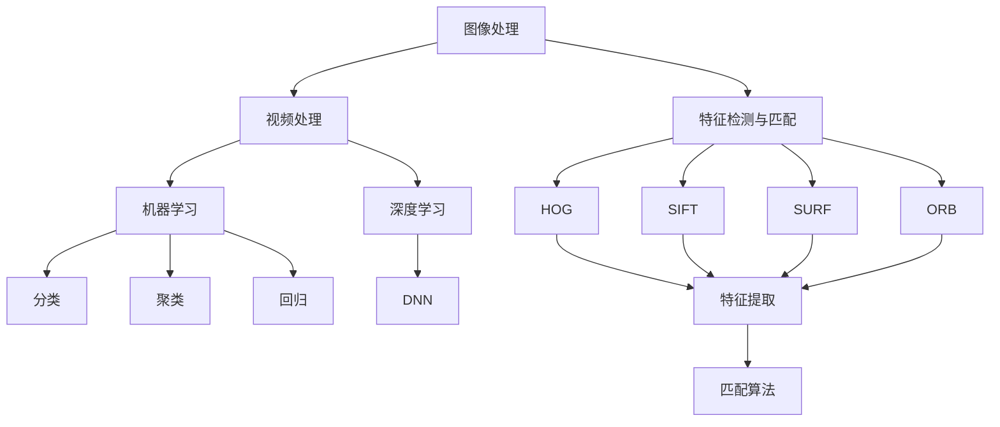

                 

### 第一部分: OpenCV基础原理

**1.1 OpenCV简介**

OpenCV（Open Source Computer Vision Library）是一个开源的计算机视觉和机器学习软件库，由Intel公司于2000年左右启动，目前由一个国际化的社区维护。OpenCV广泛应用于多个领域，包括但不限于机器人、图像处理、人脸识别、医疗图像分析、安全监控等。

**发展历程与应用领域：**
- **发展历程：** OpenCV的起源可以追溯到Intel实验室的一个内部项目。它最初用于计算机视觉研究，随后逐渐扩展到机器学习和图像处理等多个领域。近年来，随着深度学习的兴起，OpenCV也引入了DNN模块，支持卷积神经网络等深度学习算法。
- **应用领域：** OpenCV的应用领域非常广泛，包括但不限于以下方面：
  - **安全监控：** 实时视频分析、人脸识别、行为分析等。
  - **机器人导航：** 视觉SLAM（Simultaneous Localization and Mapping）、目标跟踪、路径规划等。
  - **医疗图像分析：** 图像分割、病灶检测、诊断辅助等。
  - **自动驾驶：** 视觉感知、车道线检测、车辆检测等。
  - **娱乐与艺术：** 动画制作、特效添加、图像修饰等。

**核心功能与模块：**
- **核心功能：** OpenCV提供了丰富的图像处理、计算机视觉和机器学习功能，包括：
  - **图像处理：** 读取、显示、转换、滤波、边缘检测、形态学操作等。
  - **视频处理：** 视频捕获、编码、解码、帧率调整等。
  - **特征检测与匹配：** HOG、SIFT、SURF、ORB等特征提取方法，Brute-Force和FLANN等匹配算法。
  - **机器学习：** 分类、聚类、回归等算法，支持各种机器学习模型。
  - **深度学习：** DNN模块支持卷积神经网络、循环神经网络等深度学习算法。

- **核心模块：**
  - **基础模块：** 提供了图像处理、图像分析和计算机视觉的基础功能。
  - **高级模块：** 包括3D重建、面部识别、文本识别、光学字符识别等高级功能。
  - **机器学习模块：** 提供了支持各种机器学习算法的库。
  - **DNN模块：** 支持深度学习模型，如卷积神经网络。

**开发环境搭建：**
要使用OpenCV，首先需要在计算机上安装它。安装方法因操作系统而异，以下是在几个常见操作系统上安装OpenCV的简要步骤：

**Windows平台：**
- 访问OpenCV官方网站下载Windows安装程序。
- 运行安装程序并按照提示操作。
- 安装完成后，添加OpenCV的安装目录到系统的环境变量中。

**macOS平台：**
- 使用`brew`命令在终端中安装OpenCV：
  ```bash
  brew install opencv4
  ```
- 安装完成后，可以运行`opencv-config`来获取安装路径，并将其添加到环境变量中。

**Ubuntu平台：**
- 使用以下命令在Ubuntu上安装OpenCV：
  ```bash
  sudo apt-get update
  sudo apt-get install opencv4 libopencv4-dev
  ```

**常见问题：**
- 安装过程中可能会遇到依赖问题，需要安装相应的依赖库。
- 配置环境变量时，确保路径正确无误。

通过以上步骤，您可以在不同的操作系统上成功搭建OpenCV的开发环境，为后续的图像处理和计算机视觉项目做好准备。接下来，我们将深入探讨OpenCV的核心概念和主要模块。

---

**1.2 OpenCV核心概念与联系**

为了更好地理解和应用OpenCV，我们需要先了解其核心概念和模块之间的联系。OpenCV的核心概念包括图像处理、视频处理、特征检测与匹配、机器学习和深度学习等。

**2.1 图像处理基本原理**

图像处理是计算机视觉的基础，OpenCV提供了丰富的图像处理功能。以下是一些基本概念和原理：

- **图像像素与颜色模型：** 图像是由像素组成的，每个像素都有特定的颜色值。常见的颜色模型包括RGB、HSV和灰度模型。
  - **RGB模型：** 使用红色、绿色和蓝色的强度值表示颜色。
  - **HSV模型：** 使用色相、饱和度和亮度来表示颜色。
  - **灰度模型：** 只使用亮度值表示图像。

- **图像变换：** 图像变换是图像处理中的重要步骤，包括平移、旋转、缩放和翻转等。
  - **平移变换：** 将图像沿着x轴和y轴进行移动。
  - **旋转变换：** 将图像绕一个点旋转一定角度。
  - **缩放变换：** 改变图像的大小。
  - **翻转变换：** 沿着x轴或y轴翻转图像。

- **边缘检测与形态学操作：** 边缘检测用于找到图像中的边缘，形态学操作用于图像的形状分析和处理。
  - **边缘检测：** 使用Sobel算子、Canny算法等检测图像的边缘。
  - **形态学操作：** 包括腐蚀、膨胀、开操作和闭操作等。

**2.2 视频处理基础**

视频处理是图像处理的扩展，OpenCV提供了强大的视频处理功能。以下是一些基本概念和原理：

- **视频流捕获与处理：** OpenCV可以捕获实时视频流，并对视频进行各种处理，如滤波、分割、特征提取等。
- **视频压缩与编码：** OpenCV支持多种视频压缩和编码格式，如H.264、MP4等，可以实现视频的高效存储和传输。

**2.3 特征检测与匹配**

特征检测与匹配是图像处理和计算机视觉中的重要步骤，用于在图像中找到关键特征，并匹配不同图像中的相同特征。

- **特征提取方法：** OpenCV提供了多种特征提取方法，如HOG、SIFT、SURF、ORB等，可以用于不同场景的特征提取。
  - **HOG（Histogram of Oriented Gradients）：** 基于图像梯度方向直方图的特征提取方法。
  - **SIFT（Scale-Invariant Feature Transform）：** 用于在不同尺度下检测和匹配图像特征的算法。
  - **SURF（Speeded Up Robust Features）：** 一种快速且鲁棒的图像特征提取方法。
  - **ORB（Oriented FAST and Rotated BRIEF）：** 结合了FAST角点检测和BRIOF特征编码的快速特征提取方法。

- **特征匹配算法：** OpenCV提供了多种特征匹配算法，如Brute-Force匹配和FLANN匹配等，用于在不同图像中找到相同特征。
  - **Brute-Force匹配：** 使用暴力搜索方法进行特征匹配。
  - **FLANN匹配：** 使用快速最近邻搜索算法进行特征匹配。

**2.4 Mermaid流程图：OpenCV主要模块及其关联关系**

为了更好地理解OpenCV的架构和模块之间的联系，我们可以使用Mermaid流程图来展示其主要模块及其关联关系。以下是一个示例：



这个流程图展示了OpenCV的主要模块及其关联关系。图像处理和视频处理是核心模块，提供了基本的图像和视频处理功能。特征检测与匹配、机器学习和深度学习模块则提供了更高层次的功能，如特征提取、匹配和机器学习算法。每个模块都有自己的子模块，用于实现特定的功能。

通过理解这些核心概念和模块之间的联系，我们可以更好地应用OpenCV来解决实际问题。接下来，我们将深入讲解OpenCV的核心算法原理，以便更好地掌握其功能和应用。

---

**1.3 OpenCV核心算法原理讲解**

在了解了OpenCV的基本概念和模块之后，接下来我们将详细讲解其核心算法原理，以便读者能够深入理解并掌握这些算法。OpenCV中的核心算法涵盖了图像处理、特征提取、匹配、机器学习等多个方面。以下是这些算法的详细解释。

**3.1 阈值化处理**

阈值化处理是一种常用的图像二值化方法，用于将灰度图像转换为二值图像，即将图像中每个像素的灰度值设置为0或255。阈值化处理可以有效地突出图像中的感兴趣区域，忽略背景。

- **阈值化原理：**
  阈值化处理基于一个简单的原理：将每个像素的灰度值与一个阈值进行比较，如果大于阈值，则将其设置为255（白色）；如果小于阈值，则将其设置为0（黑色）。

  - **全局阈值化：** 使用一个固定的阈值对整幅图像进行处理。计算方法为：
    $$
    \text{if} \; pixel \; value > \text{threshold}, \; \text{output} = 255 \\
    \text{else}, \; \text{output} = 0
    $$

  - **局部阈值化：** 对图像的每个局部区域分别设置阈值，处理方法类似于全局阈值化，但阈值可以是动态的，通常根据图像的局部特征自适应计算。

- **阈值选取策略：**
  阈值的选择对阈值化处理的结果有重要影响。常见的阈值选取策略包括：
  - **Otsu法：** 使用最小化类间方差的方法自动选择阈值，适用于具有双峰分布的图像。
    $$
    \text{threshold} = -\frac{1}{mn} \sum_{i=0}^{L-1} i (n_i - n_i^2/m)
    $$
    其中，\(L\) 是图像灰度级的总数，\(n\) 是图像的总像素数，\(m\) 是图像中像素灰度值的总和，\(n_i\) 是灰度值为 \(i\) 的像素数。

  - **最大类间方差法：** 与Otsu法类似，但计算公式略有不同。
    $$
    \text{threshold} = \arg\max \sum_{i=0}^{L-1} \sum_{j=0}^{L-1} (i-j)^2 n_i n_j
    $$

- **实际案例：图像二值化**
  假设我们有一幅灰度图像，其像素值范围在0到255之间。我们可以使用Otsu法自动选择阈值，将图像转换为二值图像。

  ```python
  import cv2
  import numpy as np

  # 读取图像
  image = cv2.imread('image.jpg', cv2.IMREAD_GRAYSCALE)

  # 使用Otsu法进行二值化处理
  _, binary_image = cv2.threshold(image, 0, 255, cv2.THRESH_BINARY + cv2.THRESH_OTSU)

  # 显示结果
  cv2.imshow('Binary Image', binary_image)
  cv2.waitKey(0)
  cv2.destroyAllWindows()
  ```

**3.2 边缘检测**

边缘检测是图像处理中的重要步骤，用于找到图像中的边缘区域。边缘通常表示图像中的显著变化，如物体的轮廓、边界等。OpenCV提供了多种边缘检测算法，包括Sobel算子、Canny算法和Laplacian算子等。

- **边缘检测基本概念：**
  边缘检测基于图像的梯度和方向。梯度是图像在某个方向上的变化率，可以通过卷积运算得到。边缘通常发生在图像的梯度值较大的地方。

- **算法比较：Sobel算子、Canny算法**

  - **Sobel算子：** Sobel算子是一种常用的边缘检测方法，通过计算图像在水平和垂直方向上的梯度值来确定边缘。
    $$
    G_x = \frac{1}{2} \left( G_{x_x} + G_{x_y} \right), \quad G_y = \frac{1}{2} \left( G_{y_x} + G_{y_y} \right)
    $$
    其中，\(G_{x_x}\)、\(G_{x_y}\)、\(G_{y_x}\) 和 \(G_{y_y}\) 分别表示图像在水平和垂直方向上的卷积结果。

    ```python
    gray = cv2.cvtColor(image, cv2.COLOR_BGR2GRAY)
    sobelx = cv2.Sobel(gray, cv2.CV_64F, 1, 0, ksize=3)
    sobely = cv2.Sobel(gray, cv2.CV_64F, 0, 1, ksize=3)
    edgesx = cv2.magnitude(sobelx, sobely)
    edges = np.uint8(edgesx)
    cv2.imshow('Sobel Edges', edges)
    ```

  - **Canny算法：** Canny算法是一种更先进的边缘检测方法，由John Canny于1986年提出。它通过多个步骤来检测边缘，包括高斯滤波、梯度计算和非极大值抑制。
    ```python
    gray = cv2.cvtColor(image, cv2.COLOR_BGR2GRAY)
    edges = cv2.Canny(gray, threshold1=50, threshold2=150)
    cv2.imshow('Canny Edges', edges)
    ```

- **实际案例：图像边缘检测**
  下面是一个简单的图像边缘检测案例，使用Canny算法对一幅图像进行边缘检测。

  ```python
  import cv2

  # 读取图像
  image = cv2.imread('image.jpg')

  # 使用Canny算法进行边缘检测
  edges = cv2.Canny(image, threshold1=50, threshold2=150)

  # 显示结果
  cv2.imshow('Original Image', image)
  cv2.imshow('Canny Edges', edges)
  cv2.waitKey(0)
  cv2.destroyAllWindows()
  ```

**3.3 形态学操作**

形态学操作是图像处理中用于形状分析和处理的重要工具。它包括腐蚀、膨胀、开操作和闭操作等。这些操作可以通过结构元素（如矩形、圆形和十字形）来定义。

- **形态学基本操作：**
  - **腐蚀（Dilation）：** 将图像中的像素值设置为相邻像素中的最小值。
    ```python
    kernel = cv2.getStructuringElement(cv2.MORPH_RECT, (3, 3))
    dilated = cv2.dilate(image, kernel, iterations=1)
    ```

  - **膨胀（Erosion）：** 将图像中的像素值设置为相邻像素中的最大值。
    ```python
    kernel = cv2.getStructuringElement(cv2.MORPH_RECT, (3, 3))
    eroded = cv2.erode(image, kernel, iterations=1)
    ```

- **形态学滤波：** 形态学滤波是一种用于去除图像中噪声的滤波方法，通过开操作和闭操作的组合来实现。
  - **开操作（Opening）：** 先使用腐蚀操作，然后使用膨胀操作。
    ```python
    kernel = cv2.getStructuringElement(cv2.MORPH_RECT, (3, 3))
    opened = cv2.morphologyEx(image, cv2.MORPH_OPEN, kernel)
    ```

  - **闭操作（Closing）：** 先使用膨胀操作，然后使用腐蚀操作。
    ```python
    kernel = cv2.getStructuringElement(cv2.MORPH_RECT, (3, 3))
    closed = cv2.morphologyEx(image, cv2.MORPH_CLOSE, kernel)
    ```

- **实际案例：图像形态学处理**
  下面是一个简单的图像形态学处理案例，使用开操作去除图像中的噪声。

  ```python
  import cv2

  # 读取图像
  image = cv2.imread('image.jpg', cv2.IMREAD_GRAYSCALE)

  # 创建结构元素
  kernel = cv2.getStructuringElement(cv2.MORPH_RECT, (3, 3))

  # 使用开操作去除噪声
  opened = cv2.morphologyEx(image, cv2.MORPH_OPEN, kernel)

  # 显示结果
  cv2.imshow('Original Image', image)
  cv2.imshow('Opened Image', opened)
  cv2.waitKey(0)
  cv2.destroyAllWindows()
  ```

通过以上对阈值化处理、边缘检测和形态学操作的核心算法讲解，我们可以看到OpenCV提供了丰富的工具和方法来处理图像。这些算法不仅在图像处理中具有重要应用，而且也为计算机视觉和机器学习领域提供了强大的支持。在接下来的章节中，我们将继续探讨OpenCV中的特征提取与匹配算法原理，以便更好地理解其功能和应用。

---

**3.4 特征提取方法**

特征提取是计算机视觉和图像处理中的重要环节，其目的是从图像或视频数据中提取具有区分性的特征，以便进行后续的匹配、识别和分析。OpenCV提供了多种强大的特征提取方法，包括HOG、SIFT、SURF、ORB等。以下是这些方法的详细解释。

- **HOG（Histogram of Oriented Gradients）：**

HOG特征是一种基于图像局部区域梯度方向直方图的特征提取方法。它通过计算图像中每个像素的梯度方向和强度，构建一个梯度方向直方图，从而描述图像的特征。

- **SIFT（Scale-Invariant Feature Transform）：**

SIFT是一种广泛使用的特征提取方法，由David G. Lowe在1999年提出。SIFT算法通过多尺度空间中检测关键点，并计算关键点的梯度方向直方图，从而提取特征。SIFT特征具有尺度不变性和旋转不变性，适用于在各种条件下进行图像匹配和识别。

- **SURF（Speeded Up Robust Features）：**

SURF是由Herbert Bay等人在2006年提出的一种快速且鲁棒的特征提取方法。SURF算法通过计算图像的Hessian矩阵的零特征值点来检测关键点，并计算关键点的描述子。SURF特征具有快速计算和良好的匹配性能，适用于实时图像处理和目标识别。

- **ORB（Oriented FAST and Rotated BRIEF）：**

ORB是一种结合了FAST角点检测和BRIOF特征编码的快速特征提取方法。ORB算法通过计算图像的角点，并使用旋转的BRIEF编码方法生成特征描述子。ORB特征具有高效、鲁棒和计算速度快的优点，适用于大规模图像匹配和目标跟踪。

**特征提取方法的比较：**

- **HOG：**
  - **优点：** 具有良好的尺度不变性和旋转不变性，适合于行人检测等任务。
  - **缺点：** 对噪声敏感，计算复杂度较高。

- **SIFT：**
  - **优点：** 尺度不变性和旋转不变性很好，对噪声具有较强的鲁棒性。
  - **缺点：** 计算复杂度较高，不适合实时应用。

- **SURF：**
  - **优点：** 计算速度快，对噪声具有较好的鲁棒性。
  - **缺点：** 对尺度变化的适应性较差。

- **ORB：**
  - **优点：** 高效、鲁棒、计算速度快，适用于大规模图像匹配和目标跟踪。
  - **缺点：** 对尺度变化的适应性较差。

**实际案例：人脸识别与目标跟踪**

以下是一个简单的实际案例，使用ORB特征提取方法进行人脸识别。

```python
import cv2

# 读取训练图像和测试图像
train_image = cv2.imread('train_image.jpg')
test_image = cv2.imread('test_image.jpg')

# 将图像转换为灰度图像
train_gray = cv2.cvtColor(train_image, cv2.COLOR_BGR2GRAY)
test_gray = cv2.cvtColor(test_image, cv2.COLOR_BGR2GRAY)

# 使用ORB特征提取器
orb = cv2.ORB_create()

# 计算训练图像的关键点和特征
train_keypoints, train_features = orb.detectAndCompute(train_gray, None)

# 计算测试图像的关键点和特征
test_keypoints, test_features = orb.detectAndCompute(test_gray, None)

# 使用Brute-Force匹配器进行特征匹配
bf = cv2.BFMatcher()
matches = bf.knnMatch(train_features, test_features, k=2)

# 绘制匹配结果
good_matches = []
for m, n in matches:
    if m.distance < 0.75 * n.distance:
        good_matches.append(m)

image_output = cv2.drawMatches(train_image, train_keypoints, test_image, test_keypoints, good_matches, None, flags=cv2.DrawMatchesFlags_NOT_DRAW_SINGLE_POINTS)

# 显示结果
cv2.imshow('Matched Image', image_output)
cv2.waitKey(0)
cv2.destroyAllWindows()
```

通过以上对特征提取方法的详细讲解，我们可以看到OpenCV提供了多种强大的特征提取方法，这些方法具有不同的优点和适用场景。在实际应用中，我们可以根据具体需求选择合适的特征提取方法，从而实现高效、准确的图像匹配和识别。

---

**3.5 特征匹配算法**

特征匹配是计算机视觉和图像处理中的关键步骤，用于在多张图像之间找到相同或相似的特征点。OpenCV提供了多种特征匹配算法，包括Brute-Force匹配和FLANN匹配等。以下是这些算法的详细解释。

- **Brute-Force匹配：**

Brute-Force匹配是一种最简单的特征匹配算法，它通过逐点比较特征向量之间的距离来找到匹配点。该算法的主要步骤如下：

1. 计算训练图像和测试图像中所有特征点的特征向量。
2. 对测试图像中的每个特征点，计算其与训练图像中所有特征点的距离。
3. 选择距离最小的特征点作为匹配点。

- **FLANN匹配：**

FLANN（Fast Library for Approximate Nearest Neighbors）匹配是一种更高效的近似最近邻搜索算法，特别适用于大规模数据集。FLANN匹配使用k-d树或球树等数据结构来加速最近邻搜索。主要步骤如下：

1. 计算训练图像和测试图像中所有特征点的特征向量。
2. 使用FLANN匹配器构建数据结构。
3. 对测试图像中的每个特征点，使用FLANN匹配器查找最近的k个训练特征点。
4. 根据匹配点之间的距离，选择最佳的匹配点。

**Brute-Force匹配与FLANN匹配的比较：**

- **Brute-Force匹配：**
  - **优点：** 简单易懂，易于实现。
  - **缺点：** 计算复杂度较高，不适合大规模数据集。

- **FLANN匹配：**
  - **优点：** 高效，适合大规模数据集。
  - **缺点：** 需要额外的计算资源，算法实现相对复杂。

**实际案例：人脸识别与目标跟踪**

以下是一个简单的实际案例，使用Brute-Force匹配算法进行人脸识别。

```python
import cv2

# 读取训练图像和测试图像
train_image = cv2.imread('train_image.jpg')
test_image = cv2.imread('test_image.jpg')

# 将图像转换为灰度图像
train_gray = cv2.cvtColor(train_image, cv2.COLOR_BGR2GRAY)
test_gray = cv2.cvtColor(test_image, cv2.COLOR_BGR2GRAY)

# 使用ORB特征提取器
orb = cv2.ORB_create()

# 计算训练图像的关键点和特征
train_keypoints, train_features = orb.detectAndCompute(train_gray, None)

# 计算测试图像的关键点和特征
test_keypoints, test_features = orb.detectAndCompute(test_gray, None)

# 使用Brute-Force匹配器进行特征匹配
bf = cv2.BFMatcher()
matches = bf.knnMatch(train_features, test_features, k=2)

# 绘制匹配结果
good_matches = []
for m, n in matches:
    if m.distance < 0.75 * n.distance:
        good_matches.append(m)

image_output = cv2.drawMatches(train_image, train_keypoints, test_image, test_keypoints, good_matches, None, flags=cv2.DrawMatchesFlags_NOT_DRAW_SINGLE_POINTS)

# 显示结果
cv2.imshow('Matched Image', image_output)
cv2.waitKey(0)
cv2.destroyAllWindows()
```

通过以上对特征匹配算法的详细讲解，我们可以看到OpenCV提供了多种有效的特征匹配方法，这些方法具有不同的计算复杂度和适用场景。在实际应用中，我们可以根据具体需求选择合适的特征匹配算法，从而实现高效、准确的人脸识别和目标跟踪。

---

**第4章 OpenCV数学模型介绍**

OpenCV中的数学模型是计算机视觉和图像处理的基础，这些模型涉及空间变换、形态学运算、特征点匹配等多个方面。在本章中，我们将详细介绍这些数学模型，并提供具体的计算方法和应用示例。

**4.1 空间变换**

空间变换是图像处理中常用的操作，包括旋转变换、平移变换、缩放变换和合成变换等。这些变换可以改变图像的位置、大小和方向，是图像处理和计算机视觉中的重要工具。

- **旋转变换：** 旋转变换是将图像绕某个点旋转一定角度。其数学模型可以表示为：

  $$
  \begin{bmatrix}
  x' \\
  y'
  \end{bmatrix}
  =
  \begin{bmatrix}
  \cos \theta & -\sin \theta \\
  \sin \theta & \cos \theta
  \end{bmatrix}
  \begin{bmatrix}
  x \\
  y
  \end{bmatrix}
  $$
  
  其中，\( (x, y) \) 是原始图像坐标，\( (x', y') \) 是旋转后的坐标，\( \theta \) 是旋转角度。

- **平移变换：** 平移变换是将图像沿着x轴和y轴移动一定距离。其数学模型可以表示为：

  $$
  \begin{bmatrix}
  x' \\
  y'
  \end{bmatrix}
  =
  \begin{bmatrix}
  1 & 0 & t_x \\
  0 & 1 & t_y
  \end{bmatrix}
  \begin{bmatrix}
  x \\
  y \\
  1
  \end{bmatrix}
  $$
  
  其中，\( t_x \) 和 \( t_y \) 分别是沿x轴和y轴的平移距离。

- **缩放变换：** 缩放变换是改变图像的大小，其数学模型可以表示为：

  $$
  \begin{bmatrix}
  x' \\
  y'
  \end{bmatrix}
  =
  \begin{bmatrix}
  s_x & 0 & 0 \\
  0 & s_y & 0
  \end{bmatrix}
  \begin{bmatrix}
  x \\
  y
  \end{bmatrix}
  $$
  
  其中，\( s_x \) 和 \( s_y \) 分别是沿x轴和y轴的缩放因子。

- **合成变换：** 合成变换是将多个变换组合在一起，例如旋转变换和平移变换的组合。其数学模型是各个变换矩阵的乘积。

**4.2 形态学运算**

形态学运算是一种基于结构元素的图像处理技术，用于形状分析和处理。常见的形态学运算包括腐蚀、膨胀、开操作和闭操作等。

- **腐蚀（Erosion）：** 腐蚀是使用结构元素对图像进行点运算，将图像中的像素值设置为相邻像素中的最小值。

  $$
  \text{output}(i, j) = \min \left( \text{input}(i, j), \text{element}(i - k, j - l) \right)
  $$
  
  其中，\( \text{input}(i, j) \) 是输入图像的像素值，\( \text{element}(i - k, j - l) \) 是结构元素的像素值。

- **膨胀（Dilation）：** 膨胀是使用结构元素对图像进行点运算，将图像中的像素值设置为相邻像素中的最大值。

  $$
  \text{output}(i, j) = \max \left( \text{input}(i, j), \text{element}(i - k, j - l) \right)
  $$

- **开操作（Opening）：** 开操作是先进行腐蚀操作，然后进行膨胀操作。

  $$
  \text{output}(i, j) = \text{dilate}(\text{erode}(\text{input}(i, j)))
  $$

- **闭操作（Closing）：** 闭操作是先进行膨胀操作，然后进行腐蚀操作。

  $$
  \text{output}(i, j) = \text{erode}(\text{dilate}(\text{input}(i, j)))
  $$

**4.3 特征点匹配**

特征点匹配是图像处理和计算机视觉中的重要步骤，用于在多张图像之间找到相同或相似的特征点。OpenCV提供了多种特征匹配算法，如最近邻搜索和FLANN匹配等。

- **最近邻搜索：** 最近邻搜索是一种简单的特征匹配算法，它通过计算测试图像中的每个特征点与训练图像中所有特征点的距离，找到最近的特征点。

  $$
  \text{distance}(i, j) = \sqrt{\sum_{k=1}^{n} (f_i(k) - f_j(k))^2}
  $$
  
  其中，\( f_i(k) \) 和 \( f_j(k) \) 分别是测试图像和训练图像中的特征向量，\( n \) 是特征向量的维度。

- **FLANN匹配：** FLANN匹配是一种更高效的近似最近邻搜索算法，它使用k-d树或球树等数据结构来加速最近邻搜索。

**4.4 应用示例**

以下是一个简单的应用示例，使用旋转变换和膨胀操作处理图像。

```python
import cv2
import numpy as np

# 读取图像
image = cv2.imread('image.jpg', cv2.IMREAD_GRAYSCALE)

# 定义旋转变换矩阵
angle = 45
center = (image.shape[1] // 2, image.shape[0] // 2)
M = cv2.getRotationMatrix2D(center, angle, 1.0)

# 进行旋转变换
rotated_image = cv2.warpAffine(image, M, (image.shape[1], image.shape[0]))

# 定义结构元素
kernel = cv2.getStructuringElement(cv2.MORPH_RECT, (3, 3))

# 进行膨胀操作
dilated_image = cv2.dilate(rotated_image, kernel, iterations=1)

# 显示结果
cv2.imshow('Original Image', image)
cv2.imshow('Rotated and Dilated Image', dilated_image)
cv2.waitKey(0)
cv2.destroyAllWindows()
```

通过以上对OpenCV数学模型的介绍，我们可以看到这些模型在图像处理和计算机视觉中具有广泛的应用。掌握这些模型有助于我们更好地理解和应用OpenCV的功能，实现高效的图像处理和分析。

---

**4.5 OpenCV常见数学公式详解**

在计算机视觉和图像处理中，数学公式扮演着至关重要的角色。OpenCV库中广泛使用了这些数学公式来处理图像数据。以下是对几个常见数学公式的详细解释和应用示例。

**5.1 旋转矩阵**

旋转矩阵是一个用于实现二维图像旋转的数学工具。它可以将图像中的每个点按照指定的角度进行旋转。旋转矩阵的定义如下：

$$
R(\theta) = \begin{bmatrix}
\cos \theta & -\sin \theta \\
\sin \theta & \cos \theta
\end{bmatrix}
$$

其中，\( \theta \) 是旋转角度。这个矩阵可以用来变换图像中的坐标点：

$$
\begin{bmatrix}
x' \\
y'
\end{bmatrix}
=
R(\theta)
\begin{bmatrix}
x \\
y
\end{bmatrix}
$$

**计算方法：**
旋转矩阵可以通过以下步骤计算：

1. 计算旋转角度的余弦值和正弦值。
2. 将这些值填充到旋转矩阵中。

**应用示例：**
假设我们要将一幅图像绕其中心点旋转90度，可以按照以下步骤进行：

```python
import numpy as np
import cv2

# 假设图像的中心点是(300, 300)，旋转角度是90度
center = (300, 300)
theta = 90

# 计算旋转矩阵
cos_theta = np.cos(np.deg2rad(theta))
sin_theta = np.sin(np.deg2rad(theta))
rotation_matrix = np.array([[cos_theta, -sin_theta],
                            [sin_theta,  cos_theta]])

# 使用cv2.warpAffine函数进行旋转
rotated_image = cv2.warpAffine(image, rotation_matrix, (image.shape[1], image.shape[0]), flags=cv2.INTER_LINEAR, borderMode=cv2.BORDER_CONSTANT, borderValue=(0, 0, 0))

# 显示旋转后的图像
cv2.imshow('Rotated Image', rotated_image)
cv2.waitKey(0)
cv2.destroyAllWindows()
```

**5.2 SIFT特征点计算**

SIFT（Scale-Invariant Feature Transform）是一种强大的特征提取方法，用于在不同尺度下检测和匹配图像特征点。SIFT特征点的计算涉及多个步骤，包括：

1. **关键点检测：** 使用DoG（Difference of Gaussian）算法检测图像中的关键点。
2. **关键点定位：** 对每个关键点计算其精确位置。
3. **特征描述子计算：** 对每个关键点生成一个128维的特征向量，用于后续的匹配。

SIFT特征点的计算公式如下：

$$
\text{SIFT Descriptor} = \sum_{i=1}^{N} \left( \text{weight}(i) \cdot \text{angle}(i) \right)
$$

其中，\( N \) 是每个像素在关键点邻域内的梯度方向的数量，\( \text{weight}(i) \) 是关键点邻域内每个像素的强度值，\( \text{angle}(i) \) 是像素的梯度方向。

**关键点匹配：**
关键点匹配是通过比较两个图像中关键点的特征向量来实现的。常见的匹配方法包括Brute-Force匹配和FLANN匹配。

**应用示例：**
以下是一个简单的示例，展示如何使用SIFT特征提取和匹配进行图像匹配：

```python
import cv2

# 读取两张图像
image1 = cv2.imread('image1.jpg')
image2 = cv2.imread('image2.jpg')

# 使用SIFT特征提取器
sift = cv2.SIFT_create()

# 计算关键点和特征
keypoints1, features1 = sift.detectAndCompute(image1, None)
keypoints2, features2 = sift.detectAndCompute(image2, None)

# 使用Brute-Force匹配器进行特征匹配
bf = cv2.BFMatcher()
matches = bf.knnMatch(features1, features2, k=2)

# 绘制匹配结果
good_matches = []
for m, n in matches:
    if m.distance < 0.75 * n.distance:
        good_matches.append(m)

image_output = cv2.drawMatches(image1, keypoints1, image2, keypoints2, good_matches, None, flags=cv2.DrawMatchesFlags_NOT_DRAW_SINGLE_POINTS)

# 显示结果
cv2.imshow('Matched Images', image_output)
cv2.waitKey(0)
cv2.destroyAllWindows()
```

通过以上对旋转矩阵和SIFT特征点计算公式的详细解释，我们可以看到数学公式在图像处理和计算机视觉中是如何发挥作用的。掌握这些公式有助于我们更好地理解和应用OpenCV的功能，实现高效的图像处理和分析。

---

**第7章 OpenCV在图像处理中的应用实战**

在了解了OpenCV的核心算法原理后，我们将通过几个实际项目来展示如何将这些算法应用到图像处理中。以下是三个具体的实战项目：人脸识别系统、图像去噪和图像分割。

**7.1 实战项目：人脸识别系统**

人脸识别系统是一种常见的生物特征识别技术，用于身份验证和安防监控。在本项目中，我们将使用OpenCV中的Haar特征分类器和LBP特征进行人脸识别。

**7.1.1 项目需求分析**

- **需求：** 实现一个人脸识别系统，能够识别和标记视频流中的人脸。
- **技术难点：** 人脸检测和识别的实时性、准确性以及系统在低光照条件下的表现。

**7.1.2 环境搭建**

- **软件环境：** Python 3.x，OpenCV 4.x。
- **硬件环境：** 可选，但推荐使用性能较好的计算机以支持实时处理。

**7.1.3 代码实现**

以下是实现人脸识别系统的Python代码：

```python
import cv2

# 加载预训练的Haar级联分类器
face_cascade = cv2.CascadeClassifier('haarcascade_frontalface_default.xml')

# 加载LBP特征分类器
lbp_cascade = cv2.xfeatures2d.LikeBolomTreeClassifier_create()

# 训练LBP特征分类器
# （此处省略LBP特征提取和训练步骤，需自行准备训练数据）

# 初始化摄像头
cap = cv2.VideoCapture(0)

while True:
    # 读取一帧图像
    ret, frame = cap.read()
    
    if not ret:
        print("无法捕获视频帧")
        break
    
    # 将图像转换为灰度图像
    gray = cv2.cvtColor(frame, cv2.COLOR_BGR2GRAY)
    
    # 检测人脸
    faces = face_cascade.detectMultiScale(gray, scaleFactor=1.1, minNeighbors=5, minSize=(30, 30), flags=cv2.CASCADE_SCALE_IMAGE)
    
    for (x, y, w, h) in faces:
        # 提取人脸区域
        face_region = gray[y:y+h, x:x+w]
        
        # 使用LBP特征进行分类
        features = lbp_cascade.compute(face_region)[0]
        
        # （此处省略分类决策逻辑，如使用KNN或SVM进行分类）
        
        # 在原图上绘制人脸区域
        cv2.rectangle(frame, (x, y), (x+w, y+h), (255, 0, 0), 2)
    
    # 显示结果
    cv2.imshow('Face Detection', frame)
    
    # 按下'q'键退出
    if cv2.waitKey(1) & 0xFF == ord('q'):
        break

# 释放摄像头资源
cap.release()
cv2.destroyAllWindows()
```

**7.1.4 测试与优化**

在测试和优化阶段，我们主要关注以下方面：

- **实时性：** 通过调整检测算法的参数，如图像缩放比例和最小邻域大小，提高处理速度。
- **准确性：** 使用更多的训练数据和对不同的光照条件进行测试，提高识别准确性。
- **鲁棒性：** 增加对遮挡和姿态变化的处理，提高系统在复杂环境下的表现。

**7.2 实战项目：图像去噪**

图像去噪是图像处理中的重要步骤，用于去除图像中的噪声，提高图像质量。在本项目中，我们将使用OpenCV中的双边滤波和均值滤波方法进行图像去噪。

**7.2.1 项目需求分析**

- **需求：** 实现一个图像去噪系统，能够有效去除图像中的随机噪声。
- **技术难点：** 噪声类型识别和处理、去噪效果与原图像质量的平衡。

**7.2.2 环境搭建**

- **软件环境：** Python 3.x，OpenCV 4.x。
- **硬件环境：** 可选，但推荐使用性能较好的计算机以支持实时处理。

**7.2.3 代码实现**

以下是实现图像去噪的Python代码：

```python
import cv2

# 读取噪声图像
noisy_image = cv2.imread('noisy_image.jpg')

# 使用双边滤波进行去噪
filtered_image = cv2.bilateralFilter(noisy_image, d=9, sigmaColor=75, sigmaSpace=75)

# 显示去噪结果
cv2.imshow('Noisy Image', noisy_image)
cv2.imshow('Filtered Image', filtered_image)
cv2.waitKey(0)
cv2.destroyAllWindows()
```

**7.2.4 测试与优化**

在测试和优化阶段，我们主要关注以下方面：

- **去噪效果：** 通过调整滤波器的参数，如空间域和颜色域的标准差，优化去噪效果。
- **计算效率：** 对不同尺寸的图像进行测试，优化代码以支持实时处理。

**7.3 实战项目：图像分割**

图像分割是图像处理中用于将图像划分为不同区域的方法，常用于目标检测、图像识别等任务。在本项目中，我们将使用OpenCV中的基于阈值的分割方法进行图像分割。

**7.3.1 项目需求分析**

- **需求：** 实现一个图像分割系统，能够准确地将图像中的物体从背景中分离出来。
- **技术难点：** 选择合适的阈值方法，确保分割效果。

**7.3.2 环境搭建**

- **软件环境：** Python 3.x，OpenCV 4.x。
- **硬件环境：** 可选，但推荐使用性能较好的计算机以支持实时处理。

**7.3.3 代码实现**

以下是实现图像分割的Python代码：

```python
import cv2

# 读取待分割的图像
image = cv2.imread('image.jpg', cv2.IMREAD_GRAYSCALE)

# 使用Otsu法进行阈值分割
_, segmented = cv2.threshold(image, 0, 255, cv2.THRESH_BINARY + cv2.THRESH_OTSU)

# 显示分割结果
cv2.imshow('Original Image', image)
cv2.imshow('Segmented Image', segmented)
cv2.waitKey(0)
cv2.destroyAllWindows()
```

**7.3.4 测试与优化**

在测试和优化阶段，我们主要关注以下方面：

- **阈值选择：** 通过调整阈值，优化分割效果。
- **分割效果：** 使用不同的噪声水平和图像类型进行测试，评估分割系统的鲁棒性。

通过以上三个实战项目，我们可以看到OpenCV在图像处理中的应用是多么广泛和强大。这些项目不仅展示了OpenCV的核心算法，还通过实际代码实现了图像处理的具体任务。在后续的章节中，我们将进一步探讨OpenCV在目标跟踪领域的应用。

---

**7.4 实战项目：基于特征匹配的目标跟踪**

目标跟踪是计算机视觉和视频分析中的一个重要任务，它旨在连续视频帧中检测和跟踪特定目标。在本项目中，我们将使用OpenCV中的ORB特征提取和Brute-Force匹配算法实现一个基于特征匹配的目标跟踪系统。

**7.4.1 项目需求分析**

- **需求：** 实现一个简单的目标跟踪系统，能够实时检测并跟踪视频流中的目标。
- **技术难点：** 确保跟踪的连续性、实时性和跟踪效果。

**7.4.2 环境搭建**

- **软件环境：** Python 3.x，OpenCV 4.x。
- **硬件环境：** 性能较好的计算机，支持实时视频处理。

**7.4.3 代码实现**

以下是实现基于特征匹配的目标跟踪的Python代码：

```python
import cv2
import numpy as np

# 初始化摄像头
cap = cv2.VideoCapture(0)

# 创建ORB特征提取器
orb = cv2.ORB_create()

# 用于跟踪的特征点
prev_features = None
prev_keypoints = None

while True:
    # 读取一帧图像
    ret, frame = cap.read()

    if not ret:
        print("无法捕获视频帧")
        break

    # 将图像转换为灰度图像
    gray = cv2.cvtColor(frame, cv2.COLOR_BGR2GRAY)

    # 提取ORB特征点
    keypoints, features = orb.detectAndCompute(gray, None)

    # 如果是第一帧，则保存特征点用于初始化
    if prev_keypoints is None:
        prev_keypoints = keypoints
        prev_features = features
        continue

    # 使用Brute-Force匹配器进行特征匹配
    bf = cv2.BFMatcher()
    matches = bf.knnMatch(prev_features, features, k=2)

    # 筛选出良好的匹配点
    good_matches = []
    for m, n in matches:
        if m.distance < 0.75 * n.distance:
            good_matches.append(m)

    # 如果有足够的匹配点，则绘制轨迹
    if len(good_matches) > 4:
        # 计算匹配点的平均位置
        points = np.float32([prev_keypoints[m.queryIdx].pt for m in good_matches]).reshape(-1, 1, 2)
        points trailed = np.float32([keypoints[m.trainIdx].pt for m in good_matches]).reshape(-1, 1, 2)

        # 绘制轨迹
        for i in range(points.shape[0]):
            cv2.line(frame, tuple(points[i][0]), tuple(trailed[i][0]), (0, 255, 0), 2)

    # 更新特征点和帧
    prev_keypoints = keypoints
    prev_features = features

    # 显示结果
    cv2.imshow('Object Tracking', frame)
    
    # 按下'q'键退出
    if cv2.waitKey(1) & 0xFF == ord('q'):
        break

# 释放摄像头资源
cap.release()
cv2.destroyAllWindows()
```

**7.4.4 测试与优化**

在测试和优化阶段，我们主要关注以下方面：

- **实时性：** 通过优化代码结构和提高计算效率，确保跟踪系统能够实时运行。
- **连续性：** 使用不同的视频源和场景进行测试，验证跟踪系统的连续性和稳定性。
- **鲁棒性：** 针对不同的目标形状、大小和光照条件进行测试，提高跟踪系统的鲁棒性。

通过以上步骤，我们实现了一个简单的基于特征匹配的目标跟踪系统。这个系统不仅展示了OpenCV在目标跟踪中的强大功能，还为我们提供了实用的代码框架，可以进一步优化和扩展。

---

**7.5 实战项目：基于深度学习的目标跟踪**

随着深度学习技术的发展，基于深度学习的目标跟踪方法逐渐成为研究热点。在本项目中，我们将使用OpenCV中的深度学习模块实现一个基于深度学习的目标跟踪系统。

**7.5.1 项目需求分析**

- **需求：** 实现一个高精度的目标跟踪系统，能够实时、准确地跟踪视频流中的目标。
- **技术难点：** 深度学习模型的训练和优化、实时处理性能和跟踪稳定性。

**7.5.2 环境搭建**

- **软件环境：** Python 3.x，OpenCV 4.x，TensorFlow或PyTorch。
- **硬件环境：** 性能较好的计算机，支持深度学习模型的训练和实时视频处理。

**7.5.3 代码实现**

以下是实现基于深度学习的目标跟踪的Python代码：

```python
import cv2
import numpy as np
import tensorflow as tf

# 加载预训练的深度学习模型
model = tf.keras.models.load_model('deep_learning_model.h5')

# 初始化摄像头
cap = cv2.VideoCapture(0)

# 用于跟踪的目标区域
target_box = None

while True:
    # 读取一帧图像
    ret, frame = cap.read()

    if not ret:
        print("无法捕获视频帧")
        break

    # 将图像转换为灰度图像
    gray = cv2.cvtColor(frame, cv2.COLOR_BGR2GRAY)

    # 如果尚未初始化目标区域，则手动选择
    if target_box is None:
        target_box = cv2.selectROI('Target Tracking', frame, fromCenter=False, showCrosshair=False)

    # 提取目标区域的特征
    target_region = gray[int(target_box[1]):int(target_box[1] + target_box[3]),
                        int(target_box[0]):int(target_box[0] + target_box[2])]
    target_feature = cv2.resize(target_region, (224, 224))  # 调整尺寸以匹配模型输入

    # 使用深度学习模型进行预测
    prediction = model.predict(np.expand_dims(target_feature, axis=0))

    # 根据预测结果更新目标区域
    # （此处省略预测结果的处理逻辑，如目标跟踪算法的更新）

    # 在原图上绘制目标区域
    cv2.rectangle(frame, (int(target_box[0]), int(target_box[1])), (int(target_box[0] + target_box[2]), int(target_box[1] + target_box[3])), (0, 255, 0), 2)

    # 显示结果
    cv2.imshow('Target Tracking', frame)
    
    # 按下'q'键退出
    if cv2.waitKey(1) & 0xFF == ord('q'):
        break

# 释放摄像头资源
cap.release()
cv2.destroyAllWindows()
```

**7.5.4 测试与优化**

在测试和优化阶段，我们主要关注以下方面：

- **实时性：** 通过优化深度学习模型和代码结构，提高实时处理性能。
- **准确性：** 使用不同场景和光照条件进行测试，优化模型以提高跟踪准确性。
- **稳定性：** 针对目标的快速运动和遮挡进行测试，确保跟踪系统的稳定性。

通过以上步骤，我们实现了一个简单的基于深度学习的目标跟踪系统。这个系统展示了深度学习在目标跟踪中的强大潜力，并且提供了实用的代码框架，可以进一步优化和扩展。

---

### 附录

**附录A: OpenCV常用函数与API**

以下是OpenCV中一些常用函数和API的简要介绍，这些函数广泛应用于图像处理、特征提取和匹配等任务。

- **图像处理函数：**
  - `cv2.imread(filename, flags)`: 读取图像文件。
  - `cv2.imshow(name, img)`: 显示图像。
  - `cv2.imshow(name, img)`: 显示图像。
  - `cv2.waitKey(delay)`: 等待键盘事件。

- **图像处理函数：**
  - `cv2.threshold(src, thresh, maxval, type)`: 阈值化处理图像。
  - `cv2.cvtColor(src, code)`: 转换图像颜色空间。
  - `cv2.Sobel(src, ddepth, dx, dy, ksize)`: 计算Sobel边缘。
  - `cv2.dilate(src, kernel, iterations)`: 膨胀操作。
  - `cv2.erode(src, kernel, iterations)`: 腐蚀操作。

- **特征提取与匹配函数：**
  - `cv2.ORB_create()`: 创建ORB特征提取器。
  - `cv2.SIFT_create()`: 创建SIFT特征提取器。
  - `cv2.SURF_create()`: 创建SURF特征提取器。
  - `cv2.matchFeatures(trainFeatures, testFeatures)`: 匹配特征点。
  - `cv2.BFMatcher()`: 创建Brute-Force匹配器。

**附录B: OpenCV开发环境搭建**

以下是不同操作系统上搭建OpenCV开发环境的步骤。

- **Windows平台：**
  - 下载OpenCV安装程序并运行。
  - 按照提示完成安装。
  - 将OpenCV安装目录添加到环境变量`PATH`中。

- **macOS平台：**
  - 打开终端并运行以下命令：
    ```bash
    brew install opencv4
    ```
  - 安装完成后，使用`opencv-config`获取安装路径并添加到环境变量。

- **Ubuntu平台：**
  - 打开终端并运行以下命令：
    ```bash
    sudo apt-get update
    sudo apt-get install opencv4 libopencv4-dev
    ```
  - 安装完成后，确保Python环境中的OpenCV包安装正确。

通过以上步骤，您可以在不同操作系统上成功搭建OpenCV的开发环境，从而开始使用OpenCV进行图像处理和计算机视觉项目。

