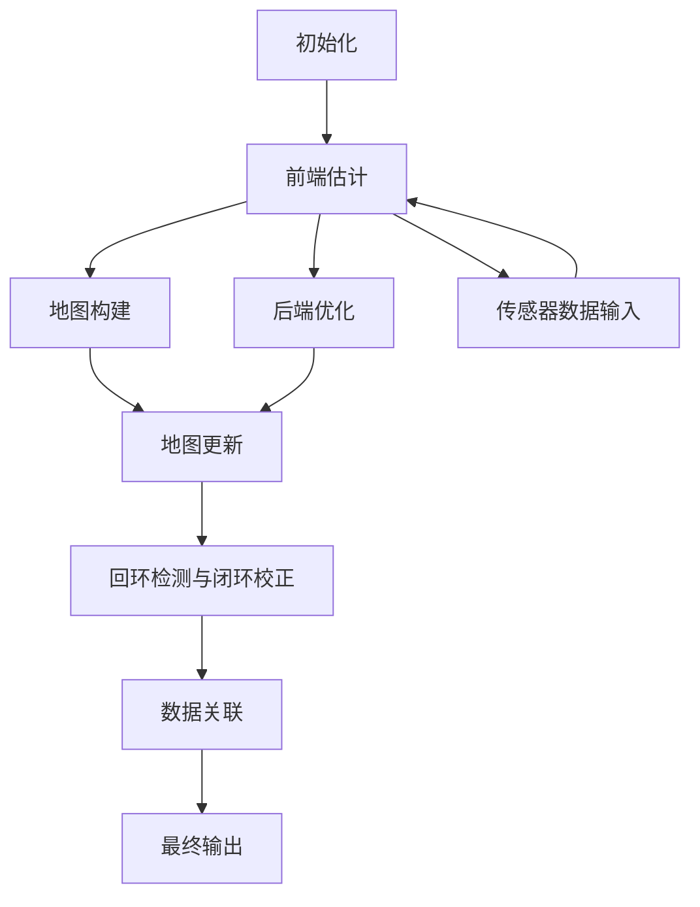

                 

### 《SLAM (Simultaneous Localization and Mapping) 原理与代码实战》Mermaid流程图

为了更好地理解SLAM系统的整体架构和关键组件，我们可以使用Mermaid绘制一个流程图。以下是一个简化的SLAM系统流程图，展示了各个主要模块及其相互关系。



- **初始化（A）**：系统启动时，进行初始化，包括设置初始位姿、初始化地图等。
- **前端估计（B）**：前端估计模块处理实时传感器数据，进行运动估计和初步地图构建。
- **地图构建（C）**：地图构建模块利用前端估计结果，构建和更新地图信息。
- **后端优化（D）**：后端优化模块对前端估计结果进行迭代优化，提高定位和地图构建的精度。
- **地图更新（E）**：地图更新模块持续更新地图信息，以反映环境变化。
- **回环检测与闭环校正（F）**：回环检测模块检测回环，闭环校正模块进行位置修正。
- **数据关联（G）**：数据关联模块确保前后端估计数据的准确匹配。
- **最终输出（H）**：最终输出模块提供位置和地图信息，用于导航或其他应用。

通过这个流程图，我们可以清晰地看到SLAM系统的工作流程和各个模块之间的相互作用。在后续章节中，我们将详细讨论每个模块的实现原理和算法细节。

### 核心关键词

- **SLAM (Simultaneous Localization and Mapping)**
- **视觉SLAM**
- **激光SLAM**
- **前端估计**
- **后端优化**
- **滤波算法**
- **回环检测**
- **地图构建**
- **实时定位**
- **机器人导航**
- **深度学习融合**

### 摘要

本文旨在系统地介绍SLAM（Simultaneous Localization and Mapping）原理与代码实战。首先，我们将介绍SLAM的基本概念、系统组成、挑战和解决方案，并探讨其在现实中的应用场景。接着，我们将深入探讨SLAM的核心算法原理，包括数学模型、几何模型、滤波算法和优化算法。为了更好地理解这些理论，我们将通过伪代码和数学公式进行详细讲解，并提供实际应用中的实例。随后，本文将引导读者进行SLAM项目的实战开发，包括环境搭建、代码实战、调试与优化，并通过一个具体项目案例进行解析。最后，我们将探讨SLAM技术的最新前沿，如深度学习融合、自动驾驶应用和虚拟现实应用等，并总结SLAM常用库与工具，为读者提供进一步学习的资源。通过本文的阅读，读者将能够全面了解SLAM技术，掌握其实际应用，并为未来的研究提供方向。----------------------------------------------------------------

### 第一部分：SLAM基本概念

#### 1.1 SLAM简介

SLAM（Simultaneous Localization and Mapping）是一种计算机视觉和机器人领域的核心技术，其主要目标是同时进行环境和自主系统的定位与地图构建。SLAM技术广泛应用于机器人导航、自动驾驶、虚拟现实、增强现实、无人机等领域，具有广泛的应用前景和重要的研究价值。

**定义与背景**

SLAM的核心问题可以简单描述为：在未知环境中，通过感知设备（如摄像头、激光雷达等）收集数据，同时利用这些数据对自身位置和周围环境进行定位和地图构建。SLAM系统需要解决的问题包括如何在动态环境中保持稳定的定位精度，如何在有限资源下高效地构建和更新地图，以及如何处理传感器噪声和异常情况。

SLAM的背景可以追溯到20世纪90年代，随着计算机视觉、机器学习和传感器技术的快速发展，SLAM逐渐成为计算机科学领域中的一个重要研究方向。早期的研究主要集中在机器人领域，随着技术的不断进步，SLAM的应用逐渐扩展到多个领域，如自动驾驶、虚拟现实和无人机等。

**核心目标**

SLAM的核心目标包括以下几个方面：

1. **定位**：在未知环境中，实时、准确地估计系统（如机器人、无人机等）的位置和姿态。
2. **地图构建**：在未知环境中，构建一个三维地图，用于描述环境特征和结构。
3. **实时性**：在动态环境中，快速处理传感器数据，进行定位和地图更新，确保系统的实时性。
4. **鲁棒性**：在传感器噪声和异常情况下，仍能保持稳定的定位和地图构建性能。

#### 1.2 SLAM系统组成

SLAM系统通常由多个关键组件组成，每个组件在系统的整体工作中扮演着不同的角色。以下是SLAM系统的基本组成及其功能：

1. **传感器模块**：负责收集环境数据，如摄像头、激光雷达、IMU（惯性测量单元）等。传感器模块的数据质量直接影响SLAM系统的性能。
2. **特征提取模块**：从传感器数据中提取具有区分性的特征点或特征向量，用于后续的特征匹配和运动估计。
3. **运动估计模块**：利用特征匹配结果，估计系统的运动（如位置、姿态等）。常见的运动估计方法包括光流法、粒子滤波、扩展卡尔曼滤波等。
4. **地图构建模块**：利用运动估计结果，构建和更新三维地图。地图构建通常包括点云构建、地图优化等步骤。
5. **后端优化模块**：对前端估计结果进行优化，提高定位和地图构建的精度。常用的优化方法包括卡尔曼滤波、L-M算法等。
6. **回环检测模块**：检测系统在长时间运行过程中可能出现的回环，并进行位置修正。回环检测是保证地图完整性和定位精度的重要环节。
7. **数据关联模块**：在多传感器或多帧数据之间进行特征匹配和关联，确保数据的一致性和准确性。

**数据处理流程**

SLAM系统的数据处理流程可以概括为以下几个主要步骤：

1. **数据采集**：传感器模块采集环境数据，如摄像头捕获图像、激光雷达获取深度信息等。
2. **预处理**：对采集到的数据进行分析，去除噪声、校正传感器误差等。预处理步骤对于提高SLAM系统的性能至关重要。
3. **特征提取**：从预处理后的数据中提取具有区分性的特征点或特征向量，为后续的运动估计和地图构建提供基础。
4. **运动估计**：利用特征提取结果，通过特征匹配和运动模型，估计系统的运动状态。
5. **地图构建**：利用运动估计结果，构建和更新三维地图。地图构建通常涉及点云构建、稀疏地图构建等步骤。
6. **后端优化**：对前端估计结果进行优化，提高定位和地图构建的精度。优化步骤通常涉及多次迭代，以逐步收敛到最优解。
7. **回环检测与闭环校正**：检测系统可能出现的回环，并进行位置修正。这一步骤有助于提高地图的完整性和定位精度。
8. **数据关联**：确保不同传感器或不同帧数据之间的特征匹配和关联，提高系统的一致性和准确性。
9. **最终输出**：将定位和地图信息输出，用于导航、路径规划或其他应用。

通过上述数据处理流程，SLAM系统能够在未知环境中实时、准确地估计系统位置和构建三维地图，为各类应用提供强有力的技术支持。

#### 1.3 SLAM的挑战与解决方案

SLAM技术在实现过程中面临着多种挑战，这些挑战涉及传感器数据的质量、环境的复杂性、系统的实时性和鲁棒性等方面。以下是对这些挑战及其解决方案的详细探讨。

**传感器数据的质量**

传感器数据的质量直接影响到SLAM系统的性能。传感器可能存在噪声、误差和不完备性等问题，这些问题会对SLAM系统的定位和地图构建造成干扰。

**解决方案**：

1. **数据预处理**：在SLAM系统中，对传感器数据进行预处理是提高数据质量的重要步骤。预处理包括去噪、传感器误差校正、数据融合等。例如，可以使用滤波器去除图像中的噪声，使用传感器校准技术减少误差。
2. **特征提取与匹配**：通过选择具有鲁棒性的特征提取算法和匹配算法，可以有效地降低噪声和误差的影响。常用的特征提取算法包括SIFT、SURF和ORB等，匹配算法包括最近邻匹配、迭代最近点（Iterative Closest Point, ICP）等。

**环境的复杂性**

SLAM系统在复杂环境中进行定位和地图构建时，会遇到多种挑战，如动态环境、遮挡、光照变化等。

**解决方案**：

1. **多传感器融合**：通过融合多种传感器数据，可以有效地提高SLAM系统的鲁棒性和准确性。常用的传感器包括摄像头、激光雷达、IMU（惯性测量单元）等。例如，摄像头可以提供高分辨率的视觉信息，激光雷达可以提供精确的深度信息，IMU可以提供姿态信息。
2. **动态环境建模**：在动态环境中，SLAM系统需要实时更新地图以反映环境的变化。可以使用粒子滤波等算法对动态物体进行建模和跟踪，以确保地图的准确性。
3. **光照变化处理**：在光照变化较大的环境中，SLAM系统需要自适应调整。例如，可以使用图像增强技术提高低光照条件下的图像质量，或者使用多模态传感器数据融合来降低光照变化的影响。

**实时性**

实时性是SLAM系统的一个重要指标，特别是在机器人导航和自动驾驶等应用中。SLAM系统需要在短时间内处理大量数据，进行运动估计和地图更新。

**解决方案**：

1. **算法优化**：通过优化SLAM算法，可以提高系统的处理速度。例如，使用更高效的滤波算法、优化特征提取和匹配算法等。
2. **硬件加速**：使用高性能的处理器（如GPU）进行计算，可以显著提高SLAM系统的实时性。GPU可以并行处理大量数据，适用于复杂SLAM算法的加速。
3. **系统设计**：在系统设计时，应尽量减少不必要的计算和数据传输。例如，通过减少特征点的数量、优化数据结构等来降低系统的计算复杂度。

**鲁棒性**

鲁棒性是指SLAM系统在面对传感器噪声、异常情况和环境变化时，仍能保持稳定运行的能力。

**解决方案**：

1. **错误检测与恢复**：在SLAM系统中，应设计错误检测和恢复机制，以应对传感器数据的不完备性和异常情况。例如，可以通过回环检测和闭环校正来纠正定位误差，通过数据关联来提高地图的一致性。
2. **多传感器融合**：通过融合多种传感器数据，可以提高SLAM系统的鲁棒性。多传感器数据可以相互验证，减少单一传感器数据的误差影响。
3. **优化算法**：选择具有鲁棒性的优化算法，如粒子滤波、扩展卡尔曼滤波等，可以提高SLAM系统的稳定性。这些算法可以在不确定性和噪声环境下提供更稳定的估计。

通过上述解决方案，SLAM系统可以克服各种挑战，实现高精度、实时性和鲁棒性的定位和地图构建。在未来，随着传感器技术和算法的不断发展，SLAM技术将在更多应用领域中发挥重要作用。

#### 1.4 SLAM在现实中的应用场景

SLAM技术凭借其高精度、实时性和鲁棒性的特点，在各种现实场景中得到了广泛应用。以下列举了几个典型的应用场景，展示了SLAM技术在实践中的具体应用。

**导航与路径规划**

导航与路径规划是SLAM技术最为广泛的应用之一。在机器人导航领域，SLAM系统可以帮助机器人实时了解自身位置和周围环境，从而实现自主导航。例如，自动驾驶汽车利用SLAM技术进行实时定位和路径规划，确保在复杂交通环境中安全行驶。无人机也可以利用SLAM技术进行自主飞行，执行巡逻、搜救、测绘等任务。此外，在室内导航中，SLAM技术可以帮助智能机器人（如家庭清洁机器人）在复杂环境中自主导航，避免碰撞和走失。

**工业自动化与机器人**

在工业自动化领域，SLAM技术被广泛应用于机器人定位和路径规划。通过SLAM系统，工业机器人可以在动态环境中实时获取自身位置和周围环境信息，从而精确执行各项任务。例如，在生产线中，机器人可以利用SLAM技术进行装配、焊接、搬运等操作，提高生产效率和精度。此外，在仓储管理中，SLAM技术可以帮助机器人实现自主导航和物品识别，提高仓储系统的自动化水平。

**建筑与测绘**

在建筑与测绘领域，SLAM技术被用于三维建模、地形测量和建筑检测等任务。通过SLAM系统，可以快速构建高精度的三维地图，用于建筑设计、城市规划、灾害评估等。例如，在建筑三维建模中，SLAM技术可以帮助测绘人员快速获取建筑物的三维结构信息，提高建模效率和精度。在地形测量中，SLAM系统可以用于地形测绘和灾害监测，为灾害预防和管理提供数据支持。此外，在建筑检测中，SLAM技术可以用于检测建筑物的结构缺陷和安全隐患，提高建筑物的安全性和耐久性。

**医疗与康复**

在医疗与康复领域，SLAM技术也被广泛应用。例如，在康复训练中，SLAM系统可以帮助康复机器人实时跟踪患者运动，调整训练方案，提高康复效果。在手术辅助中，SLAM技术可以用于手术导航，帮助医生实时了解患者内部结构，提高手术的准确性和安全性。此外，在医疗成像中，SLAM技术可以用于三维重建和图像配准，提高医疗成像的精度和可靠性。

**娱乐与游戏**

在娱乐与游戏领域，SLAM技术也被广泛应用于虚拟现实和增强现实（VR/AR）应用中。通过SLAM系统，可以实时跟踪用户位置和姿态，创建沉浸式的虚拟体验。例如，在VR游戏中，SLAM技术可以帮助用户在虚拟环境中自由移动，增强游戏的沉浸感。在AR应用中，SLAM技术可以帮助将虚拟物体与现实世界进行精确融合，提供更加真实的交互体验。

总之，SLAM技术凭借其独特的优势，在各种现实场景中发挥着重要作用，为许多领域的技术进步和应用创新提供了强有力的支持。

### 第二部分：SLAM核心算法原理

#### 2.1 SLAM中的数学基础

SLAM（Simultaneous Localization and Mapping）算法的原理涉及到多个数学领域，包括运动学、概率论和最优化方法。这些数学基础为SLAM算法的推导和实现提供了理论支持，是理解SLAM算法的核心关键。

##### 2.1.1 运动学模型

运动学模型是描述物体运动的基本模型，通常使用位姿（pose）来表示。位姿是指物体在三维空间中的位置和方向。在SLAM系统中，通常使用齐次变换矩阵（Homogeneous Transformation Matrix）来表示位姿。一个相机或机器人在三维空间中的位姿可以用一个4x4的齐次变换矩阵\( T \)表示：

$$
T = \begin{bmatrix}
R & p \\
0 & 1
\end{bmatrix}
$$

其中，\( R \)是一个3x3的旋转矩阵，表示相机的旋转；\( p \)是一个3x1的向量，表示相机的平移。旋转矩阵\( R \)可以通过旋转轴和旋转角度计算得到：

$$
R = \begin{bmatrix}
\cos(\theta) & -\sin(\theta) \\
\sin(\theta) & \cos(\theta)
\end{bmatrix}
$$

举例来说，假设一个相机绕y轴旋转30度，那么其旋转矩阵\( R \)为：

$$
R = \begin{bmatrix}
\cos\left(\frac{\pi}{6}\right) & -\sin\left(\frac{\pi}{6}\right) \\
\sin\left(\frac{\pi}{6}\right) & \cos\left(\frac{\pi}{6}\right)
\end{bmatrix} \approx
\begin{bmatrix}
0.866 & -0.5 \\
0.5 & 0.866
\end{bmatrix}
$$

##### 2.1.2 概率论基础

概率论是SLAM算法中处理不确定性的重要工具。在SLAM系统中，状态（如相机位姿）和观测（如图像特征）都是具有不确定性的。概率论提供了量化不确定性的方法，包括贝叶斯理论和最优化方法。

1. **贝叶斯滤波**：贝叶斯滤波是一种基于贝叶斯理论的递归滤波方法，用于在线估计系统状态。贝叶斯滤波的基本公式为：

$$
\pi_k = \frac{p(z_k | x_k) p(x_k)}{p(z_k)}
$$

$$
x̂_k|k = \int x \pi_k(x) dx
$$

其中，\( \pi_k \)是后验概率分布，\( p(z_k | x_k) \)是观测概率，\( p(x_k) \)是先验概率，\( p(z_k) \)是归一化常数。贝叶斯滤波通过预测和更新步骤，结合新的观测数据，不断更新状态估计。

2. **最大后验估计（MAP）**：最大后验估计是寻找使后验概率最大的状态估计值。公式为：

$$
\hat{x}_k = \arg \max_x p(x | z)
$$

MAP估计在计算上相对贝叶斯滤波更简单，但可能不如贝叶斯滤波在不确定性处理上准确。

##### 2.1.3 最优化方法

最优化方法是用于最小化误差函数，从而找到最优的状态估计值。在SLAM系统中，最优化方法广泛应用于前端估计和后端优化。

1. **梯度下降法**：梯度下降法是一种基于梯度的最优化方法，用于逐步调整状态参数，以减少误差。公式为：

$$
x_{k+1} = x_k - \alpha \nabla f(x_k)
$$

其中，\( \alpha \)是学习率，\( \nabla f(x_k) \)是误差函数的梯度。

2. **牛顿法**：牛顿法是一种二阶优化方法，使用梯度和二阶导数来更新状态参数。公式为：

$$
x_{k+1} = x_k - H_k^{-1} \nabla f(x_k)
$$

其中，\( H_k \)是海森矩阵，\( \nabla f(x_k) \)是误差函数的梯度。

3. **Levenberg-Marquardt算法**：Levenberg-Marquardt算法结合了梯度下降和牛顿法，以提高收敛速度和稳定性。公式为：

$$
\Delta x = \left( H^T H + \lambda I \right)^{-1} H^T f(x)
$$

其中，\( \lambda \)是调节参数。

通过上述数学基础，SLAM算法能够实现对动态环境的实时定位和地图构建。在下一节中，我们将进一步探讨SLAM中的几何模型，包括相机模型、3D点云与特征提取、点云配准与变换等。

#### 2.2 SLAM中的几何模型

SLAM（Simultaneous Localization and Mapping）中的几何模型是理解SLAM算法的关键，特别是对于视觉SLAM和激光SLAM。这些几何模型定义了如何从传感器数据中提取和处理几何信息，以实现定位和地图构建。

##### 2.2.1 相机模型与成像模型

相机模型是SLAM系统中的一个基础组件，它定义了如何将三维世界中的点映射到二维图像平面上。在几何模型中，我们通常考虑针孔相机模型（Pinhole Camera Model）。

1. **投影矩阵**：针孔相机模型使用一个3x4的投影矩阵\( P \)来描述相机成像过程。投影矩阵由内部参数（焦距\( f \)、主点\( c \)）和外部参数（旋转\( R \)和位移\( T \)）组成：

$$
P = \begin{bmatrix}
f_x & 0 & c_x & 0 \\
0 & f_y & c_y & 0 \\
0 & 0 & 1 & 0
\end{bmatrix}
$$

其中，\( f_x \)和\( f_y \)是水平方向和垂直方向的焦距，\( c_x \)和\( c_y \)是主点坐标，\( R \)是旋转矩阵，\( T \)是平移向量。

2. **成像模型**：成像模型描述了如何将三维点\( \mathbf{X} \)映射到图像平面上的二维点\( \mathbf{x} \)：

$$
\begin{bmatrix}
x \\
y \\
1
\end{bmatrix}
=
P
\begin{bmatrix}
X \\
Y \\
Z \\
1
\end{bmatrix}
$$

其中，\( x \)和\( y \)是图像平面上的像素坐标，\( X \)、\( Y \)和\( Z \)是三维点的坐标。

##### 2.2.2 3D点云与特征提取

在SLAM系统中，3D点云是描述环境的重要方式。3D点云由多个三维空间中的点组成，每个点都代表了环境中的一个位置。

1. **点云生成**：点云通常通过激光雷达（LIDAR）或深度摄像头生成。激光雷达通过发射激光并测量反射时间来获取三维点信息，而深度摄像头通过计算图像中像素的深度信息生成点云。

2. **特征提取**：特征提取是从点云中提取具有区分性的特征点或特征向量。特征提取是SLAM系统中的关键步骤，它决定了点云配准和定位的准确性。

- **法线向量**：从点云中提取法线向量，可以帮助描述点云表面的方向性。法线向量可以通过计算点云表面的局部梯度得到。
- **边缘特征**：边缘特征是从点云中提取的具有明显边缘特征的点。这些特征点在后续的点云配准中具有重要应用。
- **角点特征**：角点特征是从点云中提取的具有明显尖角特征的点。这些特征点在视觉SLAM中经常被用于特征匹配和定位。

##### 2.2.3 点云配准与变换

点云配准是将不同时间或不同视角获取的点云对齐到同一参考坐标系的过程。点云配准是实现SLAM系统定位和地图构建的关键步骤。

1. **初始对齐**：初始对齐是点云配准的第一步，目的是找到两个点云之间的初始变换。初始对齐可以通过特征匹配、迭代最近点（ICP）等方法实现。

2. **优化变换**：在初始对齐之后，可以通过优化方法进一步优化点云之间的变换。常用的优化方法包括基于梯度的优化方法（如梯度下降）、基于牛顿法的优化方法（如L-M算法）等。

3. **变换公式**：点云配准的变换公式为：

$$
T = \begin{bmatrix}
R & t \\
0 & 1
\end{bmatrix}
$$

其中，\( R \)是旋转矩阵，\( t \)是平移向量。

通过上述几何模型，SLAM系统能够从传感器数据中提取和处理几何信息，实现实时定位和地图构建。在下一节中，我们将详细探讨SLAM中的滤波算法，包括卡尔曼滤波、光流法和点群滤波等。

#### 2.3 SLAM中的滤波算法

在SLAM（Simultaneous Localization and Mapping）系统中，滤波算法是核心组成部分，用于估计系统的状态和构建环境地图。滤波算法通过处理传感器数据，结合先验知识和不确定性，提供准确的定位和地图信息。以下是几种常用的滤波算法及其在SLAM中的应用。

##### 2.3.1 卡尔曼滤波

卡尔曼滤波是一种线性滤波算法，广泛应用于状态估计和跟踪问题。在SLAM中，卡尔曼滤波主要用于估计相机或机器人的位姿。

**基本原理**：

卡尔曼滤波分为预测和更新两个步骤：

1. **预测**：使用运动模型预测下一时刻的状态，并计算预测误差。
2. **更新**：结合新的观测数据，更新状态估计，并计算更新误差。

**数学公式**：

卡尔曼滤波的数学公式如下：

$$
\begin{align*}
x̂_k|k-1 &= f(x̂_{k-1}|k-1, u_k-1) \\
P_k|k-1 &= F_k P_{k-1}|k-1 F_k^T + Q_k \\
K_k &= P_k|k-1 H_k^T (H_k P_k|k-1 H_k^T + R_k)^{-1} \\
x̂_k|k &= x̂_k|k-1 + K_k (z_k - H_k x̂_k|k-1) \\
P_k|k &= (I - K_k H_k) P_k|k-1
\end{align*}
$$

其中，\( x̂_k|k \)是状态估计，\( P_k|k \)是状态协方差矩阵，\( F_k \)是运动模型，\( Q_k \)是过程噪声协方差矩阵，\( H_k \)是观测模型，\( R_k \)是观测噪声协方差矩阵，\( K_k \)是卡尔曼增益。

**在SLAM中的应用**：

卡尔曼滤波在SLAM系统中用于估计相机或机器人的位姿。通过结合运动模型和观测数据，卡尔曼滤波可以提供连续、准确的状态估计。

##### 2.3.2 光流法

光流法是一种视觉SLAM中的运动估计方法，通过分析连续图像帧中的像素运动来估计相机运动。

**基本原理**：

光流法基于以下假设：

- 相机运动是刚性的。
- 像素在连续帧中的运动是刚性的。

光流法的基本步骤包括：

1. **特征点提取**：从当前帧中提取具有明显运动特征的点。
2. **特征匹配**：将当前帧的特征点与历史帧的特征点进行匹配。
3. **运动估计**：通过特征匹配结果，估计相机的运动。

**数学公式**：

光流法的数学公式如下：

$$
\text{flow} = \frac{I(t) - I(t-t)}{t}
$$

其中，\( I(t) \)和\( I(t-t) \)分别是连续两帧图像，\( \text{flow} \)是像素运动向量，\( t \)是时间间隔。

**在SLAM中的应用**：

光流法在SLAM系统中用于估计相机运动，特别是在动态环境中，光流法能够提供快速、准确的运动估计。

##### 2.3.3 点群滤波

点群滤波是一种用于SLAM中的非线性滤波算法，通过处理点云数据，提供准确的地图构建和定位。

**基本原理**：

点群滤波基于粒子滤波的思想，将状态估计表示为一系列粒子，每个粒子代表一种可能的状态。点群滤波通过更新和重采样步骤，结合新的观测数据，更新粒子分布。

**数学公式**：

点群滤波的数学公式如下：

1. **预测**：

$$
w_k(i) \propto p(x_k(i)|z_{1:k-1}, \theta) p(x_{k-1}(i)|z_{1:k-2}, \theta)
$$

2. **更新**：

$$
w_k(i) \propto p(z_k|x_k(i), \theta) w_{k-1}(i)
$$

3. **重采样**：

通过重采样步骤，保留高概率的粒子，丢弃低概率的粒子。

**在SLAM中的应用**：

点群滤波在SLAM系统中用于处理非线性问题，特别是在复杂环境中，点群滤波能够提供准确的地图构建和定位。

通过上述滤波算法，SLAM系统能够在动态环境中实现准确的定位和地图构建。在下一节中，我们将探讨SLAM中的优化算法，包括Levenberg-Marquardt算法及其在SLAM中的应用。

#### 2.4 SLAM中的优化算法

在SLAM（Simultaneous Localization and Mapping）系统中，优化算法是关键组成部分，用于提高状态估计和地图构建的精度。优化算法通过最小化误差函数，找到最优的状态估计和地图参数。以下是几种常用的优化算法，包括Levenberg-Marquardt算法、L-M算法在SLAM中的应用以及Bundling调整。

##### 2.4.1 Levenberg-Marquardt算法

Levenberg-Marquardt（L-M）算法是一种用于非线性优化的迭代算法，结合了梯度下降和牛顿法的优点，以提高收敛速度和稳定性。在SLAM系统中，L-M算法常用于后端优化，以提高定位和地图构建的精度。

**基本原理**：

L-M算法的核心是更新步长，它通过调节参数\( \lambda \)（称为松弛参数）来平衡梯度和海森矩阵的影响。L-M算法的迭代公式为：

$$
\Delta x = \left( H^T H + \lambda I \right)^{-1} H^T f(x)
$$

其中，\( H \)是海森矩阵（二阶导数矩阵），\( f(x) \)是误差函数，\( \lambda \)是调节参数。

**数学公式**：

1. **初始值**：

$$
\lambda_0 = 10
$$

2. **迭代公式**：

$$
\begin{align*}
H &= \left( \frac{\partial f}{\partial x} \right)^T \left( \frac{\partial f}{\partial x} \right) \\
f &= z - h(x) \\
\Delta x &= \left( H + \lambda I \right)^{-1} H^T f \\
x_{k+1} &= x_k + \Delta x \\
\lambda_{k+1} &= \lambda_k \cdot \frac{f_k^T f_{k+1}}{f_k^T f_k}
\end{align*}
$$

其中，\( x_k \)是当前迭代值，\( f_k \)是当前误差，\( \lambda_k \)是当前松弛参数。

**在SLAM中的应用**：

L-M算法在SLAM系统中用于后端优化，通过最小化重投影误差，提高定位和地图构建的精度。L-M算法常用于稀疏地图和稠密地图的优化。

##### 2.4.2 L-M算法在SLAM中的应用

在SLAM系统中，L-M算法用于优化位姿和地图点。以下是L-M算法在SLAM中的应用步骤：

1. **初始化**：设置初始位姿和地图点，计算初始误差。
2. **计算海森矩阵**：根据当前误差，计算海森矩阵。
3. **迭代优化**：使用L-M算法进行迭代优化，逐步减小误差。
4. **重投影检查**：优化后，检查重投影误差，确保优化结果的有效性。

**代码示例**：

```cpp
void optimize()
{
    // 计算海森矩阵
    Matrix H = computeHessian();

    // 计算误差函数
    Vector f = computeError();

    // 计算L-M参数
    double lambda = computeLambda(f);

    // 进行L-M优化
    Vector dx = LM(H, f, lambda);

    // 更新位姿和地图点
    updatePoseAndMap(dx);
}
```

##### 2.4.3 Bundling调整

Bundling调整是一种用于提高SLAM系统稳定性和精度的方法。Bundling调整通过调整相邻帧之间的变换关系，减小累积误差，从而提高系统的精度。

**基本原理**：

Bundling调整的核心思想是将连续的帧组合成一组（称为捆绑），然后对捆绑帧进行整体优化。通过捆绑优化，可以减少相邻帧之间的变换误差，从而提高整体精度。

**数学公式**：

1. **捆绑误差函数**：

$$
E = \sum_{i=1}^n \left| T_i^T T_{i-1} \right|
$$

其中，\( T_i \)是第\( i \)帧的变换矩阵。

2. **优化目标**：

$$
\min E
$$

**在SLAM中的应用**：

Bundling调整在SLAM系统中用于减小累积误差，提高定位精度。Bundling调整可以通过以下步骤实现：

1. **捆绑帧组**：将连续的帧按照时间或位置关系进行捆绑。
2. **整体优化**：对捆绑帧组进行整体优化，减小误差。
3. **更新位姿和地图**：根据优化结果，更新位姿和地图。

**代码示例**：

```cpp
void bundlingAdjustment()
{
    // 捆绑帧组
    List<Pair<int, int>> bundles = bundleFrames();

    // 对每个捆绑帧组进行优化
    for (auto bundle : bundles)
    {
        // 计算捆绑误差函数
        double E = computeBundlingError(bundle);

        // 进行整体优化
        Vector dx = optimizeBundle(bundle);

        // 更新位姿和地图
        updatePoseAndMap(dx, bundle);
    }
}
```

通过L-M算法和Bundling调整，SLAM系统能够在动态环境中实现高精度的定位和地图构建。在下一节中，我们将探讨SLAM中的回环检测与闭环校正。

#### 2.5 SLAM中的回环检测与闭环校正

在SLAM（Simultaneous Localization and Mapping）系统中，回环检测与闭环校正是一个关键环节，用于检测和纠正系统在长时间运行过程中可能出现的累积误差。回环是指系统在运动过程中返回到之前已经经历过的位置，导致位置估计的不准确。通过回环检测与闭环校正，SLAM系统能够恢复到正确的轨迹，保持定位的准确性。

##### 2.5.1 回环检测原理

回环检测的目的是在SLAM系统中检测出可能存在的回环，从而触发闭环校正。回环检测通常基于以下原理：

1. **轨迹对比**：通过对比当前轨迹和历史轨迹，寻找相似的区域。相似区域的特征可以用于检测回环。
2. **误差分析**：通过分析连续帧之间的变换误差，寻找累积误差较大的区域。累积误差较大可能表明系统已经回到之前的轨迹。
3. **特征匹配**：利用特征匹配算法，对比当前帧和历史帧的特征点，寻找匹配的特征点对。通过匹配的特征点对，可以判断系统是否回到之前的轨迹。

##### 2.5.2 闭环校正算法

闭环校正是在检测到回环后，对SLAM系统的位置和地图进行修正的过程。闭环校正算法的目标是通过优化位姿和地图点，减小累积误差，恢复系统的准确性。

1. **基于优化方法的闭环校正**：常用的方法包括最小二乘法、Levenberg-Marquardt算法等。这些方法通过最小化误差函数，优化位姿和地图点。
2. **基于回环检测的闭环校正**：通过回环检测算法找到回环，然后对回环范围内的帧进行整体优化，减小累积误差。

**数学公式**：

1. **误差函数**：

$$
E = \sum_{i=l}^{r} \left| T_i^T T_{i-1} \right|
$$

其中，\( T_i \)是第\( i \)帧的变换矩阵，\( l \)和\( r \)是回环的起始和结束帧。

2. **优化目标**：

$$
\min E
$$

3. **优化算法**：

$$
\begin{align*}
H &= \left( \frac{\partial E}{\partial x} \right)^T \left( \frac{\partial E}{\partial x} \right) \\
f &= E \\
\Delta x &= \left( H + \lambda I \right)^{-1} H^T f \\
x_{k+1} &= x_k + \Delta x \\
\lambda_{k+1} &= \lambda_k \cdot \frac{f_k^T f_{k+1}}{f_k^T f_k}
\end{align*}
$$

其中，\( x_k \)是当前迭代值，\( f_k \)是当前误差，\( \lambda_k \)是当前松弛参数。

##### 2.5.3 实例分析

以下是一个简单的回环检测与闭环校正的实例分析：

1. **轨迹对比**：系统运行了100帧，通过对比当前轨迹和历史轨迹，发现第50帧至第60帧之间存在相似的轨迹。
2. **误差分析**：分析连续帧之间的变换误差，发现第50帧至第60帧之间的累积误差较大。
3. **特征匹配**：利用特征匹配算法，对比第50帧和第60帧的特征点，找到多个匹配的特征点对。
4. **回环检测**：根据轨迹对比、误差分析和特征匹配结果，判断第50帧至第60帧之间存在回环。
5. **闭环校正**：对第50帧至第60帧进行整体优化，使用Levenberg-Marquardt算法最小化误差函数，优化位姿和地图点。

通过回环检测与闭环校正，系统可以恢复到正确的轨迹，保持定位的准确性。在SLAM系统中，回环检测与闭环校正是一个重要的环节，有助于提高系统的稳定性和精度。

#### 2.6 SLAM中的数据关联

在SLAM（Simultaneous Localization and Mapping）系统中，数据关联是一个关键步骤，用于确保不同传感器或不同帧数据之间的特征匹配和一致性。数据关联的目的是通过匹配传感器数据中的特征点，建立不同帧之间的对应关系，从而实现准确的定位和地图构建。

##### 2.6.1 数据关联的算法

数据关联算法可以分为基于概率的方法和基于距离的方法。

1. **基于概率的方法**：这种方法使用贝叶斯滤波或粒子滤波来估计特征点之间的匹配概率，从而确定最佳匹配对。贝叶斯滤波通过结合先验知识和观测数据，提供特征匹配的概率分布。粒子滤波通过采样方法，估计特征点匹配的概率分布，并利用重采样步骤来优化粒子分布。

2. **基于距离的方法**：这种方法通过计算特征点之间的距离或相似度，来确定最佳匹配对。常用的距离度量包括欧几里得距离、余弦相似度和最近邻搜索等。最近邻搜索是一种简单且有效的方法，通过查找每个特征点在历史帧中的最近邻点，来确定匹配关系。

##### 2.6.2 数据关联的应用

数据关联在SLAM系统中的应用主要包括以下几个方面：

1. **多传感器数据融合**：在多传感器系统中，数据关联用于融合不同传感器（如摄像头、激光雷达、IMU等）的数据。通过匹配不同传感器的特征点，可以构建更准确和完整的地图，并提高定位精度。

2. **帧间特征匹配**：在连续帧之间，数据关联用于匹配特征点，建立帧间的对应关系。这有助于检测运动物体、跟踪路径并构建动态环境中的地图。

3. **回环检测**：在回环检测过程中，数据关联用于对比当前帧和历史帧的特征点，确定回环的起始和结束位置。通过回环检测，可以纠正累积误差，提高定位的稳定性。

**代码示例**：

以下是一个简单的数据关联算法的伪代码：

```cpp
function dataAssociation(feature_set_current, feature_set_previous)
    for each feature in feature_set_current
        min_distance = infinity
        best_match = null

        for each feature in feature_set_previous
            distance = calculateDistance(feature, feature)
            if distance < min_distance
                min_distance = distance
                best_match = feature

        associate(feature, best_match)
```

在这个示例中，`feature_set_current`和`feature_set_previous`分别是当前帧和历史帧的特征点集合。算法通过计算当前帧特征点与历史帧特征点之间的距离，找到最近的匹配点，并建立对应关系。

通过有效的数据关联算法，SLAM系统可以确保传感器数据的准确匹配，提高系统的定位精度和地图构建质量。在下一节中，我们将讨论SLAM系统的实时定位与路径规划。

#### 2.7 SLAM中的实时定位与路径规划

在SLAM（Simultaneous Localization and Mapping）系统中，实时定位和路径规划是实现自主导航和任务执行的关键环节。实时定位要求系统能够在动态环境中快速、准确地估计自身位置，而路径规划则需要根据当前位置和目标位置，生成最优的移动路径。

##### 2.7.1 实时定位的实现

实时定位的实现依赖于SLAM系统的精确位置估计和地图构建能力。以下是实现实时定位的主要步骤：

1. **特征提取**：从传感器数据中提取具有区分性的特征点，如角点、边缘和纹理特征。
2. **特征匹配**：利用特征匹配算法，将当前帧的特征点与历史帧的特征点进行匹配，确定特征点之间的对应关系。
3. **运动估计**：根据特征匹配结果，估计相机或机器人的运动（如旋转和平移）。
4. **地图更新**：利用运动估计结果，更新地图信息，确保地图反映当前环境。
5. **位姿估计**：结合地图信息和特征匹配结果，估计系统的当前位姿（位置和姿态）。

在实现实时定位时，算法的效率和稳定性是关键。常用的运动估计方法包括光流法、扩展卡尔曼滤波（EKF）和粒子滤波等。光流法适用于静态或低速运动场景，EKF适用于线性系统，而粒子滤波适用于非线性系统和动态环境。

##### 2.7.2 路径规划的方法

路径规划是根据当前位置和目标位置，生成一条最优移动路径的过程。以下是几种常见的路径规划方法：

1. **A*算法**：A*算法是一种启发式搜索算法，通过评估函数（通常是距离和代价）来寻找最优路径。它适用于静态和动态环境，但在高维空间中计算复杂度较高。

2. **Dijkstra算法**：Dijkstra算法是一种无向图的最短路径算法，适用于静态环境。它通过逐步扩展已访问节点，找到从起点到终点的最短路径。

3. **RRT（随机树）算法**：RRT算法通过在空间中随机采样，构建一棵树，逐步逼近目标位置。它适用于动态和复杂环境，但收敛速度较慢。

4. **RRT*算法**：RRT*算法是RRT算法的改进版本，通过在树上插入最佳路径，提高收敛速度。它适用于动态和复杂环境，但计算复杂度较高。

##### 2.7.3 实时定位与路径规划的协同

实时定位和路径规划需要协同工作，以实现自主导航和任务执行。以下是协同工作的主要步骤：

1. **实时定位**：通过SLAM系统，实时估计系统的当前位姿，确保系统始终了解自身位置。

2. **路径规划**：根据当前位姿和目标位置，生成最优移动路径。路径规划需要考虑环境障碍物、动态变化和任务目标等因素。

3. **路径跟踪**：系统根据生成的路径，控制自身运动，逐步逼近目标位置。在运动过程中，系统需要不断更新位姿，并重新规划路径，以适应环境变化。

4. **闭环校正**：在路径规划过程中，如果检测到系统偏离预期路径，需要通过闭环校正进行修正。闭环校正是通过回环检测和优化方法，恢复系统到正确路径。

通过实时定位和路径规划的协同工作，SLAM系统可以实现自主导航和任务执行。在动态环境中，系统需要快速响应环境变化，并保持稳定的定位和路径规划能力。通过优化算法和数据处理，SLAM系统可以提供高精度、实时性和鲁棒性的定位和导航服务。

### 第三部分：SLAM项目实战

#### 3.1 SLAM项目开发环境搭建

为了搭建一个SLAM项目，首先需要配置开发环境，包括操作系统、编程语言、相关库和工具等。以下是详细的开发环境搭建步骤。

##### 1. 操作系统

我们选择Ubuntu 18.04作为开发操作系统。Ubuntu是一个广泛使用的Linux发行版，提供了良好的开发环境和支持。

- **安装Ubuntu 18.04**：从Ubuntu官方网站下载ISO文件，使用USB驱动器创建启动盘，然后安装操作系统。

##### 2. 编程语言

我们选择C++作为编程语言，因为C++具有高性能和良好的内存管理，适用于复杂的SLAM算法开发。

- **安装C++编译器**：打开终端，执行以下命令安装C++编译器：
  ```bash
  sudo apt-get update
  sudo apt-get install g++ build-essential
  ```

##### 3. 相关库和工具

以下是开发SLAM项目所需的库和工具：

- **ROS（Robot Operating System）**：ROS是一个开源的机器人软件框架，提供了丰富的库和工具，用于SLAM项目的开发。
- **ORB-SLAM2**：ORB-SLAM2是一个高效的视觉SLAM库，我们将在项目中使用它。

**安装ROS**

- **安装ROS Melodic**：打开终端，执行以下命令安装ROS Melodic：
  ```bash
  sudo sh -c 'echo "deb http://robotics.ai.utah.edu/robotics-packages/unstable/ xenial main" >> /etc/apt/sources.list'
  sudo apt-get update
  sudo apt-get install ros-melodic-robotics-tutorials ros-melodic-ros-base
  ```

**安装ORB-SLAM2**

- **克隆ORB-SLAM2**：在终端中执行以下命令克隆ORB-SLAM2仓库：
  ```bash
  git clone https://github.com/fernandocabral/ORB_SLAM2.git
  ```

- **安装依赖库**：在ORB-SLAM2目录中安装所需的依赖库：
  ```bash
  cd ORB_SLAM2
  sudo apt-get install build-essential
  sudo apt-get install cmake
  sudo apt-get install gfortran
  sudo apt-get install libeigen3-dev
  sudo apt-get install libopencv-dev
  sudo apt-get install libyaml-cpp-dev
  sudo apt-get install libaravis-dev
  ```

- **构建ORB-SLAM2**：在ORB-SLAM2的build目录中执行以下命令构建库：
  ```bash
  cd build
  cmake ..
  make -j4
  ```

##### 4. 环境配置与工具选择

完成以上步骤后，我们需要配置环境变量和安装一些额外的工具，以方便项目开发和调试。

- **配置环境变量**：打开终端，执行以下命令配置ORB-SLAM2的环境变量：
  ```bash
  export ORB_SLAM2_PATH=/path/to/ORB_SLAM2
  export PATH=$PATH:$ORB_SLAM2_PATH/Examples/ROS
  ```

- **安装额外的工具**：安装用于调试和性能分析的额外工具，如`valgrind`和`gdb`：
  ```bash
  sudo apt-get install valgrind
  sudo apt-get install gdb
  ```

通过以上步骤，我们成功搭建了SLAM项目的开发环境。接下来，我们将介绍如何在ROS中使用ORB-SLAM2进行SLAM项目的代码实战。

#### 3.2 SLAM项目代码实战

在完成SLAM项目的开发环境搭建后，我们将开始进行SLAM项目的代码实战。本节将详细描述如何使用ORB-SLAM2在ROS中进行SLAM系统的实现，包括传感器数据输入、建图与定位等步骤。

##### 1. 传感器数据输入

ORB-SLAM2支持多种传感器数据输入，包括单目摄像头、RGB-D摄像头

