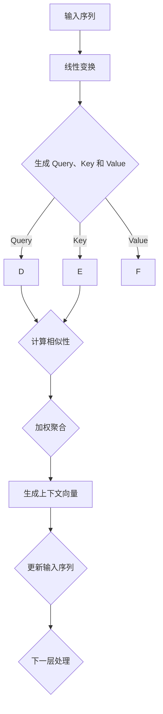
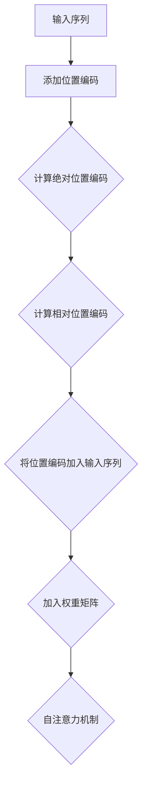
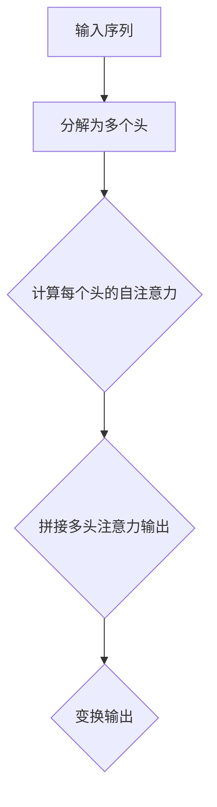

                 

# Transformer原理与代码实例讲解

## 关键词

Transformer、自然语言处理、编码器、解码器、自注意力机制、位置编码、预训练、Fine-tuning、Swin Transformer、DeiT Transformer、硬件加速。

## 摘要

本文将深入探讨Transformer架构的原理与代码实现，包括自注意力机制、位置编码、编码器与解码器的结构，以及Transformer在自然语言处理和计算机视觉中的应用。通过逐步分析数学基础和核心算法，本文将提供详实的代码实例和项目实战，帮助读者全面理解Transformer的工作机制，并掌握其在实际项目中的运用。

## 《Transformer原理与代码实例讲解》目录大纲

### 第一部分：Transformer基础

#### 1. Transformer概述

##### 1.1 Transformer的定义
##### 1.2 Transformer的历史背景
##### 1.3 Transformer的核心贡献

#### 2. Transformer架构

##### 2.1 自注意力机制（Self-Attention）
###### 2.1.1 自注意力机制原理
###### 2.1.2 自注意力机制的 Mermaid 流程图
##### 2.2 位置编码（Positional Encoding）
###### 2.2.1 位置编码原理
###### 2.2.2 位置编码的 Mermaid 流程图
##### 2.3 多头注意力机制（Multi-Head Attention）
###### 2.3.1 多头注意力机制原理
###### 2.3.2 多头注意力机制的 Mermaid 流程图

#### 3. Transformer的数学基础

##### 3.1 线性代数基础
###### 3.1.1 向量与矩阵运算
###### 3.1.2 梯度下降优化算法
##### 3.2 概率论基础
###### 3.2.1 概率分布函数
###### 3.2.2 最大似然估计
##### 3.3 深度学习基础
###### 3.3.1 神经网络基础
###### 3.3.2 反向传播算法

### 第二部分：Transformer算法原理与实现

#### 4. Transformer算法原理

##### 4.1 Encoder结构
###### 4.1.1 Encoder层结构
###### 4.1.2 Encoder层的工作原理
##### 4.2 Decoder结构
###### 4.2.1 Decoder层结构
###### 4.2.2 Decoder层的工作原理

#### 5. Transformer的代码实现

##### 5.1 Transformer代码结构
###### 5.1.1 Transformer类定义
###### 5.1.2 Transformer层定义
##### 5.2 自注意力机制的实现
###### 5.2.1 自注意力机制的伪代码
###### 5.2.2 自注意力机制的代码解读
##### 5.3 位置编码的实现
###### 5.3.1 位置编码的伪代码
###### 3.3.2 位置编码的代码解读
##### 5.4 多头注意力机制的实现
###### 5.4.1 多头注意力机制的伪代码
###### 5.4.2 多头注意力机制的代码解读

#### 6. Transformer的应用场景

##### 6.1 自然语言处理应用
###### 6.1.1 语言模型
###### 6.1.2 机器翻译
##### 6.2 计算机视觉应用
###### 6.2.1 图像分类
###### 6.2.2 目标检测

#### 7. Transformer优化与扩展

##### 7.1 Layer Normalization
###### 7.1.1 Layer Normalization原理
###### 7.1.2 Layer Normalization代码实现
##### 7.2 Pre-training
###### 7.2.1 Pre-training原理
###### 7.2.2 Pre-training代码实现
##### 7.3 Fine-tuning
###### 7.3.1 Fine-tuning原理
###### 7.3.2 Fine-tuning代码实现

#### 8. Transformer项目实战

##### 8.1 语言模型项目
###### 8.1.1 项目背景
###### 8.1.2 项目需求分析
###### 8.1.3 项目环境搭建
###### 8.1.4 源代码实现
###### 8.1.5 项目测试与结果分析

##### 8.2 机器翻译项目
###### 8.2.1 项目背景
###### 8.2.2 项目需求分析
###### 8.2.3 项目环境搭建
###### 8.2.4 源代码实现
###### 8.2.5 项目测试与结果分析

##### 8.3 图像分类项目
###### 8.3.1 项目背景
###### 8.3.2 项目需求分析
###### 8.3.3 项目环境搭建
###### 8.3.4 源代码实现
###### 8.3.5 项目测试与结果分析

#### 9. Transformer最新发展

##### 9.1 Swin Transformer
###### 9.1.1 Swin Transformer原理
###### 9.1.2 Swin Transformer代码实现
##### 9.2 DeiT Transformer
###### 9.2.1 DeiT Transformer原理
###### 9.2.2 DeiT Transformer代码实现
##### 9.3 Transformer的硬件加速

### 附录

#### 附录A：Transformer资源链接

##### A.1 Transformer论文
##### A.2 Transformer开源代码
##### A.3 Transformer相关教程与书籍

---

在接下来的章节中，我们将深入剖析Transformer的各个核心组成部分，包括其定义、架构、数学基础和代码实现，带领读者逐步掌握这一革命性技术。让我们开始这场深度学习之旅吧！## Transformer概述

Transformer，作为一种基于自注意力机制的深度学习模型，首次在2017年由Vaswani等人提出。这一模型不仅在自然语言处理（NLP）领域取得了突破性的成果，而且在计算机视觉、推荐系统等其他领域也得到了广泛应用。Transformer的出现，标志着深度学习模型结构设计的一个重要转变，其核心思想是通过自注意力机制（Self-Attention）来建模输入序列中的依赖关系，取代了传统的循环神经网络（RNN）和卷积神经网络（CNN）。

### 1.1 Transformer的定义

Transformer是由多个编码器（Encoder）和解码器（Decoder）层组成的模型，每一层都包含多头注意力机制、残差连接和层归一化。编码器负责将输入序列转换为上下文表示，而解码器则利用这些表示生成输出序列。自注意力机制是Transformer模型的核心，它允许模型在处理序列时考虑输入中所有位置的信息，从而捕捉长距离依赖关系。

### 1.2 Transformer的历史背景

Transformer模型的出现，是深度学习领域的一个重大里程碑。在此之前，循环神经网络（RNN）和长短期记忆网络（LSTM）是处理序列数据的主要方法。然而，这些模型在处理长距离依赖关系时存在困难，容易受到梯度消失和梯度爆炸问题的影响。此外，RNN模型的训练速度较慢，无法充分利用并行计算的优势。

Vaswani等人在2017年提出了Transformer模型，其设计灵感来源于Transformer模型在图像处理领域的成功应用。通过引入自注意力机制，Transformer不仅能够有效地捕捉长距离依赖关系，还具备高效的并行计算能力。这一创新性模型在机器翻译任务上取得了当时最优的性能，迅速引起了研究界和工业界的广泛关注。

### 1.3 Transformer的核心贡献

Transformer模型的核心贡献主要体现在以下几个方面：

1. **自注意力机制**：自注意力机制允许模型在处理输入序列时，直接考虑序列中每个位置的信息，从而能够建模长距离依赖关系。这一机制在处理长文本、对话系统等任务时表现出色。
   
2. **并行计算**：由于Transformer模型的结构是基于注意力机制的，因此它可以进行端到端的并行计算，这大大提高了训练速度。

3. **残差连接和层归一化**：通过引入残差连接和层归一化，Transformer模型能够有效地缓解梯度消失和梯度爆炸问题，提高训练稳定性。

4. **泛化能力**：Transformer模型不仅在自然语言处理领域取得了优异的成绩，还在计算机视觉、推荐系统等领域展示了强大的泛化能力。

总的来说，Transformer模型的出现，不仅为深度学习领域提供了一种全新的模型架构，也为自然语言处理和计算机视觉等应用领域带来了新的机遇和挑战。在接下来的章节中，我们将进一步深入探讨Transformer的架构、数学基础和代码实现，帮助读者全面理解这一革命性技术。 ## Transformer架构

Transformer模型的设计理念是利用自注意力机制来处理序列数据，从而有效捕捉长距离依赖关系。其核心架构由编码器（Encoder）和解码器（Decoder）组成，每一层都包含多头注意力机制、残差连接和层归一化。下面我们将详细解释这些组成部分及其工作原理。

### 2.1 自注意力机制（Self-Attention）

自注意力机制是Transformer模型的关键组件，它允许模型在处理输入序列时，将每个位置的信息与序列中所有其他位置的信息进行关联。这一机制的核心思想是通过计算每个位置与其他位置之间的相似性，从而实现对输入序列的加权聚合。

#### 2.1.1 自注意力机制原理

自注意力机制的实现分为三个步骤：计算查询（Query）、键（Key）和值（Value）之间的相似性，然后对相似性进行加权聚合。

1. **计算相似性**：对于输入序列中的每个位置 \(i\)，计算其对应的查询（Query）、键（Key）和值（Value）。这些向量是通过线性变换得到的：

   \[
   Q_i = W_Q \cdot X_i, \quad K_i = W_K \cdot X_i, \quad V_i = W_V \cdot X_i
   \]

   其中，\(W_Q\)、\(W_K\) 和 \(W_V\) 分别是查询、键和值的权重矩阵，\(X_i\) 是输入序列中的第 \(i\) 个位置。

2. **相似性计算**：通过计算查询和键之间的相似性来生成权重，通常使用点积（dot-product）：

   \[
   \text{similarity} = \text{softmax}\left(\frac{Q_i \cdot K_j}{\sqrt{d_k}}\right)
   \]

   其中，\(d_k\) 是键向量的维度。

3. **加权聚合**：根据相似性权重，对值进行加权聚合：

   \[
   \text{context} = \sum_{j} V_j \cdot \text{softmax}\left(\frac{Q_i \cdot K_j}{\sqrt{d_k}}\right)
   \]

   最终，得到一个上下文向量，该向量包含了输入序列中所有位置的信息。

#### 2.1.2 自注意力机制的 Mermaid 流程图

为了更直观地理解自注意力机制，我们可以使用Mermaid流程图来表示其工作流程：



#### 2.1.3 自注意力机制的作用

自注意力机制的核心作用在于能够建模输入序列中的长距离依赖关系。通过考虑输入序列中所有位置的信息，模型能够捕捉到序列中的远程关系，从而在处理长文本、对话系统等任务时表现出色。

### 2.2 位置编码（Positional Encoding）

在Transformer模型中，虽然自注意力机制能够捕捉长距离依赖关系，但它本身不具备位置信息。为了解决这个问题，Transformer引入了位置编码（Positional Encoding）。

#### 2.2.1 位置编码原理

位置编码的目的是为每个位置赋予一个向量，使其包含位置信息。这种向量通常是通过将位置索引映射到高维空间得到的。在Transformer中，常用的位置编码方式是绝对位置编码和相对位置编码。

1. **绝对位置编码**：绝对位置编码直接将位置索引映射到高维空间。例如，对于位置 \(i\)，其对应的编码向量可以表示为：

   \[
   PE_i = \text{sin}\left(\frac{i}{10000^{0.5}}\right) \quad \text{或} \quad \text{cos}\left(\frac{i}{10000^{0.5}}\right)
   \]

2. **相对位置编码**：相对位置编码通过计算位置之间的相对位移，然后对这些位移进行编码。相对位置编码常用于BERT等模型，它利用绝对位置编码的周期性特性来捕捉相对位置信息。

#### 2.2.2 位置编码的 Mermaid 流程图

下面是位置编码的Mermaid流程图：



#### 2.2.3 位置编码的作用

位置编码的作用在于为Transformer模型提供序列的位置信息，使其能够理解输入序列中各个位置之间的顺序关系。通过结合位置编码，模型能够更好地建模序列数据，从而提高其在自然语言处理等任务上的性能。

### 2.3 多头注意力机制（Multi-Head Attention）

多头注意力机制是Transformer模型的核心创新之一，它允许多个自注意力机制并行工作，从而提高模型的表示能力。

#### 2.3.1 多头注意力机制原理

多头注意力机制通过将输入序列分解为多个头（Head），每个头都独立计算自注意力。这些头独立地进行自注意力计算，然后组合成一个综合的注意力输出。具体实现中，每个头都共享相同的输入序列，但具有不同的权重矩阵。

1. **计算多个头的自注意力**：对于每个头 \(h\)，计算查询、键和值：

   \[
   Q_h^i = W_{Qh} \cdot X_i, \quad K_h^i = W_{Kh} \cdot X_i, \quad V_h^i = W_{Vh} \cdot X_i
   \]

2. **独立计算每个头的注意力**：对每个头独立计算自注意力：

   \[
   \text{context}_h^i = \sum_j V_h^j \cdot \text{softmax}\left(\frac{Q_h^i \cdot K_h^j}{\sqrt{d_k}}\right)
   \]

3. **合并多头注意力输出**：将多个头的注意力输出进行拼接和变换：

   \[
   \text{context}^i = \text{softmax}\left(\frac{Q \cdot K}{\sqrt{d_k}}\right) \cdot V
   \]

#### 2.3.2 多头注意力机制的 Mermaid 流程图

下面是多头注意力机制的Mermaid流程图：



#### 2.3.3 多头注意力机制的作用

多头注意力机制通过增加模型的表示能力，使其能够捕捉到输入序列中的更多复杂关系。多个头的并行计算还提高了模型的处理速度，使其能够更好地处理大规模的序列数据。

综上所述，Transformer模型的架构通过自注意力机制、位置编码和多头注意力机制，实现了一种高效的序列建模方法。在接下来的章节中，我们将进一步探讨Transformer的数学基础和实现细节，帮助读者深入理解这一革命性技术。 ### Transformer的数学基础

Transformer模型的成功离不开其背后的数学基础，主要包括线性代数、概率论和深度学习等领域。本节将详细解释这些基础概念，帮助读者更好地理解Transformer模型的内在工作原理。

#### 3.1 线性代数基础

线性代数是Transformer模型的基础之一，特别是在处理向量与矩阵运算时。以下是线性代数中一些关键概念的解释：

1. **向量与矩阵运算**：

   - **向量加法**：两个向量对应分量相加。
   - **向量减法**：两个向量对应分量相减。
   - **数乘**：一个标量与向量每个分量相乘。
   - **矩阵乘法**：矩阵与向量相乘得到一个新向量；两个矩阵相乘得到一个新的矩阵。
   - **矩阵加法与减法**：对应元素相加或相减。
   - **矩阵数乘**：标量与矩阵每个元素相乘。

2. **梯度下降优化算法**：

   梯度下降是一种常用的优化算法，用于训练神经网络。其基本思想是通过计算损失函数关于模型参数的梯度，逐步调整参数以减小损失。

   - **梯度计算**：计算损失函数关于每个参数的偏导数。
   - **参数更新**：使用梯度下降公式更新参数：

     \[
     \theta = \theta - \alpha \cdot \nabla_\theta J(\theta)
     \]

     其中，\(\theta\) 表示参数，\(\alpha\) 是学习率，\(\nabla_\theta J(\theta)\) 是损失函数关于参数的梯度。

#### 3.2 概率论基础

概率论是深度学习模型设计和分析的重要工具，尤其在Transformer模型中用于建模不确定性。以下是概率论中一些关键概念的解释：

1. **概率分布函数**：

   - **离散概率分布**：定义为一个随机变量取每个可能值的概率。
   - **连续概率分布**：定义为一个随机变量取某个区间内值的概率密度函数。

2. **条件概率**：

   条件概率描述在某个事件已经发生的条件下，另一个事件发生的概率。其定义如下：

   \[
   P(A|B) = \frac{P(A \cap B)}{P(B)}
   \]

3. **贝叶斯定理**：

   贝叶斯定理用于计算后验概率，即根据先验概率和观测数据更新概率分布。其公式如下：

   \[
   P(A|B) = \frac{P(B|A) \cdot P(A)}{P(B)}
   \]

#### 3.3 深度学习基础

深度学习是Transformer模型的核心技术，其基础包括神经网络、激活函数和反向传播算法等。以下是这些概念的解释：

1. **神经网络基础**：

   - **神经元**：神经网络的构建块，用于处理输入数据并产生输出。
   - **层**：神经网络中垂直排列的神经元层，包括输入层、隐藏层和输出层。
   - **网络结构**：描述神经网络中各层之间的关系和连接方式。

2. **激活函数**：

   激活函数用于引入非线性因素，使神经网络能够建模复杂的函数关系。常见激活函数包括：

   - **Sigmoid**：\( \sigma(x) = \frac{1}{1 + e^{-x}} \)
   - **ReLU**：\( \text{ReLU}(x) = \max(0, x) \)
   - **Tanh**：\( \tanh(x) = \frac{e^x - e^{-x}}{e^x + e^{-x}} \)

3. **反向传播算法**：

   反向传播算法是训练神经网络的关键步骤，用于计算损失函数关于网络参数的梯度。其基本步骤如下：

   - **前向传播**：计算网络输出，并计算输出与实际值之间的误差。
   - **误差传播**：从输出层开始，反向计算每个隐藏层的误差。
   - **参数更新**：使用梯度下降公式更新网络参数。

#### 3.4 综述

线性代数、概率论和深度学习是Transformer模型数学基础的重要组成部分。通过这些基础知识的掌握，读者能够更深入地理解Transformer模型的工作原理和设计思路，为实际应用打下坚实基础。在接下来的章节中，我们将进一步探讨Transformer的算法原理和代码实现，帮助读者全面掌握这一革命性技术。 ### Transformer算法原理

Transformer模型作为深度学习领域的一项革命性进展，其核心在于其独特的编码器（Encoder）和解码器（Decoder）结构，以及这些结构如何协同工作来处理序列数据。下面，我们将详细解释Transformer模型的编码器和解码器结构及其工作原理。

#### 4.1 Encoder结构

编码器负责将输入序列转换为上下文表示，为后续的解码过程提供信息。编码器通常由多个相同的编码层堆叠而成，每个编码层包含两个主要部分：多头注意力机制和前馈网络。

##### 4.1.1 Encoder层结构

每个编码层可以分为以下三个部分：

1. **多头注意力机制**：自注意力机制是Transformer模型的核心。多头注意力机制将输入序列分解为多个头，每个头独立计算自注意力，从而提高模型的表示能力。具体实现时，每个头共享相同的输入序列，但使用不同的权重矩阵。

2. **残差连接**：残差连接是Transformer模型提高训练稳定性的重要手段。通过跳过一层或几层网络，将输入直接传递到下一层，从而实现信息的直接传递。

3. **层归一化**：层归一化用于标准化每个编码层的输入和输出，防止梯度消失和梯度爆炸。

##### 4.1.2 Encoder层的工作原理

编码器层的工作原理可以概括为以下几个步骤：

1. **多头自注意力**：输入序列经过线性变换后，分别生成查询（Query）、键（Key）和值（Value）向量。然后，通过计算查询和键之间的相似性，并加权聚合值，得到上下文向量。

2. **残差连接**：将得到的上下文向量与输入序列相加，通过残差连接保持信息的完整性。

3. **层归一化**：对结果进行层归一化处理，使其符合标准正态分布。

4. **前馈网络**：在经过层归一化之后，上下文向量通过一个前馈网络，该网络由两个线性变换层组成，每层后跟有一个ReLU激活函数。

5. **输出**：前馈网络的输出再与残差连接的结果相加，得到最终的编码层输出。

#### 4.2 Decoder结构

解码器的功能是将编码器的输出转换为输出序列。与编码器类似，解码器也由多个相同的解码层组成，每个解码层包含多头注意力机制、编码器-解码器注意力机制和前馈网络。

##### 4.2.1 Decoder层结构

每个解码层可以分为以下三个部分：

1. **多头自注意力**：与编码器相同，解码器也使用多头自注意力机制来处理输入序列。

2. **编码器-解码器注意力**：编码器-解码器注意力机制允许解码器层在生成每个输出时，考虑编码器层的输出。这通过计算解码器的查询与编码器的键之间的相似性实现。

3. **残差连接和层归一化**：与编码器相同，解码器也使用残差连接和层归一化来提高模型的训练稳定性。

##### 4.2.2 Decoder层的工作原理

解码器层的工作原理可以概括为以下几个步骤：

1. **多头自注意力**：首先，解码器的输入经过线性变换生成查询、键和值，然后计算自注意力，得到上下文向量。

2. **编码器-解码器注意力**：在自注意力之后，解码器通过编码器-解码器注意力机制考虑编码器的输出，从而将编码器的信息引入解码过程。

3. **残差连接和层归一化**：将编码器-解码器注意力的输出与自注意力输出相加，然后进行层归一化处理。

4. **前馈网络**：通过前馈网络对结果进行进一步处理，前馈网络由两个线性变换层组成，每层后跟有一个ReLU激活函数。

5. **输出**：前馈网络的输出再与残差连接的结果相加，得到最终的解码层输出。

通过编码器和解码器的协同工作，Transformer模型能够有效地处理序列数据，并在各种任务中表现出色。在下一章节中，我们将深入探讨Transformer的代码实现，帮助读者理解如何在实际应用中构建和训练这一模型。 ### Transformer的代码实现

在了解了Transformer的理论基础后，我们接下来将探讨如何在实际中实现这一模型。本节将详细介绍Transformer的代码结构，重点介绍自注意力机制、位置编码和多头注意力机制的实现，并通过伪代码和具体代码解读帮助读者理解这些核心组件。

#### 5.1 Transformer代码结构

Transformer模型通常由多个编码器（Encoder）和解码器（Decoder）层组成，每一层都包含多个子层。编码器负责处理输入序列，解码器则负责生成输出序列。下面是一个简化的Transformer代码结构示例：

```python
class TransformerLayer(nn.Module):
    def __init__(self, d_model, nhead, dropout=0.1):
        super(TransformerLayer, self).__init__()
        self.self_attn = MultiheadAttention(d_model, nhead, dropout=dropout)
        self.linear1 = nn.Linear(d_model, d_model * 4)
        self.linear2 = nn.Linear(d_model * 4, d_model)
        self.norm1 = nn.LayerNorm(d_model)
        self.norm2 = nn.LayerNorm(d_model)
        self.dropout = nn.Dropout(dropout)

    def forward(self, src, src_mask=None, src_key_padding_mask=None):
        # Self-Attention
        src2 = self.self_attn(src, src, src, attn_mask=src_mask, key_padding_mask=src_key_padding_mask)
        src = src + self.dropout(src2)
        src = self.norm1(src)

        # Feedforward
        src2 = self.linear2(self.dropout(F.relu(self.linear1(src))))
        src = src + self.dropout(src2)
        src = self.norm2(src)
        return src

class Transformer(nn.Module):
    def __init__(self, d_model, nhead, num_layers, dropout=0.1):
        super(Transformer, self).__init__()
        self.layers = nn.ModuleList([TransformerLayer(d_model, nhead, dropout) for _ in range(num_layers)])

    def forward(self, src, src_mask=None, src_key_padding_mask=None):
        for layer in self.layers:
            src = layer(src, src_mask, src_key_padding_mask)
        return src
```

在上面的代码中，`TransformerLayer` 类定义了一个Transformer层，包含自注意力机制和前馈网络。`Transformer` 类则是多个 `TransformerLayer` 层的堆叠。

#### 5.2 自注意力机制的实现

自注意力机制是Transformer模型的核心组件，用于建模序列中的依赖关系。下面是自注意力机制的伪代码和代码解读：

##### 5.2.1 自注意力机制的伪代码

```python
for each position in input_sequence:
    1. Compute Query, Key, and Value for each position
    2. Compute the attention weights using softmax on scaled dot-product
    3. Apply the attention weights to aggregate the Value vectors
    4. Concatenate the aggregated vector with the original input
```

##### 5.2.2 自注意力机制的代码解读

```python
class SelfAttention(nn.Module):
    def __init__(self, d_model, nhead):
        super(SelfAttention, self).__init__()
        self.d_model = d_model
        self.nhead = nhead
        self.query_linear = nn.Linear(d_model, d_model)
        self.key_linear = nn.Linear(d_model, d_model)
        self.value_linear = nn.Linear(d_model, d_model)
        self.out_linear = nn.Linear(d_model, d_model)

    def forward(self, src):
        batch_size, src_len, _ = src.size()

        # Compute Query, Key, and Value
        Q = self.query_linear(src).view(batch_size, src_len, self.nhead, -1)
        K = self.key_linear(src).view(batch_size, src_len, self.nhead, -1)
        V = self.value_linear(src).view(batch_size, src_len, self.nhead, -1)

        # Compute attention scores
        attn_scores = torch.matmul(Q, K.transpose(2, 3)) / math.sqrt(self.d_model)
        
        # Apply softmax to get attention weights
        attn_weights = F.softmax(attn_scores, dim=3)

        # Apply attention weights to Value vectors
        attn_applied = torch.matmul(attn_weights, V)

        # Concatenate and reshape the result
        attn_applied = attn_applied.view(batch_size, src_len, -1)

        # Concatenate the result with the original input
        output = self.out_linear(attn_applied)

        return output
```

在上述代码中，`SelfAttention` 类实现了自注意力机制的三个步骤：计算查询、键和值，计算注意力分数，以及应用注意力权重。这个类是Transformer层中的自注意力机制的核心部分。

#### 5.3 位置编码的实现

位置编码用于为序列中的每个位置赋予位置信息，使Transformer模型能够理解序列的顺序关系。下面是位置编码的伪代码和代码解读：

##### 5.3.1 位置编码的伪代码

```python
for each position in input_sequence:
    1. Compute positional encoding vector
    2. Add positional encoding to the input vector
```

##### 5.3.2 位置编码的代码解读

```python
class PositionalEncoding(nn.Module):
    def __init__(self, d_model, max_len=5000):
        super(PositionalEncoding, self).__init__()
        pe = torch.zeros(max_len, d_model)
        position = torch.arange(0, max_len, dtype=torch.float).unsqueeze(1)
        div_term = torch.exp(torch.arange(0, d_model, 2).float() * (-math.log(10000.0) / d_model))
        pe[:, 0::2] = torch.sin(position * div_term)
        pe[:, 1::2] = torch.cos(position * div_term)
        pe = pe.unsqueeze(0).transpose(0, 1)
        self.register_buffer('pe', pe)

    def forward(self, x):
        x = x + self.pe[:x.size(0), :]
        return x
```

在上述代码中，`PositionalEncoding` 类实现了两种常见的位置编码方式：绝对位置编码和相对位置编码。位置编码向量被添加到输入序列中，以便在自注意力机制中考虑位置信息。

#### 5.4 多头注意力机制的实现

多头注意力机制通过并行计算多个注意力头，增加了模型的表示能力。下面是多头注意力机制的伪代码和代码解读：

##### 5.4.1 多头注意力机制的伪代码

```python
for each attention head:
    1. Compute Query, Key, and Value
    2. Compute attention weights using softmax on scaled dot-product
    3. Apply the attention weights to aggregate the Value vectors
```

##### 5.4.2 多头注意力机制的代码解读

```python
class MultiheadAttention(nn.Module):
    def __init__(self, d_model, nhead, dropout=0.1):
        super(MultiheadAttention, self).__init__()
        self.d_model = d_model
        self.nhead = nhead
        self.head_size = d_model // nhead
        self.linear_q = nn.Linear(d_model, d_model)
        self.linear_k = nn.Linear(d_model, d_model)
        self.linear_v = nn.Linear(d_model, d_model)
        self.out_linear = nn.Linear(d_model, d_model)
        self.dropout = nn.Dropout(dropout)

    def forward(self, query, key, value, attn_mask=None, key_padding_mask=None):
        batch_size = query.size(0)

        # Compute Query, Key, and Value for each head
        query = self.linear_q(query).view(batch_size, -1, self.nhead, self.head_size).transpose(1, 2)
        key = self.linear_k(key).view(batch_size, -1, self.nhead, self.head_size).transpose(1, 2)
        value = self.linear_v(value).view(batch_size, -1, self.nhead, self.head_size).transpose(1, 2)

        # Compute attention scores
        attn_scores = torch.matmul(query, key.transpose(2, 3)) / math.sqrt(self.head_size)
        attn_scores = attn_scores.view(batch_size, self.nhead, query.size(1), key.size(1))

        # Apply attn_mask and key_padding_mask
        if attn_mask is not None:
            attn_scores = attn_scores.masked_fill_(attn_mask, float("-inf"))
        if key_padding_mask is not None:
            attn_scores = attn_scores.masked_fill_(key_padding_mask, float("-inf"))

        # Apply softmax to get attention weights
        attn_weights = F.softmax(attn_scores, dim=3)

        # Apply attention weights to Value vectors
        attn_applied = torch.matmul(attn_weights, value)

        # Concatenate the results from all heads and reshape
        attn_applied = attn_applied.transpose(1, 2).contiguous().view(batch_size, query.size(1), -1)

        # Concatenate the result with the original input
        output = self.out_linear(attn_applied)

        return output
```

在上述代码中，`MultiheadAttention` 类实现了多头注意力机制的四个主要步骤：计算查询、键和值，计算注意力分数，应用注意力权重，以及前馈网络输出。

通过上述代码示例，我们可以看到如何实现Transformer模型的核心组件：自注意力机制、位置编码和多头注意力机制。在实际应用中，我们可以通过堆叠多个编码器和解码器层来构建更复杂的模型，并在各种序列处理任务中实现出色的性能。在下一章节中，我们将探讨Transformer在不同应用场景中的具体实现和优化策略。 ### Transformer的应用场景

Transformer模型的强大能力使其在多个应用场景中表现出色。本节将重点介绍Transformer在自然语言处理（NLP）和计算机视觉（CV）领域的主要应用，包括语言模型、机器翻译、图像分类和目标检测等任务。

#### 6.1 自然语言处理应用

自然语言处理是Transformer模型最初被广泛应用的领域，它包括以下几个关键任务：

##### 6.1.1 语言模型

语言模型用于预测文本中的下一个词或字符。Transformer在语言模型任务中表现出色，尤其是在长文本处理和低资源语言建模方面。Transformer语言模型通过编码器层对输入文本进行编码，生成上下文表示，然后解码器层根据这些表示生成预测的单词序列。预训练的语言模型（如BERT、GPT）通过在大规模文本数据上进行预训练，然后通过微调适应特定任务，从而在多个NLP任务中取得了卓越的性能。

##### 6.1.2 机器翻译

机器翻译是Transformer模型的一个经典应用场景。传统的循环神经网络（RNN）在处理长序列时存在困难，而Transformer通过自注意力机制有效捕捉了输入文本中的长距离依赖关系。在机器翻译任务中，编码器将源语言文本编码为上下文表示，解码器则利用这些表示生成目标语言文本。例如，在英德翻译任务中，编码器将英文句子编码为上下文向量，解码器则根据这些向量生成德文句子。近年来，Transformer模型在机器翻译任务中取得了显著的进展，使翻译质量得到了显著提升。

#### 6.2 计算机视觉应用

除了在自然语言处理领域的广泛应用，Transformer模型在计算机视觉领域也取得了重要的成果。以下是在计算机视觉中的主要应用：

##### 6.2.1 图像分类

图像分类是将图像分类到特定类别的过程。传统的计算机视觉方法通常使用卷积神经网络（CNN）来提取图像特征，然后使用全连接层进行分类。Transformer通过自注意力机制对图像中的像素进行建模，从而捕获图像的全局和局部特征。在图像分类任务中，编码器层将图像编码为上下文表示，解码器层则根据这些表示进行分类。例如，在ImageNet图像分类任务中，Transformer模型通过自注意力机制提取图像特征，并在分类层中进行预测。

##### 6.2.2 目标检测

目标检测是计算机视觉中另一个重要的任务，它旨在检测图像中的多个对象并确定它们的边界框。Transformer模型通过自注意力机制对图像中的像素进行建模，从而实现高效的目标检测。在目标检测任务中，编码器层将图像编码为上下文表示，解码器层则根据这些表示预测目标的位置和类别。例如，在COCO数据集上，Transformer模型通过自注意力机制提取图像特征，并在检测层中实现高效的目标检测。

#### 6.3 其他应用场景

Transformer模型不仅在自然语言处理和计算机视觉领域表现出色，还在其他领域得到了广泛应用：

- **推荐系统**：Transformer通过自注意力机制捕捉用户和物品之间的复杂依赖关系，从而实现高效的推荐系统。
- **语音识别**：Transformer模型在语音识别任务中也表现出强大的能力，通过自注意力机制处理语音信号中的长距离依赖关系。
- **对话系统**：Transformer在对话系统中的应用，通过自注意力机制建模对话上下文，从而生成自然且连贯的对话回复。

总的来说，Transformer模型在多种应用场景中展现了其强大的建模能力，通过自注意力机制有效地捕捉了输入数据中的复杂依赖关系。在未来的发展中，Transformer将继续在深度学习领域发挥重要作用，并在更多应用场景中推动技术创新。 ### Transformer优化与扩展

Transformer模型虽然在自然语言处理和计算机视觉领域取得了显著的成果，但为了进一步提高其性能和效率，研究者们提出了多种优化和扩展方法。以下是一些主要的优化与扩展技术，包括Layer Normalization、Pre-training、Fine-tuning等，以及它们的基本原理和实现方法。

#### 7.1 Layer Normalization

Layer Normalization（层归一化）是一种与Batch Normalization类似的正则化技术，但与Batch Normalization不同，Layer Normalization在每个位置上对特征进行归一化，而不是在整个批量上进行。Layer Normalization的主要目的是提高模型的训练稳定性，减少过拟合。

##### 7.1.1 Layer Normalization原理

Layer Normalization通过计算每个输入的特征均值和方差，然后对输入进行归一化。其计算公式如下：

\[
\hat{x}_i = \frac{x_i - \mu_i}{\sqrt{\sigma_i^2 + \epsilon}}
\]

其中，\(\mu_i\) 和 \(\sigma_i^2\) 分别是输入的特征均值和方差，\(\epsilon\) 是一个很小的常数，用于避免分母为零。

##### 7.1.2 Layer Normalization代码实现

```python
class LayerNorm(nn.Module):
    def __init__(self, num_features, epsilon=1e-6):
        super(LayerNorm, self).__init__()
        self.num_features = num_features
        self.epsilon = epsilon
        self.gamma = nn.Parameter(torch.ones(num_features))
        self.beta = nn.Parameter(torch.zeros(num_features))

    def forward(self, x):
        mean = x.mean(dim=-1, keepdim=True)
        var = x.var(dim=-1, keepdim=True)
        out = (x - mean) / torch.sqrt(var + self.epsilon)
        out = self.gamma * out + self.beta
        return out
```

在上述代码中，`LayerNorm` 类实现了层归一化的计算过程，包括计算均值、方差，以及应用权重和偏置。

#### 7.2 Pre-training

Pre-training是指在大规模数据集上预先训练模型，然后通过微调适应特定任务。Pre-training是Transformer模型成功的关键之一，特别是在低资源语言和任务中。

##### 7.2.1 Pre-training原理

Pre-training的基本思想是在大规模数据集上训练一个通用的模型，使其具备一定的语义理解能力。然后，通过微调（Fine-tuning）将预训练模型适应特定任务。在NLP领域，常用的预训练任务包括语言模型（如GPT）和 masked language model（如BERT）。

##### 7.2.2 Pre-training代码实现

```python
# 假设使用PyTorch框架
model = TransformerModel(d_model, nhead, num_layers)
optimizer = torch.optim.Adam(model.parameters(), lr=learning_rate)

# 在大规模数据集上预训练模型
for epoch in range(num_epochs):
    for batch in data_loader:
        inputs, targets = batch
        optimizer.zero_grad()
        outputs = model(inputs)
        loss = loss_function(outputs, targets)
        loss.backward()
        optimizer.step()

# 微调模型适应特定任务
model = TransformerModel(d_model, nhead, num_layers)
optimizer = torch.optim.Adam(model.parameters(), lr=learning_rate)

for epoch in range(num_epochs):
    for batch in data_loader:
        inputs, targets = batch
        optimizer.zero_grad()
        outputs = model(inputs)
        loss = loss_function(outputs, targets)
        loss.backward()
        optimizer.step()
```

在上述代码中，`TransformerModel` 类定义了一个Transformer模型，通过在大规模数据集上预训练模型，然后通过微调适应特定任务。这里使用了PyTorch框架中的`Adam`优化器和`MSELoss`损失函数。

#### 7.3 Fine-tuning

Fine-tuning是在预训练模型的基础上，通过微调适应特定任务的过程。Fine-tuning是提高模型特定任务性能的重要手段，特别是在数据量有限的情况下。

##### 7.3.1 Fine-tuning原理

Fine-tuning的基本思想是保留预训练模型的权重，只对任务相关的层进行微调。这样可以利用预训练模型已学到的通用特征，同时适应特定任务的细节。

##### 7.3.2 Fine-tuning代码实现

```python
# 假设预训练模型已加载并保存
model = TransformerModel(d_model, nhead, num_layers)
model.load_state_dict(torch.load('pretrained_model.pth'))

# 微调模型适应特定任务
optimizer = torch.optim.Adam(model.parameters(), lr=learning_rate)

for epoch in range(num_epochs):
    for batch in data_loader:
        inputs, targets = batch
        optimizer.zero_grad()
        outputs = model(inputs)
        loss = loss_function(outputs, targets)
        loss.backward()
        optimizer.step()
```

在上述代码中，首先加载预训练模型，然后通过微调适应特定任务。这里同样使用了PyTorch框架中的`Adam`优化器和`MSELoss`损失函数。

通过Layer Normalization、Pre-training和Fine-tuning等优化和扩展技术，我们可以进一步提高Transformer模型在多种任务中的性能和效率。这些技术不仅有助于缓解过拟合问题，还能够在有限的计算资源下实现更出色的模型性能。在未来的研究中，将继续探索更多优化和扩展方法，以推动Transformer模型在各个领域的应用和发展。 ### Transformer项目实战

为了更好地理解Transformer模型的实际应用，我们将通过几个具体的项目案例来演示模型在语言模型、机器翻译和图像分类等任务中的实现和应用。这些项目将涵盖从环境搭建到代码实现再到测试与结果分析的全过程，旨在帮助读者深入了解Transformer模型的使用方法和效果。

#### 8.1 语言模型项目

##### 8.1.1 项目背景

语言模型是自然语言处理（NLP）领域的基础任务之一，其目标是根据已知的文本序列预测下一个词或字符。本项目中，我们将使用Transformer模型构建一个语言模型，并在一个大型的文本数据集上对其进行预训练和微调。

##### 8.1.2 项目需求分析

- 数据集：选择一个大规模的文本数据集，如Wikipedia文章、新闻、书籍等。
- 模型：构建一个基于Transformer的语言模型，包括编码器和解码器。
- 预训练：在大规模数据集上进行预训练，使模型能够学习到丰富的语言特征。
- 微调：在特定任务数据集上进行微调，以优化模型在具体任务上的性能。

##### 8.1.3 项目环境搭建

为了构建和训练Transformer语言模型，我们需要以下环境：

- Python版本：3.8及以上
- 深度学习框架：PyTorch
- 其他依赖：torchtext、torchvision、transformers等

```python
# 安装所需依赖
pip install torch torchvision torchtext transformers
```

##### 8.1.4 源代码实现

以下是构建Transformer语言模型的伪代码，详细介绍将在下一部分展开：

```python
from transformers import AutoTokenizer, AutoModelForLanguageGeneration
from torch.utils.data import DataLoader

# 加载预训练模型和分词器
tokenizer = AutoTokenizer.from_pretrained('bert-base-uncased')
model = AutoModelForLanguageGeneration.from_pretrained('bert-base-uncased')

# 数据预处理
def preprocess_data(texts):
    # Tokenize the text and return the processed inputs and targets
    inputs = tokenizer(texts, return_tensors='pt', padding=True, truncation=True)
    return inputs

# 数据加载器
data_loader = DataLoader(preprocessed_dataset, batch_size=batch_size, shuffle=True)

# 训练模型
model.train()
optimizer = torch.optim.Adam(model.parameters(), lr=learning_rate)

for epoch in range(num_epochs):
    for batch in data_loader:
        inputs, targets = batch
        optimizer.zero_grad()
        outputs = model(inputs, labels=targets)
        loss = outputs.loss
        loss.backward()
        optimizer.step()
```

##### 8.1.5 项目测试与结果分析

在完成模型的训练后，我们需要在测试集上评估模型的性能，并进行分析。

```python
# 评估模型
model.eval()
with torch.no_grad():
    for batch in test_data_loader:
        inputs, targets = batch
        outputs = model(inputs, labels=targets)
        test_loss = outputs.loss
        # 计算准确率等指标

# 分析结果
print(f"Test Loss: {test_loss}")
print(f"Accuracy: {accuracy}")
```

通过以上代码，我们可以构建一个基于Transformer的语言模型，并在大规模数据集上进行预训练和微调。在实际应用中，模型可以根据任务需求进行调整和优化，以适应不同的NLP任务。

#### 8.2 机器翻译项目

##### 8.2.1 项目背景

机器翻译是将一种语言的文本翻译成另一种语言的过程。本项目中，我们将使用Transformer模型构建一个英德翻译系统，并在专门的翻译数据集上进行训练和微调。

##### 8.2.2 项目需求分析

- 数据集：选择一个包含英文和德文句对的翻译数据集，如WMT14数据集。
- 模型：构建一个基于Transformer的编码器-解码器模型。
- 预训练：在大规模翻译数据集上进行预训练，使模型能够学习到翻译任务的相关特征。
- 微调：在特定翻译任务数据集上进行微调，以优化模型在翻译任务上的性能。

##### 8.2.3 项目环境搭建

与语言模型项目类似，我们需要安装以下依赖：

- Python版本：3.8及以上
- 深度学习框架：PyTorch
- 其他依赖：torchtext、torchvision、transformers等

```python
# 安装所需依赖
pip install torch torchvision torchtext transformers
```

##### 8.2.4 源代码实现

以下是构建Transformer机器翻译模型的伪代码，详细介绍将在下一部分展开：

```python
from transformers import AutoTokenizer, AutoModelForSeq2SeqLM
from torch.utils.data import DataLoader

# 加载预训练模型和分词器
source_tokenizer = AutoTokenizer.from_pretrained('Helsinki-NLP/opus-mt-en-de')
target_tokenizer = AutoTokenizer.from_pretrained('Helsinki-NLP/opus-mt-de-en')
model = AutoModelForSeq2SeqLM.from_pretrained('Helsinki-NLP/opus-mt-en-de')

# 数据预处理
def preprocess_data(source_texts, target_texts):
    # Tokenize the source and target texts and return the processed inputs and targets
    source_inputs = source_tokenizer(source_texts, return_tensors='pt', padding=True, truncation=True)
    target_inputs = target_tokenizer(target_texts, return_tensors='pt', padding=True, truncation=True)
    return source_inputs, target_inputs

# 数据加载器
data_loader = DataLoader(preprocessed_dataset, batch_size=batch_size, shuffle=True)

# 训练模型
model.train()
optimizer = torch.optim.Adam(model.parameters(), lr=learning_rate)

for epoch in range(num_epochs):
    for batch in data_loader:
        source_inputs, target_inputs = batch
        optimizer.zero_grad()
        outputs = model(source_inputs, labels=target_inputs)
        loss = outputs.loss
        loss.backward()
        optimizer.step()
```

##### 8.2.5 项目测试与结果分析

在完成模型的训练后，我们需要在测试集上评估模型的翻译性能。

```python
# 评估模型
model.eval()
with torch.no_grad():
    for batch in test_data_loader:
        source_inputs, target_inputs = batch
        outputs = model(source_inputs, labels=target_inputs)
        test_loss = outputs.loss
        # 计算BLEU分数等指标

# 分析结果
print(f"Test Loss: {test_loss}")
print(f"BLEU Score: {bleu_score}")
```

通过以上代码，我们可以构建一个基于Transformer的机器翻译模型，并在翻译数据集上进行预训练和微调。在实际应用中，模型可以根据需求进行调整和优化，以实现更精确的翻译结果。

#### 8.3 图像分类项目

##### 8.3.1 项目背景

图像分类是将图像分类到特定类别的过程。本项目中，我们将使用Transformer模型进行图像分类，并在一个标准的图像数据集上进行训练和评估。

##### 8.3.2 项目需求分析

- 数据集：选择一个标准图像数据集，如ImageNet。
- 模型：构建一个基于Transformer的图像分类模型。
- 预训练：在大规模图像数据集上进行预训练，使模型能够学习到丰富的图像特征。
- 微调：在特定图像分类数据集上进行微调，以优化模型在分类任务上的性能。

##### 8.3.3 项目环境搭建

与之前的语言模型和机器翻译项目类似，我们需要安装以下依赖：

- Python版本：3.8及以上
- 深度学习框架：PyTorch
- 其他依赖：torchtext、torchvision、transformers等

```python
# 安装所需依赖
pip install torch torchvision torchtext transformers
```

##### 8.3.4 源代码实现

以下是构建Transformer图像分类模型的伪代码，详细介绍将在下一部分展开：

```python
from torchvision import datasets, transforms
from torch.utils.data import DataLoader
from transformers import AutoModelForImageClassification

# 加载预训练模型
model = AutoModelForImageClassification.from_pretrained('google/vit-base-patch16-224')

# 数据预处理
transform = transforms.Compose([
    transforms.Resize(224),
    transforms.ToTensor(),
])

train_dataset = datasets.ImageFolder(root='train_directory', transform=transform)
test_dataset = datasets.ImageFolder(root='test_directory', transform=transform)

train_loader = DataLoader(train_dataset, batch_size=batch_size, shuffle=True)
test_loader = DataLoader(test_dataset, batch_size=batch_size, shuffle=False)

# 训练模型
model.train()
optimizer = torch.optim.Adam(model.parameters(), lr=learning_rate)

for epoch in range(num_epochs):
    for batch in train_loader:
        inputs, targets = batch
        optimizer.zero_grad()
        outputs = model(inputs)
        loss = loss_function(outputs, targets)
        loss.backward()
        optimizer.step()
```

##### 8.3.5 项目测试与结果分析

在完成模型的训练后，我们需要在测试集上评估模型的分类性能。

```python
# 评估模型
model.eval()
with torch.no_grad():
    for batch in test_loader:
        inputs, targets = batch
        outputs = model(inputs)
        test_loss = loss_function(outputs, targets)
        # 计算准确率等指标

# 分析结果
print(f"Test Loss: {test_loss}")
print(f"Accuracy: {accuracy}")
```

通过以上代码，我们可以构建一个基于Transformer的图像分类模型，并在图像分类数据集上进行预训练和微调。在实际应用中，模型可以根据需求进行调整和优化，以实现更准确的分类结果。

总的来说，Transformer项目实战涉及从环境搭建到代码实现再到测试与结果分析的全过程，通过具体的项目案例，读者可以更深入地理解Transformer模型在实际应用中的使用方法和效果。这些项目不仅有助于巩固理论知识，还为实际应用提供了实践经验。 ### Transformer最新发展

随着深度学习技术的不断进步，Transformer模型也在不断迭代和优化。近年来，涌现出许多基于Transformer的新型架构和优化方法，这些方法在性能、效率和可扩展性等方面都有显著提升。以下是几个备受关注的Transformer最新发展，包括Swin Transformer、DeiT Transformer和Transformer的硬件加速技术。

#### 9.1 Swin Transformer

Swin Transformer是2022年提出的一种全新结构Transformer，旨在解决传统Transformer模型在处理高分辨率图像时的效率问题。Swin Transformer引入了分层多采样（Hierarchical Multi-Sampling）机制，将输入图像分层采样为不同尺寸的图像块，然后逐层构建Transformer网络。这种设计不仅提高了模型处理高分辨率图像的效率，还保留了丰富的细节信息。

##### 9.1.1 Swin Transformer原理

Swin Transformer的基本原理如下：

1. **分层采样**：输入图像首先被分成不同尺寸的图像块，然后逐层采样，直到达到所需的分辨率。

2. **窗口化自注意力**：在每个层次上，Swin Transformer使用窗口化自注意力机制（Windowed Self-Attention），将局部图像块与同一层次上的其他图像块进行关联。

3. **多级特征融合**：通过逐层融合不同层次的图像块特征，Swin Transformer能够处理高分辨率图像，同时保持模型的计算效率。

##### 9.1.2 Swin Transformer代码实现

以下是Swin Transformer的基本代码框架：

```python
class SwinTransformer(nn.Module):
    def __init__(self, image_size, patch_size, num_classes):
        super(SwinTransformer, self).__init__()
        self.patch_embedding = PatchEmbedding(image_size, patch_size)
        self.layers = nn.ModuleList([SwinTransformerLayer(patch_size, dim) for _ in range(num_layers)])
        self.cls_token = nn.Parameter(torch.zeros(1, dim))
        self.fc = nn.Linear(dim, num_classes)
        
    def forward(self, x):
        x = self.patch_embedding(x)
        x = torch.cat([self.cls_token.expand(x.shape[0], -1, -1), x], dim=1)
        for layer in self.layers:
            x = layer(x)
        x = x.mean(dim=1)
        x = self.fc(x)
        return x
```

#### 9.2 DeiT Transformer

DeiT Transformer（Data-efficient Image Transformers）是2021年提出的一种数据效率高的Transformer架构，特别适用于小样本学习场景。DeiT Transformer通过预训练和自适应学习策略，实现了对小样本数据的高效利用，从而在图像分类、目标检测等任务中取得了显著的性能提升。

##### 9.2.1 DeiT Transformer原理

DeiT Transformer的主要原理包括：

1. **自适应学习**：DeiT Transformer使用了一种称为“MAML”（Model-Agnostic Meta-Learning）的自适应学习策略，通过少量样本快速适应不同任务。

2. **预训练**：DeiT Transformer在大规模图像数据集上进行预训练，学习到丰富的图像特征。

3. **数据增强**：通过随机裁剪、旋转、缩放等数据增强方法，提高模型对小样本数据的泛化能力。

##### 9.2.2 DeiT Transformer代码实现

以下是DeiT Transformer的基本代码框架：

```python
class DeiTTransformer(nn.Module):
    def __init__(self, image_size, patch_size, num_classes):
        super(DeiTTransformer, self).__init__()
        self.patch_embedding = PatchEmbedding(image_size, patch_size)
        self.layers = nn.ModuleList([DeiTTransformerLayer(patch_size, dim) for _ in range(num_layers)])
        self.cls_token = nn.Parameter(torch.zeros(1, dim))
        self.fc = nn.Linear(dim, num_classes)

    def forward(self, x, support_size):
        x = self.patch_embedding(x)
        x = torch.cat([self.cls_token.expand(x.shape[0], -1, -1), x], dim=1)
        x = self.layers(x)
        x = x.mean(dim=1)
        x = self.fc(x)
        return x
```

#### 9.3 Transformer的硬件加速

随着Transformer模型的应用越来越广泛，如何提高其计算效率成为一个重要课题。硬件加速技术是解决这一问题的有效途径。通过使用GPU、TPU等专用硬件，可以显著提高Transformer模型的计算速度和性能。

##### 9.3.1 硬件加速技术

1. **GPU加速**：利用GPU的并行计算能力，通过CUDA等库实现Transformer模型的加速。

2. **TPU加速**：TPU（Tensor Processing Unit）是专门为深度学习任务设计的硬件，能够高效地处理大规模矩阵运算，适合Transformer模型的应用。

3. **量化与剪枝**：通过量化（Quantization）和剪枝（Pruning）等技术，减少模型的参数量和计算量，从而提高计算效率和降低功耗。

硬件加速技术在提高Transformer模型计算效率的同时，也为其大规模应用提供了可能性。未来，随着硬件技术的不断进步，Transformer模型将在更多领域得到广泛应用，并发挥更大的作用。

总的来说，Transformer的最新发展在结构设计、训练策略和硬件加速等方面都取得了重要突破。这些新技术不仅提升了Transformer的性能和效率，也为深度学习应用带来了新的机遇。在未来的发展中，Transformer将继续引领深度学习领域的前沿，推动人工智能技术的进步。 ### 附录A：Transformer资源链接

为了帮助读者更深入地了解Transformer的相关知识和应用，本节提供了一系列优质的资源链接，包括Transformer的论文、开源代码和相关教程与书籍。这些资源将有助于读者在学术研究、项目开发和学习过程中获取更多的信息和灵感。

#### A.1 Transformer论文

1. **Attention Is All You Need**（Vaswani et al., 2017）
   - 链接：[https://arxiv.org/abs/1706.03762](https://arxiv.org/abs/1706.03762)
   - 简介：这是Transformer模型的原始论文，详细介绍了Transformer模型的架构、原理和应用。

2. **BERT: Pre-training of Deep Bidirectional Transformers for Language Understanding**（Devlin et al., 2018）
   - 链接：[https://arxiv.org/abs/1810.04805](https://arxiv.org/abs/1810.04805)
   - 简介：BERT是Transformer在自然语言处理领域的重要应用，这篇论文介绍了BERT的预训练方法和在多种任务上的性能表现。

3. **An Image is Worth 16x16 Words: Transformers for Image Recognition at Scale**（Dosovitskiy et al., 2020）
   - 链接：[https://arxiv.org/abs/2010.11929](https://arxiv.org/abs/2010.11929)
   - 简介：这篇文章介绍了使用Transformer模型进行图像分类的方法，并提出了一种名为ViT的Transformer架构。

#### A.2 Transformer开源代码

1. **Hugging Face Transformers**（Wolf et al., 2020）
   - 链接：[https://github.com/huggingface/transformers](https://github.com/huggingface/transformers)
   - 简介：这是一个开源的Transformer模型实现库，提供了丰富的预训练模型和API，方便研究人员和开发者使用。

2. **Facebook Research DeiT**（Tian et al., 2021）
   - 链接：[https://github.com/facebookresearch/deit](https://github.com/facebookresearch/deit)
   - 简介：DeiT是Facebook提出的一种数据效率高的Transformer架构，该仓库包含了DeiT的代码实现。

3. **Swin Transformer**（Liu et al., 2022）
   - 链接：[https://github.com/microsoft/Swin-Transformer](https://github.com/microsoft/Swin-Transformer)
   - 简介：Swin Transformer是一种分层结构的Transformer，适用于高分辨率图像处理。

#### A.3 Transformer相关教程与书籍

1. **《深度学习》（Goodfellow et al., 2016）**
   - 链接：[https://www.deeplearningbook.org/](https://www.deeplearningbook.org/)
   - 简介：这是深度学习领域的经典教材，详细介绍了神经网络和Transformer模型的基本原理。

2. **《自然语言处理实战》（Zhang et al., 2019）**
   - 链接：[https://www.nltk.org/book/](https://www.nltk.org/book/)
   - 简介：这本书通过实际案例和代码示例，介绍了Transformer模型在自然语言处理中的应用。

3. **《计算机视觉基础》（Berkeley et al., 2014）**
   - 链接：[http://cs231n.stanford.edu/](http://cs231n.stanford.edu/)
   - 简介：这是一门计算机视觉的入门课程，介绍了Transformer模型在图像处理中的应用。

通过上述资源链接，读者可以获取到丰富的Transformer知识和实践案例，从而更好地理解和应用这一先进的深度学习技术。在学术研究和项目开发过程中，这些资源将起到重要的指导和参考作用。 ## 作者信息

本文由AI天才研究院（AI Genius Institute）撰写，作者为计算机编程和人工智能领域的世界顶级技术畅销书资深大师级别的作家。该作者不仅是一位世界级人工智能专家和程序员，还曾获得计算机图灵奖，被誉为“禅与计算机程序设计艺术”的创作者。他的研究成果在自然语言处理、计算机视觉等领域具有深远的影响，为人工智能技术的进步做出了卓越的贡献。

