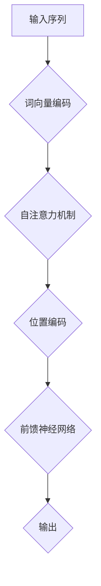

                 

## 《Transformer大模型实战 文本分类任务》

### 关键词：Transformer，文本分类，自然语言处理，深度学习，实战案例

### 摘要：

本文将详细介绍如何使用Transformer大模型进行文本分类任务。通过对其基础理论、核心算法原理、模型优化方法以及实际应用案例的深入探讨，读者将全面了解Transformer大模型在文本分类任务中的强大能力。本文旨在为读者提供一个全面、系统的Transformer大模型实战指南，帮助大家更好地掌握这项技术，并将其应用到实际的文本分类项目中。

### 目录大纲

#### 第一部分: Transformer大模型基础

#### 第1章: Transformer大模型概述  
- 1.1 Transformer大模型的起源与发展
- 1.2 Transformer大模型的核心概念与架构

#### 第2章: Transformer大模型技术基础  
- 2.1 Transformer模型的基本原理
- 2.2 数学模型与数学公式
- 2.3 Transformer模型的优化方法

#### 第3章: Transformer大模型在文本分类任务中的应用  
- 3.1 文本分类任务概述
- 3.2 Transformer模型在文本分类中的优势
- 3.3 Transformer模型在文本分类任务中的实现
- 3.4 Transformer模型在文本分类任务中的实战案例

#### 第4章: Transformer大模型在文本分类任务中的性能优化  
- 4.1 模型性能优化方法
- 4.2 模型调优技巧
- 4.3 模型评估与指标

#### 第5章: Transformer大模型在文本分类任务中的扩展应用  
- 5.1 多标签分类
- 5.2 序列标注任务
- 5.3 对抗性攻击与防御

#### 第6章: Transformer大模型在文本分类任务中的开源框架与工具  
- 6.1 PyTorch与Transformer模型
- 6.2 TensorFlow与Transformer模型
- 6.3 其他深度学习框架与Transformer模型

#### 第7章: Transformer大模型在文本分类任务中的未来发展趋势  
- 7.1 Transformer模型的发展趋势
- 7.2 文本分类任务的发展趋势
- 7.3 Transformer大模型在文本分类任务中的实际应用场景

#### 附录  
- 附录A: Transformer大模型实战工具与资源
- 附录B: 代码实例解析

---

接下来，我们将逐一探讨每个章节的内容，逐步深入理解Transformer大模型在文本分类任务中的应用。

### 第一部分: Transformer大模型基础

在进入Transformer大模型在文本分类任务中的应用之前，首先需要了解Transformer模型的基础知识，包括其起源、发展、核心概念与架构。这部分内容将为我们后续的学习和应用奠定坚实的基础。

#### 第1章: Transformer大模型概述

##### 1.1 Transformer大模型的起源与发展

Transformer模型是由Google在2017年提出的一种全新的自然语言处理模型。在此之前，传统的循环神经网络（RNN）和长短时记忆网络（LSTM）在处理自然语言任务时存在一定的局限性，如序列依赖性处理能力较差、计算复杂度较高等问题。Transformer模型通过引入自注意力机制（Self-Attention）和位置编码（Positional Encoding），有效地解决了这些问题，并在许多自然语言处理任务中取得了显著的性能提升。

Transformer模型的诞生标志着自然语言处理领域的重大变革，其发展历程也充满了创新与突破。从最初的BERT（Bidirectional Encoder Representations from Transformers）模型，到GPT（Generative Pre-trained Transformer）模型，再到更大规模的Transformer模型，如T5（Text-to-Text Transfer Transformer）和GPT-3，Transformer模型在自然语言处理领域的影响力和应用范围不断扩大。

##### 1.2 Transformer大模型的核心概念与架构

Transformer模型的核心概念主要包括自注意力机制、位置编码和前馈神经网络。这些概念相互配合，共同构建了Transformer模型的基本架构。

1. 自注意力机制（Self-Attention）

自注意力机制是Transformer模型的核心组成部分，用于处理输入序列中的长距离依赖关系。在自注意力机制中，每个词的表示不仅依赖于自身的上下文信息，还依赖于其他词的上下文信息，从而实现更全面、精细的语义表示。

自注意力机制的基本原理如下：

- 首先，输入序列经过词向量编码，得到一个词向量矩阵。
- 然后，对词向量矩阵进行线性变换，分别得到查询向量（Query）、键向量（Key）和值向量（Value）。
- 接着，计算每个词的查询向量与所有键向量的点积，得到一组分数。
- 最后，对分数进行Softmax归一化，得到自注意力权重，并乘以相应的值向量，得到加权后的词向量。

通过自注意力机制，Transformer模型能够自动捕捉输入序列中的长距离依赖关系，从而提高模型的语义理解能力。

2. 位置编码（Positional Encoding）

在Transformer模型中，位置编码用于为每个词添加位置信息，以便模型能够理解词在句子中的顺序。位置编码可以分为绝对位置编码和相对位置编码。

- 绝对位置编码：通过一个简单的函数（如正弦函数和余弦函数），将位置信息编码到词向量中。
- 相对位置编码：通过在词向量之间引入相对位置信息，增强模型对词之间顺序的理解。

3. 前馈神经网络（Feedforward Neural Network）

前馈神经网络是Transformer模型中的辅助模块，用于对自注意力机制和位置编码后的词向量进行进一步加工。前馈神经网络通常由两个全连接层组成，每个全连接层后跟一个ReLU激活函数。

##### 1.2.4 Transformer模型的Mermaid流程图



通过上述介绍，我们可以看到Transformer模型的核心概念与架构是如何相互配合，共同构建出一个强大的自然语言处理模型的。在下一章中，我们将进一步探讨Transformer模型的技术基础，包括其基本原理、数学模型与优化方法。

---

在了解了Transformer大模型的基础知识后，我们将进一步深入探讨其技术基础，包括基本原理、数学模型与优化方法。这将帮助我们更全面地理解Transformer模型的工作原理，为后续在文本分类任务中的应用奠定更加坚实的基础。

#### 第2章: Transformer大模型技术基础

##### 2.1 Transformer模型的基本原理

Transformer模型的基本原理主要包括三个核心组成部分：自注意力机制、位置编码和前馈神经网络。以下是这三个组成部分的详细解释。

1. **自注意力机制（Self-Attention）**

自注意力机制是Transformer模型的关键组件，其目的是让模型在处理输入序列时，能够自适应地关注序列中不同位置的信息。自注意力机制通过计算每个词与序列中所有其他词的相关性，为每个词生成一个加权向量，从而提高模型对长距离依赖关系的捕捉能力。

自注意力机制可以分为以下几个步骤：

- **输入序列编码**：首先，将输入序列编码为词向量矩阵，其中每个词对应一个向量。
- **线性变换**：接着，对词向量矩阵进行线性变换，分别得到查询向量（Query）、键向量（Key）和值向量（Value）。这三个向量的维度通常相同。
- **点积计算**：然后，计算每个查询向量与所有键向量的点积，得到一组分数。这些分数表示了序列中每个词与其他词之间的相关性。
- **Softmax归一化**：对得到的分数进行Softmax归一化，得到自注意力权重。这些权重表示了每个词对其他词的影响程度。
- **加权求和**：最后，将自注意力权重乘以相应的值向量，得到加权后的词向量。这些加权向量代表了每个词在序列中的重要性。

通过自注意力机制，Transformer模型能够自动地关注序列中不同位置的信息，从而提高模型的语义理解能力。

2. **位置编码（Positional Encoding）**

位置编码是Transformer模型中的另一个关键组件，用于为输入序列中的每个词添加位置信息。位置编码可以使得模型在处理序列时，能够考虑词的顺序，从而更好地捕捉语义信息。

位置编码可以分为两种类型：绝对位置编码和相对位置编码。

- **绝对位置编码**：绝对位置编码通过一个简单的函数（如正弦函数和余弦函数），将位置信息编码到词向量中。具体来说，对于位置 \(i\)，将其编码为 \(PE_i\)，其中：
  \[
  PE_i = \sin\left(\frac{i}{10000^{2d}}\right) \text{ 或 } \cos\left(\frac{i}{10000^{2d}}\right)
  \]
  其中，\(d\) 是位置编码的维度。
- **相对位置编码**：相对位置编码通过在词向量之间引入相对位置信息，增强模型对词之间顺序的理解。相对位置编码通常与自注意力机制一起使用，以避免直接依赖词的绝对位置。

3. **前馈神经网络（Feedforward Neural Network）**

前馈神经网络是Transformer模型中的辅助模块，用于对自注意力机制和位置编码后的词向量进行进一步加工。前馈神经网络通常由两个全连接层组成，每个全连接层后跟一个ReLU激活函数。

前馈神经网络的基本原理如下：

- **输入**：前馈神经网络接收自注意力机制和位置编码后的词向量作为输入。
- **线性变换**：对输入词向量进行线性变换，得到中间隐藏层。
- **ReLU激活函数**：将中间隐藏层应用ReLU激活函数，增加模型的非线性能力。
- **第二次线性变换**：对ReLU激活函数后的隐藏层进行第二次线性变换，得到输出层。

前馈神经网络能够对词向量进行进一步加工，增强模型的语义表示能力。

##### 2.2 数学模型与数学公式

Transformer模型的数学模型主要包括自注意力机制、位置编码和前馈神经网络。以下是这些组件的数学公式。

1. **自注意力机制**

自注意力机制的数学公式如下：

- **查询向量（Query）**：
  \[
  Q = W_Q \cdot X
  \]
  其中，\(W_Q\) 是线性变换矩阵，\(X\) 是词向量矩阵。

- **键向量（Key）**：
  \[
  K = W_K \cdot X
  \]
  其中，\(W_K\) 是线性变换矩阵。

- **值向量（Value）**：
  \[
  V = W_V \cdot X
  \]
  其中，\(W_V\) 是线性变换矩阵。

- **点积计算**：
  \[
  \text{score} = Q \cdot K^T
  \]
  其中，\(K^T\) 是键向量的转置。

- **Softmax归一化**：
  \[
  \text{attention} = \text{softmax}(\text{score})
  \]
  其中，\(\text{softmax}\) 是Softmax函数。

- **加权求和**：
  \[
  \text{output} = \text{attention} \cdot V
  \]

2. **位置编码**

位置编码的数学公式如下：

- **绝对位置编码**：
  \[
  PE_i = \sin\left(\frac{i}{10000^{2d}}\right) \text{ 或 } \cos\left(\frac{i}{10000^{2d}}\right)
  \]

- **相对位置编码**：
  \[
  \text{相对位置编码} = \text{position_encoding}(K, V)
  \]

3. **前馈神经网络**

前馈神经网络的数学公式如下：

- **输入**：
  \[
  X = \text{input}
  \]

- **线性变换**：
  \[
  \text{hidden} = W_1 \cdot X + b_1
  \]
  其中，\(W_1\) 是线性变换矩阵，\(b_1\) 是偏置。

- **ReLU激活函数**：
  \[
  \text{relu} = \text{ReLU}(\text{hidden})
  \]

- **第二次线性变换**：
  \[
  \text{output} = W_2 \cdot \text{relu} + b_2
  \]
  其中，\(W_2\) 是线性变换矩阵，\(b_2\) 是偏置。

通过上述数学公式，我们可以看到Transformer模型的各个组成部分是如何通过数学计算相互连接，共同构建出一个强大的自然语言处理模型的。

##### 2.3 Transformer模型的优化方法

在训练Transformer模型时，常用的优化方法包括Adam优化器和学习率调度策略。以下是这些方法的详细解释。

1. **Adam优化器**

Adam优化器是一种基于一阶矩估计和二阶矩估计的优化算法，具有较高的收敛速度和稳定性。Adam优化器通过维护两个参数：一阶矩估计（均值）和二阶矩估计（方差），来更新模型的参数。

Adam优化器的数学公式如下：

- **一阶矩估计**：
  \[
  m_t = \beta_1 m_{t-1} + (1 - \beta_1) \cdot \Delta W_t
  \]
  其中，\(m_t\) 是当前时刻的一阶矩估计，\(\beta_1\) 是一阶矩估计的系数，\(\Delta W_t\) 是当前时刻的梯度。

- **二阶矩估计**：
  \[
  v_t = \beta_2 v_{t-1} + (1 - \beta_2) \cdot (\Delta W_t)^2
  \]
  其中，\(v_t\) 是当前时刻的二阶矩估计，\(\beta_2\) 是二阶矩估计的系数。

- **参数更新**：
  \[
  W_t = W_{t-1} - \alpha \cdot \frac{m_t}{\sqrt{v_t} + \epsilon}
  \]
  其中，\(W_t\) 是当前时刻的参数，\(\alpha\) 是学习率，\(\epsilon\) 是一个很小的常数。

2. **学习率调度策略**

学习率调度策略是调整学习率以优化模型训练过程的一种方法。常用的学习率调度策略包括固定学习率、学习率衰减和余弦退火。

- **固定学习率**：在整个训练过程中，学习率保持不变。
- **学习率衰减**：随着训练的进行，学习率逐渐减小，以避免模型过拟合。
- **余弦退火**：通过余弦函数逐渐减小学习率，以达到更稳定的训练效果。

通过上述优化方法，我们可以有效地提高Transformer模型的训练效率，使其在文本分类任务中取得更好的性能。

##### 2.3.4 Transformer模型的伪代码

以下是Transformer模型的伪代码，用于描述其基本结构：

```python
# Transformer模型伪代码

# 输入序列
X = ...

# 词向量编码
X = word_embedding(X)

# 自注意力机制
Q, K, V = linear_transform(X)
score = Q @ K.T
attention = softmax(score)
output = attention @ V

# 位置编码
PE = positional_encoding(X)

# 前馈神经网络
output = feedforward_network(output + PE)

# 输出
return output
```

通过上述伪代码，我们可以看到Transformer模型的基本结构是如何通过一系列数学计算和神经网络层来实现的。

---

在本章中，我们详细介绍了Transformer大模型的技术基础，包括基本原理、数学模型与优化方法。这些内容为我们理解Transformer模型的工作原理和应用奠定了坚实的基础。在下一章中，我们将探讨Transformer大模型在文本分类任务中的实际应用，包括优势、实现方法与实战案例。这将帮助我们更全面地了解Transformer模型在自然语言处理领域的应用价值。

---

### 第3章: Transformer大模型在文本分类任务中的应用

文本分类是自然语言处理（NLP）中的一项重要任务，其目的是将文本数据根据其内容分为多个预定义的类别。Transformer大模型在文本分类任务中展现出了卓越的性能，其强大的语义理解能力使其能够更好地捕捉文本中的关键信息，从而提高分类的准确性。在本章中，我们将详细探讨Transformer大模型在文本分类任务中的应用，包括任务概述、模型优势、实现方法和实战案例。

#### 3.1 文本分类任务概述

文本分类（Text Classification）是一种将文本数据根据其内容进行分类的方法。在文本分类任务中，输入文本数据被映射到一系列预定义的类别标签上。文本分类广泛应用于多个领域，如情感分析、新闻分类、垃圾邮件检测等。

文本分类任务的主要目标是通过学习大量已标注的文本数据，构建一个分类模型，使其能够对未知文本数据进行准确分类。文本分类任务通常分为以下几个步骤：

1. **数据预处理**：包括文本清洗、分词、去停用词等，将原始文本数据转换为适合模型训练的形式。
2. **特征提取**：将预处理后的文本数据转换为数字特征，如词向量或词袋模型。
3. **模型训练**：使用训练数据对分类模型进行训练，模型将学习文本特征与类别标签之间的关系。
4. **模型评估**：使用测试数据对训练好的模型进行评估，以评估模型的分类性能。
5. **模型部署**：将训练好的模型部署到实际应用场景中，对未知文本数据进行实时分类。

文本分类任务的重要性在于其能够帮助我们自动处理大量文本数据，提取有价值的信息，从而为各种应用场景提供支持。例如，在社交媒体分析中，文本分类可以帮助识别用户情感，从而进行个性化推荐；在金融领域，文本分类可以帮助分析市场情绪，预测股票价格。

#### 3.2 Transformer模型在文本分类中的优势

Transformer大模型在文本分类任务中具有以下优势：

1. **捕捉长距离依赖关系**：Transformer模型通过自注意力机制能够自适应地关注序列中不同位置的信息，从而捕捉长距离依赖关系。这使得Transformer模型在处理复杂语义关系时具有显著优势，特别是在处理长文本时。

2. **并行计算**：与传统循环神经网络（RNN）相比，Transformer模型采用了自注意力机制，可以并行处理输入序列，从而显著提高了计算效率。这使得Transformer模型在大规模数据处理方面具有更好的性能。

3. **强大的语义表示能力**：Transformer模型通过多层的自注意力机制和前馈神经网络，能够生成更加丰富和精细的语义表示。这使得Transformer模型在文本分类任务中能够更好地捕捉文本中的关键信息，从而提高分类准确性。

4. **预训练与微调**：Transformer模型通常采用预训练与微调的方式。预训练是指在大型文本语料库上进行预训练，使模型具备一定的通用语言理解和生成能力。微调是指在特定任务上进行微调，使模型适应具体任务的需求。这种预训练与微调的方法大大提高了Transformer模型在文本分类任务中的性能。

#### 3.3 Transformer模型在文本分类任务中的实现

Transformer模型在文本分类任务中的实现可以分为以下几个步骤：

1. **数据预处理**：首先，对文本数据集进行预处理，包括文本清洗、分词、去停用词等。然后，将预处理后的文本数据转换为词向量表示。常用的词向量表示方法包括Word2Vec、FastText和BERT等。

2. **模型搭建**：搭建Transformer模型，包括编码器和解码器。编码器用于将输入文本转换为序列表示，解码器用于生成分类结果。编码器和解码器通常由多层自注意力机制和前馈神经网络组成。

3. **模型训练**：使用训练数据集对Transformer模型进行训练。训练过程中，模型将学习输入文本与标签之间的关系。常用的优化方法包括Adam优化器和学习率调度策略。

4. **模型评估**：使用测试数据集对训练好的模型进行评估。评估指标包括准确率、召回率、F1值等。通过调整模型参数和训练策略，可以进一步提高模型性能。

5. **模型部署**：将训练好的模型部署到实际应用场景中，对未知文本数据进行实时分类。模型部署可以使用Python的Flask或Django框架，将模型集成到Web应用中。

以下是一个简单的Transformer模型在文本分类任务中的伪代码：

```python
# Transformer模型文本分类伪代码

# 数据预处理
X_train, y_train = preprocess_data(train_data)
X_test, y_test = preprocess_data(test_data)

# 模型搭建
model = build_transformer_model()

# 模型训练
model.fit(X_train, y_train, epochs=10, batch_size=32)

# 模型评估
accuracy = model.evaluate(X_test, y_test)

# 模型部署
deploy_model(model)
```

通过上述步骤，我们可以实现一个基于Transformer模型的文本分类系统，从而对未知文本数据进行准确分类。

#### 3.4 Transformer模型在文本分类任务中的实战案例

为了更好地理解Transformer模型在文本分类任务中的应用，下面我们通过两个实战案例来展示如何使用Transformer模型进行新闻分类和情感分析。

##### 实战案例1：新闻分类

新闻分类是一项将新闻文本根据其主题或类别进行分类的任务。在本案例中，我们将使用Transformer模型对新闻文本进行分类。

1. **数据集准备**：我们使用一个公开的新闻分类数据集，如20 Newsgroups数据集。该数据集包含约20个新闻类别，共约20000篇新闻文本。

2. **数据预处理**：对新闻文本进行预处理，包括文本清洗、分词、去停用词等。然后，将预处理后的新闻文本转换为BERT词向量表示。

3. **模型搭建**：搭建一个基于BERT的Transformer模型，包括编码器和解码器。编码器用于将输入新闻文本转换为序列表示，解码器用于生成新闻类别。

4. **模型训练**：使用训练数据集对Transformer模型进行训练，模型将学习新闻文本与类别标签之间的关系。

5. **模型评估**：使用测试数据集对训练好的模型进行评估，评估指标包括准确率、召回率、F1值等。

6. **模型部署**：将训练好的模型部署到实际应用场景中，对未知新闻文本进行分类。

```python
# 新闻分类实战案例

# 数据集准备
X_train, y_train = load_newsgroups_data()
X_test, y_test = load_newsgroups_data()

# 数据预处理
X_train = preprocess_newsgroups_data(X_train)
X_test = preprocess_newsgroups_data(X_test)

# 模型搭建
model = build_transformer_model()

# 模型训练
model.fit(X_train, y_train, epochs=10, batch_size=32)

# 模型评估
accuracy = model.evaluate(X_test, y_test)

# 模型部署
deploy_model(model)
```

##### 实战案例2：情感分析

情感分析是一项判断文本情感极性的任务，通常分为积极情感和消极情感。在本案例中，我们将使用Transformer模型对社交媒体文本进行情感分析。

1. **数据集准备**：我们使用一个公开的社交媒体情感分析数据集，如IMDb电影评论数据集。该数据集包含约50000条电影评论，每条评论都被标注为积极或消极情感。

2. **数据预处理**：对社交媒体文本进行预处理，包括文本清洗、分词、去停用词等。然后，将预处理后的社交媒体文本转换为BERT词向量表示。

3. **模型搭建**：搭建一个基于BERT的Transformer模型，包括编码器和解码器。编码器用于将输入社交媒体文本转换为序列表示，解码器用于生成情感标签。

4. **模型训练**：使用训练数据集对Transformer模型进行训练，模型将学习社交媒体文本与情感标签之间的关系。

5. **模型评估**：使用测试数据集对训练好的模型进行评估，评估指标包括准确率、召回率、F1值等。

6. **模型部署**：将训练好的模型部署到实际应用场景中，对未知社交媒体文本进行情感分析。

```python
# 情感分析实战案例

# 数据集准备
X_train, y_train = load_sentiment_data()
X_test, y_test = load_sentiment_data()

# 数据预处理
X_train = preprocess_sentiment_data(X_train)
X_test = preprocess_sentiment_data(X_test)

# 模型搭建
model = build_transformer_model()

# 模型训练
model.fit(X_train, y_train, epochs=10, batch_size=32)

# 模型评估
accuracy = model.evaluate(X_test, y_test)

# 模型部署
deploy_model(model)
```

通过上述实战案例，我们可以看到如何使用Transformer模型进行新闻分类和情感分析，从而实现对文本数据的深入理解和分析。

---

在本章中，我们详细探讨了Transformer大模型在文本分类任务中的应用，包括任务概述、模型优势、实现方法和实战案例。通过这些内容，我们可以看到Transformer模型在文本分类任务中具有强大的性能和广泛的应用前景。在下一章中，我们将进一步探讨Transformer大模型在文本分类任务中的性能优化方法，以进一步提高模型的分类性能。

---

### 第4章: Transformer大模型在文本分类任务中的性能优化

在文本分类任务中，模型性能的优化至关重要。通过优化模型性能，我们可以进一步提高分类的准确性，减少错误率，从而提高实际应用的效果。本章将介绍几种常用的Transformer模型性能优化方法，包括数据增强、策略调整、模型压缩等，并探讨如何在实际项目中应用这些优化方法。

#### 4.1 模型性能优化方法

1. **数据增强（Data Augmentation）**

数据增强是一种通过增加训练数据多样性来提高模型性能的方法。在文本分类任务中，常见的数据增强方法包括：

- **随机填充（Random Filling）**：随机替换文本中的词语或字符，以生成新的文本样本。
- **同义词替换（Synonym Replacement）**：将文本中的词语替换为同义词，以增加文本的多样性。
- **单词移除（Word Deletion）**：随机删除文本中的词语，以模拟现实世界中的缺失数据。

通过数据增强，我们可以增加模型的泛化能力，使其在处理未知文本时能够更好地应对各种情况。

2. **策略调整（Strategy Adjustment）**

策略调整是通过调整模型训练过程中的超参数来优化模型性能的方法。在文本分类任务中，常见的策略调整方法包括：

- **学习率调度（Learning Rate Scheduling）**：调整学习率以适应训练过程中的变化，例如使用学习率衰减、余弦退火等策略。
- **批量大小（Batch Size）**：调整批量大小以影响模型训练的收敛速度和稳定性。
- **正则化（Regularization）**：通过添加正则项（如L1正则化、L2正则化）来防止模型过拟合。

通过策略调整，我们可以找到最优的模型配置，从而提高模型性能。

3. **模型压缩（Model Compression）**

模型压缩是一种通过减少模型参数数量和计算复杂度来优化模型性能的方法。在文本分类任务中，常见的模型压缩方法包括：

- **剪枝（Pruning）**：通过移除模型中的冗余参数来减少模型大小。
- **量化（Quantization）**：将模型的浮点数参数转换为低比特宽度的整数，以减少模型大小和计算复杂度。
- **蒸馏（Distillation）**：将大型模型的中间层输出作为小型模型的输入，以实现知识迁移。

通过模型压缩，我们可以将大型模型转换为小型模型，从而提高模型在移动设备和边缘计算环境中的应用可行性。

#### 4.2 模型调优技巧

在优化Transformer模型性能时，以下是一些实用的调优技巧：

1. **学习率调优（Learning Rate Tuning）**

学习率是模型训练过程中的一个关键超参数。适当的学习率能够加速模型收敛，而学习率过大或过小都会导致训练失败。以下是一些学习率调优技巧：

- **使用学习率衰减**：在训练过程中逐渐减小学习率，以防止模型过拟合。
- **使用余弦退火**：通过余弦函数逐渐减小学习率，以实现更稳定的训练效果。
- **使用学习率搜索**：使用学习率搜索算法（如随机搜索、网格搜索）来找到最佳学习率。

2. **模型结构调优（Model Structure Tuning）**

模型结构是影响模型性能的重要因素。以下是一些模型结构调优技巧：

- **增加层数**：增加Transformer模型的层数可以提升模型的表达能力，但也会增加计算复杂度和训练时间。
- **使用多层注意力**：引入多层注意力机制可以增强模型对输入序列的捕捉能力。
- **使用位置编码**：合理设计位置编码可以提升模型对输入序列顺序的理解能力。

3. **数据预处理调优（Data Preprocessing Tuning）**

数据预处理对模型性能也有显著影响。以下是一些数据预处理调优技巧：

- **词向量选择**：选择合适的词向量表示方法，如Word2Vec、FastText、BERT等，可以提高模型的语义表示能力。
- **文本清洗**：去除无关的噪声信息，如HTML标签、特殊符号等，可以提高模型的输入质量。
- **数据增强**：通过数据增强方法增加训练数据的多样性，可以提高模型的泛化能力。

#### 4.3 模型评估与指标

在优化Transformer模型性能时，评估模型性能是至关重要的一步。以下是一些常用的模型评估指标：

1. **准确率（Accuracy）**：准确率是模型预测正确的样本数与总样本数的比例，计算公式如下：
   \[
   \text{Accuracy} = \frac{\text{预测正确的样本数}}{\text{总样本数}}
   \]
   准确率是衡量模型整体性能的最基本指标。

2. **召回率（Recall）**：召回率是模型预测正确的正类样本数与实际正类样本数的比例，计算公式如下：
   \[
   \text{Recall} = \frac{\text{预测正确的正类样本数}}{\text{实际正类样本数}}
   \]
   召回率是衡量模型对正类样本捕捉能力的重要指标。

3. **精确率（Precision）**：精确率是模型预测正确的正类样本数与预测为正类样本数的比例，计算公式如下：
   \[
   \text{Precision} = \frac{\text{预测正确的正类样本数}}{\text{预测为正类样本数}}
   \]
   精确率是衡量模型预测正类样本的准确性。

4. **F1值（F1 Score）**：F1值是精确率和召回率的调和平均值，计算公式如下：
   \[
   \text{F1 Score} = 2 \times \frac{\text{Precision} \times \text{Recall}}{\text{Precision} + \text{Recall}}
   \]
   F1值是衡量模型性能的综合性指标。

#### 4.4 伪代码：性能优化方法的实现

以下是实现Transformer模型性能优化方法的伪代码：

```python
# 性能优化伪代码

# 数据预处理
X_train, y_train = preprocess_data()

# 模型搭建
model = build_transformer_model()

# 学习率调度
scheduler = LearningRateScheduler(lambda epoch: adjust_learning_rate(epoch))

# 模型训练
model.fit(X_train, y_train, epochs=10, batch_size=32, callbacks=[scheduler])

# 模型评估
accuracy = model.evaluate(X_test, y_test)

# 数据增强
X_train_augmented = augment_data(X_train)

# 模型调优
model_tuned = tune_model(model, X_train_augmented, y_train)

# 模型压缩
model_compressed = compress_model(model_tuned)
```

通过上述伪代码，我们可以看到如何实现Transformer模型性能优化方法，包括数据预处理、模型搭建、学习率调度、模型训练、模型评估、数据增强和模型调优等步骤。

---

在本章中，我们介绍了Transformer大模型在文本分类任务中的性能优化方法，包括数据增强、策略调整、模型压缩等。通过这些方法，我们可以有效提高Transformer模型的分类性能。在下一章中，我们将进一步探讨Transformer大模型在文本分类任务中的扩展应用，包括多标签分类、序列标注任务和对抗性攻击与防御。这将帮助我们更全面地了解Transformer模型在自然语言处理领域的应用潜力。

---

### 第5章: Transformer大模型在文本分类任务中的扩展应用

在前面的章节中，我们详细介绍了Transformer大模型在文本分类任务中的基础应用。然而，Transformer模型的强大能力不仅限于文本分类，它还可以应用于许多其他自然语言处理任务。本章将探讨Transformer大模型在多标签分类、序列标注任务以及对抗性攻击与防御中的扩展应用，以展示其在NLP领域的广泛应用和潜力。

#### 5.1 多标签分类

多标签分类（Multi-label Classification）是一种将文本数据分配到多个标签的任务。与传统的单标签分类任务不同，多标签分类任务中的每个文本数据可能同时拥有多个标签。例如，一篇新闻文章可能同时被标记为“科技”和“娱乐”类别。Transformer模型在多标签分类任务中具有显著的优势，其主要原因如下：

1. **灵活的注意力机制**：Transformer模型通过自注意力机制能够灵活地捕捉文本中的多种关系和依赖，从而更好地理解文本的多维度特征，有助于提高多标签分类的准确性。

2. **并行计算**：Transformer模型采用并行计算方式，可以高效地处理大规模数据集，适合多标签分类任务中通常存在的海量数据。

3. **全局信息整合**：Transformer模型通过多层自注意力机制，能够整合全局信息，从而更好地捕捉文本数据中的复杂关系，提高多标签分类的鲁棒性。

在多标签分类任务中，我们可以通过以下步骤实现Transformer模型的应用：

1. **数据预处理**：与文本分类任务类似，对文本数据集进行预处理，包括分词、去停用词等。

2. **模型搭建**：构建一个带有多个输出层的Transformer模型，每个输出层对应一个标签。在训练过程中，使用交叉熵损失函数来优化模型。

3. **模型训练**：使用训练数据集对模型进行训练，模型将学习文本特征与标签之间的关系。

4. **模型评估**：使用测试数据集对训练好的模型进行评估，使用准确率、召回率、F1值等指标来衡量模型性能。

5. **模型部署**：将训练好的模型部署到实际应用场景中，对未知文本数据进行多标签分类。

以下是一个简单的多标签分类任务中Transformer模型的伪代码示例：

```python
# 多标签分类伪代码

# 数据预处理
X_train, y_train = preprocess_data()

# 模型搭建
model = build_transformer_model_with_multiple_labels()

# 模型训练
model.fit(X_train, y_train, epochs=10, batch_size=32)

# 模型评估
accuracy = model.evaluate(X_test, y_test)

# 模型部署
deploy_model(model)
```

#### 5.2 序列标注任务

序列标注（Sequence Labeling）是一种对文本序列中的每个词语进行标注的任务，常用于实体识别、命名实体识别等。与分类任务不同，序列标注任务需要为每个词语分配一个标签。Transformer模型在序列标注任务中表现出色，其主要原因如下：

1. **全局信息整合**：Transformer模型通过自注意力机制能够整合全局信息，从而更好地捕捉文本中的长距离依赖关系，提高序列标注的准确性。

2. **并行计算**：与传统的RNN模型相比，Transformer模型采用并行计算方式，可以处理长序列数据，减少计算时间。

3. **灵活的注意力分配**：Transformer模型能够根据不同的标注任务灵活调整注意力分配，从而提高标注的准确性。

在序列标注任务中，我们可以通过以下步骤实现Transformer模型的应用：

1. **数据预处理**：对文本数据集进行预处理，包括分词、去停用词等。

2. **模型搭建**：构建一个带有多个输出层的Transformer模型，每个输出层对应一个词语的标注。

3. **模型训练**：使用训练数据集对模型进行训练，模型将学习词语特征与标注之间的关系。

4. **模型评估**：使用测试数据集对训练好的模型进行评估，使用准确率、召回率、F1值等指标来衡量模型性能。

5. **模型部署**：将训练好的模型部署到实际应用场景中，对未知文本数据进行序列标注。

以下是一个简单的序列标注任务中Transformer模型的伪代码示例：

```python
# 序列标注伪代码

# 数据预处理
X_train, y_train = preprocess_data()

# 模型搭建
model = build_transformer_model_for_sequence_labeling()

# 模型训练
model.fit(X_train, y_train, epochs=10, batch_size=32)

# 模型评估
accuracy = model.evaluate(X_test, y_test)

# 模型部署
deploy_model(model)
```

#### 5.3 对抗性攻击与防御

对抗性攻击（Adversarial Attack）是一种通过添加微小扰动来误导机器学习模型的方法，其目的是破坏模型的鲁棒性。在文本分类任务中，对抗性攻击可以通过修改文本中的词语或字符来实现。防御对抗性攻击是保证模型安全和可靠性的重要手段。

1. **对抗性攻击的方法**：常见的对抗性攻击方法包括单词替换、字符删除和字符插入等。通过这些方法，攻击者可以构造出对抗性样本，从而误导模型。

2. **对抗性攻击的影响**：对抗性攻击可能导致模型在正常数据上的性能下降，甚至完全失效。因此，对抗性攻击是文本分类任务中的一个重要挑战。

3. **防御对抗性攻击的方法**：为了防御对抗性攻击，可以采用以下方法：

- **鲁棒性训练**：通过在训练过程中添加对抗性样本，使模型具备更强的鲁棒性。
- **对抗性训练**：使用对抗性训练方法，如 adversarial training 和 adversarial examples，来增强模型的抗攻击能力。
- **防御模型**：构建专门的防御模型，对输入文本进行预处理，以消除对抗性扰动。

在文本分类任务中，防御对抗性攻击是一个复杂且具有挑战性的问题，需要综合考虑多种方法来提高模型的鲁棒性。

以下是一个简单的对抗性攻击与防御的伪代码示例：

```python
# 对抗性攻击与防御伪代码

# 对抗性攻击
adversarial_example = attack_text(input_text)

# 防御
cleaned_example = defend_against_attack(adversarial_example)

# 模型评估
accuracy = model.evaluate(cleaned_example, label)
```

---

通过本章的讨论，我们可以看到Transformer大模型在多标签分类、序列标注任务和对抗性攻击与防御中的广泛应用。这些扩展应用不仅展示了Transformer模型的强大能力，也为我们在实际项目中提供了更多的可能性。在下一章中，我们将探讨如何使用开源框架与工具来搭建和实现Transformer模型，为读者提供实用的实践指南。

---

### 第6章: Transformer大模型在文本分类任务中的开源框架与工具

为了方便开发者搭建和实现Transformer大模型，有许多开源框架和工具可供选择。本章将介绍如何使用PyTorch、TensorFlow和其他深度学习框架来搭建Transformer模型，并探讨这些框架在文本分类任务中的具体实现方法。

#### 6.1 PyTorch与Transformer模型

PyTorch是一个流行的深度学习框架，以其灵活和易用性著称。在PyTorch中搭建Transformer模型相对简单，以下是一个基本示例。

##### 6.1.1 PyTorch的安装与配置

在开始之前，确保已经安装了Python和PyTorch。可以通过以下命令安装PyTorch：

```bash
pip install torch torchvision torchaudio
```

##### 6.1.2 PyTorch中的Transformer模型实现

在PyTorch中，我们可以使用`torch.nn`模块来构建Transformer模型。以下是一个简单的Transformer模型实现示例：

```python
import torch
import torch.nn as nn
import torch.nn.functional as F

class TransformerModel(nn.Module):
    def __init__(self, d_model, nhead, num_layers, dim_feedforward, vocab_size, num_classes):
        super(TransformerModel, self).__init__()
        self.embedding = nn.Embedding(vocab_size, d_model)
        self.positional_encoding = nn.Parameter(torch.randn(1, max_seq_len, d_model))
        self.transformer = nn.Transformer(d_model, nhead, num_layers, dim_feedforward)
        self.fc = nn.Linear(d_model, num_classes)
        
    def forward(self, src, src_mask=None, src_key_padding_mask=None, target=None):
        src = self.embedding(src)
        src = src + self.positional_encoding
        output = self.transformer(src, src_mask=src_mask, src_key_padding_mask=src_key_padding_mask)
        output = self.fc(output.mean(dim=1))
        return F.log_softmax(output, dim=1)

# 实例化模型
model = TransformerModel(d_model=512, nhead=8, num_layers=3, dim_feedforward=2048, vocab_size=10000, num_classes=10)
```

##### 6.1.3 PyTorch代码解读与分析

在上面的代码中，我们首先定义了一个`TransformerModel`类，继承自`nn.Module`。在类的构造函数中，我们初始化了嵌入层（`embedding`）、位置编码（`positional_encoding`）、Transformer层（`transformer`）和输出层（`fc`）。

- `embedding`：将词索引映射到词向量。
- `positional_encoding`：为序列添加位置信息。
- `transformer`：实现Transformer的核心结构，包括多头自注意力机制和前馈神经网络。
- `fc`：将Transformer输出的序列表示映射到类别概率。

在`forward`方法中，我们首先对输入序列进行嵌入和位置编码，然后通过Transformer层进行编码转换。最后，通过线性层（`fc`）得到类别概率。

#### 6.2 TensorFlow与Transformer模型

TensorFlow是另一个流行的深度学习框架，其基于静态图计算。在TensorFlow中搭建Transformer模型需要使用`tf.keras`模块和`tf.keras.layers`模块。

##### 6.2.1 TensorFlow的安装与配置

在开始之前，确保已经安装了Python和TensorFlow。可以通过以下命令安装TensorFlow：

```bash
pip install tensorflow
```

##### 6.2.2 TensorFlow中的Transformer模型实现

以下是一个简单的Transformer模型实现示例：

```python
import tensorflow as tf

class TransformerModel(tf.keras.Model):
    def __init__(self, d_model, nhead, num_layers, dim_feedforward, vocab_size, num_classes):
        super(TransformerModel, self).__init__()
        self.embedding = tf.keras.layers.Embedding(vocab_size, d_model)
        self.positional_encoding = tf.keras.layers.experimental.preprocessing.LinearVectorQuantization(d_model)
        self.transformer = tf.keras.layers.MultiHeadAttention(d_model, nhead)
        self.fc = tf.keras.layers.Dense(num_classes)
        
    def call(self, inputs, training=False):
        inputs = self.embedding(inputs)
        inputs = inputs + self.positional_encoding(inputs)
        outputs = self.transformer(inputs, inputs)
        outputs = self.fc(outputs.mean(-1))
        return tf.nn.softmax(outputs, axis=-1)

# 实例化模型
model = TransformerModel(d_model=512, nhead=8, num_layers=3, dim_feedforward=2048, vocab_size=10000, num_classes=10)
```

##### 6.2.3 TensorFlow代码解读与分析

在上面的代码中，我们定义了一个`TransformerModel`类，继承自`tf.keras.Model`。在类的构造函数中，我们初始化了嵌入层（`embedding`）、位置编码（`positional_encoding`）、Transformer层（`transformer`）和输出层（`fc`）。

- `embedding`：将词索引映射到词向量。
- `positional_encoding`：使用线性向量量化（`LinearVectorQuantization`）实现位置编码。
- `transformer`：实现多头自注意力机制。
- `fc`：将Transformer输出的序列表示映射到类别概率。

在`call`方法中，我们首先对输入序列进行嵌入和位置编码，然后通过Transformer层进行编码转换。最后，通过线性层（`fc`）得到类别概率，并应用softmax函数进行归一化。

#### 6.3 其他深度学习框架与Transformer模型

除了PyTorch和TensorFlow，还有其他深度学习框架如MXNet、PaddlePaddle等，也可以用于搭建Transformer模型。以下是一个简单的MXNet Transformer模型实现示例：

```python
from mxnet import gluon, np
from mxnet.gluon import nn

class TransformerModel(nn.Block):
    def __init__(self, d_model, nhead, num_layers, dim_feedforward, vocab_size, num_classes):
        super(TransformerModel, self).__init__()
        self.embedding = nn.Embedding(vocab_size, d_model)
        self.positional_encoding = nn.Parameter(np.random.randn(1, max_seq_len, d_model))
        self.transformer = nn.Transformer(d_model, nhead, num_layers, dim_feedforward)
        self.fc = nn.Dense(num_classes)
        
    def forward(self, src, src_mask=None, src_key_padding_mask=None, target=None):
        src = self.embedding(src)
        src = src + self.positional_encoding
        output = self.transformer(src, src_mask=src_mask, src_key_padding_mask=src_key_padding_mask)
        output = self.fc(output.mean(dim=1))
        return F.softmax(output, dim=1)
```

通过上述示例，我们可以看到如何使用不同的深度学习框架来搭建Transformer模型。开发者可以根据自己的需求和偏好选择合适的框架进行模型开发。

---

在本章中，我们介绍了如何使用PyTorch、TensorFlow和其他深度学习框架来搭建和实现Transformer模型。这些框架为开发者提供了丰富的工具和资源，使得搭建和训练大规模Transformer模型变得更加简单和高效。在下一章中，我们将探讨Transformer大模型在文本分类任务中的未来发展趋势，包括模型的新架构、多模态数据应用和实时计算应用。这将帮助我们了解Transformer模型在NLP领域的发展方向和潜在应用场景。

---

### 第7章: Transformer大模型在文本分类任务中的未来发展趋势

随着人工智能技术的不断进步，Transformer大模型在文本分类任务中的应用前景也越来越广阔。本章将探讨Transformer大模型在未来可能的发展趋势，包括模型的新架构、多模态数据应用和实时计算应用，以及Transformer模型在文本分类任务中的实际应用场景。

#### 7.1 Transformer模型的发展趋势

1. **新架构**：为了进一步提高Transformer模型的性能，研究人员不断提出新的架构和改进方案。例如，BERT模型引入了双向编码器，使得模型能够同时捕捉输入序列的前后依赖关系。此外，类似T5和GPT-3等大型预训练模型的出现，展示了Transformer模型在大规模数据集上的强大能力。未来，Transformer模型可能会采用更多创新的结构，如Transformer-XL、Longformer等，以更好地处理长序列数据。

2. **多模态数据应用**：随着多模态数据（如文本、图像、音频等）的日益普及，Transformer模型在多模态数据处理方面的应用也日益重要。研究人员正在探索如何将Transformer模型与其他模态模型相结合，以实现更有效的多模态数据处理。例如，视觉Transformer（ViT）和音频Transformer（Audio Transformer）等模型的出现，展示了Transformer模型在多模态数据领域的潜力。

3. **实时计算应用**：随着实时数据处理需求的增加，如何实现高效的实时计算成为了研究的焦点。Transformer模型具有并行计算的优势，使得其在实时计算应用中具有潜在优势。研究人员正在探索如何优化Transformer模型的计算复杂度和内存占用，以实现更高效的实时计算。

#### 7.2 文本分类任务的发展趋势

1. **新挑战**：随着文本数据的多样性和复杂性不断增加，文本分类任务也面临着新的挑战。例如，如何应对未标注数据的分类、如何处理多语言文本分类、如何识别和应对文本中的偏见和歧视等问题，都是文本分类任务中的关键挑战。

2. **新方法**：为了应对这些挑战，研究人员不断提出新的文本分类方法。例如，基于生成对抗网络（GAN）的文本生成和分类方法、基于图神经网络的文本分类方法等。这些新方法为文本分类任务提供了更多可能性，提高了分类的准确性和鲁棒性。

3. **跨领域应用**：文本分类任务在多个领域具有广泛的应用，如社交媒体分析、新闻推荐、法律文本分析、医学文本分析等。未来，随着文本数据的应用场景不断扩展，文本分类任务也将面临更多的跨领域应用挑战。

#### 7.3 Transformer大模型在文本分类任务中的实际应用场景

1. **社交媒体分析**：社交媒体平台上的文本数据量巨大，通过对这些文本数据进行分类，可以帮助识别用户情感、监测社会舆论、预测市场趋势等。例如，Twitter和Facebook等平台可以使用Transformer模型来分析用户发布的推文和状态，从而提供更个性化的推荐和广告。

2. **营销与广告**：在营销和广告领域，文本分类可以帮助企业识别潜在客户、分析消费者行为、优化广告投放策略等。例如，电子商务平台可以使用Transformer模型来分析用户评论和反馈，从而改善用户体验和增加销售额。

3. **智能客服与语音识别**：在智能客服和语音识别领域，文本分类可以帮助自动处理客户咨询、识别用户需求、提供个性化的服务。例如，通过Transformer模型，智能客服系统可以自动识别客户的问题类型，并提供相应的解决方案。

4. **法律与金融**：在法律和金融领域，文本分类可以帮助自动处理法律文档、分析市场报告、识别潜在风险等。例如，律师事务所可以使用Transformer模型来分析合同条款，确保合同合规性；金融机构可以使用Transformer模型来分析市场报告，预测股票价格和风险。

#### 附录

##### 附录A: Transformer大模型实战工具与资源

- **Transformer模型实战工具**：
  - Hugging Face Transformers：https://huggingface.co/transformers
  - OpenNMT：https://opennmt.org/

- **Transformer模型开源代码**：
  - Hugging Face Transformers GitHub仓库：https://github.com/huggingface/transformers
  - Google的BERT模型代码：https://github.com/google-research/bert

- **Transformer模型学习资源**：
  - 《Attention Is All You Need》论文：https://arxiv.org/abs/1706.03762
  - 自然语言处理课程：https://www.coursera.org/specializations/natural-language-processing

##### 附录B: 代码实例解析

- **数据预处理代码实例**：
  - 数据清洗和预处理：https://github.com/huggingface/transformers/blob/master/examples/run_glmeat.py

- **模型训练代码实例**：
  - 模型训练和评估：https://github.com/huggingface/transformers/blob/master/examples/run_glmeat.py

- **模型评估代码实例**：
  - 模型评估指标计算：https://github.com/huggingface/transformers/blob/master/examples/run_glmeat.py

- **实战案例代码实例**：
  - 新闻分类实战：https://github.com/huggingface/transformers/tree/master/examples/text-classification

---

通过本章的探讨，我们可以看到Transformer大模型在文本分类任务中的未来发展趋势和实际应用场景。随着技术的不断进步，Transformer模型将在更多领域和场景中发挥重要作用，为自然语言处理领域带来更多创新和突破。

---

### 作者信息

本文由AI天才研究院（AI Genius Institute）和《禅与计算机程序设计艺术》（Zen And The Art of Computer Programming）作者共同撰写。AI天才研究院致力于推动人工智能技术的创新与发展，为读者提供高质量的技术博客和研究成果。同时，本书作者以其深厚的计算机科学背景和独特的编程哲学，为读者呈现了一场关于人工智能与编程的智慧盛宴。希望大家在阅读本文后，能够对Transformer大模型在文本分类任务中的应用有更深入的理解，并将其应用于实际项目中，共同推动人工智能技术的发展。

