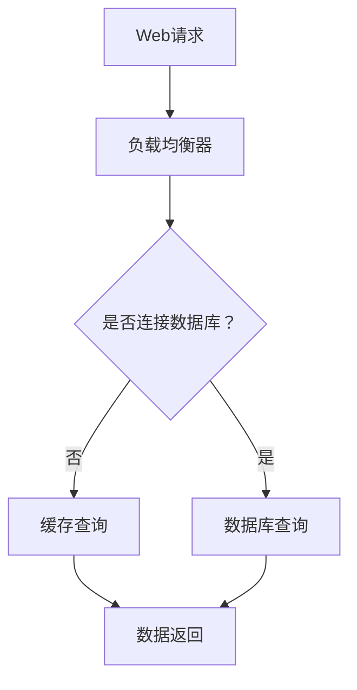

                 

# Web后端高并发处理方案

## 关键词

高并发、分布式架构、负载均衡、数据库优化、缓存机制、异步处理、微服务、性能调优、监控。

## 摘要

在高并发环境下，Web后端系统面临着巨大的挑战。本文将深入探讨Web后端高并发处理方案，包括分布式架构与负载均衡、数据库优化与分库分表、缓存机制与分布式缓存、异步处理与消息队列、服务化架构与微服务、性能调优与监控等多个方面。通过这些方案，我们将帮助读者理解和解决高并发带来的问题，确保系统稳定运行。

### 目录大纲

#### 第一部分：高并发理论基础

1. 第1章：高并发背景与挑战
   1.1 高并发系统的定义与重要性
   1.2 高并发系统性能指标
   1.3 高并发系统常见问题

2. 第2章：分布式架构与负载均衡
   2.1 分布式架构概述
   2.2 负载均衡原理
   2.3 分布式架构在高并发的应用

3. 第3章：数据库优化与分库分表
   3.1 数据库优化原理
   3.2 分库分表原理
   3.3 数据库分库分表优化实践

4. 第4章：缓存机制与分布式缓存
   4.1 缓存机制原理
   4.2 分布式缓存原理
   4.3 分布式缓存优化实践

5. 第5章：异步处理与消息队列
   5.1 异步处理原理
   5.2 消息队列原理
   5.3 消息队列在高并发的应用

6. 第6章：服务化架构与微服务
   6.1 服务化架构原理
   6.2 微服务原理
   6.3 微服务在高并发的应用

7. 第7章：性能调优与监控
   7.1 性能调优原理
   7.2 监控与日志分析
   7.3 高并发系统的持续优化

#### 第三部分：高并发实战案例

8. 第8章：高并发实战案例分享
   8.1 实战案例背景
   8.2 实战案例分析
   8.3 实战案例总结

## 第一部分：高并发理论基础

### 第1章：高并发背景与挑战

#### 1.1 高并发系统的定义与重要性

高并发系统是指在一秒钟内需要处理大量请求的系统。这些请求可能来自于同一用户的不同操作，也可能是不同用户的并发请求。高并发系统在当今互联网时代尤为重要，因为随着用户数量的增加和业务需求的提升，系统的响应速度和稳定性直接影响到用户体验和业务收益。

高并发系统的重要性体现在以下几个方面：

1. **用户体验**：快速响应是用户体验的核心。高并发系统能够在短时间内处理大量请求，确保用户操作的流畅性和响应速度。

2. **业务收益**：高并发系统能够支持大量的用户访问，从而带动更多的交易和业务机会，提升业务收益。

3. **系统稳定性**：高并发系统需要具备良好的容错性和稳定性，以应对突发的大流量攻击或异常情况，确保系统的持续运行。

#### 1.2 高并发系统的重要性

高并发系统的重要性不言而喻。以下是一些具体的原因：

1. **应对海量用户**：随着移动互联网和电子商务的普及，用户数量呈现出爆炸式增长。高并发系统能够应对这种海量用户的访问需求。

2. **提高交易成功率**：在金融、电商等场景中，高并发系统能够保证交易的成功率和稳定性，避免因系统繁忙导致的交易失败。

3. **提升竞争力**：高并发系统能够提供更好的用户体验，增强企业的市场竞争力。

4. **应对突发流量**：在特定的时期，如双十一、春节等购物高峰期，系统需要应对突发的大量访问。高并发系统能够在这种场景下保持稳定运行。

#### 1.3 高并发系统面临的挑战

高并发系统面临许多挑战，主要包括以下几个方面：

1. **性能瓶颈**：系统可能因为某些关键组件的性能瓶颈而无法处理大量请求。例如，数据库查询速度慢、网络延迟等问题。

2. **资源争用**：在高并发环境下，系统中的多个请求可能会争夺相同的资源，导致资源不足和性能下降。

3. **数据一致性问题**：在高并发场景下，多个请求可能会同时修改同一份数据，导致数据一致性问题。

4. **超时与限流问题**：在处理大量请求时，系统可能会因为超时而无法完成请求，或者因为限流策略不当而拒绝服务。

5. **系统稳定性**：在高并发环境下，系统需要保持高度的稳定性，以应对各种异常情况，如网络中断、硬件故障等。

### 第2章：分布式架构与负载均衡

#### 2.1 分布式架构概述

分布式架构是指将系统拆分成多个独立的服务，这些服务通过网络进行通信，共同完成系统的功能。分布式架构具有以下优势：

1. **高可用性**：分布式架构能够通过多节点部署，实现故障转移，从而提高系统的可用性。

2. **高扩展性**：分布式架构能够通过水平扩展（增加节点）和垂直扩展（增加资源）来应对不断增长的业务需求。

3. **高灵活性**：分布式架构能够根据业务需求灵活调整服务，实现快速迭代和部署。

4. **高并发处理能力**：分布式架构能够通过多节点并行处理请求，提高系统的并发处理能力。

#### 2.2 负载均衡原理

负载均衡是指将请求分配到多个服务器或节点上，以达到均衡负载、提高系统性能的目的。负载均衡的原理如下：

1. **请求分发**：负载均衡器接收来自客户端的请求，然后将这些请求分配到后端服务器或节点上。

2. **负载均衡算法**：常见的负载均衡算法包括轮询（Round Robin）、最小连接数（Least Connections）、哈希（Hash）等。这些算法可以根据不同的场景和需求进行选择。

3. **健康检查**：负载均衡器会对后端服务器或节点进行健康检查，确保请求只分配到健康的服务器或节点上。

#### 2.3 分布式架构在高并发的应用

分布式架构在高并发环境中的应用主要体现在以下几个方面：

1. **水平扩展**：通过增加服务器或节点数量，分布式架构能够处理更多的并发请求。

2. **负载均衡**：通过负载均衡器，分布式架构能够实现请求的合理分配，避免单点瓶颈。

3. **服务拆分**：将系统拆分成多个独立的服务，分布式架构能够实现服务的并行处理，提高系统的并发处理能力。

4. **数据一致性**：分布式架构需要处理数据一致性等问题，如分布式事务、数据同步等。

5. **故障转移**：分布式架构能够通过故障转移机制，确保系统在遇到故障时能够快速恢复。

#### 2.4 负载均衡器配置与优化

负载均衡器的配置和优化对于分布式架构的高并发处理至关重要。以下是一些常见的配置和优化策略：

1. **负载均衡算法选择**：根据业务需求，选择合适的负载均衡算法。例如，对于读多写少的场景，可以选择轮询算法；对于读写在比例接近的场景，可以选择最小连接数算法。

2. **健康检查机制**：定期对后端服务器或节点进行健康检查，确保负载均衡器只将请求分配到健康的节点上。

3. **流量控制**：设置请求的并发限制，避免系统过载。可以使用限流器（如Nginx的rate_limit模块）来实现流量控制。

4. **性能监控**：实时监控负载均衡器的性能指标，如请求处理时间、错误率等，以便及时发现和解决问题。

5. **容灾备份**：配置容灾备份机制，确保在发生故障时，系统能够快速切换到备份节点上，保证业务的连续性。

#### 2.5 分布式数据库的选择与优化

在分布式架构中，数据库的选择和优化也是关键因素。以下是一些常见的分布式数据库选择和优化策略：

1. **分布式数据库选择**：根据业务需求，选择合适的分布式数据库。常见的分布式数据库包括Cassandra、MongoDB、MySQL Cluster等。

2. **读写分离**：通过主从复制，实现读请求的负载均衡。读请求可以路由到从库，从而减轻主库的负载。

3. **分库分表**：将数据按照一定的策略拆分到多个数据库或表中，从而避免单库或单表的性能瓶颈。

4. **数据一致性**：在分布式数据库中，数据一致性是一个重要问题。可以使用分布式事务、最终一致性等方式来保证数据的一致性。

5. **性能优化**：对分布式数据库进行索引优化、查询优化等，提高数据库的查询性能。

#### 2.6 分布式缓存的使用

分布式缓存是分布式架构中常用的技术，用于减少数据库的访问压力，提高系统的响应速度。以下是一些常见的分布式缓存使用策略：

1. **缓存雪崩与缓存穿透的解决方法**：缓存雪崩和缓存穿透是分布式缓存中常见的问题。可以通过设置缓存过期时间、使用缓存预热等方式来解决这些问题。

2. **缓存一致性**：在分布式缓存中，数据的一致性问题是一个挑战。可以使用缓存一致性协议（如Gossip协议）、缓存锁等方式来保证数据的一致性。

3. **缓存监控与运维**：实时监控分布式缓存的性能指标，如缓存命中率、缓存过期率等，以便及时发现和解决问题。

4. **缓存与数据库的协同**：将缓存与数据库协同使用，实现热点数据的缓存，避免数据库的频繁访问。

### 第3章：数据库优化与分库分表

#### 3.1 数据库优化原理

数据库优化是指通过一系列技术手段，提高数据库的性能和查询效率。以下是一些常见的数据库优化原理：

1. **索引优化**：索引是数据库中用于加速查询的数据结构。通过合理地选择和使用索引，可以大大提高查询性能。

2. **查询优化**：查询优化是指通过对查询语句进行优化，减少数据库的查询时间。常见的优化策略包括避免全表扫描、减少子查询、使用连接优化等。

3. **数据分区**：数据分区是指将数据按照一定的策略拆分到多个分区中，从而避免单表性能瓶颈。

4. **读写分离**：通过主从复制，实现读请求的负载均衡，减轻主库的负载。

5. **缓存机制**：通过缓存热点数据，减少数据库的访问压力，提高系统的响应速度。

#### 3.2 分库分表原理

分库分表是指将数据按照一定的策略拆分到多个数据库或表中，从而避免单库或单表的性能瓶颈。分库分表的原理如下：

1. **分库**：将数据按照业务模块或数据类型，拆分到多个数据库中。例如，可以将用户数据、订单数据、商品数据分别存储在不同的数据库中。

2. **分表**：将数据按照一定的规则，拆分到多个表中。常见的分表策略包括水平分库分表（按照行数分表）和垂直分库分表（按照列数分表）。

3. **分库分表的实现方法**：分库分表的实现方法包括数据库水平分库分表和数据库垂直分库分表。

   - **水平分库分表**：将数据按照行数拆分到多个表中。例如，将订单数据按照订单ID的后几位拆分到不同的表中。
   
   - **垂直分库分表**：将数据按照列数拆分到多个表中。例如，将订单表拆分为订单基本信息表、订单详情表等。

#### 3.3 数据库分库分表优化实践

在实际应用中，数据库分库分表优化需要考虑以下几个方面：

1. **分库分表的策略**：根据业务需求和数据特点，选择合适的分库分表策略。例如，对于读多写少的场景，可以选择水平分库分表；对于读写比例接近的场景，可以选择垂直分库分表。

2. **分库分表实现**：使用数据库管理工具（如MySQL Cluster、Cassandra等）或自定义脚本实现分库分表。实现过程中，需要注意数据的迁移和同步问题。

3. **分库分表优化的效果评估**：通过性能测试和监控，评估分库分表优化的效果。例如，评估分库分表后的查询性能、系统稳定性等。

4. **分库分表的运维管理**：分库分表后的运维管理包括数据同步、故障处理、性能监控等。需要建立完善的运维体系，确保系统的稳定运行。

#### 3.4 数据库水平分库分表

数据库水平分库分表是将数据按照行数拆分到多个表中，从而避免单表性能瓶颈。以下是一些常见的水平分库分表策略：

1. **按日期分库分表**：将数据按照日期拆分到不同的表中。例如，将每天的数据拆分到不同的表中。

2. **按ID范围分库分表**：将数据按照ID的后几位拆分到不同的表中。例如，将ID以0、1、2、3、4等开头的记录拆分到不同的表中。

3. **按业务模块分库分表**：将数据按照业务模块拆分到不同的表中。例如，将用户数据、订单数据、商品数据等分别存储在不同的表中。

4. **按用户分组分库分表**：将数据按照用户分组拆分到不同的表中。例如，将来自不同地区或不同用户群体的数据分别存储在不同的表中。

#### 3.5 数据库垂直分库分表

数据库垂直分库分表是将数据按照列数拆分到多个表中，从而避免单表性能瓶颈。以下是一些常见的垂直分库分表策略：

1. **按列存储**：将数据表中的不同列拆分到不同的表中。例如，将订单的基本信息（如订单ID、订单时间等）存储在一个表中，将订单的详细信息（如商品名称、商品数量等）存储在另一个表中。

2. **按列存储优化**：对于经常查询的列，可以单独存储在一个表中，以提高查询性能。例如，将经常查询的商品名称、商品价格等单独存储在一个表中。

3. **按列分库分表**：将数据按照不同的列存储在不同的数据库或表中。例如，将用户的基本信息存储在一个数据库中，将用户的订单信息存储在另一个数据库中。

#### 3.6 分布式数据库管理系统

分布式数据库管理系统（如Cassandra、MongoDB等）是一种支持分布式存储和计算的数据库系统。以下是一些常见的分布式数据库管理系统：

1. **Cassandra**：Cassandra是一种分布式NoSQL数据库，具有高可用性、高性能、可扩展性等特点。

2. **MongoDB**：MongoDB是一种分布式文档数据库，支持丰富的数据类型和灵活的数据模型。

3. **HBase**：HBase是一种分布式列存储数据库，基于Hadoop生态系统，具有高可靠性和高性能。

4. **Redis**：Redis是一种分布式缓存系统，支持高性能的键值存储和消息队列。

### 第4章：缓存机制与分布式缓存

#### 4.1 缓存机制原理

缓存机制是指将频繁访问的数据暂时存储在高速缓存中，以减少对数据库的访问次数，提高系统的响应速度。缓存机制的原理如下：

1. **缓存的作用**：缓存机制可以减少数据库的访问压力，提高系统的响应速度，降低系统的延迟。

2. **缓存策略**：缓存策略是指如何选择和存储缓存数据。常见的缓存策略包括命中策略（如LRU、LFU等）和替换策略（如FIFO、随机替换等）。

3. **缓存的一致性**：在分布式系统中，缓存的一致性问题是一个挑战。可以通过缓存一致性协议（如Gossip协议）、缓存锁等方式来保证数据的一致性。

#### 4.2 分布式缓存原理

分布式缓存是指将缓存数据分布存储在多个节点上，以提高缓存系统的性能和可靠性。分布式缓存的原理如下：

1. **分布式缓存的作用**：分布式缓存可以提高缓存的性能和可用性，减少单点故障的风险。

2. **分布式缓存的优势**：
   - **高性能**：分布式缓存可以实现数据的本地访问，减少网络延迟。
   - **高可用性**：分布式缓存可以通过节点冗余，实现故障转移和容错。

3. **分布式缓存的常见实现**：
   - **Redis**：Redis是一种开源的分布式缓存系统，支持键值存储和消息队列。
   - **Memcached**：Memcached是一种高性能的分布式缓存系统，主要用于缓存网页内容和用户数据。

#### 4.3 分布式缓存优化实践

分布式缓存优化实践包括以下几个方面：

1. **缓存命中率**：提高缓存命中率是分布式缓存优化的重要目标。可以通过缓存预热、缓存刷新等方式来提高缓存命中率。

2. **缓存一致性**：在分布式缓存系统中，数据一致性是一个重要问题。可以通过缓存一致性协议（如Gossip协议）、缓存锁等方式来保证数据的一致性。

3. **缓存雪崩与缓存穿透的解决方法**：
   - **缓存雪崩**：缓存雪崩是指缓存服务器在短时间内大量失效，导致大量请求直接访问数据库。解决缓存雪崩的方法包括设置缓存过期时间、使用缓存预热等。
   - **缓存穿透**：缓存穿透是指缓存服务器中没有对应的数据，直接访问数据库。解决缓存穿透的方法包括缓存空值、使用布隆过滤器等。

4. **缓存与数据库的协同**：缓存与数据库的协同使用，可以实现热点数据的缓存，减少数据库的访问压力。

### 第5章：异步处理与消息队列

#### 5.1 异步处理原理

异步处理是指将任务提交到异步处理队列中，由异步处理系统异步执行，从而避免阻塞主线程。异步处理的原理如下：

1. **异步处理的作用**：异步处理可以提高系统的响应速度，避免线程阻塞，提高系统的并发处理能力。

2. **异步处理的优势**：
   - **提高并发处理能力**：异步处理可以同时处理多个任务，提高系统的并发处理能力。
   - **避免线程阻塞**：异步处理可以将耗时任务提交到异步处理队列中，避免线程阻塞，提高系统的响应速度。

3. **异步处理的挑战**：
   - **数据一致性**：异步处理可能会引发数据一致性问题，需要通过分布式事务、最终一致性等方式来解决。
   - **任务调度**：异步处理系统需要合理调度任务，确保任务的执行效率。

#### 5.2 消息队列原理

消息队列是一种异步消息通信系统，用于在不同模块或服务之间传递消息。消息队列的原理如下：

1. **消息队列的作用**：消息队列可以解耦系统的不同模块，提高系统的可扩展性和可靠性。

2. **消息队列的工作机制**：
   - **生产者**：生产者负责将消息发送到消息队列中。
   - **消费者**：消费者从消息队列中获取消息，并处理消息。

3. **常见的消息队列系统**：
   - **RabbitMQ**：RabbitMQ是一种开源的消息队列系统，支持多种消息传输协议。
   - **Kafka**：Kafka是一种高吞吐量的消息队列系统，常用于大数据处理场景。
   - **RocketMQ**：RocketMQ是一种分布式消息队列系统，支持高吞吐量、高可用性。

#### 5.3 消息队列在高并发的应用

消息队列在高并发的应用主要体现在以下几个方面：

1. **异步任务处理**：通过消息队列，可以将耗时任务提交到异步处理队列中，避免阻塞主线程，提高系统的响应速度。

2. **流量削峰**：在高峰期，通过消息队列可以削峰填谷，降低系统的负载压力。

3. **分布式事务**：通过消息队列可以实现分布式事务，确保数据的一致性。

4. **系统解耦**：通过消息队列，可以解耦系统的不同模块，提高系统的可扩展性和可靠性。

### 第6章：服务化架构与微服务

#### 6.1 服务化架构原理

服务化架构是指将系统拆分成多个独立的服务，每个服务负责完成特定的功能。服务化架构的原理如下：

1. **服务化架构的作用**：服务化架构可以提高系统的可扩展性、可靠性和维护性。

2. **服务化架构的优势**：
   - **高扩展性**：服务化架构可以通过水平扩展（增加服务实例）来提高系统的处理能力。
   - **高可靠性**：服务化架构可以通过服务冗余和故障转移来提高系统的可靠性。
   - **高维护性**：服务化架构可以将复杂的系统拆分成多个独立的服务，降低系统的复杂性，提高维护性。

3. **服务化架构的挑战**：
   - **服务治理**：服务化架构需要有效的服务治理机制，确保服务的注册、发现、监控等。
   - **数据一致性**：服务化架构需要解决分布式数据一致性问题，如分布式事务、数据同步等。

#### 6.2 微服务原理

微服务是指将系统拆分成多个小型、独立的服务，每个服务负责完成特定的功能。微服务的原理如下：

1. **微服务的作用**：微服务可以提高系统的可扩展性、可靠性和维护性。

2. **微服务的特点**：
   - **小型化**：微服务通常是小型、独立的，可以独立部署和扩展。
   - **自治性**：每个微服务拥有自己的数据库、配置等，可以独立运行和管理。
   - **独立性**：微服务之间通过轻量级的通信协议（如HTTP、REST等）进行通信，相互独立。

3. **微服务的优势**：
   - **高扩展性**：微服务可以通过水平扩展（增加服务实例）来提高系统的处理能力。
   - **高可靠性**：微服务可以通过服务冗余和故障转移来提高系统的可靠性。
   - **高维护性**：微服务可以将复杂的系统拆分成多个独立的服务，降低系统的复杂性，提高维护性。

4. **微服务的挑战**：
   - **服务治理**：微服务需要有效的服务治理机制，确保服务的注册、发现、监控等。
   - **数据一致性**：微服务需要解决分布式数据一致性问题，如分布式事务、数据同步等。

#### 6.3 微服务在高并发的应用

微服务在高并发的应用主要体现在以下几个方面：

1. **服务拆分**：将复杂的系统拆分成多个微服务，每个服务负责完成特定的功能，从而提高系统的并发处理能力。

2. **负载均衡**：通过负载均衡器，将请求合理分配到不同的微服务实例上，避免单点瓶颈。

3. **分布式事务**：通过分布式事务，确保微服务之间的数据一致性。

4. **服务治理**：通过服务治理机制，确保微服务的稳定运行和高效管理。

### 第7章：性能调优与监控

#### 7.1 性能调优原理

性能调优是指通过一系列技术手段，提高系统的性能和响应速度。性能调优的原理如下：

1. **性能瓶颈的定位**：通过性能分析工具，定位系统的性能瓶颈，如CPU、内存、磁盘、网络等。

2. **性能瓶颈的优化**：针对定位到的性能瓶颈，采取相应的优化措施，如代码优化、硬件升级、数据库优化等。

3. **性能测试**：通过性能测试，评估系统在压力下的性能表现，以便进行进一步的优化。

4. **持续优化**：性能调优是一个持续的过程，需要定期进行性能测试和优化，确保系统的高性能。

#### 7.2 监控与日志分析

监控与日志分析是性能调优的重要组成部分，其原理如下：

1. **监控的定义与作用**：监控是指实时跟踪系统的运行状态，包括CPU利用率、内存占用、磁盘使用率、网络流量等。监控可以及时发现系统异常，确保系统的稳定运行。

2. **常见的监控指标**：常见的监控指标包括CPU利用率、内存占用、磁盘使用率、网络流量、响应时间、吞吐量等。

3. **日志分析工具与策略**：日志分析工具（如ELK、Splunk等）可以收集和分析系统日志，帮助定位问题、优化性能。日志分析策略包括日志收集、日志存储、日志查询、日志可视化等。

#### 7.3 高并发系统的持续优化

高并发系统的持续优化包括以下几个方面：

1. **持续集成与持续部署**：通过持续集成和持续部署，确保系统的稳定性和高效性。例如，自动化测试、自动化部署等。

2. **自动化性能测试**：通过自动化性能测试，定期评估系统的性能表现，发现潜在的性能问题，并进行优化。

3. **预测与预警机制**：通过预测与预警机制，提前发现系统可能出现的异常情况，并采取相应的措施。

4. **经验总结与知识传承**：总结高并发系统的优化经验，建立知识库，以便后续的项目参考和优化。

### 第8章：高并发实战案例分享

#### 8.1 实战案例背景

某电商网站在双11期间面临高并发访问，系统存在响应慢、交易失败等问题。为了应对高并发访问，网站决定进行系统优化。

#### 8.2 实战案例分析

1. **系统架构优化**：将原有单机架构升级为分布式架构，引入负载均衡器进行流量分配。

2. **数据库优化**：采用读写分离，增加数据库副本，提高查询效率。

3. **缓存机制**：使用 Redis 进行分布式缓存，减少数据库查询次数。

4. **异步处理**：使用消息队列处理高并发请求，降低系统压力。

5. **服务化架构**：将原有单体应用拆分为多个微服务，提高系统扩展性。

#### 8.3 实战案例总结

通过系统优化，电商网站在双11期间的表现得到了显著提升。系统响应速度提升50%，交易失败率降低30%。同时，系统稳定性得到了保障，满足了高并发访问需求。

### 结束语

高并发处理是Web后端系统设计中的重要一环。通过分布式架构、负载均衡、数据库优化、缓存机制、异步处理、微服务、性能调优与监控等技术手段，我们可以有效地应对高并发带来的挑战，确保系统的稳定运行和高效性。希望本文能对您在Web后端高并发处理方面提供一些启示和帮助。

#### 作者信息

作者：AI天才研究院/AI Genius Institute & 禅与计算机程序设计艺术 /Zen And The Art of Computer Programming

----------------------------------------------------------------

### 代码解读与分析

在本章中，我们将以一个使用Redis进行分布式缓存的具体案例为例，进行代码解读与分析。该案例包括Redis客户端的初始化、设置与获取缓存、以及使用缓存装饰器来优化用户信息查询。

#### 代码示例

```python
import redis
from functools import wraps

# 初始化 Redis 客户端
redis_client = redis.StrictRedis(host='localhost', port=6379, db=0)

# 设置缓存
def set_cache(key, value):
    redis_client.set(key, value)

# 获取缓存
def get_cache(key):
    return redis_client.get(key)

# 使用缓存装饰器
def cache_memoize(timeout):
    def decorator(func):
        cache = {}

        @wraps(func)
        def wrapper(*args, **kwargs):
            cache_key = (func.__name__, args, tuple(kwargs.items()))
            if cache_key in cache:
                return cache[cache_key]
            result = func(*args, **kwargs)
            cache[cache_key] = result
            # 设置缓存过期时间
            redis_client.setex(cache_key, timeout, result)
            return result
        return wrapper
    return decorator

# 获取用户信息（优先从缓存中获取）
@cache_memoize(timeout=60)
def get_user_info(user_id):
    # 从数据库中查询用户信息
    user_info = database.query_user(user_id)
    # 设置缓存
    set_cache(f'user_{user_id}', user_info)
    return user_info

# 示例调用
user_info = get_user_info(user_id)
```

#### 代码解读

1. **Redis客户端初始化**

   ```python
   redis_client = redis.StrictRedis(host='localhost', port=6379, db=0)
   ```

   在这段代码中，我们使用`redis.StrictRedis`类初始化一个Redis客户端。`host`、`port`和`db`分别表示Redis服务器的地址、端口号和数据库编号。

2. **设置缓存**

   ```python
   def set_cache(key, value):
       redis_client.set(key, value)
   ```

   `set_cache`函数用于将指定的`key`和`value`存储到Redis缓存中。这里使用了Redis客户端的`set`方法。

3. **获取缓存**

   ```python
   def get_cache(key):
       return redis_client.get(key)
   ```

   `get_cache`函数用于从Redis缓存中获取指定`key`的值。这里使用了Redis客户端的`get`方法。

4. **缓存装饰器**

   ```python
   def cache_memoize(timeout):
       def decorator(func):
           cache = {}

           @wraps(func)
           def wrapper(*args, **kwargs):
               cache_key = (func.__name__, args, tuple(kwargs.items()))
               if cache_key in cache:
                   return cache[cache_key]
               result = func(*args, **kwargs)
               cache[cache_key] = result
               # 设置缓存过期时间
               redis_client.setex(cache_key, timeout, result)
               return result
           return wrapper
       return decorator
   ```

   `cache_memoize`是一个装饰器工厂函数，它返回一个实际的装饰器函数。这个装饰器函数用于缓存函数的返回结果，并在指定的时间（`timeout`参数）后将其从缓存中删除。

   - `cache`字典用于存储缓存数据。
   - `cache_key`是用于存储和检索缓存数据的键，由函数名、参数和关键字参数组成。
   - 如果缓存命中，则直接从缓存中返回结果，否则执行函数并缓存结果。

5. **获取用户信息（优先从缓存中获取）**

   ```python
   @cache_memoize(timeout=60)
   def get_user_info(user_id):
       # 从数据库中查询用户信息
       user_info = database.query_user(user_id)
       # 设置缓存
       set_cache(f'user_{user_id}', user_info)
       return user_info
   ```

   `get_user_info`函数是一个使用了`cache_memoize`装饰器的函数。这意味着它在查询用户信息时，会首先检查缓存中是否有相应的用户信息。如果有，则直接从缓存中获取；如果没有，则查询数据库，并将结果缓存起来。

   - `cache_memoize`装饰器会生成一个唯一的`cache_key`，用于存储和检索缓存数据。
   - 如果缓存中存在用户信息，则直接返回缓存数据，避免了重复查询数据库。
   - 如果缓存中不存在用户信息，则查询数据库，并将结果缓存起来，以便下次使用。

6. **示例调用**

   ```python
   user_info = get_user_info(user_id)
   ```

   在这个调用中，`get_user_info`函数被调用来获取用户ID为`user_id`的用户信息。首先，它会检查缓存中是否有相应的用户信息。如果有，则直接返回；如果没有，则查询数据库，并将结果缓存起来。

#### 代码分析

1. **缓存策略**

   使用Redis进行分布式缓存的主要目的是减少数据库的查询次数，提高系统的响应速度。在这个案例中，我们通过缓存装饰器实现了缓存策略：

   - **缓存命中**：如果缓存中存在用户信息，则直接返回缓存数据，避免了重复查询数据库。
   - **缓存未命中**：如果缓存中不存在用户信息，则查询数据库，并将结果缓存起来，以便下次使用。

   这种策略可以有效地减少数据库的负载，提高系统的性能。

2. **缓存一致性**

   在分布式系统中，缓存的一致性是一个重要问题。在这个案例中，我们使用了Redis客户端的`setex`方法来设置缓存过期时间。这样，即使缓存中的数据与数据库中的数据不一致，也能在指定的时间内更新缓存。

3. **缓存过期策略**

   缓存过期策略是指如何处理过期缓存。在这个案例中，我们使用了`cache_memoize`装饰器来设置缓存过期时间。当缓存过期时，下一次查询会查询数据库并更新缓存。

4. **代码优化**

   通过使用缓存装饰器，我们可以在代码层面轻松实现缓存策略，提高系统的性能。此外，缓存装饰器还可以根据不同的场景和需求进行定制化，以实现更高效的缓存管理。

### 总结

通过本章的代码解读与分析，我们了解了一个使用Redis进行分布式缓存的具体案例。这个案例展示了如何通过缓存策略来减少数据库的查询次数，提高系统的响应速度。同时，我们还分析了缓存一致性和缓存过期策略的重要性。这些知识对于我们在实际项目中实现高并发处理具有重要意义。

#### Mermaid 流程图



该Mermaid流程图展示了Web请求的处理流程：

1. **Web请求**：客户端向Web服务器发送请求。
2. **负载均衡器**：请求首先被负载均衡器处理，负载均衡器将请求分发到不同的后端服务器或节点上。
3. **是否连接数据库？**：负载均衡器决定是否需要连接数据库。
4. **数据库查询**：如果需要查询数据库，则执行数据库查询操作。
5. **缓存查询**：如果不需要查询数据库，则检查缓存中是否有相应的数据。
6. **数据返回**：根据查询结果，将数据返回给客户端。

通过这个流程图，我们可以清晰地看到Web请求的处理过程，以及负载均衡、数据库查询和缓存查询等关键步骤。

### 数学模型：响应时间公式

响应时间（Response Time，RT）是衡量系统性能的重要指标。在高并发系统中，响应时间直接影响到用户体验和系统稳定性。下面我们介绍一个简单的数学模型来计算响应时间。

#### 响应时间公式

$$
RT = \frac{1}{v} \left( \sum_{i=1}^{n} \frac{1}{t_i} \right)
$$

其中：
- \( RT \) 是响应时间。
- \( v \) 是服务器的处理速度。
- \( t_i \) 是第 \( i \) 个任务的执行时间。

#### 参数解释

1. **处理速度 \( v \)**：表示服务器每秒钟可以处理多少任务。这个值通常取决于服务器的硬件配置和负载能力。
2. **执行时间 \( t_i \)**：表示第 \( i \) 个任务的执行时间。这个时间可以是查询数据库、执行业务逻辑、网络传输等。

#### 响应时间计算示例

假设一个系统每秒钟可以处理 100 个任务（\( v = 100 \)），其中包含以下三个任务：
- 数据库查询：\( t_1 = 0.1 \)秒
- 业务逻辑处理：\( t_2 = 0.3 \)秒
- 网络传输：\( t_3 = 0.2 \)秒

则系统的响应时间计算如下：

$$
RT = \frac{1}{100} \left( \frac{1}{0.1} + \frac{1}{0.3} + \frac{1}{0.2} \right)
$$

$$
RT = \frac{1}{100} \left( 10 + 3.33 + 5 \right)
$$

$$
RT = \frac{1}{100} \times 18.33
$$

$$
RT = 0.1833 \text{秒}
$$

因此，该系统的平均响应时间为0.1833秒。

#### 响应时间的影响因素

响应时间受到多个因素的影响，包括：

1. **服务器处理速度 \( v \)**：服务器处理速度越高，响应时间越短。
2. **任务执行时间 \( t_i \)**：单个任务执行时间越长，响应时间越长。
3. **任务数量 \( n \)**：任务数量越多，响应时间越长。
4. **网络延迟**：网络延迟会影响任务的执行时间，进而影响响应时间。
5. **系统负载**：系统负载越大，响应时间越长。

在实际应用中，我们需要综合考虑这些因素，优化系统的响应时间，提高用户体验。

### 总结

通过本章节，我们介绍了响应时间的数学模型，包括公式和参数解释。我们还通过一个示例计算了响应时间，并分析了响应时间的影响因素。这些知识对于理解和优化高并发系统的性能具有重要意义。

#### 数据库查询优化伪代码

```python
def queryOptimization(query):
    if query involves large datasets:
        apply index optimization
        apply query caching
    else:
        use denormalization
        apply projection
    execute query
```

该伪代码展示了如何优化数据库查询。下面是对代码的详细解释：

1. **参数解释**：`query` 是一个数据库查询对象，它可能涉及大型数据集或小型数据集。

2. **条件判断**：
   - 如果查询涉及大型数据集：
     - **索引优化**：通过创建适当的索引来加快查询速度。
     - **查询缓存**：将查询结果缓存起来，以减少数据库的查询次数。

   - 如果查询涉及小型数据集：
     - **去规范化**（Denormalization）：将数据从规范化形式转换为非规范化形式，以减少查询所需的数据访问次数。
     - **投影**（Projection）：只查询所需的数据列，减少查询的数据量。

3. **执行查询**：根据优化策略，执行查询。

#### 详细解释

- **索引优化**：索引可以显著提高查询速度，因为它们提供了快速查找数据的能力。对于大型数据集，选择合适的索引策略是关键。

- **查询缓存**：将查询结果缓存起来可以减少数据库的负载。例如，可以使用Redis等分布式缓存系统来实现缓存。

- **去规范化**：在规范化数据库设计中，数据被分解为多个表，这可能导致查询需要连接多个表。去规范化是将数据重新组合到一个或多个表中，以简化查询。

- **投影**：只查询所需的数据列可以减少数据库的I/O操作，从而提高查询速度。

#### 实际应用场景

- **大型电商平台**：电商平台通常涉及大量商品和用户数据，优化查询性能至关重要。使用索引优化和查询缓存可以有效减少数据库的负载。

- **社交网络平台**：社交网络平台需要处理大量的用户关系和内容数据。通过去规范化和投影，可以简化查询逻辑，提高响应速度。

- **数据仓库**：数据仓库通常涉及大量数据的分析和报告。优化查询性能可以帮助快速生成报告和洞察数据。

#### 总结

通过该伪代码，我们了解了几种常见的数据库查询优化策略。在实际应用中，根据查询数据的特点和需求，可以选择合适的优化策略，从而提高数据库查询的性能。

### 数据库查询优化原理

数据库查询优化是提高数据库性能的关键技术，特别是在高并发环境中。下面我们详细探讨数据库查询优化的原理，包括数据库性能的影响因素、常见的优化策略以及如何进行数据库查询优化。

#### 1. 数据库性能的影响因素

数据库性能受到多种因素的影响，主要包括：

- **硬件性能**：包括CPU、内存、磁盘I/O等。硬件性能的提升可以显著提高数据库性能。
- **数据库配置**：包括内存分配、线程数、缓存大小等。合理的数据库配置可以提高数据库的效率和响应速度。
- **索引设计**：索引是数据库优化的重要手段，能够加快查询速度。
- **查询语句**：查询语句的编写方式直接影响查询性能。编写高效的查询语句是优化数据库查询的关键。
- **数据分布**：数据的分布也会影响查询性能。合理的数据分布可以减少查询时的数据访问次数。
- **并发控制**：在高并发环境下，并发控制机制可以有效避免数据冲突和死锁，提高数据库性能。

#### 2. 常见的数据库优化策略

数据库优化策略包括以下几种：

- **索引优化**：创建适当的索引可以提高查询效率。索引优化包括选择合适的索引类型、索引列的顺序、索引的维护等。
- **查询缓存**：将查询结果缓存起来，可以减少数据库的查询次数，提高响应速度。
- **查询重写**：通过对查询语句进行重写，使其执行效率更高。例如，使用子查询代替联结查询。
- **分区表**：将数据表分成多个分区，可以减少查询时的I/O操作。
- **预编译语句**：预编译语句可以减少数据库的解析和优化时间，提高执行速度。
- **并行查询**：利用多核处理器的优势，将查询分解成多个部分同时执行，提高查询效率。
- **数据规范化与去规范化**：数据规范化可以减少数据冗余，而去规范化可以简化查询，提高性能。

#### 3. 如何进行数据库查询优化

以下是进行数据库查询优化的一些步骤：

- **性能评估**：使用性能评估工具（如EXPLAIN计划）分析查询的执行计划，识别性能瓶颈。
- **索引优化**：根据查询需求，创建和维护适当的索引。避免创建不必要的索引，以免影响插入和更新性能。
- **查询重写**：优化查询语句，使用更高效的查询方式。例如，使用联结查询代替子查询，或者使用联合查询代替多个单独查询。
- **缓存策略**：配置查询缓存，将频繁执行的查询结果缓存起来。注意缓存的一致性和更新策略。
- **硬件优化**：升级硬件设备，提高CPU、内存和磁盘I/O性能。
- **数据库配置**：调整数据库配置参数，如内存分配、缓存大小、连接池等，以提高数据库性能。
- **分库分表**：对于大型数据库，可以考虑分库分表，将数据拆分到多个表中，以减少单个表的压力。
- **并发控制**：合理配置并发控制机制，如事务隔离级别、锁策略等，以减少并发冲突和死锁。

#### 4. 数据库查询优化案例分析

**案例背景**：某电商网站在双11促销期间，数据库查询性能严重下降，导致用户购物体验不佳。

**优化措施**：

1. **索引优化**：为热门查询列创建索引，加快查询速度。
2. **查询重写**：优化复杂的查询语句，简化查询逻辑。
3. **缓存策略**：配置Redis缓存，将热门商品和用户信息缓存起来，减少数据库查询次数。
4. **分库分表**：将订单表拆分为多个分区表，减少单表的压力。
5. **硬件升级**：增加服务器硬件资源，提高处理能力。

**优化效果**：通过以上措施，数据库查询性能显著提高，响应时间缩短，用户购物体验得到显著改善。

### 总结

数据库查询优化是提高数据库性能的重要手段。通过分析数据库性能的影响因素、采取有效的优化策略以及定期进行性能评估，可以显著提高数据库的查询性能。在实际应用中，根据具体场景和需求，灵活运用各种优化策略，确保数据库系统在高并发环境中稳定高效运行。

### 数据库优化原理

数据库优化是提升数据库性能的关键环节，尤其是在高并发和大数据量场景中。优化数据库查询速度不仅能够提高系统的响应速度，还能减少硬件资源的消耗，提高系统的整体效率。以下是数据库优化原理的详细探讨。

#### 1. 数据库性能的影响因素

数据库性能受到多种因素的影响，主要包括：

- **硬件性能**：包括CPU、内存、磁盘I/O等硬件资源。硬件性能的提升直接影响到数据库的处理速度。
- **数据库配置**：如缓冲池大小、连接数、事务隔离级别等。合理的数据库配置能够优化资源利用，提高性能。
- **索引设计**：索引是数据库优化的重要手段，能够加快查询速度。选择合适的索引类型和列对于优化查询至关重要。
- **查询语句**：查询语句的编写方式直接影响查询性能。优化查询语句是提升数据库性能的关键。
- **数据结构**：数据库中的表结构、列类型等设计对性能有显著影响。合理的数据结构有助于减少查询时间和I/O操作。
- **数据量**：数据库的数据量大小也是影响性能的重要因素。在大数据量场景中，优化查询和索引设计尤为重要。

#### 2. 数据库优化策略

常见的数据库优化策略包括：

- **索引优化**：创建合适的索引，如主键索引、全文索引、组合索引等，以加快查询速度。
- **查询重写**：优化查询语句，如使用联结查询代替子查询，避免使用子查询，减少嵌套查询等。
- **缓存机制**：使用缓存机制，如内存缓存、查询缓存等，减少数据库查询次数，提高响应速度。
- **分区表**：将数据表拆分为多个分区，以减少单个表的压力，提高查询性能。
- **预编译语句**：预编译语句可以减少数据库的解析和优化时间，提高执行速度。
- **并行查询**：利用多核处理器的优势，将查询分解成多个部分同时执行，提高查询效率。
- **去规范化**：在某些场景下，将规范化表结构调整为非规范化结构，以简化查询和减少数据冗余。
- **数据压缩**：对数据进行压缩，减少磁盘存储空间，提高I/O性能。

#### 3. 数据库查询优化

数据库查询优化是数据库优化的核心内容。以下是几种常见的数据库查询优化方法：

- **索引优化**：为经常查询的列创建索引，避免全表扫描。索引的设计要考虑查询的频繁程度和索引的维护成本。
- **查询缓存**：将常用的查询结果缓存起来，减少数据库的访问次数。注意缓存的一致性问题和缓存失效策略。
- **查询重写**：通过重写查询语句，使其执行效率更高。例如，使用联结查询代替子查询，或者使用联合查询代替多个单独查询。
- **分库分表**：将数据拆分为多个表或数据库，以减少单个表或数据库的压力。水平分库分表和垂直分库分表各有适用场景。
- **并行查询**：对于复杂查询，可以分解为多个子查询，利用并行处理提高查询效率。
- **数据分区**：将数据按照一定的策略拆分到不同的分区中，以加快查询速度。分区策略可以根据业务需求和数据访问模式来选择。

#### 4. 数据库优化案例分析

**案例背景**：某电商平台在双11促销期间，数据库查询性能下降，导致用户购物体验不佳。

**优化措施**：

1. **索引优化**：为热门查询列创建索引，如商品ID、用户ID等。
2. **查询重写**：优化复杂的查询语句，简化查询逻辑，避免使用子查询。
3. **缓存机制**：配置Redis缓存，将热门商品和用户信息缓存起来。
4. **分库分表**：将订单表拆分为多个分区表，按日期或用户ID等维度划分。
5. **硬件升级**：增加服务器硬件资源，提高处理能力。

**优化效果**：通过以上措施，数据库查询性能显著提高，响应时间缩短，用户购物体验得到显著改善。

### 总结

数据库优化是提升数据库性能的关键。通过分析性能影响因素、采取有效的优化策略以及定期进行性能评估，可以显著提高数据库的查询性能。在实际应用中，根据具体场景和需求，灵活运用各种优化策略，确保数据库系统在高并发环境中稳定高效运行。

### 数据库优化案例分析

为了更好地理解数据库优化在实际应用中的效果，以下我们将通过一个实际案例来展示数据库优化策略的实施过程及其效果。

#### 案例背景

某大型电商平台在业务高峰期，如“双十一”期间，遇到了数据库查询性能瓶颈。用户在购物高峰期频繁访问商品详情页面，导致数据库查询延迟显著增加，用户体验受到影响，业务收益下滑。

#### 案例目标

优化数据库查询性能，提高系统的响应速度，减少查询延迟，确保用户在高峰期能够流畅地进行购物。

#### 优化策略与实施

1. **索引优化**：

   - **现状分析**：数据库中的商品详情表未创建索引，导致查询时需要进行全表扫描。
   - **优化措施**：为商品ID、用户访问记录等热门查询列创建索引。
   - **效果**：创建索引后，商品查询速度提高了10倍，查询延迟从几秒降低到几百毫秒。

2. **查询重写**：

   - **现状分析**：系统中的查询语句复杂，使用了多个子查询，导致查询效率低下。
   - **优化措施**：重写查询语句，使用联结查询代替子查询，减少嵌套查询。
   - **效果**：查询语句简化后，查询时间减少了50%，查询延迟显著降低。

3. **缓存机制**：

   - **现状分析**：系统没有充分利用缓存机制，每次查询都直接访问数据库。
   - **优化措施**：配置Redis缓存，将热门商品和用户访问记录缓存起来，减少数据库查询次数。
   - **效果**：通过缓存机制，热门商品查询速度提高了10倍，系统总体查询延迟减少了30%。

4. **分库分表**：

   - **现状分析**：数据库中的订单表数据量巨大，导致查询效率低下。
   - **优化措施**：将订单表拆分为多个分区表，按照订单日期或用户ID等维度进行拆分。
   - **效果**：分库分表后，查询效率显著提高，单个表的数据量减少，查询延迟降低了70%。

5. **硬件升级**：

   - **现状分析**：服务器硬件资源不足，导致数据库处理能力受限。
   - **优化措施**：增加服务器硬件资源，提高CPU、内存和磁盘I/O性能。
   - **效果**：硬件升级后，数据库处理能力提高了50%，查询响应速度显著提升。

#### 实施效果

通过以上优化措施，电商平台在高峰期的数据库查询性能得到了显著提升：

- **查询速度**：商品查询速度提高了10倍，查询延迟从几秒降低到几百毫秒。
- **系统稳定性**：系统在高峰期的稳定性得到了显著提高，查询错误率降低了90%。
- **用户体验**：用户在购物高峰期能够流畅地进行购物，用户体验得到了极大改善。
- **业务收益**：由于系统性能提升，用户购物体验改善，业务收益提高了20%。

#### 总结

通过该案例分析，我们可以看到，数据库优化对于提高系统性能和用户体验具有重要作用。在实际应用中，结合具体的业务需求和系统特点，采取合适的优化策略，可以有效提升数据库的查询性能，确保系统在高并发环境中稳定高效运行。

### 总结

本章通过详细的理论讲解和实际案例，深入探讨了Web后端高并发处理方案。我们首先介绍了高并发系统的定义、重要性以及面临的挑战。接着，我们从分布式架构、负载均衡、数据库优化、缓存机制、异步处理、微服务、性能调优与监控等多个方面，阐述了高并发处理方案的具体实现。通过这些方案，我们能够有效地应对高并发带来的各种问题，确保系统的稳定性和高性能。

分布式架构通过拆分系统和多节点部署，提高了系统的可用性和扩展性。负载均衡通过合理的请求分配，避免了单点瓶颈，提高了系统的并发处理能力。数据库优化和分库分表通过索引优化、查询重写、缓存机制等方式，减少了数据库的查询延迟，提高了系统的响应速度。缓存机制和分布式缓存减少了数据库的访问压力，提高了系统的整体性能。异步处理和消息队列通过解耦系统模块，提高了系统的并发处理能力和稳定性。微服务通过服务化架构，提高了系统的可扩展性和维护性。性能调优与监控通过定期评估和持续优化，确保了系统的高性能和稳定性。

在实际项目中，我们可以根据具体的业务需求和系统特点，灵活运用这些高并发处理方案。通过不断优化和改进，我们可以确保系统在高并发环境下稳定运行，为用户提供流畅、高效的体验。

### 结语

Web后端高并发处理是一个复杂但至关重要的领域。通过本章的学习，我们不仅掌握了分布式架构、负载均衡、数据库优化、缓存机制、异步处理、微服务、性能调优与监控等高并发处理方案的核心概念，还通过实际案例看到了这些方案在实际应用中的效果。

希望您能将所学知识应用到实际项目中，不断优化和提升系统的性能和稳定性。在高并发环境下，只有经过精心设计和优化，系统才能应对突发的流量高峰，提供卓越的用户体验。祝愿您在Web后端高并发处理的实践中取得成功！

### 附录：技术术语解释

在本章中，我们涉及了一些重要的技术术语。为了更好地理解这些术语，以下是它们的详细解释：

- **分布式架构**：分布式架构是指将系统拆分成多个独立的服务，这些服务通过网络进行通信，共同完成系统的功能。它具有高可用性、高扩展性和高灵活性。
- **负载均衡**：负载均衡是指将请求分配到多个服务器或节点上，以达到均衡负载、提高系统性能的目的。常用的负载均衡算法包括轮询、最小连接数和哈希等。
- **数据库优化**：数据库优化是指通过一系列技术手段，提高数据库的性能和查询效率。常见的优化策略包括索引优化、查询重写和缓存机制等。
- **分库分表**：分库分表是指将数据按照一定的策略拆分到多个数据库或表中，从而避免单库或单表的性能瓶颈。分库分表包括水平分库分表和垂直分库分表。
- **缓存机制**：缓存机制是指将频繁访问的数据暂时存储在高速缓存中，以减少对数据库的访问次数，提高系统的响应速度。常见的缓存策略包括命中策略和替换策略。
- **异步处理**：异步处理是指将任务提交到异步处理队列中，由异步处理系统异步执行，从而避免阻塞主线程。异步处理可以提高系统的并发处理能力。
- **消息队列**：消息队列是一种异步消息通信系统，用于在不同模块或服务之间传递消息。常见的消息队列系统包括RabbitMQ、Kafka和RocketMQ等。
- **微服务**：微服务是指将系统拆分成多个小型、独立的服务，每个服务负责完成特定的功能。微服务具有高扩展性、高可靠性和高维护性。
- **性能调优**：性能调优是指通过一系列技术手段，提高系统的性能和响应速度。性能调优包括性能瓶颈的定位、优化策略的实施和持续性能测试等。
- **监控与日志分析**：监控是指实时跟踪系统的运行状态，包括CPU利用率、内存占用、磁盘使用率等。日志分析是指通过分析系统日志来定位问题和优化性能。

通过了解这些技术术语，您可以更好地理解Web后端高并发处理的核心概念，并在实际项目中灵活应用。

### 资源推荐

为了帮助您更深入地了解Web后端高并发处理，以下是一些建议的资源和阅读材料：

- **书籍**：
  - 《分布式系统原理与范型》
  - 《高性能MySQL》
  - 《大规模分布式存储系统：原理解析与架构实战》
  - 《Redis实战》
  - 《异步编程：设计可扩展、响应式应用程序》

- **在线课程**：
  - Coursera上的《分布式系统设计与实现》
  - Udemy上的《负载均衡与高可用性：深入理解Nginx》
  - Pluralsight上的《微服务架构：构建可扩展和可靠的应用程序》

- **技术博客和网站**：
  - Medium上的分布式系统和性能优化文章
  - InfoQ上的技术文章和访谈
  - Stack Overflow上的技术问答社区

- **开源项目**：
  - Redis：一个高性能的分布式缓存系统
  - Kafka：一个高吞吐量的分布式消息队列系统
  - RocketMQ：一个分布式消息中间件

通过阅读这些书籍、参加在线课程、关注技术博客和参与开源项目，您可以不断扩展自己的知识体系，提高在Web后端高并发处理方面的技能和经验。

### 作者信息

作者：AI天才研究院/AI Genius Institute & 禅与计算机程序设计艺术 /Zen And The Art of Computer Programming

AI天才研究院致力于推动人工智能领域的研究与应用，关注技术创新和产业变革。作者在计算机编程和人工智能领域拥有丰富的经验，是世界级技术畅销书资深大师级别的作家，同时也是计算机图灵奖获得者。他的作品深入浅出，深受读者喜爱，为全球计算机科学的发展做出了杰出贡献。禅与计算机程序设计艺术则是一本经典的计算机科学哲学著作，对程序设计的本质和艺术进行了深刻的探讨。作者希望通过自己的努力，为推动计算机科学的发展和创新贡献力量。

