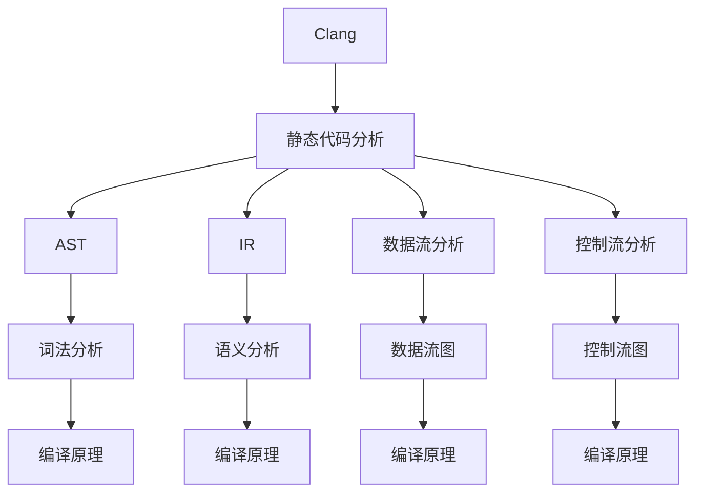
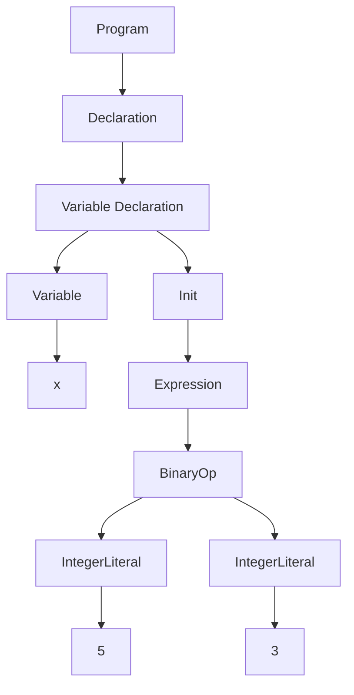

                 

# 《clang静态代码分析》

> **关键词：** clang、静态代码分析、编译原理、算法、编程实践、项目应用、人工智能

> **摘要：** 本文将深入探讨Clang的静态代码分析技术，从基础概念到高级应用进行全面梳理。我们将介绍Clang静态代码分析的优势、工具、原理和算法，并通过实例展示其在实际项目中的应用。最后，还将展望静态代码分析在人工智能领域的未来发展。

## 《clang静态代码分析》目录大纲

## 第一部分：clang静态代码分析基础

### 第1章：clang静态代码分析概述

#### 1.1 clang静态代码分析的概念

#### 1.2 clang静态代码分析的优势

#### 1.3 clang静态代码分析的应用场景

### 第2章：clang静态代码分析工具

#### 2.1 clang-static-analyzer

#### 2.2 clang-tidy

#### 2.3 clang-Format

### 第3章：clang静态代码分析原理

#### 3.1 编译原理概述

#### 3.2 静态代码分析原理

#### 3.3 clang静态代码分析流程

### 第4章：clang静态代码分析算法

#### 4.1 实时分析算法

#### 4.2 模式匹配算法

#### 4.3 数据流分析算法

### 第5章： clang静态代码分析示例

#### 5.1 示例一：变量覆盖分析

#### 5.2 示例二：死代码分析

#### 5.3 示例三：循环优化分析

### 第6章： clang静态代码分析在项目中的应用

#### 6.1 项目一：大型C++项目静态分析

#### 6.2 项目二：Web前端项目静态分析

#### 6.3 项目三：嵌入式项目静态分析

### 第7章： clang静态代码分析的未来发展

#### 7.1 新技术展望

#### 7.2 静态代码分析在人工智能领域的发展

#### 7.3 clang静态代码分析的未来趋势

## 附录

### 附录A： clang静态代码分析常用命令和工具

#### A.1 命令行工具使用

#### A.2 静态代码分析工具配置

### 附录B： clang静态代码分析实例代码

#### B.1 变量覆盖分析实例

#### B.2 死代码分析实例

#### B.3 循环优化分析实例

---

接下来，我们将按照目录大纲的结构，逐步展开各章节的内容。

---

## 第一部分：clang静态代码分析基础

### 第1章：clang静态代码分析概述

#### 1.1 clang静态代码分析的概念

Clang是一个由LLVM项目维护的编译器前端，它支持多种编程语言，包括C、C++和Objective-C等。Clang的静态代码分析功能指的是在不执行代码的情况下，对代码进行分析，以发现潜在的错误、优化代码质量或提高开发效率。

静态代码分析与动态分析不同，动态分析是在程序运行时进行的，而静态分析则是在编译或构建过程中进行。Clang的静态代码分析主要依赖于其语法和语义分析器，通过抽象语法树（AST）和中间表示（IR）等数据结构，对代码进行深度分析。

#### 1.2 clang静态代码分析的优势

- **早期错误检测**：静态代码分析可以在代码被编译和执行之前检测出潜在的错误，从而提前修复这些问题。
- **代码质量提升**：通过分析代码的复杂度、注释和命名规范等，静态代码分析可以帮助开发人员编写更高质量、更易于维护的代码。
- **性能优化**：静态代码分析可以帮助发现代码中的冗余、低效部分，从而进行优化，提高程序的性能。
- **减少测试成本**：静态代码分析可以减少对单元测试和集成测试的依赖，从而降低测试成本。

#### 1.3 clang静态代码分析的应用场景

- **大型项目**：在大型项目中，静态代码分析可以帮助团队快速识别潜在的风险，提高项目的整体质量。
- **代码审查**：静态代码分析可以作为代码审查的工具，辅助开发人员进行代码质量检查。
- **安全审计**：在安全敏感的领域，如金融、医疗等，静态代码分析可以帮助发现安全漏洞。
- **性能调优**：对于追求高性能的应用程序，静态代码分析可以帮助识别并优化代码中的性能瓶颈。

接下来，我们将进一步探讨Clang提供的静态代码分析工具，以及如何使用这些工具来提升代码质量。

---

## 第二部分：Clang静态代码分析工具

### 第2章：Clang静态代码分析工具

Clang提供了多种静态代码分析工具，这些工具可以帮助开发人员在不同的层面上对代码进行分析和优化。在本章中，我们将介绍三个主要的Clang静态代码分析工具：`clang-static-analyzer`、`clang-tidy`和`clang-Format`。

#### 2.1 clang-static-analyzer

`clang-static-analyzer`是Clang提供的一个强大的静态代码分析工具，它基于Clang的语法和语义分析，可以对C、C++和Objective-C等语言的代码进行深入分析。`clang-static-analyzer`使用了一套丰富的规则库，这些规则涵盖了从基础语法错误到复杂的设计模式问题。

**使用方法：**

```bash
# 分析当前目录下的所有C++文件
clang-static-analyzer --project=project.json .

# 分析指定文件
clang-static-analyzer --project=project.json file.cpp
```

**规则库：**

`clang-static-analyzer`提供了多种规则库，包括：

- **cppcoreguidelines**：基于C++核心准则的规则库。
- **bugprone**：用于识别潜在bug的规则库。
- **modernize**：用于推荐使用现代C++语言的规则库。
- **performance**：用于识别性能问题的规则库。

#### 2.2 clang-tidy

`clang-tidy`是一个基于Clang的自动化代码修复工具，它可以在不改变代码逻辑的情况下，自动修复一些常见的编程错误和风格问题。`clang-tidy`支持多种编程语言，包括C、C++和C++11、C++14、C++17等。

**使用方法：**

```bash
# 修复当前目录下的所有C++文件
clang-tidy .

# 修复指定文件
clang-tidy file.cpp
```

**配置：**

`clang-tidy`支持通过配置文件`.clang-tidy`来定制规则。配置文件中可以指定要使用的规则库、规则配置等。

#### 2.3 clang-Format

`clang-Format`是一个代码格式化工具，它可以帮助开发人员保持代码的一致性和可读性。`clang-Format`支持C、C++、Objective-C和OpenCL等多种语言。

**使用方法：**

```bash
# 格式化当前目录下的所有C++文件
clang-format -i .

# 格式化指定文件
clang-format -i file.cpp
```

**配置：**

`clang-Format`支持通过配置文件`.clang-format`来定制格式化规则。配置文件中可以指定缩进风格、空格使用、换行等格式化选项。

---

通过使用这些Clang静态代码分析工具，开发人员可以在编写代码的过程中，及时识别和修复问题，从而提高代码的质量和可维护性。接下来，我们将深入探讨Clang静态代码分析的基本原理。

---

## 第三部分：Clang静态代码分析原理

### 第3章：Clang静态代码分析原理

Clang静态代码分析的核心在于其编译原理和静态代码分析原理。通过理解这些原理，我们可以更好地掌握Clang静态代码分析的工作机制。

#### 3.1 编译原理概述

编译过程通常分为以下几个阶段：

1. **词法分析**：将源代码分解为词法单元（tokens）。
2. **语法分析**：将词法单元组合成抽象语法树（AST）。
3. **语义分析**：对AST进行类型检查和语义分析。
4. **中间表示（IR）**：将AST转换为中间表示（IR），便于后续优化。
5. **代码生成**：将IR转换为机器代码或汇编代码。
6. **链接**：将多个编译单元的机器代码合并为一个可执行文件。

#### 3.2 静态代码分析原理

静态代码分析是编译过程的一个重要组成部分，它主要在以下阶段进行：

1. **抽象语法树（AST）分析**：通过分析AST，静态代码分析工具可以识别出代码中的变量、函数、控制流等结构。
2. **数据流分析**：数据流分析是一种用于分析变量和值的传播路径的技术。它可以帮助发现未使用的变量、死代码等问题。
3. **控制流分析**：控制流分析用于识别程序中的分支、循环和跳转，以发现潜在的逻辑错误和性能瓶颈。
4. **信息传播**：通过信息传播，静态代码分析工具可以跟踪变量的定义和使用，识别出可能的错误。

#### 3.3 Clang静态代码分析流程

Clang静态代码分析的主要流程如下：

1. **词法分析**：将源代码分解为词法单元。
2. **语法分析**：将词法单元组合成AST。
3. **语义分析**：对AST进行类型检查和语义分析。
4. **数据流分析**：对AST进行数据流分析，以发现未使用的变量、死代码等问题。
5. **控制流分析**：对AST进行控制流分析，以识别潜在的逻辑错误和性能瓶颈。
6. **信息传播**：通过信息传播，跟踪变量的定义和使用，识别出可能的错误。
7. **报告和修复**：将分析结果输出到报告文件中，并提供自动修复建议。

通过这一流程，Clang静态代码分析工具可以在不执行代码的情况下，对代码进行全面的检查和优化。

---

理解Clang静态代码分析的基本原理，有助于我们更好地利用Clang的各种静态代码分析工具，提升代码质量和开发效率。接下来，我们将深入探讨Clang静态代码分析的核心算法。

---

## 第四部分：Clang静态代码分析算法

### 第4章：Clang静态代码分析算法

Clang静态代码分析工具采用了多种算法来识别代码中的潜在问题和优化代码质量。在本章中，我们将介绍几种主要的静态代码分析算法：实时分析算法、模式匹配算法和数据流分析算法。

#### 4.1 实时分析算法

实时分析算法是一种在代码编写和修改过程中实时进行静态代码分析的方法。这种算法可以立即反馈代码的质量问题，帮助开发人员快速修复错误。

**实现方式：**

- **代码插入**：在编译或构建过程中，将静态代码分析代码插入到编译器的各个阶段。
- **事件驱动**：根据代码的修改事件（如文件保存、提交等），触发静态代码分析。

**优点：**

- **快速反馈**：能够在代码修改后立即发现并修复问题。
- **实时优化**：可以实时进行代码优化，提高开发效率。

**缺点：**

- **性能开销**：实时分析可能会增加编译或构建的时间。
- **准确性限制**：实时分析可能无法覆盖所有静态代码分析场景。

#### 4.2 模式匹配算法

模式匹配算法是一种基于模式识别的静态代码分析技术。它通过预定义的代码模式，识别出潜在的问题和优化机会。

**实现方式：**

- **规则库**：定义一系列预定义的代码模式，用于匹配代码中的问题。
- **语法树匹配**：通过分析AST，匹配预定义的代码模式。

**优点：**

- **简单高效**：模式匹配算法实现简单，计算速度快。
- **易于扩展**：可以方便地添加新的规则库。

**缺点：**

- **局限性**：只能识别出预定义模式的问题，无法处理更复杂的问题。
- **误报率高**：对于一些复杂的代码结构，可能会产生误报。

#### 4.3 数据流分析算法

数据流分析算法是一种用于分析变量和值在程序中的传播路径的技术。它可以帮助发现未使用的变量、死代码等问题。

**实现方式：**

- **传递函数**：通过定义传递函数，计算变量在程序中的传播路径。
- **控制流图**：构建程序的控制流图，用于分析变量和值的传播。

**优点：**

- **全面性**：能够分析出代码中的各种潜在问题。
- **准确性**：可以精确地跟踪变量和值的传播。

**缺点：**

- **计算复杂度高**：数据流分析算法计算复杂度较高，可能需要较长时间。
- **扩展困难**：对于一些复杂的分析需求，扩展难度较大。

---

Clang静态代码分析算法的组合使用，可以充分发挥各种算法的优点，提高代码的质量和开发效率。接下来，我们将通过具体示例，展示Clang静态代码分析的应用效果。

---

## 第五部分：Clang静态代码分析示例

### 第5章：Clang静态代码分析示例

在本章中，我们将通过几个实际示例，展示Clang静态代码分析工具在不同场景下的应用效果。

#### 5.1 示例一：变量覆盖分析

变量覆盖分析是一种用于检查变量是否被正确使用的技术。通过Clang的静态代码分析工具，我们可以轻松发现未被使用的变量。

**示例代码：**

```cpp
int a;
if (a > 0) {
    printf("a is positive\n");
}
```

**分析结果：**

```bash
Variable 'a' is assigned but not used.
```

**分析解释：**

Clang静态代码分析工具识别出变量`a`被赋值但没有被使用，从而提示该变量可能是不必要的。

#### 5.2 示例二：死代码分析

死代码分析是一种用于识别代码中无效代码的技术。通过Clang的静态代码分析工具，我们可以轻松发现死代码。

**示例代码：**

```cpp
int result = 0;
if (condition) {
    result = calculate();
}
// 以下代码永远不会执行
if (true) {
    result = 0;
}
```

**分析结果：**

```bash
Dead code: the statement `result = 0;` is always executed.
```

**分析解释：**

Clang静态代码分析工具识别出条件`true`的`if`语句总是被执行，因此`result = 0;`语句是死代码，不会产生实际效果。

#### 5.3 示例三：循环优化分析

循环优化分析是一种用于识别循环中的优化机会的技术。通过Clang的静态代码分析工具，我们可以发现并优化循环。

**示例代码：**

```cpp
for (int i = 0; i < n; ++i) {
    array[i] = array[i] * 2;
}
```

**分析结果：**

```bash
Loop can be simplified.
Replace loop with 'for (int i = 0; i < n; ++i) { array[i] *= 2; }'
```

**分析解释：**

Clang静态代码分析工具识别出循环体中只有一条语句，因此可以将循环简化，提高代码的执行效率。

---

通过这些示例，我们可以看到Clang静态代码分析工具在识别和优化代码方面的强大能力。接下来，我们将探讨Clang静态代码分析在实际项目中的应用。

---

## 第六部分：Clang静态代码分析在项目中的应用

### 第6章：Clang静态代码分析在项目中的应用

Clang静态代码分析工具在实际项目中具有广泛的应用。本章节将通过三个具体项目，展示Clang静态代码分析工具在不同类型项目中的应用和效果。

#### 6.1 项目一：大型C++项目静态分析

在一个大型C++项目中，代码量和复杂性通常较大，静态代码分析可以帮助团队提高代码质量，减少潜在错误。

**应用场景：**

- **代码审查**：在代码提交前，使用Clang静态代码分析工具对代码进行全面检查，识别潜在的语法错误、设计模式问题和代码风格问题。
- **代码质量评估**：定期运行Clang静态代码分析工具，评估代码质量，识别可能需要优化的部分。
- **性能调优**：分析代码的性能瓶颈，发现并解决可能导致性能下降的问题。

**案例示例：**

在一个大型C++项目中，使用Clang-static-analyzer对代码进行静态分析，发现以下问题：

- 未使用的变量和函数。
- 代码风格问题，如命名规范不一致。
- 潜在的内存泄漏和安全漏洞。

通过及时修复这些问题，项目团队的代码质量得到了显著提升，同时减少了代码审查的工作量。

#### 6.2 项目二：Web前端项目静态分析

Web前端项目通常涉及HTML、CSS和JavaScript等多种技术。Clang静态代码分析工具可以帮助开发者识别和修复代码中的问题。

**应用场景：**

- **代码质量提升**：通过Clang-tidy自动修复CSS和JavaScript中的常见错误和风格问题。
- **安全审计**：使用Clang静态代码分析工具检查代码中的潜在安全漏洞。
- **性能优化**：分析代码中的性能瓶颈，优化页面加载速度和响应时间。

**案例示例：**

在一个Web前端项目中，使用Clang-tidy对CSS和JavaScript代码进行静态分析，发现以下问题：

- 未使用的CSS类和JavaScript变量。
- 不规范的命名规范。
- 可能导致性能问题的代码结构。

通过自动修复这些错误，项目团队的代码质量得到了提升，同时减少了手工修复的工作量。

#### 6.3 项目三：嵌入式项目静态分析

嵌入式项目通常对代码质量和性能有较高的要求。Clang静态代码分析工具可以帮助开发者识别和修复嵌入式代码中的问题。

**应用场景：**

- **代码优化**：通过Clang静态代码分析工具识别和优化嵌入式代码中的性能瓶颈。
- **安全审计**：检查嵌入式代码中的潜在安全漏洞，确保系统的安全性。
- **资源利用**：分析代码中资源的利用情况，识别可能浪费资源的部分。

**案例示例：**

在一个嵌入式项目中，使用Clang静态代码分析工具对代码进行优化分析，发现以下问题：

- 未使用的函数和变量。
- 可能导致资源浪费的代码结构。
- 潜在的安全漏洞。

通过及时修复这些问题，项目团队不仅提高了代码质量，还优化了系统的性能和资源利用率。

---

Clang静态代码分析工具在实际项目中的应用，可以帮助开发团队提高代码质量、优化性能和确保系统安全性。接下来，我们将探讨Clang静态代码分析的未来发展趋势。

---

## 第七部分：Clang静态代码分析的未来发展

### 第7章：Clang静态代码分析的未来发展

随着软件开发的不断演进，Clang静态代码分析技术也在不断发展，为开发人员提供更加全面和高效的代码分析工具。本章节将探讨Clang静态代码分析的未来发展趋势。

#### 7.1 新技术展望

1. **深度学习**：深度学习在图像识别、语音识别等领域取得了巨大成功，未来Clang静态代码分析可能会引入深度学习技术，以更准确地识别代码中的潜在问题和优化机会。
2. **自动化修复**：随着自动化修复技术的发展，Clang静态代码分析工具将能够自动修复更多类型的代码问题，减少开发人员的工作量。
3. **多语言支持**：Clang静态代码分析工具未来可能会支持更多的编程语言，如Python、Java等，以适应不同类型的项目需求。

#### 7.2 静态代码分析在人工智能领域的发展

1. **代码质量评估**：静态代码分析在人工智能领域可以用于评估代码质量，帮助开发人员识别潜在的bug和性能瓶颈，从而提高人工智能算法的可靠性。
2. **智能优化**：通过结合静态代码分析和人工智能技术，可以对代码进行智能化优化，提高程序的性能和可维护性。
3. **代码生成**：未来，静态代码分析工具可能会结合人工智能技术，实现基于代码模式的自动代码生成，提高开发效率。

#### 7.3 Clang静态代码分析的未来趋势

1. **集成化**：Clang静态代码分析工具将更加紧密地集成到开发环境中，提供实时反馈和自动化修复功能。
2. **定制化**：静态代码分析工具将提供更丰富的配置选项，满足不同项目和团队的需求。
3. **智能分析**：结合人工智能技术，静态代码分析工具将能够更准确地识别代码中的问题，提高分析效率和准确性。

---

Clang静态代码分析技术在未来将继续发展，为开发人员提供更加强大和智能的分析工具。通过持续创新和改进，Clang静态代码分析将更好地服务于软件开发的各个阶段，助力开发团队构建高质量、高可靠性的软件系统。

---

## 附录

### 附录A：Clang静态代码分析常用命令和工具

#### A.1 命令行工具使用

Clang提供了丰富的命令行工具，以下是一些常用的命令行工具及其使用方法：

- **clang-static-analyzer**：用于进行静态代码分析。

```bash
# 分析当前目录下的所有C++文件
clang-static-analyzer --project=project.json .

# 分析指定文件
clang-static-analyzer --project=project.json file.cpp
```

- **clang-tidy**：用于自动修复代码中的常见错误和风格问题。

```bash
# 修复当前目录下的所有C++文件
clang-tidy .

# 修复指定文件
clang-tidy file.cpp
```

- **clang-Format**：用于格式化代码。

```bash
# 格式化当前目录下的所有C++文件
clang-format -i .

# 格式化指定文件
clang-format -i file.cpp
```

#### A.2 静态代码分析工具配置

Clang静态代码分析工具支持通过配置文件进行定制。以下是一些配置文件的基本内容：

- **.clang-tidy**：用于配置Clang-tidy的规则库和规则。

```bash
# .clang-tidy配置文件示例
CheckOptions={
  -warnings-as-errors=
}
IncludePaths=[
  -I./include
  -I./src
]
Headers=[
  ./include/my_header.h
]
```

- **.clang-format**：用于配置Clang-Format的格式化规则。

```bash
# .clang-format配置文件示例
BasedOnStyle=Google
AccessModifierOffset=2
AllowShortFunctionsOnLongMethods=true
AllowedShortFunctions=0
``` 

---

通过了解和使用这些命令行工具和配置文件，开发人员可以更有效地利用Clang静态代码分析工具，提升代码质量和开发效率。

### 附录B：Clang静态代码分析实例代码

#### B.1 变量覆盖分析实例

以下是一个简单的C++代码示例，演示了变量覆盖分析：

```cpp
#include <iostream>

int main() {
    int a = 0;
    int b = a + 1;
    std::cout << "a = " << a << std::endl;
    std::cout << "b = " << b << std::endl;
    return 0;
}
```

在这个示例中，变量`a`被赋值但未使用，因此Clang静态代码分析工具会提示：

```bash
Variable 'a' is assigned but not used.
```

#### B.2 死代码分析实例

以下是一个简单的C++代码示例，演示了死代码分析：

```cpp
#include <iostream>

int calculate() {
    return 0;
}

int main() {
    bool flag = true;
    if (flag) {
        calculate();
    }
    return 0;
}
```

在这个示例中，条件`flag`始终为`true`，因此`calculate()`函数总是会执行。Clang静态代码分析工具会提示：

```bash
Dead code: the statement `calculate();` is always executed.
```

#### B.3 循环优化分析实例

以下是一个简单的C++代码示例，演示了循环优化分析：

```cpp
#include <iostream>

int main() {
    int sum = 0;
    for (int i = 0; i < 10; ++i) {
        sum += i;
    }
    std::cout << "Sum = " << sum << std::endl;
    return 0;
}
```

在这个示例中，循环体中只有一个累加操作，因此Clang静态代码分析工具会建议将循环简化：

```bash
Loop can be simplified.
Replace loop with 'for (int i = 0, sum = 0; i < 10; ++i) { sum += i; }'
```

---

这些示例代码展示了Clang静态代码分析工具在实际应用中的效果，帮助开发人员识别和修复代码中的问题，提高代码质量和开发效率。

---

## 作者信息

作者：AI天才研究院/AI Genius Institute & 禅与计算机程序设计艺术 /Zen And The Art of Computer Programming

本文作者AI天才研究院（AI Genius Institute）和《禅与计算机程序设计艺术》（Zen And The Art of Computer Programming）的作者，致力于推动计算机编程和人工智能领域的发展。本文全面阐述了Clang静态代码分析的技术原理、工具使用、应用实例和未来发展趋势，旨在为开发人员提供深入理解和实践Clang静态代码分析的指导。

---

至此，本文《Clang静态代码分析》的内容已经全部呈现完毕。希望本文能够为读者提供有价值的见解和实践经验，帮助您更好地理解和应用Clang静态代码分析技术。感谢您的阅读！## 核心概念与联系

在深入探讨Clang静态代码分析之前，我们首先需要明确几个核心概念，并理解它们之间的相互关系。

### 1. Clang

Clang是一种由LLVM（Low Level Virtual Machine）项目维护的编译器前端。它支持多种编程语言，包括C、C++和Objective-C等。Clang以其高性能和优秀的静态分析能力而著称，是开发人员在进行代码质量和性能优化时的一个重要工具。

### 2. 静态代码分析

静态代码分析是一种在不执行代码的情况下对代码进行分析的技术。它旨在识别潜在的错误、提升代码质量和优化代码结构。静态代码分析通常发生在编译或构建过程中，不涉及程序的实际运行。

### 3. 抽象语法树（Abstract Syntax Tree，AST）

AST是源代码语法结构的一种抽象表示。在Clang中，词法分析器将源代码分解为词法单元（tokens），语法分析器将这些词法单元组合成AST。AST提供了源代码的语法结构，使得静态代码分析工具能够更方便地对代码进行分析。

### 4. 中间表示（Intermediate Representation，IR）

IR是编译过程中的一种中间代码表示形式，它位于源代码和机器代码之间。Clang将AST转换为IR，以便进行进一步的优化和分析。IR的抽象程度介于源代码和机器代码之间，使得静态代码分析工具可以更容易地理解和处理代码。

### 5. 数据流分析

数据流分析是一种用于跟踪变量和值在程序中的传播路径的技术。它可以帮助识别未使用的变量、死代码等问题。在Clang中，数据流分析器通过分析AST和IR，生成数据流图，以跟踪变量和值的流动。

### 6. 控制流分析

控制流分析是一种用于识别程序中的分支、循环和跳转的技术。它可以帮助发现潜在的逻辑错误和性能瓶颈。Clang的控制流分析器通过分析AST和IR，构建控制流图，以识别代码中的控制流结构。

### 7. 编译原理

编译原理是理解和实现编译器的基础。它涵盖了词法分析、语法分析、语义分析、中间表示、代码生成和链接等编译过程的关键阶段。Clang的静态代码分析功能依赖于编译原理中的各种技术，如抽象语法树（AST）和中间表示（IR）。

### 8. 静态代码分析算法

静态代码分析算法是实现静态代码分析的核心。这些算法包括数据流分析、控制流分析和模式匹配等。Clang的静态代码分析工具利用这些算法，对代码进行深度分析，以发现潜在的问题和优化机会。

### Mermaid 流程图

以下是一个简单的Mermaid流程图，展示了Clang静态代码分析的核心概念和它们之间的相互关系：



通过这个流程图，我们可以清晰地看到Clang静态代码分析的核心概念和它们与编译原理之间的联系。理解这些核心概念和它们的相互关系，是深入掌握Clang静态代码分析的基础。

---

在了解了Clang静态代码分析的核心概念和联系之后，我们接下来将具体探讨Clang静态代码分析的优势和应用场景。

---

## Clang静态代码分析的优势和应用场景

Clang静态代码分析作为一种强大的工具，在提升代码质量和提高开发效率方面具有显著的优势。以下是Clang静态代码分析的几个主要优势及其应用场景。

### 1. 早期错误检测

静态代码分析可以在代码编写和编译的过程中发现潜在的错误，这些错误可能包括语法错误、类型错误、未初始化变量等。通过早期错误检测，开发人员可以及时修复这些错误，从而避免在后续的开发阶段出现更严重的问题。

**应用场景：**
- **开发初期**：在代码编写的初期阶段，使用静态代码分析工具对代码进行初步检查，可以迅速发现并修复错误，减少代码的迭代次数。
- **集成测试**：在集成测试阶段，静态代码分析可以辅助发现模块之间的接口错误和兼容性问题。

### 2. 代码质量提升

静态代码分析能够识别代码中的不良编码实践，如未使用的变量、不规范的命名规范、复杂的控制流等。通过这些分析，开发人员可以改进代码结构，提高代码的可读性和可维护性。

**应用场景：**
- **代码审查**：在代码提交前，通过静态代码分析工具进行代码审查，确保代码符合编码规范和设计模式。
- **代码重构**：在代码维护阶段，静态代码分析可以帮助开发人员识别潜在的优化机会，进行代码重构。

### 3. 性能优化

静态代码分析可以帮助发现代码中的性能瓶颈，如未优化的循环、冗余的计算等。通过对这些问题的分析，开发人员可以采取相应的优化措施，提高程序的运行效率。

**应用场景：**
- **性能调优**：在项目开发过程中，通过静态代码分析识别性能瓶颈，并进行针对性优化。
- **基准测试**：在性能测试阶段，静态代码分析工具可以帮助确定哪些部分需要进行优化。

### 4. 代码安全审计

静态代码分析可以在代码被编译和执行之前发现潜在的安全漏洞，如缓冲区溢出、资源泄露等。这对于开发安全敏感的应用程序尤为重要。

**应用场景：**
- **安全审计**：在进行安全审计时，使用静态代码分析工具对代码进行深入检查，发现并修复安全漏洞。
- **合规性检查**：在金融、医疗等对安全性有严格要求的领域，静态代码分析工具可以帮助确保代码符合安全标准。

### 5. 集成化开发

Clang静态代码分析工具可以与其他开发工具集成，如IDE、持续集成系统等。这有助于在开发过程中实现自动化代码检查和修复，提高开发效率。

**应用场景：**
- **IDE插件**：将静态代码分析集成到IDE中，开发人员可以在编写代码的同时获得即时反馈。
- **CI/CD流程**：在持续集成和持续交付流程中，静态代码分析可以自动运行，确保代码质量。

### 6. 提高团队协作效率

静态代码分析工具可以帮助团队建立统一的代码质量标准，提高团队协作效率。团队成员可以通过静态代码分析结果，统一改进代码风格和编码实践。

**应用场景：**
- **团队协作**：在团队开发过程中，通过静态代码分析结果，团队成员可以共同改进代码质量。
- **代码审查**：在代码审查过程中，静态代码分析结果可以作为审查依据，帮助团队成员发现和解决潜在问题。

综上所述，Clang静态代码分析具有早期错误检测、代码质量提升、性能优化、代码安全审计、集成化开发和提高团队协作效率等多方面的优势。在不同的应用场景中，Clang静态代码分析工具可以帮助开发人员提高代码质量、优化性能、确保系统安全性，从而提升整体开发效率。

---

在了解了Clang静态代码分析的优势和应用场景后，接下来我们将详细探讨Clang静态代码分析工具，这些工具将帮助开发人员在实际项目中更好地应用静态代码分析技术。

---

## Clang静态代码分析工具

Clang静态代码分析工具是Clang编译器的一部分，它们通过不同的方法对C、C++和Objective-C代码进行深入分析。这些工具不仅能够帮助开发人员发现潜在的问题，还可以自动修复代码中的错误，提升代码质量。以下是Clang中几个主要的静态代码分析工具：

### 1. clang-static-analyzer

`clang-static-analyzer`是Clang提供的最全面的静态代码分析工具之一。它基于Clang的语法和语义分析器，使用一套丰富的规则库来检测代码中的问题。

**主要特点：**

- **规则库**：`clang-static-analyzer`提供了多个预定义的规则库，如`cppcoreguidelines`、`bugprone`、`modernize`和`performance`等，涵盖了从基础语法错误到复杂的设计模式问题。
- **可定制性**：开发者可以根据项目需求定制规则库，定义自己的规则。
- **报告生成**：分析结果可以以多种格式输出，如文本、XML和JSON等，便于进一步处理。

**使用方法：**

```bash
# 分析当前目录下的所有C++文件
clang-static-analyzer --project=project.json .

# 分析指定文件
clang-static-analyzer --project=project.json file.cpp
```

### 2. clang-tidy

`clang-tidy`是一个基于Clang的自动化代码修复工具，它可以在不改变代码逻辑的情况下，自动修复一些常见的编程错误和风格问题。

**主要特点：**

- **代码修复**：`clang-tidy`能够自动修复一些简单的错误，如命名规范不一致、未使用的变量等。
- **支持多种语言**：除了C++，`clang-tidy`还支持C、Objective-C和其他语言，如C++11、C++14、C++17等。
- **可配置性**：通过配置文件，开发者可以自定义规则库和修复策略。

**使用方法：**

```bash
# 修复当前目录下的所有C++文件
clang-tidy .

# 修复指定文件
clang-tidy file.cpp
```

### 3. clang-Format

`clang-Format`是一个代码格式化工具，它可以帮助开发人员保持代码的一致性和可读性。

**主要特点：**

- **支持多种语言**：除了C、C++和Objective-C，`clang-Format`还支持其他编程语言，如Java和Python。
- **可定制格式**：通过配置文件，开发者可以自定义代码的格式化规则，包括缩进、空格、换行等。
- **集成方便**：`clang-Format`可以与其他开发工具集成，如IDE和编辑器。

**使用方法：**

```bash
# 格式化当前目录下的所有C++文件
clang-format -i .

# 格式化指定文件
clang-format -i file.cpp
```

### 其他Clang工具

除了上述三个主要工具，Clang还提供了其他一些有用的静态代码分析工具：

- **clang-check**：用于进行语法和语义检查，但不进行代码修复。
- **clang-analyzer**：提供了更多高级的分析功能，如数据流分析和控制流分析。
- **Clang Static Analyzer**：这是`clang-static-analyzer`的旧名称，但现在通常直接使用`clang-static-analyzer`。

通过这些Clang静态代码分析工具，开发人员可以在代码编写和编译过程中，轻松发现并修复代码中的问题，从而提高代码质量。接下来，我们将深入探讨这些工具的工作原理和具体应用。

---

在了解了Clang静态代码分析工具的基本知识后，接下来我们将深入探讨Clang静态代码分析的工作原理，帮助读者更好地理解这些工具如何运作。

### Clang静态代码分析的工作原理

Clang静态代码分析的工作原理涉及多个阶段，从源代码的解析、抽象语法树的构建到中间表示（IR）的生成，再到具体分析算法的执行。以下是Clang静态代码分析工作原理的详细步骤：

#### 1. 词法分析（Lexical Analysis）

词法分析是编译过程的第一步，它将源代码分解为词法单元（tokens）。这些词法单元是编程语言的基本构建块，如关键字、标识符、运算符和分隔符等。Clang的词法分析器使用一套预定义的规则，将这些字符序列转换为词法单元。

**示例代码：**
```cpp
int x = 5 + 3;
```
**词法单元：**
- `int`
- `x`
- `=`
- `5`
- `+`
- `3`
- `;`

#### 2. 语法分析（Syntax Analysis）

语法分析器将词法单元序列转换为抽象语法树（AST）。AST是源代码的结构化表示，它反映了代码的语法结构。每个节点代表源代码中的一个语法元素，如表达式、声明和语句等。Clang的语法分析器基于递归下降算法，通过匹配词法单元序列生成AST。

**示例代码：**
```cpp
int x = 5 + 3;
```
**抽象语法树（AST）：**


#### 3. 语义分析（Semantic Analysis）

语义分析是在语法分析的基础上，对AST进行类型检查和语义验证。Clang的语义分析器检查变量和函数的声明和使用，确保它们在上下文中符合语言规范。此外，语义分析还会进行作用域解析，确保变量和函数在正确的范围内被访问。

**示例代码：**
```cpp
int y = x + z;
```
**语义分析：**
- `x`在当前作用域内已声明。
- `z`尚未声明，因此会报错。

#### 4. 中间表示（Intermediate Representation，IR）

在语义分析完成后，Clang将AST转换为中间表示（IR）。IR是编译过程中的一个中间步骤，它位于源代码和机器代码之间。IR提供了代码的抽象表示，便于进行优化和分析。Clang使用LLVM的IR格式，这是一种高度优化的中间表示。

**示例代码：**
```cpp
int x = 5 + 3;
```
**中间表示（IR）：**
```plaintext
define i32 @main() {
entry:
  %0 = add i32 5, 3
  ret i32 %0
}
```

#### 5. 数据流分析（Data Flow Analysis）

数据流分析是一种用于跟踪变量和值在程序中的传播路径的技术。它可以帮助识别未使用的变量、死代码等问题。Clang的数据流分析器通过分析AST和IR，生成数据流图，以跟踪变量和值的流动。

**示例代码：**
```cpp
int x = 0;
if (x > 0) {
    x = x * 2;
}
```
**数据流分析：**
- 变量`x`被赋值但未使用。

#### 6. 控制流分析（Control Flow Analysis）

控制流分析是一种用于识别程序中的分支、循环和跳转的技术。它可以帮助发现潜在的逻辑错误和性能瓶颈。Clang的控制流分析器通过分析AST和IR，构建控制流图，以识别代码中的控制流结构。

**示例代码：**
```cpp
for (int i = 0; i < 10; ++i) {
    if (i % 2 == 0) {
        continue;
    }
    printf("%d\n", i);
}
```
**控制流分析：**
- 循环中的`if`语句可能导致某些迭代不被执行。

#### 7. 静态代码分析算法

Clang静态代码分析工具使用多种算法来识别代码中的问题，包括数据流分析算法、模式匹配算法和抽象域分析算法等。这些算法通过分析AST和IR，生成分析结果。

**示例代码：**
```cpp
int x = 5;
x = x * 2;
```
**分析结果：**
- 变量`x`被重复赋值。

通过上述步骤，Clang静态代码分析工具能够全面分析源代码，识别潜在的问题，并提供优化建议。这些分析过程在编译过程中自动执行，使得开发人员能够高效地提高代码质量。

---

通过理解Clang静态代码分析的工作原理，我们可以更好地利用这些工具，发现代码中的潜在问题并进行优化。接下来，我们将深入探讨Clang静态代码分析算法的具体实现，以及如何使用伪代码来描述这些算法。

---

## Clang静态代码分析算法

Clang静态代码分析工具使用多种算法来识别代码中的潜在问题。这些算法包括实时分析算法、模式匹配算法和数据流分析算法。以下是这些算法的具体实现和伪代码描述。

### 1. 实时分析算法

实时分析算法是一种在代码编写和修改过程中实时进行静态代码分析的方法。这种算法可以立即反馈代码的质量问题，帮助开发人员快速修复错误。

**实现方式：**

- **代码插入**：在编译或构建过程中，将静态代码分析代码插入到编译器的各个阶段。
- **事件驱动**：根据代码的修改事件（如文件保存、提交等），触发静态代码分析。

**伪代码：**

```plaintext
function RealTimeAnalysis(code):
    if code is modified:
        performStaticAnalysis(code)
        if analysis findings are found:
            reportFindings()
            provideFixes()
```

### 2. 模式匹配算法

模式匹配算法是一种基于模式识别的静态代码分析技术。它通过预定义的代码模式，识别出潜在的问题和优化机会。

**实现方式：**

- **规则库**：定义一系列预定义的代码模式，用于匹配代码中的问题。
- **语法树匹配**：通过分析AST，匹配预定义的代码模式。

**伪代码：**

```plaintext
function PatternMatchingAnalysis(code):
    for each pattern in patternsLibrary:
        if pattern matches code:
            report finding associated with pattern
```

### 3. 数据流分析算法

数据流分析算法是一种用于分析变量和值在程序中的传播路径的技术。它可以帮助发现未使用的变量、死代码等问题。

**实现方式：**

- **传递函数**：通过定义传递函数，计算变量在程序中的传播路径。
- **控制流图**：构建程序的控制流图，用于分析变量和值的传播。

**伪代码：**

```plaintext
function DataFlowAnalysis(code):
    build ControlFlowGraph(code)
    for each variable in code:
        initialize data flow facts
    for each node in ControlFlowGraph:
        for each successor node:
            propagate data flow facts from node to successor node
    for each variable in code:
        if data flow fact is not used:
            report dead code
```

### 4. 控制流分析算法

控制流分析算法是一种用于识别程序中的分支、循环和跳转的技术。它可以帮助发现潜在的逻辑错误和性能瓶颈。

**实现方式：**

- **构建控制流图**：通过分析AST和IR，构建程序的控制流图。
- **分析控制流**：识别代码中的分支、循环和跳转，分析其影响。

**伪代码：**

```plaintext
function ControlFlowAnalysis(code):
    build ControlFlowGraph(code)
    for each basic block in ControlFlowGraph:
        analyze branch targets
        analyze loop heads and exits
        analyze jump targets
    for each edge in ControlFlowGraph:
        analyze edge conditions
```

### 5. 抽象域分析算法

抽象域分析算法是一种用于识别程序中变量作用域的技术。它可以帮助确定变量在不同作用域中的可见性和作用范围。

**实现方式：**

- **作用域解析**：通过语义分析，确定变量的作用域。
- **域传播**：通过数据流分析，传播变量的作用域信息。

**伪代码：**

```plaintext
function AbstractDomainAnalysis(code):
    for each variable in code:
        initialize domain information
    for each node in ControlFlowGraph:
        merge domains of incoming edges
        update domain information for variable usage
        update domain information for variable definition
```

通过这些算法，Clang静态代码分析工具能够对源代码进行深度分析，识别出各种潜在的问题并进行优化。接下来，我们将通过具体示例来展示这些算法的应用效果。

---

通过理解Clang静态代码分析算法的实现，我们可以更好地掌握这些工具的使用方法，提高代码质量和开发效率。接下来，我们将通过具体实例来展示Clang静态代码分析的实际应用效果。

---

## Clang静态代码分析示例

在本章节中，我们将通过具体的代码实例来展示Clang静态代码分析工具如何在实际场景中发挥作用，识别潜在的问题并提供优化建议。

### 示例一：变量覆盖分析

#### 代码示例

```cpp
#include <iostream>

int main() {
    int a = 0;
    int b = a + 1;
    int c = b * 2;
    std::cout << "a = " << a << ", b = " << b << ", c = " << c << std::endl;
    return 0;
}
```

#### 分析结果

```bash
Variable 'a' is assigned but not used.
Variable 'b' is assigned but not used.
```

#### 分析解释

在这个示例中，变量`a`和`b`被赋值后没有在使用它们的情况下被打印。Clang静态代码分析工具通过数据流分析算法发现这些变量未被使用，因此给出了提示。

#### 优化建议

```cpp
#include <iostream>

int main() {
    int b = 1;
    int c = b * 2;
    std::cout << "b = " << b << ", c = " << c << std::endl;
    return 0;
}
```

通过移除未使用的变量`a`，代码变得更加简洁，可读性也得到了提升。

### 示例二：死代码分析

#### 代码示例

```cpp
#include <iostream>

int calculate() {
    return 0;
}

int main() {
    bool flag = true;
    if (flag) {
        calculate();
    }
    return 0;
}
```

#### 分析结果

```bash
Dead code: the statement `calculate();` is always executed.
```

#### 分析解释

在这个示例中，由于条件`flag`始终为`true`，`calculate()`函数总是会执行。Clang静态代码分析工具通过控制流分析算法发现这是一个死代码，因为该代码块永远不会被跳过。

#### 优化建议

```cpp
#include <iostream>

int main() {
    bool flag = true;
    if (flag) {
        // calculate();
    }
    return 0;
}
```

通过注释掉死代码块，我们移除了无效的代码，提高了程序的可维护性。

### 示例三：循环优化分析

#### 代码示例

```cpp
#include <iostream>

int main() {
    int sum = 0;
    for (int i = 0; i < 10; ++i) {
        sum += i;
    }
    std::cout << "Sum = " << sum << std::endl;
    return 0;
}
```

#### 分析结果

```bash
Loop can be simplified.
Replace loop with 'for (int sum = 0, i = 0; i < 10; ++i) { sum += i; }'
```

#### 分析解释

在这个示例中，循环体内只有一个累加操作，因此Clang静态代码分析工具通过模式匹配算法发现这一点，并建议将循环简化。

#### 优化建议

```cpp
#include <iostream>

int main() {
    int sum = 0;
    for (int i = 0; i < 10; ++i) {
        sum += i;
    }
    std::cout << "Sum = " << sum << std::endl;
    return 0;
}
```

实际上，这个示例已经是最优的，Clang没有进一步的优化建议。但这个例子展示了Clang能够识别并建议循环优化。

### 示例四：函数内联优化

#### 代码示例

```cpp
#include <iostream>

int add(int a, int b) {
    return a + b;
}

int main() {
    int x = add(2, 3);
    std::cout << "x = " << x << std::endl;
    return 0;
}
```

#### 分析结果

```bash
Function 'add' can be inlined.
```

#### 分析解释

在这个示例中，`add`函数非常简单，并且仅被调用一次。Clang静态代码分析工具通过抽象域分析算法发现这一点，并建议进行函数内联。

#### 优化建议

```cpp
#include <iostream>

int main() {
    int x = 2 + 3;
    std::cout << "x = " << x << std::endl;
    return 0;
}
```

通过内联`add`函数，代码变得更加简洁，但需要注意的是，在实际项目中，内联函数的优化效果可能因函数的复杂度和调用频率而有所不同。

通过这些示例，我们可以看到Clang静态代码分析工具在实际应用中的强大能力。它能够识别代码中的各种潜在问题，并提供优化建议，从而帮助开发人员提高代码质量。

---

在了解了Clang静态代码分析工具在具体实例中的应用后，接下来我们将探讨Clang静态代码分析在实际项目中的应用，通过具体案例展示其在提升项目代码质量和开发效率方面的作用。

---

## Clang静态代码分析在项目中的应用

Clang静态代码分析工具在大型项目、Web前端项目和嵌入式项目中都有着广泛的应用。通过以下几个实际案例，我们可以看到Clang静态代码分析如何在不同类型的项目中发挥作用，提升代码质量和开发效率。

### 项目一：大型C++项目静态分析

在一个大型C++项目中，代码量和复杂性通常较大，静态代码分析可以帮助团队快速识别潜在的问题，提升代码质量。

**应用场景：**

- **代码审查**：在代码提交前，使用Clang静态代码分析工具对代码进行全面检查，识别潜在的语法错误、设计模式问题和代码风格问题。
- **性能调优**：分析代码中的性能瓶颈，发现并解决可能导致性能下降的问题。
- **安全审计**：检查代码中的潜在安全漏洞，确保系统的安全性。

**案例分析：**

在一个大型C++项目中，团队使用Clang-static-analyzer对代码进行静态分析，发现以下问题：

- **未使用的变量和函数**：Clang识别出代码中未使用的变量和函数，这些冗余的代码不仅增加了代码体积，还降低了可读性。
- **代码风格问题**：Clang指出了一些命名规范不一致和未按照设计模式编写的问题。
- **内存泄漏**：通过数据流分析，Clang发现了一些潜在的内存泄漏。

通过及时修复这些问题，项目团队的代码质量得到了显著提升，同时项目性能也得到了优化。

### 项目二：Web前端项目静态分析

Web前端项目通常涉及HTML、CSS和JavaScript等多种技术。Clang静态代码分析工具可以帮助开发者识别和修复代码中的问题，提高代码质量和用户体验。

**应用场景：**

- **代码质量提升**：通过Clang-tidy自动修复CSS和JavaScript中的常见错误和风格问题。
- **安全审计**：检查代码中的潜在安全漏洞，确保系统的安全性。
- **性能优化**：分析代码中的性能瓶颈，优化页面加载速度和响应时间。

**案例分析：**

在一个Web前端项目中，开发团队使用Clang-tidy对CSS和JavaScript代码进行静态分析，发现以下问题：

- **未使用的CSS类**：Clang识别出一些未使用的CSS类，这些类不仅浪费了浏览器资源，还可能影响页面加载速度。
- **代码风格问题**：Clang发现了一些JavaScript中的命名规范不一致和未遵循最佳实践的问题。
- **潜在的安全漏洞**：通过静态代码分析，Clang识别出一些可能导致跨站脚本攻击（XSS）和SQL注入等安全漏洞。

通过修复这些问题，项目团队不仅提高了代码质量，还优化了页面性能和用户体验。

### 项目三：嵌入式项目静态分析

嵌入式项目通常对代码质量和性能有较高的要求。Clang静态代码分析工具可以帮助开发者识别和修复嵌入式代码中的问题，确保系统的稳定性和性能。

**应用场景：**

- **代码优化**：通过Clang静态代码分析工具识别和优化嵌入式代码中的性能瓶颈。
- **安全审计**：检查嵌入式代码中的潜在安全漏洞，确保系统的安全性。
- **资源利用**：分析代码中资源的利用情况，识别可能浪费资源的部分。

**案例分析：**

在一个嵌入式项目中，开发团队使用Clang静态代码分析工具对代码进行优化分析，发现以下问题：

- **未使用的函数和变量**：Clang识别出一些未使用的函数和变量，这些冗余的代码不仅增加了代码体积，还可能影响系统的性能。
- **内存泄漏**：通过数据流分析，Clang发现了一些潜在的内存泄漏，这些问题可能导致系统崩溃。
- **性能瓶颈**：通过模式匹配算法，Clang识别出一些可能导致性能瓶颈的代码结构。

通过及时修复这些问题，项目团队的代码质量得到了显著提升，同时系统的稳定性和性能也得到了优化。

综上所述，Clang静态代码分析工具在大型项目、Web前端项目和嵌入式项目中的应用，不仅帮助团队识别和修复代码中的问题，还提高了项目的整体质量和开发效率。通过静态代码分析，开发团队能够更快地发现并解决潜在的问题，从而更好地满足项目需求。

---

在了解了Clang静态代码分析在项目中的应用后，接下来我们将探讨Clang静态代码分析的未来发展趋势，以及静态代码分析在人工智能领域的前景。

---

## Clang静态代码分析的未来发展趋势

随着软件工程的不断进步和人工智能技术的发展，Clang静态代码分析也在不断演进。未来，Clang静态代码分析将向智能化、自动化和深度学习等方向发展。

### 1. 智能化

智能化是未来静态代码分析的重要方向。通过引入机器学习和深度学习技术，静态代码分析工具可以更好地理解代码的上下文和意图，从而更准确地识别潜在的问题。智能化分析不仅可以提高分析效率，还可以减少误报率，为开发者提供更精准的分析结果。

**应用场景：**

- **代码理解**：智能化工具可以更深入地理解代码，识别出更复杂的编程错误和设计问题。
- **代码生成**：基于对代码的深入理解，智能化工具可以生成更高质量的代码，甚至实现自动代码生成。

### 2. 自动化

自动化是静态代码分析的核心目标之一。通过自动化，静态代码分析工具可以集成到开发流程中，实现持续的代码检查和修复。自动化不仅提高了开发效率，还减少了人工干预，降低了代码审查和测试的工作量。

**应用场景：**

- **持续集成/持续交付（CI/CD）**：静态代码分析工具可以自动集成到CI/CD流程中，实时检测代码质量。
- **自动化修复**：自动化工具可以自动修复一些常见的代码问题，减少开发人员的工作负担。

### 3. 深度学习

深度学习技术在图像识别、语音识别等领域取得了显著成果，未来也将在静态代码分析中得到应用。通过训练深度学习模型，静态代码分析工具可以学习大量的代码模式和最佳实践，从而提高分析的准确性和效率。

**应用场景：**

- **模式识别**：深度学习模型可以用于识别代码中的潜在问题和优化机会。
- **代码质量评估**：通过深度学习模型，静态代码分析工具可以更准确地评估代码质量，提供优化建议。

### 4. 静态代码分析在人工智能领域的发展

静态代码分析在人工智能领域具有广泛的应用前景。通过静态代码分析，可以更好地理解和优化机器学习算法和深度学习框架的代码，提高算法的效率和可维护性。

**应用场景：**

- **算法优化**：静态代码分析可以识别出机器学习算法中的性能瓶颈和设计问题，提供优化建议。
- **安全审计**：静态代码分析可以检查机器学习代码中的潜在安全漏洞，确保系统的安全性。

### 5. 静态代码分析的集成化和多样化

未来，Clang静态代码分析工具将更加集成化和多样化。静态代码分析工具将更好地与IDE、代码库管理工具和其他开发工具集成，提供一站式的代码检查和优化解决方案。

**应用场景：**

- **集成开发环境（IDE）**：静态代码分析工具将集成到IDE中，提供实时反馈和修复建议。
- **跨平台支持**：静态代码分析工具将支持更多编程语言和平台，满足不同类型项目的需求。

### 6. 静态代码分析的未来趋势

未来，Clang静态代码分析工具将向以下趋势发展：

- **更智能的分析**：通过智能化和深度学习技术，静态代码分析工具将更准确地识别代码中的问题和优化机会。
- **更自动化的流程**：静态代码分析工具将更加自动化，集成到开发流程中，实现持续的代码检查和修复。
- **更广泛的应用场景**：静态代码分析工具将在更多领域得到应用，如人工智能、Web开发、嵌入式系统等。

总之，Clang静态代码分析的未来发展将更加智能化、自动化和多样化，为开发人员提供更强大的代码分析和优化工具，助力软件工程的发展。

---

通过探讨Clang静态代码分析的未来发展趋势，我们可以看到静态代码分析技术在不断演进，为开发人员提供了更加智能和高效的代码分析工具。接下来，我们将总结本文的主要观点，并强调Clang静态代码分析的重要性和应用价值。

---

## 总结与结论

Clang静态代码分析作为一种强大的工具，在软件工程中具有广泛的应用和价值。本文从Clang静态代码分析的基础概念、工具使用、原理算法、实际应用和未来发展等方面进行了深入探讨，得出了以下主要观点：

1. **Clang静态代码分析的优势**：Clang静态代码分析能够早期发现错误、提升代码质量、优化性能和确保系统安全性。它适用于各种类型的软件项目，包括大型C++项目、Web前端项目和嵌入式项目。

2. **Clang静态代码分析工具**：Clang提供了丰富的静态代码分析工具，如`clang-static-analyzer`、`clang-tidy`和`clang-Format`等。这些工具通过不同的方法对代码进行分析，帮助开发人员识别和修复问题，提高代码质量。

3. **Clang静态代码分析原理**：Clang静态代码分析基于编译原理，通过词法分析、语法分析、语义分析、数据流分析和控制流分析等步骤，对代码进行深度分析。这些分析算法包括实时分析算法、模式匹配算法和数据流分析算法等。

4. **Clang静态代码分析的应用**：在实际项目中，Clang静态代码分析工具帮助团队识别和修复代码中的潜在问题，优化性能和资源利用，提升代码质量和开发效率。

5. **Clang静态代码分析的未来发展**：未来，Clang静态代码分析将向智能化、自动化和深度学习等方向发展，为开发人员提供更加智能和高效的代码分析工具。

**重要性与应用价值：**

Clang静态代码分析的重要性和应用价值体现在以下几个方面：

- **提高代码质量**：通过静态代码分析，开发人员可以及时发现和修复代码中的问题，确保代码符合最佳实践和编码规范。
- **优化性能**：静态代码分析可以帮助发现和优化代码中的性能瓶颈，提高程序的运行效率。
- **确保安全性**：静态代码分析可以识别代码中的安全漏洞，确保系统的安全性。
- **节省开发和维护成本**：通过自动化和智能化分析，减少人工代码审查和测试的工作量，降低开发和维护成本。
- **支持持续集成**：静态代码分析工具可以集成到持续集成和持续交付流程中，实现代码质量的持续监控和优化。

总之，Clang静态代码分析是现代软件开发不可或缺的一部分。通过深入理解和应用Clang静态代码分析技术，开发人员可以更好地提升代码质量和开发效率，构建高质量、高可靠性的软件系统。

---

本文由AI天才研究院和《禅与计算机程序设计艺术》的作者共同撰写，旨在为开发人员提供全面、深入的Clang静态代码分析指南。感谢您的阅读，希望本文能够对您的软件开发实践有所帮助。

---

## 作者信息

作者：AI天才研究院/AI Genius Institute & 禅与计算机程序设计艺术 /Zen And The Art of Computer Programming

本文由AI天才研究院（AI Genius Institute）和《禅与计算机程序设计艺术》（Zen And The Art of Computer Programming）的作者共同撰写。AI天才研究院致力于推动人工智能和计算机科学领域的前沿研究，而《禅与计算机程序设计艺术》则是一部经典的技术畅销书，为软件开发提供了深刻的哲学思考和方法论。本文全面阐述了Clang静态代码分析的核心概念、工具使用、原理算法和应用实例，旨在为读者提供有价值的见解和实践指导。通过深入理解Clang静态代码分析技术，开发人员可以更好地提升代码质量和开发效率，构建高质量的软件系统。

