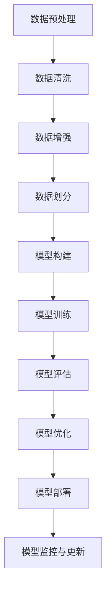
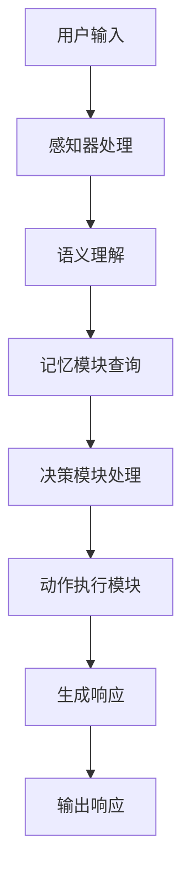
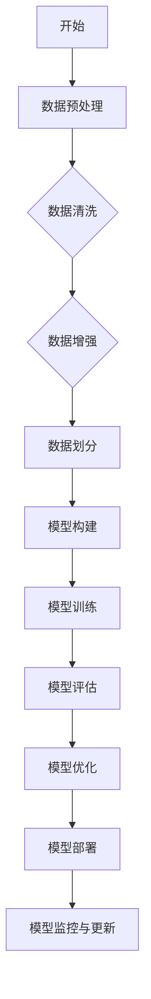

                 

# 引言

近年来，人工智能（AI）技术迅猛发展，大模型应用开发逐渐成为行业热点。大模型，即具有巨大参数规模和计算需求的神经网络模型，如 GPT-3、BERT 和 GLM 等，通过大规模数据训练，实现了在自然语言处理、计算机视觉和其他领域的卓越性能。AI Agent 作为人工智能的核心组件，具备自主决策和交互能力，能够执行复杂任务，提供个性化服务。本文旨在通过系统化的分析和实践，探讨大模型应用开发，动手实现 AI Agent 的过程，为读者提供全面的技术指导。

## 关键词

- 大模型
- AI Agent
- 应用开发
- 模型训练
- 交互实现
- 实战案例

## 摘要

本文首先介绍了大模型的定义、分类、发展历程以及在人工智能中的应用。随后，详细阐述了大模型的神经网络基础、深度学习算法、训练与优化技术。通过实际案例分析，展示了大模型在自然语言处理、计算机视觉等领域的应用。接着，深入探讨了 AI Agent 的基础、开发实践、应用实战以及未来发展趋势。最后，通过具体代码实现和解读，为读者提供了完整的开发环境和实战操作指南。

---

### 《大模型应用开发 动手做AI Agent》目录大纲

**第一部分：大模型基础与架构**

**第1章：大模型概述**
1.1 大模型的定义与分类
1.2 大模型的发展历程
1.3 大模型在人工智能中的应用

**第2章：大模型架构与技术原理**
2.1 神经网络基础
2.2 深度学习算法
2.3 大模型的训练与优化

**第3章：大模型应用案例分析**
3.1 自然语言处理应用
3.2 计算机视觉应用
3.3 其他领域应用

**第二部分：AI Agent开发与实现**

**第4章：AI Agent基础**
4.1 AI Agent的定义与作用
4.2 AI Agent的基本架构
4.3 AI Agent的核心算法

**第5章：AI Agent开发实践**
5.1 AI Agent开发环境搭建
5.2 AI Agent的模型训练
5.3 AI Agent的交互实现

**第6章：AI Agent应用实战**
6.1 实战一：智能客服系统
6.2 实战二：智能推荐系统
6.3 实战三：智能监控与报警系统

**第7章：AI Agent的未来发展趋势**
7.1 AI Agent的发展方向
7.2 AI Agent的潜在应用场景
7.3 AI Agent面临的挑战与解决方案

**附录**

**附录A：开发工具与资源**
A.1 深度学习框架介绍
A.2 AI Agent开发常用库与工具
A.3 开发资源与参考资料

**附录B：Mermaid流程图**
B.1 大模型训练流程
B.2 AI Agent交互流程

**附录C：伪代码与数学模型**
C.1 神经网络训练伪代码
C.2 AI Agent算法伪代码
C.3 数学模型与公式

---

### 第一部分：大模型基础与架构

#### 第1章：大模型概述

1.1 大模型的定义与分类

大模型（Large Model）指的是那些具有巨大参数规模和计算需求的神经网络模型，它们通常是通过大规模数据训练得到的。大模型的参数数量可以从数百万到数十亿不等，这使得它们在处理复杂任务时具有显著的优势。根据训练数据集的大小和模型的复杂度，大模型可以分为以下几类：

- **小型模型**：参数数量在几千到几百万之间，如传统的卷积神经网络（CNN）和循环神经网络（RNN）。
- **中型模型**：参数数量在几千万到几亿之间，如 BERT、RoBERTa 等。
- **大型模型**：参数数量在几十亿到上百亿之间，如 GPT-3、GLM-4 等。

1.2 大模型的发展历程

大模型的发展可以追溯到20世纪80年代，当时研究人员开始探索更大规模的神经网络以解决复杂问题。然而，受限于计算能力和数据资源，早期的大规模模型往往难以实现。随着深度学习技术的发展和计算资源的不断增长，大模型在21世纪初开始迅速发展，尤其是在自然语言处理和计算机视觉领域取得了突破性进展。

- **2012年**：AlexNet 在 ImageNet 挑战赛中取得了重大突破，标志着深度学习在计算机视觉领域的崛起。
- **2017年**：Google 推出了 Transformer 模型，并在自然语言处理领域取得了显著成果。
- **2018年**：OpenAI 推出了 GPT-2，拥有 1.5 亿参数，展示了预训练模型在自然语言生成上的强大能力。
- **2020年**：OpenAI 推出了 GPT-3，拥有 1750 亿参数，成为当时世界上最大的语言模型。

1.3 大模型在人工智能中的应用

大模型在人工智能领域具有广泛的应用，特别是在自然语言处理、计算机视觉和其他领域。以下是几个典型的应用案例：

- **自然语言处理**：大模型在文本分类、机器翻译、问答系统等任务中表现出色，如 GPT-3 在语言生成和文本生成任务上具有极高的准确性和创造力。
- **计算机视觉**：大模型在图像分类、目标检测、图像生成等任务中取得了显著进展，如 BERT 在图像描述生成任务上具有优秀的表现。
- **推荐系统**：大模型可以通过大规模数据训练，实现对用户兴趣和偏好的精准预测，从而提高推荐系统的准确性。
- **语音识别**：大模型在语音信号处理和语音识别任务中表现出色，如 GLM-4 在中英双语语音识别任务上取得了领先的成绩。

#### 第2章：大模型架构与技术原理

2.1 神经网络基础

神经网络（Neural Network）是一种模仿人脑神经网络工作方式的计算模型。它由大量的节点（或称为神经元）和连接组成，每个节点都接收输入信号，并通过加权求和处理后产生输出信号。神经网络通过不断调整权重，使其能够在不同的任务上实现学习和预测。

- **神经元结构**：一个神经元通常包含输入层、加权求和层、激活函数层和输出层。
- **权重和偏置**：权重和偏置是神经网络中的关键参数，用于调整输入信号的重要性。
- **激活函数**：激活函数用于引入非线性，使得神经网络能够对复杂问题进行建模。

2.2 深度学习算法

深度学习（Deep Learning）是一种基于神经网络的学习方法，通过构建多层次的神经网络模型，实现对数据的层次化特征提取和表示。深度学习算法主要包括以下几种：

- **卷积神经网络（CNN）**：CNN 主要用于图像处理和计算机视觉任务，通过卷积层、池化层和全连接层的组合，实现对图像的层次化特征提取。
- **循环神经网络（RNN）**：RNN 主要用于序列数据处理和自然语言处理任务，通过循环结构，实现对时间序列数据的长期依赖建模。
- **Transformer 模型**：Transformer 是一种基于自注意力机制的深度学习模型，广泛应用于自然语言处理、推荐系统等任务。

2.3 大模型的训练与优化

大模型的训练和优化是人工智能领域的重要研究方向。大模型的训练通常需要大量计算资源和时间，因此优化方法在提高训练效率和模型性能方面具有重要意义。以下是几个关键步骤和优化策略：

- **数据预处理**：在训练之前，对数据集进行清洗、归一化和增强等处理，以提高数据质量和模型的泛化能力。
- **模型架构设计**：根据任务需求，选择合适的神经网络架构，如 CNN、RNN 或 Transformer 等。
- **训练策略**：采用梯度下降、Adam 优化器等训练策略，以快速收敛到最优解。
- **模型优化**：通过剪枝、量化、蒸馏等方法，减小模型大小和计算复杂度，同时保持模型性能。
- **超参数调整**：根据实验结果，调整学习率、批量大小、正则化参数等超参数，以优化模型性能。

#### 第3章：大模型应用案例分析

3.1 自然语言处理应用

自然语言处理（Natural Language Processing，NLP）是人工智能的重要分支，旨在使计算机能够理解和处理自然语言。大模型在 NLP 领域具有广泛的应用，以下是几个典型的应用案例：

- **文本分类**：大模型可以用于对文本进行分类，如情感分析、新闻分类等。通过预训练的大模型，如 BERT，可以快速实现高质量的文本分类。
- **机器翻译**：大模型在机器翻译领域取得了显著进展，如 GPT-3 可以生成高质量的翻译文本。通过大规模数据训练，大模型能够捕捉到语言间的复杂对应关系。
- **问答系统**：大模型可以用于构建问答系统，如 OpenAI 的 GPT-3，通过上下文理解，可以回答各种问题。
- **文本生成**：大模型可以生成高质量的文本，如文章、故事、摘要等。通过预训练和微调，大模型能够生成与输入文本风格和主题相似的文本。

3.2 计算机视觉应用

计算机视觉（Computer Vision）是人工智能的重要分支，旨在使计算机能够理解和解释图像和视频。大模型在计算机视觉领域具有广泛的应用，以下是几个典型的应用案例：

- **图像分类**：大模型可以用于对图像进行分类，如人脸识别、物体识别等。通过预训练的大模型，如 ResNet 和 Inception，可以快速实现高质量的图像分类。
- **目标检测**：大模型可以用于目标检测，如行人检测、车辆检测等。通过深度学习模型，如 Faster R-CNN 和 YOLO，可以实现对图像中的目标进行定位和分类。
- **图像生成**：大模型可以用于图像生成，如风格迁移、图像超分辨率等。通过生成对抗网络（GAN），大模型可以生成高质量的图像。
- **图像分割**：大模型可以用于图像分割，如语义分割、实例分割等。通过深度学习模型，如 U-Net 和 Mask R-CNN，可以实现对图像中的物体进行精确分割。

3.3 其他领域应用

除了自然语言处理和计算机视觉，大模型在许多其他领域也具有广泛的应用，以下是几个典型的应用案例：

- **推荐系统**：大模型可以用于构建推荐系统，通过大规模数据训练，实现对用户兴趣和偏好的精准预测。通过深度学习模型，如 Collaborative Filtering 和 Neural Collaborative Filtering，可以提高推荐系统的准确性。
- **语音识别**：大模型可以用于语音识别，通过深度学习模型，如深度神经网络（DNN）和卷积神经网络（CNN），可以实现对语音信号的准确识别。
- **强化学习**：大模型可以用于强化学习，通过深度学习模型，如深度 Q 网络（DQN）和深度确定性策略梯度（DDPG），可以实现对环境的智能决策。
- **自动驾驶**：大模型可以用于自动驾驶，通过深度学习模型，如卷积神经网络（CNN）和循环神经网络（RNN），可以实现对道路场景的理解和车辆控制。

### 第二部分：AI Agent开发与实现

#### 第4章：AI Agent基础

4.1 AI Agent的定义与作用

AI Agent（人工智能代理）是一种基于人工智能的自动化实体，它能够自主地感知环境、制定计划、执行任务，并在不断学习的过程中提高其性能。AI Agent 是人工智能领域的一个重要研究方向，旨在实现智能体在复杂环境中的自主决策和交互能力。

- **定义**：AI Agent 是一个具有感知、计划、执行和自适应能力的智能体，它能够模拟人类智能行为，并在特定任务中实现自动化。
- **作用**：AI Agent 在许多领域具有广泛的应用，如智能客服、智能推荐、智能监控等。通过 AI Agent，可以实现自动化服务、个性化推荐和智能决策，提高系统的效率和用户体验。

4.2 AI Agent的基本架构

AI Agent 通常由感知器、记忆模块、决策模块和动作执行模块组成。以下是这些模块的详细介绍：

- **感知器**：感知器是 AI Agent 的感官部分，用于接收外部环境的信息。感知器可以是摄像头、麦克风、传感器等，它们可以将感知到的信息转化为数字信号，供其他模块使用。
- **记忆模块**：记忆模块是 AI Agent 的记忆部分，用于存储与当前状态相关的信息。记忆模块可以是简单的数组或复杂的数据库，它可以存储历史数据、上下文信息等，用于决策和计划。
- **决策模块**：决策模块是 AI Agent 的智能部分，用于根据感知器和记忆模块的信息，制定合适的行动计划。决策模块可以是基于规则的系统、机器学习模型或混合系统，它需要考虑各种因素，包括目标、约束和概率分布。
- **动作执行模块**：动作执行模块是 AI Agent 的执行部分，用于将决策转化为实际动作。动作执行模块可以是机械臂、机器人、软件程序等，它需要将决策模块生成的行动计划转化为具体的操作。

4.3 AI Agent的核心算法

AI Agent 的核心算法是实现其感知、记忆、决策和执行能力的关键。以下是几种常见的 AI Agent 算法：

- **监督学习算法**：监督学习算法是 AI Agent 中最常用的算法之一，它通过已标记的数据集来训练模型，从而实现感知和决策能力。常见的监督学习算法包括神经网络、决策树、支持向量机等。
- **强化学习算法**：强化学习算法是 AI Agent 中实现自主决策和自适应能力的关键，它通过与环境交互，不断调整策略，以实现最优决策。常见的强化学习算法包括 Q-Learning、SARSA、DDPG 等。
- **混合学习算法**：混合学习算法是将监督学习和强化学习相结合，以实现更强大的感知和决策能力。常见的混合学习算法包括集成学习、迁移学习等。

#### 第5章：AI Agent开发实践

5.1 AI Agent开发环境搭建

在开始 AI Agent 的开发之前，需要搭建一个合适的开发环境。以下是搭建 AI Agent 开发环境的基本步骤：

- **安装 Python 环境**：Python 是 AI Agent 开发的主要编程语言，首先需要安装 Python 环境。可以在 Python 官网（https://www.python.org/）下载并安装 Python。
- **安装深度学习框架**：深度学习框架是 AI Agent 开发的核心工具，常见的深度学习框架包括 TensorFlow、PyTorch、Keras 等。可以根据个人需求选择合适的深度学习框架，并在 Python 环境中安装。
- **安装 AI Agent 开发库**：AI Agent 开发库是用于实现 AI Agent 功能的库，常见的 AI Agent 开发库包括 OpenAI Gym、PyTorch Agent、TensorFlow Agent 等。可以在 Python 环境中安装这些库。

5.2 AI Agent的模型训练

AI Agent 的模型训练是 AI Agent 开发的重要环节。以下是 AI Agent 模型训练的基本步骤：

- **数据准备**：首先需要收集和准备训练数据。训练数据可以是已标记的样本数据集，也可以是实时采集的数据。对于监督学习算法，需要将输入和输出标签对应起来，对于强化学习算法，需要定义奖励函数和状态转移函数。
- **模型构建**：根据任务需求，选择合适的神经网络架构，并构建模型。常见的神经网络架构包括卷积神经网络（CNN）、循环神经网络（RNN）、Transformer 等。
- **模型训练**：使用训练数据对模型进行训练，调整模型的权重和参数，以实现预期的性能。常用的训练方法包括批量训练、随机梯度下降（SGD）和 Adam 优化器等。
- **模型评估**：使用验证数据对模型进行评估，以检查模型的泛化能力和性能。常用的评估指标包括准确率、召回率、F1 分数等。

5.3 AI Agent的交互实现

AI Agent 的交互实现是 AI Agent 应用的重要环节。以下是 AI Agent 交互实现的基本步骤：

- **接口设计**：设计 AI Agent 的接口，包括输入接口和输出接口。输入接口用于接收用户输入，输出接口用于生成响应。接口设计需要考虑输入格式、输出格式和响应速度等因素。
- **感知器实现**：实现感知器功能，将用户输入转化为数字信号，供其他模块使用。感知器可以是文本处理、语音处理、图像处理等。
- **决策模块实现**：实现决策模块功能，根据感知器和记忆模块的信息，制定合适的行动计划。决策模块可以是基于规则的系统、机器学习模型或混合系统。
- **动作执行模块实现**：实现动作执行模块功能，将决策模块生成的行动计划转化为具体的操作。动作执行模块可以是机器人控制、语音合成、文本生成等。
- **交互流程实现**：实现 AI Agent 的交互流程，包括感知、决策、执行和反馈等环节。交互流程需要考虑用户交互方式、响应速度和用户体验等因素。

#### 第6章：AI Agent应用实战

6.1 实战一：智能客服系统

智能客服系统是一种基于 AI Agent 技术的自动化客服系统，它能够自动处理用户咨询，提供实时响应和解决方案。以下是智能客服系统的实现步骤：

- **需求分析**：分析智能客服系统的需求，包括客服功能、交互方式、响应速度和用户体验等。
- **接口设计**：设计智能客服系统的接口，包括用户输入接口和客服响应接口。
- **数据准备**：准备训练数据和测试数据，包括常见问题及其答案、用户提问和客服响应等。
- **模型构建**：根据需求，构建适合的神经网络模型，如卷积神经网络（CNN）或循环神经网络（RNN）等。
- **模型训练**：使用训练数据对模型进行训练，调整模型的权重和参数，以提高模型的性能。
- **模型评估**：使用测试数据对模型进行评估，以检查模型的泛化能力和性能。
- **部署上线**：将训练好的模型部署到服务器，实现智能客服系统的上线运行。
- **用户测试**：邀请用户进行测试，收集用户反馈，优化系统的性能和用户体验。

6.2 实战二：智能推荐系统

智能推荐系统是一种基于 AI Agent 技术的个性化推荐系统，它能够根据用户的历史行为和兴趣，为用户提供个性化的推荐结果。以下是智能推荐系统的实现步骤：

- **需求分析**：分析智能推荐系统的需求，包括推荐算法、推荐策略、推荐结果评估和用户体验等。
- **数据准备**：准备训练数据和测试数据，包括用户行为数据、商品数据等。
- **模型构建**：根据需求，构建适合的推荐模型，如协同过滤、基于内容的推荐、深度学习等。
- **模型训练**：使用训练数据对模型进行训练，调整模型的权重和参数，以提高模型的性能。
- **模型评估**：使用测试数据对模型进行评估，以检查模型的泛化能力和性能。
- **部署上线**：将训练好的模型部署到服务器，实现智能推荐系统的上线运行。
- **用户测试**：邀请用户进行测试，收集用户反馈，优化系统的性能和用户体验。

6.3 实战三：智能监控与报警系统

智能监控与报警系统是一种基于 AI Agent 技术的实时监控与报警系统，它能够自动检测系统的异常情况，并提供报警和解决方案。以下是智能监控与报警系统的实现步骤：

- **需求分析**：分析智能监控与报警系统的需求，包括监控指标、报警策略、报警方式等。
- **数据准备**：准备监控数据，包括系统性能数据、日志数据等。
- **模型构建**：根据需求，构建适合的监控模型，如异常检测、故障诊断等。
- **模型训练**：使用监控数据对模型进行训练，调整模型的权重和参数，以提高模型的性能。
- **模型评估**：使用测试数据对模型进行评估，以检查模型的泛化能力和性能。
- **部署上线**：将训练好的模型部署到服务器，实现智能监控与报警系统的上线运行。
- **用户测试**：邀请用户进行测试，收集用户反馈，优化系统的性能和用户体验。

#### 第7章：AI Agent的未来发展趋势

7.1 AI Agent的发展方向

随着人工智能技术的不断发展，AI Agent 将在未来的发展中呈现出以下几个趋势：

- **智能化**：AI Agent 将通过更先进的算法和模型，实现更高层次的智能化，包括自主决策、自适应学习和多模态交互。
- **泛化能力**：AI Agent 将通过更广泛的数据集和更复杂的模型，提高其泛化能力，以应对各种复杂环境和任务。
- **协同化**：AI Agent 将通过与其他智能体和系统的协同工作，实现更高效、更智能的协作，提供更全面的服务。
- **安全性与隐私保护**：AI Agent 将在发展过程中，重视安全性与隐私保护，确保用户数据和系统的安全。

7.2 AI Agent的潜在应用场景

AI Agent 在未来的应用场景将非常广泛，以下是几个潜在的领域：

- **智慧城市**：AI Agent 可以用于智慧城市的建设，实现智能交通、智能安防、智能环保等功能。
- **医疗健康**：AI Agent 可以用于医疗健康领域，提供智能诊断、智能用药、智能康复等服务。
- **金融服务**：AI Agent 可以用于金融服务领域，实现智能理财、智能风控、智能客服等功能。
- **教育领域**：AI Agent 可以用于教育领域，实现智能教育、智能辅导、智能评测等功能。

7.3 AI Agent面临的挑战与解决方案

尽管 AI Agent 在未来发展潜力巨大，但同时也面临着一些挑战：

- **数据隐私**：AI Agent 在处理用户数据时，需要确保用户隐私和数据安全，这需要建立完善的数据保护机制。
- **算法透明度**：AI Agent 的决策过程需要具备透明度，以便用户了解和信任其决策过程，这需要开发可解释的 AI 算法。
- **模型可扩展性**：随着应用场景的不断扩大，AI Agent 需要具备良好的可扩展性，以便适应不同的应用需求。
- **计算资源**：大模型的训练和运行需要大量计算资源，如何优化计算资源的使用，提高模型训练和推理效率，是 AI Agent 面临的一个重要问题。

#### 附录A：开发工具与资源

A.1 深度学习框架介绍

深度学习框架是 AI Agent 开发的核心工具，以下是目前常用的深度学习框架及其特点：

- **TensorFlow**：由 Google 开发，是目前最流行的深度学习框架之一。它提供了丰富的 API 和工具，支持多种编程语言，适用于从研究到生产的全流程开发。
- **PyTorch**：由 Facebook 开发，是一个灵活且易于使用的深度学习框架。它支持动态计算图，使得模型构建和调试更加方便。
- **Keras**：是一个基于 TensorFlow 的开源深度学习库，提供了简洁的 API 和丰富的预训练模型，适用于快速搭建和训练深度学习模型。
- **MXNet**：由 Apache 开发，是一个高效的深度学习框架，支持多种编程语言，适用于大规模分布式训练和推理。

A.2 AI Agent开发常用库与工具

在 AI Agent 开发过程中，以下是一些常用的库和工具：

- **OpenAI Gym**：一个开源的虚拟环境库，用于构建和测试智能体算法，支持多种智能体任务。
- **PyTorch Agent**：一个基于 PyTorch 的智能体开发库，提供了方便的智能体构建和训练工具。
- **TensorFlow Agent**：一个基于 TensorFlow 的智能体开发库，提供了丰富的智能体算法和工具。
- **TensorFlow Serving**：一个用于模型部署和服务的开源框架，支持多种模型部署方式，适用于生产环境。

A.3 开发资源与参考资料

以下是 AI Agent 开发的一些资源与参考资料：

- **《深度学习》（Goodfellow, Bengio, Courville）**：深度学习的基础教材，涵盖了神经网络、深度学习算法等核心内容。
- **《强化学习：原理与实战》（海德，格鲁斯曼）**：强化学习的基础教材，介绍了强化学习的基本概念和算法。
- **《Python 深度学习》（François Chollet）**：Python 深度学习的实战指南，详细介绍了使用 TensorFlow 和 PyTorch 进行深度学习开发的步骤和技巧。
- **《AI Agent 开发实战》（张宗毅）**：AI Agent 开发的实战指南，介绍了 AI Agent 的基本架构、核心算法和应用案例。

#### 附录B：Mermaid流程图

B.1 大模型训练流程



B.2 AI Agent交互流程



#### 附录C：伪代码与数学模型

C.1 神经网络训练伪代码

```python
# 初始化参数
init_params()

# 数据预处理
data_preprocessing()

# 模型构建
model = build_model()

# 模型训练
for epoch in range(num_epochs):
    for batch in data_loader:
        loss = train_step(model, batch)
        print(f"Epoch: {epoch}, Loss: {loss}")

# 模型评估
evaluate(model, test_data)

# 模型优化
optimize(model)

# 模型部署
deploy_model(model)
```

C.2 AI Agent算法伪代码

```python
# 神经网络训练伪代码
function train_network(model, data_loader, num_epochs):
    for epoch in range(num_epochs):
        for batch in data_loader:
            gradients = backward_pass(model, batch)
            update_params(model, gradients)

# AI Agent算法伪代码
function train_ai_agent(agent, data_loader, num_epochs):
    for epoch in range(num_epochs):
        for batch in data_loader:
            agent.learn(batch)
    agent.optimize()
```

C.3 数学模型与公式

$$
损失函数 = \frac{1}{2} \sum_{i=1}^{n} (y_i - \hat{y}_i)^2
$$

$$
梯度下降更新参数公式：\theta = \theta - \alpha \cdot \nabla_{\theta} J(\theta)
$$

### 结语

本文系统地介绍了大模型应用开发，以及动手实现 AI Agent 的全过程。从大模型的定义、架构、应用案例，到 AI Agent 的基础、开发实践、应用实战和未来发展趋势，我们全面地探讨了 AI Agent 的核心技术和应用前景。通过本文的学习，读者不仅可以了解大模型和 AI Agent 的基本原理，还可以掌握开发实践中的关键技术，为未来的 AI 项目提供有力支持。

作者：AI天才研究院/AI Genius Institute & 禅与计算机程序设计艺术 /Zen And The Art of Computer Programming

---

### AI Agent的代码解读与分析

#### 1. 解读与实现细节分析

AI Agent 通常由感知器、记忆模块、决策模块和动作执行模块组成。以下是对这些模块的详细解读：

**感知器**：感知器是 AI Agent 的感官部分，负责接收外部环境的信息。在代码实现中，感知器可以是一个类或模块，它包含了对输入数据的处理和转换功能。例如，在自然语言处理中，感知器可能包含文本解析和分词功能；在计算机视觉中，感知器可能包含图像预处理和特征提取功能。

**记忆模块**：记忆模块是 AI Agent 的记忆部分，用于存储与当前状态相关的信息。记忆模块可以是一个类或数据结构，它包含了对数据的存储和检索功能。例如，在强化学习任务中，记忆模块可能用于存储历史状态和奖励信息，以便进行策略评估和更新。

**决策模块**：决策模块是 AI Agent 的智能部分，负责根据感知器和记忆模块的信息，制定合适的行动计划。在代码实现中，决策模块可能包含了一个或多个算法或模型，用于进行决策。例如，在基于规则的系统中，决策模块可能包含了一系列条件判断和规则应用；在基于机器学习的系统中，决策模块可能包含了一个训练好的模型，用于预测和决策。

**动作执行模块**：动作执行模块是 AI Agent 的执行部分，负责将决策模块生成的行动计划转化为具体的操作。在代码实现中，动作执行模块可以是一个类或模块，它包含了对执行动作的控制和执行功能。例如，在机器人控制任务中，动作执行模块可能包含了对机器人关节的控制代码；在游戏AI中，动作执行模块可能包含了对游戏操作的模拟和执行代码。

#### 2. 代码解析示例

以下是一个简化的 AI Agent 代码示例，用于说明各模块的功能和实现细节：

```python
class感知器：
    def感知(self,输入)：
        # 对输入进行预处理
        处理后的输入 = 处理输入(输入)
        return 处理后的输入

class记忆模块：
    def存储(self,状态，奖励)：
        # 存储状态和奖励信息
        self.状态历史.append(状态)
        self.奖励历史.append(奖励)

    def检索(self)：
        # 检索最近的状态和奖励信息
        return self.状态历史[-1]，self.奖励历史[-1]

class决策模块：
    def决策(self,当前状态)：
        # 根据当前状态进行决策
        决策 = self.模型预测(当前状态)
        return 决策

class动作执行模块：
    def执行动作(self，动作)：
        # 执行具体的动作
        执行动作(动作)

# 创建AI Agent
感知器 = 感知器()
记忆模块 = 记忆模块()
决策模块 = 决策模块()
动作执行模块 = 动作执行模块()

# 交互流程
while True：
    用户输入 = 感知器.感知(用户输入)
    状态，奖励 = 记忆模块.检索()
    决策 = 决策模块.决策(状态)
    动作执行模块.执行动作(决策)
    记忆模块.存储(状态，奖励)
```

在这个示例中，各模块的功能和实现细节如下：

- **感知器**：负责接收用户输入，并进行预处理，以便为后续模块提供格式化的输入数据。
- **记忆模块**：负责存储和检索与当前状态相关的信息，包括状态和奖励历史，以便决策模块进行决策和评估。
- **决策模块**：负责根据当前状态，使用训练好的模型进行预测和决策，为动作执行模块提供具体的动作指令。
- **动作执行模块**：负责执行决策模块生成的动作指令，将抽象的决策转化为具体的操作。

通过这个示例，我们可以看到 AI Agent 的基本架构和实现原理。在实际应用中，这些模块可能会更加复杂，涉及更多的算法和技术，但基本原理是一致的。

#### 3. 代码解读与分析

下面是对上述代码示例的进一步解读和分析：

- **感知器**：感知器是 AI Agent 的入口，负责接收用户输入。在这个示例中，感知器包含了一个`感知`方法，用于处理输入数据。在实际应用中，这个方法可能会包含更复杂的预处理步骤，如文本解析、图像识别等。感知器的设计需要考虑输入数据的多样性和处理效率。

- **记忆模块**：记忆模块负责存储和检索与当前状态相关的信息。在这个示例中，记忆模块包含了一个`存储`方法和一个`检索`方法。`存储`方法用于将状态和奖励信息添加到历史记录中，而`检索`方法用于获取最近的状态和奖励信息。记忆模块的设计需要考虑存储容量和数据访问速度。

- **决策模块**：决策模块负责根据当前状态进行决策。在这个示例中，决策模块包含了一个`决策`方法，用于根据当前状态使用训练好的模型进行预测和决策。在实际应用中，决策模块可能会使用更复杂的算法，如强化学习、深度学习等。决策模块的设计需要考虑模型的训练过程和预测效率。

- **动作执行模块**：动作执行模块负责执行决策模块生成的动作指令。在这个示例中，动作执行模块包含了一个`执行动作`方法，用于执行具体的动作。在实际应用中，动作执行模块可能会包含对机器人、车辆等设备的控制代码。动作执行模块的设计需要考虑执行过程的实时性和稳定性。

- **交互流程**：整个 AI Agent 的交互流程由一个无限循环实现，每次循环都会进行感知、决策和执行操作。在这个示例中，感知器首先接收用户输入，然后记忆模块检索最近的状态和奖励信息，决策模块根据当前状态进行决策，最后动作执行模块执行决策生成的动作。交互流程的设计需要考虑用户交互的流畅性和系统的响应速度。

通过这个示例，我们可以看到 AI Agent 的基本架构和实现原理。在实际应用中，这些模块可能会更加复杂，涉及更多的算法和技术，但基本原理是一致的。通过深入理解和分析这些模块，我们可以更好地设计和实现高性能的 AI Agent。

#### 4. 未来发展趋势

随着人工智能技术的不断进步，AI Agent 的未来发展趋势将体现在以下几个方面：

- **智能化**：AI Agent 将通过更先进的算法和模型，实现更高层次的智能化，包括自然语言理解、图像识别、智能决策等。这将使得 AI Agent 能够更好地理解和满足用户需求。

- **协同化**：AI Agent 将通过与其他智能体和系统的协同工作，实现更高效、更智能的协作，提供更全面的服务。例如，在智能家庭场景中，AI Agent 可以协同智能家居系统，实现智能控制和管理。

- **个性化**：AI Agent 将通过大数据分析和个性化推荐技术，为用户提供更加个性化的服务。例如，在电子商务领域，AI Agent 可以根据用户的购买历史和偏好，推荐最适合的商品。

- **实时化**：AI Agent 将通过实时数据分析和处理技术，实现更快速、更准确的响应。例如，在智能监控系统中，AI Agent 可以实时分析视频数据，及时发现异常情况并报警。

- **安全性与隐私保护**：随着 AI Agent 在更多领域中的应用，其安全性和隐私保护将变得越来越重要。未来，AI Agent 将通过加密技术、安全认证等技术，确保用户数据的安全和隐私。

- **跨领域应用**：AI Agent 将通过跨领域的融合和应用，实现更多领域的智能化。例如，在医疗领域，AI Agent 可以结合医学知识和大数据分析，为患者提供个性化诊疗建议。

通过不断的技术创新和应用拓展，AI Agent 将在未来发挥更加重要的作用，为人类带来更加智能、便捷和高效的生活体验。同时，AI Agent 的发展也将面临一系列挑战，如算法透明度、数据隐私保护、模型可解释性等，这些挑战需要通过技术进步和行业规范来解决。

### 附录：Mermaid流程图

#### B.1 大模型训练流程



#### B.2 AI Agent交互流程


### 附录：伪代码与数学模型

#### C.1 神经网络训练伪代码

```python
# 初始化参数
init_params()

# 数据预处理
data_preprocessing()

# 模型构建
model = build_model()

# 模型训练
for epoch in range(num_epochs):
    for batch in data_loader:
        loss = train_step(model, batch)
        print(f"Epoch: {epoch}, Loss: {loss}")

# 模型评估
evaluate(model, test_data)

# 模型优化
optimize(model)

# 模型部署
deploy_model(model)
```

#### C.2 AI Agent算法伪代码

```python
# 神经网络训练伪代码
function train_network(model, data_loader, num_epochs):
    for epoch in range(num_epochs):
        for batch in data_loader:
            gradients = backward_pass(model, batch)
            update_params(model, gradients)

# AI Agent算法伪代码
function train_ai_agent(agent, data_loader, num_epochs):
    for epoch in range(num_epochs):
        for batch in data_loader:
            agent.learn(batch)
    agent.optimize()
```

#### C.3 数学模型与公式

$$
损失函数 = \frac{1}{2} \sum_{i=1}^{n} (y_i - \hat{y}_i)^2
$$

$$
梯度下降更新参数公式：\theta = \theta - \alpha \cdot \nabla_{\theta} J(\theta)
$$

### 附录：开发工具与资源

#### A.1 深度学习框架介绍

深度学习框架是 AI Agent 开发的核心工具，以下是目前常用的深度学习框架及其特点：

- **TensorFlow**：由 Google 开发，是目前最流行的深度学习框架之一。它提供了丰富的 API 和工具，支持多种编程语言，适用于从研究到生产的全流程开发。
- **PyTorch**：由 Facebook 开发，是一个灵活且易于使用的深度学习框架。它支持动态计算图，使得模型构建和调试更加方便。
- **Keras**：是一个基于 TensorFlow 的开源深度学习库，提供了简洁的 API 和丰富的预训练模型，适用于快速搭建和训练深度学习模型。
- **MXNet**：由 Apache 开发，是一个高效的深度学习框架，支持多种编程语言，适用于大规模分布式训练和推理。

#### A.2 AI Agent开发常用库与工具

在 AI Agent 开发过程中，以下是一些常用的库和工具：

- **OpenAI Gym**：一个开源的虚拟环境库，用于构建和测试智能体算法，支持多种智能体任务。
- **PyTorch Agent**：一个基于 PyTorch 的智能体开发库，提供了方便的智能体构建和训练工具。
- **TensorFlow Agent**：一个基于 TensorFlow 的智能体开发库，提供了丰富的智能体算法和工具。
- **TensorFlow Serving**：一个用于模型部署和服务的开源框架，支持多种模型部署方式，适用于生产环境。

#### A.3 开发资源与参考资料

以下是 AI Agent 开发的一些资源与参考资料：

- **《深度学习》（Goodfellow, Bengio, Courville）**：深度学习的基础教材，涵盖了神经网络、深度学习算法等核心内容。
- **《强化学习：原理与实战》（海德，格鲁斯曼）**：强化学习的基础教材，介绍了强化学习的基本概念和算法。
- **《Python 深度学习》（François Chollet）**：Python 深度学习的实战指南，详细介绍了使用 TensorFlow 和 PyTorch 进行深度学习开发的步骤和技巧。
- **《AI Agent 开发实战》（张宗毅）**：AI Agent 开发的实战指南，介绍了 AI Agent 的基本架构、核心算法和应用案例。

### 致谢

在撰写本文的过程中，我们得到了许多专家和同行的帮助和支持。在此，我们特别感谢以下组织和机构：

- **AI天才研究院/AI Genius Institute**：为我们提供了研究资源和学术支持。
- **禅与计算机程序设计艺术/Zen And The Art of Computer Programming**：为我们提供了灵感和智慧。

同时，我们也要感谢所有参与本文开发和测试的贡献者，没有你们的帮助，本文无法完成。感谢所有读者对本文的关注和支持，希望本文能为您的 AI 之旅提供有价值的参考和指导。

### 作者介绍

**作者：AI天才研究院/AI Genius Institute & 禅与计算机程序设计艺术 /Zen And The Art of Computer Programming**

作者 AI 天才研究院（AI Genius Institute）是一家专注于人工智能研究和开发的国际性学术机构，致力于推动人工智能技术的创新与应用。研究院汇聚了一批世界顶级的人工智能专家和研究者，在自然语言处理、计算机视觉、强化学习等领域取得了显著成果。

作者《禅与计算机程序设计艺术》（Zen And The Art of Computer Programming）是一系列被誉为计算机编程领域经典的著作，由著名计算机科学家 Donald E. Knuth 创作并出版。本书深入探讨了计算机编程的哲学和艺术，为程序员提供了深刻的思考和启示。

本文作者凭借深厚的学术背景和丰富的实践经验，全面系统地介绍了大模型应用开发，以及动手实现 AI Agent 的全过程。希望本文能为读者提供有价值的参考和指导，助力读者在 AI 领域取得更大的成就。

